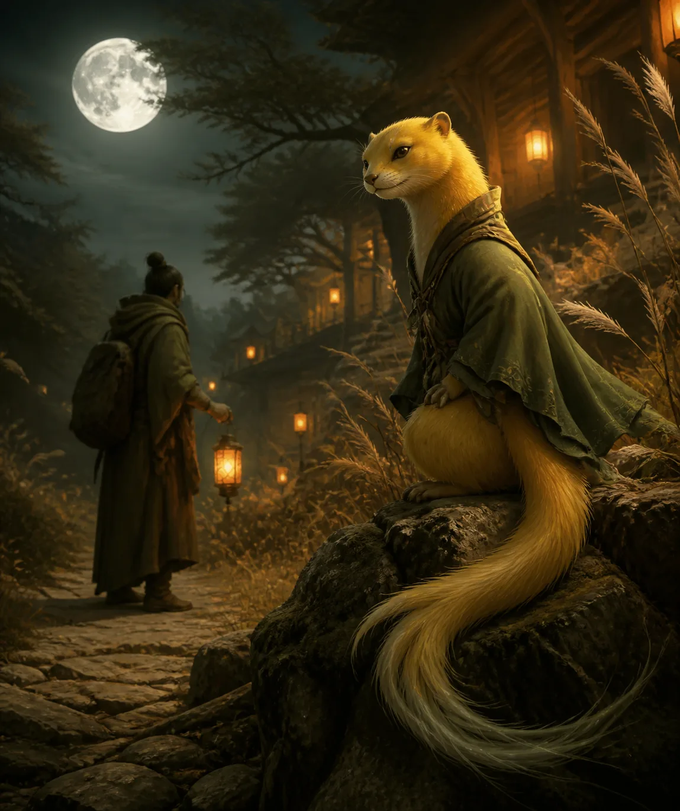

## 黄仙的原型与地位

在“胡黄白柳灰”五大家族中，**黄仙排行第二**，地位很高。黄仙的原型就是大家熟悉的黄鼠狼，属于**鼬科动物**，民间通常称其为“黄大仙”。

很多修行人会发现，黄仙的数量非常多，遇到一些事情时，经常会碰到黄仙。原因在于黄仙的本体很有灵性：用现代的话来说，就是它的肉身“代码”、自身基因，天生很适合修行和通灵。

如果没有通灵，比如一些家庭或养殖场圈养、专门用于获取皮毛的黄鼠狼，或者它本身生在资源匮乏、灵气贫瘠的山林里，就可能无法突破肉身限制，只能活到这一种族原本的寿限，大约是 **5至15年**。

## 肉身寿限与“电量”比喻

每个种族都有自身的寿限，人类也不例外。人类的寿限大概是一百二十多岁，可以把它理解成手机的电量：

> 人在小时候拥有接近百分之百的初始电量。如果天生没有什么劫，理论上就能走到自身寿限的终点。

但如果平时“后台运行”的 App 太多，这个 App 开一点，那个 App 也开一点，电量就会消耗得很快。人的欲望过多，或者把大量精力用在健身、打游戏等各种事情上，也都会“耗电”。耗电之后，如果不通过打坐、内炼等方式补充，电量就会不断下降，最终可能无法活到原本的寿限。

黄鼠狼大约十五年的寿限，其实与猫狗差不多。不过猫的肉身寿限更高一些，大概可以达到二十七岁左右。

## 百年修行与毛色变化

如果黄仙已经通灵，本身先天资源很好，又出生在大家族中，有家族长老传授功法，同时所在的山林、洞天灵气充足，它就可能持续修行到一百年。

一百年之后，它体内的“丹”会逐渐发生变化，修为也会随之提升，同时毛发颜色和花纹也可能产生变化。狐仙的修为常通过尾巴数量体现，而黄仙主要看**皮毛的颜色、光泽与特殊纹路**：

1. **普通阶段**：皮毛多为浅黄色。
2. **修为渐深**：皮毛会逐渐变得金黄耀眼，并带有明显光泽。
3. **由地仙修到上方仙**：毛色可能转为带有金属光泽的白色或银白色。
4. **更特殊的表现**：毛发中可能夹杂黑色纹路，头部也可能出现特殊斑纹。

这些外在特征，可以作为判断黄仙修为高低的一种方式。

# 三灾九难与雷劫化形

## 五百年雷劫

无论动物修行还是人类修行，都会经历所谓的**三灾九难**。一般来说，动物修行到五百年左右，会经历一次与化形有关的雷劫。化形之劫比普通劫难更难度过，通常要面对雷劫。

有些动物很聪明，无论黄仙、狐仙还是其他仙家，在雷劫到来时，都可能躲进树洞或藏到树干底下，借助树木抵挡雷击。这和一些修为较高的仙家利用法宝、阵法抵挡雷劫，本质上是同一个道理。

## 雷击木的形成

雷部降雷时，并不知道外面有树木替仙家挡灾。树木本身没有这场劫，却因帮助仙家承受雷击而变成**雷击木**。

如果一棵树遭到雷劫劈击后没有死亡，依然保持生机，那么这种活着的雷击木才是最上层、真正难得的雷击木。

# 黄仙的性格与行事方式

## 讲义气、守信用，也非常记仇

黄仙非常讲义气，同时也很记仇。只要答应了别人一件事，就一定会尽力办成；但如果别人答应它的事情没有做到，它也可能找上门来，严重时甚至会反目成仇，具体取决于事情的大小。

它们说到做到，十分守信，一般不会故意欺骗别人。与人相比，它们虽然聪明，却没有那么多弯弯绕绕的小心思，性格反而更加率真。

黄仙做事也很心急，往往是马不停蹄、一刻都不愿歇。一旦确定了目标，就会立刻行动，很少拖延，行事相当果断。

## 对恩情极为看重

五大家族之中，黄家对“报恩”尤其看重。平时大家听得较多的可能是胡家报恩，但实际上，黄家同样极其重视恩情，这与它们讲义气、守承诺的性格有关。

- 你对它好，它会想方设法地回报你。
- 你若对它不好，它也可能立刻报复，甚至加倍奉还。

这种*恩怨分明*的特点，在黄仙身上表现得非常明显。

# 黄家的家族分支与地域分布

## 家族庞大而团结

黄仙的原型繁殖能力较强，因此黄家整体规模很大，内部也有许多分支。不过，它们基本上都以“黄”为姓，一些上方仙家同样姓黄。

在人间一些仙山及其对应的灵界、法界中，都有黄家的分支或分脉，例如：

- **太行山一脉**
- **祁连山一脉**
- **太白山、昆仑山一带**
- **青城山一脉**
- **五台山分脉**

如果身边接触到黄仙，也可以与它沟通，询问它来自哪座山、属于哪一支脉，这一点很有意思。

# 黄仙擅长的术法与能力

## 阵法、幻术与变化之术

黄仙首先很擅长阵法，其中包括：

- 幻术
- 变化之术
- 迷魂阵
- 其他与迷惑、影像相关的术法

看过《火影忍者》的人，可能会觉得这个设定有些重叠。宇智波鼬擅长幻术，而黄仙本身也是“鼬”，算是一个很巧的梗。

一些年龄较小、修行大约一两百年的黄仙，可能会有些爱吹嘘。它与人聊天时，可能会声称自己是某位非常厉害的神仙。如果不了解它们的秉性，就容易信以为真，觉得自己身边跟着一位了不得的存在。久而久之，人可能变得非常“中二”，甚至有些魔怔。

黄仙的变化之术确实很厉害。它们可以让人看到某些影像、听到某些声音，甚至与人印象中的某位高位神仙一模一样，但这些也可能只是它们变化出来的。如果遇到与自己有仇的黄仙，对方也可能通过某些方法，让人的脑海里出现不好的内容。

## 招财与经商

黄仙非常擅长**招财**。它们在法界乃至六道之中都有经商活动，而且黄家的经商模式往往是整个家族共同参与。黄家内部十分团结，基本不会出现明显的内斗，遇事讲究“一方有难，八方支援”，因此很适合经商。

再加上黄仙头脑聪明、反应快、脑子转得也快，在招财方面往往信手拈来。放在五大家族里，黄仙的招财能力可以说是最猛的。

## 占卜与人情世故

黄仙的占卜、看卦能力也比较强，往往比较灵。由于它们家族庞大、内部团结，人脉也非常广，很懂人情世故。

修行者若想在各个仙山、仙界或法界办事，也需要懂得打点关系。比如到不同的仙山时，可以供奉一些好吃、好玩的东西，再化一些宝给当地仙家。把各地的人脉关系建立起来之后，再去不同地方办事，就会方便很多。

# 黄仙的修行瓶颈

## 易通灵，却难以继续精进

黄仙有一点常被忽略：它们虽然很容易通灵、化形，肉身也天生适合修行，但到了后期，想继续提升却非常困难。

根本原因仍然与肉身限制有关。黄仙自身的杂念比较多，很难克制肉身带来的想法与欲望。按照前面的“电量”比喻来说，杂念越多，耗电量就越大。因此，它们必须非常克制自己，才能继续修行。

如果无法约束自身，就很容易沉迷于吃喝玩乐，或者喜欢吹嘘自己，修为也会因此停滞。正因如此，真正修到上方的黄仙并不多见，甚至可以说很难遇到。

大部分黄仙仍属于以下两类：

- **地仙**：肉身还留在人间，以肉身状态继续修行。
- **鬼仙或九幽一类**：脱离原本肉身，以另一种状态存在。
