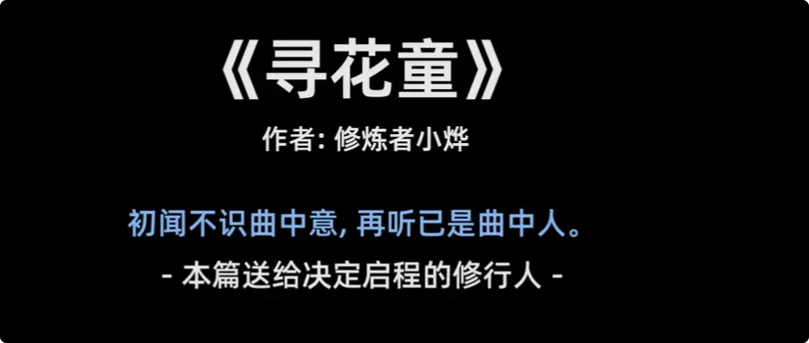
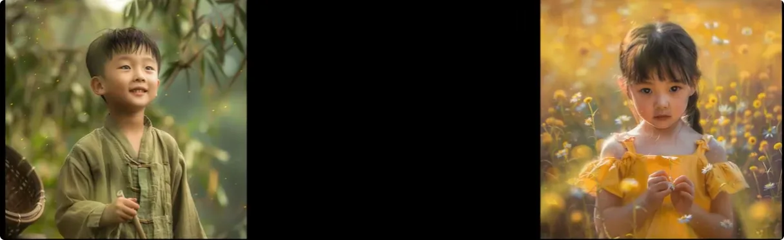
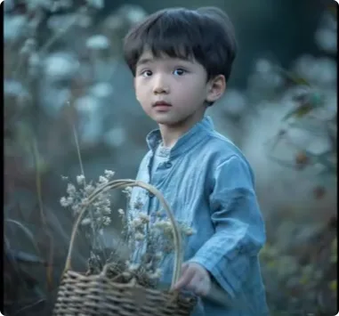
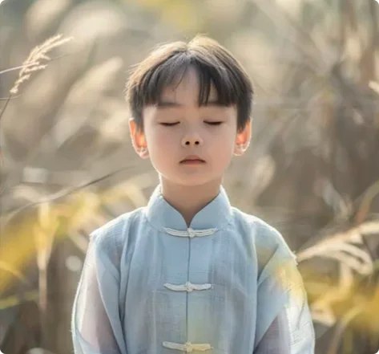
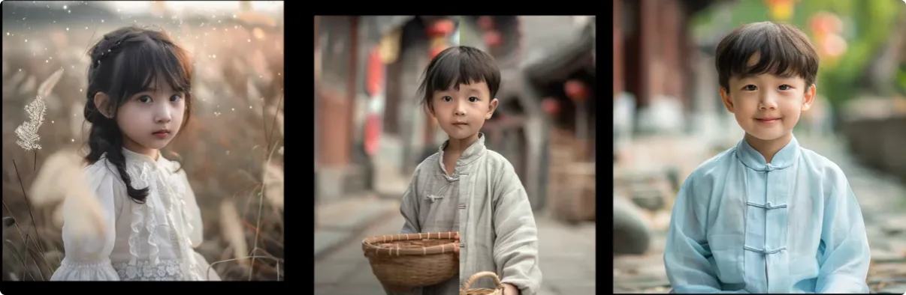

> _**真正的机缘，不只是“遇见”那么简单。进来是缘，留下也是缘；得到之后还能不能守住本心，才是真正的考验。**_

## 1. 寻花无门：世人都在找“仙花”，却没人知道它真正的模样

相传有一种花，吃掉它，身体可以健康长寿，也可以使人变聪明，甚至能帮人褪去一身寒气。这种花被称作**仙花**。

但是传说终究是传说，绝大部分人都没见过这花长什么样子。不过仙花闻名遐迩，自古寻它的人很多。因为八方四处寻无门道，只见世人都把姿态高雅的花当作仙花，甚至外表越发光鲜亮丽，就越相信此花非同凡品。

谁也不知道什么是仙花，但很多人觉得，仙花就应该长在高处或者深处，于是越来越多的人去山顶或深山里找去了。

### 集市上的童子：真正的机缘，看起来却如此普通

这天，一位寻花童正路过集市。他背上一箩筐，手拿一本古籍，瞧这架势，铁定是去找仙花去了。

忽有一童子向他喊话：

> “嘿，那边那位，您想不想寻仙花？”

寻花童找着了声音的来源，是一个孩童。这童子乍一看，和普通家的孩子别无二样。

寻花童一听“仙花”二字，心动不已，道：

> “这确实是我想要的，但何为仙花，你可知道？”

童子说：

> “你随我来，我带你看看什么是仙花。”

童子把寻花童带到一处花园，不知采用了何种方法，寻花童好像感觉到了什么。虽不明显，但好像有什么东西钻进了他的身子里，让他眼神忽地明亮。

童子问道：

> “你有何感觉？”

寻花童答：

> “略有。虽有些微妙，但我相信绝非凡品。”

童子笑了笑：

> “你若觉得可以，明天再带你找一朵。”

说罢，童子转身离开了。

---

## 2. 三朵仙花：从什么都看不见，到真正一睹仙花真容

### 第一次只是微妙，第二次已经能清楚感觉

次日，寻花童准时来到了相约的地方。这一次，童子又带他来到了一处花园，用同样的方法，寻花童又体验了一次。

不过这一次，他感觉明显了许多。

**一股精气神十足的暖流涌入了体内。**

童子问：

> “你有何感觉？”

寻花童答：

> “更明显了。虽然我还是很懵懂，但确信这正是我想要的。”

童子只是笑了笑。他知道，困扰在寻花童头上的迷雾正在消散。

童子告诉他：

> “如果你觉得不错，明日再来。”

说罢，童子转身离开了。

### 第三朵仙花，终于让他真正“看见”

次日，寻花童更早地来到了相约的地方。

只见童子带他来到了第三处花园，再次使出了方法。不过这一次，寻花童确实看见了。

虽若隐若现，但他确信：

> **眼前的就是仙花。**

就在他的脚下，一朵圣洁的仙花生长在此处，散发着淡淡的白色光辉。随后仙花化开，如一团气流钻进了他的体内，温暖的感觉包围了他，他的灵魂深处感受到了一种明晰的力量。

> _**“我看见了，我感受到了！”**_

寻花童喜出望外。

> “原来这就是我苦苦寻找的仙花啊！”

童子依旧笑了笑，给他答疑解惑：

> “世人笃信名气和外表，却不知仙花并非凡品，岂是能由凡人五官评说？看不得见仙花真面目，也怪不得仙花无情。”
> 
> “前后共用了三朵仙花，才褪去些许你的凡尘五感，加上花与花之间气息共鸣，所以你才有了感觉，得以一睹仙花真容。”
> 
> “如果你真有心寻花，可以随我来，我懂些许门道。”

寻花童感激不已。他心想，这一定是平日苦苦寻花的心意打动了仙人，才得此机缘。

寻花童对童子道：

> _**“我感激不尽，定会好好珍惜，还请你不吝赐教。”**_

随后，寻花童便随童子学艺。

---

## 3. 入园之后：真正的考验，从“仙花不能白拿”才正式开始

### 小一、小二与第一个后来者

有一晚，花园的主人问童子：

> “此人学得如何？”

童子道：

> “尚可。”

园主回：

> “那便继续带带他吧。过些时日，你俩可以一同出行了。既然入了本园，你叫小一，他便叫小二，以后的寻花童都这么称呼吧。”

小一不求回报，在他的悉心教导下，过了一些时日，小二凭借不错的技艺，已经可以独自寻找仙花了。

小一对小二说：

> “你已经学会本事，随我去趟集市吧。这集市里的寻花童肯定也多，若有缘的，可以指条路。”

来到集市，他们果真又遇见了一位苦苦寻花的童子。

这位童子衣衫褴褛，却是一心一意寻花之人。得知眼前两位知晓仙花的真容，扑通一声跪下，请求两位提点。

他说他找这条路太久，有着十分的诚意，除此以外，他哪儿也不去。
小一听闻有些感动，心想此人应当不差，便道：

> “你随我来吧。”

于是，小三和小二一样，得到了小一的悉心教导。

### 园主第一次立下规矩：拿了仙花，就要承担仙花原本承担的事情

一边是小二、小三的感激之情，一边是小一的善念之心。

这天，花园的主人又找来了小一。

园主说：

> “这两人已经学艺多时，这园子也被薅秃了不少。可这仙花生长千年万年，大地上的生灵都要依赖它才能存活，岂能由一两个人就独吞了这些仙花？”
> 
> “你叫那两人去花些银子、花些精力，把这园子打理打理。该施肥的施肥，该修缮的修缮。”
> 
> “仙花他们拿走了，可这仙花该干的事情，得由他们去干，否则岂不乱了自然生衰的规矩？”
> 
> “你别说这是我的意思。你先去问，且看他俩如何应答。”

小一叫来了小二和小三，说道：

> _**“这园子得打理，你俩要出点力。并且从今以后，这里的仙花，你俩都要拿等价的东西交换。以后的寻花童也是如此，仙花不能白拿，这应是自然的规矩。”**_

---

## 4. 小二、小三与小四：弱势时求机缘，强势后却开始反抗规则

### 小二、小三：一旦有了本事，就觉得机缘本来属于自己

小二和小三听闻，先是震惊，后大怒。

小二道：

> “岂有此理！这仙花生于自然，长于自然，乃是自然之物，寻见者自然有缘，岂是你小一说了算？”
> 
> “我过去采摘仙花，尚且无需付出一丝一毫的代价，今日仍有此番修为，此乃天意，是我过往寻花的诚意感动了仙人。这是我的机缘，与你毫无干系。”
> 
> “今日你却想阻拦我，装腔作势，替自然做起主来，你真是有违自然之道。”

小三也有自己的想法：

> “你应该知道，寻花童常常脱离尘世，或因困于尘世之苦，才心生寻花的想法。若寻花都有门槛，那像我这样的人岂非无缘寻花？日子岂不是一直苦下去？”
> 
> “自然悲悯，滋养万物，定会体谅我的难处。”

小三又对小二说：

> “你已有一身本事，不需要依赖小一了。这世间苦难的寻花童这么多，他不去指路，我们去便是。”
> 
> “况且我俩心胸最包容，谁有心要仙花，我们就给他，这才是真正的自然之道。”

随后，小二和小三愤慨地摔门而出。

### 园主：凡人弱势时会下跪，强势一分就开始厌恶约束

小一又气又委屈，来找园主诉苦。

园主说道：

> _**“你气愤，我还气愤呢。当初就说你不要轻易相信凡人，不要被情怀所困。”**_
> 
> _**“凡人嘴上说得多么诚意，到头来每个毛孔都只想着自己。这自然的规矩，愣是悟不明白。”**_
> 
> _**“他们弱势的时候，会坚决地下跪，给自己寻个出路；等他们强势一分，就不再享受外界约束，想做什么就全凭内心去了，还给自己找个义正言辞，心安理得。”**_

园主又道：

> “我看还不如花园里的那些笨鸟，得一分、安一分，不卑不亢。”
> 
> “我只需拿一点仙花，就足以让人间无恶不作的妖魔放下屠刀，安心随我修炼。仙花之可贵，阴阳众生皆知，这世间就数人不懂规矩。”

园主告诉小一，这次的亏要记着了，下次不能这么心软。

这些仙花本就不是小二、小三该得的。虽然花气无法再收回，但仍然是阴类众生修炼的绝佳资源。

> “这俩忘恩负义的家伙，我定会让归顺的妖魔去拿走他们身上的花气。”
> 
> “下次再遇到寻花童，就让他拿辛苦攒到的银子去换。让他知道，得到的东西等同于他的辛苦付出，否则人性是不会懂得何为来之不易。”

于是，从明日起，先立个规矩：

> **一个银子，换一朵仙花。**

### 小四：还没看见仙花，就先认定“正法不该明码标价”

这天，小一在街边唱起了仙花的故事。好些人来了听，听了又走，都不相信这般大点的童子会懂什么本事，更别提知道仙花的事了。

人群里只有一位寻花童，且称呼为**小四**。他听得好生起劲，忍不住上前询问：

> “我听了好一会儿，你说的话我觉得很有道理。请问哪里有仙花？我好去采摘，若能告知我，感激不尽。”

小一道：

> “我有。一个银子换一朵，要吗？”

小四先是一愣，后大笑：

> “笑死我了，正法怎会明码标价？切勿出来丢人现眼！”
> 
> “我都还没见着仙花的样子，你却敢伸手向我要银子？这庙会里的箱子尚且不强迫人投钱，你算哪门子体系，也敢出来吆喝？”

小一不语。
但这种骂法的人，今日已经见过多个。跟往日不同，他心中冷淡了许多，只想：

> **凡人一个，关我屁事。**

---

## 5. 小五与小六：聪明如果脱离脚下的路，也会变成另一种执念

小五和小六学艺已有些时日。

这天，小六私下和小五聊了起来：

> “你有没有想过，这仙花之主是谁呢？”

小六是个聪明人，心思缜密，爱思考大大小小的事情。

想当初两个银子换一次尝试，无论成功与否都不算亏。况且这次真让他找着了路，寻花的这些日子里，小六前思后想，把过去的很多疑惑都想明白了。

但仍有一件事没想明白：

> **这仙花的主人究竟是谁？**

听小一讲过，园子有主。可仙花生于自然，又衰于自然，自然伟力理应是万物之主，为何又说仙花属于园主了呢？

平日采食仙花，也未见园主出面表态，他真的算仙花的主人吗？

### 小五不想宏大问题，只想把脚下的路走好

小五则跟小六不一样。

脑子愚钝，除了一心寻花，对这些宏大的概念不感兴趣。

他只知道：

> _**路在脚下，好好走便是。**_
> 
> _**定期采食仙花，稳住心神，终有一天会领悟自己该领悟的事情。**_

小六见小五不吱声，心里暗自调侃了一句：

> “还真是只笨鸟。”

不过小六是真的很想知道问题的答案，求知的欲望让他不能坐以待毙，于是他决定问个明白。

小六找到小一问：

> “都说人外有人，天外有天。你说，园主背后会不会有更伟力的存在呢？”

园主听闻震怒。

这厮平日采食的仙花一点不少，今日倒算起我的账来。今天能想出一个更厉害的，明天谁显一手本事，他就能易主、反主。他日定会成为叛徒。

你今日待他不薄，却难保有一天，他觉得你不配，跟他人离去，再与你兵戎相向。

小一回复小六：

> **“你今后不必再来了。”**

### 第二次提高门槛：四个银子一朵，并加入“心魔”考验

园主对小一说道：

> “这世间的寻花童里，最不缺的就是这些自作聪明的蠢蛋。凡心尚未退去，却总想着参透大智慧，终究还是太闲了。”
> 
> “明日起，四个银子一朵仙花。让他们付出更多的心血在换取仙花这件事上，与其有多的时间想东想西，不如脚踏实地地走路，学好本事。”

另外，园主又立下一条规矩：

> _**“以后的寻花童，我都会派心魔去试。他若轻易就跟了魔道，那便不是有缘人，你也不必浪费时间在这种人身上。”**_

---

## 6. 小七：苦苦求道的人，也可能最终败在“为什么别人比我容易”

### 找了一辈子路的人，终于真的找到了路

小七自幼就寻花，世间大路都走过，但都觉得不是自己想要的。

错了又错，眼看无路可走。

一心寻花的他，可谓**心之切、意之坚**。

你说巧不巧，小一发现了他。
小一只是给他描述了一番仙花的模样，小七凭借丰富的试错经验，这一次一听，就觉得小一绝非一般人。

小七家境一般。

虽闻仙花需要四个银子，但还是凑齐了去学本事。他认为银子再多，对自己也无大用，此生只想寻得仙花。

> _**“倘若此次能找到真路，当是万幸，又何须计较这一时？”**_

小一当然也不会戏耍他，随之便带他寻得了第一朵仙花。
当小七见着真的仙花时，已然激动得泪流满面。

> “原来此生的寻花之旅并非妄想。能有此机缘，自己一定要好好珍惜。”

于是，小七便按规矩，每四个银子换一朵仙花，好好学起了寻花的本事来。

### 心魔第一次出现：放弃吧，也许回归生活会更舒服

虽然生活上吃力了许多，但小七仍然没有放弃。一边过好日子，一边刻苦学艺。

有一次，小七实在觉得这条路辛苦，私下放纵自己，喝起酒来。

他的内心突然多了一个念头：

> _**“放弃吧，回归生活吧，也许会过得更舒服。”**_

是啊，当初如果不走这条路，就不用这么吃力了。

但随着酒意渐醒，他澄清疑虑，只对刚才的想法一笑了之。次日，便又刻苦用功起来。

小一见他能有此番真心，便也多多教导。

**功夫不负有心人。**

小七也慢慢成长起来，不仅生活渐好，还从仙花的滋养中获得了许多功能。如今小七的所见、所闻、所作，早已是普通人不能比拟的。

回望过去，小七感叹不已，为自己今日的成果感到高兴和骄傲：

> **能走到这一步，自己也应是仙缘中人了。**

### 有了优势以后，他开始面对另一个考验：嗔

小七平日进出集市，难免会和那帮痴迷于山顶的寻花童打个照面。

那些童子是最不能接受被人否定思想和信仰的，一听小七吆喝，便要与之对骂。

哪怕是仙人也会有脾气，何况小七也还是个人。

面对童子的侮辱谩骂，小七有时实在难忍，此时心中难免有股怒火，叫他施点本事，好让对方安分。

但小七终究是忍住了。

他想：

> **凡人而已，自食因果，又何必多此一举。**

---

## 7. 小八与金花：当后来者比自己走得更快，真正的嫉妒才开始出现

近日，小七带来了小八。

小八家里优渥，听闻才四个银子就能换来一朵仙花，不如一试。

竟没想到，此仙花乃是真花。

他瞬间恭敬万分，赶紧把手里大量的银子换了仙花。

他的滋养速度可比以往的童子快多了。很快，仙花帮他开悟、开智、开功能，他的本事眼见就要追上小七。

小七看在眼里，虽然为小八的成长感到欣慰，但总有种说不上来的滋味。

### 园主把金花给了小八

鉴于小八的付出，小一把园子里那朵**金色的仙花**拿给了他，把他提升到了新的境界。

金花，仙花中的珍品，连小七都不曾见过。

这次，小七是真的忍不住了。

他想不明白：

> 他的真心、他的努力、他吃过的苦、他遭过的罪，难道比不上这世间“臭钱”两个字？
> 
> 他曾经不在意的东西，如今却成了他和仙花之间的鸿沟。
> 
> 为何小八会如此轻松顺利？
> 
> 自己为何又要如此辛苦坎坷？
> 
> 和小八相比，自己不见得差在哪里。明明是后来者，凭什么他能如此轻松得到这一切？

小七相信园主公正，自不会有怨言，只能把这不平等的遭遇追究到小一身上。

小一也是人，也会不完美。平日花园里的事情都交给他打理，想必这是他自作主张。

**如果不是因为小一，也许自己和金花之间并没有那么远的距离。**

这种念头一旦闭环，就再难解开。

尤其对于小七这种初具优势的人来说。

就这样，小七和小一渐行渐远。

### 园主：人一旦有了优势，再去动摇优势，破绽就会暴露

园主找来小一说道：

> _**“你看，他最终的心境也就止步于此，竟觊觎起其他人的位置来。终究还是没能驯服人性，没能戒掉贪嗔痴。”**_
> 
> _**“人一旦有了优势，人性就会出现破绽；再去动摇他的优势，这破绽就会变得千疮百孔。”**_

园主又道：

> **“穷者志穷。”**

于是，规则再次改变：
1. **以后八个银子，一朵仙花；**
2. **原先五朵仙花开一点功能，以后需二十朵才开一点功能；**
3. 他越是着急，园主越要慢点给予；
4. 他越是觉得自己有优势，园主越要将优势给别人；
5. 他越是觉得自己有机缘，园主越是不做回应；
6. 他越是在意什么，园主就越要让他面对什么。

> _**“这仙花越来越少了，我没有必要浪费在那么多人身上。”**_
> 
> _**“门槛在这。进来是缘，留下也是缘，皆是个人把握的缘分。”**_

---

## 8. 为什么金花最终给了小八：条件好不是罪，关键在于他如何对待所得

小八虽优渥，但也是过去付出心血赚来的，该磨练的心境也走过了。
但他却不像城市里那群放不下名利的人，如今能一心放在仙花上，实属难得。
且他从未敢怠慢。

听闻园子需要施肥、修缮，他也出钱出力，很快把该补的补、该填的填。
>**该尽的本分，一个不落；该守的规矩，一个不越；不多一份妄念，不少一份恭敬。**

连园主派去的心魔，也未见有挖墙脚的机会。
园主见他能有此番诚意，自然把最好的金花开放给了小八。

---

## 9. 小九：真正的幸运，不只是晚来，而是能看见前人为什么失败

在小八入园不久后，小九也来学艺了。

他跟很多寻花童一样，找了这条路很久。当他遇见小一的那一刻，他明白：

> **他的机缘到了。**

原来过去的种种磨难，是为了逼他来到小一面前，找到这条路。
小九相较于之前的寻花童，并没有什么优势。
也许唯一的优势，就是**幸运**。

1. 有幸在踏入正道前，被诸多苦难折磨得失去了对城市的念想，在小九的内心深处，只留下寻找仙花这一个心愿；
2. 有幸他能听闻小一、小二、小三、小四、小五、小六、小七、小八的故事，能学习前人的经验，取长补短；
3. 有幸他能在心魔出现的时候，用自己的本心来对治自己的贪嗔痴，孰轻孰重，自己能幡然醒悟、摆正自己的位置；
4. 有幸他在大门将要紧闭的时候，成为新的试金石。

若要让他付出心血，他便敢披星戴月，不给自己懈怠的机会。
若要让他付出诚意，他便敢把自己逼得无路可退，死磕修行这条路。
若要剥夺于他，他便说放下就放下，不为得失所困。
若要给予他，他便想着多付出一份，因为他知道：

> _**付出必须和收获对等，这是自然法则。**_

尽管如今的小九已经成长到一定的地步，但他知道自己在这花园里，仍是**可有可无的角色**。

他知道自己的付出，与收获相比仍然不值一提。
当自己就是前面那个“石头”时，他就必须谨慎求证了。

---

## 10. 最后的门槛：十个银子一朵，第一朵甚至不再教任何本事

这日，园主感叹：
小一去集市也有数次，认识小一的人越来越多，将来必然会有大量的寻花童找上门来。
可有缘人终究是少数。
不可能让小一挨个去验，也不可能浪费仙花去验。
于是，园主再次立下规矩：

> **明日起，十个银子，一朵仙花。**

而且：

- **第一朵仙花只能用来清除他头上的浊气，先让他明心见性；**
- **不教他任何本事，先看他本心如何应对；**
- **不论根底，不论来源，规则同等；**
- **唯知难而上者，有缘方有机会学真本事。**

园主说道：

> _**“园子里剩下的仙花，先到的吃肉，后到的喝汤，迟疑者什么也得不到。”**_
> 
> _**“个人缘分，各自把握，岂有我求同盟的道理。”**_

### 小十：真东西，不怕被验证

这日，小一和小九来到集市。
有一位寻花童，且称**小十**。
小十见小一和小九在讲仙花的故事，便问：

> “仙花如何寻得？”

小一道：

> **“十个银子，一朵仙花。”**

小十问：

> “保真否？”

小九笑道：

> _**“真东西，不怕被验证。”**_

