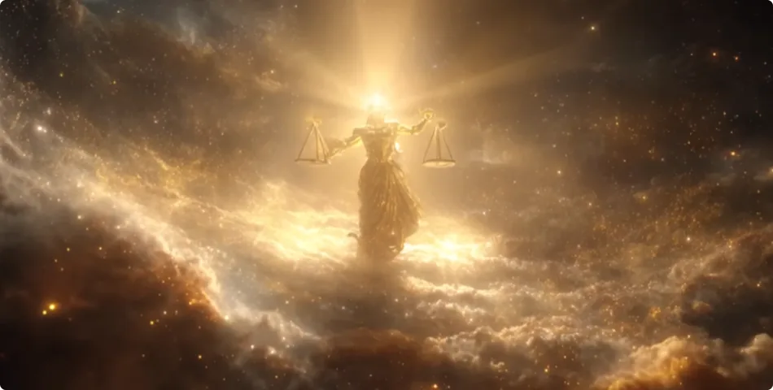
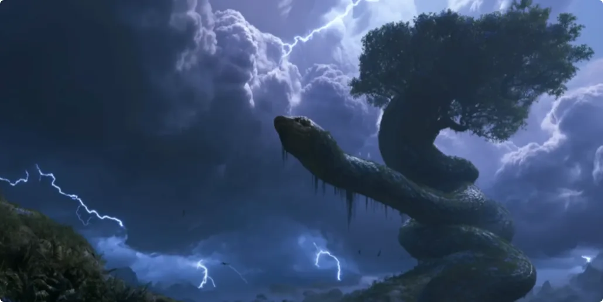

## 需要明白规则而非守旧

丹道已经过时了。

不管是内丹法还是外丹法，不管是在古代还是现代，不管什么层级的人，都把长生之术当科学一样研究，不断在人身上试验各种方法，认为只要发现了人体无形层面的原理，就可以永世受用，直奔长生之道。

但事实并非如此。
我敢说，大部分人都没意识到，修行修仙其实也是一门社会学。

成仙成佛，本质上来讲就是允许进入上层世界。宇宙律法、众生因果、长生之源、造化机制等，都在最顶级的世界中。想要进入这样的世界，没有经过道德的考核是绝无可能的。

道德观必然是约束个体、使集体形成秩序的一种方式。如果你不理解，那我就换个说法。
在人与人构成的社会中，当一个人走到高处，就必须背负相应的责任，必须具备道德观。这是集体对个体的必然要求。
这一要求的根源在于，高位就意味着接触集体生存和发展的关键资源，其决策与行动的利害效应被急剧放大。因此，社会集体必须通过律法等刚性规则来约束个体。

所以，道理都是相通的。
只不过，与人的社会不同的是，在高等世界的社会中，道本就是最高的整体意志，也是制定刚性规则的主体。

因此，想要修仙修佛，想要修长生之术，想要登入天门，就必须接受刚性规则。
反之，无视规则，只专注研究练什么、吃什么能长生，这种发心从一开始就错了，自然得不到道的认可。这也是古代术士和众多富贵炼丹失败的根本原因。

## 一、正是刚性规则，而非罔顾事实

有些人会问：“我明明通过丹道法练出过气丹，怎么不算是修仙呢？”

这其中的关键就在于能量。
凡人是没有超凡能量的，都是凡气，无非是童年时健康纯真的凡气和老年时污浊衰败的凡气之分。这种能量练出的气丹，并不能带你升天。
1. 再者，人之渺小。仅凭人那两米高的气场，你觉得能结出多大、多厉害的丹呢？当然，有很多人认为，人体内在的气是源源不断的，连接着真气的本源，只要找到方法，就能取之不尽、用之不竭。
2. 又或者有人认为，真气无处不在，只要静下心来，没有分别心，周边的气就能变成纯净的真气，就能利用起来修炼了。

如果你还不明白这两种想法有多可笑，那我来比喻一下吧：
- 只要找对方法，人人都可以源源不断地从银行取到钱。
- 只要你我没有分别心，路边的树叶也能当钞票用。

这种罔顾事实的修心，何尝不是另一种心魔呢？

**这种没有证伪手段、没有实际成果、没有持续正向反馈的修法，是纯粹的唯心主义，是注定要失败的。**

说到底，这些人还是把成仙成佛当成儿戏，仍旧没有正视其困难性，自然也意识不到刚性规则的存在。

## 二、飞升规则随时代而变化

为什么古代的仙人能修丹道呢？

因为古代的那些仙人已经解决了修行的关键，也就是能量的来源问题。丹道只是一种炼化纯正能量的方法，而身体只是炼丹的工具。
如果没有解决能量层面的问题，这些求道者也是万万不敢乱练的。

因为人气并不能让人飞升，凡人的气丹仅仅是对其他修炼的妖魔鬼怪有用罢了。

现在很多人在炼丹道的时候通了一些神通，于是认为丹道有用。其实，他是被灵界那些生灵利用了，被选作了有形的炼丹炉。灵界生灵会给他带来不可思议的体验，诱惑他勤奋加练，等他的气丹一炼成，就给偷走。

这些修行人羊入虎口的结局，本质上既是一种惩罚，也是一次教育。因为想抄前人的答案就飞升至高处，这是绝对不允许的。

为什么道教祖师张天师能炼得金丹飞升？为什么后人鲜有通过同样方法飞升？

凡是在社会中做成功一件事的人，应当知道，成功是无法完全复制的。世界上没有相同的河流，真正的知识也无法只靠读书就能领悟。
想要让一个人学会深刻的智慧，使其成人成才，那么最好的方法就是让他在真实情境中历练。如此，他才能将真理内化。

在人类社会中，对于那些想往上走的新一代，我们不会每年都采用一模一样的考卷，也不允许写出跟状元一字不差的文章。因为复制并不是什么出众的才能，从容解决任何类型的困境才是。

因此，修仙修佛也是一个道理。

想要新的仙佛将道法内化，绝不是让他去背诵经文，也不是让他重复练习同一个功法。一定是让他去独立面对新的困境，让他践行道德观。如此，他才能领悟道法的真谛，才能允许他升天。

所以，修行的规则会变，道理就在这了。

丹道或者其他的修行方式，只要过去在历史中使用过了，就必须成为过去式。针对不同时期的飞升，相应的修炼方法也会调整。每一次依据什么原理、修成什么结果才算合格，这些就跟评卷一样，每次标准都会不一样。

一旦相应的时机一过，原来的方法就会作废。其他后来者再修老方法，道都不会给予承认。这就是刚性规则的约束。

## 三、刚性规则不容置疑

很多人、很多生灵不尊重道法，想要无视规则、挑战规则。这就好比在高考作弊、在国考作弊，是很愚蠢的做法。

为什么总听说动物成精后会跑到高处渡雷劫？

因为他们都是靠取巧修炼来的，用来源不正的能量来修炼，比如用人气、其他生灵的气等。如果他们想通过自身的功能强行破开天门，介入高等世界，那么必然会引来道法的震怒，降下天雷。

这就是渡雷劫的本貌。邪修才遭雷劫。

有的人可能会同情这些妖精，觉得人家修炼不易：“我命由我不由天，都是凭本事修出来的，凭什么要劈人家？凭什么不让他进入天界呢？”

道理很简单，因为这有违公平。

这类精怪明明知道有正道却不走，害怕修行路上所需面对的困难，只想走捷径，想靠榨取其他生灵的生气来修。好比一个人靠诈骗致富，靠后台考进公职。这样德不配位的个体，怎么可能被允许介入更高的世界呢？

所以，道是最公平的。

## 结尾

一个人付出了什么、遵守了什么、修得的心性如何等等，他都知道。想在他面前表演聪明、表演巧计、表演可怜、表演努力，都是无用的。

想修行飞升，那就摆正思想、品行端正地修。想取长生之道，先取道德。