## 1. 最大的误区：把修行当成“随缘”，等命运把机缘送上门

### 真正的修行，不属于原来的“凡人命数”

大家好，我是修炼者小烨，是个不爱城市、只爱修仙的散人。最近很多人来问我怎么修行，有人觉得**修行就是修心**，觉得修行就是随缘，缘分自会到来，认为人各有命数，修行的机缘也是命数的一种。

小烨只能说：太天真了。

如果你是想修行的人，这种想法无异于断送自己的未来。
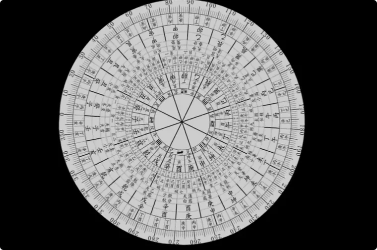

人是各有命数，指的是人的命运，有命数，是命运的齿轮转到哪儿是哪儿。但是命运里，是不会预示“得到机缘”和“真正的修行”这两件事的。

为什么？

因为**命运这种东西，是用在凡人身上的**，讲的是凡人如何过完他的一生。

而得到机缘、踏入真正修行的人，他涉足的世界、三观和结局，已经和凡人不在一个赛道上，不再是原来世俗的人了，自然不归原本的命运管。
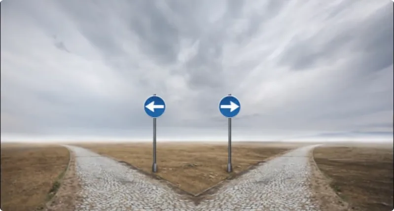

人的命运系统算不了命运之外的事情。如果有比命运系统更强大的能量干涉了人的命运，哪怕因果轮回这种死规则，在绝对能量面前也不算什么，人的命运都是可以更改的。

当然，小烨这里所说的真正的修行，绝不包括市面上那些读书念经、自我意淫、自认为对接大神、自然和灵界能量的所谓“修行”。

### 为什么一个人的命盘可以显示“喜欢玄学”，却算不了真正修行后的路

举个例子。

很多人都算过命，可以从命盘中看出“我为什么喜欢玄学”“我为什么这么多磨难”。你可以理解为，这是放在命运系统中的命数。
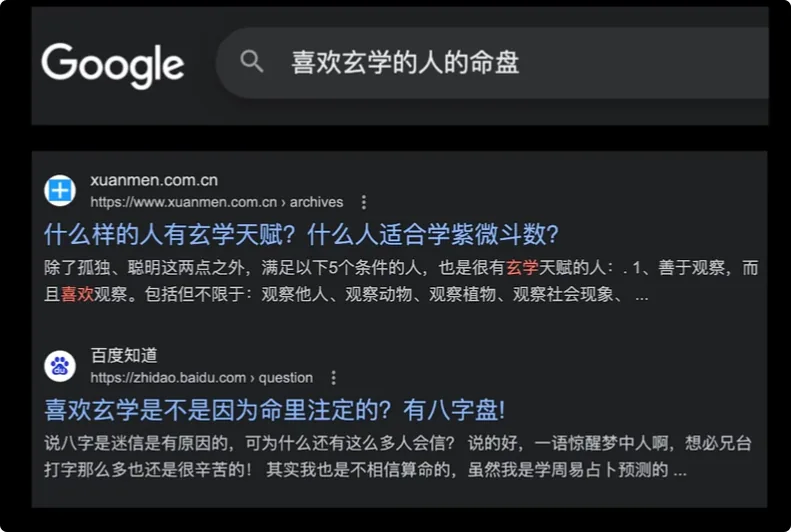

市面上的修行人，他们的命盘也可以看出这些命数，可以看出他们为什么跑去修行。因为这些事件都是凡人受凡尘能量、因果影响而促成的。
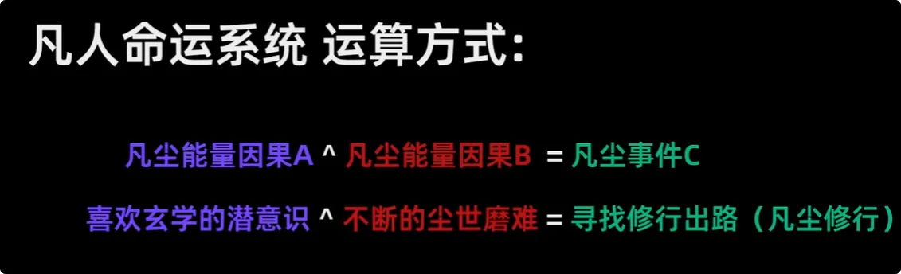

但当一个人踏入真正的修行后，再去看命盘就没有意义了。
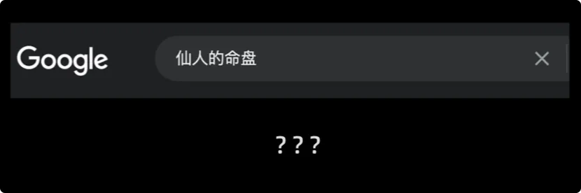

**他的目标已经在命盘之外，他趋吉避凶的能力也是凡人没有的，那命盘还有什么用呢？已经不能像预测凡人一样预测他的行迹了。**
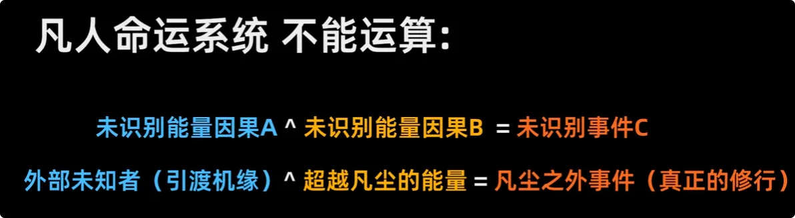

换句话说，一个人身上还是凡尘能量的时候，就一直会被凡尘命数算计；而当一个人开始获得正向能量、踏入真正修行的时候，个人的结局就是靠自己争取的，自己的决策和付出才是关键因素。

> _**所以，如果你认为修行就是等着被凡人命数安排缘分，那你一定找不到真正修行的路。**_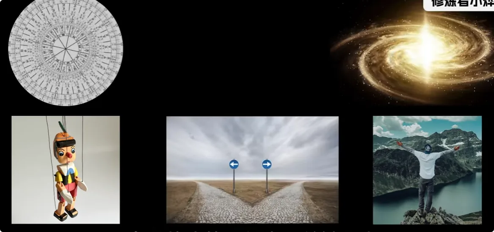

---

## 2. 什么才叫“真修行”：第一标准是身体真的在积累正向能量

接下来说说，到底什么才是真修行。

真修行，首先一定是你的**物理身体在不断积累能量**，而且必须是正向的能量，是你能亲自验证的能量。

比如：
- 身体越来越好；
- 不再出现抑郁；
- 脑子越来越清醒；
- 逐渐对能量有感知力；
- 面貌也发生变化。

而不是来源不明的超自然力量。

市面上的修行人最后结局都很惨，就是因为不明辨能量背后是谁。自认为一喊神佛、师祖的名号，人家就会下凡来给你一对一辅导，很是自大。

而且大多数修行的人很喜欢用道德来绑架大神：

> “神灵都是善良的，我这么苦、这么真诚，他怎么会不来渡我呢？”
> 
> “我做好事，神灵总会来保我吧？”

> _**善非功，恶非过。**_

你认为的善，在大神面前可能什么都不算。

大多数人以一副巨婴的姿态去修行，是修不成的。

所以修行还是要靠自己去找**纯正能量**。纯正能量只存在于特定的自然能量节点，你得把它找出来，用在自己身上，用来提升自身气场、功能和悟性，以及改变作为凡人的结局，才叫修行。

> **没有能量，你就啥都办不到；没有能量，你就不是修行。懂了吧？**

---

## 3. 自然能量不是“天女散花”：没有引荐、没有规则，拿到的未必是正的

### 不是跑进大山，就能凭一个念头把“真能量”收回来

好些网友说，自己也是实修，跑去大自然收能量。
1. 你真的以为真能量是**天女散花般扔到空气中**的吗？你凭一想一念，就能收到了吗？
2. 你知不知道，大山里只要修一座庙，方圆十几里的孤魂野鬼、大妖大魔都要跑进去居住。大自然也是鱼龙混杂的，没有引荐，你去大自然，谁理你啊？

自古以来，哪个修成的人是靠自己突然起悟飞升的？

**超自然能量，有正就有邪。**

很多修出功能的人，自己都分辨不出借用了谁的能量，还以为自己是个天才，实际上就是韭菜。等自己年长一些，精神抑郁了、身体疾病百出，再想逃离这股力量，就难了。

### 真正重要的不是“我觉得自己正”，而是有没有遵守规则

如果一个人没有亲自去拜访自然，没有和自然能量的持有者**双向沟通**，那他接触到的任何超自然力量就一定不正。

哪怕你自以为心正，或者自以为秉持正念，也不是正的。

> **尊重规则的人，才叫心正。**

跳过规则、想白嫖大自然的人，人家不仅不会给你，还可能揍你。

---

## 4. “修行先修心”的问题：没有纯净能量，稳住的只是一杯浊水

### 修心是为了“稳住杯子”，但你得先看看杯子里装的是什么

很多人跟我聊修行的时候，就以为是修心。甚至现在大部分的修行人只讲修心，不讲别的，不看实际成果了，只看心态高度。

**修行方法观严重错误。**

修心有用吗？
有，但不是这么用的。

修心是为了稳住心神，是为了让身上的**真气不漏**。
好比稳住杯子里的水，还得是一杯纯净水。

可是现在：

> _**你连一点纯净水都没有，只有一杯凡尘浊水。**_
> 
> _**你稳住杯子有什么用呢？**
> _
> 

为什么这么多修行人越修越惨？

因为他们都在稳住自己这杯浊水，还死不撒手。

### 磨难为什么不断出现：就是要逼你把原来的杯子撒手

没办法了。

这时候大妖大魔们就会出手了，给他们带来磨难，疯狂晃动他稳住的这杯浊水，让他们的凡气越来越少，以至于最后这些人的身体和精神也越来越差。

让他们知道：

**原来的方法是行不通的，该撒手了。**

逼着他们重新启程，去找真正的修行出路。

> **这个过程才叫觉醒。**

善非功，恶非过。那些阴性众生，可能比这些所谓的修行人还要得到垂怜。

---

## 5. 修心真正的位置：先找到正道、得到能量，然后才谈修心养性

如果修行不先靠正能量提升自己，却靠“修心”来压制人性，首先会降低人身上的人气。

人味儿跟将死之人一个气质，反而会更招鬼。
想想为什么道士给人一种清冷，甚至阴冷的感觉？

所谓修心，是指：

1. 修行人已经**寻得正道**；
2. 已经**得到正能量**；
3. 已经**正式启程**；
4. 然后通过修心养性，保存自己的能量。

它是修行人在修行路途中的**所见、所闻、所想、所悟**。

前面的修成者，由于不能完全把修炼规则公布于众，于是把修心养性、平淡处事的态度告诉世人。
但是却被世人当成了**修炼法宝**。
导致世人认为：

> “照搬同样的心境，就等同于找到了正道。”

一个是在路上的见闻，一个是连起跑点都没看到的意淫。
**后者尚未行动半步，却高谈阔论途中美景，何其荒唐。**

所以在修心之前，更重要的是先接触到能量，以及使你踏入门口的**决意、勇气和动作**。

> **没有真能量，你思想境界再高，死后也只是厉鬼而已。**

---

## 6. 修行人最大的敌人：把“脑子想通了”误认为自己已经开悟

### 悟得越多，反而可能越不愿意去验证

很多人哪怕是真的有缘修行的人，甚至不乏根底好的，在踏入正道前，最大的敌人就是：

> **自以为在世间磨炼出来的悟性。**

今天在讲悟出了什么，明天又讲悟出了什么，然后拿这套悟出来、自圆其说的东西到处批判，侃侃而谈。

明明没有见过真路，却总觉得自己就是对的。
越是追求真路的修行人，悟出来的思想越多，到头来反而越阻碍自己寻找真路。

为什么？

>**因为都用脑子来自洽了，都不去实践和验证了。**

所以要时刻记得：

> _**人再厉害，在自然面前也是渺小的；在命运和轮回面前，更是毫无还手之力。**_
> 
> _**无论你根底再好，没抓住修行的机会，就啥也不是。**_

---

## 7. 真正的“开悟”：不是理解概念，而是先让自己看得见更大的世界

### 没有纯正能量辅助，仅凭凡尘经验很难真正看清

再来说说开悟:
真正的开悟，一定离不开**纯正能量的辅助**。
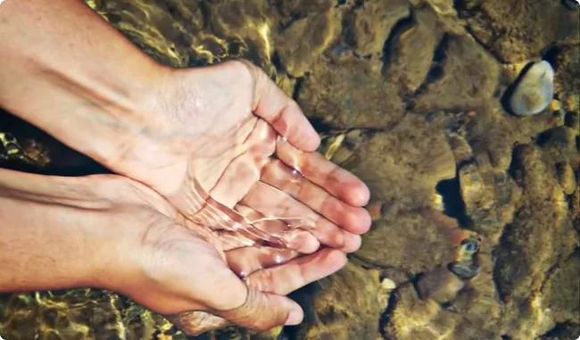

只有纯正能量，才能净化人身上的凡尘浊气，才能让人明心见性，才能把人的精神意识抬升到高处，给人更广阔的视野去参悟世界。

否则，仅靠理解书本上的概念，仅靠所见所闻皆是凡尘，靠着一身凡气，是不可能开悟的。

> **开悟就是：不是你想知道就能知道，而是让你知道，你才得以知道。**

对于灵界的大神、大佬来说，人间的修行人就是在**盲人摸象**。
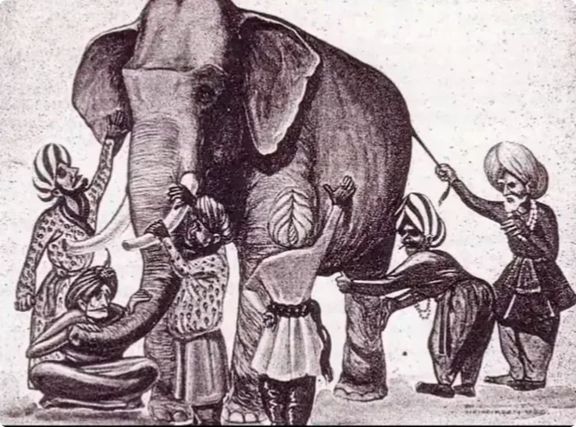

因为没有真正见过大象，所以个个猜得光怪陆离，各有各的自信。
想要看清大象，还得先去除眼前的迷雾。

### 尘世磨难只是把你叫醒，不是替你走完修行之路

有人会问：

>“难道尘世这一切疼痛磨难，不就是让人醒悟的吗？”

是, 确实是让你醒悟的。

但只是让你从尘世中清醒，用疼痛逼你去找到**修行的真正出路**。

而不是让你得出一堆结论，然后自我意淫、固步自封，自以为觉醒了、开悟了，不往前走。

> _**在踏入正门之前，你的万千感悟都不值得一提。**_
> 
> _**你连真路都没摸到，说再多不过是纸上谈兵。**_

只有先接触到真能量，你才能接触到真事物。

你才有：

> **实践出真知。**

---

## 8. “条条大路通罗马”？修行最终还是要靠结果验证

相信很多观众憋不住了，想要反驳我：

“这UP主怎么敢大言不惭，否定这么多大师和修行人？”

“条条大路通罗马，凭什么你说的就是对的？”

有人会说，小烨IP在上海，修的是金钱，一看就不是修行人。
真正的修行人应该回归深山，清净就能生出真气，**心诚就能招来仙缘**，神仙自会来保佑了。

小烨只能说：

>你可以去深山等机缘
>你可以回归清净
>你可以读古典
>你可以听大师讲道理
>你可以认为凭聪慧顿悟就能飞升
>你可以认为神仙就必须是大爱的
>你可以认为修行就是白拿。

**你可以用任何想法，填补你对修行的理解。**
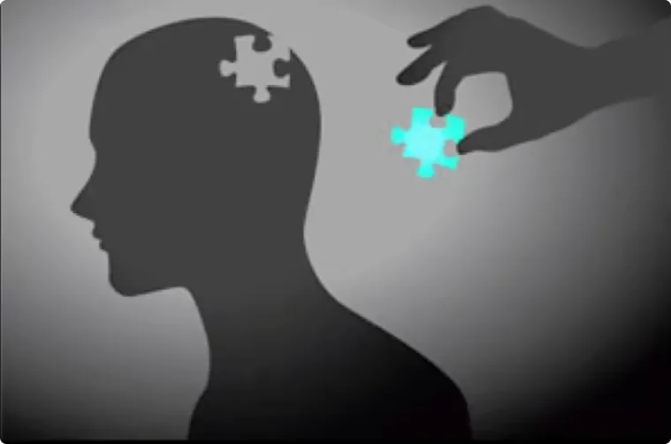

你可以自顾自地修行。
但是，就看给不给你这种人上升的机会了。

### 有缘人来自五湖四海，修行也不可能只靠网络想象

这里虽是魔都不假，但人也来自五湖四海，有缘人也当来自五湖四海。
渡人不能只在网上，求缘也不能只在网上。

这点道理很好理解吧？

> _**天雨不润无根草，道法不渡无缘人。**
> 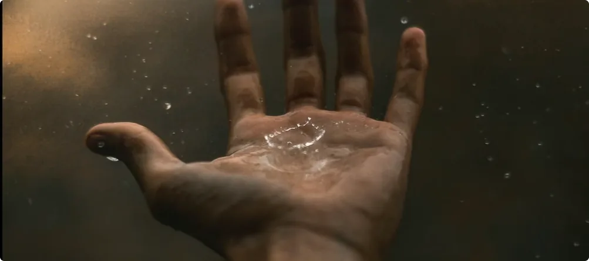_

无缘人怎么想，我不在乎，也不会多看一眼。
倒是有一个验证的办法。
一个不管你愿不愿意，最终都会在你头上应验的办法。

刚才说：

> **只要没找到真路，磨难就会继续降临在你的头上，让你越来越惨，逼着你继续启程找路。**

所以不管你现在相信什么，普通人也好，大师也罢，磨难会来证明你走的路有没有走对。

个人心知肚明。

> _**潮水退去的时候，就知道谁在裸泳了。**_

我是修炼者小烨，我们下期再见。