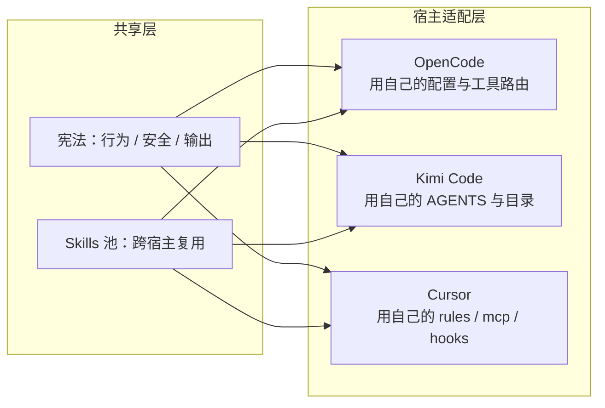
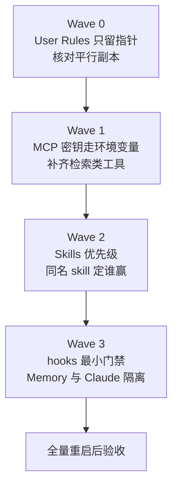

折腾了几天，总算把 Claude Code 那套全局规范（CLAUDE.md + 能力索引 + MCP + Skills）搬到了 Cursor 上。最深的感受是：真正要迁的不是文件，是思路。

> 共享宪法可以整个搬，能力路由必须按宿主重写；User Rules 只放指针；MCP 密钥走环境变量；最坑的是进程环境里那把脏 key，比配置文件更能坑你。

## 先搞清楚 Cursor 到底读哪个文件

网上很多教程让你往 Cursor 里贴一版 AGENTS.md，以为就完事了。我一开始也这么干，结果磁盘改了、界面里还是旧文，两边互相打架。

Cursor 真正生效的入口是 `~/.cursor/rules/AGENTS.mdc`（`alwaysApply`），全局 Agent 行为以它为准。其它几个位置各有各的坑：

| 位置 | 角色 | 我的结论 |
|---|---|---|
| `~/.cursor/rules/AGENTS.mdc` | 真入口 | 全局行为以它为准 |
| `~/.cursor/AGENTS.md` | 平行副本 | 可留，但别当唯一真相源 |
| Cursor User Rules | 界面侧注入 | 只放短指针，禁止整本粘贴 |
| `~/AGENTS.md` 家目录散落 | 历史残留 | 容易过期，别再维护成第二宪法 |
| Claude 的 `CLAUDE.md` | 源规范 | 可对照，别 @import 进 Cursor rules |

User Rules 的正确用法：写个 `AGENTS pointer` 短文，就一句话「主入口在磁盘 `AGENTS.mdc`，冲突以磁盘为准」，界面里一眼能看完。

## 三处分歧，最硬的一处是能力路由

Claude 和 Cursor 有三处习惯不一样：结论形态（Claude 爱列表、Cursor 爱段落）、清理策略、能力路由。

前两处随你喜欢，别为了对齐硬改文风。但**能力路由必须重写**。把 Claude 的 `capability-index.md` 原样 `@` 进 Cursor，等于把另一套工具名和路径灌进错误的壳，Agent 冷启动时直接懵。

能力路由按这四块写就够交接：Skills 何时读盘、同名 skill 谁赢、MCP 场景表（文档用 context7、广搜用 tavily、生图用 MiniMax、图标用 icons）、Memory / Hooks 约定。

## 别抄文件，抄思路：OpenCode / Kimi 也是这么干的

OpenCode 改名叫 `AGENTS.md` 重写能力路由，Kimi 靠 `import-from-cc-codex` 保守迁移再裁剪工具面，Cursor 靠 `AGENTS.mdc` + mcp + hooks。三条路其实一个套路：**共享文档 ≠ 共享配置格式，入口约定比文件名崇拜重要**。

## 迁移分四波，顺序别乱

- Wave 0 切断双源：磁盘 `AGENTS.mdc` 做唯一 alwaysApply 宪法，User Rules 只留指针
- Wave 1 MCP 密钥 env 化：`mcp.json` 里 key 全部改成 `${env:VAR}` 引用，补齐 context7 / tavily 这类检索工具
- Wave 2 Skills 优先级：写明加载顺序，`review` 这类撞名 skill 规定谁赢
- Wave 3 hooks + memory：最小 shell / MCP gate 脚本先防呆；Memory 别去 symlink Claude 的，各放各的

## 最坑的一处：MiniMax 绿了又红，根因不在 mcp.json

这是整个迁移里最烧脑的一个坑。

现象：`mcp.json` 已经改成 `${env:MINIMAX_API_KEY}`，磁盘和用户环境里都有合法 key，可工具还是 401，业务码 2049。

排查了半天，根因是：**Cursor 进程环境里还趴着一把无效旧 key**。宿主启动 MCP 子进程时吃的是进程 env，不是你以为的「最新用户环境一定会被读到」。你以为改对了配置文件，其实进程里继承的还是旧值。☕(￣▽￣)ノ

解决办法，能省半天：

1. 用命令行直接打 MiniMax models API，确认哪把 key 真的 200
2. 把有效 key 写进用户级环境变量 `MINIMAX_API_KEY`（Windows：用户环境，不是临时 `$env:` 会话）
3. `mcp.json` 继续只引用 `${env:…}`，别把明文 key 写回配置
4. 完整退出并重启 Cursor，再烟测一次
5. key 粘贴进过聊天的话，顺手轮换

教训很直白：排查 MCP 鉴权问题，先怀疑进程环境，再怀疑配置文件。

## 迁移完，照这个顺序自检一遍

1. User Rules 里还有没有大段 AGENTS？有就缩成指针
2. `AGENTS.mdc` 的能力路由是不是 Cursor 原生说法？还 `@` 着 Claude 的 index 就说明没迁完
3. `mcp.json` 里还有没有明文 `sk-`？有就改成 `${env:…}`
4. 对比「用户环境」和「Cursor 进程环境」里的 `MINIMAX_API_KEY` 一不一致，不一致说明继承的旧值
5. 重启后对每个关键 MCP 做一次最小调用

安全提醒：聊天里贴过的 key 按泄露面处理，笔记和仓库里永远只写变量名。

---

这就是我这几天折腾下来最值钱的几个点。OpenCode / Kimi 那套跨宿主经验写在另一篇里，思路一模一样：正文共享，适配器私有。希望能帮你少踩一次坑 ☕(￣▽￣)ノ
