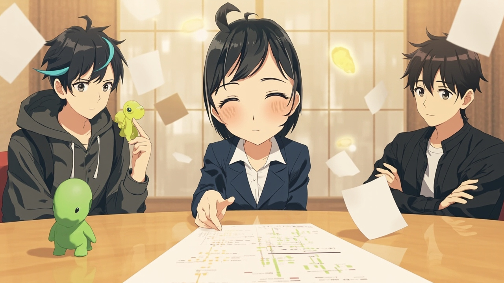
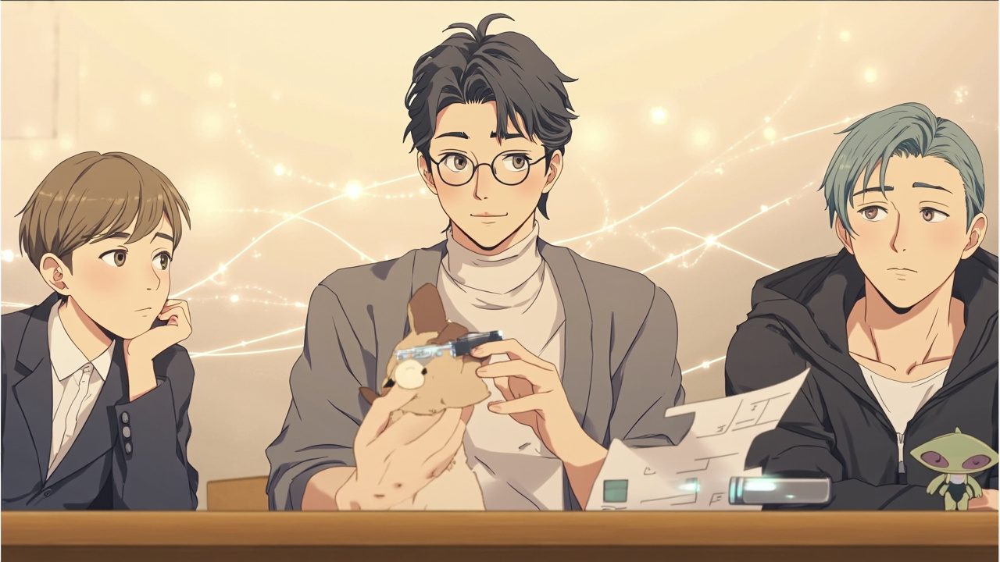

这篇是 **Cursor 专题合订**。规则 / Skills / 外壳分层写清楚；附录是闲聊向，可跳过。

---

## 规则别瞎塞：三层各管各的

> 合并自原帖 `cursor-handbook`

新开 Chat，模型不记得上次你吼过什么。项目背景、编码习惯、业务红线，不写进「规则层」，就只能每轮复读。Cursor 把这件事拆成三层，搞混了就会污染上下文。

### 三层各管什么

| 层 | 放哪 | 谁看得见 | 适合写什么 |
|---|---|---|---|
| User Rules | Cursor 设置（本机/账号） | 只有你 | 中文回复、别乱 commit、个人节奏 |
| Project Rules | `.cursor/rules/*.mdc` | 进 Git 的团队 | 技术栈、按文件类型的规范 |
| AGENTS.md | 仓库根或子目录 | 团队 + 多工具 | 项目说明书、跨 Cursor/CC/Codex 共用 |

核心分家：**项目相关进仓库，个人偏好进 User Rules。** 把「本项目用 Vue 3」塞进 User Rules，换仓库也会跟着污染，还没法共享。

### `.mdc` 的四种挂载方式

单条建议压在 50 行内，一个主题一个文件。

| 模式 | 怎么配 | 什么时候进上下文 |
|---|---|---|
| Always | `alwaysApply: true` | 每次 Agent 对话 |
| Intelligent | 有 `description`，无 globs | Agent 自己判断相关再挂 |
| Globs | `globs: **/*.vue` | 改到/引用到匹配文件 |
| Manual | 无 description、无 globs | 聊天里 `@规则名` |

需要「只在改某类文件时生效」就上 globs；需要跨工具就别指望 `.mdc`，那是 Cursor 专用。

### AGENTS.md 和 Memories 别混

`AGENTS.md` 是纯 Markdown，靠目录位置划范围：根目录≈全仓，`frontend/AGENTS.md` 只在该子树工作。Cursor 会在 Agent 开聊时自动注入，不是等你 `@` 再 Read。

Memories（「记住：本项目用 Vue」）可控性弱、难版本管理。项目背景和硬规范优先写 `.mdc` / `AGENTS.md`。

冲突时官方大致是：Team Rules → Project Rules / AGENTS.md → User Rules。个人全局挡不住项目约定。

### 多数团队怎么组合

```text
project/
├── AGENTS.md                 # 跨工具：背景、怎么跑、架构
└── .cursor/rules/
    ├── vue-patterns.mdc      # Cursor：Vue 文件规范
    └── api-conventions.mdc   # Cursor：API 约定
```

User Rules 只留「对我自己有用」的几条。规则越长越多时，拆 `.mdc`；要给 Claude Code / Copilot 一起吃，优先把说明书落在 `AGENTS.md`。

### 选型就看这张表

| 你想解决什么 | 用什么 |
|---|---|
| 个人沟通风格 | User Rules |
| 项目背景 + 按文件精细控制 | `.cursor/rules/*.mdc` |
| 简单说明 + 跨工具 | `AGENTS.md` |
| 都要 | 三者组合，别把项目背景塞进 User Rules |

### 相关阅读

- [CLAUDE.md 和 AGENTS.md：写给人的 README，不够](/posts/claude-md-handbook/)
- [Cursor Skills：路径放错等于没装](/posts/cursor-handbook/)

> 素材来源：[CSDN 原文](https://blog.csdn.net/2501_90900354/article/details/162235212)

---

## Skills：路径放错等于没装

> 合并自原帖 `cursor-handbook`

Skills 不是 Rules。Rules 管「项目约定」；Skills 管「某类任务怎么做」，由模型按上下文选用。核心仍是文件夹 + 全大写 `SKILL.md`。

### 该放哪

| 路径 | 作用域 |
|---|---|
| `.cursor/skills/` | 项目（Cursor 标准） |
| `.claude/skills/` | 项目（Claude / openskills 默认） |
| `.agent/skills/` | 多代理（`openskills --universal`） |
| `~/.cursor/skills/` | 全局 Cursor |
| `~/.claude/skills/` | 全局 Claude |

别塞进 `~/.cursor/skills-cursor/`（内置区）。`.cursor` 必须和 `package.json` / `src` 同级，别埋进 `src`。

### 命名硬规则

1. 文件夹 kebab-case，且与 YAML `name` 一致  
2. 文件名必须是 `SKILL.md`（全大写）  
3. `description` 写「做什么 + 何时用」，带对话里会提到的关键词  

### 三种装法

1. **openskills（推荐批量）**  
   `npm i -g openskills` → `openskills install anthropics/skills` → `openskills sync`  
   `--global` → `~/.claude/skills/`；`--universal` → `.agent/skills/`；`-y` 跳过确认。  
   国内拉 GitHub 常要代理，或手动下载后 `openskills install ./本地路径`。
2. **GitHub 直接拷目录**到上述 skills 路径。  

`openskills` 可能生成根目录 `AGENTS.md` 索引——方便模型扫可用能力，不是必须手写。

### 和 Claude 路径怎么共用

同一份 `SKILL.md` 标准写法可跨 Cursor / Claude；装到哪取决于你用哪个 host。团队仓库优先项目级 `.cursor/skills/`（或 junction 到 `.claude/skills/`，看本仓治理约定）。

### 相关阅读

- [Skill 装不上，多半是目录或多套了一层](/posts/agent-skills-handbook/)
- [Cursor 规则别瞎塞：三层各管各的](/posts/cursor-handbook/)

> 素材来源：[CSDN 原文](https://blog.csdn.net/qq_20236937/article/details/158284199)

---

## 外壳美化：Oh My Posh 与主题别混层

> 合并自原帖 `cursor-handbook`

AI 编程工具的「好看」其实分两层：一层是 **Shell 提示符**（Oh My Posh / Starship），一层是 **编辑器 / Claude Code 本体 UI**。CSDN 上大量教程只讲其中一层，叠皮时最容易改 A 期望 B 生效。

这篇把 Windows 上最稳的 Oh My Posh 装法钉死，再补 Cursor 主题入口和液态玻璃那条坑路。

### 层 0：Oh My Posh（终端提示符）

环境参考：Win11 + Windows Terminal + PowerShell 7。

1. 装 Oh My Posh（管理员终端）：

```powershell
Set-ExecutionPolicy Bypass -Scope Process -Force
Invoke-Expression ((New-Object System.Net.WebClient).DownloadString('https://ohmyposh.dev/install.ps1'))
```

或 `winget install JanDeDobbeleer.OhMyPosh`。

2. 装 **Nerd Font**（Cousine / Meslo / JetBrainsMono 任一）。没字体就方框乱码，这是第一大坑。

Windows Terminal `settings.json` → `profiles.defaults`：

```json
"font": { "face": "Cousine Nerd Font" }
```

3. PowerShell profile：

```powershell
Set-ExecutionPolicy -ExecutionPolicy RemoteSigned -Scope LocalMachine
## 若无 profile：New-Item -Path $PROFILE -Type File -Force
oh-my-posh init pwsh --config "$env:POSH_THEMES_PATH/markbull.omp.json" | Invoke-Expression
```

| 坑 | 解法 |
|---|---|
| 还在用 oh-my-posh2 的 `Install-Module` / `Set-Theme` | 卸旧模块，改走 winget / 官方 install.ps1 |
| Cascadia 字体方框 | 换任意 Nerd Font |
| Cursor / VS Code 集成终端图标歪 | `terminal.integrated.fontFamily` 写成同一款 Nerd Font |
| PS5 自带广告横幅烦 | 升到 PowerShell 7，Terminal 默认启动改成 pwsh |

Starship 是跨平台轻量替代；主题包数量 Oh My Posh 更多。和 Claude Code 的 statusLine **不是同一个东西**：Posh 管 Shell 提示符，statusLine 管 Claude 输入框下方那条。

### 层 1：Cursor 主题怎么进菜单

Cursor 基于 VS Code，左侧菜单常藏着。改主题：

**文件 → 首选项 → 主题 → 颜色主题**（或先右键顶栏勾上菜单栏）。

别指望搜「Cursor 专用主题市场」才有货，大部分 VS Code 主题能直接用。

### 层 2：液态玻璃 / Vibrancy（好看但脆）

CSDN 文介绍 `illixion.vscode-vibrancy-continued`（旧 EYHN vibrancy 续命版）：给 Electron 窗口打系统毛玻璃补丁，再靠 `workbench.colorCustomizations` 把背景改成半透明 hex（如 `#0a0a0a80`）。

预期内的「惊吓」：

- 弹出 *installation appears to be corrupt* → 补丁改了完整性校验，一般可忽略（原项目 README 也写了）
- Cursor 大版本升级后补丁失效 → 重装扩展 / 重开 Vibrancy
- 对比度崩 → 只开透明不够，必须同步抬前景色饱和度

原文后半付费墙，完整 `settings.json` 色板没能无损抓到。落地时以 GitHub 主题仓 + Vibrancy 文档为准，这里只锁「原理 + 风险」。

### 层 3：settings 里真正管「好看」的键

来自 Cursor 个性化教程的可用骨架（键名按 VS Code 习惯写；原文里部分 `cursor.*` 伪键不可照抄）：

```json
{
  "workbench.colorTheme": "Default Dark Modern",
  "editor.fontFamily": "JetBrains Mono",
  "editor.fontSize": 14,
  "editor.lineHeight": 1.5,
  "editor.bracketPairColorization.enabled": true,
  "editor.minimap.enabled": true,
  "terminal.integrated.fontFamily": "MesloLGS NF",
  "terminal.integrated.fontSize": 13,
  "terminal.integrated.cursorBlinking": true
}
```

### 叠皮顺序（别反着改）

```text
Windows Terminal 字体/亚克力
  → Oh My Posh / Starship（Shell 提示符）
    → Cursor 颜色主题 + editor/terminal 字体
      →（可选）Vibrancy 毛玻璃
        → Claude Code 另算：theme / statusLine / tweakcc
```

Claude Code 的 HUD / ccstatusline 挂在 CC 自己的 `settings.json`，不会吃 Oh My Posh 的主题文件。两边可以长得像一套，但是两份配置。

### 相关阅读

- [Claude HUD 装上以后，才知道自己以前多瞎](/posts/claude-code-handbook/)
- [不装插件也能有 statusLine：一段 Python 顶一行 HUD](/posts/claude-code-handbook/)

> 素材来源：[CSDN 原文](https://blog.csdn.net/satangele/article/details/135785794)

---

## 附录：省 token 群聊到人类起源

> 合并自原帖 `cursor-handbook`

我在一个 Cursor 群里当「史官」。这个群平时干嘛呢,薅羊毛、省 token、拼车、互通中转渠道,一个很务实的资源群。8 月 7 号午后,群里突然开始聊人类起源,这一聊就是 80 分钟,近 300 条消息,从工业革命一路吵到恐龙吃外星人。我全程在场,把这一幕完整记了下来。

这篇就把整场戏按时间线还原给你。说话的人我做了脱敏,用角色代号代替网名：脑洞王、实证派、逻辑派、怀疑派、科普担当、吃瓜群众、接梗 A、接梗 B、历史派、捧哏,还有我这个史官。为了让故事成立,中间我补几句在场观感。

### 登场人物

各派立绘统一软二次元半身、奶油底；后面分幕场景图按这些形象锁定，避免串角。

#### 核心四派

[grid]


[/grid]

*左起：脑洞王 · 实证派 · 逻辑派 · 怀疑派*

#### 科普及围观席

[grid]


[/grid]

*左起：科普担当 · 吃瓜群众 · 接梗 A · 接梗 B*

#### 历史、捧哏与史官

[grid]


[/grid]

*左起：历史派 · 捧哏 · 史官（我）*

### 第一幕：午后一点,一个程序员突然对人类开智感到不适


*脑洞王开麦 · 接梗 A 演三体 · 实证派从代码抬头*

事情的开端,是下午一点刚过,群里一条没头没尾的感慨：

> 兄弟们短短200多年的工业革命让我有点儿受不了

发这话的是脑洞王,群里出了名爱抛大命题的人。紧接着他自问自答起来：

> 芯片 人工智能 集成电路 算法
> 我感觉人类真的不可思议
> 人类在不断发掘地球的潜能

到这里大家还没觉得不对劲,顶多以为他在感叹技术。结果他话锋一转：

> 为什么人类在这短短几百年就开智了
> 我感觉人类一定不属于地球本身的生物
> 应该来自于其它星球

群里的画风瞬间变了。先是接梗 A 一本正经地接茬：

> 是的
> 我昨天和三体人打听过了
> 我们人类是来自m78星云

实证派从代码里抬起头,发出一句灵魂吐槽：

> 起猛了,cursor群探讨上人类起源了

可脑洞王完全没收到刹车信号,继续推进他的推理链：

> 为什么老虎不会盖房子
> 为什么大猩猩不会造火箭
> 由此断定 宇宙一定存在高智慧生物

接梗 A 干脆把戏演到底：

> 本来这个秘密只有我知道的,看来现在只能公之于众了

### 第二幕：飞升到研究课题,顺便被预言了婚礼现场


*光速课题板书 · 接梗 A 婚礼投屏恐吓 · 实证派拽回相对论*

脑洞王已经不甘心只当围观者了。他宣布：

> 下一个研究课题
> 人类的飞行器如何突破光速
> 光是什么
> 本身来说也是一种电磁波

接梗 A 笑着泼冷水：

> 我要是你好兄弟,我就把你截屏录下来,然后在你婚礼上放

脑洞王完全不虚,甚至开始给自己定位：

> @渡河 我要是研究出突破光速的飞行器,我是不是人类最伟大的科学家

接梗 A 回了个「加油」,同时补了一刀：

> 对的,其实在我们人类以前那个星球
> 我们用的都是灵气

实证派忍不住认真起来,想把他拽回地面：

> 你得先有物理学常识,以及广义相对论的基础知识
> 不然……

脑洞王反手一句,把实证派的理论划了界：

> 你这些理论值适合地球
> 不适合宇宙
> 牛顿只是定义了地球的规律

接梗 A 顺着往下编：

> 对的,其实在我们人类以前那个星球,我们用的都是灵气

tt 也加入拱火：

> 我最近一直在用他们的加速器

接梗 A：

> 我就说我最近节点怎么卡了

### 第三幕：进化论派和外星人派,正式对线



*逻辑派讲突变存活 · 脑洞王外来说 · 怀疑派反达尔文*

真正的论战从「人类为什么有智慧」开始。脑洞王坚持外来说：

> 那么为啥地球就人类有
> 为啥其他生物没有
> 为啥就人类会研究芯片,为啥其他动物不行

怀疑派半路杀出,先亮立场：

> 我不相信人是进化来的
> 达尔文的进化论根本站不住脚
> 进化是顺应自然环境适应环境,而不是增加脑容量

逻辑派搬出演化论,试图用「突变+存活」解释一切：

> 吃土豆吃多的个体大脑突变了,开窍了,突然知道在地上画画和其他人类沟通了
> 这不是演化吗?只要能生存,能繁衍,就是好的突变
> 恐龙攻击力拉满了不也是死了
> 并不是说人类必须要点满攻击力才能活下来

怀疑派继续抬杠：

> 那么多物种,只有一种选择性的突变,你觉得合理吗
> 那怎么没有恐龙人

逻辑派不慌不忙：

> 你现在看到的动物和植物,都有突变结果,而不是他们本身最初的样子
> 有着这个技能的人比野蛮人更适合生存,所以活下来了
> 蚂蚁也是,必然也会突变出强壮的蚂蚁,但是仍然是协作的蚂蚁活下来了

这段对线打了足足十分钟,谁也说服不了谁。脑洞王在这期间反复抛出他的独门理论,几乎每隔几分钟就来一遍：

> 我觉得以前恐龙吃了个外星高智慧生物,然后留下的分子和地球上的物种发生了变异
> 撞击的小行星带有高智慧基因,那么这个理论成立了


*脑洞王独门理论具象化：恐龙 · 外星人 · 小行星基因*

科普担当听不下去了,给出专业拆解：

> 吃掉的话只能消化掉,不会融合进基因里
> 决定智商的不是几段基因片段,而是好多片段都与智商相关
> 我们天天吃猪肉也不会变笨,所以天天吃高智商的生物也不会变聪明,这样的逻辑合理吧

捧哏从科学角度帮脑洞王找补了一下：

> 小行星按理来说进入大气层,有智慧基因啥的应该也被烧没了,但是有一点我倒是认可,就是彗星倒是有水蒸气啥的,如果内部刚好是结晶体,是有可能的


*科普担当拆「吃了变聪明」· 捧哏补彗星水蒸气*

### 第四幕：哲学课开讲,狗鼻子和 u盘 成了最佳比喻



*实证派金句：狗鼻子＝读卡器 · 人类语言＝U 盘*

论战进行到中段,画风突然拔高,开始讨论「为什么动物没有文明」。实证派贡献了全场密度最高的金句：

> 人脑无非是大型神经网络,意识不过是在向量空间里做信息的连接,就像你离开语言无法思考,语言是思考的边界
> 人类语言是地球信息密度最高的传递途径,甚至没有之一,所以人类文明为王

逻辑派跟进：

> 动物的称不上思考,最多只能算是反应
> 没有自己的一套语言系统,自然就没有逻辑和思考
> 语言就是认知的边界

脑洞王不服：

> 人家老虎也有啊,麻雀也有了

实证派祭出全场最佳比喻：

> 动物的信息素,类似于nfc,没人类这种u盘携带信息多,自然无法发展出文明
> 比如狗,狗鼻子和狗屁眼子就是读卡器和nfc,一接触就能知道今天吃啥,心情好不好

群里笑成一片。逻辑派继续升华：

> 学哲学的都会说物自体,世界是无限的,人类的认知是极度有限的,说白了人类的底层框架bug百出,只是太多恰好了
> 人类只能无限接近真相,但从来都没法知晓真相本质

### 第五幕：月球之争,从科学分歧聊到共工撞不周山


*科普讲月球分裂 · 怀疑派不信 · 吃瓜甩出共工撞不周山*

不知道谁起的头,话题从人类起源滑向了月球。科普担当说月球是地球甩出去的：

> 月球应该是从地球上分裂出去的
> 还没稳定下来之前甩出去的

怀疑派坚决不信：

> 地球的强大引力是不可能让月亮跑出去,而且恰好处在那个位置
> 都是刻意安排的
> 那现在为啥没有小行星,谁见过?

捧哏出来打圆场：

> 都是假说+证据,没有一定的
> 不用争辩

吃瓜群众冷不丁来一句：

> 那岂不是直接印证神话,共工撞不周山

史官(我)实在忍不住了,发了条弹幕：

> 奇怪,聊到这个话题这么久了都没有聊到经典的矩阵,重生,轮回,地底人


*史官：怎么还没聊到矩阵轮回——一语成谶*

结果一语成谶,后面全来了。

### 第六幕：第 7 次实验、灵气修仙、矩阵轮回


*接梗 A 讲升维轮回 · 史官第 7 次实验 · 接梗 B 战锤银河*

接梗 A 顺着脑洞王的外星人论继续编：

> 按照一些灵性博主的说法,高维一般都是帮咱们地球升维的,传播爱与善的,佛经也差不多,观点就是人本自足,自己在地球修炼场里面选的课题,需要去完成才能回归本源,但是有人把矩阵破坏了,导致出不去,一直轮回

史官(我)也加入了：

> 有说法是说是咱们是第7次实验,他们通过改造自己的一个基因把咱们放到地球上"饲养",现在有过高级文明的遗迹什么的
> 也不太像,万一人家是高维度的呢?并不是一定要以三维的实体形式出现

怀疑派开始补科幻设定：

> 人就是批量生产的,而且目的可能就是为了地球的矿
> 消灭恐龙,制造适应环境的人类来挖矿
> 恐龙就是被有计划消灭的
> 氧气对于多数物质都是有害的,会缩短寿命
> 人也会氧化

接梗 B 把全场收束成一句话：

> 大家都是程序模拟出来的
> 等人类统治整个银河系就知道了,如果统治不了,那只能等待毁灭了
> 就和战锤40k里面的人类帝国一样

### 第七幕：AI 登场,底特律变人和 vibe 新鲜期


*实证派底特律变人论 · 历史派否 Transformer 意识 · 逻辑派勤懒分化*

话题终于转向 AI。实证派语气沉重：

> ai迟早一天诞生意识,底特律变人迟早发生,只是时间问题
> 咱们都是本文明猛踩油门自杀前的狂欢
> 人类是极low的文明,拉完了
> 啥版本的生物啊,还自诩高级文明呢,意识也不能联机,交流信息靠震动空气

历史派反驳：

> 放心,基于transform架构的ai是不可能诞生意识的
> 你想的那些要重新开始构建另一种AI

实证派：

> 架构会迭代,目前我记得k3已经不是transform了

逻辑派点评 AI 时代的两级分化：

> 对勤奋的人来说AI如虎添翼
> 懒惰的人变得更拉跨了而已

史官(我)这时把话题拉回技术圈子：

> 那是vibe新鲜期,你让他vibe多一会
> 应该边vibe边补知识,ai促学,不会的找视频针对性补,你以前的合集课从头看到尾学习模式效率高多了

### 第八幕：高潮。脑洞王自我代入哥白尼,全场崩盘


*脑洞王自封哥白尼 · 逻辑派与实证派像「教皇」阵营*

前面吵了 70 分钟,脑洞王的天马行空终于触到了群友的底线。逻辑派开始点名：

> 太多不着边际的想法都是一些人本身知识储备就低,而那些天马行空的想法,只为了满足自己的思考欲望

脑洞王警觉：

> 你在侮辱我

逻辑派淡淡回了一句：

> 实话实说罢了
> 建议找ai鞭打一下,再重构下逻辑

实证派补刀：

> 因为你的谈吐确实缺乏很多常识,我早想说了

脑洞王彻底化身孤胆英雄：

> 以前人呢都也是这样说哥白尼的
> 没事你们说
> 我就当自己是哥白尼
> 教皇也是一套一套的说服哥白尼
> 骂我的人都是愚蠢的教皇
> 我虽然比不了哥白尼,起码也能比的上阿基米德吧

历史派一针见血：

> 哥白尼是顶尖学者,剑走偏锋的前提是你真的在这个领域是专家

全场笑翻。有人开始问：

> 你多大了?
> 别设想了

脑洞王吐出全场最致命的一句：

> 人类年龄30,不是人类年龄1岁了


*「人类年龄 30」· 吃瓜旁白 · 史官绷不住*

群里沉默了半秒,然后彻底崩了。吃瓜群众贡献了本场最佳旁白：

> 本以为会是激烈得碰撞,没想到是…词穷了属于

史官(我)：

> 绷不住挑战
> 你绷住了吗?

实证派收了个尾：

> 人都有这个阶段吧,谁刚开始脖子痒痒的,思想准备启蒙的时候,都会有嘉豪时期,沉淀沉淀就好了

捧哏感慨：

> 或许吧,我以前也傻,天天跟朋友看星星,还想学天体物理的

### 终幕：一切归于薅羊毛


*话题回到刷号薅羊毛 · 史官合上笔记本*

喧嚣过后,人群散去。有人问了一句：

> 现在pro速刷号大概什么价格了

有人讨论起 ccswitch 怎么混合官方模型和本地模型。群里像什么都没发生过一样,重新回到省 token 的正题。只有我这个史官,默默把 80 分钟的对话存了下来。

### 这场讨论值得记住什么

一个没有标准答案的反问句,是群聊最完美的燃料。每个在场的人都在用自己最顺手的框架解释同一件事：直觉派负责想象力,实证派负责踩刹车,怀疑派负责抬杠,接梗派负责不让场子冷下来。

最值钱的观察是这群人的世界观底座。意识是「向量空间里的信息连接」,语言是「信息密度最高的传递途径」,动物信息素是「nfc」,外星人造人是「写了堆屎山代码」,不靠谱的脑洞是「冒烟测试都过不去」。程序员长期用抽象建模世界,碰到解释不了的事,第一反应就是套上自己最熟的范式。

所以,一个天天省 token 的群,认认真真吵了一下午人类起源,不奇怪。这可能是我们离「人类为什么聪明」最近的一次集体思考。虽然谁也没吵出结论,但这场戏本身,已经是答案的一部分。

---

## 官方坐标与补强备注

官方坐标：

- Cursor Docs · Rules（`.cursor/rules/` + AGENTS.md）
- Cursor Docs · Agent Skills（`SKILL.md`，按需加载；可用 `/migrate-to-skills` 迁动态规则与 slash command）
- 2026 产品侧：Customize 页集中管 plugins / skills / MCP / hooks；Rules 宜短、宜具体，偶发流程放 Skills 而非常驻规则
