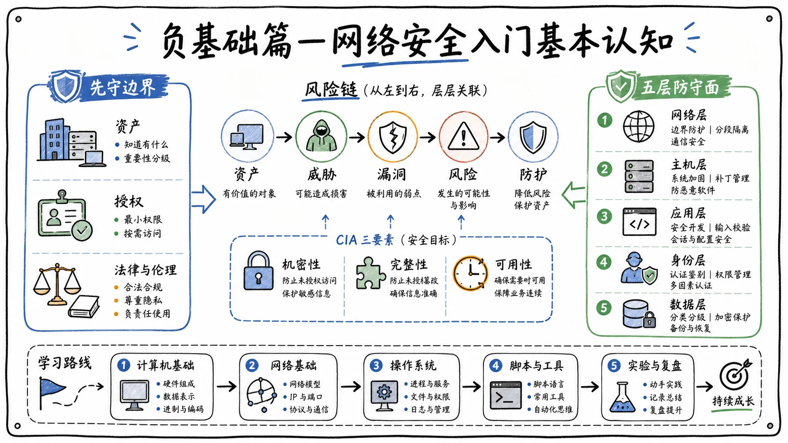

# 负基础篇：网络安全入门基本认知

## 课程规划与学习主线

大家好，我是一只枷锁。从今天开始，我准备给大家录制一些**负基础课程**。更新时间可能不太固定：忙的时候可能不会更新，稍微闲一点时，我会尽可能多更新一些。

我大致做了一个计划，负基础篇主要会从以下几个方面带大家逐步学习：

1. 网络安全的入门认知；
2. 当前 AI 渗透的发展趋势；
3. 面向负基础学习者的快速入门课程；
4. 如果后续精力充沛，再整理一套更加完整的课程。

今天先讲网络安全的入门认知。我也整理了一份配套文档，后续会同步上传到粉丝群或交流群中。

## 什么是网络安全

## 网络安全并不只是电影里的“黑客”

很多人一听到“网络安全”，脑子里就会出现一种画面：一个戴着帽子的黑客坐在黑漆漆的房间里，面对满屏绿色代码疯狂敲键盘，然后“啪”的一声，全世界的电脑都黑了。

但那属于电影情节。真实的网络安全，与每个人的**生活、工作和钱包**都息息相关。这节课不讲复杂术语，也不讲公式，就用大白话带大家了解网络安全到底是什么。

## 从一家网店理解网络安全

先设置一个场景：假设你开了一家网店，在淘宝或拼多多上卖衣服。用户需要注册账号、登录并购买衣服，系统里会逐渐积累用户的姓名、手机号、收货地址和购买记录。你和员工则通过网店后台处理订单和发货。

这套系统的服务器需要尽可能保持 24 小时运行。大家打开淘宝或拼多多时，通常想什么时候打开就什么时候打开，这就说明平台背后的服务器需要持续提供服务。

那么，一家网店需要保护的东西到底有哪些？

有人可能会说：

> 不就是保护网站页面，不让别人篡改吗？

这当然是一个要求，但只是最低要求。用户拥有自己的账号，如果账号被别人冒用，甚至被人拿去下单，用户肯定不会乐意。用户的手机号和地址也不能随便泄露。如果今天刚在你的店里买了一件衣服，第二天就接到几十个诈骗电话，用户以后还敢不敢继续在这里买东西？

商品价格和订单金额同样不能被篡改。比如一件衣服卖 200 元，有人通过技术手段把它改成 100 元，甚至直接改成 1 元，然后一次买 1000 件，商家很可能因此遭受巨大损失。

网站还会有后台管理权限。如果后台落到黑客手里，陌生人登录后台，把所有订单全部删除了，该怎么办？网站也不能说挂就挂。双十一或“618”正卖东西时，系统突然崩溃一个小时，可能损失几十万、上百万，甚至上千万元。

出了安全事件以后，还需要考虑以下问题：

- 能不能查出是谁干的？
- 对方是怎么做到的？
- 受影响的数据和业务能不能恢复？
- 相同的问题会不会再次发生？

这些都是网络安全需要保护和处理的内容。网络安全保护的不只是一个登录页面，而是一整套东西，包括企业的**数字资产、业务连续性和用户权益**。

## 网络安全的三个基本目标

网络安全有三个基本目标，也就是常说的 **CIA 三要素**：保密性、完整性和可用性。参加软考时通常需要学习这些内容；如果只是想了解网络安全，先掌握基本含义即可。

## 保密性：不该看的人看不到

保密性指的是，信息只能由有权限的人查看。

比如账号信息、身份证号、银行卡号和购买记录，除了用户本人和业务上确实需要知道的人，其他人都不应该看到。

假设你在一家网店注册并填写了身份信息，这些信息会存放在数据库中。如果商家把数据库弄丢了，导致用户信息泄露，就说明系统的**保密性被破坏了**。

## 完整性：数据不能被偷偷修改

完整性指的是，数据不能被未授权的人篡改。

比如你转账 100 元，结果到了对方账户里却变成了 1 万元；或者网店里一件售价 200 元的衣服被人改成了 1 元，这都属于完整性被破坏。

数据不光要保存下来，还必须保证它是正确的。没有权限的人，不能随意修改数据。

## 可用性：该用的时候能够正常使用

可用性指的是，系统在需要使用时能够正常工作。

比如双十一期间想打开淘宝买东西，页面却一直转圈，始终无法使用，这就可能是可用性出了问题。

系统不是建完就算完成了。用户需要它时，它必须能够正常提供服务。

## 网络安全的基础概念

## 资产

资产是指**有价值、需要保护的东西**。

在网店场景中，用户的身份信息、地址和其他用户数据都是资产；服务器是资产；管理员账号和密码也是资产；整个业务系统同样属于资产。

简单来说，只要某样东西丢了、坏了或被人偷走以后，你会心疼、会损失钱，它就属于资产。

## 威胁

威胁是指可能给你造成损害的人、事件或行为。

常见的威胁包括：

- 网络上的黑客；
- 电脑病毒和恶意软件；
- 员工误操作；
- 员工把密码写在便利贴上，再贴到显示器旁边；
- 自然灾害、设备故障等意外事件。

因此，威胁不一定是人，也可能是某个事件或某种行为。

## 漏洞

漏洞是系统中的弱点或毛病。

比如密码设置得过于简单，直接使用 `123456`，这就属于**弱口令漏洞**。因为这种密码太常见，别人很容易猜出来。

其他常见情况还包括：

- 应该设置权限的地方没有设置，导致任何人都能进入后台；
- 配置错误，把原本不该公开的内容暴露到互联网上；
- 开发人员没有正确校验用户身份；
- 系统没有及时安装安全补丁。

安全测试本质上是在与系统设计和开发逻辑做对抗：开发者不允许普通用户执行的操作，如果我们能够通过其他方式完成，就说明系统可能存在漏洞。

漏洞通常是系统自身存在的问题，而威胁则是外部客观存在的潜在危险。

## 风险

风险是指威胁利用漏洞以后，造成损失的可能性和影响程度。

例如，外面有一个小偷，这个小偷属于威胁；你家的门锁坏了，门锁问题属于漏洞。外面既有小偷，家里的门锁又坏了，那么家里被偷的可能性就会变高，损失也可能很大，这就属于高风险。

可以简单理解为：

> **风险 = 威胁利用漏洞后，造成损失的可能性与影响。**

## 防护措施

防护措施是用来降低风险的各种技术和管理办法。

常见措施包括：

- 登录时进行身份认证；
- 通过手机号验证码进行二次验证；
- 为不同人员分配不同权限；
- 及时安装补丁；
- 记录日志，方便事后排查问题；
- 定期备份数据，以防万一；
- 对重要操作进行审计。

不同的人应该拥有不同的权限和页面展示内容，这些都属于防护措施。

## 网络安全中的攻与防

## 攻击方到底在做什么

很多人觉得网络安全就是黑客攻击、搞破坏，其实安全行业里既有“攻”，也有“防”。

安全工作中的“攻”并不是让你破坏别人的系统，而是在取得明确授权以后，站在攻击者的角度模拟黑客，对目标系统进行安全测试，从而帮助客户发现问题、验证风险并推动修复。

可以把它理解为客户对你说：

> 你来打我吧，我想看看自己的系统有哪些毛病。

你完成测试后，需要告诉客户哪里存在漏洞、会造成什么影响，以及应该如何修复。这属于合法、合规的**渗透测试或攻击模拟**。

## 防守方的持续工作

防守并不是安装一个杀毒软件就结束了，而是一套持续开展的工作。

首先要搞清楚自己有哪些资产。例如，企业有多少台服务器、多少个站点、多少套业务系统。其次，要把没有必要暴露在互联网中的内容收起来。

开发人员为了调试方便，可能会把某些接口直接暴露在外面。系统上线以后，如果这些测试接口仍然存在，就会扩大攻击面，给黑客提供更多可利用的入口。

账号权限也需要严格管理。管理员权限和普通用户权限显然不应该相同，不该给的权限不能随便给。

综合来看，攻防双方关注的是同一套系统，只是站的角度不同：

- **攻击方**：模拟攻击，看看系统哪里不行、哪里能够被突破；
- **防守方**：守住系统，监测谁在攻击、使用了什么方法，并尝试定位和溯源攻击者。

## 白帽、黑帽与合法授权

## 黑帽黑客

黑帽黑客通常是在没有得到他人同意的情况下攻击系统，目的可能是偷窃信息、牟利、勒索或搞破坏。

他们常做的事情包括：

- 获取和买卖用户信息；
- 窃取企业数据；
- 入侵服务器；
- 植入病毒或木马；
- 实施敲诈勒索；
- 控制他人电脑，用于继续实施恶意活动；
- 破坏网站和业务系统。

生活中经常有人接到莫名其妙的推销或诈骗电话，这可能意味着用户在某套系统中留下的信息已经泄露。攻击者获取信息后，可能将其卖给诈骗机构或广告公司获利。

勒索病毒对普通个人用户的攻击相对减少了。因为攻破一台普通个人电脑，再专门向用户勒索，过程复杂、成本较高、收益有限。现在很多勒索攻击更偏向银行、金融机构或其他资金较充足的重要单位，因为攻击者认为这些目标更有支付能力。

## 白帽黑客

白帽黑客是在取得明确授权后，使用安全技术帮助企业发现问题、应对风险并推动修复的人。

白帽和黑帽使用的技术可能差不多，但性质完全不同。白帽常见的工作包括：

- **渗透测试**：对客户授权的系统进行测试，并提交测试报告；
- **漏洞挖掘**：寻找各类系统中的安全漏洞；
- **红队攻防**：模拟真实攻击者，检验防守方是否能发现和阻断攻击；
- **蓝队防守**：监测攻击、分析告警并尝试溯源攻击者；
- **应急响应**：安全事件发生后，第一时间进行处置；
- **安全运营与安全研究**：持续分析风险、维护安全策略和研究新型攻击方式。

会使用安全工具，不等于就是白帽。白帽身份来自**合法授权、合规操作和负责任的漏洞处理方式**。

> 没有授权，技术再厉害，擅自对他人系统进行渗透测试，也属于越过法律红线。

大家一定要做合法的白帽黑客，不能去当黑帽黑客。

## 护网行动、攻防演练与红蓝对抗

## 什么是护网行动

网络安全中有一个常见概念叫**护网行动**。它通常是特定时期开展的网络安全保障和实战化攻防活动，一般会在每年的七八月份或八九月份出现。

不同地区、行业和单位的组织方式可能略有不同，但核心角色通常包括：

- 攻击方；
- 防守方；
- 组织方和裁判方；
- 安全服务人员。

攻击方主要负责模拟黑客，对授权范围内的系统进行攻击。防守方负责监控系统是否被攻击、分析攻击者使用的手法，并尝试定位或溯源攻击人员。

组织方和裁判方负责制定规则、确认范围、协调过程并评估最终结果。

## 什么是攻防演练

攻防演练与护网行动在本质上比较接近，只是组织范围可能不同。例如，金融行业可以组织一场行业攻防演练，某家银行或某个具体单位也可以单独组织攻防演练。

无论采用哪种形式，核心前提都包括：

1. 有明确授权；
2. 明确哪些目标可以测试、哪些不能测试；
3. 明确时间、方式和规则；
4. 通过模拟攻击和防守，检验组织的安全能力。

护网和攻防演练相关岗位通常在每年六七月份后逐渐增多，有时会持续到十一月左右。红队和蓝队选手的薪资可能比较高，但前提是能够产出成果。

例如，作为红队攻击人员，至少需要取得一定的测试成果。如果参加项目却没有任何有效产出，就很难拿到较高的报酬。

## 红队与蓝队

红队本质上是攻击队，负责模拟攻击者对目标系统开展测试。蓝队是防守队，负责监控、发现、阻断、处置和事后复盘。

攻防演练的目的并不是单纯比较“谁打进去了”“谁防住了”，也不是看谁更厉害，而是发现真实问题，例如：

- 哪些资产仍然处于暴露状态，可能被黑客利用；
- 哪些设备或系统存在弱口令，且没有及时修复；
- 安全设备能否发现黑客的攻击行为；
- 蓝队是否有能力在真实攻击发生时快速响应和处置；
- 各部门之间的信息是否互通；
- 整体响应流程是否顺畅。

因此，攻防演练本质上是为企业和业务系统做一次安全排查与能力检验。

## SRC：安全应急响应中心

## SRC 是什么

SRC 的全称是 **Security Response Center**，一般译为“安全应急响应中心”。

普通学习者不一定能赶上护网行动或攻防演练，也不一定能立刻找到相关岗位。如果想尝试挖掘漏洞、锻炼自己的技术，可以在符合规则的前提下参与 SRC。

SRC 通常由企业发布允许测试的互联网资产，让外部白帽帮助企业发现安全问题。例如，联想、腾讯、顺丰、T3 出行等企业可能会开放相应的 SRC 或漏洞提交渠道。

发现某家企业授权资产中的漏洞后，可以向对应平台提交。常见平台包括：

- 漏洞盒子；
- 补天；
- 腾讯 SRC；
- 企业自建 SRC；
- 其他第三方漏洞响应平台。

腾讯 SRC 就是腾讯安全应急响应中心，可以提交与腾讯授权资产有关的漏洞。企业通常会根据漏洞危害程度给予奖励，不同平台的奖励标准差异很大。有的平台严重漏洞奖励可能在数百元至一千多元，有的平台则可能达到数千元甚至上万元；低危漏洞的奖励通常更少。

腾讯、字节、快手、顺丰等规模较大、资金和安全团队较充足的企业，可能会自建 SRC。其他企业如果没有足够的资金或安全团队运营 SRC，也可能委托漏洞盒子、补天等第三方平台代为运营和接收漏洞。

## 提交 SRC 漏洞时的注意事项

### 1. 仔细阅读平台规则

每个平台的规则都不一样。同一个漏洞在某个平台上可能被评为低危，在另一个平台上可能被评为中危或高危，具体需要看平台的漏洞评级标准。

平台通常会公开以下内容：

- 漏洞接收规则；
- 允许测试的资产范围；
- 漏洞评级方式；
- 禁止使用的测试手段；
- 奖励标准；
- 报告提交要求。

只能测试平台明确允许的资产。如果发现的漏洞不在授权范围内，即使提交，平台也可能不予认可。

### 2. 不得影响正常业务

如果发现一个漏洞可能导致服务器宕机，不能为了证明漏洞存在就真的让服务器宕机。这样的操作可能对业务造成巨大损失，最终也可能被追究责任。

安全测试应遵循*最小影响原则*，不能以验证漏洞为理由破坏目标业务。

### 3. 只获取证明问题所需的最少数据

例如发现了 SQL 注入漏洞，不能通过 SQL 注入把对方数据库中的全部数据下载下来。

通常只需要证明以下几点：

- SQL 注入确实存在；
- 注入能够正常执行；
- 能够获取一个数据库名，或者其他最小化证明信息。

到这里就足够了。没有必要继续获取大量用户数据，更不能把全部数据下载到本地。在 SRC 平台中，这种过度测试通常是不被允许的。如果真的把对方所有数据都弄下来，事后被追责，可能就要“进去包吃包住”了。

### 4. 提交完整、清晰的报告

漏洞报告应尽可能写清楚。如果报告不完整，审核人员无法复现或认为内容缺乏依据，就可能直接驳回。

报告通常需要说明：

1. 漏洞所属资产；
2. 漏洞类型；
3. 复现步骤；
4. 必要的截图或请求信息；
5. 漏洞影响；
6. 修复建议；
7. 测试过程中是否接触敏感信息。

## SRC 不是互联网通用授权书

SRC 并不是一张可以测试所有互联网系统的通用授权书。

例如，你获得的是联想某些资产的测试授权，就只能测试规则中写明的资产。提交漏洞前，平台通常会要求你接受相关协议或保密要求。必须确认授权范围和测试边界，不能拿到一家的授权后，就顺手把其他企业也全部测一遍。

能不能测试，必须看对应 SRC 的**最新规则和资产范围**。如果搞错了范围，即使真的发现问题，也可能承担法律责任。

## 护网、攻防演练与 SRC 的区别

护网行动通常由相关单位统一组织，属于较大范围的实战化攻防活动。攻防演练可能由某个行业或某个单位单独组织。SRC 则是企业日常接收、处理外部白帽漏洞报告的渠道。

不同项目的授权和规范并不相同。例如，在某些护网或红队项目中，规则可能要求攻击方进一步证明数据库中有多少数据、包含哪些敏感信息；但在日常 SRC 中，通常不能进行过于敏感或影响业务的操作。

因此，不能把一个项目中的规则直接套用到另一个项目中。

## 网络安全测试的法律红线

## 四条基本原则

### 1. 没有授权，不能测试

一套系统能够从互联网访问，不代表你有权测试它。

> 就像别人家的门没有锁，也不代表你可以进去逛一圈。

“能够访问”不等于“有权测试”，这两件事必须分清楚。

### 2. 有授权，也不能越界

即使客户提供了授权，也只能测试授权文件中写明的资产、时间范围和操作方式。

例如，客户只允许测试 A 网站，你却顺手把 B 网站也测了，这就属于越界，同样可能违法。

### 3. 验证漏洞必须点到为止

以 SQL 注入为例，只要获得一个库名或其他最小化信息，能够证明漏洞存在即可，没有必要导出几百万条用户名或其他敏感数据。

点到为止既是职业素养，也是法律底线。

### 4. 接触到的数据必须保密

测试过程中可能会看到：

- 用户账号；
- 业务数据；
- 系统配置；
- 源代码；
- 内部信息；
- 密钥或其他敏感内容。

这些信息不能随便保存、传播、上传到公共平台，更不能拿去出售。完成必要的漏洞证明以后，应按照规则及时删除相关数据。

## 网络安全行业的常见岗位

## 安全服务工程师

很多人以为网络安全行业只有“黑客”这一个岗位，其实行业分工比想象中细得多。不同公司的岗位名称可能不一样，小公司可能要求一个人干好几种工作，大公司则可能拆分成多个团队，每个团队只负责特定事项。

**安全服务工程师**是比较常见的一线交付岗位，也是我目前从事的岗位。它通常简称为“安服工程师”，行业里也有人调侃为“安服仔”。

这个岗位覆盖面广、需求较大，对新人也相对友好，因此是不少网络安全初学者入行时最可能接触的岗位。

不同公司对安服工程师的要求不同，有些公司可能要求掌握：

- 渗透测试；
- 风险评估；
- 红队攻击；
- 蓝队防守；
- 应急响应；
- 值守监控；
- 漏洞扫描；
- 报告编写；
- 客户沟通；
- 漏洞复测和整改推进。

因此，安服工程师不仅要懂技术，还要能够写文档、做汇报并与客户沟通。

有些项目的需求比较明确，有些项目则会根据客户的额外要求增加工作内容。例如，本来接到的任务是到客户现场完成某项工作，到场后客户又提出新需求，安服工程师可能也需要配合完成。

安服岗位本身还会继续细分。有些人专门负责红队，岗位名称可能是渗透测试工程师或红队工程师；有些人专门负责蓝队监控、值守、检测和响应。

不同方向的薪资和待遇也不一样。专门打红队、专业性更强的安全工程师，薪资通常会高于只做基础漏洞扫描和简单渗透测试的普通安服工程师。专业能力越强，技术往往越值钱。

蓝队工程师则更偏向监控、值守、检测和响应。他们需要查看安全设备是否产生告警，判断告警是否真实，并决定应该如何处置。

## 项目经理

项目经理负责统筹整个项目的交付，可以理解为项目的“管家”。

主要职责包括：

- 明确项目目标、范围和验收标准；
- 制定项目计划；
- 安排渗透测试、安服等人员前往客户现场；
- 跟进项目进度；
- 管理交付质量和项目风险；
- 协调客户、公司内部团队和第三方人员；
- 处理项目过程中的资源与沟通问题。

项目经理通常需要懂一些技术，否则很难判断工作量、风险和交付质量。

很多技术型项目经理，都是从安服或其他一线交付岗位逐渐成长起来的。刚毕业就直接当项目经理通常不太现实，一般要先积累技术和项目交付经验，工作几年后才可能转向管理岗位。

## 技术支持与实施工程师

技术支持和实施工程师主要负责安全产品的部署与现场交付。这个岗位更贴近客户现场，部分工作与网络工程师存在交叉。

核心任务是把公司的安全产品部署到客户环境中，并让它正常运行。例如，奇安信、安恒、绿盟等安全厂商都有自己的安全产品，客户采购后，需要有人完成现场部署和调试。

具体工作可能包括：

- 在客户现场部署安全产品；
- 完成网络接入和设备上架；
- 调整安全策略；
- 配置防火墙、WAF、堡垒机；
- 部署 NDR、SOC 等检测或运营平台；
- 根据客户网络环境进行联调；
- 验证产品功能；
- 编写部署和使用文档；
- 培训客户使用产品。

例如，客户采购了长亭的雷池 WAF，就需要实施人员前往客户现场，把相关资产接入 WAF，配置策略并验证防护效果。

技术支持和实施岗位更偏向**产品能力**。公司培养出来的人员，可能主要熟悉本公司的设备。安服则更侧重安全测试、分析和安全服务交付。

如果在奇安信只学习奇安信的设备，之后跳槽到绿盟，可能还需要重新学习绿盟的设备。因此，从岗位灵活性来看，实施岗位可能没有安服岗位那么强。

## 售后工程师

售后工程师负责产品交付后的持续保障。

实施工程师主要负责把产品部署起来并完成交付；售后工程师则负责产品交付后出现的问题、维护和升级。

具体工作包括：

- 排查网络问题；
- 排查系统和配置问题；
- 处理兼容性与版本问题；
- 指导客户调整配置；
- 恢复产品或服务；
- 处理升级、故障和日常维护；
- 将无法解决的问题转交高级售后、研发或产品团队。

可以简单理解为：实施负责让产品成功运行，售后负责让已经交付的产品继续稳定运行。

## 销售与售前工程师

我以前一直以为销售和售前是同一个岗位，其实它们并不是一回事。

销售主要负责：

- 寻找客户；
- 维护客户关系；
- 介绍公司和产品；
- 了解成交机会；
- 推动商务流程；
- 推进合同签订；
- 进行商务谈判和资源协调。

本质上，销售需要推动客户购买产品或服务。

售前工程师则是在客户产生购买意向后，负责分析客户需求、调研客户环境、设计解决方案、演示产品、编写方案和参与投标。售前需要具备技术理解、方案设计、表达和文档能力。

一条常见的业务和交付链路是：

1. **销售**发现客户需求并推动合作；
2. **售前**调研客户现场环境，设计解决方案；
3. 客户完成采购；
4. **项目经理**统筹项目交付；
5. 如果采购的是设备，由**技术支持或实施工程师**完成部署；
6. 如果客户需要渗透测试等服务，由**安服工程师**提供安全服务；
7. 产品出现问题后，由**售后工程师**提供持续保障。

这是一条完整链路，每个环节都有对应的人员负责。

## 等保测评、安全运营与应急响应

等保测评、安全运营等方向，我目前接触得相对较少，尤其是等保测评，没有实际参与过具体项目，因此这里只能结合了解到的内容简单介绍。

**等保测评**主要依据相关标准、制度以及技术和管理要求，对信息系统开展检查和评估。例如，系统中存在大量弱口令，不符合等保要求，就需要协助相关人员整改。

**安全运营**主要涉及告警处理、日志分析、风险分析以及安全设备策略维护。

**应急响应**属于蓝队经常开展的工作。当系统遭到入侵、客户电脑感染病毒或发生数据泄露时，需要由应急响应人员及时处置。

## 安全开发与安全研究

安全产品同样需要开发人员完成，因此安全开发主要负责设计和开发安全产品，也会参与安全工具、平台和系统能力的建设。

安全研究则更偏向研究漏洞原理、新型攻击方式和新的攻击面，分析漏洞形成原因及其利用与防护方法。

## 甲方、乙方、驻场与外包

## 甲方

甲方是安全建设和业务风险的主要责任主体，例如企业、学校、医院、政府及其他企事业单位。甲方是购买安全产品和服务的一方。

甲方重点关注：

- 安全治理；
- 合规建设；
- 安全运营；
- 防守能力；
- 自身业务和数据安全；
- 内部制度与资产管理。

甲方更接近自己的业务和数据，需要重点考虑自身制度、合规和资产安全。国企、政府单位和大型组织通常都属于甲方。

甲方岗位往往更偏向蓝队防守、安全运营和合规建设，但这不是绝对的。有些规模较大、资金充足的甲方也会建立自己的红队、攻防团队或安全研发团队。

有些大型互联网企业既可能是甲方，也可能对外提供产品和服务，因此同时具有甲方和乙方属性。

## 乙方

乙方向客户提供安全产品、解决方案和专业技术服务，是出售产品和服务的一方。

常见工作包括：

- 产品销售；
- 方案设计；
- 项目交付；
- 安全服务；
- 售后保障。

奇安信、安恒、绿盟、长亭等安全厂商，都可以视为乙方单位。

## 驻场

驻场是一种工作方式，指工作人员长期或阶段性地在客户现场工作，直接配合客户完成产品维护、安全运营或安全服务。

例如，安全厂商卖给客户一套安全设备，同时配套提供年度安全服务，就可能安排安全人员驻场，协助客户开展渗透测试、设备维护和日常安全工作。

驻场人员可能负责：

- 检查设备运行状态；
- 处理入侵告警；
- 调整安全策略；
- 日常巡检；
- 排查故障；
- 处理漏洞和误报；
- 根据客户要求开展授权范围内的渗透测试。

需要特别注意：

> 人在客户现场，不代表默认拥有测试客户所有系统的权限。

每次测试都必须确认授权边界，不能因为自己是驻场人员，就擅自测试客户的全部资产。

## 外包

外包是一种用工或服务交付方式，不是具体的技术岗位。

外包人员可能从事：

- 驻场运维；
- 技术支持；
- 开发；
- 测试；
- 安全服务。

与正式员工相比，外包人员通常权限较小，对业务、工作方式和技术路线的决策权也比较有限。晋升、福利和组织归属等方面，往往也与正式员工存在差异。行业里经常有人调侃外包岗位，这也反映出部分外包人员在组织中的地位相对较低。

但这些差异主要来自岗位设置和组织关系，并不代表个人能力或职业价值一定更低。

判断一个驻场或外包岗位是否值得去，可以重点看以下几点：

1. 工作内容是有技术积累，还是每天只做重复性填表；
2. 能否接触有价值的产品、平台和真实业务；
3. 是否能够持续学习和成长；
4. 劳动合同如何签订；
5. 薪酬、社保和福利如何安排；
6. 项目结束以后，公司如何安置人员。

把这些问题搞清楚以后，再决定是否接受岗位。

## 负基础学习者如何选择方向

## 课程为什么以安服工程师为主线

这套课程主要以**安全服务工程师，也就是安服工程师**为主线，带大家了解安服工作中会遇到的问题，以及需要学习哪些技术，并从负基础阶段开始逐步学习。

之所以选择安服作为主线，是因为它是安全厂商和安全服务项目中比较常见的一线岗位，也是很多初学者入行时最容易接触的就业方向。

安服工程师覆盖范围比较广，可能需要掌握：

- 渗透测试；
- 红队攻击；
- 蓝队防守；
- 应急响应；
- 安全测试；
- 报告编写；
- 客户沟通。

规模较大的企业可能会把红队、蓝队和应急响应拆分成独立岗位。具体工作内容仍然要看公司的业务和项目要求。

## 选择方向前先回答四个问题

零基础或负基础学习者可以先问自己四个问题：

1. 更喜欢动手测试，还是分析日志和安全事件？
2. 是否愿意长期学习编程和底层系统知识？
3. 更适合项目交付，还是长期安全运营？
4. 更喜欢技术研究，还是标准流程、沟通与管理？

不同的人适合不同的岗位。

如果更喜欢动手测试、分析漏洞和解决问题，那么安服、渗透测试和红队方向可能更合适。

如果性格比较外向，善于与人沟通、推动合作和维护关系，可能更适合销售、售前或项目协调。

如果学过网络工程，对路由器、服务器、交换机比较了解，那么技术支持、实施和售后工作可能更适合。

这些问题只是帮助大家理解岗位倾向，并不是给任何人贴标签。性格、基础和能力都可以通过学习和工作发生变化。刚入门时不必马上认定自己只能做某一种工作，可以先沿着安服主线学习，再通过实际练习判断自己的兴趣和优势。

## 非科班能不能进入网络安全行业

## 专业背景不是绝对限制

今天有一位师傅问我：“我是其他专业的，你是怎么进入网络安全行业的？”

我身边很多安服工程师，并不是网络安全科班出身。有的人学机器人，有的人学物联网，有的人学计算机相关专业，也有的人专业跨度很大。比如我是管理学专业出身，甚至还见过汉语言文学专业转行做网络安全的人。

我认为，这个行业很大程度上依赖**兴趣驱动**。如果你对网络安全感兴趣，愿意学习相关技术，学会以后自然可以尝试寻找对应的工作。专业并不会把一个人完全限制住，所以不要把原本的专业当成束缚自己的枷锁。

工作本质上是为公司创造价值。只要真正掌握了技能，能够胜任工作，公司就可能接纳你。因此，不需要过分在意自己的出身或专业。

当然，也不能直接保证任何人都一定能找到岗位。前提是确实认真学习过，掌握了必要技能，并具备胜任工作的能力。满足这些条件后，无论参加面试还是正式任职，一般都不会因为“不是科班出身”而完全没有机会。

我身边就有很多这样的师傅：他们不是科班出身，只是对网络安全非常感兴趣，后来学习了相关技术，也成功找到了网络安全方面的工作。

> 相比专业名称，更重要的是兴趣、学习能力、技术积累，以及能否真正解决问题。

## 后续课程安排

这节课主要带大家了解了网络安全的基础概念、常见活动、法律红线和行业岗位。

后续会继续聊一聊当前的 **AI 渗透趋势**。如果时间允许，也会持续更新负基础课程，带大家逐步学习安全服务工程师需要掌握的相关技术。

