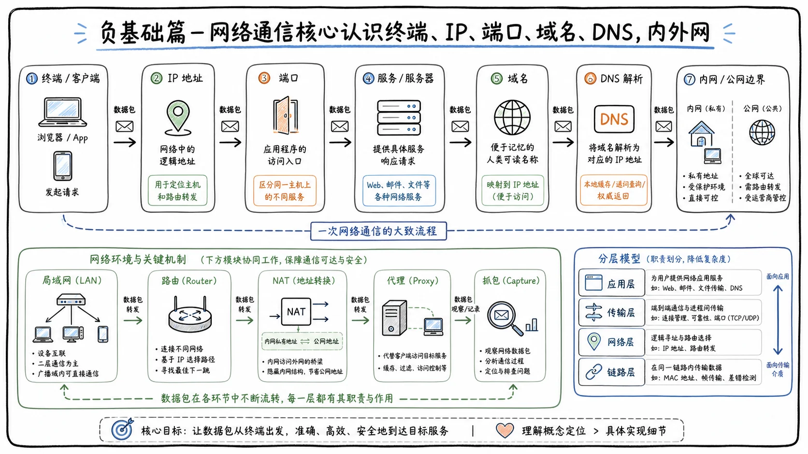

# 网络通信：网络安全学习的地基

## 为什么要理解网络通信

大家好，我是一只枷锁。今天给大家讲一下**网络通信的核心概念**。

大家每天都在上网，但你有没有想过：当我们通过浏览器访问百度时，百度服务器是怎么知道“我来了”的？两台相隔千里的电脑，又是怎么互相通信的？

网络通信是后续学习 Web 漏洞、抓包、靶场和渗透测试的地基。如果不懂通信，就很难看懂流量；看不懂流量，入门就会变得非常困难。

这节课会把一些基础内容讲清楚，让大家在后面的学习中，无论听我讲还是听其他师傅讲，都能更轻松一些。比如提到 **CMD、PowerShell、IP、端口**时，大家至少知道它们分别是什么，不至于混淆。

> 网络安全不是单纯地“记工具”，而是要先明白设备之间如何找到彼此、如何建立连接，以及数据如何传递。

## 认识终端与基础命令

## 什么是终端

终端就是一个可以在窗口里输入命令、让计算机执行操作的地方。很多终端看起来是黑色窗口，所以也常被称为“黑框”。

它就像一个**工具箱**。后面讲到 IP、端口等内容时，都需要亲手查看和验证，因此首先要学会使用终端。

学习安全为什么一定要会命令？主要有以下几个原因：

- 很多 Linux 服务器没有图形化操作界面，只能通过命令行操作。
- 很多安全工具本身也没有图形界面，需要通过命令启动。
- 有些工具需要使用 Python、Java 等环境运行，也必须输入相应命令。
- 我们经常要通过命令查看计算机和网络的基础信息。

所以，终端是以后学习网络安全时避不开的工具。

## Windows 中的 CMD 与 PowerShell

Windows 中常见的两种终端是：

- **CMD**
- **PowerShell**

两者看起来比较相似，但能力有所不同。

CMD 的兼容性很好，执行基础命令、运行 Python 程序或启动 Java 程序通常都没有问题。PowerShell 则更加强大，可以理解为一个功能更丰富、自动化能力更强的终端和脚本环境。

它们在界面上也有一些区别：

- CMD 通常运行的是 `cmd.exe`。
- PowerShell 的窗口标题会显示 `Windows PowerShell`，经典版本的界面通常是蓝色的。

### 打开 CMD

1. 按下 `Win + R`，打开“运行”窗口。
2. 输入：

```bash
cmd
```

3. 按回车，即可打开 CMD。

这个黑色窗口就是终端，后面的很多基础命令都会在这里执行。

### 打开 PowerShell

1. 点击 Windows 的“开始”按钮。
2. 在搜索框中输入：

```text
PowerShell
```

3. 点击搜索结果即可打开。

如果运行脚本或执行命令时提示权限不足，建议右键选择**“以管理员身份运行”**。CMD 也可以通过同样的方式以管理员身份打开。

## 常用命令

这些命令现在不需要死记硬背，只要先混个眼熟即可。后续使用得多了，自然就记住了。

### 查看当前用户

```bash
whoami
```

该命令会告诉你当前正在使用哪个用户身份。

例如，执行后可能会输出计算机名和用户名的组合，从中可以看出当前登录的 Windows 用户。

### 查看 Windows 网络配置

```bash
ipconfig
```

这个命令可以查看 Windows 系统中的网络配置信息，其中比较重要的是：

- IPv4 地址
- 子网掩码
- 默认网关
- 各个网卡的状态和配置

例如，在虚拟机中执行 `ipconfig`，看到的 IPv4 地址可能以 `172` 开头。这通常是因为虚拟机处于宿主机或虚拟化软件创建的内网中。

其中，**默认网关**通常就是当前设备用来连接其他网络的路由器地址。

### 在 Linux 或 macOS 中查看网络信息

在 Linux 或 macOS 中，可以使用：

```bash
ifconfig
```

部分较新的 Linux 发行版更常用：

```bash
ip addr
```

这些命令可以查看网卡及对应的 IP 地址，包括物理网卡、无线网卡和虚拟机创建的虚拟网卡等信息。

macOS 属于类 Unix 系统，终端的操作方式与 Windows 有一定区别，但本质上都是通过命令与系统交互。有些基础命令相同，有些命令则会有所不同。

终端本身也可以更换主题、字体和颜色。我平时使用的是自己安装的终端软件，但它与系统自带终端的本质是一样的。

### 测试网络连通性

```bash
ping www.baidu.com
```

`ping` 可以用来初步测试能否连通某个目标。

如果能看到数据包返回，并且延迟时间正常、没有持续显示超时，就说明当前设备与目标之间基本能够通信。通过 `ping` 一个域名，通常还可以看到该域名解析出来的 IP 地址。

如果在虚拟机中执行后持续超时，也可能不是百度出现了问题，而是虚拟机自身的网络配置存在异常。此时可以换到宿主机中继续测试。

需要注意的是，目标不响应 `ping` 并不一定代表网站没有运行，因为有些服务器或防火墙会主动禁止 ICMP 回显响应。

## 如何阅读命令输出

像 `ipconfig` 这类命令会输出一排排结构化文本，每一项都有相应含义。

例如：

```text
IPv4 Address. . . . . . . . . . . : 192.168.x.x
Default Gateway . . . . . . . . . : 192.168.x.x
```

如果 IPv4 地址以 `192.168` 开头，通常说明它是一个内网 IP。常见的私有 IPv4 地址范围包括：

- `10.0.0.0`——`10.255.255.255`
- `172.16.0.0`——`172.31.255.255`
- `192.168.0.0`——`192.168.255.255`

如果看到这些地址，通常说明设备位于路由器或其他网关设备后面。

如果实在看不懂命令输出，可以把完整结果复制下来，交给豆包、腾讯元宝等 AI 工具，让它逐行解释具体含义。

## 终端使用技巧与常见报错

使用终端时，可以通过 `Tab` 键补全命令、路径或文件名，避免重复输入。终端用得多了，这些操作自然会越来越顺手。

如果系统提示：

```text
不是内部或外部命令，也不是可运行的程序或批处理文件
```

通常意味着：

- 命令输入错误；
- 命令本身不存在；
- 对应程序没有安装；
- 程序所在目录没有加入环境变量。

例如输入一个系统中不存在的命令，CMD 就会报出类似错误。此时应先检查拼写，再确认对应工具是否已经正确安装和配置。

## IP 地址：网络设备的门牌号

## 什么是 IP 地址

现实生活中，每栋楼、每一户都有自己的地址和门牌号。只有把详细地址告诉快递员，快递员才能找到你家。

网络也是一样的。每一台联网设备都需要一个用于定位的地址，这就是 **IP 地址**。

> IP 地址可以理解为设备在网络中的“门牌号”。

不只是电脑，手机、服务器以及其他能够联网的设备，也都会拥有相应的 IP 地址。设备之间只有知道对方的地址，才有可能找到彼此并进行通信。

## IPv4 地址的格式

常见的 IPv4 地址由四组数字组成，组与组之间使用英文句点分隔，例如：

```text
192.168.1.10
```

它具有以下特征：

1. 一共分为四段。
2. 各段之间使用 `.` 分隔。
3. 每一段的取值范围是 `0`——`255`。

如果某一段数字大于 `255`，或者不是四段结构，就不是合法的普通 IPv4 地址格式。

现在也有大量设备使用 IPv6。IPv6 地址通常更长，以十六进制形式表示，并使用冒号分隔，例如：

```text
2001:db8:85a3::8a2e:370:7334
```

现阶段先重点认识 IPv4 即可。随着后续接触增多，自然能够区分 IPv4 与 IPv6。

## 公网 IP 与内网 IP

IP 地址可以分为两类：

- **公网 IP**
- **内网 IP，也叫私有 IP**

### 公网 IP

公网 IP 是互联网上可被路由的地址，可以类比为现实地图中的公开详细地址。一个对外提供服务的网站或服务器，通常需要通过公网 IP 让外部用户访问。

如果一台设备直接暴露在公网中，就像大门直接朝向马路，全世界的人都有机会来“敲门”。因此，拥有公网 IP 并对外提供服务的服务器，必须做好安全防护。

### 内网 IP

内网 IP 只在特定局域网中有效，不能直接作为互联网中的公开地址使用。

例如，家里有一台路由器，两台电脑和几部手机都连接到同一个 Wi-Fi。路由器会给每台设备分配不同的内网 IP，这些设备属于同一个局域网，可以在网络策略允许的情况下通过内网互相访问。

但互联网中的其他人，默认无法直接通过这些内网 IP 访问家里的电脑。

常见私有地址范围如下：

| 私有地址范围 | 常见使用场景 |
|---|---|
| `10.0.0.0/8` | 大型公司、机构或规模较大的内网 |
| `172.16.0.0/12` | 企业网络、虚拟化网络等 |
| `192.168.0.0/16` | 家庭路由器和小型局域网 |

判断一个 IPv4 地址是公网地址还是内网地址时，可以先检查它是否位于这三个私有地址范围中。如果属于这些范围，它通常就是内网 IP。

## 公网与内网对安全的意义

在渗透测试中，目标有没有公网 IP、能不能从外部直接访问，是非常重要的判断依据。

- 有公网 IP并开放服务，意味着外部存在直接访问入口。
- 只有内网 IP，通常意味着外部无法直接连接。
- 如果先控制了目标的公网服务器、边界设备或路由器，就有可能继续访问其内部网络。

例如，一家企业的业务服务器对外开放并拥有公网入口。如果攻击者控制了这台服务器，就可能以它为跳板，进一步接触企业内网。

新手阶段可以先重点关注公网 IP：

> **公网 IP：互联网中的其他设备有机会找到你。**  
> **内网 IP：通常只有同一局域网或相关内部网络中的设备才能访问。**

## 端口与服务：找到设备上的具体入口

## 什么是端口

知道 IP 后，只能找到具体设备，但一台设备上可能同时运行多个服务，例如：

- 网站服务
- 数据库服务
- SSH 远程登录服务
- 远程桌面服务
- QQ、微信等应用程序
- 其他自定义服务

这时就需要通过**端口**进一步定位具体服务。

可以把 IP 和端口类比成酒店：

- **IP** 是酒店的地址。
- **端口** 是具体房间号。
- **服务** 是住在房间里的客人。

送外卖时，只写酒店地址还不够。如果没有机器人或前台代送，还需要告诉对方具体房间号，才能准确找到人。

所以，端口是用来定位一台设备上具体网络服务的标识。

## 端口号范围

端口号的范围是：

```text
0——65535
```

许多常见服务都有约定俗成的默认端口。例如：

| 端口 | 常见服务 | 用途 |
| --- | --- | --- |
| `22` | SSH | 远程登录 Linux/Unix 服务器 |
| `80` | HTTP | 普通网页服务 |
| `443` | HTTPS | 加密网页服务 |
| `3306` | MySQL | MySQL 数据库服务 |

例如，一台服务器开放了 `3306` 端口，它可能运行着 MySQL 数据库；开放了 `80` 或 `443` 端口，则可能运行着网站服务。

这里不需要马上死记硬背。后续做题、搭建环境和分析目标时会不断遇到这些端口，用得多了自然就能形成反应。

默认端口也不是绝对不变的。管理员可以修改服务使用的端口，因此看到某个端口时，只能先根据常见情况作出初步判断，最终还要结合服务识别结果确认。

## 端口开放与安全暴露面

端口开放通常意味着相应服务正在监听，并可能允许外部访问。

可以把服务器想象成一座城堡：

- 每个端口都是一扇门。
- 每扇门后面对应一个具体服务。
- 门开得越多，外部可以尝试进入的入口通常也越多。

因此，开放端口越多，潜在的**攻击面或暴露面**往往越大。如果某个服务存在漏洞，攻击者就可能通过对应端口尝试进入。

反过来，如果不需要的端口全部关闭，外部能够直接访问的入口就会减少。

不过，端口开放不代表一定存在漏洞，只代表相应服务可能对外提供访问。安全分析仍然需要结合服务版本、配置、权限和漏洞情况进行判断。

## 客户端与服务端

## 谁发起请求，谁提供服务

理解了 IP 和端口后，还要分清通信双方的角色：谁先发起请求，谁负责提供服务。

一句话理解：

- **客户端**：主动发起请求的一方，相当于顾客。
- **服务端**：提供服务、等待请求的一方，相当于饭店或店员。

大家去饭店点菜时，会主动告诉店员自己需要什么，因此顾客相当于客户端；饭店负责接收需求并提供菜品，因此相当于服务端。

常见客户端包括：

- 电脑中的浏览器
- 手机 App
- 各类主动连接服务器的软件

常见服务端包括：

- 网站服务器
- 数据库服务器
- 文件服务器
- 远程登录服务
- 其他长期等待访问的服务

## 一次完整的访问过程

以浏览器访问网站为例：

1. 用户打开浏览器，浏览器充当客户端。
2. 用户输入地址或搜索内容，相当于发起请求。
3. 服务端接收到请求。
4. 服务端根据请求进行处理。
5. 服务端把页面或数据返回给浏览器。
6. 浏览器把结果展示给用户。

例如，访问百度时，我们把百度的地址交给浏览器，浏览器向对应服务器发出请求，服务器收到后返回百度页面。

再比如查询学校课表：

- 学生通过浏览器或手机 App 发起查询。
- 学校的服务端接收请求。
- 服务端可能从数据库中查询课表。
- 查询结果返回到浏览器或 App 中。

## 为什么安全学习要理解这种关系

攻击者重点关注的通常是**服务端**，因为服务端长期开放并等待访问，例如：

- 网站
- 数据库
- 远程登录服务
- 各种对外提供功能的服务器

服务端就像一直开门等客的饭店，也是安全测试中重点分析的目标。

浏览器等客户端主要用于发起请求。在测试过程中，测试人员可能借助浏览器、抓包工具或脚本构造请求，观察服务端会如何处理和响应。

## 域名、DNS 与解析过程

## 为什么需要域名

IP 地址可以定位设备，但一串数字不方便人类记忆。比如一个网站只提供 IPv4 地址，用户每次访问都要记住那串数字，显然比较麻烦。

因此出现了**域名**。域名是便于人类记忆和使用的地址，例如：

```text
www.baidu.com
```

百度仍然有对应的 IP 地址。执行：

```bash
ping www.baidu.com
```

通常可以看到该域名解析出的某个 IP 地址。

可以这样理解：

- **域名**是方便人类记忆的名称。
- **IP 地址**是网络通信实际使用的重要地址标识。
- 两者可以指向同一个网站或服务。

需要注意的是，一个域名可能对应多个 IP，一个 IP 也可能承载多个域名，并不总是一对一关系。

## 域名的层级

以：

```text
www.baidu.com
```

为例，从右向左可以看到不同层级：

- `com`：顶级域名
- `baidu`：二级域名
- `www`：主机名，也常被视为更低一级的子域名

常见顶级域名包括：

- `.com`
- `.cn`
- `.org`
- `.top`

例如，`.cn` 和 `.com` 都属于顶级域名。`baidu.com` 是注册和使用的主体域名，而前面的 `www` 用于指向具体主机或服务。

## 什么是 DNS

DNS 的全称是 **Domain Name System**，中文叫**域名系统**。它的重要作用之一，就是把域名解析成对应的 IP 地址。

可以把 DNS 类比成手机通讯录：

- 人名相当于域名。
- 手机号相当于 IP 地址。
- 通讯录相当于 DNS。

我们可能记不住张三的手机号，但可以记住“张三”这个名字。点击通讯录中的张三后，手机会自动找到对应号码并拨打。

DNS 做的事情也类似：当我们访问一个域名时，它会帮助计算机查询相应的 IP 地址。

## 域名访问的基本流程

一次常见的域名访问过程大致如下：

1. 用户在浏览器中输入域名。
2. 计算机先检查本地是否已经缓存了对应解析结果。
3. 如果本地没有，就向配置的 DNS 服务器发起查询。
4. DNS 查询并返回该域名对应的 IP 地址。
5. 计算机拿到 IP 后，再尝试连接对应服务器的端口。
6. 服务端处理请求并返回结果。

也就是说，访问域名时通常会先通过 DNS 把域名解析为 IP，再利用 IP 和端口访问相应服务。

> 域名方便人使用，DNS 负责查询和翻译，IP 与端口则帮助网络找到具体设备和服务。

## 内网、外网与网络隔离

## 什么是内网和外网

内网通常指一定范围内的局域网，例如：

- 家庭网络
- 公司网络
- 学校网络
- 办公室网络

以家庭网络为例，家里有一台路由器，电脑、手机以及家人的其他设备都连接到同一个 Wi-Fi。这些设备通常处于同一个局域网中，并分别拥有不同的内网 IP。

外网通常指互联网。互联网上的公开服务，可以通过公网地址向全球范围内的用户提供访问。例如，百度拥有对外可访问的服务入口，用户可以通过域名或对应公网地址访问它。

## 内网设备如何访问互联网

内网设备使用的是私有 IP，但仍然能够访问互联网，这是因为路由器通常会进行 **NAT**。

NAT 的全称是 **Network Address Translation**，中文叫**网络地址转换**。

家庭中可能有多台内网设备，但对外通常共用一个或少量公网 IP。路由器会完成以下工作：

1. 接收内网设备发送的数据。
2. 将通信转换为使用路由器公网地址对外发送。
3. 记录对应的连接关系。
4. 收到外部返回的数据后，再转发给正确的内网设备。

它有点像小区传达室或负责收发信件的中间人：

- 住户先把要寄出的信交给传达室。
- 传达室统一把信送出去。
- 外面的回信到达后，传达室再根据记录交给对应住户。

在这个比喻中，路由器就是负责中转的角色。

因此，家中多台设备虽然都使用内网 IP，却可以借助路由器的公网出口同时访问互联网。

## 物理隔离与逻辑隔离

网络隔离大致可以分为两类。

### 物理隔离

两个网络之间完全没有物理连接，线路和设备层面彼此分离。

### 逻辑隔离

网络在物理上存在连接，但通过技术手段规定：

- 哪些设备可以互相访问；
- 哪些网段不能通信；
- 哪些服务允许通过；
- 哪些数据必须被拦截。

新手阶段如果觉得这部分比较难，先分清内网和外网即可。后续学习防火墙、VLAN、访问控制等内容时，会逐渐理解逻辑隔离的具体实现。

## 什么叫“不出网”

有些内网设备无法主动访问互联网。

例如，在银行或某些单位工作时，可能会发现办公设备使用的是内网 IP，并且无法访问百度等公网网站。这通常是因为网络做了隔离或访问限制。

“不出网”通常指：

> 内网中的设备无法主动连接外部互联网服务。

有些环境还会同时限制外部连接进入，形成“外面连不进来，里面也访问不出去”的隔离状态。

## 代理、抓包与隧道

## 什么是代理

现实生活中的代理，是接受委托并代替他人完成某件事的人或机构。

例如，想购买海外商品，但自己无法直接购买，于是委托本地代理商代购。代理商买到商品后，再转交给你。

网络中的代理也类似，它是一个帮助转交请求的中间人：

1. 你把请求交给代理。
2. 代理替你访问目标。
3. 目标把结果返回给代理。
4. 代理再把结果交给你。

代理又可以分为**正向代理**和**反向代理**。

## 正向代理

正向代理位于用户与目标网站之间。

访问过程大致是：

```text
用户设备 → 正向代理服务器 → 目标网站
```

用户通过代理服务器访问目标网站。目标网站直接看到的通常是代理服务器的连接信息，而不是用户直接与它建立连接。

也就是说，用户“躲在”代理服务器后面。目标网站知道代理服务器访问过它，但未必能直接看到原始用户的网络地址。

## 反向代理

反向代理位于客户端与真实服务器之间。

访问过程大致是：

```text
客户端 → 反向代理服务器 → 后端真实服务器或服务器集群
```

客户端访问的是反向代理服务器。反向代理再把请求转发给后面的真实服务器，并把响应返回给客户端。

这时，真实服务器“躲在”反向代理后面。客户端通常只知道反向代理的地址，不一定知道后端究竟有哪些服务器以及它们的真实地址。

可以简单记忆：

- **正向代理**：用户躲在代理后面。
- **反向代理**：真实服务端躲在代理后面。

## 抓包工具与代理

后续学习中会使用抓包工具。部分抓包工具会通过代理方式，让浏览器流量先经过它，再转发到目标服务器。

这样就可以观察流量中的数据，并进行分析或修改。可以把它理解为：

- 请求先被工具拦下来；
- 打开看看里面有什么；
- 根据需要分析或修改；
- 再决定是否放行。

抓到数据包后，就可以进一步研究请求参数、响应内容、身份信息以及客户端与服务端之间的交互过程。

## 什么是隧道

隧道可以先简单理解为：**把一种流量封装在另一种传输形式中，使其能够通过特定网络路径传递。**

它有点像给快递重新打包。包装完成后，只看外层不一定知道里面具体是什么。

例如，某些特殊物品需要经过检查站或通过特定运输方式寄送，就可能使用普通包装进行封装，让它看起来和其他包裹类似，再随着正常运输流程发送出去。

隧道在这里起到的是封装和传输作用。在一些场景中，它也可以增加流量识别的难度。不过，隧道的具体原理和类型比较多，后续还会继续扩展。

## 核心概念串联

网络通信的基本过程可以按下面的逻辑理解：

1. **域名**方便人类记忆网站地址。
2. **DNS**把域名解析成 IP 地址。
3. **IP 地址**帮助定位网络中的设备。
4. **端口**帮助定位设备上的具体服务。
5. **客户端**主动发起请求。
6. **服务端**接收请求并返回结果。
7. 内网设备可以通过路由器和 **NAT** 访问互联网。
8. **代理**可以在客户端与服务端之间转发请求。
9. **隧道**可以对流量进行封装并通过特定路径传输。

这些概念暂时不需要全部死记硬背。现阶段最重要的是能够分清：

- 什么是终端；
- 什么是 IP 和端口；
- 什么是公网与内网；
- 什么是客户端与服务端；
- 域名、DNS 和 IP 之间是什么关系；
- 内网设备如何通过路由器访问互联网；
- 代理和隧道大致解决什么问题。

如果某个概念还没有完全理解，可以让 AI 用更直白的方式解释，并结合生活中的地址、酒店房间、通讯录、传达室和代购等例子反复理解。随着后续抓包、靶场和渗透测试实践增多，这些概念会逐渐串联起来。


