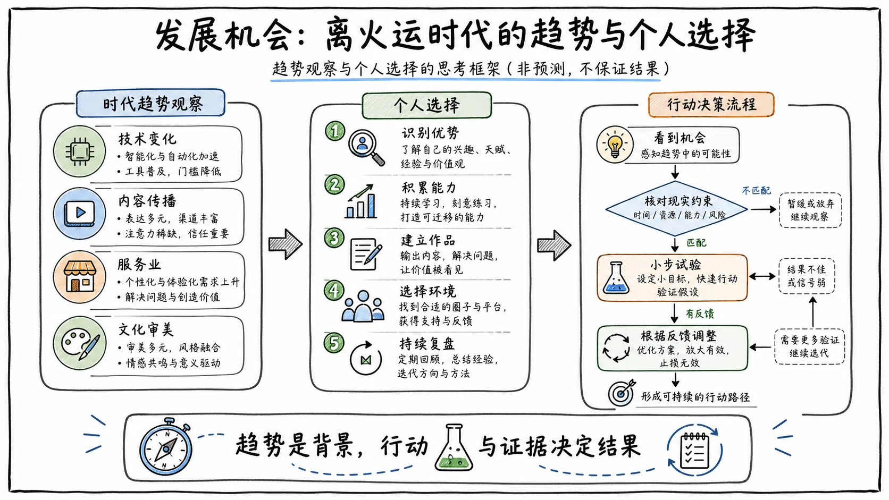

## 第八次阶层跨越的窗口

离火运的时代趋势，是第八次跨越阶层的机会，但也很可能是最后一次。这篇视频我发了很多次，都因为部分内容敏感而没有通过。经过反复修改，才算把核心内容发出来，很不容易。内容很长，你需要仔细看，甚至每年都可以拿出来看一看，一定会对你在离火运时代的发展有所帮助。

我希望把粉丝当作朋友。作为朋友，我想为支持和关注我的人添一把力，帮助你在未来20年创造更辉煌的人生。

自1978年改革开放以来，中国出现过七次阶层飞跃的机会：

1. **1977年恢复高考。** 很多穷孩子实现了阶层飞跃。凡是1977年参加高考且考上的人，现在的生活基本都不差。
2. **20世纪80年代前后的乡镇企业。** 这是我国历史上农民群体大规模由农转商的一次机会。
3. **1984年双轨制套利。** 低价获取商品，再到计划外市场高价卖出，大量的人由此完成了原始积累。
4. **1992年南方谈话后的下海经商。** 一批敏锐的体制内人员和知识分子选择下海。
5. **2002年至2012年，中国加入世界贸易组织带来的资源红利期。** 这一时期诞生了一大批民营老板。
6. **1998年至2019年的房地产趋势。** 很多人依靠房价上涨和拆迁，一跃成为富豪。
7. **互联网兴起，以及后来移动互联网的红利期。**
8. **从现在开始的未来20年，也就是离火运中的“火”。**

2024年甲辰年起，我们正式进入九紫离火运时代。2024年至2043年，“火”在社会层面对应的是**人心与文化**。

## 全球经济转型与文化战争

## 传统增长红利正在消退

社会的发展、国家的发展、个人的发展都离不开经济。经济基础决定上层建筑，未来的战场在于**文化经济**。

20年前，中国的产业链还很弱：铁路不发达、速度慢，公路里程短，航空运输落后。甚至在2005年前后，车匪路霸仍然存在，假冒伪劣、粗制滥造的商品随处可见；信息技术不发达，能源利用效率低，村镇冬天过年停电都是家常便饭。

现在，我们的信息技术、信息安全、移动支付、高铁、物流、承建体系和工业体系，部分领域甚至比美国还要超前。在偏远山村，只要有人居住，快递物流就能送达，通信网络就能覆盖。随便一座四线城市，超市供应链中的采购、运输、加工、信息传递等环节都已经非常完善。这样的经济运转效率，在全球都处于领先水平。

过去20年，从中国加入世界贸易组织以后，中国经济一直保持飞速发展，吃的是人口红利和全球化红利。其实从2013年起，全球经济就已经开始出现萎靡。我们之所以能够一直保持较高的经济增速，一是因为起点低，二是因为在国际贸易方面做得好。

在世界经济一体化进程加快的当下，我们的经济运转效率已经触顶，微观操作很难改变大趋势，很多行业的红利也已经到期。

- 中国互联网用户已经超过10亿，很难再有大幅增长。
- 地产行业基本到顶，能买房的人基本已经买了，买不起的人短时间内仍然买不起。
- 中国目前的城镇化率接近65%，70%左右就是一道红线，大规模城镇化改革带来的红利已基本消耗殆尽。
- 能源消耗型行业和传统汽车领域也已扩张到顶峰，正在缓慢回落。

经济快速增长时，很多问题都被掩盖了。人们的财富在增加，生活质量在提高。虽然贫富差距一直在扩大，但普通人手里仍然有钱消费。现在经济增速放缓，你能切实感受到消费降级、资本越来越集中和垄断，贫富差距导致的社会矛盾愈发明显，民众戾气加重。

全世界都是如此，甚至有些国家比中国更严重。所以你能看到世界各地发生大量恶意伤人事件、日本枪击案等。普通人财富增长的速度跟不上被稀释的速度，循环出了问题，全球都处于经济危机之中。

## 科技、战争与文化竞争

过去解决这类问题，通常有两种方式：

1. **依靠科技进步和技术革命，也就是做大蛋糕。**
2. **依靠战争重新分配蛋糕。**

在当前的时间节点，科技发展的速度正在放慢。美国科技过去一直处于全球领先地位，也正因为科技发展速度放慢、前方被墙堵住了，中国才能迅速追上来。

美国想维持霸权，让全世界为其消费买单，就必须保持远超其他国家的地位。首先要打击的，便是追得最近的中国。所以近几年，我们才会看到美国对中国企业、制造业和产业链进行一轮又一轮的制裁。

全面战争的概率不高。我们现在是“坐在核弹上的和平”，真要打起来，普通人还没到前线，后方的资本大佬可能先“被和平”了。局部战争的概率则很高，例如俄乌战争、缅甸战争、巴以冲突、朝韩对抗等。但局部战争解决不了根本问题，剩下的方式就是**文化战争**。

文化战争其实早就开始了。美苏冷战时期，美国主动把中国纳入由其主导的世界经济体系。美国当时的想法是，只要中国把大门打开，美国的自由民主思想、先进文化和民族形态传入中国，中国人的思想就会迅速瓦解。

1954年，美国已经有彩色电视机和电视节目；20世纪60年代，彩色电视和电话在美国已经普及。当时美国的先进发达，对比中国的落后，基本属于降维打击。

美国自以为预判了一切，却忽略了中国人的凝聚力、大国情怀，以及中国文化的包容性。

在中国，无论你来自哪个省市、属于哪个民族，当你遇到不会做的事情，比如不会坐地铁，只要诚恳地说一句：“同志，你能不能教我坐地铁？”百分之百会有人帮你，不会有人嘲笑你。这就是中国人的凝聚力。

“修身、齐家、治国、平天下”，家国情怀是几千年来扎根于中国人内心深处的精神元素。对中国人来说，不仅有家国情怀，更有大国情怀。自秦始皇统一中华以来，中国人的意识形态始终只有一个：排名第一是应该的，排名第二就是不行。我们追求的是大国崛起，是民族复兴。

为此，我们愿意付出别人难以想象的代价。科学家愿意啃着馒头研制“两弹一星”，深入无人荒漠勘探石油，无数劳动力自带干粮开荒修路。中国文化的包容性，更是历经几千年而历久弥新。

现在爱喝可口可乐的人很多，爱吃肯德基、汉堡的人也很多，但在我们的意识里，都知道这些属于垃圾食品，只是偶尔尝个鲜。

## 文化输出决定产品空间

文化战争没有想象中那么简单。在文化输出方面，美国全方位占领了文化高地，并利用文化和舆论影响了太多国家。

从印度的《三傻大闹宝莱坞》、泰国的《天才枪手》等电影中，你会看到，他们顶级学校里的顶级学生，最大的梦想往往是去美国。好莱坞、美剧、影视、嘻哈音乐、民主自由、美食等文化符号，这些年为美国吸引了大量人才。

最近几年，也曝出过不少间谍新闻。美国在我国的间谍其实不少，尤其集中在文化传媒领域。他们引导着我们的思想和文化，一些“香蕉人”大V不停发表鼓吹国外的言论。之前的“毒教材”风波，就是典型案例。

为什么国内有些人那么向往美国，想要“润出去”？因为美国的文化宣传做得好。很多大V其实是美西方意识形态的带路党，是针对中国发动意识形态战争的伪军，也就是美西方口中的“让中国人忽悠中国人”。

如果所有人都向往美国、喜欢美国文化，以美国产品为尊，以去美国为荣，这个国家就再也没有希望了。

> **战争，攻心为上，攻城为下。**

离火运中的“火”，对应的正是人心和文化。中国文化博大精深、包容性强，想全面侵蚀中国文化很难；但中国文化想真正推广出去，仍然需要很长的路，而这也正意味着巨大的增长空间。

在文化领域，中国在世界上的影响力与美国相比仍有很大差距。在国际高端奢侈品和艺术领域，很多人瞧不起中国人，认为中国人没有审美。我们的手机厂商为什么要联名国外高端设计品牌？因为我们自己的品牌积淀还不够。为什么一定要打造自己的高端设计品牌？因为我们必须拥有。

谁的文化占据主流，谁就会拥有更大的产品输出空间。如果其他国家的人都向往中国文化，想来中国，以会说中文为荣，以使用中国产品为面子，甚至一个普通大学生去国外旅游，都能兼职做中文外教赚钱，中国经济怎么会不快速发展？

现在的文化战争中，真正坐上牌桌的玩家只有两个：**中国和美国**。

2024年至2043年的九紫离火运时期，文化战争将再上一个台阶。近几年，政策层面一直在提文化复兴、民族复兴，也在推动全面复兴传统文化。当前民众的道德价值观受西方文化影响较大，恶意伤人事件频发，民众心理压抑，没人再谈论为社会作贡献，也很少有人谈论理想和抱负，这是一种非常畸形的文化心理。

现在，对网络舆论引导和挑唆行为的处理已经比过去严厉很多，对不良文化风气、不良社会风气的管控也在进一步加强。国家层面承办亚运会、冬奥会等大型国际体育赛事，宣扬中国文化，同时鼓励各地发展特色文化旅游经济。

无论是国策，还是具体行动与鼓励，其实都在为一件事做准备：**文化输出，并将文化输出塑造为新的经济增长点。**

## 理解九紫离火运的底层逻辑

## 从问题溯源，而不是追逐答案

为什么要先说这些？因为离火运是“天时”，世界格局和社会经济是“地利”与“人和”。更重要的是，要理解趋势的起源。只有了解文化输出趋势的形成过程，才能更好地顺应趋势。

我的行事理念是：遇到问题，先寻找问题出现的原因，也就是溯源，再顺延到现在，真正了解这个问题。这样的行事理念让我受益良多，让我不会只局限于事情表面。

否则，即使这一次的问题解决了，下一次它还是会出现。人的成长，是让已经出现过的问题以后不再出现。出现一次解决一次，却始终没有触及根本，那就是一个无底洞。对于人的成长来说，其实没有任何进步。

有困惑时，我从来不是为了得到一个现成的结论，或者直接给你一个固定答案。我更倾向于启发思考。只有经过思考，才会真正理解，才能根据自己的情况去运用、去行动。

所以你才会看到，一些人看起来一直在跟着趋势走，总觉得自己发现了一个又一个商机，但既没有承接趋势的能力和条件，也不了解趋势当前所处的阶段，总是晚一步，最后只能像猴子下山一样，两手空空。

离火运是时代的机遇，但只有在真正理解的基础上，才能借此发展自己。

## 三元九运与离火之象

九紫离火运来源于三元九运。按照这一体系的说法，每隔60年，水星、金星、地球、火星、木星、土星等会回到与60年前相近的位置，形成一个小轮回，也就是一甲子，或者叫“一元”；每隔180年，九大行星会处于太阳的同一侧，分布在一个较小的扇面中，也就是所谓的“九星连珠”，形成一个大轮回。

三元九运是一种时间划分方式：

- 一元为60年；
- 三元共180年；
- 一元分为三运；
- 一运为20年；
- 三元合计九运。

## 离火的七重含义

### 1. 离为火：炎上与爆发

火的类象，核心状态是**炎上和爆发**，为日、为电、为甲胄、为戈兵，都是这一状态所象征的具体事物。

对应离火运中有利的行业方向：

1. 新型能源的开发与利用；
2. 能源传输和利用效率提升。

这两个方向也是未来科技发展的重要方向。

不利的一面是战争。目前已经显露端倪，例如俄乌战争、巴以冲突、缅甸战争、朝韩争端等。

### 2. 离为明：精神、文明与文化

“明”对应光明与文明。离卦象中虚，对应精神和文化。

> 星星之火，可以燎原。

火不是某一个具体的人，而是精神的传承。“火主礼”，对应的也是文化。

有利的行业方向包括：

- **文化方向：** 视觉类产品、电视、电影、短剧、绘画、艺术、动漫、游戏、短视频、国学、智能产品、虚拟现实等；
- **心灵方向：** 心灵疗愈、心理学、心理咨询、专业顾问、灵修、玄学、宗教、冥想等。

这些领域会被更多人关注，并得到更快速的发展。不利的一面是，精神空虚、心理疾病等问题会增多，人的戾气也会增加。

### 3. 离，丽也：依附、共生与运化

很多人把“丽”简单理解成美丽，以此判断医美行业会发展得很好，这是一个误解。

有火，才会产生光明；“明”依附于火，这就是“丽”。但依附只是一种表象，“丽”真正对应的是一种状态：**共生和运化**。

在原有事物的基础上运化出新的东西，也就是浴火重生。它来源于过去的事物，又融合新时代的理念，迸发出新的生机。

对于个人而言，可能是依附于大平台或产业链的资源，去做自己的东西；而自己的东西，又能为平台和产业链带来更多资源。

对应的有利行业包括传统文化、中医、针灸、习俗、手工艺、非遗传承等。这些历经时代考验而保留下来的事物，与当代理念和科技结合后，会诞生新的行业领域。

不利的一面，是腐朽思想可能出现复辟趋势。

### 4. 离为雉：美学、审美与外在形象

“雉”是羽毛漂亮、很有气势的野鸡，代表外在美丽、美学和审美。

对应的有利行业方向：

1. 美学设计、审美相关领域；
2. 体态培养、体态矫正、气质培养相关领域；
3. 外貌管理、美容、医美相关领域。

不利的一面，是可能出现畸形审美。

### 5. 离为目：眼睛、心脏与精神系统

“目”就是眼睛。人体中的眼睛、心脏、精神系统属火。

对应的有利行业方向：

- 眼睛、视力相关领域；
- 健康、养生相关领域；
- 精神与心理相关领域。

不利的一面，是视力和精神问题会增加，人们也更容易在这些方面出现疾病。

### 6. 离为中女：不是“中年妇女”

一些人把“中女”解释成中年妇女，这是很大的误区。

> “离再索而得女，故谓之中女。”

乾卦取坤卦第二爻而形成离卦，这是离卦的形成过程。水平再差，也不至于把离卦中的“中女”理解成中年妇女。

“中女”指的是一类女性的心性状态：**外刚内柔、独立自强，上能担得起责任，下能心思细腻、体谅别人。**

长女、中女、少女并不只是指不同年龄的人，也对应不同的心性与品德状态，可以理解为不同的“配位”。

我的看法是，具备“中女”心性状态的人，在离火运中会发展得更好，更能得到人们的认同与关注，而不是其他人所说的“中年妇女”。相对而言，外柔内刚的长女、过刚率性的少女，在离火运中的发展就没有那么有利。

### 7. 离为南方：信息公开与及时获取

> “离，南方之卦也。圣人南面而听天下，向明而治。”

“南”既是方位，也指能够及时获取最新信息的地方。只有信息公开、透明，才能形成大的成果。

## 离火运中的行业与城市机会

## 七类有利行业

综合来看，离火运中较为有利的行业包括：

1. **健康医疗**
   - 眼睛、视力相关；
   - 健康养生；
   - 中医；
   - 精神与心理相关领域。

2. **文化领域**
   - 传统文化；
   - 非遗传承；
   - 视觉类产品；
   - 短剧、电影；
   - 绘画、艺术、动漫；
   - 短视频；
   - 国学、智能产品等。

3. **能源方向**
   - 新型能源；
   - 能源利用效率提升；
   - 能源传输技术。

4. **心灵方向**
   - 心灵疗愈；
   - 心理学、心理咨询；
   - 专业顾问；
   - 灵修、玄学；
   - 宗教、冥想。

5. **女性相关领域**
   - 女性地位会进一步提高；
   - 女性认知、素质、才能培养等行业会进入爆发期。

6. **美业相关领域**
   - 美容、医美；
   - 整脊、正骨；
   - 体态调整；
   - 气质和形象管理。

   这些领域并不只局限于女性市场，未来会有越来越多的男性产生相关需求。

7. **体验式经济**
   - 地方特色文旅；
   - 虚拟现实；
   - 线下实体展馆；
   - 能够提供精神满足和愉悦体验的产品与服务。

## 可能快速崛起的城市

离火运中可能快速崛起的城市包括：

- 杭州；
- 长沙；
- 武汉；
- 苏州；
- 宁波；
- 潮汕等地区。

这些城市既有经济潜力，又有文化底蕴，还有产业支柱、科技创新能力，信息相对公开透明，能够吸纳更多的人才。人口流入增加，城市就更有可能崛起。

## 四类相对不利的行业与工作

### 1. 单纯依靠个人时间和精力产出的行业

例如传统金融业中的柜员，以及会计、审计、担保等岗位。这类工作有一个共同特点：主要依靠个人时间和精力产出，产出成果无法持续创造新的价值，也难以迅速传播和爆发。

火的核心类象就是“爆发”。成果能够迅速扩散、形成爆发的领域，才会拥有更大的潜力。

### 2. 重执行、低思考的工作

例如制造业流水线岗位，很容易被人工智能取代。

火对应精神和思考。只有思考和创新，才能创造新的价值。

### 3. 高能耗、高排放、高污染行业

未来能源结构优化、新能源发展是大趋势，传统高耗能企业会被逐渐淘汰。

### 4. 单纯依靠“人多”的行业

未来的经济发展，一定会从依靠人多、团体使劲，转向**精英战略**。未来，“人”不是核心，“人才”才是核心。

## 真正的机会不等于盲目跟风

## 天时、地利与人和缺一不可

任何一运都并非绝对的好或坏。只有真正理解离火运，思考它对应的状态，才能找到真正的机遇。

很多人为了迎合某些节奏而人云亦云，让大量女性变得非常亢奋，最后成为新一轮韭菜；或者看到自己当前就在所谓的离火运行业，待在所谓有利的城市，就觉得自己未来20年一定会发大财。

这样的人，在离火运中反而可能首先被淘汰。

> **忠言逆耳利于行。**

时代是人的时代。天象规律是天时，世界格局是地利，社会经济是人和。只有把天象与自然规律、世界格局、社会经济规律结合起来，才能找到真正的机遇。

历史上曾经出现过多次离火运，总结起来有几种共同表现：

- 艺术繁荣；
- 文艺复兴；
- 文明发展；
- 科技进步；
- 战争动乱；
- 人心归一。

但时代在向前发展，世界格局也在变化，轮回绝不意味着一模一样。这一次离火运的核心，是**文化输出**。

## 个人的文化输出就是价值观输出

对个人来说，文化输出就是把自己的价值观和理念表达出来，链接更多的人。

中国社会的主流价值观正在发生转变。离火运时代，人们对精神、文化和审美的追求增加。精神更加充实，人就会变得更理性，更专注于现实生活。

过去那种极端投机、相信可以一夜暴富的心理会越来越少，人的内心会更加成熟。未来不再是说几句忽悠的话就能搞定客户的时代。哄着、骗着、说好听的话、给人洗脑，不再有市场。

想靠捷径、投机取巧、忽悠割韭菜、仿冒欺诈，都会越来越行不通。成功学、贩卖焦虑会逐渐崩盘，很多故弄玄虚的东西也会消失。

如果你想在离火运中出头，必须有好的人品，得是一个好人。你的价值观和理念要能够指引更多人，能够给别人带来帮助，切实给别人带来好处，让人们产生更多思考和成长。只有这样，人们才会认可你、相信你、支持你。

*董宇辉会越来越多，李佳琦会越来越少。*

人工智能和虚拟经济越发达，人们就越会看重内在与真实。虚荣、炫耀、面子经济会逐渐衰落，人们会更加渴望内心富足，喜欢真实的东西。依靠包装、硬凹人设的时代正在过去。

完美人设的偶像是脱离大众群体的。一个完全没有黑暗面的人，反而不值得信任。是人就会有缺点，每个人或多或少都有黑暗的一面，但这并不妨碍我们去做正确的事，这才是真实的人。

未来，人们会越来越喜欢真实的人，越真实越好。一个真实、有内涵、有思考、有正向价值观的好人，才能在离火运时代链接更多的人，抓住真正的机会。

## 企业经营与文化价值观

## 产品的根基是品质、文化与体验

对于做事业、做企业的人来说，要把地方文化输出，形成更多产品与体验，为更多的人服务。

“地方”不只局限于地理区域。文化的载体不是某个地理城市，而是人群。你的特色、核心竞争力、行业圈子的文化、对待员工的文化理念、企业价值观、用户群体的文化理念，都会成为产品的根基。

“粗制滥造、力大砖飞”的时代过去了。未来的产品，靠的是：

- **品质；**
- **文化；**
- **体验。**

这些都需要老板或高管脚踏实地做事，真正满足客户需求、解决客户痛点，再以文化和价值观塑造认同。

## 老板和管理者应该把时间用在哪里

如果你是老板、高管，或者未来想做事业，希望你记住下面的话。这也是我过去做企业咨询时得到的宝贵经验：

> **富在术数，不在劳身。**

仅靠勤劳，很难创造大财富。单纯依靠体力和时间，并不是在努力改变未来，充其量只是在承受自己的过去。

在工作和事业上，能不亲自动手做的事情，就不要亲自做。你的时间应该用于思考整体行业趋势、市场趋势，思考如何服务员工和同事，提高他们的运转效率。

员工才是公司的财富。不要逼迫员工进行无意义的加班。很多中国式加班，不过是在满足老板“地主思想”式的控制欲。

应该从“如何让员工获得更多收入、过上更好的生活”这个出发点管理企业，塑造企业价值观。员工收入增加，你的收入自然也会更多。

火势聚众、形成爆发，上下一心，公司才能真正发展起来。

## 国家层面的文化输出

对国家来说，是要把民族文化和意识形态输出出去，引领世界文化发展，吸纳世界人才，开辟人类命运共同体。

国家层面的内容不适合说太多，只说一句：

> **中国文化智慧走向世界，势不可挡。**

把个人、公司、国家这三个层面琢磨透，再结合自己的条件和能力顺应时代发展，才有可能成为最终的赢家。

## 未来20年，人真正要修的是自己

## 从集体内卷转向向内求

离火运未来20年，人真正要修行的是自己。

现在的我们被套上了物质枷锁，陷入集体内卷，而且越来越严重。越来越多的人开始出现心理和精神问题。自我修行、向内求，是唯一的路。只有内心豁达，才能面对一切可能出现的危机。

一个人最大的底气是什么？

我们所倚仗的身体迟早会腐朽，我们所信任的大脑会逐渐迟钝，记忆会变得模糊，钱财终会散尽。我们爱的人，也会随着时间慢慢消逝。

> **兴尽悲来，识盈虚之有数。**

任何事物都有自己的生命周期，任何人与物都会改变。我们所拥有的一切，都只是暂时拥有，随时可能离我们而去。

当这些都离我们而去时，我们还能倚仗什么？我们还有什么底气？

## 允许一切发生的从容感

一个人最大的底气，是**允许一切发生的从容感**。

感受每一种情绪，感受生活本身，活在当下，做真正的自己。不在意别人的评价和眼光，永远保持自己的节奏和步调。

人生没有白走的路，每一步都有它的意义。一路上有你的成功，也有你的失败；记载了你的愚蠢，也印证了你的智慧。所有这一切，才造就了现在的你。

而现在的你，才是未来的起点，也具备成就未来的最大可能。

> **在你人生的舞台上点燃烟花，让你的未来在离火运中绽放。**
