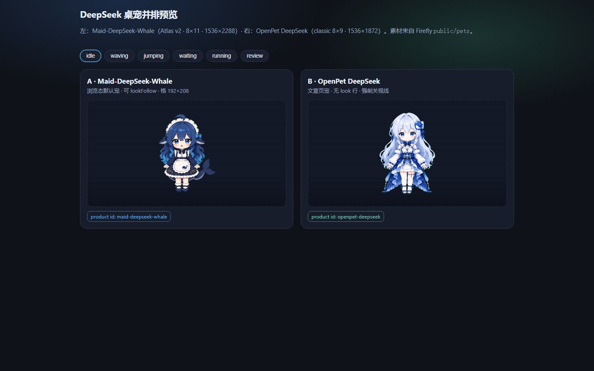
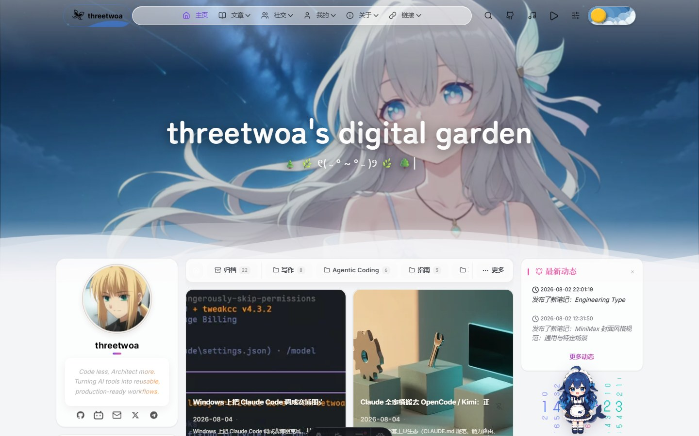
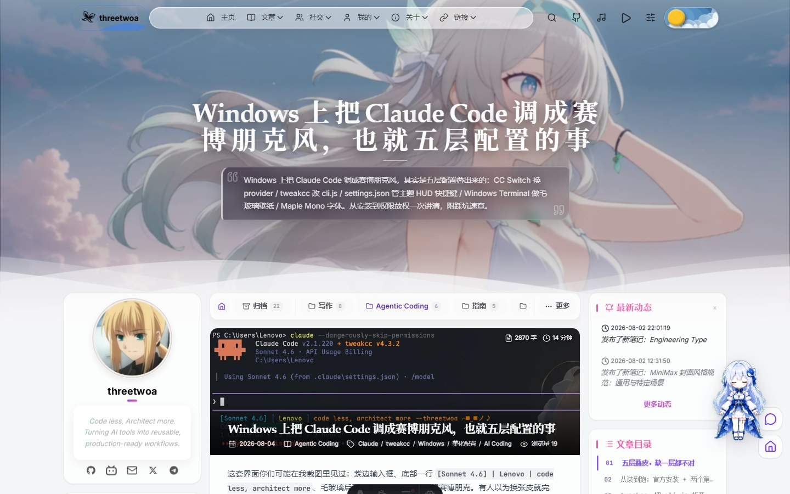

以前站里的桌宠是一套 cc-haha 四角色，看着热闹，跟现在写的东西却越来越不对味。

我想要的其实很简单：首页闲逛时是一只 **DeepSeek 鲸女仆**；真点进文章，再换成另一只 **OpenPet DeepSeek**。同时只出现一只，别搞成侧栏两头各挂一个抢戏。

## 先分清：这是 spritesheet 桌宠，不是 Live2D

Firefly 里三种「站宠」互斥：**SpritePet（spritesheet）**、Spine、Live2D。开了桌宠，后两者就不挂。

这次迁入的两只都是 Codex 系 atlas：

| 角色 | 产品 ID | 用在哪 | Atlas | 整图 |
|---|---|---|---|---|
| Maid-DeepSeek-Whale | `maid-deepseek-whale` | 浏览态（非 `/posts/`） | v2 · **8×11** | 1536×2288 |
| OpenPet DeepSeek | `openpet-deepseek` | 文章页 `/posts/*` | classic · **8×9** | 1536×1872 |

格都是 192×208，九态动作行能对齐；差别在 Maid 多了第 9–10 行视线帧，OpenPet **没有**。

左边那只蓝发鲸女仆，apron 上还有小鲸鱼；右边是蓝白裙 OpenPet。预览页只是对照沙盒，真正上站的资源在 `public/pets/`。

## 最容易踩的坑：行数搞错会整表错帧

动画核以前默认按 11 行算 `background-size`。OpenPet 只有 9 行，如果还按 11 行去切，纵向会被拉歪，动作全错位。

对策也很直白：

- Maid → `PET_ATLAS_V2`
- OpenPet → `PET_ATLAS_CLASSIC_8X9`
- OpenPet 运行时 **强制关** `lookFollow`（没有 look 行硬跟只会出鬼）

## 换皮只认 URL，不认卡片悬停

站上只有一个 SpritePet 实例（Swup permanent）。判别就一条：

路径里有 `/posts/` → OpenPet；否则 → Maid。

卡片悬停不预切换。你还在列表页，就是 Maid；落地进文，才淡换成 OpenPet。

手机也按场景拆：浏览态可见默认宠；文章页窄屏隐藏，免得挡正文和回顶。

## Maid 还会在「看得见的」侧栏卡之间逛

文章页的 OpenPet 不游走。Maid 在浏览态会定时挪到当前视口里还露着的侧栏卡片旁（最新动态、公告、热门、统计、资料、标签、日历、时钟）。

硬约束只有一句：**滚出屏幕的卡永不落点**。你一滚，锚点没了，它就改去仍可见的那张。拖过一次且开了 `pauseWhenPinned`，自动游走会停，位置记在 `localStorage`。

抓取时跳一下就够了，别让 idle 自己循环蹦——看着像抽风。

## 许可黄线别装没事

| 包 | 现状 |
|---|---|
| Maid | 来源 codex-pets / aimcp，标注 **unknown**（作者线索 DeaDumB） |
| OpenPet | AwesomeHou/openpet-ai-girls，仓内 **无 LICENSE** |

站内自己试用可以接；**公开再分发前先过授权**。旧的 cc-haha 四宠资源已经从 `public/pets` 清掉了。

## 想开的话

`petConfig.ts` 里把 `spritePetConfig.enable` 设成 `true`，Spine / Live2D 保持关。默认可调：`defaultPetId` / `postPetId` / `size` / `lookFollow` / `roam.*`。

对我来说，这套比「全站一只固定皮」舒服多了：逛花园是鲸女仆，认真读文换成另一只 DeepSeek 娘——切页换皮，不抢戏。
