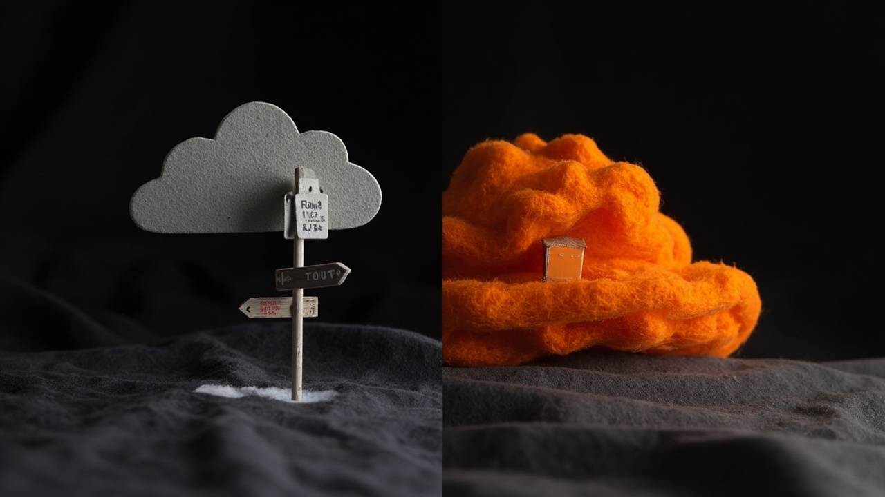
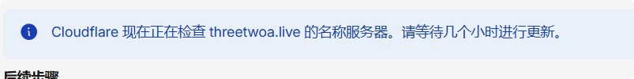

国内打开 `*.vercel.app` 经常抽风，自定义域名又想少花钱。这一轮把个人博客的边缘架构定成了三件套：**Vercel 只负责构建，EdgeOne 个人版扛主站 CDN，Cloudflare 免费档只干图床和防护**。现金刚需基本就是 EdgeOne 那个月费。

同学侧实测已经能打开；含中国大陆节点、卡片封面整批迁 R2，都刻意后置，不挡这一刀收官。


## 一开始想解决什么

三件事，成功标准也很硬：

| 诉求 | 成功样子 |
|---|---|
| 自定义域名 | `https://www.threetwoa.live`（及 apex）可访问、有 HTTPS |
| 国内向能打开 | 不再把推广链接押在被污染的 `*.vercel.app` 上；主站走 EdgeOne |
| 图床 / 防攻击 | 尽量吃 Cloudflare 免费档；主站安全用满已购的 EdgeOne 个人版 |

刻意不做的：未备案硬开「含中国大陆」节点；整站迁 Cloudflare Pages；为了安心去升 EdgeOne 基础版或买 CF Pro；主站再套一层 CF 橙云变成双 CDN。

## 定稿架构：为什么这么拆

```text
访客
  ├─ www / @  → EdgeOne 个人版（DNS 灰云）→ Vercel 源站
  └─ img.     → Cloudflare 橙云 → R2（免出站）
```

原则就几条：

1. **已付钱的用满**：EdgeOne 个人版按月续费 → 主站 CDN + 基础安全全走它。
2. **缺口用 CF 免费补**：R2 免出站流量最香；`img` 子域挂 Free WAF/Bot。
3. **不重复买防护**：主站不买第二份 CDN/WAF。
4. **大图不吃 EO 配额**：评论图走 R2，护住个人版大约 50GB / 300 万次。
5. **少跳数**：主站保持 `访客 → EO → Vercel`，别再绕一圈 CF。

「Cloudflare 大善人」在本站语境里 = **R2 免出站 + 免费防护工具箱**，不是大陆 CDN。国内打开靠的是 EdgeOne。



## Phase 1：主站先通

### 踩过的坑

- **EdgeOne Pages 托管**：构建直接 OOM，放弃。Vercel 仍是唯一构建源。
- **apex 解析**：Name.com 用 ANAME 指 EO；迁到 Cloudflare 后用两条灰云 A 指 EO Anycast IP。旧 Vercel A 记录要删干净。
- **「缺 CNAME」误报**：控制台有时抱怨 apex，以实测响应头 `EO-*` 为准，别反复删记录。

### 实际落地

| 项 | 结果 |
|---|---|
| 域名 | Name.com 学生包 `threetwoa.live` |
| Vercel | `www` + apex 绑定 Valid；唯一构建源 |
| EdgeOne | 个人版；加速区「全球不含中国大陆」；源站 `*.vercel-dns-017.com` |
| HTTPS | EO 免费证书已部署 |
| 验收 | `www` / apex 200，带头 `EO-*`；对外推广优先 **www** |

`siteConfig.site_url` 已切到 `https://www.threetwoa.live` 并随仓库上线。

## Phase CF：图床吃满免费档

目标：`img.threetwoa.live` + 评论图写 R2；主站仍 EO；CF 账单 ≈ $0。这轮已经跑通。

| 步 | 结果 |
|---|---|
| CF-0 | EO 按月续费保留；金额以控制台为准（体验价曾 9.9，官价常见 29.9） |
| CF-1 | 站点 Free Active；NS 迁到 Cloudflare；`www`/`@` **全程灰云** |
| CF-2 | 桶 `firefly-comment`；自定义域 `img.threetwoa.live`（橙云）；SSL active |
| CF-3 | 防护只作用在 `img`；主站不点「代理 DNS 记录」 |
| CF-4 | 站内上传优先 R2，COS 回退旧图；线上 `GET /api/comment-image/` → `backend:"r2"` |

**最危险的一脚**：迁 NS 之后若把 `www` 点成橙云，流量会被 CF 代理吃掉，已付费的 EdgeOne 主链等于白买。控制台那句「代理 DNS 记录」对主站就是坑。



环境变量（Vercel + 本地）长这样，密钥只进环境变量、不入库：

```text
R2_ACCOUNT_ID=
R2_ACCESS_KEY_ID=
R2_SECRET_ACCESS_KEY=
R2_BUCKET=firefly-comment
R2_PUBLIC_BASE_URL=https://img.threetwoa.live
```

验收清单（已勾）：

- [x] `https://www.threetwoa.live` 200，头里有 `EO-*`
- [x] `img` 自定义域 HTTPS 可用（空桶根路径 404 正常）
- [x] `/api/comment-image/` → `{"enabled":true,"backend":"r2"}`
- [ ] 评论区实传一张小图（建议换令牌后再验）


站内另有旧桶 `threetwoa-blog-assets`，留给以后「卡片封面 / 站级资产」；和评论桶分开，别混。

## 钱怎么算

| 项 | 策略 | 估月费 |
|---|---|---|
| EdgeOne 个人版 | 保留续费（刚需） | ¥9.9 或 ¥29.9（以控制台为准） |
| Vercel Hobby / 域名学生包 / CF Free / R2 额度内 | 保留 | $0 |
| 腾讯云 COS | 新图改 R2，降量 | ↓ |
| CF Pro / EO 升档 / 额外 CDN 包 | 默认不买 | — |

超额常见原因：大图误走 EO；结账页顺手勾了搭配包；自动续费涨到官价没注意。


## 含大陆节点：先挂着

不挡当前上线。同学已经能打开，这一刀的目标达成了。备案、转出锁、含大陆加速区，以后当质量升级再做；通过后**同一套 EdgeOne 个人版**改加速区即可，不必另买一条 CDN。

## 炸了怎么退

- 主站 DNS 炸了：把 `www` CNAME 改回 Vercel 的 `*.vercel-dns-017.com`（或继续灰云指 EO）。
- 应急直链：`https://fork-firefly.vercel.app`（国内仍可能污染，不推广）。
- 双 CDN / 回源环：主站不经 CF；`img` 不回源到 www。

## 适合谁看

自己买了 EdgeOne 个人版、又想白嫖 Cloudflare R2 的个人站长。若你主站已经全押 CF 橙云，路径不一样，别照搬「灰云指 EO」这句。

## 现场备忘

| 日期 | 决策 |
|---|---|
| 2026-08-11~12 | 放弃 EO Pages；Vercel 唯一构建 |
| 2026-08-12 | Phase 1：EO + `.live` 主站打通 |
| 2026-08-12 | ICP / 含大陆后置；同学侧可打开即收官 |
| 2026-08-12 | CF 定位：图床 + 免费防护，不是主站调度中枢 |
| 2026-08-12 | 主站用满 EO，评论大图 R2；DNS 灰云指 EO，橙云只给 `img` |
| 2026-08-12 | Phase CF 验收：`backend:"r2"` + `EO-*` 同时成立 |

下一刀不在边缘架构：内容侧分类 / 合集 / 合并去重，以及卡片封面是否迁 R2，另开任务。边缘三件套这卷，先合上。
