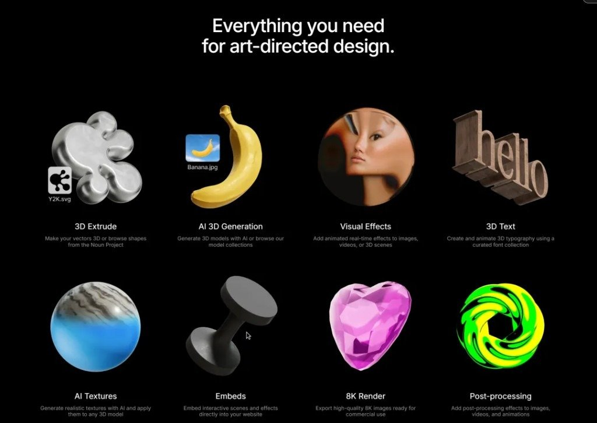
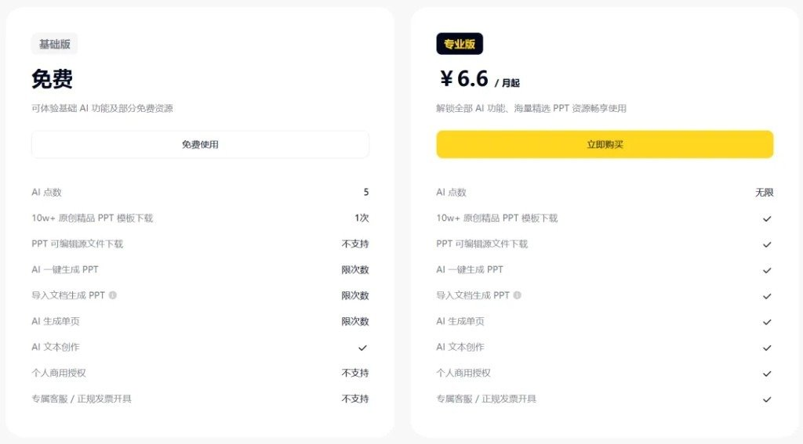

「每天认识一款」第 58 期标题写的是 Endless Tools｜3D 设计工具，配图也确实是官网那套黑底、模板墙、材质面板。正文却像把好几篇 AI 设计软文揉进了一锅——Logo、PSD 分层、一键 PPT、绘本动画，FAQ 里还冒出个 Anijam。

这篇只带走：它大概是什么、官网侧能核对到什么、公众号里哪些段落要当噪声。

## 产品本身：偏 art direction，不是又一个「文生海报」

按官网（[endlesstools.io](https://endlesstools.io/)，核对日 2026-08-11）和本期配图，Endless Tools 更像：

- 浏览器里跑的 no-code / 低门槛 3D + 动态视觉工作台
- 口号直白：Art direction is now software（艺术指导变成软件）
- 强项在「可控的最终观感」：模板可改、材质可喂、特效可叠，再导出图 / 视频 / 嵌入网页

它跟 Midjourney 那种「出一张图就走」不是一路。更接近：品牌 / 平面同学想快速摸 3D 意向、做提案视觉、往站点塞可交互片段，又不想先开 C4D。

官网功能墙（与配图一致）可记这张表：

| 能力 | 人话 |
|---|---|
| 3D Extrude | 矢量挤成 3D；也可逛 Noun Project 形状 |
| AI 3D Generation | 文生 / 库里捞模型 |
| Visual Effects | 图、视频、3D 场景上叠实时特效 |
| 3D Text | 精选字体做立体字与动画 |
| AI Textures | 文生材质贴到模型上 |
| Embeds | 交互场景嵌进网站 |
| 8K Render | 高分辨率静帧导出（商用向宣传） |
| Post-processing | 后期叠层 |

材质侧配图很能说明「控制感」：左侧扎染佛头，右侧 AI Material Creator（类目 STONE / WOOD / METAL… + prompt + Generate / Upscale）。

## 公众号正文：哪些能信，哪些当串稿

| 区块 | 怎么读 |
|---|---|
| 开场「告别工具焦虑」 | 栏目统一鸡汤，压成一句：用一杯咖啡时间扫工具即可 |
| 「是什么」里封面/海报/教育工作者 | 方向勉强沾边；别当成功能清单 |
| Part·One 七条（文生设计、AI Logo、智能排版、PSD 分层…） | 与配图 / 官网八宫格对不上，更像通用 AI 平面工具文案，勿当 Endless 说明书 |
| Part·Two「从文本生成 → 排版配色 → 导出 PDF」 | 流程腔偏平面生成器；官网叙事是模板 / 实时 3D / 导出 8K·视频·GLB 等——以官网为准试 |
| 价格表 + 配图价卡 | 严重存疑，见下节 |
| Part·Three 场景 | 自媒体封面、创业物料、提案概念图——若落在「快速 3D 视觉」上还说得通；写成「一键 PPT / Logo 工厂」就过了 |
| FAQ | 浏览器、低配电脑——和「Web 工具」一致；Anijam、动画角色商用口径——当原文笔误 / 串稿，不要扩写 |

## 定价：原文别采信，官网另记一笔

公众号价卡长这样：基础免费 vs 专业 ¥6.6 / 月起，细项全是「PPT 模板下载、一键生成 PPT、可编辑源文件」——跟 3D 工具标题硬撞。

粘贴正文还甩出全能 ¥79（绘本 / 故事 / 视频）、教育定制两档。这已经不是「写错一个数字」，是整段像别的产品价目混进来了。

官网公开页（同日核对）写的是另一套口径：

- Free：核心功能 3 天试用（不是「永久免费基础档 + 5 点」那种表述）
- PRO：约 $20 / 月，年付约 $249.99（页上有 Save 17% 年付选项）
- PRO 权益宣传点：每月 AI credits、商用无水印、最高 8K / 视频 / USDZ·GLB·Web embed、实时特效、模板库等

不要用公众号那张 ¥6.6 / 绘本表做决策；要付钱先打开 [endlesstools.io](https://endlesstools.io/) 看当前套餐。汇率、活动价、国内代理价本文未核。

## 谁会真用得上

说得通的用法大致是：

- 提案前快速堆 3D 意向、材质与光感，而不是交付最终影视级资产
- 站点 / 作品集需要可嵌入的轻交互 3D 或特效块
- 平面出身、不想先啃传统 3D 软件安装与硬件门槛

说不通、或至少别按这篇公众号去承诺的：

- 当「AI 一键出商用 PPT / 绘本动画」的平替（原文价卡在暗示这个，产品图不支持）
- 默认「生成内容全球商用无坑」——FAQ 写得很满，仍以平台条款为准

## 还想动手时

1. 直接打开官网，用免费试用摸模板墙和 Material / Effects 面板。
2. 导出前先搞清你要的是静帧、视频，还是 GLB / embed。
3. 若只在公众号里看到 ¥6.6 和「一键 PPT」，当广告拼贴略过，回到官网价。

公众号真实链接原料未给；定价与功能以官网当日页为准。
