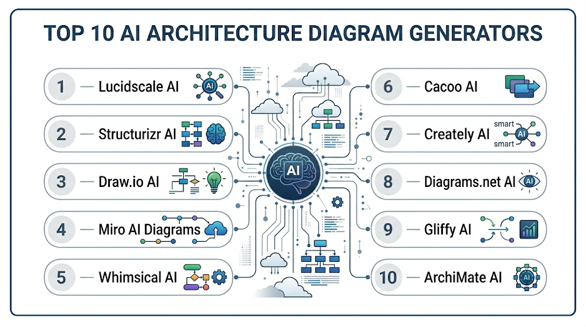
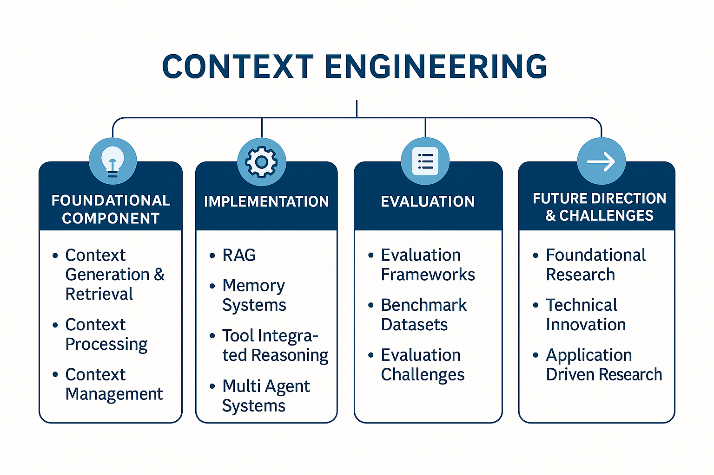
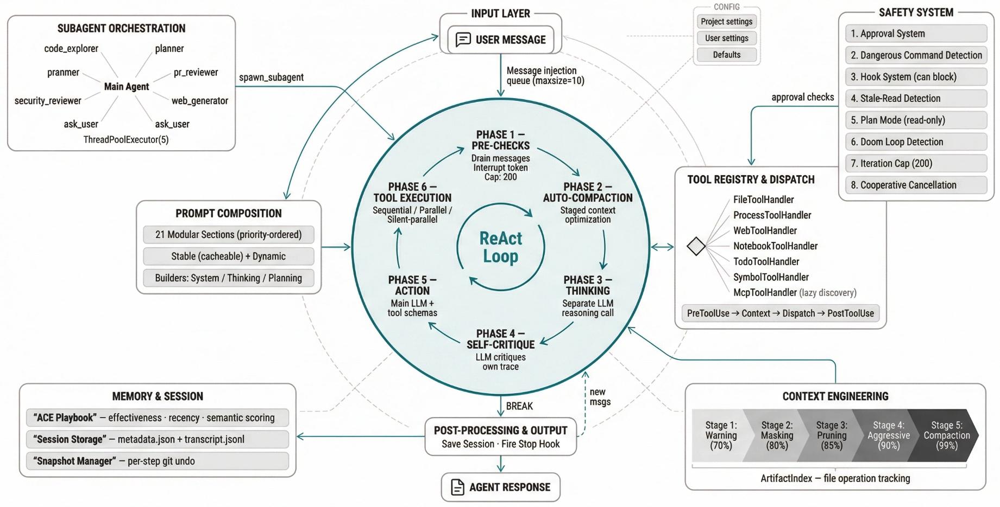
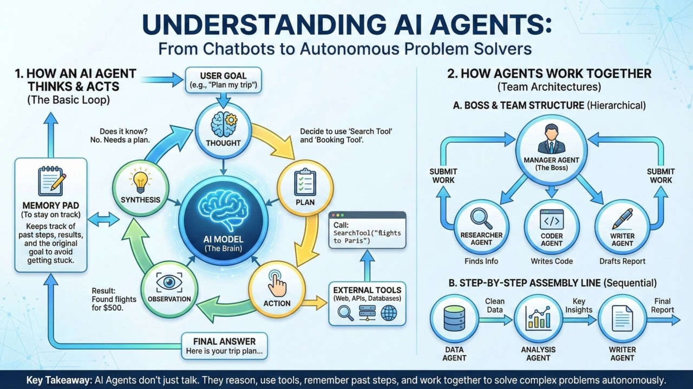
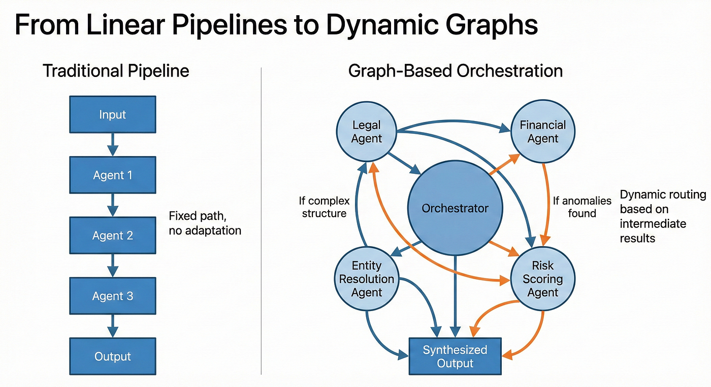

(prompt, context, Harness, Loop, Graph)

**Prompt**  -> 模型「做什么」 , **Context**  -> 模型「知道什么」, **Loop**  -> 模型能「持续行动」, **Graph**  -> 让多个行动能「协作」  **Harness** 把以上全部打包成可运行的系统
**Harness Engineering** 则是把这个系统当成正经工程来做。

## Engineering（Harness Engineering）

这是目前社区正在形成的一个新学科概念：

> **Harness Engineering** = 把围绕模型的整套脚手架（Prompt、Context、Loop、工具、权限、记忆、Graph……）当成一等工程对象来设计和演进。

以前大家主要在比「哪个模型更强」。  
现在越来越多人意识到：

> 同一个模型，换不同 Harness，表现可以差出一截。  
> 真正决定长期生产力的，往往是 Harness 的工程质量，而不是模型本身。

所以 Engineering 在这里的意思是：  
**主动设计、迭代、约束这套「外壳」**，让模型的能力被稳定、可预期地释放出来，而不是靠运气 prompt。

---

### Prompt Engineering

Prompt 就是你丢给模型的「指令文本」。最原始的形态只是一句话。
但在真正的 Agent 系统里，Prompt 已经远远不止「用户输入」了, 而是：

- 系统提示词（System Prompt）
- 项目级规则（CLAUDE.md / AGENTS.md）
- Skills / 自定义指令
- 当前任务描述
- 工具返回的结果回填

Prompt 是模型「看到」的全部输入。它是决定了模型当下的思考方向的，但**本身不负责执行**。



---

### Context Engineering

Context 是模型「当前能看到的信息窗口」。
包括：

- 对话历史
- 项目文件内容
- 工具执行结果
- 记忆文件
- 系统状态

Context 是有限的（有 token 上限），所以如何管理它（压缩、选择性加载、长期记忆外部化）直接决定 Agent 能不能跑长任务而不「失忆」。
简单说：Prompt 是「说了什么」，Context 是「它现在能记住什么」。



---

### Harness Engineering

Harness 是把模型包起来的整套运行机制 + 生态。现在社区（包括 Anthropic 自己、Addy Osmani、研究论文）已经把这个词用得比较固定了, 可以把它理解成「AI 编程工具本身的机制与生态」,  **Agent = Model + Harness**, 有人做过逆向：Claude Code 源码里大概 **98% 是 harness**，真正「模型决策逻辑」只占很小一部分。 所以它确实是「让大模型放进去之后，能力能被尽情发挥出来的那套外壳和土壤」。
纯模型只是一个会预测下一个 token 的东西。 **Harness** 就是把模型包起来的那一整套「运行机制 + 生态」：

- 工具层（读文件、写文件、跑终端、浏览器、搜索……）
- Agent Loop（思考 → 调工具 → 看结果 → 再思考的循环）
- 权限与沙箱（哪些命令能直接跑，哪些要确认）
- 上下文/记忆管理（CLAUDE.md、AGENTS.md、自动压缩、项目级记忆）
- 子 Agent / 多 Agent 协作
- Hooks、Skills、插件、恢复机制
- 错误处理与自我纠正

**Agent = Model + Harness**  
没有 Harness，模型只是会说话的文本预测器。



---

### Loop Engineering

Loop 就是 Agent 的核心工作循环：

```
思考 → 决定调用哪个工具 → 执行工具 → 拿到结果 → 再思考 → ……
```

直到任务完成或达到停止条件。

一个好的 Loop 必须包含：

- 可靠的工具执行
- 结果回传机制
- 失败重试 / 自我纠正
- 上下文更新

Loop 是 Harness 最核心的运行时部分。没有稳定的 Loop，再强的模型也只能做一次性回答。



---

### Graph Engineering

Graph（通常指 Agent Graph / 工作流图）是把多个 Agent 或步骤组织起来的结构。

从简单到复杂可以是：

- 线性：A → B → C
- 带条件分支
- 多 Agent 并行 + 汇总
- 动态生成子任务图

Graph 解决的是「复杂任务如何被拆解、调度、协作」的问题。  
当单 Agent 的 Loop 不够用时，就需要 Graph 来编排多个 Loop。



---
