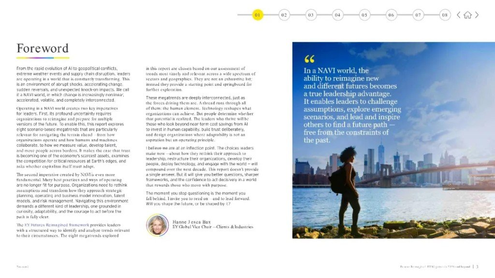
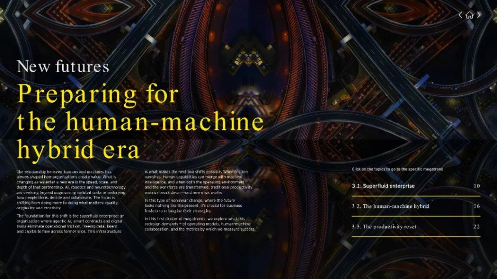

公众号扔来一版安永 *Megatrends 2026* 导读。我没把整本 PDF 搬进来——本地也没收齐原文图——只把能带走的骨架压在这里。官方页核对日：2026-08-11 → [ey.com/en_gl/megatrends](https://www.ey.com/en_gl/megatrends)。

## 线性预测，先退休

NAVI = **N**onlinear · **A**ccelerated · **V**olatile · **I**nterconnected。  
意思很土：变化会拐弯、会加速、会抖，还会互相扯着走。还用「明年大概这样」押注，等于假装世界还听话。

安永给的姿势是 **future-back**：先看见若干可能未来，再往回找今天就能下手、且跨情景都划算的动作（他们叫 no-regret moves）。不是算命更准，是别把鸡蛋放进一条预测里。

## 一张图看清八条线

四根力（技术 / 人口 / 可持续 / 地缘）搅在 NAVI 环境里，长出八条 megatrend；两端是两条主轴——**超流体企业** 和 **资本主义再平衡**。

| # | Megatrend | 人话 |
|---|---|---|
| 1 | Superfluid enterprise | 摩擦被啃光，组织边界变软 |
| 2 | Human-machine hybrid | 人机从「增强」走向更深合并 |
| 3 | Productivity reset | 旧产量尺子不够用了 |
| 4 | Talent rewritten | 人与 AI 能力一起改写 |
| 5 | Migration infrastructure | 人口流动要基建，不只是政策口号 |
| 6 | Global resource rush | 关键资源争夺外推到地球边缘 |
| 7 | Age of trust | 信任变稀缺资产 |
| 8 | Capitalism rebalanced | 资本配置偏向韧性与长期价值 |

中间四条（生产力度量、人才、迁移、资源）导读常一带而过；真正反复砸的是 1、2、7、8。

## 超流体：三件套啃摩擦

报告把超流体企业钉在三块砖上：**agentic AI + 智能合约 + 数字孪生**。  
数据、人才、资本少卡在部门墙里；人从「批每一步」滑向「编排整片生态」。听着像咨询话术，落地时不妨反问一句：你司哪段流程还在靠邮件和表格制造摩擦？

## 人机杂交：尺子也得换

不是多买几个 Copilot 席位就完事。报告把「超流体」当成基础设施，上面才谈人机杂交和生产力重置——质量、原创、判断力权重上升，纯吞吐指标会骗人。治理跟不上时，杂交只会放大事故面。

## 信任：失信约砍三成价值（报告称）

安永援引分析称：公司失信可丢掉约 **30%** 价值。  
这是报告口径，不是我复盘出来的——当决策压力测试用，别当财务公式。信任从「品牌口号」变成和数据一样要投、要量、要护的基础设施。

## 资本主义再平衡：股东不是唯一坐标

另一条 throughline：资本与资源分配更看 **多元化、韧性、长期价值**，利益相关者进场。跟「超流体」对着看——一边把组织内部的摩擦抽干，一边把外部计分板从季度 EPS 拧松一点。做不做得到是另一回事；至少别还拿 2015 年的激励模型假装能扛 NAVI。

## 今天就能问的三句

1. 我们还在用单一预测写预算吗？有没有跨情景都成立的无悔动作清单？  
2. AI 代理 / 合约 / 孪生——有没有一块真在啃摩擦，还是全是 PPT？  
3. 信任出事时，我们量的是舆情热度，还是价值与采用率同时掉崖？

原文配图远不止三张；本帖只收了导读实给的三张，框架图务必留着。PDF 没进本地盘，要细读去官方页下，别以为这里已经「全文归档」。
