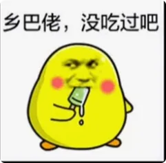
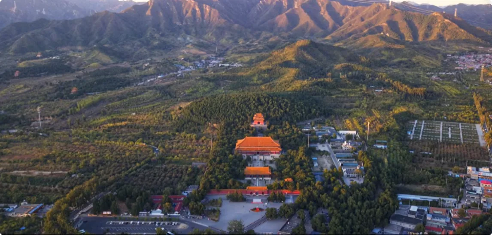
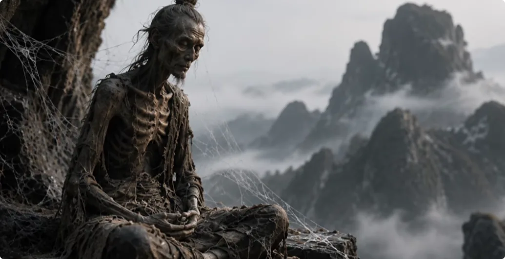
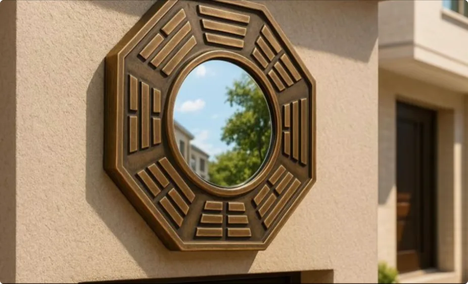

> https://www.youtube.com/watch?v=-gZnFKzSi4M  
> 

## 前言

现在市面上你能找得到的风水，9成9都是假的。我说的假的不是骗你钱那么简单，而是它的本质里面的东西，根本就不是你以为的那个东西。

如果你家里有一些招财的、镇宅的、开过光的东西，没用还好，如果它有用，我建议你赶紧想想办法把它们请出去。因为一个死物不会凭空产生能量，它能帮你有且只有一个原因：
就是里面有东西在替你干活，而它干活是要收费的。所谓**请神容易送神难**，说的就是这件事。

这一集我们继续展开说说：真风水为什么没有传下来，传下来的这一套本质到底是什么，以及最关键的，它为什么有时候还真的有效。
视频的最后再给大家几个选阳宅和避煞的小技巧。把这一集听透，我相信你以后就不会再被任何风水师忽悠了。小板凳赶快搬好。

## 真风水为什么失传了?

要讲清楚现代风水为什么假，就要先说说真风水为什么没有传下来。这就要从最早的那本风水书《葬书》说起。《葬书》起源于西汉，它真正的精髓就藏在开篇的几句话里面，讲的是生气，是堪舆，是道。偏偏这几句话也是本书中最抽象、最难理解的地方。
后世风水师呢，因为太抽象不具备实践性，就直接把精华当废话略过，把后面的术背得滚瓜烂熟。这就叫本末倒置。
是祖师爷没写吗？不是啊，写了呀，开篇就写了呀。可是写了又能怎么样呢？这东西的性质就决定了它根本传不下来，有两个原因：

**第一个原因**：真正的堪舆术，天地之道里的那个“道”，根本没办法用文字传。我举个非常简单的例子：你用文字描述一下螃蟹是什么味道？你怎么写？就算你写得天花乱坠，只要对方没吃过螃蟹，他就不可能知道螃蟹到底是什么味道。他只能靠自己的想象力去猜，那猜出来的味道和真正吃到嘴里的味道，是同一个东西吗？永远不可能。更别说可能连写的人自己都没吃过螃蟹，那就更完蛋了。他不理解，他就只能看前人是怎么瞎猜的，瞎猜别人的瞎猜，跑偏程度完全取决于想象力的丰富程度。

你看，文字连五感以内的味觉都传不明白，更何况是超越五感的道。写的人写不明白，看的人自然更看不明白。世界的运转规则就是这样，**低维理解不了高维，也链接不了高维。而文字本来就是比意识更低维度的东西，所以书里得来的除了糟粕，没有所谓更高级的东西。**

但是人类就是很自以为是，非要逆天用文字传，那最后变成什么呢？就只能妖魔鬼怪来给你写了，越写越偏，越写越邪，越写越low，最后还以为自己更先进了。这就是咱们现代的文明，科技越来越发达，灵魂越来越低维。这也解释了为什么现代能通灵的人会越来越多，因为频率越来越往下走了呀，沟通自然就更容易了。这，我就点到为止了。

**还有第二个原因**：时机不到，不敢传。前面提过，*纯正能量是灵界最珍贵的资源，受到天道最严格的把控。* 
而一等地师的观气，也叫相气术，属于堪舆玄门里最高阶的技巧，不到时机绝对不会开放的。一旦开放，成仙的人就会成批成批地出现。可过去几千年，真正修成的人不到百人。观气这门技术本来就是天机，泄露天机的人会是什么下场，我相信你大概也有所耳闻。所以不是传不下去，而是没人敢传。

你想啊，既然是天机，怎么可能写进大众能买得到的书里，又怎么可能随随便便让你找到、让你学到呢？那就有人要问了：为什么我现在敢在这里说？肯定是经过允许我才敢说的呀，不然你想我有几条命。我只能说，现在这个时代是一个有大机缘的时代，剩下的你自己悟吧。

## 现代风水为什么假？

真东西传不下来，那后世用书传下来的，到底是什么东西呢？说穿了就五个字：**统计概率学**。
真正的地师能直接观气就能找到穴，后世的人不会观气，就只能把过去那些可能有气的地方在外形上总结出来——什么样的山、什么样的水、什么样的地形曾经出过帝王将相、富贵人家——全部记录下来，再反过来推测：长这个样子的地方，大概率有气。至少这样还有一个看得见摸得着的依据，不至于满世界乱找。

所以后来慢慢就分出了两大派：

- **形势派**——看形峦，看山川，看地理。本来看形峦这事吧也不算太离谱，古人云“在天成象，在地成形”，至少他看的还是天地留下来的痕迹。可是人类喜欢自作聪明，形峦看不明白就觉得是方法不够精密，非要继续加罗盘、加数理、加方位，于是产生了另外一派：
- **理气派**。

我之前说过，风水这玩意一旦上了仪器，就在跑偏的路上一骑绝尘，越研究越低级，还自我感觉特别良好。真是人类一思考，上帝就发笑。

到了最著名的风水书《撼龙经》，他就已经把《葬书》里抽象的山川形势彻底地标准化和分类化了。
那书我仔细研读过，200多页，真东西加起来不到两页吧，而且都是抽象的，《葬书》里说过的。你要是真的按书里的例子去找，那你就彻底废了。
因为无论分类分得多细，数理算得多复杂，概率学终究只是概率学。有概率有气，不代表一定有气，更不代表你能拿得到气。风水师说这里有、那里有，给你瞎编个天花乱坠，反正你也看不见，也没办法验证。

而且这里还有一个更关键的问题是：**风水根本不能被标准化**。
为什么？因为生气是天道的恩赐，是天道在地上的代表，而生气本身又是能量体，是能量体它就有意识，它就是流动的，它就是与时俱进的。
对，你没听错，天道和风水都是意识体，都是智能的，而且是你想象不到的智能。

这就意味着，以前那些帝王将相的墓，现在未必够看了；
以前那些名山大川，现在不一定还有气了。比如终南山、青城山、鹤鸣山、武当山、茅山等等等等，但凡有人飞升过，有一个算一个，这山如果现在还有气，算我输。
那你就想想看，现在在那些山头上埋头修行的人，没有气，他们能修成什么妖魔鬼怪？

说到底，一个地方有没有气，不是因为山长成某个样子，而是天允许你找到这个地方，你才能找到这个地方；天允许这个地方开放气，你才能拿得到气。这些全都归天道统一管理。如果气不开放，你就算在那枯坐一万年，你也就是个万年僵尸。

所以你拿着千年前的书，背着百年前的口诀，再用一个罗盘去算今天的气，这事本来就不靠谱。凡是普通人靠书、靠口诀、靠罗盘能够随便找到的、随便点中的，必然只是凡品。
但是人类就是很奇怪呀，一方面理解不了气，也不相信气；另一方面又总想用自己那个十几厘米的脑子算出哪里有老天爷的东西，占为己有，总想着人定胜天、与天抗衡。
这怎么可能呢？你以为你想得到，天想不到吗？人类才出现多少年，天道存在了多少年？天对人性了如指掌，所以人呐，还是对天地有一些敬畏之心的好。

## 现代风水的本质是什么

凡人想用凡人的手段去找更高级的气，找不了一点，那只能往下找凡气。往下的气是什么呢？是**煞气**。

所以现代风水能够观察、能够调整的，从来都不是生气，而是煞气。很多风水师连自己都没有意识到，他一辈子都在跟煞气打交道。更荒唐的是，很多所谓的现代风水师，不但不会观生气，甚至连煞气都看不出来。

我之前住的房子气不太好，除了我的房间，其他的地方东西不少。但是我自己有防护，也知道怎么清理，所以那些东西不敢进来。但其他的室友没有任何防护，所以住进来的人隔三差五就出事，隔三差五就生病。
后来房东也觉得不对劲，就请了个风水师来家里看看。那个风水师在家里转了一圈——房子没有生气，他看不出来；房子有煞气、有东西，他也看不出来。最后实在找不到问题，就指着窗外的一个鸟巢说：“问题出在那个鸟巢上。”

你看，这就是很多现代风水师的真正水平：背了一堆方位格局口诀，真到了一个有问题的房子，什么实际问题都看不出来。

说到这里，肯定又有人会说：“那是你遇到的风水师太菜了，我遇到的风水师就真的有用。”好好好，有用的我也遇见过，也不比你少。接下来我们就认真说说：为什么有些现代风水，明明不会观气，却真的会有效果。

##  假风水“有效”的三种情况

一般有三种情况，而第三种最猛也最危险。

**第一种情况**，也是最好的一种，就是他真的碰巧找到有气的地。注意，是碰巧，不是因为他真的会观气。刚才说了，后世风水靠的是统计概率学，既然是概率学，那就不可能次次都错。有些地方山川形势本来就符合过去总结出来的规律，再加上那块地当下刚好还有气，那就真的可能被他撞中。这种地呢，在我们修仙者眼里可能瞧不上，但供人间福气完全是够够的了。这一小部分本来就是天道给人类的恩赐，凡人可得。

但是你得清楚：他找得到不代表他看得到，他撞对一次也不代表他真的会。就像一个人买彩票中了奖，不能因为他中过一次，你就说他掌握了彩票的底层规律。所以第一种现代风水为什么有效？不是因为它突然变成了真风水，而是因为运气。你要是真的有机缘找到一个还不错的地，其实也是因为命里有，所以你赶紧偷着乐吧。**但是绝大部分真正灵气充沛、可供修炼的地方都是锁起来的，所谓“大地不许人识”，因为那部分已经不是人间福气的部分了，只有有缘的修炼人才允许碰。**

**第二种情况**，风水师只是调了调格局，居然也有效。这一种呢，不是调格局能带来生气。之前说过，生气只能找，不能人为产生。所以真正起作用的原因是：这个房子原来的格局有煞，某些地方在聚煞、冲煞，所以风水师把门、床、桌子这些位置挪一挪，煞气就对人的冲击小了一点，你才感觉生活好像变顺了。

我用最直白的方式给你算一笔账：假设你命里原本能赚1,000万，结果你搬进了一个有煞气的房子，天天被冲，最后只剩500万。风水师来了给你调了下格局，煞气没那么重了，你又拿回了200万。你一看，哎，风水真的有效！但是你别忘了，那200万本来就是你的。如果你一开始没住进这套有煞气的房子，你命里本来有1,000万。

所以调屋内风水的作用不是给你加东西，而是尽量减少环境对你的消耗，让你有机会活到命里本来就有的最上限。但是它提高不了你的上限。
你命里最多有1,000万，你床换10次、桌子挪出花来，也不可能给你调成一个亿。所以说，现代风水能不能有效呢？能，但它做的只是暂时止损，而不是增加福气。这也是为什么现代风水和真正的风水根本就不是同一个层级的东西。

如果有一个风水师给你家里挪了几个东西，就跟你说这叫“藏风聚气”，能把生气聚进来，那你可以直接让他滚了。他连自己调的是什么都没搞明白。我再强调一遍：**生气是不能人为产生的，它有就有，没有就没有**。

**第三种情况**，不是调格局，而是往家里请了一个东西——特别是那种开过光的、镇宅的、招财的——请回去还真的有效，而且这种效果可能比前两种加起来都猛。我刚才讲了，你命里有1,000万，调格局顶多能让你少损失一点。可这种东西真的可能硬生生地把你从1,000万推到1个亿。

听起来是不是很好？别高兴得太早。因为这已经不是在调风水了，这是在借力。根据能量守恒定律，一个摆件又不会自己凭空产生能量，那它为什么能帮你挡煞？为什么能让你发财？为什么能让你变顺？有且只有一个可能：**里面有东西在替你干活**
但是灵界的大佬从来不会平白无故地帮人，但凡他真的出手了，后面就一定会收账。那用什么还呢？

人间最珍贵的无非就是两样：**钱和命**。

人家灵界的大佬又用不着人民币，那你就用你聪明的小脑袋瓜子想一想，最后用什么还？说难听一点，你往家里请了一个开过光的东西，本质上就是温水煮青蛙版的“养小鬼”。只是“养小鬼”太直白了，听起来好可怕，换成“开光”“镇宅”“招财”，听起来就舒服多了。

当然，也有人会说：“他一个亿呀，命算什么，给你就是。”这也没关系，这个世界上本来就有很多人愿意拿命换钱、换名、换权，我也不会多说什么。
但是惜命的人啊，要明白一件事：效果越猛，说明借来的力量越大；借得越多，后面要还的就越重。所以这种东西，风水师说得再好听，你都不要往家里请。因为只要它真的有效，就说明里面不是空的；只要里面不是空的，就一定需要能量；而这笔能量最后还是羊毛出在羊身上。

那就有人说了：“我一点都不贪，我不想要多的。风水师让我请的也不是招财的，是化煞的，这总没问题了吧？”No，问题更大。

因为这个世界上真正能把煞气化掉的方法有且只有一种，就是正负对冲——正能量和负能量碰上，才会互相抵消清零。
负能量和负能量碰上，那不叫化煞，那叫打架。两军交战，子弹都往旁边飞，伤及的都是无辜。

所以很多人口中的化煞，根本就没有化，只是挡了一下、绕了一下，或者把煞气推到了别人那里。
最典型的都市传说就是香港的中银大厦: 

中银大厦的外形像一把三棱长刀，其中一面直直地砍向对面的港督府。主体结构刚建成，香港总督就暴毙了。继任的香港总督呢，赶紧在外面种柳树挡煞，结果也是种一棵死一棵。
后来香港回归，董建华拒绝入住港督府。长刀另一面对着的汇丰银行也吓坏了，在顶楼装了两门大炮正对中银大厦。
最后压力给到了刀锋和大炮中间的李嘉诚，风水师建议把建筑设计成正正方方的四面体，像一面巨大的盾牌，外墙再全部使用反光玻璃，达到刀枪不入的效果。

那这个思路有没有用呢？有一点。因为反光或者是让视线范围内看不见，本身就能挡掉一部分的形煞。但是挡住和化掉是两回事，那股煞气根本就没有消失，它只是被反射弹开到了周围。
所以附近的住户会在窗外再挂一面八卦镜，接着往外反。那个区域就是你反给我、我再反给你，大家击鼓传花。可煞气有没有真的没了呢？不会的，只是看最后谁倒霉、谁接得多。

而且八卦镜能挡多少也是有数的，大概就是八卦镜和窗户面积的比例。如果一面镜子只有窗户的1%，那最多就能挡掉1%，剩下的照样冲进来。
八卦镜里只要没有住东西，反而还是安全的，因为它只是靠物理反射。那真正危险的是那些小小体积、大大效果的东西。因为我说了，一个死物不会产生能量，它拿什么替你挡？它又凭什么让别的东西不敢进？只有一个可能：里面住着比周围那些东西更厉害的东西。

这种情况我也见很多。有些人家里乱七八糟一大堆大鬼小鬼，但是有一些房子干净得出乎意料，找半天才发现，这个家不是真的有多干净，而是里面有一个大佬镇着，别的东西都不敢进来。

听起来是不是特别好？这次也别高兴得太早。镇得住不代表他在保护你。大佬镇宅的能量从哪来呀？这就不用我多说了吧。

所以第三种情况，表面上看效果最猛，实际上也是最危险的一种。它不是帮你把问题解决了，只是换了一种方式从你身上收账。而人长期住在这种房子里，身体迟早会出问题——要么被外面的煞气砍，要么被家里镇宅的东西吸。

我之前经过中银大厦那片区域，直接被煞气冲吐了。我还是一个有防护的人。可想而知，一个普通人长期待在那里，每天会被冲掉多少阳气。只是大家感觉不到而已，但是感觉不到不代表没有。就像很多人癌症晚期，之前也没有任何感觉，等你终于感觉到了，往往已经晚了。最可怕的地方是，它不是煞气有多重，而是你根本就感觉不到。

## 阳宅怎么选？

先记住一句话：**选房子第一件事情，不是看它旺不旺你，是先看它会不会天天耗你。** 想清楚这一点，比背100条禁忌都有用。

还有些事不用你有感知力也能留意的：就是家里要多通风、多打扫、多开窗、多晒太阳。这些东西不会凭空给你生出什么生气，但是至少能让浊气别那么容易堆在屋里。越是终日不见阳光、空气不流通的房子，脏东西越容易堆积。

在这个前提下，我们再说几个具体的建议：

1. **能不住市中心，就尽量别住市中心。** 越繁华、越拥挤、人越多的地方，气往往越浊。宁愿住远一点、安静一点，也不要为了所谓的方便，天天泡在一堆浊气里。
2. **窗户和门口不要正对着任何尖锐的角。** 原理跟中银大厦一样，尖角对着你，就是长年累月地冲你。如果窗外已经有尖角了，拉上窗帘多少还能挡一点，但是最好的办法还是搬家。
3. **三角形的房子不要住。** 煞气很容易往尖角聚。美国就有一些著名的三角大楼，我都去过，同一栋楼里越靠近尖端的位置，气往往越浊。
4. **家门口不要正对着河流、马路、消防通道、楼梯口、电梯口。** 城市里很多的浊气和东西本身没有多大的能力，只能跟着空气和水流动。门口一旦正对着这些通道，就等于天天把外面的浊气往家里灌。这也就是所谓的路冲煞。

## 哪些地方不要去？

这里也有一个非常简单的判断：**越是闭塞、阴暗、浑浊、情绪重的地方，越不要长时间待。**

- 竹林、峡谷、洞穴、悬崖——这些地方本来就不通不散，东西很容易积在里面。
- 寺庙、道观、教堂、墓地、废弃楼、鬼屋、恐怖主题密室，还有一些阴阴森森的建筑——也尽量少去。不是因为看着吓人，而是鬼真的很喜欢住那些地方。
- KTV、酒吧、迪厅也是一样——人多、酒多、欲望多、情绪乱，原始欲望过重的地方，都是妖喜欢待的地方。
- 还有恐怖电影、恐怖音乐，也别一天到晚拿来刺激自己。你以为你只是在找乐子，其实你是在招乐子，把东西招过来，谁是谁的乐子那就不一定了。

家里呢，也不要乱请东西。人偶、雕塑、佛像、古董、开过光的东西，能不放就不放。你根本就不知道它以前在哪、跟过谁、里面又有什么。

最后再强调：曾老说过，人多的地方不要去。哪里人多，不用我再告诉你了吧。

##  哪些地方可以去？

阳光明媚、山清水秀、明朗开阔、空气流通的地方，可以多走走。

比如说湖边、海边都可以。但是我再说一遍：**不要下水，不要下水，不要下水。** 
旁边走走、晒晒太阳、吹吹风就行了，离岸边远一点。你别看到水清就非得往里钻，不听劝的，后果自己承担。

##  瞎说一些大实话

但说到底，上面这些不管是避开尖角、远离路冲、少去阴暗的地方，还是不往家里乱请东西，全都只是在避煞，顶多让你少被耗一点，却没有办法从根上解决问题。因为你没有感知力，就理解不了为什么要这么做。今天记住10条，明天换一个环境，照样踩坑。

所以，真正重要的不是把所有禁忌背下来，而是**你有没有分辨气的能力，有没有趋吉避凶的本事**。

你不妨设想一下：如果有一天你有机缘接触到最纯正的能量，能给自己和家里形成防护，再加上自己有感知力——哪里能住、哪里不能住，什么能碰、什么不能碰，什么时候该留、什么时候该走，碰见了怎么清理，被耗了应该怎么补——这些本来就是一目了然的事，跟吃饭睡觉一样，是自然规律，是本能反应。

所以禁忌背一万条，不如你自己真的看得见、摸得着。

