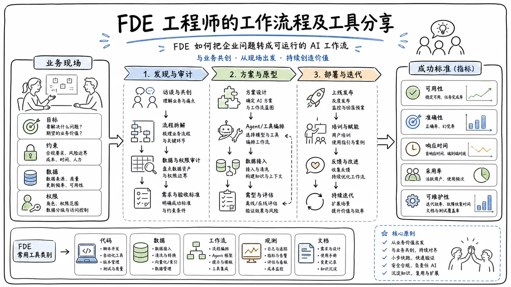

先，非常感谢大家来到现场。能和 Cursor、Factory、Brobank 这些行业巨头一起交流，是一次非常棒的经历。我知道大家多半是冲着他们来的，但还是感谢各位留下来听这场分享。

我是 Boss，Verc Agents 的 CEO。我们与全球一些规模最大的企业合作，通过 AI 和智能体推动企业由内而外地转型。由于我们的项目高度定制化，必须深入客户内部，因此需要大量 **FDE（Forward Deployed Engineer，前线部署工程师）**。

这次分享主要讨论三个问题：

1. 为什么 FDE 如此重要；
2. Verc 如何开展前线部署工程；
3. 我们开发了哪些内部工具，使这套模式能够规模化，而不必让团队人数呈指数级增长。

> 我认为，接下来的核心瓶颈是：在不成倍增加人力的情况下，我们究竟能深入客户业务到什么程度？其中又有多少工作可以交给 AI？

## 从“执行工作”转向“理解业务”

## 执行能力已经不再是核心瓶颈

AI 正在解决工作的执行问题。几年前，在思考型智能体和推理型智能体尚未普及的时候，如果问有多少人使用 AI 完成过一项端到端任务，恐怕几乎没人会举手。但如果今天再问同样的问题，相信现场每个人都会举手。

这说明，**执行已经不再是最核心的瓶颈**。模型能力不断提升，智能本身逐渐不再构成限制；与此同时，各类 Agent Harness 也在快速成熟。无论是浏览器操作工具、API 工具，还是可靠的 MCP，都让 AI 能够以接近完美的方式执行具体工作。

真正仍然存在的瓶颈，是 AI 能在多大程度上理解一家企业。

每家企业、每位客户都不一样。比如，医疗企业的销售部门与 SaaS 企业的销售部门，运作方式可能完全不同。Verc Agents 在实际项目中对此有非常深刻的体会。如果现场有企业经营者，应该都知道：要让最新模型真正适配企业内部的特定用例，是一件非常困难的事。

你很难从员工和团队中完整提取业务上下文，也很难把这些复杂信息塞进一次 API 调用或简单的模型调用里，并保证系统不会迅速崩溃。

因此，今天真正的瓶颈是：

- 你能在多大程度上理解现有流程；
- 你能在多大程度上重新设计流程；
- 你能否把隐藏在人、制度和例外情况中的业务知识准确提取出来。

这正是 Verc 所从事的工作。

## 企业运营将从“以人为中心”转向“以 AI 为中心”

目前，企业运营从根本上仍然以人为中心。无论员工是在软件系统中完成工作，还是脱离软件处理事务，工作主体依旧是人。

未来，企业运营将逐渐转变为以 AI 为中心。这不仅意味着给企业提供 Cursor、Claude Code、Codex、Factory 等优秀的 AI 工具，还意味着要改变企业原有的运营方式和业务流程本身。

而这正是 FDE 的根本职责：

> 深入企业，理解它今天如何运转，并重新设想它明天可以如何运转。

这也是为什么前线部署工程会成为 Verc 核心能力的一部分。

## FDE 的三项核心职责

## 映射人类当前的工作方式

FDE 的第一项职责，是梳理人类今天究竟如何完成工作。

在 Verc，我们通常会安排多名前线部署工程师直接进驻客户团队。面对一家拥有数千名员工的企业，我们不会一开始就试图理解整家公司，而是先把范围缩小到某一个部门。

以财务部门为例，FDE 会分别与以下流程负责人沟通：

- 应付账款（AP）；
- 公司卡对账；
- 银行业务；
- 计费；
- FP&A，即财务规划与分析；
- 其他相关财务流程。

我们会逐一访谈这些流程负责人，不只询问“正常情况下流程如何运行”，更重要的是追问：

> **当事情出错时，实际会发生什么？**

很多企业文档只记录了所谓的“黄金路径”，最多再补充一两个边缘案例，但这通常并不能反映真实情况。

真实情况往往是这样的：应付账款团队的 Sarah 平时按照某套流程处理任务；但一旦出现问题，她实际上会把工作转交给 Chris，而 Chris 可能需要四天时间，才能完成采购订单与发票之间的对账。

这类信息有两个特点：

1. **每家公司都不一样。** 同一类问题，在不同企业中的处理方式完全不同；
2. **它们正是 AI 无法独立完成端到端流程的关键原因。** 如果不了解这些现实中的例外与隐性协作关系，就不能让 AI 在企业里放手运行。

因此，FDE 的第一阶段工作，就是完整映射人类目前的实际工作方式，而不是只阅读书面流程。

## 围绕 AI 重新设计业务流程

FDE 的第二项职责，是围绕 AI 重新设计流程。

今天经常有人讨论一个问题：企业只是把 AI 强行贴到已经损坏的流程上。这也正是许多 AI 项目无法产生投资回报的根本原因。

一些数据虽然已经不算新，但仍然很有参考价值。例如，MIT 的相关报告指出，约 **95% 的生成式 AI 试点未能进入生产环境**；也有类似统计称，约 **87% 的 AI 试点无法产生可衡量的 ROI，或者根本没有正式上线**。

原因往往不是 AI 不够聪明，而是企业把 AI 直接叠加在一个原本就存在问题的流程上，却没有让 AI 真正理解事情应该如何完成。

在编程领域，这种问题已经很明显。即使有 Ralph Loop 等新方法，一名工程师也很难只对 AI 说一句“去帮我解决这个问题”，就让它自行重构整个代码库，全程不需要任何人工输入。

把这个问题放大到企业场景，难度只会更高。财务、销售、市场、采购和物流等部门的业务人员通常并非技术人员。仅仅给他们一套 AI 工具，并不能让他们获得软件工程师可能创造出的同等 ROI。

因此，企业需要 FDE 帮助他们围绕 AI 重新设计现有流程。

这种改造不能激进到让业务人员完全不知道该如何操作。例如，一支团队原本习惯了十一阶段的工作流，如果你突然把它改成一步，他们很可能无所适从，最终影响系统采用率。

但流程也必须改变到足以产生实际价值。比如，在一套八阶段的流程中，可以重新划分为：

- **四个阶段完全由 AI 自主完成；**
- **三个阶段由 AI 执行，但保留人在回路中的干预；**
- **一个阶段完全由人处理。**

最后这个阶段之所以交给人，可能是因为风险过高，也可能是因为该环节不够独特，智能体无法在这里创造可衡量的价值。

FDE 的任务，就是判断哪些步骤应该自动化、哪些步骤需要人工复核，以及哪些步骤暂时不应该交给 AI。

## 在企业现有系统上部署智能体

FDE 的第三项职责，是把智能体真正部署到企业已有的系统之上。

Verc 的一个基本判断是：此前的 AI 浪潮落下了很多大型企业。许多企业已经深度绑定自己的记录系统和核心业务系统。它们可能刚迁移到 NetSuite、Microsoft Dynamics、SAP 或 Salesforce，不可能因为出现了一款新 AI 工具，就把这些系统全部推翻。

一位客户曾经告诉我们：

> “我们花了 500 万美元和五年时间，才完成向 NetSuite 的迁移。”

这是一句真实的客户原话。如果这时有人对他说：“我有一套很厉害的 AI 工具，但你得先从 NetSuite 迁走”，客户只会让你出去。他们根本没有兴趣再经历一次系统迁移。

因此，Verc 的理念是：**把智能体构建在客户现有的记录系统之上，而不是要求客户放弃原有系统。**

我们开发了自己的 **Verc OS 平台**，可以用来创建和监控智能体，并在平台中内置完整的治理机制与评测体系。同时，这套平台能够运行在企业既有系统之上。

无论客户使用 Salesforce、NetSuite、Microsoft Dynamics 还是 SAP，我们都不会要求其迁移。恰恰是这些规模庞大、难以快速转向的企业，最需要 AI。

## 为什么要构建 AI FDE Agent

## 优秀 FDE 极其稀缺

很多人认为，**2026 年及以后将是前线部署工程师的时代**。从某种程度上说，我们完全认同这一判断。

企业从未像今天这样需要一批人深入客户内部，理解具体业务场景，并帮助他们采用最新的 AI 工具。但与此同时，我们也发现，优秀的 FDE 极其难找。

一名真正优秀的 FDE 需要同时具备两类能力：

- 在技术上属于顶尖水平，对 AI 的理解远超普通企业客户；
- 拥有非常强的沟通能力和人际能力，既要有高 IQ，也要有高 EQ，能够从客户口中提取有效信息，并根据客户当下的状态实时调整沟通方式。

通常情况下，企业要么招聘咨询顾问，再对其进行技术培训；要么招聘工程师，再训练其软技能。但要找到技术与沟通能力都处于顶尖水平的人，非常困难。

因此，我们构建 AI FDE Agent，并不是为了完全取代现有 FDE，而是为了增强他们。

## 用 AI 扩大单个 FDE 的服务能力

AI FDE Agent 可以让一名前线部署工程师或前线部署策略师，同时管理和维护多个客户的沟通与项目。

现场大多数人可能是技术人员，很容易低估 FDE 需要在多大程度上参与客户事务。客户可能全天候发送邮件，一次发来上百页文档；不同流程负责人还会把 FDE 拉向不同方向。

应付账款依赖应收账款，应收账款依赖对账，对账又依赖 FP&A。每位负责人都认为自己的问题最重要。

FDE 必须同时管理所有上下文，公平地服务每个团队，同时又不能为了做到这一点招聘 50 个人。这对 Verc 非常重要：我们希望避免变成一家传统咨询公司，但又希望保留咨询服务中非常有价值的部分——*高接触度、手把手、以人为中心的服务体验*。

## 新瓶颈是围绕 AI 设计工作

在 2024 年前后，执行仍然是主要瓶颈。当时的模型还没有获得今天这样的智能水平，Agent Harness 也不具备如今的集成能力。

现在，AI 模型已经可以解决大量知识工作的执行问题。我甚至愿意说，**知识工作的执行几乎已经被解决了**。

新的瓶颈在于：如何围绕 AI 设计工作的完成方式。

这包括：

- 深入客户内部理解业务；
- 重新设计工作流；
- 判断哪些工作应该自动化、哪些不应该；
- 在稳健、可扩展的平台上完成部署；
- 真正推动客户的经营指标，而不是只提供孤立的点状解决方案。

例如，一款只改造销售线索挖掘环节的产品，可能只能为整个销售职能带来 5%～10% 的 ROI。财务部门也是如此：如果只改造应付账款，而不处理其他流程，最终可能也只有 5%～10% 的 ROI。

Verc 采取的是部门级整体转型：一次性、系统性地改造整个部门。因此，我们能够为客户带来 **25%、50%，甚至 75%** 的 ROI，真正创造三类价值：

1. **收入增长；**
2. **成本节约；**
3. **风险降低。**

AI FDE 的目标，就是学习如何围绕 AI 重新设计完成这些任务的方式。

## AI FDE Agent 的三阶段产品形态

接下来由 Verc 工程负责人 **JD Pruitt** 介绍更深入的技术实现。毕竟，我已经有一阵子没写过生产环境代码了。

## 第一阶段：Engagement Agent

这个项目最初源于我们想为 FDE 提供更好的工具。

平台团队坐在办公室的一边，大家用着 Codex、Claude，气氛轻松愉快。我往办公室另一边看，发现 FDE 团队压力巨大、严重缺觉，一个个都非常痛苦。客户全天候给他们发邮件，他们几乎根本没睡。

于是我去问他们：“你们现在到底是怎么与客户开展工作的？”

他们回答，大致流程是：

1. 向 Claude 上传约 150 页文档；
2. 输入提示词；
3. 等待两分钟；
4. 得到一份又啰唆、又不准确、体验还很差的分析。

我当时就觉得：*好吧，这事必须修。*

于是我们开始构建一套面向 FDE 的智能体。简单来说，它就是 **FDE 的 Codex**。整套产品分为三个阶段，其中最后一个阶段仍在开发中。

第一阶段是 **Engagement Agent，也就是客户协作智能体**。它可以理解为一个专门为 Verc FDE 打造的、更适合业务场景的 Claude，是 FDE 的专属助手。

它可以：

- 接入 Granola 会议笔记；
- 综合分析各类文档；
- 阅读 PowerPoint；
- 回答“谁负责这个流程”；
- 对照邮件、Slack 消息和文档中的人名；
- 判断不同拼写方式指向的是不是同一个人。

比如，邮件里出现了一个叫 Sarah 的人，Slack 消息里又以另一种方式拼写了她的名字。FDE 需要判断这两处指的是不是同一个人。这类问题看似琐碎，却是 FDE 每天反复处理的内容。他们还会浪费大量时间等待 Claude 返回答案。

Engagement Agent 就是他们构建和理解工作流时的专属助手。

## 第二阶段：Workflow Agent

第二阶段是 **Workflow Agent，也就是工作流智能体**。

我们把 Engagement Agent 直接嵌入 Verc 平台。当 FDE 在平台中构建工作流时，AI FDE Agent 会在旁边实时协助，例如提醒：

> “你遗漏了这个边缘情况。”

或者：

> “你最好确认一下这个流程究竟由谁负责，确保邮件能够发送给正确的人。”

Workflow Agent 直接运行在我们的平台内部，可以与 Claude、Codex 或其他模型协同工作。它会检查 FDE 正在构建的工作流，确保这个工作流能够准确映射我们希望重新设计的真实业务流程。

## 第三阶段：自主式 FDE 助手

第三阶段是一个能够自主工作的 FDE 助手，目前我们还没有完全实现。

未来，客户可能会直接给它发邮件，例如：

> “我想修改质检报告的发送位置，把它改发到另一个邮箱。”

智能体收到信息后，将能够：

1. 解析客户的变更要求；
2. 查询系统目前对这家企业的理解；
3. 在 Verc 平台上自主修改工作流；
4. 自动发布变更；
5. 全程不需要 FDE 介入。

这样一来，FDE 就不必把时间浪费在细碎的工作流维护上，而可以把精力留给价值更高的工作，例如与客户深入访谈，真正理解其业务流程。

任何做过 FDE 的人都知道，这些看似微不足道的小事，实际上会占用大量时间。

## AI FDE Agent 的技术架构

## 建立企业运作的单一事实来源

构建这套系统的第一步，是建立一个 **单一事实来源（Single Source of Truth）**，以统一方式表示一家企业如何运作。

实现方法有很多。如果大家早上去过楼下的展位，可能会看到五家公司都在向你推销图数据库。其实直接用 PostgreSQL 也行，具体技术并没有那么重要。对，我说的就是你。

我们采用的是 **依赖图（Dependency Graph）**。

企业内部的大多数工作流其实非常线性，只是其中存在很多循环。归根结底，流程负责人希望工作尽可能由依赖关系驱动。他们不希望流程中的 C 在 A 和 B 完成审批之前，就提前介入处理。

因此，依赖图非常适合表示这类企业流程。

## 通过后训练获得清晰、准确的流程分析

接下来是模型训练。我们需要解决两个问题。

第一个问题是：如果向模型提供已经提取好的上下文，能不能获得高质量输出？

坦率地说，使用 Claude 时，答案是否定的。这可能有些令人意外，但相信大家在处理长篇分析时也有类似体验：前沿模型通常极其啰唆，而且缺乏区分信息重要性的能力。

我是在 Verc 开始招聘咨询顾问后，才真正意识到咨询顾问的价值。他们非常擅长判断：

- 哪些细节是客户真正关心的；
- 哪些内容可以一笔带过；
- 哪些信息必须展开说明；
- 怎样在细节与清晰度之间取得平衡。

前沿模型几乎没有这种概念。

因此，我们基于开源模型进行了自己的后训练。我们比较喜欢 **Qwen 2.5**，当然许多其他开源模型也能胜任。后训练的目标，是在信息完整度与表达清晰度之间找到合适的平衡，而这正是很多前沿模型所欠缺的。

这一部分解决的是：如何根据已经提取的上下文，写出优质、标准化的业务流程。

## 用强化学习提高知识图谱检索质量

第二个问题是：如何正确遍历知识图谱，提取真正相关的上下文。

即使我们已经拥有一个庞大的知识图谱，要稳定、可靠地找到正确上下文仍然非常困难。

完成模型后训练之后，我们会构建一个 **强化学习环境（RL Environment）**，并向模型开放一组专门用于遍历知识图谱的自定义工具。

这些工具可以完成诸如以下任务：

- 判断员工 A 和员工 B 实际上是不是同一个人；
- 识别人名拼写差异和身份重复；
- 找出工作流中的冗余循环；
- 识别知识图谱中违反 DAG，也就是有向无环图约束的结构；
- 沿依赖关系检索与当前任务最相关的业务上下文。

很多企业里都有好几个叫 Mike 的人，Claude 经常会因此感到困惑。我们会在强化学习环境中训练模型，让它能够正确调用工具、遍历图结构，并提取真正需要的信息。

这样，我们便分别解决了两个核心问题：

1. **如何根据上下文写出高质量分析；**
2. **如何在一开始就提取正确的上下文。**

第三部分仍在建设中，即让智能体自主完成细粒度的工作流管理，避免 FDE 把时间浪费在低价值的小事上。

## Verc 的前线部署方法论

## 从企业审计开始，而不是只卖产品

Verc 当然不是 Cursor、Anthropic 或 OpenAI，但在创办公司时，我们有一个基本判断：必须看清趋势发展的方向，提前理解企业究竟如何运作，并以此为基础进行产品建设。

硅谷的很多创业公司习惯不断强调：“产品、产品、产品。”

但我们正在解决的问题，**不可能只靠一款产品完成**。

每次与客户合作时，我们都会从审计开始。Verc 会把前线部署工程师和策略师派进企业，从内部了解这家公司如何运作。这才是我认为最大的瓶颈。

完成审计后，我们才会进入实施阶段，在 Verc 平台上构建和部署智能体。当然，要真正实现未来的工作自动化，仍然需要各种先进技术、平台能力和完整工具链。

但最核心的瓶颈依然是前线部署能力。这也是 Verc 如此看好 **AI FDE** 的原因。

## 让 AI 真正推动企业指标

如果企业只是把一个前沿模型贴在所有流程之上，然后看着它在生产环境中崩溃，就无法获得真正的价值。

企业需要先理解自身流程，找出隐性的依赖、例外情况与实际决策方式，再围绕 AI 重新设计工作，并把智能体部署在现有记录系统之上。

Verc 希望做的，不是一套脱离现实的 AI 工具，而是一种能够真正推动企业内部指标的转型方式。

如果你希望了解更多，或者想加入硅谷发展最快的创业公司之一，与全球规模最大的企业客户合作，可以在会后找到我们聊聊——我们正在积极招聘。

如果你是一家企业，希望了解 AI 如何真正改善内部运营，而不是简单地把前沿模型叠加到所有流程上，也欢迎会后来交流。

**非常感谢大家的时间。**

