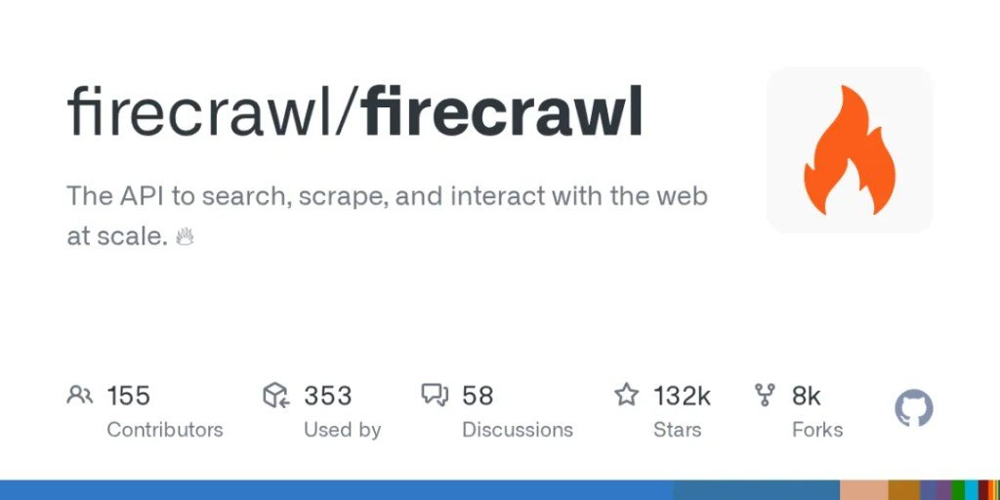

Agent 要上网，脏活往往不在模型，而在：**搜得到、抓得干净、JS 页别炸、输出别全是导航栏**。  
Firecrawl 把自己摆成 Web context API——官方原话是 search / scrape / interact the web at scale。人话版：少自己养爬虫农场。



正确仓库（原文链接曾打错，别抄错）：<https://github.com/firecrawl/firecrawl>  
许可证 **AGPL-3.0**；云端免费档原文称 1000 credits/月——2026-08-11 看定价页，Free Plan 确实是每月 1,000 credits。

## 它到底替你扛哪一段

| 能力 | 你少做的事 |
|---|---|
| Search | 搜完还要再打开结果页——它顺手把内容带回来 |
| Scrape | URL → Markdown / 结构化 JSON / 截图，少洗 HTML |
| Interact | 要点按钮、翻页、填表再抽——浏览器动作叠在 scrape 上 |
| Agent | 「帮我凑这类数据」式描述，自动跑一圈（预览/额度另算） |

旁路还有 Crawl / Map / Batch，选型时主看上面四块就够。

接进工作流的常见口子：**SDK（Python / Node）· MCP · CLI / 云 API**。  
MCP 只是插头之一——跟「MCP 和 Skills 别放一层比」那篇不打架：那边讲层位，这里讲**具体外设**。同批草稿见 [`mcp-handbook`](/posts/mcp-handbook/)。

## 数字怎么读才不挨坑

卡面写 **132k★**；核对日 GitHub API 已到约 **16.5 万**。星数会涨，引用请带日期。

| 说法 | 怎么用 |
|---|---|
| 「13 万 Star」 | 原文钩子 / 卡面时代；不是实时真理 |
| SDK「海量周下载」 | 原文称；官方站也有「2.5M+ weekly」营销口径——当量级参考，别当财报 |
| 1000 credits/月 | 原文称 + 定价页可对上；超出走付费档 |
| AGPL-3.0 | 自托管要接受 AGPL 义务；嫌麻烦就用云或换更松许可证的替代 |

最小示意（密钥占位，别往笔记里贴真值）：

```python
from firecrawl import Firecrawl

app = Firecrawl(api_key="fc-YOUR_API_KEY")
print(app.search("site:docs.example.com agent memory", limit=3))
```

## 选型时先问自己两句

1. **要的是干净 Markdown，还是要在页面上点完再抽？** 只要前者，Scrape/Search 够用；要登录墙后的交互，才看 Interact。
2. **能接受 AGPL / 云额度，还是必须完全自控且换许可证？** 接受 → Firecrawl 省事；不接受 → 另找 Apache/MIT 系自建方案，别被星数绑架。

留言里有人吵收费、拿 agent-reach 类方案比覆盖面——没对照评测前，当噪声。地址纠错那条倒是实锤：抄链接前对一下 `firecrawl/firecrawl`。
