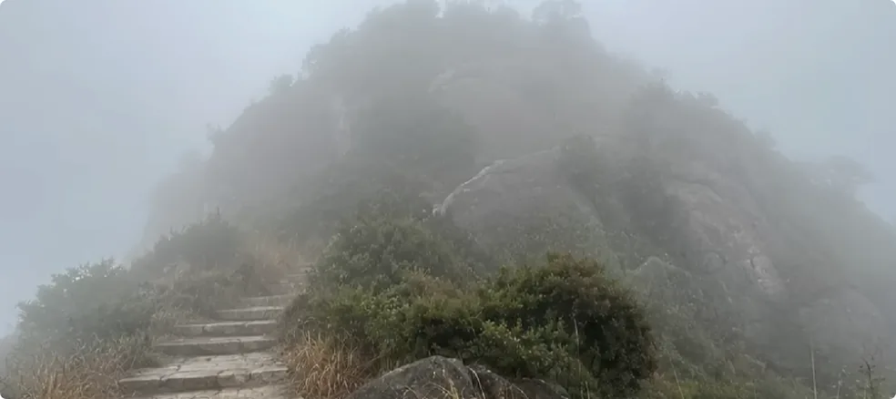

>url: https://www.youtube.com/watch?v=U-psw6pO7iU&t=4s
>作者: 修炼者小烨
>

今天我来分享一下实地修炼是种什么体验，在修炼的时候会遇到什么有趣的事情，真气又会给人带来什么感受。

由于语言是很难描述超自然的事物，所以我会尽量把所见所闻写下来，帮助大家带入。
我以前说过，**修仙就是要先得到上面的许可，然后去特别的地方采集真气，用真气清洗自己的肉体。这个过程要循序渐进，随着自身修炼境界越来越高，人的法力也会越来越强。**

## 刚开始修炼的时候
我刚开始修炼那会儿，我对修炼也很懵懂，出去一天也只能找到一个地方修炼。不过对于我这个新手来说，我也是很知足了。

我第一次一个人出门去的是浙江的一座山上，海拔一千多米，大清早就去了，走了3个小时。

当时雾气很大，几乎隔着10米就是雾，远处的景色都看不到。当时我也没多想了，就单纯觉得选的天气不大好。

一路上保持着前程恭敬的态度去拜访当地的神灵。其实修炼就是去找这些掌管一方生机的自然神灵，请他们度点真气给我们。

后来到地方了，我就向上面请示了一下权限。请示完后，当时神仙师傅就告诉我蹲下双手去接，然后我就蹲下去晃了晃双臂。果然我感觉石头上窜出了一股无形的气，包裹住我的双臂，然后慢慢地收拢到我的体内。

这是我第一次感受到真气的存在。那种感觉很难形容，有点清凉清凉的。总之就是肉眼虽然看不见，但是可以感受到它有个形体和范围，可以感受到一团气在身上流动。反正很快，几秒就接收完了。等我接收完后，雾就慢慢散开了，让我看清眼前的景色是什么样子。

后来我才知道为什么那天的雾会这么大，因为当时我的修为基本为零。那会儿我身上的凡气浊气是很重的，在神灵的眼里就好像看见一个黑乎乎的人走过来，神灵都不知道我这人是来干嘛的，所以要起悟把人劝退。直到后来神灵知道我是得令来修炼，才把雾散去。

在那儿之后的两三年里，我又走了几百个地方，不断采集真气修炼，不断给自己脱胎换骨。

## 脱胎换骨的感受
脱胎换骨是什么过程呢？

以前我说过，**在修炼人修炼之前，大道会派阴性生灵去吃修炼人，让修炼人从厄运和痛苦中觉醒修行的意识。**

其实还有一点就是脱胎换骨的这个过程，它需要不同层级的阴性生灵去吃掉人的凡气。修炼之前，有缘人表层的那层凡气会先被阴性生灵吃掉、损耗掉，然后等人开始修炼了，神灵会先清理掉这些生灵，再用真气帮你填补回去。

相当于说刮掉一层凡气，填上一层真气，从外到里一点一点、一层一层地重塑一个人。这样人才会慢慢变得不凡，慢慢对高等世界产生感知能力，接受真汽的容量慢慢加大。

那这个脱胎换骨的过程有什么外在表现呢？

最普遍的就是人会干呕或者咳嗽，因为神灵帮人清理浊气的时候，会有很多阴性生灵从胸腔跑出来，很多浊气会被冲出来，人的身体就会被动作出反应。

等排完浊气之后，大多数人会感觉很舒服。**首先是脑子很清明**，头上那种在城市里面待久了昏昏沉沉的感觉会消失。**然后就是眼睛会很亮**，视野突然变得清晰了不少，会比平时看得远，但是这些都是很普通的体验。

真正有意思的是什么呢？

**是随着脱胎换骨越来越深，人接受到的自然真气越来越多，人的灵魂会跟自然越来越相通，越来越能理解地球和宇宙层面的事情。**

比如说台风里面有谁，这场雨是谁下的，谁的封印被解开了，地下有什么东西跑出来了等等。这是真正的天人合一。你能觉察到的世界会很大，然后你会觉得人间的那些事情真的好没意思。

## 意义非凡的内蒙之旅
有一次是在内蒙认识，我的计划是今天待在A市，明天在B市，两个市我都想去看看，找找看有没有修炼的地方。
结果在A市的时候下了一天的雨，雾也很大，不太顺利，只寻了四五处地方修炼。当时我就在想，是不是在劝我走了。
然后傍晚我就打算开车上高速换另一个事。结果等我开车到高速的时候，那些积水就从山区流了出来，把高速路给淹了，直接封路了。
我立马反应过来，这是拦着路不让我走，要我留下来，明天才是好戏。然后我一把方向盘就开回去了。

果真第二天雨过天晴，那个景色真的是美不胜收。昨天下的雨都在今天蒸发了，半透明的水汽盘踞在山脊上，然后阳光打在水汽上，水汽折射出金色的光芒，远看就是一片燃烧的金色火焰。

我第一眼看到时候，我下意识以为整座山都在燃烧，真的是太震撼了。震惊之余，我的眼睛就自动发动功能了。

隔着几公里，那片金色火焰里蕴藏的真气就收了过来，一阵一阵地传过来，是那种温暖的、浓厚的真气。其实这就是太阳的真气了，因为那些水汽反射的是太阳的光。

后来傍晚的时候，太阳快下山了，我也需要返程了。因为难得来北方一趟，所以当时我心里很不舍，不知道下次来得什么年月了。
结果那儿的神灵好像明白了我的意思，突然在我身后不远的地方造了一个特别鲜艳的彩虹。当时我真的看哭了，太感动了，真的体会到神灵才是最有情意的这句话。

回过头来看，如果我头天就跑完了这片地区，那我第二天肯定要去另一个市，那我就见不到这样的美景了，也得不到这样的真奇。

## 吸收超越地球之外的真气
之后的两年我又跑了很多地方，基本上大地上修炼的场地类型我都见过一遍，有田野的、雪域的、火山的、大海的、沙漠的等等。

慢慢地我就发现，地球上的真汽好像越来越难满足我修炼的需要。虽然都是真气，但是真气也分不同的层级。
一般来说，地球上的气主要是滋养人类和动植物的，越到后面越难满足修神仙的需要。毕竟神仙是要住天上的，是要去到宇宙修炼的。或者换一个词，宇宙级别的生灵所需的能量级别，不是地球单一星体能够满足的。

后来时机到了，新的资源或者说新的修炼权限就给修炼人开放了。
有一次中秋，我是在福建的海边过的。当时我刚结束一天的修炼和奔波，躺在海边的一块石头上休息，想着就和那儿的神灵相伴夕阳。
我看着天空逐渐变暗，享受着海风，听着海浪声，特别惬意。突然间，不知道为何，我就想站起来。
我站起来后，我就看见海边的天际线上有一条粉红色的光线。我盯了几秒，原来是月亮正从海天交界处升起来。

那个场景真的非常美，微蓝色的天空交织着淡紫色的晚霞，一轮粉红色的圆月从天际线缓缓升起。
起初我只是在欣赏美景，随着月亮越来越高，升到某个高度的时候，月亮突然从淡粉色切换成淡橘色。就在切换完颜色的瞬间，一阵海风从月亮的方向一路朝我吹来，随之一阵真汽送进我的体内。

我立马意识到，今天晚上，天上神仙和地上神灵是要教我用月亮的真气修炼。
月亮的真汽是什么感觉呢？
文字很难形容，有点像摸到一颗珍珠的感觉，温润的清凉感，而且给人很安宁、很镇静的感觉，有一层很特别的气罩着我。
然后我就这样一直看着月亮，张开双臂吸收真气。我心里一直在默念：感谢月神，感谢各位神仙。

以前我只听过传闻，说民间有人看见过动物拜月修炼。如今我真的体验到了，除了感动和感恩，真的不知道还能怎么表达。
后来大概持续了十分钟，随着月亮越来越高，月亮从淡橘色变成橘黄色，真汽就关闭了。
那天晚上，我身上第一次裹上了其他星球的真气。这意味着一件事情，意味着我的功能可以到达地外距离了，或者说我以后的修炼又开始奔着突破地球的大气层、突破地球的轮回罩去了。
回想新人的时候，我还需要蹲下来接收真气。如今真的不一样。

那天回去之后，上面给了我一个短暂的修炼窗口。我发现不仅是月亮，太阳系内其他星球的修炼场地我也能识别出来。

只要人类的卫星从上面拍过照片，我就可以同那边的神灵建立联系。这是因为**能量法则是跨时空的。当我双眼扫过他们住所的时候，他们就能知道有一个特殊力量在观察他们，或者说他们也观察到了我**。也因为我得了令，所以他们也给我一些真气。

修炼其他星球的真气是什么感觉呢？

不同星体都不一样。金星的气进到体内是炙热的，木卫一的气是干裂的，天王星的气有电离子的感觉，冥王星的气则是肃穆俊冷的感觉等等。

总之那天修炼完后，我感觉我的神魂都在飘着，有点找不到上下左右了。

## 当下的情况
然后我就突然意识到，完了，地球上我是真待不住了。因为我感觉我跟地球好像有了陌生感，有股力量在拉着我往天上走。而地球地上都是人，都是人间的那些事儿，好像人类跟我没有关系了。
而且后面我发现，地球上的真气如果层级不够高，我几乎没有修炼的感觉，修为也没有什么突破。而且我现在的容量太大了，有的地方轻轻吸一口就把真气吸走了，还吸不饱。
还有就是我现在的功能太敏锐了，稍微往城市边缘靠近，我就觉得头晕、喘不上气。甚至身边路过的人我多看一眼，他们身上有些东西就会跑出来，跑出来的浊气冲得我特别难受。

所以截止目前，我每一两周都要出门一次。因为超过两周不出门，我就走不动道了。每次出门我就往那种没有人污染过的地方跑，那些地方的真气更加纯净。
上周我出门，有几位神灵帮我排深层的凡气，我感觉我的脊椎都要吐出来。
像这样猛的修炼场地去一个少一个，因为地球就这么大。自然界的神灵把真气度给你，就没有更多的气给其他人了，甚至也没法再帮你清理一次。

所以修炼人要不断换地方，不断找新的真气去修炼。

说实话，我都觉得我后面的修炼会很有挑战。不单是我身体对真气的要求太高了，每一两周都要跨省修炼，这跟旅游是没有差别的，这个经济压力也得考量。
所以我常常跟观众朋友说，修炼必须要有经济能力。没有钱你真的修不长远，不长远的人终将离席。既然终将离去，那一开始就不渡了。
所以很多人来信，我都第一时间讲清楚经济门槛。很多人听到钱字就觉得是骗局。其实我真觉得，如果你怀疑，眼前这条路不走反而更好。
因为这样想的人一般经济也不充裕，一样是走不远的。还不如不见这条路，真要见到了又跟不上，反而要崩溃的。

我是修仙者小烨，我们下期再见。