> 本页为「设计趋势与界面规范」3 篇的合订本；原文章链接会自动跳转到本页。

## 六张海报，五种能偷师的刀法

公众号几乎没写字，甩了六张国际/活动海报。跟同日的「红墙上的节气」一样是视觉品味归档，但题材不是一回事——那边是瓶口里的紫禁城，这边是破框、字母窗、像素块。

同日旁链：[红墙上的节气](/posts/solar-terms-red-wall/) · [LogoLounge 2026 十五刀](/posts/logolounge-2026-trends/)（均仍在草稿箱，本地可开）。

版权先钉死：只当案例欣赏归档。禁止商用临摹、二创当己有。权属归原设计师与品牌方。

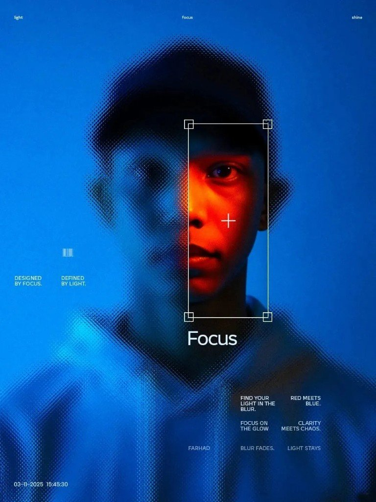

## 按手法归类（每张一行）

| 手法 | 图 | 带走 |
|---|---|---|
| 取景 / 焦点 | 01 Focus · light/focus/shine | 蓝半调糊一片，红橙取景框抠出一只眼——乱托准 |
| 破框 + 网格 | 02 Nike Air Max Day · MAXXED OUT | 人鞋冲出蓝天框压住大字；网格管信息，破框管劲 |
| 双色场 + 跨缝 | 03 Mont-Tremblant · JOIE DE VIE | 左灰白山景 / 右黑底橙字，滑雪者骑中缝，外套色跟字同色 |
| 字母窗 + 破框 | 04 哈尔滨冰雪节 · 北欧滑雪 | 巨型 N 当雪景窗，人冲出字廓——字是容器不是贴纸 |
| 像素网格 | 05 POKO COX 红花；06 DE ETENDE MENS 黄底橙字 | 像素是造型网格，不是滤镜；06 再叠纯双色场 |

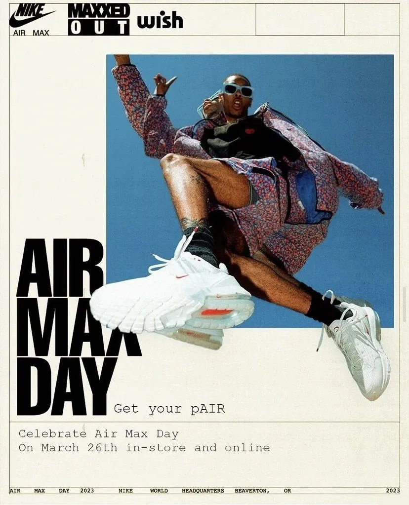

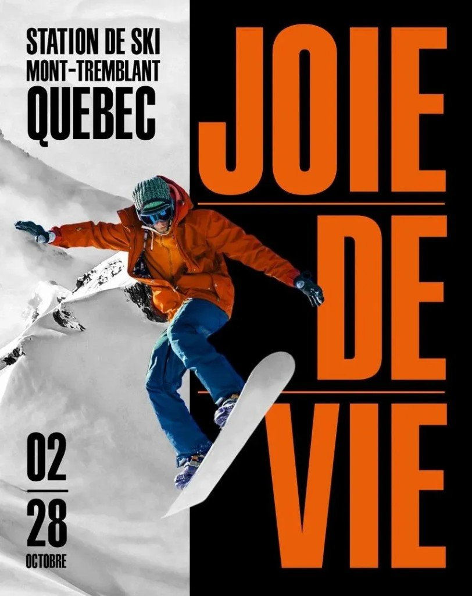

## 做 PPT / 信息图时怎么用（别描人家成稿）

- 要动能 → 主体溢出边框或压住标题一角（学 02 / 04 的逻辑，别复刻 Nike / 冰雪节画面）
- 要聚焦 → 大面积降噪 + 一小块高饱和清晰区（学 01）
- 要干净对比 → 竖切双色场，用人物或色条缝合（学 03 / 06）
- 要活动海报土味变利落 → 统一像素网格 + 中心锚点 + 信息贴边（学 05 / 06）

## 版权边界

无作者、无链接也不等于公有领域。Nike、冰雪节物料、活动票海报，权属在品牌方 / 主办方 / 署名设计师。本稿不授权二次传播、不授权改图出货。

## LogoLounge 2026：十五种标志刀法速查

公众号几乎没写字，甩封面 + 15 张趋势页。封面明说是 LogoLounge 2026 标志趋势解析——中文转述，不是官方英文报告原文。

同日视觉品味旁链：[红墙上的节气](/posts/solar-terms-red-wall/) · [六张海报刀法](/posts/creative-poster-gallery/)（均仍在草稿箱，本地可开）。

版权先钉死：案例 Logo 归原设计师与品牌方。只当欣赏学习。禁止商用临摹、二创当己有。

## 怎么记这十五刀

我按四组扫：立体化、字体/像素、情感亲和、符号指向。做 PPT / 信息图时偷的是语法，不是人家成标。

### 立体化（平面硬拗空间）

| # | 中英 | 手法 |
|---|---|---|
| 01 | 平面盒子 Flat Box | 等距透视三面明暗，盒子当空间错觉 |
| 02 | 角切 Corner Chop | 切角出负三角，锐气与张力用正负形对冲 |
| 03 | 椭圆 Elliptic | 椭圆秩序组合 → 洞口 / 轨道 / 透视深度 |
| 13 | 通道 Passages | 连续形透视隧道，讲「穿越」叙事 |
| 14 | 雷达扫描 Radar Sweep | 锥形/径向渐变模拟扫描运动与时间 |

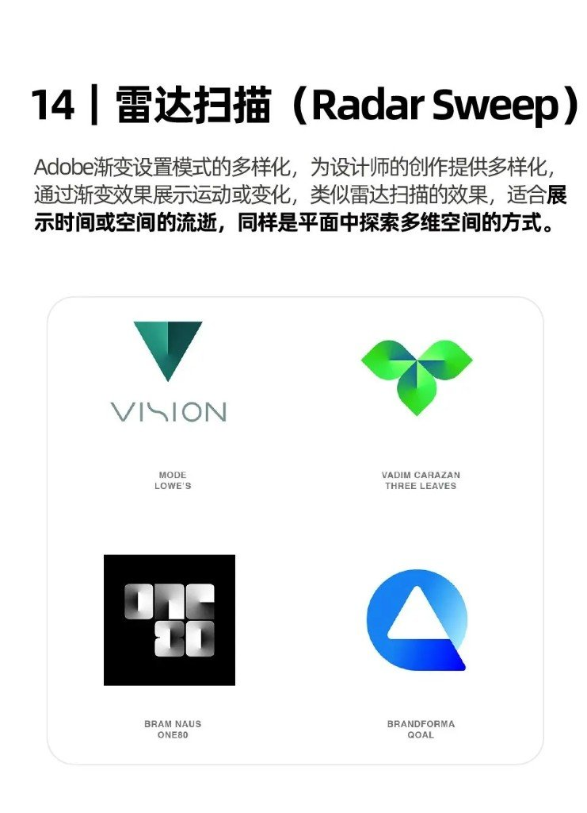

### 字体 / 像素 / 材质感

| # | 中英 | 手法 |
|---|---|---|
| 04 | 像素堆叠 Pixel Drop | 像素格=个体单元；可「掉落」游离方块 |
| 05 | 喇叭裤 Bell Bottoms | 字脚末端粗厚外扩——不是传统衬线 |
| 06 | 液态连接 Liquid Bridge | 粘性圆润接头，柔流共生（常贴 ESG） |
| 07 | 错乱线条 Mix Stix | 乱线筑巢，乱里藏秩序 |
| 09 | 贴纸 Stickers | 阴影+模切边，倾斜松散更活 |

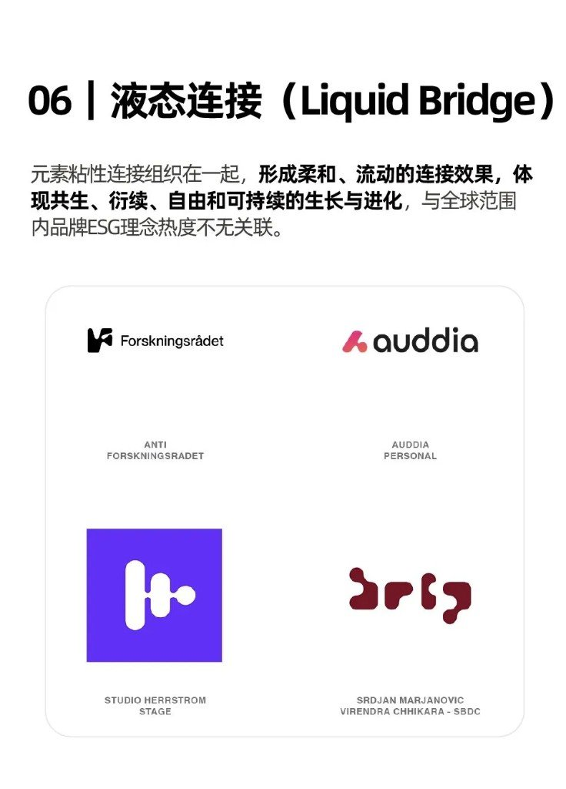

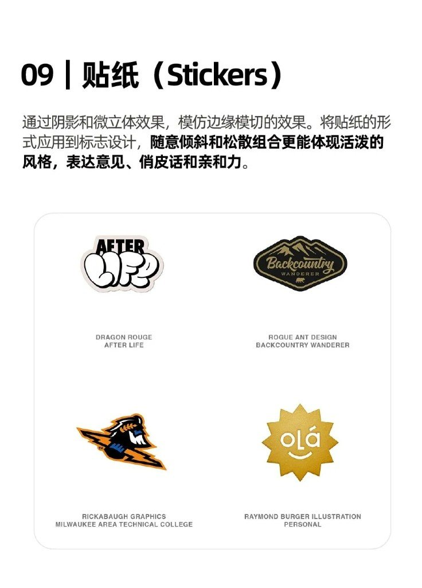

### 情感 / 亲和

| # | 中英 | 手法 |
|---|---|---|
| 08 | 笑脸 Smiley | 简笔笑脸嵌字标，拟人化 / IP |
| 12 | 平衡艺术 Balance Act | 不规则块当积木叠平衡，曲直混搭 |

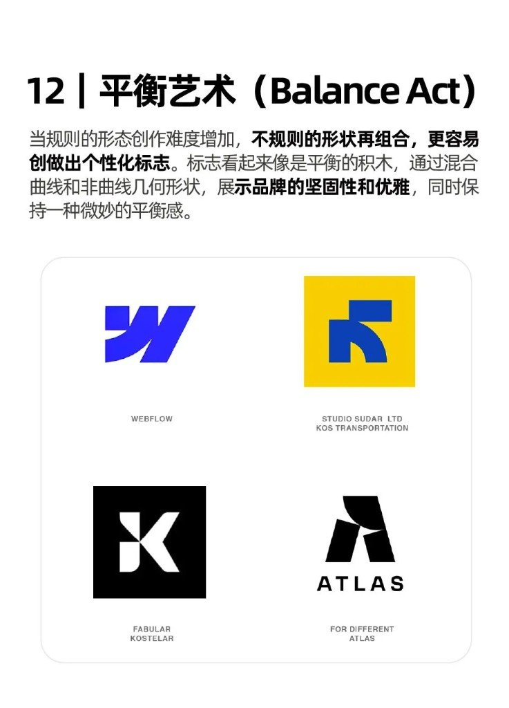

### 符号 / 指向

| # | 中英 | 手法 |
|---|---|---|
| 10 | 中心点 Center Point | 向心团结——滥了，靠外围元素救新鲜 |
| 11 | 指针 Pointers | 箭头并入字母，方向=号召力 |
| 15 | 新星 Nova Star | 四角星当 AI/高科技符号：神秘、信任、未来感 |

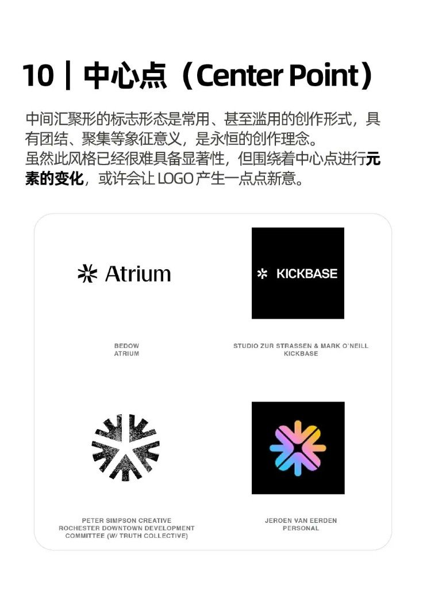

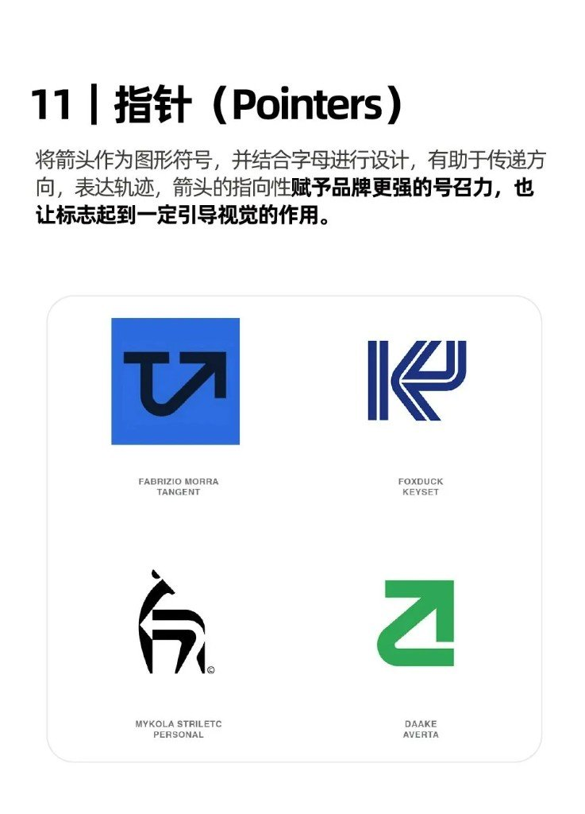

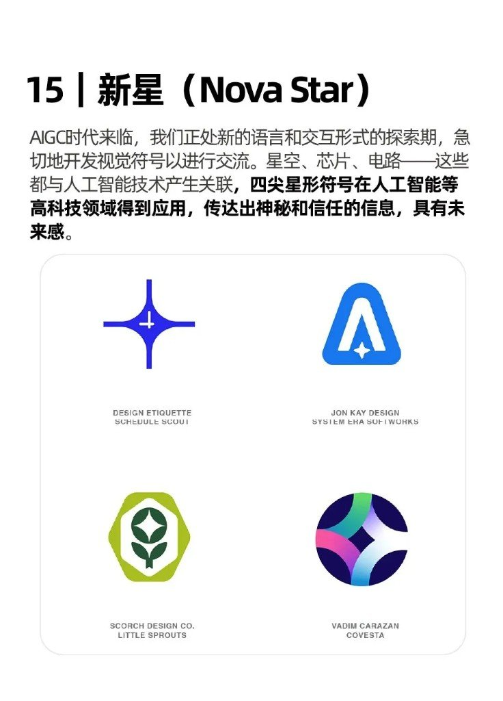

## 自己用时记这几条就够

- 想「薄标志有厚度」→ 先试 Flat Box / Elliptic / Passages / Radar Sweep，别一上来加阴影糊成伪 3D
- 想字标有态度 → Bell Bottoms 或 Pixel Drop，二选一别叠满
- 想亲和 → Smiley / Stickers；想科技未来感 → Nova Star（四角星，不是五角）
- 中心点（10）官方转述都承认难出新：能不用就换刀

偷语法，别描成标。十五页署名与原图权属归设计师与品牌方。

## 做界面前，先把六家规范官网钉在书签栏

别一上来从零画按钮、从零定色板。苹果系、Android 系、微软桌面、国内三大 B 端——各有一套官网把 HIG / 组件 / 开发文档捆在一起。余枫这组资源卡把六站压成一张表，够收藏、不够当教程。

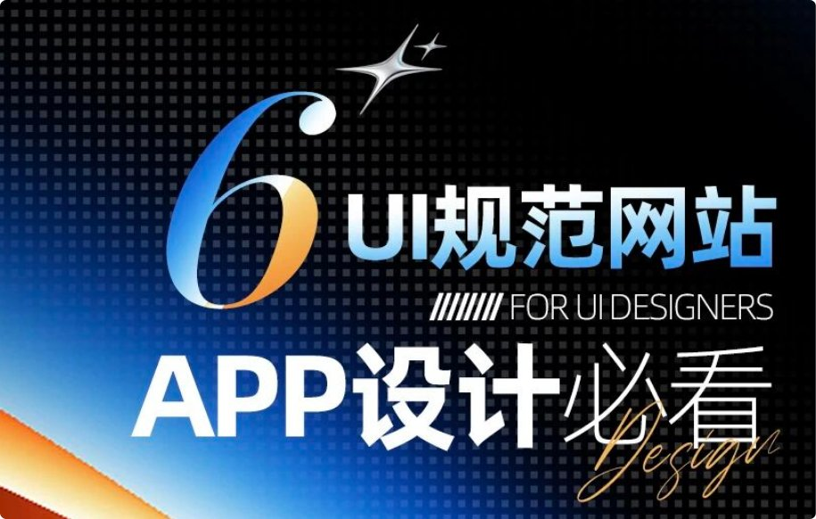

## 六站速查

| # | 系统 | URL | 带走什么 |
|---|---|---|---|
| 01 | Apple Design | https://developer.apple.com/ | 全生态 HIG、平台特性、视觉标准、模板/工具 |
| 02 | Material Design | https://m3.material.io/ | 材质光影、色字动效组件、响应式多端（M3） |
| 03 | Fluent Design | https://fluent2.microsoft.design/ | Fluent 2、多端组件、Figma kits、无障碍、微软生态一致 |
| 04 | Ant Design | https://ant.design/index-cn | 阿里企业级、6.0、海量组件、多端+数据可视化、AI 助手 |
| 05 | TDesign | https://tdesign.tencent.com/ | 腾讯开源；Vue/React/小程序；PC+移动；图提 Uniapp / MCP online |
| 06 | Semi Design | https://semi.design/zh-CN | 字节抖音团队；Figma+React；设计转代码；主题/多语言/无障碍 |

## 怎么选，别全开六标签

| 你在做 | 优先翻 |
|---|---|
| iOS / macOS / 苹果生态感 | Apple |
| Android / Material You 气质 | Material（m3） |
| Windows / 微软系桌面 | Fluent 2 |
| 国内中后台、表格表单堆料 | Ant Design |
| 腾讯系技术栈（含小程序 / Uniapp 线索） | TDesign |
| 要 Figma↔React、设计转代码更紧 | Semi |

规范站解决「标准与组件从哪抄」；审美旋钮、风格 Prompt、海报刀法是另一条线。同桶旅行 App 信息架构案例见 [旅行 App：先砍首页再谈好看](/posts/travel-app-ui-cases-02/)（草稿箱同批）；ui-styles / design-beautify / 创意海报品味另夹旁链，别跟本表并成一篇。
