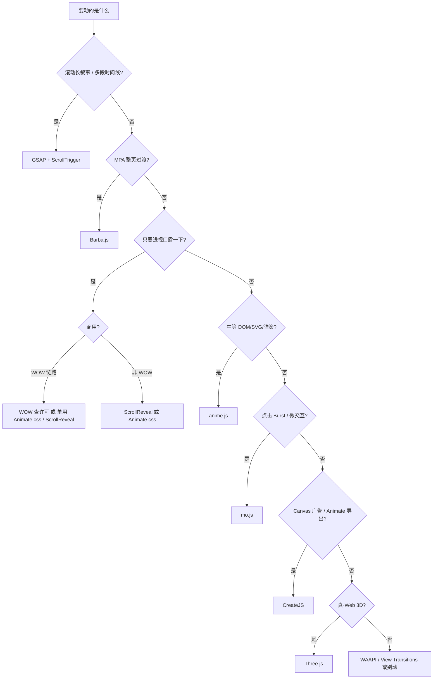
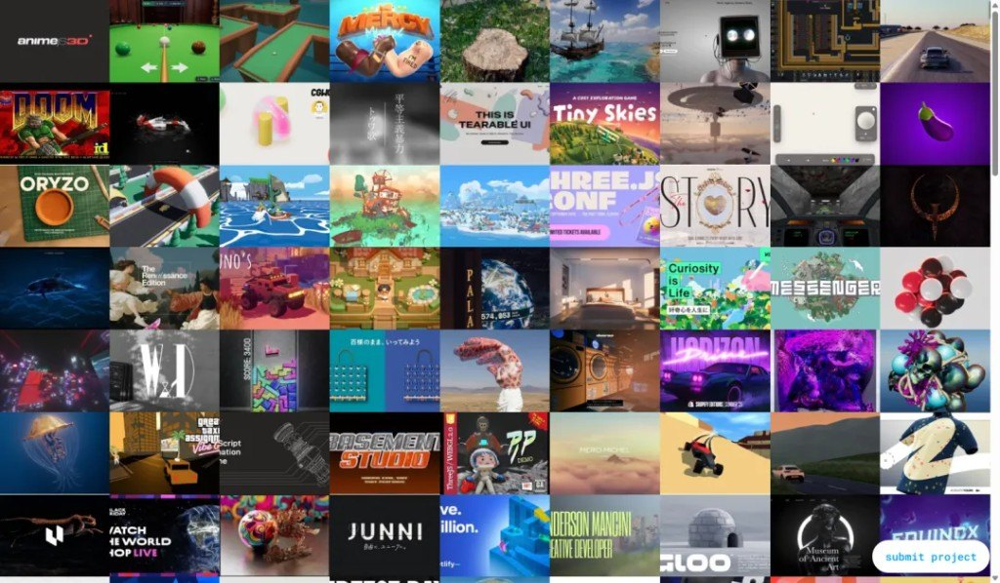
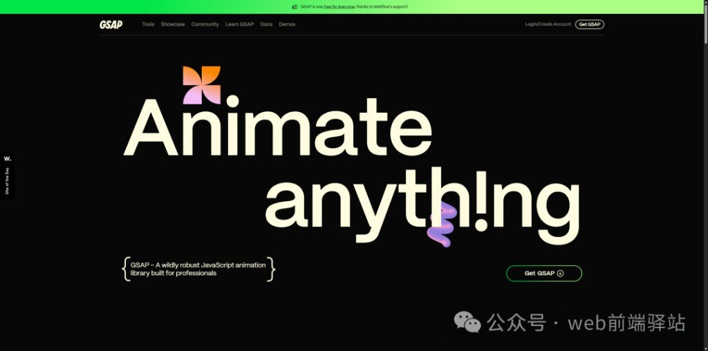
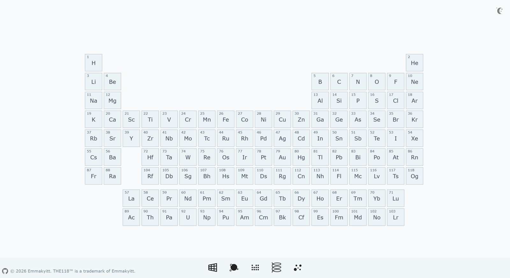
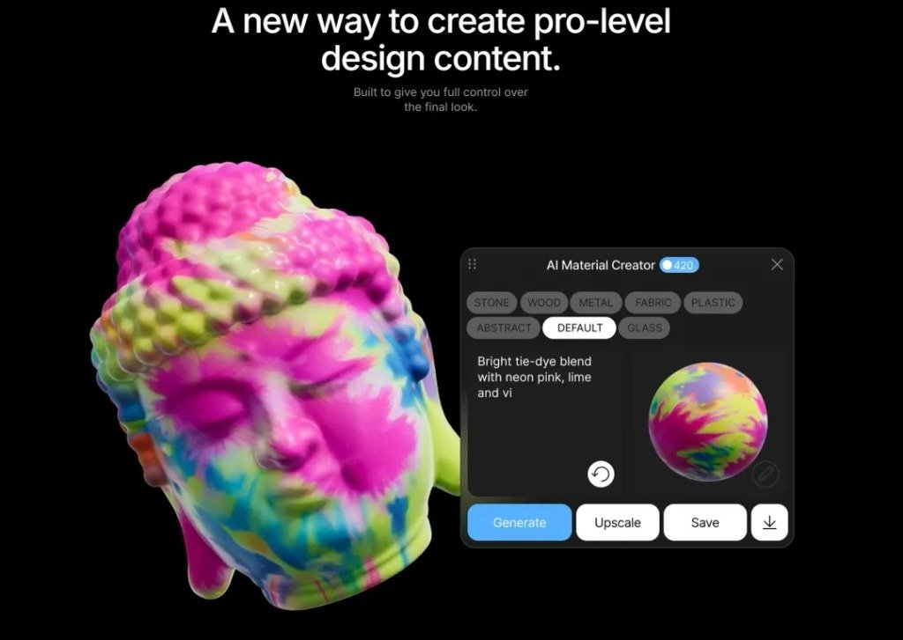
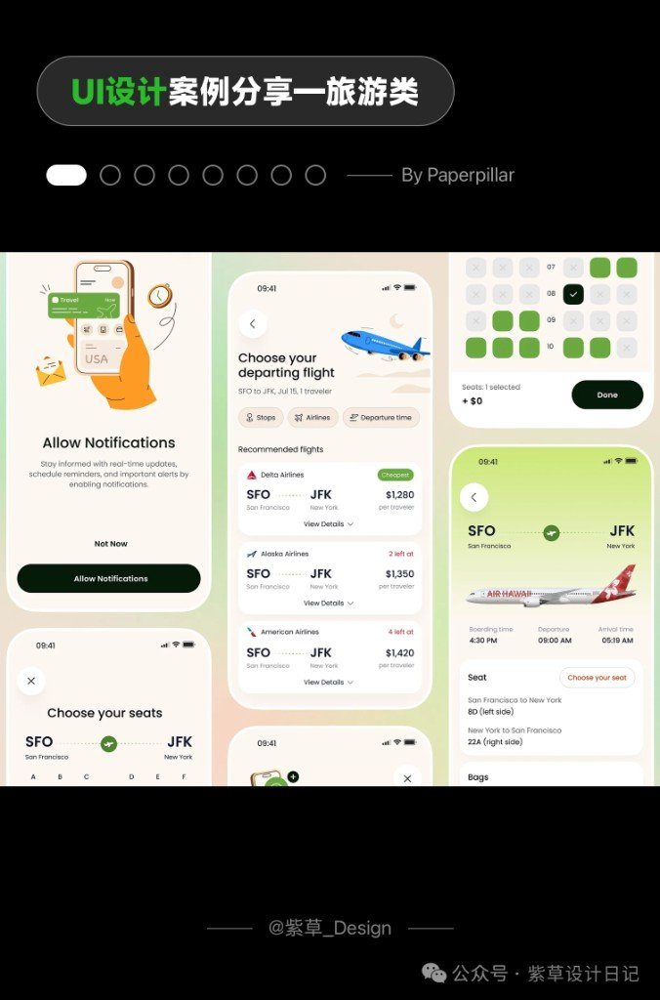
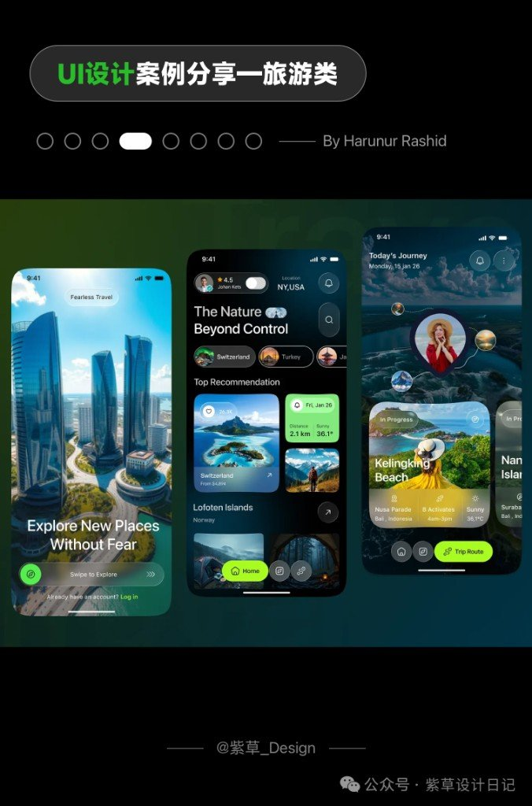

> 本页为「动效、3D 与实现」6 篇的合订本；原文章链接会自动跳转到本页。


## 小程序里别硬塞 GIF：Lottie JSON 走 canvas 2d

复杂高清动效用 GIF，体积先把自己埋了。设计师从 AE（Bodymovin 一类）吐出 JSON，用 `lottie-miniprogram` 吃进微信小程序 canvas。这是**设计导出路线**，不是 GSAP 手写 tween，也不是 SVG 十法那套描边/Morph。

同系列：[动效库选型](/posts/motion-lib-pick-by-scene/)管 Web 引擎；[SVG 十法](/posts/svg-animation-ten-ways/)管矢量镜头。本篇只钉 **uni-app 微信端落地**。

## 栈与生命周期

| 项 | 口径（原文） |
|---|---|
| 宿主 | uni-app + Vue 3.4 + TS |
| 包 | `lottie-miniprogram@1.0.12`（官方推荐适配层，源自 lottie-web） |
| 画布 | `<canvas type="2d">` |
| 基础库 | ≥ **2.8** 新 canvas；**2.9** 起正式开放 |
| 硬限制 | **不支持 expression**，小程序禁动态执行 JS |

核心三拍：`lottie.setup(canvas)` → `loadAnimation({…})` → 页面/组件卸载 `animation.destroy()`。`animationData`（本地对象）和 `path`（**仅网络 URL**）二选一；`rendererSettings.context` 必传 2d 上下文。

## 真机会撞的坑

1. **糊 + 比例飘**：设计稿按 px，界面按 rpx，canvas 再不乘 DPR 就糊。先 `rpx → px`（`rpx/750 * windowWidth`），再设 `canvas.width/height = 逻辑尺寸 * dpr`，最后 `ctx.scale(dpr, dpr)`；样式宽高跟逻辑 rpx 对齐。
2. **CSS 挪不动位置**：type=2d canvas 是原生层，压在 webview 上，CSS 管不住。创建时把样式定死，或走节点/JS API 设位置。
3. **AE 导出部分失效**：渐变等在 AE 里能动，进小程序或 Lottie 编辑器却僵住。多半是导出配置与 Lottie 子集不兼容，别先怪自己写错 API；先丢官方/国内预览器验证 JSON。
4. **expression 直接死**：设计侧若靠表达式驱动，小程序端跑不起来，得在 AE 侧 baked / 换写法。

## 组件该收的面

封装成 `LottieAnimation` 时，够用的 props：`width`/`height`（**rpx**）、`json`（对象 | 远程 path 字符串）、`isShow`（`v-if` 控挂载）。内部把 DPR scale 藏掉；`onUnmounted` 必 `destroy`。页面侧本地 JSON `import` 进来丢给 `:json`，宽高给个 200rpx 量级就能验。

关键片段（DPR + setup，勿整文件照抄）：

```ts
const dpr = uni.getSystemInfoSync().pixelRatio;
canvas.width = rpxToPx(width) * dpr;
canvas.height = rpxToPx(height) * dpr;
ctx.scale(dpr, dpr);

lottie.setup(canvas);
state.animation = lottie.loadAnimation({
  loop: true,
  autoplay: true,
  rendererSettings: { context: ctx },
  ...(typeof json === "string" ? { path: json } : { animationData: json }),
});
```

完整示例仓库（文内 Gitee，勿当 star 榜）：[phao97/miniprogram-lottie-animation-com](https://gitee.com/phao97/miniprogram-lottie-animation-com)。官方适配：[wechat-miniprogram/lottie-miniprogram](https://github.com/wechat-miniprogram/lottie-miniprogram)。素材与校验：[lottiefiles.com](https://lottiefiles.com)、[lottie-docs playground](https://lottiefiles.github.io/lottie-docs/playground/json_editor/)、[json.cn/lottie](https://www.json.cn/lottie/)。

## 什么时候别走这条

Web 营销站滚动叙事、时间线编排，回 GSAP / anime 那张选型表。纯 SVG 手写描边、Morph、滤镜，回 SVG 十法。只有「设计师已经吐出 Lottie JSON、目标是微信小程序」时，才值得把 canvas 2d + DPR 这一套接上。


## 动效库别瞎堆：先按场景砍到一个主引擎

站点一要「炫」，搜索结果就甩出一堆库名。真正费钱的是同一区块叠两套引擎、商用许可没查、以及用 Three.js 去拧按钮。下面这张表 + 决策树够开工。

同系列旁链：[SVG 能动起来的十条路](/posts/svg-animation-ten-ways/)（手法文）· [小程序 Lottie](/posts/miniprogram-lottie-canvas/)（AE→JSON→canvas，不是 tween 库）。


## 十库选型表

| # | 方案 | 主场 | 体积/形态（原文口径） | 许可 / 坑 |
|---|---|---|---|---|
| 1 | **anime.js** v4 | CSS/SVG/DOM/对象；Scroll、spring、draggable | ESM、模块化按需 | 中等复杂度优先 |
| 2 | **GSAP** | Timeline + ScrollTrigger 滚动叙事 | 插件生态 | 文称 **2024 中 3.13+ 全插件免费**（以官网许可复核） |
| 3 | **Barba.js** | MPA 整页过渡 | ~7KB | 不是 SPA 路由动画替代品 |
| 4 | **ScrollReveal** | 进视口揭示 | 零依赖 | 编排复杂就换引擎 |
| 5 | **WOW.js** + Animate.css | 滚动触发 CSS 类 | 叠 Animate.css | **WOW 商用要商业许可** |
| 6 | **Animate.css** | 纯 CSS 预设 | 无 JS 运行时 | 只够简单进出场 |
| 7 | **Velocity.js** | jQuery `.animate` 升级路径 | 语法近 jQuery | 新项目少见首选 |
| 8 | **mo.js** | Burst 等 UI 微交互 / 矢量运动图形 | 微动效向 | 别当整站滚动导演 |
| 9 | **CreateJS** | Canvas、广告、Animate 导出 | Canvas 族 | DOM 动效不找它 |
| 10 | **Three.js** | Web 3D / WebGPU | 场景引擎 | 2D UI 别硬塞 |


## 先问场景，再点库名



存量 jQuery 动画迁出：才轮到 Velocity。新活默认别从它开场。

## anime vs GSAP：怎么二选一

| | anime.js | GSAP |
|---|---|---|
| 你在乎体积与上手 | 更轻，v4 ESM | 能力全，按需挂插件 |
| 滚动叙事 | 有 Scroll | **ScrollTrigger** 仍是主场 |
| 团队已有时间线肌肉 | 够用就别上重的 | 复杂编排更省事 |
| 许可 | 常规开源用法 | **3.13+ 插件免费化**后门槛下降（复核官网） |

经验法则：营销长页、钉住、scrub、跨组件导演 → GSAP；卡片/SVG/弹簧玩具感、不想背插件心智 → anime。


## 别踩的两处坑

1. **WOW.js 商用许可**——个人演示和商用站不是一回事；能只用 Animate.css / ScrollReveal 就少背一层风险。
2. **粘贴错乱别当真**——原文末段曾把 mo.js 列表夹进「上一代库 / 原生 API」；正确归位：mo.js = 微交互；WAAPI / View Transitions = 与库**组合**的原生层，不是第 11 个同级「炫库」。



## 趋势其实就两头

专业动效在变成可默认依赖的基础设施（GSAP 插件免费化是信号之一）；另一头是浏览器原生 **View Transitions / WAAPI** 吃掉一部分「为过渡而引库」。库还在，职责更窄。

本站（Firefly）侧对照一句即可：滚动与时间线能力偏 GSAP 一脉；页面过渡走 **Swup**，和 Barba 的 MPA 过渡同类问题、不同实现——选型时分清「滚动叙事」和「路由/整页过渡」，别混进同一引擎硬扛。

## GSAP 现已全员免费（附录）

同日另一篇公众号专讲许可拐点，差分钉在这里，不复读上面的十库对照。



官网顶栏写得很直白：`GSAP is now free for everyone, thanks to Webflow's support!`
文称 **2024** 全面免费（含原 Club 插件）；商业能不能用、有没有例外，仍以官网许可页为准，别拿转载当合同。

**短历程**：Flash 年代的 GreenSock → 迁到 JS / 现代 Web → 插件生态把 ScrollTrigger / MorphSVG / SplitText 做成标配技能树 → Webflow 托底后的免费里程碑。知道这条弧线，就能理解为什么「以前劝你先看预算」的说法过期了。

**还值一提的核心**（细节去官方 docs，别在笔记里背手册）：

- 性能取向贴着 `requestAnimationFrame`
- API 面：`to` / `from` / `fromTo`，目标可到 CSS / SVG / 普通对象
- Easing + **Timeline**（多段编排才是它吃饭的家伙）
- 跨 DOM / SVG / Canvas / 框架旁路
- 插件：ScrollTrigger、Draggable、MorphSVG、SplitText…

和 anime 怎么二选一，见上文「anime vs GSAP」——这里只补一句：免费化之后，**别再因为「Club 插件要钱」默认降级到轻量库**；体积与心智成本仍是真实约束。

**四个最短 snippet**（认 API 形状即可）：

```js
// ScrollTrigger
gsap.to(".box", {
  x: 200,
  scrollTrigger: { trigger: ".box", start: "top 80%", scrub: true },
});

// MorphSVG
gsap.to("#circle", { duration: 1, morphSVG: "#hippo" });

// SplitText
const split = new SplitText(".title", { type: "chars,words" });
gsap.from(split.chars, { y: 40, opacity: 0, stagger: 0.03 });

// Draggable
Draggable.create(".knob", { type: "x,y", bounds: ".stage" });
```

**资源**：[gsap.com/docs](https://gsap.com/docs)（旧 greensock.com/docs 多半会跳转）、官网 Forums / Community。写 GSAP 前先翻官方文档，别在中文二手安利里绕圈。


## SVG 能动起来，这十条路别混着抄

刷到「解析 SVG 动画的 10 种实现方法」时，容易和「前端动效库 Top10」糊成一篇。不是一回事：那篇在挑 **anime / GSAP / Three** 进谁的包；这篇在问 **路径、描边、遮罩、滤镜** 本身怎么动。

库是导演椅；下面十条是镜头语言。先认手法，再决定要不要请 GSAP 上场。

姊妹篇：[动效库按场景选型](/posts/motion-lib-pick-by-scene/) · [小程序 Lottie](/posts/miniprogram-lottie-canvas/)（设计导出路，不是手写 SVG）。

## 十法对照：原理 / 场景 / 成本

| # | 手法 | 原理 | 适合场景 | 成本 | 性能/支持注意 |
|---|---|---|---|---|---|
| 1 | **CSS Transition** | 属性变了就插值 | hover、焦点反馈 | 低 | 优先 `transform`/`opacity`；别拿来做多段剧情 |
| 2 | **CSS Keyframes** | `@keyframes` 声明帧 | 循环呼吸、简单入场 | 低 | 跨元素同步脆弱；复杂时间轴易炸 |
| 3 | **Stroke dash 描边** | 调 `dasharray`/`dashoffset` | 签名、logo 描出、路线生长 | 中（要量 path 长） | 视觉便宜、实现不贵；长 path 注意主线程 |
| 4 | **WAAPI** | `element.animate()` | 要暂停/编排又不想引库 | 中 | 可编程；比 CSS 好控，比 GSAP 能力窄 |
| 5 | **GSAP**（MorphSVG / MotionPath…） | 时间线 + SVG 插件 | 多段叙事、morph、滚动驱动 | 高 | 天花板高；包体与学习成本换可控性 |
| 6 | **Motion Path** | CSS `offset-path` 或 SMIL `animateMotion` | 图标沿轨、飞行轨迹 | 中 | **SMIL 有弃用/收缩风险**；新项目偏 CSS 或 JS |
| 7 | **SVG 滤镜动画** | 动画化 filter 参数 | 水波、噪点、扭曲转场 | 中高 | 滤镜重；大面积常驻慎用 |
| 8 | **Morphing** | 两段 `path d` 插值 | 图标态切换、流体形变 | 高（点要对齐） | 原生难对齐；工程上常借 MorphSVG 一类 |
| 9 | **mask / clipPath** | 动画遮罩或裁剪形 | 擦除转场、聚光灯显隐 | 中 | 比硬切 `display` 更有设计感 |
| 10 | **CSS 3D on SVG** | `perspective` + 3D rotate | 轻空间层次、翻转感 | 中 | 不是真 3D 引擎；重场景仍看 WebGL |

最短示意只记字段，不贴长墙：

- 描边：`stroke-dasharray` + 动画 `stroke-dashoffset`
- 路径走位（CSS）：`offset-path` + `offset-distance`
- WAAPI：`svgQuery.animate([{ opacity: 0 }, { opacity: 1 }], { duration, easing })`
- 形变：对齐后的 `d` A → `d` B（或交给 MorphSVG）

## 怎么选，别十条全上

| 你卡住的问题 | 先试 | 升级条件 |
|---|---|---|
| 按钮 / 图标 hover 一下 | CSS Transition | 要多关键段 → Keyframes 或 WAAPI |
| 循环装饰、轻入场 | CSS Keyframes | 要和滚动/状态机咬合 → WAAPI / GSAP |
| 「像被画出来」 | Stroke dash | 还要沿轨飞 → Motion Path（CSS） |
| 要 JS 控进度，但不想加依赖 | WAAPI | 时间线变脏、多目标编排 → GSAP |
| 图标 A 融成图标 B | Morph（或 GSAP MorphSVG） | path 点对不齐就先整理矢量，别硬插 |
| 擦除 / 显露内容 | mask / clipPath | 要扭曲质感再叠滤镜，并盯帧率 |
| 轻微翻转层次 | CSS 3D on SVG | 真场景、灯光、相机 → 别硬撑 SVG，换 WebGL |

经验边界：

- **CSS 够用就别上库**：交互反馈和循环装饰，Transition / Keyframes 已经体面。
- **WAAPI 是「可编程的 CSS」**，不是 GSAP 平替；缺的是成熟插件生态和脏活封装。
- **描边 ≠ morph**：一个在「露出线」，一个在「改形状」。
- **mask 解决显隐叙事，滤镜解决质感**；滤镜贵，能少用少用。

## 比第十一种手法更重要的坑

1. **SMIL**：`animate` / `animateMotion` 在部分浏览器支持收缩或标弃用。新代码默认走 CSS `offset-path`、WAAPI 或 GSAP，别把关键动效绑死在 SMIL 上。
2. **`prefers-reduced-motion`**：系统要求减少动态时，关掉非必要循环与大位移；至少提供静止态。
3. **性能**：动画优先 `transform` / `opacity`。狂改 `d`、大面积滤镜、布局几何，掉帧比「不够炫」更伤。
4. **3D 预期管理**：CSS 3D 贴在 SVG 上只是空间感，不是 Three 的替代品。

先分清「用什么库」和「SVG 上哪一种镜头」。选错层，后面全是补丁。


## 没请 Three.js，纯 CSS 矩阵把 118 个元素摆进 3D 空间

B 站刷到 UP 主「忽见狸」的视频六周年开源回馈：一个 3D 交互式化学元素周期表，README 一句话就勾人——「纯数学矩阵驱动的 Web 3D 渲染方案，不依赖 Three.js/WebGL」。项目叫 the118，正好是第 118 号元素鿫（Og）。

扒下来跑起来，发现这项目比想象中干净：运行时依赖只有 `react` 和 `react-dom`，一个图形库都没有，118 个元素的 3D 位置全靠自己算矩阵，写进 CSS `transform: matrix3d(...)`。这篇文章是源码拆解，重点讲三条能带走的东西：五种布局的数学套路、点击聚焦的「反相机变换」、装饰器自注册工厂。


## 先记住三句话

- **几何不靠 WebGL**：每个元素的 3D 坐标算成一个 4×4 矩阵，直接写进元素的 `transform: matrix3d()`，交还给浏览器合成，切换布局时靠 CSS transition 做动画，没有 JS 动画帧。
- **五种布局是同一套积木**：表格 / 球体 / 螺旋 / 网格 / 随机，差别只在「怎么给每个元素算坐标」，底层用的全是同一个矩阵工具类。
- **点击聚焦是反着算的**：让选中的卡片转正浮到面前，不是把卡片挪过去，而是把它的变换反向施加给整个容器——数学上的「相机跟随」，零成本实现。

## 架构：四层一包，单向依赖

```
Infrastructure          Domain                  Application           UI
─────────────────       ───────────────────     ──────────────        ─────────
MatrixTools (4x4矩阵)     ViewModelFactory         useCardsMatrix3d      ElementCard
MathTools (几何公式)       (抽象工厂+注册表)         useCardsWrapMatrix3d   ElementStage
                         registerTo (装饰器)        Drag3d (拖拽包)         FooterMenu
                         5×ViewModel (布局算法)
                         ViewModelService (桥)
```

依赖方向是单向的：`Infrastructure → Domain → Application → UI`，数学层不依赖 React，UI 层不碰矩阵运算。业务与数学解耦得干净，这是它敢说「两三天能啃明白」的底气。

## 五种布局的数学本质

| 布局 | 一句话 | 数学套路 |
|---|---|---|
| Tab 表格 | 标准周期表 | 9×18 网格，模板掩码标记有效位，`getSpecialOffset` 专门处理镧系/锕系错位；纯平移+缩放，零旋转 |
| Sph 球体 | 地球仪 | 纬度按**余弦加权**分配元素（赤道最密、极点 1 个），圈内经度均分；每卡绕 X 倾斜纬度角 + 绕 Y 转经度角 |
| Hel 螺旋 | DNA 双链 | Y 轴等距排列（步长 5px），每 20 个元素绕 Y 转满一圈，角度均匀分布 |
| Gri 网格 | 卡片堆叠 | 5×8 一组的面板，面板沿 Z 轴层叠（每层 100px），每张卡额外绕 Y 转 -25° 增强立体感 |
| Ran 随机 | 粒子星云 | 三维均匀随机（X/Y 限视口 1/3，Z 在 ±200），**不缓存**，每次重排 |

注意一个细节：Sph 和 Hel 的「每张卡」都是 `旋转 → 平移 → 缩放` 三步矩阵相乘；Tab 和 Ran 只有平移+缩放。变换顺序从右向左应用，这是矩阵列向量约定的结果，写错了布局就会整个扭曲。



## 点击聚焦：反相机变换

五种布局都实现了 `calcCardsWrapMatrix3d(elementId)`，套路完全一致：

1. 取出目标卡片自己的变换参数（旋转角度 / 平移向量）；
2. 反向旋转 Y、X 轴，抵消卡片朝向；
3. 反向平移把卡片中心拉回原点；
4. 再沿 Z 轴前移 250px，让卡片浮到眼前。

表面看是「让选中卡片转正」，本质是「把整个容器往反方向扭，等效于相机移了过去」。不需要真正的相机对象、不需要 lookAt，两三个矩阵相乘就搞定。这个思路在零依赖 3D 里非常实用。

## 装饰器自注册工厂

`ViewModelFactory` 维护一个静态注册表，子类用装饰器自动登记：

```ts
@registerTo(ViewModelFactory)
class SphViewModel extends ViewModelFactory {
  static readonly LAYOUT_STYLE = LayoutStyle.SPH;
  calcCardsMatrix3d() { ... }
}
```

`registerTo` 读取子类的静态属性 `LAYOUT_STYLE` 写入注册表；`new ViewModelFactory(style)` 时用 `new.target` 判断是不是基类被直调，是则从注册表路由到子类并返回实例——运行时多态。

加一种新布局 = 新建一个类 + 一个枚举值，`index.ts` 里补一行副作用 import，其它什么都不用改。想给这项目做二次开发，这是最顺手的扩展点。

## 性能抠到骨子里

118 个卡片 + 拖拽旋转全跑在 CSS transform 上，代码里全是这种细节：

- 预分配 `new Array(118)` 代替 push，避免循环扩容；
- 循环内复用临时数组，不在 118 次迭代里反复建对象；
- `cachedMatrices` / `cardsTransform` 静态缓存，首次计算后直接复用引用；
- 矩阵乘法完全展开循环，消除索引与循环开销；
- 拖拽用 rAF 按帧节流（`needsUpdate` 标志），不高频刷 DOM；
- 拖拽时临时关 `transition`、开 `will-change: transform`，提升 GPU 合成层；
- React 侧用 `useState(() => ...)` 惰性初始化，矩阵只在首次渲染算一次。

还有个容易被忽略的设计：布局切换动画完全靠 CSS transition，所以矩阵更新时系统自动过渡，拖拽时又主动把 transition 关掉——两类交互用同一个属性，靠开关区分，很聪明的处理。

## UP 主自己怎么说

开源的同时 UP 主在评论区长篇回复了「学这项目要不要数学底子」，值得原样记住：

> 数学在软件工程中只占很小一部分，大概百分之三十左右。它只是某个业务能力实现的表达方式，这个算法不行就换一个算法实现。真正的难点在于抽象思维能力：三维空间的元素如何表示，视图布局模型之间怎么管理，元素状态变化何时更新，业务逻辑与数学计算怎么解耦。

几个关键伏笔：

- **欧拉角是现在的实现**，UP 主明说：如果要手动实现布局切换的轨道控制帧动画，就会撞**万向节锁**，下一步得引入**四元数**。代码里 `rotateY` 那项故意反转的 sin 符号，就是在欧拉角约定下跟渲染管线对齐的补丁。
- **数学是门槛不是天花板**：球体布局的加权分配需要高中到大学之间的空间解析几何（线性代数、矩阵、指数衰减模型），UP 主说「花两三天能啃明白」。
- **先搞懂数据怎么流动**：这是作者给的最基础的一条——元素状态怎么从点击到矩阵到 DOM，数据流理清了，优化才有抓手。

## 什么时候别用这套

纯 CSS 矩阵渲染有明确的天花板：

- **对象少、几何规则**（≤ 几百个卡片、球/螺旋/网格这类有解析解的形状）是它的主场，118 个元素刚好在甜区；
- 上千对象、需要光照阴影、遮挡剔除、粒子特效，还是老实上 WebGL 或 Three.js，CSS 合成层撑不住；
- 它赢在**零依赖 + 源码可读 + 渐变过渡免费送**，适合教育工具、数据可视化、规则排列的展示型页面。

想复刻这套，抓住一条主线就行：所有 3D 视觉问题，先翻译成「每个对象在自己的局部坐标里长什么样」，再翻译成「一组 4×4 矩阵」，最后灌进 CSS transform。剩下的都是工程包装。


## Endless Tools：浏览器里做艺术指导向的 3D，别被那张 ¥6.6 价卡带跑

「每天认识一款」第 58 期标题写的是 Endless Tools｜3D 设计工具，配图也确实是官网那套黑底、模板墙、材质面板。正文却像把好几篇 AI 设计软文揉进了一锅——Logo、PSD 分层、一键 PPT、绘本动画，FAQ 里还冒出个 Anijam。

这篇只带走：它大概是什么、官网侧能核对到什么、公众号里哪些段落要当噪声。


## 产品本身：偏 art direction，不是又一个「文生海报」

按官网（[endlesstools.io](https://endlesstools.io/)，核对日 2026-08-11）和本期配图，Endless Tools 更像：

- 浏览器里跑的 no-code / 低门槛 3D + 动态视觉工作台
- 口号直白：Art direction is now software（艺术指导变成软件）
- 强项在「可控的最终观感」：模板可改、材质可喂、特效可叠，再导出图 / 视频 / 嵌入网页

它跟 Midjourney 那种「出一张图就走」不是一路。更接近：品牌 / 平面同学想快速摸 3D 意向、做提案视觉、往站点塞可交互片段，又不想先开 C4D。


官网功能墙（与配图一致）可记这张表：

| 能力 | 人话 |
|---|---|
| 3D Extrude | 矢量挤成 3D；也可逛 Noun Project 形状 |
| AI 3D Generation | 文生 / 库里捞模型 |
| Visual Effects | 图、视频、3D 场景上叠实时特效 |
| 3D Text | 精选字体做立体字与动画 |
| AI Textures | 文生材质贴到模型上 |
| Embeds | 交互场景嵌进网站 |
| 8K Render | 高分辨率静帧导出（商用向宣传） |
| Post-processing | 后期叠层 |

材质侧配图很能说明「控制感」：左侧扎染佛头，右侧 AI Material Creator（类目 STONE / WOOD / METAL… + prompt + Generate / Upscale）。



## 公众号正文：哪些能信，哪些当串稿

| 区块 | 怎么读 |
|---|---|
| 开场「告别工具焦虑」 | 栏目统一鸡汤，压成一句：用一杯咖啡时间扫工具即可 |
| 「是什么」里封面/海报/教育工作者 | 方向勉强沾边；别当成功能清单 |
| Part·One 七条（文生设计、AI Logo、智能排版、PSD 分层…） | 与配图 / 官网八宫格对不上，更像通用 AI 平面工具文案，勿当 Endless 说明书 |
| Part·Two「从文本生成 → 排版配色 → 导出 PDF」 | 流程腔偏平面生成器；官网叙事是模板 / 实时 3D / 导出 8K·视频·GLB 等——以官网为准试 |
| 价格表 + 配图价卡 | 严重存疑，见下节 |
| Part·Three 场景 | 自媒体封面、创业物料、提案概念图——若落在「快速 3D 视觉」上还说得通；写成「一键 PPT / Logo 工厂」就过了 |
| FAQ | 浏览器、低配电脑——和「Web 工具」一致；Anijam、动画角色商用口径——当原文笔误 / 串稿，不要扩写 |

## 定价：原文别采信，官网另记一笔

公众号价卡长这样：基础免费 vs 专业 ¥6.6 / 月起，细项全是「PPT 模板下载、一键生成 PPT、可编辑源文件」——跟 3D 工具标题硬撞。

粘贴正文还甩出全能 ¥79（绘本 / 故事 / 视频）、教育定制两档。这已经不是「写错一个数字」，是整段像别的产品价目混进来了。


官网公开页（同日核对）写的是另一套口径：

- Free：核心功能 3 天试用（不是「永久免费基础档 + 5 点」那种表述）
- PRO：约 $20 / 月，年付约 $249.99（页上有 Save 17% 年付选项）
- PRO 权益宣传点：每月 AI credits、商用无水印、最高 8K / 视频 / USDZ·GLB·Web embed、实时特效、模板库等

不要用公众号那张 ¥6.6 / 绘本表做决策；要付钱先打开 [endlesstools.io](https://endlesstools.io/) 看当前套餐。汇率、活动价、国内代理价本文未核。

## 谁会真用得上

说得通的用法大致是：

- 提案前快速堆 3D 意向、材质与光感，而不是交付最终影视级资产
- 站点 / 作品集需要可嵌入的轻交互 3D 或特效块
- 平面出身、不想先啃传统 3D 软件安装与硬件门槛

说不通、或至少别按这篇公众号去承诺的：

- 当「AI 一键出商用 PPT / 绘本动画」的平替（原文价卡在暗示这个，产品图不支持）
- 默认「生成内容全球商用无坑」——FAQ 写得很满，仍以平台条款为准

## 还想动手时

1. 直接打开官网，用免费试用摸模板墙和 Material / Effects 面板。
2. 导出前先搞清你要的是静帧、视频，还是 GLB / embed。
3. 若只在公众号里看到 ¥6.6 和「一键 PPT」，当广告拼贴略过，回到官网价。

公众号真实链接原料未给；定价与功能以官网当日页为准。


## 旅行 App 信息太多时，先砍首页，再谈好看

旅行产品的坑通常不是「不够美」，是选项叠太多：机票、酒店、攻略、约车、地图同时抢注意力，用户还没出发就累了。紫草设计日记这组「旅行类 02」拼图，钩子写得很直——怎么把决策焦虑压下去。下面只留能带走的几条，案例当对照表，不当审美鸡汤。


## 决策焦虑从哪来

信息密度高，不等于信息架构清楚。功能入口墙一排图标，等于把「你自己想该点哪」甩给用户。

这组案例反复出现的解法是同一方向：

| 做法 | 在屏上长什么样 | 焦虑被砍掉的是什么 |
|---|---|---|
| 场景化首页 | 目的地大图 / 「Explore Now」/ Good Evening，而不是九宫格入口 | 先选场景，再进功能 |
| 行程/结果卡片 | 酒店+评分+距离、航班+价+余票，挤在一张卡 | 少跳页、少对照 |
| 实景取色 | 草原金、沙漠暖、阿尔卑斯绿进按钮与点缀 | 界面跟目的地同温，少「模板蓝紫」 |

不是说功能入口可以永远消失——是首页别当工具箱封面。

## 八个案例，按「一屏在干嘛」读

设计师署名以图面为准；公众号水印为紫草设计日记 / @紫草_Design。

| 设计师 | 产品/主题线索 | 这一屏主要在解决 |
|---|---|---|
| Paperpillar | 浅色机票流 | 列表筛选 → 选座 → 航班详情，步骤拆开但不碎屏 |
| Ronas IT | Africa / 草原 | 实景开屏 + 分类卡（Safari / Cultural）+ 地图进度 |
| Fazlur Rahman | 约车 + 地图 | From/To + 车型 → 地图选乘 → 选司机，路径短 |
| Harunur Rashid | Fearless Travel（深色） | 发现首页叠推荐卡；当日行程挂路线 |
| Juice Lab | Petra / 暗色体验 | 问候式首页 + 房间指南卡 + 目的地网格 |
| Md. Shakil Hawlader | Elvara（浅绿） | Find your place 分类条；My Trips 状态标签 |
| Mohammad Ali | Odyssey / Bavarian Alps | 地图底 + 大卡推荐 + 酒店详情浮层 |
| Budiarti R. | 机票结果 / 登机牌 | 排序芯片 + 选航班；登机牌一页带走 |

总览拼图把上述几类压成六格对照，适合先扫一眼再钻单案。






## 拿来用时的边界

- 欣赏与对照：看信息怎么折叠进卡片、首页怎么先讲场景。
- 别当商用模板：图上作品归属各设计师 / 工作室；公众号是二次编排分享。直接扒布局、插画、摄影去上线产品，版权风险自担。
- 系列：标题带「旅行类 02」；Knowledge 近 7 日无同题「紫草 / 旅行 UI」撞车，本篇独立落盘。若日后补到「01」，再互相写对照即可。

规范官网速查见同批 [六家设计系统书签](/posts/six-app-design-systems/)（草稿箱）。
