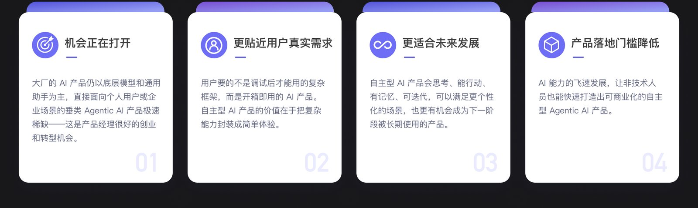
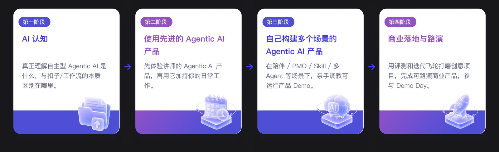
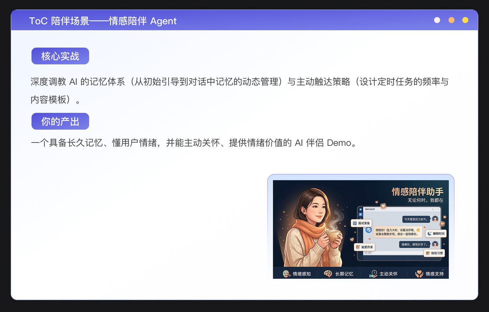
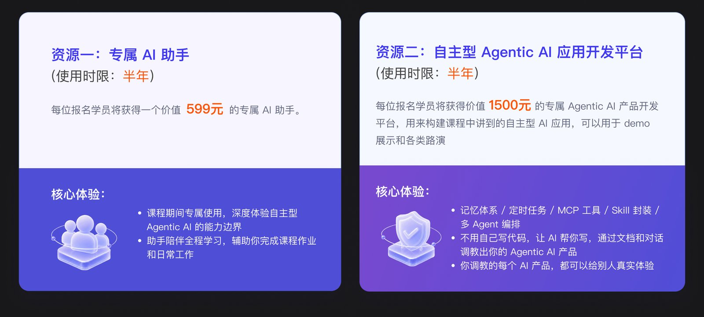
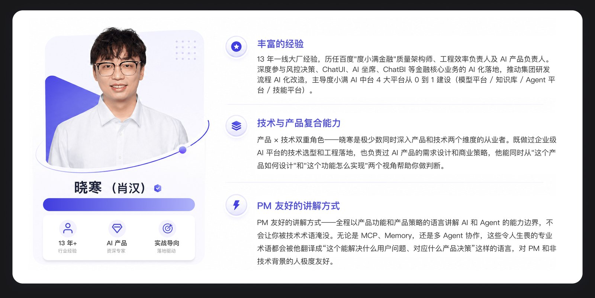
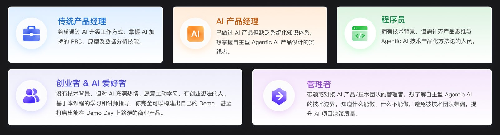

极客时间《Agentic AI 产品训练营》是三门课里唯一零技术门槛的一门：8 周全程直播，面向产品经理、程序员、创业者和管理者，目标是**从 AI Product Manager 变成 AI Product Builder**——不用自己写代码，通过文档和对话调教出可路演的自主型 Agentic AI 产品。讲师晓寒（13 年+ 大厂经验，前度小满质量架构师、工程效率负责人及 AI 产品负责人）。我把官网大纲和 FAQ 完整翻了一遍，这篇是详细拆解。

> 这是三篇训练营拆解之一。另外两篇：[企业级 AI 编程实战营](/posts/geektime-enterprise-ai-coding/) ｜ [AI Agent 全栈工程师训练营](/posts/geektime-ai-agent-fullstack/)。横向对比见[总览篇](/posts/geektime-ai-bootcamps-compared/)。

## 先搞清楚：什么是"自主型 Agentic AI"

这门课最怕你和两类东西混淆，FAQ 里专门划了界限：

- **和扣子（Coze）/ 工作流类的区别**：扣子需要你手动搭每一个节点，流程固定、线性，适合有明确流程的自动化任务。自主型 Agentic AI 不用预设固定流程，能自己规划步骤、自主调用工具、根据结果调整行动——更像真正的智能协作者。
- **和企业 RAG 对话机器人的区别**：RAG 的核心是"从知识库找答案"，本质是检索 + 生成，缺乏主动行动能力。自主型 Agentic AI 除了回答问题，还能记住你、主动提醒你、帮你执行任务——是主动式而非响应式。

课程的概括是：**扣子是工具，RAG 是知识库，Agentic AI 是协作伙伴**。对标的是 OpenClaw 那样有记忆、能自主决策和行动的产品。

## 课程骨架：4D Method + 能力雷达图

方法论主线是 **4D Method 框架：Discover → Design → Develop → Deploy**，覆盖从需求发现、产品设计到评测验证、数据飞轮迭代的完整闭环。

AI 产品经理的能力雷达图有四个维度：**Agent 设计 / Eval / 数据飞轮 / 工具调用**。整门课就是围绕这四项能力 + PM 角色转变（从产品经理到产品 Builder）展开的。

## 8 周大纲：从认知到路演

课程整体分四阶段：AI 认知 → 使用先进 Agentic AI 产品 → 自己构建多场景产品 → 商业落地与路演（Demo Day）。

### Week 1 启航——自主型 AI 产品的机会与门槛危机

- **理论**：自主型 AI 产品市场空白分析；门槛危机（OpenClaw 从热到凉，技术极客产品 vs 大众产品的鸿沟）；自主型 AI 产品全景图（C 端 / B 端 / 工具型）；能力雷达图；4D Method；PM 角色转变。
- **实战**：开发平台快速上手；体验 3 类 Demo（陪伴型 / 企业助手 / 分析型）；用 5-Question Framework 分析产品价值；环境配置。
- **产出**：开发环境就绪 + 能力雷达图基线。

### Week 2 体验——AI 助手如何改变产品经理的工作（上）

- **理论**：课程专属 AI 助手能力（长记忆、工具调用、定时任务、Skill 复用）；AI 时代需求分析（需求挖掘三法 + 优先级排序）；用户研究（访谈记录分析、合成用户 persona 快速验证）；AI 时代 PRD 模版（功能 + 技术 + 数据需求 + 成本估算 + 风险评估）。
- **实战**：初始化专属 AI 助手；用助手做需求分析 / 用户研究 / 撰写简版 PRD。
- **产出**：需求分析 + 用户研究报告 + PRD。

### Week 3 体验——AI 助手如何改变产品经理的工作（下）

- **理论**：AI 可行性 4 问；可交互原型设计（**v0 / Figma AI** 等）；视觉交付物设计（**Gamma / Beautiful.ai**）；项目管理协同（AI 会议纪要、自动化状态报告）。
- **实战**：PRD 技术可行性评估；生成可预览原型；产出汇报 PPT；对比课程助手与 ChatGPT。
- **产出**：技术可行性评估 + 产品原型 + 汇报 PPT。

### Week 4 C 端陪伴场景 + B 端 PMO 场景产品设计

- **场景一 C 端陪伴**：自主型 AI 场景拆解（C 端陪伴 vs B 端工具对比）；**AI 记忆体系详解**——初始记忆、引导阶段收集、对话中记忆、定期记忆 review、后台定时梳理；定时任务设计（主动触达时机、内容、频率的产品策略）；陪伴型产品设计（情感陪伴、健康管理、学习伙伴的共性与差异，心理学与社交知识辅助）。
- **场景二 B 端 PMO**：**工具调用分层理论（Tools → Function Calling → MCP → CLI → Bash）**；企业内部工具生态（常用系统分析、MCP 中台概念）；企业级安全与认证（认证体系、权限分级、数据隔离、审计追踪）；PMO 产品设计（项目状态同步、风险预警、周报生成）。
- 两个场景的共性与差异横向对比；用 AI 助手辅助两类场景调研。

### Week 5 Skill 模块化 + 多 Agent 协作场景产品设计

- **场景三 Skill 模块化**：Skill 的本质（从 Prompt 到可复用能力、什么时候该封装成 Skill）；Skill 市场与生态（成熟 Skill 复用策略、商业模式）；Skill 沉淀方法论（从 SOP 到 Skill 的转化、Claude 创建 Skill 的要点）；商业机会调研专家（用户是谁、需求是什么、价值如何量化）。
- **场景四 多 Agent 协作**：什么任务需要多 Agent（复杂、多维度、需要不同专业视角）；多 Agent 怎么做（分工模式并行/串行/委派、Agent 间通信与协调）；**多 Agent 设计模式（Orchestrator-Workers、Pipeline、Group Discussion）**；智能投顾产品设计（需求分析、风险识别、产品策略）。

### Week 6 产品质量——AI 评估与数据飞轮

这是产品课里技术含量最高的一周：

- **为什么必须评估**："感觉还行"不是标准，不做评估 = 裸奔上线。
- **评估框架设计**：别用通用 Eval，为你的产品定制评估标准。
- **LLM-as-Judge**：自动化评估器设计、评分 Prompt 设计、偏见控制。
- **Eval Pipeline 与开源框架**：**Ragas、DeepEval、PromptFlow** 等框架概览。
- **数据飞轮**：数据 → 标注 → 迭代 → 更好的产品 → 更多数据；前期埋点设计（收集 Agent 表现数据、哪些信号说明"好用"、哪些说明"翻车"）；数据收集方案（埋点位置、数据存储、标注流程）；模型漂移监测（Drift Management、分阶段部署策略）；评估作为质量门禁（评估 → 改进 → 再评估的闭环）。

### Week 7 Agentic UI + 创意工坊立项

- **理论**：AI 产品交互范式变化（从命令式、对话式到主动式）；**Agentic UI 三种形态（对话式 / 主动式 / 嵌入式）**；Placement & Prominence 设计（AI 功能在界面中的位置和显著性决策）；降低认知门槛的设计（渐进式引导、错误兜底、信任建设）。
- **创意工坊**：立项你的专属 Agentic AI 产品。

### Week 8 商业、路演

- **理论**：自主型 AI 产品商业模式（定价策略、变现路径、单位经济模型）；AI PM 职业发展路径（从 IC 到 Lead，不同行业/公司的 AI PM 定位）；路演技巧（5 分钟路演结构：是什么 → 解决什么 → Demo 演示，如何讲好产品故事）。
- **项目路演**：各组汇报进度、讲师点评答疑（技术方案、产品设计、风险评估）、最终路演准备与同学互助 review。

## 5 个实战项目：覆盖四大高频场景

1. **项目一 ToC 陪伴场景——情感陪伴 Agent**：调教 AI 记忆体系（初始引导 → 对话中记忆动态管理）与主动触达策略（定时任务频率与内容模板），产出"具备长久记忆、懂用户情绪、能主动关怀的 AI 伴侣 Demo"。
2. **项目二 ToB 效率场景——企业级项目管理助手（PMO）**。
3. **项目三 能力模块化——商业调研专家 Skill 封装**。
4. **项目四 深度分析场景——智能投顾多 Agent 协作系统**。
5. **项目五 创意工坊——你的专属 Agentic AI 梦想立项**。

课程期间共完成 3–4 个场景 Demo + 结课 1 个深度打磨的专属产品，参与 Demo Day，可作为求职作品集或创业路演 Demo。

## 报名即享的 AI 资源：零代码开发平台

课程主打零代码，靠的是两个赠品平台：

- **专属 AI 助手**（价值 599 元，使用期半年）：具备长记忆、工具调用、定时任务、Skill 复用，陪伴全程学习、辅助完成作业。
- **自主型 Agentic AI 应用开发平台**（价值 1500 元，使用期半年）：核心能力是记忆体系 / 定时任务 / MCP 工具 / Skill 封装 / 多 Agent 编排。"不用自己写代码，让 AI 帮你写，通过文档和对话调教出 Agentic AI 产品"。

关于 Token 费用，FAQ 说得很清楚：平台设免费 Token 使用限额，经测算足以覆盖全部课程实战，不需要自付 API 费用。超过赠送使用时限后，可以把助手记忆和 AI 应用数据打包导出，迁移到其他 Agentic AI 应用——官网点名 **OpenClaw、Hermes、Claude Code**。

## 讲师

**晓寒（肖汉）**：13 年+ 一线大厂经验，历任百度"度小满金融"质量架构师、工程效率负责人及 AI 产品负责人。深度参与风控决策、ChatUI、AI 坐席、ChatBI 等金融核心业务的 AI 化落地，推动集团研发流程 AI 化改造；主导度小满 AI 中台 4 大平台从 0 到 1 建设（模型平台 / 知识库 / Agent 平台 / 技能平台）。产品 × 技术双重角色，教学风格"PM 友好"——把 MCP、Memory、多 Agent 协作这些术语翻译成产品决策语言。

## 技术栈 / 工具栈清单（这门课涉及的）

- **核心平台**（赠品）：专属 AI 助手、自研零代码 Agentic 开发平台（记忆 / 定时任务 / MCP 工具 / Skill / 多 Agent 编排）
- **原型 / 设计**：v0、Figma AI（可交互原型）、Gamma、Beautiful.ai（汇报 PPT）
- **评测框架**：Ragas、DeepEval、PromptFlow、LLM-as-Judge
- **技术概念**（教学对象）：MCP、Function Calling、CLI / Bash（工具调用分层）、Skill 封装、多 Agent 编排（Orchestrator-Workers / Pipeline / Group Discussion）、记忆体系、数据飞轮、Drift Management、Agentic UI
- **数据迁移目标**：OpenClaw、Hermes、Claude Code
- **对照学习**：ChatGPT
- **明确排除**：Coze / 工作流类、企业 RAG 对话机器人（FAQ 专门划清界限）

## 适合谁 & 我的判断

官方适配人群：传统产品经理（想用 AI 升级 PRD、原型、数据分析技能）、AI 产品经理（缺系统化知识体系）、程序员（补产品思维与 Agentic 技术产品化方法论）、创业者 & AI 爱好者（无技术背景想做 Demo Day 路演产品）、管理者（对接 AI 团队想了解技术边界）。FAQ 明确零技术门槛。

我的判断：别被"产品课"和"零代码"误导成水课——它的 Week 6（Eval 与数据飞轮）讲得比很多工程课还实，Week 4 的工具调用分层和 Week 5 的多 Agent 设计模式也是真概念。它最大的价值是**视角**：教产品人理解 Agent 的能力边界和设计语言，而不是教写代码。适合产品、创业者和想补产品思维的工程师。三门课里它和最硬核的全栈营恰好是两端——一个管"该不该做、怎么设计"，一个管"怎么造出来"。

---

*信息来源：极客时间官网课程页 u.geekbang.org/subject/32 及官方大纲文档（2026-08 抓取）。第 1 期 2026-07-01 开课，8 周全程直播（每周 4 小时），第 2 期 2026-12-31。价格官网未公开，需咨询学习顾问。*
