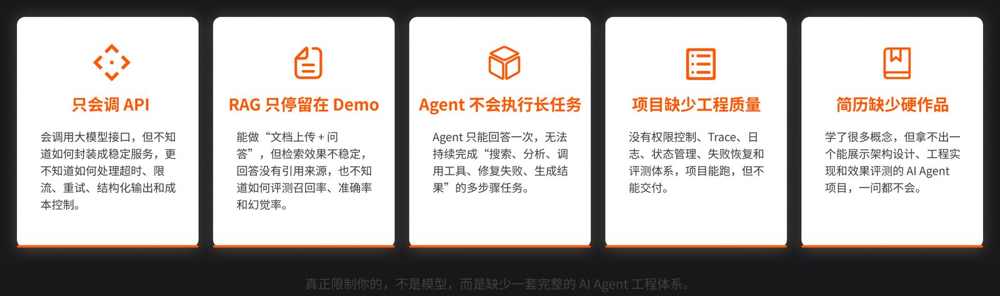
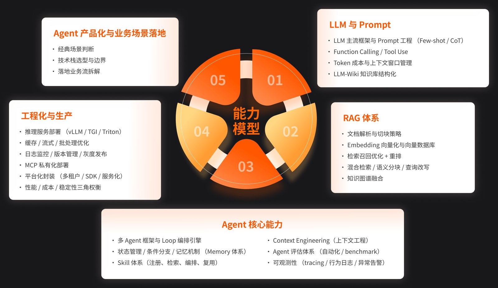
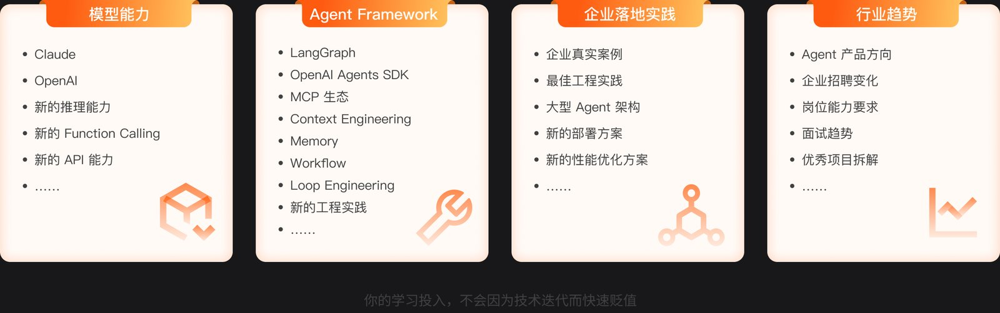
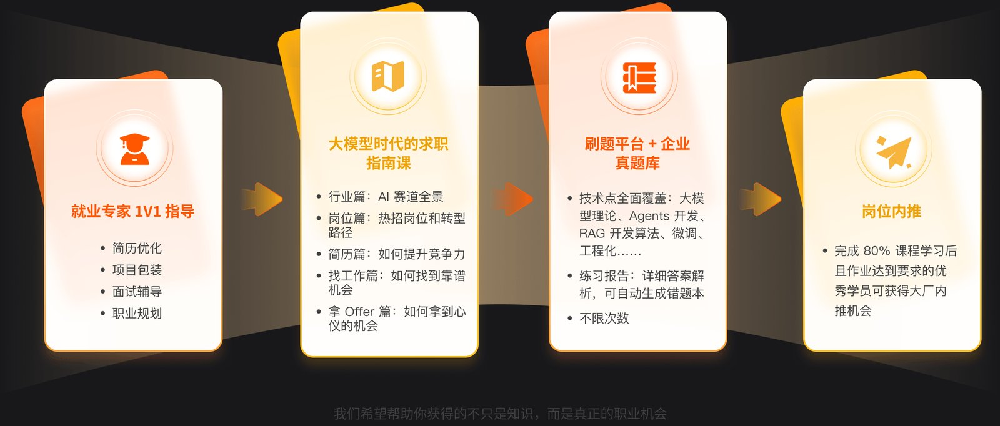
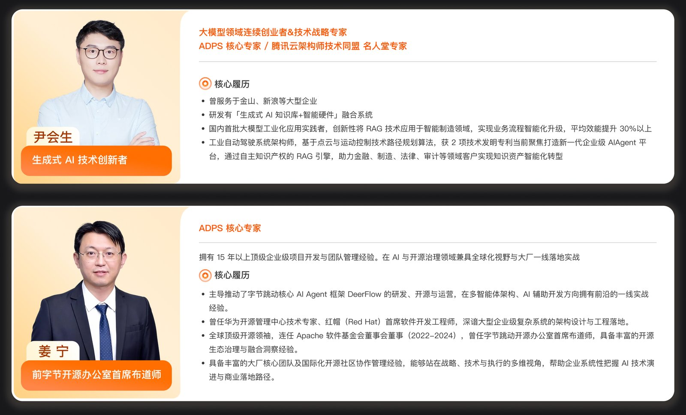
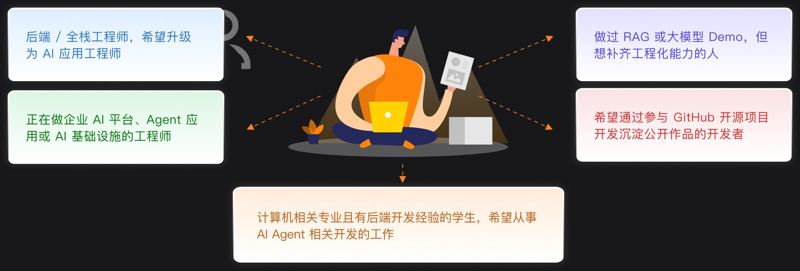

极客时间《AI Agent 全栈工程师训练营》是三门课里技术密度最高、周期最长的一门：14 周录播 + 直播，6 个企业级项目，主线是**从零搭出一个可部署、可监控、可灰度、可回滚的 Agent Engineering Platform**。讲师是尹会生（生成式 AI 技术创新者）和姜宁（前字节开源办公室首席布道师，主导 DeerFlow 开源）。我把官网七章大纲完整翻了一遍，这篇是详细拆解。

> 这是三篇训练营拆解之一。另外两篇：[企业级 AI 编程实战营](/posts/geektime-enterprise-ai-coding/) ｜ [Agentic AI 产品训练营](/posts/geektime-agentic-ai-product/)。横向对比见[总览篇](/posts/geektime-ai-bootcamps-compared/)。

## 它瞄准的岗位缺口：会调 API ≠ 会开发 Agent

课程开宗明义：企业应用正从 ChatBot 到 Workflow 再到 Agent 快速升级，真正有价值的是能自主规划、多步执行、持续完成复杂任务的 Agent。招聘需求也跟着变了——越来越多企业要求候选人具备 LangGraph、RAG、MCP、Agent Runtime、Context Engineering、Agent Eval、Tool Calling 这些能力。

它要解决的痛点是"学了很多 AI，却依然不会开发能实际落地的 Agent"。目标岗位是 AI Agent 开发工程师 / 大模型应用工程师，学完达到初、中级 Agent 开发工程师水平。

## 能力模型：传统后端转型，补这六项

课程把 Agent 开发工程师的能力拆成八块：后端工程基础、Python 工程能力、LLM API 与 Prompt、RAG 与知识库、Agent Loop 与 Tool Use、Context / Memory、Agent Eval、工程化部署与可观测性。

对传统后端工程师，它算了一笔账：你已有的优势是 API 服务开发、数据库与缓存、异步任务、权限认证、日志监控、限流重试熔断、Docker 部署；需要重点补齐的是模型调用、Prompt 与结构化输出、工具协议、上下文管理、 Agent 状态机、Eval 与质量治理。入学门槛是掌握 Java / Go / Python / Node.js 任意一门，熟悉 Git 和 GitHub 协作。

## 七章大纲：平台从底到顶的七层

整个课程就是按 Agent 工程平台的七个层次递进的，每章配一个项目演进阶段。

### 第一章 LLM API、Prompt 与结构化输出

目标很聚焦：完成从传统 HTTP API 到 LLM API 调用的迁移，只解决"如何稳定调用模型"。

- **LLM API 基础**：Chat Completions / Responses API 的请求结构、消息格式、模型参数（temperature / top_p / max_tokens）、Token 与 Context Window、错误类型与重试策略、多模型调用。
- **Streaming 流式输出**：SSE（Server-Sent Events）实现打字机效果、FastAPI StreamingResponse 低延迟转发、前端/CLI 用 EventSource / ReadableStream 逐块消费、中断与取消、断点持久化。
- **Prompt Engineering**：System Prompt 职责、角色定义、Few-shot、任务拆解、Prompt 模板与版本管理、Prompt 注入防护。
- **Structured Output**：为什么不能依赖自然语言解析；JSON Schema 定义结构、Pydantic 做校验 + 反序列化、模型原生结构化输出、输出纠错重试、失败降级回退。
- **实战 LLM Gateway**：自建大模型网关——FastAPI 统一 HTTP 入口、OpenAI Compatible 协议封装屏蔽多厂商差异、流式代理、Schema 集成、Pydantic 双侧校验（请求入口 + 响应出口各拦一次）、Prompt 模板库、限流超时自动 fallback 备用模型、Token / Cost / Latency 日志留痕。

### 第二章 Function Calling、Tool Runtime 与 MCP

理解 Agent Tool Use 原理，搭一套含注册、校验、权限、审计、超时、失败恢复和可观测性的工具运行时。

- **Function Calling 与 Tool Use**：工作机制；工具定义（名称、描述、参数 Schema、返回 Schema、错误 Schema、权限等级、风险等级）；工具治理（参数校验、权限控制、调用审计、超时、重试、失败恢复、Trace）。
- **Tool Runtime 设计**：Tool Registry（注册 / 发现 / 元数据 / 分类 / 版本 / 依赖 / 启停）；Tool Schema 至少含名称、说明、输入输出结构、错误结构、权限级别、风险级别、超时配置、重试策略、审计字段。
- **工具治理与安全边界**：参数校验、权限隔离（只读 / 写操作 / 高风险 / 需确认）、RBAC 与用户身份透传、工具白名单、SQL / Shell 风险控制、人工确认机制、调用队列、敏感数据脱敏。
- **MCP**：Function Calling 负责"模型如何选择工具"，MCP 负责"工具如何标准化接入"。接入文件系统 / 数据库 / GitHub / 内部 HTTP 服务的 MCP，做权限控制、审计、连接管理。
- **实战 Agent Tool Runtime**：Tool Registry + Function Calling + JSON Schema / Pydantic 校验 + 权限控制 + 风险分级 + 调用审计 + 超时重试降级 + MCP 接入 + Tool Call Trace + CLI 调试入口。

### 第三章 Agent Loop、State Machine 与 Codebase Agent

从"单轮调用 + 单次工具执行"升级为可连续思考、执行、观察、纠错的长程任务 Agent。

- **从 Tool Agent 到 Agent Loop**：单轮 Tool Calling 的局限；ReAct 模式、Plan-and-Execute；Observe → Think/Plan → Act → Observe → Finalize 循环；最大循环次数、终止条件、死循环识别、任务中断与恢复。
- **Planning 与任务拆解**：一次性计划 vs 动态计划、Plan Revision、子目标拆解、步骤依赖；何时用固定 Workflow、何时用 Agent Loop；计划与执行偏差处理。
- **State Machine 与 Checkpoint**：任务状态（created / planning / running / toolfailed / waitingtool / waiting_approval / completed / failed / cancelled）、步骤状态；Checkpoint 实现中断恢复、状态持久化、失败复现、人工接管后继续。
- **Sandbox 与执行边界**：文件系统边界（可读 / 可写 / 禁访问目录）、Shell 命令控制（白名单 / 超时 / 高风险拦截）、网络访问控制；本地 Sandbox vs Docker Sandbox 的边界差异；工具审计与风险回放。
- **Agent Harness**：把模型、工具、状态、上下文和执行环境组织在一起的运行框架；Agent 生命周期管理、工具集装配、Checkpoint + Trace、Human-in-the-loop（高风险动作前请求确认）。
- **LangGraph 与编排**：StateGraph（图 / 节点 / 边 / 状态）、条件分支与循环、Checkpoint、Interrupt、Tool Node、调试与可视化；LangGraph、OpenAI Agents SDK、AgentScope 的定位对比；通过 Dify 理解流程节点与状态管理。
- **实战 Codebase Agent**：带一套代码仓库工具（list_files / search_code / read_file / read_directory / write_file / apply_patch / run_test / run_command / git_diff / git_status），能做两类典型任务——代码理解（找出登录逻辑并生成 Markdown 文档）和测试生成与修复（补测试、读失败日志、修代码）。

### 第四章 Context Engineering、Memory 与 Codebase RAG

解决上下文、知识和记忆问题——Agent 的能力上限不只由模型决定，也取决于它每轮"看到了什么、遗漏了什么、如何压缩、如何检索"。

- **Context Engineering**：与 Prompt Engineering 的区别；Context Packing（哪些信息进上下文、哪些留外部状态）、Prioritization、Budget、Compression（长文件截断摘要、工具结果压缩、历史对话压缩、无关过滤）；上下文污染、Token 预算、成本与延迟控制；KV Cache 对长上下文推理成本的影响；**LiteLLM** 演示模型路由、fallback、调用日志和成本追踪；Context Debug Report。
- **Working Memory 与任务上下文**：保存当前任务目标、已完成步骤、工具结果、未解决问题；Scratchpad 保存中间推理和执行状态；工作记忆生命周期；与 Agent State 的边界。
- **Memory 体系**：短期记忆（当前会话与任务状态）、长期记忆（用户偏好、历史任务、常用工具、记忆写入/检索/更新/删除/可信度）、项目级记忆（目录结构、技术栈、模块边界、构建/测试/部署命令、编码规范、历史修复经验）；任务摘要与状态恢复；不同记忆策略对成功率/成本/延迟的影响对比。
- **现代 RAG 系统**：文档解析（PDF / Markdown / HTML / 表格，清洗与元数据提取）；Chunking（固定长度 / 按段落 / 按标题 / 语义分块 / 代码 AST 分块 / Overlap / Metadata）；检索（Embedding 模型选择、FAISS / Milvus / Chroma 至少熟一种、BM25、Elasticsearch、Hybrid Search、Metadata Filter）；Query Rewrite / Decomposition / 澄清；检索后处理（Cross Encoder / LLM Rerank、上下文压缩、证据筛选、Citation 溯源、回答与证据一致性校验）；RAG 评估基础（召回率、命中率、答案正确率、幻觉率）。
- **LLM Wiki 与知识资产治理**：知识分类、文档版本、来源追踪、知识维护、知识权限、知识质量。
- **实战 Codebase RAG & Memory**：给 Codebase Agent 加代码库索引 + 文档索引、AST / 文件级 Chunk、向量 + BM25 混合检索、Rerank、文件引用 + 行号引用、长文件摘要、工具结果压缩、项目级记忆、Context Debug Report、可恢复任务摘要。

### 第五章 Multi-Agent、Skill 与 Agent Eval

理解单 Agent 与多 Agent 的边界，并建立可量化、可回归、可持续优化的 Eval 体系。

- **Multi-Agent 与 Subagent**：为什么不是所有任务都需要 Multi-Agent；单 Agent 适用场景（目标明确、步骤短、上下文集中）vs 多 Agent 适用场景（代码审查、研究分析、安全扫描、性能诊断等多视角任务）；三种模式——Supervisor（主控拆解调度）、Planner / Executor（长程任务）、Reviewer（复核降幻觉）；并行与串行；隔离机制（上下文 / 工具 / 权限隔离）；成本与超时控制；冲突仲裁。
- **Subagent 任务委托**：子任务要明确目标、输入上下文、可调用工具、权限边界、预期输出、输出格式（JSON / Markdown / 结构化字段）、超时限制、评价标准、写操作限制（默认只读，修改需单独授权）。
- **Result Aggregation**：结果合并、证据合并与引用保留、去重排序、结论汇总、冲突识别与仲裁、主 Agent 复核。
- **Skill 系统**：Skill 定义（执行方法 + 输入输出规范 + 工具依赖 + Prompt 模板 + 质量标准封装成可复用能力包）；生命周期（注册 / 检索 / 匹配 / 执行 / 评估 / 版本 / 下线 / 复用）；Skill 编排（顺序 / 并行 / 条件分支 / 人工确认）。
- **Agent Eval（核心护城河）**：为什么需要 Eval——能跑不代表可靠、Demo 成功不代表真实成功、改 Prompt 可能旧任务退化、换模型可能工具调用行为变化。Golden Dataset 构造标准任务集；核心指标（Task Success Rate、Tool Call Accuracy、Tool Parameter Accuracy、Answer Correctness、Citation Accuracy、Retrieval Recall、Hallucination Rate、Human Handoff Rate、Latency、Token Cost、Tool Call Count、Failure Recovery Rate）；Eval 方法（Rule-based / Schema-based / Snapshot Test / Golden Answer / LLM-as-Judge 的适用边界 / Human Eval / Pairwise Comparison / Regression Test 与 A/B Test / Trace Analysis）。
- **Trace Analysis 失败诊断十三类**：Prompt 问题、上下文问题、检索问题、工具选择错误、参数错误、权限拦截、工具执行失败、Agent Loop 死循环、子 Agent 委托错误、模型能力不足、最终答案幻觉、引用不准确、评测误判。
- **实战 Multi-Agent & Eval Platform**：构建 Supervisor / Architecture / Test / Security / Performance / Documentation / Report 七个角色 Agent 协作（典型任务"分析项目可维护性并给出重构建议"）；Eval 平台能力含 Benchmark 任务集管理、批量运行、Prompt / Model / RAG 策略对比、Trace 记录、LLM-as-Judge 与人工评测、成功率/成本/耗时/工具调用统计、失败样本聚类、改进前后对比、回归测试报告。

### 第六章 工程化、生产部署与可观测性

从"Agent 项目能运行"升级为"可部署、可监控、可灰度、可回滚、可治理"。

- **模型服务与推理部署**：云 API / 私有化 / 混合部署的权衡；**vLLM**（PagedAttention、连续批处理、OpenAI 兼容接口、显存优化）、**TGI**（部署、流式、批处理、监控指标）、**Triton**（多模型推理、GPU 资源管理、动态批处理）。
- **性能与成本优化**：五层缓存（Prompt Cache / Semantic Cache / Embedding Cache / RAG Cache / Tool Result Cache，命中率与失效策略）；批处理与并发（Embedding Batch / 批量 Rerank / Eval Batch / 并发队列 / 任务优先级）；模型路由与降级（强弱模型分层、Fallback、Token Budget、小模型优先、缓存优先、人工兜底、限流熔断降级）。
- **Agent 可观测性**：日志（模型调用日志、工具调用日志、Agent Trace 全链路）；Replay 机制（保存失败任务 / 输入 / 上下文 / 工具结果 / 状态，复现问题、验证修复、支撑回归测试）；监控告警四类指标——业务指标（任务成功率、人工接管率）、模型指标（Token、P95/P99 延迟、Fallback 率）、Agent 指标（工具调用准确率、检索命中率、Loop 中断次数）、安全指标（高风险工具调用、越权拦截率、危险 SQL 拦截率）。
- **版本管理、灰度与回滚**：五个版本对象（模型 / Prompt / 工具 / RAG 策略 / 知识库 + Workflow 与 Agent 版本）；Feature Flag 控制各版本；灰度发布（按用户 / 部门 / 租户 / 任务类型 / 风险等级 + A/B Test）；回滚策略（Prompt / 模型 / 工具 / 知识库 / Workflow / 服务镜像回滚）。
- **MCP Server 与私有化部署**：部署、鉴权、网络隔离、工具白名单、日志审计；内网工具接入、密钥管理（API Key 不入库）、多租户隔离、配置中心、敏感字段脱敏、数据权限过滤。
- **实战 Production Ready Platform**：Docker Compose 起 API + 数据库 + Redis + 向量库 + 模型网关；平台化封装（SDK 封装 Model Gateway / Context Build / Tool Call / Agent Run / Eval Runner；服务化拆成模型 / 上下文 / 工具 / 工作流 / 评测 / 日志服务；平台治理做统一鉴权 / 限流 / 审计 / 版本 / 成本分摊 / 质量门禁 / 上线审批）。

### 第七章 企业级综合项目与产品化落地

把前六章能力转化成可展示、可交付、可面试表达的业务成果。

- **DeerFlow 架构解析**：通过九条核心架构线深度剖析 DeerFlow 源码——请求入口 Gateway、主智能体工厂、工具组装、中间件管道 I（模型调用前准备上下文）、中间件管道 II（裁决门控清理输出）、沙箱系统、子代理系统、技能系统、持久化存储与检查点。培养二次开发能力。
- **高阶案例一 企业级深度研究平台**：基于 DeerFlow 让 Agent 自动完成资料搜集、交叉验证、结构化分析和报告生成；Skill 沉淀竞品分析 / 行业调研 / 投资尽调方法论；Tool 接入搜索引擎、行业数据库、专利平台、Wiki、文档库、专家知识图谱；建立证据链（引用来源、工具调用、执行 Trace）；报告支持 Markdown / HTML / 可交互文档。
- **高阶案例二 新一代软件工厂**：基于 DeerFlow 让 Agent 自动完成需求分析、任务拆解、代码开发、代码审查、测试验收和持续集成；**GitHub Channel** 实现分支创建、代码提交、PR 发起、CI 检查；自定义产品经理 / 架构师 / 开发 / QA 多角色 Agent；**ACP** 接本地构建、环境配置、命令执行。
- **Agent 产品化与场景判断**：明确适合 Agent 的场景（信息检索、文档分析、代码理解、客服辅助、流程自动化等）和**不适合的场景**（极强确定性、不允许容错、规则明确脚本即可、不允许人工审核的资金/医疗/法律决策、成本远高于人工的低价值任务）；划清 Agent / Workflow / RAG / Chatbot / 脚本的边界，避免过度 Agent 化。
- **作品集与面试表达**：怎么把 Agent Engineering Platform 写进简历，怎么描述 Tool Runtime / Codebase Agent / RAG 与 Context Engineering / Benchmark 与 Eval，怎么展示 Trace / Replay / 灰度与成本治理，常见面试题，怎么用项目数据证明工程能力、把技术项目表达为业务价值。

## 持续更新与岗位转型

完课后一年内持续更新 40+ 小时免费热点内容，方向包括 LangGraph 等 Agent Framework、Claude / OpenAI 的新推理能力与 Function Calling / API 能力、MCP 私有化部署、LLM-Wiki 知识库结构化等。

配套服务含就业专家 1V1（简历优化、项目包装、面试辅导）、大模型求职指南课、刷题平台 + 企业真题库（覆盖大模型理论、Agents 开发、RAG、微调、工程化）、岗位内推（完成 80% 课程且作业达标者）。

## 讲师

- **尹会生**：生成式 AI 与智能硬件融合创新者，大模型连续创业者，ADPS 核心专家 / 腾讯云架构师技术同盟名人堂专家。曾服务金山、新浪；国内首批大模型工业化应用实践者，将 RAG 应用于智能制造（效能提升 30%+）；工业自动驾驶系统架构师，2 项技术发明专利；当前聚焦企业级 Agent 平台，自研 RAG 引擎，服务金融、制造、法律、审计。
- **姜宁**：前字节开源办公室首席布道师，ADPS 核心专家。15 年+ 企业级开发与管理经验；**主导字节 DeerFlow 的研发、开源与运营**；曾任华为开源管理中心技术专家、红帽首席软件开发工程师；连任 Apache 软件基金会董事会董事（2022–2024）。

## 技术栈清单（这门课涉及的）

- **语言 / 后端**：Python、FastAPI（StreamingResponse）、Pydantic；入学接受 Java / Go / Node.js 背景
- **LLM API / 协议**：Chat Completions / Responses API、OpenAI Compatible、SSE（EventSource / ReadableStream）、JSON Schema、Function Calling / Tool Use、MCP（含私有化部署）
- **Agent 框架**：LangGraph（StateGraph / Interrupt / Checkpoint）、OpenAI Agents SDK、AgentScope、DeerFlow（收官底座）、Dify（流程理解）
- **RAG / 记忆**：FAISS / Milvus / Chroma、BM25、Elasticsearch、Hybrid Search、Cross Encoder / LLM Rerank、Embedding、Context Engineering、Memory 体系、LLM-Wiki、LiteLLM
- **Eval**：Golden Dataset、LLM-as-Judge、Rule / Schema / Snapshot / Pairwise / Regression / A-B Test、Trace Analysis
- **推理部署**：vLLM（PagedAttention / 连续批处理）、TGI、Triton
- **工程化 / 运维**：Docker Compose、Redis、PostgreSQL、向量库、Feature Flag、灰度发布、Replay、RBAC、GitHub Channel、ACP
- **模型**：Claude、OpenAI（官方材料未点名国产模型）

## 适合谁 & 我的判断

官方适配人群：想升级为 AI 应用工程师的后端/全栈、做过 RAG 或大模型 Demo 但想补工程化的人、在做企业 AI 平台/Agent 应用/AI 基础设施的工程师、想通过开源项目沉淀公开作品的开发者、有后端经验想从事 Agent 开发的学生。

我的判断：这是三门课里**体系最完整、强度也最大**的一门。14 周 + 每周 3–4 小时录播 + 每周直播，不是轻松路线，但它把 Agent 开发从 API 调用到生产运维的每一层都覆盖到了，尤其是第五章 Eval 和第六章生产化，很多同类课程根本不讲。DeerFlow 收官和简历/面试专项对想转岗的人是实打实的加分项。适合有后端底子、下定决心转型 Agent 开发岗的人；如果只是想提升日常 AI 编程效率，隔壁编程实战营性价比更高。

---

*信息来源：极客时间官网课程页 u.geekbang.org/subject/35 及完整课程大纲（2026-08 抓取，含第二至七章全文）。第 1 期 2026-08-17 开课，14 周录播+直播。价格官网未公开，需咨询学习顾问。*
