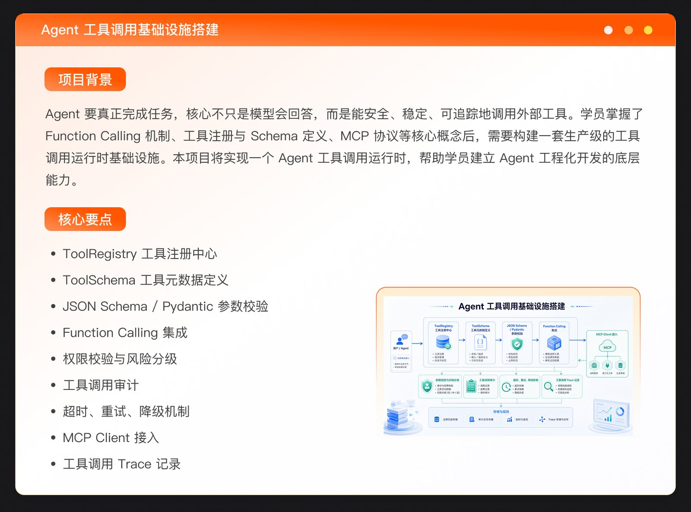

最近极客时间一口气开了三门 AI 训练营：《企业级 AI 编程实战营》《AI Agent 全栈工程师训练营》《Agentic AI 产品训练营》。名字长得像三胞胎，价格又不便宜，我把三门课的官网大纲完整翻了一遍（包括逐周明细和实战项目），发现它们其实是三条完全不同的路。这篇做横向对比和选课判断，每门课的逐周/逐章详细拆解我另外写了三篇：

- [企业级 AI 编程实战营拆解](/posts/geektime-enterprise-ai-coding/) —— SDD × Harness，11 周练"驾驭 AI"
- [AI Agent 全栈工程师训练营拆解](/posts/geektime-ai-agent-fullstack/) —— 14 周搭生产级 Agent 工程平台
- [Agentic AI 产品训练营拆解](/posts/geektime-agentic-ai-product/) —— 零代码，8 周从 PM 到 Builder

## 三门课其实是三条路，先对号入座

| | 企业级 AI 编程实战营 | AI Agent 全栈工程师训练营 | Agentic AI 产品训练营 |
|---|---|---|---|
| 定位 | 教你怎么**用 AI 写代码** | 教你怎么**写 Agent 系统的代码** | 教你怎么**不写代码做 Agent 产品** |
| 周期 | 11 周，3+1 个项目 | 14 周录播+直播，6 个项目 | 8 周纯直播，5 个项目 |
| 讲师 | Robert（前字节/腾讯基础架构） | 尹会生 + 姜宁（前字节开源办公室首席布道师，主导 DeerFlow 开源） | 晓寒（前度小满质量架构师、AI 产品负责人） |
| 门槛 | 在职工程师 | 会 Java/Go/Python/Node 任一门的后端 | 零技术门槛 |
| 核心方法论 | SDD + Harness Engineering | Agent Engineering Platform 七层递进 | 4D Method（Discover→Design→Develop→Deploy） |

选课逻辑很直接：想提升日常开发效能选第一门，想转型 Agent 开发岗选第二门，做产品/创业选第三门。内容几乎不重叠，不存在"买重了"的问题，但也没必要全买。

## 编程实战营：SDD × Harness，练的是"驾驭"而不是"会用"

这门课的主张我很认同：AI 编程的瓶颈已经不是工具，而是工程化——怎么让 AI 写的代码可控、可验收、可复用。它给出的答案是两个框架的组合：**SDD（Spec-Driven Development）解决"想清楚"，Harness Engineering 解决"做对"**。

SDD 的落地工具是 GitHub 的 Spec-Kit：`/specify → /plan → /tasks → /implement` 四阶段，外加一份 `constitution.md`（项目宪法，把工程原则变成 AI 必须遵守的硬约束）。改造存量项目时用 OpenSpec 的 delta spec，而不是重写完整 spec。

Harness 四支柱是 System Prompt（CLAUDE.md/AGENTS.md）、Tools（Skills/Slash Commands）、Context（Plan Mode）、Subagents，再配 Permission（事前拦截）+ Hooks（事后检查）组成完整安全网。

四个项目按难度递进，设计得很讲究：

1. **OryxOS（AgentOS 操作系统）**：从零造系统底座。Agent 进程模型、工作空间隔离（Linux namespaces/cgroups/seccomp）、多模型路由（planning/synthesis/failover）、MCP 集成、多渠道接入（REST + IM）、Docker/K8s 上云。
2. **When（分布式延时投递服务）**：0→1 写自己的代码。多层时间轮、gRPC、Redis 持久化、etcd 选主与 watch、故障切换、混沌测试、Headless Mode 接 CI。技术选型讲得很实：为什么 etcd 不选 Consul/ZooKeeper，为什么 gRPC 不选 HTTP。
3. **DifyPro（Dify 企业级二开）**：改别人的代码。用 5 个 Subagent 并行精读 Dify 源码反推架构，然后做两种改造——纵向（在调用链路插一层 LLM Gateway）和横向（横切多模块做审计日志），Permission 里 deny 掉核心文件守住"最小侵入"。
4. **mq9（真实开源 PR）**：跨语言 Vibe Coding，用 gh CLI 走完 issue 认领 → delta spec → Rust 实现 → PR → 回应 review 的全流程，maintainer 不放水。

这门课的技术栈关键词：Claude Code 全家桶（Subagents/Worktrees/Hooks/Permission/Headless/Plan Mode）、Spec-Kit/OpenSpec、MCP、Dify、etcd、Redis、gRPC、Rust、Python、Docker/K8s、Prometheus。

## Agent 全栈营：14 周搭一个 Agent Engineering Platform

这门课是三门里技术密度最高的，主线是**用 14 周、6 个项目，从零搭出一个生产级 Agent 工程平台**。七章结构就是平台的七层：

- **第一章 LLM API 层**：Chat Completions/Responses API、SSE 流式（FastAPI StreamingResponse + EventSource）、JSON Schema + Pydantic 双侧校验的结构化输出，实战是自建 LLM Gateway——OpenAI Compatible 协议封装、多模型路由、限流 fallback、Token/Cost/Latency 日志。
- **第二章 工具层**：Function Calling 只是"模型怎么选工具"，配套还要 Tool Registry（注册/发现/版本/启停）、参数校验、RBAC 权限分级（只读/写/高风险/需确认）、审计与 Trace；MCP 负责"工具怎么标准化接入"。
- **第三章 Agent Loop**：ReAct、Plan-and-Execute、状态机（created/planning/running/waiting_approval/completed…）、Checkpoint 断点恢复、Sandbox 执行边界（本地 vs Docker）、Human-in-the-loop。框架用 LangGraph（StateGraph/条件分支/Interrupt），并对比 OpenAI Agents SDK、AgentScope。实战是 Codebase Agent——带 list_files/search_code/apply_patch/run_test/git_diff 这套工具，能做代码理解和测试修复。
- **第四章 Context 与记忆**：Context Engineering（Packing/Prioritization/Budget/Compression）、Working Memory 与 Scratchpad、项目级记忆；现代 RAG 全家桶——语义/AST 分块、FAISS/Milvus/Chroma、BM25 + Elasticsearch 混合检索、Cross Encoder/LLM Rerank、Citation 溯源；LiteLLM 做模型路由演示。
- **第五章 Multi-Agent 与 Eval**：Supervisor、Planner/Executor、Reviewer 三种模式，子代理隔离（上下文/工具/权限）与冲突仲裁；Skill 生命周期（注册/检索/编排/复用/版本/下线）。Eval 是重头戏：Golden Dataset、Task Success Rate、Tool Call Accuracy、Citation Accuracy、LLM-as-Judge 的适用边界、回归测试与 A/B、Trace Analysis 失败诊断十三类。
- **第六章 生产化**：vLLM（PagedAttention/连续批处理）/TGI/Triton 推理部署，五层缓存（Prompt/Semantic/Embedding/RAG/Tool Result），模型路由降级，日志/监控/告警四类指标，Prompt/模型/工具/RAG/知识库五对象版本管理，Feature Flag 灰度与回滚，MCP Server 私有化部署。落地形态是 Docker Compose 起 FastAPI + Redis + PostgreSQL + 向量库 + 模型网关。
- **第七章 综合项目**：基于 DeerFlow（字节开源的 Super Agent harness，讲师姜宁主导其开源）做两个高阶案例——企业级深度研究平台、新一代软件工厂（GitHub Channel 接 PR/CI，ACP 接本地工具，产品经理/架构师/开发/QA 多角色 Agent）。

两个细节值得注意：一是课程明确教"何时不用 Agent"——极强确定性、不允许容错、脚本就能干的活不要过度 Agent 化；二是收官有简历/面试表达专项，教你怎么把 Tool Runtime、Eval 平台这些项目经验讲成业务价值。

## 产品训练营：零代码，但 Eval 和数据飞轮不含糊

别被"产品课"三个字骗了，这门课的技术概念密度不低，只是全部以"产品决策语言"讲：工具调用分层（Tools → Function Calling → MCP → CLI → Bash）、记忆体系五阶段（初始/引导收集/对话中/定期 review/后台梳理）、多 Agent 设计模式（Orchestrator-Workers/Pipeline/Group Discussion）、Agentic UI 三形态（对话式/主动式/嵌入式）。

8 周走完 4D Method 闭环，5 个项目覆盖四大高频场景：ToC 情感陪伴 Agent（记忆调教 + 定时主动触达）、ToB 项目管理助手 PMO、商业调研专家 Skill 封装、智能投顾多 Agent 系统、创意工坊自主立项（结课 Demo Day 路演）。

Week 6 的 Eval 章节是惊喜：明确反对"感觉还行"式验收，要求为产品定制评估标准而不是套通用 Eval，讲 LLM-as-Judge 的评分 Prompt 设计与偏见控制，概览 Ragas、DeepEval、PromptFlow 开源框架，然后落到数据飞轮——埋点设计、漂移监测（Drift Management）、分阶段部署、"评→改→测→再评"闭环。这套东西很多工程课都讲不到这么实。

工具链方面：原型用 v0/Figma AI，汇报用 Gamma/Beautiful.ai，开发在课程自研的零代码 Agentic 平台上完成（记忆/定时任务/MCP 工具/Skill 封装/多 Agent 编排，含免费 Token 额度），结课后数据可导出迁移到 OpenClaw、Hermes、Claude Code。FAQ 里专门划清了和 Coze 工作流、RAG 问答机器人的界限：Coze 是固定流程的工具，RAG 是检索+生成的知识库，Agentic AI 是能自主规划、记忆、主动行动的协作伙伴。

## 我的判断

三门课放在一起看，其实是 2026 年 AI 落地分工的一个缩影：**写代码的方式（SDD/Harness）、写 Agent 的能力（工程平台）、定义产品的视角（PM→Builder）**，分别对应工程师、Agent 开发岗、产品/创业者三类人。

几个横向观察：

- **Eval 是三门课共同的主线**。编程营讲 Harness 验收，全栈营用一整章建 Eval 平台，产品营专门一周讲评估与飞轮。Agent 能跑不代表可靠，已经是行业共识。
- **MCP 成了事实标准**，三门课都绕不开；Skill 封装也是共同语言。
- **"何时不用 Agent"开始被认真讲授**，这比又一波 Agent 布道健康得多。
- 全栈营的 DeerFlow 收官和编程营的 mq9 开源 PR 都指向同一件事：课程作品正在从"玩具 Demo"转向"真实开源贡献"，这对简历的说服力是质变。

如果只挑一门，工程师优先编程实战营（方法论迁移性最强，不绑定单一平台）；想转岗 Agent 开发再考虑全栈营（14 周强度大，但体系最完整）；产品岗闭眼选产品营。

---

*信息来源：三门课官网课程页与官方大纲文档（2026-08 抓取），课程二第 2~7 章细节来自官网完整大纲。价格官网未公开，需咨询学习顾问。*
