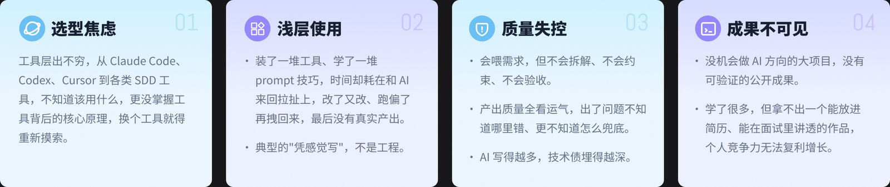
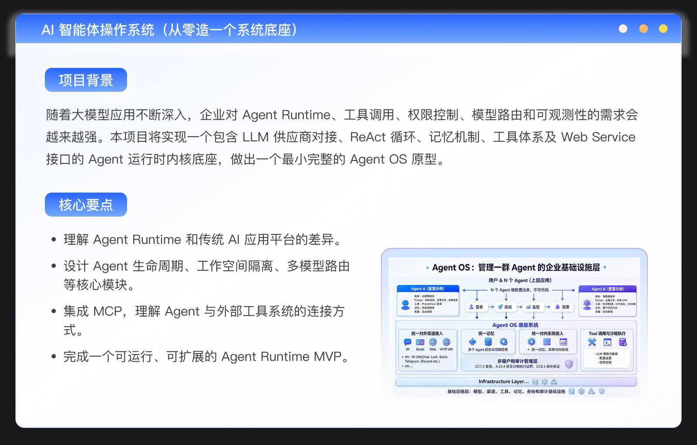
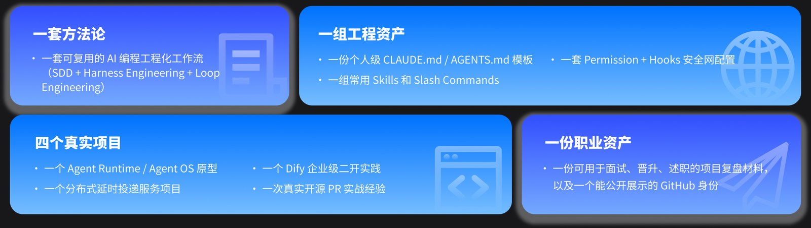
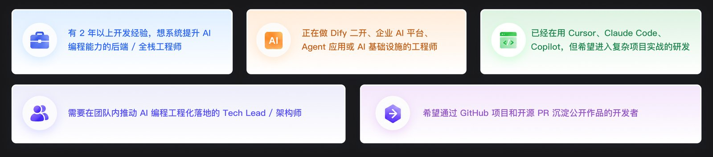

极客时间这门《企业级 AI 编程实战营》的定位很清楚：**不教你用 AI 工具，教你怎么把 AI 编程做成可控、可验收、可复用的工程流程**。11 周、3 个企业级项目 + 1 次真实开源 PR，讲师 Robert（前字节/腾讯基础架构专家）。我把官网逐周大纲完整翻了一遍，这篇是它的详细拆解。

> 这是三篇训练营拆解之一。另外两篇：[AI Agent 全栈工程师训练营](/posts/geektime-ai-agent-fullstack/) ｜ [Agentic AI 产品训练营](/posts/geektime-agentic-ai-product/)。三门课的横向对比见[总览篇](/posts/geektime-ai-bootcamps-compared/)。

## 它要解决的真问题：会用 AI ≠ 驾驭 AI

课程开篇就点破了很多人用 AI 编程踩的坑：把需求直接扔给 AI，来回改，最后不确定能不能用。它管这叫"普通姿势"，对应的是"驾驭姿势"——先 spec、再 plan、再 implement，每一步可控、结果可预期。

所谓"驾驭"，定义很明确：**主动权在你手里，AI 在你的框架下执行**。整门课就是围绕这个定义搭的方法论和项目。

## 方法论骨架：SDD 想清楚，Harness 做对

这门课的方法论是两个框架的组合，分工很清楚：

- **SDD（Spec-Driven Development）解决"想清楚"**：规格是真理，代码服务于规格。落地工具是 GitHub 的 Spec-Kit，跑 `/specify → /plan → /tasks → /implement` 四阶段工作流，从一句话需求走到可执行任务列表。
- **Harness Engineering 解决"做对"**：四支柱是 System Prompt（CLAUDE.md/AGENTS.md）、Tools（Skills / Slash Commands）、Context（Plan Mode 先规划再动手）、Subagents（并行子代理）。

两者合起来的逻辑是：SDD 让 AI 知道做什么，Harness 让 AI 做对。至于 Vibe Coding 和 Context Engineering 的位置，课程的划分是——Vibe Coding 是姿态，Context Engineering 是更上面一层（留作长期方向）。

两个贯穿全程的硬约束机制：

- **constitution.md（项目宪法）**：把工程原则变成 AI 必须遵守的硬约束。系统级项目的宪法会写死"进程模型不变、安全边界不破、协议兼容、可演化"这类底线。
- **Permission（事前）+ Hooks（事后）= 完整安全网**：Permission 在 `.claude/settings.json` 里配 allow/ask/deny 规则，事前拒绝不该做的事；Hooks 检查做完的事，有 Command / HTTP / Prompt / Agent 四种处理类型、12+ 生命周期事件（PreToolUse / PostToolUse / Stop / SessionStart 等）。

工具选型上，主用 **Claude Code**，同时对比 Codex / OpenCode / Cursor / Copilot。

## 四个项目：造底座 → 写自己代码 → 改别人代码 → 给开源贡献

课程最实在的设计是四个项目按工程姿态递进，每个都有明确的训练主场。

### 项目一 OryxOS：用 SDD 做 AI 智能体操作系统（第 2–5 周）

从零造一个系统底座，是 SDD + Harness 最完整的一次实战。

- **第 2 周 需求与方案**：先回答"企业为什么需要 Agent OS"——2026 年企业落地 Agent 的真实需求，Agent / Agent OS / Agent App 三层关系，自研 vs 开源二开 vs 混合的落地路径。深度精读两个流派：Hermes Agent（Nous Research，会成长的 Agent，持久化记忆 + 自我改进 Skills）和 OpenClaw（反应式工具使用框架，低启动开销 + 广能力覆盖），对比成长式 vs 反应式、有状态 vs 无状态、长进程 vs 短启动两种设计哲学。然后用 Spec-Kit 把工业级需求文档转成 spec.md、技术方案转成 plan.md + tasks.md，写出 OryxOS 的 constitution.md，完成 Harness 四支柱初始化。
- **第 3 周 运行时核心 + 多模型路由**：Agent 进程模型（独立进程 vs 协程 vs 线程的权衡）、生命周期管理（创建→初始化→运行→暂停→销毁）；工作空间隔离（文件系统 + 网络 + 进程三重隔离）、沙盒安全（Linux namespaces / cgroups / seccomp 取舍）、YAML 声明式配置加载；多模型路由用 planning model + synthesis model 双模型设计，配 failover 自动切换和成本控制。这周开始用 Subagents 并行实现（隔离 / 配置加载 / 集成测试三路并行）。
- **第 4 周 记忆与工具体系**：MCP 集成（Client / Server / Tool / Resource / Prompt 五个核心抽象），既给 OryxOS 接入 MCP Server，也把 OryxOS 自己包装成 MCP Server 让别的工具调用；多渠道接入做统一适配层（REST API 走 OpenAPI 规格驱动，IM 渠道 Telegram/Slack 任选，Webhook vs 长连接的权衡），目标是新渠道 30 行代码接入；工作流编排支持并行搜索和多步推理。同时配系统级 Permission + Hooks 安全网，跑沙盒安全测试套件（边界 / 注入 / 资源限制测试）。
- **第 5 周 端到端集成与发布**：补齐可观测性（Agent 行为追踪、模型调用的成本/延迟/错误率监控、渠道流量监控），处理"最后 10%"（边界情况、错误恢复、graceful shutdown）；跑通真实业务场景的端到端测试（客服 Agent / 代码 review Agent 任选），用 Docker / K8s 部署上云。

### 项目二 When：用 SDD 从 0 到 1 做分布式延时投递服务（第 6–8 周）

这是 0→1 写自己代码的项目，Subagents 并行实现的主场。需求场景很具体：支撑订单超时、优惠券过期这类延时任务。

- **第 6 周 需求与方案**：体验"从模糊想法到清晰规格"的完整 SDD 起手。技术选型讲得很实在——etcd vs Consul vs ZooKeeper（选 etcd 的真实理由）、Redis vs RocksDB（为什么用 Redis）、gRPC vs HTTP（选 gRPC 的工程权衡）、多层时间轮算法的实现选择，外加企业级需求文档怎么定 SLA。
- **第 7 周 单节点版本**：时间轮算法原理（单层 vs 多层的精度/内存/CPU 权衡）、单机版架构（gRPC server + 时间轮调度器 + Redis 持久化）。这周重点演示 **4 个 Subagent 并行实现 4 个核心模块**：多层时间轮、gRPC service 定义 + handler、Redis 索引与数据分离存储层、为前三个模块生成单元测试。引入 Worktrees 做并行写代码的隔离，主对话做架构决策 + 集成 review。同时把时间轮实现封装成可复用 Skill，把常用 prompt 做成 Slash Command，并讲清 Skills（能力）vs Slash Commands（模板）的边界、咨询模式 vs 执行模式的切换。
- **第 8 周 集群化上线**：基于 etcd 的节点注册、Controller 选主、watch 机制；时间轮在节点间的动态分配、扩缩容、主从故障切换；用 Spec-Kit 做"集群化"这次大改造的增量 SDD。分布式最常见的 4 类故障（脑裂、心跳风暴、时钟漂移、级联失败）。配 Permission + 5–7 个关键 Hooks 的完整安全网；用 AI 快速搭内置管理页面（任务可视化 + 集群状态 + 节点负载）；可观测用 Prometheus 指标 + 日志规范 + 链路追踪；**Headless / Print Mode**（`claude -p "..."`）把"代码改动 → 跑混沌测试 → 报告"做成脚本接进 CI。

### 项目三 DifyPro：用 AI 反推整体逻辑给 Dify 做企业级二开（第 9–10 周）

这是改别人代码的项目，AI 反推整体逻辑的主场。Dify 是 2026 年企业搭内部 AI 平台的事实标准，但社区版有真实能力缺口：SSO、多租户、LLM 治理、可观测、审计。

- **第 9 周 项目调研 + 纵向改造**：**用 5 个 Subagent 并行精读 Dify**——backend/api（API 入口和请求流转）、backend/core（LLM 调用链路）、backend/extensions（扩展点设计）、web/ 前端（前端架构和 API 调用关系）、数据库 schema 和 migrations（数据模型），把关键架构信息沉淀到项目级 CLAUDE.md。引入 **OpenSpec 的 delta spec**（改造老项目比完整 spec 更合适）。纵向改造模式是"在调用链路上插入一层"，示范功能是统一 LLM Gateway 简化版（模型路由 + 降级熔断 + token 追踪），剖析 Dify 模型调用链路上 Gateway 接入点的 5 个候选位置。Permission 里 deny 直接修改 Dify 核心文件、只允许在 extension 目录改，Hooks 每次改动后自动跑 Dify 全套测试，守住"最小侵入"。
- **第 10 周 横向改造**：横向改造是"横切多个模块做统一关注点收集"，示范功能是完整审计日志体系（数据模型 / 关键操作埋点 / 查询导出 / 查询界面）。把"横切关注点改造"封装成通用 Skill，后续任何 Dify 模块的横切改造都能复用。个人选定二开方向（LLM Gateway / 审计日志 / SSO / 多租户 / Token 治理 / 可观测）端到端完成（测试 + 文档 + demo），鼓励给原 Dify 提合规小 PR。

### 项目四 mq9：跨语言开源 PR 实战（第 11 周）

收官挑战，进真实开源项目 mq9（目标是成为 Apache 顶级项目），用 Vibe Coding 跨语言协作完成一次合规 PR。核心是**不会 Rust 也能贡献 Rust 项目**的方法：用 Subagents 并行读懂陌生项目的不同模块，用 OpenSpec 写 PR 的 delta spec，用 gh CLI 串起完整开源协作流——`gh issue list` 选 Good First Issue、branch 创建、`gh pr create` 提交规范化 PR、`gh pr view / review` 回应 review 评论。Maintainer（Robert 本人）不放水，PR 不合并可以继续修到合并。

## 学完能带走什么

课程收尾会把四种工程姿态沉淀下来：0→1 / Fork 改造 / 混合姿态 / 真实开源贡献；复盘个人 CLAUDE.md / Skills / Slash Commands / Subagents 库，分清哪些是项目专属、哪些能变成"个人沉淀库"；并指向 Context Engineering 这个接下来 1–2 年最值得深入的方向。

## 技术栈清单（这门课涉及的）

- **AI 编程工具**：Claude Code（CLAUDE.md / AGENTS.md / Skills / Slash Commands / Subagents / Worktrees / Hooks / Permission / Plan Mode / Headless / MCP / Memory），对比 Codex / OpenCode / Cursor / Copilot
- **规格工具**：GitHub Spec-Kit（constitution.md）、OpenSpec（delta spec）
- **协议 / 平台**：MCP（Model Context Protocol）、Dify（二开对象）、OpenAPI
- **分布式 / 后端**：etcd、Redis、gRPC、多层时间轮、Linux namespaces / cgroups / seccomp
- **语言**：Python（OryxOS 主语言）、Rust（mq9 跨语言）、Java / TypeScript 覆盖
- **工程化**：gh CLI、Headless Mode 接 CI、Docker / K8s、Prometheus、混沌测试、端到端测试

## 适合谁 & 我的判断

官方定位是"想把 AI 编程真正用到企业项目中的工程师"。我的判断：这是三门课里**方法论迁移性最强**的一门——SDD 和 Harness 不绑定任何单一平台，学完这套"想清楚 + 做对"的框架，换什么 AI 工具都能套用。四个项目从造底座到改开源的递进设计也很贴近真实工程成长路径。适合已经有 AI 编程基础、想从"会用"进阶到"驾驭"的在职工程师。

---

*信息来源：极客时间官网课程页 u.geekbang.org/subject/33 及完整课程大纲（2026-08 抓取）。第 1 期 2026-07-15 开课，11 周，另有第 2 期（09-07）、第 3 期（11-30）。价格官网未公开，需咨询学习顾问。*
