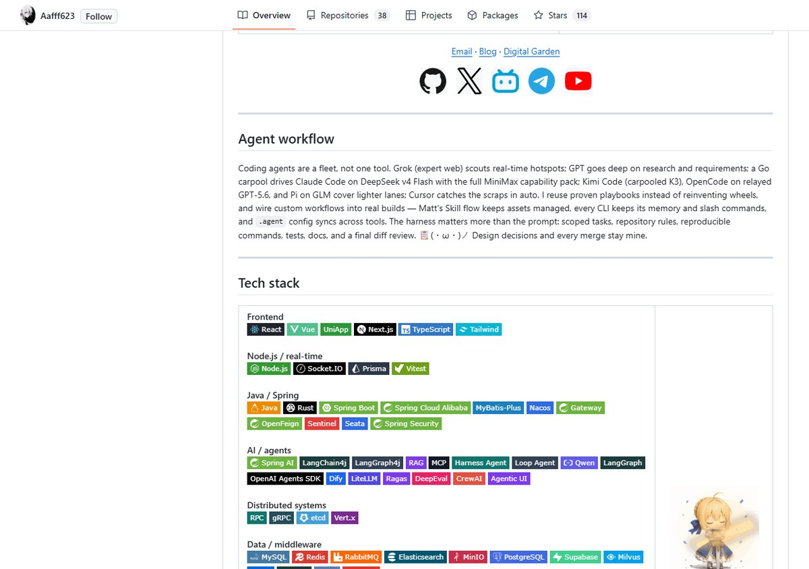

访客在你的 GitHub Profile 上停留的时间按秒计。与其堆一份「什么都会」的简历,不如做一块 5 秒能看懂、30 秒能核对的招牌。这版 V1 就是按这个来的:身份一句话,证据拿得出来,视觉和声音不打架。

## 先定声音,再写内容

写任何内容之前,先回答「用谁的口吻说话」。调研了五类真实独立开发者的 profile(antfu、sindresorhus、levelsio、Dan Luu 那一挂),得出一个混合配方:

| 模块 | 参考类别 | 一句话 |
| --- | --- | --- |
| Intro / tagline | 极简工匠 | 短身份句,作品优先 |
| 竞赛段 | 系统深技 | 带单位带边界的数字 |
| 项目卡片 | 产品清晰 | 痛点 → 方案 → 证明 |
| 全局红线 | — | 禁假 MRR、禁 Bali 人设、禁 slogan 轰炸 |

先定声音的最大好处:后面每个段落的口径不会打架。Intro 说「代码要可维护」,竞赛段就不会吹 SOTA 空话。

## 视觉资产:每个都做过取舍和迭代

Hero 图是最重的资产,从 981KB 的 PNG 压到 90KB 的 WebP,10 倍缩小还看不出差别。过程中试过圆角加双环,最后回退成直角,因为 GitHub 会剥掉 README 里的 CSS border-radius,烘焙圆角在亮色页面边缘直接消失。

吉祥物是 3D chibi 骑士,做成亮暗双 GIF,用 picture 按主题切换;字标同理,亮暗双 SVG;顶部 banner 是动画 v9。这些资产单个看都不难,难的是每个都经过一次「要不要、怎么换、换了坑在哪」的追问。

## 深色模式:README 只能切图,preview 才能上 CSS

GitHub 的 cmark 会剥离 README 里的 style 标签,所以 README 的暗色只能靠 picture 切图片资产,文字和布局颜色交给 GitHub 主题接管。本地 preview 是完整 HTML,才能用 CSS 变量做全套暗色。

暗色有几个实打实的坑:

- GIF 只支持 1-bit 透明,白底 GIF 在暗色下没法变透明,只能重制资产
- picture 块前后不能有空行,否则 cmark 把它当两个独立 HTML 块,渲染直接断裂
- GitHub 图片有缓存,切主题后要硬刷新才看到新版本

## badge 是 10 类 87 个的刻意取舍,不是堆

故意不放 Kafka 和 Monad,只留 RabbitMQ;概念徽章(Smart Accounts、Skills)和噪音(Git、GitHub)直接删。badge 是给扫描器看的,不是给收藏家凑数的。

## 竞赛卡:从「我参加了」到「你可以核对」

Lead Cup 写死 #26/132 和 P99 SLA 数字;AI4S 卡从泛泛的「赛道介绍」升级成可核对指标:live board 0.035115、报告 v9、Spectral idle 3.811 / 8.054 / 29.560 ms、排行 pending。招聘者想看的不是「完赛结项」四个字,是一串能去核对的数字。

## 双语双预览,当成产品做

中英 README 互为镜像,本地 preview 从 GitHub 渲染保存,带 EN / 中文切换器,连深色模式都单独测过。为什么要做双语?很多访客会直接看中文镜像,但英文才是 GitHub 的主场,两块都得能打。

## 最不显眼但最值钱:文档体系

CLAUDE.md、CONTEXT.md、LANGUAGE.md、ADR、AGENTS.md,这些是给 AI agent 看的「怎么维护这块招牌」的说明书。V1 能反复打磨到现在,靠的是每次改动都有口径文档兜底,换谁来接手都不会改崩。

## 招牌和简历的区别

简历回答「我做过什么」,招牌回答「你该记住我什么」。V1 先到这里,后面继续磨。
