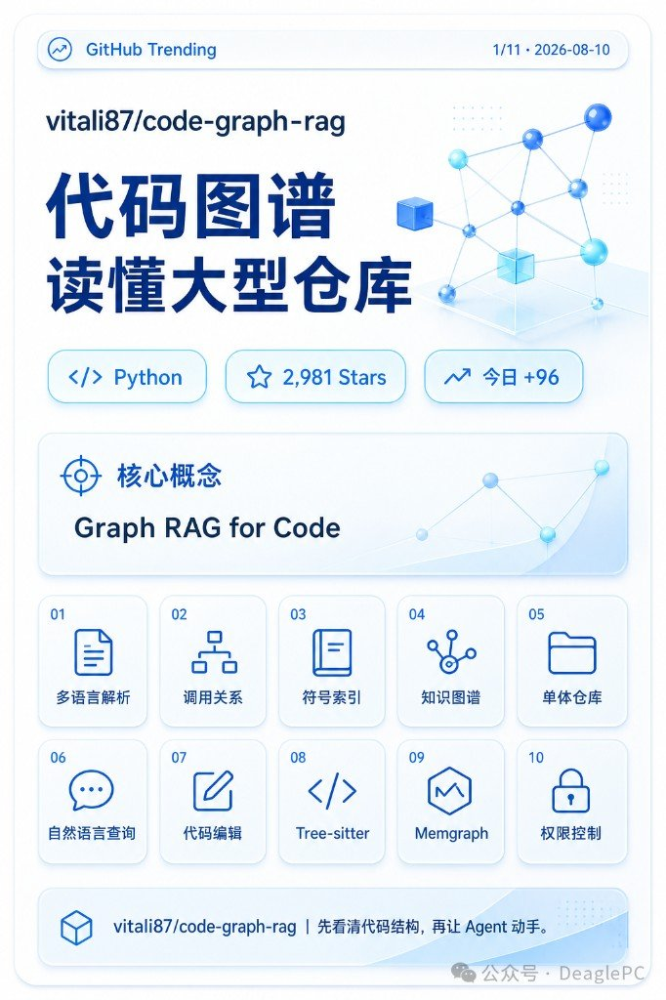
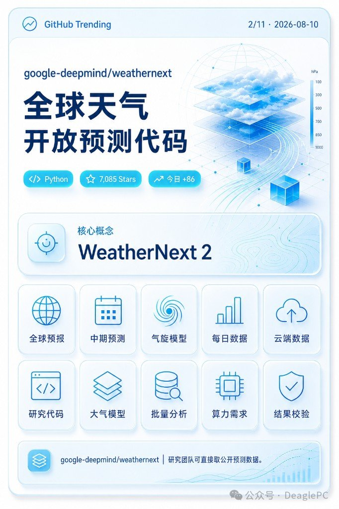
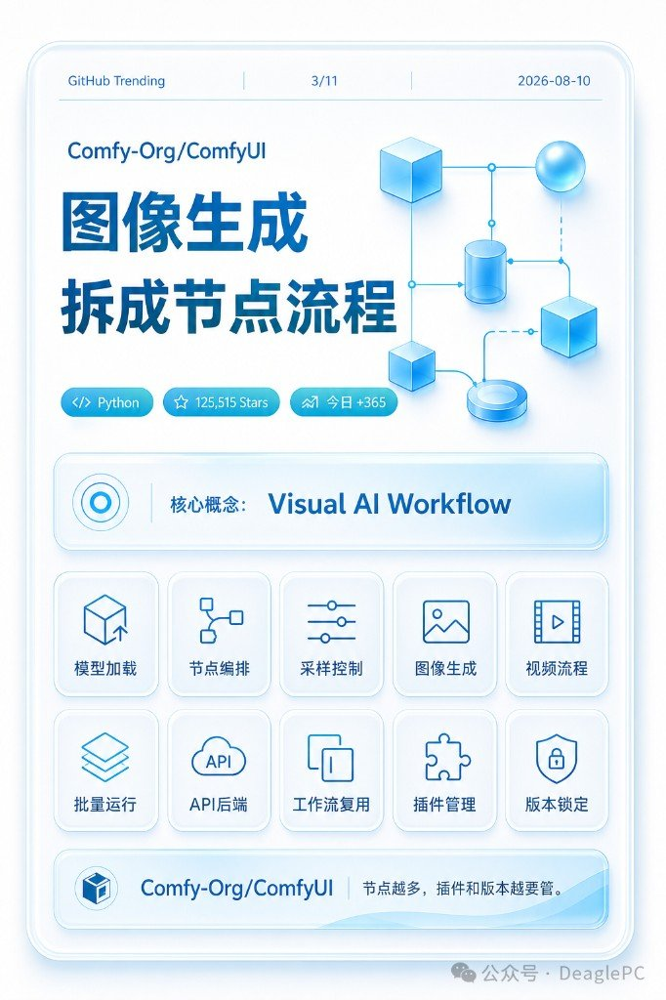
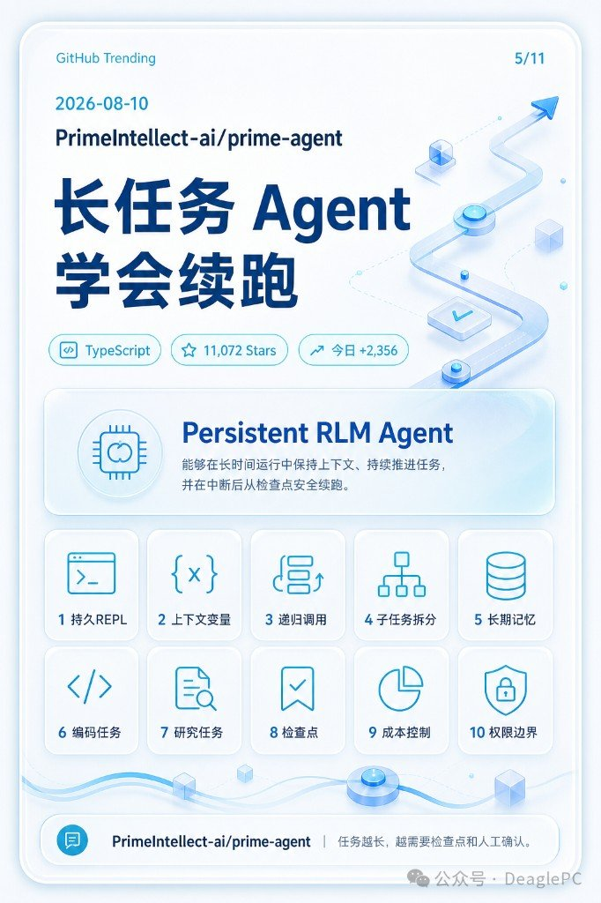
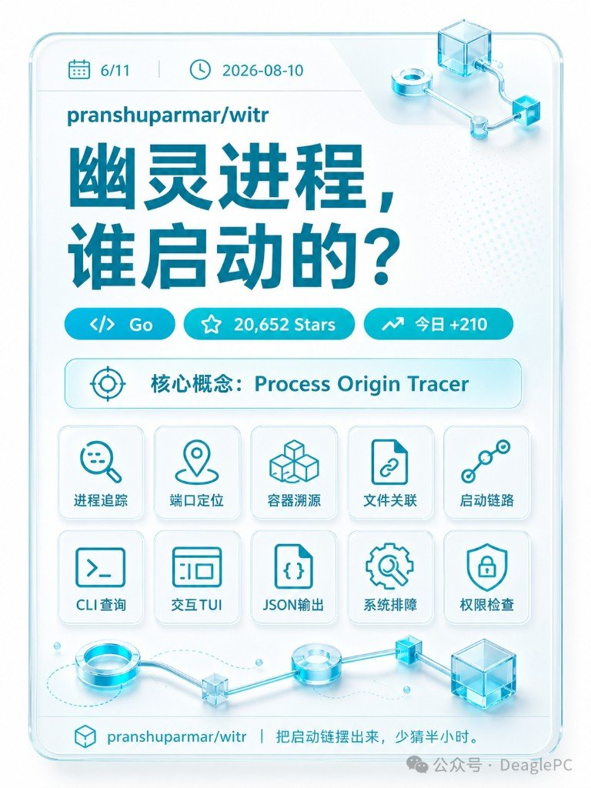
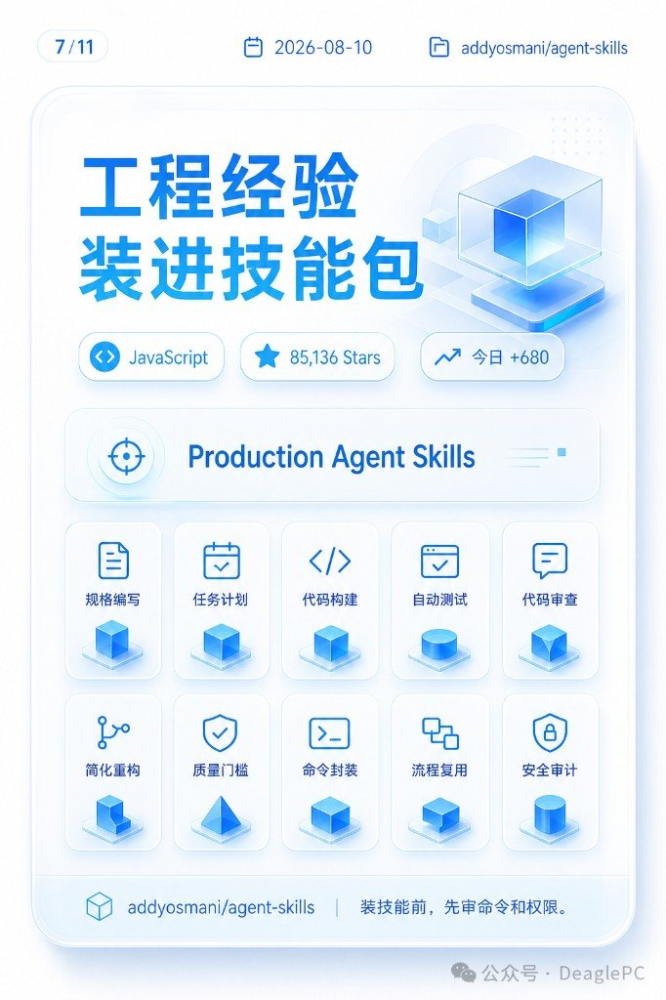
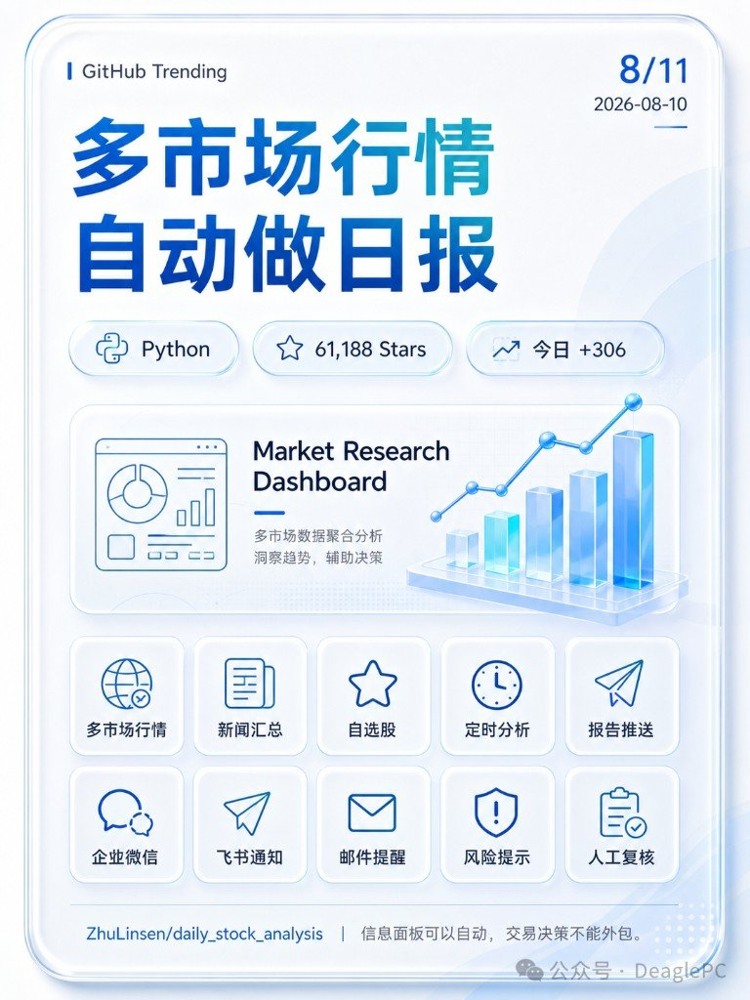
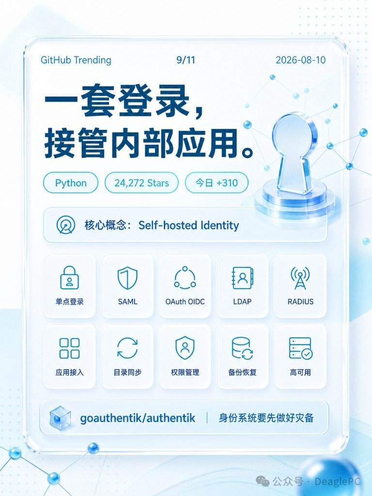
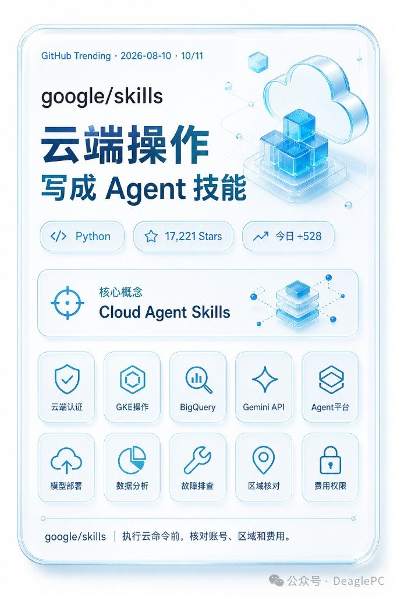

同日另一份开源盘点是六月口径的 17 条，题材近、体裁不同 → [旁链不硬并](../2026-08-10_六月GitHub开源项目盘点17个/六月GitHub开源：17个口径扫一遍.md)。

---

## 1 · vitali87/code-graph-rag

**用户简介**：用知识图谱检索大型代码库，改代码前先看清调用关系。

| 项 | 图面 |
|---|---|
| 标题 | 代码图谱 读懂大型仓库 |
| 语言 / Stars / 今日 | Python · **2,981** · **+96** |
| 核心概念 | Graph RAG for Code |
| 页脚金句 | 先看清代码结构，再让 Agent 动手。 |

**特性要点（1–10）**：多语言解析 · 调用关系 · 符号索引 · 知识图谱 · 单体仓库 · 自然语言查询 · 代码编辑 · Tree-sitter · Memgraph · 权限控制

开源：https://github.com/vitali87/code-graph-rag

---

## 2 · google-deepmind/weathernext

**用户简介**：开放全球中期天气与气旋预测代码，并提供每日数据入口。

| 项 | 图面 |
|---|---|
| 标题 | 全球天气开放预测代码 |
| 语言 / Stars / 今日 | Python · **7,085** · **+86** |
| 核心概念 | WeatherNext 2 |
| 页脚金句 | 研究团队可直接获取公开预测数据。 |

**特性要点（1–10）**：全球预报 · 中期预测 · 气旋模型 · 每日数据 · 云端数据 · 研究代码 · 大气模型 · 批量分析 · 算力需求 · 结果校验

开源：https://github.com/google-deepmind/weathernext

---

## 3 · Comfy-Org/ComfyUI

**用户简介**：用节点编排图片和视频生成流程，支持复用、批量运行与 API。

| 项 | 图面 |
|---|---|
| 标题 | 图像生成 拆成节点流程 |
| 语言 / Stars / 今日 | Python · **125,515** · **+365** |
| 核心概念 | Visual AI Workflow |
| 页脚金句 | 节点越多，插件和版本越要管。 |

**特性要点（1–10）**：模型加载 · 节点编排 · 采样控制 · 图像生成 · 视频流程 · 批量运行 · API后端 · 工作流复用 · 插件管理 · 版本锁定

开源：https://github.com/Comfy-Org/ComfyUI

---

## 4 · harveyai/harvey-labs

**用户简介**：用真实任务、文档和评分规则测试法律 Agent 的交付能力。

| 项 | 图面 |
|---|---|
| 标题 | 法律 Agent 开始统一考试 |
| 语言 / Stars / 今日 | Python · **826** · **+47** |
| 核心概念 | Legal Agent Benchmark |
| 页脚金句 | 评测能力，不替代法律责任。 |

**特性要点（1–10）**：真实任务 · 法律文档 · 评分规则 · 执行框架 · 检索测试 · 推理测试 · 交付评估 · 任务数据 · 结果复核 · 保密边界

开源：https://github.com/harveyai/harvey-labs

---

## 5 · PrimeIntellect-ai/prime-agent

**用户简介**：让编码 Agent 用持久 REPL、记忆和子任务续跑长任务。

| 项 | 图面 |
|---|---|
| 标题 | 长任务 Agent 学会续跑 |
| 语言 / Stars / 今日 | TypeScript · **11,072** · **+2,356** |
| 核心概念 | Persistent RLM Agent |
| 页脚金句 | 任务越长，越需要检查点和人工确认。 |

**特性要点（1–10）**：持久REPL · 上下文变量 · 递归调用 · 子任务拆分 · 长期记忆 · 编码任务 · 研究任务 · 检查点 · 成本控制 · 权限边界

开源：https://github.com/PrimeIntellect-ai/prime-agent

---

## 6 · pranshuparmar/witr

**用户简介**：从进程、端口、容器或文件追到完整启动链。

| 项 | 图面 |
|---|---|
| 标题 | 幽灵进程，谁启动的？ |
| 语言 / Stars / 今日 | Go · **20,652** · **+210** |
| 核心概念 | Process Origin Tracer |
| 页脚金句 | 把启动链摆出来，少猜半小时。 |

**特性要点（1–10）**：进程追踪 · 端口定位 · 容器溯源 · 文件关联 · 启动链路 · CLI 查询 · 交互 TUI · JSON 输出 · 系统排障 · 权限检查

开源：https://github.com/pranshuparmar/witr

---

## 7 · addyosmani/agent-skills

**用户简介**：把规格、测试、审查等工程步骤封装成编码 Agent 技能。

| 项 | 图面 |
|---|---|
| 标题 | 工程经验装进技能包 |
| 语言 / Stars / 今日 | JavaScript · **85,136** · **+680** |
| 核心概念 | Production Agent Skills |
| 页脚金句 | 装技能前，先审命令和权限。 |

**特性要点（1–10）**：规格编写 · 任务计划 · 代码构建 · 自动测试 · 代码审查 · 简化重构 · 质量门槛 · 命令封装 · 流程复用 · 安全审计

开源：https://github.com/addyosmani/agent-skills

Skills 分层与装机清单另见旁链 MCP/Skills/CLI、Claude Code 十大 Skill——本篇只记热榜条目。

---

## 8 · ZhuLinsen/daily_stock_analysis

**用户简介**：汇总多市场行情与新闻，定时生成自选股信息面板。

| 项 | 图面 |
|---|---|
| 标题 | 多市场行情 自动做日报 |
| 语言 / Stars / 今日 | Python · **61,188** · **+306** |
| 核心概念 | Market Research Dashboard（多市场数据聚合分析） |
| 页脚金句 | 信息面板可以自动，交易决策不能外包。 |

**特性要点（1–10）**：多市场行情 · 新闻汇总 · 自选股 · 定时分析 · 报告推送 · 企业微信 · 飞书通知 · 邮件提醒 · 风险提示 · 人工复核

开源：https://github.com/ZhuLinsen/daily_stock_analysis

---

## 9 · goauthentik/authentik

**用户简介**：自托管身份服务，统一接入 SAML、OIDC、LDAP 和 RADIUS。

| 项 | 图面 |
|---|---|
| 标题 | 一套登录，接管内部应用。 |
| 语言 / Stars / 今日 | Python · **24,272** · **+310** |
| 核心概念 | Self-hosted Identity |
| 页脚金句 | 身份系统要先做好灾备 |

**特性要点（1–10）**：单点登录 · SAML · OAuth OIDC · LDAP · RADIUS · 应用接入 · 目录同步 · 权限管理 · 备份恢复 · 高可用

开源：https://github.com/goauthentik/authentik

---

## 10 · google/skills

**用户简介**：提供 Google Cloud、GKE、BigQuery 与 Gemini 等官方操作技能。

| 项 | 图面 |
|---|---|
| 标题 | 云端操作 写成 Agent 技能 |
| 语言 / Stars / 今日 | Python · **17,221** · **+528** |
| 核心概念 | Cloud Agent Skills |
| 页脚金句 | 执行云命令前，核对账号、区域和费用。 |

**特性要点（1–10）**：云端认证 · GKE操作 · BigQuery · Gemini API · Agent平台 · 模型部署 · 数据分析 · 故障排查 · 区域核对 · 费用权限

开源：https://github.com/google/skills

---

## 11 · pingdotgg/t3code

**用户简介**：用桌面、网页和手机统一控制本机多个编码 Agent。

| 项 | 图面 |
|---|---|
| 标题 | 多个编码 Agent, 一个控制台。 |
| 语言 / Stars / 今日 | TypeScript · **17,656** · **+163** |
| 核心概念 | Agent Control Surface |
| 页脚金句 | 远程入口方便，也要守住本机终端。 |

**特性要点（1–10）**：桌面控制 · 网页控制 · 手机远程 · 多会话 · Codex接入 · Claude接入 · Cursor接入 · 权限模式 · 凭据保护 · 远程安全

开源：https://github.com/pingdotgg/t3code

---

## 这波里先戳哪几个

热度噪声大时，按「你会不会立刻用上」筛：

| 场景 | 优先看 |
|---|---|
| 大仓改代码前要摸调用图 | #1 code-graph-rag |
| 长任务怕断、要检查点续跑 | #5 prime-agent（今日 +2,356，噪点也最大） |
| 排障「这进程谁起的」 | #6 witr |
| 装 Agent Skill 前审权限 | #7 agent-skills · #10 google/skills |
| 多 Agent 统一控台还要守本机 | #11 t3code |

法律评测（#4）与身份灾备（#9）的页脚都在泼冷水：评测替代不了责任，登录系统先把备份做好。行情日报（#8）同理——面板可以自动，下单不能外包。

---

## 相关笔记（旁链，不合并）

| 旁链 | 它管啥 |
|---|---|
| [六月 GitHub 开源 17 个口径](../2026-08-10_六月GitHub开源项目盘点17个/六月GitHub开源：17个口径扫一遍.md) | 月份盘点，不是这日热榜卡 |
| [MCP / Skills / CLI](../2026-08-10_MCP_Skills_CLI三者关系/一张图看懂：MCP、Skills、CLI.md) | 能力入口分层 |
| [Claude Code 自动化十大 Skill](../2026-08-10_ClaudeCode自动化十大Skill/) | 装机向清单 |
| [Skills 文件结构七目录](../2026-08-10_Skills文件结构七目录/) | 目录结构，不是日榜条目 |

---

## 脚注

¹ 第 8 条：用户简介「自选股信息面板」与图面主标题「自动做日报」口径略异；页脚金句仍写「信息面板可以自动…」，两边并录。
