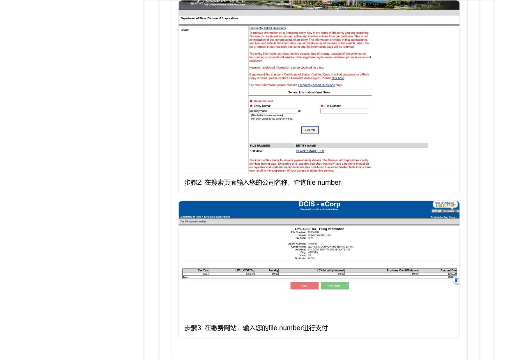
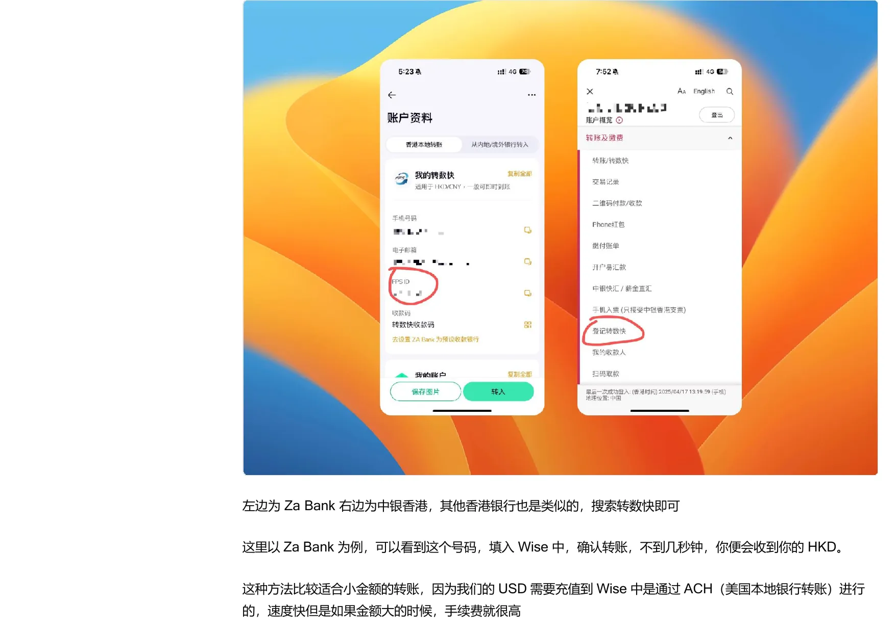
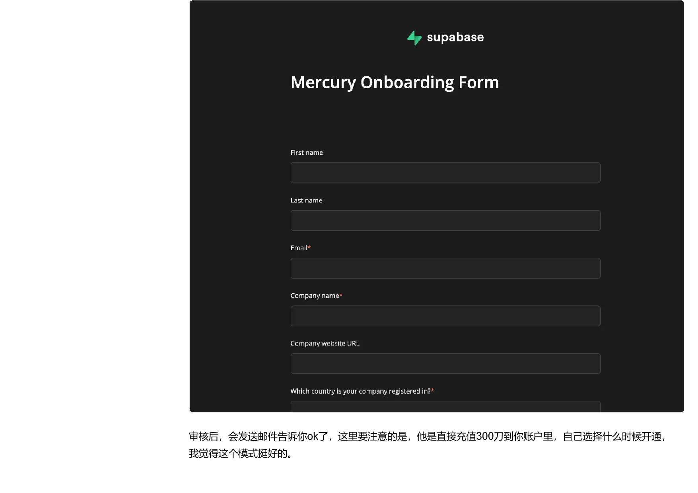

## BOI、税务、提款与福利：收款之后的持续管理

收款链路开通后，真正长期消耗精力的是合规记录、税务申报、公司与个人资金分离、转账成本和工具续费。这篇文章把 BOI、联邦与州税务、公司账户提款、支付费率和创业福利压缩成一套后续管理框架。

其中涉及的政策、表格、费率和平台资格都具有时效性。本文保留原有信息和操作逻辑，但不把其中的金额、期限或资格条件当作今天可以直接执行的结论；执行前仍需查看对应官方页面。

## 美国 BOI 申报

整理 FinCEN ID、BOIR 在线申报字段、回执保存和时效性风险。

### FinCEN ID：先建立个人身份资料入口

*FinCEN ID 申请页面*

#### BOI 与 FinCEN ID 的关系

把 BOI 解释为 Beneficial Ownership Information，即披露美国公司最终由谁控制和受益的信息，并将 FinCEN ID 作为申报时可复用的个人身份标识。先申请 FinCEN ID 的好处是，后续 BOIR 表格可以填写 ID，而不必重复录入全部个人信息。

需要特别注意的是，页面已经出现“由于联邦法院命令，申报可自愿进行”的页面提示。这说明 BOI 义务在页面内容形成时就处于变化状态，不能沿用的“所有公司都必须申报”作为当前结论。实际义务、豁免、期限和处罚必须以 FinCEN 当前公告、法律文本和专业意见为准。

#### FinCEN ID 的申请页面内容

流程从 FinCEN ID 页面跳转到 Login.gov，创建或登录账号后回到 FinCEN。表单需要法定姓名、出生日期、居住或营业地址、证件类型、证件号码和证件图片。提醒护照首页文件名使用英文，并勾选信息真实、准确、完整的认证声明。

这一步最重要的是身份资料的准确性。不要把公司地址、代理地址和个人住址混为一谈；上传证件时保留原始文件和提交时间；不要把页面示例中出现的真实姓名、证件号或 ID 直接复制到公开文章或共享文档中。

#### 结果保存

提交后页面会显示 FinCEN ID 和回执信息。建议保存结果，清洗后的建议是同时保存下载文件、提交日期、账号邮箱和后续变更路径，并把它们放进受控的公司合规档案，而不是散落在聊天记录中。

### BOIR 在线申报：公司、申请人和受益所有人字段

*BOIR 提交成功页面*

#### 选择在线填报方式

页面内容展示了 File 文档 BOIR 与 File Online BOIR 两种方式，并选择在线填写和提交。在线表单依次包含 Reporting Company、Company Applicant、Beneficial Owner 和 Submit 等部分。无论采用哪种形式，都应先准备公司成立文件、EIN、注册州、注册地址、受益所有人信息和 FinCEN ID。

#### 公司信息

公司部分需要填写法定名称和可选的 DBA、税务识别类型及号码、注册国家和州、当前美国地址与邮编。提示如果没有 EIN，只能选择 foreign 识别方式并填写护照信息；这个字段选择可能影响申报资格，应以当前表单说明和专业意见为准。

注册地址可以是注册代理地址，也可以是公司自己的地址，但要与成立文件和当前公司记录一致。地址证明、注册州、File Number 和代理信息应在一个文件夹中互相核对。

#### 公司申请人和受益所有人

公司申请人部分可以填写刚刚取得的 FinCEN ID；受益所有人部分填写受益所有人的 FinCEN ID。单人 LLC 的申请人、控制人和受益所有人可能是同一个人，但表单角色仍应按官方定义判断，不能因为“都是我”就随便跳过字段。

#### 提交与归档

提交成功后，页面会显示 Filing Successful、BOIR ID、Submission Tracking ID 和时间戳，并提供 Download Transcript。明确提醒在关闭页面前下载 transcript。清洗后把这一步提升为强制归档动作：保存 transcript、确认邮件、提交账号和变更记录，之后任何修改都保留前后版本。

## 美国公司联邦与州税务

整理 Form 1120、5472、州级年度税费和材料中示例流程，同时明确税务内容不能直接照抄。

### 联邦申报地图：1120、5472 与提交方式

#### 先把“公司没有经营”与“无需申报”分开

把外国人拥有的美国 LLC、Form 5472 和 Form 1120 放在同一条线索中，并强调即使没有大量经营，也可能因为公司与外国所有人之间的资金往来而产生申报事项。清洗后最重要的结论是：账户有没有余额、是否收过钱、是否向公司注资、是否发生关联方交易，都可能影响申报判断，不能用“没有营业”一笔带过。

页面内容还提到 Form 1065、Schedule K-1 和 Form 8805 等表格作为测评结果中的可能项目。但这些表格取决于公司税务分类、所有权、收入和交易情况，不能仅凭公司注册类型自动决定。

#### 1120 与 5472 的关系

文中将 Form 5472 描述为报告外国相关美国公司的关联交易，并认为外国拥有的单成员 LLC 在特定分类下可能同时涉及 1120 和 5472。实际判断需要确认 LLC 的联邦税务分类、外国所有权、关联方定义和报告年度，最好由熟悉跨境企业的税务专业人士复核。

#### 申报渠道

页面内容称外国人的 1120 与 5472 不支持普通在线提交，并记录了传真和邮寄地址，还提到付费代提交服务。提交地址、传真号码和服务商均可能变化；在使用前必须从 IRS 当前说明确认版本、截止时间、签字要求、附件和邮寄凭证。

#### 税务档案的最低要求

建议为每个年度建立申报包：公司成立文件、EIN 文件、银行对账单、Stripe 或其他平台结算、股东注资和分配、关联方交易、费用凭证、已提交表格、传真/邮寄回执和专业意见。税务问题的难点往往不在“找到一张表”，而在于证明数字从哪里来。

### Form 5472：从公司信息到关联方信息

#### Part I：报告公司

页面内容示例从报告公司名称、EIN、地址、总资产、主要业务活动和 NAICS 代码开始，并展示了 518210 等数据处理、托管和相关服务代码。示例数字、公司名和地址属于页面示例中的样例，不应复制到自己的表格。

填写时要先确认公司法定名称、EIN、注册州、成立日期、主要经营国家和税务居民信息。金额以美元报告，若交易以其他货币发生，应按适用规则换算并保留汇率依据。

#### Part II：25% 外国股东

这一部分涉及直接或间接持有 25% 或以上权益的外国股东，包括姓名、地址、美国识别号码、参考 ID、外国税号、国籍和税务居民国家。关联方如果没有美国税号，示例留空；但是否留空以及替代字段如何填写，应根据 IRS 表格说明判断。

#### Part III：关联方

页面内容把关联方分为外国人或美国人，并要求填写姓名、地址、税号、参考 ID、主要业务活动、业务代码、经营国家和税务居民国家。对于单人 LLC，建议同时选择与报告公司和 25% 外国股东有关联的选项，但这仍需要结合事实和当年表格说明。

#### Reference ID 的治理

文中指出，Reference ID 可以由申报人自定义，建议只使用字母和数字、保持不超过 50 个字符，并在后续年度保持一致。清洗后将其视为数据治理要求：一旦确定 ID，就把它写入内部台账，避免下一年度换写法导致关联方无法对应。

### Form 5472 的交易部分：金额、附页与申报证据

#### Part IV：收到与支付的交易

表格把交易分成销售存货、有形资产、平台贡献、成本分摊、租金、无形资产许可、服务、佣金、借款、利息、保险和其他金额，并分别记录收到和支付。不能因为交易金额小就跳过，也不能把公司注资、关联方借款和分配混成普通收入。

#### Part V 与 Part VI：附页说明

页面内容将 Part V 用于外国拥有的美国 disregarded entity 的可报告交易，并举例说明公司设立、解散、收购、处置、资本注入、贷款和分配等事项可能需要附页描述。Part VI 则涉及非货币或低于完整对价的交易，也需要在单独附页中说明。

这两部分的共同要求是“事实叙述可复核”：交易双方是谁、发生了什么、金额是多少、何时发生、为什么发生、如何入账，都要能从银行流水、协议、发票和公司记录中还原。

#### 期限、罚款与多张表

提示 5472 通常与 1120 一起在公司税务截止日期前提交，并记录了每张表可能面临高额罚款的说法。具体截止日、延期、罚款金额和适用条件必须以 IRS 当前指南为准。存在多个外国相关方时，可能需要分别填表，这也是建立关联方清单的原因。

#### 实操上的安全线

不要直接照抄示例中的公司名、EIN、地址、金额或参考 ID。先制作交易总账，再按表格字段映射；不确定的字段保留问题清单，交给税务专业人士确认，并保存最终提交版本和回执。

### 州级年度要求：特拉华州与怀俄明州示例

*特拉华州 LLC 税费页面*

#### 特拉华州 LLC

介绍特拉华州 LLC 年度税费为 300 美元、不要求提交年度报告，并记录截止日为 6 月 1 日、逾期会产生罚款和利息。随后展示了通过州务卿网站查找 File Number、进入 LLC/LP/GP 税费页面、输入 File Number、选择付款方式和保存成功页面的流程。

这里应把“表单流程”和“当年规则”分开。File Number、注册代理和公司名称可以从州数据库核对；税费金额、截止日、付款开放时间、罚款和利息则必须在实际付款年度重新确认。

#### 怀俄明州 LLC

页面内容把怀俄明州描述为需要每年提交 Annual Report 并缴纳年度许可税，示例基本费用为资产低于 25 万美元时 60 美元，截止日与公司注册周年相关。逾期可能导致不合规，持续不提交可能导致公司解散。

#### 州税与联邦税是两条线

州级年度费用或年度报告，不等同于联邦的 Form 1120、5472，也不能因为完成其中一项就认为全部合规。公司维护台账至少应包含注册州、注册周年、州级费用、年度报告、联邦表格、延期和付款凭证。

#### 付款后保存什么

保存付款页面、确认邮件、付款日期、File Number、公司名称和州政府回执。若网站提示系统维护或确认副本未显示，不要重复付款，先查询交易状态并联系州政府。付款证据和公司年度合规清单应长期归档。

## 公司账户提款到个人

整理公司资金与个人消费的边界，以及 Wise 到香港账户或中国内地渠道的路径。

### 公司账户提款：先把分配与个人消费分开

*Wise USD 账户转账页面*

#### 公司账户不是个人钱包

的第一条原则是，公司账户资金应优先用于公司运营，例如服务器、软件订阅和服务费；直接用公司卡购买个人物品、支付个人账单，可能削弱公司与个人之间的责任隔离。这个风险在法律上常被称为 piercing the corporate veil，但是否构成以及后果取决于具体事实和适用法律。

如果要把公司利润用于个人消费，应先明确性质：是工资、股东分红、所有者提款、费用报销还是资本分配。每种性质可能对应不同的账务和税务处理。把统一转账称为 Distribution，并提醒在年度税务申报时报告相关交易；实际分类应交给会计或税务专业人士确认。

#### Wise + 香港账户路径

页面内容给出的第一条路径是 Mercury → Wise USD → HKD → 香港账户。解释，Mercury 当时不便直接通过 SWIFT 转到香港账户，而 Wise 可以用 ACH 接收 USD，再转换为 HKD，通过 FPS 转到香港账户。页面内容记录的 ACH 费用约 1.70 美元、相关转账费用约 6 美元，但这些金额和路径都需要重新核对。

#### 路径中的三个概念

ACH 是美国境内自动清算转账；Wire 是电汇，通常适合金额较大或需要更快处理的场景；FPS 是香港的快速支付系统，需要在香港银行 App 中登记并获得 FPS ID。理解这三个概念，比记住某个按钮位置更重要，因为银行和平台的连接方式会变化。

#### 记录要求

每次分配都应保存 Mercury 出账、Wise 入账、兑换记录、香港账户收款、汇率、手续费和用途说明，并在公司账簿中标记交易性质。不要为了“到账快”而省略公司决议、税务判断或资金来源说明。

### Wise 到香港与中国内地：两条路径的成本和限制

*香港 FPS 账户信息页面*

#### 到香港账户：FPS 适合小额快速转账

在 Wise 中将 USD 发送为 HKD 时，需要添加收款人并选择香港银行详情。页面内容展示了选择“myself”、填写 FPS ID 或本地银行账户的步骤；FPS ID 可以从香港银行 App 的“我的转数快”页面取得。称这种方式通常几秒到账，适合小金额。

金额较大时，ACH 充值和换汇的费率会随金额增加；如果改用 Wire 充值，页面内容以固定约 6 美元为例，再叠加 USD 转 HKD 的费用，总成本可能约 12 美元。这个数字仅是示例，实际要在 Wise 和 Mercury 的确认页查看。

#### 到中国内地：支付宝、微信或银联卡

第二条路径是在 Wise 收款人中选择 Alipay、WeChatPay 或 UnionPay card。页面内容提醒，这类转账可能受到金额和收入证明要求影响，超过一定范围后可能失败，并且境内收入可能涉及申报和税费。这里尤其不能把中的 20% 税率当作所有人的统一结论。

#### 选择路径的判断框架

小额、需要快速到账且已经有香港账户时，可以先比较 FPS 路径；金额较大时，先比较 Wire、ACH、汇率和固定费；需要进入中国内地时，先确认收款人身份、平台限额、收入证明和申报责任。无论哪条路径，都要保留转账确认页和资金性质说明。

#### 最低风险做法

先进行可承受损失的小额测试，确认入账名称、到账时间、费用和退回规则，再决定是否扩大金额。公司资金到个人账户的核心问题不是“能不能转”，而是“为什么转、如何入账、能否在税务和银行审查中解释”。

## 跨境支付手续费对比

把 Stripe、PayPal、2Checkout/Paddle 等费率放回交易规模、客户地区和合规需求中比较。

### 跨境支付费率：不要只比较一个百分比

#### 页面内容中的费率快照

列出的 Stripe 示例费率为国际信用卡 2.9% 加 0.30 美元，跨境附加费 1%，货币转换 1%；PayPal 示例为 3.49% 加 0.49 美元，跨境交易附加费 1.5%，货币转换 3%——4%；2Checkout/Paddle 示例为 5%，并强调包含税务合规。具体数值属于形成时的快照，不能直接当作今天的报价。

#### 为什么固定费用很重要

假设客单价很低，0.30 或 0.49 美元的固定费用可能比百分比更影响净收入；如果客单价高，跨境、换汇、退款和争议处理的附加费会成为主要变量。订阅还要考虑失败扣款、重试、取消、退款和税务计算，而不是只看第一次交易。

#### 五个比较维度

选择平台时至少比较客户所在地、交易规模和频率、需要的支付方式、税务合规覆盖范围以及技术集成难度。还应加上提现成本、结算币种、账户审核、争议处理、资金冻结和退出成本。提到费用计算器，正确用法是输入自己的真实订单结构，而不是输入一个抽象的“平均费率”。

#### 一个可复用的计算方法

先按月统计交易笔数、客单价、国际卡比例、退款率、跨境比例和换汇金额；然后分别计算百分比费用、固定费用、附加费、提现费和退款成本；最后把税务、争议和账户维护成本作为风险项列出。这样得到的是自己的单位经济模型，而不是平台宣传页上的单一数字。

#### 结论

Stripe 适合需要深度集成和支付生态的业务，PayPal 适合客户已经习惯 PayPal 的市场，2Checkout/Paddle 这类 Merchant of Record 方案可能降低部分税务和合规工作量。最终选择应由客户、产品、交易规模和风险承受能力决定，并在上线前重新查看官方价格页。

## 美国公司福利与可选工具

整理 Mercury 生态中的云服务、生产力工具和域名福利，并区分资格、兑换与持续费用。

### 创业福利地图：把优惠当成资源，不当成经营理由

#### 福利章节要解决什么问题

把 Stripe Atlas、Mercury 和初创公司福利放在一起，计划整理云服务、开发工具、市场营销工具、企业邮箱、域名、Wise、Supabase 和 Notion 等资源。清洗后，这一章的定位是“成本优化清单”，而不是注册公司的主要理由。

福利通常有新用户、公司规模、合作伙伴、兑换时间和支付方式等限制。一个优惠是否有价值，取决于公司是否本来就需要这项服务；如果为了领取优惠而开通不用的订阅，反而会增加账户、付款方式和数据维护成本。

#### 使用福利前要核对什么

先确认资格和有效期，再确认是折扣、余额、信用额度还是免费时长；随后确认是否需要绑定支付方式、优惠用完后是否自动续费、是否能转给其他组织，以及取消后会发生什么。把兑换邮件、合作伙伴页面、信用额度和实际账单保存下来。

#### Supabase 的位置

后续用 Supabase 作为案例，记录了通过 Mercury 合作页面申请、审核后获得账户额度的过程。这个例子说明，合作福利可能不是立刻启用的“免费会员”，而是先充值额度，用户在需要时再使用；同时仍可能要求组织绑定支付方式。

#### 管理建议

用一张福利台账记录服务名、来源、申请日期、到期日、剩余额度、绑定组织、自动续费和取消方式。这样福利才会真正转化为可控的成本节约，而不会变成一组无人维护的账号。

### Supabase：通过 Mercury 合作渠道兑换额度

*Mercury 合作福利申请页面*

#### Supabase 适合什么业务

把 Supabase 介绍为基于 PostgreSQL 的开源 Serverless 数据库平台，包含数据库、实时订阅、身份验证、自动生成 API 和边缘函数。对于独立开发者和早期 SaaS，这类服务可以减少自建后端的启动成本，但是否适合生产环境仍要评估数据备份、区域、权限、扩展性和长期价格。

#### 福利内容与申请条件

页面内容记录的福利包括一年 Pro 会员和 CTO 社区网络研讨会，并要求新用户通过合作伙伴网站兑换。页面展示了 Mercury Onboarding Form，需要填写姓名、邮箱、公司名、公司网站和注册国家。

后续邮件显示，审核通过后额度被加入账户，但使用 Pro 计划仍需要组织绑定支付方式。这里的关键区别是：账户获得 credits，不等于永远不需要付款方式，也不等于超出额度后不会收费。

#### 使用前的检查清单

确认兑换的是哪一个组织；确认额度数额、有效期和适用产品；确认支付方式是否会自动扣费；设置额度消耗和账单提醒；为生产数据配置备份和权限。合作福利页面、邮件和实际账单应一起保存。

### Notion、Namecheap 与工具福利的持续管理

*域名福利说明页面*

#### Notion 半年福利

把 Notion Plus 六个月免费福利描述为面向新注册 Plus 计划的优惠，并列出必须是免费用户、员工人数少于 50 人、获得认可投资人投资低于 1,000 万美元等条件。申请步骤包括使用合作链接、填写合作伙伴密钥，以及遇到问题时联系帮助邮箱。

这些条件会变动，而且合作伙伴密钥属于敏感的兑换信息，不应放进公开文章或共享仓库。使用时应从当前合作页面获取有效链接，确认是否自动续费，并在试用结束前决定是否保留。

#### Namecheap 域名优惠

页面内容记录了 Mercury 账户可以申请域名优惠，包括部分域名免费注册和部分后缀首年五折，并列出每个账户限用一次、不适用于 Premium Domains、只适用于首年、不能与其他促销叠加等规则。

给出的使用流程是准备 Mercury 开户证明、选择域名、向 Namecheap 支持邮箱发送证明和域名需求。发送证明前应确认邮箱、附件、隐私和域名所有权；域名应注册到公司可控的账户中，避免使用个人临时邮箱导致后续无法交接。

#### 工具福利的共同治理

Supabase 是云服务额度，Notion 是限时会员，Namecheap 是域名折扣，三者的到期逻辑不同。统一管理时要记录所有者、付款方式、自动续费、到期日、数据导出和账号恢复方式。优惠结束后，决定是否续费必须回到实际使用量和替代成本，而不是因为“已经领过”就继续付费。

