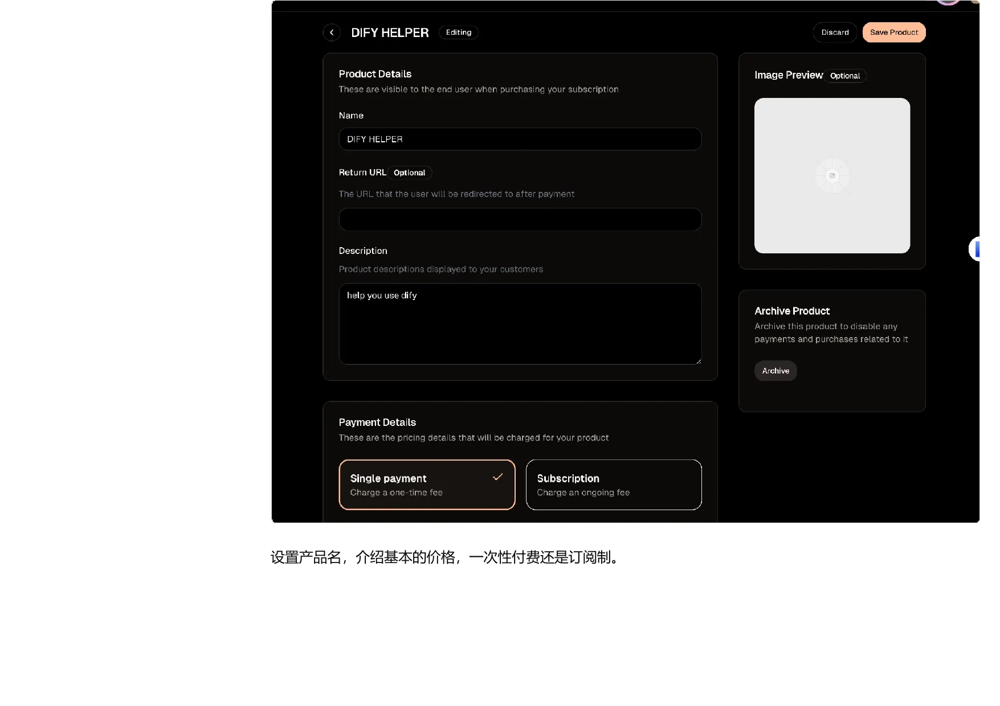

## 个人收款与国际数字产品：从试水到可结算

这篇文章处理个人阶段的收款问题：先判断业务类型和客户所在地区，再选择国内个人渠道、国际数字产品平台或稳定的手机号方案。重点不是把所有账户都开一遍，而是让产品、客户、支付方式、退款和结算路径能够相互解释。

没有公司主体时，方案的优势是启动快、成本低；代价是交易能力、订阅能力、平台审核和长期风险隔离有限。业务一旦从验证进入持续经营，就应重新评估公司主体、公司账户和税务记录。

## 手册导览与使用方式

理解本手册的目标、适用人群和从个人试水到公司化运营的选择顺序。

### 手册介绍：从收款问题到方案地图

#### 这份手册试图解决什么问题

这份手册的出发点，是把独立开发者、数字产品创作者和跨境小企业在收款环节遇到的分散问题，放进同一张方案地图里。把问题分成四类：国内个人收款、国际数字产品收款、美国公司与银行账户，以及 Stripe 等支付平台的接入和后续维护。

它面对的不是单一的“如何收一笔钱”，而是一个连续链条：先判断业务是否适合个人身份，再决定是否需要国际支付渠道；业务验证后，如果要扩大规模，就要考虑公司主体、公司银行账户、支付平台、申报义务以及公司资金如何转到个人账户。不同阶段需要的工具不同，不能把所有方案都当成必选项。

#### 适用人群

第一类是需要为 SaaS、软件或在线服务搭建全球收款系统的开发者；第二类是销售数字产品、课程或咨询服务的创作者；第三类是计划开展跨境电商或国际贸易的企业主。三类人的共同点是需要面对境外客户，但收入类型、交易规模、退款风险和税务责任并不相同，因此后续选择仍要回到实际业务。

#### 阅读这份页面内容时要保留的判断

 “亲身实践”和“可落地”不能代替平台官方条款、银行审核结果或专业税务意见。尤其是手续费、开户资格、申报时间和支付平台风控规则，都会随着时间、地区和账户状态变化。更稳妥的做法是把本文作为路线索引，真正执行前再核对当前官方页面和专业意见。

### 如何使用：按业务阶段选择收款路径

#### 不需要把所有方案都注册一遍

给出的核心使用方法很简单：先确定当前阶段和目标，再选择对应方案。处于国内业务试水期，可以先看国内个人收款；只有数字产品、并且需要向境外客户收费时，再看国际个人支付渠道；当业务需要更稳定的主体、银行账户和支付生态时，再进入公司注册、Mercury 和 Stripe 相关章节。

#### 一条更清晰的阅读顺序

可以把全书理解为四个阶段。第一阶段是验证产品和交易流程，重点是能否收款、退款和交付；第二阶段是建立国际数字产品的收款链路，确认客户所在地区、结算币种和平台限制；第三阶段是公司化，把主体、公司账户和支付平台分开管理；第四阶段是运营维护，包括账户风控、BOI、税务、提款和工具福利。

这个顺序的价值在于避免过早复杂化。没有真实业务时，直接注册多个主体、绑定多个平台，会增加维护成本和合规记录；业务已经发生后再补主体，又可能出现历史交易、平台审核和资金归属难以解释的问题。因此应先列出产品类型、客户地区、预计月交易量、收款币种和是否需要订阅，再决定走到哪一层。

#### 阅读方式

 遇到金额、税号、地址、账户、表格字段或平台资格，不要只依赖一段教程文字；应结合当前官方规则和自己的实际情况判断。文中未完成的部分保持原状，不把缺失内容补写成确定步骤。

## 国内个人收款方案

整理国内个人、小微商户和第三方支付渠道的适用场景、费用与审核注意事项。

### 国内个人收款：先做业务试水，再决定主体

#### 适用边界

本章面向主要在国内开展业务、需要通过微信或支付宝收款的个人开发者和小型服务提供者。把这类方案定位为低门槛的试水路径：不一定需要营业执照，可以通过第三方支付服务接入网站或产品，但它不等同于企业级收款体系，也不天然支持订阅扣款。

如果业务主要是国内交易，第三方渠道可以减少早期接入成本；如果业务包含虚拟产品出海，应转到国际个人支付章节；如果交易规模持续增长，则应重新评估个体工商户或公司主体、官方支付渠道、发票和税务记录，而不是长期依赖早期的临时方案。

#### 个体户与第三方平台的关系

文中提到个体工商户可以用于开通更多官方渠道，并给出了一组免税额度的说法。这里必须把它当作源页面内容中的经验性表述，而不是普遍适用的税务结论。实际额度、税种、纳税方式和地方执行都可能不同，不能仅凭本章数字判断自己“无需纳税”。

更稳定的判断方式是先记录收入来源、交易金额、成本、退款和经营所在地，再向当地税务机关或专业人士确认。对于只是验证产品、金额较小且风险可控的阶段，可以评估第三方方案；对于持续经营，则应把主体和账务一起规划。

#### 本章的决策结论

蓝兔支付适合只需要微信、追求开通简单的场景；易支付适合同时考虑微信和支付宝的个人站点。两者都需要认真填写业务说明和实名资料，也都可能遇到平台或官方审核。真正重要的不是“哪家费率最低”，而是渠道是否支持你的业务、是否能稳定结算，以及资金和交易记录能否被解释。

### 蓝兔支付：微信个人收款的接入流程

*蓝兔支付资料填写界面*

#### 方案定位

把蓝兔支付作为早期使用过的微信收款方式，适合只需要微信支付、没有营业执照、希望快速接入的小型网店或个人服务。页面内容记录的开户费为 50 元，微信官方手续费为 0.6%，另有 0.7% 的接口服务费；这些费用属于记录，使用前应以平台当前页面为准。

#### 开通时要准备什么

页面中出现的资料包括真实身份信息、收款名称、业务网站、个人银行卡、开户行信息以及必要的业务补充资料。收款名称会展示给买家，网站地址用于说明业务来源；如果网站需要登录，应准备测试账号或其他能帮助审核人员理解业务的页面内容。

资料填写的关键是前后一致。姓名、银行卡和实名信息不能拼接或借用他人资料，业务描述也应与实际售卖内容对应。文中特别提醒，虚假资料可能导致微信官方审核失败，因此“先随便填、通过后再改”不是稳妥的做法。

#### 流程与限制

 填写资料、平台审核、官方审核、扫码签约、支付费用和开通完成构成基本流程。页面还展示了支付宝与微信不同渠道的开户费和费率，但具体价格应以平台当前价目表为准。

蓝兔支付的优势是操作路径短、到账快，记录为 T+1；代价是依赖第三方平台，能力范围和审核结果受平台规则影响。它适合验证业务，不适合在没有进一步主体和账务规划的情况下被当成长期完整方案。

### 易支付与问题答疑：费率、限额和审核

#### 易支付的基本信息

将 ZPAY 易支付定位为面向个人站长的正规商户渠道，支持微信和支付宝，不要求营业执照。页面内容记录的单渠道注册费约为 88——188 元，平台手续费约为 0.8%——1.2%，支付宝或微信官方手续费约为 0.2%——0.6%；交易量较大时可能需要向平台申请更低费率。以上数字均应重新核对。

#### 资料填写和额度

页面示例显示平台会要求选择商户类型，填写姓名、身份证号、手机号、商户简称、邮箱、支付宝账号和业务模式，并上传身份证正反面、签署协议。业务模式必须与真实售卖内容相符，否则平台可能限制商户且开户费不一定退还。

记录的小微商户单笔限额为 1,000 元、日限额为 10,000 元。这个限制直接影响大额订单和高频交易，因此在选择前应先把客单价、日订单量和退款方式算清楚。平台支持收款通知，但通知本身不等于结算保障。

#### 常见问题的正确读法

文中称资金不会长期存放在第三方平台，而是在微信侧冻结后于次日进入收款账户；这应当理解为作者对当时链路的经验描述，不能替代平台协议。网站是否必须备案，页面内容也没有给出统一答案，而是记录了审核人员和网站质量可能造成差异。

因此，提交前应准备清晰的网站、真实业务说明和完整实名资料；开通后要核对到账、退款、投诉和提现记录。若交易规模明显增长，应重新评估个体户或公司主体以及官方支付渠道。

## 国际数字产品个人支付方案

整理 Creem 这类国际数字产品支付平台的定位、产品配置、费用和提现限制。

### Creem：数字产品个人国际收款的适用边界

*国际数字产品平台费率页面*

#### 先确认你卖的是什么

本章的适用范围非常窄：面向想以个人身份向国际客户销售虚拟产品的开发者。实物跨境电商不属于这条路径，应直接进入公司或跨境电商相关方案。Creem 在中被推荐为个人国际收款的主方案，原因是注册门槛相对低、产品和支付流程较完整，并且可以处理部分税务与合规工作。

这并不意味着平台可以绕过所有审核。平台仍会根据产品类型、客户、交易行为和账户资料判断风险；“审核宽松”只是文档对当时体验的描述，不能当成永久资格。对于订阅、软件许可、课程和数字资源，应准备清楚的产品介绍、交付方式、退款规则和客服信息。

#### 费用要如何理解

列出了 Creem、Lemon Squeezy、Polar 和 Gumroad 的比较。页面内容中的示例费率包括 Creem 3.9% 加 0.40 美元、Lemon Squeezy 5% 加 0.50 美元、Polar 4% 加 0.40 美元、Gumroad 10% 加 2.9% 加 0.30 美元，并分别列出国际卡、订阅和提现附加费。

比较时不能只看基础交易费。应同时计算国际卡附加费、货币转换、提现路径、退款处理、税务代收和订阅能力。对于低客单价产品，固定费用的影响可能大于百分比；对于高频订阅，平台风控和争议处理可能比单笔费率更关键。

#### 本节结论

如果你的产品是数字化交付、客户主要在境外、暂时不想注册公司，Creem 可以作为一个候选入口。但在正式迁移客户前，应先用测试模式跑通支付、退款、交付、提现和身份核验，并保存平台当前条款。

### 从创建产品到提现：一条完整的数字产品链路

*数字产品价格与支付页面*

#### 产品配置不是只填一个价格

页面示例展示了创建产品时需要填写产品名称、描述、可选图片、返回地址和收费方式。收费方式分为一次性付款和订阅。一个合格的产品页面至少要让客户知道买到什么、如何交付、如何联系卖家，以及发生退款时应遵循什么规则。

创建完成后，平台可以通过分享链接或支付页面向客户收费。以一个软件工具为例，展示了后台产品列表、价格、订阅数量和创建时间；这些页面示例证明的是当时页面的配置方式，不代表平台今天的界面或功能完全相同。

#### 支付与提现的两个风险点

支付页面显示由 Creem 提供 Merchant of Record 服务，并由 Stripe 提供底层支付能力。对卖家来说，平台可能代为处理一部分税务和合规工作，但卖家仍要保证产品合法、描述真实、退款政策清晰。

提现时，如果选择支付宝等国内路径，提醒可能需要绑定身份证信息；当提现金额超过平台阈值时，可能需要提供收入证明，否则提现会被退回。这个限制意味着“能收款”与“能顺利结算”是两件事，应在正式销售前用小额测试确认。

#### 建议保留的记录

至少保留产品配置、支付成功、退款、平台费用、提现申请、收入证明和平台邮件。将这些记录与订单号对应起来，后续无论是客户争议、平台审核还是个人收入申报，都比只保存一张支付页面示例更容易说明情况。

## 美国公司手机号

整理美国号码在 Stripe 和公司业务中的作用，以及实体 SIM、eSIM 和 WiFi Calling 的选择。

### 美国手机号：用途、方案选择与风控提醒

#### 手机号在链路中的作用

认为，美国手机号在激活 Stripe 时很有用，尤其可以作为客户支持电话；公司注册和 Mercury 可能不强制要求，但有一个稳定号码会让后续验证和客服沟通更顺畅。号码一旦绑定公司、支付平台或客户页面，就不应被当成一次性验证码工具。

#### 当前推荐与旧方案的区分

页面内容明确提醒 Ultra Mobile PayGo 的新卡激活存在风控问题，可能出现无信号，恢复时间也不确定；因此将 Ultra Mobile 5 美元套餐和 Tello 列为替代选择。旧的 3 美元 PayGo 方案被保留为历史说明，不应直接当作当前可购买方案。

实体 SIM 的优势是兼容性和号码稳定性；eSIM 方案更灵活，但手机必须支持 eSIM。不支持 eSIM 时，提到可以研究 eSIM 卡贴。选择时应先确认手机制式、国内漫游、WiFi Calling、短信接收和长期续费能力。

#### 号码的长期维护

号码绑定公司后，欠费销号可能影响 Stripe 客服信息和账户验证。建议预存多个月话费、尽量使用 WiFi Calling 并控制在免费额度内。更重要的是建立续费提醒，保存 SIM 卡、账户邮箱和恢复方式，并准备一个合法、稳定的客户支持渠道。

### Ultra Mobile、Tello 与 WiFi Calling 的实际使用

*WiFi Calling 设置页面*

#### WiFi Calling 解决什么问题

WiFi Calling 允许手机在 WiFi 条件下通过运营商账户拨打和接听电话、收发短信。以 iPhone 为例，路径是插入电话卡并等待有信号，然后在“设置——蜂窝网络——WiFi 通话”中开启。首次设置可能需要补充紧急地址，不能把它理解成完全不需要运营商验证。

#### 充值与费用管理

页面内容记录的充值方式包括官网信用卡充值和实体充值卡，最低充值金额为 5 美元。使用建议是保持足够余额、预存 2——3 个月、尽可能设置自动续费，并优先在 WiFi 环境中使用。还列出了超出免费通话、短信和数据后的单价，但这些费率应以运营商当前套餐为准。

#### 选择建议

如果手机支持 eSIM，可以先比较 Tello 的套餐、号码保留和国内使用条件；如果需要实体卡，再研究 Ultra Mobile 当前可用的套餐。不要只看月租，还要验证：能否在国内激活、能否接收短信、WiFi Calling 是否可用、欠费后的恢复规则，以及号码能否长期保留。

