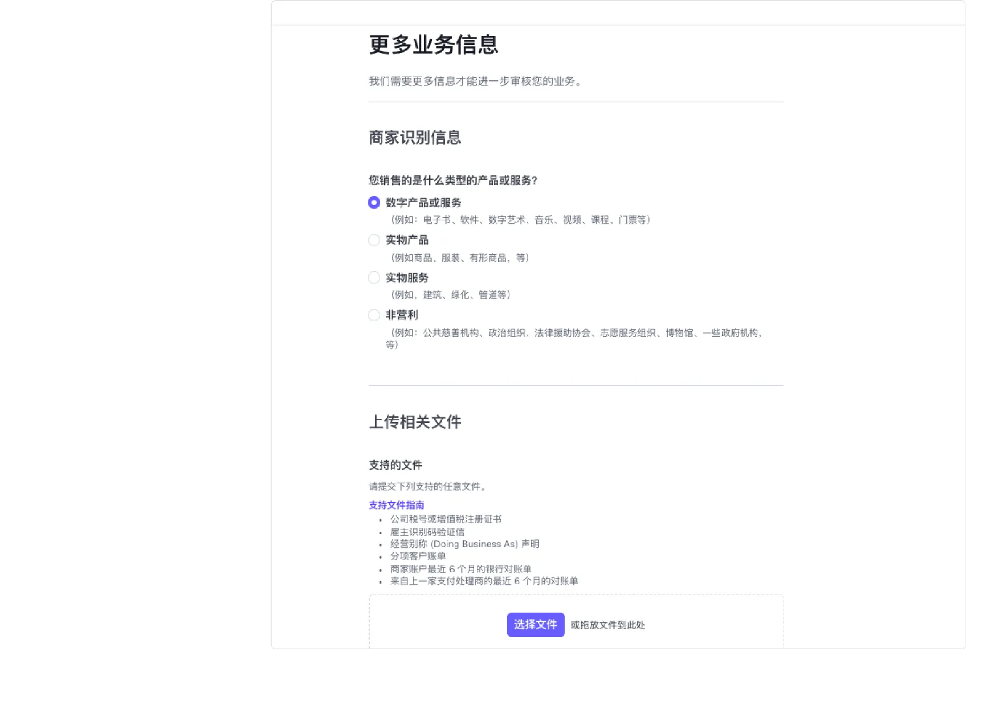

## 美国公司、Mercury 与 Stripe：建立公司收款链

这篇文章把公司注册、公司银行账户和 Stripe 支付平台放在同一条经营链里。公司注册解决主体问题，Mercury 承接公司资金，Stripe 面向客户收款；手机号、网站、地址、EIN 和业务描述则负责把这些环节连接起来。

公司化不是为了绕过审核，也不是开通平台的快捷方式。它意味着要维护公司文件、真实地址、银行流水、平台资料、客户服务和年度申报。任何一个环节虚构或长期不维护，都会让后续审核和责任解释变得更困难。

## 美国公司注册方案

整理注册前资料、Stripe Atlas 与 DIY 方案、公司类型选择以及尚未展开的 DIY 注册部分。

### 注册美国公司前：资料、地址与主体价值

#### 注册前先建立资料闭环

把注册前准备分成三类：创始人信息与家庭住址、护照个人页，以及代理地址和主要营业地址的理解。家庭住址可以是中国地址，但重点不是地址属于哪个国家，而是能否提供与姓名完全匹配的证明文件。页面内容举例包括水电账单、信用卡账单、港卡对账单和驾照翻译件。

代理地址是美国注册公司时由注册代理商提供的地址，用于接收政府信件和扫描件；主要营业地址则应反映实际办公或日常经营地点。两者不能因为都叫“公司地址”就混填。后续银行和支付平台可能分别要求法定地址、经营地址、创始人住址和客服地址，因此最好在提交任何表单前做一张地址映射表。

#### 公司主体带来的变化

文档认为公司主体能够帮助隔离部分个人与经营风险、增强对海外客户的信任，并让创业者以企业视角管理业务。这些是经营层面的判断，不是对有限责任保护的绝对保证。公司与个人账户混用、把公司钱直接拿来消费，仍可能削弱这种隔离。

页面内容还用了“角色认同”“沉没成本”和“心理账户”等概念解释注册公司后行为变化。清洗后保留其实际含义：公司不是一张支付工具的外壳，而是一套需要持续记账、申报、保留文件和维护账户的经营结构。

#### 你应当在提交前问自己的问题

业务是否已经需要公司主体？预计客户和交易在哪里？是否要订阅？是否能解释收入来源？谁拥有公司、谁负责签字？哪些地址和文件可以相互证明？如果这些问题还答不清楚，先补资料和业务说明，通常比急着点击提交更重要。

### Stripe Atlas 与 DIY：成本、速度和控制权的取舍

*公司结构选择页面*

#### 两条路线的差异

Stripe Atlas 在中被描述为全程在线、流程顺滑、管理面板清晰，并且与 Stripe 支付生态衔接紧密。代价是注册州和结构选择相对固定，年度维护成本需要持续承担。DIY 方案的优势是可以选择更多州、控制成本和注册细节；代价是需要自己处理更多文书、地址、注册代理和后续维护。

页面内容记录的 Atlas 价格包括基础注册费 500 美元、使用某些优惠后的较低价格，以及特拉华州 LLC 每年 300 美元的州级费用；还记录了首年一定交易额的 Stripe Payments 费率优惠。优惠链接、金额和资格都是强时效信息，不应从这篇文章直接执行。

#### LLC 还是 C Corporation

给出的方向是：自筹资金、规模较小、由少数人持有且暂时不计划融资，可以优先研究 LLC；计划快速增长、融资、向员工发放股权或未来上市，再研究 C Corporation。这里的“更适合”只是初步筛选，最终应结合税务、投资、股权、州法和未来融资计划决定。

#### 注册州与地址

页面内容重点讲了特拉华州，并提到无州级销售税、州外经营收入等税收相关表述。这些内容必须与当前州法和公司实际活动结合核验。无论选择哪一个州，注册地址、注册代理地址和日常办公地址都要分开记录，不能为了通过表单而制造无法证明的地址。

#### 选择建议

第一次注册、希望减少流程复杂度并计划使用 Stripe 的人，可以把 Atlas 当作便利性方案；有经验、主要目标是降低维护成本或需要特定州的人，再比较 DIY。真正的比较维度应包括首年与持续成本、文件责任、税务支持范围、银行开户要求和退出成本，而不只是注册价格。

### Atlas 注册流程：从账户到提交，以及尚未完成的 DIY 部分

#### Atlas 的表单顺序

文档展示的流程依次是创建 Stripe 账户、选择公司结构、填写公司名称和业务描述、录入创始人信息、填写 Tax 信息、检查 Summary、签署文件并付款。业务描述应与网站、产品演示或社交账号相互对应，不能把限制类业务包装成另一种业务。

创始人信息中的姓名、出生日期、家庭住址和身份证明需要与政府文件一致。外国创始人没有 SSN 时，应选择“不拥有 SSN”的选项；页面内容称 Atlas 会自动申请 EIN，等待时间可能为数周。手机号可以使用个人号码，但美国手机号在后续平台联系和验证中可能更方便。

#### 签署、付款与 EIN 的时间关系

签署页包括 Certificate of Formation、Operating Agreement、Confidential Information and Invention Assignment Agreement、Form 8821 和 Form SS-4。付款页还提示不要使用匿名 IP 或 VPN。记录了支付失败时可尝试手机端 Apple Pay 或 Google Pay，但这只能算经验提示，不能规避平台的支付和风控规则。

页面内容特别提醒：EIN 获取变慢时，过早申请 Mercury 可能让银行在公司资料未完整时关闭账户；如果已经通过其他方式申请 EIN，应及时向 Atlas 说明，避免重复申请。这里的重点是协调时间线，而不是同时提交越多申请越好。

#### 未完成的部分必须显式保留

在第 38 页明确写着“DIY 方案详细步骤待续”。因此本文只整理了 Atlas 的示例流程和 DIY 的优缺点，没有把缺失的 DIY 细节补写成教程。后续若要使用 DIY，应另行建立州选择、注册代理、文件提交、EIN、银行和年度维护的核验清单。

## Mercury 银行账户

整理 Mercury 账户的产品特点、开户资料、动态审核、地址证明和开户后的衔接。

### Mercury：公司账户的功能、费用与适用场景

#### 账户定位

将 Mercury 描述为面向美国创业公司的在线银行服务，支持远程开户和非美国居民拥有的美国公司。其主要卖点包括 Checking 与 Savings、在线管理、与 Stripe 和 PayPal 等支付服务衔接，以及与 Gusto、QuickBooks 等企业工具的生态集成。

这些特点适合希望把公司收款、运营支出和工具订阅分开管理的小型团队。但“支持非美国居民”不等于自动通过审核，银行仍会核验公司真实经营、所有人、地址、资金来源和预期活动。

#### 费用与转账

页面内容记录的账户维护费、月费和开户费均为免费，最低日均余额没有要求；ACH 转账记录为免费，美国境内汇款 5 美元、国际汇款 20 美元。还提到特定邀请活动可能在 90 天内存入 10,000 美元后获得 250 美元奖励。

价格、返现和邀请活动都属于强时效信息。实际使用前应确认适用地区、账户类型、活动条件、转账方式和是否产生中间行费用。尤其不要把“免费”理解为所有国际转账和兑换都零成本。

#### 账户在整条链路中的位置

Mercury 的作用不是替代公司注册或支付平台，而是承接公司资金：Stripe 收款后进入公司账户，公司用账户支付服务器、软件和服务费用，必要时再通过合规的分配或提款路径转到个人账户。这个边界有助于避免公司账户被当作个人钱包使用。

### Mercury 开户：公司资料、地址证明与申请表

*Mercury 公司地址填写页面*

#### 从账户创建开始

页面流程从工作邮箱、密码和呼号开始。呼号只是用于个性化账单转发地址和推荐链接的昵称，不是公司法定名称。进入正式申请后，需要填写公司法定名称、公司地址、注册国、公司类型、行业、网站和业务描述。

公司描述应说明真实业务，例如软件开发、数字产品或技术服务，并与官网、产品演示和注册文件能够相互印证。公司网站虽然可能是可选项，但一个能解释产品、联系方式、隐私政策和服务条款的网站，会比空白链接更容易说明业务。

#### 地址是最容易出错的字段

法定地址通常来自公司成立文件；日常经营地址则是实际工作的办公或居住地点。多次强调，不能为了完成表单随便填写地址，必须能提供与公司或个人姓名一致的政府证件、银行对账单或水电账单。

如果使用注册代理地址，必须清楚它是代理地址，不要把它误写成创始人的日常办公地址。地址在公司注册、Mercury、Stripe 和税务文件中如果前后不一致，可能触发补充审核。

#### 公司文件

页面内容展示了上传 Certificate of Formation 和 EIN 相关文件的步骤。Atlas 面板可能包含 Approved Certificate of Formation、Operating Agreement、147C Letter 或 Approved SS-4 等文件；银行会根据公司状态要求不同页面内容。提交前应确认文件是最终版，并保存文件名、签发机构和日期。

### Mercury 动态审核：预期活动、资金来源与物理地址

#### 预期活动要与真实业务一致

申请表会询问是否进行国际汇款或收款、预计使用的前三种货币、每月交易量，以及美国是否有员工、投资者、客户、供应商或办公地点。还会询问首笔存款来自投资者、收入还是个人资金，以及是否涉及加密货币、风投、工资、承包商或关联公司转账。

这些问题不是“选择最容易通过的答案”，而是银行建立账户画像的依据。可以先根据产品、客户、合同、收款平台和预算做一份预期活动表，再让申请表中的金额、币种和资金来源与它保持一致。预计月交易量过低或过高，都可能在实际发生后与账户行为不符。

#### 物理地址验证

页面内容展示了银行要求提交 60 天内的政府身份证件、银行对账单或水电账单，并要求文件清晰显示公司或个人姓名以及地址。还指出，中文对账单可能因为地址翻译无法对应而增加审核难度，建议使用英文地址或准备带有英文地址的证明。

这里真正可复用的规则是“姓名和地址可验证、语言和格式易于审核”，而不是某一份证件必然通过。不要把页面示例裁剪到看不出机构、日期和姓名，也不要在账单上临时修改地址。

#### 审核前的最后检查

提交前逐项核对法定名称、公司地址、经营地址、注册代理、网站、行业、业务描述、预期货币、月交易量和首笔资金来源。若信息变化，应在审核期间保持解释一致，并准备合同、订单、网站和账户记录作为补充页面内容。

### 开户完成后的衔接：账户、卡片、Stripe 与福利

#### 进入审核和入金阶段

提交公司信息后，页面会进入审核状态。记录了可以通过入金加速审核的经验，并提到审核通过后可以看到 Checking、Virtual Card 等账户和卡片。入金不是所有账户都必须采用的固定步骤，实际要求应以银行通知为准。

开户完成后，Mercury 账户可以作为 Stripe 的提现账户，也可以用于支付服务器、软件订阅和公司运营费用。公司卡和公司账户的用途应在内部记录中区分清楚：卡片是支付工具，Checking 是账户余额和转账的载体，二者都属于公司资金。

#### 账户维护的最小闭环

建议建立四项记录：每笔入账的来源、每笔支出的业务用途、卡片交易的凭证、以及账户对账单。页面内容页面示例展示了系统可能要求保留超过 75 美元交易的收据；无论具体阈值是否变化，保留凭证都是后续记账和税务解释的基础。

#### 福利包是开户后的附加项

最后引出了 AWS、Google Cloud、QuickBooks、Namecheap 和 Gusto 等合作福利。福利不是开户成功的必要条件，也不应成为开户时虚构业务的理由。使用前应核对新用户资格、有效期、兑换方式、信用额度和支付方式要求，并把福利与公司实际需要对应起来。

## Stripe 注册激活

整理 Stripe 业务验证、代表人信息、公开详情、银行绑定和提交审核的连续流程。

### Stripe 激活前准备：公司类型、EIN 与业务信息

#### 先准备真实的业务资料

把 Stripe 激活放在取得 EIN 之后，但同时记录了一个特定日期的经验：当时没有 EIN 也可以先开始激活，只是支付方式受限。这个时间点信息已经具有明显时效性，实际操作应以当前 Stripe 页面要求为准。

进入激活流程后，首先选择业务所在地、商家类型和商家结构。单人 LLC、多人 LLC、合伙企业和公司对应不同选项，不能为了减少问题而选择与注册文件不一致的类型。法定名称和 EIN 必须与 IRS 文件完全匹配，包括大小写、标点和 LLC 后缀。

#### 公司代表和地址

Stripe 需要公司授权签字代表的法定姓名、出生日期、家庭住址、电话号码和身份证明。建议让公司代表地址与注册页面内容、办公地址和后续验证文件保持一致；这并不是要求所有地址必须相同，而是要求每个字段都能解释其用途。

公开详情包括商家名称、对账单描述符、短描述符、客服电话、客服地址、行业、官网和产品描述。客户看到的名称和账单描述符应能识别实际商家，客服渠道要可用，官网应能解释你卖什么、如何联系和如何退款。

#### 业务说明的写法

行业选择应尽量贴近客户实际购买的产品或服务。以软件行业为例，并建议提供网站或产品页面。清洗后的原则是：不要堆砌模糊的“数字创新”词汇；用几句话说明产品、客户、交付方式、收费方式和退款处理，让审核人员能把公司文件、网站和交易行为串起来。

### Stripe 激活收尾：客服信息、银行绑定与自动收税

*Stripe 绑定收款银行页面*

#### 客服与账单信息

Stripe 的公开详情页面会让你填写客服地址、客服电话、对账单描述符和可选的短描述符。对账单描述符通常有字符长度和格式要求，并且会显示在客户的银行卡或信用卡账单上。它应该与品牌或公司名称相关，避免让客户无法识别而产生争议。

#### 绑定收款银行

绑定银行时，可以从支持的银行列表中选择 Mercury 并登录连接，也可以手动填写银行详情。绑定完成后，Stripe 的可用余额会按平台规则打到公司账户。建议绑定已经开好的 Mercury，但实际也可以根据业务选择其他合规的公司账户。

#### 税务计算与 Climate 选项

页面还展示了自动收税和 Stripe Climate 捐款。自动收税涉及客户所在地、产品类别和适用税法，应当在明确纳税责任后配置；捐款选项属于可选项，不影响账户激活。不要把启用自动收税理解成平台替代了公司的全部税务申报。

#### 提交前的四项检查

检查公司名称和 EIN 是否与 IRS 文件一致；检查代表人身份和地址是否真实；检查网站、产品、客服和账单描述符是否相互对应；检查绑定的是公司银行账户而不是个人账户。确认无误后再提交审核，并保存提交后的邮件、页面和补充资料。

## Stripe 账户维护

把“养号”还原成账户风险管理：真实业务、渐进交易、官网信息和订阅风险。

### Stripe 账户维护：避免把正常业务做成异常画像

*Stripe 账户业务信息补充页面*

#### “养号”不等于规避风控

使用“养号”这个说法，清洗后更准确的表达是：让账户资料、网站、产品、交易量和客户行为保持真实且一致。Stripe 会使用自动系统识别盗刷、争议、退款和受限业务风险；即便商家主观上没有违规，也可能因为行为模式触发补充审核。

#### 常见风险来源

页面内容列出的风险点包括：账户刚开通就大量入账、争议率高、退款率高、官网不正规、销售受限业务，以及周期性订阅付款。这里不能把“降低风险”理解成找熟人刷单或伪造交易。最稳妥的方式是从真实客户和真实订单开始，确保产品交付、客服、退款和争议处理都能闭环。

#### 官网要能解释业务

建议官网至少包含隐私政策、联系方式和服务条款，并说明公司愿景和业务。网站设计是否漂亮不是核心，客户能否知道卖家是谁、买到什么、出了问题找谁，才是平台和客户都关心的信息。隐私政策和服务条款也不能只是占位文字，应与实际数据处理、退款和服务范围对应。

#### 订阅与交易节奏

页面内容给出了新账户前期单个订阅用户月度经常性收入不宜过高、SaaS 客单价不宜过高的经验阈值。这些数字不是 Stripe 官方通用规则，不能机械套用。可以保留其风险意识：订阅应有清晰授权、试用、取消和退款机制；交易量增长要能被营销、客户和交付能力解释；出现审核时要准备合同、订单、产品演示和银行记录。

#### 触发审核后的处理

如果账户被限制，首先阅读 Stripe 的通知和补件要求，按真实情况提交资料；不要重复创建大量账户、修改网站来掩盖业务或提供互相矛盾的说明。人工客服是否介入、申诉是否成功都不是可以保证的结果，因此在业务设计上应提前考虑现金流和备用的合规收款方案。

