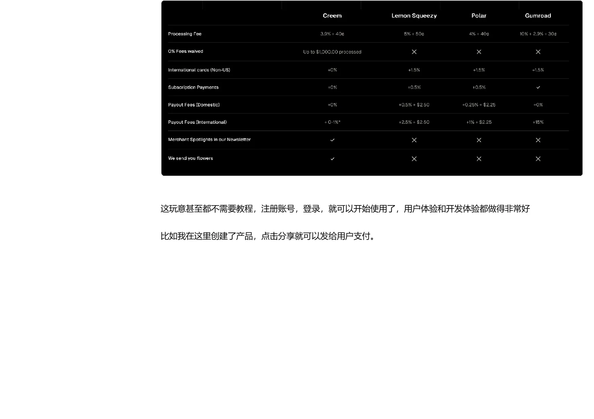
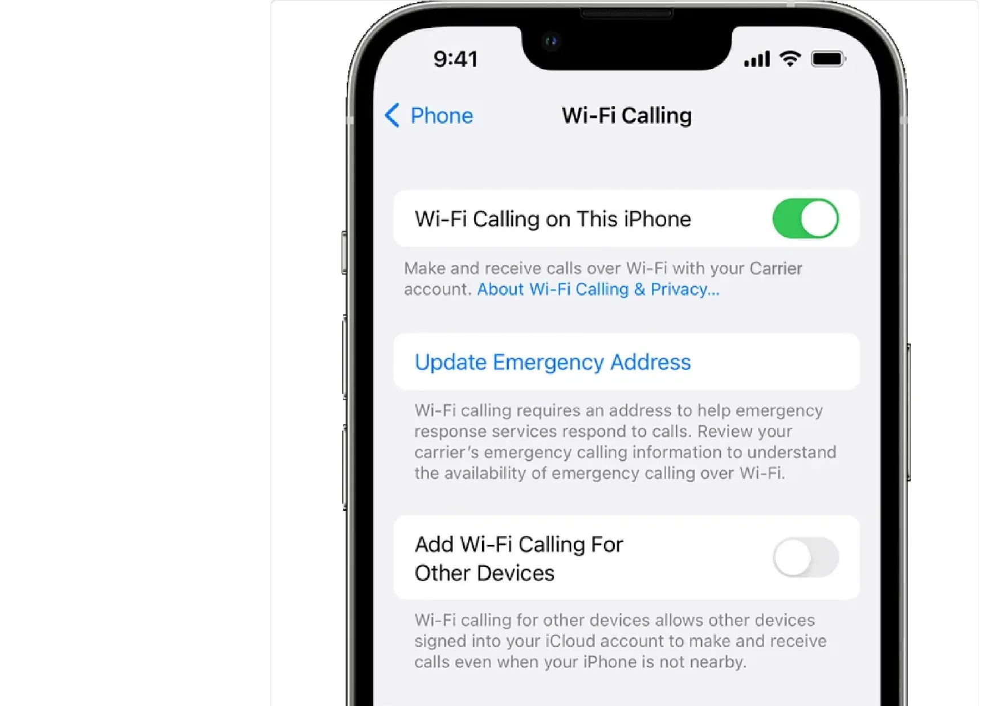
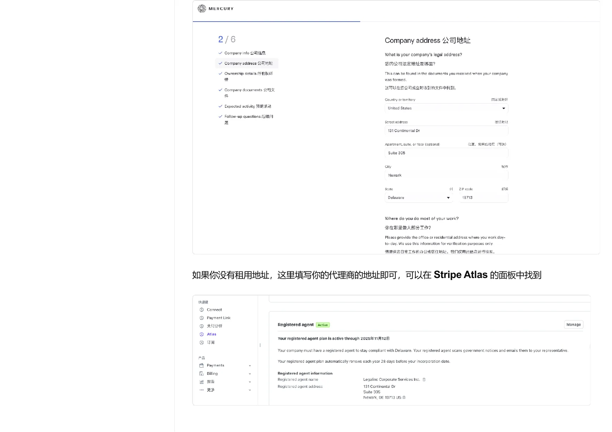
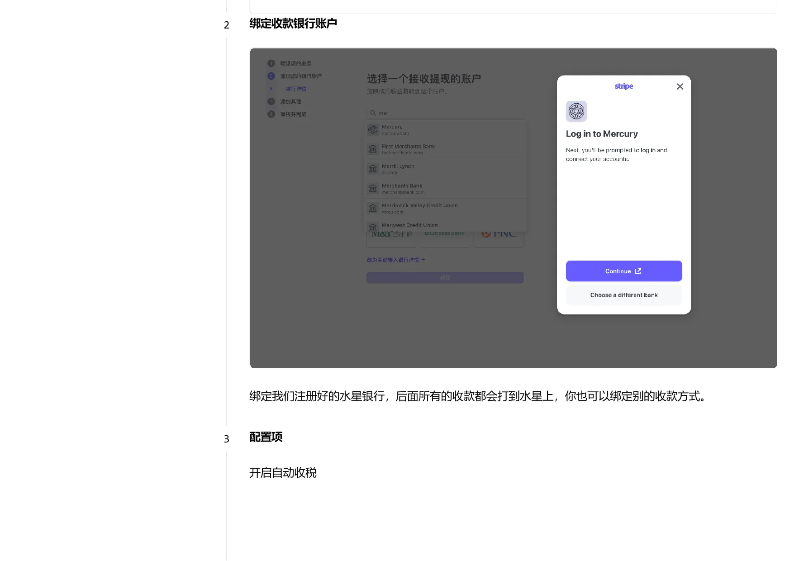
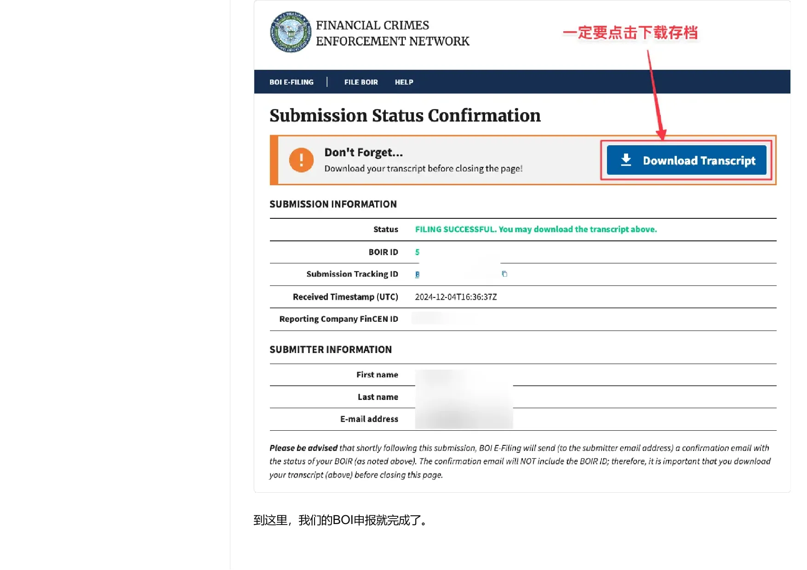
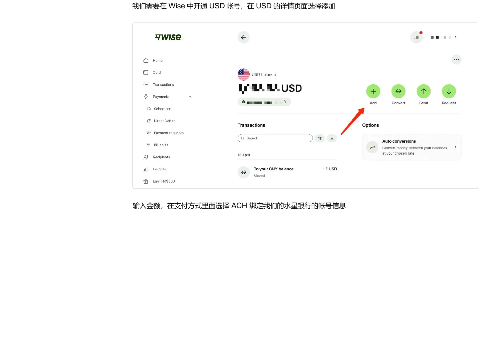
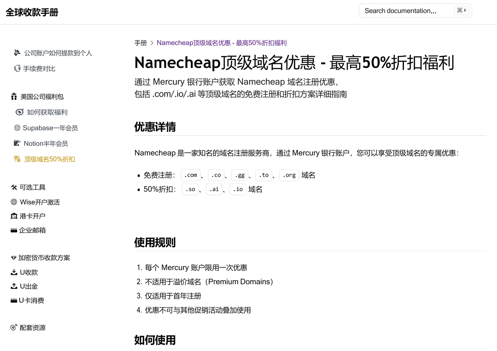

> 本页为「全球收款与出海合规合集」3 篇的合订本；原文章链接会自动跳转到本页。

## 01-个人收款与国际数字产品

## 个人收款与国际数字产品：从试水到可结算

这篇文章处理个人阶段的收款问题：先判断业务类型和客户所在地区，再选择国内个人渠道、国际数字产品平台或稳定的手机号方案。重点不是把所有账户都开一遍，而是让产品、客户、支付方式、退款和结算路径能够相互解释。

没有公司主体时，方案的优势是启动快、成本低；代价是交易能力、订阅能力、平台审核和长期风险隔离有限。业务一旦从验证进入持续经营，就应重新评估公司主体、公司账户和税务记录。

## 手册导览与使用方式

理解本手册的目标、适用人群和从个人试水到公司化运营的选择顺序。

### 手册介绍：从收款问题到方案地图

#### 这份手册试图解决什么问题

这份手册的出发点，是把独立开发者、数字产品创作者和跨境小企业在收款环节遇到的分散问题，放进同一张方案地图里。把问题分成四类：国内个人收款、国际数字产品收款、美国公司与银行账户，以及 Stripe 等支付平台的接入和后续维护。

它面对的不是单一的“如何收一笔钱”，而是一个连续链条：先判断业务是否适合个人身份，再决定是否需要国际支付渠道；业务验证后，如果要扩大规模，就要考虑公司主体、公司银行账户、支付平台、申报义务以及公司资金如何转到个人账户。不同阶段需要的工具不同，不能把所有方案都当成必选项。

#### 适用人群

第一类是需要为 SaaS、软件或在线服务搭建全球收款系统的开发者；第二类是销售数字产品、课程或咨询服务的创作者；第三类是计划开展跨境电商或国际贸易的企业主。三类人的共同点是需要面对境外客户，但收入类型、交易规模、退款风险和税务责任并不相同，因此后续选择仍要回到实际业务。

#### 阅读这份页面内容时要保留的判断

 “亲身实践”和“可落地”不能代替平台官方条款、银行审核结果或专业税务意见。尤其是手续费、开户资格、申报时间和支付平台风控规则，都会随着时间、地区和账户状态变化。更稳妥的做法是把本文作为路线索引，真正执行前再核对当前官方页面和专业意见。

### 如何使用：按业务阶段选择收款路径

#### 不需要把所有方案都注册一遍

给出的核心使用方法很简单：先确定当前阶段和目标，再选择对应方案。处于国内业务试水期，可以先看国内个人收款；只有数字产品、并且需要向境外客户收费时，再看国际个人支付渠道；当业务需要更稳定的主体、银行账户和支付生态时，再进入公司注册、Mercury 和 Stripe 相关章节。

#### 一条更清晰的阅读顺序

可以把全书理解为四个阶段。第一阶段是验证产品和交易流程，重点是能否收款、退款和交付；第二阶段是建立国际数字产品的收款链路，确认客户所在地区、结算币种和平台限制；第三阶段是公司化，把主体、公司账户和支付平台分开管理；第四阶段是运营维护，包括账户风控、BOI、税务、提款和工具福利。

这个顺序的价值在于避免过早复杂化。没有真实业务时，直接注册多个主体、绑定多个平台，会增加维护成本和合规记录；业务已经发生后再补主体，又可能出现历史交易、平台审核和资金归属难以解释的问题。因此应先列出产品类型、客户地区、预计月交易量、收款币种和是否需要订阅，再决定走到哪一层。

#### 阅读方式

 遇到金额、税号、地址、账户、表格字段或平台资格，不要只依赖一段教程文字；应结合当前官方规则和自己的实际情况判断。文中未完成的部分保持原状，不把缺失内容补写成确定步骤。

## 国内个人收款方案

整理国内个人、小微商户和第三方支付渠道的适用场景、费用与审核注意事项。

### 国内个人收款：先做业务试水，再决定主体

#### 适用边界

本章面向主要在国内开展业务、需要通过微信或支付宝收款的个人开发者和小型服务提供者。把这类方案定位为低门槛的试水路径：不一定需要营业执照，可以通过第三方支付服务接入网站或产品，但它不等同于企业级收款体系，也不天然支持订阅扣款。

如果业务主要是国内交易，第三方渠道可以减少早期接入成本；如果业务包含虚拟产品出海，应转到国际个人支付章节；如果交易规模持续增长，则应重新评估个体工商户或公司主体、官方支付渠道、发票和税务记录，而不是长期依赖早期的临时方案。

#### 个体户与第三方平台的关系

文中提到个体工商户可以用于开通更多官方渠道，并给出了一组免税额度的说法。这里必须把它当作源页面内容中的经验性表述，而不是普遍适用的税务结论。实际额度、税种、纳税方式和地方执行都可能不同，不能仅凭本章数字判断自己“无需纳税”。

更稳定的判断方式是先记录收入来源、交易金额、成本、退款和经营所在地，再向当地税务机关或专业人士确认。对于只是验证产品、金额较小且风险可控的阶段，可以评估第三方方案；对于持续经营，则应把主体和账务一起规划。

#### 本章的决策结论

蓝兔支付适合只需要微信、追求开通简单的场景；易支付适合同时考虑微信和支付宝的个人站点。两者都需要认真填写业务说明和实名资料，也都可能遇到平台或官方审核。真正重要的不是“哪家费率最低”，而是渠道是否支持你的业务、是否能稳定结算，以及资金和交易记录能否被解释。

### 蓝兔支付：微信个人收款的接入流程

*蓝兔支付资料填写界面*

#### 方案定位

把蓝兔支付作为早期使用过的微信收款方式，适合只需要微信支付、没有营业执照、希望快速接入的小型网店或个人服务。页面内容记录的开户费为 50 元，微信官方手续费为 0.6%，另有 0.7% 的接口服务费；这些费用属于记录，使用前应以平台当前页面为准。

#### 开通时要准备什么

页面中出现的资料包括真实身份信息、收款名称、业务网站、个人银行卡、开户行信息以及必要的业务补充资料。收款名称会展示给买家，网站地址用于说明业务来源；如果网站需要登录，应准备测试账号或其他能帮助审核人员理解业务的页面内容。

资料填写的关键是前后一致。姓名、银行卡和实名信息不能拼接或借用他人资料，业务描述也应与实际售卖内容对应。文中特别提醒，虚假资料可能导致微信官方审核失败，因此“先随便填、通过后再改”不是稳妥的做法。

#### 流程与限制

 填写资料、平台审核、官方审核、扫码签约、支付费用和开通完成构成基本流程。页面还展示了支付宝与微信不同渠道的开户费和费率，但具体价格应以平台当前价目表为准。

蓝兔支付的优势是操作路径短、到账快，记录为 T+1；代价是依赖第三方平台，能力范围和审核结果受平台规则影响。它适合验证业务，不适合在没有进一步主体和账务规划的情况下被当成长期完整方案。

### 易支付与问题答疑：费率、限额和审核

#### 易支付的基本信息

将 ZPAY 易支付定位为面向个人站长的正规商户渠道，支持微信和支付宝，不要求营业执照。页面内容记录的单渠道注册费约为 88——188 元，平台手续费约为 0.8%——1.2%，支付宝或微信官方手续费约为 0.2%——0.6%；交易量较大时可能需要向平台申请更低费率。以上数字均应重新核对。

#### 资料填写和额度

页面示例显示平台会要求选择商户类型，填写姓名、身份证号、手机号、商户简称、邮箱、支付宝账号和业务模式，并上传身份证正反面、签署协议。业务模式必须与真实售卖内容相符，否则平台可能限制商户且开户费不一定退还。

记录的小微商户单笔限额为 1,000 元、日限额为 10,000 元。这个限制直接影响大额订单和高频交易，因此在选择前应先把客单价、日订单量和退款方式算清楚。平台支持收款通知，但通知本身不等于结算保障。

#### 常见问题的正确读法

文中称资金不会长期存放在第三方平台，而是在微信侧冻结后于次日进入收款账户；这应当理解为作者对当时链路的经验描述，不能替代平台协议。网站是否必须备案，页面内容也没有给出统一答案，而是记录了审核人员和网站质量可能造成差异。

因此，提交前应准备清晰的网站、真实业务说明和完整实名资料；开通后要核对到账、退款、投诉和提现记录。若交易规模明显增长，应重新评估个体户或公司主体以及官方支付渠道。

## 国际数字产品个人支付方案

整理 Creem 这类国际数字产品支付平台的定位、产品配置、费用和提现限制。

### Creem：数字产品个人国际收款的适用边界

*国际数字产品平台费率页面*

#### 先确认你卖的是什么

本章的适用范围非常窄：面向想以个人身份向国际客户销售虚拟产品的开发者。实物跨境电商不属于这条路径，应直接进入公司或跨境电商相关方案。Creem 在中被推荐为个人国际收款的主方案，原因是注册门槛相对低、产品和支付流程较完整，并且可以处理部分税务与合规工作。

这并不意味着平台可以绕过所有审核。平台仍会根据产品类型、客户、交易行为和账户资料判断风险；“审核宽松”只是文档对当时体验的描述，不能当成永久资格。对于订阅、软件许可、课程和数字资源，应准备清楚的产品介绍、交付方式、退款规则和客服信息。

#### 费用要如何理解

列出了 Creem、Lemon Squeezy、Polar 和 Gumroad 的比较。页面内容中的示例费率包括 Creem 3.9% 加 0.40 美元、Lemon Squeezy 5% 加 0.50 美元、Polar 4% 加 0.40 美元、Gumroad 10% 加 2.9% 加 0.30 美元，并分别列出国际卡、订阅和提现附加费。

比较时不能只看基础交易费。应同时计算国际卡附加费、货币转换、提现路径、退款处理、税务代收和订阅能力。对于低客单价产品，固定费用的影响可能大于百分比；对于高频订阅，平台风控和争议处理可能比单笔费率更关键。

#### 本节结论

如果你的产品是数字化交付、客户主要在境外、暂时不想注册公司，Creem 可以作为一个候选入口。但在正式迁移客户前，应先用测试模式跑通支付、退款、交付、提现和身份核验，并保存平台当前条款。

### 从创建产品到提现：一条完整的数字产品链路

*数字产品价格与支付页面*

#### 产品配置不是只填一个价格

页面示例展示了创建产品时需要填写产品名称、描述、可选图片、返回地址和收费方式。收费方式分为一次性付款和订阅。一个合格的产品页面至少要让客户知道买到什么、如何交付、如何联系卖家，以及发生退款时应遵循什么规则。

创建完成后，平台可以通过分享链接或支付页面向客户收费。以一个软件工具为例，展示了后台产品列表、价格、订阅数量和创建时间；这些页面示例证明的是当时页面的配置方式，不代表平台今天的界面或功能完全相同。

#### 支付与提现的两个风险点

支付页面显示由 Creem 提供 Merchant of Record 服务，并由 Stripe 提供底层支付能力。对卖家来说，平台可能代为处理一部分税务和合规工作，但卖家仍要保证产品合法、描述真实、退款政策清晰。

提现时，如果选择支付宝等国内路径，提醒可能需要绑定身份证信息；当提现金额超过平台阈值时，可能需要提供收入证明，否则提现会被退回。这个限制意味着“能收款”与“能顺利结算”是两件事，应在正式销售前用小额测试确认。

#### 建议保留的记录

至少保留产品配置、支付成功、退款、平台费用、提现申请、收入证明和平台邮件。将这些记录与订单号对应起来，后续无论是客户争议、平台审核还是个人收入申报，都比只保存一张支付页面示例更容易说明情况。

## 美国公司手机号

整理美国号码在 Stripe 和公司业务中的作用，以及实体 SIM、eSIM 和 WiFi Calling 的选择。

### 美国手机号：用途、方案选择与风控提醒

#### 手机号在链路中的作用

认为，美国手机号在激活 Stripe 时很有用，尤其可以作为客户支持电话；公司注册和 Mercury 可能不强制要求，但有一个稳定号码会让后续验证和客服沟通更顺畅。号码一旦绑定公司、支付平台或客户页面，就不应被当成一次性验证码工具。

#### 当前推荐与旧方案的区分

页面内容明确提醒 Ultra Mobile PayGo 的新卡激活存在风控问题，可能出现无信号，恢复时间也不确定；因此将 Ultra Mobile 5 美元套餐和 Tello 列为替代选择。旧的 3 美元 PayGo 方案被保留为历史说明，不应直接当作当前可购买方案。

实体 SIM 的优势是兼容性和号码稳定性；eSIM 方案更灵活，但手机必须支持 eSIM。不支持 eSIM 时，提到可以研究 eSIM 卡贴。选择时应先确认手机制式、国内漫游、WiFi Calling、短信接收和长期续费能力。

#### 号码的长期维护

号码绑定公司后，欠费销号可能影响 Stripe 客服信息和账户验证。建议预存多个月话费、尽量使用 WiFi Calling 并控制在免费额度内。更重要的是建立续费提醒，保存 SIM 卡、账户邮箱和恢复方式，并准备一个合法、稳定的客户支持渠道。

### Ultra Mobile、Tello 与 WiFi Calling 的实际使用

*WiFi Calling 设置页面*

#### WiFi Calling 解决什么问题

WiFi Calling 允许手机在 WiFi 条件下通过运营商账户拨打和接听电话、收发短信。以 iPhone 为例，路径是插入电话卡并等待有信号，然后在“设置——蜂窝网络——WiFi 通话”中开启。首次设置可能需要补充紧急地址，不能把它理解成完全不需要运营商验证。

#### 充值与费用管理

页面内容记录的充值方式包括官网信用卡充值和实体充值卡，最低充值金额为 5 美元。使用建议是保持足够余额、预存 2——3 个月、尽可能设置自动续费，并优先在 WiFi 环境中使用。还列出了超出免费通话、短信和数据后的单价，但这些费率应以运营商当前套餐为准。

#### 选择建议

如果手机支持 eSIM，可以先比较 Tello 的套餐、号码保留和国内使用条件；如果需要实体卡，再研究 Ultra Mobile 当前可用的套餐。不要只看月租，还要验证：能否在国内激活、能否接收短信、WiFi Calling 是否可用、欠费后的恢复规则，以及号码能否长期保留。

## 02-美国公司、Mercury与Stripe

## 美国公司、Mercury 与 Stripe：建立公司收款链

这篇文章把公司注册、公司银行账户和 Stripe 支付平台放在同一条经营链里。公司注册解决主体问题，Mercury 承接公司资金，Stripe 面向客户收款；手机号、网站、地址、EIN 和业务描述则负责把这些环节连接起来。

公司化不是为了绕过审核，也不是开通平台的快捷方式。它意味着要维护公司文件、真实地址、银行流水、平台资料、客户服务和年度申报。任何一个环节虚构或长期不维护，都会让后续审核和责任解释变得更困难。

## 美国公司注册方案

整理注册前资料、Stripe Atlas 与 DIY 方案、公司类型选择以及尚未展开的 DIY 注册部分。

### 注册美国公司前：资料、地址与主体价值

#### 注册前先建立资料闭环

把注册前准备分成三类：创始人信息与家庭住址、护照个人页，以及代理地址和主要营业地址的理解。家庭住址可以是中国地址，但重点不是地址属于哪个国家，而是能否提供与姓名完全匹配的证明文件。页面内容举例包括水电账单、信用卡账单、港卡对账单和驾照翻译件。

代理地址是美国注册公司时由注册代理商提供的地址，用于接收政府信件和扫描件；主要营业地址则应反映实际办公或日常经营地点。两者不能因为都叫“公司地址”就混填。后续银行和支付平台可能分别要求法定地址、经营地址、创始人住址和客服地址，因此最好在提交任何表单前做一张地址映射表。

#### 公司主体带来的变化

文档认为公司主体能够帮助隔离部分个人与经营风险、增强对海外客户的信任，并让创业者以企业视角管理业务。这些是经营层面的判断，不是对有限责任保护的绝对保证。公司与个人账户混用、把公司钱直接拿来消费，仍可能削弱这种隔离。

页面内容还用了“角色认同”“沉没成本”和“心理账户”等概念解释注册公司后行为变化。清洗后保留其实际含义：公司不是一张支付工具的外壳，而是一套需要持续记账、申报、保留文件和维护账户的经营结构。

#### 你应当在提交前问自己的问题

业务是否已经需要公司主体？预计客户和交易在哪里？是否要订阅？是否能解释收入来源？谁拥有公司、谁负责签字？哪些地址和文件可以相互证明？如果这些问题还答不清楚，先补资料和业务说明，通常比急着点击提交更重要。

### Stripe Atlas 与 DIY：成本、速度和控制权的取舍

*公司结构选择页面*

#### 两条路线的差异

Stripe Atlas 在中被描述为全程在线、流程顺滑、管理面板清晰，并且与 Stripe 支付生态衔接紧密。代价是注册州和结构选择相对固定，年度维护成本需要持续承担。DIY 方案的优势是可以选择更多州、控制成本和注册细节；代价是需要自己处理更多文书、地址、注册代理和后续维护。

页面内容记录的 Atlas 价格包括基础注册费 500 美元、使用某些优惠后的较低价格，以及特拉华州 LLC 每年 300 美元的州级费用；还记录了首年一定交易额的 Stripe Payments 费率优惠。优惠链接、金额和资格都是强时效信息，不应从这篇文章直接执行。

#### LLC 还是 C Corporation

给出的方向是：自筹资金、规模较小、由少数人持有且暂时不计划融资，可以优先研究 LLC；计划快速增长、融资、向员工发放股权或未来上市，再研究 C Corporation。这里的“更适合”只是初步筛选，最终应结合税务、投资、股权、州法和未来融资计划决定。

#### 注册州与地址

页面内容重点讲了特拉华州，并提到无州级销售税、州外经营收入等税收相关表述。这些内容必须与当前州法和公司实际活动结合核验。无论选择哪一个州，注册地址、注册代理地址和日常办公地址都要分开记录，不能为了通过表单而制造无法证明的地址。

#### 选择建议

第一次注册、希望减少流程复杂度并计划使用 Stripe 的人，可以把 Atlas 当作便利性方案；有经验、主要目标是降低维护成本或需要特定州的人，再比较 DIY。真正的比较维度应包括首年与持续成本、文件责任、税务支持范围、银行开户要求和退出成本，而不只是注册价格。

### Atlas 注册流程：从账户到提交，以及尚未完成的 DIY 部分

#### Atlas 的表单顺序

文档展示的流程依次是创建 Stripe 账户、选择公司结构、填写公司名称和业务描述、录入创始人信息、填写 Tax 信息、检查 Summary、签署文件并付款。业务描述应与网站、产品演示或社交账号相互对应，不能把限制类业务包装成另一种业务。

创始人信息中的姓名、出生日期、家庭住址和身份证明需要与政府文件一致。外国创始人没有 SSN 时，应选择“不拥有 SSN”的选项；页面内容称 Atlas 会自动申请 EIN，等待时间可能为数周。手机号可以使用个人号码，但美国手机号在后续平台联系和验证中可能更方便。

#### 签署、付款与 EIN 的时间关系

签署页包括 Certificate of Formation、Operating Agreement、Confidential Information and Invention Assignment Agreement、Form 8821 和 Form SS-4。付款页还提示不要使用匿名 IP 或 VPN。记录了支付失败时可尝试手机端 Apple Pay 或 Google Pay，但这只能算经验提示，不能规避平台的支付和风控规则。

页面内容特别提醒：EIN 获取变慢时，过早申请 Mercury 可能让银行在公司资料未完整时关闭账户；如果已经通过其他方式申请 EIN，应及时向 Atlas 说明，避免重复申请。这里的重点是协调时间线，而不是同时提交越多申请越好。

#### 未完成的部分必须显式保留

在第 38 页明确写着“DIY 方案详细步骤待续”。因此本文只整理了 Atlas 的示例流程和 DIY 的优缺点，没有把缺失的 DIY 细节补写成教程。后续若要使用 DIY，应另行建立州选择、注册代理、文件提交、EIN、银行和年度维护的核验清单。

## Mercury 银行账户

整理 Mercury 账户的产品特点、开户资料、动态审核、地址证明和开户后的衔接。

### Mercury：公司账户的功能、费用与适用场景

#### 账户定位

将 Mercury 描述为面向美国创业公司的在线银行服务，支持远程开户和非美国居民拥有的美国公司。其主要卖点包括 Checking 与 Savings、在线管理、与 Stripe 和 PayPal 等支付服务衔接，以及与 Gusto、QuickBooks 等企业工具的生态集成。

这些特点适合希望把公司收款、运营支出和工具订阅分开管理的小型团队。但“支持非美国居民”不等于自动通过审核，银行仍会核验公司真实经营、所有人、地址、资金来源和预期活动。

#### 费用与转账

页面内容记录的账户维护费、月费和开户费均为免费，最低日均余额没有要求；ACH 转账记录为免费，美国境内汇款 5 美元、国际汇款 20 美元。还提到特定邀请活动可能在 90 天内存入 10,000 美元后获得 250 美元奖励。

价格、返现和邀请活动都属于强时效信息。实际使用前应确认适用地区、账户类型、活动条件、转账方式和是否产生中间行费用。尤其不要把“免费”理解为所有国际转账和兑换都零成本。

#### 账户在整条链路中的位置

Mercury 的作用不是替代公司注册或支付平台，而是承接公司资金：Stripe 收款后进入公司账户，公司用账户支付服务器、软件和服务费用，必要时再通过合规的分配或提款路径转到个人账户。这个边界有助于避免公司账户被当作个人钱包使用。

### Mercury 开户：公司资料、地址证明与申请表

*Mercury 公司地址填写页面*

#### 从账户创建开始

页面流程从工作邮箱、密码和呼号开始。呼号只是用于个性化账单转发地址和推荐链接的昵称，不是公司法定名称。进入正式申请后，需要填写公司法定名称、公司地址、注册国、公司类型、行业、网站和业务描述。

公司描述应说明真实业务，例如软件开发、数字产品或技术服务，并与官网、产品演示和注册文件能够相互印证。公司网站虽然可能是可选项，但一个能解释产品、联系方式、隐私政策和服务条款的网站，会比空白链接更容易说明业务。

#### 地址是最容易出错的字段

法定地址通常来自公司成立文件；日常经营地址则是实际工作的办公或居住地点。多次强调，不能为了完成表单随便填写地址，必须能提供与公司或个人姓名一致的政府证件、银行对账单或水电账单。

如果使用注册代理地址，必须清楚它是代理地址，不要把它误写成创始人的日常办公地址。地址在公司注册、Mercury、Stripe 和税务文件中如果前后不一致，可能触发补充审核。

#### 公司文件

页面内容展示了上传 Certificate of Formation 和 EIN 相关文件的步骤。Atlas 面板可能包含 Approved Certificate of Formation、Operating Agreement、147C Letter 或 Approved SS-4 等文件；银行会根据公司状态要求不同页面内容。提交前应确认文件是最终版，并保存文件名、签发机构和日期。

### Mercury 动态审核：预期活动、资金来源与物理地址

#### 预期活动要与真实业务一致

申请表会询问是否进行国际汇款或收款、预计使用的前三种货币、每月交易量，以及美国是否有员工、投资者、客户、供应商或办公地点。还会询问首笔存款来自投资者、收入还是个人资金，以及是否涉及加密货币、风投、工资、承包商或关联公司转账。

这些问题不是“选择最容易通过的答案”，而是银行建立账户画像的依据。可以先根据产品、客户、合同、收款平台和预算做一份预期活动表，再让申请表中的金额、币种和资金来源与它保持一致。预计月交易量过低或过高，都可能在实际发生后与账户行为不符。

#### 物理地址验证

页面内容展示了银行要求提交 60 天内的政府身份证件、银行对账单或水电账单，并要求文件清晰显示公司或个人姓名以及地址。还指出，中文对账单可能因为地址翻译无法对应而增加审核难度，建议使用英文地址或准备带有英文地址的证明。

这里真正可复用的规则是“姓名和地址可验证、语言和格式易于审核”，而不是某一份证件必然通过。不要把页面示例裁剪到看不出机构、日期和姓名，也不要在账单上临时修改地址。

#### 审核前的最后检查

提交前逐项核对法定名称、公司地址、经营地址、注册代理、网站、行业、业务描述、预期货币、月交易量和首笔资金来源。若信息变化，应在审核期间保持解释一致，并准备合同、订单、网站和账户记录作为补充页面内容。

### 开户完成后的衔接：账户、卡片、Stripe 与福利

#### 进入审核和入金阶段

提交公司信息后，页面会进入审核状态。记录了可以通过入金加速审核的经验，并提到审核通过后可以看到 Checking、Virtual Card 等账户和卡片。入金不是所有账户都必须采用的固定步骤，实际要求应以银行通知为准。

开户完成后，Mercury 账户可以作为 Stripe 的提现账户，也可以用于支付服务器、软件订阅和公司运营费用。公司卡和公司账户的用途应在内部记录中区分清楚：卡片是支付工具，Checking 是账户余额和转账的载体，二者都属于公司资金。

#### 账户维护的最小闭环

建议建立四项记录：每笔入账的来源、每笔支出的业务用途、卡片交易的凭证、以及账户对账单。页面内容页面示例展示了系统可能要求保留超过 75 美元交易的收据；无论具体阈值是否变化，保留凭证都是后续记账和税务解释的基础。

#### 福利包是开户后的附加项

最后引出了 AWS、Google Cloud、QuickBooks、Namecheap 和 Gusto 等合作福利。福利不是开户成功的必要条件，也不应成为开户时虚构业务的理由。使用前应核对新用户资格、有效期、兑换方式、信用额度和支付方式要求，并把福利与公司实际需要对应起来。

## Stripe 注册激活

整理 Stripe 业务验证、代表人信息、公开详情、银行绑定和提交审核的连续流程。

### Stripe 激活前准备：公司类型、EIN 与业务信息

#### 先准备真实的业务资料

把 Stripe 激活放在取得 EIN 之后，但同时记录了一个特定日期的经验：当时没有 EIN 也可以先开始激活，只是支付方式受限。这个时间点信息已经具有明显时效性，实际操作应以当前 Stripe 页面要求为准。

进入激活流程后，首先选择业务所在地、商家类型和商家结构。单人 LLC、多人 LLC、合伙企业和公司对应不同选项，不能为了减少问题而选择与注册文件不一致的类型。法定名称和 EIN 必须与 IRS 文件完全匹配，包括大小写、标点和 LLC 后缀。

#### 公司代表和地址

Stripe 需要公司授权签字代表的法定姓名、出生日期、家庭住址、电话号码和身份证明。建议让公司代表地址与注册页面内容、办公地址和后续验证文件保持一致；这并不是要求所有地址必须相同，而是要求每个字段都能解释其用途。

公开详情包括商家名称、对账单描述符、短描述符、客服电话、客服地址、行业、官网和产品描述。客户看到的名称和账单描述符应能识别实际商家，客服渠道要可用，官网应能解释你卖什么、如何联系和如何退款。

#### 业务说明的写法

行业选择应尽量贴近客户实际购买的产品或服务。以软件行业为例，并建议提供网站或产品页面。清洗后的原则是：不要堆砌模糊的“数字创新”词汇；用几句话说明产品、客户、交付方式、收费方式和退款处理，让审核人员能把公司文件、网站和交易行为串起来。

### Stripe 激活收尾：客服信息、银行绑定与自动收税

*Stripe 绑定收款银行页面*

#### 客服与账单信息

Stripe 的公开详情页面会让你填写客服地址、客服电话、对账单描述符和可选的短描述符。对账单描述符通常有字符长度和格式要求，并且会显示在客户的银行卡或信用卡账单上。它应该与品牌或公司名称相关，避免让客户无法识别而产生争议。

#### 绑定收款银行

绑定银行时，可以从支持的银行列表中选择 Mercury 并登录连接，也可以手动填写银行详情。绑定完成后，Stripe 的可用余额会按平台规则打到公司账户。建议绑定已经开好的 Mercury，但实际也可以根据业务选择其他合规的公司账户。

#### 税务计算与 Climate 选项

页面还展示了自动收税和 Stripe Climate 捐款。自动收税涉及客户所在地、产品类别和适用税法，应当在明确纳税责任后配置；捐款选项属于可选项，不影响账户激活。不要把启用自动收税理解成平台替代了公司的全部税务申报。

#### 提交前的四项检查

检查公司名称和 EIN 是否与 IRS 文件一致；检查代表人身份和地址是否真实；检查网站、产品、客服和账单描述符是否相互对应；检查绑定的是公司银行账户而不是个人账户。确认无误后再提交审核，并保存提交后的邮件、页面和补充资料。

## Stripe 账户维护

把“养号”还原成账户风险管理：真实业务、渐进交易、官网信息和订阅风险。

### Stripe 账户维护：避免把正常业务做成异常画像

*Stripe 账户业务信息补充页面*

#### “养号”不等于规避风控

使用“养号”这个说法，清洗后更准确的表达是：让账户资料、网站、产品、交易量和客户行为保持真实且一致。Stripe 会使用自动系统识别盗刷、争议、退款和受限业务风险；即便商家主观上没有违规，也可能因为行为模式触发补充审核。

#### 常见风险来源

页面内容列出的风险点包括：账户刚开通就大量入账、争议率高、退款率高、官网不正规、销售受限业务，以及周期性订阅付款。这里不能把“降低风险”理解成找熟人刷单或伪造交易。最稳妥的方式是从真实客户和真实订单开始，确保产品交付、客服、退款和争议处理都能闭环。

#### 官网要能解释业务

建议官网至少包含隐私政策、联系方式和服务条款，并说明公司愿景和业务。网站设计是否漂亮不是核心，客户能否知道卖家是谁、买到什么、出了问题找谁，才是平台和客户都关心的信息。隐私政策和服务条款也不能只是占位文字，应与实际数据处理、退款和服务范围对应。

#### 订阅与交易节奏

页面内容给出了新账户前期单个订阅用户月度经常性收入不宜过高、SaaS 客单价不宜过高的经验阈值。这些数字不是 Stripe 官方通用规则，不能机械套用。可以保留其风险意识：订阅应有清晰授权、试用、取消和退款机制；交易量增长要能被营销、客户和交付能力解释；出现审核时要准备合同、订单、产品演示和银行记录。

#### 触发审核后的处理

如果账户被限制，首先阅读 Stripe 的通知和补件要求，按真实情况提交资料；不要重复创建大量账户、修改网站来掩盖业务或提供互相矛盾的说明。人工客服是否介入、申诉是否成功都不是可以保证的结果，因此在业务设计上应提前考虑现金流和备用的合规收款方案。

## 03-BOI、税务、提款与福利

## BOI、税务、提款与福利：收款之后的持续管理

收款链路开通后，真正长期消耗精力的是合规记录、税务申报、公司与个人资金分离、转账成本和工具续费。这篇文章把 BOI、联邦与州税务、公司账户提款、支付费率和创业福利压缩成一套后续管理框架。

其中涉及的政策、表格、费率和平台资格都具有时效性。本文保留原有信息和操作逻辑，但不把其中的金额、期限或资格条件当作今天可以直接执行的结论；执行前仍需查看对应官方页面。

## 美国 BOI 申报

整理 FinCEN ID、BOIR 在线申报字段、回执保存和时效性风险。

### FinCEN ID：先建立个人身份资料入口

*FinCEN ID 申请页面*

#### BOI 与 FinCEN ID 的关系

把 BOI 解释为 Beneficial Ownership Information，即披露美国公司最终由谁控制和受益的信息，并将 FinCEN ID 作为申报时可复用的个人身份标识。先申请 FinCEN ID 的好处是，后续 BOIR 表格可以填写 ID，而不必重复录入全部个人信息。

需要特别注意的是，页面已经出现“由于联邦法院命令，申报可自愿进行”的页面提示。这说明 BOI 义务在页面内容形成时就处于变化状态，不能沿用的“所有公司都必须申报”作为当前结论。实际义务、豁免、期限和处罚必须以 FinCEN 当前公告、法律文本和专业意见为准。

#### FinCEN ID 的申请页面内容

流程从 FinCEN ID 页面跳转到 Login.gov，创建或登录账号后回到 FinCEN。表单需要法定姓名、出生日期、居住或营业地址、证件类型、证件号码和证件图片。提醒护照首页文件名使用英文，并勾选信息真实、准确、完整的认证声明。

这一步最重要的是身份资料的准确性。不要把公司地址、代理地址和个人住址混为一谈；上传证件时保留原始文件和提交时间；不要把页面示例中出现的真实姓名、证件号或 ID 直接复制到公开文章或共享文档中。

#### 结果保存

提交后页面会显示 FinCEN ID 和回执信息。建议保存结果，清洗后的建议是同时保存下载文件、提交日期、账号邮箱和后续变更路径，并把它们放进受控的公司合规档案，而不是散落在聊天记录中。

### BOIR 在线申报：公司、申请人和受益所有人字段

*BOIR 提交成功页面*

#### 选择在线填报方式

页面内容展示了 File 文档 BOIR 与 File Online BOIR 两种方式，并选择在线填写和提交。在线表单依次包含 Reporting Company、Company Applicant、Beneficial Owner 和 Submit 等部分。无论采用哪种形式，都应先准备公司成立文件、EIN、注册州、注册地址、受益所有人信息和 FinCEN ID。

#### 公司信息

公司部分需要填写法定名称和可选的 DBA、税务识别类型及号码、注册国家和州、当前美国地址与邮编。提示如果没有 EIN，只能选择 foreign 识别方式并填写护照信息；这个字段选择可能影响申报资格，应以当前表单说明和专业意见为准。

注册地址可以是注册代理地址，也可以是公司自己的地址，但要与成立文件和当前公司记录一致。地址证明、注册州、File Number 和代理信息应在一个文件夹中互相核对。

#### 公司申请人和受益所有人

公司申请人部分可以填写刚刚取得的 FinCEN ID；受益所有人部分填写受益所有人的 FinCEN ID。单人 LLC 的申请人、控制人和受益所有人可能是同一个人，但表单角色仍应按官方定义判断，不能因为“都是我”就随便跳过字段。

#### 提交与归档

提交成功后，页面会显示 Filing Successful、BOIR ID、Submission Tracking ID 和时间戳，并提供 Download Transcript。明确提醒在关闭页面前下载 transcript。清洗后把这一步提升为强制归档动作：保存 transcript、确认邮件、提交账号和变更记录，之后任何修改都保留前后版本。

## 美国公司联邦与州税务

整理 Form 1120、5472、州级年度税费和材料中示例流程，同时明确税务内容不能直接照抄。

### 联邦申报地图：1120、5472 与提交方式

#### 先把“公司没有经营”与“无需申报”分开

把外国人拥有的美国 LLC、Form 5472 和 Form 1120 放在同一条线索中，并强调即使没有大量经营，也可能因为公司与外国所有人之间的资金往来而产生申报事项。清洗后最重要的结论是：账户有没有余额、是否收过钱、是否向公司注资、是否发生关联方交易，都可能影响申报判断，不能用“没有营业”一笔带过。

页面内容还提到 Form 1065、Schedule K-1 和 Form 8805 等表格作为测评结果中的可能项目。但这些表格取决于公司税务分类、所有权、收入和交易情况，不能仅凭公司注册类型自动决定。

#### 1120 与 5472 的关系

文中将 Form 5472 描述为报告外国相关美国公司的关联交易，并认为外国拥有的单成员 LLC 在特定分类下可能同时涉及 1120 和 5472。实际判断需要确认 LLC 的联邦税务分类、外国所有权、关联方定义和报告年度，最好由熟悉跨境企业的税务专业人士复核。

#### 申报渠道

页面内容称外国人的 1120 与 5472 不支持普通在线提交，并记录了传真和邮寄地址，还提到付费代提交服务。提交地址、传真号码和服务商均可能变化；在使用前必须从 IRS 当前说明确认版本、截止时间、签字要求、附件和邮寄凭证。

#### 税务档案的最低要求

建议为每个年度建立申报包：公司成立文件、EIN 文件、银行对账单、Stripe 或其他平台结算、股东注资和分配、关联方交易、费用凭证、已提交表格、传真/邮寄回执和专业意见。税务问题的难点往往不在“找到一张表”，而在于证明数字从哪里来。

### Form 5472：从公司信息到关联方信息

#### Part I：报告公司

页面内容示例从报告公司名称、EIN、地址、总资产、主要业务活动和 NAICS 代码开始，并展示了 518210 等数据处理、托管和相关服务代码。示例数字、公司名和地址属于页面示例中的样例，不应复制到自己的表格。

填写时要先确认公司法定名称、EIN、注册州、成立日期、主要经营国家和税务居民信息。金额以美元报告，若交易以其他货币发生，应按适用规则换算并保留汇率依据。

#### Part II：25% 外国股东

这一部分涉及直接或间接持有 25% 或以上权益的外国股东，包括姓名、地址、美国识别号码、参考 ID、外国税号、国籍和税务居民国家。关联方如果没有美国税号，示例留空；但是否留空以及替代字段如何填写，应根据 IRS 表格说明判断。

#### Part III：关联方

页面内容把关联方分为外国人或美国人，并要求填写姓名、地址、税号、参考 ID、主要业务活动、业务代码、经营国家和税务居民国家。对于单人 LLC，建议同时选择与报告公司和 25% 外国股东有关联的选项，但这仍需要结合事实和当年表格说明。

#### Reference ID 的治理

文中指出，Reference ID 可以由申报人自定义，建议只使用字母和数字、保持不超过 50 个字符，并在后续年度保持一致。清洗后将其视为数据治理要求：一旦确定 ID，就把它写入内部台账，避免下一年度换写法导致关联方无法对应。

### Form 5472 的交易部分：金额、附页与申报证据

#### Part IV：收到与支付的交易

表格把交易分成销售存货、有形资产、平台贡献、成本分摊、租金、无形资产许可、服务、佣金、借款、利息、保险和其他金额，并分别记录收到和支付。不能因为交易金额小就跳过，也不能把公司注资、关联方借款和分配混成普通收入。

#### Part V 与 Part VI：附页说明

页面内容将 Part V 用于外国拥有的美国 disregarded entity 的可报告交易，并举例说明公司设立、解散、收购、处置、资本注入、贷款和分配等事项可能需要附页描述。Part VI 则涉及非货币或低于完整对价的交易，也需要在单独附页中说明。

这两部分的共同要求是“事实叙述可复核”：交易双方是谁、发生了什么、金额是多少、何时发生、为什么发生、如何入账，都要能从银行流水、协议、发票和公司记录中还原。

#### 期限、罚款与多张表

提示 5472 通常与 1120 一起在公司税务截止日期前提交，并记录了每张表可能面临高额罚款的说法。具体截止日、延期、罚款金额和适用条件必须以 IRS 当前指南为准。存在多个外国相关方时，可能需要分别填表，这也是建立关联方清单的原因。

#### 实操上的安全线

不要直接照抄示例中的公司名、EIN、地址、金额或参考 ID。先制作交易总账，再按表格字段映射；不确定的字段保留问题清单，交给税务专业人士确认，并保存最终提交版本和回执。

### 州级年度要求：特拉华州与怀俄明州示例

*特拉华州 LLC 税费页面*

#### 特拉华州 LLC

介绍特拉华州 LLC 年度税费为 300 美元、不要求提交年度报告，并记录截止日为 6 月 1 日、逾期会产生罚款和利息。随后展示了通过州务卿网站查找 File Number、进入 LLC/LP/GP 税费页面、输入 File Number、选择付款方式和保存成功页面的流程。

这里应把“表单流程”和“当年规则”分开。File Number、注册代理和公司名称可以从州数据库核对；税费金额、截止日、付款开放时间、罚款和利息则必须在实际付款年度重新确认。

#### 怀俄明州 LLC

页面内容把怀俄明州描述为需要每年提交 Annual Report 并缴纳年度许可税，示例基本费用为资产低于 25 万美元时 60 美元，截止日与公司注册周年相关。逾期可能导致不合规，持续不提交可能导致公司解散。

#### 州税与联邦税是两条线

州级年度费用或年度报告，不等同于联邦的 Form 1120、5472，也不能因为完成其中一项就认为全部合规。公司维护台账至少应包含注册州、注册周年、州级费用、年度报告、联邦表格、延期和付款凭证。

#### 付款后保存什么

保存付款页面、确认邮件、付款日期、File Number、公司名称和州政府回执。若网站提示系统维护或确认副本未显示，不要重复付款，先查询交易状态并联系州政府。付款证据和公司年度合规清单应长期归档。

## 公司账户提款到个人

整理公司资金与个人消费的边界，以及 Wise 到香港账户或中国内地渠道的路径。

### 公司账户提款：先把分配与个人消费分开

*Wise USD 账户转账页面*

#### 公司账户不是个人钱包

的第一条原则是，公司账户资金应优先用于公司运营，例如服务器、软件订阅和服务费；直接用公司卡购买个人物品、支付个人账单，可能削弱公司与个人之间的责任隔离。这个风险在法律上常被称为 piercing the corporate veil，但是否构成以及后果取决于具体事实和适用法律。

如果要把公司利润用于个人消费，应先明确性质：是工资、股东分红、所有者提款、费用报销还是资本分配。每种性质可能对应不同的账务和税务处理。把统一转账称为 Distribution，并提醒在年度税务申报时报告相关交易；实际分类应交给会计或税务专业人士确认。

#### Wise + 香港账户路径

页面内容给出的第一条路径是 Mercury → Wise USD → HKD → 香港账户。解释，Mercury 当时不便直接通过 SWIFT 转到香港账户，而 Wise 可以用 ACH 接收 USD，再转换为 HKD，通过 FPS 转到香港账户。页面内容记录的 ACH 费用约 1.70 美元、相关转账费用约 6 美元，但这些金额和路径都需要重新核对。

#### 路径中的三个概念

ACH 是美国境内自动清算转账；Wire 是电汇，通常适合金额较大或需要更快处理的场景；FPS 是香港的快速支付系统，需要在香港银行 App 中登记并获得 FPS ID。理解这三个概念，比记住某个按钮位置更重要，因为银行和平台的连接方式会变化。

#### 记录要求

每次分配都应保存 Mercury 出账、Wise 入账、兑换记录、香港账户收款、汇率、手续费和用途说明，并在公司账簿中标记交易性质。不要为了“到账快”而省略公司决议、税务判断或资金来源说明。

### Wise 到香港与中国内地：两条路径的成本和限制

*香港 FPS 账户信息页面*

#### 到香港账户：FPS 适合小额快速转账

在 Wise 中将 USD 发送为 HKD 时，需要添加收款人并选择香港银行详情。页面内容展示了选择“myself”、填写 FPS ID 或本地银行账户的步骤；FPS ID 可以从香港银行 App 的“我的转数快”页面取得。称这种方式通常几秒到账，适合小金额。

金额较大时，ACH 充值和换汇的费率会随金额增加；如果改用 Wire 充值，页面内容以固定约 6 美元为例，再叠加 USD 转 HKD 的费用，总成本可能约 12 美元。这个数字仅是示例，实际要在 Wise 和 Mercury 的确认页查看。

#### 到中国内地：支付宝、微信或银联卡

第二条路径是在 Wise 收款人中选择 Alipay、WeChatPay 或 UnionPay card。页面内容提醒，这类转账可能受到金额和收入证明要求影响，超过一定范围后可能失败，并且境内收入可能涉及申报和税费。这里尤其不能把中的 20% 税率当作所有人的统一结论。

#### 选择路径的判断框架

小额、需要快速到账且已经有香港账户时，可以先比较 FPS 路径；金额较大时，先比较 Wire、ACH、汇率和固定费；需要进入中国内地时，先确认收款人身份、平台限额、收入证明和申报责任。无论哪条路径，都要保留转账确认页和资金性质说明。

#### 最低风险做法

先进行可承受损失的小额测试，确认入账名称、到账时间、费用和退回规则，再决定是否扩大金额。公司资金到个人账户的核心问题不是“能不能转”，而是“为什么转、如何入账、能否在税务和银行审查中解释”。

## 跨境支付手续费对比

把 Stripe、PayPal、2Checkout/Paddle 等费率放回交易规模、客户地区和合规需求中比较。

### 跨境支付费率：不要只比较一个百分比

#### 页面内容中的费率快照

列出的 Stripe 示例费率为国际信用卡 2.9% 加 0.30 美元，跨境附加费 1%，货币转换 1%；PayPal 示例为 3.49% 加 0.49 美元，跨境交易附加费 1.5%，货币转换 3%——4%；2Checkout/Paddle 示例为 5%，并强调包含税务合规。具体数值属于形成时的快照，不能直接当作今天的报价。

#### 为什么固定费用很重要

假设客单价很低，0.30 或 0.49 美元的固定费用可能比百分比更影响净收入；如果客单价高，跨境、换汇、退款和争议处理的附加费会成为主要变量。订阅还要考虑失败扣款、重试、取消、退款和税务计算，而不是只看第一次交易。

#### 五个比较维度

选择平台时至少比较客户所在地、交易规模和频率、需要的支付方式、税务合规覆盖范围以及技术集成难度。还应加上提现成本、结算币种、账户审核、争议处理、资金冻结和退出成本。提到费用计算器，正确用法是输入自己的真实订单结构，而不是输入一个抽象的“平均费率”。

#### 一个可复用的计算方法

先按月统计交易笔数、客单价、国际卡比例、退款率、跨境比例和换汇金额；然后分别计算百分比费用、固定费用、附加费、提现费和退款成本；最后把税务、争议和账户维护成本作为风险项列出。这样得到的是自己的单位经济模型，而不是平台宣传页上的单一数字。

#### 结论

Stripe 适合需要深度集成和支付生态的业务，PayPal 适合客户已经习惯 PayPal 的市场，2Checkout/Paddle 这类 Merchant of Record 方案可能降低部分税务和合规工作量。最终选择应由客户、产品、交易规模和风险承受能力决定，并在上线前重新查看官方价格页。

## 美国公司福利与可选工具

整理 Mercury 生态中的云服务、生产力工具和域名福利，并区分资格、兑换与持续费用。

### 创业福利地图：把优惠当成资源，不当成经营理由

#### 福利章节要解决什么问题

把 Stripe Atlas、Mercury 和初创公司福利放在一起，计划整理云服务、开发工具、市场营销工具、企业邮箱、域名、Wise、Supabase 和 Notion 等资源。清洗后，这一章的定位是“成本优化清单”，而不是注册公司的主要理由。

福利通常有新用户、公司规模、合作伙伴、兑换时间和支付方式等限制。一个优惠是否有价值，取决于公司是否本来就需要这项服务；如果为了领取优惠而开通不用的订阅，反而会增加账户、付款方式和数据维护成本。

#### 使用福利前要核对什么

先确认资格和有效期，再确认是折扣、余额、信用额度还是免费时长；随后确认是否需要绑定支付方式、优惠用完后是否自动续费、是否能转给其他组织，以及取消后会发生什么。把兑换邮件、合作伙伴页面、信用额度和实际账单保存下来。

#### Supabase 的位置

后续用 Supabase 作为案例，记录了通过 Mercury 合作页面申请、审核后获得账户额度的过程。这个例子说明，合作福利可能不是立刻启用的“免费会员”，而是先充值额度，用户在需要时再使用；同时仍可能要求组织绑定支付方式。

#### 管理建议

用一张福利台账记录服务名、来源、申请日期、到期日、剩余额度、绑定组织、自动续费和取消方式。这样福利才会真正转化为可控的成本节约，而不会变成一组无人维护的账号。

### Supabase：通过 Mercury 合作渠道兑换额度

*Mercury 合作福利申请页面*

#### Supabase 适合什么业务

把 Supabase 介绍为基于 PostgreSQL 的开源 Serverless 数据库平台，包含数据库、实时订阅、身份验证、自动生成 API 和边缘函数。对于独立开发者和早期 SaaS，这类服务可以减少自建后端的启动成本，但是否适合生产环境仍要评估数据备份、区域、权限、扩展性和长期价格。

#### 福利内容与申请条件

页面内容记录的福利包括一年 Pro 会员和 CTO 社区网络研讨会，并要求新用户通过合作伙伴网站兑换。页面展示了 Mercury Onboarding Form，需要填写姓名、邮箱、公司名、公司网站和注册国家。

后续邮件显示，审核通过后额度被加入账户，但使用 Pro 计划仍需要组织绑定支付方式。这里的关键区别是：账户获得 credits，不等于永远不需要付款方式，也不等于超出额度后不会收费。

#### 使用前的检查清单

确认兑换的是哪一个组织；确认额度数额、有效期和适用产品；确认支付方式是否会自动扣费；设置额度消耗和账单提醒；为生产数据配置备份和权限。合作福利页面、邮件和实际账单应一起保存。

### Notion、Namecheap 与工具福利的持续管理

*域名福利说明页面*

#### Notion 半年福利

把 Notion Plus 六个月免费福利描述为面向新注册 Plus 计划的优惠，并列出必须是免费用户、员工人数少于 50 人、获得认可投资人投资低于 1,000 万美元等条件。申请步骤包括使用合作链接、填写合作伙伴密钥，以及遇到问题时联系帮助邮箱。

这些条件会变动，而且合作伙伴密钥属于敏感的兑换信息，不应放进公开文章或共享仓库。使用时应从当前合作页面获取有效链接，确认是否自动续费，并在试用结束前决定是否保留。

#### Namecheap 域名优惠

页面内容记录了 Mercury 账户可以申请域名优惠，包括部分域名免费注册和部分后缀首年五折，并列出每个账户限用一次、不适用于 Premium Domains、只适用于首年、不能与其他促销叠加等规则。

给出的使用流程是准备 Mercury 开户证明、选择域名、向 Namecheap 支持邮箱发送证明和域名需求。发送证明前应确认邮箱、附件、隐私和域名所有权；域名应注册到公司可控的账户中，避免使用个人临时邮箱导致后续无法交接。

#### 工具福利的共同治理

Supabase 是云服务额度，Notion 是限时会员，Namecheap 是域名折扣，三者的到期逻辑不同。统一管理时要记录所有者、付款方式、自动续费、到期日、数据导出和账号恢复方式。优惠结束后，决定是否续费必须回到实际使用量和替代成本，而不是因为“已经领过”就继续付费。
