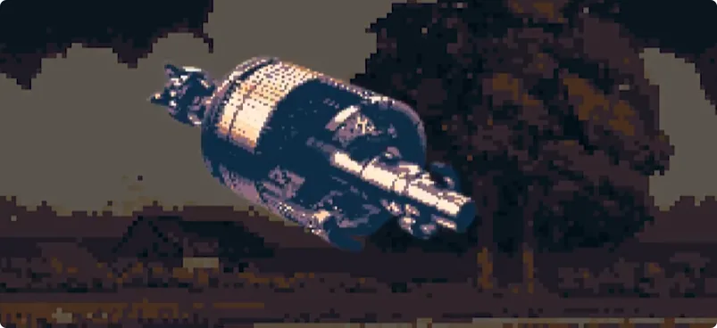
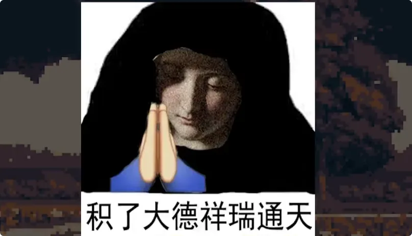
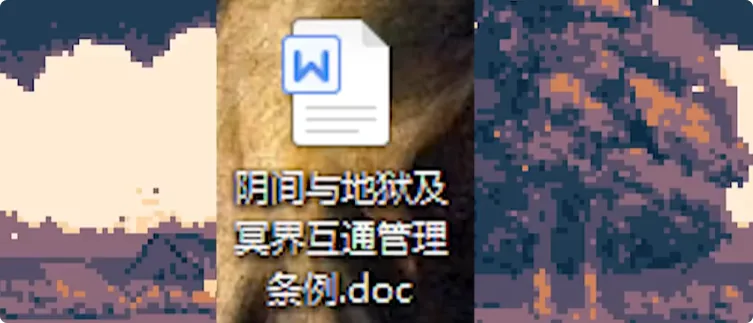

> _**上辈子没说完的阴间建设指南，这辈子继续讲。**_
> 
> _**这一期不讲最复杂的阴间机械操作规范，先讲阴间最吓人的玩意儿——功德机到底是怎么刷的。**_

## 1. 功德机是什么：从人工积德，到“赛博刷功德”

记了大阴德。
这一期咱们来谈谈上辈子没说完的**阴间建设指南**。

上辈子我说这个阴间机械操作规范的时候，就被拉去转生了。所以这辈子咱们先不谈那个，来谈谈这个阴间最吓人的玩意儿：

> **功德机的工作原理和操作。**

首先，咱们了解一下什么是**功德机**。

刷功德机，各位应该都见过。早期的功德机比较简单，就是水车版：两条鱼借助当时放生系统还没有大修的 BUG，反复循环“放生”来刷功德。

后来无刷电机发展得太快，就出了一个案子。

---

## 2. 第一代功德机：两条鲟鱼，把功德刷到了“比地藏王还高”

传说有一位民间科学家，考虑到自己下去以后还想找爱因斯坦，再顺便改进一下费马大定理，于是给功德机装上了一个**3000 转的马达**。

选的还是产卵期的鲟鱼。
结果阴间系统直接爆了。

因为按照当时的规则，**鱼卵也被计入放生功德**。

按当时这段故事里的统计数据，两条鲟鱼合计有约**70万粒卵**。电机转一圈，就是70万功德。

这位当事鬼把电机一开，结果忘记关了。
后来地府管理中心发现：

> “不对劲。”

好家伙。

> _**这是出了个神了。**_

功德百来个亿，甚至比地藏王还多一点。
于是地府开始查数据。

一查，果然出事了。
但麻烦就在于：**数据已经写进系统了。**
所以当晚只能连夜修系统，把这个 BUG 堵上。
自此以后，第一代功德机正式成为历史。

---

## 3. 第二代功德机：硬盘循环《大悲咒》，最后被 M.2 干成了“DDoS”

第一代的漏洞被封以后，很快又有人搞出了**第二代功德机**。
这一次，走的是西天那边的代理路线。

具体操作非常简单：

> **在硬盘里循环播放《大悲咒》，转一圈刷一次功德。**

因为中间有一个代理路线，所以产生的是持续、小流量的功德。
不像第一代那样一下刷几个亿，比较讲究：

> **细水长流，偷偷奶。**

因此一开始一直没有出事。
直到后来，出现了一个东西：

> **M.2 硬盘。**

然后工作室也开始进场，直接搞起了批量代刷功德。
这下西天那边的线路顶不住了。
流量实在太大，系统直接判断成了：

> **DDoS 攻击。**

于是之前那一批刷功德的人，账号全被封了。
所以第二代功德机的历史其实也很短暂，属于：

> **昙花一现。**

---

## 4. 第三代功德机：烧冥币、搞通胀，再靠“环保功德”套利

再往后，就到了**第三代功德机**。
这一代就比较复杂了。
先前一、二代的操作原理，主要集中在**数据层面**，走的是小功德、长流量路线，追求稳定。
第三代就完全不一样。

第三代功德机讲究的是：

> _**大功德，锣鼓喧天。**_

具体操作，是在**中元节和清明节**的时候烧空包，然后烧大量冥币，直接冲击地府金融系统，制造通货膨胀。
紧接着利用空包退货，再结合阳间、阴间之间的汇率变化，相当于几乎免费把空包复原回来。
这里最关键的地方是什么呢？

>**碳排放。**

因为烧空包会产生碳排放。
但按照故事里的地府条例，清明节和中元节这两天，碳排放不计入扣功德的行列。

所以：

> 烧掉空包——不扣功德；
> 
> 复原空包——减少碳排放；
> 
> 减少碳排放——加环保功德。

也就是说：

> **一来一回，原有功德几乎没变，但额外的环保功德却被系统加上去了。**

更离谱的是，环保本来还是当时地府**四大功德扶持产业之一**，所以给的额外功德特别多。

### 为什么第三代最后还是被封了

这个方法刚开始的时候还真能用。
但过了一阵，地府又觉得不对了：

> _**怎么过个节，人就成佛了？**_

于是暂停功德记录，准备开始查。

结果就在暂停之前，又有一个刚从国外回来的兄弟，因为**本初子午线和时区的原因**，烧功德晚了一天。
于是，大量本来不应该再出现的功德数据，又突然冒了出来。
这一下漏洞彻底暴露。
地府把第三代功德机也修了，同时直接取消了当时的**环保大项**。

于是：

> **第三代功德机，正式失效。**

---

## 5. 第四代功德机：真正高级的玩法，是“功德对刷”

今天真正要讲的是：

> **第四代功德机。**

与之前的单一功德机不同，这一代被称为：

> **功德对刷模式。**

而且操作人员不能只有一个，至少需要两个。
第四代功德对刷模式比较复杂。
它利用的是：
1. **阴间与地狱的功德记录不在同一个系统；**
2. **不同系统之间存在记录时间差；**
3. 再配合“**救人一命，胜造七级浮屠**”这套底层逻辑。

“救人一命，胜造七级浮屠”是确有流传的传统俗语，至少见于《增广贤文》，明代《醒世恒言》等作品中也有相关用例。([古诗文网](https://m.gushiwen.cn/mingju/juv_1810dbd80386.aspx?utm_source=chatgpt.com "\"救人一命，胜造七级浮屠。\"出处及意思_古文岛_原古诗文网"))

### 第四代操作流程

首先，找一位**修女**，然后准备一桶鱼。

不过鱼要注意。

入侵物种以及可能破坏当地生态圈的品种不行，最好的选择是**四大家鱼或者泥鳅**。你要乱放别的，多半不是加功德，而是直接倒扣。

然后按照下面四步操作：

1. **辱骂或羞辱修女。**方法很多，选择效率最高的即可。
    
2. **让修女判你下地狱。**
3. **忏悔，让修女为你祈祷，但是不要收回此前的审判。**
    
4. **等修女离开以后，开始放生鱼。**

这四步下来，按照这套系统漏洞，这辈子的功德基本就不用愁了。

而且即使你每天按照这个方法刷，最后下去的时候，数值也不会高得特别离谱。
系统最后大概率只会认为：

> **这是一个长期行善积德的好人。**

可能各位还不能理解它到底是怎么做到的。
接下来就讲真正的操作原理。

---

## 6. 第四代最核心的漏洞：两个系统同时记账，却没有实时同步

首先，为什么一定要找修女？
因为修女属于**宗教角色**。

按照这篇故事里所谓的《第二版阴间与地狱及冥界互通管理条例》第三条：

> 修女、祭司、僧侣、阿訇等合法注册的神职人员，相关功德由所属宗教对应部门进行记录。
> 
> 神职人员本身的功德，依照国籍与宗教分开计算，需在死后独立申报，进行三方核实比对。
> 

简单来说：

> **当你找修女，并且正在和修女沟通的时候，你这一段时间产生的功德数据，被记录到了地狱那边。**
> 
> **阴间暂时没有你的这一部分记录。**

这就是第四代功德机的基础。

### 第一步：先把自己变成“罪人”

第一步辱骂或者羞辱修女，就是为了：

> **减掉你在地狱系统里的功德。**

让自己先成为罪人。

### 第二步：把负功德转到修女身上

接着进入第二步。
让修女审判你下地狱。
按照故事中所谓初版《地狱管理条例》的设定：

> *神职人员审判罪人下地狱以后，罪人的功德自动叠加到神职人员身上。不论多少、好坏，神职人员需要替罪人承担罪过，等待死后统一结算。*
> 

所以做到第二步的时候：
- 修女身上的功德是负的；
- 由于地狱和阴间存在系统录入时间差；
- 你的负功德又暂时没有完全移交过去。

于是双方同时处于一种：

> **“要下地狱”的状态。**

### 第三步：忏悔，但千万不能撤回审判

接下来就是第三步：

> **忏悔。**

按照这套虚构条例的逻辑，神职人员接受**非地狱地区人口**的忏悔，被视作额外工作，因此增加功德。

这个很好理解。
因为咱们以后本来决定去阴间，又不是去地狱，所以属于“非地狱地区人口”。
忏悔以后，修女获得一笔功德。
紧接着再让她祈祷。
祈祷属于保险操作：

> **主动制造一个微量功德波动，把刚才那些操作正式写进系统。**

以免前三秒操作速度太快，数据库还没来得及记录。
但是这里有一个最关键的要求：

> _**绝对不要让修女收回“你要下地狱”的审判。**_

这就是整个第四代功德对刷机最核心的地方。

为什么？
因为没有收回审判，所以：

> **你仍然是一个“准备下地狱的罪人”。**

但是修女在第二步的时候已经接收了你的负功德，所以她在那个时间点也是“罪人”。
而到了第三步，经过你的忏悔，她又获得了新的功德。
于是：

> **她从“罪人”状态脱离出来了。**

那这意味着什么？
意味着：

> _**你把一个人从罪业状态中救出来了。**_

而“救人一命，胜造七级浮屠”。
放一车鱼，都未必有这么多功德。
更何况对方还是神职人员，所以按这套系统设定，功德还会更高。
于是做完第三步时，你就成为了一个非常奇怪的存在：

> _**一个拥有巨大功德，却仍处于“要下地狱”状态的罪人。**_

---

## 7. 第四步为什么必须放生：把地狱系统里的功德“搬回阴间”

问题来了。
我们为什么要下地狱？
因为：

> **修女审判了我们。**

但我们实际上需要下地狱吗？
不需要。
因为按照这个设定，我们属于：

> **非地狱地区人口。**

所以整套流程下来，前面的功德和罪业变化，主要都记录在地狱系统里。
但是我们最终真正要用的功德，是记录在：

> **阴间系统。**

这就是为什么必须做第四步。
首先，让修女离开。
只有修女离开，我们才能重新和阴间系统对接，因为在这套设定里：

> **神职人员的记录优先级比较高。**

等修女走掉以后：

> **开始放生鱼。**

这时候，系统看到的画面是什么？
一个人。
站在河边。
正在放生。

但是由于阴间系统并不完整记录此前地狱与冥界系统内部发生的全部过程，于是在它自己的视角里，就变成了：

> _**一个人独自在河边放生，同时还救了一个身份未知的人。**_

于是系统开始：

> **直接加功德。**

至此，整个四代功德对刷的循环就闭合了。
按照这套故事逻辑，这个版本非常稳定。
除非以后管理条例再次调整，或者出现新的功德活动，不然已经属于目前版本相当完善的一套打法。

---

## 8. 别只会刷：阴间系统也是会“封号”的

前半部分讲完了四代最典型的刷功德方式。
接下来还是得普及一下：

> **阴间法律以及限制活动。**

免得各位刷功德的时候，版本没对上，最后直接被封号。
虽然封号以后，下去还是可以找我这种中间人处理，但到那个时候就比较麻烦了。
所以还是：

> **防范于未然。**

阴间的法律比较杂，以后有机会再细细解读。
今天先讲封号。
按照这篇故事里所谓《阴间功德计算标准》最新补充版的设定，所谓“封号”主要有三种：
1. **剥夺下辈子的轮回权。**先在阴间老老实实干活补偿，补完以后再说。
2. **增加阳间霉运。**具体表现，就是找两个小鬼跟着你，让你倒霉。这种比较烦。
3. **直接让你出点事，下去配合调查。**至于最后还能不能上得来，各位心里应该还是有点数。

不过封号这件事，正常情况下其实不会随便出现。
各位应该记得《国际歌》里那一句：

> _**“从来就没有什么救世主，也不靠神仙皇帝。”**_

这句歌词校对无误，现行常见中文译本即作此句。([维基文库](https://zh.wikisource.org/zh-hans/%E5%9C%8B%E9%9A%9B%E6%AD%8C_%28%E8%90%A7%E4%B8%89%29?utm_source=chatgpt.com "国际歌 (萧三) - 维基文库，自由的图书馆"))
按照这篇故事里的设定，阴间管理在1949年以后也逐渐变得“科学民主”起来。

旧时代那套封建管理，不适用于新时代。
所以这玩意儿并不是一只悬在头顶上的手，可以把人随意揉捏。
只有一个人做得实在太过分的时候，才会出现阳间**所谓的报应**，也就是封号。

比如资本家被丢高炉里。

> **这又何尝不是一种封号呢？**

只是执行封号的人，是咱们底层人民。
结果都是一样的。
有时候只是系统延迟，封号来得晚一点。
顺带一提：

下去以后，虽然封号通常得找我这种中间人处理，但我其实也帮不上多大的忙。

> _**自己造的孽，自己还是得还。**_

我最多也就是来回跑跑，取证、找材料而已。

---

## 9. 功德到底怎么算：看的不是动作，而是“对社会的最终反馈”

至于现实活动，那就比较多了。
各个时期，都有各个时期计算功德的方法。
比如投机倒把、当买办，平时扣的功德可能就比特殊时期少；和平年代和政治运动年代，计算标准也可能不同。

同样：

> **防疫时期，不出门可能就能加功德；**
> 
> **平常不出门，系统当然不会额外给你加。**

简单来说，真正决定功德增加还是减少的，是：

> _**你对整个社会形成的反馈，究竟是正面的还是负面的。**_

不过这里面还有一个比较潜规则的规定。
一般中间人不会告诉你们。

就是：

> **你做的事情本身虽然可能不太好，但系统最终看的，可能是整个事件产生的综合社会反馈。**

比如我最开始讲的一代功德机。
把鱼绑着疯狂转，对鱼来说显然不是什么好事，理论上应该减功德。
但是：
它给大家带来了乐子。
同时又拉动了几个电机店以及五金店的收入。
于是整体反馈居然还不错。
所以最后那位兄弟下去的时候：

> **功德不增不减。**

### 为什么“缺德的乐子”有时候反而可能加功德

再比如我上网钓鱼。
众所周知：

> “钓的是鱼，没的是那啥。”

但是如果我钩子实在太直，直得过于恶心，结果所有人都看出来我在钓鱼，最后形成的乐子反而远大于真正被钓造成的负面影响。

那么：

> **功德指不定还能加一点。**

所以各位也没必要太纠结自己的功德到底有多少。
大部分普通人这辈子所有功德加起来，可能还不如资本家倒一次牛奶**减得多**。
至于下辈子轮回成什么样：

> **都是缘分。**
> 
> **也都是在这个地球上的一次新体验。**

---

## 10. 结尾：功德机可以更新，但阴间版本永远比你想得快

这期就先这样。
我回头还得和下面交接一下工作。
之后再跟各位好好聊聊：

> **上辈子没有说完的那些东西。**

> _**功德机从第一代刷到第四代，真正没变的其实只有一件事情：只要规则存在，就总会有人研究规则；只要系统存在，就总会有人寻找 BUG。**_

