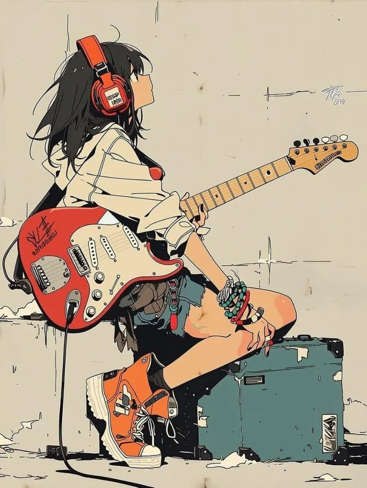
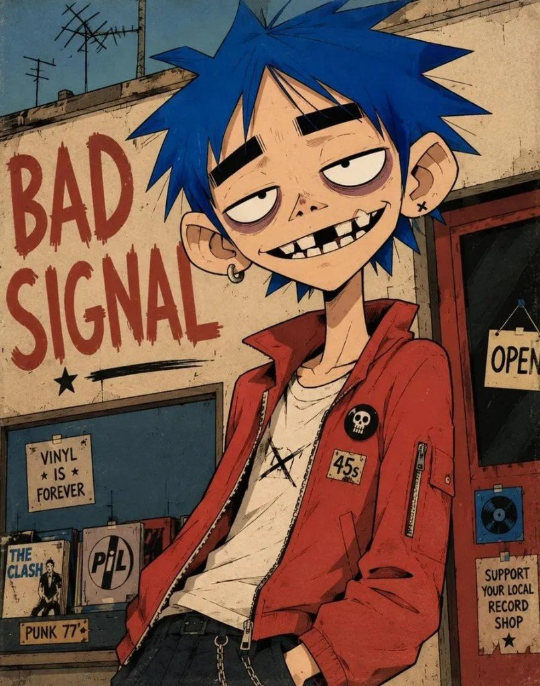
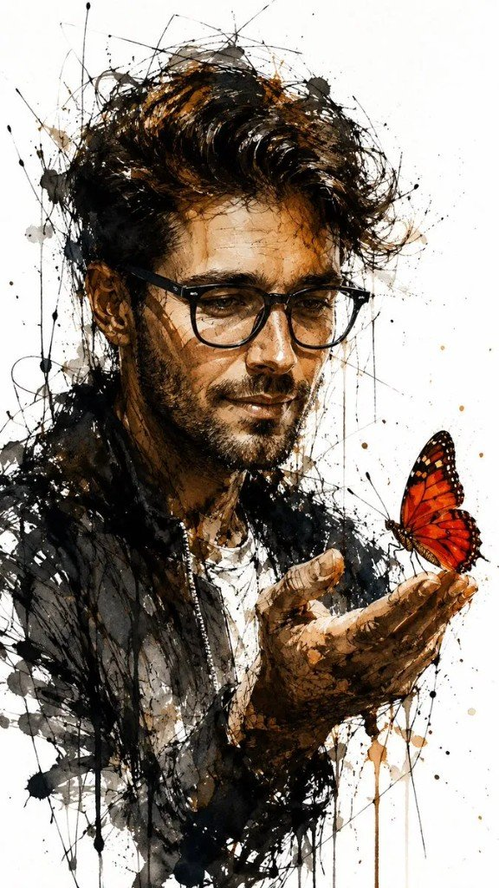
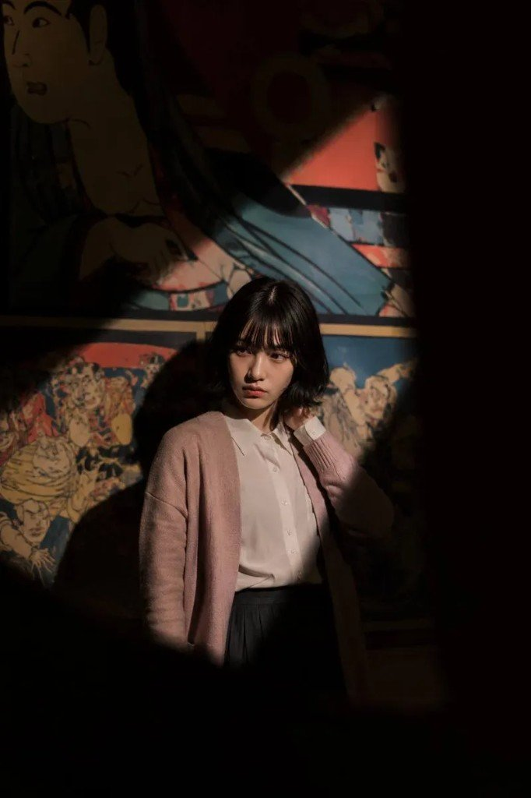

公众号甩了四组 GPT Image 2（作者口径）提示词 + 七张示例。完整口令留在源素材里，这里只留对照骨架、可改槽位、身份一致性怎么钉。

同模型案例合集（玩法盘点 55–75）和「七种高张力海报」是另一类货——配方库 / 海报张力 ≠ 本篇四风格骨架；旁链一眼，别整包并进来。站内已发的 [UI 分层切图](/posts/gpt-image2-ui-layer-slice/) 也是同模型、另一条交付线。

## 四风格对照

| # | 风格 | 视觉锚 | 比例 / 参考 | 真正可复用的旋钮 |
|---|---|---|---|---|
| 1 | 极简动漫吉他少女 | Lo-fi × 吉卜力 × 新海诚；珊瑚橙 Strat、红耳机、米色卫衣 | 横幅插画感；奶油底留白 | 发色 / 乐器色 / 服装件套；线稿+赛璐珞+粉彩点缀先钉死 |
| 2 | 另类图形角色 | 夸张五官、硬边赛璐珞、旧纸纹理 | 4:5 | `[CLOTHING]` / `[BACKGROUND]` / `[TEXT]` 三槽；脸型牙缝结构别动 |
| 3 | 水墨水彩肖像 | 狂墨线 + 暖棕赭水彩 + 红橙蝴蝶 | `--ar 9:16`；可上传人像 | 「主体身份」用参考图；蝴蝶色 / 负空间白底当对比旋钮 |
| 4 | 博物馆展览肖像 | 对角聚光、日式壁画、Portra | 中近景；身份一致性参考图 | 服装色块 + 光束方向 + 负面提示；脸/发型锁参考 |

## 槽位怎么写（别整段重写）

另类角色是本包最「模板」的一组：脸与线稿语法固定，换三槽就出系列海报。

| 槽位 | 干什么 | 成图示例 |
|---|---|---|
| `[CLOTHING]` | 宽大图形块衣服 + 少褶皱 | 连帽衫 / 背心 / 外套…… |
| `[BACKGROUND]` | 大面积平涂底，细节克制 | 色块墙、抽象平面 |
| `[TEXT]` | 粗糙手绘大字 | BAD SIGNAL · PERMANENT VACATION · MAKE NOISE |

吉他少女没有方括号槽，但可变项同样清晰：发色（黑 / 棕两变体）、Strat 珊瑚色、耳机红、米色连帽衫——改一项就能出变体，不必推翻「Lo-fi + 吉卜力 + 新海诚」句。

水墨组把主体写成「男人（已上传图片）」——口令默认走图生/参考；没参考就先换成具体外貌描述，别空喊「男人」。

## 身份一致性：博物馆组在教什么

第 4 组开头不是氛围词，是合同：

1. 先喂参考图，再写场景
2. 明示锁定：面部、发型、刘海、比例、肤色、姿态、轮廓
3. 场景侧用对角聚光 + 日式壁画 + Portra 胶片拉情绪
4. 负面提示清动漫/多肢体/霓虹/糊脸——写实肖像比插画更吃这一刀

商用前：参考人脸与示例图都要过授权；本帖示例只供学习，不授权二创出货。

## 什么时候抄哪一套

- 要干净二次元海报、好物点缀清楚 → 吉他少女
- 要角色 IP / 系列字报、同一张脸换衣服换标语 → 另类图形 + 三槽
- 要手绘感肖像、竖版封面 → 水墨水彩 + 9:16
- 要电影感环境人像、同一个人多场景 → 博物馆 + 参考图锁身份

完整四段 Prompt 与七张原图顺序映射见源素材；未在本机重跑生图。玩法盘点 / 高张力海报仍待发布，链接后补。
