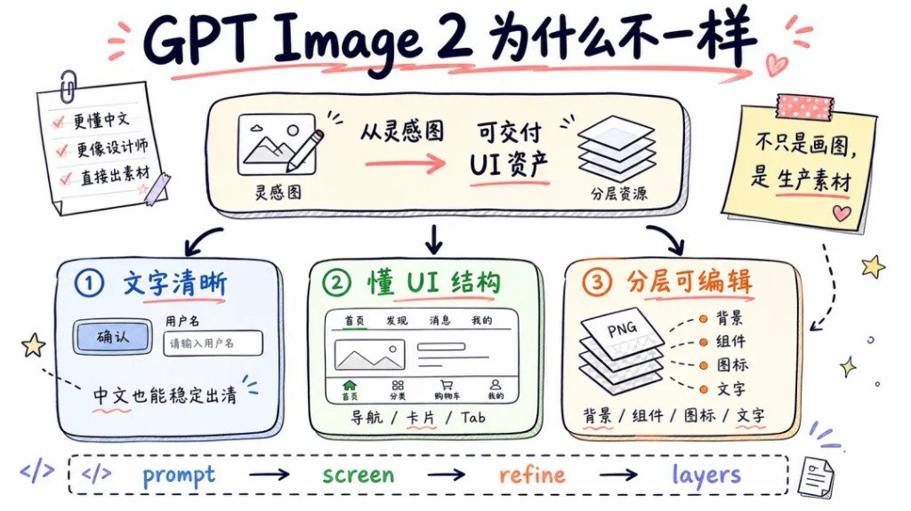
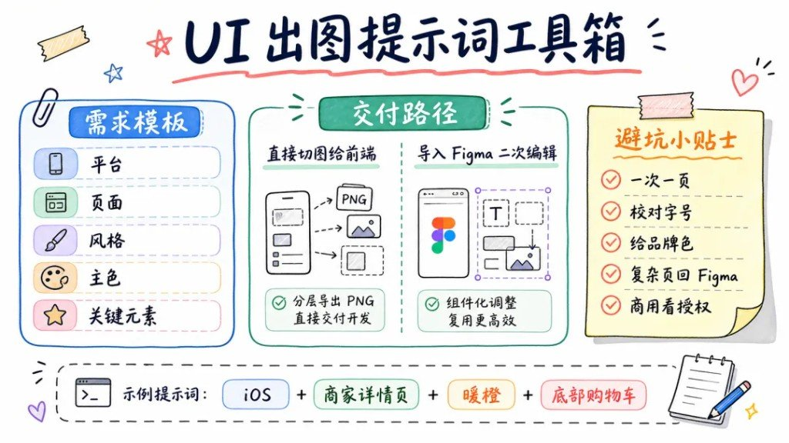

以前拿 AI 出 UI，多半是「看起来像 App」的一张扁图：中文糊、结构飘、前端没法拆。GPT Image 2 这次把口子拧到交付侧——文字能读、懂导航/卡片/Tab，还能按背景 / 组件 / 图标 / 文字分层导出。跑通一轮大约三分钟：先把整体对上，再抠细节，最后交切图。

---

## 为什么这次不一样

图面原话写得很直：**不只是画图，是生产素材**。左边便签三条：更懂中文、更像设计师、直接出素材。中间那条箭头才是重点——从灵感图到可交付 UI 资产（分层资源）。



三刀能力，对照着用：

| 能力 | 图面说法 | 你要盯的结果 |
|---|---|---|
| 文字清晰 | 中文也能稳定出清 | 按钮「确认」、输入框「请输入用户名」一类字能直接读 |
| 懂 UI 结构 | 导航 / 卡片 / Tab | 顶栏、内容区、底栏各归其位，不是一张海报硬塞控件 |
| 分层可编辑 | 背景 / 组件 / 图标 / 文字 | 导出 PNG 分层，能改、能交、能进 Figma |

底下一行流程也写死了：`prompt → screen → refine → layers`。别指望一句提示词同时搞定构图和像素级细节。

---

## 3 分钟四步

口诀跟图底虚线框一致：**整体先对 → 再抠细节 → 最后交付切图**。


| 步 | 耗时（图面） | 你该干什么 |
|---|---|---|
| ① 描述需求 | 30s | 钉死平台 / 页面 / 风格 / 主色 / 关键元素 |
| ② 生成主界面 | 40s | **先看大结构**，别急着抠图标圆角 |
| ③ 局部精修 | 60s | **一次只改一个点** |
| ④ 分层导出 | 50s | 背景 · 组件 · 图标 · 文字 分开出 |

### 需求模板（五字段）

图里空白框就是这五项，先填满再喂模型：

```text
平台：
页面：
风格：
主色：
关键元素：
```

成句版（把五项串进一句需求单）：

```text
请设计一个【平台】的【页面】。
风格：【风格】
主色：【主色】
关键元素：【关键元素，逗号分隔】
要求：中文文字清晰可读；界面具备真实 App 的导航 / 卡片 / Tab 结构；输出适合后续分层（背景 / 组件 / 图标 / 文字）。
```

### 精修例句（一次一个点）

```text
只修改底部导航的图标样式，其它布局、配色、文案全部保持不变。
```

```text
只把主操作按钮改成暖橙色高亮，卡片与顶栏不动。
```

```text
只校正标题字号层级（更大标题、更小辅助说明），不要改版式结构。
```

### 双交付路径

| 路径 | 图面说法 | 适合何时 |
|---|---|---|
| 直接切图给前端 | 分层导出 PNG 直接交付开发 | 结构已定、要快速进开发 |
| 导入 Figma 二次编辑 | 组件化调整，复用更高效 | 还要改文案、对齐品牌组件库 |

---

## 外卖商家详情页完整示例

工具箱底部示例组合 verbatim：**iOS + 商家详情页 + 暖橙 + 底部购物车**。下面按五字段填满，可直接粘贴开跑。

```text
请设计一个 iOS 外卖 App 的商家详情页。
风格：现代清爽、偏餐饮食欲感，信息层级清楚
主色：暖橙
关键元素：顶部商家头图与评分、菜品列表卡片、优惠标签、底部固定购物车栏（含合计与去结算）
要求：中文文字清晰可读；顶栏 / 内容卡片 / 底部栏结构完整；适合后续按背景、组件、图标、文字分层导出。
禁止：文字乱码、控件挤成一团、把整页画成海报、一次塞多个无关页面。
```

精修可以接着丢：

```text
在上一版基础上，只加强底部购物车栏的暖橙高亮与「去结算」按钮对比度，其它区域保持不变。
```

交付时二选一：分层 PNG 直接给前端；或导入 Figma 把购物车、菜品卡做成可复用组件。

---

## 提示词速查表

先看整张工具箱，再按下表取词。



### 风格关键词

| 方向 | 可拼词 |
|---|---|
| 清爽工具感 | 现代扁平、大量留白、细分割线、低阴影 |
| 餐饮食欲 | 暖色点缀、食物摄影质感、圆角卡片、轻投影 |
| 高端克制 | 低饱和、强层级、少装饰、品牌主色点到为止 |

### 结构关键词

| 模块 | 可拼词 |
|---|---|
| 导航 | 顶部导航、底部 Tab、返回与标题栏 |
| 内容 | 卡片列表、双列网格、分段标题、空状态 |
| 操作 | 主按钮、次按钮、底部固定栏、角标 |

### 输出控制关键词

| 目的 | 可拼词 |
|---|---|
| 文字 | 中文清晰可读、禁止乱码、字号层级明确 |
| 结构 | 真实 App UI、导航/卡片/Tab、单页单屏 |
| 分层 | 可分层导出、背景/组件/图标/文字分离、透明底 PNG |
| 边界 | 一次只出一页、不要海报构图、保持上版未改区域不变 |

短拼示例（与图底一致）：

```text
iOS + 商家详情页 + 暖橙 + 底部购物车
```

---

## 避坑：五条就够卡住质量

图面「避坑小贴士」五条，照做：

1. **一次一页** —— 多页同屏生成，结构和文字都会糊。
2. **校对字号** —— 模型偶尔把辅助说明写得比标题还大，过一眼层级。
3. **给品牌色** —— 不写主色就容易落到默认蓝紫；暖橙、品牌 HEX 写进提示词。
4. **复杂页回 Figma** —— 多状态、长列表、设计系统对齐，分层进 Figma 再组件化。
5. **商用看授权** —— 出图能用 ≠ 账号/平台条款允许商用，交付前自己核。

再叠一句四步纪律：**一次只改一个点**。结构还飘就回头改需求，别在精修里 simultaneous 改五个地方。

---

## 认清你要的是灵感还是切图

GPT Image 2 在 UI 这条线上，值钱的不是「又一张好看的手机框」，而是：**字能读、结构像真 App、层能拆开交给人或前端**。三分钟四步够你验证方向；真要进生产，复杂页回 Figma、商用核授权，这两步别省。

### 旁链（不合并）

| 你想解决的事 | 去哪篇 |
|---|---|
| 案例合集抄板子（55–75） | GPT Image2 案例 55–75（待发布） |
| 海报要「狠」 | 七种高张力海报（待发布） |
| 前端别 AI 紫 | Taste Skill 反模板审美（待发布） |
| 好图怎么反推 | AI 图片提示词反推公式（待发布） |
| 卡通文旅海报 | [五个槽填完就能出图](/posts/gpt-cartoon-travel-poster-prompt/) |