上个月 Datawhale 才发过 Loop Engineering 的实操手册，新词已经换挡了。

7 月初 OpenClaw 创始人 Peter Steinberger 在 X 上问：还在聊 loop，还是已经切到 graph 了？没多久就有人跟帖喊「Loop Engineering is dead. Long live Graph Engineering!」。

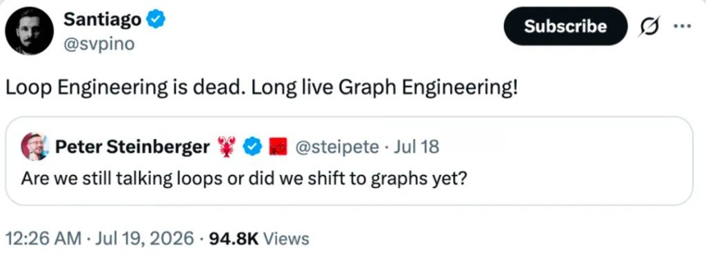

所以 Graph Engineering 到底是什么？

Datawhale 把 Codez（@0xCodez）总结的 **14 步**整理出来，课程横幅互动量到了全网约 **570w** 量级————讲的就是怎么从一个人的 loop，走到一张能自己路由的 graph。

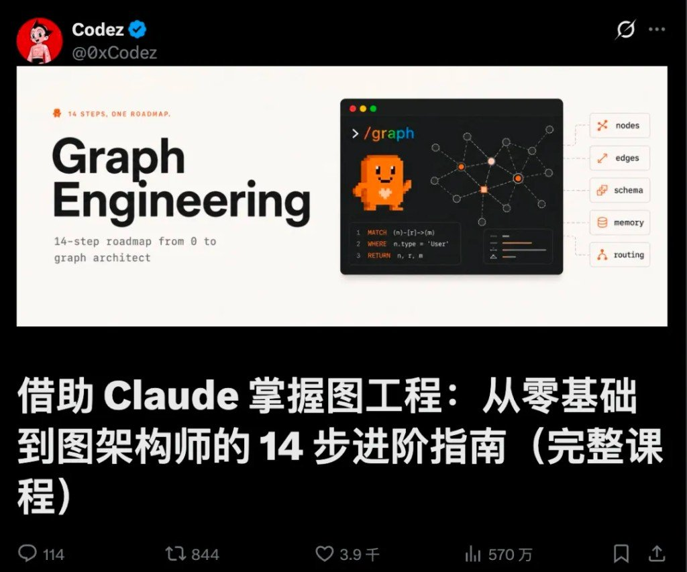

Graph 不是 loop 的升级版，是 **loop 的组织方式**。它烧的 token 比单个 loop 更多，协调开销也更高；出了问题你要 debug 的是一整张你没亲眼看着跑的路由图。所以先问自己四个问题，都想清楚再动手。

---

## 动手前四问（外加一道更狠的）

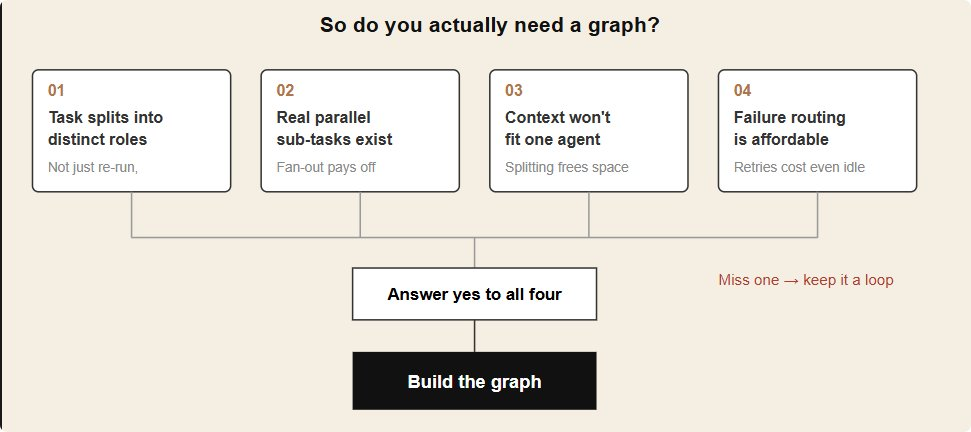

1. **任务真的能拆成不同角色吗？** 拆不出清晰的「谁负责什么」，那就还是一个 loop————加节点只是加成本。
2. **有没有真正能并行的子任务？** 没有独立并行的活，图比循环贵，却不比循环快。
3. **单个 agent 的上下文装得下全部背景吗？** 装得下就别急着拆；拆分是为了腾出上下文，不是为了好看。
4. **失败之后，你负担得起跳转分支的成本吗？** 没想清楚重试耗尽后去哪，图会在你看不见的地方卡死或者乱跑。

附加题，比上面四个都重要：**你已经有一个跑得稳的单体 loop 了吗？** 没有，先别建图。图是循环的组织方式，不是循环的替代品。

单体 loop 长什么样，可以先把「被观察的 agent」拆开看一眼————Thought → Action → Execution → Reflection → Alignment，再反馈回 Thought。这一圈都跑不稳，连图只是把噪声放大。

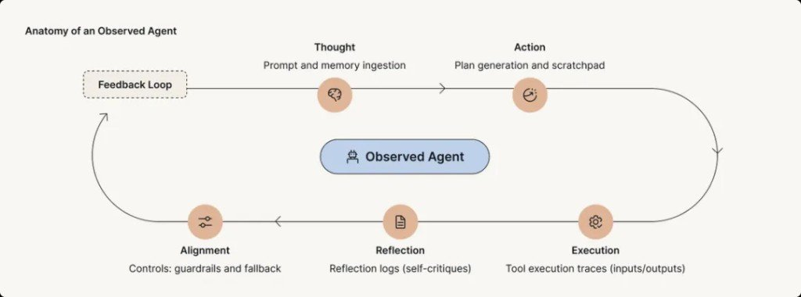

**谁适合上手**

已经把至少一个 loop 跑稳的团队；任务里有明确能拆开的角色（调研、撰写、复核）；也接受更高的 token 成本换质量和并行度。

**谁不适合上手**

还没让一个 loop 稳定跑起来的个人开发者；线性依赖强、拆不开的任务；瓶颈在协调开销而不在单节点能力的团队。

graph engineering 真有用，但大部分人现在还用不上————因为大部分人的 loop 都还没跑稳，更别提图。

---

## 四个核心构件

一张能跑的图，拆开来看，就是四个能各自单独验证的部分。

**Nodes：图的最小单位。** 一个节点就是一个跑着自己 loop 的 agent 或确定性步骤，只认一件事，也只对一件事负责。节点判断不出「完了」，就不是节点，是隐藏依赖。

**Edges：决定谁接下一棒。** 顺序边永远触发；条件边看检查结果；并行边一次分给多个节点，再汇到一个节点合并。边留给模型运行时判断得越多，图越灵活，但也越难预判。

**Shared State：大家都要读写的那份数据。** 下游节点要用的字段，必须有上游节点写进去。这个对象会逼你承认：这活儿里到底还有多少环节没被真正想清楚。

Subagents 和 Agent Teams 的差别，很大一块就落在「有没有共享任务态」上：左边是主控 spawn、结果汇报回来；右边是 Shared Task List + teammate 互认任务。

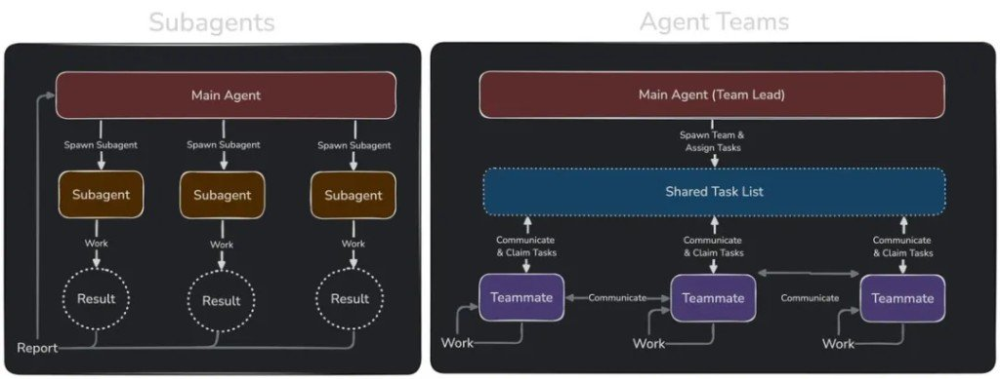

**Failure Routing：失败之后的退路。** 一个节点的重试耗尽了，控制权去哪————退回上一步、转给备用节点，还是转人工。没有失败边的图，只是一张流程图，不是一个能跑的系统。

图还可以按层次看：数据流 → 任务调度 → 架构部署（下图是嵌入式 AADL 语境的三层类比，用来建立「同一张图可以有多层投影」的直觉，不是 Claude Code API 本身）。

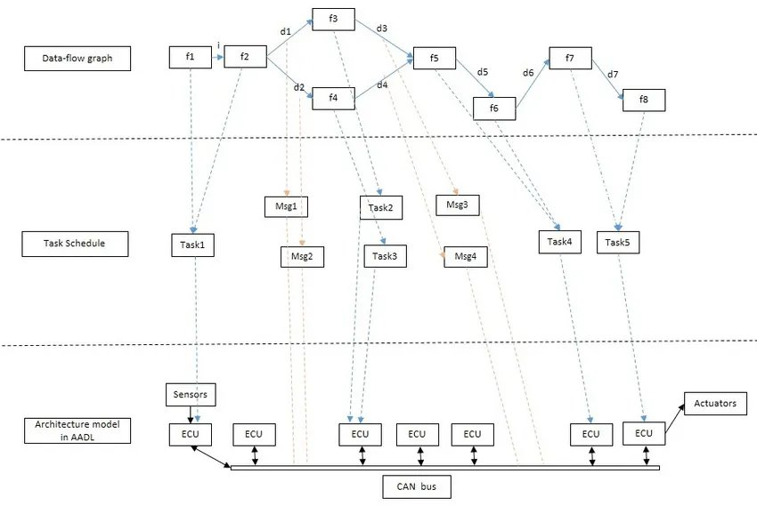

---

## 第一步：先分清节点和边（01–02）

### 01 · 节点是任务，边负责传数据

一张图其实只有两样东西。**节点**是一个工作单元：一个 agent，一份边界明确的活，一个输入，一个输出。**边**是依赖关系：这个节点的输出会喂给那个节点做输入，仅此而已。

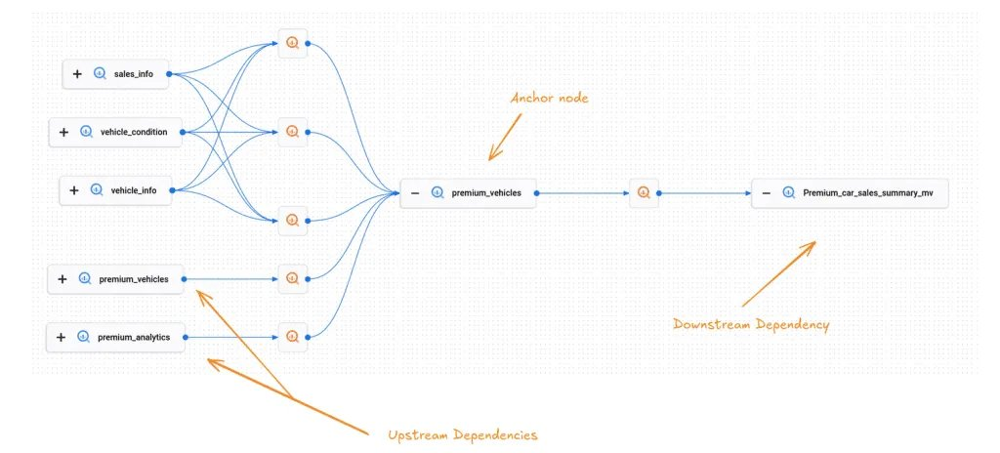

最容易犯的错，是把「然后」当成边。「总结这个文件，然后告诉我天气」————这两步之间没有边，天气根本用不到那份总结。这其实是两个互不相干的节点，被一段线性脚本硬凑成了先后顺序。没真用上数据，就没有边。

学会对每一个「然后再」发问：**下一步是否读取上一步的输出？** 若否，就没有边，等待就是浪费。

### 02 · 你的线性脚本，其实是一张退化的图

当你把一个 agent 写成「先做 A，再做 B，再做 C，再做 D」，其实你已经画出了一张图————只不过是一条不分岔的单链，每个节点都只有一条边进、一条边出。能跑对，但慢，也脆：C 卡住了，D 就永远轮不到，A 的产出也被困在上游。

图工程的第一项真本事，是**重画这条链**。对每一根箭头问上一步的那个问题。大多数链里都有两三根箭头根本没有携带数据————它们只是当初写的时候顺手打的顺序。把这些箭头剪掉，链就会塌缩成更宽的东西：几个可以同时跑的独立节点，喂给一个需要它们全部到齐的节点。

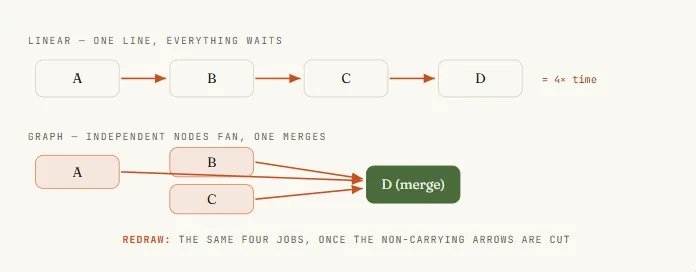

---

## 第二步：给节点和边定契约（03–04）

### 03 · 给每个节点定一份契约

一个你没法推理的节点，就没法拿去并行。解决办法是契约：**输入有边界，输出有边界，只干一件事。** 输入必须显式传进去，不能指望从共享窗口里蹭；输出是一个定义好的形状，最好能校验，这样下一个节点不用猜也能直接用。

在 workflow 里，这份契约靠 **schema** 强制执行。给 Claude 的 `agent()` 调用配一份 JSON schema，派出去的 subagent 就只能返回校验过的结构化数据————校验发生在工具调用这一层，格式不对 Claude 会自己重试，不会甩给你一堆自由文本。这就是「能接进图里的节点」和「只有人读得懂才行的节点」的差别。

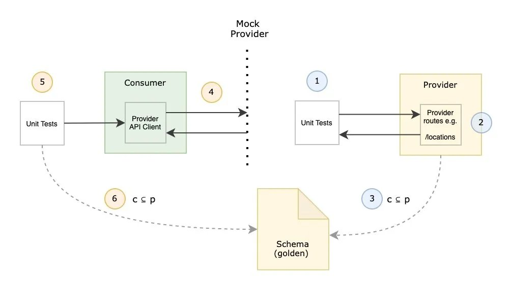

```js
// 一个有真契约的节点：输入有边界，输出经过校验，只干一件事
const ITEM = {
  type: 'object', additionalProperties: false,
  properties: {
    title:   { type: 'string' },
    url:     { type: 'string' },
    impact:  { type: 'string', enum: ['high', 'medium', 'low'] },
  },
  required: ['title', 'url', 'impact'],
};

const result = await agent(source.prompt, {
  label: `research:${source.key}`,
  schema: ITEM,     // 强制返回校验过的结构化数据
  agentType: 'general-purpose',
});
// result 现在是下一个节点能信任的形状，不用再靠人工解析
```

### 04 · 把边也当成一份数据契约

边不只是「B 排在 A 后面」，它是一个关于「传的是什么」的承诺：A 产出这个形状，B 就是照着这个形状设计来消费它的。按数据给边命名，而不是按顺序命名，两件事会立刻变简单：能一眼看出这条边是不是真的存在（有没有数据真的传过去）；也能在形状不变的前提下换掉边两端的节点，不会弄坏整张图。

实际写的时候，边就活在普通的 JavaScript 里。派活和合成之间那一步归约————压平、去重、过滤————就是代码在处理节点返回的形状，**不需要 agent**。图思维一个不太起眼但很重要的收获：很多人花模型 token 去做的事，其实就是一条边，而边是免费的。

---

## 第三步：扇出、汇入与菱形（05–07）

### 05 · 用 `parallel()` 扇出

这一步能把前面的投入都赚回来。手上有 N 个独立节点————N 个要核实的信源、N 个要审的文件、N 条要查的路由————不要把它们串起来跑，让 Claude 一次性派出去一起跑。

在 workflow 里对应的是 `parallel()`：Claude 拿到一组 thunk，给每个派一个 subagent，全部并发执行，最后把结果数组一次性还给你。

两个细节决定它稳不稳：

1. `parallel()` 是一道**屏障**，会等所有函数都跑完才返回，下一阶段看到的是完整集合。
2. 一个抛错的函数会被解析成 `null`，而不是拖垮整个批次————记得对结果做 `.filter(Boolean)`。

并发数大致按核数封顶，多出来的会排队；扔进去一百个函数它们都会跑完，只是每次跑一小批。

```js
phase('Research');

// 九个信源，九个 agent，同时开工
const raw = await parallel(
  SOURCES.map((s) => () =>
    agent(s.prompt, {
      label: `research:${s.key}`,
      phase: 'Research',
      schema: ITEM_SCHEMA,  // 每个节点都返回校验过的 JSON
      agentType: 'general-purpose',
    }),
  ),
);

const collected = raw.filter(Boolean); // 把失败 agent 留下的 null 过滤掉
```

派活这一步活在 Claude 写的**代码**里，不是活在一轮模型对话里。Claude 自己的上下文从来不会同时装着九个信源————每个 subagent 带着自己的一份，只有最终答案会传回来。编排这一层不花 token，因为它不是 Claude 又想了一轮。

### 06 · 在屏障处做汇入

活儿派出去，得有东西能收拢它才有意义。拢回来的这个节点，就是边汇聚的地方：一个 agent（或一段代码）一次性看到全部上游结果，去做一件必须看到全集才能做的事————跨信源去重、按影响力排序、总数为零就提前退出。这是整张图里**唯一值得让屏障付出等待成本**的地方。

```js
// 这条边就是普通 JS，没有 agent，零 token
const flat = collected.flatMap((c) => c.items);
log(`Collected ${flat.length} items`);

phase('Curate');
// 这个屏障节点需要全部结果凑齐才能去重排序
const curated = await agent(
  `Dedupe and rank these by impact:\n${JSON.stringify(flat)}`,
  { phase: 'Curate', schema: CURATED_SCHEMA },
);
```

只是把一个列表压平？那是一条边，直接写在行内就好。判断方法很粗暴：如果写成了 `parallel → transform → parallel`，中间那个 transform 又没有跨条目的依赖，那本该用流水线，完全不需要屏障。

### 07 · 菱形：拆分 → 工作 → 合并

把「派出去」和「拢回来」拼在一起，就得到几乎每张正经 agent 图里都会出现的主力拓扑：**菱形（diamond）**。一个节点拆任务，多个节点并行干活，一个节点合并。市场扫描、依赖审计、代码评审、研究报告，背后都是这个形状————换个信源和提示词，同一副骨架照样能用。

标准写法值得记住：**派发 → 归约 → 合成**。先派出去收集广度，用普通代码归约压缩，再用最后一个 agent 合成写出答案。看懂这颗菱形之后，就不会再问「怎么让 agent 多做几步」，而是会问「拆分点在哪，合并点在哪」————这才是真正能扩展的问题。

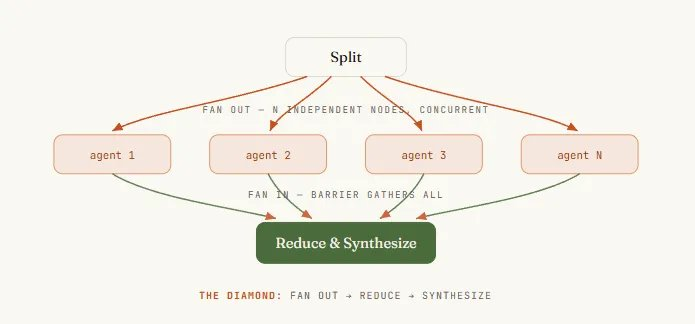

---

## 第四步：路由、验证与隔离（08–10）

### 08 · 用条件语句在运行时给边选路

不是每张图都是固定的。有时候走哪条边，取决于某个节点发现了什么。**路由节点**检查结果，决定走哪条下游路径：给工单分类后分流到对应处理节点；或者看 diff 大小，决定走快速评审还是完整审计。

在 workflow 里这就是一个普通的 `if` 或 `switch`，判断依据是某个节点校验过的输出————因为控制流本来就活在代码里。

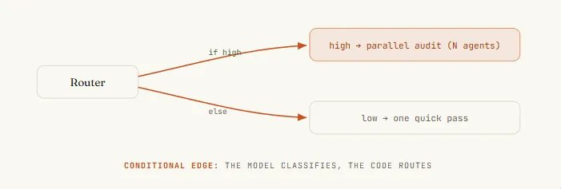

这正好是确定性变成优点而不是限制的地方。路由的**判断**可以由 Claude 完成（一个 subagent 负责分类），但**路由本身**是 Claude 写的代码————同样的分类结果每次都走同一条路。节点上拿到 Claude 的判断力，边上拿到脚本的可靠性；不会出现「Claude 自己决定跳过审计」这种意外————因为跳过这件事必须写进图里才会发生。

```js
// 路由节点：agent 负责分类，代码负责选边
const { severity } = await agent(
  `Classify this diff's risk:\n${diff}`,
  { schema: { type: 'object',
      properties: { severity: { enum: ['low', 'high'] } },
      required: ['severity'] } },
);

let review;
if (severity === 'high') {
  // 高风险路径：完整并行审计
  review = await parallel(FILES.map((f) => () => agent(`Audit ${f}`)));
} else {
  // 低风险路径：一次快速评审
  review = await agent(`Quick review of ${diff}`);
}
```

### 09 · 在边上放一个验证器

一张图真正的杠杆不是塞了更多 agent，而是能围绕结果搭起多少确定性。验证器节点蹲在一个结果被放行到下游之前，它唯一的工作就是试图推翻这个发现————扛住了就放行，扛不住就到不了最终答案。

三种模式值得掌握：

- **对抗式验证：** 给每个发现派 N 个独立的怀疑者，专门去反驳它；多数没被驳倒才算站得住。
- **多视角验证：** 让每个验证者盯不同的方面————正确性、安全性、能不能复现；角度越分散，越能揪出 N 个一样的检查都发现不了的问题。
- **评委制：** 从不同角度生成 N 个方案，用并行的评委打分，挑最好的一版作为主线，再把其他几版里的亮点揉进去。

真实团队在移植 Bun 运行时的时候，就是靠这套对抗式代码评审焊进循环，才做成的。

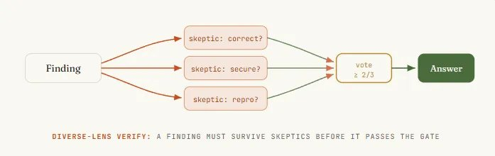

### 10 · 把节点隔离开，别让一个失败污染整张图

在一条链里，失败会级联：C 死了，D 就跑不起来，整条链停摆。在一张图里，失败本该被限制在它自己的节点里。

这一点已经部分成立：`parallel()` 里一个抛错的函数会被解析成 `null`，八个正常的 agent 照样能返回结果，一个坏的自己掉队————`.filter(Boolean)` 就是那道防线。把每一次汇入都设计成能容忍缺失的输入，而不是假设总能凑齐全集。

更隐蔽的失败，是节点之间互相踩到对方。多个 agent 并行写文件时可能会撞车。解法是隔离：用 **git worktree**，让每个 agent 在自己的一份工作区里干活，在沙盒里完成，再干净地合并回去。只在节点真的会并行写入的时候才用它————它是那种拓扑真正需要的安全带，不是每次运行都要交的税。

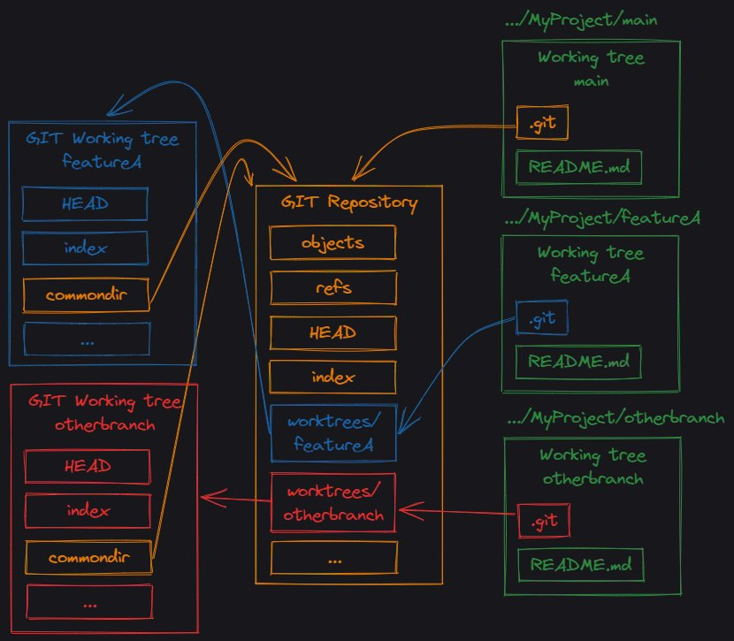

---

## 第五步：收敛循环、模型分层、pipeline vs barrier（11–13）

### 11 · 可以加一个循环，但一定要让它收敛

要是压根不知道这活儿有多大呢？只有真的做下去才知道：规模未知的探索，一次漏洞排查发现一个 bug 又带出三个新的。这时候需要一个循环————一条指回更早节点的、受控的边。

危险也很明显：一个不收敛的循环，就是一台不停派 agent 出去、直到预算耗尽才停的死循环机。

能收敛的写法叫**跑到干为止（loop-until-dry）**：持续派出发现者，直到连续 K 轮都没发现新东西，才停下来。真正决定成败的细节————也是几乎每个人第一次都会踩的坑————是拿什么去做去重比对。

要对着「见过的一切」去重，而不是只对着「已确认的结果」去重。不然被否掉的发现每一轮都会重新冒出来，循环永远跑不干，最后搭出的是一台专门花钱去反复发现同一批死胡同的机器。

```js
const seen = new Set(); const confirmed = []; let dry = 0;

while (dry < 2) {           // 连续两轮空手而归就停下
  const found = (await parallel(
    FINDERS.map((f) => () => agent(f.prompt, { schema: BUGS }))
  )).filter(Boolean).flatMap((r) => r.bugs);

  const fresh = found.filter((b) => !seen.has(key(b)));
  if (!fresh.length) { dry++; continue; }
  dry = 0;
  fresh.forEach((b) => seen.add(key(b))); // 对「见过的一切」去重，不是只对已确认的

  // 每个新发现都要过一轮多视角验证才算数
  const judged = await parallel(fresh.map((b) => () =>
    parallel(['correctness', 'security', 'repro'].map((lens) => () =>
      agent(`Judge "${b.desc}" via ${lens} — real?`, { schema: VERDICT })))
    .then((v) => ({ b, real: v.filter(Boolean).filter((x) => x.real).length >= 2 }))));

  confirmed.push(...judged.filter((v) => v.real).map((v) => v.b));
}
```

### 12 · 给不同节点分配不同档位的模型

不是每个节点都需要最好的模型。一张图会用单个 agent 永远做不到的方式，把这件事摆明白：有些节点干的是有边界、会重复的活（抽取字段、给工单分类）；有些节点承载真正的判断力（合成报告、裁定发现是否成立）。干重复活的节点放到便宜模型上跑，token 留着花在真正需要判断力的地方。

在 workflow 里，Claude 派出去的每个 subagent 默认继承这次会话的模型，除非脚本里显式覆盖————所以默认情况下一次大规模运行的账单会全按会话档位算。单次 `agent()` 调用上的 model 选项，能让 Claude 单独把这一个节点换到别的模型上跑。

大规模运行前先看一眼 `/model`：让 Claude 把派出去的那些重复性节点降到便宜模型，合并节点留在高档位————这个办法能把一张烧 token 的图从贵变便宜，还完全不用动它的形状。

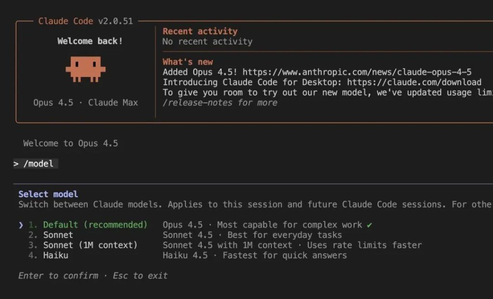

### 13 · 拓扑结构，就是你的成本和延迟

图的形状不是装饰，它是决定运行时间的最大杠杆。最容易踩坑的选择是 `parallel()` 还是 `pipeline()`。

- `parallel()` 这道屏障会让所有东西都等最慢的那个节点，才进入下一阶段。
- `pipeline()` 让每条数据各自独立地依次经过所有阶段，没有屏障————条目 A 可能已经在第三阶段了，条目 B 还在第一阶段；跑得快的提前结束，不用在慢的后面干等。

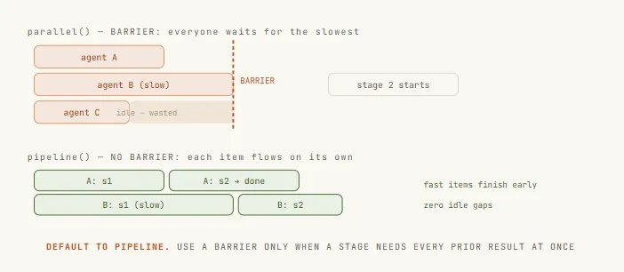

**默认用 `pipeline()`。** 只有一个阶段真的需要全部前置结果同时到齐时才用屏障————比如跨集合去重、按总数提前退出、需要对照「其他发现」来写的 prompt。「代码更干净」和「这些阶段感觉是分开的」都不是理由；屏障带来的延迟是真实的、可测量的、被浪费掉的时间。分开不代表必须同步。

---

## 最后一步：让 Claude 自己画图（14）

### 14 · 自我路由：dynamic workflow / ultracode / `.claude/workflows`

最后一步，是对那些没法提前规划的活儿，不再自己动手画图。用 **dynamic workflows**，只要描述目标，Claude 会自己写编排脚本：拆解任务、决定怎么把活儿派出去、派出一队 subagent、再合成结果。拿到的是一张为这次运行量身定做的图，而不是一张你希望它恰好合适的固定图。

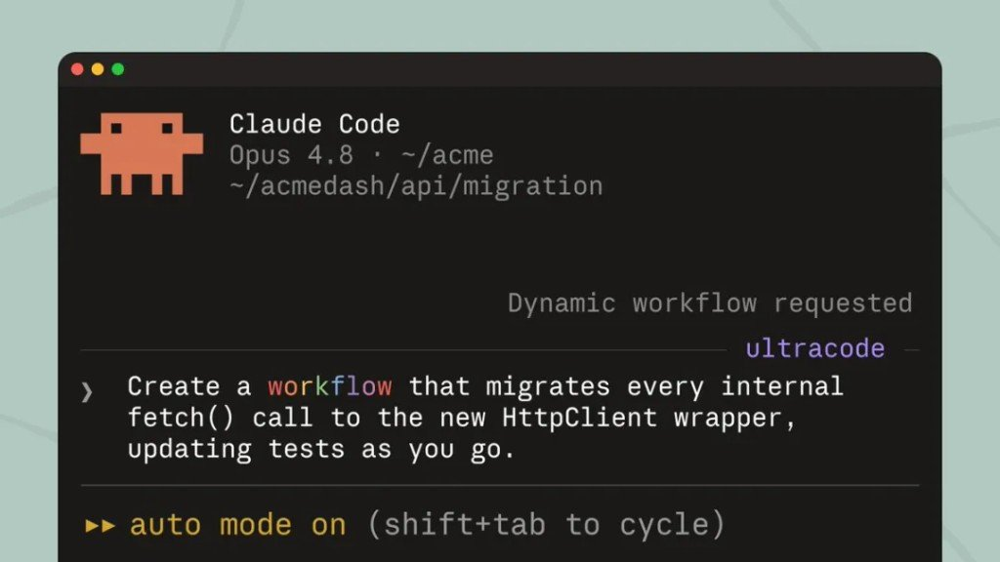

三种用法：

1. 在 prompt 里说出 **「workflow」** 这个词，Claude 就会为这个任务写一份。
2. 跑一个已经存好或内置的————比如 `/deep-research`，就是一张已经在生产里跑着的真实图：定范围 → 并行搜索 → 抓取 → 对抗式验证 → 合成，正是这门课从头到尾讲的那副骨架。
3. 或者打开 **ultracode**，Claude 会给这次会话里每个像样的任务都规划一次 workflow。跑得好的时候按 `s` 把脚本存进 `.claude/workflows/`，从此可以版本控制、按名字重新运行————谁 clone 了这个仓库都能直接跑起来。

```text
› Run a workflow to audit every route under src/routes/ for missing
auth. Spawn one agent per route file, then verify each finding before
reporting.
● Claude wrote an orchestration script · launching in background…
/workflows — auth-audit · running ✓
Scope   1/1 2.1k tok
 Fan-out 18/18 one agent per route file
 Verify  11/18 3-vote skeptics per finding…
 Synthesize 0/1 waiting on verify
//会话保持响应，队伍在后台继续跑
```

---

## 护城河挪到「怎么连图」了

两年来，多 agent 协作的杠杆一直在单个 loop 上：更好的 verifier，更稳的退出条件，更干净的状态文件。

而现在，把这些 loop 怎么连起来，成了新的护城河。

线性智能体从来不是天花板————它只是第一种形状，人人伸手就拿，因为它匹配我们打字的方式：一行、一个头、一次一件事。一旦你能看见节点和边，你就不再要求智能体做更多，而开始要求图做得更宽：在工作独立处扇出，在置信度要紧处把关边，在判断不在处分层模型。

---

## 旁链怎么用，别硬并

| 旁链 | 怎么用 |
|---|---|
| [Claude Code 四类循环](/posts/claude-code-handbook/) | 单体 Loop 类型学；本篇是「多个 loop 怎么连」 |
| [Claude Code 项目结构分层](/posts/claude-code-handbook/) | rules/commands/skills/agents 目录分层 ≠ graph 拓扑 |
| [MCP / Skills / CLI](/posts/mcp-handbook/) | 能力入口；本篇讲编排 |
| [CLAUDE.md 模板原则](/posts/claude-md-handbook/) | 模板正文；dynamic workflows 另存 `.claude/workflows/` |
| Agent 工程 20 概念（待发布） | Agent/Harness/Loop 词表 |
| Prompt-Context-Harness-Loop 四次迁移（待发布） | 瓶颈外移叙事 |

评论区常提 **LangGraph**：理念上「节点/边/状态/条件路由」很近，但本文示例与 API 偏 **Claude Code workflow**（`agent()` / `parallel()` / `pipeline()` / ultracode / `.claude/workflows`），不要硬并成 LangGraph 教程。另有「学不动了」梗————四问答不全时，诚实留在 loop 就行。

---
