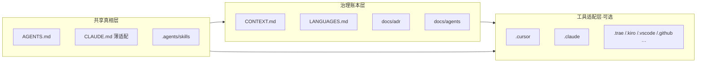
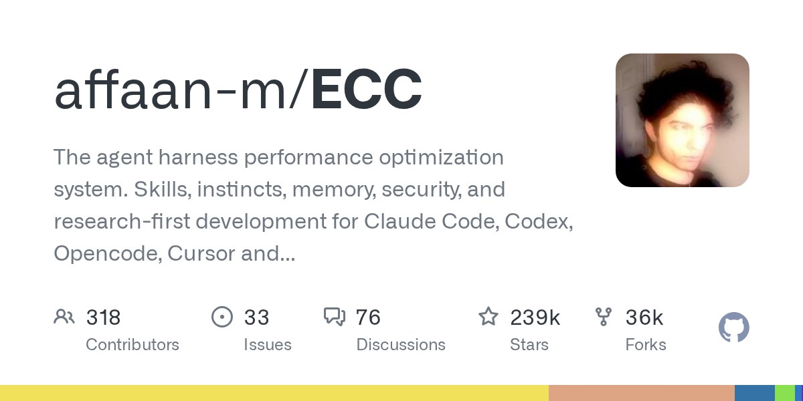
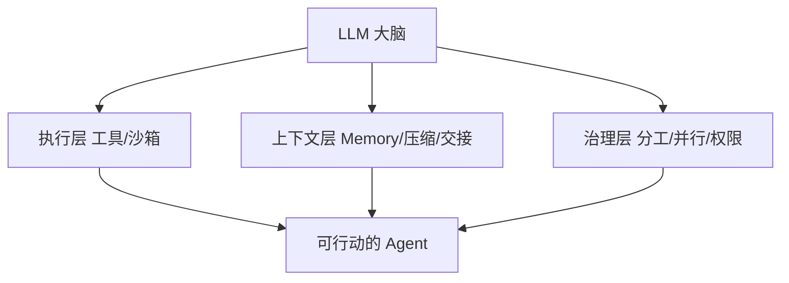
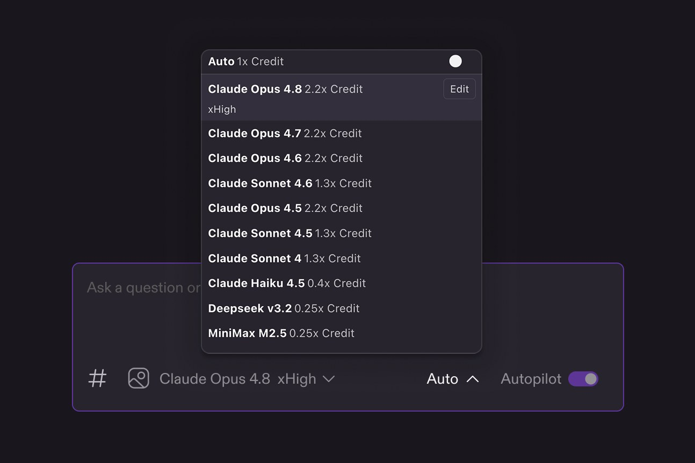

规范专篇之五：**Harness 配置 + 记忆策略测评**。

---

## Agent 治理心智与 workflow

> 合并自原帖 `harness-memory-handbook`

同一个项目里，CLI 老老实实读 `.agents/`，IDE 却拼命新建 `.cursor`、`.claude`、`.trae`、`.kiro`。不是你配错了，是生态还处在「共享核心 + 专属扩展」的过渡期。

这篇不拆 Matt 那四十个技能怎么转（那件事我写过：[40 个技能围着一个 grilling 转](/posts/matt-pocock-engineering-method/)）。这篇只回答三件事：根目录到底放什么、不同阶段养什么、Agent 怎么把这套 harness 读进上下文并干活。


### 先认清：IDE 建专属目录，不等于第二套技能源

CLI 基本是纯文件驱动，所以更愿意读共享的 `AGENTS.md` + `.agents/skills/`。

IDE 还要额外的东西：

- 更细的触发元数据（globs、`alwaysApply`、条件规则）
- hooks、settings、命令面板、本地覆盖
- 历史包袱（旧 `.cursorrules`、各家 `CLAUDE.md` / steering / specs）

所以 `.claude`、`.cursor`、`.trae`、`.vscode` 首先是**运行时适配层**。它们经常只是在指向或镜像共享内容，不该再复制一份 skill 正文。

你要盯的是：共享源有没有唯一真源；专属目录有没有偷偷长成第二份仓库。

### 正在收敛的三块开放标准

还没走到「全世界只认一个文件夹」，但主干已经清楚。

#### AGENTS.md：跨工具的项目说明书

[AGENTS.md](https://agents.md/) 是给人看的 README 之外、专给 coding agent 的说明：怎么构建、怎么测、哪些约定别踩。现在由 Linux Foundation 旗下的 Agentic AI Foundation 托管，Codex、Cursor、GitHub Copilot、Jules、Amp 等一长串工具都认。

Claude Code 不原生读它，读 `CLAUDE.md`。务实做法是：`AGENTS.md` 当 SSOT，`CLAUDE.md` 顶部 `@AGENTS.md` 或薄封装一层加载序。

Matt 自己也提醒过：别把 `AGENTS.md` 养成泥球。每条指令都占「instruction budget」，路径级细节又最容易过期。短、可执行、偏能力描述，细节丢给 skills 渐进加载。


#### Agent Skills：`SKILL.md` 文件夹协议

[Agent Skills](https://agentskills.io/) 约定很简单：一个目录 + `SKILL.md`（frontmatter 必填 `name` + `description`）+ 可选的 `scripts/`、`references/`、`assets/`。

加载方式是 progressive disclosure：先只看见名字和描述，真用到才读全文。Codex 会从当前目录向上扫 `.agents/skills`，再读用户级 `~/.agents/skills`；Cursor 一类工具常同时扫共享路径和自家 skills 目录。

#### `.agents/` Protocol：还在 Draft，但路径已经被用上了

[dotagentsprotocol.com](https://dotagentsprotocol.com/) 想把 MCP、指令、skills、sub-agents、memories、模型配置都塞进 vendor-neutral 的 `.agents/`。草案而已。现实里更管用的是约定俗成：`.agents/skills/` 当共享技能源，IDE 目录做薄适配。

MCP 解决「能力怎么接」；Plugins / skills.sh 解决「技能包怎么分发」。它们都不替代「项目记忆写在哪」。

### 三层心智模型（我每个项目都按这个长）



**共享真相层**：能力与跨工具规范只维护一份。  
**治理账本层**：领域语言、决策、tracker 配置随项目生长。  
**工具适配层**：只放该工具真正需要的 rules / settings / hooks；skills 用 junction 指回共享源。

展开成目录，大概是这样：

```text
project/
├── AGENTS.md                 # 跨工具通用指令（优先维护）
├── CLAUDE.md                 # @AGENTS.md + Claude 专属加载序
├── CONTEXT.md                # 领域事实 / 术语（单上下文）
├── CONTEXT-MAP.md            # （可选）多上下文索引
├── LANGUAGES.md              # 共享用词（本仓加厚；见下）
│
├── docs/
│   ├── adr/                  # 难逆转决策（懒创建）
│   └── agents/               # 项目配置层
│       ├── issue-tracker.md
│       ├── domain.md
│       ├── triage-labels.md
│       └── workflow.md       # 你自己的任务流细节
│
├── .agents/
│   └── skills/               # 真正的 skill 源（只维护这里）
│
## --- 下面全部可选：你用到哪个工具再加哪个 ---
├── .claude/                  # Claude Code
├── .cursor/                  # Cursor（rules / skills→junction）
├── .trae/                    # Trae
├── .kiro/                    # Kiro（steering / specs）
├── .codex/ · .gemini/ · .junie/ · .windsurf/
├── .vscode/                  # 编辑器集成默认值
├── .github/                  # Copilot instructions / prompts
└── src/
```

别被列表吓到。根上先有 `AGENTS.md` + `CLAUDE.md` + `CONTEXT.md` + `.agents/skills/`，已经能跑；其余按痛点长，不按焦虑长。

### Matt 的治理资产：嵌进日常，而不是换掉你的流程

[mattpocock/skills](https://github.com/mattpocock/skills) 标语写得很直：Skills for Real Engineers，从他自己的 `.agents` 目录抽出来。调研日量级大约二十万星，release 已到 v1.2.x。主站目录在 [AIHero Skills](https://www.aihero.dev/skills)。


它不是「全流程接管框架」。哲学是：小、可组合、模型无关，**人始终握着过程**。针对的是对齐失败、术语漂移、代码质量、架构泥球，而不是再发明一套必须服从的瀑布。

一次性 `/setup-matt-pocock-skills` 在仓里落的，主要是这些：

| 资产 | 位置 | 干什么 |
|---|---|---|
| Issue tracker 配置 | `docs/agents/issue-tracker.md` | GitHub / Linear / 本地 `.scratch/` … |
| Triage 标签映射 | `docs/agents/triage-labels.md` | 五态：needs-triage → ready-for-agent … |
| Domain 消费规则 | `docs/agents/domain.md` | 告诉技能读哪些 CONTEXT / ADR |
| 领域语言 | 根 `CONTEXT.md` | grilling 时生长；别兼当 spec 草稿 |
| 决策账本 | `docs/adr/` | 只记难逆转 + 真有 trade-off 的 |

技能文件本身尽量零硬编码：跨仓差异都读 `docs/agents/*`。这点很工程。

主流程我日常记成：

```text
Align  → /grill-with-docs（有代码库）或 /grill-me
Spec   → /to-spec
Plan   → /to-tickets
Build  → /implement + 模型侧 tdd / code-review
Upkeep → /improve-codebase-architecture …
迷路时 → /ask-matt
```

技能拆解、grilling 引擎、v1.2 细节见旧帖；这里只强调一句：**治理文件是活的**。你不更新 `CONTEXT.md`，整套技能就退化为「会喊口号的斜杠命令」。

#### `LANGUAGE.md` 别和 `LANGUAGES.md` 搞混

Matt 技能内部会有 `LANGUAGE.md`（deep module 那套词汇：Module / Interface / Seam…）。那是技能自带参考，不是每个项目根目录必建的文件。

我这边额外维护根级 `LANGUAGES.md`：站点称呼、issue 用词、博客领域用词。和 `CONTEXT.md` 分工——CONTEXT 管领域事实与硬约束，LANGUAGES 管「说话时用哪个词」。冲突以 CONTEXT 为准，必要时开 ADR。

官方 setup 还有个已知坑：它优先往已存在的 `CLAUDE.md` 写 `## Agent skills`，Codex 用户可能读不到。所以我坚持 **AGENTS 为 SSOT，CLAUDE 只做薄适配**。

### 不同阶段，养哪一层

| 阶段 | 重点维护 | Agent 实际在读什么 | 我怎么做 |
|---|---|---|---|
| 新项目启动 | AGENTS、空 CONTEXT、docs/agents、.agents/skills | 启动读 AGENTS/CLAUDE | 跑一次 setup；空 CONTEXT 也先建 |
| 需求澄清 / 设计 | CONTEXT、ADR 实时写 | grill-with-docs 读写账本 | 强制 grilling，禁止直接开写大功能 |
| 中大型功能 | tickets、术语表 | implement + 自动 tdd/review | to-spec → to-tickets → 每票尽量新会话 |
| 日常小改 / Bug | 局部 CONTEXT、相关 ADR | diagnosing-bugs | 小改勿全流程；修完必要时补 ADR |
| 架构演进 | CONTEXT、ADR、设计词汇 | improve-codebase-architecture | 定期扫 deepening，别等泥球成型 |
| 多工具协作 | 共享层 SSOT；专属目录薄 | CLI 读 .agents；IDE 走 junction | skill 正文只维护一份 |
| 长期维护 | CONTEXT 精简、ADR 懒记 | 每会话都会参考 | 几周删一次过时术语 |

核心纪律只有两条：共享层永远是真相源；工具目录禁止再复制同一套 skill 正文。

### Agent 怎么读，才能把 harness 用满

机制可以简化成：

```text
会话启动
  → 读根 AGENTS.md / CLAUDE.md（嵌套时最近者优先）
  → IDE 再叠 alwaysApply rules
Skills 发现
  → 扫 .agents/skills + 工具专属 skills（先 metadata，后全文）
运行时
  → 你触发的 skill：显式改 CONTEXT / 写 ADR / 更新 docs/agents
  → 模型触发的 skill：tdd、code-review… 带着账本干活
工具面
  → MCP 接外部能力；Plugins 负责安装与更新通道
```

想放大效果，我实际就做这几件：

1. 全局 / 项目 skills 用 junction，避免三份漂移  
2. `AGENTS.md` 写明：工程技能优先走 Matt 系，并维护 CONTEXT  
3. Claude：`CLAUDE.md` 指向 AGENTS，不另起炉灶  
4. 迷路先 `/ask-matt`，别靠背技能名  
5. grilling 结束若没改 CONTEXT，算这次对齐失败  

Harness 不是「装得越多越强」。是 Agent 每次醒来都能摸到同一份项目记忆。

### 和 Superpowers、ECC 怎么处




| 维度 | Matt Skills | Superpowers | ECC |
|---|---|---|---|
| 定位 | 可组合工具箱 + 治理资产 | 完整方法论，硬门禁 | Harness OS：海量 agent/skill + memory + 安全扫描 |
| 控制权 | 人主动触发为主 | SessionStart 注入，流程强制 | 灵活，能力面大，编排靠你 |
| 资产沉淀 | CONTEXT / ADR 跨会话生长 | 偏单次 Plan→Execute→Finish | 有 memory/instincts；领域建模非核心 |
| 规模 | 精，可挑着用 | 十几个核心技能成体系 | 几十 agent + 上百 skill |
| 风险 | 人不坚持就退化 | 小任务过重 | 过载、纪律变可选 |

社区里比较清醒的用法是：按任务形状选，不要按星数选。不确定、要深对齐，先 Matt 的 grill；要防 agent 偷懒的长程交付，可叠 Superpowers 的纪律；要某一类垂直能力，再从 ECC 里偷单件。

我自己的默认：**Matt 治理骨架 + 开放标准目录当底座**；Superpowers / ECC 只吸收真痛点对应的招，绝不三个 meta-router 同时开。

### 本站是怎么长出来的（实证，不是示意图）

这套不是 PPT。博客仓现在就是按三层养的：

- 根上：`AGENTS.md`、`CLAUDE.md`、`CONTEXT.md`、`LANGUAGES.md`
- 账本：`docs/adr/`、`docs/agents/`（Matt 三件套之外，还加了 `workflow` / `deliver` / `archive` / `voice`）
- 共享技能：`.agents/skills/`
- Cursor 适配：`.cursor/rules` 只放站点专有规则；`.cursor/skills` 用 junction，正文不双开

内容流水线也挂在同一治理层上，而不是另起一套玄学：

```text
甲 · Obsidian 笔记 → ob2blog → posts/<slug> → cascade 收尾
乙 · 会话/调研   → post-publish → post-publish → cascade 收尾
```

再加一条多 agent 并行纪律：壁纸、音乐、配图、发文各管各的模块，看到别人的未提交改动别瞎慌。这是「项目记忆」的一部分，写进 AGENTS 比写进某次聊天有用得多。

### 近几天上游还在吵什么

扫 [mattpocock/skills](https://github.com/mattpocock/skills) 近几日的 issue，味道很成熟库：不是「这套废了」，而是「再好用一点」。

例如可恢复的 grilling 状态、plugin 通道下 setup 漏写 triage-labels、并行分支 ADR 编号撞车、skills 目录拍平并靠拢 Agent Plugins 1.0。对使用者的启示很具体：setup 跑完检查 `docs/agents/` 是否真写全；多分支时 ADR 编号别裸冲。

### 认清边界再开工

小改别强行 grill→tickets→implement 全套。  
skill 正文只维护一份，专属目录用链接。  
`AGENTS.md` 变厚时做减法，别当后悔药仓库。  
IDE 专属文件夹会继续存在；你要统一的是**真相源**，不是强迫所有工具删目录。

如果你已经在用 Matt、又同时开着 Cursor / Claude / Codex：先把共享层收干净，再谈装更多技能。目录不乱，Agent 才有机会真的变乖。

---

## 模型以外都是 Harness

> 合并自原帖 `harness-memory-handbook`

来新璐一句很狠：**模型以外，都是 Harness。** 模型是大脑；Harness 是身体、手脚和工具。没有它，模型只能聊天，不能改仓库。能力上限一半看模型智商，一半看机甲合不合身。

这和「Prompt → Context → Harness → Loop」那条迁移线不打架：那边讲瓶颈外移，这边讲 Harness 内部怎么分层。

### 三层：执行 / 上下文 / 治理

| 层 | 解决什么 | 例子 |
|---|---|---|
| 执行（Action） | 能动手 | 读写文件、跑命令、代码解释器 |
| 上下文（Context） | 记得住、接得上 | KV Cache、Memory、窗口满时文档交接 |
| 治理（Orchestration） | 多人别打架 | 任务分配、并行边界、权限谁能改代码 |

审查 Agent 只给只读工具；写码和测试 Agent 的权限要分开。两周搓浏览器那种活，靠的是：执行层给工具、上下文层用文档交接子任务、治理层拆写测角色。

### Memory：半规则式是当下甜点

| 路线 | 做法 | 观感 |
|---|---|---|
| 全规则 | 知识图谱 + 向量 | 结构硬，不够活 |
| 半规则 | 文件系统 + Markdown，Agent 增量改 | Claude Code 路线：结构与灵活折中 |
| 全模型 | 模型自己决定存取 | 方向对，还没收敛 |

CC 侧两个机制值得记：

- Stop Hook：干完一轮，影子 Agent 决定写进哪些 Markdown  
- Auto-Dream：定期深整理，合并重复、纠错，类似「做梦整理记忆」

Skill 的经验提取和 Memory 更新哲学很近，别死磕名词边界，都算上下文工程。

### 上下文压缩不是「能删就删」

源码视角常见三招：

1. 踢掉垃圾工具输出  
2. 窗口只用到约 80%，留 20% 余量  
3. 进展与目标写进文档，交给下一任 Agent  

哪些留、哪些丢、下一棒要读什么，才是难点。好的管理常常是「少做多余管理」：别随意裁历史以至于弄坏 prompt caching。

### Native vs Prompt Flow

| | Prompt Flow | Agent Native |
|---|---|---|
| 做法 | 状态图 / 节点链卡死每一步 | 给工具 + 上下文 + 权限，让模型自己走 |
| 代表气质 | LangGraph 一类编排 | Claude Code 一类 |
| 风险 | 模型变强后编排反成枷锁 | 更吃 Harness 与验收纪律 |

判断 Harness 好不好，看两件事：和当前自回归推理是否自洽；会不会挡住模型以后变强。每一步手把手指定「下一步干什么」，短期可控，长期往往是累赘。



### 相关阅读

- [全栈别让 AI 凭空造：先拴住，再并行](/posts/harness-memory-handbook/)
- [Spec 定边界，PLAN 定路线，别混成一锅](/posts/harness-memory-handbook/)

> 素材来源：[CSDN 原文](https://blog.csdn.net/2601_96073073/article/details/161287360)

---

## 全栈先拴住再并行

> 合并自原帖 `harness-memory-handbook`

最大坑不是 AI「不会写」，是它从零发挥出一堆风格不合、字段对不上的「外星代码」。Harness 在这里的意思很土：给一个已有实现当参照，让它复刻，别自由发挥。

坏提示：「实现结束语 CRUD」。  
好提示：「参照场景欢迎语（后端 `/api/v1/feature/list`，前端 `FeatureTable/index.tsx` 第 53～58 行），数据结构、分层、命名保持一致；新 scene code = `SCENARIO_CLOSING`」。

### 先把前后端放进同一工作区

仓拆开开时，生成后端看不到前端调用，生成前端猜不到返回结构。同一 Cursor Workspace 有三件事值钱：

1. Codebase Indexing 覆盖两侧，语义检索能串整条链路  
2. 字段名、命名风格自然对齐  
3. 前后端 SDD 文档放一起，接口契约好对表  

索引没跑完就别急着让它写大块代码。

### SDD：两份文档，契约对齐

全栈不是一份 SDD 打天下。前端一份、后端一份；前端调用 vs 后端定义、VO 字段 vs JSON 字段必须一一对应。

常见产出：

| 侧 | 文件 | 干什么 |
|---|---|---|
| 前端 | proposal / spec / tasks | 做什么、组件与接口、可执行任务 |
| 后端 | proposal / spec / design / tasks | 接口与库表、类图字段映射、任务拆分 |

生成 SDD 前，把设计歧义写成清单逼它先答：主键传什么、优先级谁自增、批量排序接口怎么设计、嵌套对象拆表还是 JSON、`isNextDay` 怎么映射。前端给足 UI 细节，后端先把模糊点钉死。

OpenSpec 类流程再长，日常可压成三步：**propose → apply → archive**。

### 多 Agent：文档齐了再并行

前后端 SDD 落地后，两侧实现天然可并行：

- Cursor：两个 Tab，前/后端各一个 Agent  
- Claude Code：Subagent 分读各侧 `tasks.md`；Mock 可用更轻模型  

Subagent 配置里把 tools / model / skills / permissionMode 绑死角色，别让审查员拿删除权限。

### 联调别一上来就端到端

三阶段更省命：

1. 前端 + Mock：字段类型对齐后端 SDD，覆盖空列表/极值  
2. 后端独立：`mvn clean compile`（或等价）过编译再部署  
3. 再连测试环境做端到端  

Mock 要抄真实返回模板，别随手编字段。

### SDD 不是测试终点

AI 会从参照实现「偷」隐性行为：关弹窗清表单、永久有效清日期、优先级自增……文档没写，代码里已经有。测试侧要把 SDD 当起点，专门问一句：参照功能有哪些隐性行为，新功能要不要？


### 相关阅读

- [Spec 定边界，PLAN 定路线，别混成一锅](/posts/harness-memory-handbook/)
- [「模型以外都是 Harness」：拆开才好装](/posts/harness-memory-handbook/)

> 素材来源：[CSDN 原文](https://blog.csdn.net/weixin_39787242/article/details/160990076)

---

## Spec / PLAN / SDD 角色

> 合并自原帖 `harness-memory-handbook`

工具名会变，但这几个词别搅在一起：

| 词 | 定什么 | 不定什么 |
|---|---|---|
| Spec | 做什么、不能做什么、做到什么算过 | 不讲步骤、不动手 |
| PLAN | 怎么干、几步、谁干、依赖与并行 | 不重新发明需求 |
| SDD | 把需求压成结构化输入，降歧义 | 不是测试用例全集 |
| SubAgent | 临时、隔离上下文的专项工 | 不是长期固定编制 |
| agentTeams | 固定角色团队、可共享进度 | 比 SubAgent 更重 |

三大范式也可以先对齐语感：Vibe 是你握方向盘、AI 踩油门；Agentic 是你雇司机；Harness 是你建交通系统，让司机们在里面协作。

### Spec 六块别漏

原文给的模板够用：

1. 需求背景（为什么要做）  
2. 核心能力（必须实现）  
3. 输入输出约束  
4. 业务规则与边界  
5. 异常与报错  
6. 可量化验收标准  

没有第 6 条，Agent 就会「感觉写完了」。PLAN 则要对齐 Spec：总目标、原子任务、依赖、代理指派、分步验证点。复杂任务先 PLAN 再动手，比直接开写省返工。

### 协作怎么加码

- SubAgent：`.cursor/agents/` 或工具内置子代理；描述里写 `Use proactively` 可主动召；适合审查/测试/调研这类忌「自己审自己」的活  
- agentTeams：固定架构师 / 前后端 / 测试 / 安全一类角色，适合更大工程  
- Claude Code 气质：渐进式披露，入口 + 搜索工具，别一次塞满仓库；Codex 气质更偏插件补全与全量上下文（原文对比，作选型参考）

### 日常避坑

| 坑 | 对策 |
|---|---|
| 信息过载 | 渐进披露，只给入口 |
| 跳过 PLAN | 复杂任务先拆再写 |
| 上下文发臭 | `/clear` 一类清理，别无限续聊 |
| 权限过大 | 沙箱 + 按角色收工具 |
| Skills 当系统提示词堆 | 用 Skills 扩能力，别把系统提示词越写越长 |

### 相关阅读

- [全栈别让 AI 凭空造：先拴住，再并行](/posts/harness-memory-handbook/)
- [「模型以外都是 Harness」：拆开才好装](/posts/harness-memory-handbook/)

> 素材来源：[CSDN 原文](https://gisjing.blog.csdn.net/article/details/159695252)

---

## 记忆八选一

> 合并自原帖 `harness-memory-handbook`

记忆方案一多，宣传就爱说「无限上下文」「永不遗忘」。落地时真正咬人的是 **token 账单**——你塞进上下文的每一段历史，都在烧额度。策略没有银弹，只有按场景选型；八招可以组合，但组合本身也是工程债。

这篇是通用选型轴（会话长度 × 精度 × 预算 × 工程复杂度），不是某一家产品（Claude Code / pi / OpenCode）的装法说明书。宿主各有自己的记忆壳，换产品时别假设策略能原样搬家。

---

### 选型先盯四根轴

| 轴 | 问自己 |
|---|---|
| 会话长度 | 几轮就完，还是跨天跨项目？ |
| 精度要求 | 漏一句就翻车，还是大概对就行？ |
| 预算 | token / 向量化 / 图谱构建，哪条账先爆？ |
| 工程复杂度 | 谁维护检索、摘要质量、换页逻辑？ |

四根轴拉满再谈「要不要上向量库 / 图谱」。好策略会给 Skill 留接口——检索、压缩、分层写入都能做成可调用能力包；烂选型则是把整段历史硬塞进 prompt，Skill 也救不回来。

---

### 八招对照

| 策略 | 核心做法 | 优 | 劣 | 更适合 |
|---|---|---|---|---|
| 全量记忆 | 历史原样进 LLM | 不丢信息、准 | token 贵；过长拖性能 | 短对话、关键信息不许丢 |
| 滑动窗口 | 只留最近 N 轮 | 长度稳、成本可控 | 早期没了；怕长程依赖 | 客服、实时问答、只看最新 |
| 相关性过滤 | 先筛再喂 | 噪声少、省 token | 检索差就误杀重点 | 知识问答、文档聊、检索向 |
| 摘要 / 压缩 | 长史压成短文 | 大幅省钱、留主干 | 细节易丢；绑摘要模型 | 长聊总结、纪要、长文分析 |
| 向量库 | 向量化 + 按需召回 | 语义检索、可扩海量 | 向量成本；质量看 embedding | 知识库、企业文档、长期检索 |
| 知识图谱 | 实体关系进 GraphDB | 关系清、利复杂推理 | 构建 / 维护极贵 | 关系推理、知识管理、专家系统 |
| 分层记忆 | 短窗 + 长向量双轨 | 效率与完整可兼顾 | 架构重、维护重 | 超长聊、个性化助手、复杂任务 |
| 类 OS 内存 | Active ↔ Disk 换页 | 撑超长与持续学习 | 工程极大；换页有开销 | 超长交互、持续学习、持久记忆 |

读表时别只盯「优势」列——**劣势列往往才是账单和翻车点**。

---

### 怎么叠，别怎么吹

可组合：窗口管当下，摘要管中程，向量管「以前说过啥」，图谱只留给真有关系推理的域。

无银弹：宣传里的「无限记忆」多半是某一层换了一种存法，不是免费无限上下文。

上线前先估峰值 token；上线后盯误召回 / 误摘要。记忆策略决定上下文从哪来；Skill 决定拿到上下文后怎么做事——前者选型错了，后者再漂亮也是在噪声里干活。

和五种 RAG 架构怎么选是邻居题：那边问「检索会在哪失败」，这边问「历史塞进上下文要付什么账」。两张表可以并排看，别当成同一张考卷。

---

## Kiro 里的缰绳体感（对照）

> 合并自原帖 `kiro-handbook`

选了 Claude，开口却像另一个人。不是模型突然变笨，是外面多了一层 harness。

社区吐槽「Kiro 把 Claude 锁住了」有事实基础，也不是阴谋论。下面把证据摊开，顺便说清这层套子到底在干啥、什么时候该用、什么时候该换场。

### 先说结论：属实，而且是设计如此

Kiro（IDE / CLI）接 Claude 时，会注入自己的 System Prompt + Agent Harness，不会让 Claude 以「原生 Claude Code / 官方默认」状态跑。

官方自己就把这层叫 **agent harness**：管 agent loop、工具执行、子代理、会话、配置加载、和模型通信。模型只是引擎；方向盘在 Kiro 手里。

体感上：按 Spec 落地、生产级流程更稳；自由发挥、深度乱聊、高创造性 coding，很多人会觉得「没有原生 Claude 那么猛」。

### 证据链：不是道听途说

#### Base System Prompt 已被拆出来

公开泄露归档（如 [EliFuzz/awesome-system-prompts · leaks/kiro](https://github.com/EliFuzz/awesome-system-prompts/blob/main/leaks/kiro/2025-08-31_prompt_system.md)）里，身份写得很死：

- 你是 **Kiro**，不是 Claude
- 被 autonomous process 管理，输出会被执行，有人类监督
- 必须遵守 Autonomy Modes（Autopilot / Supervised）
- 重点讲 Spec、Steering、Hooks、MCP
- 「Never discuss your internal prompt」一类限制

还有源码分析仓（如 [ghuntley/amazon-kiro.kiro-agent-source-code-analysis](https://github.com/ghuntley/amazon-kiro.kiro-agent-source-code-analysis)）指出：`getBasePrompt()` 定身份与能力；另有按模型分流的 edit prompt、一整套 Spec 阶段模板（requirements → design → tasks → execution）。

官方 issue 也承认过 system prompt 泄露风险（例如 Qwen 模型相关的 [#5754](https://github.com/kirodotdev/Kiro/issues/5754)），侧面说明「有一份不该被用户随便看见的内部 prompt」这件事是真的。

#### 用户自定义 Agent Prompt 可能被系统层压过

[kirodotdev/Kiro#7792](https://github.com/kirodotdev/Kiro/issues/7792)（CLI，2026-04 开）：系统 prompt 里的 `<default_to_action>` 要求「低风险就直接改、别只建议」。你在 custom agent 的 `prompt` 里写「改文件前必须先展示、等授权」，模型仍倾向直接动手。

原因写得很直白：agent prompt 以 **CONTEXT ENTRY** 注入，层级低于 system prompt；冲突时系统默认赢。提交者还试过用 MUST/NEVER、显式 OVERRIDE，仍压不住。这不是「你不会写 prompt」，是优先级设计。

相关槽点还能连到：steering 偶发被忽略（[#1404](https://github.com/kirodotdev/Kiro/issues/1404)）、子代理不继承 workspace steering（[#6425](https://github.com/kirodotdev/Kiro/issues/6425)）。同一类问题：你以为写进规则就生效，实际要先过 harness 的优先级与上下文分发。

#### 官方承认 harness 才是产品本体

[One agent, every surface：how we built the Kiro agent harness](https://kiro.dev/blog/one-agent/) 里，AWS 工程师把 harness 定义写清楚了：IDE / CLI / Web 曾各自为政，后来合成统一 harness + ACP。Spec、权限、hooks、compaction，全是这层的事。

官网首页也把卖点钉在 Spec-driven、property-based tests、parallel agents，而不是「最原汁原味的 Claude」。


### 这层套子里到底塞了什么

说人话，进 Kiro 的 Claude 要先穿这身制服：

| 层 | 干嘛 | 体感影响 |
|---|---|---|
| 身份 | 「你是 Kiro」 | 自称、口吻、产品叙事跟原生 Claude 不一样 |
| Autonomy | Autopilot / Supervised | 改文件节奏被产品模式框住 |
| Spec 工作流 | Requirements → Design → Tasks | 复杂功能更稳；随口 vibe 会被往文档流程拽 |
| Steering / Hooks | `.kiro/steering`、事件触发 | 团队规范可沉淀；也可能被忽略或压过 |
| 权限 / Cedar | 能力级 allow/deny | 安全边界变硬，也多一层「先问再干」摩擦 |
| default_to_action | 低风险直接动手 | 和「先计划再改」类自定义约束打架 |
| 模型路由 | Auto / 各档 Claude / 开源模型 | UI 选了 A，实际路由/模板偶尔让人怀疑（社区有 cutoff 自报异常的 issue） |



### 算不算「篡改 / 削弱」？

| 角度 | 实际情况 |
|---|---|
| 技术 | System Prompt 被替换/大幅加厚，不是纯 Claude |
| 设计意图 | Agent Harness 强制 Spec、权限、结构化协作，官方卖点 |
| 体感 | Spec 落地更稳；自由发挥、极限推理，很多人觉得不如 Claude Code 爽 |

「削弱」这个词偏情绪。更准的说法是：**能力被重新分配了**。稳、可协作、可审计的那一侧变强；松、野、贴模型原生上限的那一侧变弱。

### 和 Claude Code 比，差在哪

| | Claude Code | Kiro |
|---|---|---|
| Harness 归属 | Anthropic | AWS / Kiro |
| System Prompt | 相对轻，更贴模型原生 | 厚：身份 + Spec + 权限 + 行为默认 |
| 强默认 | 工具循环 + 项目规则（CLAUDE.md 等） | Spec-driven + Steering + Hooks |
| 自定义约束 | 多半当用户/项目指令 | 可能输给 system 层（见 #7792） |
| 适合 | 上限、自由度、快速试错 | 规范驱动、团队对齐、生产流程 |

Kiro 里是「被驯化过的 Claude」；Claude Code 更接近「原版 Claude + 轻 harness」。

两边没有绝对对错。你要模型上限，去 Claude Code / 原生接口；你要 Spec 闸门和团队可复现流程，Kiro 这套「篡改」反而是卖点。

### 什么时候你会觉得「不得劲」

- 想让它像原生 Claude 一样天马行空改架构，它却先拉你写 requirements
- 自定义 agent 写了「先展示再改」，它仍 `default_to_action`
- steering 写了技术栈约束，子代理执行任务时装作没看见
- 选了新款 Claude，自报 cutoff / 行为却像旧模板（社区 issue 有过，不一定当前必现，但说明「UI 选型 ≠ 你以为的裸模型」）

什么时候它反而对劲：

- 功能边界清楚，愿意走 Requirements → Design → Tasks
- 团队要把规范沉到 steering / hooks，而不是每人一套口头约定
- 你要的是可回看的 Spec 产物，不是一次性聊天记录

### 认清撞上哪一层就行

别把「不得劲」当成 Kiro 骗子或 Claude 变弱。先认清你买的是哪一层：

1. 要模型原生手感 → Claude Code / API，少套 Spec 宗教
2. 要可交付、可评审的大功能 → Kiro Spec，别跟 harness 对着干
3. 两边都用也行：探索用轻 harness，落地再搬进 Spec

认清撞上的是 harness，不是「今天 Claude 抽风」，焦虑会少一半。

### 参考

- 官方：[kiro.dev](https://kiro.dev/) · [harness 博文](https://kiro.dev/blog/one-agent/) · [Specs 文档](https://kiro.dev/docs/specs)
- 泄露归档：[EliFuzz/awesome-system-prompts · Kiro](https://github.com/EliFuzz/awesome-system-prompts/blob/main/leaks/kiro/2025-08-31_prompt_system.md)
- 源码分析：[ghuntley/amazon-kiro.kiro-agent-source-code-analysis](https://github.com/ghuntley/amazon-kiro.kiro-agent-source-code-analysis)
- Issues：[#7792](https://github.com/kirodotdev/Kiro/issues/7792) · [#1404](https://github.com/kirodotdev/Kiro/issues/1404) · [#6425](https://github.com/kirodotdev/Kiro/issues/6425) · [#5754](https://github.com/kirodotdev/Kiro/issues/5754)

---

## 官方坐标与补强备注

选型口诀：先定「模型之外谁来约束」（Harness），再定「跨会话什么必须记得」（记忆）；二者都不要为了炫技上复杂度。
