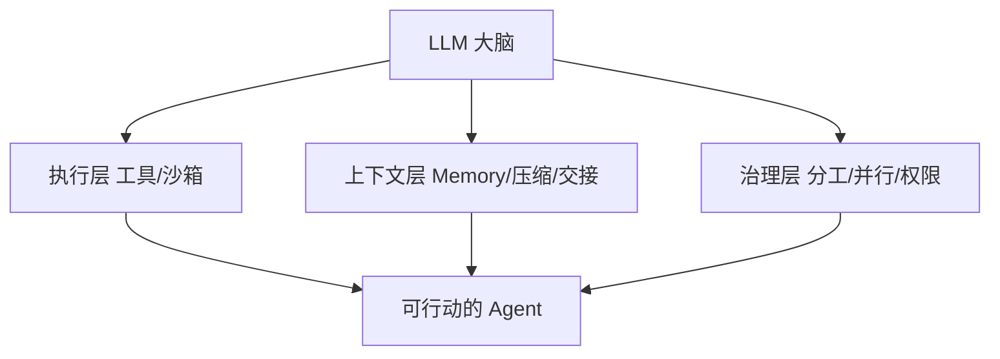

来新璐一句很狠：**模型以外，都是 Harness。** 模型是大脑；Harness 是身体、手脚和工具。没有它，模型只能聊天，不能改仓库。能力上限一半看模型智商，一半看机甲合不合身。

这和「Prompt → Context → Harness → Loop」那条迁移线不打架：那边讲瓶颈外移，这边讲 Harness 内部怎么分层。

## 三层：执行 / 上下文 / 治理

| 层 | 解决什么 | 例子 |
|---|---|---|
| 执行（Action） | 能动手 | 读写文件、跑命令、代码解释器 |
| 上下文（Context） | 记得住、接得上 | KV Cache、Memory、窗口满时文档交接 |
| 治理（Orchestration） | 多人别打架 | 任务分配、并行边界、权限谁能改代码 |

审查 Agent 只给只读工具；写码和测试 Agent 的权限要分开。两周搓浏览器那种活，靠的是：执行层给工具、上下文层用文档交接子任务、治理层拆写测角色。

## Memory：半规则式是当下甜点

| 路线 | 做法 | 观感 |
|---|---|---|
| 全规则 | 知识图谱 + 向量 | 结构硬，不够活 |
| 半规则 | 文件系统 + Markdown，Agent 增量改 | Claude Code 路线：结构与灵活折中 |
| 全模型 | 模型自己决定存取 | 方向对，还没收敛 |

CC 侧两个机制值得记：

- Stop Hook：干完一轮，影子 Agent 决定写进哪些 Markdown  
- Auto-Dream：定期深整理，合并重复、纠错，类似「做梦整理记忆」

Skill 的经验提取和 Memory 更新哲学很近，别死磕名词边界，都算上下文工程。

## 上下文压缩不是「能删就删」

源码视角常见三招：

1. 踢掉垃圾工具输出  
2. 窗口只用到约 80%，留 20% 余量  
3. 进展与目标写进文档，交给下一任 Agent  

哪些留、哪些丢、下一棒要读什么，才是难点。好的管理常常是「少做多余管理」：别随意裁历史以至于弄坏 prompt caching。

## Native vs Prompt Flow

| | Prompt Flow | Agent Native |
|---|---|---|
| 做法 | 状态图 / 节点链卡死每一步 | 给工具 + 上下文 + 权限，让模型自己走 |
| 代表气质 | LangGraph 一类编排 | Claude Code 一类 |
| 风险 | 模型变强后编排反成枷锁 | 更吃 Harness 与验收纪律 |

判断 Harness 好不好，看两件事：和当前自回归推理是否自洽；会不会挡住模型以后变强。每一步手把手指定「下一步干什么」，短期可控，长期往往是累赘。

## 相关阅读

- [全栈别让 AI 凭空造：先拴住，再并行](/posts/harness-sdd-fullstack-parallel/)
- [Spec 定边界，PLAN 定路线，别混成一锅](/posts/plan-spec-sdd-roles/)

> 素材来源：[CSDN 原文](https://blog.csdn.net/2601_96073073/article/details/161287360)
