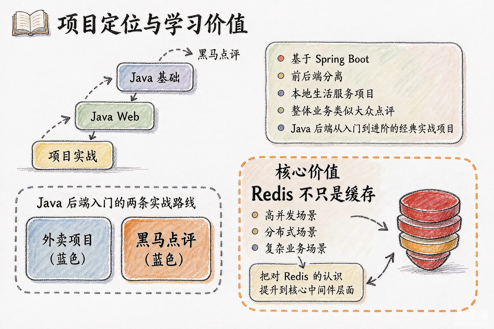
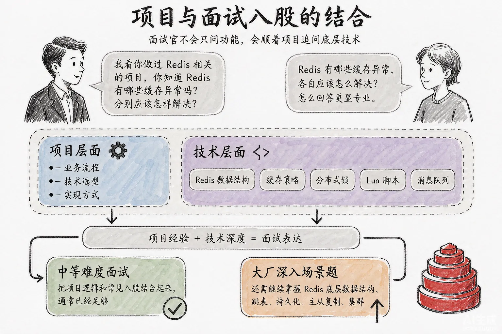

## 项目定位与学习价值

黑马点评是黑马程序员为教学设计的一个**基于 Spring Boot、前后端分离的本地生活服务项目**，整体业务类似大众点评，属于 Java 后端从入门走向进阶的经典实战项目。

很多零基础学习 Java 的同学，在学完 Java 基础和 Java Web 后，通常会选择两个项目进行实战：一个是外卖项目，另一个就是黑马点评。相比单纯把 Redis 当作缓存工具，黑马点评更重要的价值在于展示 **Redis 在高并发、分布式和复杂业务场景中的应用**，帮助我们把对 Redis 的认识提升到核心中间件层面。

项目包含的业务包括：

- 短信登录
- 商户查询与缓存
- 优惠券秒杀
- 达人探店
- 好友关注
- 附近商户
- 用户签到
- UV 统计

其中，附近商户使用了 Redis 的 **GEO 数据结构**。不过在实际面试中，分布式、数据一致性、缓存异常等内容通常被问得更多，因此重点可以放在以下四个模块：

1. 登录与身份校验
2. 店铺数据查询与缓存
3. 优惠券秒杀
4. 达人探店与 Feed 流

## 项目与面试八股的结合

Redis 在 Java 后端面试中的提问频率很高。面试官通常不会只问项目功能，还会顺着项目继续追问底层技术，例如：

> 我看你做过 Redis 相关的项目，你知道 Redis 有哪些缓存异常吗？分别应该怎样解决？

因此，准备项目时需要同时做好两个层面：

- **项目层面**：搞清楚每个功能的业务流程、技术选型和实现方式。
- **技术层面**：掌握项目涉及的 Redis 数据结构、缓存策略、分布式锁、Lua 脚本、消息队列等基础知识。

如果目标是应对中等难度的面试，把项目逻辑和常见八股结合起来，通常已经足够。如果是大厂中更深入的场景题，则还需要继续掌握 Redis 底层数据结构、跳表、持久化、主从复制和集群等知识。

## 登录模块：基于 Redis 的短信验证码登录
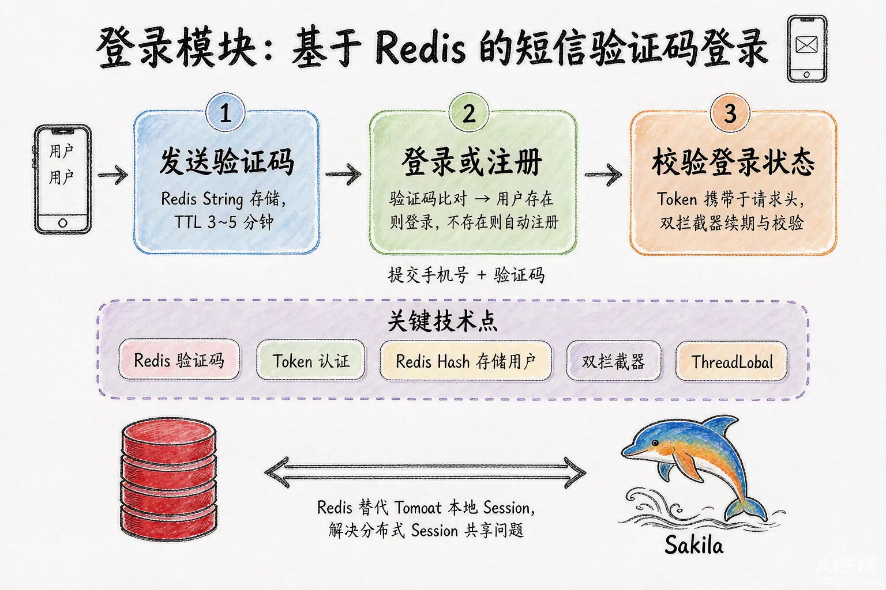

## 整体业务流程
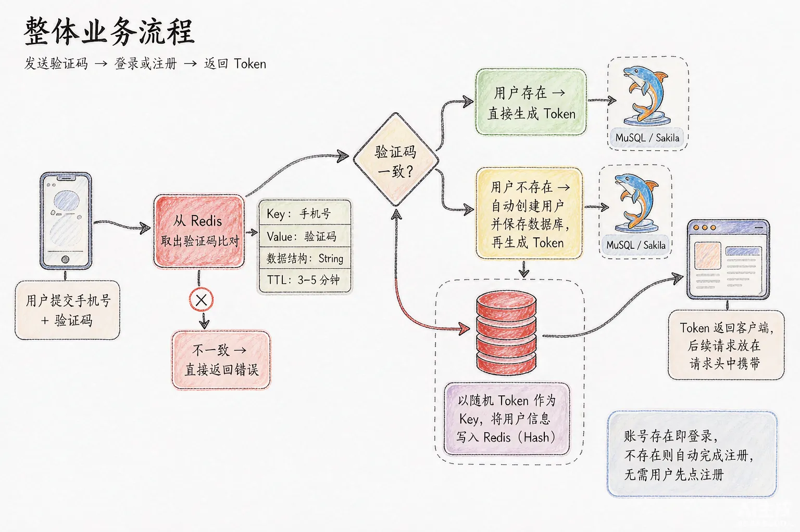

黑马点评的登录模块主要包含三个步骤：

1. 发送验证码。
2. 登录或注册。
3. 校验登录状态。

用户请求登录时，前端提交手机号和验证码。服务端从 Redis 中取出验证码进行比对，其中：

- **Key**：手机号。
- **Value**：验证码。
- **数据结构**：String。
- **TTL**：通常为 3～5 分钟。

如果验证码不一致，直接返回错误；如果一致，则根据手机号查询 MySQL：

- 用户存在：直接生成 Token。
- 用户不存在：自动创建新用户，保存到数据库后再生成 Token。

随后，以随机生成的 Token 作为 Redis Key，将用户信息保存到 Redis，并把 Token 返回给客户端。后续客户端发起请求时，需要把 Token 放在请求头中携带回来。

这种方式与现在很多网站的登录逻辑类似：用户输入手机号和验证码后，如果账号已经存在就直接登录；如果不存在，系统便自动完成注册，不再要求用户先点击注册按钮并填写大量信息。

## 用户信息为什么使用 Hash 存储
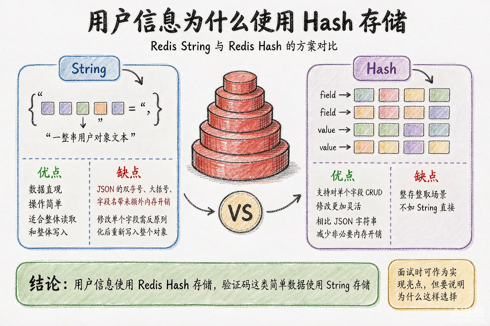

用户信息可以使用 Redis 的 String 或 Hash 存储。

### String

String 通常以 JSON 字符串的形式保存用户信息。

**优点：**

- 数据直观。
- 操作简单。
- 适合整体读取和整体写入。

**缺点：**

- JSON 中的双引号、大括号、字段名等会带来额外的内存开销。
- 修改单个字段时，通常需要反序列化后重新写入整个对象。

### Hash

Hash 以哈希表的形式保存用户信息，可以针对单个字段执行增删改查。

**优点：**

- 支持对单个字段进行 CRUD。
- 修改更加灵活。
- 相比 JSON 字符串，可以减少一部分非必要的内存开销。

因此，项目中通常使用 **Hash 存储用户信息**，而验证码这类简单数据则使用 String。

> 面试时可以把“使用 Redis Hash 存储用户信息”作为登录模块的一个实现亮点，但不能只说技术名词，还要说明为什么这样选择。

## 为什么用 Redis 替代 Session
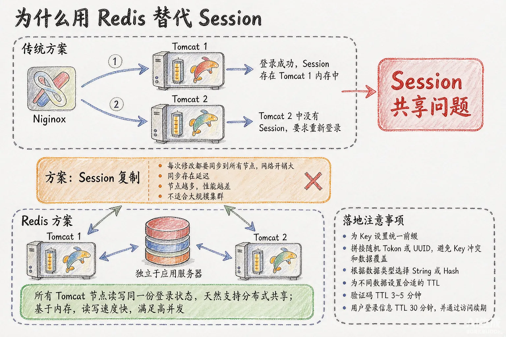

传统 Session 保存在 Tomcat 的本地内存中。单机部署时没有问题，但生产环境通常会部署多台 Tomcat，并通过 Nginx 做负载均衡。

例如，用户第一次请求被转发到 Tomcat 1，登录成功后，Session 保存在 Tomcat 1 的内存中；第二次请求可能被转发到 Tomcat 2，而 Tomcat 2 中没有对应的 Session，系统就会要求用户重新登录。这就是典型的 **Session 共享问题**。

一种解决方案是 Session 复制，即各个 Tomcat 节点通过广播同步 Session。但这种方式存在明显问题：

- 每次修改都要同步到所有节点，网络开销大。
- 同步存在延迟。
- 节点越多，性能越差。
- 不适合大规模集群。

Redis 独立于应用服务器，所有 Tomcat 节点都从同一个 Redis 读写登录状态，天然支持分布式共享。同时 Redis 基于内存，读写速度快，可以满足高并发场景下的响应要求。

> 使用 Redis 存储 Token 替代 Tomcat 本地 Session，本质上是把有状态的 Session 认证改造成基于共享存储的 Token 认证。所有 Tomcat 节点都可以读取同一份登录状态，扩容和缩容不会影响用户登录。

使用 Redis 替代 Session 时，还需要考虑以下问题：

- 为 Key 设置统一前缀，方便区分和分组。
- 拼接随机 Token 或 UUID，避免 Key 冲突和数据覆盖。
- 根据数据类型选择 String 或 Hash。
- 为不同数据设置合适的 TTL。
- 验证码通常设置为 3～5 分钟。
- 用户登录信息可以设置为 30 分钟，并通过访问续期。

## 双拦截器设计
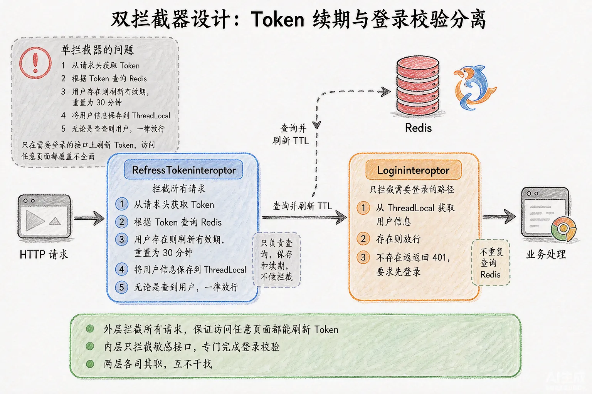

如果只配置一个登录拦截器，并且它只拦截个人中心、下单等需要登录的接口，就会出现一个问题：用户登录后，如果一直浏览首页、商户信息等不需要登录的页面，这些请求不会经过登录拦截器，Token 的有效期也不会刷新。

假设 Token 的 TTL 是 30 分钟，用户浏览公开页面超过 30 分钟后再进入个人中心，此时 Token 已经失效，用户就会被迫退出并重新登录。

单拦截器的问题在于：

> 只在需要登录的接口上刷新 Token，请求覆盖不全面。

因此，项目采用两层拦截器。

### 外层拦截器：RefreshTokenInterceptor

外层拦截器拦截**所有请求**，主要职责是刷新 Token：

1. 从请求头中获取 Token。
2. 根据 Token 查询 Redis。
3. 如果用户存在，刷新 Token 的有效期，例如重新设置为 30 分钟。
4. 将用户信息保存到 ThreadLocal。
5. 无论是否查询到用户，都放行请求。

它只负责“查询、保存和续期”，不负责拦截未登录用户。

### 内层拦截器：LoginInterceptor

内层拦截器只拦截需要登录的路径，主要职责是进行登录校验：

1. 从 ThreadLocal 中获取用户信息。
2. 如果存在，放行。
3. 如果不存在，返回 401，要求用户先登录。

关键点是：内层拦截器只判断“是否需要拦截”，不会重复查询 Redis。

两层拦截器配合后的效果是：

- 外层拦截所有请求，保证用户访问任意页面时都能刷新 Token。
- 内层只拦截敏感接口，专门完成登录校验。
- 两层各司其职，互不干扰。

## ThreadLocal 的作用与清理
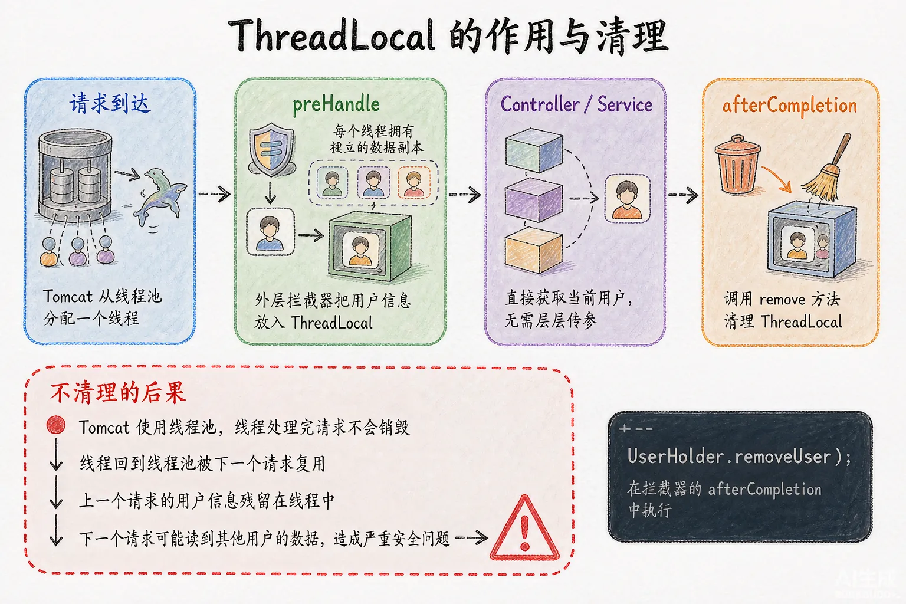

ThreadLocal 是 Java 提供的线程局部变量，每个线程都拥有独立的数据副本。Tomcat 处理请求时会从线程池中分配一个线程，外层拦截器可以在 `preHandle` 中把用户信息放入 ThreadLocal，Controller 层和 Service 层便可以直接获取当前用户，而不需要层层传参。

需要特别注意，请求结束后必须调用 `remove()`。

Tomcat 使用线程池，线程处理完一个请求后不会销毁，而是回到线程池中继续复用。如果不清理 ThreadLocal，上一个请求的用户信息可能残留在线程中，下一个请求复用该线程时，就可能读取到其他用户的数据，造成严重的安全问题。

因此，需要在拦截器的 `afterCompletion` 方法中清理：

```java
UserHolder.removeUser();
```

登录模块需要重点记住：

- 验证码使用 Redis String 存储，并设置较短 TTL。
- 用户登录信息使用 Redis Hash 存储。
- 使用 Token 和 Redis 解决分布式 Session 共享问题。
- 使用双拦截器完成 Token 续期和登录校验。
- 使用 ThreadLocal 保存当前请求的用户信息。
- 请求结束后必须清理 ThreadLocal。

## 店铺查询：缓存策略与数据一致性
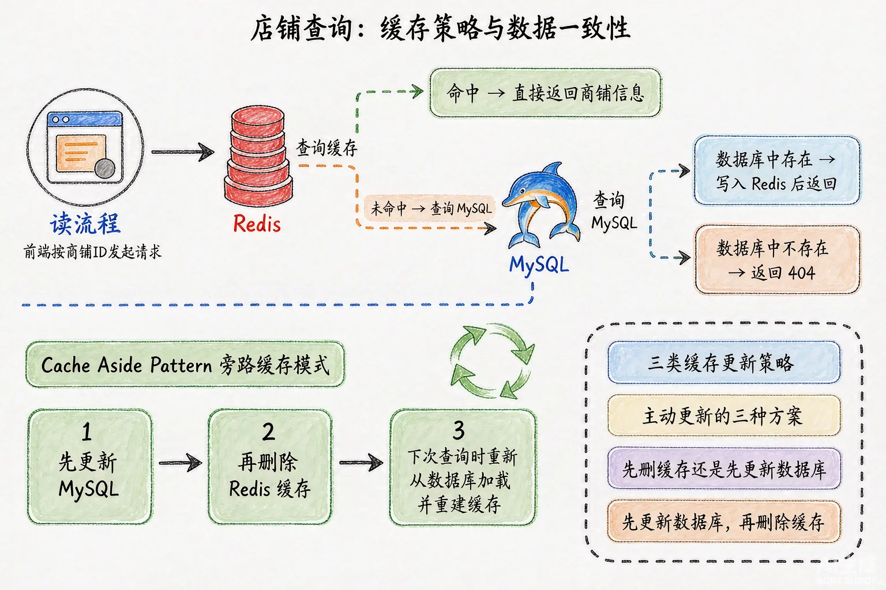

## 店铺数据查询流程
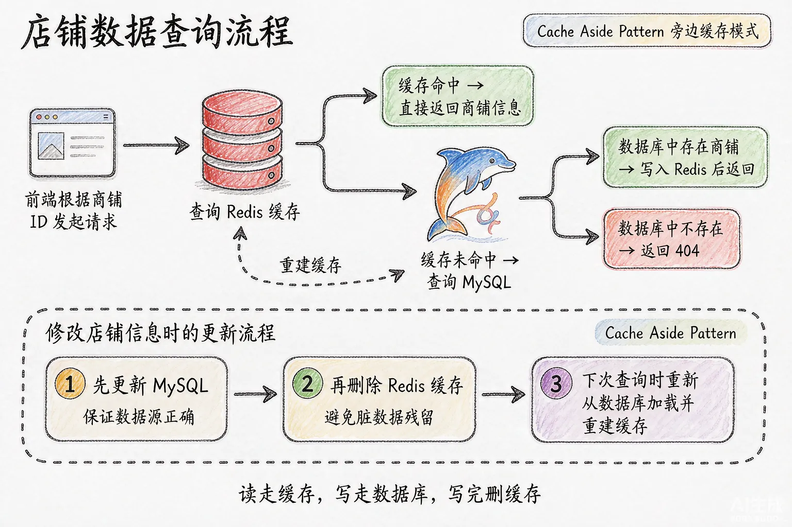

用户查询店铺详情时，基本流程如下：

1. 前端根据商铺 ID 发起请求。
2. 后端先查询 Redis 缓存。
3. 如果缓存命中，直接返回商铺信息。
4. 如果缓存未命中，查询 MySQL。
5. 数据库中存在商铺时，将数据写入 Redis 后返回。
6. 数据库中不存在商铺时，返回 404。

修改店铺信息时，项目采用经典的 **Cache Aside Pattern（旁路缓存模式）**：

1. 先更新 MySQL。
2. 再删除 Redis 缓存。
3. 下次查询时重新从数据库加载并重建缓存。

## 三类缓存更新策略
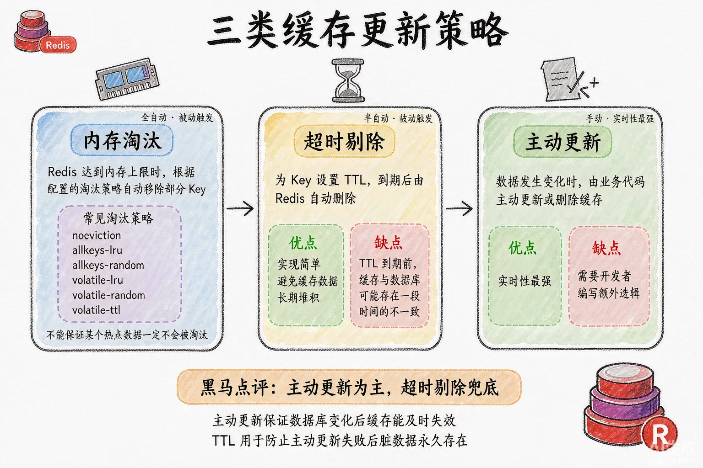

### 内存淘汰

当 Redis 达到内存上限时，根据配置的淘汰策略自动移除部分 Key。它属于全自动、被动触发的方案，开发者不需要主动处理，但不能保证某个热点数据一定不会被淘汰。

常见淘汰策略包括：

- `noeviction`：达到内存上限后拒绝新的写入操作，并返回错误。
- `allkeys-lru`：从所有 Key 中淘汰最近最少使用的数据。
- `allkeys-random`：从所有 Key 中随机淘汰数据。
- `volatile-lru`：从设置了过期时间的 Key 中淘汰最近最少使用的数据。
- `volatile-random`：从设置了过期时间的 Key 中随机淘汰数据。
- `volatile-ttl`：从设置了过期时间的 Key 中优先淘汰剩余 TTL 最短的数据。

### 超时剔除

为 Key 设置 TTL，到期后由 Redis 自动删除，属于半自动、被动触发的方案。

它的优点是实现简单，可以避免缓存数据长期堆积；缺点是在 TTL 到期前，缓存与数据库可能存在一段时间的不一致。因此，需要根据业务合理设置过期时间。

### 主动更新

数据发生变化时，由业务代码主动更新或删除缓存。它是实时性最强的方案，但需要开发者编写额外逻辑。

三种方式可以简单记为：

- 内存淘汰：全自动。
- 超时剔除：半自动。
- 主动更新：手动。

黑马点评主要采用 **主动更新为主、超时剔除兜底** 的组合策略。主动更新保证数据库变化后缓存能及时失效，TTL 则用于防止主动更新失败后，脏数据永久存在。

## 主动更新的三种方案
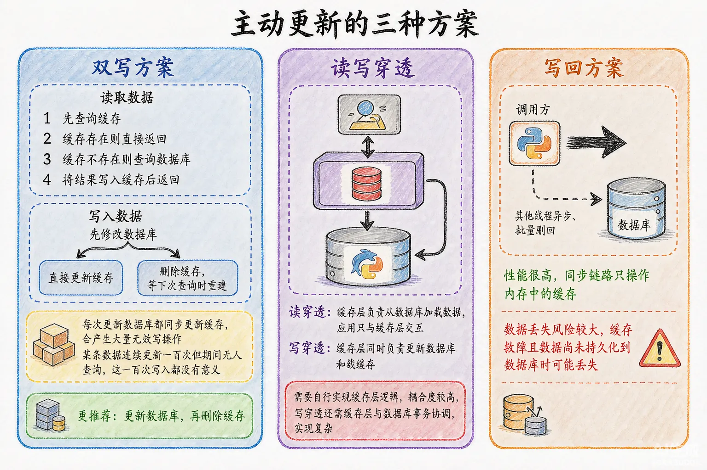

### 双写方案

读取数据时：

1. 先查询缓存。
2. 缓存存在则直接返回。
3. 缓存不存在则查询数据库。
4. 将结果写入缓存后返回。

写入数据时，先修改数据库，再根据情况选择：

- 直接更新缓存。
- 删除缓存，等下次查询时重建。

每次更新数据库时都同步更新缓存，会产生大量无效写操作。例如，某条数据连续更新了一百次，但期间没有任何查询，那么这一百次缓存写入都没有实际意义。

因此，相比“更新数据库并更新缓存”，通常更推荐：

> 更新数据库，再删除缓存。

### 读写穿透

读写穿透把缓存层作为应用和数据库之间的统一入口。

- **读穿透**：缓存层负责从数据库加载数据，应用只与缓存层交互。
- **写穿透**：缓存层同时负责更新数据库和缓存。

它的缺点是需要自行实现缓存层逻辑，耦合度较高；写穿透还需要缓存层和数据库事务进行协调，实现比较复杂。

### 写回方案

调用方只操作缓存，再由其他线程异步、批量地把数据刷回数据库。

它的性能很高，因为同步链路只操作内存中的缓存；但数据丢失风险较大。如果缓存故障，而数据尚未持久化到数据库，就可能发生丢失。

## 先删缓存还是先更新数据库
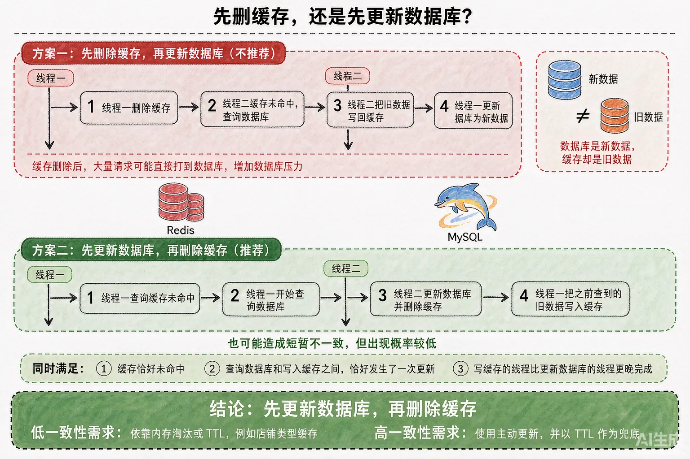

采用“更新数据库并删除缓存”时，还需要考虑操作顺序。

### 先删除缓存，再更新数据库

线程一先删除缓存，尚未完成数据库更新时，线程二发现缓存未命中，于是查询数据库并把旧数据写回缓存。最终数据库是新数据，缓存却可能是旧数据。

另外，缓存删除后，大量请求可能直接打到数据库，增加数据库压力。

### 先更新数据库，再删除缓存

线程一查询缓存未命中，开始查询数据库；此时线程二更新数据库并删除缓存，随后线程一把之前查到的旧数据写入缓存，也可能造成短暂不一致。

不过这种情况出现的概率较低，因为它需要同时满足：

1. 缓存恰好未命中。
2. 查询数据库和写入缓存之间，恰好发生了一次更新。
3. 写缓存的线程比更新数据库的线程更晚完成。

因此，项目通常选择：

> **先更新数据库，再删除缓存。**

对于低一致性需求，可以依靠内存淘汰或 TTL，例如店铺类型缓存；对于高一致性需求，则使用主动更新，并以 TTL 作为兜底。

面试时可以自然地表述为：

> 黑马点评使用主动更新解决缓存和数据库的一致性问题，采用更新数据库后删除缓存的方式，减少无效写操作和并发不一致的概率。同时为缓存设置 TTL，并配合 Redis 的内存淘汰机制兜底。数据库更新和缓存删除应放在同一业务事务边界中，尽量保证整体操作的一致性。

## Redis 缓存异常及解决方案
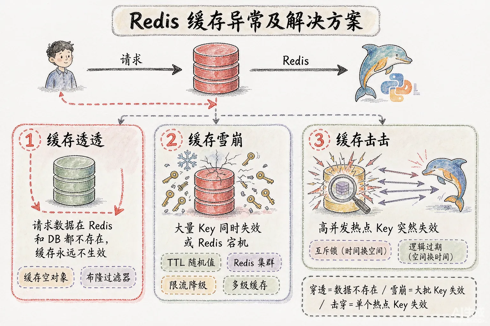

## 缓存穿透
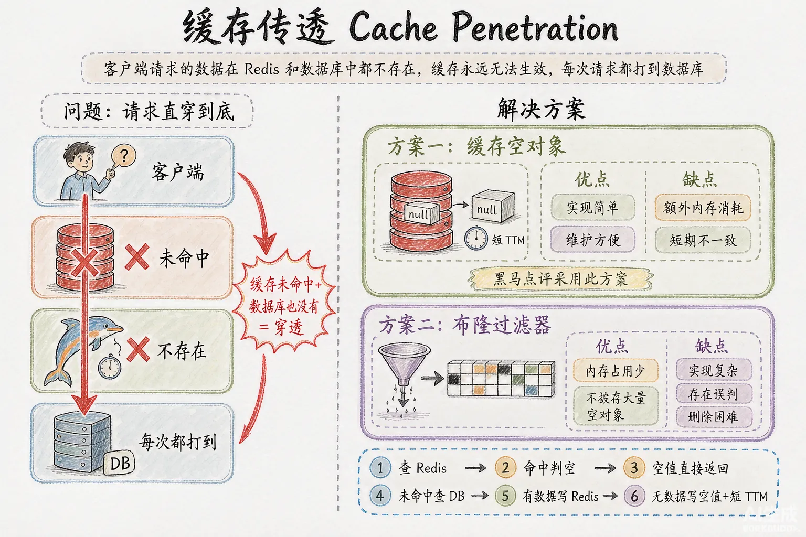

缓存穿透是指客户端请求的数据在 Redis 和数据库中都不存在，因此缓存永远无法生效，每次请求都会打到数据库。

常见解决方案有两种。

### 缓存空对象

数据库查询不到数据时，也把空值写入 Redis，并设置较短的 TTL。

**优点：**

- 实现简单。
- 维护方便。

**缺点：**

- 会产生额外的内存消耗。
- 数据新增后，可能存在短时间不一致。

黑马点评使用的就是缓存空对象方案。流程如下：

1. 根据商铺 ID 查询 Redis。
2. 命中后判断是否为空值。
3. 如果是空值，直接返回不存在。
4. 如果不是空值，返回商铺信息。
5. 如果缓存未命中，根据 ID 查询数据库。
6. 数据存在则写入 Redis。
7. 数据不存在则把空值写入 Redis，并设置较短 TTL。

### 布隆过滤器

在访问 Redis 和数据库之前，先通过布隆过滤器判断数据是否可能存在。

**优点：**

- 内存占用较少。
- 不需要缓存大量空对象。

**缺点：**

- 实现相对复杂。
- 存在误判可能。
- 传统布隆过滤器不方便删除数据。
- 误判仍可能导致少量请求穿透。

如果面试时选择布隆过滤器方案，还要说明它应该怎样接入当前业务，不能只说一个技术名词。

## 缓存雪崩
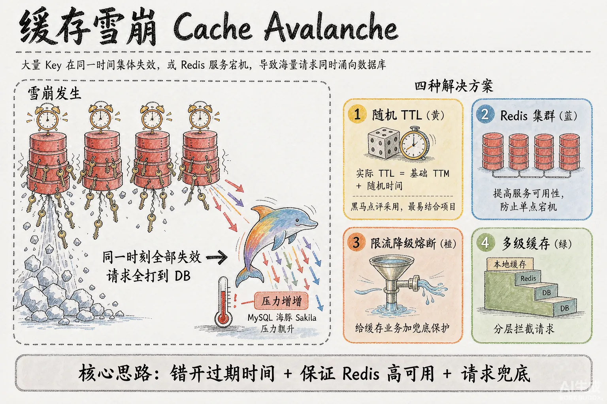

缓存雪崩是指大量 Key 在同一时间失效，或者 Redis 服务宕机，导致大量请求同时到达数据库，给数据库带来巨大压力。

常见解决方案包括：

- 给不同 Key 的 TTL 添加随机值，避免同时过期。
- 使用 Redis 集群，提高服务可用性。
- 为缓存业务添加限流、降级和熔断策略。
- 使用多级缓存。

在黑马点评中，可以通过给不同 Key 的 TTL 添加随机值，避免大量缓存集中失效。例如：

```text
实际 TTL = 基础 TTL + 随机时间
```

这是最容易结合项目说明的方案。如果要回答 Redis 集群、限流或多级缓存，也要准备好面试官继续追问时的实现细节。

## 缓存击穿
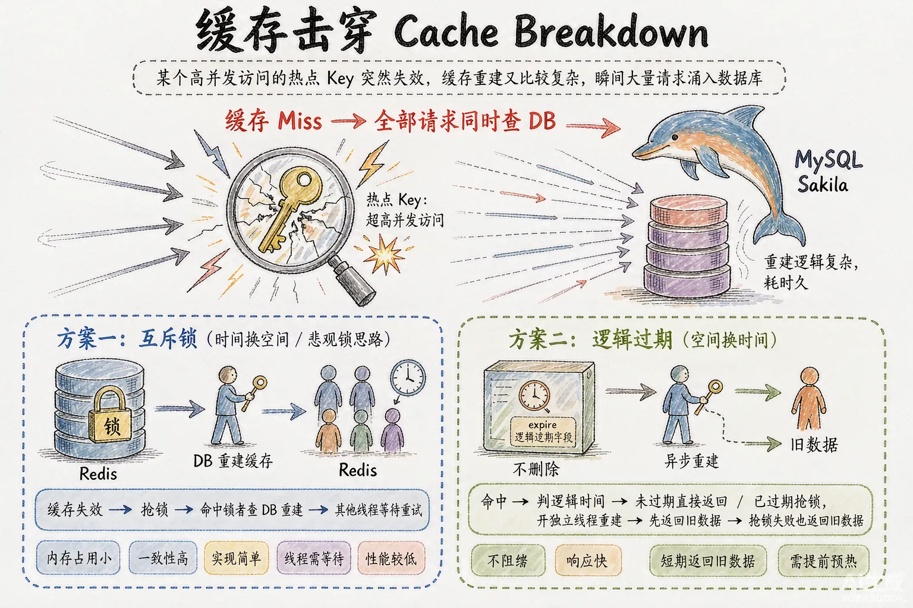

缓存击穿是指某个高并发访问的热点 Key 突然失效，而该数据的缓存重建又比较复杂，导致大量请求瞬间进入数据库。

常见解决方案有两种。

### 互斥锁

缓存失效后，只允许一个线程查询数据库并重建缓存，其他线程等待。

这是典型的*时间换空间*方案，也是一种悲观锁思路。

**优点：**

- 内存占用较小。
- 一致性较高。
- 实现相对简单。

**缺点：**

- 线程需要等待。
- 性能和可用性相对较低。

### 逻辑过期

逻辑过期不依赖 Redis 自动删除 Key，而是在缓存数据中额外保存一个逻辑过期时间。即使逻辑时间已过，旧数据仍然存在于 Redis 中。

这是典型的*空间换时间*方案。

流程如下：

1. 根据商铺 ID 查询 Redis。
2. 如果未命中，直接返回空，通常要求热点数据提前预热。
3. 如果命中，判断逻辑时间是否过期。
4. 未过期则直接返回。
5. 已过期则尝试获取互斥锁。
6. 获取锁成功后，再次检查缓存是否已经被其他线程重建。
7. 如果仍然过期，开启独立线程查询数据库并重建缓存。
8. 当前请求先返回旧的商铺信息。
9. 如果获取锁失败，也直接返回旧数据，避免大量请求阻塞。

逻辑过期把同步阻塞的缓存重建改造成异步重建，可以提高系统响应速度，但可能短时间返回旧数据。它还需要提前进行数据预热，把热点数据加载到缓存中。

> 逻辑过期并不是真正删除缓存，而是增加一个字段标记过期时间，让热点 Key 不会因为 Redis TTL 到期而被自动删除，从根本上避免热点 Key 突然消失造成的缓存击穿。

## 优惠券秒杀：超卖、一人一单与异步下单
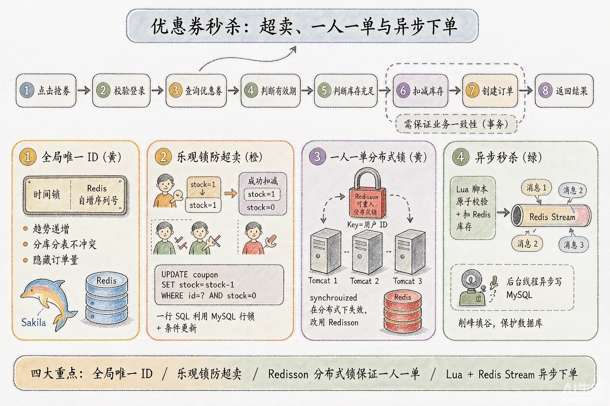

## 秒杀业务流程
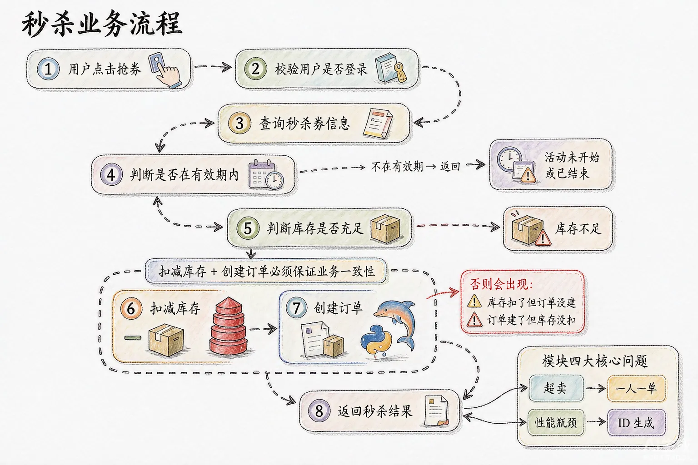

优惠券秒杀的基础流程如下：

1. 用户点击抢券。
2. 校验用户是否登录。
3. 查询秒杀券信息。
4. 判断是否处于有效期内。
5. 判断库存是否充足。
6. 扣减库存。
7. 创建订单。
8. 返回秒杀结果。

扣减库存和创建订单需要保证业务一致性，否则可能出现库存扣减成功但订单创建失败，或者订单创建成功但库存没有正确扣减的问题。

## 全局唯一 ID
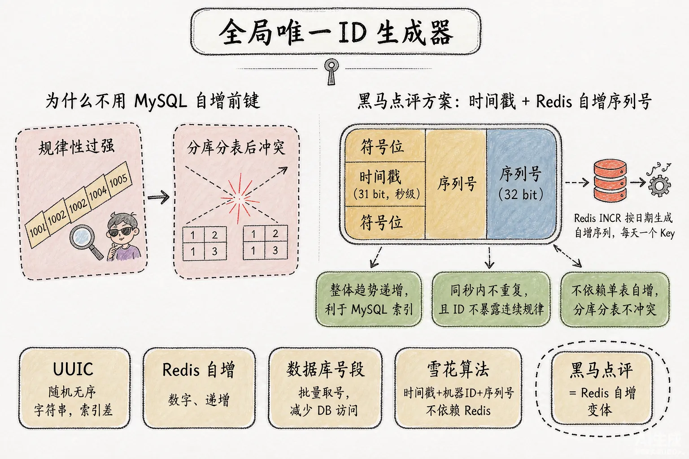

如果订单表直接使用 MySQL 自增主键，会产生两个问题。

### 规律性过强

订单 ID 连续自增，竞争对手可能根据 ID 变化推测平台每天的订单量，存在一定的业务安全隐患。

### 分库分表后可能冲突

每张表的自增 ID 都从各自的起点开始，不同表可能生成相同 ID，无法在全局范围内唯一标识一笔订单。

常见方案包括：

- UUID
- Redis 自增
- 数据库号段
- 雪花算法

黑马点评使用的是自定义全局 ID，整体由两部分组成：

- 时间戳
- Redis 自增序列号

时间戳保证 ID 整体趋势递增，有利于 MySQL 索引；Redis 自增序列号保证同一时间范围内不重复，同时避免订单 ID 暴露明显的连续规律。该方案不依赖单表自增主键，因此在分库分表场景中也不容易冲突。

## 使用乐观锁解决超卖
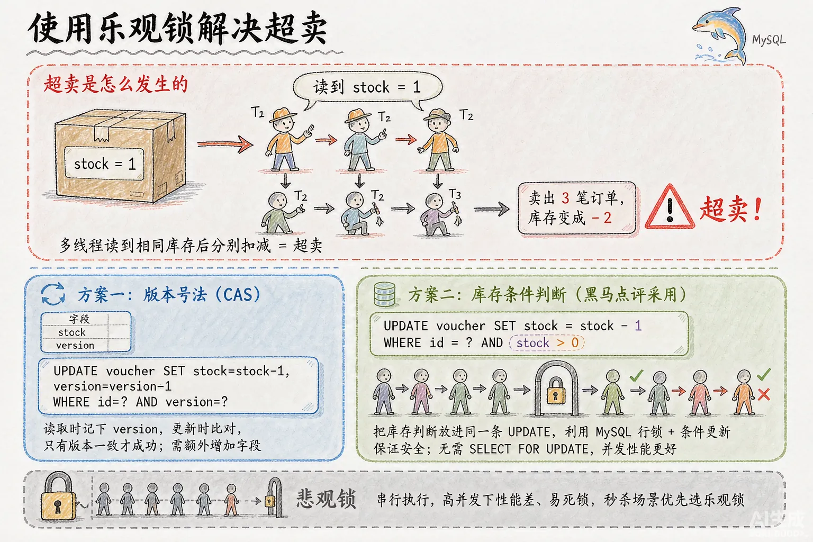

假设库存只剩 1 件，同时有 1000 个用户抢购。多个线程都可能读取到 `stock = 1`，随后分别执行扣减，最终卖出多笔订单，这就是超卖。

常见解决方案包括乐观锁和悲观锁。

### 版本号法

为数据增加 `version` 字段，更新时同时判断版本号：

```sql
UPDATE voucher
SET stock = stock - 1,
    version = version + 1
WHERE id = ?
  AND version = ?;
```

只有版本号仍然与读取时一致，更新才能成功。这属于 CAS 思路，但需要增加额外字段。

### 库存条件判断

黑马点评采用更直接的方式，在更新库存时判断 `stock > 0`：

```sql
UPDATE voucher
SET stock = stock - 1
WHERE id = ?
  AND stock > 0;
```

超卖的本质是多个线程读到相同库存后分别扣减。把库存判断放入同一条 `UPDATE` 语句后，可以利用 MySQL 的行锁和条件更新机制，保证同一时刻只有符合条件的更新成功。

这种方式不需要显式执行 `SELECT ... FOR UPDATE`，并发性能通常更好。

### 悲观锁

悲观锁可以通过数据库行锁让请求串行执行，但在高并发场景下性能较差，还可能增加死锁风险，因此秒杀业务中通常优先考虑乐观锁。

## 一人一单与分布式锁
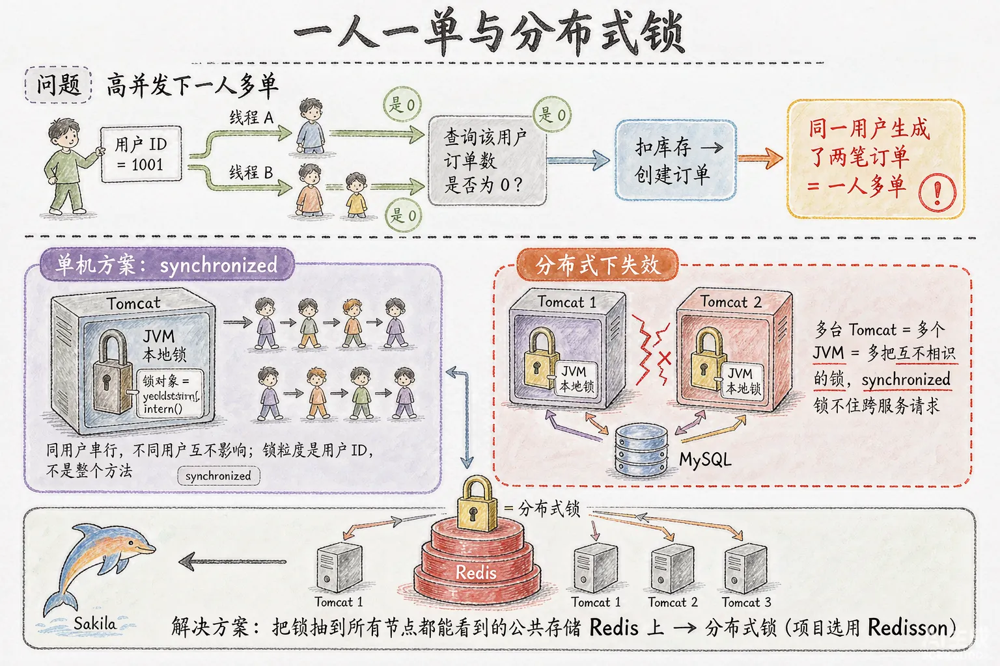

除了防止超卖，秒杀还需要保证同一用户对同一张优惠券只能购买一次。

高并发场景下，两个线程可能同时通过“订单数量是否为 0”的检查，然后分别扣减库存并创建订单，最终导致一人多单。

单机环境中，可以使用 `synchronized`，并以用户 ID 作为锁粒度：

- 同一用户的请求串行执行。
- 不同用户之间互不影响。

但在分布式部署下，多台 Tomcat 拥有不同的 JVM 锁，`synchronized` 无法锁住跨服务请求，因此需要使用分布式锁。

## Redisson 可重入锁
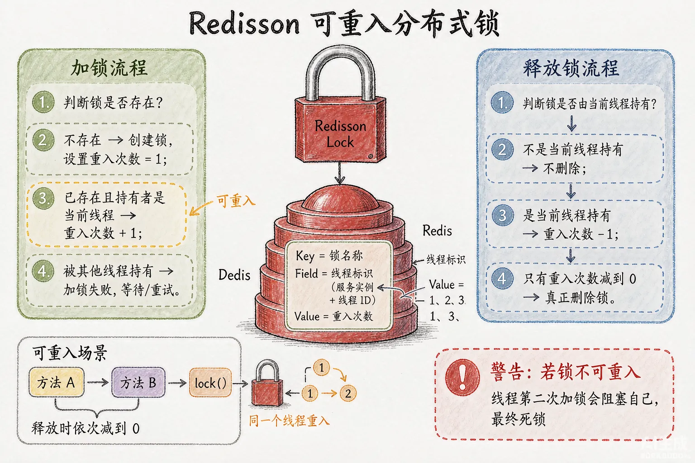

项目使用 **Redisson** 实现分布式锁。Redisson 是 Redis 生态中常用的分布式锁实现，其可重入锁会使用 Redis Hash 保存锁信息：

- **Key**：锁名称。
- **Field**：线程标识，通常包含服务实例标识和线程 ID。
- **Value**：重入次数。

加锁流程：

1. 判断锁是否存在。
2. 如果不存在，创建锁并把重入次数设为 1。
3. 如果锁已存在，且持有者是当前线程，则把重入次数加 1。
4. 如果锁被其他线程持有，则加锁失败，等待或重试。

释放锁流程：

1. 判断锁是否由当前线程持有。
2. 如果不是当前线程持有，不执行删除。
3. 如果是当前线程持有，将重入次数减 1。
4. 只有重入次数减到 0 时，才真正删除锁。

可重入性很重要。例如，一个已经加锁的方法内部又调用了另一个需要同一把锁的方法。如果锁不可重入，线程第二次加锁时就会被自己阻塞，最终形成死锁。

## 为什么释放锁要使用 Lua 脚本
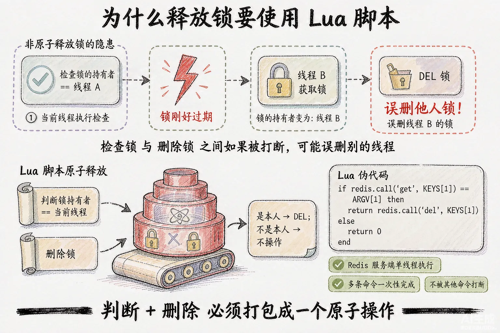

释放锁不能简单地执行删除操作，必须先确认锁的持有者是当前线程。

如果检查锁和删除锁分成两条 Java 指令执行，可能发生以下情况：

1. 当前线程检查后确认自己持有锁。
2. 删除前，锁刚好过期。
3. 其他线程成功获取同一把锁。
4. 当前线程继续执行删除，误删了其他线程的锁。

因此，必须把“判断锁持有者”和“删除锁”封装成一个原子操作，通过 Lua 脚本在 Redis 服务端一次性执行，避免中间被其他命令打断。

## 异步秒杀
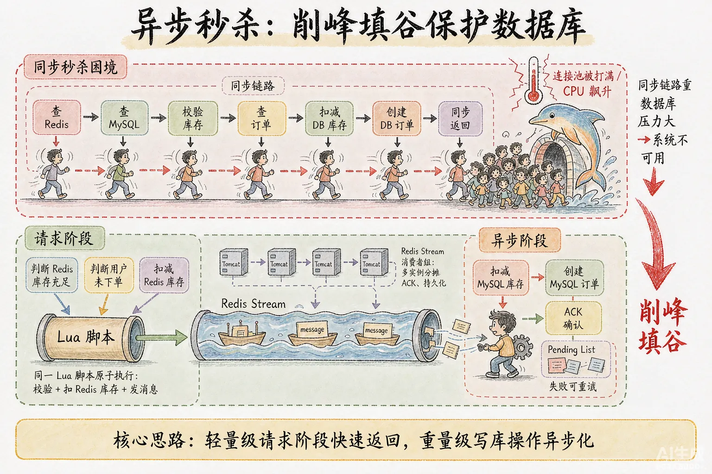

如果每个秒杀请求都同步完成整条业务链路，包括：

- 查询 Redis。
- 查询 MySQL。
- 校验库存。
- 查询用户订单。
- 扣减数据库库存。
- 创建数据库订单。
- 同步返回结果。

那么在数千甚至数万用户同时抢券时，MySQL 连接池可能被打满，数据库 CPU 飙升，最终导致系统不可用。

因此，项目使用异步方式处理秒杀。

### 请求阶段

请求阶段只完成轻量级校验，通过 Lua 脚本原子执行：

1. 判断 Redis 中的秒杀库存是否充足。
2. 判断当前用户是否已经下单。
3. 扣减 Redis 库存。
4. 把优惠券 ID、用户 ID、订单 ID 等信息发送到 Redis Stream。

这些步骤由同一个 Lua 脚本完成，保证原子性。

### 异步阶段

后台线程从 Redis Stream 中消费消息，并完成：

1. 扣减 MySQL 库存。
2. 创建 MySQL 订单。
3. 确认消息处理结果。

Redis Stream 支持消费者组，可以让多个实例分摊消息；同时提供 ACK 确认和 Pending List 机制，消费失败后可以重试。配合 Redis 持久化，可以降低服务重启造成的消息丢失风险。

消费者可以使用类似以下方式阻塞读取：

```text
XREADGROUP ... BLOCK 0 ...
```

当没有消息时，线程会阻塞等待，不会空转消耗 CPU；消息到达后则立即消费。

优惠券秒杀模块可以归纳为四个重点：

1. **全局唯一 ID**：时间戳加 Redis 自增序列号。
2. **防止超卖**：通过乐观锁，在更新语句中判断 `stock > 0`。
3. **一人一单**：分布式环境下使用 Redisson 分布式锁。
4. **异步秒杀**：Lua 脚本完成校验、扣减 Redis 库存和发送消息，再由后台线程消费 Redis Stream 并写入 MySQL。

## 达人探店：点赞、关注与 Feed 流
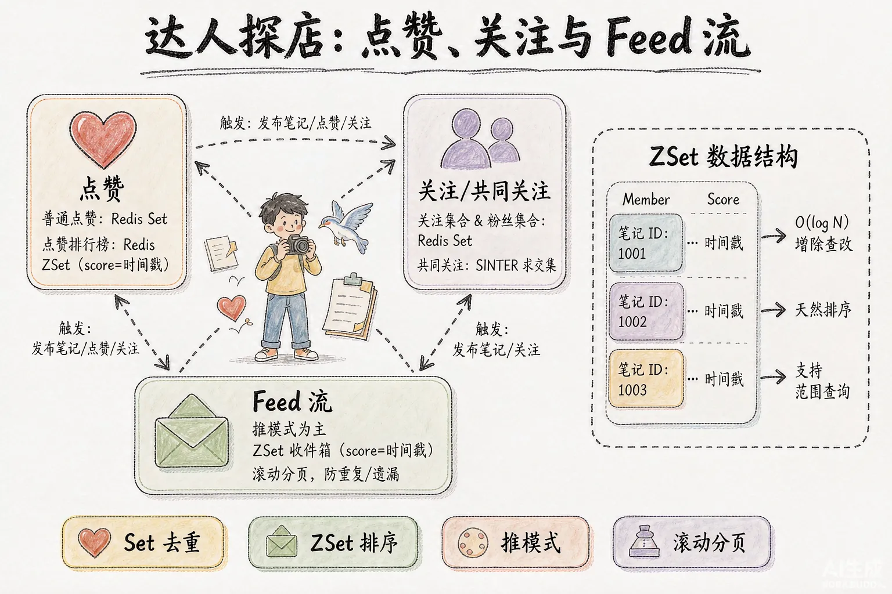

## 点赞功能
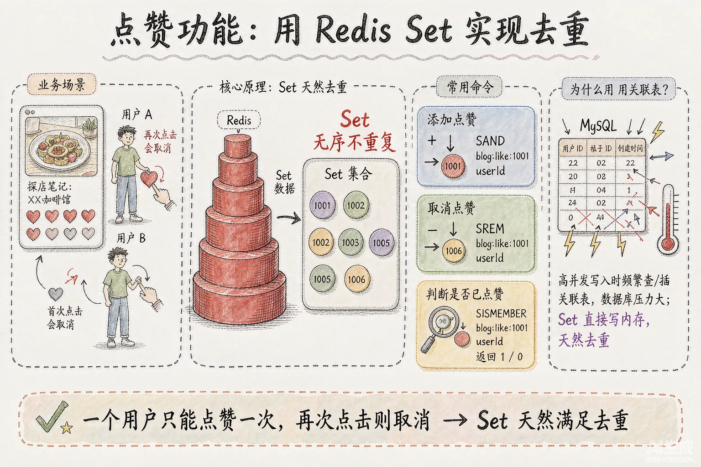

用户可以对探店笔记点赞，一个用户只能点赞一次，再次点击则取消点赞。

点赞功能可以使用 Redis Set 实现，因为 Set 天然支持去重。常用命令包括：

- `SADD`：添加用户 ID，表示点赞。
- `SREM`：移除用户 ID，表示取消点赞。
- `SISMEMBER`：判断用户是否已经点赞。

使用 Set 保存点赞用户列表，比在 MySQL 中维护关联表并频繁查询更快。高并发写入时，也可以减少数据库压力。

## 点赞排行榜
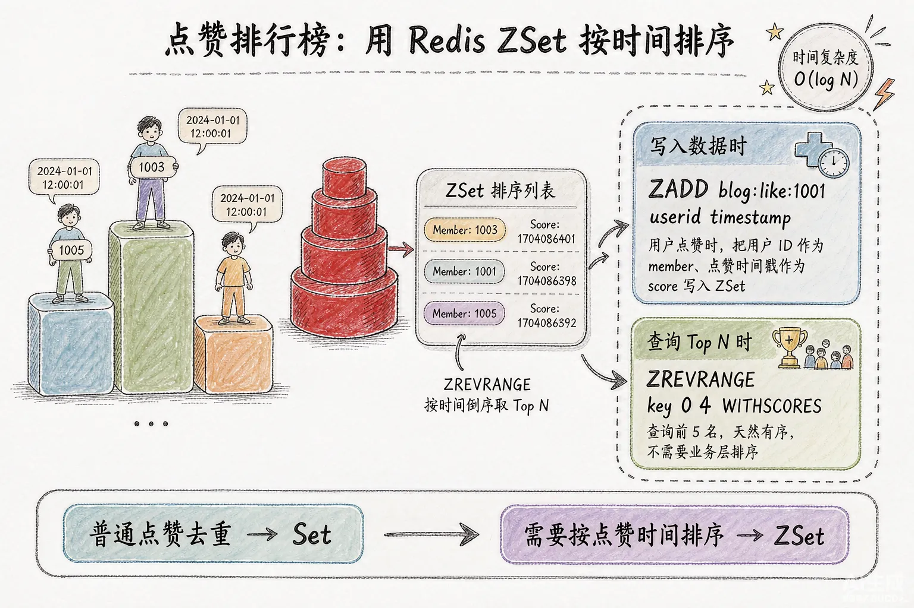

如果需要展示点赞时间靠前或靠后的用户，并按时间排序，可以使用 Redis Sorted Set，也就是 ZSet。

ZSet 中的每个元素都有一个 Score。项目可以使用时间戳作为 Score：

```text
member = 用户 ID
score  = 点赞时间戳
```

点赞时通过 `ZADD` 写入，查询时根据 Score 正序或倒序获取前 N 名。ZSet 天然支持排序，不需要在业务层重新排序，相关操作的时间复杂度通常为 `O(log N)`。

因此，面试时可以说明：

> 普通点赞关系使用 Redis Set 去重；需要按照点赞时间展示前几名用户时，使用 ZSet，把时间戳作为 Score，再按 Score 查询前五名。

## 关注、取关与共同关注
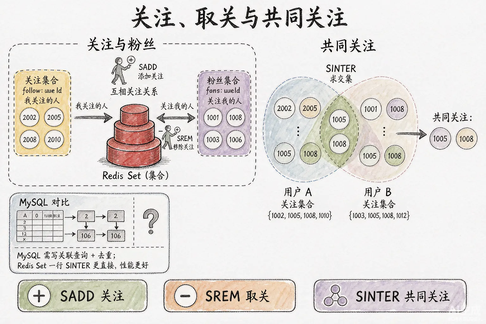

用户可以关注或取关其他用户，还可以查看自己和某个用户的共同关注。

可以为每个用户维护关注集合：

```text
关注集合：存放该用户关注的用户 ID
粉丝集合：存放关注该用户的粉丝 ID
```

共同关注可以通过两个 Set 求交集得到，例如使用 `SINTER`，直接返回两个用户共同关注的用户列表。

如果使用 MySQL，通常需要编写较复杂的关联查询并进行去重；使用 Redis Set 求交集，逻辑更直接，性能也更好。

## Feed 流的三种模式
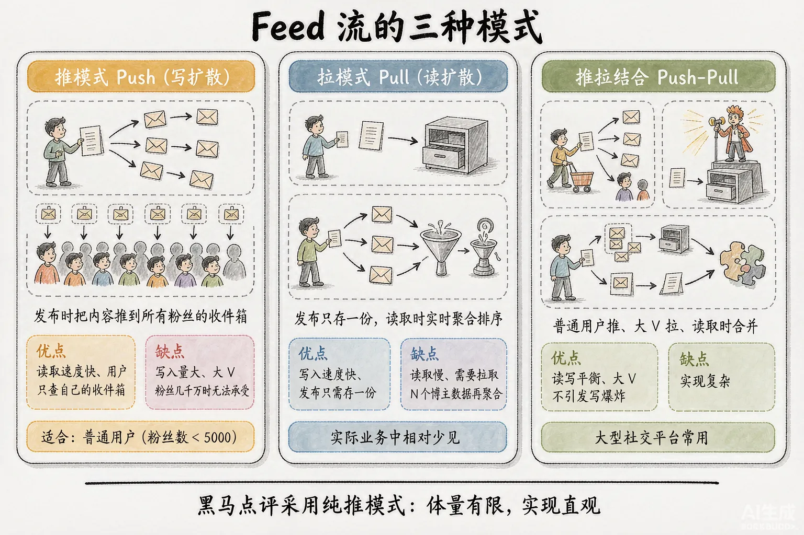

Feed 流用于实现关注内容推送。用户进入关注页后，可以看到所有已关注用户发布的探店笔记，并按时间倒序排列。

### 推模式

推模式也叫**写扩散**。博主发布笔记后，系统把这条笔记推送到所有粉丝的收件箱。

**优点：**

- 读取速度快。
- 用户只需要查询自己的收件箱。

**缺点：**

- 写入量大。
- 如果大 V 拥有几千万粉丝，发布一条内容就需要写入几千万个收件箱，系统难以承受。

推模式更适合粉丝数量较少的普通用户，例如粉丝数小于 5000 的博主。

### 拉模式

拉模式也叫**读扩散**。博主发布内容时只保存一份，用户查看动态时，再实时拉取所有关注博主的内容并合并排序。

**优点：**

- 写入速度快。
- 发布内容时只需要存储一份。

**缺点：**

- 读取速度慢。
- 需要拉取 N 个博主的数据，再进行聚合和排序。

纯拉模式在实际业务中相对少见。

### 推拉结合

大型社交平台通常采用推拉结合：

- 普通用户使用推模式。
- 大 V 使用拉模式，不向所有粉丝逐个推送。
- 用户读取时，再把大 V 内容与自己的收件箱内容合并。

这种方式读写性能比较平衡，但实现复杂。

黑马点评采用的是**纯推模式**，因为项目体量有限，业务实现也更直观。

## 使用 ZSet 保存收件箱
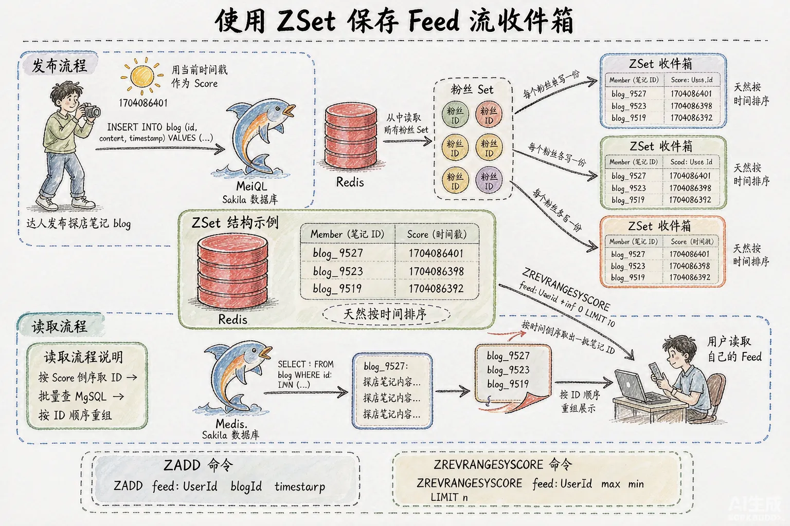

项目使用 ZSet 保存 Feed 流收件箱：

- **Member**：探店笔记 ID。
- **Score**：发布时间戳。

博主发布笔记时：

1. 将 Blog 保存到数据库。
2. 从粉丝 Set 中取出所有粉丝 ID。
3. 把笔记 ID 写入每个粉丝的 ZSet 收件箱。
4. 使用当前时间戳作为 Score。

用户查看关注页时：

1. 从自己的 ZSet 中按时间倒序获取一批笔记 ID。
2. 根据 ID 批量查询 MySQL，获取笔记详情。
3. 按 ZSet 返回的 ID 顺序重新排列结果。

## 滚动分页
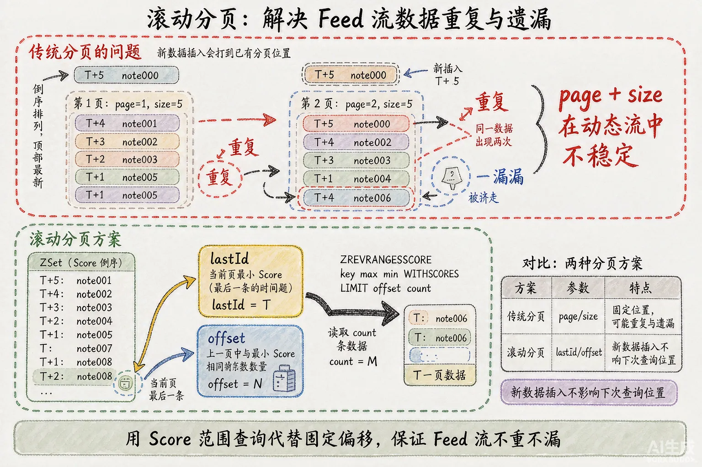

传统分页通常使用 `pageNumber` 和 `pageSize`。但 Feed 流中的新数据会不断插入，如果使用页码和固定偏移量分页，就可能出现数据重复或遗漏。

例如，用户查询完第一页后，又有新内容插入顶部。此时再查第二页，原第一页的一部分数据可能被挤到第二页，导致重复。

因此，黑马点评使用滚动分页。客户端需要传递：

- `lastId`：当前页最后一条数据的时间戳，即最小 Score。
- `offset`：上一页中与最小 Score 相同的数据数量，用于处理相同时间戳。

查询时可以使用 ZSet 的按 Score 倒序范围查询，从上一次结束的位置继续向下读取，从而尽量保证数据不重不漏。对应思路可以使用：

```text
ZREVRANGEBYSCORE key max min WITHSCORES LIMIT offset count
```

达人探店的 Feed 流方案可以概括为：

> **推模式 + ZSet 收件箱 + 滚动分页。**

博主发布笔记时，从粉丝 Set 中获取粉丝 ID，并将笔记 ID 写入每个粉丝的 ZSet，时间戳作为 Score；用户查看关注页时，从自己的 ZSet 中滚动分页取出笔记 ID，再批量查询 MySQL 获取详情。

## 项目面试复习重点
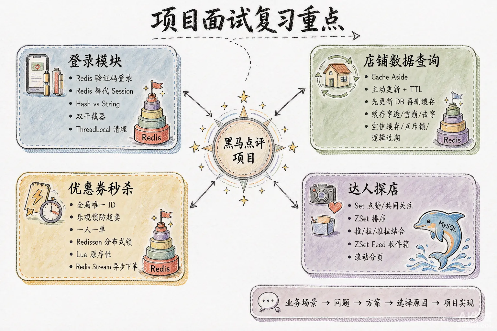

## 四个核心模块
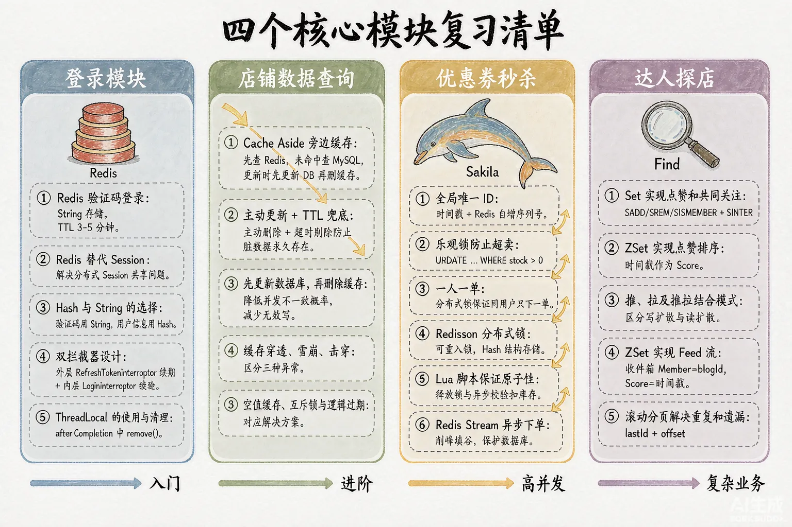

黑马点评需要重点掌握以下四部分：

1. **登录模块**
   - Redis 验证码登录
   - Redis 替代 Session
   - Hash 与 String 的选择
   - 双拦截器设计
   - ThreadLocal 的使用与清理

2. **店铺数据查询**
   - Cache Aside 旁路缓存
   - 主动更新与 TTL 兜底
   - 先更新数据库，再删除缓存
   - 缓存穿透、雪崩和击穿
   - 空值缓存、互斥锁与逻辑过期

3. **优惠券秒杀**
   - 全局唯一 ID
   - 乐观锁防止超卖
   - 一人一单
   - Redisson 分布式锁
   - Lua 脚本保证原子性
   - Redis Stream 异步下单

4. **达人探店**
   - Set 实现点赞和共同关注
   - ZSet 实现点赞排序
   - 推、拉及推拉结合模式
   - ZSet 实现 Feed 流
   - 滚动分页解决重复和遗漏

## 面试表达方式
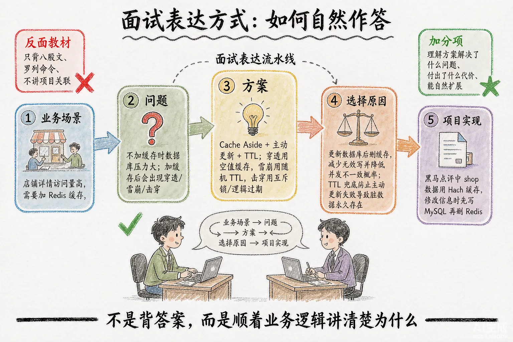

这些内容可以背，但不能背得过于僵硬。面试时最好按照“业务场景——问题——方案——选择原因——项目实现”的顺序表达，而不是只罗列八股文。

例如，回答缓存一致性时，可以先说明店铺数据需要缓存，再解释为什么采用主动更新，接着说明项目选择“更新数据库后删除缓存”，最后补充 TTL 作为兜底。回答秒杀时，也应该先讲超卖和一人一单的业务风险，再引出乐观锁、分布式锁、Lua 脚本和 Redis Stream。

最关键的一点，是通过黑马点评真正加深对 Redis 的理解，而不是只记住某个命令或固定答案。只有理解每种方案解决了什么问题、付出了什么代价，面试官继续深入追问时，才能根据自己的理解自然作答。

这些内容可以背，但不能背得过于僵硬。面试时最好按照“业务场景——问题——方案——选择原因——项目实现”的顺序表达，而不是只罗列八股文。

例如，回答缓存一致性时，可以先说明店铺数据需要缓存，再解释为什么采用主动更新，接着说明项目选择“更新数据库后删除缓存”，最后补充 TTL 作为兜底。回答秒杀时，也应该先讲超卖和一人一单的业务风险，再引出乐观锁、分布式锁、Lua 脚本和 Redis Stream。

最关键的一点，是通过黑马点评真正加深对 Redis 的理解，而不是只记住某个命令或固定答案。只有理解每种方案解决了什么问题、付出了什么代价，面试官继续深入追问时，才能根据自己的理解自然作答。
