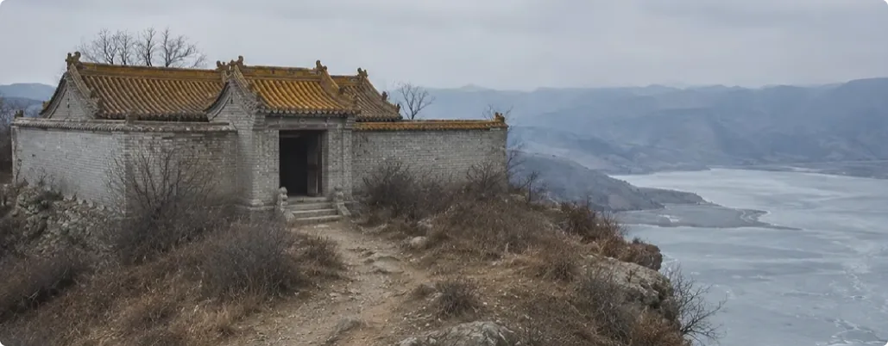
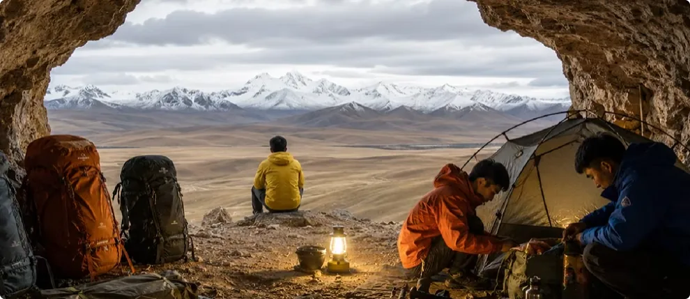
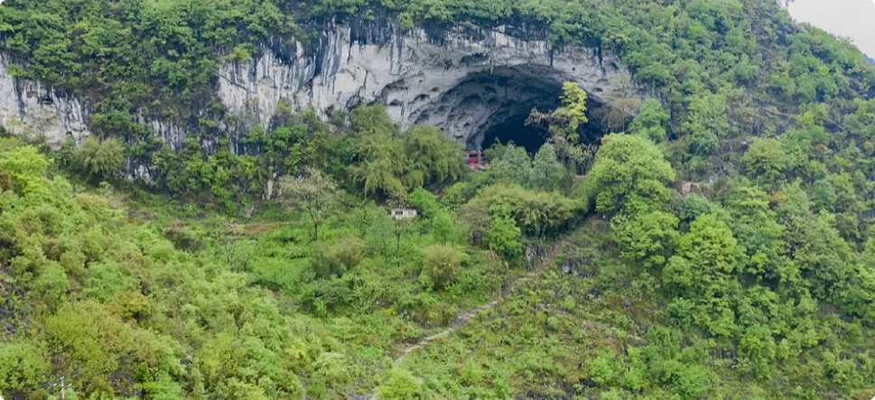
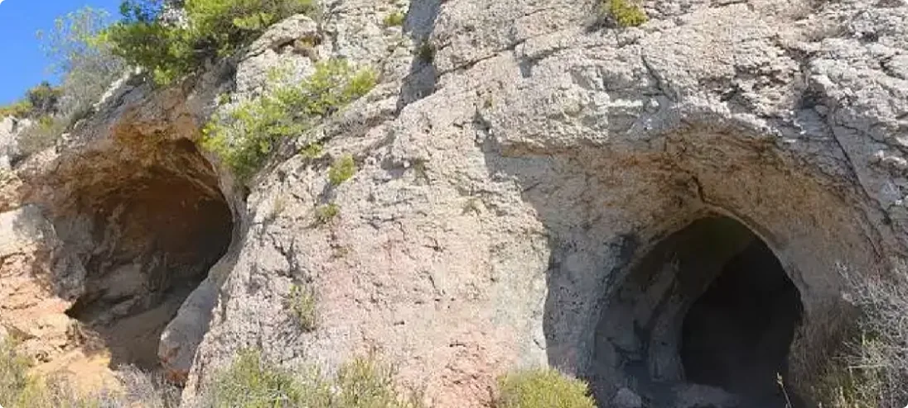
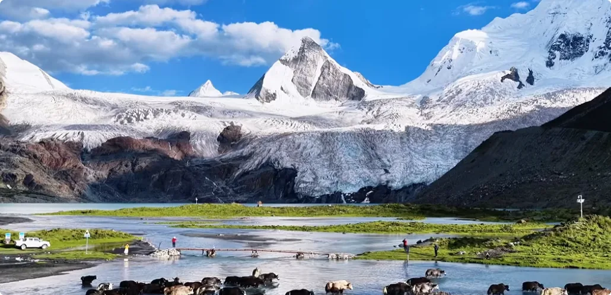
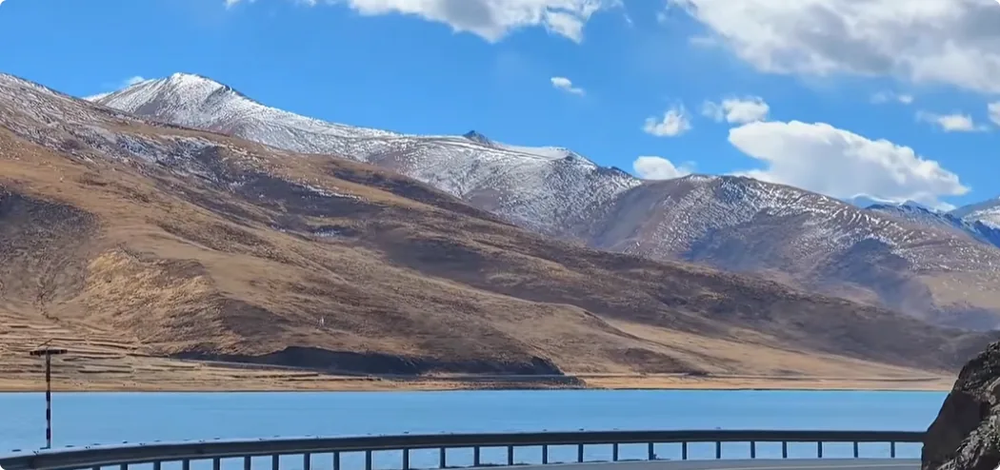
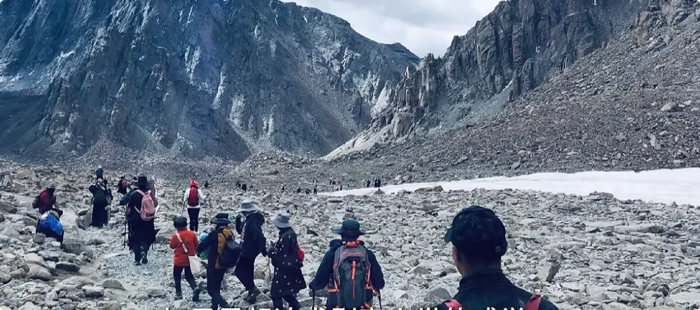
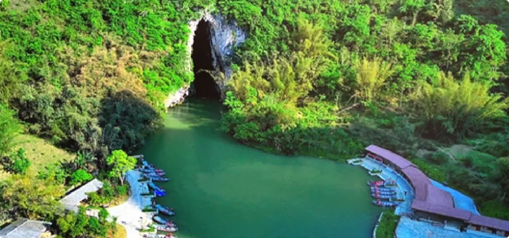

>url: https://www.youtube.com/watch?v=_lSu0pTcLA4
>作者: 修炼者小烨
>

户外有些地方鬼很多，徒步的朋友最好不要去。

上期我讲了怎么选酒店，讲了诡异类的阴性生灵他们在城市中怎么生存。这期我们继续来了解一下，在户外他们又会在哪些地方活动。

## 人民碎片和两大学生掉湖事件
先来聊一个户外博主。有一个叫某某过江的博主，他前两年在户外徒步的时候，好几次都发现了人名碎片。他那几期的视频里，整个人都散发着鬼气。修炼过的朋友可以看出来，为什么他身上的鬼气那么大呢？

因为他为了追求刺激，喜欢跑去荒野地带和荒废古迹里探险。那些地方鬼本来就多，而且他还喜欢挑战身体极限，去极端环境徒步。一边去鬼多的地方，一边不把自己的生命当回事儿。这样一来，野外的鬼就不得不盯上他了。

**灵质世界有个规律叫同气相求，就是人身上是什么气，就会招来什么东西，就会遇到对应的事情。**
所以当这个博主经常去一些鬼气多的地方，身上的鬼多到一定程度的时候，鬼就能干扰他的判断，会带他去死气重的地方。这就是为什么他老碰到人民碎片。

他去年在汾河二库探险的时候，他沿着水库的一条山脉徒步，快走到头的时候出现了一个野庙。他当时走进去看，庙还有点新，看起来有人在打理。他喊了两声，却没有人回应。

但是突然他听到了类似电锯的声音，然后他有点害怕，就打算走了。走之前，他用铁丝把门把手拴好，把门关严实，然后他就沿着山脊继续往下走，走到水边。

当时正是冬天，水库上结了厚厚的冰。他拿起旁边的石头去砸冰面，想看看有多厚。等他去挑石头的时候，挑着挑着，他就发现枯草里散落着很多人的骨头。

他一开始也被吓到了，然后又冷静下来拍照取证，然后才转身回去。等他回到那个野庙的时候，他发现野庙的门又开了。他吼了两声：“有人吗？”发现还是没有人回应。
这时候他就真的害怕了，因为明明就有人，但是又不回应他，而且水库边还有尸
骸。换谁都会害怕，里面是个杀人犯。然后他撒腿就跑，心率飙到180。
跑回去的路上，他身上的摄影设备无意间拍到庙这一侧的冰面上有一大块冰窟窿，应该是有人凿冰捕鱼留下来的。

结果三天后，新的冰重新冻上了薄薄的一层，基本看不出来。刚好有两个大学生计划骑电动车穿越水库冰面，然后这两个人都掉进这个冰窟窿里死了。

大家知道这件事诡异在哪吗？在于一种巧合，好像有一股无形的力量，把这些不好的人事物聚在一起。如果说你修炼了，你就知道这里面是厉鬼在作怪。

首先，这整个山头盘踞着厉鬼，有大的也有小的。野外的很多庙，人们以为是自己主动给神灵修了庙，其实是那些大的妖魔鬼怪让人类帮他们修的。该修在哪些地方，他们都会潜移默化地告诉那些人。
**有些地方的阴灵，吃吃人的香火和生气就可以了，也不会明面上搞死人，不然没人敢来烧香。而有些地方的阴灵太凶，就是要吃人的。**

比如这个水库旁边的庙，那两个大学生肯定早就被很多鬼缠身了，气场弱到鬼都能影响他们的判断了。当他们安排去水库的时候，他们身上的鬼就提前去跟那个庙的鬼打招呼，串通起来下套。
庙里的鬼又会去找附近阴德差的人，给这个人一个鬼点子，告诉他可以凿开冰面，趁美人偷偷捕鱼。就这样，鬼借人的手，提前三天在大学生必经的路线上埋下隐患。等三天后，水面结出一层肉眼看不出来的薄冰，然后杀人于无形。

这世上没什么意外，所谓的意外都是计划好的杀人。对于灵界来说，杀人不需要杀人，犯的巧合够多就行。
水库旁边的尸骸，也许只是以前的旧坟被水冲开了。水库边的庙平时肯定也有人打理，本来是很正常的事情，但是偏偏营造出了有杀人犯、你看不见我、我看不见你的阴森氛围。

这其实就是鬼类生灵最喜欢的把戏。他们想吓破人胆，让人失魂，因为失魂状态最容易附体，失魂的人可以吃很久。

这个博主最后心率飙到180，可见被吓成什么样了。这个博主身上的鬼太多了，就讲到这儿，我写不下去了。

## 关于户外过山洞
我还关注过另外一个户外博主，是个大学生，家里的底子应该也比较好。他经常去青藏高原一带徒步。他以前看起来非常开朗，但是他现在抑郁了，知道为什么吗？

因为他户外活动的时候，经常会躲到山洞里休息和过夜。山洞不是人该待的地方，很多阴性生灵都是住在山洞里的。或者应该这么说，野外修炼的大妖、大魔、大鬼都是住在山洞里的。
你想，方圆多少公里才会出现一个天然大洞穴？这个地方能是一般的小妖小鬼住的吗？

有些地方你别看它风景秀丽，但是只要出现一个特别大的天然洞窟，远看黑漆漆的，像一只大眼睛似的窥视你，那这种百分百有大家伙住在里面。知道为什么吗？
**无形世界讲究一个形神兼备。看起来阴的东西，它背后积攒的气就是阴的；看起来邪的东西，它背后一定附着邪的生灵；看起来凶的东西，它一定带着煞气或者杀气。**

所以不要被人间的营销掩盖了自然风景本来的面目。棚里，我们来看看各种自然风光，它们背后会散发什么气息，这些气息会吸引来什么生灵，又会引发什么事情。

## 关于徒步路线的选择
哪些户外徒步路线不建议去？

### 1. 忌高海拔登山
首先是高海拔登山。

雪山很美、很高，也很大、秀美，而且是超脱世俗的美，说明蕴藏的气很正，是好的，能使人清明。但是它又很高耸，有的山峰很尖锐，有的很钝，再加上体积又大，走近一点看，就像有一把大刀压在你的脑门上。

所以说明雪山的气息也很凶，是可远观而不可亵玩的。
有一句话叫 *“灵山脚下狮驼岭，菩萨心肠，金刚手段”，* 其实就是这类风景了。雪山是可以让你赏心悦目，清明你的头脑，但是你要想去打扰它、征服它，动机就不对了，那就完蛋了。

为什么有的雪山突然就起风了、下大雪，让人难以登顶？原因就在这儿了。很多雪山脚下全是大鬼，专杀不懂事的人。

### 2. 寻开阔具有层次之地

想要去看雪山，远远地看看就可以了。比如说萨普神山的徒步路线就很好，去正面看一看。你看雪山，雪山也低头看你，相互尊重总比跑到人家头上好。

还有洋湖自驾路线，隔着古蓝色的大湖远远地看看。宁金岗桑峰，**知自己于天地间渺小，方生敬畏自然之心。** 你能发这个心，神灵都愿意多看你一眼，说不定就帮你开窍了，这点意义非凡。

这两条路线共同的特点是什么呢？就是风景很开阔，很有层次感。

**所谓形存则神存，行不正则气不顺。风景开阔，心神就能放松，你的气息是向上走的。相反，如果风景太逼仄或者太凶险，你的心神就是一直吊着的，气是持续损耗的。**
其次，风景有层次感。尤其是远方有一座可以遥望的美丽的雪山，这种风景会引导人向远处看，告诉你人外有人，山外有山，远方有更值得追寻的目标。人的心结会被引导慢慢放下，人的格局和心气会打开。

大家有机会可以找些类似的地方徒步游玩，去对比一下，是不是回来之后你的心气神会不一样。理解这个，你就能大致理解我所说的修炼了。
其次是重装徒步和超长距离徒步，好几天都在外面待着的那种。

如果是想追求剥离尘市的感觉，想回归简单原始的状态，其实没必要选太荒凉的地方。太荒凉的地方是没有生气的。
比如鳌泰县山脊、羌塘无人区这类寸草不生的地方，有的地方还裸露着刀片一样的山石。这种膳食会散发尖煞之气，人在这些环境别说充能了，还可能被刮掉一层。
生气在哪儿？那些地方生气本来就少。如果说刚好有厉鬼镇守在附近的话，有时候真的会杀几个人，拿人的生气去匀下当地的气息。
所以太荒凉的地方，除非是顶级的修炼者，能扛得住凶杀煞气，否则捞不到好。

### 3. 忌原始森林
可能有人会问，那原始森林路线呢？那种地方不荒凉了吧？肯定充满生机。

其实不然。就算有生机，也是很原始、很纯粹的生气，不适合还要在城市生活的人，而且也不会显露出来。反倒是原始森林周围的毒气、瘴气和迷幻之气，也保持着原始和纯粹，会吸引很多大家伙来修炼。

很多大妖大魔就是待在原始森林里修炼的，修的就是很原始的那种毒瘴之气或者致幻之气。

为什么很多地方会磁场混乱，让人迷失方向？其实就是在猎杀擅自闯入的人。比如哀牢山、黑竹沟这种**原始森林，真的属于你凝望深渊，深渊也凝望你的那种**。

所以重装徒步这类活动，折中点可以找路面开阔又有生机的路线。比如川西有很多开阔的美景，有山、有水、有绿地，只要确保不高反，都可以去。
再者是一般的山地徒步，青徒步一日游的那种。这种可以选择成熟的步岛。同理也要选风景开阔的、看了心旷神怡的、不会有负面情绪的那种路线。
尤其是临近大海、大湖，甚至是湿地旁边的那些步道。这些地方的路线很多是神灵教人来开发的，是专门用来滋养人类的。

### 3. 忌险峻之地
如果是险峻的山，哪怕已经修了路，也不太建议去。因为险峻的地方肯定是凶的，有些地方还要吃人，常常有人不知不觉踩空，跌落悬崖。

如果是素溪，可以选水面相对比较宽、水质清澈、水流平缓、整体视野开阔的地方，也就是阳光可以轻松照到、风可以轻松吹到的地方。
不要去沙坳里的小溪流，树荫多，黑漆漆的，里面的小景观多得不得了。经常去这种地方，人都要变呆傻，尤其是有孩子的朋友。

### 4. 忌洞浅和洞窟
最后讲一下探洞。
任何洞浅和洞窟，通通都不建议。
**天然洞窟是大妖大魔的天然洞穴，人造洞窟是野鬼避风的地方。**
很多水洞也是一个道理，水洞年年有人死。专业人士要去做研究，跟普通人没关系，普通人不要跟风去寻找刺激。
还有一种是出水洞，这种属于众生的水源地，这种地方也不要去。因为涉及众生的生存来源，一定会安排厉鬼或者大妖大魔来把守洞口。他们会围在洞口外围一圈，不让任何生林污染水源，谁乱来就杀谁。

*涉及杀生这种事情，霸道一般都不是让神灵来做的，而是让厉鬼来做。*

## 结尾
好了，以上就是关于户外徒步的一些建议。

这期我也不弯弯绕绕了，直接把最凶的、最可能害人的地方和最适合人放松的地方点出来，让大家明白不同的地方会蕴藏什么气息，会住着什么生灵，什么情况下他们会伤害人，以及好的地方为什么好，是怎么帮助人恢复精气神的。
本期的图片大家可以多看看，多对比一下，不好的地方是什么感觉，好的地方又是什么感觉。

以后大家出门徒步可以靠眼力判断，知道哪些地方不对劲，哪些地方可以放心去。当然，最好还是有条件就修行修炼。
大家选择户外徒步，大多是为了逃离社会的那张大网，想找个地方静下心来做回自己，感受自由，恢复精气神。这个动机其实跟求仙问道差不多了，修炼修仙的人不就是这样吗？

**想远离尘世，想安静下来，想做回自己，向往真正的自由，想保持高能量的状态，这些都是相通的。**

但是单纯靠户外徒步，是很难达到这种状态的。想要彻底解脱，想要在这个世界上游刃有余，那么还得踏入真正的修炼之道，学会真正地欣赏风景。

我是修仙者小烨，我们下期再见。