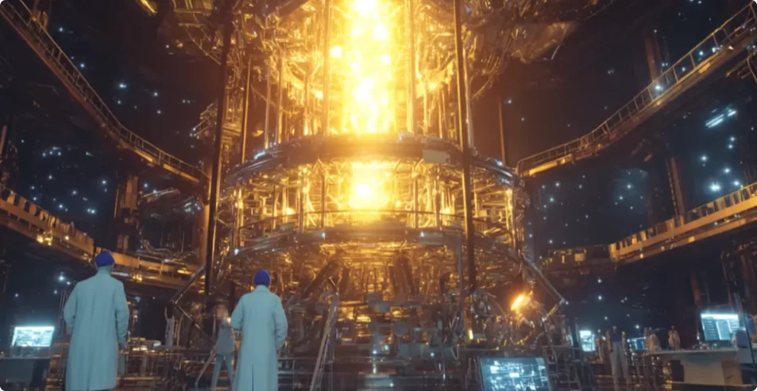
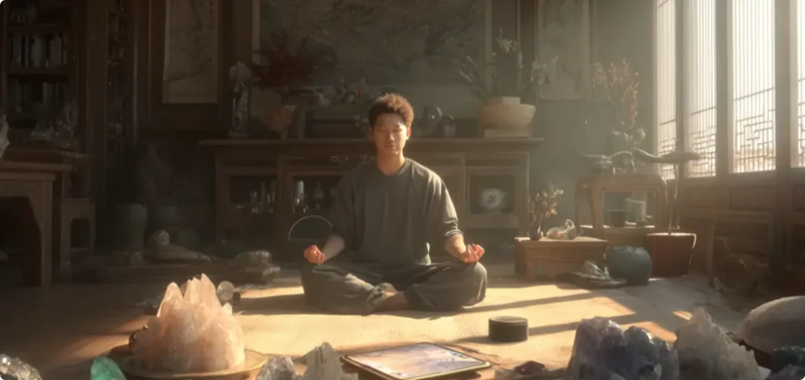
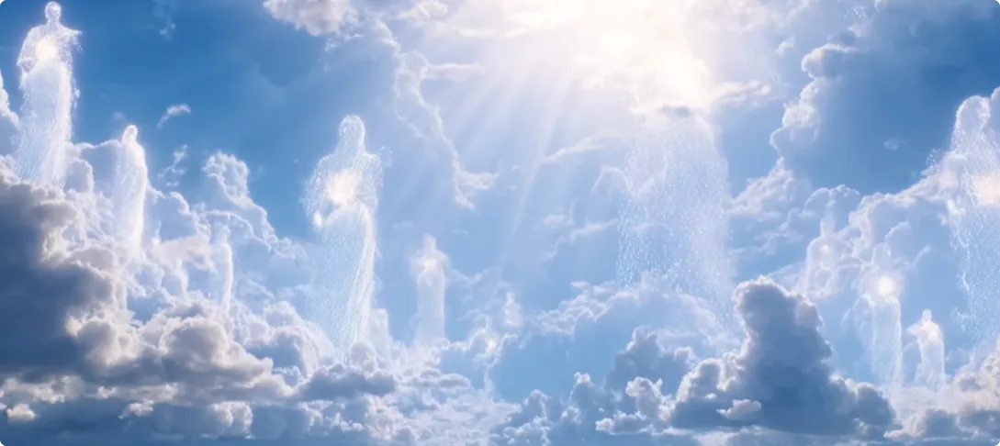
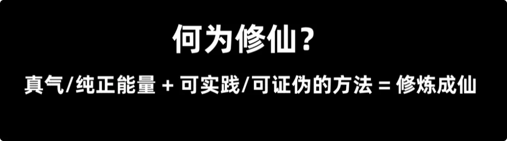

最近，越来越多的人开始借助算命来规划人生。至于为什么慌了，懂的都懂。

在未来，会有更多难以解释的事情发生，并且在一定程度上改变人们原有的认知。无论这些超常规事件背后是好是坏，其实都有同一股神秘力量在推动。

其背后主要有两个目的：
一个是启蒙修行,
一个是警示。

## 第一，启蒙修行

人类的主要问题就是灵性太低，或者说灵智太低，导致人类沉迷于物质世界的虚像中无法自拔。

在有限的百年寿命里，人人都选择优先满足无尽的欲望。哪怕已经获得很高的地位和财富，人类仍会觉得不够多。
因为旧的欲望不断被满足的同时，新的阈值也会不断提高，最终无止境地追求更大的精神刺激。

哪怕是那些自诩理性的聪明人，也常陷入历史经验主义，将弱肉强食当作必然。

任何人都有自己的弱点，而阉割过的信息就是聪明人的致命弱点。
**完整信息是理解事物原貌的根本前提，而信息天然自带流通权和定义权。这意味着再聪明，也做不到还原文明发展的本貌。**

到最后，人们总是从阉割过的文明记忆中捕风捉影，继续弱肉强食、及时享乐的行径。每次都是师出有名、冠冕堂皇，实际私底下从不约束自己的私欲。
这种戏份反复重演，仿佛成了人类无法摆脱的宿命。而那些真正能经得住诱惑、不被名利腐蚀的人少之又少，这种少数根本不足以改变文明的整体走向。

听到这里，大家可能会疑惑：为什么要启蒙修行？为什么不是带来科技文明的进步？
网上流传一个说法，叫“百年之约”: 
*说人和神魔签订契约，在百年之内，神和魔都不打扰人间的发展。*

但这个说法并不正确。人类还没这个资格和神明立什么约定，毕竟没有哪个人敢说自己守信用。

事实上，只是神明单方面地在明面上不打扰人发展科学知识和技术。
因为人类总抱怨，是因为生产力不足才导致了争端。因此这些年，神明默默地帮人发展科技。这些科技宛如神迹一般迸发，截至目前，已经能做到空气合成糖、淀粉、蛋白质，有清洁的能源，有发达的农业和工业，人工智能可以替代大部分劳动力等等。

如此一来，生产力可谓是到达了顶峰，人类再也不能拿生产力不足为借口了。
最后人们将会发现，问题的根源不是生产力不行，而是分配不行。
分配不行的背后是人性不行，人性贪嗔。
人性不行的背后，是灵智不够、修行不够，无法约束人性的阴暗面。

而想要承认自身的错误，对于低灵智的人类来说是非常困难的。哪次不是不到黄河心不死、不见棺材不落泪？只有吃下沉重的恶业，或者被逼入退无可退的时候，人类才会痛改前非。
所以，疼痛是必要的。强烈的疼痛之下，人们才会放下贪念、嗔念和痴念，开始反思是什么导致了自身魔怔的行动，而这会是人类集体迈向修行的第一步。
届时，人们会开始明白，修行不是精神世界的奢侈品，而是生存的必需品。

**真正的修行，其实就是修炼灵智。通过体会万物连接，一个人能够理解他人、理解自然、理解宇宙，学会慈悲与共情。** 
如此，便不再痴迷于小我，不再痴迷于低层次的欲望。
人们会逐渐明白，无论作为个体还是集体，真正有价值、有意义的追求是什么。届时，人类是为了生活而发展必要的科技，而不是为了无尽的竞争。

有人可能会问：如果是为了启蒙修行，如果是让人相信形而上的世界，那最直接的方法不应该是直接显露神迹吗？这样大家都会相信神了，都去修行了。

这种问题就属于头痛医头、脚痛医脚，缺乏整体性、洞察性、共情性思考的灵智表现。

首先，显而易见的是，人类肯定会开始摆烂，变成行动上的巨婴，会用道德绑架神明。大部分人会认为，既然都有神明了，那就让神明来保佑我们的幸福，来惩罚世间的诸邪，我等凡人只需要安心度日、享福即可。

如果神明真这么做了，那以后人们都许愿就可以了，都等着神明兜底。如果神明不这么做，那人们会觉得，这就是弄虚作假的、不慈爱的伪神，凭什么干涉人类发展？然后又开始“我命由我不由天”了。

总之，神明直接降临的做法无法达到启蒙人类修行的目标。

因此，在当前阶段，是先将人们的目光逐步吸引到超常规、超科学的事情上来。以此提醒人们，世界不只有生老病死、衣食住行、功名利禄。
越来越多的人会觉醒修行的意识，主动寻找新的出路。

尽管越来越多的人会开始修行，但绝大多数的人是找不到路的。因为大部分世人的灵智都不够，习惯把修行当成一种免费流通的无形价值的信息消遣，习惯了不花费功夫就能得到秘诀。这跟沉迷于成功学没有本质区别，只能在修行的底层徘徊，见不到真章。

换句话说: 
只有极少一部分的人能抓住修行的核心，能清醒地认知到真正的修行等同于脱胎换骨，等同于二次生命；
能把修行当作长远投资的高价值事物，准备好双手谨承圣阶。这样的人，才有资格摸到真正的道路。

## 第二，警示

很多博主也讲过相关的话题，我就不讲这些了。毕竟我不懂算命，也对这些不了解。
经常听到有人破罐子破摔，说就算万劫不复，那也是人类自己的选择，反正都是人来承担因果。要真这么简单轻松，因果早结了，不会有今天。

之所以没结，恰恰是因为人类文明不只是人类自己的事情。

往期我讲过，人类本就是作为众生修行的"中转站"。
在文明的演化中，已经有太多的神明投入了太多的心血。他们觉得人身上仍有闪光点，于情于理，他们都觉得不应该这么轻易放弃，仍应当把人类引到修行这条路上来，而不是直接关机重启了事。

可以说，这是大道慈悲的一面。

但也有部分神明不这么认为。他们觉得人性已经无可救药，失败品终究是失败品，不必救赎，也不必犹豫。有这个教导的心力，还不如投入更重要的新事物。

可以说，这是大道无情的一面。

不过，到底人类文明何去何从，终究要由众生自己去选择、去造化。神明也好，凡人也罢，选择了，必有所为，才能具象化文明最后的走向。

**慈悲论迹不论心。** 
凡做出正确选择、长远规划者，必有其应得的果；
反之，选错路、目光短视者，终落得两手空空、一无所有。

我是修炼者小烨，我们下期再见。