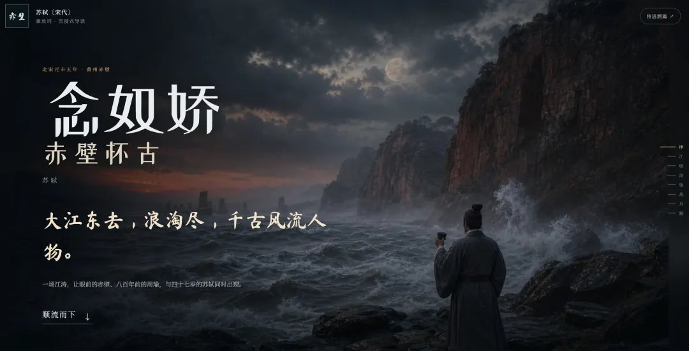

课本立体模型、手帐拼贴玩腻了，有人把「走进诗里」收成一个 Codex Skill：`$immersive-poetry-page`。给一首古典诗，吐出能滚动、能听、能细读的沉浸页——不是 HTML 草图，是整条生产线。

仓库：[zlbigger/immersive-poetry-page](https://github.com/zlbigger/immersive-poetry-page)（2026-08-11 核对仍在；README 自称 Codex 创作型 Skill，MIT，★约 32）。同思路的金刚经演示：[praybuddha.com/diamond-sutra-immersive](https://www.praybuddha.com/diamond-sutra-immersive/)。

## 值钱的是十步，不是某一张图

难点从来不在「写一页好看 HTML」，而在原文、分镜、图像世界、滚动节奏、移动端构图彼此不打架。Skill 把漏检钉死：

| # | 步 | 干嘛 |
|---|---|---|
| 1 | 查项目 | 前端栈、路由、未提交文件 |
| 2 | 核原文 | 作品信息、异文 |
| 3 | 5～8 视觉段 | 按情绪 / 视角切，禁止一句一图碎切 |
| 4 | 视觉圣经 | 时代·地理·人物·服饰·色板·镜头 |
| 5 | ImageGen | 主视觉 + **每段独立**出图 |
| 6 | 联系表 | 人物漂移、时代错、画面乱字 |
| 7 | 网页 | 交叉淡入、视差、章节轨 |
| 8 | 朗诵 | 试自动播；拦了也留开关 |
| 9 | 细读 | 直译、关键词、技法、情绪结构 |
| 10 | 验收 | 生产构建 + 真浏览器 QA |

背景音可另挂 **mp3**，跟朗诵轨分开。

## 样张长什么样

《将进酒》序幕把黄河抬到宇宙尺度，右侧一轨章节：序→河→镜→宴→歌→愁→解。

分镜卡是固定配方：**段号 · 原文 · 白话 · 微型图示 · 一句细读**。下面这张「悲至极处，转身尽欢」就是典型一卡。

分析页把全诗压成四栏——体式 / 结构（悲→欢→愤→狂）/ 语言 / 核心——底下再串一根意象线。文学课要的骨架在这里，前面那些图是入口。

同一套壳换《念奴娇·赤壁怀古》：江→垒→浪→瑜→战→月，人物与色温跟着换，导航和卡片结构不变。

## 适用边界，留言里那几枪

| 张力 | 怎么看 |
|---|---|
| 「画面多余 vs 涵咏」 | 当教辅入口 / 公开导读站，画面有用；当课堂慢读，优先原文安静时间，别拿视差顶掉涵咏 |
| token 贵 | 5～8 段独立 ImageGen + 联系表重跑，本来就不是日更玩具；单首精品或示范站更划算 |
| 背景音怎么接 | 朗诵走页内开关（防自动播放拦截）；氛围 mp3 外挂即可，别绑死在自动播 |

想抄作业：先看仓库 README 的十步与 `references/`（文学分镜 / 图像方向 / 页面模式），再决定要不要装进本机 Codex skills 目录。全样在素材 `source/images/` 里有十六张；正文只留上面几张够讲清结构。
