国际主义风格（International Typographic Style），也就是常说的瑞士风格。网格、无衬线、形式服从功能、黑白灰加几何色块——这套语言一旦上手，信息会排得极清楚；代价是谁都会用，海报看起来也容易撞车。

原料来自灵感浪潮「平面设计的(100)种表现形式」第 **081** 期。无完整原文 URL；版权声明保留在文末。样例图服务五条原则与四段史，不当艺术评论展开。

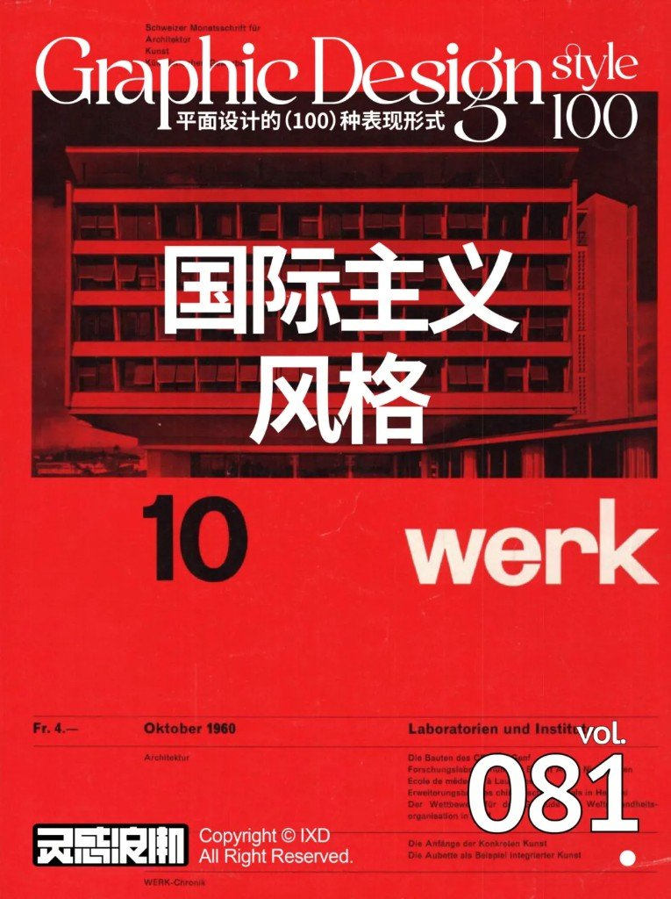

封面直接戏仿了瑞士杂志 *werk* 1960 年 10 月刊的版式语言：红底、建筑网格照片、大号无衬线刊名。灵感浪潮把期号钉在 **vol.081**。

网格不是装饰线。Josef Müller-Brockmann 那句被反复引用的话——*same size margins never make an interesting page*——说的是：等宽页边不等于好版面，真正有趣的页来自严格又敢用的网格。

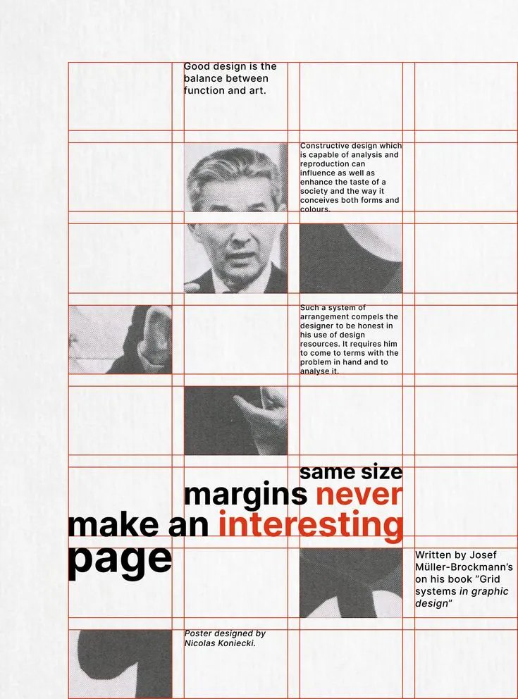

---

## 01 · 严格网格系统排版

把画面切成可计算的栏与行，字、图、色块都贴着轴线落位。信息不靠「感觉摆」，靠对齐关系自己长出秩序。

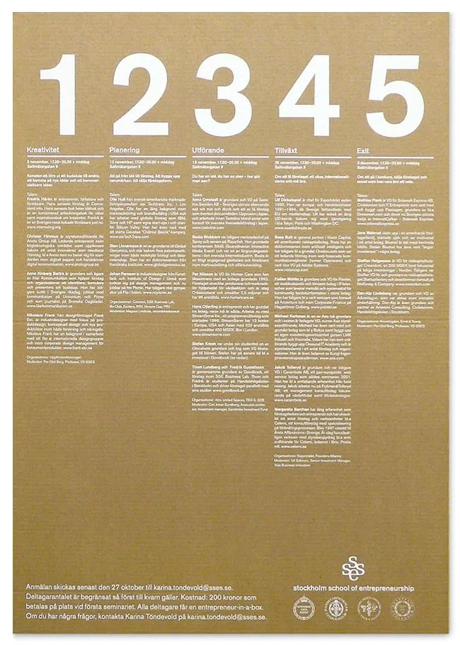

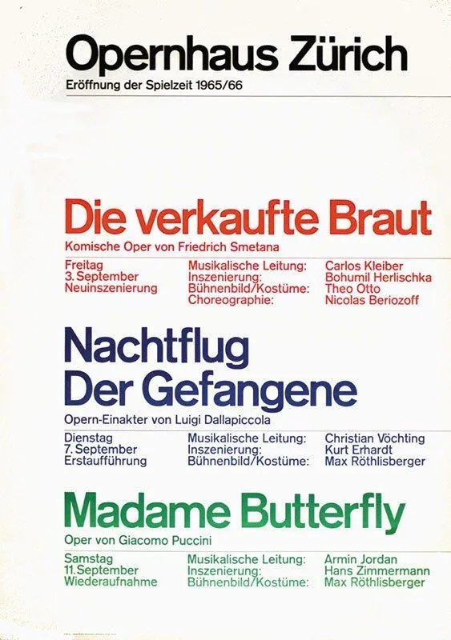

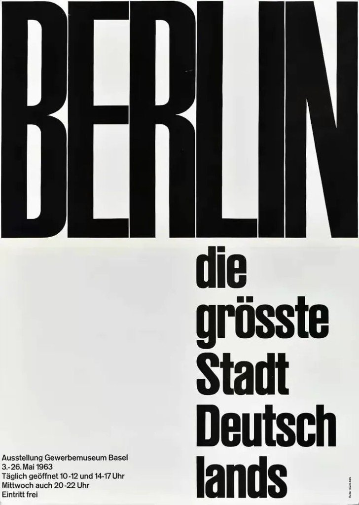

---

## 02 · 推崇无衬线字体

Akzidenz-Grotesk、Helvetica、Univers 这一路：笔画均匀、字腔开放、少装饰。字本身尽量不抢戏，让层级靠字号、字重、位置说话。

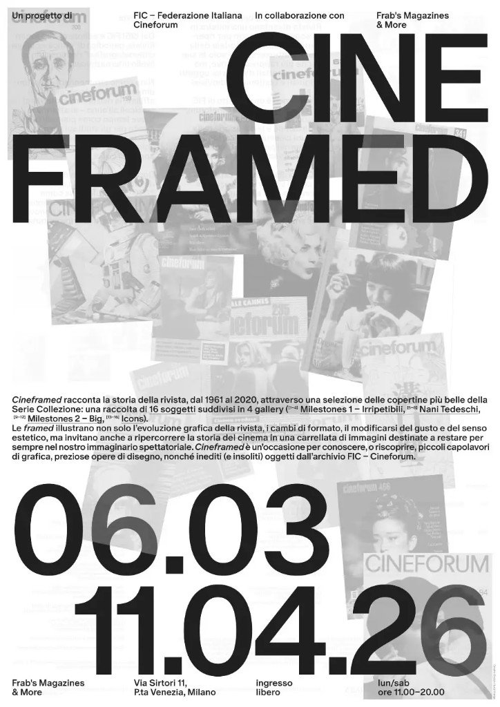

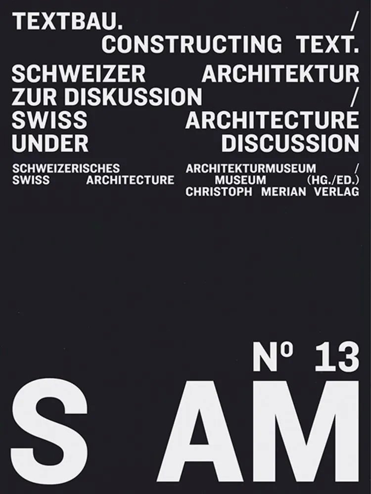

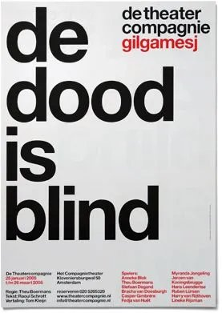

---

## 03 · 极简视觉，形式追随功能

能删的装饰先删。版面存在的理由是把事说清楚：日期、人名、价格、换算表——功能在前，样子跟在后面。

---

## 04 · 客观视觉要素，对比建层级

照片倾向客观、少修饰；层级靠大小、黑白、疏密、对齐，而不是花边和渐变。字和图被当成同一套几何零件来拼。

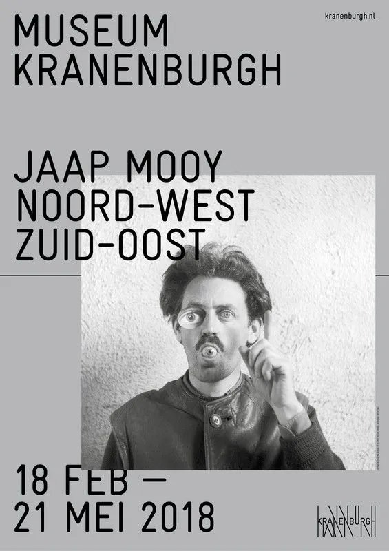

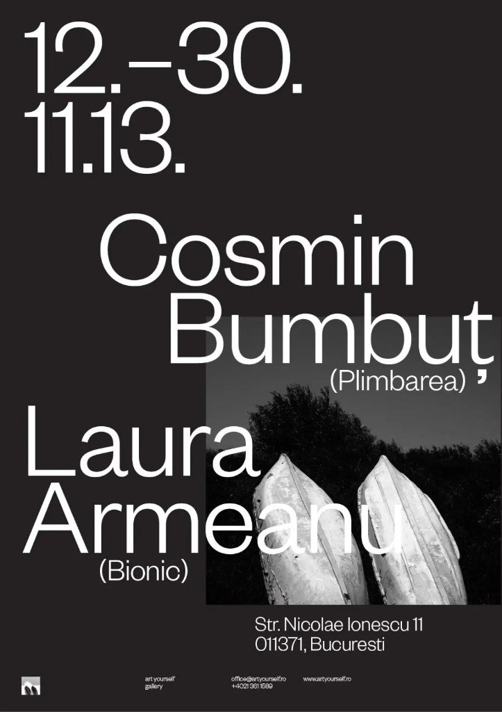

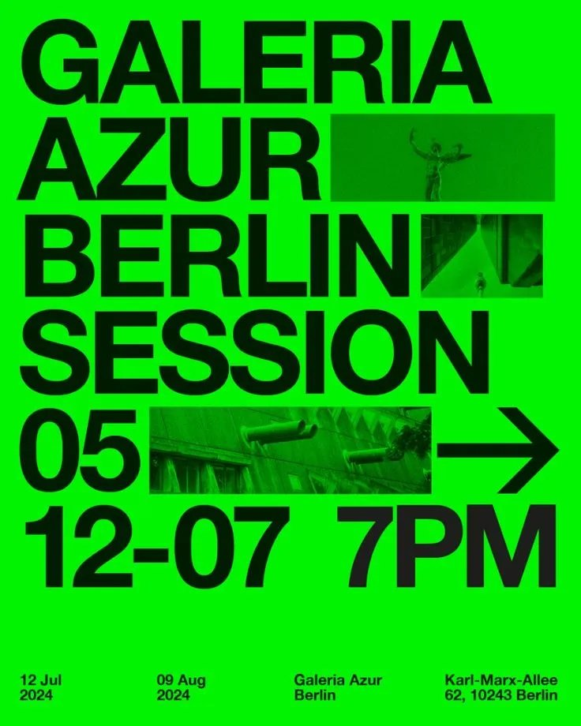

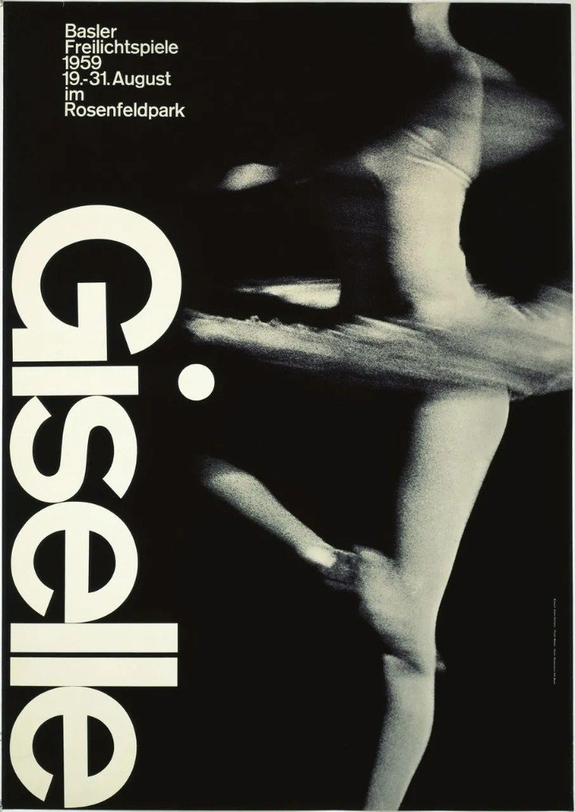

Hofmann 这张 *Giselle*：竖排大字 + 运动模糊的舞者照片，几乎把「客观摄影当色块」写进教科书。

---

## 05 · 极强通用性，也容易刻板

博物馆征集、奥运会申办、杂志创刊号、剧场季、独立活动——同一套语法都能套。这是它厉害的地方，也是它闷的地方：人人网格 + Helvetica，辨识度会被冲淡。

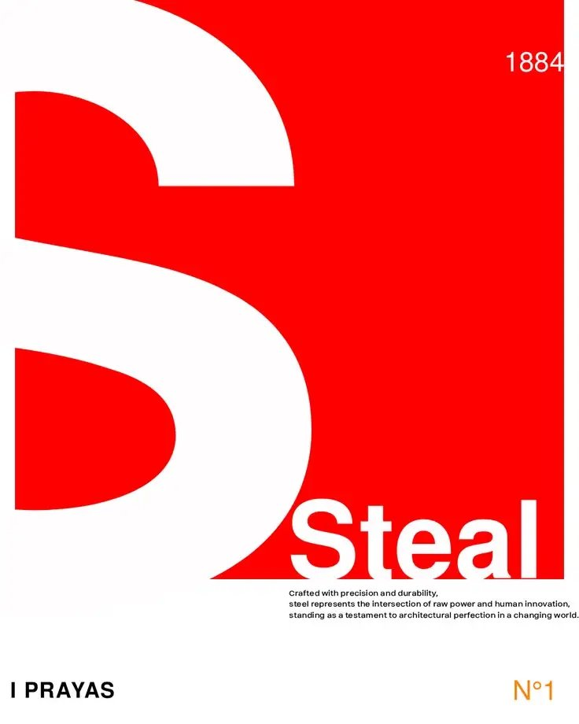

学这套时，先把「清楚」练稳；真要做出辨识度，得在网格内部找非常规切口（字阶跳跃、摄影裁切、单一强调色），而不是再堆装饰。

---

## 四段史：从萌芽到被后现代冲，网格原则还在

| 阶段 | 大致时间 | 带走什么 |
|---|---|---|
| 萌芽 | 1920s 前后 | 包豪斯、俄国构成主义、荷兰风格派：几何、功能、去掉多余装饰 |
| 形成 | 1940–50s | 瑞士设计学校与实践者（如 Müller-Brockmann 等）把网格与无衬线体系化 |
| 鼎盛 | 1960–70s | 机构、杂志、公共信息大规模采用；国际传播把「瑞士」做成通用语 |
| 革新 | 1980s 起 | 后现代冲击对称与冷感，风格不再「唯一正解」；网格/层级原则却渗进日常 UI 与品牌系统 |

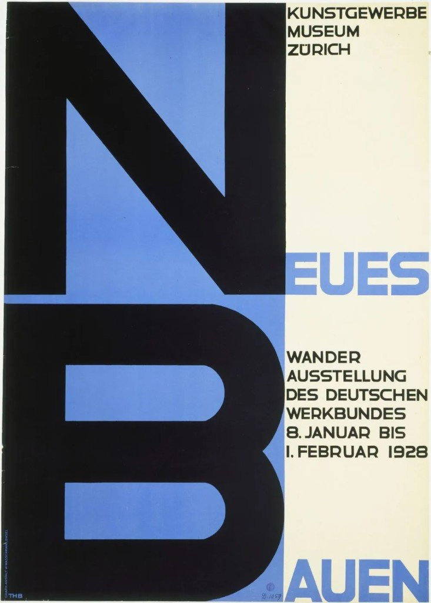

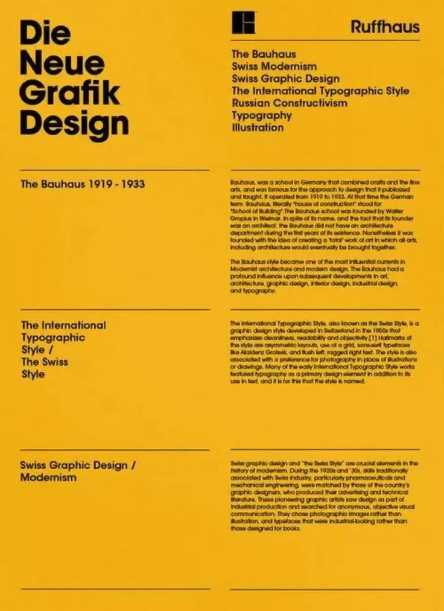

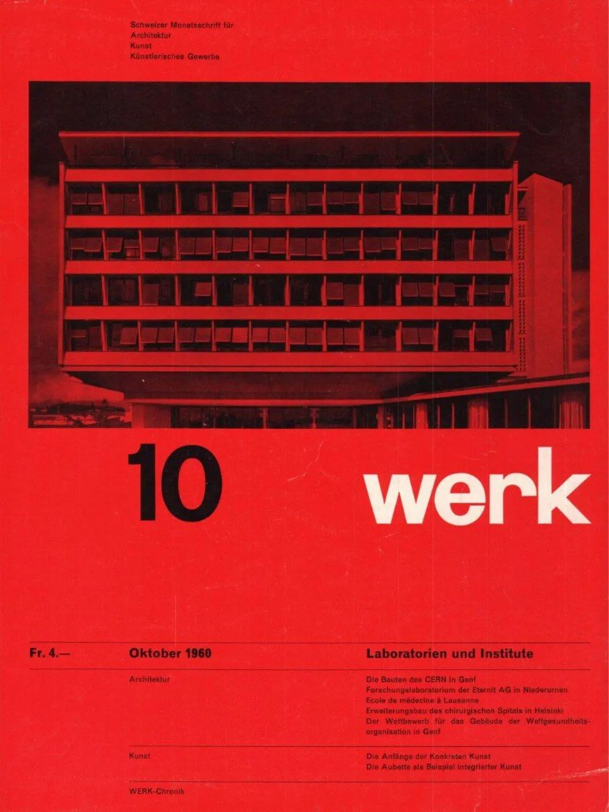

黄底那张把 Bauhaus、Swiss Modernism、International Typographic Style、Constructivism 串在同一信息架构里——本身就是用瑞士语法讲瑞士史。

---

## 出处与版权

- 来源：灵感浪潮「平面设计的(100)种表现形式」**081 · 国际主义风格**（用户粘贴；**无完整原文 URL**）
- 版权声明（保留）：灵感浪潮 / IXD 相关权利声明以原刊为准；本笔记仅作个人 Knowledge 素材，不声称可商用转载
