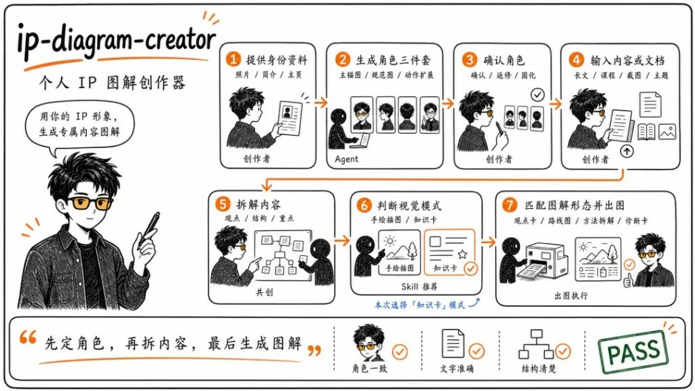
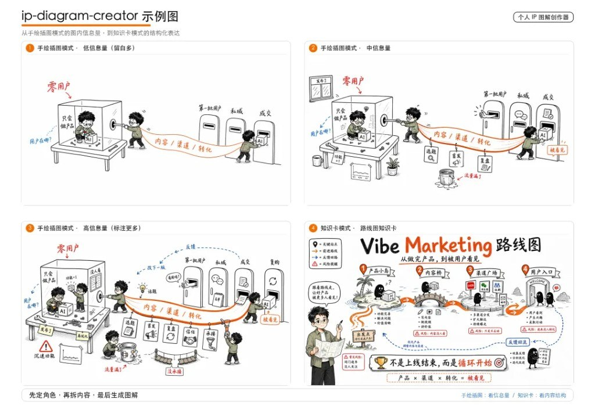

漂亮图到处能生，难的是主角明天还像今天。`ip-diagram-creator`（MIT，[GitHub](https://github.com/haloshin/ip-diagram-creator)）不是又一个生图按钮，而是一套 Agent Skill 工作流：**先定角色，再拆内容，最后生成图解。**

授权照片 / 主页截图 / 简介 → 极简手绘 IP 角色资产；再把长文、课程、观点或脚本拆成长文配图、知识卡、方法拆解图、手机海报或整页 PPT。



::github{repo="haloshin/ip-diagram-creator"}

## 官方怎么装

```bash
# 当前项目
npx skills add https://github.com/haloshin/ip-diagram-creator

# 全局
npx skills add https://github.com/haloshin/ip-diagram-creator -g
```

或不走安装器：把仓库丢进 Agent Skills 目录，让 Agent 读 `SKILL.md`。

推荐环境：能读图 + 较强推理 + 有图像生成工具。没有生图能力时，Skill 应输出可复制 prompt 和返修 prompt，**不假装已经出图**。

## 痛点：不是画不出，是画不稳

换一句提示词，眼镜没了、脸型变了、衣服颜色漂了——读者认不出「同一个人」。外包画师换人也一样。IP 立不起来，往往栽在主角漂移，不是缺一张「好看的图」。

## 角色三件套，先当固定资产

写完文章别先「找配图」——先固化角色：

| 资产 | 锁什么 |
|---|---|
| 01 角色主锚图 | 长什么样：发型、五官比例、服装、配色 |
| 02 角色规范说明图 | 不能跑偏：禁区、道具、配色、纠偏依据 |
| 03 动作/表情/小比例扩展 | 缩成米粒大也能认；复杂姿态与 Agent 协作区 |


三张定下来，后面配图从资产里长，而不是每次重抽签。分水岭在这里：问「这张能不能用」还是「这张是不是我」。

引用优先级（仓库约定）：主锚图 > 动作扩展图 > 规范说明图 > 原始照片 > 临时图 > 自由发挥。

## 先写 shot list，再分模式出图

角色确认后，Agent 先读文，输出 **shot list**（几张、什么类型、各自信息职责），再生成。别一上来「配几张图」——那最容易图文两层皮。

| 模式 | 信息量 / 用途 |
|---|---|
| 手绘插图 | 低密度，大场景隐喻一个观点，偏情绪 |
| 知识卡 | 高密度，方法/步骤/风险/行动可收藏 |
| 长文 shot list | 控配图节奏与视觉权重 |
| PPT 演讲模式 | 先导演规划卡 → 样张 → 分批出页 → 整套 QA |




PPT 常见页型：封面、大纲/大判断、模块、标准、场景、时间线、方法、收尾。流程是「先控节奏，再定风格，最后保一致」，不是每页硬套知识卡。

## 质量闸门：过这三关再留

- 角色一致
- 文字准确（贴输入内容）
- 结构清楚

## 边界：别当万能外挂

- 不保证复刻真人；不作证件照 / 高拟真商业肖像
- 不吃未授权照片、他人私密截图、不可分发资料
- 不替代商标/肖像权/投放前人工审核
- 用户确认后的私有角色资产，不要塞进公共 Skill 包当默认皮肤

生成 PPT 若要可编辑文字，可接 `ppt-master` 等 skills；具体生图模型取决于你的 Agent 环境（有 `image_gen` / GPT Image 等则可直出）。

## 下一张图之前先问自己

工具会迭代，热点会凉；稳定可识别的「你」才是配图侧的复利。下一张图之前先问：这是「我」，还是又一张「图」？
