## 为什么用思维导图复习 JUC
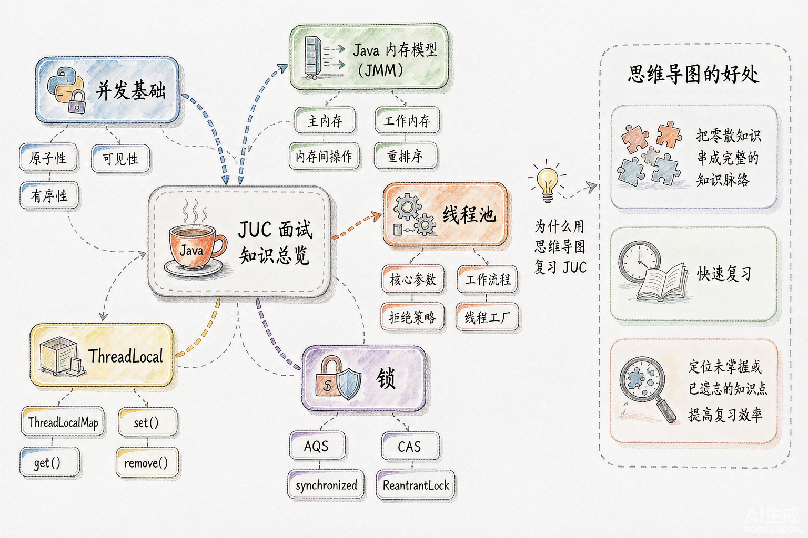

Java 并发编程常见面试考点可以分成五部分：

1. **并发基础**
2. **Java 内存模型（JMM）**
3. **线程池**
4. **锁**
5. **ThreadLocal**

思维导图的好处，是能够把零散知识串成完整的知识脉络。面试前既可以用它快速复习，也能迅速定位自己尚未掌握或已经遗忘的知识点，提高复习效率。

## 一、Java 并发基础
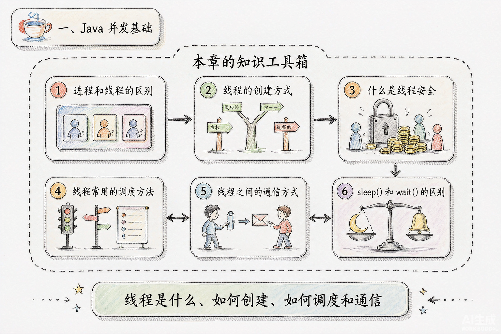

## 进程和线程的区别
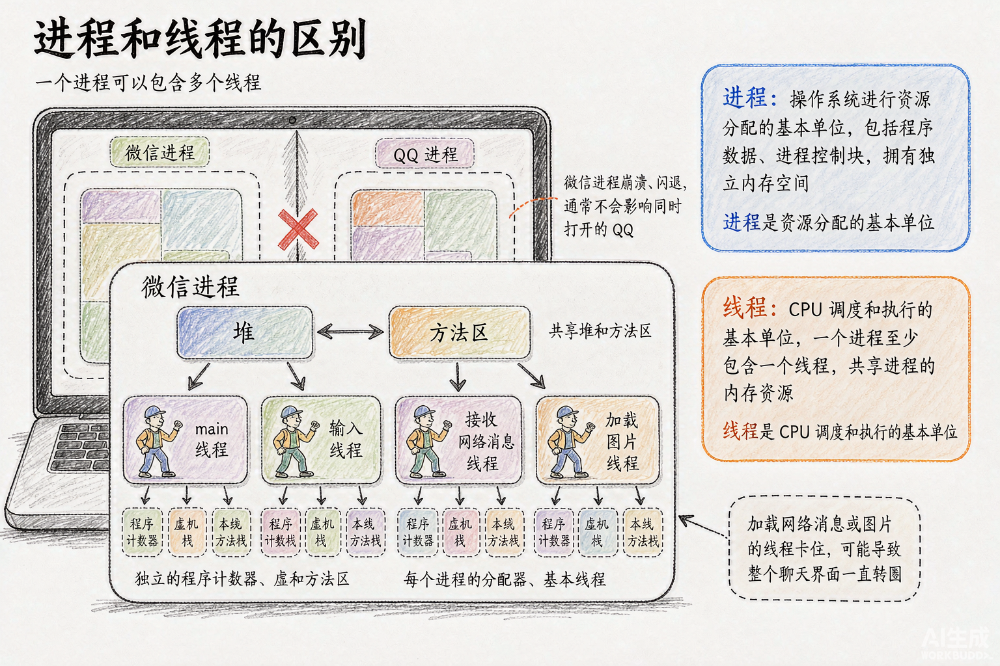

**进程**可以理解为电脑上启动的一个个应用程序。比如运行微信时，微信进程拥有自己独立的内存空间，因此进程是操作系统进行资源分配的基本单位，其中包括程序数据、进程控制块等内容。

如果微信进程崩溃、闪退，通常不会影响同时打开的 QQ，因为两个进程彼此独立。

**线程**则存在于进程内部，一个进程至少包含一个线程。比如 Java 程序启动后会有 `main` 线程；微信中负责输入、接收网络消息、加载图片的功能，也可以由不同线程处理。这些线程就像同一个进程里的工人，共享进程的内存资源。

如果加载网络消息或图片的线程卡住，可能导致整个聊天界面一直转圈。线程是 CPU 调度和执行的基本单位。

> 一个进程可以包含多个线程。多个线程共享进程的堆和方法区资源，但每个线程拥有独立的程序计数器、虚拟机栈和本地方法栈。

## 线程的创建方式
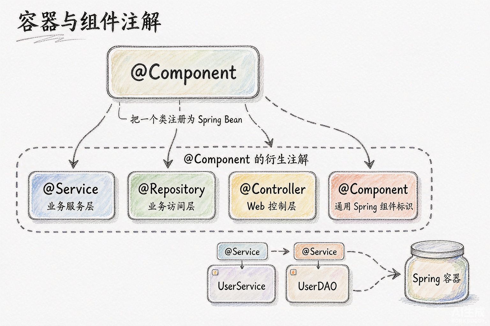

Java 中常见的线程创建方式有以下几种：

1. **继承 `Thread` 类**

   重写 `run()` 方法。由于 Java 只支持单继承，这种方式会限制类的扩展性。

2. **实现 `Runnable` 接口**

   重写 `run()` 方法。这种方式更推荐，因为实现类仍然可以继承其他类。

3. **实现 `Callable` 接口**

   重写 `call()` 方法。它与 `Runnable` 的主要区别是：`Callable` 可以返回计算结果，也可以抛出异常。

   比如子线程计算完 `1 + 1 = 2` 后，可以通过 `Future` 把结果 `2` 返回给主线程。

4. **使用线程池**

   实际企业级项目中，绝大多数场景都会使用线程池。它就像外卖骑手调度中心，不需要每来一个订单就重新招聘一个骑手，而是复用已有骑手，从而节省资源。

## 什么是线程安全
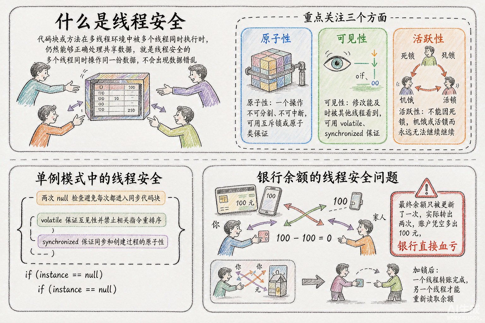

如果一个代码块或方法在多线程环境中被多个线程同时执行时，仍然能够正确处理共享数据，那么这段代码或方法就是**线程安全的**。

也就是说，多个线程同时操作同一份数据时，不会出现数据错乱。

线程安全重点关注以下三个方面：

- **原子性**：一个操作不可分割、不可中断。线程修改共享变量时，不能有其他线程同时介入修改。可以通过互斥锁或原子类保证。
- **可见性**：一个线程对共享变量的修改，能够及时被其他线程看到。可以通过 `volatile`、`synchronized` 等机制保证。
- **活跃性**：线程不能因为死锁、饥饿或活锁等问题而永远无法继续执行。

### 单例模式中的线程安全

单例模式要求一个类只能存在一个实例，并提供全局访问点。在多线程环境中，如果多个线程同时尝试创建实例，就必须保证最终只创建一个对象。

**饿汉式单例**在类加载时立即创建对象，依靠类加载机制保证线程安全。

**懒汉式单例**在第一次使用时创建对象，通常需要使用双重检查锁，即 *Double-Checked Locking*：

```java
public class Singleton {

    private static volatile Singleton instance;

    private Singleton() {
    }

    public static Singleton getInstance() {
        if (instance == null) {
            synchronized (Singleton.class) {
                if (instance == null) {
                    instance = new Singleton();
                }
            }
        }
        return instance;
    }
}
```

其中：

- `volatile` 保证可见性并禁止相关指令重排序；
- `synchronized` 保证同步和创建过程的原子性；
- 两次 `null` 检查可以避免每次获取实例都进入同步代码块。

双重检查锁在面试中出现频率很高，有些面试官会要求现场写代码，因此最好理解原理，而不是只背模板。

### 银行余额的线程安全问题

假设银行卡只剩 100 元，你和家人同时通过手机银行转走最后的 100 元。如果代码没有加锁，两个线程可能同时读取到余额为 100，然后都执行：

```text
100 - 100 = 0
```

最终余额只被更新了一次，但实际上转出了两次，账户相当于凭空多出 100 元，银行直接“血亏”。

如果使用 `synchronized` 等方式加锁，就会变成一个线程转账完成后，另一个线程才能重新读取余额并继续处理。

## 线程常用的调度方法
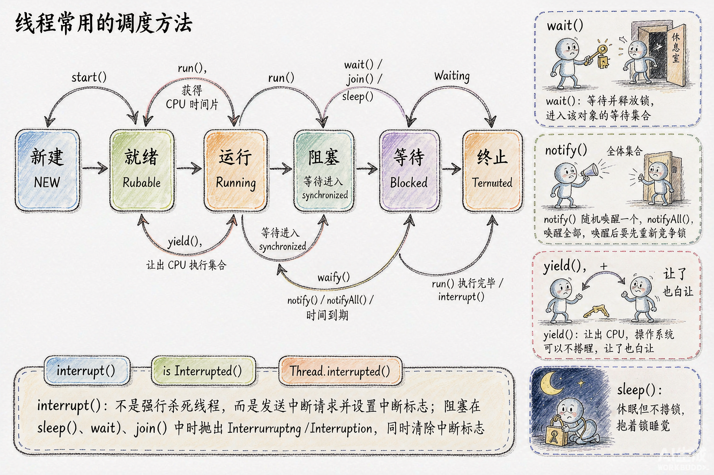

### `wait()`：等待并释放锁

调用 `wait()` 后，当前线程会释放已经持有的对象锁，进入该对象的等待集合，直到被其他线程唤醒或等待超时。

可以把它理解为：线程把手里的锁扔掉，然后进入休息室等待。

### `notify()` 与 `notifyAll()`：通知等待线程

- `notify()`：随机唤醒一个正在该对象上等待的线程，无法保证公平性，使用不当可能导致某些线程长时间得不到执行。
- `notifyAll()`：唤醒该对象上所有等待的线程，相当于喊了一声“全体集合”，然后所有线程重新竞争锁。

需要注意，线程被唤醒后并不会立刻执行，而是先进入锁竞争状态，重新获得锁后才能继续运行。

### `yield()`：让出 CPU 执行机会

`Thread.yield()` 会提示线程调度器：当前线程愿意让出 CPU 时间片，让同优先级的其他线程先运行。

不过，操作系统可以不搭理它。线程让了一下，CPU 下一秒也可能又选中它，相当于“让了也白让”。

它有时用于一些对实时性要求不高的辅助线程，但不能依赖 `yield()` 实现严格的线程调度逻辑。

### `interrupt()`：发送中断请求

`interrupt()` 不是强行杀死线程，而是向线程发送中断请求，并设置中断标志。

如果线程正阻塞在 `sleep()`、`wait()`、`join()` 等可中断方法中，通常会抛出 `InterruptedException` 来响应中断，同时中断标志会被清除。

相关方法包括：

- `interrupt()`：设置目标线程的中断标志，或使阻塞中的线程抛出 `InterruptedException`；
- `isInterrupted()`：查询某个线程的中断状态，不清除标志；
- `Thread.interrupted()`：查询当前线程的中断状态，并清除该标志。

### `sleep()`：休眠但不释放锁

`Thread.sleep()` 会让当前线程休眠指定时间，但**不会释放已经持有的锁**。

可以把它理解为线程抱着锁睡觉。时间到后线程会恢复为可运行状态，也可以通过中断使其提前结束休眠。

## 线程之间的通信方式
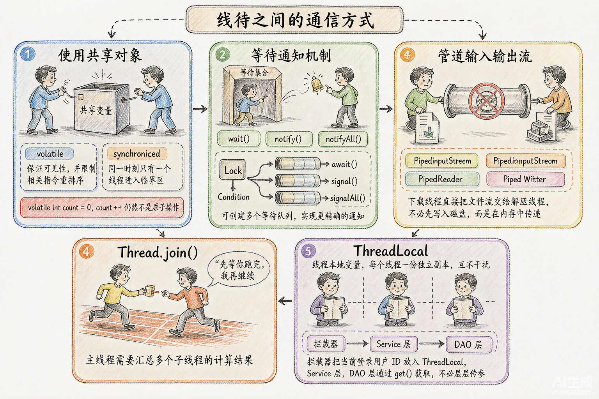

### 使用共享对象

多个线程可以访问和修改同一个对象，从而传递信息。常见手段包括：

- `volatile`：修饰共享变量，保证变量的可见性，并限制相关指令重排序；
- `synchronized`：修饰方法或同步代码块，保证同一时刻只有一个线程进入临界区。

`volatile` 变量的读写会遵循 JMM 的可见性规则，但它不能保证复合操作的原子性。例如：

```java
volatile int count = 0;
count++;
```

`count++` 仍然不是原子操作。

### 等待通知机制

可以通过以下方式实现线程协作：

- `wait()`
- `notify()`
- `notifyAll()`
- `Condition` 的 `await()`、`signal()` 和 `signalAll()`

`Condition` 通常配合 `Lock` 使用，可以创建多个等待队列，实现更精确的通知。

### 管道输入输出流

管道流用于同一个 JVM 内不同线程之间传递字节流或字符流，例如：

- `PipedInputStream`
- `PipedOutputStream`
- `PipedReader`
- `PipedWriter`

比如一个线程下载文件流后，直接通过管道交给另一个线程解压，不必先写入磁盘，而是在内存中传递。

### `Thread.join()`

如果当前线程调用了另一个线程的 `join()` 方法，就会等待对方执行结束后再继续。

一句话概括就是：

> 先等你跑完，我再继续。

例如，主线程需要汇总多个子线程的计算结果，就必须先等待子线程完成。

### `ThreadLocal`

`ThreadLocal` 是线程本地变量。每个线程都有一份独立副本，彼此互不干扰，因此可以用于实现线程隔离。

在 Web 项目中，拦截器可以把当前登录用户的 ID 放入 `ThreadLocal`，后续的 Service 层、DAO 层都能通过 `get()` 获取，不必层层传参。

## `sleep()` 和 `wait()` 的区别
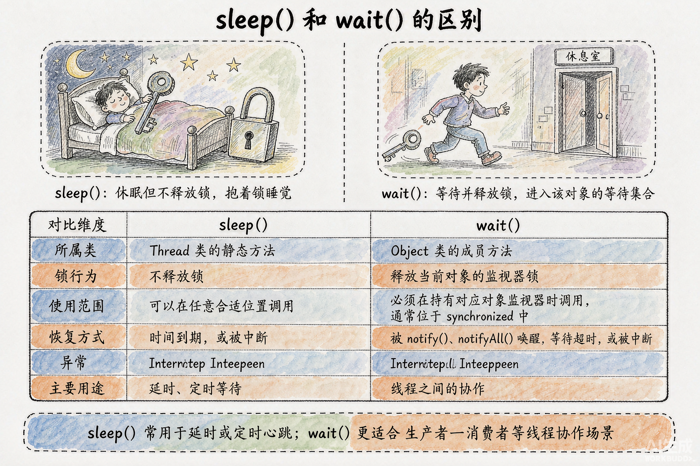

| 对比维度 | `sleep()` | `wait()` |
|---|---|---|
| 所属类 | `Thread` 类的静态方法 | `Object` 类的成员方法 |
| 锁行为 | 不释放锁 | 释放当前对象的监视器锁 |
| 使用范围 | 可以在任意合适位置调用 | 必须在持有对应对象监视器时调用，通常位于 `synchronized` 中 |
| 恢复方式 | 时间到期，或被中断 | 被 `notify()`、`notifyAll()` 唤醒，等待超时，或被中断 |
| 异常 | 中断时抛出 `InterruptedException` | 等待期间被中断时抛出 `InterruptedException` |
| 主要用途 | 延时、定时等待 | 线程之间的协作 |

`sleep()` 常用于延时或定时心跳；`wait()` 更适合生产者——消费者等线程协作场景。

## 二、Java 内存模型 JMM
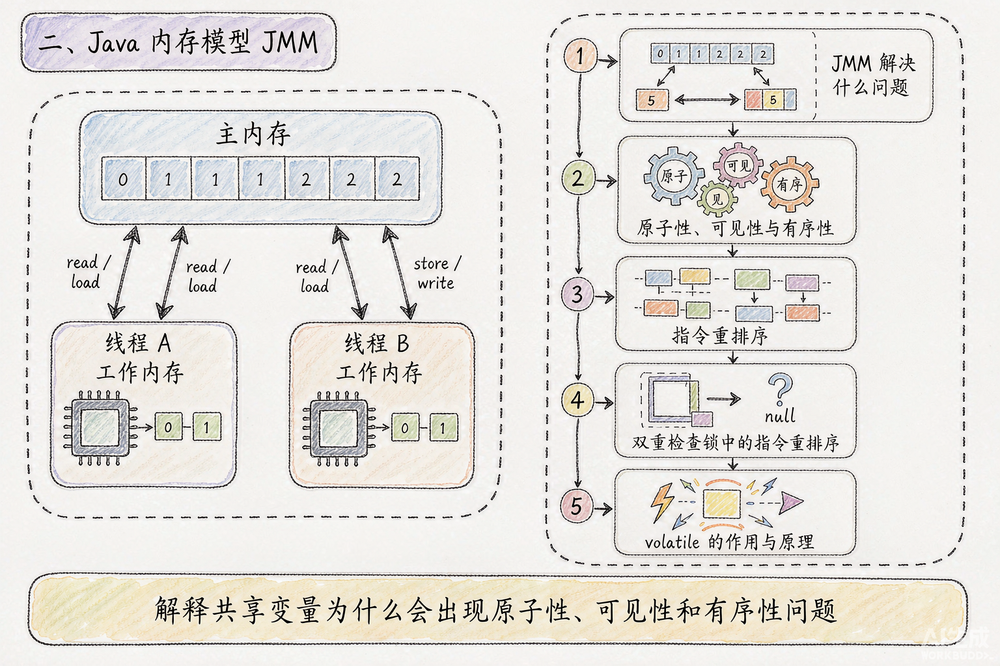

## JMM 解决什么问题
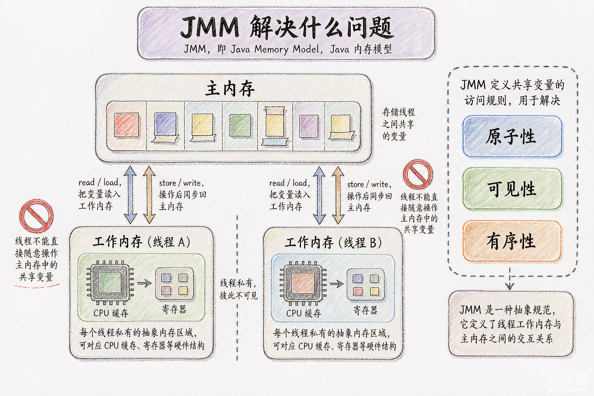

JMM，即 **Java Memory Model，Java 内存模型**，定义了多线程环境下共享变量的访问规则，用于解决：

- **原子性**
- **可见性**
- **有序性**

JMM 是一种抽象规范，它定义了线程工作内存与主内存之间的交互关系：

- **主内存**：存储线程之间共享的变量；
- **工作内存**：每个线程私有的抽象内存区域，可对应 CPU 缓存、寄存器等硬件结构。

线程不能直接随意操作主内存中的共享变量，而是要把变量读入工作内存，操作后再按规则同步回主内存。

## 原子性、可见性与有序性
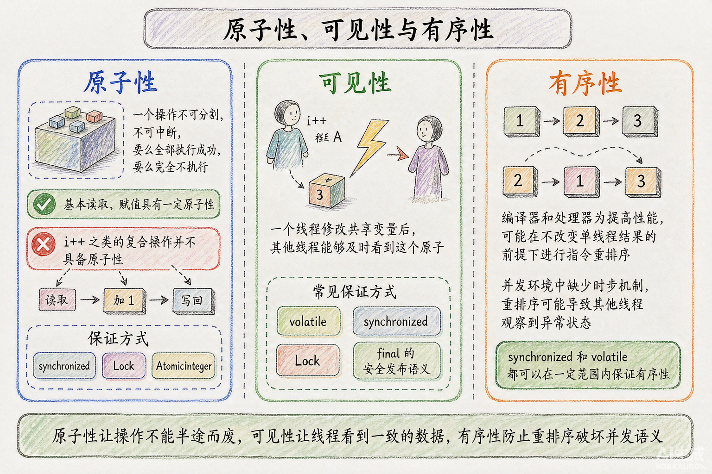

### 原子性

一个操作不可分割、不可中断，要么全部执行成功，要么完全不执行。

JMM 能保证基本读取、赋值等操作具有一定的原子性，但 `i++` 之类的复合操作并不具备原子性。如果要保证一段代码的原子性，可以使用：

- `synchronized`
- `Lock`
- 原子类，如 `AtomicInteger`

### 可见性

一个线程修改共享变量后，其他线程能够及时看到这个修改。

常见保证方式包括：

- `volatile`
- `synchronized`
- `Lock`
- `final` 的安全发布语义

### 有序性

单线程环境下，代码看起来按照从前到后的顺序执行；但编译器和处理器为了提高性能，可能在不改变单线程结果的前提下进行指令重排序。

并发环境中，如果缺少同步机制，这种重排序可能导致其他线程观察到异常状态。

`synchronized` 和 `volatile` 都可以在一定范围内保证有序性。

## 指令重排序
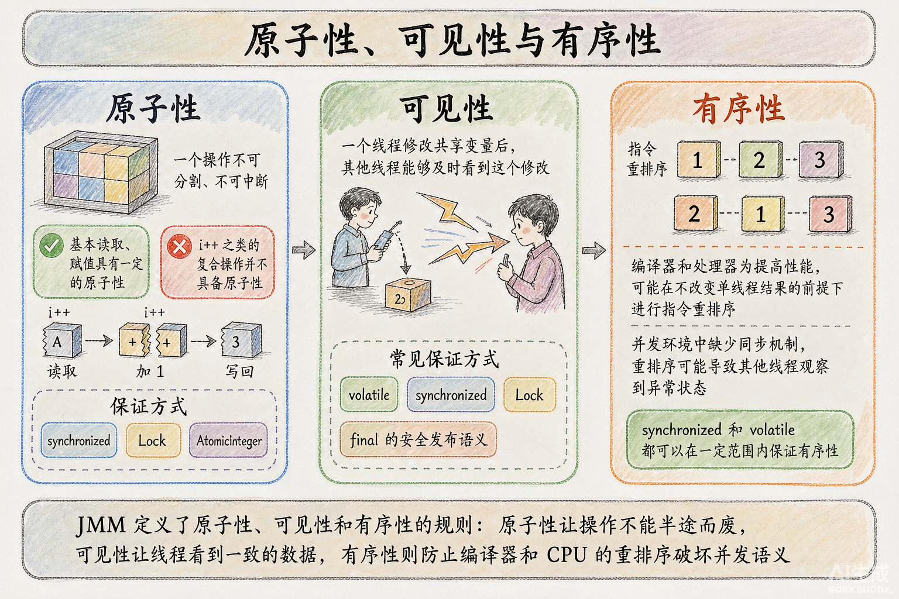

为了提高执行性能，编译器和处理器可能对指令重新排序，常见类型包括：

1. **编译器重排序**

   编译器在不改变单线程程序语义的前提下，重新安排语句的执行顺序。

2. **指令级并行重排序**

   现代处理器利用指令级并行技术，让多条指令重叠执行。

3. **内存系统重排序**

   处理器使用缓存和读写缓冲区后，加载与存储操作从其他线程的视角看起来可能是乱序的。

重排序的目的，是尽量填满 CPU 流水线，让 CPU 一边读取数据、一边计算，不要闲着。

### `as-if-serial` 语义

`as-if-serial` 的核心含义是：

> 无论怎样重排序，单线程程序最终的执行结果都不能改变。

编译器和处理器可以调整指令顺序，但不能破坏单线程语义。

### `happens-before` 原则

如果操作 A *happens-before* 操作 B，那么：

- A 的执行结果对 B 可见；
- 从内存模型的语义上看，A 排在 B 之前。

这不意味着底层实现必须严格按照物理顺序逐条执行。只要重排序后的结果与 `happens-before` 规则要求的结果一致，这种重排序就是合法的。

## 双重检查锁中的指令重排序
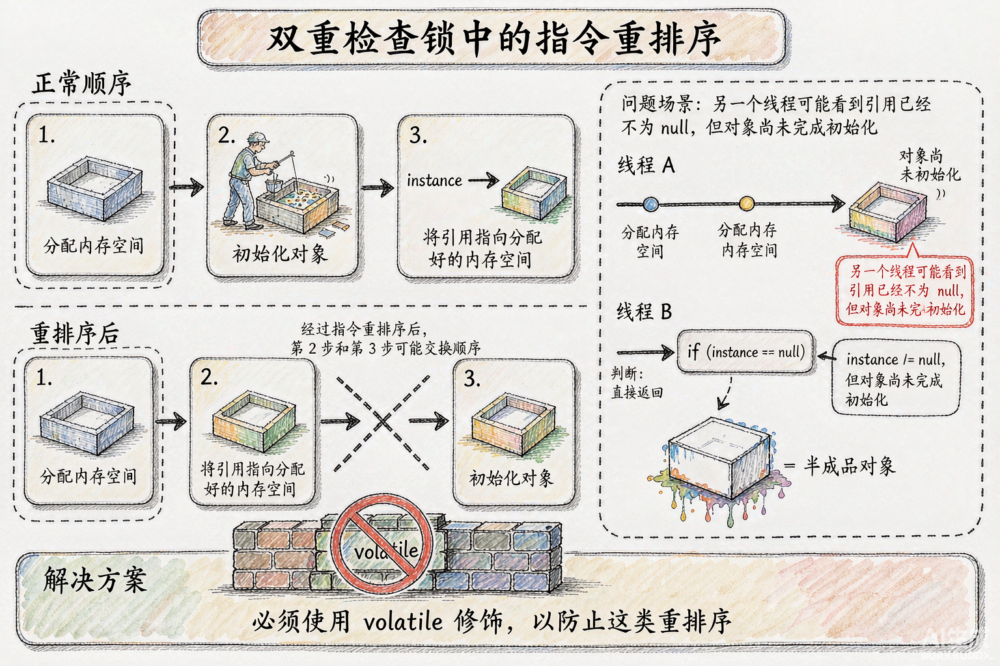

对象创建大致可以拆分为三个步骤：

1. 分配内存空间；
2. 初始化对象；
3. 将引用指向分配好的内存空间。

经过指令重排序后，第 2 步和第 3 步可能交换顺序。此时另一个线程可能看到引用已经不为 `null`，但对象尚未完成初始化。

因此双重检查锁中的单例引用必须使用 `volatile` 修饰，以防止这类重排序。

## `volatile` 的作用与原理
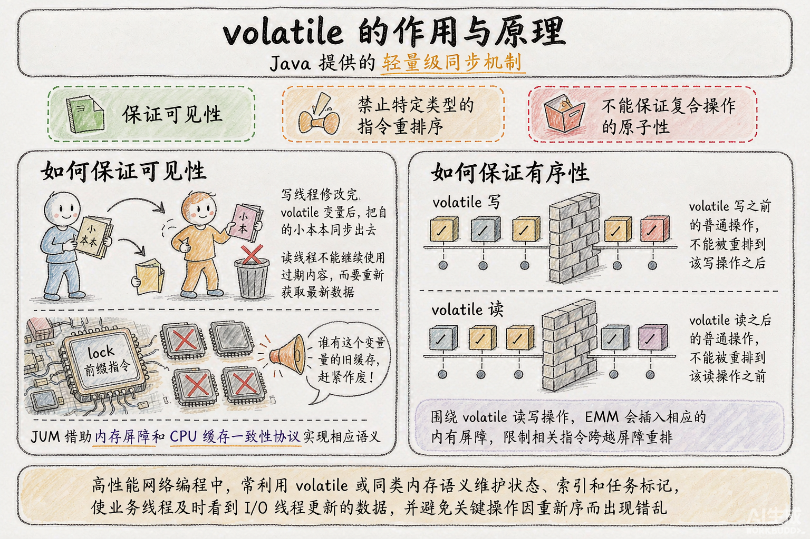

`volatile` 是 Java 提供的一种轻量级同步机制，主要有两项能力：

- **保证可见性**
- **禁止特定类型的指令重排序**

但它**不能保证复合操作的原子性**。

### 如何保证可见性

写入 `volatile` 变量时，JMM 会确保此前的相关修改能够对其他线程可见；读取 `volatile` 变量时，线程会按照内存屏障规则获取最新值。

可以形象地理解为：

- 写线程修改完 `volatile` 变量后，把自己的“小本本”同步出去；
- 读线程不能继续使用过期内容，而要重新获取最新数据。

在底层硬件层面，JVM 会借助内存屏障和 CPU 缓存一致性协议实现相应语义。在某些架构上可能使用带 `lock` 前缀的指令，让其他 CPU 核心中的旧缓存失效。

相当于在 CPU 总线上喊了一声：

> 谁有这个变量的旧缓存，赶紧作废！

### 如何保证有序性

围绕 `volatile` 读写操作，JMM 会插入相应的内存屏障，限制相关指令跨越屏障重排。

可以简化理解为：

- `volatile` 写之前的普通操作，不能被重排到该写操作之后；
- `volatile` 读之后的普通操作，不能被重排到该读操作之前。

在高性能网络编程中，经常会利用 `volatile` 或同类内存语义维护状态、索引和任务标记，使业务线程及时看到 I/O 线程更新的数据，并避免关键操作因重排序而出现错乱。

> JMM 定义了原子性、可见性和有序性的规则：原子性让操作不能“半途而废”，可见性让线程看到一致的数据，有序性则防止编译器和 CPU 的重排序破坏并发语义。

## 三、Java 线程池
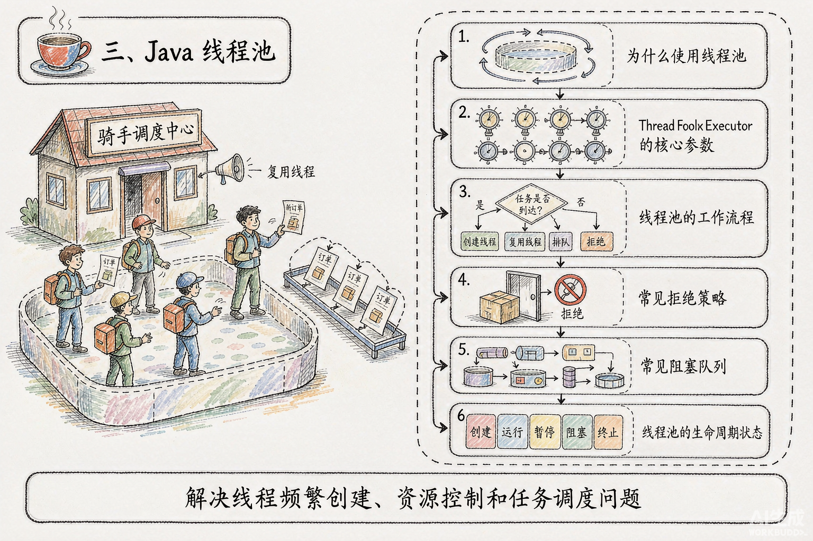

## 为什么使用线程池
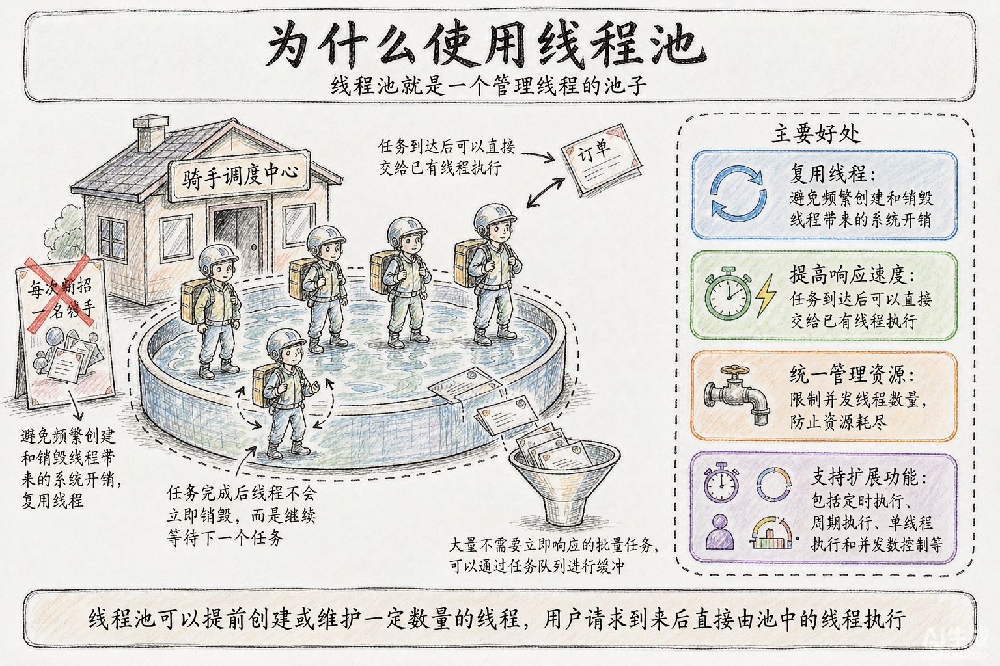

线程池就是一个管理线程的池子，主要好处包括：

- **复用线程**：避免频繁创建和销毁线程带来的系统开销；
- **提高响应速度**：任务到达后可以直接交给已有线程执行；
- **统一管理资源**：限制并发线程数量，防止资源耗尽；
- **支持扩展功能**：包括定时执行、周期执行、单线程执行和并发数控制等。

线程池可以提前创建或维护一定数量的线程。用户请求到来后，直接由池中的线程执行；任务完成后线程不会立即销毁，而是继续等待下一个任务。

对于大量不需要立即响应的批量任务，可以通过任务队列进行缓冲。

## `ThreadPoolExecutor` 的核心参数
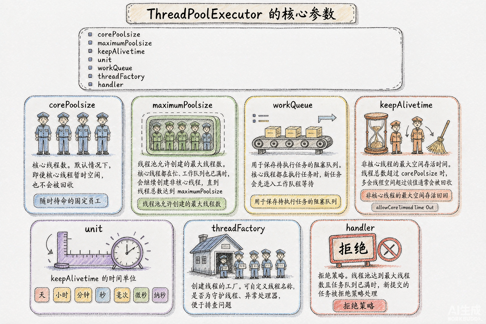

```java
public ThreadPoolExecutor(
        int corePoolSize,
        int maximumPoolSize,
        long keepAliveTime,
        TimeUnit unit,
        BlockingQueue<Runnable> workQueue,
        ThreadFactory threadFactory,
        RejectedExecutionHandler handler)
```

### `corePoolSize`

核心线程数。默认情况下，即使核心线程暂时空闲，也不会被回收。

可以把它理解为随时待命的固定员工。

### `maximumPoolSize`

线程池允许创建的最大线程数。

当核心线程都在忙、工作队列也已经满了，线程池会继续创建非核心线程，直到线程总数达到 `maximumPoolSize`。

### `workQueue`

用于保存待执行任务的阻塞队列。

当核心线程都在执行任务时，新任务会先进入工作队列等待。

### `keepAliveTime`

非核心线程的最大空闲存活时间。

当线程总数超过 `corePoolSize` 时，多余线程空闲时间超过该值，通常会被回收。如果开启 `allowCoreThreadTimeOut`，核心线程也可以超时回收。

### `unit`

`keepAliveTime` 的时间单位，例如：

- 天
- 小时
- 分钟
- 秒
- 毫秒
- 微秒
- 纳秒

### `threadFactory`

创建线程的工厂。

可以通过自定义 `ThreadFactory` 为线程设置有意义的名称、是否为守护线程、异常处理器等信息，便于排查问题。

### `handler`

拒绝策略。当线程池达到最大线程数且任务队列已满时，新提交的任务会按照拒绝策略处理。

## 线程池的工作流程
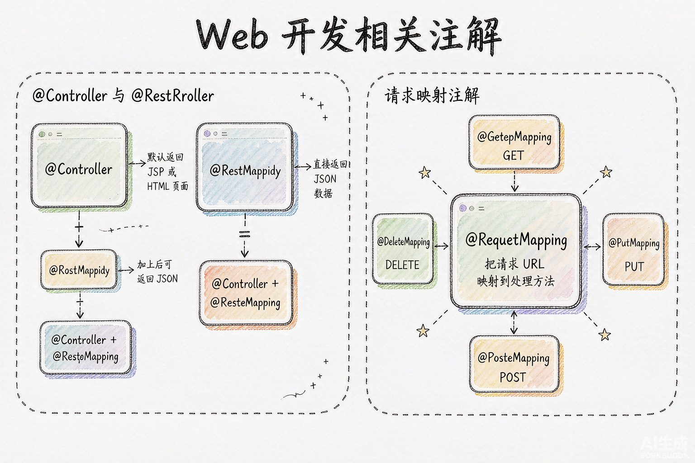

1. 创建线程池并调用 `execute()` 提交任务。
2. 如果当前线程数小于 `corePoolSize`，创建核心线程执行任务。
3. 如果当前线程数已经达到 `corePoolSize`，尝试把任务放入工作队列。
4. 如果工作队列已满，且当前线程数小于 `maximumPoolSize`，创建非核心线程执行任务。
5. 如果队列已满，线程数也达到 `maximumPoolSize`，执行拒绝策略。
6. 线程执行完任务后不会立即销毁，而是继续从任务队列获取任务。
7. 非核心线程的空闲时间超过 `keepAliveTime` 后，会被回收。

这套流程最好和线程池的核心参数放在一起理解记忆。

## 常见拒绝策略
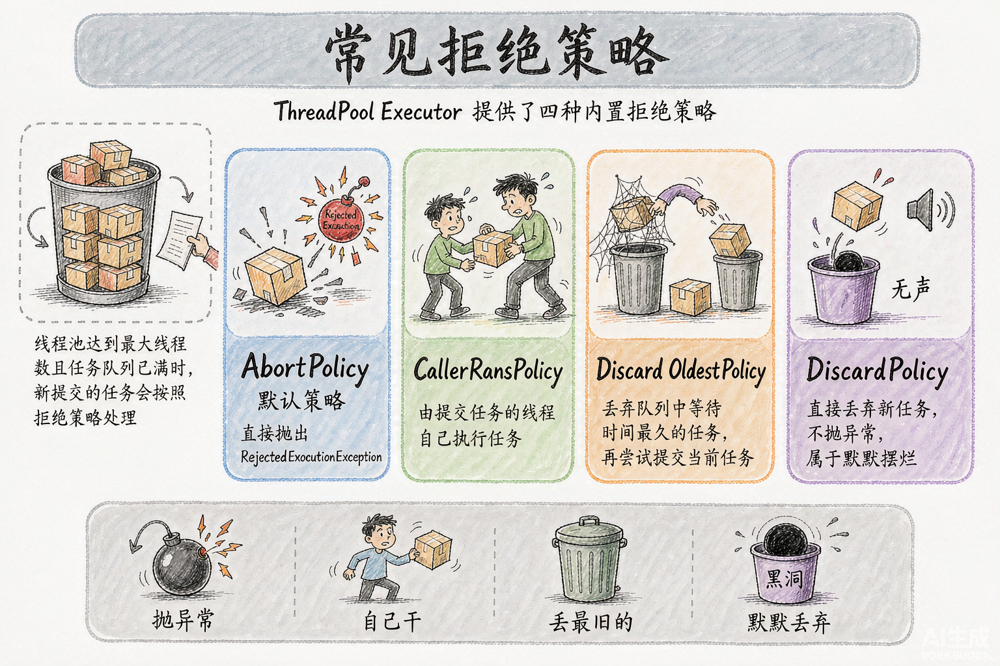

`ThreadPoolExecutor` 提供了四种内置拒绝策略：

- **`AbortPolicy`**：默认策略，直接抛出 `RejectedExecutionException`；
- **`CallerRunsPolicy`**：由提交任务的线程自己执行任务；
- **`DiscardOldestPolicy`**：丢弃队列中等待时间最久的任务，再尝试提交当前任务；
- **`DiscardPolicy`**：直接丢弃新任务，不抛异常，属于“默默摆烂”。

## 常见阻塞队列
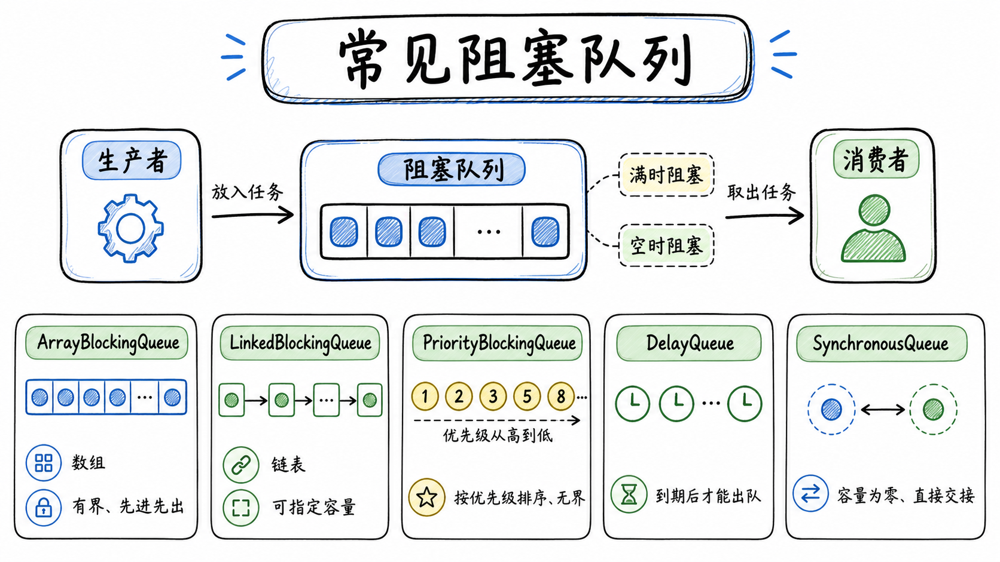

### `ArrayBlockingQueue`

基于数组实现的有界阻塞队列，通常按照先进先出的顺序处理任务。

### `LinkedBlockingQueue`

基于链表实现的阻塞队列。可以指定容量；如果不指定，默认容量非常大，使用时需要警惕任务堆积导致内存问题。

### `PriorityBlockingQueue`

支持优先级排序的无界阻塞队列。任务需要具备可比较性，或者在创建队列时提供比较器。

### `DelayQueue`

延迟队列。元素到达指定延迟时间后才能出队，适合延时任务等场景。

### `SynchronousQueue`

容量为零，不真正存储任务。任务必须直接交给一个等待中的线程处理，否则就需要创建新线程或触发拒绝策略。

## 线程池的生命周期状态
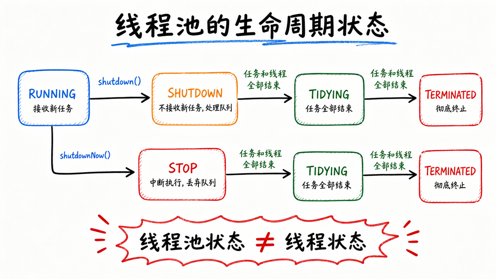

线程池有五种主要状态：

1. **RUNNING**

   正常营业，接收新任务，也处理队列中的任务。

2. **SHUTDOWN**

   不再接收新任务，但会继续处理队列中的任务。

3. **STOP**

   不接收新任务，不处理队列中的任务，并尝试中断正在执行的任务。

4. **TIDYING**

   所有任务都已终止，工作线程数量为零，即将执行 `terminated()` 钩子方法。

5. **TERMINATED**

   `terminated()` 执行结束，线程池彻底终止，相当于彻底关门。

主要状态切换包括：

- 在 `RUNNING` 状态调用 `shutdown()`，进入 `SHUTDOWN`；
- 调用 `shutdownNow()`，尝试进入 `STOP`；
- 任务和线程全部结束后进入 `TIDYING`；
- `terminated()` 执行结束后进入 `TERMINATED`。

线程本身也会经历 `NEW`、`RUNNABLE`、`WAITING`、`TIMED_WAITING`、`BLOCKED`、`TERMINATED` 等状态。线程池状态与线程状态是两个不同层面的概念，不要混为一谈。

## 四、Java 锁机制
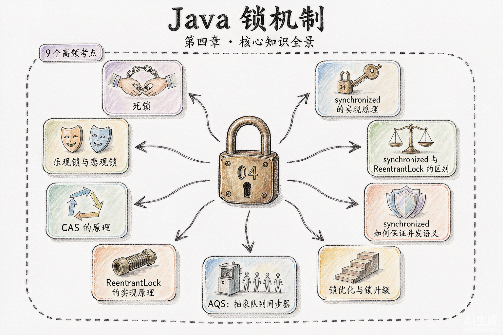

## `synchronized` 的实现原理
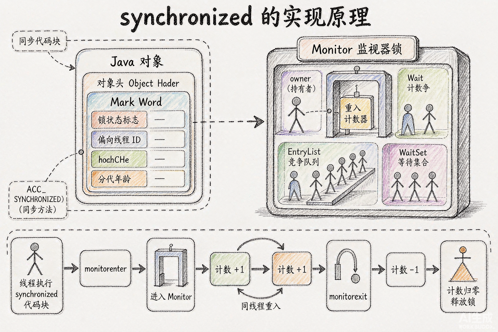

`synchronized` 是 Java 开发必须掌握的内置锁。

可以把它理解为对象头上挂了一套门禁系统。同步代码块编译后会使用 `monitorenter` 和 `monitorexit` 指令；同步方法则通过方法访问标志中的 `ACC_SYNCHRONIZED` 表示。

它们本质上都与对象监视器 `Monitor` 有关。

`Monitor` 内部会维护锁的持有者、重入计数以及等待结构。线程获得锁后会成为 `owner`，重入计数增加；同一个线程再次进入同步区域时，计数继续增加。退出一次，计数减一，直到归零才真正释放锁。

没有抢到锁的线程会进入等待竞争结构。线程调用 `wait()` 后，会释放锁并进入等待集合，直到被唤醒后重新参与锁竞争。

整个过程依靠 JVM 与操作系统底层机制协作，完成锁的获取、阻塞、唤醒和释放。

面试时没必要死记所有内部名称。只要能说明持有者、重入计数、竞争队列、等待集合以及大致流程，通常比结结巴巴地背术语更能体现真正理解。

## `synchronized` 与 `ReentrantLock` 的区别
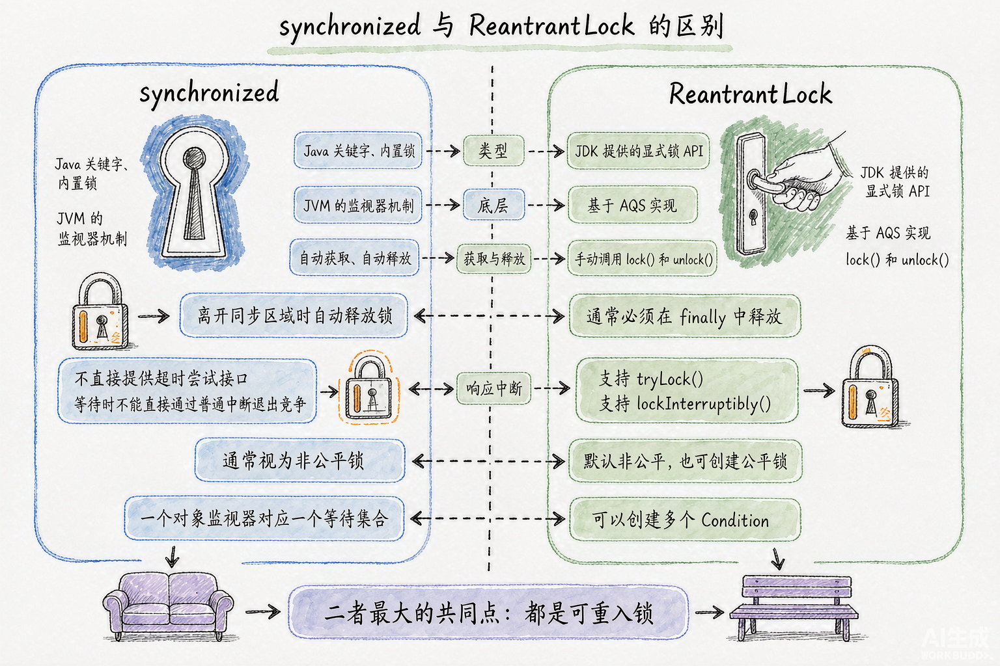

| 对比维度 | `synchronized` | `ReentrantLock` |
|---|---|---|
| 类型 | Java 关键字、内置锁 | JDK 提供的显式锁 API |
| 底层 | JVM 的监视器机制 | 基于 AQS 实现 |
| 获取与释放 | 自动获取、自动释放 | 手动调用 `lock()` 和 `unlock()` |
| 异常处理 | 离开同步区域时自动释放锁 | 通常必须在 `finally` 中释放 |
| 尝试获取 | 不直接提供超时尝试接口 | 支持 `tryLock()` |
| 响应中断 | 等待进入 `synchronized` 时不能直接通过普通中断退出竞争 | 支持 `lockInterruptibly()` |
| 公平性 | 通常视为非公平锁 | 默认非公平，也可创建公平锁 |
| 等待条件 | 一个对象监视器对应一个等待集合 | 可以创建多个 `Condition` |
| 使用灵活性 | 简洁、安全 | 功能丰富，适合复杂同步逻辑 |

`ReentrantLock` 的标准写法是：

```java
lock.lock();
try {
    // 临界区
} finally {
    lock.unlock();
}
```

如果忘记在 `finally` 中释放锁，可能导致其他线程永远无法获取锁。

需要特别说明：`synchronized` 能自动释放锁，但这并不意味着它绝不会产生死锁。只要多个线程以不一致的顺序获取多把锁，`synchronized` 同样可能造成死锁。

二者最大的共同点是：

> `synchronized` 和 `ReentrantLock` 都是可重入锁。

可以想象成同一个线程进门时拿到一把钥匙，进门后又遇到一扇小门，仍然能用同一把钥匙继续打开。

## `synchronized` 如何保证并发语义
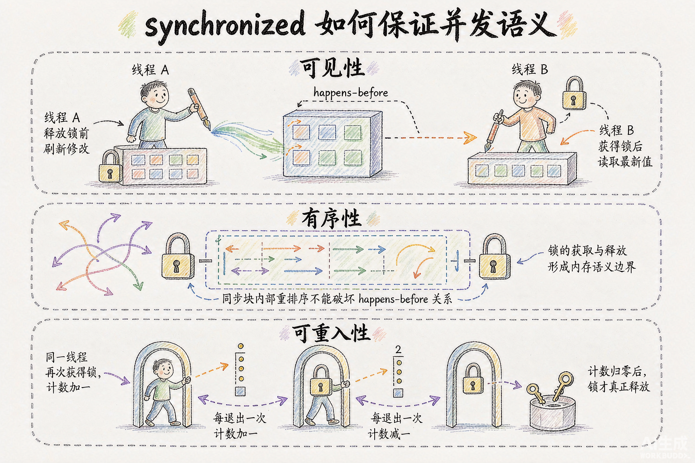

### 可见性

线程释放锁前，会按照 JMM 规则把相关修改刷新出去；另一个线程获得同一把锁后，能够看到前一个线程释放锁之前的修改。

### 有序性

锁的获取和释放形成内存语义边界。同步块内部即使发生不影响当前线程结果的重排序，也不能破坏锁建立的 `happens-before` 关系。

### 可重入性

每个锁会关联持有线程和重入计数：

- 同一线程再次获得锁，计数加一；
- 每退出一次同步区域，计数减一；
- 计数归零后，锁才真正释放。

## 锁优化与锁升级
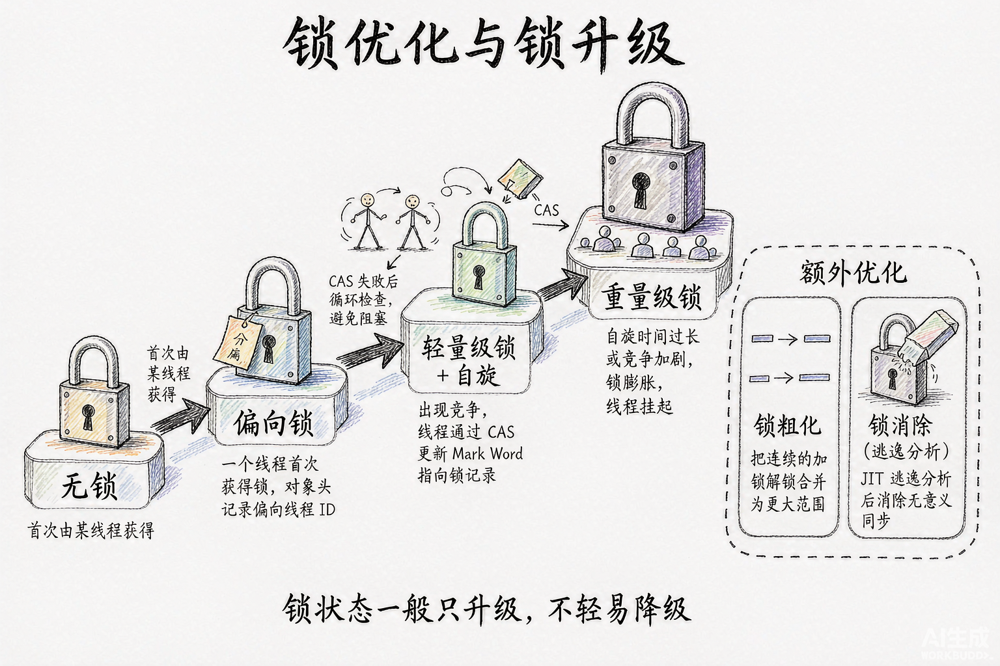

> 以下偏向锁、轻量级锁等内容主要对应 HotSpot JVM 过去常见的实现与面试语境。偏向锁在较新的 JDK 中已经被禁用并进一步移除，但相关设计思想仍可能出现在面试题中。

### 偏向锁

当一个线程首次获得锁时，JVM 可以把锁标记为偏向该线程，并在对象头中记录相关信息。之后同一线程再次请求这把锁时，可以减少同步开销。

如果另一个线程开始竞争，偏向状态会被撤销，并可能升级为轻量级锁。

可以把它理解为：打印机长期只有张三使用，于是贴上“张三专用”的标签。只要一直是张三来打印，连常规抢锁流程都可以省掉。

### 轻量级锁

当多个线程在不同时段使用同一把锁、竞争不激烈时，JVM 可以通过轻量级锁减少线程阻塞和唤醒带来的开销。

线程会在自己的栈帧中建立锁记录，并尝试通过 CAS 把对象头中的 `Mark Word` 更新为指向锁记录的状态。

- CAS 成功：获得锁；
- CAS 失败：说明可能存在竞争，线程可能先自旋，竞争继续加剧时再膨胀为重量级锁。

还是打印机的例子：原来只有张三使用，现在李四突然也来了，“张三专用”标签失效。两个人先在打印机旁边原地转圈，通过 CAS 不断尝试抢锁。

### 自旋锁

线程获取轻量级锁失败后，可以暂时不进入阻塞，而是循环检查锁是否已经释放。

自旋能避免用户态与内核态切换，但会持续消耗 CPU，因此只适合锁持有时间较短、竞争不太激烈的情况。

JVM 可以根据历史自旋结果进行自适应调整，并不是永远固定转相同次数。

### 重量级锁

如果线程自旋时间太长，或者竞争线程越来越多，继续原地转圈只会浪费 CPU。JVM 会让锁膨胀为重量级锁，未获得锁的线程被挂起并进入等待结构，不再持续占用 CPU。

锁状态的典型变化可以概括为：

```text
无锁 → 偏向锁 → 轻量级锁 → 重量级锁
```

传统语境下一般强调锁会随着竞争加剧逐步升级，而不会轻易降级。

### 锁粗化

如果 JVM 检测到一系列连续加锁、解锁操作实际上都发生在同一个线程、同一段连续逻辑中，可能把多个小范围锁合并为一个更大范围的锁，从而减少重复加锁的开销。

### 锁消除

JIT 编译器会进行逃逸分析。如果确认某个对象不会被多个线程共享，相应的同步操作就可能被完全消除，减少无意义的同步开销。

## AQS：抽象队列同步器
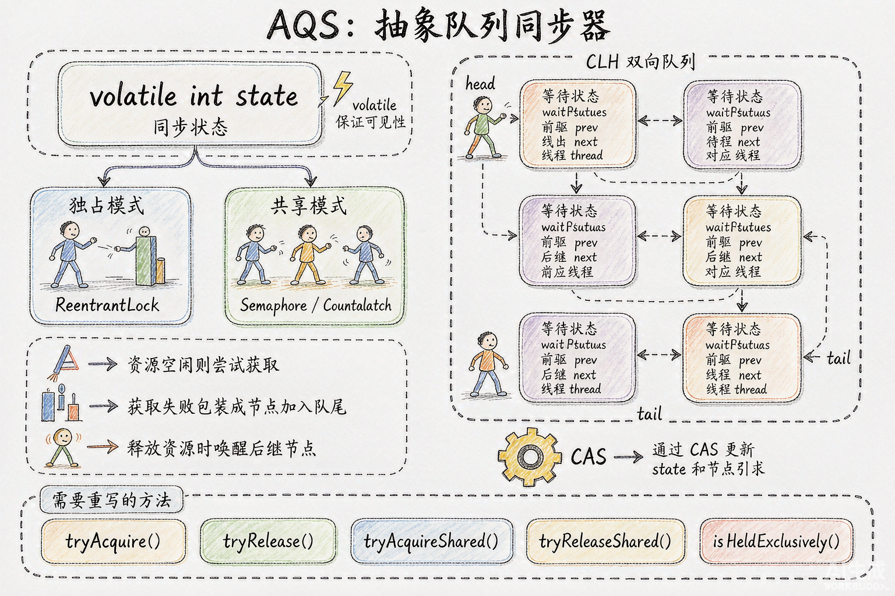

AQS，即 `AbstractQueuedSynchronizer`，可以把它理解成一个**排队管理器**。

它的基本思想是：

- 如果共享资源空闲，当前线程尝试获取资源；
- 如果获取失败，线程进入等待队列；
- 其他线程释放资源后，再唤醒或调度等待队列中的线程继续竞争。

AQS 主要通过以下结构管理同步状态：

- 一个 `int` 类型的同步状态 `state`；
- 一个基于节点组织的双向同步队列；
- CAS 操作；
- 线程阻塞与唤醒机制。

`state` 具有 `volatile` 语义，用于保证可见性。队列节点中通常包含等待状态、前后节点引用以及对应线程等信息。

AQS 支持两类同步模式：

- **独占模式**：同一时刻只有一个线程能够获得资源，例如 `ReentrantLock`；
- **共享模式**：允许多个线程同时获得资源，例如 `Semaphore`、`CountDownLatch` 的部分实现逻辑。

AQS 本身提供框架，具体资源获取和释放规则由子类实现，常见需要重写的方法包括：

- `tryAcquire()`
- `tryRelease()`
- `tryAcquireShared()`
- `tryReleaseShared()`
- `isHeldExclusively()`

AQS 的同步队列通常被描述为 CLH 队列的一种变体。线程获取锁失败后，会把自己包装成节点加入队尾，并关注前驱节点的状态，在合适时机被唤醒后再次尝试获取资源。

## `ReentrantLock` 的实现原理
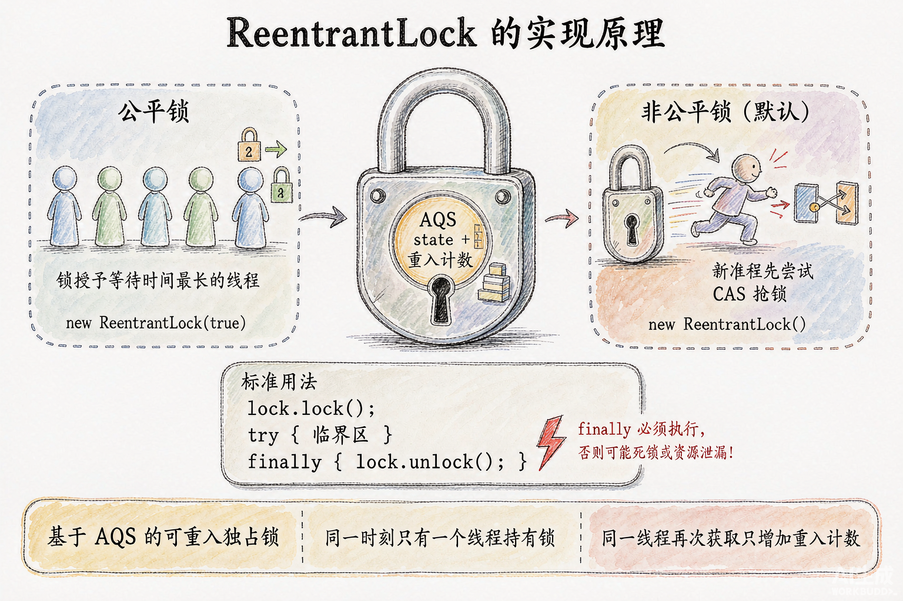

`ReentrantLock` 是基于 AQS 实现的可重入独占锁。

- **独占**：同一时刻只能有一个线程持有锁；
- **可重入**：当前线程已经持有锁时，再次获取同一把锁不会被自己阻塞，只会增加重入计数。

它支持公平锁和非公平锁。

### 公平锁

锁通常授予等待时间最长、位于队列前部的线程。谁先来，谁先排队，新来的线程不能随意插队。

这是一种“论资排辈”的锁。

### 非公平锁

新来的线程可以直接尝试通过 CAS 抢锁，不一定严格照顾已经排队很久的线程。锁刚释放时，谁手速快，谁就可能先拿到。

`ReentrantLock` 默认创建非公平锁：

```java
ReentrantLock lock = new ReentrantLock();
```

传入 `true` 可以创建公平锁：

```java
ReentrantLock fairLock = new ReentrantLock(true);
```

## CAS 的原理
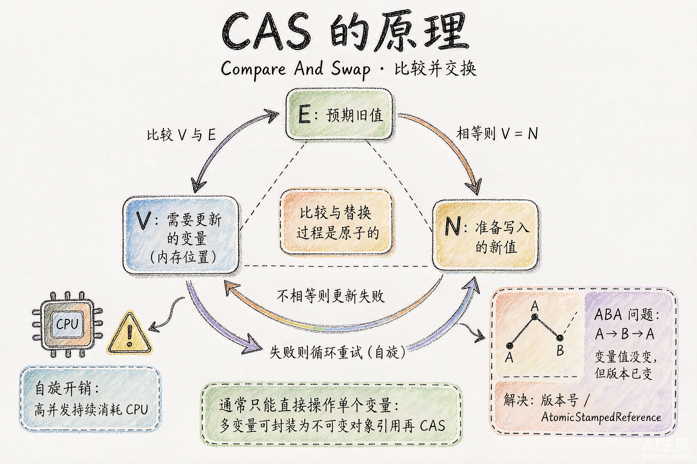

CAS 全称为 **Compare And Swap，比较并交换**，是一种无锁原子操作，也是乐观锁的重要实现方式。

CAS 通常包含三个值：

- `V`：需要更新的变量；
- `E`：预期旧值；
- `N`：准备写入的新值。

它的逻辑是：

1. 判断变量 `V` 当前是否等于预期值 `E`；
2. 如果相等，把 `V` 更新为 `N`；
3. 如果不相等，说明变量已经被其他线程修改，本次更新失败。

比较与替换过程是原子的，不会在中间被其他线程打断。

### CAS 的三大问题

#### 1. ABA 问题

变量从 A 变成 B，又从 B 变回 A。CAS 检查时发现仍然是 A，就误以为变量没有发生变化。

比如账户余额原本是 100，中间有人转入 100，又转出 100，最后余额仍然是 100。数值虽然没变，但数据版本已经发生变化。

解决方式是增加版本号或时间戳，例如数据库乐观锁中的 `version` 字段。Java 中也可以使用 `AtomicStampedReference`。

#### 2. 自旋开销

CAS 失败后通常会循环重试。高并发环境下，大量线程持续自旋会消耗大量 CPU。

可以通过以下方式缓解：

- 限制自旋次数；
- 采用自适应自旋；
- 失败后让线程阻塞；
- 降低竞争范围；
- 根据业务改用锁或分段设计。

#### 3. 通常只能直接操作单个变量

CAS 通常针对单个内存位置。如果多个变量必须作为一个整体更新，可以：

- 把多个变量封装成一个不可变对象，再对对象引用执行 CAS；
- 使用 `synchronized` 或 `Lock` 保护整个代码块。

## 乐观锁与悲观锁
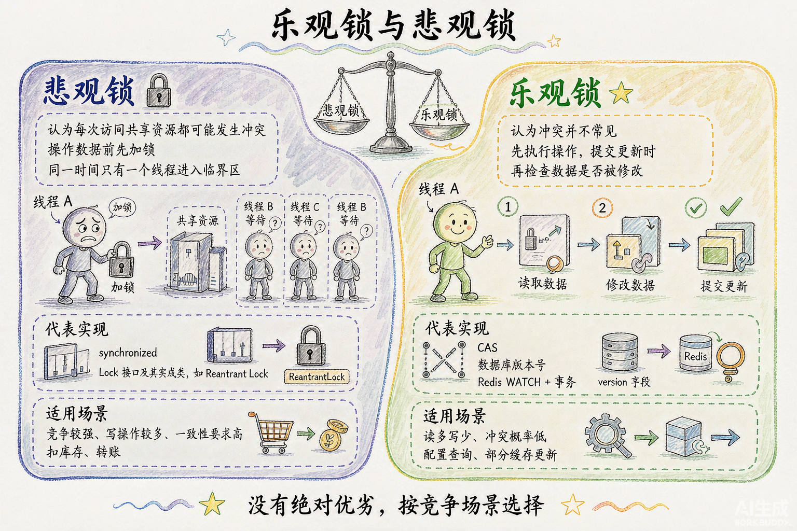

### 悲观锁

悲观锁认为每次访问共享资源都可能发生冲突，因此在操作数据前先加锁，保证同一时间只有一个线程进入临界区。

代表方式包括：

- `synchronized`
- `Lock` 接口及其实现类，如 `ReentrantLock`

悲观锁通常适合竞争较强、写操作较多或业务一致性要求较高的场景，例如扣库存、转账。

### 乐观锁

乐观锁认为冲突并不常见，因此允许线程先执行操作，提交更新时再检查数据是否已经被修改。

常见实现包括：

- CAS；
- 数据库版本号；
- Redis 的 `WATCH` 配合事务机制；
- 类似下面的 SQL：

```sql
UPDATE product
SET stock = ?, version = version + 1
WHERE id = ?
  AND version = ?;
```

乐观锁通常适合读多写少、冲突概率较低的场景，例如配置查询、部分缓存更新。

## 死锁
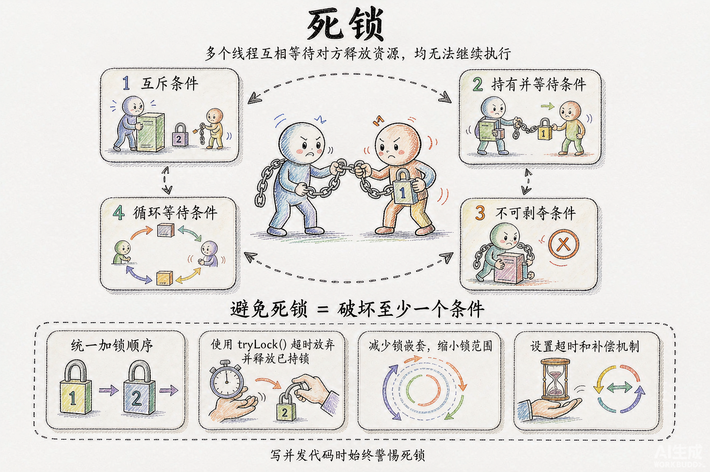

死锁是指多个线程互相等待对方释放资源，最终所有相关线程都无法继续执行。

死锁形成需要同时满足四个条件：

1. **互斥条件**
2. **持有并等待条件**
3. **不可剥夺条件**
4. **循环等待条件**

避免死锁，本质上就是破坏其中至少一个条件。

常见方法包括：

- **统一加锁顺序**：规定所有线程必须按照相同顺序获取多把锁，避免形成循环等待；
- **使用 `tryLock()`**：获取锁超时后主动放弃，并释放已经持有的锁；
- **减少锁嵌套**：尽量缩小锁范围，避免过深的同步嵌套；
- **设置超时和补偿机制**：防止线程无限等待；
- **减少共享资源**：从设计上降低多锁协作的复杂度。

锁机制可以整体理解为：

- JVM 提供内置锁 `synchronized`，并通过不同锁状态和优化手段降低开销；
- JDK 使用 `ReentrantLock` 与 AQS 提供更灵活的同步能力；
- 底层大量依赖 CAS，但要注意 ABA、自旋开销和多变量一致性问题；
- 悲观锁与乐观锁适用于不同竞争场景；
- 写并发代码时要始终警惕死锁的四个必要条件，可以通过统一加锁顺序、超时获取和减少嵌套来破局。

## 五、ThreadLocal 线程隔离


## ThreadLocal 的作用
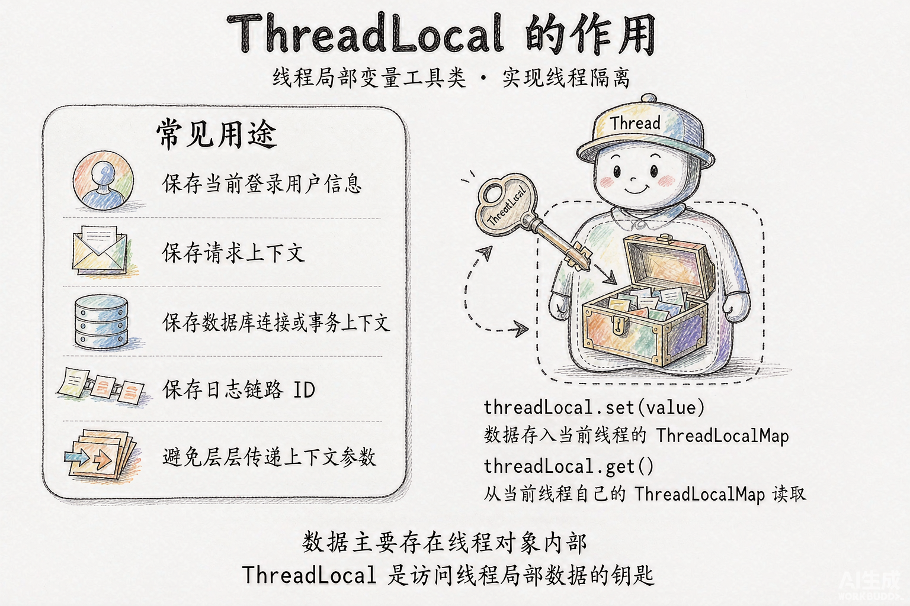

`ThreadLocal` 是 Java 提供的线程局部变量工具类。它允许每个线程保存一份独立的数据副本，从而实现线程隔离，避免多个线程直接共享同一个可变对象。

常见用途包括：

- 保存当前登录用户信息；
- 保存请求上下文；
- 保存数据库连接或事务上下文；
- 保存日志链路 ID；
- 避免层层传递上下文参数。

## ThreadLocal 的实现原理
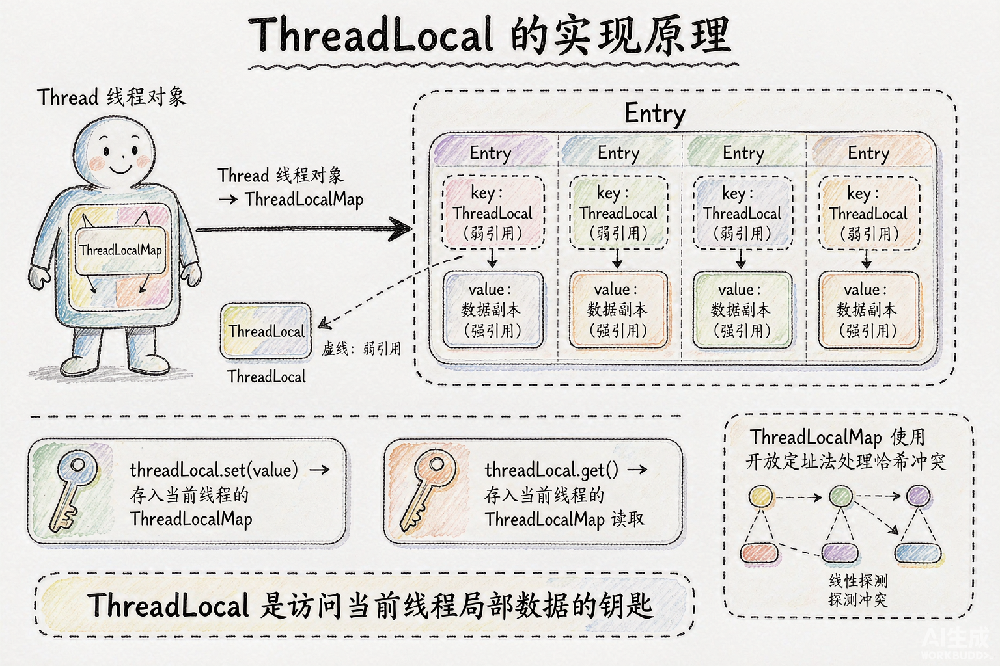

每个 `Thread` 对象内部都可以维护一个 `ThreadLocalMap`。其中：

- `key` 是 `ThreadLocal` 对象；
- `value` 是需要在线程内保存的数据。

调用：

```java
threadLocal.set(value);
```

数据会存入当前线程的 `ThreadLocalMap`。

调用：

```java
threadLocal.get();
```

会从当前线程自己的 `ThreadLocalMap` 中读取数据。

因此，数据实际上主要存在线程对象内部，而不是存在 `ThreadLocal` 对象自身。`ThreadLocal` 更像是访问当前线程局部数据的一把钥匙。

`ThreadLocalMap` 并没有实现标准的 `Map` 接口，但结构上使用了数组和散列定位。它处理哈希冲突时使用的是**开放定址法**，而不是 `HashMap` 常见的链表或红黑树结构。

## ThreadLocal 的内存泄漏问题
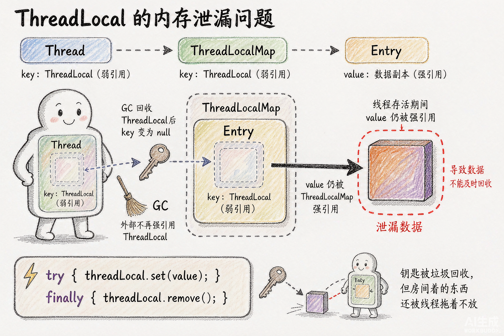

`ThreadLocalMap.Entry` 中：

- `key` 对 `ThreadLocal` 是弱引用；
- `value` 通常仍然是强引用。

如果外部不再强引用某个 `ThreadLocal`，GC 可能回收这个 `ThreadLocal` 对象，于是 Entry 的 `key` 变成 `null`。但只要线程还存活，`ThreadLocalMap` 对 `value` 的强引用就可能继续存在，导致数据不能及时回收。

这就像钥匙已经被垃圾回收了，但房间里的东西还在，而且仍然被线程拖着不放。

`ThreadLocalMap` 会在部分 `get()`、`set()`、`remove()` 操作过程中清理失效 Entry，但不能只依赖这种被动清理。最稳妥的方式是使用完成后主动调用：

```java
threadLocal.remove();
```

推荐写法如下：

```java
try {
    threadLocal.set(value);
    // 执行业务逻辑
} finally {
    threadLocal.remove();
}
```

## 在线程池中的风险
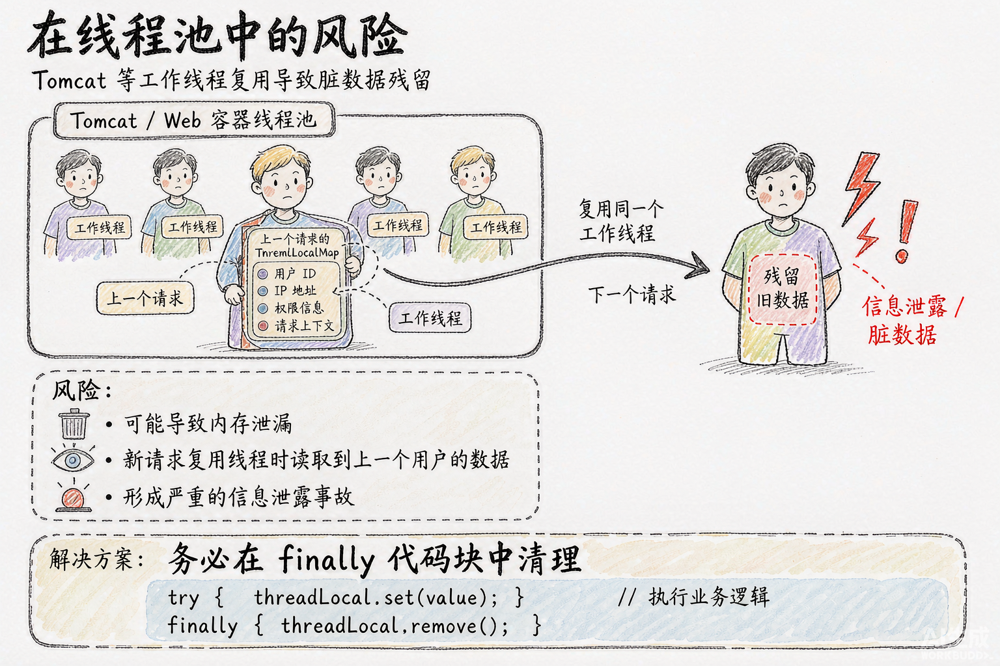

Tomcat 等 Web 容器会维护线程池。一次请求结束后，工作线程不会被销毁，而是回到线程池中等待复用。

如果请求结束后没有调用 `remove()`，当前线程的 `ThreadLocalMap` 中可能继续残留上一个请求的数据，例如：

- 用户 ID
- IP 地址
- 权限信息
- 请求上下文

这不仅可能导致内存泄漏，新请求复用该线程时还有可能读取到上一个用户的数据，形成严重的信息泄露事故。

因此，在 Web 项目中使用 `ThreadLocal` 时，务必在 `finally` 代码块中清理。

## 父子线程如何共享数据
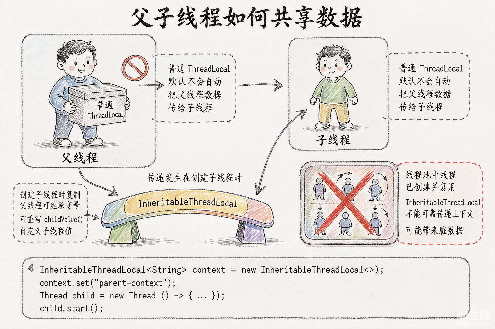

普通 `ThreadLocal` 默认不会自动把父线程的数据传递给子线程。主线程创建子线程后，子线程拥有自己的 `ThreadLocalMap`，无法直接读取父线程普通 `ThreadLocal` 中的数据。

如果确实需要在创建子线程时传递上下文，可以使用：

```java
InheritableThreadLocal<T>
```

`InheritableThreadLocal` 继承自 `ThreadLocal`。创建子线程时，JVM 会把父线程中的可继承变量复制给子线程，也可以通过重写 `childValue()` 自定义子线程得到的值。

```java
InheritableThreadLocal<String> context =
        new InheritableThreadLocal<>();

context.set("parent-context");

Thread child = new Thread(() -> {
    System.out.println(context.get());
});

child.start();
```

需要注意，传递通常发生在**创建子线程时**。在线程池中，线程往往早已创建并被反复复用，因此 `InheritableThreadLocal` 不能可靠解决线程池任务之间的上下文传递问题，还可能带来脏数据。实际项目中可以显式传参，或者使用专门的上下文传递方案。

## 六、JUC 复习主线
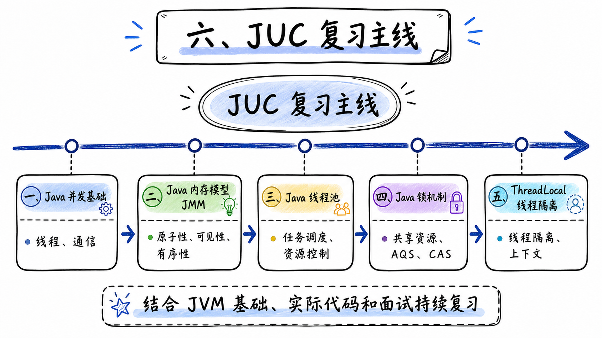

## 五大模块的关联
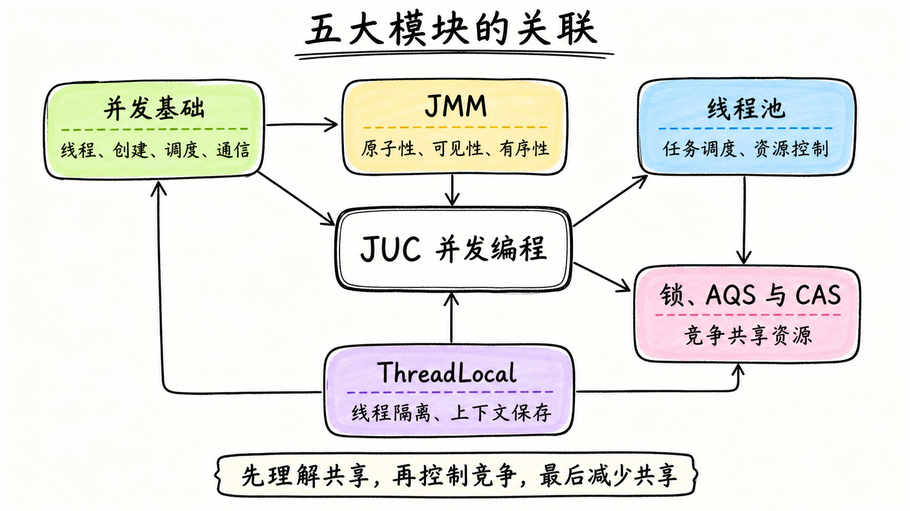

JUC 并发编程可以沿着下面这条主线复习：

1. **并发基础**解决线程是什么、如何创建、如何调度和通信的问题；
2. **JMM**解释共享变量为什么会出现原子性、可见性和有序性问题；
3. **线程池**解决线程频繁创建、资源控制和任务调度问题；
4. **锁、AQS 与 CAS**解决多线程竞争共享资源的问题；
5. **ThreadLocal**通过线程隔离减少共享，解决上下文保存和参数传递问题。

学习并发编程之前，最好先把 JVM 的内存结构、对象结构、类加载、垃圾回收和引用类型等基础知识掌握清楚，再把 JVM 与 JUC 放在一起复习。

并发知识很难只靠一次背诵记牢。更有效的方法是在不断面试和实践中持续回顾、补充，通过实际代码理解每个机制的使用场景。随着使用次数增加，知识会越记越牢，对底层原理的理解也会逐渐加深。
