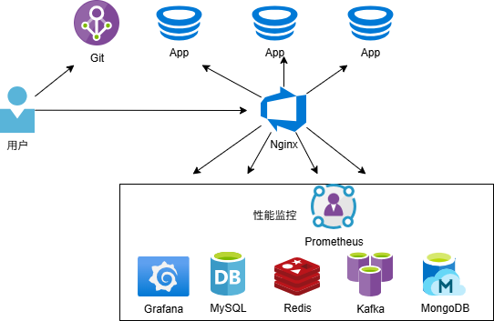

> 本页为原「Java 课程 1」全部 5 个分节的合订本；原分节链接会自动跳转到本页。

## 1.1 什么是全栈工程师？为什么要成为全栈工程师？

AI 浪潮下，Java 全栈工程师的机遇和挑战都在变化。

### AI浪潮下，给Java全栈工程师带来的机遇与挑战

#### 1. 机遇

- 效率提升：AI开发工具能够自动生成部分代码，如简单的CRUD代码，还能提供智能代码补全功能，减少拼写和语法错误，帮助Java全栈工程师节省开发时间，提高代码质量。例如飞算JavaAI、CodeGeeX、通义灵码这样的工具，可实现从需求分析、软件设计到工程代码生成的全程智能引导，大大提升开发效率。
- 技术融合拓展：Java语言可与AI技术深度融合。在深度学习方面，Deeplearning4j支持Java环境下的神经网络开发，可应用于图像识别、自然语言处理等场景；在大数据处理方面，Apache Spark的Java API可处理大规模数据集，结合MLlib能实现分布式机器学习；在实时流处理方面，Apache Kafka与Flink的Java SDK有助于构建实时数据管道，支持在线学习模型部署。
- 就业竞争力增强：市场对具备 AI 知识和技能的 Java 全栈工程师需求旺盛，这类复合型人才供不应求。他们能完成传统 Java 全栈工程师的工作，也能利用 AI 技术为项目带来创新性方案，薪资待遇和职业发展机会更好。
- 新兴领域发展：AI浪潮催生了众多新兴领域，如智能医疗、工业互联网、智能物流等，这些领域需要大量的Java全栈工程师来开发相关的应用系统。例如在智能医疗系统中，Java全栈工程师可以运用机器学习算法对医疗数据进行分析和预测，为医生提供辅助诊断建议。

#### 2. 挑战

- 技术更新压力：AI时代要求Java全栈工程师更新知识体系，传统的SSM/SSH框架开发经验价值有所缩水，90%的初级Java面试已涉及AI工程化场景题。工程师需要同时掌握JVM底层原理（如ZGC垃圾回收）与AI工具链等新知识、新技术，转型成本较高。
- 低端岗位受冲击：AI编程工具日益成熟，一些重复性、规律性强的低端编码工作，如简单的代码生成、基本的错误检测与修复等，逐渐被AI工具所取代，导致传统外包型开发需求锐减，部分初级Java全栈工程师面临失业风险。
- 业务理解要求提高：在AI时代，业务需求更加复杂和多样化，Java全栈工程师需要更好地理解业务领域知识，将业务需求转化为技术方案。例如在开发金融风控系统时，不仅要关注技术实现，还要理解业务部门对风险评估模型的需求，以及如何通过AI技术实现可解释的风险评估。
- 数据安全与伦理问题：随着AI技术的应用，数据安全和伦理问题日益凸显。Java全栈工程师在开发AI相关应用时，需要确保数据的安全和隐私，避免算法偏见和不公平的决策，同时要遵守相关的法律法规和伦理准则。

### 全栈工程师的能力要求

全栈工程师是指掌握多种技术，能在软件开发的各个环节，包括前端开发、后端开发、数据库管理、服务器运维等方面都具备一定能力，能够独立完成一个完整项目的开发人员。

- 前端开发能力：熟悉 HTML、CSS、JavaScript 等基础前端技术，能够构建美观、交互性强的用户界面。还需掌握流行的前端框架，如 React、Vue.js 等，以提高开发效率和代码的可维护性。
- 后端开发能力：精通至少一种后端编程语言，如Java、Python、Node.js等，了解服务器端的运行机制，能够编写高效的后端代码来处理业务逻辑、数据库操作和接口设计。同时，要熟悉常见的后端框架，如Spring Boot、Spring Cloud等。
- 数据库管理能力：掌握关系型数据库（如MySQL、Oracle）和非关系型数据库（如MongoDB、Redis）的使用，能够设计合理的数据库架构，进行数据的存储、查询和优化。
- 其他技能：了解服务器运维知识，包括服务器的部署、配置和性能优化；熟悉版本控制工具，如Git，以便更好地管理代码版本；具备一定的网络知识，理解HTTP协议、RESTful API设计；应用新技术，比如AI等。

### 成为全栈工程师的优势
- 提升个人竞争力：在就业市场中，全栈工程师拥有更广泛的技能，能够胜任多个岗位的工作，相比单一技能的开发人员，具有更强的竞争力，更容易获得高薪职位和晋升机会。
- 提高开发效率：全栈工程师可以独立完成项目的各个环节，减少了不同专业开发人员之间的沟通成本和协作问题，能够更高效地推进项目开发，从项目的构思到上线，都能更快速地实现。
- 培养全局思维：通过参与项目的全流程开发，全栈工程师能够从整体上理解项目的架构和运作机制，培养全局思维能力，更好地把握项目的发展方向，做出更合理的技术决策。
- 实现创新想法：具备全栈技能后，能够将自己的创新想法快速转化为实际产品，无需依赖多个不同专业的人员来协作实现，为个人的创新和创业提供了更有利的条件。

## 1.2 Java+AI全栈工程师的六边形技能武器库有哪些？

Java+AI全栈工程师需要具备涵盖Java开发、AI技术、数据处理等多方面的技能，以下是其“六边形技能武器库”的具体内容：

### Java编程技能
- 核心Java基础：深入掌握Java的语法、面向对象编程、多线程、并发、内存管理等核心知识，能写出高效、稳定的Java代码。
- Java Web开发：熟练运用Servlet、Thymeleaf等技术构建Web应用，掌握Spring框架，包括Spring Boot、Spring MVC、Spring Data等，用于快速搭建企业级应用。
- 微服务架构：理解微服务理念，会使用Spring Cloud等框架实现微服务的治理、注册与发现、配置管理等，构建分布式系统。

### AI相关技术
- 机器学习基础：熟悉常见的机器学习算法，如监督学习（线性回归、决策树、支持向量机等）、无监督学习（聚类、降维等）、强化学习，掌握模型的训练、评估和调优方法。
- 深度学习框架：掌握至少一种深度学习框架，如TensorFlow、PyTorch等，能够构建和训练神经网络模型，进行图像识别、语音识别、自然语言处理等任务。
- AI应用开发：了解如何将AI技术集成到Java应用中，使用Java API调用AI模型，实现智能预测、分类、推荐等功能。

### 数据处理与分析
- 数据收集与预处理：掌握数据收集的方法，包括从数据库、文件系统、网络等多种数据源获取数据，并能对数据进行清洗、转换、标注等预处理操作，以提高数据质量。
- 数据库管理：精通关系型数据库（如MySQL、Oracle）和非关系型数据库（如MongoDB、Redis），能设计合理的数据库架构来存储和管理数据，优化数据库查询性能，以支持AI模型的训练和应用。

### 算法与数据结构
- 基础数据结构：熟练掌握数组、链表、栈、队列、树、图等数据结构，理解其特点和应用场景，能够根据实际问题选择合适的数据结构来优化程序性能。
- 算法设计与分析：熟悉常见的算法，如排序算法、搜索算法、图算法等，具备算法设计和优化的能力，能够分析算法的时间复杂度和空间复杂度，提高程序的运行效率。

### 云计算与容器化
- 云计算平台：了解云计算的基本概念和架构，熟悉主流的云计算平台，如阿里云、腾讯云、AWS等，能够在云平台上部署和管理Java+AI应用，利用云服务的弹性扩展能力满足业务需求。
- 容器化技术：掌握Docker容器技术，能够将Java应用和AI模型打包成容器，实现环境的隔离和快速部署。同时，了解Kubernetes等容器编排工具，用于容器的自动化管理和调度。

### 系统设计与架构
- 软件设计模式：熟悉常见的软件设计模式，如单例模式、工厂模式、观察者模式等，能够运用设计模式提高代码的可维护性、可扩展性和可复用性。
- 系统架构设计：具备系统架构设计的能力，能够根据业务需求设计合理的系统架构，考虑系统的高可用性、高性能、可伸缩性等因素，综合运用各种技术构建稳定可靠的Java+AI系统。

## 1.3 多视角解析Java+AI全栈工程师最佳学习路径是怎样的？

以下是从不同视角解析Java+AI全栈工程师的最佳学习路径。

### 技术技能视角
- 基础阶段：学习Java基础语法、面向对象编程、核心API、多线程、并发、内存管理、数据结构、算法等，同时掌握MySQL数据库和JDBC技术，以及HTML、CSS、JavaScript等前端基础，可通过阅读《Java核心编程》《数据结构和算法基础（Java语言实现）》等书籍和在线课程进行学习。
- 中级阶段：深入学习Spring框架（Spring Boot、Spring MVC、Spring Data等），了解微服务架构，学习机器学习基础算法，熟悉数据预处理、模型训练与评估等流程。
- 高级阶段：研究云原生技术，如Docker容器化和Kubernetes编排，学习AI大模型相关知识，掌握将AI模型与Java微服务集成的技术，了解Serverless等新兴技术在Java+AI应用中的应用。

### 项目实践视角
- 小型项目阶段：完成一些简单的Java Web项目，如图书管理系统、博客系统等，熟悉Web开发流程和技术栈。同时，尝试开发一些基于机器学习的简单应用，如手写数字识别、文本分类等，理解AI模型的应用场景和开发过程。
- 中型项目阶段：参与企业级微服务项目，使用Spring Cloud等框架构建分布式系统，实现服务的注册与发现、配置管理、负载均衡等功能。在AI方面，开发智能客服、个性化推荐等功能模块，将AI技术与业务逻辑深度结合。
- 大型项目阶段：参与大型复杂的Java+AI项目，如智慧医疗系统、智能物流平台等，负责系统的架构设计和整体技术方案的制定。在AI领域，涉及到大规模数据处理、多模态数据融合、模型的优化与调优等复杂任务，提升在实际项目中解决复杂问题的能力。

### 学习资源视角
- 在线课程：选择知名在线教育平台的Java+AI相关课程，如慕课网、网易云课堂等，这些课程通常由经验丰富的讲师授课，内容系统且全面。
- 书籍：阅读Java和AI领域的经典书籍，如《深度学习》《AI大模型开发实战》《Spring Boot 企业级应用开发实战》《Spring Cloud 微服务架构开发实战》《Cloud Native 分布式架构原理与实践》等，加深对理论知识的理解。
- 开源项目：参与开源的Java+AI项目，如Spring AI等，学习优秀的代码结构和设计模式，与社区开发者交流合作，提升技术水平。

### 职业发展视角
- 初级工程师：掌握Java基础和AI基础知识，能够参与简单的Java Web项目开发和AI模型的应用，积累项目经验，熟悉开发流程和工具。
- 中级工程师：深入掌握Java和AI技术，具备独立开发复杂功能模块的能力，能够解决项目中的技术难题，在团队中发挥重要作用。
- 高级工程师/架构师：全面掌握Java+AI全栈技术，具备系统架构设计和技术选型的能力，能够带领团队完成大型项目的开发，推动技术创新和业务发展。

## 1.4 关于仿“小红书”项目整体架构演进全景展示

以下分别为你展示仿“小红书”项目在单体架构、分布式架构、前后端分离架构、微服务架构、云原生+AI架构下的全景展示，包括架构的组成部分、特点等信息。

### 单体架构

三层架构。

- 架构组成：
    - 表现层（Web层）：使用如Spring MVC、Thymeleaf等框架，负责接收用户请求，如前端页面的访问请求、发布笔记请求、点赞评论请求等，并将处理结果返回给前端。前端可以使用HTML、CSS、JavaScripts来展示页面。
    - 业务逻辑层：处理具体的业务逻辑，例如笔记的存储与检索逻辑、用户关系管理逻辑（关注、粉丝等）、推荐算法逻辑（简单的基于热门或时间排序等）。这一层会调用数据访问层的方法来获取或保存数据。
    - 数据访问层（持久层）：使用如Spring Data JPA等ORM（对象关系映射）框架，与数据库进行交互，实现数据的增删改查操作。数据库可以选择MySQL、Oracle等关系型数据库来存储用户信息、笔记内容、评论数据等。
- 特点：
    - 优点：架构简单，开发、测试和部署相对容易，适合小型项目快速开发；所有功能集中在一个项目中，不存在分布式系统中的网络通信问题，系统间调用效率高。
    - 缺点：随着业务规模扩大，代码量增加，项目变得复杂难以维护；一个模块出现问题可能影响整个系统；扩展性差，难以针对特定功能进行单独扩展。

### 分布式架构

- 架构组成：
    - 负载均衡器：如Nginx、HAProxy等，负责将用户请求分发到不同的应用服务器上，实现请求的负载均衡，提高系统的可用性和性能。
    - 应用服务器集群：部署多个相同的仿小红书应用实例，每个实例处理一部分用户请求，这些应用实例共同组成应用服务器集群。每个应用实例包含表现层、业务逻辑层和数据访问层，与单体架构类似。
    - 分布式缓存：使用如Redis这样的分布式缓存系统，缓存热点数据，如热门笔记、用户信息等，减轻数据库的压力，提高系统响应速度。
    - 数据库集群：采用主从复制或分布式数据库（如MySQL Cluster、TiDB等），实现数据的高可用和读写分离，主数据库负责写操作，从数据库负责读操作，提高数据库的性能和可用性。
    - 消息队列：如RabbitMQ、Kafka等，用于异步处理一些任务，例如用户发布笔记后的异步审核、点赞评论后的消息通知等，解耦系统组件，提高系统的吞吐量和响应速度。
    - 性能监控：如使用JMeter做性能测试，使用Prometheus+Grafana实现分布式系统监控体系。
- 特点：
    - 优点：提高了系统的性能和可用性，通过负载均衡和集群技术可以处理大量用户请求；分布式缓存和消息队列提升了系统的响应速度和处理能力；可以根据业务需求对不同部分进行单独扩展。
    - 缺点：架构复杂，开发和维护成本高，需要处理分布式系统中的数据一致性、网络通信等问题；增加了系统的调试难度。

### 前后端分离架构

是上述分布式架构的演进版本，主要是将应用分为了前端应用和后端应用。

- 架构组成：
    - 负载均衡器：如Nginx、HAProxy等，负责将用户请求分发到不同的应用服务器上，实现请求的负载均衡，提高系统的可用性和性能。
    - 前端应用服务器集群：部署多个相同的仿小红书应用的前端实例。
    - 后端应用服务器集群：部署多个相同的仿小红书应用的后端实例。
    - 分布式缓存：使用如Redis这样的分布式缓存系统，缓存热点数据，如热门笔记、用户信息等，减轻数据库的压力，提高系统响应速度。
    - 数据库集群：采用主从复制或分布式数据库（如MySQL Cluster、TiDB等），实现数据的高可用和读写分离，主数据库负责写操作，从数据库负责读操作，提高数据库的性能和可用性。
    - 消息队列：如RabbitMQ、Kafka等，用于异步处理一些任务，例如用户发布笔记后的异步审核、点赞评论后的消息通知等，解耦系统组件，提高系统的吞吐量和响应速度。
    - 性能监控：如使用JMeter做性能测试，使用Prometheus+Grafana实现分布式系统监控体系。
- 特点：
    - 优点：提高了系统的性能和可用性，通过负载均衡和集群技术可以处理大量用户请求；分布式缓存和消息队列提升了系统的响应速度和处理能力；可以根据业务需求对不同部分进行单独扩展
    - 缺点：架构复杂，开发和维护成本高，需要处理分布式系统中的数据一致性、网络通信等问题；增加了系统的调试难度。

### 微服务架构

- 架构组成：
    - 前端应用服务器集群：部署多个相同的仿小红书应用的前端实例。
    - 后端微服务应用集群：部署多个微服务应用实例。
    - 网关服务：如Gateway等，作为系统的入口，统一处理外部请求，进行请求的路由、身份验证、限流等操作，将请求转发到相应的微服务。
    - 配置中心：如Nacos Config等，集中管理各个微服务的配置信息，实现配置的动态更新。
    - 注册中心：如Nacos等，微服务在启动时向注册中心注册自己的服务信息，其他微服务通过注册中心发现并调用目标服务。
    - 分布式事务处理：如Seata等，致力于提供高性能和简单易用的分布式事务服务。
    - 服务调用：如Feign等，负责服务间调用。
- 特点：
    - 优点：每个微服务独立开发、部署和维护，降低了系统的耦合度，提高了开发效率和可维护性；可以根据业务需求对单个微服务进行扩展和优化；便于技术选型，不同微服务可以根据自身需求选择合适的技术栈；后端应用可以按需扩展。
    - 缺点：微服务数量众多，管理和维护复杂，需要处理服务间的通信、数据一致性等问题；增加了系统的部署和测试难度；可能会产生网络延迟等性能问题。 

### 云原生+AI架构

是上述微服务架构的演进版本，主要是将应用通过云原生容器方式部署，引入了AI等技术。

- 架构组成：
    - 前端应用服务器集群：部署多个相同的仿小红书应用的前端实例。
    - 后端微服务应用集群：部署多个微服务应用实例。
    - 网关服务：如Gateway等，作为系统的入口，统一处理外部请求，进行请求的路由、限流等操作，将请求转发到相应的微服务。
    - 配置中心：如Nacos Config等，集中管理各个微服务的配置信息，实现配置的动态更新。
    - 注册中心：如Nacos等，微服务在启动时向注册中心注册自己的服务信息，其他微服务通过注册中心发现并调用目标服务。
    - 分布式事务处理：如Seata等，致力于提供高性能和简单易用的分布式事务服务。
    - 服务调用：如Feign等，负责服务间调用。
    - 分布式日志系统：如ELK（Elasticsearch、Logstash、Kibana），收集和分析各个微服务产生的日志，便于系统的监控和故障排查。
    - AI技术：用于文案生成、评论生成、图像识别、情感分析等。
    - 容器化部署：Docker。
    - CI/CD：持续集成与发布。
    - 容器编排与管理：Kubernetes。
- 特点：
    - 优点：容器编排与管理使用Docker镜像标准化部署和发布，可以减轻环境不一致导致的部署问题；实现自动扩容；AI技术有效减轻人工的投入。
    - 缺点：增加了系统的复杂度。

## 1.5 Java+AI全栈工程师如何快速构建全栈项目？

作为Java+AI全栈工程师，要快速构建全栈项目，可以参考以下步骤和方法：

### 1. 明确项目需求与目标
- 清晰地定义项目的功能需求、用户群体和业务目标。比如，要开发一个仿“小红书”社交平台项目，就要明确系统能识别该平台的功能可能包括：注册、登录、用户信息管理、笔记发布、笔记编辑、笔记查询、首页展示、点赞、评论、后台管理等功能。
- 制定项目的时间计划和里程碑，合理安排各个阶段的工作。

### 2. 技术选型
- 前端：选择合适的前端框架，如Vue.js、Thymeleaf、Bootstrap。它们都有丰富的组件库和生态系统，能快速搭建用户界面。例如，Vue.js以其简洁易用的特点，适合快速迭代开发。
- 后端：使用Java的Spring、Spring Boot、Spring Cloud框架，它能帮助你快速搭建后端服务，提供了自动配置和依赖管理功能，减少了开发的工作量。
- AI 部分：如果涉及机器学习或深度学习任务，可以选择TensorFlow、PyTorch等开源框架。在Java中，可以使用Deeplearning4j、Spring AI等来集成AI功能。
- 数据库：根据项目需求选择合适的数据库，如关系型数据库MySQL、PostgreSQL，或者非关系型数据库MongoDB、Redis。

### 3. 搭建项目架构

渐进式架构沿革：

- 单体架构
- 分布式架构
- 前后端分离架构
- 微服务架构
- 云原生+AI架构

### 4. 快速开发技巧
- 使用代码生成工具：利用Spring Initializr快速生成Spring Boot项目的基础结构，减少手动配置的时间。
- 复用开源组件和库：在前端可以使用Vue.js、Bootstrap等组件库，快速搭建页面。在后端，可以使用工具库，提高开发效率。
- AI辅助编程：使用AI辅助编程工具，减少开发人员的工作量。

### 5. 测试与优化
- 单元测试：使用JUnit、Mockito等工具对后端代码进行单元测试，确保各个模块的功能正确性。
- 集成测试：使用Selenium、Postman等工具对前后端进行集成测试，验证系统的整体功能。
- 性能优化：对代码进行性能分析，优化数据库查询、减少网络请求等，提高系统的响应速度。

### 6. 部署与上线
- 选择部署平台：可以选择云平台如阿里云、腾讯云或AWS进行部署，也可以使用容器化技术如Docker和Kubernetes来私有化部署管理应用。
- 持续集成与持续部署（CI/CD）：使用Jenkins、GitLab CI/CD等工具实现自动化部署，提高部署效率和稳定性。
