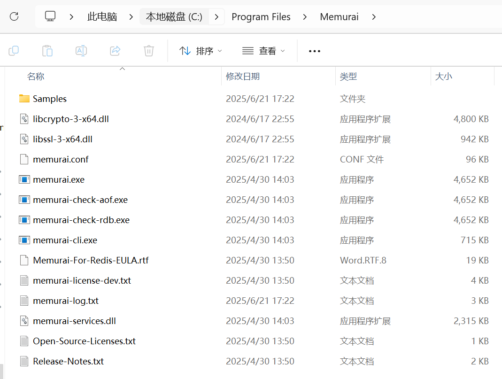
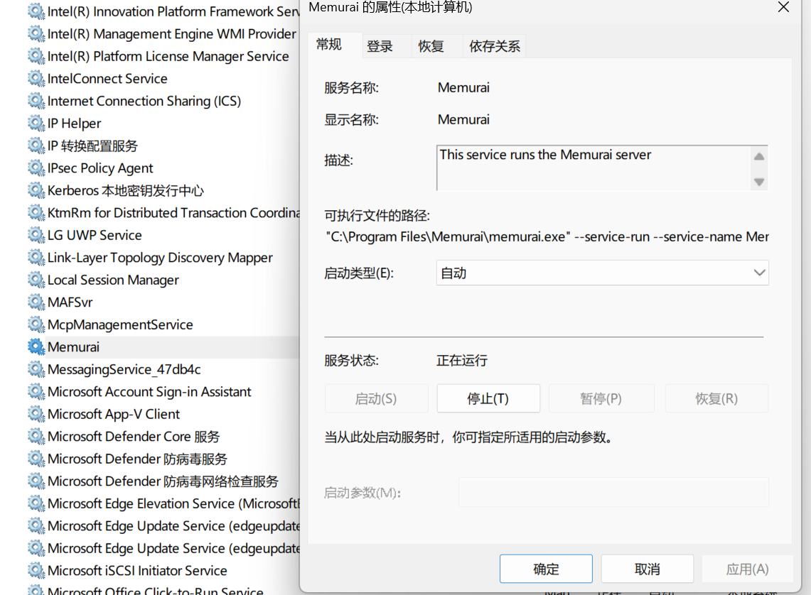

> 本页为原「Java 课程 11」全部 10 个分节的合订本；原分节链接会自动跳转到本页。


## 1.1 全栈工程师必学的缓存与存储方案-Redis

Redis作为一款高性能的键值对数据库，兼具缓存和存储双重能力，是全栈开发中解决高并发、低延迟需求的核心工具。无论是前端接口提速、后端数据缓存，还是分布式锁、消息队列等场景，Redis都能发挥关键作用。本文将从全栈视角系统梳理Redis的核心特性、应用场景及最佳实践。


### 一、Redis核心特性：为何成为全栈开发的首选

1. 高性能
   - 基于内存操作，读写速度可达10万+次/秒
   - 单线程模型避免上下文切换开销，同时支持IO多路复用
   - 数据结构设计优化（如跳表、压缩列表），操作复杂度低

2. 丰富的数据结构
   | 数据结构 | 典型应用场景 |
   |---------|------------|
   | String | 计数器、缓存简单值、分布式ID |
   | Hash | 存储对象（如用户信息、商品详情） |
   | List | 消息队列、最新列表、排行榜 |
   | Set | 去重、交集/并集计算（如共同好友） |
   | Sorted Set | 带权重的排行榜、延时任务 |
   | Bitmap | 布隆过滤器、用户签到、状态标记 |
   | HyperLogLog | 基数统计（如UV计算） |

3. 持久化机制
   - RDB：定时快照，适合备份，恢复速度快
   - AOF：记录所有写操作，数据安全性更高，支持三种同步策略

4. 高可用与分布式支持
   - 主从复制：实现读写分离
   - 哨兵机制：自动故障转移
   - 集群模式：数据分片，支持水平扩展


### 二、全栈开发中的Redis典型应用场景

#### 1. 接口缓存：减轻数据库压力

前端调用后端接口时，通过Redis缓存热点数据，减少数据库查询：

```javascript
// Node.js后端示例：接口缓存实现
async function getUserInfo(userId) {
  // 1. 尝试从Redis获取
  const cacheKey = `user:${userId}`;
  const cachedData = await redisClient.get(cacheKey);
  
  if (cachedData) {
    return JSON.parse(cachedData); // 直接返回缓存数据
  }
  
  // 2. 缓存未命中，查询数据库
  const userData = await db.query('SELECT * FROM users WHERE id = ?', [userId]);
  
  // 3. 写入Redis，设置过期时间（10分钟）
  await redisClient.set(cacheKey, JSON.stringify(userData), 'EX', 600);
  
  return userData;
}
```

缓存更新策略：
- 过期时间：避免缓存数据永久有效
- 更新数据库后主动删除缓存（Cache Aside Pattern）
- 写入时更新缓存（Write Through）


#### 2. 会话管理：分布式环境下的用户状态存储

在多服务器部署的Web应用中，Redis替代传统Cookie+Session方案：

```java
// Java Spring Boot示例：Redis存储用户会话
@Configuration
@EnableRedisHttpSession(maxInactiveIntervalInSeconds = 1800) // 30分钟过期
public class RedisSessionConfig {
    @Bean
    public LettuceConnectionFactory connectionFactory() {
        return new LettuceConnectionFactory(new RedisStandaloneConfiguration("localhost", 6379));
    }
}

// 控制器中使用
@GetMapping("/user/profile")
public ResponseEntity<UserProfile> getProfile(HttpSession session) {
    String userId = (String) session.getAttribute("userId");
    // ... 业务逻辑
}
```


#### 3. 计数器与限流：防止接口滥用

利用Redis的原子操作实现接口限流，保护后端服务：

```python
# Python示例：基于Redis的滑动窗口限流
import redis
import time

redis_client = redis.Redis(host='localhost', port=6379, db=0)

def is_allowed(user_id, action, window_seconds=60, max_attempts=100):
    key = f"rate_limit:{user_id}:{action}"
    now = int(time.time())
    window_start = now - window_seconds
    
    # 移除窗口外的计数
    redis_client.zremrangebyscore(key, 0, window_start)
    # 统计当前窗口内的请求数
    current = redis_client.zcard(key)
    
    if current < max_attempts:
        # 添加当前请求时间戳
        redis_client.zadd(key, {str(now): now})
        # 设置键过期时间
        redis_client.expire(key, window_seconds)
        return True
    return False
```


#### 4. 实时排行榜：利用Sorted Set实现

电商网站的商品销量排行榜：

```php
// PHP示例：商品销量排行榜
$redis = new Redis();
$redis->connect('127.0.0.1', 6379);

// 记录商品销量（每次销量+1）
function increaseSales($productId) {
    global $redis;
    $redis->zIncrBy('product:sales', 1, $productId);
}

// 获取销量前10的商品
function getTopSellingProducts($count = 10) {
    global $redis;
    // ZREVRANGE按分数从高到低排序
    return $redis->zRevRange('product:sales', 0, $count - 1, true);
}
```


#### 5. 分布式锁：解决并发资源竞争

在分布式系统中保证操作的原子性：

```go
// Go示例：Redis分布式锁实现
func acquireLock(lockKey string, value string, expireSeconds int) bool {
    // SET NX 仅当键不存在时设置，PX设置过期时间
    result, _ := redisClient.SetNX(lockKey, value, time.Duration(expireSeconds)*time.Second).Result()
    return result
}

func releaseLock(lockKey string, value string) bool {
    // 使用Lua脚本保证释放锁的原子性
    script := `
        if redis.call('get', KEYS[1]) == ARGV[1] then
            return redis.call('del', KEYS[1])
        else
            return 0
        end
    `
    result, _ := redisClient.Eval(script, []string{lockKey}, value).Int()
    return result == 1
}
```


### 三、Redis最佳实践与性能优化

1. 内存管理
   - 设置合理的过期时间（`EX`/`PX`参数）
   - 采用内存淘汰策略（maxmemory-policy），推荐`allkeys-lru`
   - 避免大key，拆分大型Hash/List

2. 性能优化
   - 使用连接池管理连接，避免频繁创建销毁
   - 批量操作（`pipeline`）减少网络往返
   - 合理使用数据结构，如用Hash存储对象比多个String更高效

3. 高可用部署
   - 生产环境至少一主二从+哨兵模式
   - 重要数据同时开启RDB和AOF持久化
   - 采用Redis Cluster实现数据分片和水平扩展

4. 安全性
   - 配置密码认证（requirepass）
   - 限制访问IP（bind）
   - 禁用危险命令（rename-command）


### 四、全栈开发中的Redis工具链

- 前端：通过API间接操作Redis，无需直接连接
- 后端：
  - Java: Spring Data Redis, Lettuce
  - Node.js: ioredis, redis
  - Python: redis-py
  - Go: go-redis
- 监控与运维：
  - Redis CLI：基础操作与监控
  - Redis Insight：可视化管理工具
  - Prometheus + Grafana：性能监控


### 总结：Redis在全栈架构中的价值

Redis作为全栈开发的"瑞士军刀"，其价值体现在：

1. 性能提升：将热点数据从磁盘提升到内存，响应时间从毫秒级降至微秒级
2. 架构解耦：作为中间层实现会话共享、服务解耦
3. 功能扩展：提供丰富的数据结构和原子操作，简化复杂业务实现
4. 高可用保障：支持分布式部署，满足高并发场景需求

对于全栈工程师而言，掌握Redis不仅是提升系统性能的手段，更是设计高可用、可扩展架构的基础能力。实际开发中需根据业务场景选择合适的数据结构和部署方案，平衡性能、一致性和开发复杂度。


## 2.1 Redis入门指南，从安装到配置，快速实现开发准备

Redis作为高性能的内存数据库，入门的第一步是搭建稳定的运行环境。这个指南将从安装、基础配置到开发准备，带你完成Redis的初始化工作，为后续开发奠定基础。


### macOS系统安装

#### 1. 确保已安装 Homebrew

若要在 macOS 上安装 Redis 开源版，请使用 Homebrew。开始执行以下安装步骤前，请确保已安装 Homebrew：

```bash
# 安装Homebrew（已安装可跳过）
/bin/bash -c "$(curl -fsSL https://raw.githubusercontent.com/Homebrew/install/HEAD/install.sh)"
```


#### 2. 使用 Homebrew 安装 Redis

首先，添加 Redis 的 Homebrew 软件源（cask）：

```bash
brew tap redis/redis
```

接下来，执行 `brew install` 命令进行安装：
```bash
brew install --cask redis
```

注：由于 Redis 是通过 `brew tap` 命令从 Homebrew 软件源（cask）安装的，因此它不会与 `brew services` 命令集成（即无法通过 `brew services` 命令管理 Redis 服务的启动、停止等）。

#### 3. 运行 Redis

如果这是你首次在系统上安装 Redis，需确保你的 `PATH` 环境变量中包含 Redis 的安装路径。对于搭载 Apple 芯片的 Mac，该路径为 `/opt/homebrew/bin`；对于基于 Intel 芯片的 Mac，该路径为 `/usr/local/bin`。

要检查 `PATH` 变量，执行以下命令：

```bash
echo $PATH
```


确认输出结果中包含 `/opt/homebrew/bin`（Apple 芯片 Mac）或 `/usr/local/bin`（Intel 芯片 Mac）。若这两个路径均未在输出中出现，请按以下步骤添加。打开 `~/.bashrc` 或 `~/.zshrc` 文件（具体取决于你使用的 Shell），添加以下代码行：

```bash
export PATH=$(brew --prefix)/bin:$PATH
```

完成上述设置后，可通过以下命令启动 Redis 服务器：

```bash
redis-server $(brew --prefix)/etc/redis.conf
```

服务器将在后台运行。


#### 4. 卸载 Redis

若要卸载 Redis，执行以下命令：
```bash
brew uninstall redis
brew untap redis/redis
```


### Linux系统安装（以Ubuntu/Debian为例）

```bash
# 更新包索引
sudo apt-get install lsb-release curl gpg
curl -fsSL https://packages.redis.io/gpg | sudo gpg --dearmor -o /usr/share/keyrings/redis-archive-keyring.gpg
sudo chmod 644 /usr/share/keyrings/redis-archive-keyring.gpg
echo "deb [signed-by=/usr/share/keyrings/redis-archive-keyring.gpg] https://packages.redis.io/deb $(lsb_release -cs) main" | sudo tee /etc/apt/sources.list.d/redis.list
sudo apt-get update

# 安装Redis
sudo apt-get install redis

# 启动服务
sudo systemctl start redis-server

# 设置开机自启
sudo systemctl enable redis-server

# 检查服务状态
sudo systemctl status redis-server  # 应显示active (running)
```

### Docker环境安装


#### 1. 在 Docker 上运行 Redis 服务器


若要使用 `redis:<version>` 镜像启动 Redis 开源版服务器，请在终端中执行以下命令：

```bash
docker run -d --name redis -p 6379:6379 redis:<version>
```
> 说明：命令中的 `<version>` 需替换为具体的 Redis 版本号，例如 `redis:7.2.4`，若直接使用 `redis` 则默认拉取最新版本镜像。


#### 2. 在 Docker 上运行 Redis 客户端 redis-cli

之后，你可以通过 `redis-cli` 连接到 Redis 服务器，操作方式与连接其他任何 Redis 实例一致。

### 情况 1：本地未安装 redis-cli
若本地未安装 `redis-cli`，可从 Docker 容器中运行该工具，命令如下：
```bash
$ docker exec -it redis redis-cli
```

### 情况 2：本地已安装 redis-cli
若本地已安装 `redis-cli`，直接在终端中执行以下命令即可连接：
```bash
$ redis-cli -h 127.0.0.1 -p 6379
```
> 说明：`-h` 指定 Redis 服务器地址（此处为本地地址 127.0.0.1），`-p` 指定端口号（Redis 默认端口为 6379）。


#### 3. 使用本地配置文件

默认情况下，Redis Docker 容器使用 Redis 的内置配置文件。若要使用本地配置文件启动 Redis，可选择以下两种方式之一：


##### 方式 1：通过 Dockerfile 配置
你可以创建自定义 Dockerfile，将上下文目录中的 `redis.conf`（本地配置文件）添加到容器的 `/data/` 目录下，示例如下：
```dockerfile
FROM redis
COPY redis.conf /usr/local/etc/redis/redis.conf
CMD [ "redis-server", "/usr/local/etc/redis/redis.conf" ]
```
创建完成后，需通过 `docker build` 构建镜像，再用 `docker run` 启动容器。


##### 方式 2：通过 docker run 命令直接指定（无需 Dockerfile）
也可以在 `docker run` 命令中通过选项直接指定本地配置文件，无需创建 Dockerfile，命令如下：
```bash
$ docker run -v /myredis/conf:/usr/local/etc/redis --name myredis redis redis-server /usr/local/etc/redis/redis.conf
```
- 其中，`/myredis/conf/` 是本地存放 `redis.conf` 文件的目录路径，需根据实际本地路径修改。
- `-v /myredis/conf:/usr/local/etc/redis` 的作用是将本地的 `/myredis/conf` 目录与容器内的 `/usr/local/etc/redis` 目录进行挂载，使容器能读取本地的配置文件。


有关Docker的内容还会在后续课程详细介绍。

### Windows系统安装

Windows官方未提供原生支持，推荐使用 Docker 在 Windows 上运行 Redis。

另外一种方式是使用Memurai。Memurai是Redis on Windows项目钦点的替代产品，同时Memura也是Redis官方的合作伙伴。


#### 1. 下载安装Memurai


下载地址：<https://www.memurai.com/get-memurai>，选择“Memurai for Redis”版本进行下载，可以得到一个名为“Memurai-for-Redis-v4.2.0.msi”的安装包。以管理员身份双击进行安装。可以自定义安装目录和自定义端口。

或者也可以用命令行安装：

```
>msiexec /quiet /i Memurai-for-Redis-v4.2.0.msi
```


安装完成之后，在安装目录下可看到如下目录文件：




#### 2. 配置Memurai

安装完成后，你可以通过编辑Memurai的配置文件来进行一些自定义配置。配置文件位于Memurai安装目录的memurai.conf中。

通过编辑配置文件，你可以配置Memurai的监听地址和端口，设置密码，启用或禁用AOF（append-only file）持久化等。


#### 3. 运行Memurai

一旦安装和配置完成，你就可以启动Memurai服务并开始测试运行了。运行 memurai.exe 就可以启动服务器了。

默认情况下，Memurai是已以Windows服务的方式自动启动了，可以请按下`Win + R`组合键打开运行窗口，输入services.msc并点击确定。在服务管理窗口中，找到Memurai服务，对其进行管理，比如启动方式改为手动，将服务关闭、启动等。




启动完成后，打开命令行工具（如Windows PowerShell或cmd），输入memurai-cli命令即可进入Memurai的命令行界面。

在命令行界面中，你可以使用各种Redis命令，如SET、GET、DEL等，与Memurai进行交互。


```
>memurai-cli.exe
127.0.0.1:6379> SET mykey "Hello World!"
OK
127.0.0.1:6379> GET mykey
"Hello World!"
127.0.0.1:6379> DEL mykey
(integer) 1
127.0.0.1:6379>
```


### Redis基础配置：核心参数调整

Redis的配置文件位置：
- Windows（Memurai版）：`memurai.conf`
- macOS（Homebrew）：`/usr/local/etc/redis.conf`
- Linux：`/etc/redis/redis.conf`

以下是必改的核心配置（开发环境）

1. 绑定地址（允许远程访问）
   ```conf
   # 注释掉绑定本地地址（或改为0.0.0.0允许所有IP访问）
   # bind 127.0.0.1 ::1
   bind 0.0.0.0
   ```

2. 保护模式（开发环境关闭）
   ```conf
   # 开发环境可关闭保护模式（生产环境需开启并配置密码）
   protected-mode no
   ```

3. 设置密码（重要！）
   ```conf
   # 取消注释并设置密码（替换为你的密码）
   requirepass your_strong_password_here
   ```

4. 端口配置（默认6379，可保持不变）
   ```conf
   port 6379
   ```

5. 内存限制（防止内存溢出）
   ```conf
   # 设置最大使用内存（根据实际情况调整，如2GB）
   maxmemory 2gb
   # 内存满时的淘汰策略（开发环境推荐）
   maxmemory-policy allkeys-lru
   ```

修改配置后重启Redis使生效：
```bash
# Linux/macOS
sudo systemctl restart redis-server  # systemd系统
# 或
sudo service redis-server restart

# Windows（命令行启动方式）
# 先关闭当前服务（Ctrl+C），再重新启动
redis-server.exe redis.windows.conf
```


### Redis客户端连接与基础操作

#### 1. 使用官方命令行客户端（redis-cli）

```bash
# 本地连接（默认端口）
redis-cli

# 带密码连接
redis-cli -a your_password_here

# 远程连接
redis-cli -h 192.168.1.100 -p 6379 -a your_password

# 连接成功后测试
127.0.0.1:6379> ping
PONG  # 成功响应
```


#### 2. 基础操作示例

```bash
# 设置键值对
127.0.0.1:6379> set username "zhangsan"
OK

# 获取值
127.0.0.1:6379> get username
"zhangsan"

# 设置带过期时间的键（10秒后过期）
127.0.0.1:6379> setex token 10 "abc123"
OK

# 查看键的过期时间（-1表示永不过期，-2表示已过期）
127.0.0.1:6379> ttl token
(integer) 7

# 删除键
127.0.0.1:6379> del username
(integer) 1

# 查看所有键
127.0.0.1:6379> keys *
1) "token"
```


### Redis可视化工具：提升开发效率

推荐几款常用的Redis可视化工具，便于查看和管理数据：

1. Redis Insight（官方推荐）
   - 功能全面，支持数据可视化、性能分析
   - 跨平台（Windows/macOS/Linux）
   - 下载地址：[Redis Insight官网](https://redis.io/insight/)

2. Another Redis Desktop Manager
   - 轻量开源，界面简洁
   - 支持多语言和批量操作
   - 下载地址：[GitHub仓库](https://github.com/qishibo/AnotherRedisDesktopManager)


### 总结：Redis开发环境搭建 checklist

1. 安装Redis并验证服务启动（`redis-cli ping`返回PONG）
2. 配置基础参数（绑定地址、密码、内存限制）
3. 测试命令行操作（set/get/expire等基础命令）
4. 安装可视化工具便于日常管理

完成以上步骤后，你的Redis开发环境就已准备就绪。后续可以根据具体业务场景，深入学习Redis的数据结构和高级特性，实现缓存、计数器、排行榜等功能。


## 2.2 Redis核心数据类型深度解析：掌握存储精髓

Redis的强大之处在于其丰富而高效的核心数据类型，这些数据结构经过精心设计，既能满足复杂业务需求，又保持了极致性能。理解每种数据类型的底层实现、适用场景和操作特性，是真正掌握Redis的关键。


### 一、String（字符串）：Redis的基础积木

String是Redis最基础的数据类型，也是使用频率最高的类型，所有键都是字符串类型，而值可以是字符串、数字或二进制数据（最大512MB）。

#### 底层实现
- 小字符串（<=44字节）：采用`embstr`编码，内存连续分配，减少内存碎片
- 大字符串（>44字节）：采用`raw`编码，使用动态字符串（SDS）存储
- 数字类型：自动识别为整数/浮点数，支持原子增减操作

#### 核心操作
```bash
# 设置值（普通字符串）
set username "alice"

# 设置带过期时间的值（10秒后过期）
setex token 10 "abc123"

# 不存在时才设置（分布式锁常用）
setnx lock:order true

# 原子递增（计数器场景）
incr article:100:views  # 浏览量+1
incrby article:100:views 5  # 浏览量+5

# 原子递减
decr user:100:points  # 积分-1

# 获取值
get username

# 获取长度
strlen username
```

#### 典型应用场景
- 缓存用户信息、商品详情等简单对象（序列化后存储）
- 计数器（文章阅读量、接口调用次数）
- 分布式ID生成（incrby步长生成唯一ID）
- 限流（记录单位时间内的请求次数）

#### 性能特点
- 所有操作均为O(1)复杂度
- 数字操作是原子性的，适合并发场景
- 避免存储过大的字符串（建议单个不超过100KB），否则会影响性能


### 二、Hash（哈希）：对象存储的最佳选择

Hash适用于存储结构化数据，类似JSON对象，每个Hash可以包含多个键值对（field-value）。

#### 底层实现
- 小哈希（字段数少且值小）：采用`ziplist`（压缩列表）编码，内存紧凑
- 大哈希：自动转为`hashtable`（哈希表）编码，支持高效查询

#### 核心操作
```bash
# 设置哈希字段
hset user:100 name "bob" age 25 email "bob@example.com"

# 获取单个字段
hget user:100 name

# 获取所有字段和值
hgetall user:100

# 获取所有字段名
hkeys user:100

# 获取所有值
hvals user:100

# 字段是否存在
hexists user:100 age

# 原子递增字段值
hincrby user:100 score 10

# 删除字段
hdel user:100 email
```

#### 典型应用场景
- 存储用户信息、商品属性等结构化数据
- 购物车（每个用户一个Hash，商品ID为field，数量为value）
- 配置项存储（按模块分组存储配置）

#### 最佳实践
- 避免使用`hgetall`操作大Hash（会阻塞Redis），改用`hmget`获取指定字段
- 合理设计键名（如`user:{id}`），便于管理和过期清理
- 单个Hash建议不超过1000个字段，过大可拆分


### 三、List（列表）：有序集合的灵活实现

List是有序的字符串集合，支持在两端插入和删除元素，类似双向链表。

#### 底层实现
- 小列表：采用`ziplist`编码
- 大列表：转为`linkedlist`（双向链表）编码
- Redis 3.2+引入`quicklist`（快速列表），结合两者优点，平衡性能和内存

#### 核心操作
```bash
# 左侧插入（头部）
lpush messages "hello" "world"

# 右侧插入（尾部）
rpush messages "redis"

# 左侧弹出（移除并返回头部元素）
lpop messages

# 右侧弹出
rpop messages

# 获取指定范围元素（0到-1表示所有）
lrange messages 0 -1

# 获取列表长度
llen messages

# 截取列表（保留指定范围，删除其他元素）
ltrim messages 0 4  # 只保留前5个元素
```

#### 典型应用场景
- 消息队列（lpush + rpop组合）
- 最新列表（如最近评论、最近登录用户）
- 栈（lpush + lpop）或队列（lpush + rpop）实现
- 分页查询（lrange实现分页加载）

#### 性能注意事项
- 两端操作（lpush/lpop/rpush/rpop）为O(1)
- 中间元素操作（如lindex）为O(n)，大列表应避免
- 可结合`blpop/brpop`实现阻塞队列，处理消费者空闲等待问题


### 四、Set（集合）：无序去重的高效实现

Set是无序的字符串集合，自动去重，支持丰富的集合运算。

#### 底层实现
- 小集合：`intset`（整数集合）编码，存储整数时更紧凑
- 大集合：`hashtable`编码，用哈希表实现

#### 核心操作
```bash
# 添加元素
sadd tags "java" "redis" "spring"

# 判断元素是否存在
sismember tags "redis"

# 获取所有元素
smembers tags

# 删除元素
srem tags "spring"

# 集合大小
scard tags

# 随机获取元素
srandmember tags 2  # 随机获取2个元素

# 集合运算：交集（共同好友场景）
sadd user:100:follow 1 2 3
sadd user:200:follow 2 3 4
sinter user:100:follow user:200:follow  # 结果：2,3

# 集合运算：并集
sunion user:100:follow user:200:follow  # 结果：1,2,3,4

# 集合运算：差集
sdiff user:100:follow user:200:follow  # 结果：1
```

#### 典型应用场景
- 标签系统（文章标签、用户兴趣标签）
- 去重操作（如记录独立访问IP）
- 社交关系（好友列表、关注列表）
- 抽奖系统（srandmember随机抽取）

#### 性能特点
- 所有单元素操作都是O(1)
- 集合运算（交集、并集）复杂度为O(n)，避免对大集合进行此类操作


### 五、Sorted Set（有序集合）：带分数的高级集合

Sorted Set（ZSet）是Set的增强版，每个元素关联一个分数（score），并按分数自动排序。

#### 底层实现
- 小集合：`ziplist`编码
- 大集合：`skiplist`（跳表）+ `hashtable`组合，跳表提供有序性和范围查询，哈希表提供O(1)的元素查询

#### 核心操作
```bash
# 添加元素（附带分数）
zadd ranking:product 100 "product1" 200 "product2" 150 "product3"

# 按分数范围查询（升序）
zrange ranking:product 0 -1 withscores

# 按分数范围查询（降序，适合排行榜）
zrevrange ranking:product 0 2 withscores  # 前三名

# 按分数区间查询
zrangebyscore ranking:product 120 200  # 分数120-200的元素

# 元素分数自增
zincrby ranking:product 10 "product1"  # product1分数+10

# 获取元素排名（降序）
zrevrank ranking:product "product2"  # 返回排名（0开始）

# 获取元素分数
zscore ranking:product "product3"
```

#### 典型应用场景
- 排行榜（销量、积分、人气排行榜）
- 延时任务队列（分数为时间戳，zrangebyscore获取到期任务）
- 范围查询（如查询成绩在90-100分的学生）
- 带权重的消息队列

#### 性能优势
- 插入、删除、查询元素分数：O(log n)
- 范围查询：O(log n + m)，m为返回元素数
- 适合需要排序和范围查询的场景，性能远超关系数据库


### 六、特殊数据类型：Bitmap、HyperLogLog与Geospatial

除了五大核心类型，Redis还提供了几种特殊数据类型，针对特定场景优化。

#### 1. Bitmap（位图）
- 本质：用String存储的二进制位序列，每个位表示一个状态（0或1）
- 核心操作：
  ```bash
  # 设置位（第3天签到）
  setbit user:100:sign 2 1  # 索引从0开始，2表示第3天
  
  # 获取位状态
  getbit user:100:sign 2
  
  # 统计置位数量（本月签到天数）
  bitcount user:100:sign 0 29  # 0-29天
  
  # 位运算（多个用户签到情况交集）
  bitop AND result user:100:sign user:200:sign
  ```
- 应用场景：用户签到、在线状态、权限标记、布隆过滤器基础

#### 2. HyperLogLog
- 用途：基数统计（不重复元素个数），占用内存极小（约12KB）
- 特点：有0.81%的误差，适合不需要精确计数的场景
- 核心操作：
  ```bash
  # 添加元素
  pfadd uv:20231001 "user1" "user2" "user3"
  
  # 统计基数
  pfcount uv:20231001  # 结果：3
  
  # 合并多个HyperLogLog
  pfmerge uv:202310 uv:20231001 uv:20231002
  ```
- 应用场景：UV统计、独立访客数、搜索关键词去重计数

#### 3. Geospatial（地理空间）
- 用途：存储地理位置信息，支持距离计算和范围查询
- 核心操作：
  ```bash
  # 添加地理位置（经度、纬度、名称）
  geoadd cities 116.40 39.90 "beijing" 121.47 31.23 "shanghai"
  
  # 计算距离（单位km）
  geodist cities beijing shanghai km
  
  # 范围内查询（以指定经纬度为中心，半径1000km内的城市）
  georadius cities 116.40 39.90 1000 km
  ```
- 应用场景：附近的人、商家地理位置搜索、物流轨迹


### 七、数据类型选择决策指南

选择合适的数据类型是Redis性能优化的关键，决策流程可参考：

1. 是否需要去重？  
   是 → 考虑Set或Sorted Set  
   否 → 考虑List、String或Hash

2. 是否需要排序？  
   是 → Sorted Set（按分数）或List（按插入顺序）  
   否 → Set或Hash

3. 是否存储结构化数据？  
   是 → Hash（字段较少时）或String（序列化JSON，字段较多时）  
   否 → 根据是否需要排序/去重选择

4. 是否需要统计功能？  
   基数统计 → HyperLogLog  
   二进制状态统计 → Bitmap  
   地理位置统计 → Geospatial


### 八、底层实现对开发的启示

理解Redis数据类型的底层实现，能帮助我们写出更高效的代码：

1. 编码转换的影响：小数据量使用紧凑编码（ziplist/intset），超过阈值会自动转换为复杂结构（hashtable/skiplist），设计时应尽量避免频繁触发转换
2. 内存碎片问题：embstr编码比raw更紧凑，小字符串优先用embstr
3. 操作复杂度认知：避免对大列表使用lindex（O(n)），对大集合使用sinter（O(n)）等耗时操作
4. 批量操作优化：利用pipeline减少网络往返，Hash的hmget比多次hget更高效


### 总结：掌握数据类型的精髓

Redis核心数据类型的设计体现了"场景驱动优化"的思想——没有万能类型，只有最适合场景的类型。全栈开发者需要：

1. 理解每种类型的适用场景边界（如Hash适合小对象，不适合超大字段）
2. 掌握操作的性能特征（复杂度、原子性）
3. 结合业务需求灵活组合使用（如用Hash存储用户基本信息，Sorted Set存储用户积分排名）

只有这样，才能充分发挥Redis的性能优势，避免常见的性能陷阱，构建高效、稳定的缓存与存储方案。


更多有关数据结构方面的基础知识，可参阅《数据结构和算法基础（Java语言实现）》。


## 3.1 Redis高频数据操作命令深度解析：从基础到实战优化

Redis命令是操作数据的核心入口，掌握高频命令的使用场景、参数细节、性能影响和实战技巧，能让开发者在处理缓存、计数、排行榜等场景时效率翻倍，同时避免常见的性能陷阱。本文按数据类型分类，聚焦日常开发中使用频率最高的命令，结合底层原理和实战案例展开解析。


### 一、通用高频命令：所有数据类型共用

通用命令主要用于管理键（Key）的生命周期、查询状态，是Redis操作的基础，几乎每个业务场景都会用到。

#### 1. `KEYS pattern`：批量查询键（慎用！）
- 功能：根据通配符模式匹配键，返回所有符合条件的键。
- 参数：`pattern`支持通配符（`*`匹配任意字符，`?`匹配单个字符，`[]`匹配指定字符集）。
  ```bash
  # 示例：查询所有以"user:"开头的键
  KEYS user:*
  # 示例：查询以"article:"开头、结尾为数字的键
  KEYS article:[0-9]
  ```
- 底层风险：  
  Redis是单线程模型，`KEYS`会遍历整个数据库的所有键，阻塞主线程（若数据库有10万+键，可能导致秒级阻塞），生产环境禁止在高峰期使用。
- 替代方案：  
  用`SCAN`命令（渐进式遍历，不阻塞线程）替代：
  ```bash
  # SCAN cursor [MATCH pattern] [COUNT count]
  # cursor=0表示开始遍历，返回的新cursor=0表示遍历结束
  SCAN 0 MATCH user:* COUNT 100  # 每次返回最多100个键
  ```

#### 2. `EXISTS key [key ...]`：判断键是否存在
- 功能：检查一个或多个键是否存在，返回存在的键的数量（原子操作）。
- 优势：比`GET key`判断“是否为nil”更高效（无需解析值内容），支持批量判断。
  ```bash
  # 示例：判断单个键是否存在（返回1存在，0不存在）
  EXISTS user:100
  # 示例：批量判断多个键（返回2，表示前两个存在）
  EXISTS user:100 article:200 comment:300
  ```
- 实战场景：  
  缓存预热前判断键是否已存在，避免重复加载；分布式锁场景中判断锁键是否存在。

#### 3. `DEL key [key ...]`：删除键（原子批量删除）
- 功能：删除一个或多个键，返回被删除的键的数量（原子操作，要么全删，要么全不删）。
- 性能特点：  
  删除不同数据类型的键性能不同：
  - 字符串、Hash、Set等小数据类型：O(1)（直接释放内存）；
  - 大List、大Sorted Set：O(n)（需遍历元素释放，n为元素个数），删除10万+元素的键会阻塞线程。
  ```bash
  # 示例：删除单个键
  DEL user:100
  # 示例：批量删除多个键（推荐，减少网络往返）
  DEL article:200 comment:300
  ```
- 实战技巧：  
  如需删除超大键（如百万级元素的List），用`UNLINK`命令替代（异步删除，不阻塞主线程）：
  ```bash
  UNLINK big:list:100  # 异步删除，立即返回，后台线程清理内存
  ```

#### 4. `EXPIRE key seconds` / `PEXPIRE key milliseconds`：设置键过期时间
- 功能：为键设置生存时间（TTL），过期后自动删除，是缓存场景的核心命令。
- 关联命令：
  - `TTL key`：查看键剩余过期时间（-1永不过期，-2已过期）；
  - `PERSIST key`：取消键的过期时间（转为永不过期）。
  ```bash
  # 示例：设置键10秒后过期
  EXPIRE user:100:token 10
  # 示例：查看剩余时间（返回剩余秒数）
  TTL user:100:token
  # 示例：取消过期时间
  PERSIST user:100:token
  ```
- 底层机制：  
  Redis用“过期字典”记录所有带TTL的键，定期（100ms一次）扫描部分过期键并删除，同时在访问键时检查是否过期（惰性删除），平衡内存占用和CPU消耗。
- 实战陷阱：  
  对已设置过期时间的键执行`SET`命令会覆盖过期时间（转为永不过期），需注意：
  ```bash
  SET user:100 "alice"
  EXPIRE user:100 30  # TTL=30
  SET user:100 "bob"   # 此时TTL变为-1（永不过期）
  ```


### 二、String类型高频命令：缓存与计数核心

String是Redis最常用的数据类型，命令简洁但功能强大，覆盖缓存、计数、分布式ID等核心场景。

#### 1. `SET key value [NX|XX] [EX seconds|PX milliseconds]`：设置键值
- 功能：最核心的String命令，支持“条件设置”和“过期时间”，参数组合灵活，需重点掌握。
- 关键参数解析：
  - `NX`（Not Exists）：仅当键不存在时才设置（成功返回OK，失败返回nil），用于分布式锁、防止重复创建；
  - `XX`（Exists）：仅当键存在时才设置，用于更新已有的键；
  - `EX/PX`：设置过期时间（替代单独的`EXPIRE`命令，原子操作，避免“设置值+设置过期”的竞态问题）。
- 实战场景示例：
  ```bash
  # 1. 普通设置（覆盖旧值，永不过期）
  SET username "alice"
  
  # 2. 缓存场景：设置值并指定10分钟过期（原子操作）
  SET article:100:content "xxx" EX 600
  
  # 3. 分布式锁：仅当锁键不存在时才设置（NX+EX组合）
  SET lock:order true NX EX 10  # 10秒自动释放锁
  
  # 4. 更新场景：仅当键存在时才更新（避免创建新键）
  SET user:100:age 25 XX EX 3600
  ```

#### 2. `GET key`：获取键值
- 功能：获取String类型的键值，若键不存在返回nil，若值非String类型返回错误。
- 实战技巧：  
  缓存场景中，获取值后需判断是否为nil：若为nil，需从数据库加载数据并`SET`到Redis；若不为nil，直接返回（避免缓存穿透需额外处理，如布隆过滤器）。
  ```bash
  # 示例：获取文章内容
  GET article:100:content
  ```

#### 3. `INCR key` / `INCRBY key increment`：原子递增
- 功能：`INCR`将键值+1，`INCRBY`将键值+指定整数（仅支持整数类型，若键不存在则先初始化为0再递增）。
- 原子性保证：  
  命令执行过程中不会被其他线程打断，是分布式环境下“无锁计数”的核心方案（如避免数据库自增的并发问题）。
- 实战场景：
  ```bash
  # 1. 文章阅读量计数（每次访问+1）
  INCR article:100:views
  
  # 2. 分布式ID生成（步长为1，每次生成唯一ID）
  INCR order:id:generator
  
  # 3. 批量递增（一次+5）
  INCRBY user:100:points 5
  ```
- 关联命令：  
  `DECR`（-1）、`DECRBY`（-指定整数），用法与递增命令一致，适用于积分扣除、库存减少等场景。

#### 4. `MSET key value [key value ...]` / `MGET key [key ...]`：批量设置/获取
- 功能：`MSET`批量设置多个键值（原子操作，要么全成功，要么全失败），`MGET`批量获取多个键值（返回值数组，顺序与键的顺序一致）。
- 性能优势：  
  替代多次`SET`/`GET`命令，减少网络往返次数（如10个键的操作从10次网络请求变为1次），大幅提升效率。
- 实战示例：
  ```bash
  # 批量设置用户信息（避免多次SET）
  MSET user:100:name "alice" user:100:age 25 user:100:email "a@xxx.com"
  
  # 批量获取用户信息（避免多次GET）
  MGET user:100:name user:100:age user:100:email  # 返回 ["alice", "25", "a@xxx.com"]
  ```


### 三、Hash类型高频命令：结构化数据存储

Hash适合存储结构化数据（如用户信息、商品属性），命令设计围绕“字段（field）”操作，比String序列化JSON更灵活。

#### 1. `HSET key field value [field value ...]`：设置Hash字段
- 功能：为Hash类型的键设置一个或多个字段（field-value），若键不存在则创建，若字段已存在则覆盖。
- 性能特点：  
  单个字段操作O(1)，批量字段操作O(n)（n为字段数），比`SET`序列化JSON更高效（更新单个字段无需重新序列化整个对象）。
- 实战示例：
  ```bash
  # 1. 设置单个字段
  HSET user:100 name "bob"
  
  # 2. 批量设置多个字段（推荐，减少网络请求）
  HSET user:100 age 30 email "b@xxx.com"
  ```

#### 2. `HGET key field` / `HMGET key field [field ...]`：获取Hash字段
- 功能：`HGET`获取单个字段值，`HMGET`批量获取多个字段值（返回值数组，顺序与字段顺序一致）。
- 实战优势：  
  相比`GET`序列化的JSON，`HMGET`可按需获取部分字段（如仅获取用户的“姓名+年龄”，无需加载完整信息），减少网络传输量。
  ```bash
  # 获取单个字段
  HGET user:100 name
  
  # 批量获取多个字段
  HMGET user:100 name age email
  ```

#### 3. `HGETALL key`：获取所有字段和值（慎用！）
- 功能：返回Hash的所有字段和值（数组形式，field和value交替出现）。
- 性能风险：  
  若Hash包含1000+字段，`HGETALL`会一次性返回大量数据，阻塞Redis主线程并占用网络带宽，生产环境避免用于大Hash。
- 替代方案：  
  用`HSCAN`渐进式遍历（类似`SCAN`，不阻塞线程）：
  ```bash
  # HSCAN cursor key [MATCH pattern] [COUNT count]
  HSCAN 0 user:100 MATCH * COUNT 100  # 每次返回最多100个字段
  ```

#### 4. `HINCRBY key field increment`：Hash字段原子递增
- 功能：对Hash的指定字段进行整数递增（类似`INCRBY`，但针对Hash字段），字段不存在则初始化为0再递增。
- 实战场景：  
  购物车（每个用户一个Hash，商品ID为field，数量为value，`HINCRBY`增减商品数量）：
  ```bash
  # 用户100的购物车中，商品200的数量+1
  HINCRBY cart:100 200 1
  
  # 商品200的数量-1（递减）
  HINCRBY cart:100 200 -1
  ```


### 四、List类型高频命令：队列与最新列表

List基于双向链表实现，高频命令集中在“两端操作”，适合消息队列、最新评论等场景。

#### 1. `LPUSH key value [value ...]` / `RPUSH key value [value ...]`：两端插入
- 功能：`LPUSH`从List头部（左侧）插入元素，`RPUSH`从尾部（右侧）插入元素，返回插入后的List长度。
- 性能特点：  
  无论List大小，两端插入都是O(1)（双向链表特性），适合高频写入场景。
- 实战场景：
  ```bash
  # 消息队列：从尾部插入消息（生产者）
  RPUSH queue:order "order1" "order2"
  
  # 最新评论：从头部插入新评论（保证最新的在前面）
  LPUSH comment:100 "userA: xxx" "userB: yyy"
  ```

#### 2. `LPOP key` / `RPOP key`：两端弹出
- 功能：`LPOP`从头部删除并返回元素，`RPOP`从尾部删除并返回元素（若List为空，返回nil）。
- 实战场景：  
  消息队列的消费者（`RPUSH`+`LPOP`实现FIFO队列，`LPUSH`+`RPOP`实现栈）：
  ```bash
  # 消息队列消费者：从头部获取消息（FIFO）
  LPOP queue:order  # 返回"order1"
  
  # 栈场景：从尾部获取元素（LIFO）
  RPOP stack:tasks
  ```
- 阻塞版本：  
  若List为空，`LPOP/RPOP`会立即返回nil，消费者需轮询（浪费资源）。用`BLPOP/BRPOP`（阻塞式弹出）替代，List为空时阻塞等待，有元素时立即返回：
  ```bash
  # 阻塞等待队列消息，超时时间30秒（0表示永久阻塞）
  BLPOP queue:order 30
  ```

#### 3. `LRANGE key start stop`：获取指定范围元素
- 功能：返回List中从`start`到`stop`的元素（`start=0`表示第一个元素，`stop=-1`表示最后一个元素）。
- 性能特点：  
  复杂度O(n)（n为返回的元素个数），若返回大量元素（如1万+）会阻塞线程，适合“分页加载”（每次返回少量元素）。
- 实战场景：  
  最新评论分页（每次加载10条）：
  ```bash
  # 加载第1页（前10条评论）
  LRANGE comment:100 0 9
  
  # 加载第2页（11-20条）
  LRANGE comment:100 10 19
  ```


### 五、Sorted Set类型高频命令：排行榜与范围查询

Sorted Set（ZSet）是Redis最强大的数据类型之一，高频命令围绕“分数（score）排序”和“范围查询”，覆盖排行榜、延时任务等核心场景。

#### 1. `ZADD key score member [score member ...]`：添加元素
- 功能：为ZSet添加一个或多个“分数-成员”对（member唯一，score可重复），返回新增的成员数量。
- 性能特点：  
  单个元素添加O(log n)（n为ZSet元素个数），批量添加比单次添加更高效（减少线程切换）。
- 实战场景：  
  商品销量排行榜（score为销量，member为商品ID）：
  ```bash
  # 添加商品销量（商品100销量100，商品200销量200）
  ZADD ranking:product 100 100 200 200
  ```

#### 2. `ZREVRANGE key start stop [WITHSCORES]`：降序获取范围元素
- 功能：按score从大到小（降序）返回ZSet中`start`到`stop`的元素，`WITHSCORES`参数会同时返回score。
- 核心场景：  
  排行榜（如Top10销量商品、Top5积分用户），是ZSet最经典的用法：
  ```bash
  # 获取销量Top3商品（仅返回商品ID）
  ZREVRANGE ranking:product 0 2
  
  # 获取Top3商品及销量（返回ID+销量）
  ZREVRANGE ranking:product 0 2 WITHSCORES
  ```

#### 3. `ZINCRBY key increment member`：元素分数递增
- 功能：为ZSet的指定member增加score（increment可正可负），返回递增后的score。
- 原子性优势：  
  替代“获取score→计算新score→ZADD更新”的三步操作，避免竞态问题（如多线程同时更新销量）。
- 实战场景：  
  实时更新


## 3.2 Redis服务器管理命令：构建安全可靠的治理体系

Redis服务器管理是保障缓存系统稳定运行的核心环节，涉及配置调整、性能监控、安全加固和故障处理等关键操作。掌握服务器管理命令，能帮助开发者构建"可观测、可控制、高安全"的Redis治理体系，避免因配置不当、资源耗尽或安全漏洞导致的服务中断。


### 一、服务器状态监控：实时掌握运行动态

实时监控Redis服务器的关键指标（内存、连接、命中率等），是提前发现问题的前提。以下命令覆盖核心监控场景：

#### 1. `INFO [section]`：全方位状态查询
- 功能：返回Redis服务器的所有关键信息（默认输出所有 sections），支持按模块查询（如内存、CPU、持久化等）。
- 常用section解析：
  ```bash
  # 查看内存使用情况（最常用）
  INFO memory
  
  # 查看持久化状态（RDB/AOF相关）
  INFO persistence
  
  # 查看客户端连接情况
  INFO clients
  
  # 查看统计信息（命中率、命令执行次数等）
  INFO stats
  
  # 查看复制信息（主从复制状态）
  INFO replication
  ```
- 关键指标解读：
  - `used_memory`：Redis使用的总内存（需关注是否接近`maxmemory`）
  - `mem_fragmentation_ratio`：内存碎片率（理想值1.0-1.5，>2.0需警惕）
  - `keyspace_hits/misses`：缓存命中/未命中数，`命中率=hits/(hits+misses)`（应>80%）
  - `connected_clients`：当前客户端连接数（需与`maxclients`对比，避免连接耗尽）

#### 2. `CLIENT LIST`：客户端连接明细
- 功能：列出所有客户端连接的详细信息（IP、端口、连接时间、状态等），用于排查异常连接。
- 实战用法：
  ```bash
  # 列出所有客户端（返回字段用空格分隔）
  CLIENT LIST
  
  # 筛选长时间空闲的连接（idle>300秒，可能是连接泄漏）
  CLIENT LIST | grep "idle=[3-9][0-9][0-9]"
  
  # 筛选大流量连接（cmdstat中get/set次数异常高）
  CLIENT LIST | grep -E "cmdstat_get=[0-9]{5,}|cmdstat_set=[0-9]{5,}"
  ```
- 关联命令：
  - `CLIENT KILL ip:port`：强制关闭指定客户端连接（踢掉异常连接）
  - `CLIENT SETNAME name`：为当前连接设置名称（便于标识，如"order-service"）

#### 3. `MEMORY STATS`：内存使用深度分析
- 功能：比`INFO memory`更详细的内存统计，按数据类型、碎片、分配器等维度展示内存分布。
- 关键指标：
  ```bash
  1) "peak.allocated"      # 内存使用峰值
  2) "total.allocated"     # 当前总分配内存
  3) "dataset.bytes"       # 实际数据占用内存（不含元数据）
  4) "dataset.percentage"  # 数据内存占比（理想>50%，过低说明元数据开销大）
  5) "碎片率相关指标"       # 如"fragmentation.ratio"
  ```
- 实战价值：判断内存增长是否由业务数据导致，还是源于内存碎片或元数据膨胀。


### 二、配置管理：动态调整与持久化

Redis支持动态修改配置（无需重启），同时提供配置持久化机制，确保重启后配置生效。

#### 1. `CONFIG GET parameter` / `CONFIG SET parameter value`：动态配置
- 功能：`CONFIG GET`查询配置参数值（支持`*`通配符），`CONFIG SET`动态修改配置（大部分参数无需重启）。
- 高频配置调整场景：
  ```bash
  # 1. 内存管理
  CONFIG GET maxmemory          # 查看最大内存限制
  CONFIG SET maxmemory 4gb      # 动态调整最大内存为4GB
  CONFIG SET maxmemory-policy allkeys-lru  # 调整内存淘汰策略
  
  # 2. 安全配置
  CONFIG SET requirepass "new_strong_password"  # 动态修改密码
  CONFIG SET protected-mode yes                 # 开启保护模式
  
  # 3. 持久化配置
  CONFIG SET save "3600 1 300 100 60 10000"    # 调整RDB快照触发条件
  CONFIG SET appendonly yes                     # 开启AOF持久化
  
  # 4. 连接限制
  CONFIG SET maxclients 10000                   # 调整最大客户端连接数
  ```
- 注意事项：  
  动态修改的配置仅在当前运行时有效，重启后会恢复为配置文件中的值，需结合`CONFIG REWRITE`持久化。

#### 2. `CONFIG REWRITE`：配置持久化
- 功能：将当前运行时的配置（通过`CONFIG SET`修改的部分）写入配置文件（redis.conf），确保重启后生效。
- 操作流程：
  ```bash
  # 1. 动态修改配置
  CONFIG SET maxmemory 4gb
  
  # 2. 验证修改结果
  CONFIG GET maxmemory
  
  # 3. 持久化到配置文件
  CONFIG REWRITE
  ```
- 适用场景：线上紧急调整配置（如临时扩大内存限制）后，需执行`CONFIG REWRITE`固化配置，避免重启失效。

#### 3. `CONFIG RESETSTAT`：统计信息重置
- 功能：重置`INFO stats`中的统计指标（如命中数、命令执行次数等），用于阶段性性能分析。
- 实战用法：
  ```bash
  # 记录当前时间点的统计值
  INFO stats > stats_before.txt
  
  # 运行24小时后，重置统计
  CONFIG RESETSTAT
  
  # 再运行24小时，对比前后差异，分析性能变化
  INFO stats > stats_after.txt
  ```


### 三、数据管理：安全操作与高效维护

数据管理命令用于批量操作数据、清理过期键、备份恢复等，是保障数据完整性的关键。

#### 1. `FLUSHDB` / `FLUSHALL`：清空数据（高危！）
- 功能：`FLUSHDB`清空当前数据库（默认db0），`FLUSHALL`清空所有数据库，操作不可逆，生产环境需极度谨慎。
- 安全操作建议：
  - 生产环境禁用这两个命令（通过`rename-command`重命名）：
    ```conf
    # 在redis.conf中配置
    rename-command FLUSHDB ""
    rename-command FLUSHALL ""
    ```
  - 必须执行时，先备份数据（`SAVE`生成RDB文件），并确认当前数据库：
    ```bash
    SELECT 0  # 确认当前数据库
    SAVE      # 手动生成快照备份
    FLUSHDB   # 仅清空当前库（仍需谨慎）
    ```
- 异步版本：Redis 4.0+支持`FLUSHDB ASYNC` / `FLUSHALL ASYNC`，在后台线程执行，不阻塞主线程。

#### 2. `KEYS` / `SCAN`：键遍历与批量删除
- 安全遍历：用`SCAN`替代`KEYS`（避免阻塞），配合`DEL`实现批量删除：
  ```bash
  # 批量删除所有以"temp:"开头的键（生产环境安全方案）
  redis-cli --scan --pattern "temp:*" | xargs -n 100 redis-cli DEL
  # --scan：使用SCAN遍历；-n 100：每次删除100个键，避免单次DEL过多键阻塞线程
  ```

#### 3. `SAVE` / `BGSAVE`：RDB持久化手动触发
- 功能：手动触发RDB快照生成，`SAVE`在主线程执行（阻塞服务），`BGSAVE`在后台线程执行（不阻塞）。
- 实战建议：
  ```bash
  # 生产环境使用BGSAVE（非阻塞）
  BGSAVE
  
  # 检查快照是否生成成功（查看INFO persistence中的rdb_last_save_time）
  INFO persistence | grep rdb_last_save_time
  ```
- 适用场景：重大操作前（如升级、迁移）手动生成快照，作为数据备份。

#### 4. `BGREWRITEAOF`：AOF文件重写
- 功能：对AOF文件进行重写（去除冗余命令，压缩文件体积），在后台线程执行，不阻塞服务。
- 触发时机：
  ```bash
  # 手动触发AOF重写
  BGREWRITEAOF
  
  # 检查重写状态（INFO persistence中的aof_rewrite_in_progress）
  INFO persistence | grep aof_rewrite
  ```
- 注意事项：重写过程会消耗磁盘IO，避免在高峰期执行。


### 四、安全加固：防御未授权访问与攻击

Redis安全配置不当可能导致未授权访问、数据泄露甚至服务器被入侵，以下命令和配置是安全加固的核心。

#### 1. 密码认证配置
- 设置与验证密码：
  ```bash
  # 动态设置密码（临时生效）
  CONFIG SET requirepass "StrongP@ssw0rd"
  
  # 认证（设置密码后，所有操作前需执行）
  AUTH StrongP@ssw0rd
  
  # 取消密码（谨慎！）
  CONFIG SET requirepass ""
  ```
- 持久化密码：修改配置文件并执行`CONFIG REWRITE`：
  ```conf
  requirepass StrongP@ssw0rd  # 写入redis.conf
  ```

#### 2. 危险命令禁用
- 通过`rename-command`重命名或禁用高危命令（如`FLUSHALL`、`KEYS`、`CONFIG`）：
  ```conf
  # 在redis.conf中配置
  rename-command FLUSHALL "DISABLED_FLUSHALL"  # 重命名为无意义名称
  rename-command KEYS ""                       # 禁用命令（设置为空字符串）
  rename-command CONFIG "admin_config"         # 仅管理员知道的名称
  ```

#### 3. 访问控制
- 限制绑定IP（仅允许信任的IP访问）：
  ```conf
  bind 127.0.0.1 192.168.1.100  # 仅绑定本地和内网IP
  ```
- 开启保护模式（禁止公网访问无密码的Redis）：
  ```conf
  protected-mode yes  # 默认开启，需配合bind或密码使用
  ```


### 五、高可用管理：主从复制与故障转移

Redis的主从复制和哨兵机制是实现高可用的基础，相关命令用于监控和管理复制状态。

#### 1. 主从复制管理
- 从节点配置：
  ```bash
  # 在从节点执行，设置主节点地址和密码
  SLAVEOF 192.168.1.101 6379
  CONFIG SET masterauth "StrongP@ssw0rd"  # 主节点有密码时
  
  # 取消从节点身份（转为独立节点）
  SLAVEOF NO ONE
  ```
- 复制状态监控：
  ```bash
  # 在从节点查看复制状态
  INFO replication
  # 关注指标：master_link_status（up/down）、slave_repl_offset（复制偏移量，与主节点一致说明同步正常）
  ```

#### 2. 哨兵管理
- 哨兵节点专用命令（监控主从节点状态、自动故障转移）：
  ```bash
  # 查看哨兵监控的主节点列表
  SENTINEL masters
  
  # 查看指定主节点的从节点信息
  SENTINEL slaves mymaster
  
  # 查看当前主节点地址
  SENTINEL get-master-addr-by-name mymaster
  ```


### 六、服务器运维实战清单

| 场景                | 核心命令/操作                                                                 |
|---------------------|-----------------------------------------------------------------------------|
| 日常健康检查        | `INFO memory`（内存）、`INFO stats`（命中率）、`CLIENT LIST`（连接）          |
| 内存占用过高        | `MEMORY STATS`（分析原因）、`CONFIG SET maxmemory`（临时扩容）、清理大key      |
| 连接数暴增          | `CLIENT LIST`（排查异常连接）、`CLIENT KILL`（踢掉空闲连接）、`CONFIG SET maxclients` |
| 配置紧急调整        | `CONFIG SET`（动态修改） + `CONFIG REWRITE`（持久化）                         |
| 数据备份            | `BGSAVE`（RDB）、`BGREWRITEAOF`（AOF优化）                                   |
| 安全加固            | `CONFIG SET requirepass`（密码）、`rename-command`（禁用危险命令）             |
| 主从同步异常        | `INFO replication`（查看状态）、`SLAVEOF NO ONE` + `SLAVEOF`（重新同步）       |


### 总结：构建Redis服务器治理体系的核心原则

1. 监控先行：通过`INFO`、`CLIENT LIST`等命令建立常态化监控，关注内存、命中率、连接数等核心指标，提前发现潜在问题。
2. 安全优先：必须设置密码、限制访问IP、禁用高危命令，避免因配置漏洞导致的安全事件。
3. 操作谨慎：对`FLUSHDB`、`DEL`等危险命令，需执行前备份、执行中监控、执行后验证。
4. 动态调整：善用`CONFIG SET`实时调整配置，结合`CONFIG REWRITE`持久化，减少重启次数。
5. 高可用设计：通过主从复制和哨兵机制实现故障转移，用`SENTINEL`命令监控集群状态。

掌握这些服务器管理命令和实战技巧，能帮助开发者从"被动救火"转向"主动治理"，构建一个安全、稳定、高效的Redis服务环境，为业务系统提供可靠的缓存支持。


## 3.3 Redis键管理命令：高效掌握键操作技巧

Redis的键（Key）是所有数据的入口，高效的键管理直接影响Redis的性能、内存占用和运维效率。从命名规范到过期策略，从批量操作到风险控制，键管理贯穿了Redis使用的全生命周期。本文聚焦实战场景，系统解析键管理的核心命令与最佳实践。


### 一、键的基础操作：创建、查询与删除

基础键操作是Redis使用的起点，掌握这些命令的细节能避免初级错误。

#### 1. 键的创建与查询
- `SET`与`GET`的细节：
  ```bash
  # 创建键时指定过期时间（推荐原子操作）
  SET user:100 "alice" EX 3600  # 1小时后过期
  
  # 仅当键不存在时创建（避免覆盖）
  SETNX session:123 "token"  # 成功返回1，失败返回0
  
  # 批量创建与查询（减少网络往返）
  MSET product:100 "phone" product:101 "laptop"
  MGET product:100 product:101
  ```
- 键存在性判断：
  ```bash
  EXISTS user:100  # 返回1存在，0不存在
  EXISTS user:100 product:100  # 批量判断，返回存在的数量
  ```

#### 2. 键的删除与过期管理
- 删除命令的选择：
  ```bash
  # 普通删除（小键）
  DEL user:100
  
  # 批量删除（建议每次不超过100个）
  DEL user:100 user:101 product:200
  
  # 异步删除（大键，不阻塞主线程）
  UNLINK big:hash:1000  # 适合百万级元素的Hash/List
  ```
- 过期时间操作：
  ```bash
  # 设置过期时间（秒/毫秒）
  EXPIRE user:100 3600  # 秒
  PEXPIRE user:100 3600000  # 毫秒
  
  # 设置过期的绝对时间（时间戳）
  EXPIREAT user:100 1620000000  # 秒级时间戳
  PEXPIREAT user:100 1620000000000  # 毫秒级时间戳
  
  # 查看剩余时间
  TTL user:100  # 秒（-1永不过期，-2已过期）
  PTTL user:100  # 毫秒
  
  # 取消过期时间（转为永久有效）
  PERSIST user:100
  ```
- 实战陷阱：对已设置过期时间的键执行`SET`、`GETSET`等命令会清除过期时间，需特别注意：
  ```bash
  SET foo "bar" EX 60
  SET foo "newbar"  # 此时foo变为永不过期
  ```


### 二、键的批量操作：高效遍历与筛选

批量操作键时，需在效率与阻塞风险间找到平衡，`SCAN`命令是核心工具。

#### 1. `SCAN`：安全的键遍历（替代`KEYS`）
- 基本用法：
  ```bash
  # 格式：SCAN cursor [MATCH pattern] [COUNT count]
  # cursor=0开始，返回新cursor，直到返回0表示遍历结束
  SCAN 0 MATCH user:* COUNT 100  # 匹配user:前缀，每次最多返回100个
  
  # 遍历所有键（无匹配模式）
  SCAN 0 COUNT 200
  ```
- 优势：
  - 渐进式遍历，每次只返回部分键，不阻塞主线程
  - 适合生产环境（尤其键数量>1万时）
- 实战脚本：批量删除匹配的键（安全方案）
  ```bash
  # 终端命令（一次删除100个）
  redis-cli --scan --pattern "temp:*" | xargs -n 100 redis-cli DEL
  ```

#### 2. 键空间统计
- `DBSIZE`：快速获取当前数据库的键总数（O(1)操作）
  ```bash
  DBSIZE  # 返回当前库键数量
  ```
- `INFO keyspace`：按数据库维度统计键信息
  ```bash
  INFO keyspace
  # 输出示例：db0:keys=1000,expires=200,avg_ttl=3600000
  # 含义：db0有1000个键，200个设置了过期时间，平均剩余1小时
  ```


### 三、键的命名与结构设计：规范化管理

合理的键命名规则能大幅提升维护效率，避免键冲突和管理混乱。

#### 1. 命名规范（行业通用方案）
- 格式：`{业务}:{模块}:{唯一标识}:{属性}`
  ```bash
  # 示例1：用户模块
  user:100:info  # 用户100的基本信息（Hash）
  user:100:orders  # 用户100的订单列表（List）
  
  # 示例2：商品模块
  product:200:stock  # 商品200的库存（String）
  product:rank  # 商品排行榜（Sorted Set）
  
  # 示例3：临时数据
  temp:export:123  # 导出任务的临时数据（带过期时间）
  ```
- 原则：
  - 用`:`分隔层级（避免使用特殊字符）
  - 包含业务标识（避免跨业务键冲突）
  - 体现数据类型（可选，如`xxx:list`）
  - 临时键统一前缀（如`temp:`）便于批量清理

#### 2. 键的结构优化
- 避免大键：单个键的元素数控制在1万以内（Hash/List/Set等）
  ```bash
  # 反例：一个键存储所有用户的信息（百万级元素）
  user:all:info  # 错误！应拆分为user:{id}:info
  
  # 正例：拆分大Hash为多个小Hash
  user:1000:info  # ID 1-1000的用户
  user:2000:info  # ID 1001-2000的用户
  ```
- 合理使用数据库：不同业务数据用不同db隔离（默认0-15共16个库）
  ```bash
  SELECT 1  # 切换到db1（用户相关数据）
  SELECT 2  # 切换到db2（商品相关数据）
  ```


### 四、键的元数据操作：类型与序列化

了解键的类型和编码方式，能帮助优化存储和操作效率。

#### 1. `TYPE`：查看键类型
- 功能：返回键对应的值类型（string/hash/list/set/zset等）
  ```bash
  TYPE user:100  # 返回hash
  TYPE product:rank  # 返回zset
  ```
- 应用场景：避免对错误类型执行命令（如对Hash执行`GET`会报错）

#### 2. `OBJECT`：查看键的底层信息
- 常用选项：
  ```bash
  # 查看键的编码方式（底层存储结构）
  OBJECT ENCODING user:100  # 可能返回ziplist/hashtable等
  
  # 查看键的序列化长度（字节数）
  OBJECT SIZE user:100  # 适合判断是否为大键
  
  # 查看过期时间戳（仅对设置了过期的键有效）
  OBJECT IDLETIME user:100  # 键的空闲时间（秒）
  ```
- 编码方式解读：
  - `ziplist`：紧凑编码，适合小Hash/List
  - `hashtable`：哈希表，适合大Hash
  - `intset`：整数集合，适合全是整数的Set
  - `skiplist`：跳表，Sorted Set的编码
  - 编码转换是自动的（数据量超过阈值时），设计时应避免频繁触发转换

#### 3. `DUMP`与`RESTORE`：键的序列化与恢复
- 功能：序列化键值并在其他Redis实例中恢复（用于迁移单个键）
  ```bash
  # 序列化键（返回二进制安全的字符串）
  DUMP user:100
  
  # 在目标实例中恢复（需指定过期时间，0表示永不过期）
  RESTORE user:100 0 "\x00\x03..."  # ...为DUMP返回的序列化内容
  ```


### 五、键管理的风险控制与最佳实践

#### 1. 风险防控措施
- 禁止高危命令：生产环境禁用`KEYS`、`FLUSHDB`、`FLUSHALL`
  ```conf
  # redis.conf配置
  rename-command KEYS ""
  rename-command FLUSHDB "DISABLE_flushdb"
  rename-command FLUSHALL "disable_flushall"
  ```
- 限制键的生命周期：临时数据必须设置过期时间
  ```bash
  # 日志、临时缓存等设置合理过期
  SET temp:log:123 "xxx" EX 3600
  ```
- 监控大键：定期检查并拆分大键
  ```bash
  # 查找大于1MB的键（结合redis-cli和awk）
  redis-cli --bigkeys  # 内置命令，扫描大键
  ```

#### 2. 高效运维技巧
- 批量迁移键：结合`SCAN`和`MIGRATE`迁移数据
  ```bash
  # 迁移匹配pattern的键到目标实例
  redis-cli --scan --pattern "user:*" | xargs -I {} redis-cli MIGRATE 192.168.1.2 6379 {} 0 5000 COPY
  ```
- 键的过期策略优化：
  - 热点数据过期时间设长（1小时+）
  - 非热点数据设短（10分钟内）
  - 避免大量键在同一时间过期（分散过期时间）
  ```bash
  # 示例：设置随机过期时间（10-20分钟）
  SET cache:xxx "value" EX $((10*60 + RANDOM%600))
  ```


### 六、键管理命令速查表

| 命令组 | 核心命令 | 主要用途 | 复杂度 |
|--------|----------|----------|--------|
| 基础操作 | `SET`/`GET`、`MSET`/`MGET`、`DEL` | 创建、查询、删除键 | O(1) |
| 过期管理 | `EXPIRE`/`PEXPIRE`、`TTL`/`PTTL`、`PERSIST` | 设置过期、查看剩余时间 | O(1) |
| 批量操作 | `SCAN`、`DBSIZE` | 安全遍历、统计键数量 | O(1)~O(n) |
| 元数据 | `TYPE`、`OBJECT` | 查看类型、编码、大小 | O(1) |
| 迁移 | `DUMP`、`RESTORE`、`MIGRATE` | 序列化、恢复、迁移键 | O(1) |


### 总结：键管理的核心原则

1. 规范化命名：统一命名规则，包含业务标识和层级关系，便于识别和管理。
2. 安全批量操作：用`SCAN`替代`KEYS`，批量删除控制单次数量，避免阻塞。
3. 生命周期管理：为所有非永久数据设置合理过期时间，避免内存泄漏。
4. 大小控制：拆分大键，单个键元素数控制在1万以内，降低操作风险。
5. 风险隔离：不同业务用不同数据库，禁用高危命令，限制键的访问权限。

掌握这些键管理技巧，能显著提升Redis的性能稳定性和运维效率，让Redis在高并发场景下既高效又安全。


## 4.1 Redis主从复制：构建99.99%高可用架构

### 一、主从复制核心原理：数据同步与角色分工

主从复制（Master-Slave Replication）通过"一主多从"架构实现数据冗余和负载分流，核心机制包括：

#### 1. 角色定义
- 主节点（Master）：
  - 接收所有写操作（SET、HSET等）
  - 记录数据变更日志到复制积压缓冲区（replication buffer）
  - 向从节点发送增量数据
  
- 从节点（Slave）：
  - 只读模式（默认配置，可通过`slave-read-only yes`强化）
  - 从主节点同步数据，保持数据一致性
  - 分担读操作压力（GET、HGET等）

#### 2. 数据同步流程


1. 首次同步（全量复制）：
   - 从节点连接主节点，发送SYNC命令
   - 主节点执行BGSAVE生成RDB快照文件
   - 主节点发送RDB文件给从节点，从节点载入RDB
   - 主节点发送快照生成期间的写命令（存在复制积压缓冲区）
   - 从节点执行这些写命令，完成数据对齐

2. 增量同步：
   - 全量同步后，主节点将后续写命令实时发送给从节点
   - 从节点通过偏移量（replication offset）跟踪同步进度
   - 若网络中断后重连，从节点发送自身偏移量，主节点仅发送缺失的命令

3. 断点续传保障：
   - 主节点维护1MB默认大小的复制积压缓冲区（可通过`repl-backlog-size`调整）
   - 当从节点重连时，若偏移量在缓冲区范围内，可直接增量同步
   - 超出范围则触发全量同步（应避免，可增大缓冲区）


### 二、主从架构实战配置：从单节点到一主两从

#### 1. 环境准备
| 节点角色 | IP地址 | 端口 | 配置文件 |
|---------|--------|------|----------|
| Master | 192.168.1.101 | 6379 | redis-master.conf |
| Slave1 | 192.168.1.102 | 6379 | redis-slave1.conf |
| Slave2 | 192.168.1.103 | 6379 | redis-slave2.conf |

#### 2. 主节点配置（redis-master.conf）
```conf
# 基础配置
port 6379
daemonize yes
pidfile /var/run/redis-master.pid
logfile "/var/log/redis-master.log"
dir /var/lib/redis-master

# 安全配置（必选）
requirepass "MasterPass123!"  # 主节点密码
rename-command FLUSHALL ""    # 禁用危险命令

# 复制相关配置
repl-backlog-size 10mb        # 增大复制缓冲区（默认1MB）
repl-backlog-ttl 3600         # 缓冲区过期时间（秒）
maxmemory 4gb                 # 根据服务器配置调整
```

启动主节点：
```bash
redis-server /etc/redis/redis-master.conf
```

#### 3. 从节点配置（redis-slave1.conf 为例）
```conf
# 基础配置
port 6379
daemonize yes
pidfile /var/run/redis-slave1.pid
logfile "/var/log/redis-slave1.log"
dir /var/lib/redis-slave1

# 只读配置（关键）
slave-read-only yes

# 主节点信息配置
replicaof 192.168.1.101 6379  # Redis 5.0+用replicaof，旧版本用slaveof
masterauth "MasterPass123!"   # 主节点的密码

# 从节点密码（可选，客户端访问从节点需认证）
requirepass "SlavePass123!"

# 优化配置
repl-diskless-sync yes        # 无盘同步（避免RDB文件写入磁盘，适合网络好的环境）
repl-diskless-sync-delay 5    # 无盘同步延迟（等待5秒）
```

启动从节点：
```bash
redis-server /etc/redis/redis-slave1.conf
```

#### 4. 动态配置从节点（无需重启）
若需临时调整从节点指向，可通过命令动态配置：
```bash
# 在从节点的redis-cli中执行
redis-cli -h 192.168.1.102 -p 6379 -a SlavePass123!

# 停止当前复制
replicaof no one

# 重新指向新主节点
replicaof 192.168.1.101 6379
config set masterauth "MasterPass123!"
```


### 三、主从状态监控与验证

配置完成后，需验证复制状态是否正常，核心通过`INFO replication`命令。

#### 1. 主节点状态验证
```bash
# 连接主节点
redis-cli -h 192.168.1.101 -p 6379 -a MasterPass123!

# 查看复制信息
INFO replication

# 关键输出解读
# role:master                  # 角色为主节点
# connected_slaves:2           # 有2个从节点连接
# slave0:ip=192.168.1.102,port=6379,state=online,offset=1234,lag=1
# slave1:ip=192.168.1.103,port=6379,state=online,offset=1234,lag=1
# replication_backlog_active:1 # 复制缓冲区已激活
# replication_backlog_size:10485760  # 缓冲区大小10MB
```

#### 2. 从节点状态验证
```bash
# 连接从节点
redis-cli -h 192.168.1.102 -p 6379 -a SlavePass123!

# 查看复制信息
INFO replication

# 关键输出解读
# role:slave                   # 角色为从节点
# master_host:192.168.1.101    # 主节点IP
# master_port:6379             # 主节点端口
# master_link_status:up        # 连接状态（up为正常）
# master_last_io_seconds_ago:1 # 最后一次通信时间（秒）
# slave_repl_offset:1234       # 同步偏移量（应与主节点一致）
```

#### 3. 数据同步验证
通过实际操作验证数据是否同步：
```bash
# 在主节点设置数据
192.168.1.101:6379> SET test:replication "success"
OK

# 在从节点查询数据
192.168.1.102:6379> GET test:replication
"success"  # 成功同步

# 验证从节点只读特性
192.168.1.102:6379> SET test:write "fail"
(error) READONLY You can't write against a read only replica.  # 写入失败
```


### 四、主从复制优化：性能与可靠性提升

默认配置下的主从复制可能存在性能瓶颈，需针对性优化：

#### 1. 减少全量同步次数
- 增大复制缓冲区：
  ```conf
  # 主节点配置，根据写入量调整（建议10-100MB）
  repl-backlog-size 50mb
  ```
- 避免从节点频繁重启：从节点重启会触发全量同步，需保证稳定性
- 合理设置`repl-timeout`：超时时间默认60秒，网络差的环境可适当增大

#### 2. 降低主节点压力
- 限制从节点数量：单个主节点建议不超过5个从节点，过多可采用"主-从-从"级联架构
- 从节点只读强化：确保`slave-read-only yes`，防止从节点写入导致数据不一致
- 批量操作拆分：主节点执行`MSET`、`HSET`等批量命令时，单次操作元素不超过1000个，避免阻塞复制

#### 3. 网络优化
- 启用无盘同步：网络条件好的环境（如同一机房）启用，减少磁盘IO：
  ```conf
  repl-diskless-sync yes
  repl-diskless-sync-delay 3  # 延迟3秒，等待更多从节点连接
  ```
- 压缩传输：Redis 6.0+支持复制传输压缩：
  ```conf
  repl-compression yes  # 主从节点均需开启
  ```

#### 4. 内存与持久化配合
- 主节点开启AOF：确保主节点数据不丢失：
  ```conf
  appendonly yes
  appendfsync everysec  # 每秒同步一次，平衡安全性和性能
  ```
- 从节点可关闭AOF：节省磁盘IO（数据可从主节点同步）：
  ```conf
  appendonly no
  ```


### 五、故障处理：主节点宕机后的应急响应

即使配置完美，主节点仍可能因硬件故障、网络问题宕机，需建立完善的故障转移流程。

#### 1. 手动故障转移步骤
当主节点确认宕机后，按以下步骤恢复服务：

1. 选择新主节点：从在线的从节点中选择一个（建议选数据最新的）
   ```bash
   # 在从节点查看同步偏移量（越大越新）
   192.168.1.102:6379> INFO replication | grep slave_repl_offset
   ```

2. 将选中的从节点晋升为主节点：
   ```bash
   192.168.1.102:6379> replicaof no one  # 解除从节点身份
   OK
   ```

3. 其他从节点重新指向新主节点：
   ```bash
   192.168.1.103:6379> replicaof 192.168.1.102 6379
   OK
   192.168.1.103:6379> config set masterauth "SlavePass123!"  # 新主节点的密码
   ```

4. 应用端切换：将写请求指向新主节点IP（192.168.1.102）

#### 2. 自动化故障转移：哨兵（Sentinel）
手动故障转移耗时较长（通常5-10分钟），难以满足99.99%可用性要求，需引入哨兵机制实现自动故障转移。

哨兵配置（sentinel.conf）：
```conf
# 哨兵实例端口
port 26379
daemonize yes
logfile "/var/log/redis-sentinel.log"

# 监控主节点（mymaster为集群名称，2为仲裁票数）
sentinel monitor mymaster 192.168.1.101 6379 2

# 主节点密码
sentinel auth-pass mymaster MasterPass123!

# 主节点超时判断（30秒无响应视为宕机）
sentinel down-after-milliseconds mymaster 30000

# 故障转移超时时间（180秒）
sentinel failover-timeout mymaster 180000
```

启动哨兵（建议部署3个哨兵实例，避免单点故障）：
```bash
redis-sentinel /etc/redis/sentinel.conf
```

哨兵自动故障转移流程：
1. 哨兵集群通过PING检测主节点存活状态
2. 超过`down-after-milliseconds`时间未响应，标记为主观下线
3. 多数哨兵（超过配置的quorum值）确认后，标记为客观下线
4. 选举领头哨兵执行故障转移：选择最优从节点晋升为主节点，其他从节点重新指向新主节点
5. 通知应用端新主节点地址（通过哨兵API：`SENTINEL get-master-addr-by-name mymaster`）


有关哨兵机制会在后续深入讲解。

### 六、主从复制最佳实践清单

| 场景 | 关键操作 | 注意事项 |
|------|----------|----------|
| 架构设计 | 一主多从（2-3个从节点），重要场景加哨兵 | 避免层级过深（最多两级从节点） |
| 安全配置 | 主从均设密码，禁用危险命令，限制IP访问 | 主从密码保持一致便于切换 |
| 性能优化 | 增大复制缓冲区，启用无盘同步，拆分大命令 | 主节点内存不超过物理内存的50% |
| 监控告警 | 监控`master_link_status`、同步偏移量差、连接数 | 偏移量差>10000时触发告警 |
| 故障演练 | 定期手动触发故障转移，验证哨兵有效性 | 每月至少一次演练 |
| 容量规划 | 主节点磁盘空间>内存2倍（用于RDB/AOF） | 从节点配置与主节点相当 |


### 总结：从99.9%到99.99%的可用性跃迁

主从复制通过"数据冗余+读写分离"解决了单节点Redis的两大痛点：
1. 可用性：主节点故障时，从节点可快速接管，配合哨兵实现分钟级自动切换
2. 性能：读请求分流到从节点，吞吐量提升3-5倍（取决于从节点数量）

要实现99.99%的可用性，需做到：
- 主从架构+哨兵集群（3个哨兵节点）
- 完善的监控告警（关键指标实时监控）
- 定期故障演练（验证故障转移有效性）
- 合理的容量规划（避免资源瓶颈导致的服务降级）

掌握这些实战技巧，Redis服务将从"可用"提升至"高可用"，为业务系统提供坚实的缓存支撑。


## 4.2 Redis哨兵模式：告别手动切换的运维噩梦

Redis 主从复制虽能实现数据备份与读负载分担，但当主节点（Master）故障时，需手动将从节点（Slave）晋升为新主节点，无法满足高可用需求。哨兵模式（Sentinel） 作为 Redis 官方提供的高可用解决方案，通过监控、自动故障转移、配置通知三大核心能力，彻底解决手动切换的运维痛点，保障服务可用性。本文从原理、部署、实战操作到核心配置，全方位解析哨兵模式落地过程。


### 一、哨兵模式核心原理：3大能力+3个角色
在学习实战前，需先理解哨兵模式的底层逻辑——它并非单一进程，而是由哨兵节点（Sentinel）、主节点（Master）、从节点（Slave） 组成的分布式系统，核心目标是实现“主节点故障后，全自动恢复服务”。


#### 1. 三大核心角色
| 角色         | 作用说明                                                                 |
|--------------|--------------------------------------------------------------------------|
| 主节点（Master） | 原主从复制中的主节点，负责写入数据，故障后会被哨兵自动替换。             |
| 从节点（Slave）  | 原主从复制中的从节点，负责同步主节点数据、提供读服务，主节点故障后可被晋升为新主。 |
| 哨兵节点（Sentinel） | 核心控制节点，通常部署多个（≥3个，奇数）以避免单点故障，执行“监控、故障转移、通知”操作。 |


#### 2. 三大核心能力（核心流程）
哨兵模式的工作流程围绕“监控→判断故障→自动切换→通知”展开，具体分为4个阶段：

###### 阶段1：监控（Monitoring）
所有哨兵节点会定期执行以下操作，实时掌握集群状态：
- 每隔1秒向所有主节点、从节点、其他哨兵节点发送 `PING` 命令，检测节点存活状态；
- 每隔10秒向主节点、从节点发送 `INFO` 命令，获取主从拓扑关系（如从节点列表、同步状态）；
- 每隔2秒向哨兵集群的“频道”（`__sentinel__:hello`） 发送自身信息（如IP、端口、优先级），实现哨兵间的信息同步。

###### 阶段2：判断故障（Notification & Failure Detection）
哨兵通过“主观下线”和“客观下线”两步，精准判断主节点是否真的故障（避免网络抖动误判）：
1. 主观下线（SDOWN）：单个哨兵连续多次（配置 `sentinel down-after-milliseconds`）未收到主节点的 `PONG` 响应，认为该主节点“疑似故障”；
2. 客观下线（ODOWN）：当超过指定数量（配置 `sentinel quorum`） 的哨兵都认为主节点“主观下线”时，触发“客观下线”，确认主节点真的故障。

###### 阶段3：自动故障转移（Failover）
主节点“客观下线”后，哨兵集群会选举出一个“领头哨兵”，由其执行故障转移，全程无需人工干预：
1. 筛选从节点：排除处于“下线”“断线”状态的从节点，排除同步进度过慢（配置 `sentinel min-replicas-to-write`）的从节点；
2. 选举新主节点：按“优先级（`slave-priority`）→ 复制偏移量（同步数据量，越大越优先）→ 运行ID（越小越优先）”的顺序，从筛选后的从节点中选新主；
3. 执行切换：
   - 向新主节点发送 `SLAVEOF NO ONE` 命令，使其成为独立主节点；
   - 向其他从节点发送 `SLAVEOF 新主IP 新主端口` 命令，让它们同步新主数据；
   - 更新哨兵集群的配置，将原主节点标记为“故障节点”，待其恢复后自动作为从节点同步新主。

###### 阶段4：配置通知（Configuration Propagation）
故障转移完成后，哨兵会将新的主从拓扑关系同步给：
- 其他哨兵节点（通过 `__sentinel__:hello` 频道）；
- 客户端（客户端通过连接哨兵，获取最新主节点地址，避免连接失效）。


### 二、实战准备：环境规划与前置条件
#### 1. 环境规划（最小高可用集群）
哨兵模式需至少3个哨兵节点（奇数，避免投票平局），主从节点至少1主2从（保证数据冗余），本次实战环境如下（单机多实例模拟，生产建议多机器部署）：

| 节点类型   | IP地址       | 端口  | 作用                     |
|------------|--------------|-------|--------------------------|
| 主节点（Master） | 192.168.1.100 | 6379  | 写入数据，故障后被替换   |
| 从节点1（Slave） | 192.168.1.100 | 6380  | 同步主数据，提供读服务   |
| 从节点2（Slave） | 192.168.1.100 | 6381  | 同步主数据，提供读服务   |
| 哨兵1（Sentinel）| 192.168.1.100 | 26379 | 监控+故障转移            |
| 哨兵2（Sentinel）| 192.168.1.100 | 26380 | 监控+故障转移            |
| 哨兵3（Sentinel）| 192.168.1.100 | 26381 | 监控+故障转移            |

#### 2. 前置条件
- Redis 版本：建议 5.0+（稳定性更高，支持更多故障转移优化）；
- 主从复制已配置完成（哨兵依赖主从拓扑，需先确保从节点能正常同步主节点数据）；
- 端口开放：主从节点端口（6379/6380/6381）、哨兵端口（26379/26380/26381）需开放（生产环境建议通过防火墙限制访问IP）；
- 关闭保护模式：主从节点配置 `protected-mode no`（允许跨IP访问，生产可结合 `bind` 配置指定信任IP）。


### 三、实战步骤：从0到1部署哨兵集群
#### 步骤1：配置主从复制（基础前提）
若未配置主从，需先完成主从搭建（以6380/6381作为从节点为例）：
1. 启动主节点（6379）：直接启动默认配置（或自定义 `redis-6379.conf`）：
   ```bash
   redis-server /etc/redis/redis-6379.conf  # 配置文件需包含 port 6379、protected-mode no
   ```
2. 配置从节点（6380/6381）：
   - 新建 `redis-6380.conf`，核心配置：
     ```conf
     port 6380
     protected-mode no
     slaveof 192.168.1.100 6379  # 指向主节点
     ```
   - 启动从节点：
     ```bash
     redis-server /etc/redis/redis-6380.conf
     redis-server /etc/redis/redis-6381.conf
     ```
3. 验证主从同步：
   - 连接主节点，查看从节点列表：
     ```bash
     redis-cli -p 6379  # 连接主节点
     127.0.0.1:6379> info replication  # 查看主从信息
     # Replication
     role:master
     connected_slaves:2  # 2个从节点，说明主从正常
     slave0:ip=127.0.0.1,port=6380,state=online,offset=100,lag=0
     slave1:ip=127.0.0.1,port=6381,state=online,offset=100,lag=0
     ```


#### 步骤2：配置哨兵节点（核心步骤）
每个哨兵节点需单独的配置文件（如 `sentinel-26379.conf`），3个哨兵的配置基本一致，仅端口不同。

###### 哨兵核心配置（以26379哨兵为例）
新建 `sentinel-26379.conf`，核心配置如下（注释说明关键参数）：
```conf
# 1. 哨兵自身端口（每个哨兵端口不同）
port 26379
# 2. 关闭保护模式（允许跨IP访问）
protected-mode no
# 3. 监控的主节点：格式为「sentinel monitor <主节点名称> <主节点IP> <主节点端口> <quorum值>」
# - 主节点名称：自定义（如 mymaster），用于哨兵间识别同一主节点
# - quorum值：确认主节点“客观下线”所需的哨兵数量（建议设为 哨兵总数/2 + 1，如3个哨兵设为2）
sentinel monitor mymaster 192.168.1.100 6379 2
# 4. 主观下线判断时间：哨兵连续多久（毫秒）未收到主节点PONG，判定为“主观下线”（建议3000ms）
sentinel down-after-milliseconds mymaster 3000
# 5. 故障转移超时时间：故障转移超过该时间（毫秒）未完成，视为失败（建议180000ms=3分钟）
sentinel failover-timeout mymaster 180000
# 6. 新主节点当选后，同时同步数据的从节点数量（建议1，避免新主压力过大）
sentinel parallel-syncs mymaster 1
# 7. 日志文件（可选，建议配置，便于排查问题）
logfile "/var/log/redis/sentinel-26379.log"
```

###### 复制并修改其他哨兵配置
将 `sentinel-26379.conf` 复制为 `sentinel-26380.conf` 和 `sentinel-26381.conf`，仅修改 `port` 和 `logfile` 路径：
```bash
cp /etc/redis/sentinel-26379.conf /etc/redis/sentinel-26380.conf
sed -i 's/26379/26380/g' /etc/redis/sentinel-26380.conf  # 替换端口和日志路径

cp /etc/redis/sentinel-26379.conf /etc/redis/sentinel-26381.conf
sed -i 's/26379/26381/g' /etc/redis/sentinel-26381.conf
```


#### 步骤3：启动哨兵集群
按顺序启动3个哨兵节点（哨兵启动命令为 `redis-sentinel` 或 `redis-server --sentinel`）：
```bash
# 启动哨兵1（26379）
redis-sentinel /etc/redis/sentinel-26379.conf &
# 启动哨兵2（26380）
redis-sentinel /etc/redis/sentinel-26380.conf &
# 启动哨兵3（26381）
redis-sentinel /etc/redis/sentinel-26381.conf &
```

###### 验证哨兵集群状态
连接任意一个哨兵节点，查看哨兵信息：
```bash
redis-cli -p 26379  # 连接哨兵1
127.0.0.1:26379> info sentinel  # 查看哨兵监控的主节点和其他哨兵
# Sentinel
sentinel_masters:1
sentinel_tilt:0
sentinel_running_scripts:0
sentinel_scripts_queue_length:0
sentinel_simulate_failure_flags:0
master0:name=mymaster,status=ok,address=192.168.1.100:6379,slaves=2,sentinels=3  # 3个哨兵，正常
```
- `status=ok`：主节点当前正常；
- `sentinels=3`：3个哨兵节点已组成集群，说明哨兵部署成功。


### 四、故障转移实战：模拟主节点故障
部署完成后，通过“手动停止主节点”模拟故障，验证哨兵是否能自动完成故障转移。

#### 步骤1：模拟主节点故障（停止6379节点）
```bash
# 查找主节点（6379）的PID，然后杀死进程
ps -ef | grep redis-server | grep 6379
# 输出示例：root      1234  1  0 10:00 ?        00:00:05 redis-server *:6379
kill -9 1234  # 杀死主节点进程
```

#### 步骤2：观察哨兵日志与状态
查看任意哨兵的日志（如26379的日志），可看到故障转移的关键过程：
```bash
tail -f /var/log/redis/sentinel-26379.log
```
日志关键信息解读：
1. `+sdown master mymaster 192.168.1.100 6379`：哨兵1判定主节点“主观下线”；
2. `+odown master mymaster 192.168.1.100 6379 #quorum 2/2`：超过2个哨兵判定“主观下线”，触发“客观下线”；
3. `+leader-epoch master mymaster 192.168.1.100 6379 1`：选举出“领头哨兵”；
4. `+failover-state-select-slave master mymaster 192.168.1.100 6379`：开始筛选从节点；
5. `+selected-slave slave 192.168.1.100:6380 192.168.1.100 6380 @ mymaster 192.168.1.100 6379`：选中6380作为新主节点；
6. `+failover-state-send-slaveof-noone slave 192.168.1.100:6380 192.168.1.100 6380 @ mymaster 192.168.1.100 6379`：向6380发送 `SLAVEOF NO ONE`；
7. `+failover-state-wait-promotion slave 192.168.1.100:6380 192.168.1.100 6380 @ mymaster 192.168.1.100 6379`：等待6380成为新主；
8. `+promoted-slave slave 192.168.1.100:6380 192.168.1.100 6380 @ mymaster 192.168.1.100 6379`：6380晋升为新主；
9. `+failover-end master mymaster 192.168.1.100 6379`：故障转移完成。


#### 步骤3：验证故障转移结果
1. 查看新主节点状态：连接6380（新主），确认其角色已变为 `master`：
   ```bash
   redis-cli -p 6380
   127.0.0.1:6380> info replication
   # Replication
   role:master  # 已成为主节点
   connected_slaves:1  # 原从节点6381已同步新主
   slave0:ip=127.0.0.1,port=6381,state=online,offset=500,lag=0
   ```

2. 查看哨兵状态：连接哨兵，确认主节点地址已更新为6380：
   ```bash
   redis-cli -p 26379
   127.0.0.1:26379> sentinel get-master-addr-by-name mymaster  # 获取当前主节点地址
   1) "192.168.1.100"
   2) "6380"  # 主节点已切换为6380，符合预期
   ```


#### 步骤4：验证原主节点恢复后状态
当原主节点（6379）恢复启动后，哨兵会自动将其变为新主（6380）的从节点，无需人工干预：
```bash
# 重启原主节点6379
redis-server /etc/redis/redis-6379.conf &

# 连接新主6380，查看从节点列表
redis-cli -p 6380 info replication
# 输出会新增6379作为从节点：
# slave1:ip=127.0.0.1,port=6379,state=online,offset=800,lag=0
```


### 五、生产环境关键配置优化：保障稳定性
实战部署后，需根据生产场景优化以下核心配置，避免哨兵误判或故障转移失败：

| 配置参数                     | 作用说明                                                                 | 生产建议值       |
|------------------------------|--------------------------------------------------------------------------|------------------|
| `sentinel quorum`            | 确认“客观下线”的哨兵数量，需大于哨兵总数的1/2（避免投票平局）             | 哨兵数≥3时设为2；哨兵数=5时设为3 |
| `sentinel down-after-milliseconds` | 主观下线判断时间，过短易误判（网络抖动），过长延迟故障发现                 | 3000~5000ms（3~5秒） |
| `sentinel parallel-syncs`    | 故障转移后，同时同步新主数据的从节点数，过多会导致新主CPU/网络负载过高     | 1~2（根据新主性能调整） |
| `sentinel failover-timeout`  | 故障转移超时时间，需覆盖从节点同步数据的耗时（大内存实例需调大）           | 180000~300000ms（3~5分钟） |
| `slave-priority`（从节点配置） | 从节点晋升主节点的优先级，数值越小优先级越高（0表示永不晋升）               | 主节点故障后想优先晋升的从节点设为100，其他设为200 |
| `min-replicas-to-write`（主节点配置） | 主节点接受写入前，至少需要的健康从节点数（避免主节点“脑裂”后数据丢失）     | 1~2（根据从节点数量调整） |
| `logfile`（哨兵配置）        | 哨兵日志文件路径，必须配置（便于排查故障转移过程中的问题）                 | `/var/log/redis/sentinel-{port}.log` |


### 六、常见问题排查：避坑指南
#### 1. 哨兵无法发现其他哨兵节点？
- 原因：哨兵间通过 `__sentinel__:hello` 频道通信，若端口未开放或 `protected-mode=yes`，会导致通信失败；
- 解决：开放哨兵端口（如26379），配置 `protected-mode no`，并确保哨兵监控的主节点IP是“其他哨兵可访问的IP”（避免用127.0.0.1）。

#### 2. 主节点故障后，哨兵未触发故障转移？
- 原因1：`quorum` 值设置过大（如3个哨兵设为3，仅2个哨兵判定下线，无法触发客观下线）；
- 解决：调整 `quorum` 为“哨兵数/2 + 1”（如3个哨兵设为2）。
- 原因2：从节点全部处于下线状态，无可用节点晋升；
- 解决：确保从节点正常运行，同步状态正常（通过 `info replication` 检查）。

#### 3. 故障转移后，客户端仍连接旧主节点？
- 原因：客户端未通过哨兵获取最新主节点地址，直接硬编码主节点IP；
- 解决：客户端需通过“哨兵API”获取主节点地址（如Java的JedisSentinelPool、Python的redis-py-sentinel），而非硬编码。


### 总结
哨兵模式通过“监控→故障检测→自动切换→配置同步”的全流程自动化，彻底解决了主从复制的手动运维痛点，是Redis高可用的核心方案。实战中需注意：
1. 哨兵节点数≥3（奇数），避免单点故障和投票平局；
2. 核心配置（`quorum`、`down-after-milliseconds`）需根据生产环境调整，避免误判；
3. 客户端需通过哨兵获取主节点地址，而非硬编码；
4. 原主节点恢复后会自动变为从节点，无需人工干预。

通过本文的实战步骤，可快速搭建稳定的哨兵集群，实现Redis服务“故障自动恢复”，告别手动切换的运维噩梦。


## 4.3 Redis Cluster：突破单节点性能瓶颈的分布式解决方案

当单节点Redis无法满足高并发、大容量的业务需求时，Redis Cluster（Redis集群）成为必然选择。它通过数据分片（Sharding）将数据分散到多个节点，同时提供高可用保障，轻松突破单机内存、并发和存储的限制，支持TB级数据和十万级并发。本文从架构原理到实战部署，全面解析Redis Cluster的落地实践。


### 一、Redis Cluster核心原理：分片与高可用并存

Redis Cluster的设计目标是解决单机Redis的性能和容量瓶颈，同时保证高可用性，其核心机制包括数据分片和自动故障转移。

#### 1. 数据分片：数据分散存储的核心
Redis Cluster采用哈希分片机制，将数据分散到16384个哈希槽（Hash Slot）中，每个节点负责一部分槽位：
- 每个键通过`CRC16(key(key) % 16384`计算所属槽位
- 集群中的每个主节点负责一定范围的槽（如节点1负责0-5000，节点2负责5001-10000等）
- 客户端根据槽位与节点的映射关系，直接将请求发送到对应节点

这种设计的优势：
- 数据均匀分布，避免单节点负载过高
- 可按需扩展节点（增加节点时迁移部分槽位）
- 单个节点故障仅影响其负责的槽位，不影响整个集群

#### 2. 高可用设计：主从复制+自动故障转移
Redis Cluster每个主节点都有1-3个从节点，形成主从复制关系：
- 主节点负责处理槽位的读写请求
- 从节点同步主节点数据，主节点故障时自动晋升为新主
- 故障检测和转移由集群自身完成（无需哨兵）

#### 3. 通信机制：Gossip协议
集群节点间通过Gossip协议进行通信，传递以下信息：
- 节点状态（在线/下线）
- 槽位分配信息
- 主从关系信息

每个节点定期（每秒）向随机几个节点发送Gossip消息，保证集群状态最终一致性。


### 二、Redis Cluster实战部署：从0到1构建集群

#### 1. 环境规划
本次部署一个最小集群（3主3从），节点规划如下：

| 节点角色 | IP地址       | 端口  | 配置文件       | 负责槽位（示例） |
|---------|--------------|-------|----------------|-----------------|
| 主节点1 | 192.168.1.10 | 6379  | redis-6379.conf | 0-5460          |
| 从节点1 | 192.168.1.10 | 6380  | redis-6380.conf | 同步主节点1     |
| 主节点2 | 192.168.1.11 | 6379  | redis-6379.conf | 5461-10922      |
| 从节点2 | 192.168.1.11 | 6380  | redis-6380.conf | 同步主节点2     |
| 主节点3 | 192.168.1.12 | 6379  | redis-6379.conf | 10923-16383     |
| 从节点3 | 192.168.1.12 | 6380  | redis-6380.conf | 同步主节点3     |

#### 2. 节点配置
每个节点的配置文件需开启集群模式，以主节点1（6379）为例：

```conf
# 基础配置
port 6379
daemonize yes
dir /var/lib/redis/6379
logfile "/var/log/redis/6379.log"

# 集群配置（核心）
cluster-enabled yes                   # 开启集群模式
cluster-config-file nodes-6379.conf   # 集群节点信息文件（自动生成）
cluster-node-timeout 15000           # 节点超时时间（毫秒）
cluster-replica-validity-factor 10    # 从节点晋升主节点的有效性因子
cluster-requirepass "ClusterPass123!"       # 集群间通信密码
requirepass "UserPass123!"            # 客户端访问密码

# 其他优化配置
appendonly yes                        # 开启AOF持久化
maxmemory 4gb                         # 节点最大内存
maxmemory-policy allkeys-lru          # 内存淘汰策略
```

从节点配置与主节点基本一致，仅端口和目录不同，无需额外配置主从关系（集群会自动管理）。

#### 3. 启动所有节点
分别在三个服务器上启动6个节点：
```bash
# 在192.168.1.10上
redis-server /etc/redis/redis-6379.conf
redis-server /etc/redis/redis-6380.conf

# 在192.168.1.11上
redis-server /etc/redis/redis-6379.conf
redis-server /etc/redis/redis-6380.conf

# 在192.168.1.12上
redis-server /etc/redis/redis-6379.conf
redis-server /etc/redis/redis-6380.conf
```

#### 4. 创建集群
使用`redis-cli --cluster`命令创建集群（任选一个节点执行）：

```bash
redis-cli --cluster create \
  192.168.1.10:6379 \
  192.168.1.11:6379 \
  192.168.1.12:6379 \
  192.168.1.10:6380 \
  192.168.1.11:6380 \
  192.168.1.12:6380 \
  --cluster-replicas 1 \
  -a ClusterPass123!
```

参数说明：
- `--cluster-replicas 1`：每个主节点分配1个从节点
- `-a`：指定节点间通信密码

执行后会显示主从分配方案，输入`yes`确认：
```
...
Can I set the above configuration? (type 'yes' to accept): yes
```

集群创建成功后，会显示16384个槽位的分配情况。


### 三、集群状态验证与核心操作

#### 1. 查看集群信息
连接任意节点，查看集群状态：

```bash
# 连接节点
redis-cli -h 192.168.1.10 -p 6379 -a UserPass123!

# 查看集群信息
192.168.1.10:6379> cluster info
cluster_state:ok                  # 集群状态（ok表示正常）
cluster_slots_assigned:16384      # 已分配的槽位数量
cluster_slots_ok:16384            # 正常的槽位数量
cluster_slots_pfail:0             # 疑似失败的槽位数量
cluster_slots_fail:0              # 失败的槽位数量
cluster_known_nodes:6             # 集群节点总数
...

# 查看节点列表
192.168.1.10:6379> cluster nodes
# 输出示例（每行一个节点，包含节点ID、IP:端口、角色、负责槽位等）
abc123... 192.168.1.10:6379@16379 master - 0 1620000000000 1 connected 0-5460
def456... 192.168.1.11:6379@16379 master - 0 1620000000000 2 connected 5461-10922
ghi789... 192.168.1.12:6379@16379 master - 0 1620000000000 3 connected 10923-16383
jkl012... 192.168.1.10:6380@16380 slave abc123... 0 1620000000000 1 connected
mno345... 192.168.1.11:6380@16380 slave def456... 0 1620000000000 2 connected
pqr678... 192.168.1.12:6380@16380 slave ghi789... 0 1620000000000 3 connected
```

#### 2. 数据操作验证
集群模式下，客户端会自动将键路由到对应槽位的节点：

```bash
# 设置键（会自动路由到对应节点）
192.168.1.10:6379> set user:100 "alice"
OK

# 查看键所在槽位
192.168.1.10:6379> cluster keyslot user:100
(integer) 7425  # 该键位于7425槽位

# 查看槽位对应的节点
192.168.1.10:6379> cluster getnodefor_slot 7425
"def456... 192.168.1.11:6379@16379"  # 7425槽位由192.168.1.11:6379负责
```

#### 3. 集群扩容：添加新节点
当需要扩容时，可添加新节点并迁移槽位：

1. 启动新节点（主节点4，端口6381）：
   ```bash
   redis-server /etc/redis/redis-6381.conf  # 配置与其他主节点一致
   ```

2. 将新节点加入集群：
   ```bash
   redis-cli --cluster add-node 192.168.1.13:6381 192.168.1.10:6379 -a ClusterPass123!
   ```

3. 迁移槽位（从现有主节点迁移部分槽位到新节点）：
   ```bash
   redis-cli --cluster reshard 192.168.1.10:6379 -a ClusterPass123!
   ```
   按提示输入需要迁移的槽位数（如1000）和目标节点ID，完成迁移。


#### 4. 故障转移验证
模拟主节点故障，验证集群自动故障转移能力：

1. 停止一个主节点：
   ```bash
   # 停止192.168.1.10:6379（主节点1）
   redis-cli -h 192.168.1.10 -p 6379 -a UserPass123! shutdown
   ```

2. 观察集群状态：
   ```bash
   # 等待约15秒（cluster-node-timeout）后查看节点状态
   192.168.1.11:6379> cluster nodes
   # 会发现192.168.1.10:6380（原从节点1）已晋升为新主节点
   # 原主节点1显示为fail状态
   ```


### 四、Redis Cluster核心配置优化

生产环境需重点优化以下配置，确保集群稳定性和性能：

| 配置参数 | 作用 | 推荐值 |
|---------|------|-------|
| `cluster-node-timeout` | 节点超时时间，超时未响应则判定为故障 | 15000ms（15秒） |
| `cluster-replica-validity-factor` | 从节点有效因子，值为0时无论同步情况都可晋升 | 5（默认值，网络差时可设为0） |
| `cluster-migration-barrier` | 主节点保留的最小从节点数，低于此数不允许从节点迁移 | 1（默认值） |
| `cluster-require-full-coverage` | 集群是否需要全槽位覆盖，部分槽位不可用时是否拒绝服务 | no（允许部分槽位不可用） |
| `cluster-slave-no-failover` | 从节点是否参与故障转移 | no（允许参与） |
| `maxmemory` | 每个节点的最大内存 | 根据服务器内存配置，建议不超过物理内存的70% |


### 五、Redis Cluster与其他方案对比

| 方案 | 优势 | 劣势 | 适用场景 |
|------|------|------|---------|
| 单节点Redis | 部署简单，性能好 | 无高可用，容量有限 | 开发环境，低负载场景 |
| 主从+哨兵 | 高可用，读写分离 | 容量受限于单节点 | 中等负载，读多写少场景 |
| Redis Cluster | 分布式存储，水平扩展，自带高可用 | 部署复杂，不支持跨节点多键操作 | 高负载，大容量，需要水平扩展的场景 |


### 总结：Redis Cluster的价值与最佳实践

Redis Cluster通过数据分片和自动故障转移，完美解决了单节点Redis的性能和容量瓶颈，是大规模Redis应用的首选方案。最佳实践包括：

1. 集群规模：建议3-6个主节点，每个主节点1-2个从节点
2. 数据分布：通过合理的键设计使数据均匀分布在各槽位
3. 容量规划：每个节点内存不超过10GB（便于RDB/AOF操作）
4. 监控告警：重点监控集群状态、槽位分布、节点健康度
5. 扩容策略：提前规划扩容方案，避免流量高峰时迁移槽位

掌握Redis Cluster的部署和运维，能为高并发、大容量的业务场景提供稳定可靠的缓存服务，真正突破单节点的性能限制。


## 5.1 课程总结

* Redis入门指南，从安装到配置，快速实现开发准备
* Redis核心数据类型深度解析：掌握存储精髓
* Redis高频数据操作命令深度解析：从基础到实战优化
* Redis服务器管理命令：构建安全可靠的治理体系
* Redis键管理命令：高效掌握键操作技巧
* Redis主从复制：构建99.99%高可用架构
* Redis哨兵模式：告别手动切换的运维噩梦
* Redis Cluster：突破单节点性能瓶颈的分布式解决方案
