> 本页为原「Java 课程 16」全部 24 个分节的合订本；原分节链接会自动跳转到本页。


## 1.1 全栈工程师如何实现仿“小红书”单体项目重构为分布式系统？

这个系列在仿“小红书”单体项目基础上，演示了如何向分布式系统演进的全栈开发过程。力求让读者建立起对构建分布式系统的认知框架，能够掌握解决架构设计能力不足痛点。


### Redis 优化小红书项目：分布式会话存储方案

使用Redis存储用户登录状态与会话信息。

单体项目下，会话存储在应用的内存中，应用重启，会话就丢失。改为 Redis 会话存储方案，可以实现会话的集中化管理，尤其适用于分布式系统。即便是应用重启或者销毁重建，会话依然存在。


### 使用 Redis 优化小红书用户互动数据的方案

将用户点赞、评论等高频互动数据存储在 Redis 中，可以显著提升系统性能。


### Kafka在用户行为日志收集中的深度应用

实现用户行为日志数据的收集与展示。


### 使用MongoDB建立非结构化数据高效管理体系

利用 GridFS 存储用户上传的图片。


### 使用Nginx构建高性能流量管理体系

* 反向代理与负载均衡实现应用集群高可用
* 静态资源优化


### 使用Prometheus+Grafana实现分布式系统监控体系

* Prometheus 监控 MySQL
* Prometheus 监控 Redis
* Grafana实现Prometheus监控统一可视化


## 2.1 使用Redis存储用户登录状态与会话信息

将单体应用重构为使用 Redis 存储会话信息是提升性能和可扩展性的重要一步。单体项目下，会话存储在应用的内存中，应用重启，会话就丢失。改为 Redis 会话存储方案，可以实现会话的集中化管理，尤其适用于分布式系统。即便是应用重启或者销毁重建，会话依然存在。

在 Spring Security 6.5 中集成 Spring Data Redis 3.5.0、Spring Session 3.5.0 可以实现分布式系统会话的集中化管理。以下是一个完整的用法示例，涵盖依赖配置、Redis 配置、Spring Security 配置以及会话管理。


### 添加依赖

在使用由 Redis 支持的 Spring Session 之前，必须确保拥有正确的依赖关系。修改pom.xml增加如下内容：

```xml
<dependency>
    <groupId>org.springframework.boot</groupId>
    <artifactId>spring-boot-starter-data-redis</artifactId>
</dependency>
<dependency>
    <groupId>org.springframework.session</groupId>
    <artifactId>spring-session-data-redis</artifactId>
</dependency>
```

Spring Boot为Spring会话模块提供依赖管理，所以无需显式声明依赖版本。


### 配置 Spring Session

添加所需的依赖项后，可以在应用的配置文件里面添加相关的配置。得益于一流的自动配置支持，只需添加依赖项Spring Boot就可以为我们设置由Redis支持的Spring Session。

在后台，Spring Boot应用的配置等同于手动添加`@EnableRedisHttpSession`注解。这将创建一个名为springSessionRepositoryFilter的Spring bean，用于实现Filter。过滤器负责替换由Spring会话支持的HttpSession实现。

通过使用application.properties可以进行进一步的定制。修改application.properties，增加如下内容：

```yaml
# 配置 Spring Session
## 控制会话数据同步到 Redis 的时机，分别是 ON_SAVE 和 IMMEDIATE.
spring.session.redis.flush-mode=on_save
## 会话存储的key的命名空间，可以区分多应用下的key
spring.session.redis.namespace=spring:session:rednote
```

`spring.session.redis.namespace`配置会话存储的key的命名空间，可以区分多应用下的key。


`spring.session.redis.flush-mode` 是 Spring Session 与 Redis 集成时用于控制会话数据同步到 Redis 时机的配置属性，其作用是决定何时将会话数据写入 Redis 存储，以下是详细介绍：

#### 属性含义
`spring.session.redis.flush-mode` 提供了两种模式来控制会话数据同步到 Redis 的时机，分别是 `ON_SAVE` 和 `IMMEDIATE`。

#### 两种模式
- ON_SAVE
    - 含义：仅在调用 `SessionRepository.save(Session)` 方法时，才会将会话中的数据同步到 Redis 中。在 Web 应用中，通常是在请求完成响应后，即 HTTP 响应提交时开始同步。这意味着在执行 response 之前，会话数据都是缓存在本地的。
    - 适用场景：适用于对实时性要求不高，且希望减少 Redis 写入操作的场景。这样可以降低 Redis 的压力，提高系统的整体性能。
- IMMEDIATE
    - 含义：实时将会话数据同步到 Redis。当执行 `SessionRepository.createSession()` 时，会将会话数据同步到 Redis 中；当对会话的属性进行 `set`、`remove` 等操作时，也会同步会话中的数据到 Redis 中。
    - 适用场景：适用于对会话数据的实时性要求较高的场景，例如需要确保多个节点之间的会话数据实时一致的应用。

#### 配置方式
- 在配置文件中配置：可以在 `application.properties` 或 `application.yml` 文件中进行配置。例如，在 `application.properties` 中配置为 `spring.session.redis.flush-mode=on_save` 或 `spring.session.redis.flush-mode=immediate`。
- 通过注解配置：也可以在 `@EnableRedisHttpSession` 注解上进行配置，例如 `@EnableRedisHttpSession(redisFlushMode = RedisFlushMode.ON_SAVE)` 或 `@EnableRedisHttpSession(redisFlushMode = RedisFlushMode.IMMEDIATE)`。


### 配置 Redis 链接


Spring Boot会自动创建一个RedisConnectionFactory，将Spring会话连接到本地主机端口6379（默认端口）上的Redis服务器。在生产环境中，需要更新配置以指向Redis服务器。例如，可以在应用程序属性中包含以下内容：

```yaml
# 配置 Spring Data Redis
spring.data.redis.host: localhost
spring.data.redis.port: 6379
spring.data.redis.password:
```


### Servlet容器初始化

我们的Spring引导配置创建了一个名为springSessionRepositoryFilter的Spring bean，用于实现Filter。springSessionRepositoryFilterbean负责用由SpringSession支持的自定义实现替换HttpSession。

为了使我们的Filter发挥其魔力，Spring需要加载我们的Config类。最后，我们需要确保我们的servlet容器（即Tomcat）对每个请求使用我们的springSessionRepositoryFilter。幸运的是，Spring Boot自动为我们处理了这两个步骤。

### 运行调测

我们不再使用Tomcat的HttpSession，而是在Redis中保留这些值。Spring会话用Redis支持的实现替换了HttpSession。当Spring Security的SecurityContextPersistenceFilter将SecurityContext保存到HttpSession时，它将被持久化到Redis中。

当创建了一个新的HttpSession时，Spring Session会在您的浏览器中创建一个名为“SESSION”的cookie。该cookie包含您的会话ID。您可以查看cookies（使用Chrome或Firefox）。

可以在Redis里面查询到这些会话信息：

```
127.0.0.1:6379> KEYS '*'
1) "spring:session:rednote:sessions:e483098c-78d3-49b7-888b-d0d5d52d4597"
2) "spring:session:rednote:sessions:e0367d34-59a4-4baf-ab15-b412c2e12228"
3) "spring:session:rednote:sessions:88ef47f7-3a55-4e0e-afd9-448be37af74b"
4) "spring:session:rednote:sessions:7cdc38c7-a45b-4ef0-9254-20640beb327b"
5) "spring:session:rednote:sessions:c534df9a-ddd1-45c8-9128-0ecb655e32f1"
6) "spring:session:rednote:sessions:91398728-b4e4-47ba-8d55-4b36801e56d6"
7) "spring:session:rednote:sessions:232f49ae-d939-43b7-85f2-a8237115c755"
8) "spring:session:rednote:sessions:ea8f9743-d7fc-4eb6-8c9e-98b47c34d5a1"
```

### 性能优化建议

1. 会话序列化优化：
   - 使用更轻量的序列化方式（如Kryo或Protostuff）
   - 避免在Session中存储大对象

2. Redis 集群配置：
   ```yaml
   spring:
     redis:
       cluster:
         nodes:
           - 192.168.1.100:7000
           - 192.168.1.101:7001
           - 192.168.1.102:7002
       password: yourpassword
   ```

3. 缓存失效策略：
   - 对高频访问数据设置较长过期时间
   - 使用LRU策略清理旧数据

4. 监控与告警：
   - 配置Redis监控（如RedisInsight）
   - 设置内存使用阈值告警

5. 性能测试：
   - 使用JMeter或LoadRunner对比Redis前后的登录响应时间
   - 监控Redis内存使用情况


### 总结

通过以上配置，你的小红书项目将实现：
1. 用户会话信息集中存储在Redis
2. 支持分布式部署和水平扩展
3. 提高会话管理性能和可靠性
4. 实现用户信息的缓存优化

这种架构改造为后续微服务化奠定了基础，同时显著提升了系统的性能和可扩展性。


## 2.2 使用JMeter对比Redis优化前后的登录性能

JMeter 是一款强大的性能测试工具，可以帮助你量化 Redis 对登录流程的优化效果。下面我将详细介绍如何使用 JMeter 进行测试并分析结果。


### 下载与安装 JMeter

- 从 [Apache JMeter 官网](https://jmeter.apache.org/download_jmeter.cgi) 下载最新版本
- 解压后运行 `bin/jmeter.bat`（Windows）或 `bin/jmeter.sh`（Linux/Mac）


### 创建 JMeter 测试计划


添加菜单`File` → `New`以创建一个新的测试计划。并将该测试计划“Test Plan”重命名为“RedisTest”。


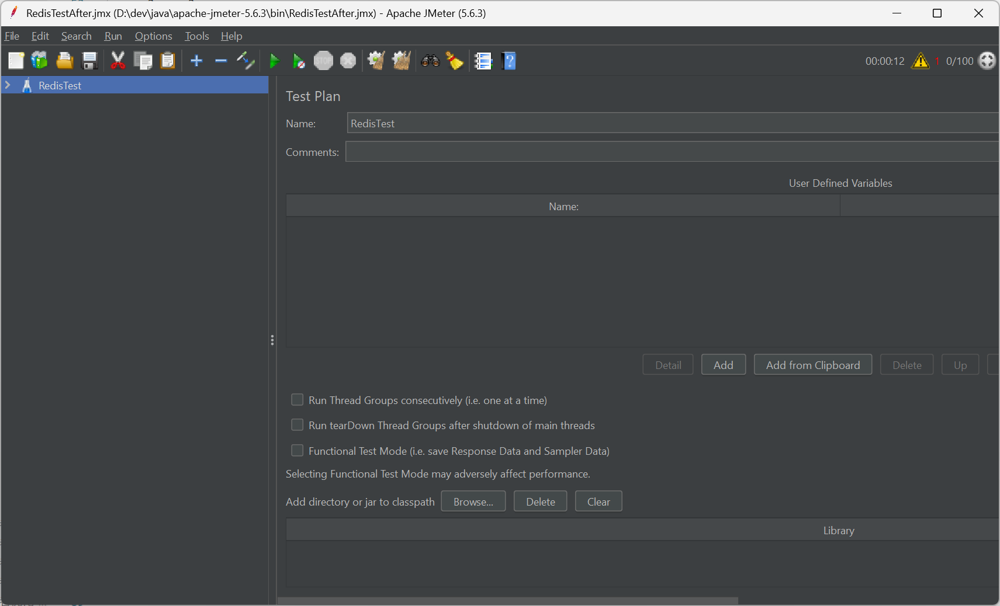

#### 1. 添加线程组


- 右键点击 `RedisTest` → `Add` → `Threads (Users)` → `Thread Group`
- 配置线程数（模拟并发用户）：
  - 线程数：100（根据服务器性能调整）
  - Ramp-Up 时间：10秒（控制用户启动速度）
  - 循环次数：100（每个用户执行的登录次数）


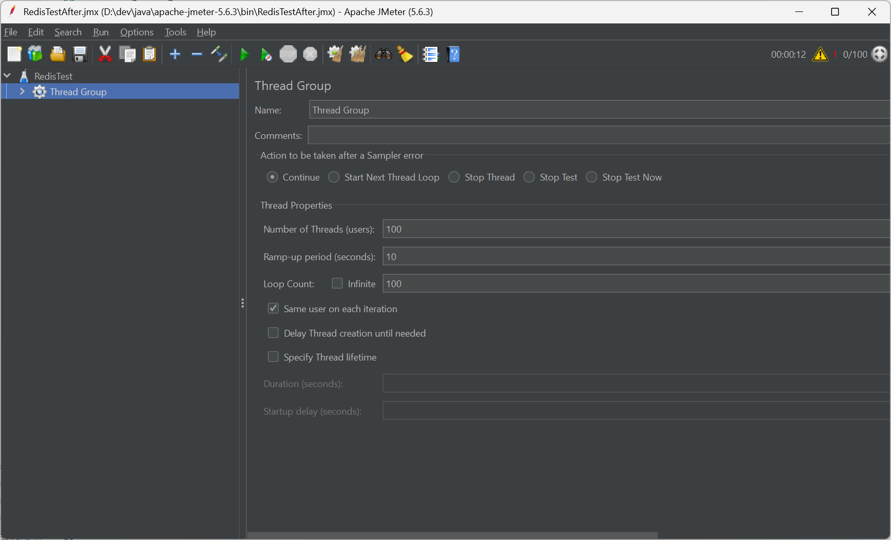


#### 2. 处理CSRF令牌

Spring Security默认启用CSRF保护，登录请求需携带CSRF令牌：
1. 添加一个HTTP请求（用于获取登录页的CSRF令牌）：


- 右键点击线程组 → `Add` → `Sampler` → `HTTP Request`
- 配置请求参数：
  - 名称：HTTP Request-show login form
  - 服务器名称/IP：填写你的应用服务器地址
  - 端口号：8080（或你的应用端口）
  - 协议：HTTP
  - 方法：GET
  - 路径：/auth/login（登录接口路径）

2. 添加正则表达式提取器（提取CSRF令牌）：

- 右键上述HTTP请求 → Add → Post Processors → Regular Expression Extractor  
- 配置：
  - Reference Name：`csrf_token`
  - Regular Expression：`name="_csrf" value="(.+?)"`
  - Template：`$1$`
  - Match No.：`1`

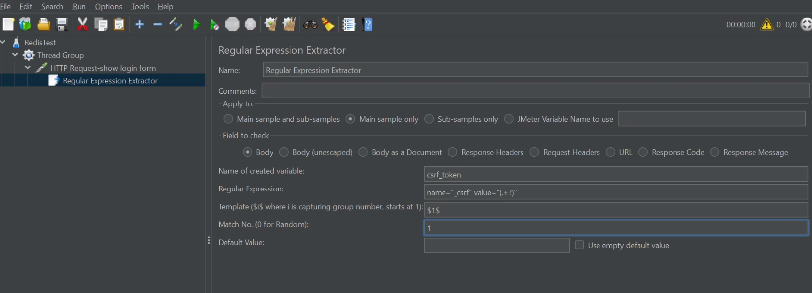


#### 3. 添加登录请求

- 右键点击线程组 → `Add` → `Sampler` → `HTTP Request`
- 配置请求参数：
  - 服务器名称/IP：填写你的应用服务器地址
  - 端口号：8080（或你的应用端口）
  - 协议：HTTP
  - 方法：POST
  - 路径：/auth/login（登录接口路径）
  - 添加参数：`username` 和 `password`


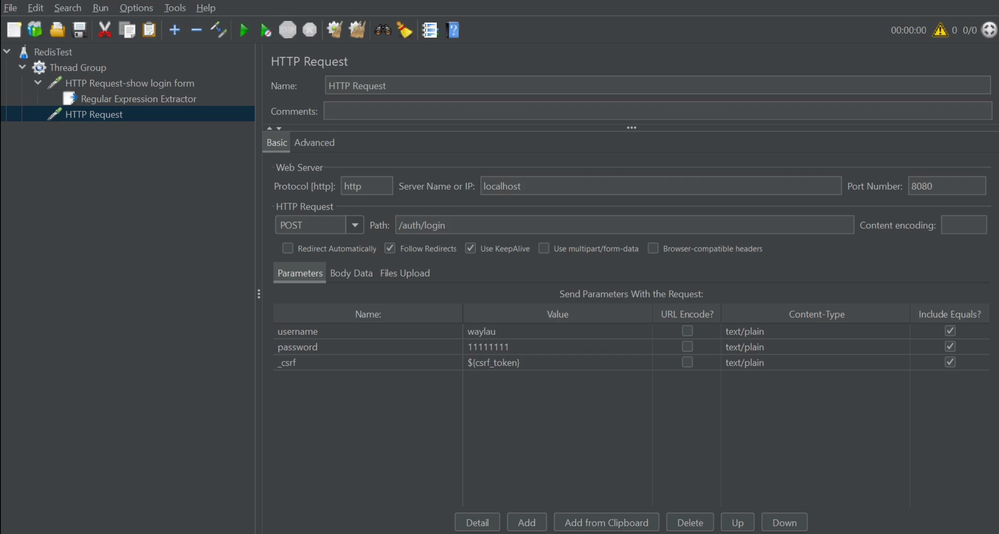


#### 4. 添加结果监听器

- 右键点击线程组 → `Add` → `Listener` → `View Results Tree`（查看详细结果）
- 右键点击线程组 → `Add` → `Listener` → `Summary Report`（汇总统计）
- 右键点击线程组 → `Add` → `Listener` → `Aggregate Report`（聚合报告）


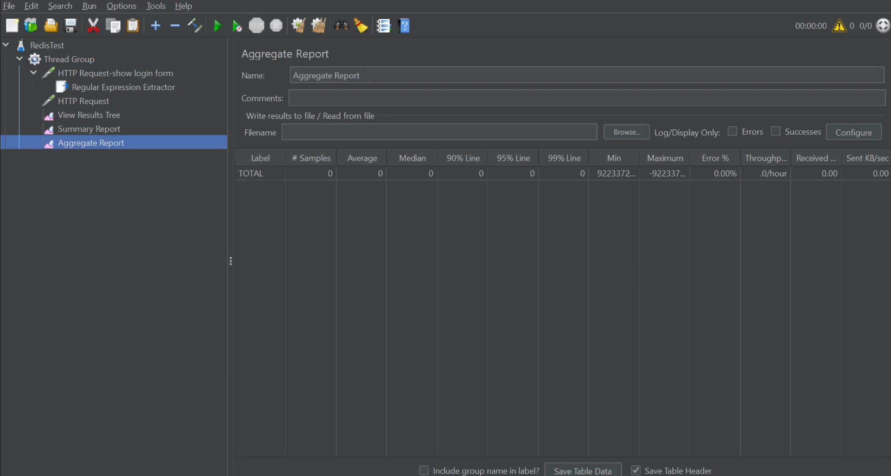


#### 5. 保存会话信息

- 右键点击线程组 → `Add` → `Config Element` → `HTTP Cookie Manager`
- 勾选 `Clear cookies each iteration?`（每次迭代清除 Cookie）

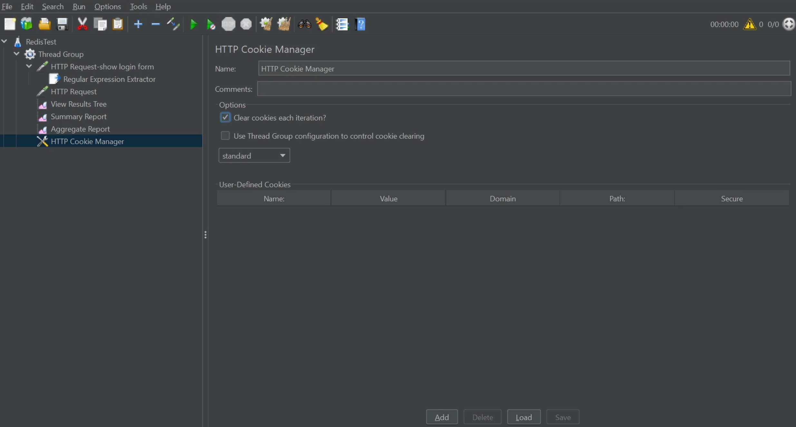


### 执行测试并收集数据

#### 1. 测试 Redis 优化前
- 确保应用未启用 Redis 会话存储
- 运行 JMeter 测试，主要关注Summary Report里面的以下指标：
  - 平均响应时间（Average）
  - 吞吐量（Throughput）
  - 错误率（Error %）

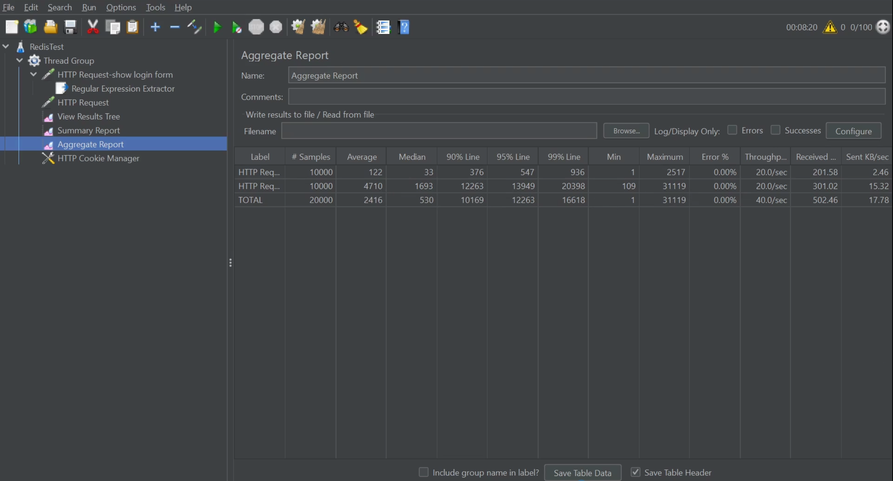

#### 2. 测试 Redis 优化后

- 启用 Redis 会话存储（按之前的配置方案）
- 可以对上次测试数据进行清理。右键`View Results Tree`、`Summary Report`、`Aggregate Report`三个报告的之后，点“Clear”即可清理。
- 重新运行相同的 JMeter 测试，记录相同指标


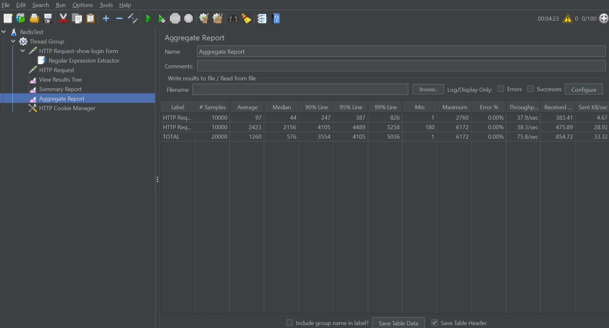


### 分析测试结果


通过后优化前后指标对比发现，引入Redis之后，性能是会有极大提升，读者朋友不妨一试。

通过以上步骤，你可以清晰地对比使用 Redis 前后登录性能的差异。通常情况下，使用 Redis 存储会话会显著降低平均响应时间并提高系统吞吐量，特别是在高并发场景下效果更明显。


## 2.3 实现用户点赞、评论等行为数据的高效记录与查询

将用户点赞、评论等高频互动数据存储在 Redis 中，可以显著提升系统性能。下面我将从数据模型设计、实现方案到性能优化，提供完整的解决方案。


### 数据模型设计

#### 1. 点赞数据模型
使用 Redis 的 Set 数据结构 存储点赞关系，具有 O(1) 的插入/删除/查询效率：

```
// 用户点赞记录（Set结构，无序唯一）
KEY: "rednote:note:${noteId}:likes"
VALUE: [userId1, userId2, userId3, ...]


// 帖子点赞数（原子计数器）
KEY: "rednote:note:${noteId}:like_count"
VALUE: 点赞数量
```

#### 2. 评论数据模型

使用原子计数器存储评论总数：

```
// 评论总数（原子计数器）
KEY: "rednote:comment:comment_count"
VALUE: 点赞数量
```


### 实现方案

#### 1. 点赞功能实现

```java
package com.example.rednote.service.impl;

import com.example.rednote.entity.Like;
import com.example.rednote.entity.Note;
import com.example.rednote.entity.User;
import com.example.rednote.exception.NoteNotFoundException;
import com.example.rednote.repository.LikeRepository;
import com.example.rednote.repository.NoteRepository;
import com.example.rednote.service.LikeService;
import com.example.rednote.service.NoteService;
import com.example.rednote.service.UserService;
import jakarta.transaction.Transactional;
import org.springframework.beans.factory.annotation.Autowired;
import org.springframework.dao.DataAccessException;
import org.springframework.data.redis.core.RedisOperations;
import org.springframework.data.redis.core.RedisTemplate;
import org.springframework.data.redis.core.SessionCallback;
import org.springframework.stereotype.Service;

import java.util.Optional;

/**
 * LikeServiceImpl 点赞服务
 *
 * @version 2025/08/21
 **/
@Service
public class LikeServiceImpl implements LikeService {

    @Autowired
    private NoteService noteService;

    @Autowired
    private LikeRepository likeRepository;

    @Autowired
    private RedisTemplate<String, String> redisTemplate;

    @Override
    @Transactional
    public boolean toggleLike(Long noteId, User user) {
        // 判断笔记是否存在
        Optional<Note> optionalNote = noteService.findNoteById(noteId);
        if (!optionalNote.isPresent()) {
            throw new NoteNotFoundException("");
        }

        // 构建Redis的Key
        String noteLikesKey = "rednote:note:" + noteId + ":likes";
        String likeCountKey = "rednote:note:" + noteId + ":like_count";

        // 从Redis中获取用户点赞记录
        Long userId = user.getUserId();
        boolean hasLikedFromRedis = redisTemplate.opsForSet().isMember(noteLikesKey, userId.toString());

        // 判定Redis是否命中
        boolean hasLiked = false;
        if (hasLikedFromRedis) {
            // 命中，直接返回
            hasLiked = hasLikedFromRedis;
        } else {
            // 未命中，从数据库中查询是否已经点赞
            hasLiked = likeRepository.findByUserUserIdAndNoteNoteId(userId, noteId).isPresent();
        }

        if (hasLiked) {
            // 已点赞，取消点赞
            // 删除Redis中的记录，使用事务保证原子性
            redisTemplate.execute(new SessionCallback<Object>() {
                @Override
                public <K, V> Object execute(RedisOperations<K, V> operations) throws DataAccessException {
                    operations.multi();
                    operations.opsForSet().remove((K) noteLikesKey, (V) userId.toString());
                    operations.opsForValue().decrement((K) likeCountKey);
                    return operations.exec();
                }
            });

            // 删除数据库中的记录
            Optional<Like> optionalLike = likeRepository.findByUserUserIdAndNoteNoteId(userId, noteId);
            likeRepository.delete(optionalLike.get());
            return false;
        } else {
            // 未点赞，添加点赞
            // 增加Redis中的记录，使用事务保证原子性
            redisTemplate.execute(new SessionCallback<Object>() {
                @Override
                public <K, V> Object execute(RedisOperations<K, V> operations) throws DataAccessException {
                    operations.multi();
                    operations.opsForSet().add((K) noteLikesKey, (V) userId.toString());
                    operations.opsForValue().increment((K) likeCountKey);
                    return operations.exec();
                }
            });

            // 添加数据库中的记录
            Like like = new Like();
            like.setUser(user);
            like.setNote(optionalNote.get());

            likeRepository.save(like);
            return true;
        }

        // 查询用户是否已点赞
        /*Optional<Like> optionalLike = likeRepository.findByUserUserIdAndNoteNoteId(user.getUserId(), noteId);
        if (optionalLike.isPresent()) {
            // 已点赞，取消点赞
            likeRepository.delete(optionalLike.get());
            return false;
        } else {
            // 未点赞，添加点赞
            Like like = new Like();
            like.setUser(user);
            like.setNote(optionalNote.get());

            likeRepository.save(like);
            return true;
        }*/
    }

    @Override
    public long getLikeCount(Long noteId) {
        // 从Redis中获取点赞数
        String likeCountKey = "rednote:note:" + noteId + ":like_count";
        String likeCountFromRedis = redisTemplate.opsForValue().get(likeCountKey);

        // 判定Redis是否命中
        if (likeCountFromRedis != null) {
            // 命中，直接返回
            return Long.parseLong(likeCountFromRedis);
        } else {
            // 未命中，从数据库中查询，再存储到Redis
            long likeCountFromDb = likeRepository.countByNoteNoteId(noteId);
            redisTemplate.opsForSet().add(likeCountKey, String.valueOf(noteId));

            return likeCountFromDb;
        }

        /*return likeRepository.countByNoteNoteId(noteId);*/
    }
}
```

#### 2. 评论功能实现

```java
import org.springframework.data.redis.core.RedisTemplate;

// ...为节约篇幅，此处省略非核心内容

@Service
public class CommentServiceImpl implements CommentService {

    private static final String COMMENT_COUNT_KEY = "rednote:comment:comment_count";

    @Autowired
    private CommentRepository commentRepository;

    @Autowired
    private RedisTemplate<String, String> redisTemplate;

    @Override
    @Transactional
    public Comment createComment(Note note, User user, String content) {
        // 在Redis递增评论数
        redisTemplate.opsForValue().increment(COMMENT_COUNT_KEY);

        Comment comment = new Comment();
        comment.setNote(note);
        comment.setUser(user);
        comment.setContent(content);

        return commentRepository.save(comment);
    }

    @Override
    @Transactional
    public Comment replyToComment(Note note, Comment parentComment, User user, String content) {
        // 在Redis递增评论数
        redisTemplate.opsForValue().increment(COMMENT_COUNT_KEY);

        Comment reply = new Comment();
        reply.setNote(note);
        reply.setUser(user);
        reply.setContent(content);
        reply.setParent(parentComment);

        parentComment.getReplies().add(reply);

        return commentRepository.save(reply);
    }

    @Override
    @Transactional
    public void deleteComment(Comment comment) {
        // 在Redis递减评论数
        redisTemplate.opsForValue().decrement(COMMENT_COUNT_KEY);

        commentRepository.delete(comment);
    }

    @Override
    public long countComments() {
        // 从Redis中获取评论数
        String countFromRedis =redisTemplate.opsForValue().get(COMMENT_COUNT_KEY);
        // 判断Redis是否命中
        if (countFromRedis != null) {
            // 命中，直接返回
            return Long.parseLong(countFromRedis);
        } else {
            // 未命中，从数据库中查询，再存储到Redis
            long countFromDb = commentRepository.count();
            redisTemplate.opsForValue().set(COMMENT_COUNT_KEY, String.valueOf(countFromDb));

            return countFromDb;
        }
        /*return commentRepository.count();*/
    }

    
    // ...为节约篇幅，此处省略非核心内容

}
```

通过以上方案，你可以高效地记录和查询用户点赞、评论等互动数据，同时保障系统性能和数据一致性。根据业务规模和访问量，可以进一步调整 Redis 集群规模和数据同步策略。


## 2.4 缓存用户总数、笔记总数快速响应前端请求

将用户总数、笔记总数等数据存储在 Redis 中，可以快速响应前端请求，显著提升用户体验。 


### 数据模型设计

#### 1. 用户总数模型

使用原子计数器存储用户总数：

```
// 用户总数（原子计数器）
KEY: "rednote:user:user_count"
VALUE: 用户总数数量
```

#### 2. 笔记总数模型

使用原子计数器存储评论总数：

```
// 评论总数（原子计数器）
KEY: "rednote:note:note_count"
VALUE: 笔记总数数量
```


### 实现方案

#### 1. 用户总数功能实现

```java
import org.springframework.data.redis.core.RedisTemplate;

// ...为节约篇幅，此处省略非核心内容

@Service
public class UserServiceImpl implements UserService {

    private static final String USER_COUNT_KEY = "rednote:user:user_count";

    @Autowired
    private RedisTemplate<String, String> redisTemplate;

    @Autowired
    private UserRepository userRepository;

    @Autowired
    private PasswordEncoder passwordEncoder; // 注入密码编码器

    @Override
    @Transactional
    public void registerUser(UserRegistrationDto registrationDto) {
        // 在Redis增加用户数
        redisTemplate.opsForValue().increment(USER_COUNT_KEY);

        // 创建新用户
        User user = new User();
        user.setUsername(registrationDto.getUsername());
        user.setPhone(registrationDto.getPhone());

        // 加密密码
        /*user.setPassword(registrationDto.getPassword());*/
        String encodedPassword = passwordEncoder.encode(registrationDto.getPassword());
        user.setPassword(encodedPassword);

        // 保存用户
        userRepository.save(user);
    }
 
    @Override
    public long countUsers() {
        // 从Redis中获取用户数
        String userCountFromRedis = redisTemplate.opsForValue().get(USER_COUNT_KEY);
        // 判断Redis是否命中
        if (userCountFromRedis != null) {
            // 命中，直接返回
            return Long.parseLong(userCountFromRedis);
        } else {
            // 未命中，从数据库中查询
            long userCountFromDb = userRepository.count();
            // 保存用户数到Redis中
            redisTemplate.opsForValue().set(USER_COUNT_KEY, String.valueOf(userCountFromDb));

            return userCountFromDb;
        }
        /*return userRepository.count();*/
    }

    @Override
    @Transactional
    public void deleteUser(Long userId) {
        // 删除用户时在Redis中减去用户数
        redisTemplate.opsForValue().decrement(USER_COUNT_KEY);

        userRepository.deleteById(userId);
    }

   // ...为节约篇幅，此处省略非核心内容
}
```

#### 2. 笔记总数功能实现

```java
import org.springframework.data.redis.core.RedisTemplate;

// ...为节约篇幅，此处省略非核心内容

@Service
public class NoteServiceImpl implements NoteService {

    private static final String NOTE_COUNT_KEY = "rednote:note:note_count";

    @Autowired
    private RedisTemplate<String, String> redisTemplate;

    @Autowired
    private NoteRepository noteRepository;

    @Autowired
    private FileStorageService fileStorageService;

    @Transactional
    @Override
    public Note createNote(NotePublishDto notePublishDto, User author) {
        // 创建笔记对象时在Redis递增笔记总数
        redisTemplate.opsForValue().increment(NOTE_COUNT_KEY);

        Note note = new Note();

        note.setTitle(notePublishDto.getTitle());
        note.setContent(notePublishDto.getContent());
        note.setCategory(notePublishDto.getCategory());
        note.setAuthor(author);

        // 话题字符串转为List
        note.setTopics(StringUtil.splitToList(notePublishDto.getTopics(), " "));

        // 处理图片上传
        List<MultipartFile> images = notePublishDto.getImages();
        if (images != null) {
            for (MultipartFile image : images) {
                if (!image.isEmpty()) {
                    String fileName = image.getOriginalFilename();
                    String fileUrl = fileStorageService.saveFile(image, fileName);
                    note.getImages().add(fileUrl);
                }

            }
        }

        return noteRepository.save(note);
    }

    @Override
    @Transactional
    public void deleteNote(Note note) {
        // 在删除笔记时在Redis递减笔记总数
        redisTemplate.opsForValue().decrement(NOTE_COUNT_KEY);

        // 注意：先删除数据库数据再删图片文件。以防止删除文件异常时，方便回滚数据库数据

        // 先删除数据库数据
        noteRepository.delete(note);

        // 再删图片文件
        List<String> images = note.getImages();
        for (String image : images) {
            fileStorageService.deleteFile(image);
        }
    }


    @Override
    public long countNotes() {
        // 从Redis中获取笔记总数
        String noteCountFromRedis = redisTemplate.opsForValue().get(NOTE_COUNT_KEY);

        // 判定Redis是否命中
        if (noteCountFromRedis != null) {
            // 命中，则直接返回
            return Long.parseLong(noteCountFromRedis);
        } else {
            // 未命中，从数据库中查询
            long noteCountFromDb = noteRepository.count();
            redisTemplate.opsForValue().set(NOTE_COUNT_KEY, String.valueOf(noteCountFromDb));

            return noteCountFromDb;
        }

        /*return noteRepository.count();*/
    }

    // ...为节约篇幅，此处省略非核心内容
}
```


## 2.5 缓存穿透、缓存雪崩、缓存击穿问题及解决方案

#### 1. 缓存穿透解决方案

问题描述：大量请求查询不存在的数据，导致请求穿透到数据库。

解决方案：
```java
// 缓存空值
public Note getNote(Long noteId) {
    String key = "note:" + noteId;
    Note note = (Note) redisTemplate.opsForValue().get(key);
    
    if (note == null) {
        // 从数据库查询
        note = noteRepository.findById(noteId).orElse(null);
        
        // 即使数据不存在，也缓存空值（设置较短过期时间）
        if (note == null) {
            redisTemplate.opsForValue().set(key, null, 10, TimeUnit.MINUTES);
        } else {
            redisTemplate.opsForValue().set(key, note, 1, TimeUnit.HOURS);
        }
    }
    return note;
}
```

#### 2. 缓存雪崩解决方案

问题描述：大量缓存同时过期，导致请求全部打到数据库。

解决方案：
```java
// 随机过期时间
public void cacheNote(Note note) {
    String key = "note:" + note.getId();
    
    // 基础过期时间（1小时）+ 随机偏移（0-30分钟）
    long expireTime = 3600 + new Random().nextInt(1800);
    
    redisTemplate.opsForValue().set(key, note, expireTime, TimeUnit.SECONDS);
}

// 多级缓存
public Note getNote(Long noteId) {
    String key = "note:" + noteId;
    
    // 1. 先从本地缓存获取（Caffeine）
    Note note = localCache.get(key);
    if (note != null) {
        return note;
    }
    
    // 2. 从Redis获取
    note = (Note) redisTemplate.opsForValue().get(key);
    if (note != null) {
        // 放入本地缓存
        localCache.put(key, note);
        return note;
    }
    
    // 3. 从数据库获取
    note = noteRepository.findById(noteId).orElse(null);
    if (note != null) {
        // 放入Redis和本地缓存
        redisTemplate.opsForValue().set(key, note, 1, TimeUnit.HOURS);
        localCache.put(key, note);
    }
    return note;
}
```

#### 3. 缓存击穿解决方案

问题描述：热点数据缓存过期时，大量请求同时访问该数据。

解决方案：
```java
// 互斥锁（分布式锁）
public Note getNote(Long noteId) {
    String key = "note:" + noteId;
    Note note = (Note) redisTemplate.opsForValue().get(key);
    
    if (note == null) {
        // 获取分布式锁
        String lockKey = "lock:note:" + noteId;
        Boolean locked = redisTemplate.opsForValue().setIfAbsent(lockKey, "1", 30, TimeUnit.SECONDS);
        
        if (locked) {
            try {
                // 再次检查缓存（可能其他线程已更新）
                note = (Note) redisTemplate.opsForValue().get(key);
                if (note == null) {
                    // 从数据库获取
                    note = noteRepository.findById(noteId).orElse(null);
                    if (note != null) {
                        redisTemplate.opsForValue().set(key, note, 1, TimeUnit.HOURS);
                    }
                }
            } finally {
                // 释放锁
                redisTemplate.delete(lockKey);
            }
        } else {
            // 获取锁失败，等待后重试
            Thread.sleep(100);
            return getNote(noteId);
        }
    }
    return note;
}

// 永不过期（逻辑过期）
public Note getNote(Long noteId) {
    String key = "note:" + noteId;
    NoteCacheWrapper wrapper = (NoteCacheWrapper) redisTemplate.opsForValue().get(key);
    
    if (wrapper != null) {
        // 检查是否逻辑过期
        if (wrapper.getExpireTime() < System.currentTimeMillis()) {
            // 异步更新缓存
            CompletableFuture.runAsync(() -> refreshNoteCache(noteId));
            return wrapper.getNote();
        }
        return wrapper.getNote();
    }
    
    // 缓存不存在，从数据库获取
    return noteRepository.findById(noteId).orElse(null);
}
```


## 2.6 Redis和MySQL一致性保障方案总结

Redis和MySQL一致性问题是企业级应用中常见的挑战之一，特别是在高并发、高可用的场景下。由于Redis是内存型数据库，具备极高的读写速度，而MySQL作为持久化数据库，通常用于数据的可靠存储，如何保证两者数据的一致性需要具体业务场景的设计与优化。

### 缓存更新策略：Cache Aside Pattern（旁路缓存模式）

#### 场景

在大部分业务系统中，Redis作为缓存层用于提升系统的读取性能，而MySQL作为持久化存储，用于保证数据的可靠性。最常见的场景是：系统先查询Redis缓存，如果缓存中没有数据，再从MySQL中查询并将数据写入Redis缓存。更新数据时，更新MySQL并删除Redis缓存，使缓存数据失效，保证下次读取时能拿到最新数据。

#### 典型业务场景

- 商品详情页面：当用户请求某个商品详情时，首先查询Redis缓存，如果缓存中没有，则查询MySQL，将查询结果缓存到Redis中；如果商品信息发生变更时，更新MySQL并删除Redis中的缓存。

#### 方案分析

- 读取路径：从Redis获取缓存，如果缓存命中则直接返回数据；如果缓存未命中，则查询MySQL，将结果写入Redis，并返回数据。
- 写入路径：更新时先操作MySQL，然后删除Redis缓存中的数据。下次读取时，由于缓存未命中，会重新从MySQL中获取最新数据。

#### 如何保障一致性

- 缓存淘汰策略：MySQL数据更新后立即删除Redis缓存，确保下次读取时能获取到最新数据。即通过"删除缓存"的方式避免脏数据存在于缓存中。
- 并发问题：当并发请求较高时，可能会出现“缓存雪崩”或“缓存击穿”问题。例如：A更新MySQL数据，B在缓存失效的瞬间读取了旧数据，再次缓存到Redis。为解决此问题，可以采用延迟双删策略：
  1. 删除Redis缓存。
  2. 更新MySQL。
  3. 适当延迟（如500ms），再次删除Redis缓存，确保在并发情况下不存在缓存不一致问题。

#### 业务实例

```java
// 更新商品详情的伪代码
public void updateProduct(Product product) {
    // 1. 更新数据库
    updateProductInMySQL(product);
    // 2. 删除缓存
    deleteProductCache(product.getId());
    // 3. 延迟双删，解决并发下不一致问题
    try {
        Thread.sleep(500); // 可以根据实际业务场景调整
    } catch (InterruptedException e) {
        // handle exception
    }
    deleteProductCache(product.getId());
}
```

### 异步更新策略（Write Behind）

#### 场景

在某些实时性要求较高的场景中，可以考虑先更新Redis缓存，然后再异步更新MySQL数据库。

#### 典型业务场景

- 秒杀系统：例如商品库存的扣减，用户购买商品时，首先更新Redis中的库存数量，保证极低延迟的实时性体验。然后将变更异步写入MySQL，确保持久化存储的一致性。

#### 方案分析

- 读取路径：读取Redis缓存的库存信息，能够提供快速的读取响应。
- 写入路径：更新Redis中的库存数量后，使用消息队列或其他异步机制将更新同步到MySQL。

#### 如何保障一致性

- 数据最终一致性：Redis作为前端实时数据的缓存，MySQL作为后端数据的持久化存储，采用异步更新策略时，一致性无法保证是强一致性，但可以通过使用消息队列等手段来保证最终一致性。异步写入MySQL时，如果操作失败，可以通过重试机制或补偿机制恢复一致性。

#### 业务实例

```java
// 扣减库存的伪代码
public void reduceStock(Long productId, int amount) {
    // 1. 先更新 Redis 中的库存
    redisTemplate.decrement("stock:" + productId, amount);
    // 2. 通过消息队列异步更新 MySQL 中的库存
    sendUpdateStockMessage(productId, amount);
}

// 消费消息队列更新 MySQL
@RabbitListener(queues = "stock_update_queue")
public void updateStockInMySQL(UpdateStockMessage msg) {
    // 从 MySQL 中扣减库存
    productRepository.reduceStock(msg.getProductId(), msg.getAmount());
}
```

#### 一致性保证策略

- 幂等性保障：确保消息的处理是幂等的，即相同的消息即使被处理多次，也不会导致库存重复扣减。
- 消息重试机制：如果消费消息时更新MySQL失败，可以设置重试机制或消息补偿机制，保证最终数据一致性。

### 双写策略

#### 场景

有时业务需要同时更新Redis和MySQL的数据，如用户余额更新、积分奖励系统等场景中，Redis和MySQL需要同步写入。

#### 典型业务场景

- 积分系统：用户消费时增加或减少积分，需要同时更新Redis和MySQL中的积分记录。

#### 方案分析

- 同步写入：当更新用户积分时，Redis和MySQL同时更新数据。由于需要保证两个存储的同步性，必须考虑事务性问题。
- 分布式事务：如果系统架构分布式，可能需要使用分布式事务（如2PC，或者更轻量的解决方案如TCC）来确保一致性。

#### 如何保障一致性

- 双写一致性问题：如果同时写Redis和MySQL，可能会面临一致性问题。常见解决方案是通过事务补偿机制来实现。具体步骤：
  1. 使用数据库事务保证MySQL写入成功。
  2. 如果Redis写入失败，可以尝试重试，或在事务结束后通过补偿机制将失败的数据写入Redis。

#### 业务实例

```java
@Transactional
public void updateUserPoints(Long userId, int points) {
    // 1. 更新 MySQL 中的积分
    userRepository.updatePoints(userId, points);
    // 2. 同步更新 Redis 中的积分
    redisTemplate.opsForValue().set("user:points:" + userId, points);
}
```

#### 事务性保障

- 本地事务：在单体系统中，可以依赖数据库事务和Redis的操作保证一致性。如果操作失败，通过重试机制来恢复一致性。
- 分布式事务：在微服务架构中，双写操作涉及分布式事务，可能需要使用TCC（Try, Confirm, Cancel）等模式，或使用消息队列进行最终一致性补偿。

### 延迟回写策略

#### 场景

数据回写模式适用于Redis作为缓存层，MySQL作为持久化存储层，但Redis中数据修改后并不立即同步更新MySQL，而是在特定时机触发数据回写。

#### 典型业务场景

- 广告计费系统：广告点击量保存在Redis中，以减少频繁的数据库写入压力，定期将Redis中的统计数据批量写入MySQL。

#### 方案分析

- 延迟回写：可以通过定时任务或者触发器将Redis中的数据定期回写到MySQL，这样既减少了MySQL的压力，又保证了数据一致性。

#### 如何保障一致性

- 持久化与批量同步：通过Redis的持久化机制（如RDB、AOF），在Redis崩溃时不会丢失数据。通过定时器或事件驱动系统触发批量同步MySQL。

### 总结

Redis和MySQL的一致性保障在不同的业务场景中需要结合场景特性来进行权衡，主要的策略包括：

- Cache Aside Pattern（旁路缓存模式）：常用于读多写少的场景，写操作时删除缓存。
- 异步更新（Write Behind）：先更新缓存再异步写入MySQL，保证最终一致性。
- 双写策略：同时更新Redis和MySQL，配合事务机制确保一致性。
- 延迟回写：通过定时批量写入MySQL减少频繁数据库操作。

每种策略有不同的适用场景，设计时需要考虑一致性、性能和可用性之间的平衡。


## 3.1 Kafka应用方案总结

将 Kafka 集成到仿“小红书”项目中，可以实现系统解耦、异步通信和流量削峰，提升系统的可扩展性和稳定性。以下是具体的应用场景和实现方案：


### 一、Kafka 核心应用场景

#### 1. 用户行为日志收集
- 场景：记录用户点赞、收藏、评论等行为，用于数据分析和推荐系统
- 优势：异步处理，不影响主业务流程

#### 2. 内容发布与推送
- 场景：用户发布笔记后，异步生成缩略图、推送通知等
- 优势：解耦业务逻辑，提高响应速度

#### 3. 数据同步与聚合
- 场景：将用户行为数据同步到数据仓库或搜索引擎
- 优势：保证数据一致性，减轻数据库压力

#### 4. 限流与流量削峰
- 场景：在高并发时，通过 Kafka 缓冲请求，平滑处理流量
- 优势：提高系统稳定性，避免过载


### 二、Kafka 集成架构设计

```
+----------------+    +----------------+    +----------------+
|   前端应用     |    |   后端服务     |    |   数据处理     |
+----------------+    +----------------+    +----------------+
      |                      |                      |
      v                      v                      v
+----------------+    +----------------+    +----------------+
|  REST API 接口 |    | Kafka Producer |    | Kafka Consumer |
+----------------+    +----------------+    +----------------+
      |                      |                      |
      v                      v                      v
+----------------+    +----------------+    +----------------+
|   数据库       |    |    Kafka       |    |  搜索引擎/数仓 |
+----------------+    +----------------+    +----------------+
```

### 三、集成 Kafka

#### 1. 添加依赖

修改 pom.xml 添加如下依赖

```xml
<dependency>
  <groupId>org.springframework.kafka</groupId>
  <artifactId>spring-kafka</artifactId>
</dependency>
```

#### 2. 配置生产者


修改 application.properties，增加如下配置：

```properties
spring.kafka.bootstrap-servers=localhost:9092
spring.kafka.producer.key-serializer=org.apache.kafka.common.serialization.StringSerializer
spring.kafka.producer.value-serializer=org.springframework.kafka.support.serializer.JsonSerializer
spring.kafka.producer.retries=3
spring.kafka.producer.batch-size=16384
spring.kafka.producer.buffer-memory=33554432
```

其中：

* retries：重试次数
* batch-size:：批次大小
* buffer-memory：缓冲区大小


#### 3. 配置消费者


修改 application.properties，增加如下配置：

```properties
spring.kafka.consumer.group-id=rednote-group
spring.kafka.consumer.auto-offset-reset=earliest
spring.kafka.consumer.key-deserializer=org.apache.kafka.common.serialization.StringDeserializer
spring.kafka.consumer.value-deserializer=org.springframework.kafka.support.serializer.JsonDeserializer
spring.kafka.consumer.properties.spring.json.trusted.packages=com.example.rednote.*
```
其中：

* auto-offset-reset: earliest：消费策略
* packages：信任的包

### 总结


通过以上方案，你可以将 Kafka 集成到小红书项目中，实现：
1. 异步处理用户行为，提升系统响应速度
2. 解耦业务逻辑，提高系统可维护性
3. 实现数据的实时同步和分析
4. 平滑处理高并发流量，增强系统稳定性

建议从小规模场景（如用户行为日志）开始集成，逐步扩展到其他核心功能，确保系统平稳过渡。


## 3.2 Kafka在用户行为日志收集中的深度应用

在仿“小红书”项目中，用户行为日志（如浏览、点赞、收藏、评论等）是非常宝贵的数据资产。使用 Kafka 实现日志收集，可以帮助你构建高性能、可扩展的日志处理系统。以下是详细的实现方案：


### 一、日志收集系统架构

```
+----------------+    +----------------+    +----------------+    +----------------+
|   前端应用     |    |   后端服务     |    |    Kafka       |    |  日志处理系统  |
+----------------+    +----------------+    +----------------+    +----------------+
      |                      |                      |                      |
      v                      v                      v                      v
+----------------+    +----------------+    +----------------+    +----------------+
|  用户行为埋点  |    | Kafka Producer |    |  日志主题       |    | Kafka Consumer |
+----------------+    +----------------+    +----------------+    +----------------+
                                                         |                      |
                                                         v                      v
                                                  +----------------+    +----------------+
                                                  |  数据存储      |    |  实时分析      |
                                                  +----------------+    +----------------+
```


### 二、用户行为数据模型设计

#### 1. 基础行为日志模型


所有行为日志的基类

```java
package com.example.rednote.dto;

import lombok.Getter;
import lombok.Setter;

import java.time.LocalDateTime;

/**
 * UserActionEvent 行为日志的基类
 *
 * @version 2025/09/05
 **/
@Getter
@Setter
public abstract class UserActionEvent {
    /**
     * 用户ID
     */
    private Long userId;

    /**
     * 用户代理
     */
    private String userAgent;

    /**
     * 时间戳
     */
    private LocalDateTime timestamp;
}
```


浏览事件

```java
package com.example.rednote.dto;

import lombok.Getter;
import lombok.Setter;

/**
 * BrowseEvent 浏览事件
 *
 * @version 2025/09/05
 **/
@Getter
@Setter
public class BrowseEvent extends UserActionEvent {
    /**
     * 笔记ID
     */
    private Long noteId;

    /**
     * 浏览时长（秒）
     */
    private long browseTime;
}
```


点赞事件

```java
package com.example.rednote.dto;

import lombok.Getter;
import lombok.Setter;

/**
 * LikeEvent 点赞事件
 *
 * @version 2025/09/05
 **/
@Getter
@Setter
public class LikeEvent extends UserActionEvent {
    /**
     * 笔记ID
     */
    private Long noteId;

    /**
     * 点赞/取消点赞
     */
    private boolean isLike;
}
```


评论事件

```java
package com.example.rednote.dto;

import lombok.Getter;
import lombok.Setter;

/**
 * CommentEvent 评论事件
 *
 * @version 2025/09/05
 **/
@Getter
@Setter
public class CommentEvent extends UserActionEvent {
    /**
     * 笔记ID
     */
    private Long noteId;
    /**
     * 评论ID
     */
    private Long commentId;
    /**
     * 评论内容
     */
    private String content;
}
```


### 三、Kafka 主题与分区设计

主题与分区配置如下：

```java
package com.example.rednote.config;

import org.apache.kafka.clients.admin.NewTopic;
import org.apache.kafka.common.config.TopicConfig;
import org.springframework.kafka.config.TopicBuilder;

/**
 * KafkaConfig Kafka配置
 *
 * @version 2025/09/05
 **/
public class KafkaConfig {
    /**
     * 用户行为的主题
     */
    public static final String TOPIC_USER_ACTION = "user-action";

    /**
     * 创建用户行为的主题
     */
    public NewTopic userActionTopic() {
        return TopicBuilder.name(TOPIC_USER_ACTION)
                // 根据浏览设置分区数
                .partitions(3)
                // 数据保留1天
                .config(TopicConfig.RETENTION_MS_CONFIG, "86400000")
                .build();
    }
}
```


## 3.3 建立全链路埋点与监控体系让数据驱动决策效率提升

### 前端埋点


修改note-detail.html：


```js
// 笔记浏览埋点，记录浏览时长
// 记录浏览开始时间
const startTime = new Date().getTime();

// 页面卸载时发送浏览事件
window.addEventListener('pagehide', function() {
    // 获取笔记ID、用户ID、浏览时长
    const noteId = document.querySelector('.comment-btn').dataset.noteId;
    const currentUserId = document.querySelector('meta[name="currentUserId"]')?.content;
    const browseTime = new Date().getTime() - startTime;

    // 发送浏览事件到后端
    fetch('/log/browse', {
        method: "POST",
        headers: {
            "Content-Type": "application/json",
            'X-CSRF-TOKEN': document.querySelector('meta[name="_csrf"]')?.content
        },
        body: JSON.stringify({
            userId: parseInt(currentUserId),
            noteId: parseInt(noteId),
            browseTime: browseTime,
            userAgent: navigator.userAgent
        })
    }).catch(error => {
        // 添加错误处理，避免埋点错误影响用户体验
        console.error('埋点上报失败:', error);
    });
});
```

### 后端日志收集服务

新建控制器：

```java
package com.example.rednote.controller;

import com.example.rednote.dto.BrowseEvent;
import com.example.rednote.service.KafkaProducerService;
import org.springframework.beans.factory.annotation.Autowired;
import org.springframework.http.ResponseEntity;
import org.springframework.web.bind.annotation.PostMapping;
import org.springframework.web.bind.annotation.RequestBody;
import org.springframework.web.bind.annotation.RequestMapping;
import org.springframework.web.bind.annotation.RestController;

import java.time.LocalDateTime;

/**
 * LogController 日志收集控制器
 *
 * @version 2025/09/05
 **/
@RestController
@RequestMapping("/log")
public class LogController {

    @Autowired
    private KafkaProducerService kafkaProducerService;

    // 记录浏览事件
    @PostMapping("/browse")
    public ResponseEntity<Void> logBrowseEvent(@RequestBody BrowseEvent event) {
        // 设置事件戳
        event.setTimestamp(LocalDateTime.now());

        // 发送到Kafka
        kafkaProducerService.sendUserActionEvent(event);

        return ResponseEntity.ok().build();
    }
}
```


### 安全配置


1. 在 Spring Security 配置类中，进一步细化浏览事件API的访问权限
2. 确保只有普通用户角色可以访问浏览事件API


修改WebSecurityConfig如下：


```java
@Bean
public SecurityFilterChain filterChain(HttpSecurity http) throws Exception {
    http
            // ...为节约篇幅，此处省略非核心内容    
            .authorizeHttpRequests(authorize -> authorize
                    // ...为节约篇幅，此处省略非核心内容

                    // 允许USER角色的用户访问 /log/** 的资源
                    .requestMatchers("/log/**").hasRole("USER")
                    // 其他请求需要认证
                    .anyRequest().authenticated()
            )

 
    ;

    return http.build();
}            
```


## 3.4 异步任务处理让系统吞吐量提升10倍的核心策略

### Kafka 生产者实现


定义 Kafka 生产者服务接口：

```java
package com.example.rednote.service;

import com.example.rednote.dto.UserActionEvent;

/**
 * KafkaProducerService Kafka生产者服务
 *
 * @version 2025/09/05
 **/
public interface KafkaProducerService {
    /**
     * 发送用户行为事件
     *
     * @param userActionEvent
     */
    void sendUserActionEvent(UserActionEvent userActionEvent);
}
```

Kafka 生产者服务实现：

```java
package com.example.rednote.service.impl;

import com.example.rednote.config.KafkaConfig;
import com.example.rednote.dto.UserActionEvent;
import com.example.rednote.service.KafkaProducerService;
import org.slf4j.Logger;
import org.slf4j.LoggerFactory;
import org.springframework.beans.factory.annotation.Autowired;
import org.springframework.kafka.core.KafkaTemplate;
import org.springframework.kafka.support.SendResult;
import org.springframework.stereotype.Service;

import java.util.concurrent.CompletableFuture;

/**
 * KafkaProducerServiceImpl Kafka生产者服务
 *
 * @version 2025/09/05
 **/
@Service
public class KafkaProducerServiceImpl implements KafkaProducerService {

    private static final Logger log = LoggerFactory.getLogger(KafkaProducerServiceImpl.class);

    @Autowired
    private KafkaTemplate<String, UserActionEvent> kafkaTemplate;

    @Override
    public void sendUserActionEvent(UserActionEvent userActionEvent) {
        // 使用用户ID作为分区Key，确保相同用户的行为在同一分区内
        String key = String.valueOf(userActionEvent.getUserId());

        // 发送消息到Kafka
        CompletableFuture<SendResult<String, UserActionEvent>> future = kafkaTemplate.send(KafkaConfig.TOPIC_USER_ACTION, key, userActionEvent);

        // 添加回调
        future.whenComplete((result, ex) -> {
            if (ex == null) {
                log.info("消息发送成功");
            } else {
                log.error("消息发送失败", ex);
            }
        });
    }
}
```


### 行为日志处理与存储

NoteService服务增加如下接口：

```java
/**
 * 递增访问量
 *
 * @param noteId
 */
void incrementBrowseCount(Long noteId);

/**
 * 递增访问时长
 *
 * @param noteId
 * @param browseTime
 */
void incrementBrowseTime(Long noteId, long browseTime);
```


NoteServiceImpl服务增加如下接口：

```java
private static final String BROWSE_COUNT_KEY = "rednote:note:browse_count";

private static final String BROWSE_TIME_KEY = "rednote:note:browse_time";

@Override
public void increaseBrowseCount(Long noteId) {
    redisTemplate.opsForZSet().incrementScore(BROWSE_COUNT_KEY, noteId.toString(), 1);
}

@Override
public void increaseBrowseTime(Long noteId, Long browseTime) {
    redisTemplate.opsForZSet().incrementScore(BROWSE_TIME_KEY, noteId.toString(), browseTime);
}
```

### 实时分析消费者


RealTimeAnalysisService接口如下：


```java
package com.example.rednote.service;

import com.example.rednote.dto.UserActionEvent;

/**
 * RealTimeAnalysisService 实时分析服务
 *
 * @version 2025/09/05
 **/
public interface RealTimeAnalysisService {
    /**
     * 实时统计热门笔记
     *
     * @return
     */
    void analyzeHotNotes(UserActionEvent userActionEvent);
}
```


RealTimeAnalysisServiceImpl接口如下：


```java
package com.example.rednote.service.impl;

import com.example.rednote.config.KafkaConfig;
import com.example.rednote.dto.BrowseEvent;
import com.example.rednote.dto.CommentEvent;
import com.example.rednote.dto.LikeEvent;
import com.example.rednote.dto.UserActionEvent;
import com.example.rednote.service.NoteService;
import com.example.rednote.service.RealTimeAnalysisService;
import org.springframework.beans.factory.annotation.Autowired;
import org.springframework.kafka.annotation.KafkaListener;
import org.springframework.messaging.handler.annotation.Payload;
import org.springframework.stereotype.Service;

/**
 * RealTimeAnalysisServiceImpl 实时分析服务
 *
 * @version 2025/09/05
 **/
@Service
public class RealTimeAnalysisServiceImpl implements RealTimeAnalysisService {

    @Autowired
    private NoteService noteService;

    @Override
    @KafkaListener(topics = KafkaConfig.TOPIC_USER_ACTION)
    public void analyzeHotNotes(@Payload UserActionEvent userActionEvent) {
        if (userActionEvent instanceof BrowseEvent) {
            BrowseEvent browseEvent = (BrowseEvent) userActionEvent;

            Long noteId = browseEvent.getNoteId();
            long browseTime = browseEvent.getBrowseTime();

            // 调用服务增加笔记访问量
            noteService.incrementBrowseCount(noteId);

            // 调用服务增加笔记浏览时长
            noteService.incrementBrowseTime(noteId, browseTime);
        } else if (userActionEvent instanceof LikeEvent) {
            // TODO
        } else if (userActionEvent instanceof CommentEvent) {
            // TODO
        }
    }
}
```


## 3.5 用户行为日志数据展示

###  获取最活跃的笔记列表


NoteService服务增加如下接口：

```java
/**
 * 根据访问量获取笔记列表
 *
 * @param page
 * @param size
 */
List<NoteBrowseCountDto> getNotesByBrowseCount(int page, int size);

/**
 * 根据访问时长获取笔记列表
 *
 * @param page
 * @param size
 */
List<NoteBrowseTimeDto> getNotesByBrowseTime(int page, int size);
```


NoteServiceImpl服务增加如下接口：

```java
@Override
public List<NoteBrowseCountDto> getNotesByBrowseCount(int page, int size) {
    // 获取Redis中指定区间的笔记浏览次数, 按照笔记浏访问量降序排序
    Set<ZSetOperations.TypedTuple<String>> typedTuples =
            redisTemplate.opsForZSet().reverseRangeWithScores(BROWSE_COUNT_KEY, (page - 1) * size, page * size - 1);

    // 转为DTO列表
    List<NoteBrowseCountDto> noteBrowseCountDtos = typedTuples.stream()
            .map(tuple -> {
                NoteBrowseCountDto noteBrowseCountDto = new NoteBrowseCountDto();
                long noteId = Long.parseLong(tuple.getValue());
                noteBrowseCountDto.setNoteId(noteId);
                noteBrowseCountDto.setTitle(noteRepository.findByNoteId(noteId).get().getTitle());
                noteBrowseCountDto.setBrowseCount(tuple.getScore().longValue());
                return noteBrowseCountDto;
            }).collect(Collectors.toUnmodifiableList());

    return noteBrowseCountDtos;
}

@Override
public List<NoteBrowseTimeDto> getNotesByBrowseTime(int page, int size) {
    // 获取Redis中指定区间的笔记浏览次数, 按照笔记浏访问量降序排序
    Set<ZSetOperations.TypedTuple<String>> typedTuples =
            redisTemplate.opsForZSet().reverseRangeWithScores(BROWSE_TIME_KEY, (page - 1) * size, page * size - 1);

    // 转为DTO列表
    List<NoteBrowseTimeDto> noteBrowseTimeDtos = typedTuples.stream()
            .map(tuple -> {
                NoteBrowseTimeDto noteBrowseTimeDto = new NoteBrowseTimeDto();
                long noteId = Long.parseLong(tuple.getValue());
                noteBrowseTimeDto.setNoteId(noteId);
                noteBrowseTimeDto.setTitle(noteRepository.findByNoteId(noteId).get().getTitle());
                noteBrowseTimeDto.setBrowseTime(tuple.getScore().longValue());
                return noteBrowseTimeDto;
            }).collect(Collectors.toUnmodifiableList());

    return noteBrowseTimeDtos;
}
```


### DTO对象

NoteBrowseCountDto：

```java
package com.example.rednote.dto;

import lombok.Getter;
import lombok.Setter;

/**
 * NoteBrowseCountDto
 *
 * @version 2025/09/05
 **/
@Getter
@Setter
public class NoteBrowseCountDto {
    private Long noteId;
    private String title;
    private long browseCount;
}
```

NoteBrowseTimeDto：

```java
package com.example.rednote.dto;

import lombok.Getter;
import lombok.Setter;

/**
 * NoteBrowseTimeDto
 *
 * @version 2025/09/05
 **/
@Getter
@Setter
public class NoteBrowseTimeDto {
    private Long noteId;
    private String title;
    private long browseTime;
}
```


### 修改数据看板API

修改数据看板API，增加如下代码：

```java
@GetMapping("/dashboard")
public String dashboard(Model model) {
    // ...为节约篇幅，此处省略非核心内容

    List<NoteBrowseCountDto> noteBrowseCountDtoList =  noteService.getNoteByBrowseCount(1, 10);
    List<NoteBrowseTimeDto> noteBrowseTimeDtoList =  noteService.getNoteByBrowseTime(1, 10);

    model.addAttribute("noteBrowseCountDtoList", noteBrowseCountDtoList);
    model.addAttribute("noteBrowseTimeDtoList", noteBrowseTimeDtoList);

    // ...为节约篇幅，此处省略非核心内容
}
```

### 界面展示


修改admin-dashboard.html，增加如下：


```html
<div class="col-xl-3 col-md-6 mb-4">
    <div class="card border-left-info shadow h-100 py-2">
        <div class="card-body">
            <div class="row no-gutters align-items-center">
                <div class="col mr-2">
                    <div class="text-xs font-weight-bold text-success text-uppercase mb-1">
                        访问量排行
                    </div>

                    <ol class="list-group list-group-numbered">
                        <li class="list-group-item d-flex justify-content-between align-item-start" th:each="note:${noteBrowseCountDtoList}">
                            <div class="ms-2 me-auto" th:text="${note.title}">
                            </div>
                            <span class="badge text-bg-primary rounded-pill" th:text="${note.browseCount}">
                            </span>
                        </li>
                    </ol>
                </div>
            </div>
        </div>
    </div>
</div>

<div class="col-xl-3 col-md-6 mb-4">
    <div class="card border-left-info shadow h-100 py-2">
        <div class="card-body">
            <div class="row no-gutters align-items-center">
                <div class="col mr-2">
                    <div class="text-xs font-weight-bold text-success text-uppercase mb-1">
                        访问时长排行
                    </div>

                    <ol class="list-group list-group-numbered">
                        <li class="list-group-item d-flex justify-content-between align-item-start" th:each="note:${noteBrowseTimeDtoList}">
                            <div class="ms-2 me-auto" th:text="${note.title}">
                            </div>
                            <span class="badge text-bg-primary rounded-pill" th:text="${note.browseTime}">
                            </span>
                        </li>
                    </ol>
                </div>
            </div>
        </div>
    </div>
</div>
```


### 运行调测

运行MySQL、Redis、Kafka服务，再启动应用。在数据看板查看访问量排行效果，如下图3-1所示。


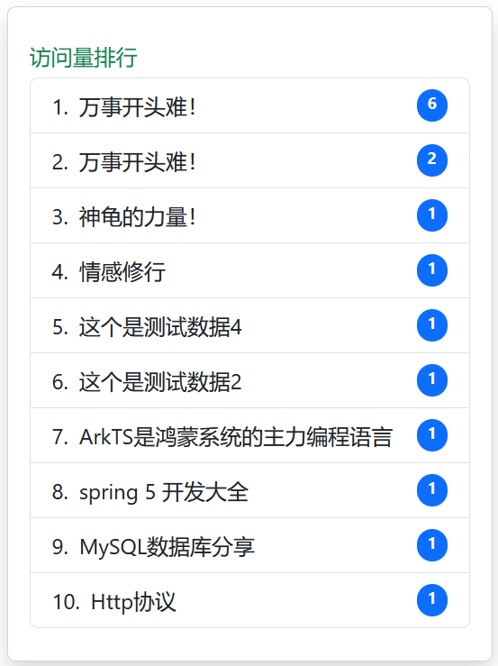

在首页查看访问时长排行效果，如下图3-2所示。


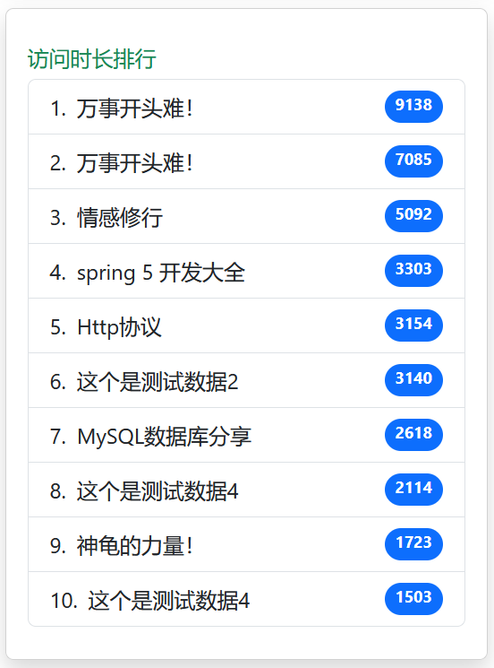


## 4.1 利用GridFS存储用户上传的图片，解决项目大文件存储痛点

MongoDB 作为一种灵活的 NoSQL 数据库，非常适合小红书这类内容社交平台。它可以在多个方面提升项目的性能和可扩展性，以下是具体的应用场景和实现方案：


### MongoDB 核心应用场景

#### 1. 存储非结构化内容数据
- 场景：笔记内容、评论、用户动态等
- 优势：灵活的文档模型，无需预定义 schema

#### 2. 高并发读写场景
- 场景：热门笔记访问、实时评论
- 优势：横向扩展能力，分片集群支持海量数据

#### 3. 实时数据分析
- 场景：用户行为分析、内容推荐
- 优势：聚合框架支持复杂查询

#### 4. 地理位置应用
- 场景：附近的笔记、地点标签
- 优势：内置地理空间索引支持

#### 5. 大文件存储
- 场景：存储用户上传的图片、视频
- 优势：GridFS将大文件分割成多个小块

### MongoDB GridFS 基本原理

在仿小红书项目中，用户上传的图片属于典型的大文件存储场景，使用 MongoDB 的 GridFS 是非常合适的解决方案。以下是完整的实现方案：


GridFS 是 MongoDB 提供的一种存储大文件（超过 16MB）的机制，它将大文件分割成多个小块（chunks），并分别存储在两个集合中：
- `fs.files`：存储文件元数据（文件名、大小、类型等）
- `fs.chunks`：存储文件内容块（默认每个 chunk 为 256KB）

优势：
- 支持 TB 级大文件存储
- 自动分片和复制，保证高可用性
- 与 MongoDB 集成，简化存储架构
- 支持文件版本控制和查询


### 项目集成 MongoDB 和 GridFS

#### 1. 添加依赖

```xml
<dependency>
    <groupId>org.springframework.boot</groupId>
    <artifactId>spring-boot-starter-data-mongodb</artifactId>
</dependency>
```

#### 2. 配置 MongoDB 连接


修改 application.properties，增加如下配置：

```properties
# 配置 MongoDB
spring.data.mongodb.uri=mongodb://localhost:27017
spring.data.mongodb.grid-fs-database=rednote_files
spring.data.mongodb.database=rednote
```
### MongoDB 配置


```java
package com.example.rednote.config;

import com.mongodb.client.MongoClient;
import com.mongodb.client.gridfs.GridFSBucket;
import com.mongodb.client.gridfs.GridFSBuckets;
import org.springframework.beans.factory.annotation.Autowired;
import org.springframework.beans.factory.annotation.Value;
import org.springframework.context.annotation.Bean;
import org.springframework.context.annotation.Configuration;
import org.springframework.data.mongodb.MongoDatabaseFactory;
import org.springframework.data.mongodb.core.convert.MongoConverter;
import org.springframework.data.mongodb.gridfs.GridFsTemplate;

/**
 * MongoConfig MongoDB配置
 *
 * @version 2025/09/06
 **/
@Configuration
public class MongoConfig {
    public static String STATIC_PATH_PREFIX = "/file/";

    @Autowired
    private MongoClient mongoClient;

    @Value("${spring.data.mongodb.database}")
    private String databaseName;

    // 配置GridFSBucket Bean
    @Bean
    public GridFSBucket gridFSBucket() {
        return GridFSBuckets.create(mongoClient.getDatabase(databaseName));
    }

    // 配置GridFS模板
    @Bean
    public GridFsTemplate gridFsTemplate(MongoDatabaseFactory mongoDatabaseFactory,
                                         MongoConverter mongoConverter) {
        return new GridFsTemplate(mongoDatabaseFactory, mongoConverter);
    }

}
```


## 4.2 实战GridFS文件存储服务

### 创建文件存储服务接口

```java
package com.example.rednote.service;

import com.mongodb.client.gridfs.model.GridFSFile;
import org.springframework.web.multipart.MultipartFile;

import java.io.InputStream;

/**
 * GridFSStorageService GridFS存储服务
 *
 * @version 2025/09/06
 **/
public interface GridFSStorageService {
    /**
     * 上传图片
     *
     * @param multipartFile
     * @return
     */
    String uploadImage(MultipartFile multipartFile);

    /**
     * 下载图片
     *
     * @param fileId
     * @return
     */
    GridFSFile downloadImage(String fileId);

    /**
     * 删除图片
     *
     * @param fileId
     */
    void deleteImage(String fileId);

    /**
     * 获取图片流
     *
     * @param fileId
     * @return
     */
    InputStream getImageStream(String fileId);
}
```


### 实现文件存储服务


```java
package com.example.rednote.service.impl;

import com.mongodb.client.gridfs.GridFSBucket;
import com.mongodb.client.gridfs.model.GridFSFile;
import com.example.rednote.exception.FileStorageException;
import com.example.rednote.service.GridFSStorageService;
import org.bson.types.ObjectId;
import org.springframework.beans.factory.annotation.Autowired;
import org.springframework.data.mongodb.core.query.Criteria;
import org.springframework.data.mongodb.core.query.Query;
import org.springframework.data.mongodb.gridfs.GridFsTemplate;
import org.springframework.stereotype.Service;
import org.springframework.web.multipart.MultipartFile;

import java.io.IOException;
import java.io.InputStream;
import java.time.LocalDateTime;
import java.util.HashMap;
import java.util.Map;
import java.util.UUID;

/**
 * GridFSStorageServiceImpl GridFS存储服务
 *
 * @version 2025/09/06
 **/
@Service
public class GridFSStorageServiceImpl implements GridFSStorageService {
    @Autowired
    private GridFsTemplate gridFsTemplate;

    @Autowired
    private GridFSBucket gridFSBucket;

    @Override
    public String uploadImage(MultipartFile multipartFile) {
        // 创建文件元数据
        Map<String, Object> metadata = new HashMap<>();
        metadata.put("contentType", multipartFile.getContentType());
        metadata.put("size", multipartFile.getSize());
        metadata.put("uploadDate", LocalDateTime.now());

        // 存储文件到GridFS
        try {
            ObjectId objectId = gridFsTemplate.store(
                    multipartFile.getInputStream(),
                    UUID.randomUUID().toString(),
                    multipartFile.getContentType(),
                    metadata);

            return objectId.toString();
        } catch (IOException e) {
            throw new FileStorageException("文件上传失败：" + multipartFile.getOriginalFilename(), e);
        }
    }

    @Override
    public GridFSFile downloadImage(String fileId) {
        return gridFsTemplate.findOne(new Query(Criteria.where("_id").is(fileId)));
    }

    @Override
    public void deleteImage(String fileId) {
        gridFsTemplate.delete(new Query(Criteria.where("_id").is(fileId)));
    }

    @Override
    public InputStream getImageStream(String fileId) {
        GridFSFile gridFSFile = downloadImage(fileId);
        if (gridFSFile != null) {
            return gridFSBucket.openDownloadStream(gridFSFile.getObjectId());
        }

        return null;
    }
}
```


## 4.3 重构头像和笔记图片上传接口

### 重构头像上传接口


修改UserController


```java
/*@Autowired
    private FileStorageService fileStorageService;*/

@Autowired
private GridFSStorageService gridFSStorageService;

@Transactional
@PostMapping("/edit")
public String updateProfile(@ModelAttribute User user, RedirectAttributes redirectAttributes,
                            @RequestParam("avatarFile") MultipartFile avatarFile) {
    User currentUser = userService.getCurrentUser();
    String oldAvatar = currentUser.getAvatar();

    // 验证文件类型和大小
    if (avatarFile != null && !avatarFile.isEmpty()) {
        // 验证文件类型
        String contentType = avatarFile.getContentType();
        if (!contentType.startsWith("image/")) {
            redirectAttributes.addFlashAttribute("error", "请上传图片文件");

            return "redirect:/user/edit";
        }

        /*// 文件名
        String fileName = avatarFile.getOriginalFilename();*/

        // 处理文件上传
        /*String fileUrl = fileStorageService.saveFile(avatarFile, fileName);*/
        String fileId = gridFSStorageService.uploadImage(avatarFile);
        String fileUrl = MongoConfig.STATIC_PATH_PREFIX + fileId;

        currentUser.setAvatar(fileUrl);

        // 删除旧头像文件
        /*fileStorageService.deleteFile(oldAvatar);*/
        if (oldAvatar != null && !oldAvatar.isEmpty()) {
            String oldFileId = oldAvatar.substring(oldAvatar.lastIndexOf("/") + 1);
            gridFSStorageService.deleteImage(oldFileId);
        }
    }

    // 更新用户信息
    // ...为节约篇幅，此处省略非核心内容
}
```

### 重构笔记图片上传服务

修改NoteServiceImpl


```java
/*@Autowired
    private FileStorageService fileStorageService;*/

@Autowired
private GridFSStorageService gridFSStorageService;

@Transactional
@Override
public Note createNote(NotePublishDto notePublishDto, User author) {
    // 递增
    // ...为节约篇幅，此处省略非核心内容

    // 处理图片上传
    List<MultipartFile> images = notePublishDto.getImages();
    if (images != null) {
        for (MultipartFile image : images) {
            if (!image.isEmpty()) {
                /*String fileName = image.getOriginalFilename();
                String fileUrl = fileStorageService.saveFile(image, fileName);*/
                String fileId = gridFSStorageService.uploadImage(image);
                String fileUrl = MongoConfig.STATIC_PATH_PREFIX + fileId;

                note.getImages().add(fileUrl);
            }

        }
    }

    return noteRepository.save(note);
}

@Override
@Transactional
public void deleteNote(Note note) {
    // 递增
    // ...为节约篇幅，此处省略非核心内容

    // 再删图片文件
    List<String> images = note.getImages();
    for (String image : images) {
        /*fileStorageService.deleteFile(image);*/
        String fileId = image.substring(image.lastIndexOf("/") + 1);
        gridFSStorageService.deleteImage(fileId);
    }
}
```


## 4.4 新增图片访问接口

### 文件控制器

```java
package com.example.rednote.controller;

import com.mongodb.client.gridfs.model.GridFSFile;
import com.example.rednote.service.GridFSStorageService;
import org.springframework.beans.factory.annotation.Autowired;
import org.springframework.core.io.InputStreamResource;
import org.springframework.core.io.Resource;
import org.springframework.http.HttpHeaders;
import org.springframework.http.MediaType;
import org.springframework.http.ResponseEntity;
import org.springframework.web.bind.annotation.GetMapping;
import org.springframework.web.bind.annotation.PathVariable;
import org.springframework.web.bind.annotation.RequestMapping;
import org.springframework.web.bind.annotation.RestController;

/**
 * FileController 文件控制器
 *
 * @version 2025/09/06
 **/
@RestController
@RequestMapping("/file")
public class FileController {
    @Autowired
    private GridFSStorageService gridFSStorageService;

    /**
     * 下载文件
     *
     * @param fileId
     * @return
     */
    @GetMapping("/{fileId}")
    public ResponseEntity<Resource> downloadImage(@PathVariable String fileId) {
        GridFSFile file = gridFSStorageService.downloadImage(fileId);

        if (file == null) {
            return ResponseEntity.notFound().build();
        }

        // 从元数据获取内容类型
        String contentType = file.getMetadata().getString("contentType");

        InputStreamResource resource = new InputStreamResource(gridFSStorageService.getImageStream(fileId));

        return ResponseEntity.ok()
                .header(HttpHeaders.CONTENT_DISPOSITION, "attachment; filename=\"" + file.getFilename() + "\"")
                .contentType(MediaType.parseMediaType(contentType))
                .contentLength(file.getLength())
                .body(resource);
    }
}
```


### 安全配置


1. 在 Spring Security 配置类中，进一步细化图片访问API的访问权限
2. 确保允许管理员或者普通用户角色访问图片访问API


修改WebSecurityConfig如下：


```java
@Bean
public SecurityFilterChain filterChain(HttpSecurity http) throws Exception {
    http
            // ...为节约篇幅，此处省略非核心内容    
            .authorizeHttpRequests(authorize -> authorize
                    // ...为节约篇幅，此处省略非核心内容

                    // 允许ADMIN、USER角色的用户访问 /file/** 的资源
                    .requestMatchers("/file/**").hasAnyRole("ADMIN", "USER")
                    // 其他请求需要认证
                    .anyRequest().authenticated()
            )

 
    ;

    return http.build();
}            
```


## 4.5 功能扩展及优化建议

### 高级功能扩展实现

#### 1. 图片缩略图生成

```java
// 上传图片并生成缩略图
public Map<String, String> uploadImageWithThumbnail(MultipartFile file) throws IOException {
    // 1. 上传原始图片
    String originalFileId = uploadImage(file);
    
    // 2. 生成缩略图
    BufferedImage originalImage = ImageIO.read(file.getInputStream());
    BufferedImage thumbnailImage = resizeImage(originalImage, 200, 200); // 调整为200x200
    
    ByteArrayOutputStream baos = new ByteArrayOutputStream();
    ImageIO.write(thumbnailImage, "jpg", baos);
    ByteArrayInputStream bais = new ByteArrayInputStream(baos.toByteArray());
    
    // 3. 上传缩略图
    Map<String, Object> thumbnailMetadata = new HashMap<>();
    thumbnailMetadata.put("contentType", "image/jpeg");
    thumbnailMetadata.put("size", baos.size());
    thumbnailMetadata.put("uploadDate", LocalDateTime.now());
    thumbnailMetadata.put("originalFileId", originalFileId);
    
    ObjectId thumbnailId = gridFsTemplate.store(
        bais, 
        "thumbnail_" + file.getOriginalFilename(), 
        "image/jpeg", 
        thumbnailMetadata
    );
    
    Map<String, String> result = new HashMap<>();
    result.put("originalFileId", originalFileId);
    result.put("thumbnailFileId", thumbnailId.toString());
    return result;
}

// 调整图片大小
private BufferedImage resizeImage(BufferedImage originalImage, int targetWidth, int targetHeight) {
    BufferedImage resizedImage = new BufferedImage(targetWidth, targetHeight, BufferedImage.TYPE_INT_RGB);
    Graphics2D graphics2D = resizedImage.createGraphics();
    graphics2D.drawImage(originalImage, 0, 0, targetWidth, targetHeight, null);
    graphics2D.dispose();
    return resizedImage;
}
```


#### 2. 文件访问权限控制

```java
// 带权限验证的图片访问
@GetMapping("/secure/{fileId}")
public ResponseEntity<Resource> secureDownloadImage(@PathVariable String fileId, 
                                                   @AuthenticationPrincipal UserDetails user) {
    // 1. 查询文件元数据
    GridFSFile file = gridFsTemplate.findOne(new Query(Criteria.where("_id").is(fileId)));
    
    if (file == null) {
        return ResponseEntity.notFound().build();
    }
    
    // 2. 验证权限（示例：检查用户ID是否匹配）
    Long fileOwnerId = (Long) file.getMetadata().get("userId");
    Long currentUserId = getUserIdFromUserDetails(user);
    
    if (!fileOwnerId.equals(currentUserId)) {
        return ResponseEntity.status(HttpStatus.FORBIDDEN).build();
    }
    
    // 3. 返回文件
    InputStreamResource resource = new InputStreamResource(getImageStream(fileId));
    
    return ResponseEntity.ok()
        .header(HttpHeaders.CONTENT_DISPOSITION, "attachment; filename=\"" + file.getFilename() + "\"")
        .contentType(MediaType.parseMediaType(file.getContentType()))
        .contentLength(file.getLength())
        .body(resource);
}
```

#### 3. 文件加密存储

```java
// 上传加密文件
public String uploadEncryptedImage(MultipartFile file) throws IOException {
    // 生成加密密钥
    SecretKey secretKey = generateSecretKey();
    
    // 加密文件内容
    byte[] encryptedBytes = encrypt(file.getInputStream(), secretKey);
    
    // 存储加密文件和密钥
    Map<String, Object> metadata = new HashMap<>();
    metadata.put("contentType", file.getContentType());
    metadata.put("size", encryptedBytes.length);
    metadata.put("encryptionKey", Base64.getEncoder().encodeToString(secretKey.getEncoded()));
    
    ObjectId fileId = gridFsTemplate.store(
        new ByteArrayInputStream(encryptedBytes),
        file.getOriginalFilename(),
        file.getContentType(),
        metadata
    );
    
    return fileId.toString();
}

// 下载解密文件
public InputStream downloadDecryptedImage(String fileId) {
    GridFSFile file = downloadImage(fileId);
    
    if (file != null) {
        String encryptionKeyBase64 = (String) file.getMetadata().get("encryptionKey");
        SecretKey secretKey = decodeSecretKey(encryptionKeyBase64);
        
        return decrypt(getImageStream(fileId), secretKey);
    }
    
    return null;
}
```


 

#### 4. 监控 GridFS 性能

```bash
# 查看 GridFS 集合大小
db.fs.files.stats()
db.fs.chunks.stats()

# 监控 MongoDB 慢查询
db.setProfilingLevel(1, 100)  # 记录超过100ms的查询

# 查看 GridFS 索引
db.fs.files.getIndexes()
db.fs.chunks.getIndexes()
```

#### 5. 定期维护任务

```java
// 清理无效文件
@Scheduled(cron = "0 0 2 * * ?")  // 每天凌晨2点执行
public void cleanupOrphanedChunks() {
    // 删除没有关联文件的 chunks
    gridFsTemplate.getDb().getCollection("fs.chunks").deleteMany(
        new Document("files_id", new Document("$nin", 
            gridFsTemplate.getDb().getCollection("fs.files").distinct("_id", new Document(), ObjectId.class)
        ))
    );
}

// 备份 GridFS 数据
public void backupGridFS() {
    // 使用 mongodump 备份 GridFS 集合
    ProcessBuilder processBuilder = new ProcessBuilder(
        "mongodump",
        "--uri=" + mongoProperties.getUri(),
        "--collection=fs.files",
        "--collection=fs.chunks",
        "--out=/backup/mongodb"
    );
    
    try {
        Process process = processBuilder.start();
        int exitCode = process.waitFor();
        
        if (exitCode == 0) {
            log.info("GridFS 备份成功");
        } else {
            log.error("GridFS 备份失败，退出码: {}", exitCode);
        }
    } catch (IOException | InterruptedException e) {
        log.error("执行 GridFS 备份时出错", e);
    }
}
```


#### 6. 迁移现有图片到 GridFS

如果你已有图片存储在文件系统中，可以使用以下代码迁移：

```java
// 从文件系统迁移图片到 GridFS
public void migrateImagesFromFileSystem(String sourceDirectory) throws IOException {
    Path directory = Paths.get(sourceDirectory);
    
    try (DirectoryStream<Path> stream = Files.newDirectoryStream(directory)) {
        for (Path path : stream) {
            if (Files.isRegularFile(path)) {
                String fileName = path.getFileName().toString();
                String contentType = Files.probeContentType(path);
                
                try (InputStream is = Files.newInputStream(path)) {
                    gridFsTemplate.store(is, fileName, contentType);
                    log.info("已迁移文件: {}", fileName);
                }
            }
        }
    }
}
```


### 性能优化

#### 1. 配置 MongoDB 分片集群


MongoDB 分片集群配置


```properties
# MongoDB 分片集群配置
spring.data.mongodb.uri=mongodb://shard1.example.com:27017,shard2.example.com:27017,shard3.example.com:27017/rednote?replicaSet=myReplicaSet&sharded=true
```

#### 2. 图片缓存策略

```java
// 使用 Redis 缓存热门图片
public InputStream getCachedImage(String fileId) {
    // 先从 Redis 缓存获取
    String cacheKey = "image_cache:" + fileId;
    byte[] imageBytes = redisTemplate.opsForValue().get(cacheKey);
    
    if (imageBytes != null) {
        return new ByteArrayInputStream(imageBytes);
    }
    
    // 从 GridFS 获取
    GridFSFile file = downloadImage(fileId);
    if (file != null) {
        try (InputStream is = getImageStream(fileId);
             ByteArrayOutputStream baos = new ByteArrayOutputStream()) {
            
            byte[] buffer = new byte[4096];
            int bytesRead;
            while ((bytesRead = is.read(buffer)) != -1) {
                baos.write(buffer, 0, bytesRead);
            }
            
            imageBytes = baos.toByteArray();
            
            // 缓存到 Redis（设置合理的过期时间）
            redisTemplate.opsForValue().set(cacheKey, imageBytes, 1, TimeUnit.HOURS);
            
            return new ByteArrayInputStream(imageBytes);
        } catch (IOException e) {
            // 处理异常
        }
    }
    
    return null;
}
```

#### 3. 异步上传处理

```java
// 异步上传服务
@Service
public class AsyncUploadService {
    
    @Async("uploadExecutor")
    public CompletableFuture<String> uploadImageAsync(MultipartFile file) {
        try {
            String fileId = gridFSStorageService.uploadImage(file);
            return CompletableFuture.completedFuture(fileId);
        } catch (IOException e) {
            return CompletableFuture.failedFuture(e);
        }
    }
}

// 配置异步线程池
@Configuration
public class AsyncConfig implements AsyncConfigurer {
    
    @Override
    public Executor getAsyncExecutor() {
        ThreadPoolTaskExecutor executor = new ThreadPoolTaskExecutor();
        executor.setCorePoolSize(5);
        executor.setMaxPoolSize(10);
        executor.setQueueCapacity(25);
        executor.setThreadNamePrefix("upload-");
        executor.initialize();
        return executor;
    }
}
```


通过以上方案，你可以在小红书项目中高效地使用 MongoDB GridFS 存储用户上传的图片，解决大文件存储问题，并获得良好的扩展性和性能。


## 5.1 Nginx在仿“小红书”全栈项目的应用方案

在仿小红书项目重构中，Nginx 是构建高性能流量管理体系的核心组件。它可以作为反向代理、负载均衡器、静态资源服务器和 API 网关，帮助提升系统的可用性、扩展性和安全性。以下是详细的实现方案：


### Nginx 基础架构设计

```
客户端请求 → Nginx 负载均衡 → 应用服务器集群
                     ↓
                静态资源缓存
                     ↓
                API 网关功能
                     ↓
                安全防护
```


### 性能优化应用场景

1. 启用 HTTP/2
2. 优化 SSL/TLS 配置
3. 启用 Gzip 压缩
4. 配置合理的缓存策略
5. 使用 keepalive 连接
6. 优化 worker_processes 和 worker_connections
7. 配置静态资源直接访问
8. 实现负载均衡和健康检查


通过以上配置，你可以构建一个高性能、高可用、安全的流量管理体系，为仿小红书项目提供强大的基础设施支持。


## 5.2 实战反向代理与负载均衡实现应用集群高可用

### 配置Nginx


修改 nginx.conf 增加如下配置：

```c
http {
    # ...为节约篇幅，此处省略非核心内容

    # 上游应用服务器集群
	  upstream rednote {
        server 127.0.0.1:8081;
        server 127.0.0.1:8082;
        server 127.0.0.1:8083;
    }

    server {
        listen 8080;

        # 反向代理配置  
        location / {
            proxy_pass http://rednote;
        }
    }

}
```


### 编译项目


```
>mvn clean package
```


报如下错误：

```
息, 请使用 -Xlint:unchecked 重新编译。
[INFO] -------------------------------------------------------------
[ERROR] COMPILATION ERROR :
[INFO] -------------------------------------------------------------
[ERROR] /D:/workspace/gitee/java-full-stack-engineer-system-course-video/samples/course16/ch5/rednote/src/main/java/com/example/rednote/config/UserDetailsServiceImpl.java:[49,21] 找不到符号
  符号:   方法 getUserId()
  位置: 类型为com.example.rednote.entity.User的变量 user
[ERROR] /D:/workspace/gitee/java-full-stack-engineer-system-course-video/samples/course16/ch5/rednote/src/main/java/com/example/rednote/config/UserDetailsServiceImpl.java:[50,21] 找不到符号
  符号:   方法 getUsername()
  位置: 类型为com.example.rednote.entity.User的变量 user
[ERROR] /D:/workspace/gitee/java-full-stack-engineer-system-course-video/samples/course16/ch5/rednote/src/main/java/com/example/rednote/config/UserDetailsServiceImpl.java:[51,21] 找不到符号
  符号:   方法 getPassword()
  位置: 类型为com.example.rednote.entity.User的变量 user
[ERROR] /D:/workspace/gitee/java-full-stack-engineer-system-course-video/samples/course16/ch5/rednote/src/main/java/com/example/rednote/config/UserDetailsServiceImpl.java:[54,66] 找不到符号
  符号:   方法 getRole()
```


还需要安装如下插件：


```xml
<build>
  <plugins>
    <!-- ...为节约篇幅，此处省略非核心内容 -->

    <plugin>
      <groupId>org.apache.maven.plugins</groupId>
      <artifactId>maven-compiler-plugin</artifactId>
      <configuration>
        <annotationProcessorPaths>
          <path>
            <groupId>org.projectlombok</groupId>
            <artifactId>lombok</artifactId>
          </path>
        </annotationProcessorPaths>
      </configuration>
    </plugin>
  </plugins>
</build>
```


此时在`target`目录下，会生成`rednote-0.0.1-SNAPSHOT.jar`文件。


### 指定端口方式运行应用

开三个CMD窗口分别执行下面命令启动三个不同的服务实例。


```
java -jar target/rednote-0.0.1-SNAPSHOT.jar --server.port=8081

java -jar target/rednote-0.0.1-SNAPSHOT.jar --server.port=8082

java -jar target/rednote-0.0.1-SNAPSHOT.jar --server.port=8083
```

启动结果如图5-1 所示：

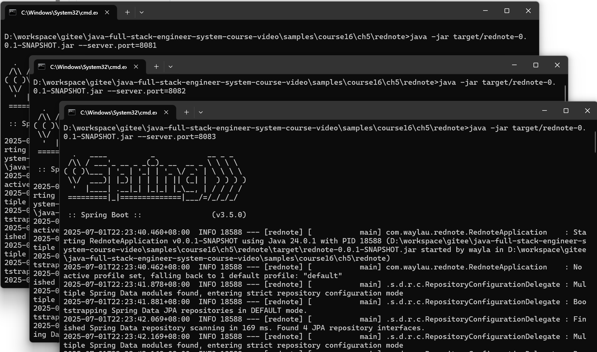

后台服务启动之后，再启动NGINX服务器，而后在浏览器<http://localhost:8080/>地址访问前台应用，同时观察后台控制台输出的内容，如下图所示。


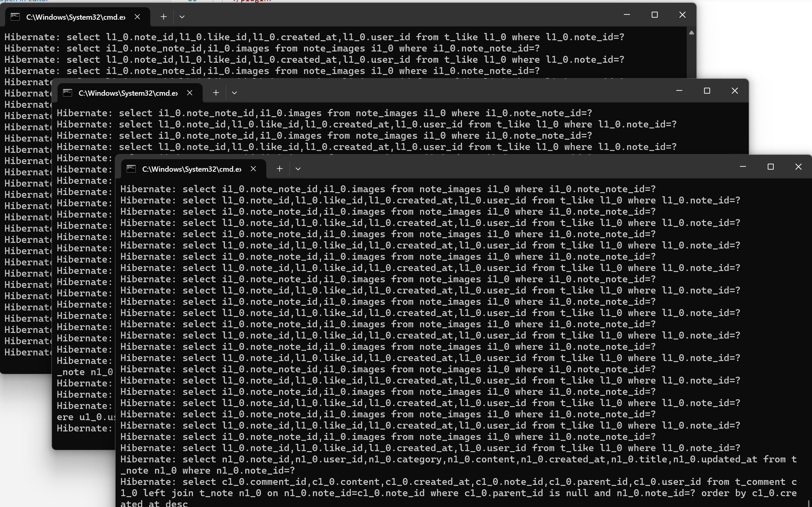


可以看到，三台后台服务都会轮流的接收到前台的请求。为了模拟故障，也可以将其他的任意一个后台服务停掉，可以发现前台仍然能够正常响应，这就实现了应用的高可用。


## 5.3 实战静态资源优化

### 配置Nginx启用Gzip压缩


修改 nginx.conf 增加如下配置：


```c
http {
    # ...为节约篇幅，此处省略非核心内容

    gzip on;                    # 启用压缩
    gzip_types text/css application/javascript image/svg+xml; # 压缩类型
    gzip_min_length 1k;         # 最小压缩文件大小
    gzip_comp_level 4;          # 压缩级别（1-9，4为平衡点）
    gzip_disable "MSIE [1-6]\."; # 禁用旧版IE压缩

    # ...为节约篇幅，此处省略非核心内容

}
```

测试方法：浏览器开发者工具查看是否有响应头 Content-Encoding: gzip。


下图是未启用Gzip压缩的HTML页面，网络传输大小是33.88kb。

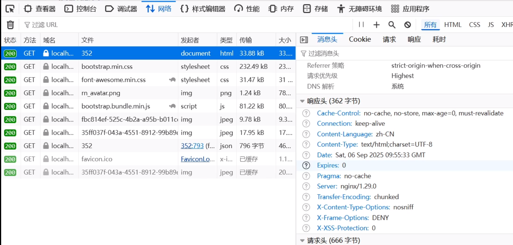


下图是启用了Gzip压缩的HTML页面，网络传输大小是8.15kb。

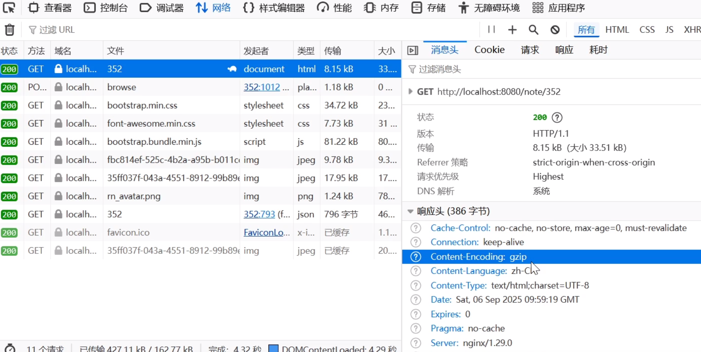


## 6.1 实战Prometheus监控MySQL

### 安装mysqld_exporter


从Prometheus官方下载页（<https://prometheus.io/download/#mysqld_exporter>）获取Windows版`mysqld_exporter`（例如`mysqld_exporter-0.17.2.windows-amd64.zip`），解压到指定目录（例如`D:\dev\monitor\mysqld_exporter-0.17.2.windows-amd64`）。  


### 配置mysqld_exporter

在安装目录下编写`my.cnf`配置文件，内容如下：  

```ini
[client]
host=127.0.0.1
port=3306
user=root
password=123456
```

### 启动mysqld_exporter

启动mysqld_exporter时指定配置文件：


```powershell
.\mysqld_exporter.exe --config.my-cnf=my.cnf
```


启动之后，会占用9104端口。浏览器访问<http://localhost:9104/metrics>，若能看到系统指标数据，则安装成功。

### 注册mysqld_exporter

在prometheus.yml配置中添加如下：

```yml
# ...为节约篇幅，此处省略非核心内容

scrape_configs:
  #  ...为节约篇幅，此处省略非核心内容

  - job_name: "mysqld_exporter"  # 指定Exporter名称

    static_configs:
      - targets: ["localhost:9104"]
        labels:
          app: "mysqld_exporter"
```


此时，重启Prometheus后，访问`http://localhost:9090/targets`，确认MySQL状态为`UP`，如下图6-1所示。


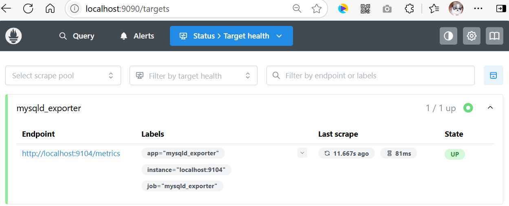


### 关键指标


- `mysql_global_status_connections`：总连接数。  
- `mysql_global_status_slow_queries`：慢查询次数。  
- `mysql_global_status_innodb_row_lock_waits`：行锁等待次数。


## 6.2 实战Prometheus监控Redis

### 安装redis_exporter


从redis_exporter社区官方下载页（<https://github.com/oliver006/redis_exporter/releases/>）获取Windows版`redis_exporter`（例如`redis_exporter-v1.74.0.windows-amd64.zip`），解压到指定目录（例如`D:\dev\monitor\redis_exporter-v1.74.0.windows-amd64`）。  


### 启动redis_exporter

启动redis_exporter时指定配置：


```powershell
.\redis_exporter.exe -redis.addr localhost:6379 -redis.password your_password  # 如需密码
```


启动之后，会占用9121端口。浏览器访问<http://localhost:9121/metrics>，若能看到系统指标数据，则安装成功。

### 注册redis_exporter

在prometheus.yml配置中添加如下：

```yml
# ...为节约篇幅，此处省略非核心内容

scrape_configs:
  #  ...为节约篇幅，此处省略非核心内容

  - job_name: "redis_exporter"  # 指定Exporter名称

    static_configs:
      - targets: ["localhost:9121"]
        labels:
          app: "redis_exporter"
```


此时，重启Prometheus后，访问`http://localhost:9090/targets`，确认Redis状态为`UP`，如下图6-2所示。


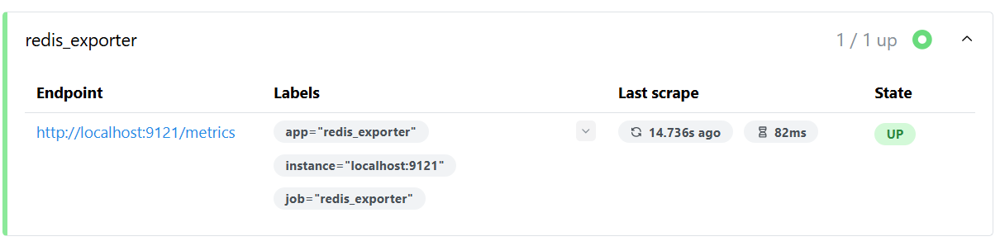


### 关键指标


- `redis_memory_used_bytes`：已用内存。  
- `redis_connected_clients`：连接客户端数。  
- `redis_commands_total`：命令执行总数。


## 6.3 Grafana实现Prometheus监控统一可视化

### 安装Grafana


从Grafana社区官方下载页（<https://grafana.com/grafana/download/>）获取OSS的Windows版`Grafana`（例如`grafana-12.0.2.windows-amd64.zip`），解压到指定目录（例如`D:\dev\monitor\grafana-v12.0.2`）。  


### 启动Grafana

启动Grafana：


```powershell
cd D:\dev\monitor\grafana-v12.0.2\bin
.\grafana-server.exe
```


启动之后，会占用3000端口。浏览器访问<http://localhost:3000>，默认账号`admin/admin`。若能正常登录系统，则安装成功。


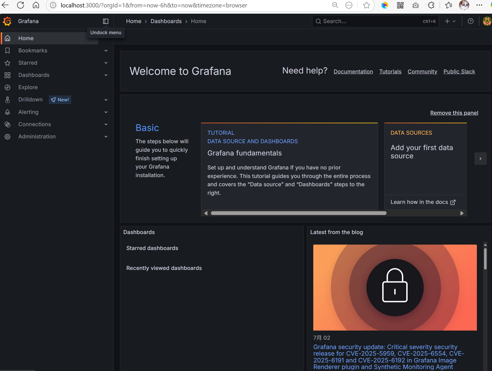


### 配置数据源

在菜单“Home > Connections > Data sources”下，添加Prometheus数据源，URL填写`http://localhost:9090`。

### 导入仪表盘


在菜单“Home > Dashboards > New dashboard”下，导入仪表盘。仪表盘模板可以在这个网址找到<https://grafana.com/grafana/dashboards/>。

#### 1. 导入MySQL仪表盘


导入仪表盘模板URL为<https://grafana.com/grafana/dashboards/7362-mysql-overview/>，选中Prometheus数据源，如下图所示：

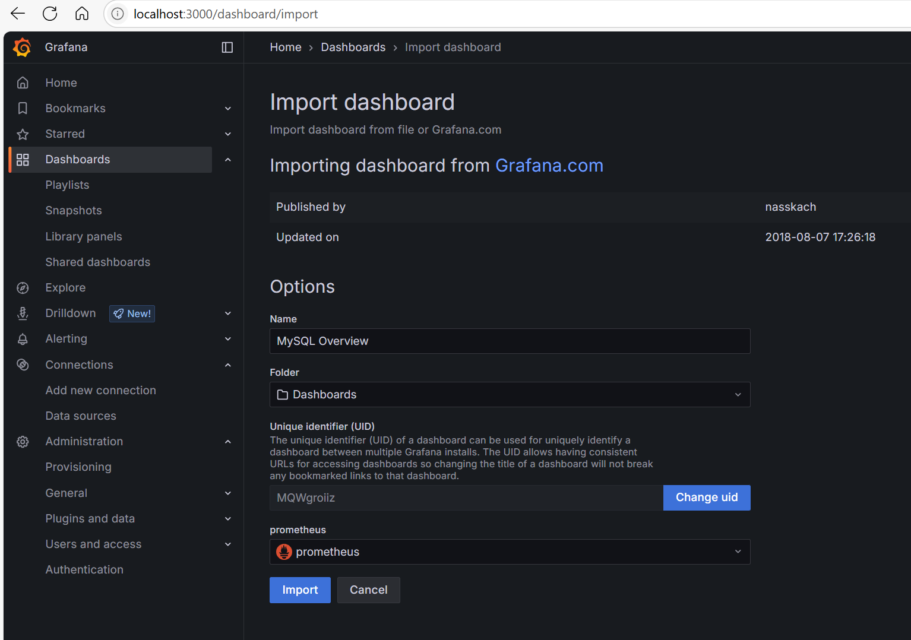


导入完成之后，MySQL仪表盘效果如下图所示。


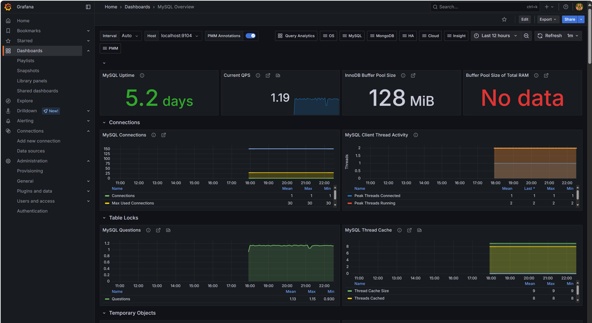


#### 2. 导入Redis仪表盘


导入仪表盘模板URL为<https://grafana.com/grafana/dashboards/11835-redis-dashboard-for-prometheus-redis-exporter-helm-stable-redis-ha/>，选中Prometheus数据源。


导入完成之后，Redis仪表盘效果如下图所示。


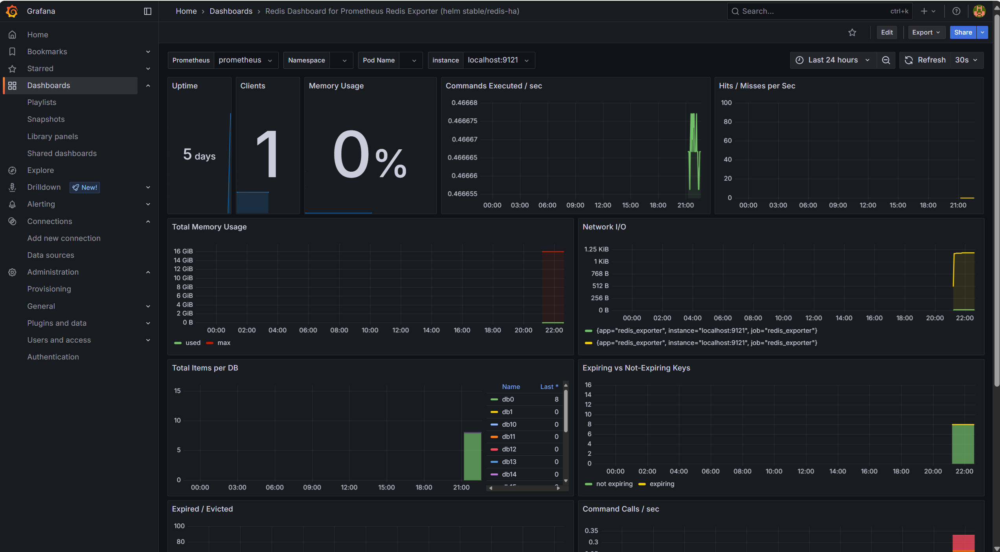


## 7.1 课程总结

这个系列在仿“小红书”单体项目基础上，演示了如何向分布式系统演进的全栈开发过程。具体内容如下：


### Redis 优化小红书项目：分布式会话存储方案

使用Redis存储用户登录状态与会话信息。

单体项目下，会话存储在应用的内存中，应用重启，会话就丢失。改为 Redis 会话存储方案，可以实现会话的集中化管理，尤其适用于分布式系统。即便是应用重启或者销毁重建，会话依然存在。


### 使用 Redis 优化小红书用户互动数据的方案

将用户点赞、评论等高频互动数据存储在 Redis 中，可以显著提升系统性能。


### Kafka在用户行为日志收集中的深度应用

实现用户行为日志数据的收集与展示。


### 使用MongoDB建立非结构化数据高效管理体系

利用 GridFS 存储用户上传的图片。


### 使用Nginx构建高性能流量管理体系

* 反向代理与负载均衡实现应用集群高可用
* 静态资源优化


### 使用Prometheus+Grafana实现分布式系统监控体系

* Prometheus 监控 MySQL
* Prometheus 监控 Redis
* Grafana实现Prometheus监控统一可视化
