> 本页为原「Java 课程 17」全部 15 个分节的合订本；原分节链接会自动跳转到本页。


## 1.1 前后端分离架构解决项目的痛点

### 一、原有单体项目的常见缺陷
#### 1.  单体架构的扩展性问题
   - 耦合度高：前后端代码混合（如 JSP、Thymeleaf），或前端逻辑嵌入后端模板，导致：
     - 开发效率低：前后端开发需同步部署，无法独立迭代。
     - 协作冲突：全栈开发者需同时掌握前后端技术，团队分工模糊。
   - 性能瓶颈：所有请求经过后端渲染（SSR），首屏加载慢，SEO 优化困难。

#### 2. 开发与运维痛点
   - 测试覆盖率低：原项目可能缺乏单元测试（Jest）、E2E 测试（Cypress）或可视化测试（Storybook）。
   - 部署依赖后端：前端静态资源需通过后端服务器分发，增加运维复杂度。


### 二、迁移至 Vue.js 3.5.17 的核心动机
#### 1. 技术栈现代化
   - Composition API：Vue 3 的组合式 API 替代 Options API，实现逻辑复用（如自定义 Hooks），代码更清晰。
   - TypeScript 深度支持：Vue 3 对 TS 的类型推断更完善，减少运行时错误，提升代码可维护性。
   - 性能优化：
     - 编译时优化：通过 `v-once`、`v-memo` 等指令减少不必要的渲染。
     - 碎片化 DOM 更新：按需更新组件，降低内存占用。
   - 生态丰富：
     - Pinia 状态管理：替代 Vuex，支持 TypeScript 和模块化。
     - Vite 构建工具：基于 ES Module 的冷启动，构建速度比 Webpack 快 10 倍。

#### 2. 前后端分离架构
   - 独立部署：前端通过 Nginx 部署静态资源，后端提供 RESTful/GraphQL API，实现：
     - 解耦开发：前后端团队可并行开发，互不干扰。
     - 跨平台兼容：同一套 API 可支持 Web、移动端（UniApp/Taro）、桌面端（Electron）。
   - SEO 优化：结合 Nuxt.js（Vue 的服务端渲染框架）或预渲染技术，提升搜索引擎收录。

#### 3. 用户体验升级
   - 响应式与移动优先：Vue 3 配合 CSS 框架（如 TailwindCSS）或 UI 库（如 Vant），快速适配多端。
   - 交互增强：
     - 懒加载：通过 `v-lazy` 实现图片/组件按需加载。
     - 骨架屏：使用 `v-skeleton` 提升首屏加载体验。
     - 动画库：集成 GSAP 或 Framer Motion，实现流畅过渡效果。
   - 国际化支持：通过 `vue-i18n` 实现多语言切换，满足全球化需求。

#### 4. 开发与运维效率提升
   - 开发体验：
     - HMR 热更新：Vite 支持毫秒级热更新，无需手动刷新页面。
     - DevTools 增强：Vue DevTools 提供更详细的组件树、性能分析和时间旅行调试。
   - 测试覆盖：
     - 单元测试：使用 Vitest 或 Jest 测试组件逻辑。
     - E2E 测试：通过 Cypress 或 Playwright 模拟用户操作。
   - CI/CD 集成：结合 GitHub Actions 或 Jenkins 实现自动化构建、测试和部署。


### 三、迁移方案示例
#### 1. 技术选型
   - 前端框架：Vue 3.5.17 + TypeScript + Pinia + Vue Router。
   - UI 库：Bootstrap、Vant（移动端）或 Element Plus（PC 端）。
   - 构建工具：Vite + ESLint + Prettier。
   - 测试工具：Vitest + Cypress。
   - 部署：Nginx + Docker。

#### 2. 代码重构步骤
   - 组件拆分：将原项目的大页面拆分为原子化组件（如 `PostCard.vue`、`CommentList.vue`）。
   - 状态管理：用 Pinia 替代 Vuex，管理用户信息、帖子数据等全局状态。
   - API 封装：使用 `axios` 或 `vue-request` 统一管理后端接口请求。
   - 路由优化：基于 Vue Router 实现动态路由和懒加载。

#### 3. 性能优化
   - 图片压缩：使用 `vite-plugin-imagemin` 自动压缩图片。
   - CDN 加速：将 Vue、Vant 等库托管至 CDN，减少本地打包体积。
   - PWA 支持：通过 `vite-plugin-pwa` 实现离线缓存和推送通知。


### 四、总结
通过迁移至 Vue.js 3.5.17，项目可获得 更高的开发效率、更好的用户体验、更强的可扩展性，同时为未来引入微前端、Serverless 等架构奠定基础。


## 2.1 Vue.js必备环境Node.js安装

在Windows下以ZIP方式安装Node.js 22.17.0，需手动完成解压、环境变量配置及全局模块路径设置等步骤，以下是详细操作指南：

### 一、下载Node.js 22.17.0 ZIP包

1. 访问官网：打开浏览器，访问Node.js官方网站：[https://nodejs.org/zh-cn/download/](https://nodejs.org/zh-cn/download/)。
2. 选择版本：在下载页面中，找到“独立文件(.zip)”部分，选择适合您系统的版本（32位或64位），这里选择64位版本。
3. 下载ZIP包：点击下载链接，将Node.js 22.17.0的ZIP包下载到本地。

### 二、解压ZIP包

1. 找到下载的ZIP包：在文件资源管理器中，找到刚刚下载的Node.js 22.17.0 ZIP包（例如`node-v22.17.0-win-x64.zip`）。
2. 解压ZIP包：右键点击ZIP包，选择“解压到当前文件夹”或使用解压软件（如WinRAR、7-Zip等）进行解压。解压后，您将得到一个包含Node.js文件的文件夹。

### 三、配置环境变量

1. 打开环境变量设置：

	* 右键点击“此电脑”或“我的电脑”，选择“属性”。
	* 在系统属性窗口中，点击“高级系统设置”。
	* 在系统属性窗口中，点击“环境变量”按钮。
  * 新建环境变量`NODE_PATH`，值为Node.js的解压路径（如`D:\dev\web\node-v22.17.0-win-x64`），然后点击“确定”。

2. 编辑Path变量：

	* 在环境变量窗口中，找到“Path”变量，并点击“编辑”。
	* 在编辑环境变量窗口中，点击“新建”按钮。
	* 输入`%NODE_PATH%`，点击“保存”按钮。

3. 验证环境变量配置：

	* 打开命令提示符（CMD）或PowerShell。
	* 输入`node -v`和`npm -v`命令，验证Node.js和npm是否安装成功。如果命令行中显示出了Node.js和npm的版本号，说明环境变量配置成功。


```bash
C:\Users\wayla>node -v
v22.17.0

C:\Users\wayla>npm -v
11.4.2
```

### 四、设置全局模块安装路径（可选）

默认情况下，npm全局安装的模块会保存在用户目录下的`AppData\Roaming\npm`和`AppData\Roaming\npm-cache`中。为了更方便地管理这些模块，您可以设置自定义的全局模块安装路径和缓存路径。

1. 创建全局模块和缓存文件夹：

	* 在Node.js的解压路径下（或您选择的任何位置），创建两个文件夹，分别命名为`npm`和`npm-cache`。

2. 配置npm的全局路径和缓存路径：

	* 打开命令提示符（CMD）或PowerShell，以管理员身份运行（如果提示权限不够）。
	* 输入以下命令，将npm的全局路径和缓存路径设置为刚才新建的两个目录：

```bash
npm config set prefix "D:\data\npm\npm"
npm config set cache "D:\data\npm\npm-cache"
```


### 五、验证安装和配置

1. 安装一个全局模块进行测试：

	* 打开命令提示符（CMD）或PowerShell。
	* 输入以下命令，安装一个常用的全局模块（如`gitbook-cli`或者`npm`）：

```bash
npm install gitbook-cli -g

npm install -g npm@11.4.2
```

2. 验证模块是否安装成功：

	* 在全局模块路径下的`npm\node_modules`文件夹中，查看是否出现了`gitbook-cli`或者`npm`文件夹。
	* 如果出现了`gitbook-cli`或者`npm`文件夹，说明全局模块安装成功，且全局模块路径配置正确。


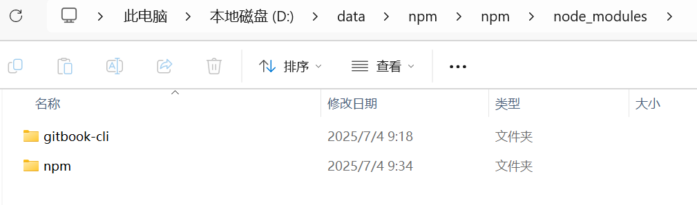


## 2.2 加速Node.js模块下载的妙诀

在 Windows 系统下使用 Node.js 的 npm 时，可以通过设置镜像源来加速模块下载（尤其是国内用户）。以下是详细步骤，涵盖临时使用、全局配置和恢复默认设置的方法：


### 一、临时使用镜像（仅当前命令有效）
在安装模块时，通过 `--registry` 参数指定镜像源（例如淘宝镜像）：
```bash
npm install 模块名 --registry=https://registry.npmmirror.com
```
示例：
```bash
npm install express --registry=https://registry.npmmirror.com
```


### 二、永久设置 npm 镜像（推荐）
#### 1. 使用淘宝镜像（国内最快）
```bash
npm config set registry https://registry.npmmirror.com
```
验证是否生效：
```bash
npm config get registry
```
输出应为：
```
https://registry.npmmirror.com/
```

#### 2. 其他常用镜像源
- 腾讯云镜像：
  ```bash
  npm config set registry https://mirrors.cloud.tencent.com/npm/
  ```
- 华为云镜像：
  ```bash
  npm config set registry https://mirrors.huaweicloud.com/repository/npm/
  ```
- 官方源（默认）：
  ```bash
  npm config set registry https://registry.npmjs.org/
  ```


### 三、使用 `nrm` 工具快速切换镜像（高级用法）
`nrm` 是一个 npm 镜像管理工具，可以一键切换镜像源。

#### 1. 安装 `nrm`
```bash
npm install -g nrm
```

#### 2. 查看可用镜像列表
```bash
nrm ls
```
输出示例：
```
* registry.npmmirror.com  # 当前使用
  registry.npmjs.org
  registry.cloud.tencent.com
  ...
```

#### 3. 切换镜像源
```bash
nrm use 镜像名
```
示例：切换到淘宝镜像：
```bash
nrm use registry.npmmirror.com
```

#### 4. 测试镜像速度
```bash
nrm test
```


### 四、恢复默认镜像源
如果需要恢复 npm 默认源（`https://registry.npmjs.org/`），执行：
```bash
npm config set registry https://registry.npmjs.org/
```
或通过 `nrm`：
```bash
nrm use npm
```


### 五、配置 `.npmrc` 文件（企业级场景）
如果需要在项目或全局范围内强制使用镜像，可以直接编辑 `.npmrc` 文件：
1. 全局配置（对所有项目生效）：
   - 文件路径：`C:\Users\你的用户名\.npmrc`
   - 添加内容：
     ```
     registry=https://registry.npmmirror.com
     ```

2. 项目级配置（仅对当前项目生效）：
   - 在项目根目录创建 `.npmrc` 文件，内容同上。


### 六、常见问题解决
#### 1. 镜像源不可用
- 检查网络连接是否正常。
- 尝试更换镜像源（如从淘宝切换到腾讯云）。
- 使用 `ping registry.npmmirror.com` 测试镜像地址是否可达。

#### 2. 权限问题（Windows）
如果遇到权限错误，尝试以管理员身份运行命令提示符（CMD/PowerShell），或使用：
```bash
npm config set registry https://registry.npmmirror.com --global
```

#### 3. 缓存清理
切换镜像后，建议清理 npm 缓存：
```bash
npm cache clean --force
```


### 总结
| 方法               | 命令示例                                                                 | 适用场景               |
|--------------------|--------------------------------------------------------------------------|------------------------|
| 临时使用镜像       | `npm install --registry=https://registry.npmmirror.com`                 | 单次安装加速           |
| 永久设置镜像       | `npm config set registry https://registry.npmmirror.com`                | 全局生效               |
| 使用 `nrm` 工具    | `nrm use registry.npmmirror.com`                                        | 快速切换多个镜像源     |
| 配置 `.npmrc` 文件 | 在文件或项目目录中添加 `registry=https://registry.npmmirror.com`        | 企业级强制镜像策略     |

推荐国内用户使用淘宝镜像（`https://registry.npmmirror.com`），速度最快且稳定。


## 2.3 Vue.js开发好搭档Visual Studio Code下载安装到搭建

#### 一、为什么选择 VS Code 作为 Vue.js 开发工具？
1. 轻量级但功能强大  
   - 启动速度快，资源占用低，适合大型 Vue 项目开发。
2. 丰富的插件生态  
   - 支持 Vue 语法高亮、智能提示、代码格式化、调试等。
3. 集成终端  
   - 内置终端（PowerShell/CMD/Git Bash），无需切换窗口即可运行命令。
4. 调试支持  
   - 直接调试 Vue 组件和 Node.js 后端逻辑。
5. 跨平台  
   - 支持 Windows、macOS、Linux，团队开发环境一致。


### 二、下载与安装 VS Code
#### 1. 下载 VS Code
- 官网下载：访问 <https://code.visualstudio.com/Download>。
- 选择版本：
  - Windows：下载 `.exe` 安装包（推荐）或 `.zip` 便携版。
  - macOS：下载 `.dmg` 或 `.zip`。
  - Linux：下载 `.deb`（Ubuntu/Debian）或 `.rpm`（CentOS/Fedora）。

#### 2. 安装步骤（Windows 示例）
zip包解压至指定目录，比如 `D:\dev\web\VSCode-win32-x64-1.101.2`，双击Code.exe文件即可启动。


### 三、VS Code 必备插件推荐
Vue - Official (之前是 Volar) 是官方的 VS Code 扩展，提供了 Vue 单文件组件中的 TypeScript 支持，还伴随着一些其他非常棒的特性。
插件地址：<https://marketplace.visualstudio.com/items?itemName=Vue.volar>


## 2.4 安装Vue.js建立现代化前端开发认知框架

### 安装Vue.js


在工作目录下，执行

```bash
npm create vue@latest
```

这一指令将会安装并执行 create-vue，它是 Vue 官方的项目脚手架工具。你将会看到一些诸如 TypeScript 和测试支持之类的可选功能提示：


```bash
npm>npm create vue@latest
Need to install the following packages:
create-vue@3.18.0
Ok to proceed? (y) y


> npx
> create-vue

T  Vue.js - The Progressive JavaScript Framework
|
o  请输入项目名称：
|  hello-world
|
o  请选择要包含的功能： (↑/↓ 切换，空格选择，a 全选，回车确认)
|  TypeScript
|
o  选择要包含的试验特性： (↑/↓ 切换，空格选择，a 全选，回车确认)
|  none
|
o  跳过所有示例代码，创建一个空白的 Vue 项目？
|  No

正在初始化项目 hello-world...
|
—  项目初始化完成，可执行以下命令：

   cd hello-world
   npm install
   npm run dev

| 可选：使用以下命令在项目目录中初始化 Git：

   git init && git add -A && git commit -m "initial commit"
```

上面命令创建了一个名为“hello-world”，使用TypeScript功能的Vue.js项目。如果不确定是否要开启某个功能，你可以直接按下回车键选择 No。

### 启动开发服务器

在项目被创建后，通过以下步骤安装依赖并启动开发服务器：

```
cd hello-world
npm install
npm run dev
```

看到如下输出，则说明已经运行起来了你的第一个Vue.js项目了！

```bash
VITE v7.1.4  ready in 20203 ms

➜  Local:   http://localhost:5173/
➜  Network: use --host to expose
➜  Vue DevTools: Open http://localhost:5173/__devtools__/ as a separate window
➜  Vue DevTools: Press Alt(⌥)+Shift(⇧)+D in App to toggle the Vue DevTools
➜  press h + enter to show help
```  

项目默认运行在 `http://localhost:5173`，可以在浏览器中打开。


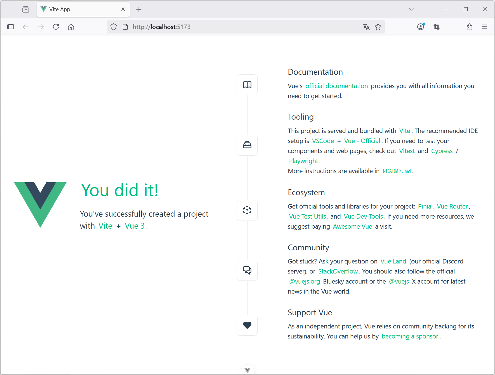


### 使用 VS Code 开发 Vue 项目


点击 VS Code 左侧资源管理器图标 → 点击“Open Folder” → 选择项目目录。

如果使用 VS Code 终端执行命令报如下错误：


```
npm : 无法加载文件 D:\dev\web\node-v22.17.0-win-x64\npm.ps1，因为在此系统上禁止运行脚本。有关详细信息，请参阅 https:/go.microsoft.com/fwlink/?LinkID=135170 中的 ab
out_Execution_Policies。
所在位置 行:1 字符: 1
+ npm install
+ ~~~
    + CategoryInfo          : SecurityError: (:) []，PSSecurityException
    + FullyQualifiedErrorId : UnauthorizedAccess
```    


这个错误是由于 PowerShell 执行策略 限制导致的，Windows 系统默认禁止运行未经签名的脚本（包括 `npm.ps1`）。以下是解决方案：

以管理员身份运行 PowerShell，设置为远程签名策略：

```powershell
Set-ExecutionPolicy -ExecutionPolicy RemoteSigned -Scope CurrentUser
```
- `RemoteSigned`：允许本地脚本运行，但要求网络下载的脚本需有签名。
- `CurrentUser`：仅对当前用户生效，不影响系统其他用户。

验证修改：

```powershell
Get-ExecutionPolicy -List
```

检查 `CurrentUser` 或 `Process` 的策略是否已更新。

### 项目结构解析


以 Vite 创建的 Vue 3 项目为例：


```
hello-world/
├── node_modules/       # 依赖包
├── public/             # 静态资源（如 favicon.ico）
├── src/
│   ├── assets/         # 图片、CSS 等静态资源
│   ├── components/     # Vue 组件
│   ├── App.vue         # 根组件
│   ├── main.ts         # 入口文件
├── index.html          # 入口 HTML 文件
├── package.json        # 项目配置和依赖
└── vite.config.ts      # Vite 配置文件
```

#### vite.config.ts


```ts
import { fileURLToPath, URL } from 'node:url'

import { defineConfig } from 'vite'
import vue from '@vitejs/plugin-vue'
import vueDevTools from 'vite-plugin-vue-devtools'

// https://vite.dev/config/
export default defineConfig({
  plugins: [
    vue(),
    vueDevTools(),
  ],
  resolve: {
    alias: {
      '@': fileURLToPath(new URL('./src', import.meta.url))
    },
  },
})
```


#### package.json

```json
{
  "name": "hello-world",
  "version": "0.0.0",
  "private": true,
  "type": "module",
  "scripts": {
    "dev": "vite",
    "build": "run-p type-check \"build-only {@}\" --",
    "preview": "vite preview",
    "build-only": "vite build",
    "type-check": "vue-tsc --build"
  },
  "dependencies": {
    "vue": "^3.5.17"
  },
  "devDependencies": {
    "@tsconfig/node22": "^22.0.2",
    "@types/node": "^22.15.32",
    "@vitejs/plugin-vue": "^6.0.0",
    "@vue/tsconfig": "^0.7.0",
    "npm-run-all2": "^8.0.4",
    "typescript": "~5.8.0",
    "vite": "^7.0.0",
    "vite-plugin-vue-devtools": "^7.7.7",
    "vue-tsc": "^2.2.10"
  }
}
```


#### index.html

```html
<!DOCTYPE html>
<html lang="">
  <head>
    <meta charset="UTF-8">
    <link rel="icon" href="/favicon.ico">
    <meta name="viewport" content="width=device-width, initial-scale=1.0">
    <title>Vite App</title>
  </head>
  <body>
    <div id="app"></div>
    <script type="module" src="/src/main.ts"></script>
  </body>
</html>
```

#### main.ts


```ts
import './assets/main.css'

import { createApp } from 'vue'
import App from './App.vue'

createApp(App).mount('#app')
```

* 每个 Vue 应用都是通过 createApp 函数创建一个新的 应用实例。
* 我们传入 createApp 的对象实际上是一个组件，每个应用都需要一个“根组件”，其他组件将作为其子组件。
* 挂载应用：应用实例必须在调用了 .mount() 方法后才会渲染出来。该方法接收一个“容器”参数，可以是一个实际的 DOM 元素或是一个 CSS 选择器字符串。


#### App.vue


```vue
<script setup lang="ts">
import HelloWorld from './components/HelloWorld.vue'
import TheWelcome from './components/TheWelcome.vue'
</script>

<template>
  <header>
    

    <div class="wrapper">
      <HelloWorld msg="You did it!" />
    </div>
  </header>

  <main>
    <TheWelcome />
  </main>
</template>

<style scoped>
header {
  line-height: 1.5;
}

.logo {
  display: block;
  margin: 0 auto 2rem;
}

@media (min-width: 1024px) {
  header {
    display: flex;
    place-items: center;
    padding-right: calc(var(--section-gap) / 2);
  }

  .logo {
    margin: 0 2rem 0 0;
  }

  header .wrapper {
    display: flex;
    place-items: flex-start;
    flex-wrap: wrap;
  }
}
</style>
```


根组件的模板`<template>`通常是组件本身的一部分。


## 3.1 基础组件开发：实现代码复用率的底层逻辑

为了便于理解组件的基本概念，我们先从一个简单的示例“basic-component”入手。可以通过`create-vue`方式来初始化项目。


### 什么是组件

组件是Vue中的一个重要概念：它是一种抽象，可以将小型、自包含且通常可重用的组件组成一个大规模的应用。组件允许我们将 UI 划分为独立的、可重用的部分，并且可以对每个部分进行单独的思考。在实际应用中，组件常常被组织成一个层层嵌套的树状结构，如下图3-1所示。


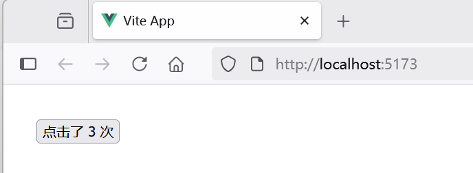


这和我们嵌套 HTML 元素的方式类似，Vue 实现了自己的组件模型，使我们可以在每个组件内封装自定义内容与逻辑。Vue 同样也能很好地配合原生 Web Component。


在初始化“basic-component”示例中，App.vue在组件树中是根节点，而HelloWorld.vue、TheWelcome.vue都是App.vue的子节点。


### 定义一个组件​

当使用构建步骤时，我们一般会将 Vue 组件定义在一个单独的 .vue 文件中，这被叫做单文件组件 (简称 SFC)。例如，我们在`src\components`目录下，创建了一个组件BasicComponent.vue，内容如下：

```vue
<script setup lang="ts">
// 导入模板引用ref
import { ref } from 'vue'

// 使用 ref() 函数来声明响应式状态
const count = ref(0)

// 声明函数
function increment() {
  // 在 JavaScript 中需要 .value
  count.value++
}

</script>

<template>
    <button @click="increment">点击了 {{ count }} 次</button>
</template>
```


以在同一作用域内声明更改 ref 的函数increment，并将它们作为方法与状态一起公开。当点击按钮执行increment函数时，count会递增。

`<script setup lang="ts">` 中的顶层的导入、声明的变量和函数可在同一组件的模板中直接使用。你可以理解为模板是在同一作用域内声明的一个 TypeScript 函数——它自然可以访问与它一起声明的所有内容。


### 为什么要使用 ref？​

你可能会好奇：为什么我们需要使用带有 `.value` 的 ref，而不是普通的变量？为了解释这一点，我们需要简单地讨论一下 Vue 的响应式系统是如何工作的。

当你在模板中使用了一个 ref，然后改变了这个 ref 的值时，Vue 会自动检测到这个变化，并且相应地更新 DOM。这是通过一个基于依赖追踪的响应式系统实现的。当一个组件首次渲染时，Vue 会追踪在渲染过程中使用的每一个 ref。然后，当一个 ref 被修改时，它会触发追踪它的组件的一次重新渲染。

在标准的 JavaScript 中，检测普通变量的访问或修改是行不通的。然而，我们可以通过 getter 和 setter 方法来拦截对象属性的 get 和 set 操作。

该 `.value` 属性给予了 Vue 一个机会来检测 ref 何时被访问或修改。在其内部，Vue 在它的 getter 中执行追踪，在它的 setter 中执行触发。

另一个 ref 的好处是，与普通变量不同，你可以将 ref 传递给函数，同时保留对最新值和响应式连接的访问。当将复杂的逻辑重构为可重用的代码时，这将非常有用。


### 使用组件​


要使用一个子组件BasicComponent.vue，我们需要在父组件App.vue中导入它，这个组件将会以默认导出的形式被暴露给外部：


```vue
<script setup lang="ts">
// 导入组件
import BasicComponent from './components/BasicComponent.vue'
</script>

<template>
  <main>
    <BasicComponent />
  </main>
</template>
```


通过 `<script setup lang="ts">`，导入的组件都在模板`<template>`中直接可用。

### 运行调测


## 3.2 组件通信，快速建立标准化组件交互规范

在 Vue.js 的组件化开发中，组件通信是核心能力之一。合理的通信规范能提升代码可维护性、降低耦合度，并促进团队协作。本文将系统梳理 Vue 组件通信的标准化方案，结合实战案例和最佳实践。


### Vue 组件通信的核心场景与方案


| 场景                | 示例                          | 推荐方案                     |
|---------------------|-------------------------------|----------------------------|
| 父子组件通信    | 父组件传递数据给子组件        | Props + 自定义事件          |
| 子向父通信      | 子组件通知父组件状态变化      | `$emit` + 自定义事件        |
| 跨层级组件通信  | 深层嵌套组件间的数据传递      | Provide/Inject    |
| 兄弟组件通信    | 两个并列组件共享状态          | 事件总线（Event Bus）或 Pinia |
| 全局状态管理    | 用户登录状态、主题切换等      | Pinia               |


### 总结与进阶建议
1. 优先使用标准方案：
   - 简单父子通信 → Props + Events
   - 跨层级组件 → Provide/Inject
   - 复杂状态 → Pinia

2. 避免反模式：
   - 直接修改 props
   - 过度使用事件总线导致难以追踪
   - 全局状态滥用


通过建立标准化的组件通信规范，团队可以显著提升开发效率，减少因通信方式混乱导致的维护成本。建议根据项目规模选择合适的通信组合方案，并在团队内形成统一文档。


## 3.3 通过Props向下传递数据

Props 是一种特别的 attributes，你可以在组件上声明注册。从一个简单的示例“basic-component-reusable”入手。

在`src\components`目录下，创建了一个组件ChildComponent.vue，内容如下：

```vue
<script setup lang="ts">
defineProps<{
  msg: string
}>()
</script>

<template>
  <div>
    <h1>{{ msg }}</h1>
  </div>
</template>
```


defineProps 是一个仅 `<script setup lang="ts">` 中可用的编译宏命令，并不需要显式地导入。声明的 props 会自动暴露给模板。defineProps 会返回一个对象，其中包含了可以传递给组件的所有 props。

在父组件App.vue中导入子组件，并给子组件 attribute 赋值：


```vue
<script setup lang="ts">
import ChildComponent from './components/ChildComponent.vue'
</script>

<template>
  <main>
    <ChildComponent msg="晁盖" />

    <ChildComponent msg="宋江" />
  </main>
</template>
```

最终，界面效果如下。


根据子组件 msg 赋值不同，相同的组件显示出不同的效果。


## 3.4 自定义事件向上通信

从上一节了解到，父组件如果要和子组件通信，通常是采用Prop的方式。而子组件如果要想和父组件通信，则往往是使用事件。图3-3展示了父子组件通信的示意图。


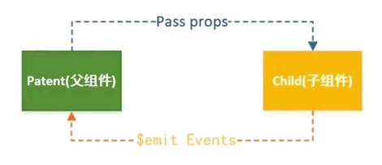

可以使用v-on指令（通常缩写为`@`符号）来监听DOM事件，并在触发事件时执行一些JavaScript操作。从一个简单的示例“listen-for-child-component-event”入手。

在`src\components`目录下，创建了一个组件ChildComponent.vue，内容如下：

```vue
<script setup lang="ts">
// defineEmits() 宏来声明它要触发的事件
const emit = defineEmits(['showMeTheMoneyEvent'])

// 声明函数
function callForFather() {
  // 使用 emit 方法触发自定义事件
  emit('showMeTheMoneyEvent')
}

</script>

<template>
  <button @click="callForFather">呼叫老爹</button>
</template>
```


defineEmits 仅可用于 `<script setup lang="ts">` 之中，并且不需要导入，它返回一个等同于 `$emit` 方法的 emit 函数。它可以被用于在组件的 `<script setup lang="ts">` 中抛出事件，因为此处无法直接访问 `$emit`。

在父组件App.vue中导入子组件，并监听子组件事件：


```vue
<script setup lang="ts">
import ChildComponent from './components/ChildComponent.vue'

// 导入模板引用ref
import { ref } from 'vue'

// 使用 ref() 函数来声明响应式状态
const msg = ref('')

// 声明函数
function handleEvent() {
  // 在 JavaScript 中需要 .value
  msg.value = '收到！'
}
</script>

<template>
  <main>
    <ChildComponent @show-me-the-money-event="handleEvent"/>

    <p>父：{{ msg }} </p>
  </main>
</template>
```

最终，在事件发送前的界面效果如下图3-4所示。


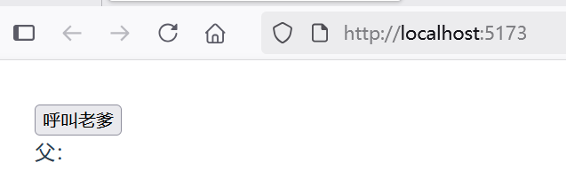

在事件发送前的界面效果如下图3-5所示。


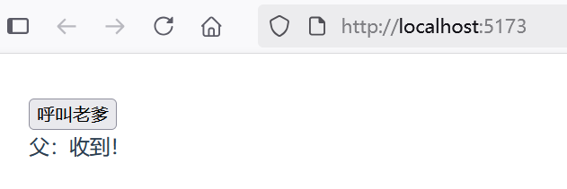


## 3.5 Provide/Inject跨层级传递

通常情况下，当我们需要从父组件向子组件传递数据时，会使用 props。想象一下这样的结构：有一些多层级嵌套的组件，形成了一棵巨大的组件树，而某个深层的子组件需要一个较远的祖先组件中的部分数据。在这种情况下，如果仅使用 props 则必须将其沿着组件链逐级传递下去，这会非常麻烦：


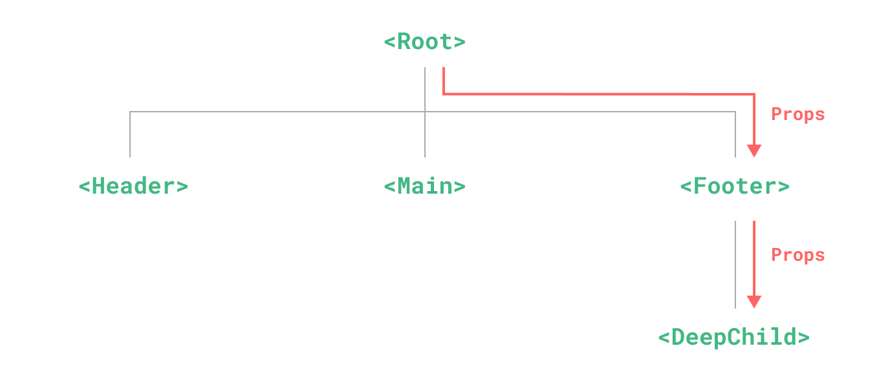


注意，虽然这里的 `<Footer>` 组件可能根本不关心这些 props，但为了使 `<DeepChild>` 能访问到它们，仍然需要定义并向下传递。如果组件链路非常长，可能会影响到更多这条路上的组件。这一问题被称为“prop 逐级透传”，显然是我们希望尽量避免的情况。

provide 和 inject 可以帮助我们解决这一问题。一个父组件相对于其所有的后代组件，会作为依赖提供者。任何后代的组件树，无论层级有多深，都可以注入由父组件提供给整条链路的依赖。


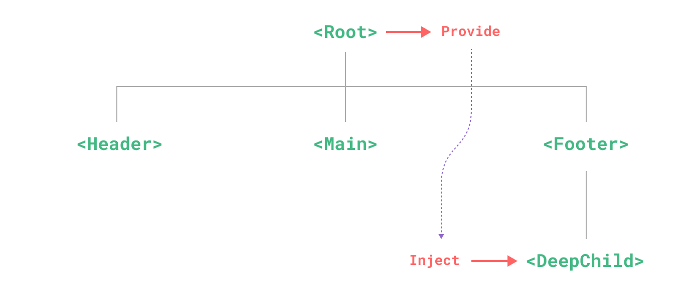


从一个简单的示例“provide-inject”入手。

在`src\components`目录下，创建了一个组件DeepChild.vue，内容如下：

```vue
<script setup lang="ts">
// inject() 函数注入上层组件提供的数据 
import { inject } from 'vue';
const msg = inject('msg', '暂无'); // 默认值'暂无'
</script>

<template>
  <p>孙子收到祖先显灵：{{ msg }}</p>
</template>
```


inject() 函数注入上层组件提供的数据。默认情况下，inject 假设传入的注入名会被某个祖先链上的组件提供。如果该注入名的确没有任何组件提供，则会抛出一个运行时警告。如果在注入一个值时不要求必须有提供者，那么我们应该声明一个默认值。


在`src\components`目录下，创建了一个组件Footer.vue作为DeepChild.vue的父组件，内容如下：

```vue
<script setup lang="ts">
import DeepChild from './DeepChild.vue'
</script>

<template>
  <DeepChild />
</template>
```


在祖先组件App.vue中导入Footer.vue组件：


```vue
<script setup lang="ts">
import Footer from './components/Footer.vue'

// 导入模板引用ref
import { ref } from 'vue'

// 要为组件后代提供数据，需要使用到 provide() 函数：
import { provide } from 'vue'

// 使用 ref() 函数来声明响应式状态
const msg = ref('')

// 提供注入名称及值
provide('msg', msg)

// 声明函数
function callForDescendant() {
  // 在 JavaScript 中需要 .value
  msg.value = '子孙安在？'
}
</script>

<template>
  <button @click="callForDescendant">呼叫儿孙</button>
  <Footer />
</template>
```


上述代码，使用到 provide() 函数为组件后代提供数据。当点击按钮“呼叫儿孙”时，提供的数据会发生变化，后代注入的数据也会跟着变化。

点击按钮前的界面效果如下图3-8所示。


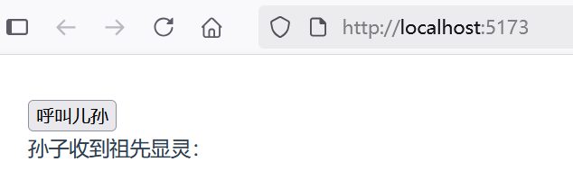


点击按钮前的界面效果如下图3-9所示。


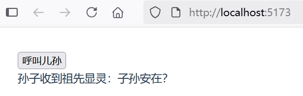


## 4.1 Vue Router深度实践：构建高体验单页应用（SPA）的核心

Vue Router 是 Vue.js 的官方路由。它与 Vue.js 核心深度集成，让用 Vue.js 构建单页应用变得轻而易举。功能包括：

* 嵌套路由映射
* 动态路由选择
* 模块化、基于组件的路由配置
* 路由参数、查询、通配符
* 展示由 Vue.js 的过渡系统提供的过渡效果
* 细致的导航控制
* 自动激活 CSS 类的链接
* HTML5 history 模式或 hash 模式
* 可定制的滚动行为
* URL 的正确编码

### 什么是Vue Router


Vue Router 是 Vue 官方的客户端路由解决方案。

客户端路由的作用是在单页应用 (SPA) 中将浏览器的 URL 和用户看到的内容绑定起来。当用户在应用中浏览不同页面时，URL 会随之更新，但页面不需要从服务器重新加载。

Vue Router 基于 Vue 的组件系统构建，你可以通过配置路由来告诉 Vue Router 为每个 URL 路径显示哪些组件。

### 安装Vue Router


对于一个现有的使用 JavaScript 包管理器的项目，你可以从 npm registry 中安装 Vue Router，可以使用以下命令：


```
npm install vue-router@4
```


如果你打算启动一个新项目，你可能会发现使用 create-vue 这个脚手架工具更容易，它能创建一个基于 Vite 的项目，并包含加入 Vue Router 的选项。


```
> npm create vue@latest

> npx
> create-vue

┌  Vue.js - The Progressive JavaScript Framework
│
◇  Project name (target directory):
│  routing-basic
│
◆  Select features to include in your project: (↑/↓ to navigate, space to select, a to toggle all, enter to confirm)
│  ◼ TypeScript
│  ◻ JSX Support
│  ◼ Router (SPA development)
│  ◻ Pinia (state management)
│  ◻ Vitest (unit testing)
│  ◻ End-to-End Testing
│  ◻ ESLint (error prevention)
│  ◻ Prettier (code formatting)
```


如上所示，创建化一个名为“routing-basic”并包含了Vue Router的应用作为演示。


### 创建视图


路由组件通常被称为视图，但本质上它们只是普通的 Vue 组件。我们创建两个组件来分别代表About页面和Home页面。

在`src\components`目录下，创建了一个组件About.vue，内容如下：


```vue
<template>
  <h1>关于</h1>
  <p>俺是铁牛！</p>
</template>
```

在`src\components`目录下，创建了一个组件Home.vue，内容如下：


```vue
<template>
  <h1>主页</h1>
  <p>家在梁山泊。</p>
</template>
```


### 创建路由


创建一个路由目录`src\router`，在该目录下创建路由文件index.ts代码如下：


```ts
import { createRouter, createWebHistory } from 'vue-router'
import Home from '../components/Home.vue'

const router = createRouter({
  history: createWebHistory(import.meta.env.BASE_URL),
  routes: [
    {
      path: '/',
      name: 'home',
      component: Home,
    },
    {
      path: '/about',
      name: 'about',
      // 路由级代码拆分
      // 这将为此路由生成一个单独的块（About.[hash].js）
      // 当访问该路线时，它被延迟加载
      component: () => import('../components/About.vue'),
    },
  ],
})

export default router
```


上述代码，设置了路由规则：

* 当访问/路径时，则会响应Home组件的内容
* 当访问/about路径时，则会响应About组件的内容
* createRouter方法用于实例化一个router，其中history选项控制了路由和 URL 路径是如何双向映射的。


### 路由参数history的3种模式


在创建路由器实例时，history 配置允许我们在不同的历史模式中进行选择。

#### Hash 模式

Hash 模式是用 createWebHashHistory() 创建的：

```ts
import { createRouter, createWebHashHistory } from 'vue-router'

const router = createRouter({
  history: createWebHashHistory(),
  routes: [
    //...
  ],
})
```

它在内部传递的实际 URL 之前使用了一个井号（`#`）。由于这部分 URL 从未被发送到服务器，所以它不需要在服务器层面上进行任何特殊处理。不过，它在 SEO 中确实有不好的影响。如果你担心这个问题，可以使用 HTML5 模式。


#### Memory 模式

Memory 模式不会假定自己处于浏览器环境，因此不会与 URL 交互也不会自动触发初始导航。这使得它非常适合 Node 环境和 SSR。它是用 createMemoryHistory() 创建的，并且需要你在调用 app.use(router) 之后手动 push 到初始导航。

```ts
import { createRouter, createMemoryHistory } from 'vue-router'
const router = createRouter({
  history: createMemoryHistory(),
  routes: [
    //...
  ],
})
```

虽然不推荐，你仍可以在浏览器应用程序中使用此模式，但请注意它不会有历史记录，这意味着你无法后退或前进。

#### HTML5 模式

用 createWebHistory() 创建 HTML5 模式，推荐使用这个模式：

```ts
import { createRouter, createWebHistory } from 'vue-router'

const router = createRouter({
  history: createWebHistory(),
  routes: [
    //...
  ],
})
```

当使用这种历史模式时，URL 会看起来很“正常”，例如 <https://example.com/user/id>。


### 如何使用路由


要使用上述index.ts路由规则，则需要在应用中修改两个地方。

#### 1. 修改main.ts文件


修改如下：

```ts
import './assets/main.css'

import { createApp } from 'vue'
import App from './App.vue'
import router from './router'

const app = createApp(App)

// 使用路由
app.use(router)

app.mount('#app')
```

上述修改，是将router.ts以插件方式引入到应用中。

#### 2. 修改App.vue


修改内容如下：


```ts
<script setup lang="ts">
import { RouterLink, RouterView } from 'vue-router'
</script>

<template>
  <P>当前路径：{{ $route.fullPath }}</P>
  <nav>
    <RouterLink to="/">Home</RouterLink>
    <RouterLink to="/about">About</RouterLink>
  </nav>

  <main>
    <RouterView />
  </main>
</template>
```


上述代码，

* RouterLink的to属性代表了对应的一条路由
* RouterView用于放置路由映射所对应的页面


### 运行调测


初次运行应用，可以看到界面效果如下图4-1所示。


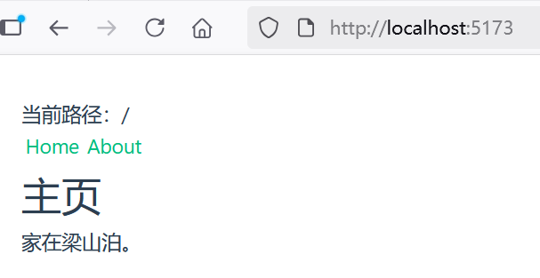


可以看到，路径`/`是处于激活状态，所以路由响应的页面是Home组件的页面。

当点击About超链接时，界面效果如下图4-2所示。

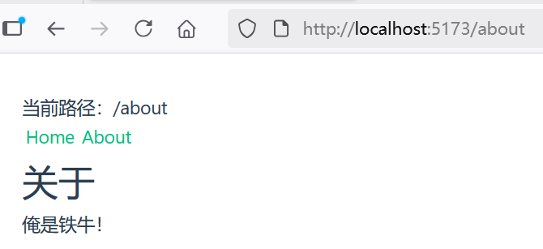


此时，路由路径`/about`处于激活状态，此时响应的是About组件的页面。


## 4.2 简单的store模式管理全局状态

### 什么是状态管理？​

理论上来说，每一个 Vue 组件实例都已经在“管理”它自己的响应式状态了。我们以示例“basic-component”为例：

```vue
<script setup lang="ts">
// 导入模板引用ref
import { ref } from 'vue'

// 使用 ref() 函数来声明响应式状态
const count = ref(0)

// 声明函数
function increment() {
  // 在 JavaScript 中需要 .value
  count.value++
}

</script>

<template>
    <button @click="increment">点击了 {{ count }} 次</button>
</template>
```


它是一个独立的单元，由以下几个部分组成：

* 状态：驱动整个应用的数据源；
* 视图：对状态的一种声明式映射；
* 交互：状态根据用户在视图中的输入而作出相应变更的可能方式。

下面是“单向数据流”这一概念的简单图示：


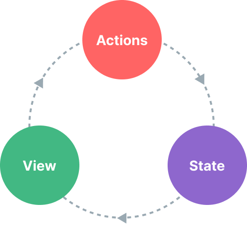


然而，当我们有多个组件共享一个共同的状态时，就没有这么简单了：

* 多个视图可能都依赖于同一份状态。
* 来自不同视图的交互也可能需要更改同一份状态。

对于情景 1，一个可行的办法是将共享状态“提升”到共同的祖先组件上去，再通过 props 传递下来。然而在深层次的组件树结构中这么做的话，很快就会使得代码变得繁琐冗长。这会导致另一个问题：Prop 逐级透传问题。

对于情景 2，我们经常发现自己会直接通过模板引用获取父/子实例，或者通过触发的事件尝试改变和同步多个状态的副本。但这些模式的健壮性都不甚理想，很容易就会导致代码难以维护。

一个更简单直接的解决方案是抽取出组件间的共享状态，放在一个全局单例中来管理。这样我们的组件树就变成了一个大的“视图”，而任何位置上的组件都可以访问其中的状态或触发动作。

通过定义和隔离状态管理中的各种概念并通过强制规则维持视图和状态间的独立性，我们的代码将会变得更结构化且易维护。


### 简单的 store 模式管理状态

用响应式 API 也能实现简单状态管理，这种方式成为​ store 模式。

如果你有一部分状态需要在多个组件实例间共享，你可以使用 reactive() 来创建一个响应式对象，并将它导入到多个组件中。我们通过一个示例“state-management-store-mode”来演示。

### 创建全局状态文件


创建一个全局状态目录`src\store`，在该目录下创建全局状态文件index.ts代码如下：


```ts
import { reactive } from 'vue'

export const store = reactive({
  count: 0,
  increment() {
    this.count++
  }
})
```


### 多个组件共享的持久化状态


在`src\components`目录下，创建组件ComponentA.vue和ComponentB.vue，并导入全局状态文件。


ComponentA.vue代码如下：


```vue
<script setup lang="ts">
import { store } from '../store/index.ts'
</script>

<template>
  <button @click="store.increment()">
    晁盖号令
  </button>
  : {{ store.count }}
</template>
```


ComponentB.vue代码如下：


```vue
<script setup lang="ts">
import { store } from '../store/index.ts'
</script>

<template>
  <button @click="store.increment()">
    宋江号令
  </button>
  : {{ store.count }}
</template>
```


现在每当 store 对象被更改时，`<ComponentA>` 与 `<ComponentB>` 都会自动更新它们的视图。任意一个导入了 store 的组件都可以随意修改它的状态。


### 根组件App.vue代码如下：


```vue
<script setup lang="ts">
import ComponentA from './components/ComponentA.vue'
import ComponentB from './components/ComponentB.vue'
</script>

<template>
  <main>
    <div>
      <ComponentA />
    </div>
    <div>
      <ComponentB />
    </div>
  </main>
</template>
```


### 运行调测

初次运行应用，可以看到界面效果如下图4-3所示。


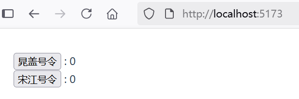


当点击“晁盖号令”按钮时，界面效果如下图4-4所示。

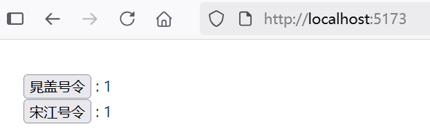

当点击“宋江号令”按钮时，界面效果如下图4-6所示。

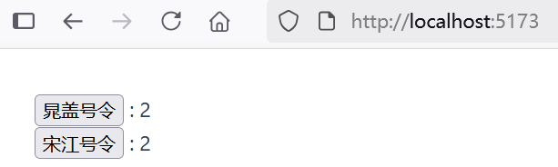


由此证实，无论哪个组件修改了 store 状态对象，其他任意导入了 store 的组件都可以会随之修改它的状态。


## 4.3 Pinia全局状态管理：复杂业务场景下的数据流治理

虽然我们的手动状态管理解决方案在简单的场景中已经足够了，但是在大规模的生产应用中还有很多其他事项需要考虑：

* 更强的团队协作约定
* 与 Vue DevTools 集成，包括时间轴、组件内部审查和时间旅行调试
* 模块热更新 (HMR)
* 服务端渲染支持

Pinia 就是一个实现了上述需求的状态管理库，由 Vue 核心团队维护，对 Vue 2 和 Vue 3 都可用。

现有用户可能对 Vuex 更熟悉，它是 Vue 之前的官方状态管理库。由于 Pinia 在生态系统中能够承担相同的职责且能做得更好，因此 Vuex 现在处于维护模式。它仍然可以工作，但不再接受新的功能。对于新的应用，建议使用 Pinia。

事实上，Pinia 最初正是为了探索 Vuex 的下一个版本而开发的，因此整合了核心团队关于 Vuex 5 的许多想法。最终，我们意识到 Pinia 已经实现了我们想要在 Vuex 5 中提供的大部分内容，因此决定将其作为新的官方推荐。

相比于 Vuex，Pinia 提供了更简洁直接的 API，并提供了组合式风格的 API，最重要的是，在使用 TypeScript 时它提供了更完善的类型推导。


### 安装Pinia


对于一个现有的使用 JavaScript 包管理器的项目，你可以从 npm registry 中安装 Pinia：


```bash
npm install pinia
```


如果你打算启动一个新项目，你可能会发现使用 create-vue 这个脚手架工具更容易，它能创建一个基于 Vite 的项目，并包含加入 Pinia 的选项。


```bash
> npm create vue@latest

> npx
> create-vue

┌  Vue.js - The Progressive JavaScript Framework
│
◇  Project name (target directory):
│  state-management-pinia
│
◆  Select features to include in your project: (↑/↓ to navigate, space to select, a to toggle all, enter to confirm)
│  ◼ TypeScript
│  ◻ JSX Support
│  ◻ Router (SPA development)
│  ◼ Pinia (state management)
│  ◻ Vitest (unit testing)
│  ◻ End-to-End Testing
│  ◻ ESLint (error prevention)
│  ◻ Prettier (code formatting)
```


如上所示，创建化一个名为“state-management-pinia”并包含了Pinia的应用作为演示。

### 创建一个 pinia 实例


修改main.ts，创建一个 pinia 实例并将其传递给应用：


```vue
import { createApp } from 'vue'
import { createPinia } from 'pinia'
import App from './App.vue'

const app = createApp(App)

// 创建一个 Pinia 实例并将其传递给应用
app.use(createPinia())

app.mount('#app')
```

pinia 实例就代表了根 store。 


### 创建全局状态文件


创建一个全局状态目录`src\stores`，在该目录下创建全局状态文件counter.ts代码如下：


```ts
import { ref } from 'vue'
import { defineStore } from 'pinia'

export const useCounterStore = defineStore('counter', () => {
  const count = ref(0)

  function increment() {
    count.value++
  }

  return { count, increment }
})
```


### 多个组件共享的持久化状态


在`src\components`目录下，创建组件ComponentA.vue和ComponentB.vue，并导入全局状态文件。


ComponentA.vue代码如下：


```vue
<script setup lang="ts">
import { useCounterStore } from '../stores/counter'
const store = useCounterStore();
</script>

<template>
  <button @click="store.increment()">
    晁盖号令
  </button>
  : {{ store.count }}
</template>
```


ComponentB.vue代码如下：


```vue
<script setup lang="ts">
import { useCounterStore } from '../stores/counter'
const store = useCounterStore();
</script>

<template>
  <button @click="store.increment()">
    宋江号令
  </button>
  : {{ store.count }}
</template>
```


现在每当 store 对象被更改时，`<ComponentA>` 与 `<ComponentB>` 都会自动更新它们的视图。任意一个导入了 store 的组件都可以随意修改它的状态。


### 根组件App.vue代码如下：


```vue
<script setup lang="ts">
import ComponentA from './components/ComponentA.vue'
import ComponentB from './components/ComponentB.vue'
</script>

<template>
  <main>
    <div>
      <ComponentA />
    </div>
    <div>
      <ComponentB />
    </div>
  </main>
</template>
```


### 运行调测

运行应用，可以看到界面效果如同4.2节类似。


## 4.4 前端工程化：让打包体积的优化秘籍

通过 create-vue（基于 Vite）搭建的项目都已经预先做好了针对生产环境的配置。当需要将应用部署到生产环境时，只需运行按照本文执行。Vite 已作为一个本地开发依赖（dev dependency）安装在你的项目中，并且你已经在 package.json 中配置好了如下的 npm scripts：

```json
"scripts": {
  "dev": "vite",
  "build": "run-p type-check \"build-only {@}\" --",
  "preview": "vite preview",
  "build-only": "vite build",
  "type-check": "vue-tsc --build"
},
```


注意，vite preview 只是用来预览本地构建产物，不能直接当生产服务器用。

### 构建应用
可以运行 npm run build 命令来执行应用的构建。

```bash
$ npm run build
```

默认情况下，构建会输出到 dist 文件夹中。你可以部署这个 dist 文件夹到任何你喜欢的平台。dist 文件夹内容如下：


```bash
dist
│  favicon.ico
│  index.html
│
└─assets
        index-BGqFjY-6.js
        index-zqIqfzzx.css
```        


### 本地测试应用


当你构建完成应用后，你可以通过运行 npm run preview 命令，在本地测试该应用。

```bash
$ npm run preview
```


vite preview 命令会在本地启动一个静态 Web 服务器，将 dist 文件夹运行在 http://localhost:4173。这样在本地环境下查看该构建产物是否正常可用就方便多了。


### 部署到Nginx

将Vue.js应用编译文件 dist 拷贝到Nginx安装目录的html目录下即可完成部署。

部署完成之后，启动Nginx服务器，可以看到界面效果如下图4-7所示。

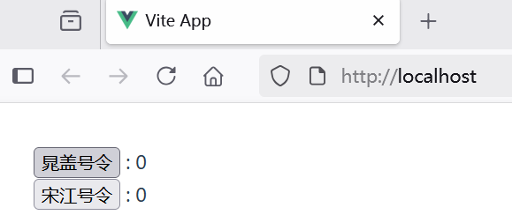


## 5.1 课程总结

* 介绍前后端分离架构解决项目的痛点
* Vue.js基础入门
  * Node.js安装
  * 加速Node.js模块下载
  * Visual Studio Code下载安装到搭建
  * 安装Vue.js，开发一个最简单的Vue应用
* Vue.js进阶组件化开发
    * 基础组件开发
    * 组件通信实战
    * 通过Props向下传递数据
    * 自定义事件向上通信
    * Provide/Inject跨层级传递
* Vue.js高级特性
    * Vue Router
    * store模式管理全局状态
    * Pinia全局状态管理
    * 前端工程化实战
