> 本页为原「Java 课程 18」全部 42 个分节的合订本；原分节链接会自动跳转到本页。


## 1.1 课程介绍

* 基于全栈角度考虑的前后端分离架构设计
* 如何使用Vue.js初始化前端项目？
* 实战用户模块全栈开发
* 实战笔记模块全栈开发
* 实战点赞模块全栈开发
* 实战评论模块全栈开发
* 实战首页模块全栈开发
* 实战后台管理模块全栈开发


## 2.1 前后端分离架构设计，构建现代化全栈开发体系

### 核心差异总结

| 特性               | 原生 JS               | Vue 3 组合式 API           |
|--------------------|-----------------------|---------------------------|
| DOM 操作方式       | 直接选择和修改        | 通过 ref 和响应式系统      |
| 状态管理           | 全局变量              | 局部响应式 ref/reactive    |
| 位置更新           | 手动调用函数          | 自动响应状态变化           |
| 代码可维护性       | 分散在多个函数中      | 集中在组件或自定义指令中   |
| 动画过渡           | 需要额外的 CSS 或 JS  | 可通过绑定样式自动处理     |

通过这些方式，你可以在 Vue 3 中实现更简洁、更易维护的功能，同时保持与原生 JS 相同的视觉效果。


## 3.1 Vue.js初始化前端项目，快速实现标准化开发准备

### 初始化仿“小红书”前端项目


在工作目录下，执行

```bash
npm create vue@latest
```

这一指令将会安装并执行 create-vue，它是 Vue 官方的项目脚手架工具。创建过程中选择 TypeScript、Router、Pinia等功能：


```bash
3>npm create vue@latest

> npx
> create-vue

T  Vue.js - The Progressive JavaScript Framework
|
o  请输入项目名称：
|  rednote-ui
|
o  请选择要包含的功能： (↑/↓ 切换，空格选择，a 全选，回车确认)
|  TypeScript, Router（单页面应用开发）, Pinia（状态管理）
|
o  选择要包含的试验特性： (↑/↓ 切换，空格选择，a 全选，回车确认)
|  none

正在初始化项目 D:\workspace\gitee\java-full-stack-engineer-system-course-video\samples\course18\ch3\rednote-ui...
|
—  项目初始化完成，可执行以下命令：

   cd rednote-ui
   npm install
   npm run dev

| 可选：使用以下命令在项目目录中初始化 Git：

   git init && git add -A && git commit -m "initial commit"
```

上面命令创建了一个名为“rednote-ui”的Vue.js项目。

### 清理项目回归纯净


#### 清理资源文件

清理`src\assets`目录下的所有资源文件。

#### 清理组件文件

清理`src\components`目录下的所有组件文件。

#### 清理全局状态文件

清理`src\stores`目录下的所有全局状态文件。

#### 修改路由文件


修改`src\router\index.ts`，内容如下：


```ts
import { createRouter, createWebHistory } from 'vue-router'
import HomeView from '../views/HomeView.vue'

const router = createRouter({
  history: createWebHistory(import.meta.env.BASE_URL),
  routes: [
    {
      path: '/',
      name: 'home',
      component: HomeView,
    }
  ],
})

export default router
```

#### 修改视图


修改`src\views\HomeView.vue`，内容如下：


```vue
<script setup lang="ts">
</script>

<template>
  <main>
    <h1>rednote-ui</h1>
  </main>
</template>
```

#### 删除视图

删除视图`src\views\AboutView.vue`

#### 修改App.vue


修改`src\App.vue`，内容如下：


```vue
<script setup lang="ts">
import { RouterLink, RouterView } from 'vue-router'
</script>

<template>
  <header>
    <div class="wrapper">
      <nav>
        <RouterLink to="/">Home</RouterLink>
      </nav>
    </div>
  </header>

  <RouterView />
</template>
```


#### 修改main.ts


修改`src\main.ts`，内容如下：


```ts
import { createApp } from 'vue'
import { createPinia } from 'pinia'

import App from './App.vue'
import router from './router'

const app = createApp(App)

app.use(createPinia())
app.use(router)

app.mount('#app')
```


#### 修改index.html

修改`index.html`引入静态资源，内容如下：

```html
<!DOCTYPE html>
<html lang="">
  <head>
    <meta charset="UTF-8">
    <link rel="icon" href="/favicon.ico">
    <meta name="viewport" content="width=device-width, initial-scale=1.0">
    <title>RN</title>
    <!-- 引入 Bootstrap CSS -->
    <link href="/css/bootstrap.min.css" rel="stylesheet">
    <!-- 引入 Font Awesome -->
    <link href="/css/font-awesome.min.css" rel="stylesheet">
    
  </head>
  <body>
    <div id="app"></div>
    <!-- Bootstrap JS -->
    <script src="/js/bootstrap.bundle.min.js"></script>

    <script type="module" src="/src/main.ts"></script>
  </body>
</html>
```

#### 使用静态资源


将原rednote项目中的`src/main/resources/static`静态资源复制到rednote-ui项目`public`目录下。


###  安装 Axios


Axios 是一个基于 Promise 的 HTTP 客户端，专为浏览器和 Node.js 设计，具有以下特性：

- 功能全面：支持 GET、POST、PUT、DELETE 等所有 HTTP 方法，提供请求/响应拦截器、取消请求、自动转换 JSON 数据等高级功能。
- Promise API：与 Vue 3 的 Composition API（如 `async/await`）完美兼容，代码简洁易读。
- 浏览器兼容性：支持 IE10+ 及现代浏览器，自动处理跨域请求和错误码。
- 社区支持：拥有庞大的社区和丰富的插件（如 `axios-retry`、`axios-mock-adapter`），问题解决效率高。

通过以下命令在项目中安装 Axios

```bash
npm install axios
```

### 启动开发服务器

在项目被创建后，通过以下步骤安装依赖并启动开发服务器：

```
cd rednote-ui
npm install
npm run dev
```

看到如下输出，则说明已经运行起来了你的第一个Vue.js项目了！

```bash
VITE v7.0.2  ready in 16458 ms

➜  Local:   http://localhost:5173/
➜  Network: use --host to expose
➜  Vue DevTools: Open http://localhost:5173/__devtools__/ as a separate window
➜  Vue DevTools: Press Alt(⌥)+Shift(⇧)+D in App to toggle the Vue DevTools
➜  press h + enter to show help
```  

项目默认运行在 `http://localhost:5173`，可以在浏览器中打开。


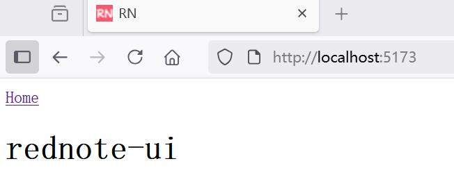


## 3.2 AI辅助编程工具成为Vue.js应用开发导师

这篇聊聊AI辅助编程工具通义灵码在Visual Studio Code中的安装，装好之后它就能当你的Vue.js开发导师。


手动安装步骤如下。

步骤1：已安装 Visual Studio Code 的情况下，在侧边导航上点击扩展。


步骤2：搜索通义灵码（TONGYI Lingma），找到通义灵码后点击安装。

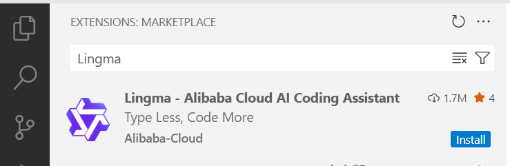


步骤3：登录阿里云账号，即刻开启智能编码之旅。通义灵码界面如下。


## 4.1 全栈视角下的用户模块前后端划分与功能全流程剖析

将仿"小红书"项目的用户模块从 Thymeleaf 后端渲染迁移到 Vue 3 前端渲染，需要对架构、交互模式和数据流向进行全面调整。以下是核心改造点和实施建议。


### 架构层面的核心变化

#### 1. 渲染模式转变
- Thymeleaf 模式：
  ```
  浏览器 → HTTP请求 → 后端控制器 → Thymeleaf模板 → HTML响应
  ```
- Vue 3 模式：
  ```
  浏览器 → 加载HTML骨架 → Vue初始化 → API请求 → 动态渲染
  ```

#### 2. 数据交互方式
- 传统方式：表单提交/页面跳转
- Vue 方式：
  ```javascript
  // 用户登录示例
  async login() {
    try {
      const { data } = await this.$axios.post('/api/users/login', {
        username: this.username,
        password: this.password
      });
      this.$store.commit('setUser', data.user);
      this.$router.push('/home');
    } catch (error) {
      this.$message.error(error.response.data.message);
    }
  }
  ```


### 渐进式迁移策略

1. 先构建 API 层：
   - 为现有用户模块开发 REST API 接口
   - 确保新旧系统可以共存

2. 组件级迁移：
   - 先迁移独立组件（如登录表单）
   - 再迁移完整页面（如个人主页、设置页面）

3. 路由过渡：
   - 逐步将 Thymeleaf 路由替换为 Vue Router
   - 使用代理服务器处理新旧路由

4. 状态管理整合：
   - 在迁移期间保持 Session 和 Token 并存
   - 确保用户在迁移过程中不会丢失会话


通过以上改造，用户模块将从后端渲染转变为前端渲染，实现更流畅的交互体验和更好的可维护性。关键是要处理好前后端分离后的状态管理、API 设计和渐进式迁移策略。


### 在 Vue 3 中实现分页序号生成

在 Vue 3 中，我们可以使用计算属性或方法来替代 Thymeleaf 的 `${#numbers.sequence(1, totalPage)}` 功能。以下是几种实现方式：


### 方法一：使用计算属性生成页码数组

```vue
<template>
  <div class="pagination">
    <button @click="prevPage" :disabled="currentPage === 1">上一页</button>
    
    <button 
      v-for="page in pageNumbers" 
      :key="page" 
      :class="{ active: page === currentPage }"
      @click="goToPage(page)"
    >
      {{ page }}
    </button>
    
    <button @click="nextPage" :disabled="currentPage === totalPage">下一页</button>
  </div>
</template>

<script setup>
import { ref, computed } from 'vue';

const currentPage = ref(1);
const totalPage = ref(10); // 从API获取或计算得到

// 计算属性生成页码数组
const pageNumbers = computed(() => {
  return Array.from({ length: totalPage.value }, (_, i) => i + 1);
});

const prevPage = () => {
  if (currentPage.value > 1) {
    currentPage.value--;
  }
};

const nextPage = () => {
  if (currentPage.value < totalPage.value) {
    currentPage.value++;
  }
};

const goToPage = (page) => {
  currentPage.value = page;
};
</script>

<style scoped>
.active {
  background-color: #007bff;
  color: white;
}
</style>
```


### 方法二：使用方法生成页码（带省略号）

```vue
<template>
  <div class="pagination">
    <button @click="prevPage" :disabled="currentPage === 1">上一页</button>
    
    <button 
      v-for="page in getDisplayedPages" 
      :key="page" 
      :class="{ active: page === currentPage }"
      @click="goToPage(page)"
    >
      {{ page === '...' ? page : page }}
    </button>
    
    <button @click="nextPage" :disabled="currentPage === totalPage">下一页</button>
  </div>
</template>

<script setup>
import { ref, computed } from 'vue';

const currentPage = ref(1);
const totalPage = ref(15); // 从API获取或计算得到
const displayRange = ref(2); // 当前页面前后显示的页数

// 生成带省略号的页码数组
const getDisplayedPages = computed(() => {
  const pages = [];
  const start = Math.max(1, currentPage.value - displayRange.value);
  const end = Math.min(totalPage.value, currentPage.value + displayRange.value);
  
  // 添加第一页
  pages.push(1);
  
  // 添加左侧省略号
  if (start > 2) {
    pages.push('...');
  }
  
  // 添加中间页码
  for (let i = start; i <= end; i++) {
    pages.push(i);
  }
  
  // 添加右侧省略号
  if (end < totalPage.value - 1) {
    pages.push('...');
  }
  
  // 添加最后一页
  if (totalPage.value > 1) {
    pages.push(totalPage.value);
  }
  
  return pages;
});

// 其他方法保持不变
</script>
```


### 方法三：封装为可复用组件

```vue
<!-- Pagination.vue -->
<template>
  <div class="pagination">
    <button @click="prevPage" :disabled="currentPage === 1">上一页</button>
    
    <button 
      v-for="page in getDisplayedPages" 
      :key="page" 
      :class="{ active: page === currentPage }"
      @click="goToPage(page)"
    >
      {{ page === '...' ? page : page }}
    </button>
    
    <button @click="nextPage" :disabled="currentPage === totalPage">下一页</button>
  </div>
</template>

<script setup>
import { ref, computed, defineProps, defineEmits } from 'vue';

const props = defineProps({
  currentPage: {
    type: Number,
    required: true
  },
  totalPage: {
    type: Number,
    required: true
  },
  displayRange: {
    type: Number,
    default: 2
  }
});

const emits = defineEmits(['page-change']);

// 生成带省略号的页码数组
const getDisplayedPages = computed(() => {
  // 实现同上一个示例
});

const prevPage = () => {
  if (props.currentPage > 1) {
    emits('page-change', props.currentPage - 1);
  }
};

const nextPage = () => {
  if (props.currentPage < props.totalPage) {
    emits('page-change', props.currentPage + 1);
  }
};

const goToPage = (page) => {
  if (page !== '...') {
    emits('page-change', page);
  }
};
</script>
```

在父组件中使用：
```vue
<template>
  <div>
    <Pagination 
      :currentPage="currentPage" 
      :totalPage="totalPage" 
      @page-change="handlePageChange" 
    />
  </div>
</template>

<script setup>
import { ref } from 'vue';
import Pagination from './components/Pagination.vue';

const currentPage = ref(1);
const totalPage = ref(10);

const handlePageChange = (page) => {
  currentPage.value = page;
  // 加载新页面的数据
  fetchData(page);
};
</script>
```


### Vue 3 与 Thymeleaf 的对比

| 功能                | Thymeleaf                          | Vue 3                          |
|---------------------|------------------------------------|--------------------------------|
| 生成页码数组        | `${#numbers.sequence(1, totalPage)}` | `Array.from({length: totalPage}, (_, i) => i + 1)` |
| 条件渲染            | `th:if`                            | `v-if`                         |
| 循环渲染            | `th:each`                          | `v-for`                        |
| 事件处理            | `th:onclick`                       | `@click`                       |
| 样式绑定            | `th:classappend`                   | `:class`                       |
| 文本绑定            | `th:text`                          | `v-text`                       |


## 4.2 全栈实战注册功能：从需求分析到接口联调的全栈开发流程

将用户注册功能从 Thymeleaf 后端渲染模式迁移到 Vue 3 前端渲染模式，需要对架构、交互流程和安全机制进行全面调整。以下是核心改造点和实施建议：


### 架构与交互模式的核心变化

#### 1. 数据流转方式

- Thymeleaf 模式：
  ```
  浏览器 → 表单提交 → 后端控制器 → 验证 → 重定向/错误页面
  ```
- Vue 3 模式：
  ```
  浏览器 → Vue表单组件 → API请求 → 后端验证 → JSON响应 → 前端处理结果
  ```

#### 2. 接口实现方式


- Thymeleaf 模式：
  * 表单提交场景（application/x-www-form-urlencoded）
  * 适用场景：传统表单提交，非 JSON 数据
  * 使用方式：@ModelAttribute + @Valid

- Vue 3 模式：
  * JSON 请求场景（application/json）
  * 适用场景：前后端分离的 REST API
  * 使用方式：@RequestBody + @Valid


### 后端接口改造


修改 AuthController.java：

```java
/**
 * 处理注册表单提交
 */
@PostMapping("/register")
/*public String processRegistrationForm(@Valid @ModelAttribute("user") UserRegistrationDto registrationDto,
                                        BindingResult bindingResult,
                                        Model model) {
    // 检查用户名是否已存在
    if (userService.existsByUsername(registrationDto.getUsername())) {
        bindingResult.rejectValue("username", null, "该用户名已被使用");
    }

    // 检查手机号是否已注册
    if (userService.existsByPhone(registrationDto.getPhone())) {
        bindingResult.rejectValue("phone", null, "该手机号已被注册");
    }

    // 检查手机验证码是否校验通过
    if (!userService.verifyCode(registrationDto.getPhone(), registrationDto.getVerificationCode())) {
        bindingResult.rejectValue("verificationCode", null, "验证码不正确");
    }

    // 检查用户名、手机号、验证码是否通过
    // 如果有错误，则返回注册页面
    if (bindingResult.hasErrors()) {
        model.addAttribute("user", registrationDto);
        return "registration-form";
    }

    // 注册用户
    userService.registerUser(registrationDto);

    // 注册成功，跳转到登录页面
    return "redirect:/auth/login";
}*/
public ResponseEntity<?> processRegistrationForm(@Valid @RequestBody UserRegistrationDto registrationDto,
                                                    BindingResult bindingResult) {
    // 检查用户名是否已存在
    if (userService.existsByUsername(registrationDto.getUsername())) {
        bindingResult.rejectValue("username", null, "该用户名已被使用");
    }

    // 检查手机号是否已注册
    if (userService.existsByPhone(registrationDto.getPhone())) {
        bindingResult.rejectValue("phone", null, "该手机号已被注册");
    }

    // 检查手机验证码是否校验通过
    if (!userService.verifyCode(registrationDto.getPhone(), registrationDto.getVerificationCode())) {
        bindingResult.rejectValue("verificationCode", null, "验证码不正确");
    }

    // 检查用户名、手机号、验证码是否通过
    // 如果有错误，则返回错误列表
    if (bindingResult.hasErrors()) {
        // 自定义错误响应
        Map<String, String> errors = new HashMap<>();
        bindingResult.getFieldErrors().forEach(error ->
                errors.put(error.getField(), error.getDefaultMessage())
        );

        return ResponseEntity.badRequest().body(errors);
    }

    // 注册用户
    userService.registerUser(registrationDto);

    // 注册成功
    return ResponseEntity.ok("用户注册成功");
}
```


### 后端安全配置调整


1. 禁用CSRF防护
2. 会话管理使用无状态会话


修改WebSecurityConfig如下：


```java
@Bean
public SecurityFilterChain filterChain(HttpSecurity http) throws Exception {
    http
            // 启用CSRF防护
            // .csrf(Customizer.withDefaults())
            // 禁用CSRF防护
            .csrf(csrf -> csrf.disable())
            .authorizeHttpRequests(authorize -> authorize
                    // 允许指定资源的请求不需要认证
                    .requestMatchers("/auth/register", "/auth/login", "/css/**", "/js/**", "/fonts/**", "/images/**", "/favicon.ico").permitAll()
                    .requestMatchers("/error/**").permitAll()
                    // 允许ADMIN角色的用户访问 /admin/** 的资源
                    .requestMatchers("/admin/**").hasRole("ADMIN")
                    // 允许ADMIN、USER角色的用户访问 /user/** 的资源
                    .requestMatchers("/user/**").hasAnyRole("ADMIN", "USER")
                    // 允许USER角色的用户访问 /note/** 的资源
                    .requestMatchers("/note/**").hasRole("USER")
                    // 允许USER角色的用户访问 /explore/** 的资源
                    .requestMatchers("/explore/**").hasRole("USER")
                    // 允许USER角色的用户访问 /like/** 的资源
                    .requestMatchers("/like/**").hasRole("USER")
                    // 允许USER角色的用户访问 /comment/** 的资源
                    .requestMatchers("/comment/**").hasRole("USER")
                    // 允许USER角色的用户访问 /log/** 的资源
                    .requestMatchers("/log/**").hasRole("USER")
                    // 允许ADMIN、USER角色的用户访问 /file/** 的资源
                    .requestMatchers("/file/**").hasAnyRole("ADMIN", "USER")
                    // 其他请求需求认证
                    .anyRequest().authenticated()
            )
            .formLogin(form -> form
                    // 指定登录页面
                    .loginPage("/auth/login")
                    // 指定执行登录的地址
                    .loginProcessingUrl("/auth/login")
                    // 自定义失败处理器
                    .failureHandler(authenticationFailureHandler())
                    // 指定登录成功后跳转的页面
                    .defaultSuccessUrl("/")
                    .permitAll()
            )
            // 异常处理
            .exceptionHandling(exception -> exception
                    // 指定403错误页面
                    .accessDeniedPage("/error/403")
            )
            // 会话管理
            /*.sessionManagement(session -> session
                    // 会话创建策略
                    .sessionCreationPolicy(SessionCreationPolicy.IF_REQUIRED)
                    // 访问无效会话时，重定向到指定URL
                    .invalidSessionUrl("/auth/login?error=" + SESSION_INVALID)
                    // 同一用户最大会话数
                    .maximumSessions(1)
                    // 访问过期会话时，重定向到指定URL
                    .expiredUrl("/auth/login?error=" + SESSION_EXPIRED)
                    // false表示允许新登录，踢掉旧会话，旧会话会过期
                    .maxSessionsPreventsLogin(false)
                    // 会话注册表
                    .sessionRegistry(sessionRegistry())
            )*/
            // 无状态会话
            .sessionManagement(session -> session
                    .sessionCreationPolicy(SessionCreationPolicy.STATELESS)
            )
            // 注销
            .logout(logout -> logout
                    // 清理会话
                    .invalidateHttpSession( true)
                    // 清理认证信息
                    .clearAuthentication(true)
                    // 用户访问此URL时，交由Spring Security处理注销逻辑
                    .logoutUrl("/logout")
                    // 注销成功后，重定向到指定URL
                    .logoutSuccessUrl("/auth/login?error=" + LOGOUT)
                    // 删除会话Cookie
                    .deleteCookies("JSESSIONID")

            )
            // 记住我
            .rememberMe(rememberMe -> rememberMe
                    // 设置记住我令牌的有效期（秒），默认是2周。以下设置1周
                    .tokenValiditySeconds(60 * 60 * 24 * 7)
                    // 设置用于签名令牌的密钥
                    .key("rnRememberMeKey")
            )
    ;

    return http.build();
}

// ...为节约篇幅，此处省略非核心内容

/*@Bean
public SessionRegistry sessionRegistry() {
    return new SessionRegistryImpl();
}*/
```


## 4.3 AI辅助编程快速实现注册页面及与后端API联调

### 前端新增错误验证接口类似


新建`src\errors\api-validation-error.ts`，代码如下：

```ts
export interface ApiValidationError {
  [field: string]: string;
}
```

### 前端新增注册表单组件


新建 `src\views\RegistrationForm.vue`，相关代码可以从后端应用的`src/main/resources/templates/registration-form.html`拷贝过来进行微调即可。调整后代码如下：

```vue
<script setup lang="ts">
import type { ApiValidationError } from '@/errors/api-validation-error'
import { ref, onUnmounted } from 'vue'
import axios, { AxiosError } from 'axios'
import { useRouter } from 'vue-router'

const form = ref({
  username: '',
  phone: '',
  verificationCode: '',
  password: ''
})

// 错误信息使用ApiValidationError类型
const errors = ref<ApiValidationError>({})

// 获取router实例
const router = useRouter()

// 注册逻辑
const handleRegister = async () => {
  // 重置错误信息
  errors.value = {}

  try {
    // 发送注册请求
    await axios.post('/api/auth/register', form.value)

    // 提示注册成功
    alert('注册成功，请登录')

    // 重置错误信息
    errors.value = {}

    // 跳转到登录页面
    router.push({ name: 'login' })
  } catch (error) {
    // 验证码发送失败
    if (error instanceof AxiosError) {
      // 获取错误信息
      const axiosError = error as AxiosError<ApiValidationError>
      if (axiosError.response?.status === 400 && axiosError.response.data) {
        // 绑定后端返回的错误信息到errors上
        errors.value = axiosError.response.data
      }
    }
  }
}

// 验证码倒计时相关状态
const countdown = ref(60)
const timer = ref<number | null>(null)
const isCounting = ref(false)

// 获取验证码倒计时函数
const startCountdown = () => {
  if (countdown.value === 60 && !isCounting.value) {
    isCounting.value = true
    timer.value = window.setInterval(() => {
      countdown.value--
      if (countdown.value === 0) {
        clearInterval(timer.value!)
        countdown.value = 60
        isCounting.value = false
      }
    }, 1000)
  }
}

// 组件卸载时清理定时器
onUnmounted(() => {
  if (timer.value) {
    clearInterval(timer.value)
  }
})

</script>
<template>
  <div class="container align-items-center min-vh-100 py-4">
    <div class="form-container">
      <!-- Logo -->
      <div class="logo">
        
      </div>

      <!-- 表单标题 -->
      <h2 class="form-title">欢迎注册RN</h2>

      <!-- 注册表单 -->
      <form id="registrationForm" method="post" @submit.prevent="handleRegister">
        <!-- 用户名输入框 -->
        <div class="mb-3">
          <input type="text" class="form-control" id="username" name="username" v-model="form.username"
            placeholder="请设置用户名" required>
          <div class="error-message" id="usernameError" v-if="errors.username">{{ errors.username }}</div>
        </div>

        <!-- 手机号输入框 -->
        <div class="mb-3">
          <input type="text" class="form-control" id="phone" name="phone" v-model="form.phone" placeholder="请输入手机号"
            required>
          <div class="error-message" id="phoneError" v-if="errors.phone">{{ errors.phone }}</div>
        </div>

        <!-- 验证码输入框 -->
        <div class="mb-3">
          <div class="input-group">
            <input type="text" class="form-control" id="verificationCode" name="verificationCode"
              v-model="form.verificationCode" placeholder="请输入验证码" required>
            <button type="button" class="btn btn-outline-secondary" id="getCodeBtn" @click="startCountdown"
              :disabled="isCounting">
              {{ isCounting ? countdown + '秒后重新获取' : '获取验证码' }}
            </button>
          </div>
          <div class="error-message" id="verificationCodeError" v-if="errors.verificationCode">{{
            errors.verificationCode }}</div>
        </div>

        <!-- 密码输入框 -->
        <div class="mb-3">
          <input type="password" class="form-control" id="password" name="password" v-model="form.password"
            placeholder="请设置密码" required>
          <div class="error-message" id="passwordError" v-if="errors.password">{{ errors.password }}</div>
        </div>

        <!--注册按钮 -->
        <button class="btn btn-primary w-100" type="submit">立即注册</button>
      </form>

      <!-- 已有账号 -->
      <div class="form-footer">
        已有账号？ <a href="/auth/login">立即登录</a>
      </div>

      <!-- 其他登录方式 -->
      <div class=" divider">
          <span>其他登录方式</span>
      </div>

      <!-- 社交登录 -->
      <div class="social-login">
        <a href="#" class="social-btn">
          <i class="fa fa-weixin"></i>
        </a>
        <a href="#" class="social-btn">
          <i class="fa fa-weibo"></i>
        </a>
        <a href="#" class="social-btn">
          <i class="fa fa-qq"></i>
        </a>
      </div>

      <!-- 用户协议、隐藏政策 -->
      <div class="policy">
        注册即表示同意<a href="#">用户协议</a>和<a href="#">隐藏政策</a>
      </div>
    </div>
  </div>
</template>
<style setup>
body {
  background-color: #fef6f6;
  font-family: -apple-system, BlinkMacSystemFont, "Segoe UI", Roboto, Helvetica, Arial, sans-serif;
}

.form-container {
  background-color: white;
  border-radius: 16px;
  box-shadow: 0 4px 20px rgba(0, 0, 0, 0.05);
  padding: 32px;
  max-width: 400px;
  margin: 0 auto;
}

.logo {
  text-align: center;
  margin-bottom: 32px;
}

.logo img {
  width: 64px;
  height: 64px;
}

.form-title {
  font-size: 24px;
  font-weight: 700;
  color: #333;
  margin-bottom: 24px;
  text-align: center;
}

.form-control {
  border-radius: 12px;
  border: 1px solid #e8e8e8;
  padding: 12px 16px;
  height: auto;
  font-size: 14px;
}

.form-control:focus {
  border-color: #ff2442;
  box-shadow: 0 0 0 2px rgba(255, 36, 66, 0.1);
}

.btn-primary {
  background-color: #ff2442;
  border-color: #ff2442;
  border-radius: 12px;
  padding: 12px;
  font-size: 16px;
  font-weight: 600;
  transition: all 0.3s ease;
}

.btn-primary:hover,
.btn-primary:focus {
  background-color: #e61e3a;
  border-color: #e61e3a;
  box-shadow: 0 4px 12px rgba(255, 36, 66, 0.2);
}

.btn-outline-secondary {
  border-radius: 12px;
  padding: 12px;
  font-size: 14px;
  color: #666;
  border-color: #e8e8e8;
}

.btn-outline-secondary:hover {
  background-color: #f8f8f8;
  border-color: #ddd;
}

.form-footer {
  text-align: center;
  margin-top: 24px;
  font-size: 14px;
  color: #666;
}

.form-footer a {
  color: #ff2442;
  text-decoration: none;
}

.form-footer a:hover {
  text-decoration: underline;
}

.divider {
  display: flex;
  align-items: center;
  margin: 24px 0;
  color: #999;
  font-size: 14px;
}

.divider::before,
.divider::after {
  content: '';
  flex: 1;
  border-bottom: 1px solid #e8e8e8;
}

.divider::before {
  margin-right: 16px;
}

.divider::after {
  margin-left: 16px;
}

.social-login {
  display: flex;
  justify-content: center;
  gap: 24px;
  margin-top: 24px;
}

.social-btn {
  width: 48px;
  height: 48px;
  border-radius: 50%;
  display: flex;
  align-items: center;
  justify-content: center;
  border: 1px solid #e8e8e8;
  transition: all 0.3s ease;
}

.social-btn:hover {
  background-color: #f8f8f8;
  transform: translateY(-2px);
}

.social-btn i {
  font-size: 20px;
  color: #666;
}

.policy {
  font-size: 12px;
  color: #999;
  text-align: center;
  margin-top: 16px;
}

.policy a {
  color: #999;
  text-decoration: underline;
}

.error-message {
  color: #ff2442;
  font-size: 12px;
  margin-top: 4px;
  /* display: none; */
}
</style>
```


### 设置反向代理


```ts
// 设置反向代理
server: {
  host: 'localhost',
  port: 5173, // Vue开发端口
  proxy: {
    '/api': {
      // 指向Spring Boot后端地址（假设后端运行在8080端口）
      target: 'http://localhost:8080',
      changeOrigin: true,
      rewrite: (path) => path.replace(/^\/api/, '')
    }
  }
}
```

配置说明

* `/api`：代理路径前缀，前端请求以`/api`开头的 URL 会被转发
* target：Spring Boot 后端的基础地址
* changeOrigin：设置为 true 以支持跨域请求
* rewrite：去除 URL 中的`/api`前缀，确保后端正确接收路径

### 修改路由


修改路由文件`src\router\index.ts`，内容如下：


```ts
import { createRouter, createWebHistory } from 'vue-router'
import HomeView from '../views/HomeView.vue'

const router = createRouter({
  history: createWebHistory(import.meta.env.BASE_URL),
  routes: [
    {
      path: '/',
      name: 'home',
      component: HomeView,
    },
    {
      path: '/auth/register',
      name: 'register',
      // 当访问该路径时，它被延迟加载
      component: () => import('../views/RegistrationForm.vue'),
    },
  ],
})

export default router
```

### 修改App.vue

修改`src\App.vue`文件，删除`<header>`，内容如下：


```ts
<script setup lang="ts">
import { RouterLink, RouterView } from 'vue-router'
</script>

<template>
  <!--
  <header>
    <div class="wrapper">
      <nav>
        <RouterLink to="/">Home</RouterLink>
      </nav>
    </div>
  </header>
  -->
  <RouterView />
</template>
```


### 运行调测

运行应用执行注册，注册失败界面效果如下图4-1所示。


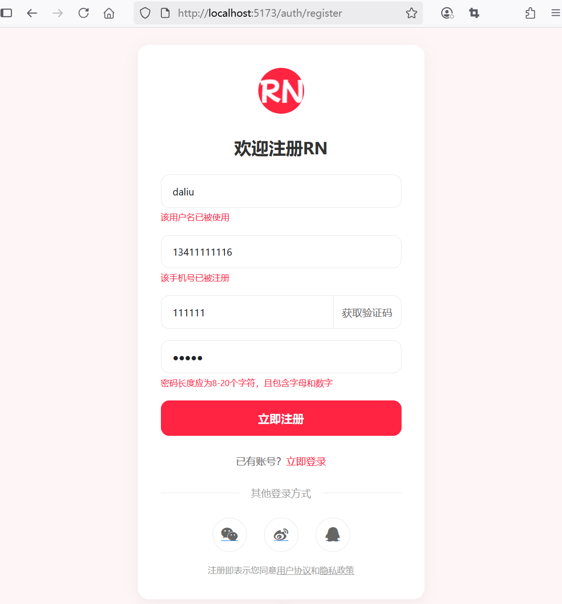


注册成功界面效果如下图4-2所示。


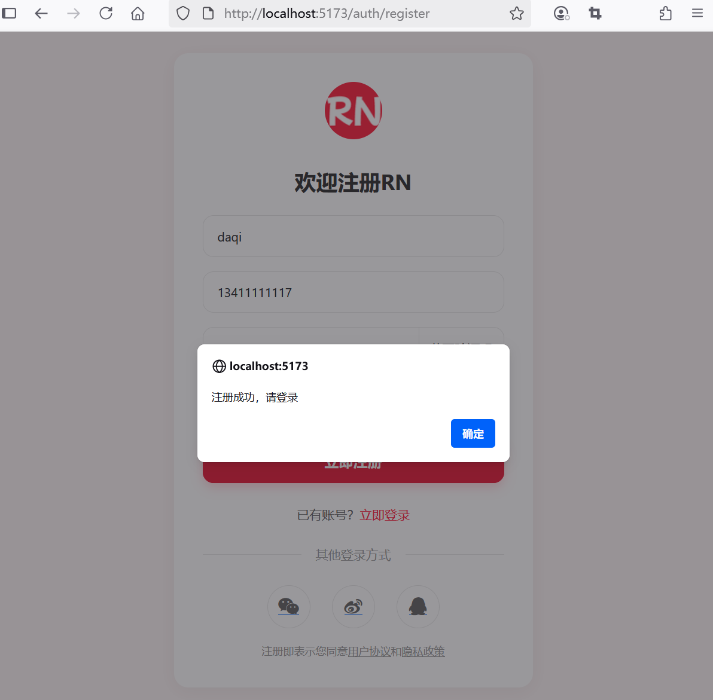


通过以上改造，用户注册功能将从后端渲染转变为前端渲染，实现更流畅的交互体验和更好的可维护性。关键是要处理好前后端分离后的安全机制、表单验证和用户体验优化。


## 4.4 全栈实战登录功能：密码加密与 Token 认证的攻防实战

将用户登录功能从 Thymeleaf 后端渲染模式迁移到 Vue 3 前端渲染模式，需要对架构、交互流程和安全机制进行全面调整。以下是核心改造点和实施建议。


### 一、架构与交互模式的核心变化

#### 1. 数据流转方式
- Thymeleaf 模式：
  ```
  浏览器 → 表单提交 → 后端控制器 → 验证 → Session 存储 → 重定向到主页
  ```
- Vue 3 模式：
  ```
  浏览器 → Vue 组件 → API 请求 → 后端验证 → JWT/会话令牌 → 前端存储 → 路由跳转
  ```

#### 2. 安全机制调整
- CSRF 防护：
  - Thymeleaf：自动注入 CSRF 令牌到表单
  - Vue 3：禁用 CSRF 令牌
- 认证方式：
  - Thymeleaf：基于 Session/Cookie
  - Vue 3：推荐 JWT（JSON Web Token）或增强的 Session 机制


### 后端接口改造


修改 AuthController.java：

```java
import com.example.rednote.config.JwtTokenProvider;
import org.springframework.security.authentication.AuthenticationManager;

// ...为节约篇幅，此处省略非核心内容

@Autowired
private JwtTokenProvider jwtTokenProvider;

@Autowired
private AuthenticationManager authenticationManager;

// ...为节约篇幅，此处省略非核心内容

/**
 * 处理登录表单的提交
 */
@PostMapping("/login")
/*public String processLoginForm(@Valid @ModelAttribute("user") UserLoginDto loginDto,
                                BindingResult bindingResult,
                                Model model) {
    // 检查用户名是否存在
    if (!userService.existsByUsername(loginDto.getUsername())) {
        bindingResult.rejectValue("username", null, "该用户名未注册");

        model.addAttribute("user", loginDto);
        return "login-form";
    }

    // 检查密码是否正确
    if (!userService.verifyPassword(loginDto.getUsername(), loginDto.getPassword())) {
        bindingResult.rejectValue("password", null, "密码错误");

        model.addAttribute("user", loginDto);
        return "login-form";
    }

    // 登录成功，重定向到首页或
    return "redirect:/";
}*/
public ResponseEntity<?> processLoginForm(@Valid @RequestBody UserLoginDto loginDto,
                                BindingResult bindingResult) {
    // 检查用户名是否存在
    if (!userService.existsByUsername(loginDto.getUsername())) {
        bindingResult.rejectValue("username", null, "该用户名未注册");

        // 自定义错误响应
        Map<String, String> errors = new HashMap<>();
        bindingResult.getFieldErrors().forEach(error ->
                errors.put(error.getField(), error.getDefaultMessage())
        );
        return ResponseEntity.badRequest().body(errors);
    }

    // 检查密码是否正确
    if (!userService.verifyPassword(loginDto.getUsername(), loginDto.getPassword())) {
        bindingResult.rejectValue("password", null, "密码错误");

        // 自定义错误响应
        Map<String, String> errors = new HashMap<>();
        bindingResult.getFieldErrors().forEach(error ->
                errors.put(error.getField(), error.getDefaultMessage())
        );
        return ResponseEntity.badRequest().body(errors);
    }

    // 获取认证用户
    Authentication authentication = authenticationManager.authenticate(
            new UsernamePasswordAuthenticationToken(
                    loginDto.getUsername(),
                    loginDto.getPassword()
            )
    );

    // 校验成功，生成JWT
    String jwt = jwtTokenProvider.generateToken(authentication);

    // 返回响应
    return ResponseEntity.ok(jwt);
}
```


### 后端安全配置调整


1. 取消.formLogin()
2. 取消.rememberMe()
3. 取消.logout()
4. 启用 JWT 认证过滤器
5. 配置 AuthenticationManager Bean

修改WebSecurityConfig如下：


```java
import org.springframework.security.authentication.AuthenticationManager;

// ...为节约篇幅，此处省略非核心内容

@Bean
public SecurityFilterChain filterChain(HttpSecurity http) throws Exception {
    http
            // ...为节约篇幅，此处省略非核心内容

            /*.formLogin(form -> form
                    // 指定登录页面
                    .loginPage("/auth/login")
                    // 指定执行登录的地址
                    .loginProcessingUrl("/auth/login")
                    // 自定义失败处理器
                    .failureHandler(authenticationFailureHandler())
                    // 指定登录成功后跳转的页面
                    .defaultSuccessUrl("/")
                    .permitAll()
            )*/

            // ...为节约篇幅，此处省略非核心内容

            // 注销
            /*.logout(logout -> logout
                    // 清理会话
                    .invalidateHttpSession( true)
                    // 清理认证信息
                    .clearAuthentication(true)
                    // 用户访问此URL时，交由Spring Security处理注销逻辑
                    .logoutUrl("/logout")
                    // 注销成功后，重定向到指定URL
                    .logoutSuccessUrl("/auth/login?error=" + LOGOUT)
                    // 删除会话Cookie
                    .deleteCookies("JSESSIONID")

            )*/
            // 记住我
            /*.rememberMe(rememberMe -> rememberMe
                    // 设置记住我令牌的有效期（秒），默认是2周。以下设置1周
                    .tokenValiditySeconds(60 * 60 * 24 * 7)
                    // 设置用于签名令牌的密钥
                    .key("rnRememberMeKey")
            )*/
            // 启用JWT认证过滤器
            .addFilterBefore(jwtAuthenticationFilter(), UsernamePasswordAuthenticationFilter.class)
    ;

    return http.build();
}

// ...为节约篇幅，此处省略非核心内容

@Bean
public JwtAuthenticationFilter jwtAuthenticationFilter() {
    return new JwtAuthenticationFilter();
}

@Bean
public AuthenticationManager authenticationManager(AuthenticationConfiguration authenticationConfiguration) throws Exception {
    return authenticationConfiguration.getAuthenticationManager();
}
```


### JWT 认证实现


添加 JJWT (Java JWT) 库的依赖。`Jwts` 类是 JJWT 库的核心类，用于创建、解析和验证 JWT 令牌。以下是解决方案。


#### 1. Maven 项目

在 `pom.xml` 中添加：


```xml
<properties>
    <java.version>24</java.version>
    <jsonwebtoken.version>0.13.0</jsonwebtoken.version>
</properties>

<!-- ...为节约篇幅，此处省略非核心内容 -->

<dependency>
    <groupId>io.jsonwebtoken</groupId>
    <artifactId>jjwt-api</artifactId>
    <version>${jsonwebtoken.version}</version>
</dependency>
<dependency>
    <groupId>io.jsonwebtoken</groupId>
    <artifactId>jjwt-impl</artifactId>
    <version>${jsonwebtoken.version}</version>
    <scope>runtime</scope>
</dependency>
<dependency>
    <groupId>io.jsonwebtoken</groupId>
    <artifactId>jjwt-jackson</artifactId>
    <version>${jsonwebtoken.version}</version>
    <scope>runtime</scope>
</dependency>
```


#### 2. JWT 工具类

新建`src/main/java/com/example/rednote/config/JwtTokenProvider.java`：

```java
package com.example.rednote.config;

import io.jsonwebtoken.Jwts;
import io.jsonwebtoken.SignatureAlgorithm;
import org.slf4j.Logger;
import org.slf4j.LoggerFactory;
import org.springframework.beans.factory.annotation.Value;
import org.springframework.security.core.Authentication;
import org.springframework.security.core.userdetails.UserDetails;
import org.springframework.stereotype.Component;

import java.util.Date;

/**
 * JwtTokenProvider JWT工具类
 *
 * @version 2025/09/08
 **/
@Component
public class JwtTokenProvider {
    private static final Logger log = LoggerFactory.getLogger(JwtTokenProvider.class);

    @Value("${app.jwtSecret}")
    private String jwtSecret;

    @Value("${app.jwtExpirationMs}")
    private long jwtExpirationMs;

    /**
     * 生成JWT
     *
     * @param authentication
     * @return
     */
    public String generateToken(Authentication authentication) {
        UserDetails userDetails = (UserDetails) authentication.getPrincipal();

        return Jwts.builder()
                .setSubject(userDetails.getUsername())
                .setIssuedAt(new Date())
                .setExpiration(new Date(new Date().getTime() + jwtExpirationMs))
                .signWith(SignatureAlgorithm.HS256, jwtSecret)
                .compact();
    }

    /**
     * 从JWT中获取用户名
     *
     * @param token
     * @return
     */
    public String getUsernameFromJwtToken(String token) {
        return Jwts.parser()
                .setSigningKey(jwtSecret)
                .build()
                .parseClaimsJws(token)
                .getBody()
                .getSubject();
    }

    /**
     * 验证JWT
     *
     * @param authToken
     * @return
     */
    public boolean validateJwtToken(String authToken) {
        try {
            Jwts.parser()
                    .setSigningKey(jwtSecret)
                    .build()
                    .parseClaimsJws(authToken);

            return true;
        } catch (Exception e) {
            log.error("Invalid JWT token: {}", e.getMessage());
        }

        return false;
    }
}
```

#### 3. JWT 认证过滤器


新建`src/main/java/com/example/rednote/config/JwtAuthenticationFilter.java`：


```java
package com.example.rednote.config;

import jakarta.servlet.FilterChain;
import jakarta.servlet.ServletException;
import jakarta.servlet.http.HttpServletRequest;
import jakarta.servlet.http.HttpServletResponse;
import org.springframework.beans.factory.annotation.Autowired;
import org.springframework.security.authentication.UsernamePasswordAuthenticationToken;
import org.springframework.security.core.context.SecurityContextHolder;
import org.springframework.security.core.userdetails.UserDetails;
import org.springframework.security.core.userdetails.UserDetailsService;
import org.springframework.security.web.authentication.WebAuthenticationDetailsSource;
import org.springframework.web.filter.OncePerRequestFilter;

import java.io.IOException;

/**
 * JwtAuthenticationFilter JWT认证过滤器
 *
 * @version 2025/09/08
 **/
public class JwtAuthenticationFilter extends OncePerRequestFilter {
    @Autowired
    private JwtTokenProvider jwtTokenProvider;

    @Autowired
    private UserDetailsService userDetailsService;

    @Override
    protected void doFilterInternal(HttpServletRequest request, HttpServletResponse response, FilterChain filterChain)
            throws ServletException, IOException {
        // 从请求头中获取JWT
        String jwt = getJwtFromRequest(request);
        if (jwt != null && jwtTokenProvider.validateJwtToken(jwt)) {
            // 从JWT中获取用户名
            String username = jwtTokenProvider.getUsernameFromJwtToken(jwt);

            // 从用户名中获取用户详情
            UserDetails userDetails = userDetailsService.loadUserByUsername(username);

            // 创建一个已认证的Authentication对象
            UsernamePasswordAuthenticationToken authentication = new UsernamePasswordAuthenticationToken(
                    userDetails, null, userDetails.getAuthorities()
            );
            authentication.setDetails(new WebAuthenticationDetailsSource().buildDetails(request));

            // 设置已认证的Authentication对象到SecurityContextHolder中
            SecurityContextHolder.getContext().setAuthentication(authentication);
        }

        filterChain.doFilter(request, response);
    }

    /**
     * 从请求头中获取JWT
     */
    private String getJwtFromRequest(HttpServletRequest request) {
        String bearerToken = request.getHeader("Authorization");
        if (bearerToken != null && bearerToken.startsWith("Bearer ")) {
            return bearerToken.substring(7);
        }

        return null;
    }
}
```


#### 4. 配置文件


在 `application.properties` 中添加 JWT 配置：

```properties
# 配置 JWT
## 你的Base64编码密钥（至少256位）
app.jwtSecret=bQUBj9U7io0VXuhlaC9XmeaSGSwkqOlG4itHzIgUvOk=
## 24小时
app.jwtExpirationMs=86400000
```

生成 Base64 密钥的方法：

```java
package com.example.rednote;

import io.jsonwebtoken.security.Keys;

import java.util.Base64;

/**
 * JwtSecretGenerator 生成Base64密钥
 *
 * @version 2025/09/08
 **/
public class JwtSecretGenerator {
    public static void main(String[] args) {
        String secret = Base64.getEncoder().encodeToString(
                Keys.secretKeyFor(io.jsonwebtoken.SignatureAlgorithm.HS256).getEncoded()
        );
        System.out.println(secret);
    }
}
```


## 4.5 AI辅助编程快速实现登录页面及与后端API联调

### 前端新增登录表单组件


新建 `src\views\LoginForm.vue`，相关代码可以从后端应用的`src/main/resources/templates/login-form.html`拷贝过来进行微调即可调整后代码如下：


```vue
<script setup lang="ts">
import type { ApiValidationError } from '@/errors/api-validation-error'
import { ref } from 'vue'
import axios, { AxiosError } from 'axios'
import { useRouter } from 'vue-router'

const form = ref({
  username: '',
  password: ''
})

// 错误信息使用ApiValidationError类型
const errors = ref<ApiValidationError>({})

// 获取router实例
const router = useRouter()

// 登录逻辑
const handleLogin = async () => {
  // 重置错误信息
  errors.value = {}

  try {
    // 发送登录请求
    const response = await axios.post('/api/auth/login', form.value)

    // 存储JWT到localStorage中
    localStorage.setItem('token', response.data)

    // 重置错误信息
    errors.value = {}

    // 跳转到主页页面
    router.push({ name: 'home' })
  } catch (error) {
    // 登录失败
    if (error instanceof AxiosError) {
      // 获取错误信息
      const axiosError = error as AxiosError<ApiValidationError>
      if (axiosError.response?.status === 400 && axiosError.response.data) {
        // 绑定后端返回的错误信息到errors上
        errors.value = axiosError.response.data
      }
    }
  }
}

const showPassword = ref(false)

</script>
<template>
  <div class="container align-items-center min-vh-100 py-4">
    <div class="form-container">
      <!-- Logo -->
      <div class="logo">
        
      </div>

      <!-- 表单标题 -->
      <h2 class="form-title">欢迎登录RN</h2>

      <!-- 注册表单 -->
      <form id="loginForm" method="post" @submit.prevent="handleLogin">
        <!-- 用户名输入框 -->
        <div class="mb-3">
          <input type="text" class="form-control" id="username" name="username" v-model="form.username"
            placeholder="请输入用户名" required>
          <div class="error-message" id="usernameError" v-if="errors.username">{{ errors.username }}</div>
        </div>

        <!-- 密码输入框 -->
        <div class="mb-3">
          <div class="input-group">
            <input :type="showPassword ? 'text' : 'password'" class="form-control" id="password" name="password"
              v-model="form.password" placeholder="请设置密码" required>
            <!-- 切换密码显示模式 -->
            <button type="button" class="btn btn-outline-secondary" id="togglePassword"
              @click="showPassword = !showPassword">
              <i :class="showPassword ? 'fa fa-eye' : 'fa fa-eye-slash'"></i>
            </button>
          </div>

          <div class="error-message" id="passwordError" v-if="errors.password">{{ errors.password }}</div>
        </div>

        <!-- 记住我 -->
        <div class="form-check mb-3">
          <input type="checkbox" class="form-check-input" id="rememberMe" name="remember-me">
          <label class="form-check-label" for="rememberMe">记住我</label>
        </div>

        <!--登录按钮 -->
        <button class="btn btn-primary w-100" type="submit">登录</button>
      </form>


    </div>
    <!-- 忘记密码 -->
    <div class="form-footer">
      <a href="#">忘记密码</a>
    </div>

    <!-- 其他登录方式 -->
    <div class="divider">
      <span>其他登录方式</span>
    </div>

    <!-- 社交登录 -->
    <div class="social-login">
      <a href="#" class="social-btn">
        <i class="fa fa-weixin"></i>
      </a>
      <a href="#" class="social-btn">
        <i class="fa fa-weibo"></i>
      </a>
      <a href="#" class="social-btn">
        <i class="fa fa-qq"></i>
      </a>
    </div>

    <!-- 注册链接 -->
    <div class="form-footer">
      还没有账号？ <a href="/auth/register">立即注册</a>
    </div>

    <!-- 用户协议、隐藏政策 -->
    <div class="policy">
      注册即表示同意<a href="#">用户协议</a>和<a href="#">隐藏政策</a>
    </div>
  </div>
</template>
<style setup>
body {
  background-color: #fef6f6;
  font-family: -apple-system, BlinkMacSystemFont, "Segoe UI", Roboto, Helvetica, Arial, sans-serif;
}

.form-container {
  background-color: white;
  border-radius: 16px;
  box-shadow: 0 4px 20px rgba(0, 0, 0, 0.05);
  padding: 32px;
  max-width: 400px;
  margin: 0 auto;
}

.logo {
  text-align: center;
  margin-bottom: 32px;
}

.logo img {
  width: 64px;
  height: 64px;
}

.form-title {
  font-size: 24px;
  font-weight: 700;
  color: #333;
  margin-bottom: 24px;
  text-align: center;
}

.form-control {
  border-radius: 12px;
  border: 1px solid #e8e8e8;
  padding: 12px 16px;
  height: auto;
  font-size: 14px;
}

.form-control:focus {
  border-color: #ff2442;
  box-shadow: 0 0 0 2px rgba(255, 36, 66, 0.1);
}

.btn-primary {
  background-color: #ff2442;
  border-color: #ff2442;
  border-radius: 12px;
  padding: 12px;
  font-size: 16px;
  font-weight: 600;
  transition: all 0.3s ease;
}

.btn-primary:hover,
.btn-primary:focus {
  background-color: #e61e3a;
  border-color: #e61e3a;
  box-shadow: 0 4px 12px rgba(255, 36, 66, 0.2);
}

.btn-outline-secondary {
  border-radius: 12px;
  padding: 12px;
  font-size: 14px;
  color: #666;
  border-color: #e8e8e8;
}

.btn-outline-secondary:hover {
  background-color: #f8f8f8;
  border-color: #ddd;
}

.form-footer {
  text-align: center;
  margin-top: 24px;
  font-size: 14px;
  color: #666;
}

.form-footer a {
  color: #ff2442;
  text-decoration: none;
}

.form-footer a:hover {
  text-decoration: underline;
}

.divider {
  display: flex;
  align-items: center;
  margin: 24px 0;
  color: #999;
  font-size: 14px;
}

.divider::before,
.divider::after {
  content: '';
  flex: 1;
  border-bottom: 1px solid #e8e8e8;
}

.divider::before {
  margin-right: 16px;
}

.divider::after {
  margin-left: 16px;
}

.social-login {
  display: flex;
  justify-content: center;
  gap: 24px;
  margin-top: 24px;
}

.social-btn {
  width: 48px;
  height: 48px;
  border-radius: 50%;
  display: flex;
  align-items: center;
  justify-content: center;
  border: 1px solid #e8e8e8;
  transition: all 0.3s ease;
}

.social-btn:hover {
  background-color: #f8f8f8;
  transform: translateY(-2px);
}

.social-btn i {
  font-size: 20px;
  color: #666;
}

.policy {
  font-size: 12px;
  color: #999;
  text-align: center;
  margin-top: 16px;
}

.policy a {
  color: #999;
  text-decoration: underline;
}

.error-message {
  color: #ff2442;
  font-size: 12px;
  margin-top: 4px;
  /* display: none; */
}
</style>
```


### 修改路由


修改路由文件`src\router\index.ts`，内容如下：


```ts
import { createRouter, createWebHistory } from 'vue-router'
import HomeView from '../views/HomeView.vue'

const router = createRouter({
  history: createWebHistory(import.meta.env.BASE_URL),
  routes: [
    // ...为节约篇幅，此处省略非核心内容
    ,
    {
      path: '/auth/login',
      name: 'login',
      component: () => import('../views/LoginForm.vue'),
    },
  ],
})

export default router
```


### 运行调测

运行应用执行登录，登录失败界面效果如下图4-3所示。


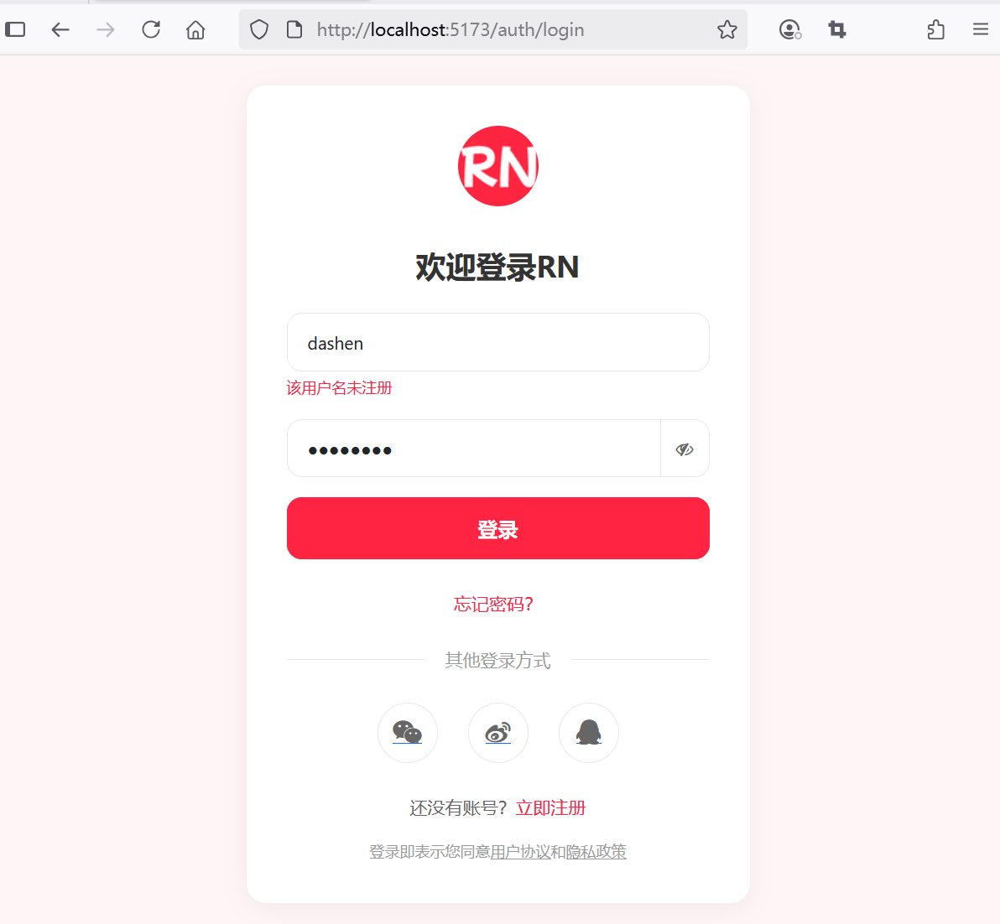


登录成功界面效果如下图4-4所示。


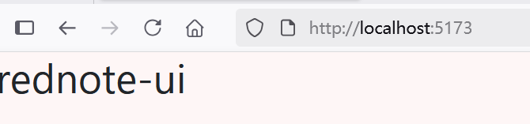


通过以上改造，用户登录功能将从后端渲染转变为前端渲染，实现更流畅的交互体验和更好的可维护性。关键是要处理好前后端分离后的安全机制、状态管理和用户体验优化。


## 4.6 前端全局认证状态管理与路由守卫

### 后端接口改造


UserController 接口改造如下：

```java
@GetMapping("/profile")
/*public String profile(Model model) {
    // 获取当前用户信息
    User user = userService.getCurrentUser();

    *//*model.addAttribute("user", user);

    return "user-profile";*//*

    // 重定向
    return "redirect:/user/profile/" + user.getUserId();
}*/
public ResponseEntity<User> profile() {
    // 获取当前用户信息
    User user = userService.getCurrentUser();

    return ResponseEntity.ok(user);
}
```


### 使用 Pinia 管理认证状态

新建认证状态管理文件`src\stores\auth.ts`：

```ts
import { defineStore } from "pinia"
import { useRouter } from "vue-router"
import axios from "axios"

export const useAuthStore = defineStore("auth", {
  state: () => ({
    user: null,
    token: localStorage.getItem("token") || null,
    isAuthenticated: false,
  }),
  getters: {
    getUser: (state) => state.user,
    getToken: (state) => state.token,
    getIsAuthenticated: (state) => state.isAuthenticated,
  },
  actions: {
    // 登录
    async login(username: string, password: string) {
      try {
        const response = await axios.post("/api/auth/login", {
          username,
          password,
        })
        this.token = response.data

        if (this.token) {
          localStorage.setItem("token", this.token)
          this.isAuthenticated = true
          axios.defaults.headers.common['Authorization'] = `Bearer ${this.token}`

          // 获取用户信息
          await this.fetchUser()

          return true;
        } else {
          localStorage.removeItem("token")
          this.isAuthenticated = false

          return false;
        }
      } catch (error) {
        this.logout()
        throw error
      }
    },
    // 获取用户信息
    async fetchUser() {
      try {
        const response = await axios.get("/api/user/profile")
        this.user = response.data
      } catch (error) {
        this.logout()
        throw error
      }
    },
    // 注销
    logout() {
      this.user = null
      this.token = null
      this.isAuthenticated = false;
      localStorage.removeItem('token')
      axios.defaults.headers.common['Authorization'] = null

      // 跳转到登录页面
      const router = useRouter()
      router.push({ name: 'login' })
    },
    // 检查认证状态（比如页面刷新后恢复）
    async checkAuth() {
      const storedToken = localStorage.getItem('token')
      if (storedToken) {
        this.token = storedToken
        this.isAuthenticated = true
        await this.fetchUser()
      }
    }
  }
})

```


### 在组件中使用认证状态

修改 `src\views\LoginForm.vue`：

```ts
import { useAuthStore } from '@/stores/auth'

// 获取useAuthStore实例
const authStore = useAuthStore()

// ...为节约篇幅，此处省略非核心内容

// 登录逻辑
const handleLogin = async () => {
  // 重置错误信息
  errors.value = {}

  try {
    // 发送登录请求
    /*
    const response = await axios.post('/api/auth/login', form.value)

    // 存储JWT到localStorage中
    localStorage.setItem('token', response.data)
    */
    await authStore.login(form.value.username, form.value.password)

    // 重置错误信息
    errors.value = {}

    // 跳转到主页页面
    router.push({ name: 'home' })
  } catch (error) {
    // ...为节约篇幅，此处省略非核心内容
  }
}
```

### 路由守卫配置


修改路由文件`src\router\index.ts`，内容如下：


```ts
import { createRouter, createWebHistory } from 'vue-router'
import HomeView from '../views/HomeView.vue'
import { useAuthStore } from '@/stores/auth'

const router = createRouter({
  history: createWebHistory(import.meta.env.BASE_URL),
  routes: [
    {
      path: '/',
      name: 'home',
      component: HomeView,
      // 需要认证的路由
      meta: {
        requiresAuth: true
      }
    },
    {
      path: '/auth/register',
      name: 'register',
      // 当访问该路径时，它被延迟加载
      component: () => import('../views/RegistrationForm.vue'),
    },
    {
      path: '/auth/login',
      name: 'login',
      component: () => import('../views/LoginForm.vue'),
    },
  ],
})

// 全局前置守卫
router.beforeEach(async (to, from, next) => {
  // 获取useAuthStore实例
  const authStore = useAuthStore()

  // 检查是否需要认证
  if (to.meta.requiresAuth && !authStore.getIsAuthenticated) {
    // 跳转到登录页面
    return next({ name: 'login' })
  } 

  console.log('authStore.getUser', authStore.getUser)
  console.log('authStore.getIsAuthenticated', authStore.getIsAuthenticated)
  // 如果用户已登录，但没有加载用户信息，则先加载用户信息
  if (authStore.getIsAuthenticated && !authStore.getUser) {
    try {
      await authStore.fetchUser()
      next()
    } catch (error) {
      authStore.logout()
      next({ name: 'login' })
    }
  } else {
    next()
  }
})

export default router

```

### 自动刷新令牌

修改认证状态管理文件`src\stores\auth.ts`，增加如下内容：


```ts
// ...为节约篇幅，此处省略非核心内容

// axios拦截器，自动刷新JWT
axios.interceptors.request.use((config) => { 
  const token = localStorage.getItem('token')
  if (token) {
    config.headers.Authorization = `Bearer ${token}`
  }

  return config
})
```


### 应用启动时恢复认证状态

修改`src\App.vue`：


```ts
<script setup lang="ts">
import { RouterLink, RouterView } from 'vue-router'
import { useAuthStore } from '@/stores/auth'

// 应用启动时检查用户是否已登录
const authStore = useAuthStore()
authStore.checkAuth()
</script>

// ...为节约篇幅，此处省略非核心内容
```


### 运行调测

运行应用在未执行登录的情况下访问首页，则会直接重定向到登录界面，效果如下图4-5所示。


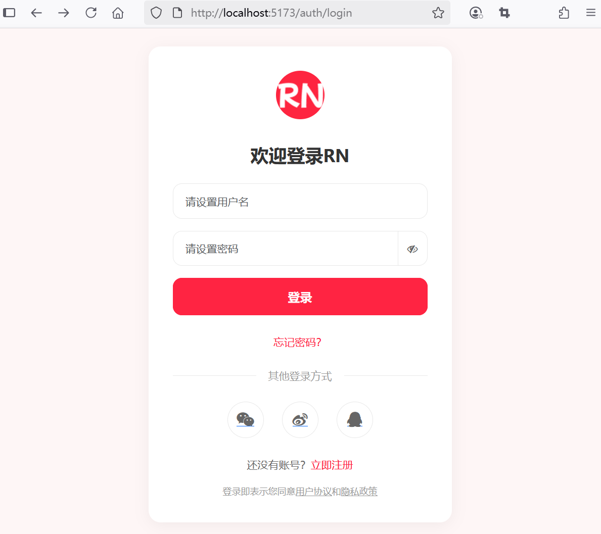


## 4.7 全栈实战信息管理功能：实现用户信息展示

将用户信息管理功能从 Thymeleaf 后端渲染模式迁移到 Vue 3 前端渲染模式，需要对数据流转、组件设计、API 接口和安全机制进行全面调整。以下是核心改造点和实施建议。


### 架构与交互模式的核心变化
 
- Thymeleaf 模式：
  ```
  浏览器 → 表单提交 → 后端控制器 → 数据库操作 → 重定向到详情页
  ```
- Vue 3 模式：
  ```
  浏览器 → Vue 组件 → API 请求 → 后端服务 → JSON 响应 → 前端更新视图
  ```

 

### 后端接口改造


修改UserController：

```java
// 获取用户笔记列表数据在界面上展示
@GetMapping("/profile/{userId}")
/*public String profileWithNotes(Model model,
                                @PathVariable Long userId,
                                @RequestParam(defaultValue = "1") int page,
                                @RequestParam(defaultValue = "12") int size) {
    // 获取当前用户信息
    Optional<User> optionalUser = userService.findByUserId(userId);

    // 判断用户是否存在
    if (!optionalUser.isPresent()) {
        throw new UserNotFoundException("");
    }

    User user = optionalUser.get();
    model.addAttribute("user", user);

    // 获取用户笔记列表数据
    Page<Note> notePage = noteService.getNotesByUser(userId, page - 1, size);

    // 添加笔记列表数据到模型中
    model.addAttribute("notePage", notePage);
    model.addAttribute("currentPage", page);
    model.addAttribute("totalPages", notePage.getTotalPages());

    return "user-profile";
}*/
public ResponseEntity<?> profileWithNotes(
                                @PathVariable Long userId,
                                @RequestParam(defaultValue = "1") int page,
                                @RequestParam(defaultValue = "12") int size) {
    // 获取当前用户信息
    Optional<User> optionalUser = userService.findByUserId(userId);

    // 判断用户是否存在
    if (!optionalUser.isPresent()) {
        throw new UserNotFoundException("");
    }

    User user = optionalUser.get();

    // 获取用户笔记列表数据
    Page<Note> notePage = noteService.getNotesByUser(userId, page - 1, size);

    // 转为DTO
    List<NoteExploreDto> noteExploreDtoList =
            notePage.map(note ->  NoteExploreDto.toExploreDto(note, user)).getContent();

    // 添加笔记列表数据到模型中
    Map<String, Object> map = new HashMap<>();
    map.put("user", user);
    map.put("noteList", noteExploreDtoList);
    map.put("currentPage", page);
    map.put("totalPages", notePage.getTotalPages());

    return ResponseEntity.ok(map);
}
```

为了避免序列化问题，将`Page<Note>`转为了`List<NoteExploreDto>`。

### 静态资源的访问


#### 1. 后端安全配置调整


允许匿名访问静态图片资源，修改WebSecurityConfig如下：


```java
@Bean
public SecurityFilterChain filterChain(HttpSecurity http) throws Exception {
    http
            // 禁用CSRF防护
            .csrf(csrf -> csrf.disable())
            .authorizeHttpRequests(authorize -> authorize
                    // ...为节约篇幅，此处省略非核心内容

                    /*// 允许ADMIN、USER角色的用户访问 /file/** 的资源
                    .requestMatchers("/file/**").hasAnyRole("ADMIN", "USER")*/
                    // 允许匿名访问静态图片资源
                    .requestMatchers("/uploads/**").permitAll()
                    .requestMatchers("/file/**").permitAll()
                    // 其他请求需求认证
                    .anyRequest().authenticated()
            )
             
            // ...为节约篇幅，此处省略非核心内容 
    ;

    return http.build();
}
```

#### 2. 前端设置反向代理


修改vite.config.ts，设置针对静态图片资源的反向代理：

```ts
// 设置反向代理
server: {
  host: 'localhost',
  port: 5173, // Vue开发端口
  proxy: {
    // ...为节约篇幅，此处省略非核心内容

    '/uploads': {
      target: 'http://localhost:8080',
      changeOrigin: true
    },
    '/file': {
      target: 'http://localhost:8080',
      changeOrigin: true
    }
  }
}
```


## 4.8 AI辅助编程快速实现用户信息展示页面

### 前端组件设计


#### UserProfile.vue

新增`src\views\UserProfile.vue`：

```vue
<script setup lang="ts">
import { ref, onMounted } from 'vue'
import { useAuthStore } from '@/stores/auth'
import type { NoteExploreDto } from '@/dto/note-explore-dto'
import { User } from '@/dto/user'
import { useRoute } from 'vue-router'
import axios from 'axios'
import { useRouter } from "vue-router"

const user = ref<User>(new User())
const authStore = useAuthStore()
const me = ref<User>(new User())
const noteList = ref<Array<NoteExploreDto>>([])
const totalPages = ref<number>(0)
const currentPage = ref<number>(0)
const route = useRoute()
const router = useRouter()

// 注销
function logout() {
  authStore.logout()

  // 跳转到登录页面
  router.push({ name: 'login' })
}

// 从路由里面获取用户ID
const userId = ref(route.params.userId)

// 构造查询参数pageIndex，默认从1开始
const pageIndex = ref(route.query.page || 1)

onMounted(() => {
  // 获取用户信息
  fetchUserProfile(userId.value, pageIndex.value)

  // 获取当前用户信息
  me.value = authStore.getUser ? authStore.getUser : new User()
})

const fetchUserProfile = async (userId: any, pageIndex: any) => {
  // 调用API获取用户信息
  try {
    const response = await axios.get(`/api/user/profile/${userId}?page=${pageIndex}`)
    user.value = response.data['user']
    currentPage.value = response.data['currentPage']
    totalPages.value = response.data['totalPages']
    noteList.value = response.data['noteList']
  } catch (error) {
    console.error('获取用户信息失败：' + error)
  }
}
</script>

<template>
  <!-- 导航栏 -->
  <nav class="navbar navbar-expand-lg navbar-light bg-light">
    <div class="container">
      <a class="navbar-brand" href="/">
        
      </a>
      <button class="navbar-toggler" type="button" data-bs-toggle="collapse" data-bs-target="#navbarNav"
        aria-controls="navbarNav" aria-expanded="false" aria-label="Toggle navigation">
        <span class="navbar-toggler-icon"></span>
      </button>
      <div class="collapse navbar-collapse" id="navbarNav">
        <ul class="navbar-nav ms-auto">
          <li class="nav-item">
            <a class="nav-link" href="#">
              {{ user.username }}
            </a>
          </li>
          <li class="nav-item">
            <a class="nav-link" href="/user/profile">个人资料</a>
          </li>
          <li class="nav-item">
            <!-- 注销 -->
            <a class="nav-link" href="#" @click="logout">退出登录</a>
          </li>
        </ul>
      </div>
    </div>
  </nav>

  <!-- 主体部分 -->
  <div class="container mt-5">
    <div class="row justify-content-center">
      <!-- 用户个人信息 -->
      <div class="row col-md-8">
        <div class="col-md-4 text-center">
          
          <p class="mt-3">{{ user.username }}</p>

          <!-- 仅作者自己可见 -->
          <div v-if="me.username === user.username">
            <a href="/user/edit" class="btn btn-primary btn-sm">编辑资料</a>
          </div>

        </div>

        <div class="col-md-8">
          <dive class="mb-3">
            <label class="form-label">RN号：{{ user.userId }}</label>
          </dive>
          <dive class="mb-3">
            <p class="form-control-plaintext">{{ user.bio ? user.bio : '这家伙很懒，什么都没写' }}</p>
          </dive>

          <!-- 仅作者自己可见 -->
          <div v-if="me.username === user.username">
            <a href="/user/change-password" class="btn btn-outline-secondary">修改密码</a>
          </div>
        </div>
      </div>

      <!-- 笔记列表 -->
      <div class="col-md-8">
        <!-- 空状态提示 -->
        <div class="empty-state" v-if="noteList.length === 0">
          <div class="empty-icon">
            <i class="fa fa-file-o"></i>
          </div>
          <div class="empty-text">
            还没有发布任何笔记
          </div>
          <!-- 仅作者自己可见 -->
          <div v-if="me.username == user.username">
            <a href="/note/publish" class="create-note-btn">
              <i class="fa fa-plus"></i>
              发布第一篇笔记
            </a>
          </div>
        </div>

        <!-- 非空状态提示 -->
        <div class="note-grid" v-if="noteList.length > 0">
          <!-- 循环遍历笔记列表生成笔记卡片 -->
          <div class="note-card" v-for="note in noteList">
            <a :href="'/note/' + note.noteId">
              
            </a>
            <div class="note-content">
              <dive class="note-title">
                {{ note.title }}
              </dive>
            </div>
          </div>
        </div>
      </div>

      <!-- 分页导航 -->
      <div class="col-md-8">
        <div class="pagination" v-if="totalPages > 0">
          <a class="page-btn" v-if="currentPage > 1"
            :href="'/user/profile/' + user.userId + '?page=' + (currentPage - 1)">«</a>

          <a class="page-btn" v-for="pageNum in Array.from({ length: totalPages }, (_, i) => i + 1)"
            :href="'/user/profile/' + user.userId + '?page=' + pageNum" :class="{ active: pageNum === currentPage }">{{
              pageNum }}</a>

          <a class="page-btn" v-if="currentPage < totalPages"
            :href="'/user/profile/' + user.userId + '?page=' + (currentPage + 1)">»</a>
        </div>
      </div>
    </div>
  </div>
</template>
<style setup>
/* 小红书风格 */
* {
  font-family: "PingFang SC", "Hiragino Sans GB", "Microsoft YaHei", sans-serif;
  box-sizing: border-box;
  margin: 0;
  padding: 0;
}

body {
  background-color: #f5f5f5;
}

/* 顶部导航栏 */
.header {
  position: sticky;
  top: 0;
  background-color: white;
  padding: 16px;
  box-shadow: 0 1px 2px rgba(0, 0, 0, 0.05);
}

.user-info {
  display: flex;
  align-items: center;
  gap: 12px;
}

.user-avatar {
  width: 48px;
  height: 48px;
  border-radius: 50%;
  background-color: #f0f0f0;
}

.user-name {
  font-size: 16px;
  font-weight: 600;
  color: #333;
}

.user-meta {
  font-size: 12px;
  color: #666;
}

.action-btn {
  margin-left: auto;
  font-size: 14px;
  color: #ff2442;
}

/* 笔记列表 */
.note-grid {
  display: grid;
  grid-template-columns: repeat(auto-fill, minmax(180px, 1fr));
  gap: 16px;
  padding: 16px;
}

.note-card {
  background-color: white;
  border-radius: 12px;
  overflow: hidden;
  box-shadow: 0 2px 4px rgba(0, 0, 0, 0.03);
  transition: transform 0.2s;
}

.note-card:hover {
  transform: translateY(-2px);
  box-shadow: 0 4px 8px rgba(0, 0, 0, 0.05);
}

.note-image {
  width: 100%;
  height: 180px;
  object-fit: cover;
}

.note-content {
  padding: 12px;
}

.note-title {
  font-size: 14px;
  font-weight: 500;
  line-height: 1.4;
  overflow: hidden;
  display: -webkit-box;
  -webkit-line-clamp: 2;
  -webkit-box-orient: vertical;
  color: #333;
  margin-bottom: 8px;
}

.note-meta {
  display: flex;
  justify-content: space-between;
  font-size: 12px;
  color: #999;
}

/* 空状态提示 */
.empty-state {
  padding: 48px;
  text-align: center;
}

.empty-icon {
  font-size: 48px;
  color: #e0e0e0;
  margin-bottom: 16px;
}

.empty-text {
  color: #999;
  margin-bottom: 24px;
}

.create-note-btn {
  background-color: #ff2442;
  color: white;
  padding: 10px 24px;
  border-radius: 24px;
  font-weight: 500;
}

/* 分页组件 */
.pagination {
  padding: 24px;
  display: flex;
  justify-content: center;
  gap: 8px;
  font-size: 14px;
}

.page-btn {
  padding: 6px 12px;
  border-radius: 4px;
  color: #666;
  text-decoration: none;
}

.page-btn.active {
  background-color: #ff2442;
  color: white;
  font-weight: 500;
}
</style>
```

### `useRouter()` 和 `useRoute()` 的区别


在 Vue 3 中，`router` 对象（通过 `useRouter()` 获取）没有 `params` 属性，而是需要通过 `useRoute()` 来获取当前路由的参数。


区分 `useRoute()` 和 `useRouter()`如下表所示。


| API               | 用途                          | 主要属性/方法                          |
|-------------------|-------------------------------|----------------------------------------|
| `useRoute()`      | 获取当前路由信息              | `params`, `query`, `path`, `fullPath`  |
| `useRouter()`     | 执行路由导航操作              | `push`, `replace`, `go`, `back`        |


#### user.ts

新增`src\dto\user.ts`：


```ts
export class User {
  userId: number = 0;
  username: string = '';
  password: string = '';
  phone: string = '';
  avatar: string = '';
  bio: string = '';
  role: string = '';
}
```


#### note-explore-dto.ts

新增`src\dto\note-explore-dto.ts`：


```ts
export interface NoteExploreDto {
  noteId: number;
  title: string;
  cover: string;
  username: string;
  avatar: string;
  userId: string;
  liked: boolean;
  likeCount: number;
}
```


## 4.9 路由配置和全局前置守卫实现页面重定向

### 路由配置和全局前置守卫实现重定向


在 Vue 3 中实现从 `/user/profile` 到 `/user/profile/:userId` 的重定向，需要结合路由配置和全局前置守卫。以下是具体实现方法：
 
```ts
const router = createRouter({
  history: createWebHistory(import.meta.env.BASE_URL),
  routes: [
    // ...为节约篇幅，此处省略非核心内容

    {
      path: '/user/profile',
      // 重定向到指定用户ID的页面
      redirect: to => {
        // 获取用户ID需要到全局守卫中处理
        return { name: 'profile-placeholder'}
      },
      meta: {
        requiresAuth: true
      }
    },
    // 临时占位路由，用于在全局守卫中处理重定向
    {
      path: '/user/profile-placeholder',
      name: 'profile-placeholder',
      component: { template: '<div>Loading...</div>' },
      meta: {
        requiresAuth: true
      }
    },
    {
      path: '/user/profile/:userId',
      name: 'user-profile',
      component: () => import('../views/UserProfile.vue'),
      meta: {
        requiresAuth: true
      }
    },
  ],
})

// 全局前置守卫
router.beforeEach(async (to, from, next) => {
  // ...为节约篇幅，此处省略非核心内容

  // 如果用户已登录，但没有加载用户信息，则先加载用户信息
  if (authStore.getIsAuthenticated && !authStore.getUser) {
    try {
      await authStore.fetchUser()
    } catch (error) {
      authStore.logout()
      next({ name: 'login' })
    }
  }

  // 获取用户ID
  if (to.name === 'profile-placeholder' && authStore.getUser) {
    next({ name: 'user-profile', params: { userId: (authStore.getUser as any).userId } })
  } else {
    next()
  }

})

export default router
```


### 运行调测

运行应用在登录账号的情况下访问自己的用户信息首页，效果如下图4-6所示。


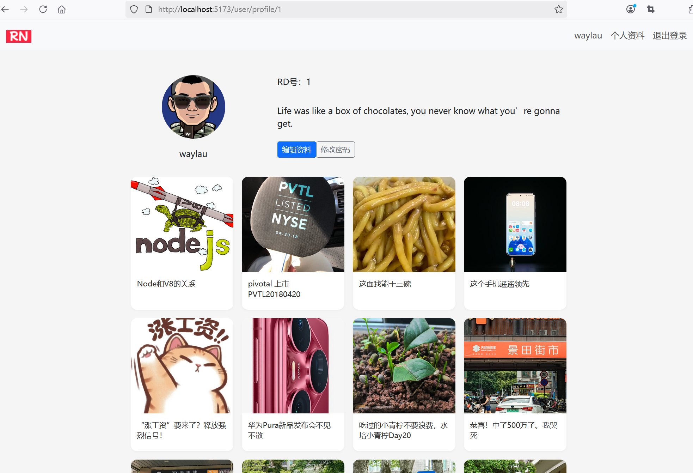


访问其他人的用户信息首页，效果如下图4-7所示。与上述界面的差异点在于少了“编辑资料”“修改密码”。


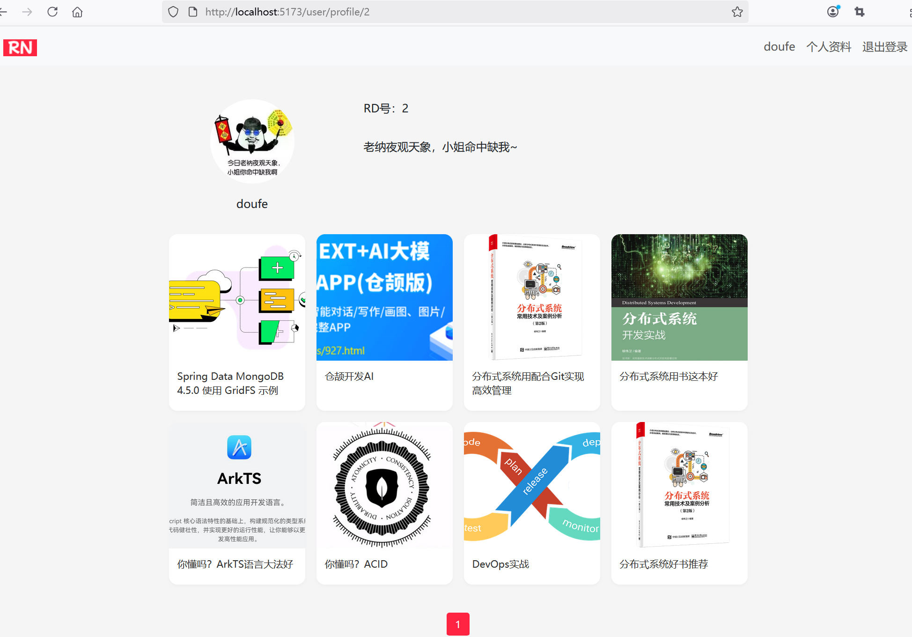


如果某个用户未发表过笔记，则效果如下图4-8所示。


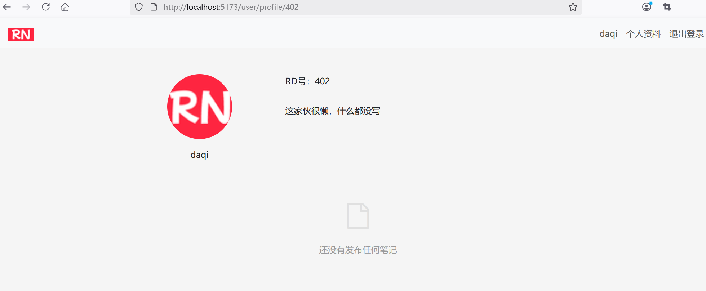


如果是自己未发表过笔记，则效果如下图4-9所示。与上述界面的差异点在于少了“发布第一篇笔记”。


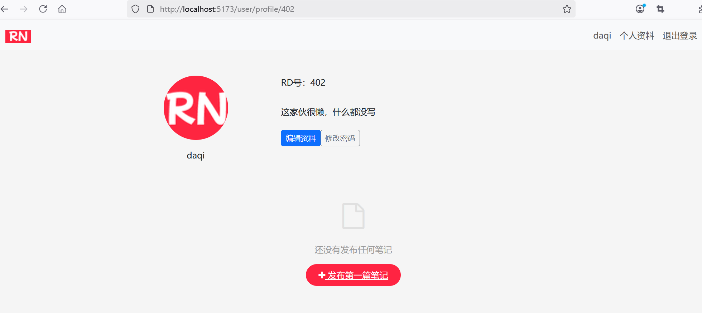


通过以上改造，用户信息管理功能将从后端渲染转变为前端渲染，实现更流畅的交互体验和更好的可维护性。关键是要处理好前后端分离后的API设计、状态管理和用户体验优化。


## 4.10 前后端分离架构下的全局错误异常处理

在前后端分离的架构中，传统的 Spring Boot `@ControllerAdvice` 全局异常处理需要结合前端错误拦截机制进行重构。以下是完整的解决方案。


### 改造前的效果


当试图访问一个不存在的用户ID的时候，比如ID为111，则界面效果如下图4-10所示。


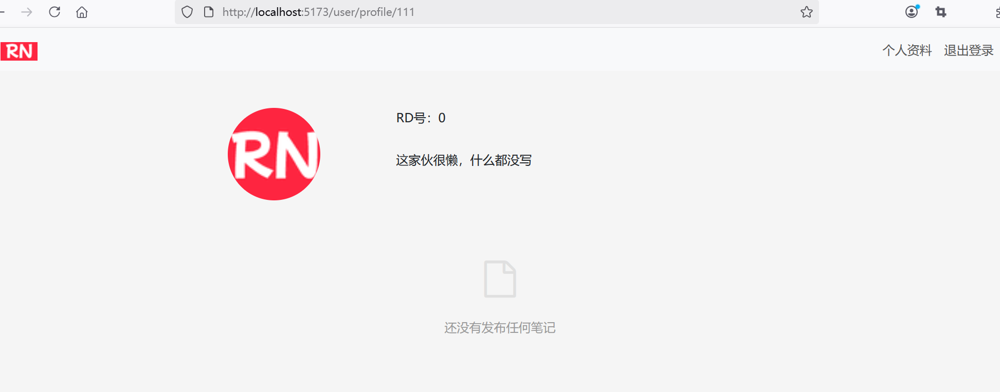


该界面没有提示任何错误信息，用户也很难察觉后台实际上已经抛出了UserNotFoundException，只不过该异常并未i能反馈给前端应用。


### 后端GlobalExceptionHandler优化

#### 1. 统一 API 错误响应格式

新建 ErrorResponseDto：


```java
package com.example.rednote.dto;

import lombok.AllArgsConstructor;
import lombok.Getter;
import lombok.Setter;

/**
 * ErrorResponseDto 错误响应对象
 *
 * @version 2025/07/08
 **/
@Getter
@Setter
@AllArgsConstructor
public class ErrorResponseDto {
    /**
     * HTTP状态码
     */
    private int code;
    /**
     * 信息
     */
    private String message;
}
```

#### 2. 重构 GlobalExceptionHandler

```java
package com.example.rednote.exception;

import com.example.rednote.dto.ErrorResponseDto;
import org.slf4j.Logger;
import org.slf4j.LoggerFactory;
import org.springframework.http.HttpStatus;
import org.springframework.http.ResponseEntity;
/*import org.springframework.ui.Model;*/
import org.springframework.web.bind.annotation.ControllerAdvice;
import org.springframework.web.bind.annotation.ExceptionHandler;
import org.springframework.web.multipart.MaxUploadSizeExceededException;


/**
 * GlobalExceptionHandler 全局异常处理
 *
 * @version 2025/08/18
 **/
@ControllerAdvice
public class GlobalExceptionHandler {
    private static final Logger log = LoggerFactory.getLogger(GlobalExceptionHandler.class);

    @ExceptionHandler(MaxUploadSizeExceededException.class)
    /*public String handleMaxSizeException(MaxUploadSizeExceededException exc, Model model) {
        log.error("服务器异常：{}", exc.getMessage(), exc);

        model.addAttribute("errorCode", 400);
        model.addAttribute("errorMessage", "服务器异常：" + exc.getMessage());

        return "400-error";
    }*/
    public ResponseEntity<?> handleMaxSizeException(MaxUploadSizeExceededException exc) {
        log.error("服务器异常：{}", exc.getMessage(), exc);

        ErrorResponseDto errorResponseDto = new ErrorResponseDto(400, "服务器异常：" + exc.getMessage());

        return ResponseEntity.status(HttpStatus.BAD_REQUEST)
                .body(errorResponseDto);
    }

    // 用户不存在异常
    @ExceptionHandler(UserNotFoundException.class)
    /*public String handleUserNotFoundException(UserNotFoundException exc, Model model) {
        log.error("用户不存在异常：{}", exc.getMessage(), exc);

        model.addAttribute("errorCode", 404);
        model.addAttribute("errorMessage", "异常信息：" + exc.getMessage());

        return "400-error";
    }*/
    public ResponseEntity<?> handleUserNotFoundException(UserNotFoundException exc) {
        log.error("用户不存在异常：{}", exc.getMessage(), exc);

        ErrorResponseDto errorResponseDto = new ErrorResponseDto(404, "异常信息：" + exc.getMessage());

        return ResponseEntity.status(HttpStatus.NOT_FOUND)
                .body(errorResponseDto);
    }

    // 笔记不存在异常
    @ExceptionHandler(NoteNotFoundException.class)
    /*public String handleNoteNotFoundException(NoteNotFoundException exc, Model model) {
        log.error("笔记不存在异常：{}", exc.getMessage(), exc);

        model.addAttribute("errorCode", 404);
        model.addAttribute("errorMessage", "异常信息：" + exc.getMessage());

        return "400-error";
    }*/
    public ResponseEntity<?> handleNoteNotFoundException(NoteNotFoundException exc) {
        log.error("笔记不存在异常：{}", exc.getMessage(), exc);

        ErrorResponseDto errorResponseDto = new ErrorResponseDto(404, "异常信息：" + exc.getMessage());

        return ResponseEntity.status(HttpStatus.NOT_FOUND)
                .body(errorResponseDto);
    }

    // 评论不存在异常
    @ExceptionHandler(CommentNotFoundException.class)
    /*public String handleCommentNotFoundException(CommentNotFoundException exc, Model model) {
        log.error("评论不存在异常：{}", exc.getMessage(), exc);

        model.addAttribute("errorCode", 404);
        model.addAttribute("errorMessage", "异常信息：" + exc.getMessage());

        return "400-error";
    }*/
    public ResponseEntity<?> handleCommentNotFoundException(CommentNotFoundException exc) {
        log.error("评论不存在异常：{}", exc.getMessage(), exc);

        ErrorResponseDto errorResponseDto = new ErrorResponseDto(404, "异常信息：" + exc.getMessage());

        return ResponseEntity.status(HttpStatus.NOT_FOUND)
                .body(errorResponseDto);
    }
}
```


### 前端 axios 拦截器配置

#### 1. 创建 axios 实例并添加拦截器

新建`src\services\axios.ts`：

```ts
import axios from "axios"
import { useAuthStore } from "@/stores/auth"
import router from "@/router"

const service = axios.create({
  baseURL: import.meta.env.VITE_API_BASE_URL,
  timeout: 5000,
})

// 请求拦截器
service.interceptors.request.use(
  (config) => {
    const authStore = useAuthStore()
    if (authStore.getToken) {
      config.headers.Authorization = `Bearer ${authStore.getToken}`
    }
    return config
  },
  (error) => {
    console.error('请求错误：' + error)
    return Promise.reject(error)
  }
)

// 响应拦截器
service.interceptors.response.use(
  (response) => {
    return response
  },
  (error) => {
    console.error('响应错误：' + error)
    const { status, data } = error.response || {}

    // 根据状态码的不同处理不同的错误
    switch (status) {
      case 401:
        // 认证失败，跳转到登录页
        const authStore = useAuthStore()
        authStore.logout()
        router.push({ name: 'login', query: { redirect: router.currentRoute.value.fullPath } })
        break;
      case 403:
        // 权限不足，显示提示
        alert(data.message || '权限不足')
        break;
      case 404:
        // 资源不存在，显示提示
        alert(data.message || '资源不存在')
        break;
      case 500:
        // 服务器内部错误，显示提示
        alert(data.message || '服务器内部错误，请稍后再试')
        break;
      default:
        // 其他错误，显示提示
        alert(data.message || '未知错误，请稍后再试')
    }

    return Promise.reject(error)
  }
)

export default service
```

#### 2. 删除老的axios拦截器

原有的在`src\stores\auth.ts`的axios拦截器代码可以删除。


```ts
/*
// axios拦截器，自动刷新JWT
axios.interceptors.request.use((config) => { 
  const token = localStorage.getItem('token')
  if (token) {
    config.headers.Authorization = `Bearer ${token}`
  }

  return config
})
*/
```


#### 3. 使用 axios 实例

在其他组件中原有的使用axios的地方，改为使用`@/services/axios`中的 axios 实例。


```ts
/*import axios from "axios"*/
import axios from "@/services/axios"
```

以下三个地方：

* `src\views\UserProfile.vue`
* `src\views\RegistrationForm.vue`
* `src\stores\auth.ts`

后续如果有需要发起HTTP请求，都统一使用`@/services/axios`中的 axios 实例。


### 运行调测


当试图访问一个不存在的用户ID的时候，比如ID为111，则界面效果如下图4-11所示。


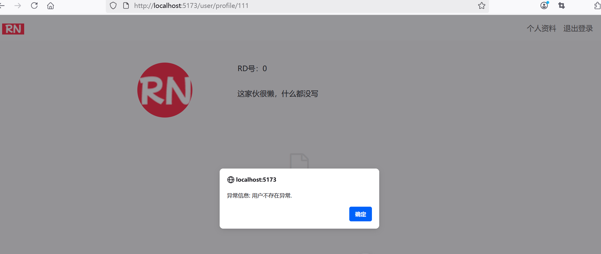


### 总结

通过以上重构，你可以实现：
1. 统一的错误响应格式：后端返回标准化的错误结构
2. 全局错误拦截：前端通过 axios 拦截器统一处理 HTTP 错误
3. 友好的用户提示：根据不同错误类型显示适当的用户提示

这种架构既能保持后端的健壮性，又能提供良好的前端用户体验，是前后端分离架构下理想的异常处理方案。


## 4.11 实现用户基本信息的编辑功能

### 后端接口改造


修改UserController：

```java
@GetMapping("/edit")
/*public String editProfile(Model model) {
    User user = userService.getCurrentUser();

    model.addAttribute("user", user);

    return "user-profile-edit";
}*/
public ResponseEntity<User> editProfile() {
    User user = userService.getCurrentUser();
    return ResponseEntity.ok(user);
}

@Transactional
@PostMapping("/edit")
/*
public String updateProfile(@ModelAttribute User user, RedirectAttributes redirectAttributes,
                            @RequestParam("avatarFile") MultipartFile avatarFile) {
    User currentUser = userService.getCurrentUser();
    String oldAvatar = currentUser.getAvatar();

    // 验证文件类型和大小
    if (avatarFile != null && !avatarFile.isEmpty()) {
        // 验证文件类型
        String contentType = avatarFile.getContentType();
        if (!contentType.startsWith("image/")) {
            redirectAttributes.addFlashAttribute("error", "请上传图片文件");

            return "redirect:/user/edit";
        }

        String fileId = gridFSStorageService.uploadImage(avatarFile);
        String fileUrl = MongoConfig.STATIC_PATH_PREFIX + fileId;

        currentUser.setAvatar(fileUrl);

        // 删除旧头像文件
        if (oldAvatar != null && !oldAvatar.isEmpty()) {
            String oldFileId = oldAvatar.substring(oldAvatar.lastIndexOf("/") + 1);
            gridFSStorageService.deleteImage(oldFileId);
        }
    }

    // 更新用户信息
    currentUser.setPhone(user.getPhone());
    currentUser.setBio(user.getBio());

    // 修改内容保存到数据库
    userService.updateUser(currentUser);

    // 重定向到指定页面，并传递参数
    redirectAttributes.addFlashAttribute("success", "个人信息更新成功");

    return "redirect:/user/profile";
}
*/
public ResponseEntity<?> updateProfile(@RequestParam(required = true) String phone,
                                        @RequestParam(required = false) String bio,
                                        @RequestParam(required = false, value = "avatarFile") MultipartFile avatarFile) {
    User currentUser = userService.getCurrentUser();
    String oldAvatar = currentUser.getAvatar();
    Map<String, String> map = new HashMap<>();

    // 验证文件类型和大小
    if (avatarFile != null && !avatarFile.isEmpty()) {
        // 验证文件类型
        String contentType = avatarFile.getContentType();
        if (!contentType.startsWith("image/")) {
            map.put("error", "请上传图片文件");
            return ResponseEntity.ok(map);
        }

        // 处理文件上传
        String fileId = gridFSStorageService.uploadImage(avatarFile);
        String fileUrl = MongoConfig.STATIC_PATH_PREFIX + fileId;

        currentUser.setAvatar(fileUrl);

        // 删除旧头像文件
        if (oldAvatar != null && !oldAvatar.isEmpty()) {
            String oldFileId = oldAvatar.substring(oldAvatar.lastIndexOf("/") + 1);
            gridFSStorageService.deleteImage(oldFileId);
        }
    }

    // 更新用户信息
    currentUser.setPhone(phone);
    currentUser.setBio(bio);

    // 修改内容保存到数据库
    userService.updateUser(currentUser);

    // 重定向到指定页面，并传递参数
    map.put("success", "个人信息更新成功");
    return ResponseEntity.ok(map);
}
```


### 前端组件设计


#### UserProfileEdit.vue

新增`src\views\UserProfileEdit.vue`：

```vue
<script setup lang="ts">
import { ref, onMounted } from 'vue'
import { useAuthStore } from '@/stores/auth'
import { User } from '@/dto/user'
import axios from "@/services/axios"
import { useRouter } from "vue-router"

const user = ref<User>(new User())
const authStore = useAuthStore()
const router = useRouter()
const success = ref('')
const error = ref('')
const selectedFile = ref(null)

onMounted(() => {
  // 获取用户信息
  fetchUserProfile()
})

const fetchUserProfile = async () => {
  try {
    const response = await axios.get(`/api/user/edit`)
    user.value = response.data
  } catch (error) {
    console.error('获取用户信息失败：' + error)
  }
}

// 注销
function logout() {
  authStore.logout()

  // 跳转到登录页面
  router.push({ name: 'login' })
}

const handleUserEdit = async () => {
  const formData = new FormData()

  if (selectedFile.value) {
    formData.append('avatarFile', selectedFile.value as File)
  }
  formData.append('phone', user.value.phone)
  formData.append('bio', user.value.bio)

  // 调用API编辑用户信息
  try {
    const response = await axios.post(`/api/user/edit`, formData, {
      headers: {
        'Content-Type': 'multipart/form-data'
      }
    })

    if (response.data['success']) {
      success.value = response.data['success']

      // 获取用户信息
      fetchUserProfile()
    } else if (response.data['error']) {
      error.value = response.data['error']
    }
  } catch (err) {
    console.error('获取用户信息失败：' + err)
    error.value = err + ''
  }
}

// 选中头像的处理
const handleFileUpload = (e: any) => {
  selectedFile.value = e.target.files[0]
}
</script>

<template>
  <!-- 导航栏 -->
  <nav class="navbar navbar-expand-lg navbar-light bg-light">
    <div class="container">
      <a class="navbar-brand" href="/">
        
      </a>
      <button class="navbar-toggler" type="button" data-bs-toggle="collapse" data-bs-target="#navbarNav"
        aria-controls="navbarNav" aria-expanded="false" aria-label="Toggle navigation">
        <span class="navbar-toggler-icon"></span>
      </button>
      <div class="collapse navbar-collapse" id="navbarNav">
        <ul class="navbar-nav ms-auto">
          <li class="nav-item">
            <a class="nav-link" href="#">
              {{ user.username }}
            </a>
          </li>
          <li class="nav-item">
            <a class="nav-link" href="/user/profile">个人资料</a>
          </li>
          <li class="nav-item">
            <!-- 注销 -->
            <a class="nav-link" href="#" @click="logout">退出登录</a>
          </li>
        </ul>
      </div>
    </div>
  </nav>

  <!-- 主体部分 -->
  <div class="profile-container">
    <!-- 编辑标题 -->
    <div class="profile-header">
      <h2 class="text-center">编辑个人资料</h2>
      <p>请填写或者更新你的个人信息</p>
    </div>

    <!-- 编辑表单 -->
    <form action="/user/edit" method="post" enctype="multipart/form-data" @submit.prevent="handleUserEdit">
      <!-- 头像 -->
      <div class="form-group position-relative">
        <div class="profile-avatar">
          
          <div class="avatar-upload">
            <!-- 文件上传 --->
            <input type="file" id="avatarFile" name="avatarFile" accept="image/*" class="d-none"
              @change="handleFileUpload"></input>
            <label for="avatarFile">更换头像</label>
          </div>
        </div>
      </div>

      <!-- 用户名（不可编辑）-->
      <div class="form-group">
        <label for="username" class="form-label">用户名</label>
        <input type="text" class="form-control" id="username" name="username" :value="user.username" disabled />
      </div>

      <!-- 手机号-->
      <div class="form-group">
        <label for="phone" class="form-label">手机号</label>
        <input type="text" class="form-control" id="phone" name="phone" v-model="user.phone" placeholder="请输入手机号" />
      </div>

      <!-- 个人简介 -->
      <div class="form-group">
        <label for="bio" class="form-label">个人简介</label>
        <textarea class="form-control" id="bio" name="bio" rows="3" v-model="user.bio"
          placeholder="请输入个人简介（最多255字）"></textarea>
      </div>

      <!-- 提交按钮 -->
      <button type="submit" class="btn btn-primary">保存修改</button>
    </form>

    <!-- 操作反馈 -->
    <div v-if="success" class="alert alert-success mt-3" role="alert">
      {{ success }}
    </div>
    <div v-if="error" class="alert alert-danger mt-3" role="alert">
      {{ error }}
    </div>
  </div>
</template>

<style setup>
.profile-container {
  max-width: 800px;
  margin: 0 auto;
  padding: 32px;
}

.profile-header {
  text-align: center;
  margin-bottom: 32px;
}

.profile-avatar {
  width: 120px;
  height: 120px;
  border-radius: 50%;
  margin: 0 auto 20px;
  position: relative;
}

.profile-avatar img {
  width: 100%;
  height: 100%;
  object-fit: cover;
  border: 4px solid white;
  box-shadow: 0 2px 8px rgba(0, 0, 0, 0.1);
}

.avatar-upload {
  position: absolute;
  bottom: 0;
  left: 50%;
  transform: translateX(-50%);
  background-color: #ff2442;
  color: white;
  padding: 4px 12px;
  border-radius: 20px;
  cursor: pointer;
  font-size: 12px;
  transition: background-color 0.3s;
}

.avatar-upload:hover {
  background-color: #e61e3a;
}

.form-group {
  margin-bottom: 24px;
}

.form-label {
  font-weight: 600;
  color: #333;
}

.form-control {
  border-radius: 12px;
  border: 1px solid #e8e8e8;
  padding: 12px 16px;
}

.form-control:focus {
  border-color: #ff2442;
  box-shadow: 0 0 0 2px rgba(255, 36, 66, 0.1);
}

.btn-primary {
  background-color: #ff2442;
  border-color: #ff2442;
  border-radius: 24px;
  padding: 12px 48px;
  font-weight: 600;
  width: 100%;
}

.btn-primary:hover {
  background-color: #e61e3a;
  box-shadow: 0 4px 12px rgba(255, 36, 66, 0.2);
}

.error-message {
  color: #ff2442;
  font-size: 12px;
  margin-top: 4px;
}
</style>
```


### 路由配置


```ts
const router = createRouter({
  history: createWebHistory(import.meta.env.BASE_URL),
  routes: [
    // ...为节约篇幅，此处省略非核心内容
    ,
    {
      path: '/user/edit',
      name: 'user-profile-edit',
      component: () => import('../views/UserProfileEdit.vue'),
      meta: {
        requiresAuth: true
      }
    },
  ],
})
```


### 运行调测

运行应用访问用户信息编辑页面，效果如下图4-12所示。


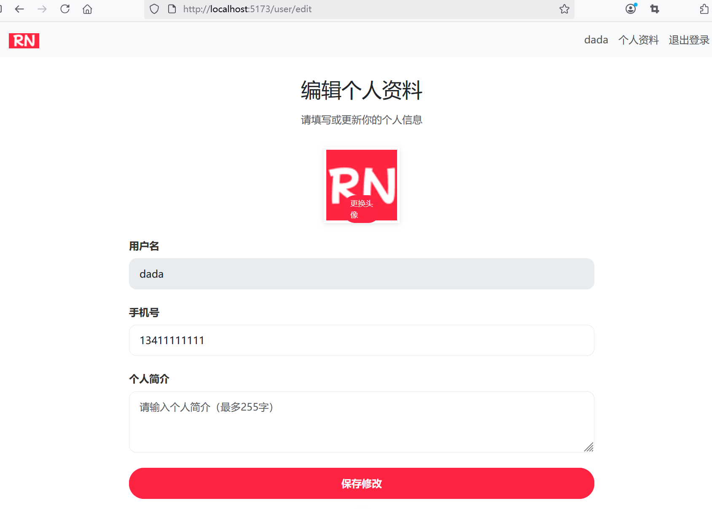


对用户信息进行编辑，效果如下图4-13所示。


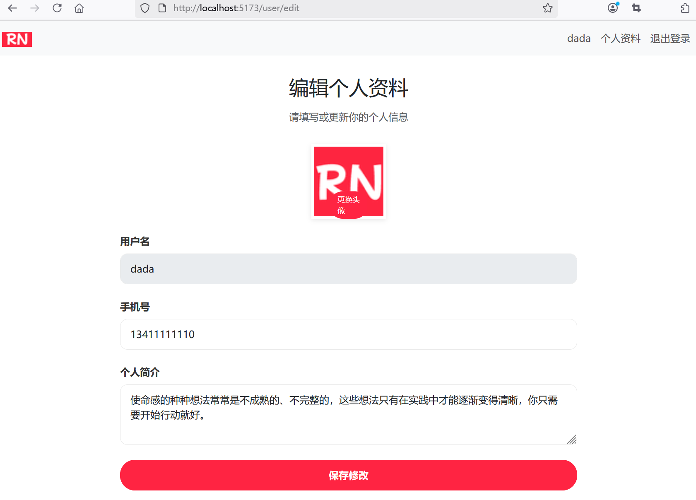


用户信息编辑成功后刷新页面，效果如下图4-14所示。


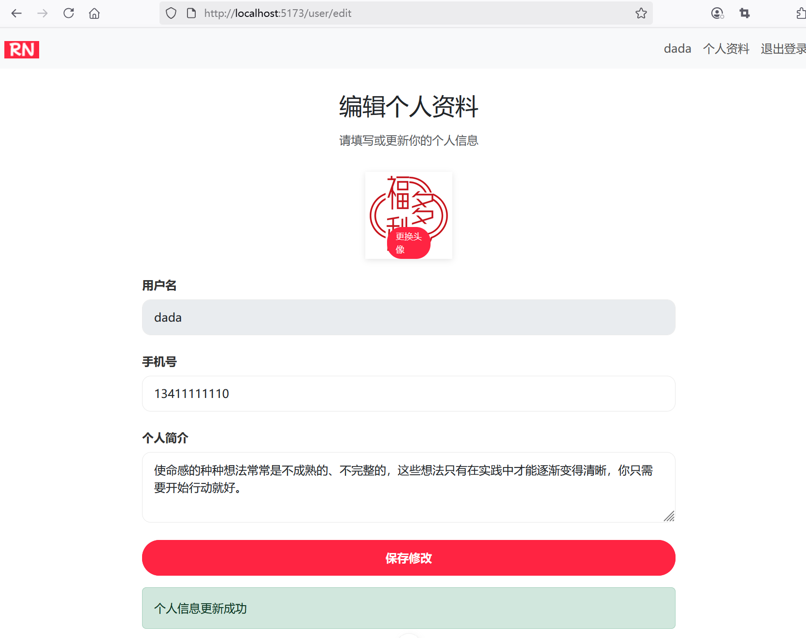


## 4.12 实现用户密码修改

### 后端接口改造


修改UserController：

```java
@GetMapping("/change-password")
/*public String changePasswordForm() {
    return "user-change-password";
}*/
public ResponseEntity<User> changePasswordForm() {
    User user = userService.getCurrentUser();
    return ResponseEntity.ok(user);
}

@PostMapping("/change-password")
/*public String changePassword(@RequestParam String oldPassword, @RequestParam String newPassword, @RequestParam String confirmPassword, RedirectAttributes redirectAttributes) {
    // 密码验证，验证两次输入的密码是否一致
    if (!newPassword.equals(confirmPassword)) {
        redirectAttributes.addFlashAttribute("error", "两次输入的密码不一致");
        return "redirect:/user/change-password";
    }

    // 密码旧密码是否正确
    if (!userService.verifyPassword(userService.getCurrentUser().getUsername(), oldPassword)) {
        redirectAttributes.addFlashAttribute("error", "旧密码错误");
        return "redirect:/user/change-password";
    }

    // 新密码强度验证
    if (!newPassword.matches("^[a-zA-Z0-9_]{8,20}$")) {
        redirectAttributes.addFlashAttribute("error", "新密码强度不够");
        return "redirect:/user/change-password";
    }

    // 更新密码到数据库
    userService.changePassword(userService.getCurrentUser().getUsername(), newPassword);
    redirectAttributes.addFlashAttribute("success", "密码修改成功");

    return "redirect:/user/change-password";
}*/
public ResponseEntity<?> changePassword(@RequestParam String oldPassword,
                                        @RequestParam String newPassword,
                                        @RequestParam String confirmPassword) {
    Map<String, String> map = new HashMap<>();

    // 密码验证，验证两次输入的密码是否一致
    if (!newPassword.equals(confirmPassword)) {
        map.put("error", "两次输入的密码不一致");
        return ResponseEntity.ok(map);
    }

    // 密码旧密码是否正确
    if (!userService.verifyPassword(userService.getCurrentUser().getUsername(), oldPassword)) {
        map.put("error", "旧密码错误");
        return ResponseEntity.ok(map);
    }

    // 新密码强度验证
    if (!newPassword.matches("^[a-zA-Z0-9_]{8,20}$")) {
        map.put("error", "新密码强度不够");
        return ResponseEntity.ok(map);
    }

    // 更新密码到数据库
    userService.changePassword(userService.getCurrentUser().getUsername(), newPassword);
    map.put("success", "密码修改成功");

    return ResponseEntity.ok(map);
}
```


### 前端组件设计


#### UserChangePassword.vue

新增`src\views\UserChangePassword.vue`：

```vue
<script setup lang="ts">
import { ref, onMounted } from 'vue'
import { useAuthStore } from '@/stores/auth'
import { User } from '@/dto/user'
import axios from "@/services/axios"
import { useRouter } from "vue-router"
import { UserChangePassword } from '@/dto/user-change-password'

const user = ref<User>(new User())
const authStore = useAuthStore()
const router = useRouter()
const success = ref('')
const error = ref('')
const userChangePassword = ref<UserChangePassword>(new UserChangePassword())

onMounted(() => {
  // 获取用户信息
  fetchUserProfile()
})

const fetchUserProfile = async () => {
  try {
    const response = await axios.get(`/api/user/change-password`)
    user.value = response.data
  } catch (error) {
    console.error('获取用户信息失败：' + error)
  }
}

// 注销
function logout() {
  authStore.logout()

  // 跳转到登录页面
  router.push({ name: 'login' })
}

const handleUserChangePassword = async () => {
  const formData = new FormData()

  formData.append('oldPassword', userChangePassword.value.oldPassword)
  formData.append('newPassword', userChangePassword.value.newPassword)
  formData.append('confirmPassword', userChangePassword.value.confirmPassword)

  // 调用API编辑用户信息
  try {
    const response = await axios.post(`/api/user/change-password`, formData)

    if (response.data['success']) {
      success.value = response.data['success']
    } else if (response.data['error']) {
      error.value = response.data['error']
    }
  } catch (err) {
    console.error('获取用户信息失败：' + err)
    error.value = err + ''
  }
}
</script>

<template>
  <!-- 导航栏 -->
  <nav class="navbar navbar-expand-lg navbar-light bg-light">
    <div class="container">
      <a class="navbar-brand" href="/">
        
      </a>
      <button class="navbar-toggler" type="button" data-bs-toggle="collapse" data-bs-target="#navbarNav"
        aria-controls="navbarNav" aria-expanded="false" aria-label="Toggle navigation">
        <span class="navbar-toggler-icon"></span>
      </button>
      <div class="collapse navbar-collapse" id="navbarNav">
        <ul class="navbar-nav ms-auto">
          <li class="nav-item">
            <a class="nav-link" href="#">
              {{ user.username }}
            </a>
          </li>
          <li class="nav-item">
            <a class="nav-link" href="/user/profile">个人资料</a>
          </li>
          <li class="nav-item">
            <!-- 注销 -->
            <a class="nav-link" href="#" @click="logout">退出登录</a>
          </li>
        </ul>
      </div>
    </div>
  </nav>

  <!-- 主体部分 -->
  <div class="password-container">
    <div class="card password-card">
      <!-- 编辑标题 -->
      <div class="card-header">
        <h2 class="text-center">修改密码</h2>
        <p>请输入当前密码和新密码</p>
      </div>

      <div class="card-body">
        <form action="/user/change-password" method="post" @submit.prevent="handleUserChangePassword">
          <!-- 当前密码 -->
          <div class="form-group">
            <label for="oldPassword" class="form-label">当前密码</label>
            <input type="password" class="form-control" id="oldPassword" name="oldPassword"
              v-model="userChangePassword.oldPassword" />
          </div>

          <!-- 新密码 -->
          <div class="form-group">
            <label for="newPassword" class="form-label">新密码</label>
            <input type="password" class="form-control" id="newPassword" name="newPassword"
              v-model="userChangePassword.newPassword" required />
          </div>

          <!-- 确认密码 -->
          <div class="form-group">
            <label for="confirmPassword" class="form-label">确认密码</label>
            <input type="password" class="form-control" id="confirmPassword" name="confirmPassword"
              v-model="userChangePassword.confirmPassword" required />
          </div>

          <!-- 提交按钮 -->
          <button type="submit" class="btn btn-primary">确认修改</button>
        </form>

        <!-- 返回个人资料 -->
        <a href="/user/profile" class="back-link">返回个人资料</a>
      </div>
    </div>

    <!-- 操作反馈 -->
    <div v-if="success" class="alert alert-success mt-3" role="alert">
      {{ success }}
    </div>
    <div v-if="error" class="alert alert-danger mt-3" role="alert">
      {{ error }}
    </div>
  </div>
</template>

<style setup>
.password-container {
  max-width: 500px;
  margin: 0 auto;
  padding: 32px;
}

.password-card {
  border-radius: 16px;
  box-shadow: 0 4px 20px rgba(0, 0, 0, 0.08);
  border: none;
}

.card-header {
  background-color: white;
  border-bottom: none;
  padding: 32px 32px 0;
}

.card-body {
  padding: 32px;
}

.form-group {
  margin-bottom: 24px;
}

.form-label {
  font-weight: 600;
  color: #333;
  margin-bottom: 8px;
}

.form-control {
  border-radius: 12px;
  border: 1px solid #e8e8e8;
  padding: 12px 16px;
  height: 48px;
}

.form-control:focus {
  border-color: #ff2442;
  box-shadow: 0 0 0 2px rgba(255, 36, 66, 0.1);
}

.btn-primary {
  background-color: #ff2442;
  border-color: #ff2442;
  border-radius: 24px;
  padding: 12px 48px;
  font-weight: 600;
  height: 48px;
  width: 100%;
  transition: all 0.3s ease;
}

.btn-primary:hover {
  background-color: #e61e3a;
  box-shadow: 0 4px 12px rgba(255, 36, 66, 0.2);
}

.error-message {
  color: #ff2442;
  font-size: 12px;
  margin-top: 4px;
}

.back-link {
  display: block;
  text-align: center;
  margin-top: 24px;
  color: #999;
  font-size: 14px;
}

.back-link:hover {
  color: #ff2442;
}
</style>
```

#### user-change-password.ts

新增`src\dto\user-change-password.ts`：


```ts
export class UserChangePassword {
  oldPassword: string = '';
  newPassword: string = '';
  confirmPassword: string = '';
}
```

### 路由配置


```ts
const router = createRouter({
  history: createWebHistory(import.meta.env.BASE_URL),
  routes: [
    // ...为节约篇幅，此处省略非核心内容

    ,
    {
      path: '/user/change-password',
      name: 'user-change-password',
      component: () => import('../views/UserChangePassword.vue'),
      meta: {
        requiresAuth: true
      }
    },
  ],
})
```


### 运行调测

运行应用对用户密码进行修改。修改失败效果如下图4-15所示。


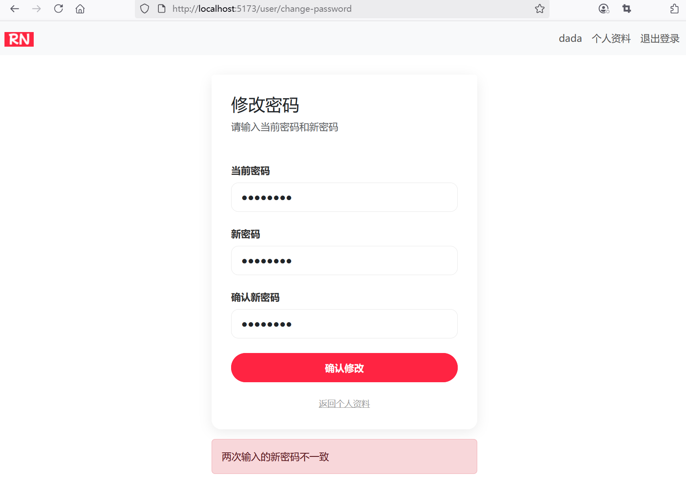


运行应用对用户密码进行修改。修改成功效果如下图4-16所示。


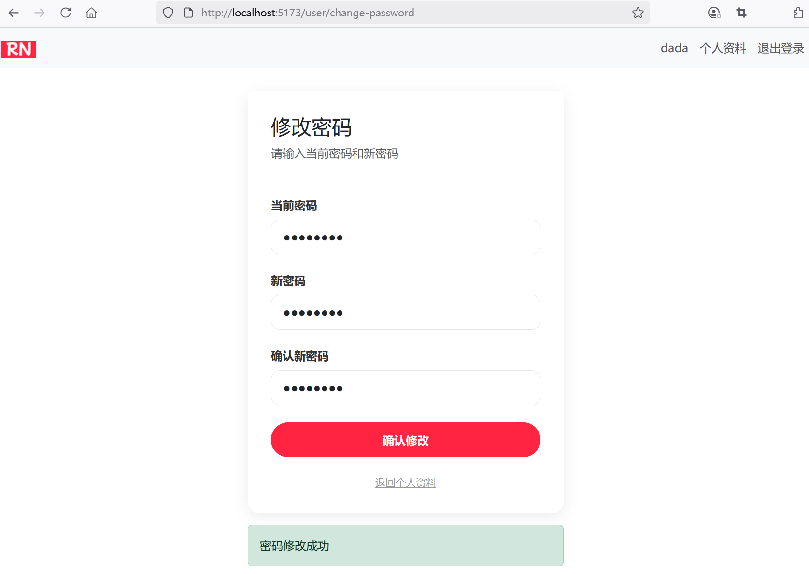


## 5.1 全栈视角下的笔记模块前后端划分与功能全流程剖析

将笔记模块从 Thymeleaf 后端渲染模式迁移到 Vue 3 前端渲染模式，需要对数据流转、组件设计、API 接口和交互逻辑进行全面调整。以下是核心改造点和实施建议：


### 架构与交互模式的核心变化

#### 数据流转方式

- Thymeleaf 模式：
  ```
  浏览器 → 表单提交 → 后端控制器 → 数据库操作 → 重定向到笔记列表页
  ```
- Vue 3 模式：
  ```
  浏览器 → Vue 组件 → API 请求 → 后端服务 → JSON 响应 → 前端更新视图
  ```


通过以上改造，笔记模块将从后端渲染转变为前端渲染，实现更流畅的交互体验和更好的可维护性。关键是要处理好前后端分离后的API设计、状态管理和用户体验优化。


## 5.2 全栈实战发布功能从Thymeleaf到Vue 3的架构升级指南

### 后端接口改造


修改NoteController：

```java
/**
 * 处理笔记发布请求
 */
@PostMapping("/publish")
/*public String publishNote(@Valid @ModelAttribute("note") NotePublishDto notePublishDto,
                            BindingResult bindingResult,
                            Model model) {
    // 验证表单
    if (bindingResult.hasErrors()) {
        model.addAttribute("note", notePublishDto);
        return "note-publish";
    } else {
        // 获取当前用户信息
        User user = userService.getCurrentUser();

        // 通过笔记服务创建笔记
        *//*noteService.createNote(notePublishDto, user);*//*
        Note note = noteService.createNote(notePublishDto, user);
        model.addAttribute("note", note);

        // 显示笔记发布成功页面
        return "note-publish-success";
    }
}*/
public ResponseEntity<?> publishNote(@Valid @ModelAttribute("note") NotePublishDto notePublishDto,
                            BindingResult bindingResult) {
    // 验证表单
    if (bindingResult.hasErrors()) {
        // 自定义错误响应
        Map<String, String> errors = new HashMap<>();
        bindingResult.getFieldErrors().forEach(error ->
                errors.put(error.getField(), error.getDefaultMessage())
        );

        return ResponseEntity.badRequest().body(errors);
    } else {
        // 获取当前用户信息
        User user = userService.getCurrentUser();

        // 通过笔记服务创建笔记
        noteService.createNote(notePublishDto, user);

        // 返回成功响应
        return ResponseEntity.ok("笔记创建成功");
    }
}
```


### 前端组件设计


#### NotePublish.vue

新增`src\views\NotePublish.vue`：

```vue
<script setup lang="ts">
import { NotePublishDto } from '@/dto/note-publish-dto';
import type { ApiValidationError } from '@/errors/api-validation-error';
import { onMounted, ref } from 'vue';
import { useRouter } from 'vue-router';
import axios from '@/services/axios';
import { AxiosError } from 'axios'

const noteFormRef = ref<HTMLFormElement | null>(null);
const note = ref<NotePublishDto>(new NotePublishDto())
const errors = ref<ApiValidationError>({})
const uploadedImagesRef = ref<HTMLDivElement | null>(null);
const imageUploadRef = ref<HTMLInputElement | null>(null);
const router = useRouter();
let selectedFiles: Array<File> = [];

onMounted(() => {
  // 监听图片上传
  imageUploadRef.value?.addEventListener('change', handleFileChange)
})

// 监听图片上传
function handleFileChange(this: HTMLInputElement, ev: Event) {
  if (ev.target instanceof HTMLInputElement && ev.target.files) {
    const files = Array.from(ev.target.files)
    selectedFiles = selectedFiles.concat(files)
    updateFileList()
  }
}

// 更新文件列表的显示
function updateFileList() {
  if (uploadedImagesRef.value) {
    // 清空图片预览
    uploadedImagesRef.value.innerHTML = "";

    // 生成图片预览
    for (let i = 0; i < selectedFiles.length; i++) {
      const fileItem = document.createElement("div");
      fileItem.className = "uploaded-image";

      const deleteBtn = document.createElement("div");
      deleteBtn.className = "delete-btn";
      deleteBtn.onclick = () => deleteFile(i);
      fileItem.appendChild(deleteBtn);

      const deleteBtnIcon = document.createElement("i");
      deleteBtnIcon.className = "fa fa-times";
      deleteBtn.appendChild(deleteBtnIcon);

      const imagePreview = document.createElement("img");
      imagePreview.className = "preview-img";
      imagePreview.alt = "预览";
      fileItem.appendChild(imagePreview);

      const reader = new FileReader();
      reader.onload = function (e) {
        if (e.target != null) {
          imagePreview.src = e.target.result + '';
        }
      }
      reader.readAsDataURL(selectedFiles[i]);

      uploadedImagesRef.value.appendChild(fileItem);
    }
  }
}

// 删除预览文件
function deleteFile(i: number) {
  selectedFiles.splice(i, 1);
  updateFileList();
}

// 取消发布
function cancelPublish() {
  // 确认是否要取消
  if (confirm('确定要取消发布吗？所有内容将不会被保存')) {
    router.back()
  }
}

// 发布笔记
const handleNotePublish = async () => {
  if (noteFormRef.value) {
    // 获取表单数据
    const formData = new FormData(noteFormRef.value)

    // 创建DataTransfer对象
    const dataTransfer = new DataTransfer()

    // 将选中的图片添加到DataTransfer对象中
    for (let i = 0; i < selectedFiles.length; i++) {
      dataTransfer.items.add(selectedFiles[i])
    }

    // 将DataTransfer对象设置给表单数据
    if (imageUploadRef.value && dataTransfer.files) {
      imageUploadRef.value.files = dataTransfer.files

      for (const file of imageUploadRef.value.files) {
        formData.append('images', file)
      }
    }

    // 调用API发布笔记
    try {
      await axios.post(`/api/note/publish`, formData)

      // 发布成功提示
      alert('发布成功')

      // 清空错误
      errors.value = {}

      // 跳转到首页
      router.push({ name: 'home' })
    } catch (err) {
      // 失败
      if (err instanceof AxiosError) {
        // 获取错误信息
        const axiosError = err as AxiosError<ApiValidationError>
        if (axiosError.response?.status === 400 && axiosError.response.data) {
          // 绑定后端返回的错误信息到errors上
          errors.value = axiosError.response.data
        }
      }
    }
  }
}


</script>

<template>
  <!-- 操作栏 -->
  <div class="header">
    <div class="container">
      <div class="d-flex justify-content-between align-items-center">
        <button class="btn btn-cancel" id="cancelPublishBtn" @click="cancelPublish">
          取消
        </button>
        <button class="btn btn-publish" id="publishNoteBtn" @click="handleNotePublish">
          发布
        </button>
      </div>
    </div>
  </div>

  <!-- 主体部分 -->
  <div class="container content">
    <form id="noteForm" method="post" action="/note/publish" enctype="multipart/form-data" ref="noteFormRef">
      <!-- 标题输入框 -->
      <input type="text" class="note-title" id="title" name="title" v-model="note.title" placeholder="分享你的生活点滴...">
      <div class="error-message" v-if="errors.title">
        {{ errors.title }}
      </div>

      <!-- 图片上传区域 -->
      <div class="image-upload">
        <!-- 图片选取上传按钮 -->
        <div class="upload-btn" onclick="document.getElementById('imageUpload').click()">
          <i class="fa fa-plus"></i>
        </div>
        <p>上传图片（最多9张）</p>
        <input type="file" id="imageUpload" name="images" multiple style="display: none;" accept="image/*"
          v:field="note.images" ref="imageUploadRef">

        <!-- 已上传图片预览 -->
        <div class="uploaded-images" id="uploadedImages" ref="uploadedImagesRef"></div>

        <!-- 错误消息 -->
        <div class="error-message" v-if="errors.images">
          {{ errors.images }}
        </div>
      </div>

      <!-- 笔记内容 -->
      <textarea class="note-content" id="content" name="content" v-model="note.content"
        placeholder="详细描述你的分享内容..."></textarea>
      <div class="error-message" v-if="errors.content">
        {{ errors.content }}
      </div>

      <!-- 话题 -->
      <div class="topic-input">
        <input type="text" class="form-control" id="topicInput" name="topics" v-model="note.topics"
          placeholder="添加话题，多个话题用空格隔开">
      </div>

      <!-- 分类 -->
      <div class="category-selector">
        <label for="categorySelect" class="form-label">请选择一个分类：</label>
        <select class="form-control" id="categorySelect" name="category" v-model="note.category">
          <option value="穿搭">穿搭</option>
          <option value="美食">美食</option>
          <option value="彩妆">彩妆</option>
          <option value="影视">影视</option>
          <option value="职场">职场</option>
          <option value="情感">情感</option>
          <option value="家居">家居</option>
          <option value="游戏">游戏</option>
          <option value="旅行">旅行</option>
          <option value="健身">健身</option>
        </select>
        <div class="error-message" v-if="errors.category">
          {{ errors.category }}
        </div>
      </div>
    </form>
  </div>
</template>

<style setup>
/* 基础样式 */
body {
  background-color: #fef6f6;
  font-family: -apple-system, BlinkMacSystemFont, "Segoe UI", Roboto, Helvetica, Arial, sans-serif;
}

.container {
  max-width: 768px;
  margin: 0 auto;
  padding: 0 16px;
}

/* 顶部导航栏 */
.header {
  background-color: white;
  border-bottom: 1px solid #eee;
  padding: 12px 0;
  position: sticky;
  top: 0;
  z-index: 100;
}

.header .btn {
  padding: 6px 16px;
  border-radius: 20px;
  font-weight: 600;
}

.btn-cancel {
  color: #333;
  border: 1px solid #ddd;
}

.btn-publish {
  background-color: #ff2442;
  color: white;
  border: none;
}

.btn-publish:hover {
  background-color: #e61e3a;
}

/* 内容区域 */
.content {
  padding: 16px 0;
}

/* 标题输入框 */
.note-title {
  border: none;
  width: 100%;
  font-size: 20px;
  font-weight: 600;
  padding: 12px 0;
  outline: none;
}

.note-title::placeholder {
  color: #999;
}

/* 图片上传区域 */
.image-upload {
  background-color: #f8f8f8;
  border-radius: 8px;
  padding: 24px 0;
  text-align: center;
  margin-bottom: 20px;
}

.image-upload .upload-btn {
  width: 80px;
  height: 80px;
  border: 2px dashed #ddd;
  border-radius: 8px;
  margin: 0 auto;
  display: flex;
  align-items: center;
  justify-content: center;
  cursor: pointer;
  transition: all 0.3s;
}

.image-upload .upload-btn:hover {
  border-color: #ff2442;
}

.image-upload .upload-btn i {
  font-size: 24px;
  color: #999;
}

.image-upload p {
  margin-top: 12px;
  color: #666;
  font-size: 14px;
}

/* 已上传图片展示 */
.uploaded-images {
  display: flex;
  flex-wrap: wrap;
  gap: 8px;
  margin-top: 16px;
}

.uploaded-image {
  width: 80px;
  height: 80px;
  border-radius: 8px;
  overflow: hidden;
  position: relative;
}

.uploaded-image img {
  width: 100%;
  height: 100%;
  object-fit: cover;
}

.uploaded-image .delete-btn {
  position: absolute;
  top: 4px;
  right: 4px;
  width: 20px;
  height: 20px;
  background-color: rgba(0, 0, 0, 0.6);
  color: white;
  border-radius: 50%;
  display: flex;
  align-items: center;
  justify-content: center;
  cursor: pointer;
  font-size: 12px;
}

/* 笔记内容编辑器 */
.note-content {
  width: 100%;
  min-height: 200px;
  border: none;
  outline: none;
  font-size: 16px;
  line-height: 1.6;
  padding: 12px 0;
}

.note-content::placeholder {
  color: #999;
}

/* 话题选择 */
.topic-input {
  position: relative;
  margin-bottom: 20px;
}

.topic-input input {
  width: 100%;
  padding: 12px;
  border: 1px solid #eee;
  border-radius: 8px;
  outline: none;
}

/* 分类选择 */
.category-selector {
  margin-bottom: 20px;
}

.category-input i {
  color: #ff2442;
}

/* 添加到 style 标签中 */
.category-selector select {
  width: 100%;
  padding: 12px;
  border: 1px solid #eee;
  border-radius: 8px;
  background-color: white;
  appearance: none;
  -webkit-appearance: none;
  background-image: url("data:image/svg+xml,%3Csvg xmlns='http://www.w3.org/2000/svg' viewBox='0 0 24 24' fill='%23666'%3E%3Cpath d='M7 10l5 5 5-5z'/%3E%3C/svg%3E");
  background-repeat: no-repeat;
  background-position: right 12px center;
  background-size: 16px;
  cursor: pointer;
}

.category-selector select:focus {
  outline: none;
  border-color: #ff2442;
  box-shadow: 0 0 0 2px rgba(255, 36, 66, 0.1);
}

.btn-view-note {
  background-color: #ff2442;
  color: white;
}

.error-message {
  color: #ff2442;
  font-size: 12px;
  margin-top: 4px;
}
</style>
```

#### note-publish-dto.ts

新增`src\dto\note-publish-dto.ts`：


```ts
export class NotePublishDto {
  title: string = '';
  content: string = '';
  topics: string = '';
  category: string = '';
}
```

### 路由配置


```ts
const router = createRouter({
  history: createWebHistory(import.meta.env.BASE_URL),
  routes: [
    // ...为节约篇幅，此处省略非核心内容

    ,
    {
      path: '/note/publish',
      name: 'note-publish',
      component: () => import('../views/NotePublish.vue'),
      meta: { requiresAuth: true },
    }
  ],
})
```


### 运行调测

运行应用访问笔记发布页面进行操作，界面效果如下图5-1所示。


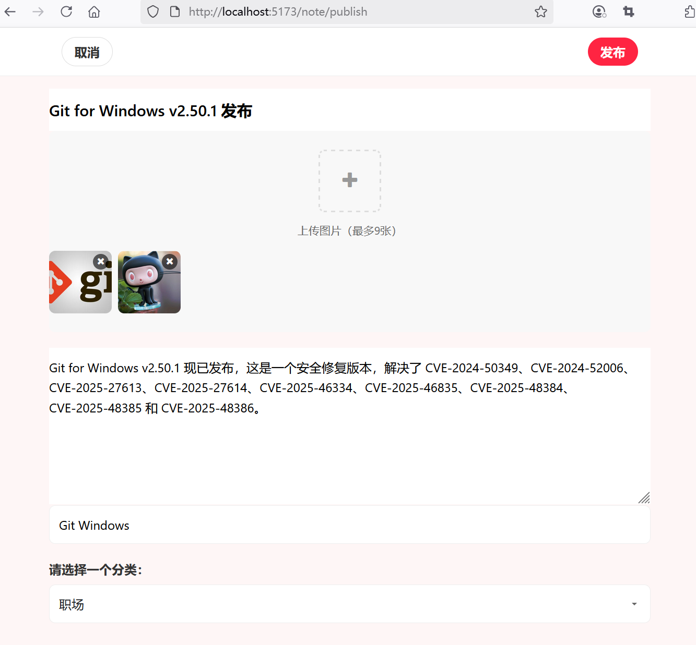


如果笔记发布页面输入的内容不符合要求，则会进行错误提示，如下图5-2所示。


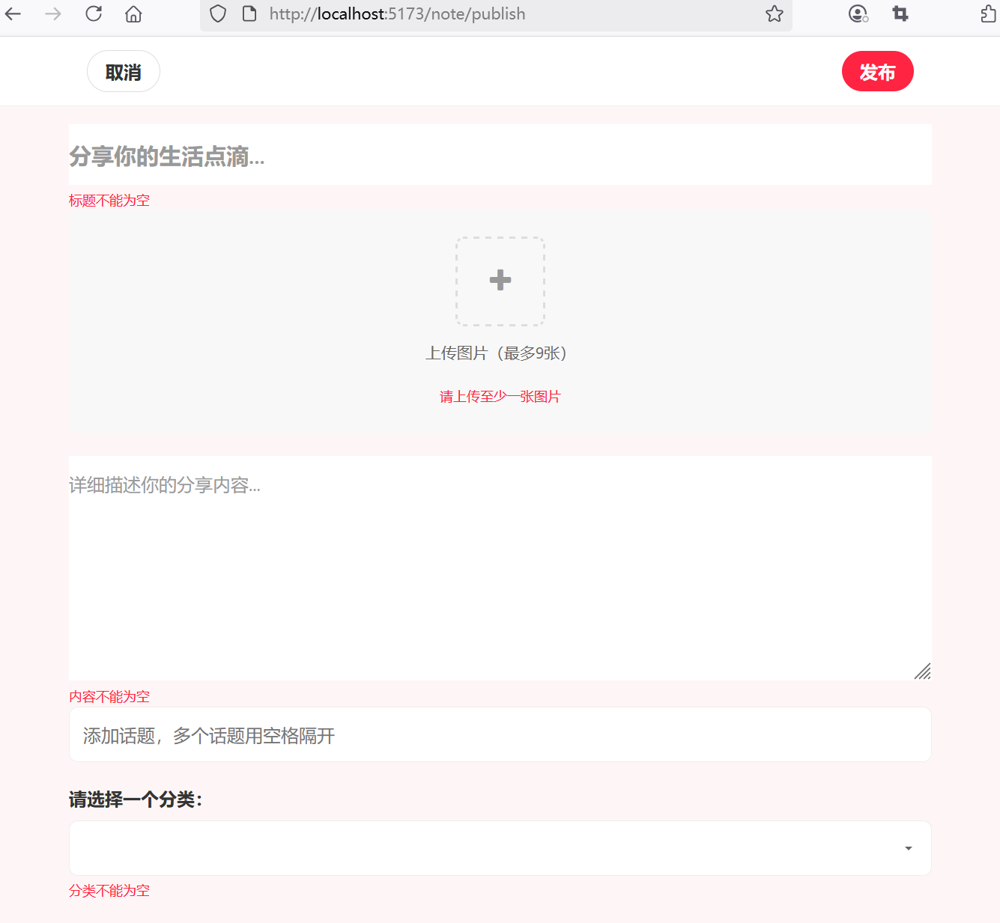


笔记发布成功之后，会有如下图5-3所示的提示，并自动跳转到首页。


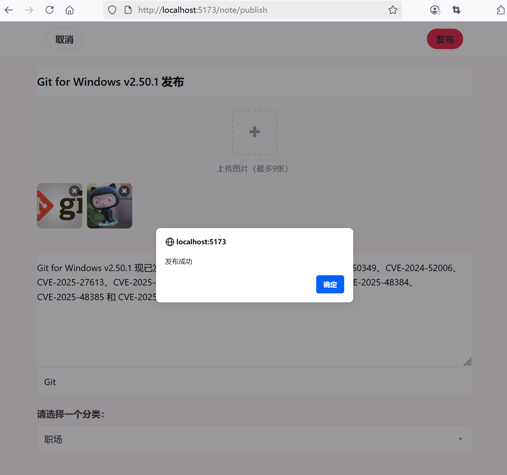


## 5.3 全栈实战笔记详情查询功能后端接口改造

### 后端接口改造

#### 修改NoteController


修改NoteController：

```java
/**
 * 显示笔记详情页面
 */
@GetMapping("/{noteId}")
/*public String showNoteDetail(@PathVariable Long noteId, Model model) {
    // 查询指定noteId的笔记
    Optional<Note> optionalNote = noteService.findNoteById(noteId);

    // 判定笔记是否存在，不存在则抛出异常
    if (!optionalNote.isPresent()) {
        throw new NoteNotFoundException("");
    }

    Note note = optionalNote.get();
    model.addAttribute("note", note);

    return "note-detail";
}*/
public ResponseEntity<?> showNoteDetail(@PathVariable Long noteId) {
    // 查询指定noteId的笔记
    Optional<Note> optionalNote = noteService.findNoteById(noteId);

    // 判定笔记是否存在，不存在则抛出异常
    if (!optionalNote.isPresent()) {
        throw new NoteNotFoundException("");
    }

    Note note = optionalNote.get();
    User currentUser = userService.getCurrentUser();
    // 将Note对象转为NoteDetailDto对象
    return ResponseEntity.ok(NoteDetailDto.toNoteDetailDto(note, currentUser));
}
```


#### 新增NoteDetailDto

为了能正确序列化，减少数据库查询和网络传输成本，创建了如下NoteDetailDto：

```java
package com.example.rednote.dto;

import com.example.rednote.entity.Note;
import com.example.rednote.entity.User;
import lombok.Getter;
import lombok.Setter;

import java.util.ArrayList;
import java.util.List;

/**
 * NoteDetailDto 笔记详情页展示DTO
 *
 * @version 2025/09/09
 **/
@Getter
@Setter
public class NoteDetailDto {
    // 以下字段来自Note
    private Long noteId;
    private String title;
    private String content;
    private List<String> images = new ArrayList<>();
    private List<String> topics = new ArrayList<>();
    private String category;
    // 以下字段来自User
    private String username;
    private String avatar;
    private Long userId;
    private boolean isLiked;
    private long likeCount;

    public static NoteDetailDto toNoteDetailDto(Note note, User currentUser) {
        NoteDetailDto noteDetailDto = new NoteDetailDto();
        noteDetailDto.setNoteId(note.getNoteId());
        noteDetailDto.setTitle(note.getTitle());
        noteDetailDto.setContent(note.getContent());
        noteDetailDto.setImages(note.getImages());
        noteDetailDto.setTopics(note.getTopics());
        noteDetailDto.setCategory(note.getCategory());
        noteDetailDto.setLikeCount(note.getLikeCount());

        User author = note.getAuthor();
        noteDetailDto.setUsername(author.getUsername());
        noteDetailDto.setAvatar(author.getAvatar());
        noteDetailDto.setUserId(author.getUserId());

        noteDetailDto.setLiked(note.isLikedByUser(currentUser.getUserId()));

        return noteDetailDto;
    }

}
```


## 5.4 全栈实战笔记详情页多图轮播功能

### 前端组件设计


#### NoteDetail.vue

新增`src\views\NoteDetail.vue`：

```vue
<script setup lang="ts">
import { NoteDetailDto } from '@/dto/note-detail-dto';
import { User } from '@/dto/user';
import { useAuthStore } from '@/stores/auth';
import axios from '@/services/axios';
import { onMounted, ref } from 'vue';
import { useRoute } from 'vue-router';
import router from '@/router';

const carouselContainerRef = ref<HTMLDivElement | null>(null);
const note = ref<NoteDetailDto>(new NoteDetailDto());
const currentIndex = ref<number>(0);
const me = ref<User>(new User());
const authStore = useAuthStore();

// 获取路由参数中的noteId
const route = useRoute();
const noteId = ref(route.params.noteId);

onMounted(() => {
  // 获取当前用户信息
  me.value = authStore.getUser ? authStore.getUser : new User();

  // 获取笔记详情
  fetchNote(noteId.value)
});

const fetchNote = async (noteId: any) => {
  try {
    const response = await axios.get(`/api/note/${noteId}`);
    note.value = response.data;
  } catch (error) {
    console.error('获取笔记详情失败：' + error);
  }

}

// 更新轮播位置
function updateCarouselPosition() {
  if (carouselContainerRef.value) {
    carouselContainerRef.value.style.transform = `translateX(-${currentIndex.value * 100}%)`;
  }
}

// 上一张
function prevSlide() {
  currentIndex.value = Math.max(currentIndex.value - 1, 0);
  updateCarouselPosition();
}

// 下一张
function nextSlide() {
  if (note.value.images && note.value.images.length > 0) {
    currentIndex.value = Math.min(currentIndex.value + 1, note.value.images.length - 1);
    updateCarouselPosition();
  }

}

//  取消发布
function handleBack() {
  router.back();
}


// TODO 删除笔记
function deleteNote() {

}

// TODO 打开预览
function openPreview(index: number) {

}

// TODO 关闭预览
function closePreview() {

}

// TODO 预览上一张
function previewPrev() {

}

// TODO 预览下一张
function previewNext() {

}
</script>
<template>
  <!-- 主内容区 -->
  <main class="container py-4 main-content">
    <!-- 笔记内容 -->
    <div class="note-container">
      <!-- 笔记图片 -->
      <div class="note-images">
        <!-- 图片轮播容器 -->
        <div class="carousel-container" id="carouselContainer" ref="carouselContainerRef">
          <!-- 动态生成轮播项 -->
          <div class="carousel-item-img" v-for="(image, index) in note.images">
            <!-- 在img上加 preview-trigger -->
            
          </div>
        </div>

        <!-- 轮播指示器 -->
        <div class="carousel-indicator" id="carouselIndicator">
          <span id="currentSlide">{{ currentIndex + 1 }}</span> / <span id="totalSlides">{{ note.images.length }}</span>
        </div>

        <!-- 轮播控制按钮 -->
        <div class="carousel-control prev" @click="prevSlide">
          <i class="fa fa-angle-left"></i>
        </div>
        <div class="carousel-control next" @click="nextSlide">
          <i class="fa fa-angle-right"></i>
        </div>
      </div>

      <!-- 笔记内容区 -->
      <div class="note-content">
        <!-- 标题 -->
        <h1 class="note-title">{{ note.title }}</h1>

        <!-- 内容 -->
        <p class="note-text">
          {{ note.content }}<br><br>
        </p>

        <!-- 话题 -->
        <div class="note-tags">
          <span class="tag" v-for="topic in note.topics">
            {{ topic }}
          </span>
        </div>

        <!-- 操作栏 -->
        <div class="note-action-bar">
          <!-- 返回 -->
          <button class="btn btn-light btn-sm" @click="handleBack">
            <i class="fa fa-arrow-left"></i>
          </button>
          <!-- 编辑 -->
          <a :href="'/note/' + note.noteId + '/edit'">
            <button class="btn btn-light btn-sm" v-if="me.username === note.username">
              <i class="fa fa-edit"></i>
            </button>
          </a>
          <!-- 删除 -->
          <button class="btn btn-light btn-sm" v-if="me.username === note.username" @click="deleteNote">
            <i class="fa fa-trash"></i>
          </button>
          <!-- 分享 -->
          <button class="btn btn-light btn-sm">
            <i class="fa fa-share-alt"></i>
          </button>
          <!-- 点赞 -->
          <button class="btn btn-light btn-sm">
            <i class="fa fa-heart-o"></i>
          </button>
          <!-- 收藏 -->
          <button class="btn btn-light btn-sm">
            <i class="fa fa-star-o"></i>
          </button>
        </div>

        <!-- 作者信息 -->
        <div class="author-info">
          <!-- 点击作者头像跳转到作者详情页 -->
          <a :href="'/user/profile/' + note.userId">
            
          </a>

          <div>
            <div class="author-name">
              {{ note.username }}
            </div>
            <div class="author-meta">
              已获得 1024 粉丝
            </div>
          </div>
          <div class="author-follow" v-if="me.username != note.username">
            + 关注
          </div>
        </div>
      </div>

      <!-- 评论区 -->
      <div class="comments-section">
        <div class="comments-header">
          <div class="comments-title">
            评论区
          </div>
        </div>

        <!-- 评论输入框 -->
        <div class="comment-input">
          
          <textarea class="comment-textarea" placeholder="分享你的想法..."></textarea>
          <div class="comment-btn">
            发送
          </div>
        </div>

        <!-- 评论列表 -->
        <div class="comment-list" id="commentList"></div>
      </div>
    </div>
  </main>

  <!-- 图片预览模态框 -->
  <div class="preview-modal" id="previewModal">
    <div class="preview-content">
      
      <div class="preview-close" @click="closePreview">
        <i class="fa fa-times"></i>
      </div>
      <div class="preview-counter" id="previewCounter">
        <span id="previewCurrent">1</span> / <span id="previewTotal">{{ note.images.length }}</span>
      </div>
      <div class="preview-control prev" @click="previewPrev">
        <i class="fa fa-angle-left"></i>
      </div>
      <div class="preview-control next" @click="previewNext">
        <i class="fa fa-angle-right"></i>
      </div>
    </div>
  </div>

  <!-- 回复弹窗 -->
  <div class="modal" id="replyModal" tabindex="-1" aria-labelledby="replyModalLabel">
    <div class="modal-dialog">
      <div class="modal-content">
        <div class="modal-header">
          <h5 class="modal-title" id="replyModalLabel">回复 <span id="replyToUsername"></span></h5>
        </div>
        <div class="modal-body">
          <div class="reply-to-content"></div>
          <textarea class="form-control" id="replyContent" rows="3" placeholder="写下你的回复..."></textarea>
        </div>
        <div class="modal-footer">
          <button type="button" class="btn btn-light close-model" data-bs-dismiss="modal">取消</button>
          <button type="button" class="btn btn-danger" id="submitReply">提交回复</button>
        </div>
      </div>
    </div>
  </div>
</template>
<style setup>
/* 全局样式 */
body {
  font-family: -apple-system, BlinkMacSystemFont, "Segoe UI", Roboto, "Helvetica Neue", Arial, sans-serif;
  background-color: #f5f5f5;
}

/* 笔记内容区 */
.note-container {
  background-color: white;
  margin-bottom: 20px;
  border-radius: 12px;
  overflow: hidden;
  box-shadow: 0 2px 4px rgba(0, 0, 0, 0.05);
}

.note-images {
  position: relative;
  background-color: #000;
}

.note-image {
  width: 100%;
  max-height: 60vh;
  object-fit: contain;
}

.note-content {
  padding: 20px;
}

.note-title {
  font-size: 20px;
  font-weight: 600;
  margin-bottom: 16px;
}

.note-text {
  font-size: 16px;
  line-height: 1.6;
  margin-bottom: 20px;
}

.note-tags {
  margin-bottom: 20px;
}

.tag {
  display: inline-block;
  background-color: #f0f0f0;
  color: #666;
  padding: 4px 12px;
  border-radius: 16px;
  font-size: 14px;
  margin-right: 8px;
  margin-bottom: 8px;
}

.note-action-bar {
  margin-bottom: 20px;
}

/* 作者信息 */
.author-info {
  display: flex;
  align-items: center;
  margin-bottom: 20px;
}

.author-avatar {
  width: 48px;
  height: 48px;
  border-radius: 50%;
  margin-right: 12px;
}

.author-name {
  font-size: 16px;
  font-weight: 600;
}

.author-follow {
  margin-left: auto;
  background-color: #ff2442;
  color: white;
  padding: 6px 16px;
  border-radius: 20px;
  font-size: 14px;
  cursor: pointer;
}

.author-follow.following {
  background-color: #f0f0f0;
  color: #666;
}

/* 评论区（第一部分）*/
.comments-section {
  background-color: white;
  border-radius: 12px;
  overflow: hidden;
  box-shadow: 0 2px 4px rgba(0, 0, 0, 0.05);
  padding: 20px;
}

.comments-header {
  display: flex;
  justify-content: space-between;
  align-items: center;
  margin-bottom: 20px;
}

.comments-title {
  font-size: 18px;
  font-weight: 600;
}

.comment-avatar {
  width: 36px;
  height: 36px;
  border-radius: 50%;
  margin-right: 12px;
}

.comment-input {
  display: flex;
  margin-bottom: 20px;
}

.comment-textarea {
  flex-grow: 1;
  border: 1px solid #e0e0e0;
  border-radius: 20px;
  padding: 8px 16px;
  font-size: 14px;
  resize: none;
  outline: none;
}

.comment-btn {
  margin-left: 12px;
  background-color: #ff2442;
  color: white;
  padding: 8px 16px;
  border-radius: 20px;
  font-size: 14px;
  cursor: pointer;
  display: flex;
  justify-content: center;
  align-items: center;
}

.comment-item {
  padding: 10px 0;
  border-bottom: 1px solid #f5f5f5;
}

.comment-header {
  display: flex;
  align-items: center;
  margin-bottom: 5px;
}


/* 新增轮播和预览样式 */
.carousel-container {
  display: flex;
  transition: transform 0.5s ease;
}

.carousel-item-img {
  min-width: 100%;
  position: relative;
}

.carousel-indicator {
  position: absolute;
  bottom: 15px;
  right: 15px;
  background-color: rgba(0, 0, 0, 0.5);
  color: white;
  padding: 4px 10px;
  border-radius: 15px;
  font-size: 12px;
  z-index: 10;
}

.carousel-control {
  position: absolute;
  top: 50%;
  transform: translateY(-50%);
  color: white;
  font-size: 24px;
  padding: 10px;
  cursor: pointer;
  z-index: 10;
  opacity: 0.7;
  transition: opacity 0.3s;
}

.carousel-control:hover {
  opacity: 1;
}

.carousel-control.prev {
  left: 10px;
}

.carousel-control.next {
  right: 10px;
}

/* 图片预览模态框 */
.preview-modal {
  display: none;
  position: fixed;
  top: 0;
  left: 0;
  width: 100%;
  height: 100%;
  background-color: rgba(0, 0, 0, 0.9);
  z-index: 1000;
  justify-content: center;
  align-items: center;
}

.preview-content {
  max-width: 90%;
  max-height: 90%;
  position: relative;
}

.preview-image {
  max-width: 100%;
  max-height: 85vh;
  object-fit: contain;
  cursor: pointer;
}

.preview-close {
  position: absolute;
  top: -40px;
  right: 0;
  color: white;
  font-size: 30px;
  cursor: pointer;
}

.preview-counter {
  position: absolute;
  bottom: -30px;
  left: 50%;
  transform: translateX(-50%);
  color: white;
  font-size: 14px;
}

.preview-control {
  position: absolute;
  top: 50%;
  transform: translateY(-50%);
  color: white;
  font-size: 30px;
  cursor: pointer;
  padding: 20px;
}

.preview-control.prev {
  left: -60px;
}

.preview-control.next {
  right: -60px;
}

/* 去掉下划线 */
a {
  text-decoration: none;
}

/* 点赞按钮样式 */
.liked {
  color: #ff2442;
}

/* 评论区（第二部分）*/
.comment-user-avatar {
  width: 32px;
  height: 32px;
  border-radius: 50%;
  margin-right: 10px;
}

.comment-user-info {
  flex: 1;
}

.comment-username {
  font-weight: bold;
}

.comment-time {
  font-size: 12px;
  color: #999;
}

.comment-content {
  margin-left: 42px;
  margin-bottom: 10px;
}


.reply-btn,
.delete-comment {
  background: none;
  border: none;
  color: #999;
  cursor: pointer;
  font-size: 12px;
}

.delete-comment {
  margin-left: 10px;
}

.empty-comments {
  color: #999;
  text-align: center;
  padding: 20px 0;
}

/*评论回复*/
.reply-list {
  margin-left: 42px;
  margin-top: 10px;
  padding-left: 10px;
  border-left: 2px solid #f5f5f5;
}

.reply-item {
  margin-bottom: 10px;
}

.reply-header {
  display: flex;
  align-items: center;
  font-size: 14px;
  color: #666;
}

.reply-username,
.reply-target {
  font-weight: bold;
  margin-right: 5px;
}

.reply-to {
  margin-right: 5px;
}

.reply-time {
  margin-left: 10px;
  font-size: 12px;
  color: #999;
}

.reply-content {
  margin-top: 5px;
  margin-left: 0;
}

.submit-reply {
  background-color: #ff2442;
  color: white;
  border: none;
  padding: 8px 15px;
  border-radius: 4px;
  cursor: pointer;
}
</style>
```

#### note-detail-dto.ts

新增`src\dto\note-detail-dto.ts`：


```ts
export class NoteDetailDto {
  noteId: number = 0;
  title: string = '';
  content: string = '';
  images: Array<string> = [];
  topics: Array<string> = [];
  category: string = '';
  username: string = '';
  userId: number = 0;
  avatar: string = '';
  likeCount: number = 0;
  liked: boolean = false;
}
```

### 路由配置


```ts
const router = createRouter({
  history: createWebHistory(import.meta.env.BASE_URL),
  routes: [
    // ...为节约篇幅，此处省略非核心内容

    ,
    {
      path: '/note/:noteId',
      name: 'note-detail',
      component: () => import('../views/NoteDetail.vue'),
      meta: { requiresAuth: true },
    }
  ],
})
```


### 运行调测

运行应用访问笔记详情页面进行操作，界面效果如下图5-4所示。


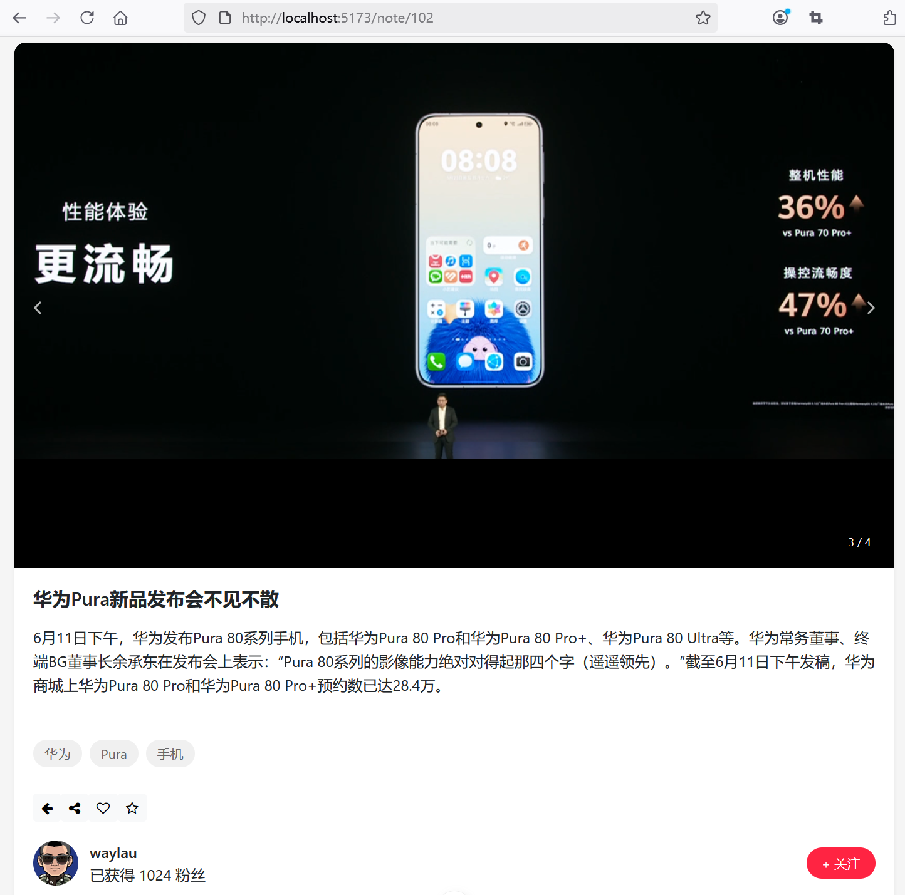


## 5.5 全栈实战笔记详情页图放大预览功能

定义三个ref

```ts
const previewModalVisible = ref(false);
const previewModalRef = ref<HTMLDivElement | null>(null);
const previewCurrentIndex = ref(0);
```

监听键盘按键事件


```ts
onMounted(() => {
  // ...为节约篇幅，此处省略非核心内容

  // 监听键盘按键
  window.addEventListener('keydown', handleKeydown);
});

onUnmounted(() => {
  window.removeEventListener('keydown', handleKeydown);
});

// 键盘事件处理
const handleKeydown = (event: KeyboardEvent) => {
  if (previewModalVisible.value) {
    switch (event.key) {
      case 'Escape':
        closePreview();
        break;
      case 'ArrowLeft':
        previewPrev();
        break;
      case 'ArrowRight':
        previewNext();
        break;
    }
  }
};
```

放大预览功能逻辑如下：

```ts
<script setup lang="ts">

// ...为节约篇幅，此处省略非核心内容

// 打开预览
function openPreview(index: number) {
  console.log("openPreview " + index);
  previewCurrentIndex.value = index;
  previewModalVisible.value = true;

  if (previewModalRef.value) {
    previewModalRef.value.style.display = 'flex';
  }

  // 防止背景滚动
  document.body.style.overflow = 'hidden';
}

// 关闭预览
function closePreview() {
  previewModalVisible.value = false;

  if (previewModalRef.value) {
    previewModalRef.value.style.display = 'none';
  }

  // 恢复背景滚动
  document.body.style.overflow = '';
  // 更新轮播位置
  updateCarouselPosition();
}

// 预览上一张
function previewPrev() {
  if (note.value.images && note.value.images.length > 0) {
    previewCurrentIndex.value = Math.max(0, previewCurrentIndex.value - 1);
  }
}

// 预览下一张
function previewNext() {
  if (note.value.images && note.value.images.length > 0) {
    previewCurrentIndex.value = Math.min(note.value.images.length - 1, previewCurrentIndex.value + 1);
  }
}
</script>

<template>

  <!-- ...为节约篇幅，此处省略非核心内容 -->

  <!-- 图片预览模态框 -->
  <div class="preview-modal" id="previewModal" ref="previewModalRef" v-show="previewModalVisible">
    <div class="preview-content">
       0" alt="图片预览">
      <div class="preview-close" @click="closePreview">
        <i class="fa fa-times"></i>
      </div>
      <div class="preview-counter" id="previewCounter">
        <span id="previewCurrent">{{ previewCurrentIndex + 1 }}</span> / <span id="previewTotal">{{ note.images?.length
          || 0 }}</span>
      </div>
      <div class="preview-control prev" @click="previewPrev">
        <i class="fa fa-angle-left"></i>
      </div>
      <div class="preview-control next" @click="previewNext">
        <i class="fa fa-angle-right"></i>
      </div>
    </div>
  </div>

  <!-- ...为节约篇幅，此处省略非核心内容 -->
</template>
```


## 5.6 全栈实战编辑功能：掌握前后端分离架构下的更新策略

### 后端接口改造

#### 修改NoteController


修改NoteController：

```java
@GetMapping("/{noteId}/edit")
@PreAuthorize("@noteServiceImpl.isAuthor(#noteId, authentication.name)")
/* public String editNote(@PathVariable Long noteId, Model model) {
    Optional<Note> noteOptional = noteService.findByNoteId(noteId);

    if (!noteOptional.isPresent()) {
        throw new NoteNotFoundException("");
    }

    Note note = noteOptional.get();

    NoteEditDto noteEditDto = new NoteEditDto();
    noteEditDto.setNoteId(note.getNoteId());
    noteEditDto.setTitle(note.getTitle());
    noteEditDto.setContent(note.getContent());
    noteEditDto.setCategory(note.getCategory());
    noteEditDto.setImages(note.getImages());

    // List转为String
    noteEditDto.setTopics(StringUtil.listToSplit(note.getTopics(), " "));

    model.addAttribute("note", noteEditDto);

    return "note-edit";
}*/
public ResponseEntity<?> editNote(@PathVariable Long noteId) {
    Optional<Note> noteOptional = noteService.findByNoteId(noteId);

    if (!noteOptional.isPresent()) {
        throw new NoteNotFoundException("");
    }

    Note note = noteOptional.get();

    NoteEditDto noteEditDto = new NoteEditDto();
    noteEditDto.setNoteId(note.getNoteId());
    noteEditDto.setTitle(note.getTitle());
    noteEditDto.setContent(note.getContent());
    noteEditDto.setCategory(note.getCategory());
    noteEditDto.setImages(note.getImages());

    // List转为String
    noteEditDto.setTopics(StringUtil.listToSplit(note.getTopics(), " "));

    return ResponseEntity.ok(noteEditDto);
}

@PostMapping("/{noteId}")
@PreAuthorize("@noteServiceImpl.isAuthor(#noteId, authentication.name)")
/*public String updateNote(@PathVariable Long noteId,
                          @Valid @ModelAttribute("note") NoteEditDto noteEditDto,
                          BindingResult bindingResult,
                          Model model,
                          RedirectAttributes redirectAttributes) {
    Optional<Note> noteOptional = noteService.findByNoteId(noteId);

    if (!noteOptional.isPresent()) {
        throw new NoteNotFoundException("");
    }

    // 验证表单
    if (bindingResult.hasErrors()) {
        model.addAttribute("note", noteEditDto);
        return "note-edit";
    }

    Note note = noteOptional.get();

    try {
        noteService.updateNote(note, noteEditDto);
        redirectAttributes.addFlashAttribute("success", "笔记更新成功");
        return "redirect:/note/" + noteId;
    } catch (Exception ex) {
        log.error("笔记更新异常: {}", ex.getMessage(), ex);

        redirectAttributes.addFlashAttribute("error", "笔记更新失败: " + ex.getMessage());
        return "redirect:/note/" + noteId + "/edit";
    }
}*/
public ResponseEntity<?> updateNote(@PathVariable Long noteId,
                          @Valid @RequestBody NoteEditDto noteEditDto,
                          BindingResult bindingResult) {
    Optional<Note> noteOptional = noteService.findByNoteId(noteId);

    if (!noteOptional.isPresent()) {
        throw new NoteNotFoundException("");
    }

    // 验证表单
    if (bindingResult.hasErrors()) {
        // 自定义错误响应
        Map<String, String> errors = new HashMap<>();
        bindingResult.getFieldErrors().forEach(error ->
                errors.put(error.getField(), error.getDefaultMessage())
        );
        return ResponseEntity.badRequest().body(errors);
    }

    Map<String, String> map = new HashMap<>();
    Note note = noteOptional.get();

    try {
        noteService.updateNote(note, noteEditDto);
        map.put("success", "笔记更新成功");
        return ResponseEntity.ok(map);
    } catch (Exception ex) {
        log.error("笔记更新异常: {}", ex.getMessage(), ex);
        map.put("error", "笔记更新失败: " + ex.getMessage());
        return ResponseEntity.ok(map);
    }
}
```


### 前端组件设计


#### NoteEdit.vue

新增`src\views\NoteEdit.vue`：

```vue
<script setup lang="ts">
import { NoteEditDto } from '@/dto/note-edit-dto';
import type { ApiValidationError } from '@/errors/api-validation-error';
import axios from '@/services/axios';
import type { AxiosError } from 'axios';
import { onMounted, ref } from 'vue';
import { useRouter, useRoute } from 'vue-router';

const note = ref<NoteEditDto>(new NoteEditDto())
const errors = ref<ApiValidationError>({})
const success = ref('')
const error = ref('')
const router = useRouter()
const route = useRoute()

// 从路由参数中获取笔记ID
const noteId = ref(route.params.noteId)

// 组件挂载时，获取笔记详情
onMounted(() => {
  fetchNote(noteId.value)
});

// 获取笔记详情
const fetchNote = async (noteId: any) => {
  try {
    const response = await axios.get(`/api/note/${noteId}/edit`)
    note.value = response.data
  } catch (error) {
    console.error('获取笔记详情失败：' + error)
  }
}

// 取消编辑
function cancelEdit() {
  if (confirm('确定要取消修改吗？')) {
    router.back()
  }
}

// 保存笔记
const handleNoteEdit = async () => {
  try {
    const response = await axios.post(`/api/note/${noteId.value}`, note.value)

    if (response.data['success']) {
      success.value = response.data['success']
    } else if (response.data['error']) {
      error.value = response.data['error']
    }
  } catch (error) {
    const axiosError = error as AxiosError<ApiValidationError>
    if (axiosError.response?.status === 400 && axiosError.response.data) {
      errors.value = axiosError.response.data
    }
  }
}
</script>
<template>
  <!-- 操作栏 -->
  <div class="header">
    <div class="container">
      <div class="d-flex justify-content-between align-items-center">
        <button class="btn btn-cancel" id="cancelPublishBtn" @click="cancelEdit">
          取消
        </button>
        <button class="btn btn-publish" id="publishNoteBtn" @click="handleNoteEdit">
          保存
        </button>
      </div>
    </div>
  </div>

  <!-- 主体部分 -->
  <div class="container content">
    <form id="noteForm" method="post">
      <!-- 标题输入框 -->
      <input type="text" class="note-title" id="title" name="title" v-model="note.title" placeholder="分享你的生活点滴...">
      <div class="error-message" v-if="errors.title">
        {{ errors.title }}
      </div>

      <!-- 已上传图片预览 -->
      <div class="uploaded-images" id="uploadedImages">
        <div class="uploaded-image" v-for="image in note.images">
          
        </div>
      </div>
      <!-- 错误消息 -->
      <div class="error-message" v-if="errors.images">
        {{ errors.images }}
      </div>

      <!-- 笔记内容 -->
      <textarea class="note-content" id="content" name="content" v-model="note.content"
        placeholder="详细描述你的分享内容..."></textarea>
      <div class="error-message" v-if="errors.content">
        {{ errors.content }}
      </div>

      <!-- 话题 -->
      <div class="topic-input">
        <input type="text" class="form-control" id="topicInput" name="topics" v-model="note.topics"
          placeholder="添加话题，多个话题用空格隔开">
      </div>

      <!-- 分类 -->
      <div class="category-selector">
        <label for="categorySelect" class="form-label">请选择一个分类：</label>
        <select class="form-control" id="categorySelect" name="category" v-model="note.category">
          <option value="穿搭">穿搭</option>
          <option value="美食">美食</option>
          <option value="彩妆">彩妆</option>
          <option value="影视">影视</option>
          <option value="职场">职场</option>
          <option value="情感">情感</option>
          <option value="家居">家居</option>
          <option value="游戏">游戏</option>
          <option value="旅行">旅行</option>
          <option value="健身">健身</option>
        </select>
        <div class="error-message" v-if="errors.category">
          {{ errors.category }}
        </div>
      </div>
    </form>

    <!-- 操作反馈 -->
    <div v-if="success" class="alert alert-success mt-4">
      <i class="fa fa-check-circle"></i>
      {{ success }}
    </div>
    <div v-if="error" class="alert alert-danger mt-4">
      <i class="fa fa-exclamation-circle"></i>
      {{ error }}
    </div>
  </div>
</template>
<style setup>
/* 基础样式 */
body {
  background-color: #fef6f6;
  font-family: -apple-system, BlinkMacSystemFont, "Segoe UI", Roboto, Helvetica, Arial, sans-serif;
}

.container {
  max-width: 768px;
  margin: 0 auto;
  padding: 0 16px;
}

/* 顶部导航栏 */
.header {
  background-color: white;
  border-bottom: 1px solid #eee;
  padding: 12px 0;
  position: sticky;
  top: 0;
  z-index: 100;
}

.header .btn {
  padding: 6px 16px;
  border-radius: 20px;
  font-weight: 600;
}

.btn-cancel {
  color: #333;
  border: 1px solid #ddd;
}

.btn-publish {
  background-color: #ff2442;
  color: white;
  border: none;
}

.btn-publish:hover {
  background-color: #e61e3a;
}

/* 内容区域 */
.content {
  padding: 16px 0;
}

/* 标题输入框 */
.note-title {
  border: none;
  width: 100%;
  font-size: 20px;
  font-weight: 600;
  padding: 12px 0;
  outline: none;
}

.note-title::placeholder {
  color: #999;
}

/* 已上传图片展示 */
.uploaded-images {
  display: flex;
  flex-wrap: wrap;
  gap: 8px;
  margin-top: 16px;
}

.uploaded-image {
  width: 80px;
  height: 80px;
  border-radius: 8px;
  overflow: hidden;
  position: relative;
}

.uploaded-image img {
  width: 100%;
  height: 100%;
  object-fit: cover;
}

.uploaded-image .delete-btn {
  position: absolute;
  top: 4px;
  right: 4px;
  width: 20px;
  height: 20px;
  background-color: rgba(0, 0, 0, 0.6);
  color: white;
  border-radius: 50%;
  display: flex;
  align-items: center;
  justify-content: center;
  cursor: pointer;
  font-size: 12px;
}

/* 笔记内容编辑器 */
.note-content {
  width: 100%;
  min-height: 200px;
  border: none;
  outline: none;
  font-size: 16px;
  line-height: 1.6;
  padding: 12px 0;
}

.note-content::placeholder {
  color: #999;
}

/* 话题选择 */
.topic-input {
  position: relative;
  margin-bottom: 20px;
}

.topic-input input {
  width: 100%;
  padding: 12px;
  border: 1px solid #eee;
  border-radius: 8px;
  outline: none;
}

/* 分类选择 */
.category-selector {
  margin-bottom: 20px;
}

.category-input i {
  color: #ff2442;
}

/* 添加到 style 标签中 */
.category-selector select {
  width: 100%;
  padding: 12px;
  border: 1px solid #eee;
  border-radius: 8px;
  background-color: white;
  appearance: none;
  -webkit-appearance: none;
  background-image: url("data:image/svg+xml,%3Csvg xmlns='http://www.w3.org/2000/svg' viewBox='0 0 24 24' fill='%23666'%3E%3Cpath d='M7 10l5 5 5-5z'/%3E%3C/svg%3E");
  background-repeat: no-repeat;
  background-position: right 12px center;
  background-size: 16px;
  cursor: pointer;
}

.category-selector select:focus {
  outline: none;
  border-color: #ff2442;
  box-shadow: 0 0 0 2px rgba(255, 36, 66, 0.1);
}

.btn-view-note {
  background-color: #ff2442;
  color: white;
}

.error-message {
  color: #ff2442;
  font-size: 12px;
  margin-top: 4px;
}
</style>
```

#### note-edit-dto.ts

新增`src\dto\note-edit-dto.ts`：


```ts
export class NoteEditDto {
  noteId: number = 0;
  title: string = '';
  content: string = '';
  images: Array<string> = [];
  topics: string = '';
  category: string = '';
}
```

### 路由配置


```ts
const router = createRouter({
  history: createWebHistory(import.meta.env.BASE_URL),
  routes: [
    // ...为节约篇幅，此处省略非核心内容

    ,
    {
      path: '/note/:noteId/edit',
      name: 'note-edit',
      component: () => import('../views/NoteEdit.vue'),
      meta: { requiresAuth: true },
    }
  ],
})
```


### 运行调测

运行应用访问笔记编辑页面进行操作，操作成功界面效果如下图5-5所示。


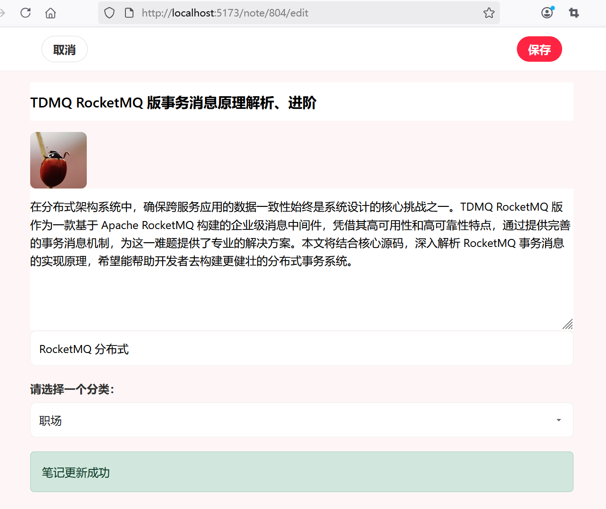


操作失败界面效果如下图5-6所示。


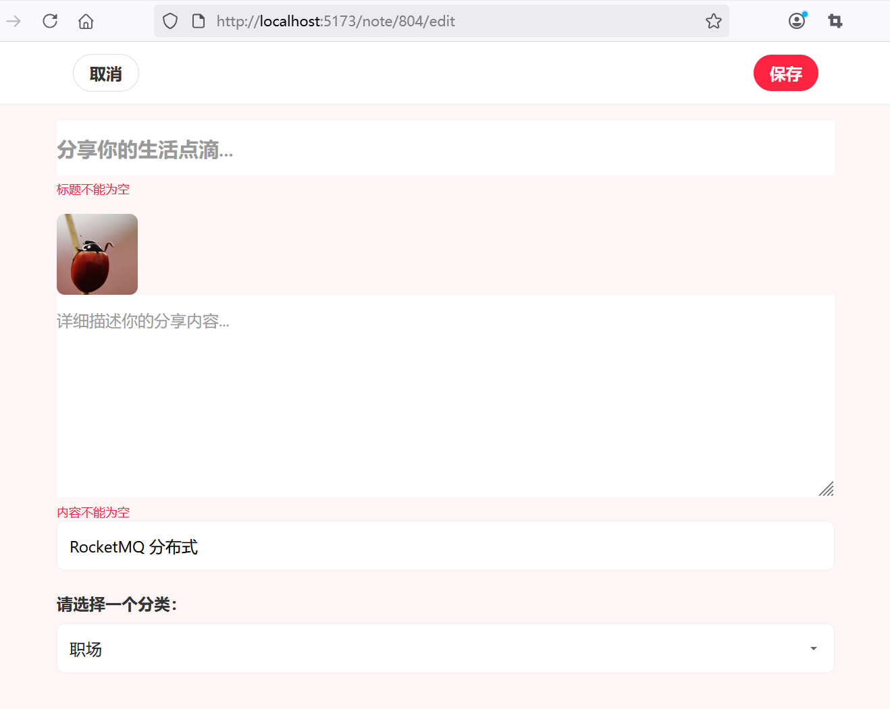


## 5.7 全栈实战笔记删除功能

### 后端接口

NoteController删除接口已经适配，无需调整。


```java
/**
 * 处理删除笔记的请求
 */
@DeleteMapping("/{noteId}")
@PreAuthorize("@noteServiceImpl.isAuthor(#noteId, authentication.name)")
public ResponseEntity<DeleteResponseDto> deleteNote(@PathVariable Long noteId) {
    // 检查笔记是否存在
    Optional<Note> optionalNote = noteService.findNoteById(noteId);
    if (!optionalNote.isPresent()) {
        throw new NoteNotFoundException("");
    }

    Note note = optionalNote.get();

    // 使用服务删除笔记
    noteService.deleteNote(note);

    // 返回响应的内容
    DeleteResponseDto deleteResponseDto = new DeleteResponseDto();
    deleteResponseDto.setMessage("笔记删除成功");
    deleteResponseDto.setRedirectUrl("/user/profile");

    return ResponseEntity.ok(deleteResponseDto);
}
```

### 前端组件设计
 

修改`src\views\NoteDetail.vue`，增加如下函数：

```ts
// 删除笔记
const deleteNote = async () => {
  try {
    if (confirm('确定要删除该笔记吗？')) {
      await axios.delete(`/api/note/${noteId.value}`);

      alert('删除成功');

      // 跳转到用户信息页面
      router.push({ name: 'profile-placeholder' });
    }
  }
  catch (error) {
    console.error('删除失败：', error);
  }
}

// ...为节约篇幅，此处省略非核心内容

<!-- 删除 -->
<button class="btn btn-light btn-sm" v-if="me.username === note.username" @click="deleteNote">
  <i class="fa fa-trash"></i>
</button>
```


注意，跳转的是用户信息页面，路由的名称是“profile-placeholder”，而非“user-profile”。


### 运行调测

运行应用访问笔记详情页面进行删除操作，操作成功界面效果如下图5-7所示。


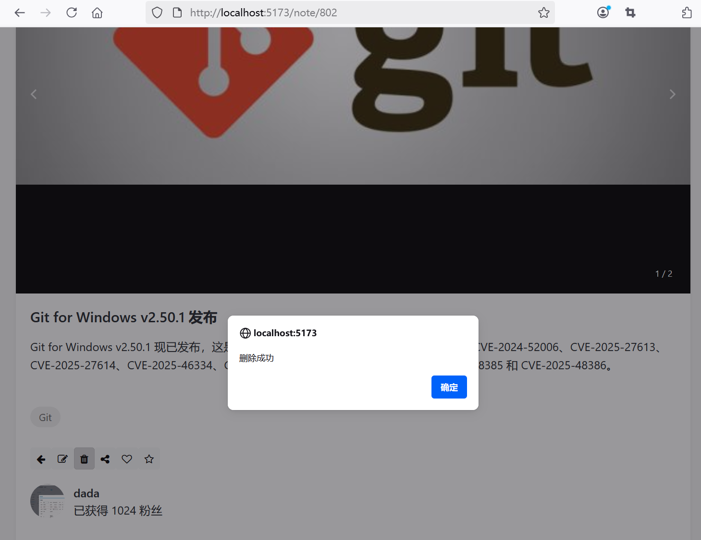


点击“确定”按钮之后，就能跳转到用户信息页面。


## 6.1 全栈视角下的点赞模块前后端划分与功能全流程剖析

将点赞模块从 Thymeleaf 后端渲染模式迁移到 Vue 3 前端渲染模式，需要对数据流转、交互逻辑、API 设计和状态管理进行全面调整。以下是核心改造点和实施建议：


### 架构与交互模式的核心变化

#### 1. 数据流转方式
- Thymeleaf 模式：
  ```
  浏览器 → 表单提交/链接点击 → 后端控制器 → 数据库操作 → 重定向到原页面
  ```
- Vue 3 模式：
  ```
  浏览器 → Vue 组件 → API 请求 → 后端服务 → JSON 响应 → 前端更新视图
  ```

#### 2. 状态管理
- Thymeleaf：依赖后端会话和页面刷新
- Vue 3：使用 Pinia/Vuex 或组件状态管理状态


通过以上改造，点赞模块将从后端渲染转变为前端渲染，实现更流畅的交互体验和更好的可维护性。关键是要处理好前后端分离后的API设计、状态管理和用户体验优化。


## 6.2 全栈实战点赞功能：掌握缓存与状态管理协同策略

### 后端接口

LikeController点赞接口已经适配，无需调整。


```java
/**
 * 处理点赞、取消点赞请求
 *
 * @param noteId
 * @return
 */
@PostMapping("/{noteId}")
public ResponseEntity<LikeResponseDto> toggleLike(@PathVariable Long noteId) {
    User currentUser = userService.getCurrentUser();

    boolean isLiked = likeService.toggleLike(noteId, currentUser);
    long likeCount = likeService.getLikeCount(noteId);

    return ResponseEntity.ok(new LikeResponseDto(isLiked, likeCount));
}
```


### 前端组件设计
 
#### 定义DTO对象

新增`src\dto\like-response-dto.ts`：

```
export class LikeResponseDto {
  likeCount: number = 0;
  liked: boolean = false;
}
```

#### 增加点赞事件处理

修改`src\views\NoteDetail.vue`，增加如下函数：

```ts
import { LikeResponseDto } from '@/dto/like-response-dto';

// 点赞状态
const likeResponseDto = ref<LikeResponseDto>(new LikeResponseDto());

// 点赞
const handleLike = async () => {
  try {
    const response = await axios.post(`/api/like/${noteId.value}`)
    likeResponseDto.value = response.data
  } catch (error) {
    console.error('点赞错误：', error)
  }
}

// ...为节约篇幅，此处省略非核心内容

<!-- 点赞 -->
<button class="btn btn-light btn-sm" @click="handleLike">
 <i :class="likeResponseDto.liked ? 'fa fa-heart liked' : 'fa fa-heart-o'"></i>
 {{ likeResponseDto.likeCount }}
</button>
```


#### 处理点赞状态

初始化笔记数据时，刷新点赞状态。

```ts
const fetchNote = async (noteId: any) => {
  try {
    const response = await axios.get(`/api/note/${noteId}`);
    note.value = response.data;

    // 刷新点赞状态
    likeResponseDto.value.likeCount = note.value.likeCount;
    likeResponseDto.value.liked = note.value.liked;
  } catch (error) {
    console.error('获取笔记详情失败：' + error);
  }
}
```


### 运行调测

运行应用访问笔记详情页面进行点赞操作，未点赞前界面效果如下图6-1所示。


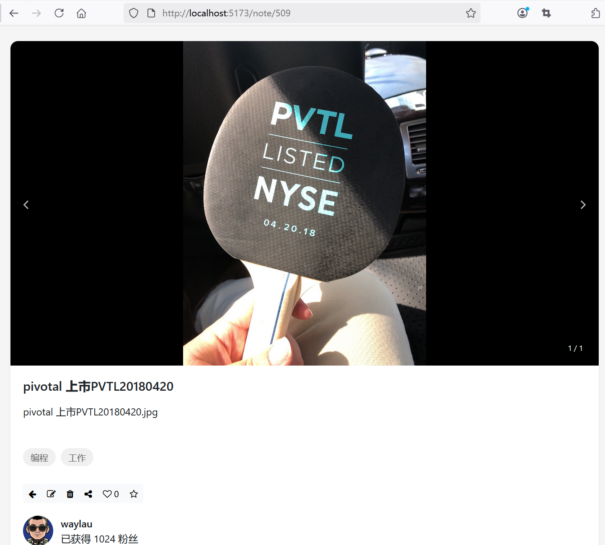


点赞后界面效果如下图6-2所示。


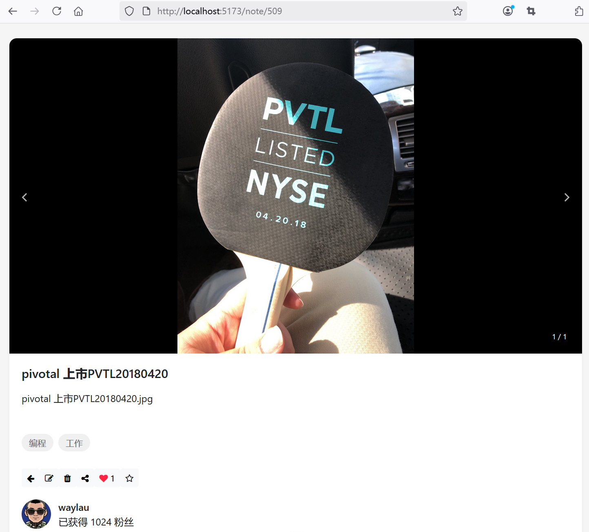


## 7.1 全栈视角下的评论模块前后端划分与功能全流程剖析

将评论模块从 Thymeleaf 后端渲染模式迁移到 Vue 3 前端渲染模式，需要对数据流转、交互逻辑、API 设计和状态管理进行全面调整。以下是核心改造点和实施建议。


### 架构与交互模式的核心变化

#### 1. 数据流转方式

- Thymeleaf 模式：
  ```
  浏览器 → 表单提交 → 后端控制器 → 数据库操作 → 重定向到笔记详情页
  ```
- Vue 3 模式：
  ```
  浏览器 → Vue 组件 → API 请求 → 后端服务 → JSON 响应 → 前端更新视图
  ```

#### 2. 渲染与交互方式

- Thymeleaf：服务器端渲染，每次操作后刷新整个页面
- Vue 3：前端渲染，局部更新评论列表，无刷新体验


通过以上改造，评论模块将从后端渲染转变为前端渲染，实现更流畅的交互体验和更好的可维护性。关键是要处理好前后端分离后的API设计、状态管理和用户体验优化。


## 7.2 全栈实战评论功能：掌握千万级访问的实时评论应对方案

### 后端接口

CommentController评论接口已经适配，无需调整。


```java
// 处理创建评论的请求
@PostMapping("/{noteId}")
public ResponseEntity<CommentResponseDto> createComment(@PathVariable("noteId") Long noteId,
                                                        @RequestBody String content) {
    // 判定笔记是否存在
    Optional<Note> optionalNote = noteService.findNoteById(noteId);
    if (!optionalNote.isPresent()) {
        throw new NoteNotFoundException("");
    }

    Note note = optionalNote.get();
    User user = userService.getCurrentUser();

    Comment comment = commentService.createComment(note, user, content);

    // 将Comment对象转换成DTO对象
    CommentResponseDto commentResponseDto = CommentResponseDto.toCommentResponseDto(comment);

    return ResponseEntity.ok(commentResponseDto);
}

// 处理获取笔记评论列表的请求
@GetMapping("/{noteId}")
public ResponseEntity<List<CommentResponseDto>> getCommentsByNoteId(@PathVariable("noteId") Long noteId) {
    // 判定笔记是否存在
    Optional<Note> optionalNote = noteService.findNoteById(noteId);
    if (!optionalNote.isPresent()) {
        throw new NoteNotFoundException("");
    }

    List<Comment> comments = commentService.getCommentsByNoteId(noteId);

    // 将Comment对象转换成DTO对象
    List<CommentResponseDto> commentResponseDtoList = comments.stream().map(CommentResponseDto::toCommentResponseDto)
            .collect(Collectors.toUnmodifiableList());

    return ResponseEntity.ok(commentResponseDtoList);
}

// 处理创建回复的请求
@PostMapping("/{noteId}/reply/{parentCommentId}")
public ResponseEntity<CommentResponseDto> replyToComment(@PathVariable("noteId") Long noteId,
                                                            @PathVariable("parentCommentId") Long parentCommentId,
                                                            @RequestBody String content) {
    // 判定笔记是否存在
    Optional<Note> optionalNote = noteService.findNoteById(noteId);
    if (!optionalNote.isPresent()) {
        throw new NoteNotFoundException("");
    }

    // 判定父级评论是否存在
    Optional<Comment> optionalParentComment = commentService.findCommentById(parentCommentId);
    if (!optionalParentComment.isPresent()) {
        throw new CommentNotFoundException("");
    }

    // 判定父级评论是否属于该笔记
    Comment parentComment = optionalParentComment.get();
    if (!parentComment.getNote().getNoteId().equals(noteId)) {
        throw new CommentNotFoundException("评论与笔记不匹配");
    }

    Note note = optionalNote.get();
    User user = userService.getCurrentUser();
    Comment reply = commentService.replyToComment(note, parentComment, user, content);

    // 将Comment对象转换成DTO对象
    CommentResponseDto commentResponseDto = CommentResponseDto.toCommentResponseDto(reply);

    return ResponseEntity.ok(commentResponseDto);
}

// 处理删除评论（包含回复）的请求
@DeleteMapping("/{commentId}")
public ResponseEntity<Void> deleteComment(@PathVariable("commentId") Long commentId) {
    // 判定评论是否存在
    Optional<Comment> optionalComment = commentService.findCommentById(commentId);
    if (!optionalComment.isPresent()) {
        throw new CommentNotFoundException("");
    }

    // 判定评论是否是自己的
    Comment comment = optionalComment.get();
    User user = userService.getCurrentUser();
    if (!comment.getUser().getUserId().equals(user.getUserId())) {
        throw new CommentNotFoundException("无权删除他人的评论");
    }

    commentService.deleteComment(comment);

    return ResponseEntity.noContent().build();
}
```


### 前端组件设计
 
#### 定义DTO对象

新增`src\dto\comment-response-dto.ts`：

```ts
export class CommentResponseDto {
  commentId: number = 0;
  content: string = '';
  noteId: number | null = null;
  userId: number | null = null;
  username: string = '';
  avatar: string = '';
  createdAt: string = '';
  parentCommentId: number | null = null;
  parentCommentUsername: string = '';
  replies: Array<CommentResponseDto> = [];
}
```

#### 增加评论事件处理

修改`src\views\NoteDetail.vue`，增加如下函数：

```ts
// 评论状态
const newComment = ref('');
const commentResponseDtoArray = ref<Array<CommentResponseDto>>([]);

// 发布评论
const postComment = async () => {
  if (newComment.value.trim() === '') {
    return
  }

  try {
    const response = await axios.post(`/api/comment/${noteId.value}`,
      // 传递的是纯文本内容
      newComment.value.trim(),
      { headers: { 'Content-Type': 'text/plain' } }
    )

    // 返回的评论列表插入到原来列表顶部
    commentResponseDtoArray.value.unshift(response.data)
    newComment.value = ''
  } catch (error) {
    console.error('发布评论错误：', error)
  }
}


// ...为节约篇幅，此处省略非核心内容

<!-- 评论输入框 -->
<div class="comment-input">
    
    <textarea class="comment-textarea" placeholder="分享你的想法..." v-model="newComment"></textarea>
    <div class="comment-btn" @click="postComment">
    发送
    </div>
</div>
```


## 7.3 实战无刷新查询评论列表功能

### 处理评论列表状态

初始化笔记数据时，刷新评论列表状态

```ts
onMounted(() => {
    // ...为节约篇幅，此处省略非核心内容

    // 加载笔记评论
    fetchNoteComments()
});

// 加载笔记评论
const fetchNoteComments = async () => {
  try {
    const response = await axios.get(`/api/comment/${noteId.value}`)
    commentResponseDtoArray.value = response.data
  } catch (error) {
    console.error('获取笔记评论错误：', error)
  }
}
```

### 编写模板内容


```html
<!-- 评论列表 -->
<div class="comment-list" id="commentList">
    <!-- 评论列表为空的处理 -->
    <p class="empty-comments" v-if="commentResponseDtoArray.length === 0">
    暂无评论，快来发表你的看法吧
    </p>

    <!-- 评论列表不为空的处理 -->
    <div class="comment-item" v-for="comment in commentResponseDtoArray" :key="comment.commentId">
    <!-- 评论头 -->
    <div class="comment-header">
        <!-- 作者信息 -->
        <!-- 点击用户头像跳转到用户详情页 -->
        <a :href="`/user/profile/${comment.userId}`">
        
        </a>
        <div class="comment-user-info">
        <div class="comment-username">{{ comment.username }}</div>
        <div class="comment-time">{{ comment.createdAt }}</div>
        </div>

        <!-- 回复评论按钮 -->
        <button class="reply-btn">
        <i class="fa fa-comment-o"></i>
        </button>

        <!-- 删除评论按钮 -->
        <button class="delete-comment">
        <i class="fa fa-trash-o"></i>
        </button>
    </div>

    <!-- 评论内容 -->
    <div class="comment-content">
        {{ comment.content }}
    </div>

    <!-- 回复列表 -->
    <div class="reply-list">
    </div>
    </div>
</div>
```

### 运行调测

运行应用访问笔记详情页面，未发布评论界面效果如下图7-1所示。


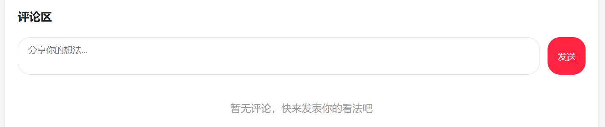


发布评论后评论列表界面效果如下图7-2所示。


### 时间格式化

在时间显示上，需要做格式化处理。


```ts
// 格式化日期
const formatDate = (dateString: string) => {
  const date = new Date(dateString);
  const formattedDate = date.toLocaleString();
  return formattedDate
}
```

在模板上使用上述函数即可：

```html
<div class="comment-time">{{ formatDate(comment.createAt) }}</div>
```

时间格式化后的评论列表界面效果如下图7-3所示。


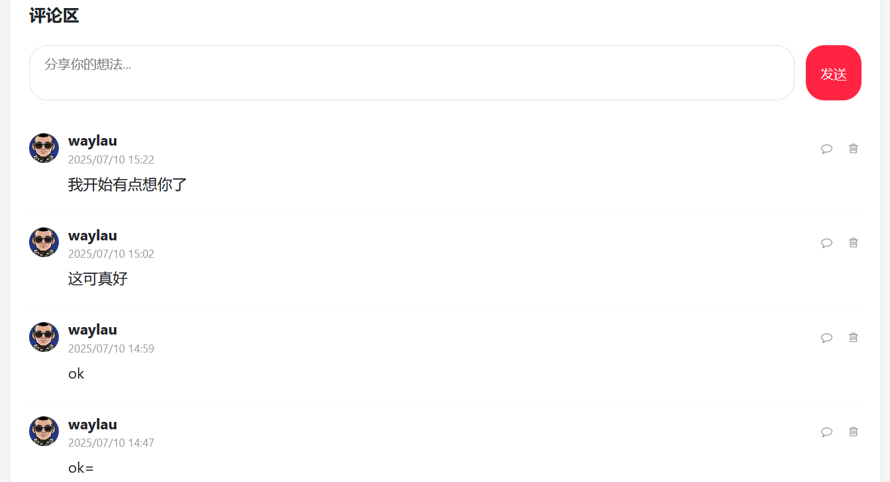


## 7.4 实战无刷新删除评论功能

### 处理删除评论的事件

删除请求发送成功后，执行无刷新删除评论。

```ts
// 删除评论
const deleteComment = async (commentId: number) => { 
  if (!confirm('确定要删除这条评论吗？')) {
    return
  }

  try {
    await axios.delete(`/api/comment/${commentId}`)
    
    // 删除成功后，将该评论从列表中删除
    commentResponseDtoArray.value = 
      commentResponseDtoArray.value.filter(comment => comment.commentId !== commentId)
  } catch (error) {
    console.error('删除评论错误：', error)
  }
}
```

### 编写模板内容


```html
<!-- 删除评论按钮 -->
<button class="delete-comment" v-if="me.username === comment.username" 
  @click="deleteComment(comment.commentId)">
  <i class="fa fa-trash-o"></i>
</button>
```

确保是笔记的作者自己，才能看到删除评论的按钮。


## 7.5 实现回复弹窗及回复列表展示功能

### 实现回复弹窗功能


```ts
const replyModalRef = ref<HTMLDivElement | null>(null);
const replyContentRef = ref<HTMLTextAreaElement | null>(null);
const replyToCommentResponseDto = ref<CommentResponseDto>(new CommentResponseDto());

// ...为节约篇幅，此处省略非核心内容

// 回复评论
function handleReplyComment(comment: CommentResponseDto) { 
  // 显示回复框
  showReplyModal(comment)

  // 设置当前回复的评论
  replyToCommentResponseDto.value = comment
}

// 显示回复框
function showReplyModal(comment: CommentResponseDto) { 
  if (replyModalRef.value) {
    replyModalRef.value.classList.add('show')
    replyModalRef.value.style.display = 'block'

    // 防止背景滚动
    document.body.classList.add('modal-open')

    // 自动聚焦到数框
    setTimeout(() => {
      replyContentRef.value?.focus()
    }, 100)
  }
}

// ...为节约篇幅，此处省略非核心内容

<!-- 回复评论按钮 -->
<button class="reply-btn" @click="handleReplyComment(comment)">
 <i class="fa fa-comment-o"></i>
</button>

// ...为节约篇幅，此处省略非核心内容

  <!-- 回复弹窗 -->
  <div class="modal" id="replyModal" tabindex="-1" aria-labelledby="replyModalLabel" ref="replyModalRef" aria-hidden="true">
    <div class="modal-dialog">
      <div class="modal-content">
        <div class="modal-header">
          <h5 class="modal-title" id="replyModalLabel">回复 <span id="replyToUsername">{{ replyToCommentResponseDto.username }}</span></h5>
        </div>
        <div class="modal-body">
          <div class="reply-to-content"></div>
          <textarea class="form-control" id="replyContent" rows="3" placeholder="写下你的回复..." ref="replyContentRef"></textarea>
        </div>
        <div class="modal-footer">
          <button type="button" class="btn btn-light close-model" data-bs-dismiss="modal" @click="hideReplyModal">取消</button>
          <button type="button" class="btn btn-danger" id="submitReply" @click="submitReply">提交回复</button>
        </div>
      </div>
    </div>
  </div>
```

当点击回复评论按钮时，会显示回复弹窗。效果如下图7-4所示。

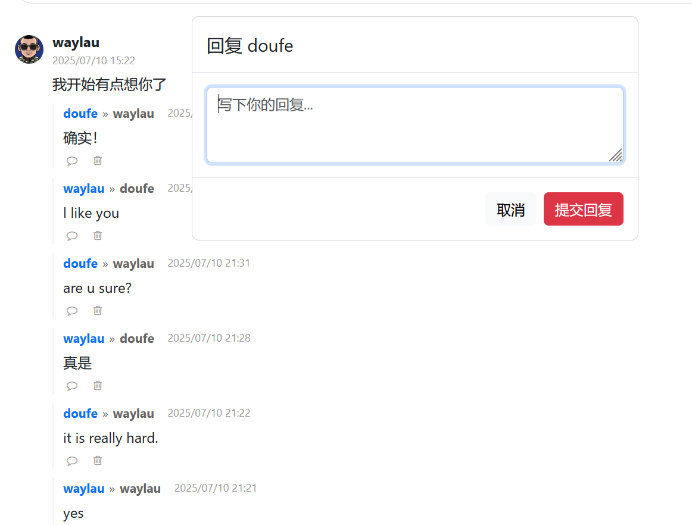


### 实现回复评论功能

在回复弹窗上当点击“提交回复”，则会将回复提交到后端接口，而后关闭窗口；点击“取消”则直接关闭窗口。代码逻辑如下：

```ts
// 隐藏回复框
function hideReplyModal() { 
  if (replyModalRef.value && replyContentRef.value) {
    replyModalRef.value.classList.remove('show')
    replyModalRef.value.style.display = 'none'

    // 恢复背景滚动
    document.body.classList.remove('modal-open')

    // 清空输入框
    replyContentRef.value.value = ''
  }

  replyToCommentResponseDto.value = new CommentResponseDto()
}

// 提交回复
const submitReply = async () => { 
  const replyContent = replyContentRef.value

  if (!replyContent) {
    return
  }

  try { 
    const parentCommentId = replyToCommentResponseDto.value.commentId

    const response = await axios.post(`/api/comment/${noteId.value}/reply/${parentCommentId}`,
      // 传递文本内容
      replyContentRef.value?.value.trim(),
      {
        headers: {
          'Content-Type': 'text/plain'
        }
      }
    )

    // TODO: 回复添加到父级评论的回复列表中

    // 关闭回复框
    hideReplyModal()
  } catch (error) { 
    console.error('提交回复失败：' + error)
  }
}
```


### 实现回复列表展示功能

回复列表是存在于评论对象的replies属性中，因此，当回复成功之后，将回复对象添加到评论对象的replies属性中，代码逻辑如下：

```ts
// 提交回复
const submitReply = async () => {
  const replyContent = replyContentRef.value

  if (!replyContent) {
    return
  }

  try {
    const parentCommentId = replyToCommentResponseDto.value.commentId

    const response = await axios.post(`/api/comment/${noteId.value}/reply/${parentCommentId}`,
      // 传递文本内容
      replyContentRef.value?.value.trim(),
      {
        headers: {
          'Content-Type': 'text/plain'
        }
      }
    )

    // 回复添加到父级评论的回复列表中
    const commentIndex = commentResponseDtoArray.value.findIndex(item => item.commentId === parentCommentId)
    if (commentIndex !== -1) { 
      if (!commentResponseDtoArray.value[commentIndex].replies) { 
        commentResponseDtoArray.value[commentIndex].replies = []
      }
      commentResponseDtoArray.value[commentIndex].replies.unshift(response.data)
    }

    // 关闭回复框
    hideReplyModal()
  } catch (error) {
    console.error('提交回复失败：' + error)
  }
}
```


展示回复列表，代码如下：


```html
<!-- 回复列表 -->
<div class="reply-list" v-for="reply in comment.replies" :key="reply.commentId">
    <div class="reply-item">
    <div class="reply-header">
        <!-- 点击用户名跳转到用户详情页 -->
        <a :href="`/user/profile/${reply.userId}`">
        <span class="reply-username">{{ reply.username }}</span>
        </a>
        <span class="reply-to">»</span>
        <span class="reply-target">{{ reply.parentCommentUsername ? reply.parentCommentUsername : '评论作者'
        }}</span>
        <span class="reply-time">{{ formatDate(reply.createAt) }}</span>
    </div>
    <div class="reply-content">{{ reply.content }}</div>
    <!-- 回复回复的按钮-->
    <button class="reply-btn" @click="handleReplyComment(reply)">
        <i class="fa fa-comment-o"></i>
    </button>
    <!-- 删除回复的按钮-->
    <button class="delete-comment" v-if="me.username === reply.username"
        @click="deleteReply(reply.commentId)">
        <i class="fa fa-trash-o"></i>
    </button>
    </div>
</div>
```


## 7.6 实战评论树的遍历渲染方案及无刷新删除回复

### 针对回复的回复处理


针对回复，也是可以继续进行回复。处理逻辑类似，因此可以复用相关的代码：

```html
<!-- 回复回复的按钮-->
<button class="reply-btn" @click="handleReplyComment(reply)">
    <i class="fa fa-comment-o"></i>
</button>
```

不过，评论和回复的存储结构是不同的，因此，需要对submitReply函数进行抽痛，以适配具有树形结构回复内容的场景。


```ts
// 提交回复
const submitReply = async () => {
  const replyContent = replyContentRef.value

  if (!replyContent) {
    return
  }

  try {
    const parentCommentId = replyToCommentResponseDto.value.commentId

    const response = await axios.post(`/api/comment/${noteId.value}/reply/${parentCommentId}`,
      // 传递文本内容
      replyContentRef.value?.value.trim(),
      {
        headers: {
          'Content-Type': 'text/plain'
        }
      }
    )

    // 回复添加到父级评论的回复列表中
    /*const commentIndex = commentResponseDtoArray.value.findIndex(item => item.commentId === parentCommentId)
    if (commentIndex !== -1) { 
      if (!commentResponseDtoArray.value[commentIndex].replies) { 
        commentResponseDtoArray.value[commentIndex].replies = []
      }
      commentResponseDtoArray.value[commentIndex].replies.unshift(response.data)
    }*/
    commentResponseDtoArray.value.forEach(root => {
      deepTraverse(root, response.data, root.replies)
    })

    // 关闭回复框
    hideReplyModal()
  } catch (error) {
    console.error('提交回复失败：' + error)
  }
}

// 先遍历找根评论，再找子回复
const deepTraverse = (root: CommentResponseDto, response: CommentResponseDto, replies: Array<CommentResponseDto>) => {
  if (root.commentId === response.parentCommentId) {
    root.replies.unshift(response)
    return
  } else {
    for (const node of replies) {
      if (node.commentId === response.parentCommentId) {
        // 子节点的评论也算在根节点头上
        root.replies.unshift(response)
        break
      }
    }
  }
}
```


### 运行调测

运行应用访问笔记详情页面，评论树的界面效果如下图7-4所示。


### 处理删除回复的事件

删除请求发送成功后，执行无刷新删除回复。

```ts
// 删除回复
const deleteReply = async (commentId: number) => {
  if (!confirm('确定要删除这条回复吗？')) {
    return
  }

  try {
    await axios.delete(`/api/comment/${commentId}`)

    // 从列表中删除回复
    commentResponseDtoArray.value = commentResponseDtoArray.value.filter(comment => {
      comment.replies = comment.replies.filter(reply => reply.commentId !== commentId)
      return comment.replies
    })
  } catch (error) {
    console.error('删除回复失败：' + error)
  }
}
```

### 编写模板内容


```html
<!-- 删除回复的按钮-->
<button class="delete-comment" v-if="me.username === reply.username"
  @click="deleteReply(reply.commentId)">
  <i class="fa fa-trash-o"></i>
</button>
```

确保是回复的作者自己，才能看到删除回复的按钮。


### 运行调测

运行应用访问笔记详情页面，删除回复时的界面效果如下图7-5所示。


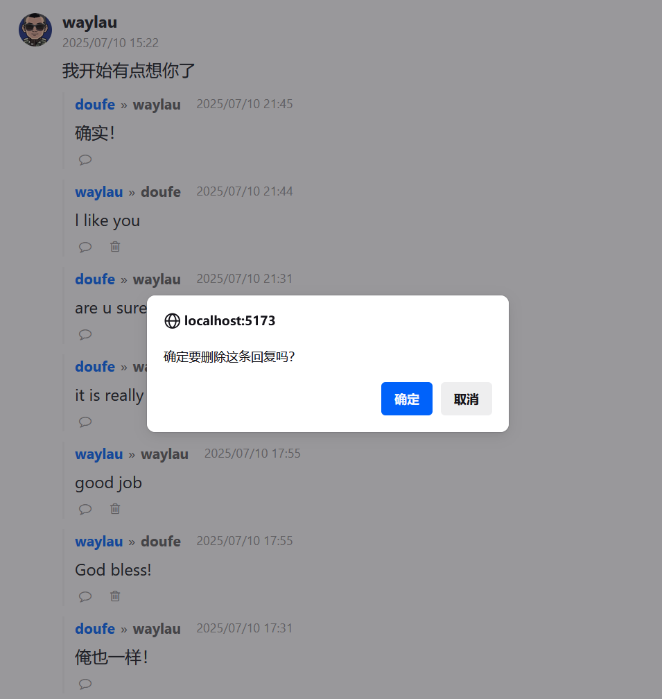


## 8.1 全栈视角下的首页模块前后端划分与功能全流程剖析

将首页从 Thymeleaf 后端渲染模式迁移到 Vue 3 前端渲染模式，需要对数据获取方式、组件化设计、路由管理和状态管理进行全面调整。以下是核心改造点和实施建议：


### 架构与交互模式的核心变化

#### 1. 数据流转方式

- Thymeleaf 模式：
  ```
  浏览器 → HTTP 请求 → 后端控制器 → 数据库查询 → 模板渲染 → HTML 响应
  ```
- Vue 3 模式：
  ```
  浏览器 → Vue 应用初始化 → API 请求 → 后端服务 → JSON 响应 → 前端渲染
  ```

#### 2. 渲染与交互方式

- Thymeleaf：服务器端渲染，每次导航刷新整个页面
- Vue 3：前端渲染，单页应用（SPA），局部更新内容，无刷新体验


通过以上改造，首页将从后端渲染转变为前端渲染，实现更流畅的交互体验和更好的可维护性。关键是要处理好前后端分离后的API设计、组件化开发和用户体验优化。


## 8.2 首页模块整体布局升级至Vue 3架构

### 后端接口

ExploreController返回首页笔记探索页面的笔记数据接口已经适配，无需调整。

```java
/**
 * 处理笔记探索页面的数据加载的请求
 */
@GetMapping("/note")
public ResponseEntity<NoteResponseDto> getNotesByCategory(@RequestParam(defaultValue = "1") int page,
                                                          @RequestParam(required = false) String category,
                                                          @RequestParam(required = false) String query) {
    // 注意：把分类“推荐”当成null
    if (DEFAULT_CATEGORY.equals(category)) {
        category = null;
    }

    // 分页查询笔记
    Page<Note> notes = null;
    // 判定query是否为空
    if (query != null && query.trim().length() > 0) {
        notes = noteService.getNotesByPageAndQuery(page, PAGE_SIZE, category, query);
    } else {
        notes = noteService.getNotesByPage(page, PAGE_SIZE, category);
    }

    NoteResponseDto noteResponseDto = new NoteResponseDto();
    noteResponseDto.setHasMore(notes.hasNext());

    User user = userService.getCurrentUser();

    // 处理序列化问题
    List<NoteExploreDto> noteExploreDtoLst = new ArrayList<>();
    for (Note note : notes.getContent()) {
        noteExploreDtoLst.add(NoteExploreDto.toExploreDto(note, user));
    }
    noteResponseDto.setNotes(noteExploreDtoLst);

    return ResponseEntity.ok(noteResponseDto);
}
```

### 前端组件设计


#### Explore.vue

新增`src\views\Explore.vue`：

```vue
<script setup lang="ts">
import { User } from '@/dto/user';
import { useAuthStore } from '@/stores/auth';
import { ref, onMounted } from 'vue'
import { useRouter } from 'vue-router';

const me = ref<User>(new User())
const authStore = useAuthStore()
const router = useRouter()

onMounted(() => { 
  me.value = authStore.getUser ? authStore.getUser : new User()
})  

// 注销
function logout() {
  authStore.logout()

  // 跳转到登录页面
  router.push({ name: 'login' })
}
</script>

<template>
  <!-- 顶部导航栏 -->
  <header>
    <nav class="navbar navbar-expand-lg">
      <div class="container">
        <a class="navbar-brand" href="/">
          
        </a>

        <!-- 搜索框-->
        <div class="col-md-3">
          <div class="input-group">
            <input class="form-control" type="text" placeholder="搜索感兴趣的内容" aria-label="Search" id="searchInput">
            <button class="btn btn-outline-secondary" type="button" id="searchButton">
              搜索
            </button>
          </div>
        </div>

        <button class="navbar-toggler" type="button" data-bs-toggle="collapse" data-bs-target="#navbarNav"
          aria-controls="navbarNav" aria-expanded="false" aria-label="Toggle navigation">
          <span class="navbar-toggler-icon"></span>
        </button>

        <div class="collapse navbar-collapse" id="navbarNav">
          <ul class="navbar-nav me-auto">
          </ul>

          <ul class="navbar-nav mb-2 mb-lg-0">
            <li class="nav-item dropdown">
              <a class="nav-link dropdown-toggle" href="#" data-bs-target="dropdown" data-bs-toggle="dropdown"
                aria-expanded="false">
                {{ me.username}}
              </a>

              <ul class="dropdown-menu" id="dropdown">
                <li class="dropdown-item">
                  <a class="nav-link" href="/user/profile">个人资料</a>
                </li>
                <li class="dropdown-item">
                  <a class="nav-link" href="#" @click="logout">退出登录</a>
                </li>
              </ul>
            </li>

          </ul>

        </div>
      </div>
    </nav>
  </header>

  <!-- 分类导航 -->
  <header>
    <div class="container">
      <div class="category-item active">推荐</div>
      <div class="category-item">穿搭</div>
      <div class="category-item">美食</div>
      <div class="category-item">彩妆</div>
      <div class="category-item">影视</div>
      <div class="category-item">职场</div>
      <div class="category-item">情感</div>
      <div class="category-item">家居</div>
      <div class="category-item">游戏</div>
      <div class="category-item">旅行</div>
      <div class="category-item">健身</div>
    </div>
  </header>

  <main>
    <div class="container">
      <!-- 笔记卡片网格 -->
      <div class="masonry" id="notesGrid">
        <!-- 笔记卡片是通过JavaScript动态生成 -->
      </div>
      <!-- 加载更多内容提示 -->
      <div class="load-more" id="loadMore">
        <i class="fa fa-spinner fa-spin"></i>加载更多
      </div>
      <!-- 没有更多内容提示 -->
      <div class="no-more" id="noMoreContent">
        <p>已经到底啦~</p>
      </div>
    </div>
  </main>
  <footer>
    <!-- 底部导航栏 -->
    <div class="container bottom-nav">
      <div class="nav-item active" onclick="navigateTo('home')">
        <i class="fa fa-home nav-icon"></i>
        <span class="nav-text">首页</span>
      </div>
      <div class="nav-item" onclick="navigateTo('discover')">
        <i class="fa fa-compass nav-icon"></i>
        <span class="nav-text">发现</span>
      </div>
      <div class="nav-item" onclick="navigateTo('publish')">
        <i class="fa fa-plus nav-icon"></i>
        <span class="nav-text">发布</span>
      </div>
      <div class="nav-item" onclick="navigateTo('message')">
        <i class="fa fa-comment-o nav-icon"></i>
        <span class="nav-text">消息</span>
      </div>
      <div class="nav-item" onclick="navigateTo('profile')">
        <i class="fa fa-user-o nav-icon"></i>
        <span class="nav-text">我的</span>
      </div>
    </div>
  </footer>

</template>
<style setup>
/* 全局样式 */
body {
  font-family: -apple-system, BlinkMacSystemFont, "Segoe UI", Roboto, "Helvetica Neue", Arial, sans-serif;
  background-color: #f5f5f5;
}

/* 分类导航 */
.category-nav {
  background-color: white;
  padding: 8px 0;
  overflow-x: auto;
  white-space: nowrap;
  -webkit-overflow-scrolling: touch;
}

.category-item {
  display: inline-block;
  padding: 6px 12px;
  margin-right: 8px;
  border-radius: 20px;
  font-size: 14px;
  cursor: pointer;
  transition: background-color 0.2s;
}

.category-item.active {
  background-color: #ff2442;
  color: white;
}

/* 笔记卡片网格 */
.notes-grid {
  display: grid;
  grid-template-columns: repeat(auto-fill, minmax(180px, 1fr));
  gap: 8px;
  padding: 8px;
}

.note-card {
  background-color: white;
  border-radius: 8px;
  overflow: hidden;
  box-shadow: 0 1px 2px rgba(0, 0, 0, 0.05);
}

.note-image-container {
  position: relative;
  padding-bottom: 100%;
  /* 保持正方形比例 */
  overflow: hidden;
  border-radius: 12px;
}

.note-image {
  position: absolute;
  top: 0;
  left: 0;
  width: 100%;
  height: 100%;
  object-fit: cover;
}

.note-tag {
  position: absolute;
  bottom: 8px;
  left: 8px;
  background-color: rgba(0, 0, 0, 0.5);
  color: white;
  padding: 2px 8px;
  border-radius: 10px;
  font-size: 12px;
}

.note-content {
  padding: 8px;
}

.note-title {
  font-size: 14px;
  font-weight: 500;
  margin-bottom: 4px;
  line-height: 1.4;
  overflow: hidden;
  text-overflow: ellipsis;
  display: -webkit-box;
  -webkit-line-clamp: 2;
  -webkit-box-orient: vertical;
}

.note-author {
  display: flex;
  align-items: center;
  margin-bottom: 4px;
}

.author-avatar {
  width: 20px;
  height: 20px;
  border-radius: 50%;
  margin-right: 6px;
}

.author-name {
  font-size: 12px;
  color: #666;
}

.note-author-stats {
  display: flex;
  justify-content: space-between;
}

.note-stats {
  display: flex;
  align-items: center;
  font-size: 12px;
  color: #999;
}

.stat-item {
  margin-right: 12px;
}

/* 加载更多 */
.load-more {
  text-align: center;
  padding: 16px 0;
  color: #666;
  font-size: 14px;
}

/* 没有更多 */
.no-more {
  text-align: center;
  padding: 0 0 50px 0;
  color: #666;
  font-size: 14px;
  display: none;
}

/* 底部导航栏 */
.bottom-nav {
  position: fixed;
  bottom: 0;
  left: 0;
  right: 0;
  display: flex;
  justify-content: space-around;
  padding: 8px 0;
  box-shadow: 0 -1px 2px rgba(0, 0, 0, 0.05);
  z-index: 100;
  background-color: #f5f5f5;
}

.nav-item {
  display: flex;
  flex-direction: column;
  align-items: center;
  color: #666;
  cursor: pointer;
}

.nav-item.active {
  color: #ff2442;
}

.nav-icon {
  font-size: 20px;
  margin-bottom: 2px;
}

.nav-text {
  font-size: 10px;
}

/* 去掉下划线 */
a {
  text-decoration: none;
}

/* 瀑布流布局 */
.masonry {
  column-count: 4;
  column-gap: 1em;
  padding: 10;
}

.masonry-item {
  display: inline-block;
  margin: 0 0 1.5em;
  width: 100%;
}

.masonry-note-image {
  border-radius: 12px;
  width: 100%;
  height: auto;
}

@media only screen and (max-width: 320px) {
  .masonry {
    column-count: 1;
  }
}

@media only screen and (min-width: 321px) and (max-width: 768px) {
  .masonry {
    column-count: 2;
  }
}

@media only screen and (min-width: 769px) and (max-width: 1200px) {
  .masonry {
    column-count: 3;
  }
}

@media only screen and (min-width: 1201px) {
  .masonry {
    column-count: 4;
  }
}

/* 点赞按钮样式 */
.liked {
  color: #ff2442;
}

.like-btn {
  cursor: pointer;
}
</style>
```

### 路由配置


```ts
const router = createRouter({
  history: createWebHistory(import.meta.env.BASE_URL),
  routes: [
    // ...为节约篇幅，此处省略非核心内容

    ,
    {
      path: '/explore',
      name: 'explore',
      component: () => import('../views/Explore.vue'),
      meta: { requiresAuth: true },
    }
  ],
})
```


同时，全局前置守卫还要处理`/home`到`/explore`的重定向

```ts
// 全局前置守卫
router.beforeEach(async (to, from, next) => {
  // ...为节约篇幅，此处省略非核心内容

  // 获取用户ID
  if (to.name === 'profile-placeholder' && authStore.getUser) {
    next({ name: 'user-profile', params: { userId: (authStore.getUser as any).userId } })
  } else if (to.name === 'home') {
    // 跳转从Home到Explore页面
    next({ name: 'explore'})
  } else {
    next()
  }

})
```


### 运行调测

运行应用访问首页，可以看到界面效果如下图8-1所示。


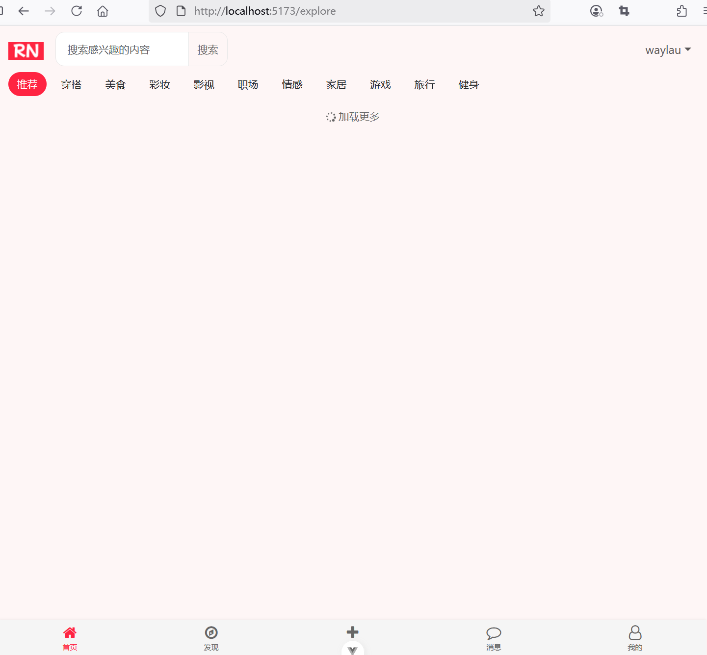


## 8.3 全栈实战瀑布流布局的核心要点

### 业务逻辑

```ts
// ...为节约篇幅，此处省略非核心内容`
const noteList = ref<Array<NoteExploreDto>>([])
const isLoading = ref(false)
const hasMore = ref(true)
const loadMoreRef = ref<HTMLDivElement | null>(null)
const noMoreContentRef = ref<HTMLDivElement | null>(null)
const category = ref('')
const page = ref(1)
const query = ref('')

onMounted(() => { 
  me.value = authStore.getUser ? authStore.getUser : new User()

  // 加载笔记数据
  loadMoreNotes()

  // 监听滚动事件
  window.addEventListener('scroll', () => { 
    const scrollTop = window.pageYOffset || document.documentElement.scrollTop;
    const windowHeight = window.innerHeight;
    const documentHeight = document.documentElement.scrollHeight;

    console.log('scrollTop: ' + scrollTop);
    console.log('windowHeight: ' + windowHeight);
    console.log('documentHeight: ' + documentHeight);

    if (scrollTop + windowHeight >= documentHeight - 300) {
        loadMoreNotes();
    }
  })
})  

// 数字格式化，转为k/w单位``````````````````````````````````````````````````````````````````````````````````````
function formateNumber(num: number) {
  if (num >= 10000) {
    return (num / 10000).toFixed(1) + 'w'
  } else if (num >= 1000) {
    return (num / 1000).toFixed(1) + 'k'
  } else {
    return num
  }
}

// 加载更多笔记数据
const loadMoreNotes = async () => {
  if (isLoading.value || !hasMore.value) {
    // 隐藏“加载”
    hideLoadMore()
    
    // 显示“没有更多”
    showNoMoreContent()
    return
  }

  isLoading.value = true
  // 显示“加载”
  showLoadMore()

  // 获取当前分类
  category.value = document.querySelector('.category-item.active')?.textContent?.trim() ?? '推荐'

  try { 
    // 发送API请求
    const response = await axios.get(`/api/explore/note?page=${page.value}&category=${category.value}&query=${query.value}`)
    const data = response.data
    if (data.notes && data.notes.length > 0) { 
      page.value++
      noteList.value = noteList.value.concat(data.notes)
      hasMore.value = data.hasMore
    } else { 
      hasMore.value = false
    }

    isLoading.value = false
    
    // 隐藏“加载”
    hideLoadMore()

    if (!hasMore.value) {
      // 显示“没有更多”
      showNoMoreContent()
    }
  } catch (error) { 
    console.log('加载更多笔记失败', error)
    isLoading.value = false
    // 隐藏“加载”
    hideLoadMore()
  }
}

function hideLoadMore() {
  if (loadMoreRef.value) { 
    loadMoreRef.value.style.display = 'none'
  }
}

function showNoMoreContent() {
  if (noMoreContentRef.value) { 
    noMoreContentRef.value.style.display = 'block'
  }
}

function showLoadMore() {
  if (loadMoreRef.value) { 
    loadMoreRef.value.style.display = 'block'
  }
}
```

### 模板


```html
<!-- 笔记卡片网格 -->
<div class="masonry" id="notesGrid">
  <!-- 笔记卡片是通过Vue动态生成 -->
  <div class="masonry-item" v-for="note in noteList">
      <!-- 点击跳转到笔记详情页 -->
      <a :href="`/note/${note.noteId}`">
          
      </a>
      <div class="note-content">
          <div class="note-title">{{ note.title }}</div>
          <div class="note-author-stats">
              <!-- 点击跳转到用户详情页 -->
              <a :href="`/user/profile/${note.userId}`">
                  <div class="note-author">
                      
                      <span class="author-name">{{ note.username }}</span>
                  </div>
              </a>

              <div class="note-stats">
                  <div class="stat-item">
                      <i :class="note.liked ? 'fa fa-heart liked' : 'fa fa-heart-o'"
                          onclick="handleLike(this)">{{ formateNumber(note.likeCount) }}</i>
                  </div>
              </div>
          </div>
      </div>
  </div>
</div>
<!-- 加载更多内容提示 -->
<div class="load-more" id="loadMore" ref="loadMoreRef">
  <i class="fa fa-spinner fa-spin"></i>加载更多
</div>
<!-- 没有更多内容提示 -->
<div class="no-more" id="noMoreContent" ref="noMoreContentRef">
  <p>已经到底啦~</p>
</div>
```


### 运行调测

运行应用访问首页，可以看到界面效果如下图8-2所示。


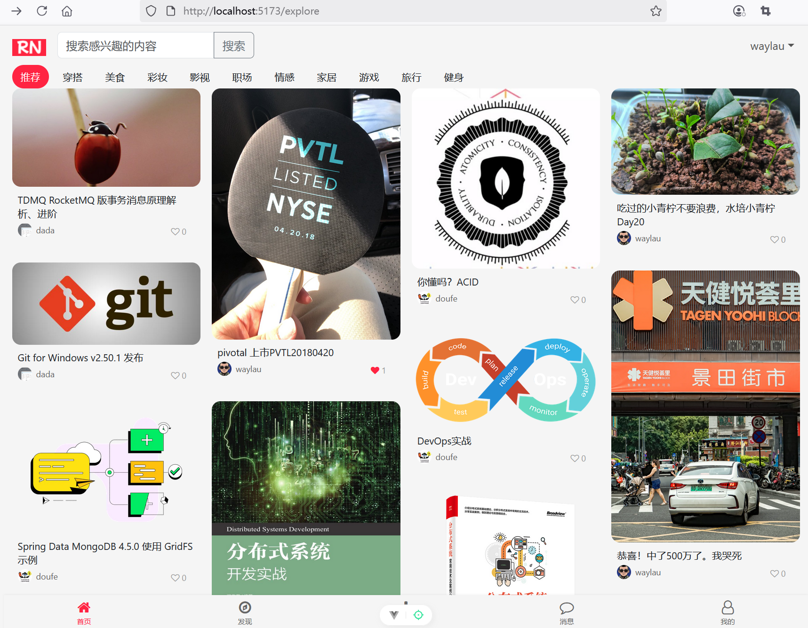


页面向下滑动，可以继续加载后续笔记内容，界面效果如下图8-3所示。


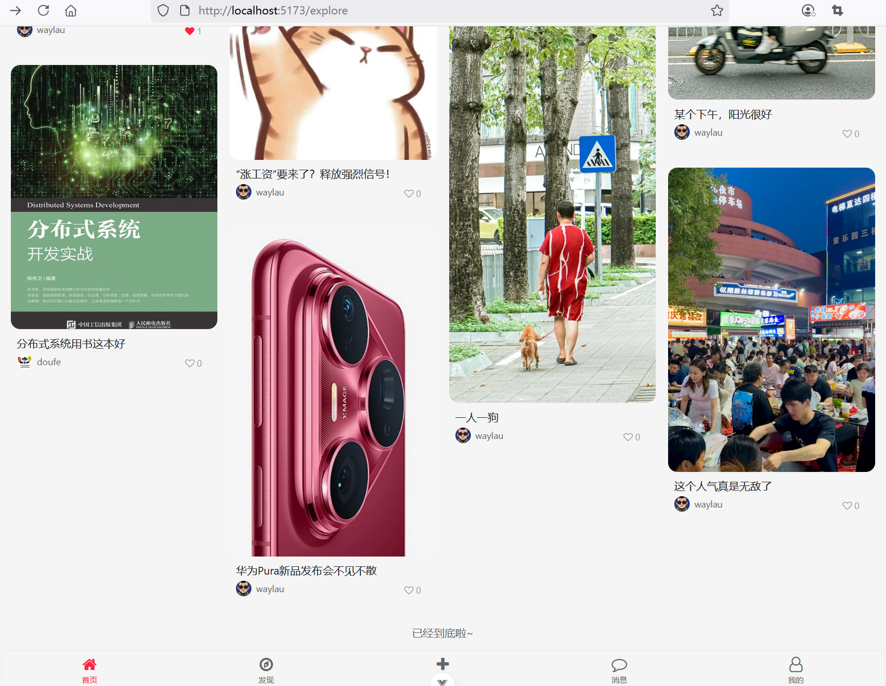


## 8.4 全栈实战分页搜索功能的核心要点

### 为分类导航添加点击事件

```ts
onMounted(() => {
  // ...为节约篇幅，此处省略非核心内容
  
  // 分类导航设置点击事件
  document.querySelectorAll('.category-item').forEach(item => {
    item.addEventListener('click', () => {
      // 移除所有active类
      document.querySelectorAll('.category-item').forEach(i => {
        i.classList.remove('active');
      });

      // 添加active类
      item.classList.add('active');

      // 执行搜索
      performSearch()
    })
  })
})

// 执行搜索
function performSearch() {
  // 重置笔记网格数据
  noteList.value = [];
  page.value = 1;
  isLoading.value = false;
  hasMore.value = true;

  loadMoreNotes();
}
```


### 为搜索输入框绑定模型

```html
<input class="form-control" type="text" placeholder="搜索感兴趣的内容" aria-label="Search" id="searchInput"
  v-model="query">
```

### 为搜索按钮设置点击事件处理


```ts
// 点击搜索
function handleSearch() {
  // 执行搜索
  performSearch()
}

// ...为节约篇幅，此处省略非核心内容
<button class="btn btn-outline-secondary" type="button" id="searchButton" @click="handleSearch">
  搜索
</button>
```


### 底部导航栏设置点击事件

```ts
// 底部导航
function navigateTo(page: string) {
  console.log('navigateTo: ' + page);

  if (page === 'home') {
    window.location.href = '/';
  } else if (page === 'publish') {
    window.location.href = '/note/publish';
  } else if (page === 'profile') {
    window.location.href = '/user/profile';
  } else {
    // 待实现的功能页面
    alert('暂未开放，敬请期待！');

    return;
  }
}

// ...为节约篇幅，此处省略非核心内容

<!-- 底部导航栏 -->
<div class="container bottom-nav">
  <div class="nav-item active" @click="navigateTo('home')">
    <i class="fa fa-home nav-icon"></i>
    <span class="nav-text">首页</span>
  </div>
  <div class="nav-item" @click="navigateTo('discover')">
    <i class="fa fa-compass nav-icon"></i>
    <span class="nav-text">发现</span>
  </div>
  <div class="nav-item" @click="navigateTo('publish')">
    <i class="fa fa-plus nav-icon"></i>
    <span class="nav-text">发布</span>
  </div>
  <div class="nav-item" @click="navigateTo('message')">
    <i class="fa fa-comment-o nav-icon"></i>
    <span class="nav-text">消息</span>
  </div>
  <div class="nav-item" @click="navigateTo('profile')">
    <i class="fa fa-user-o nav-icon"></i>
    <span class="nav-text">我的</span>
  </div>
</div>
```

### 设置点赞处理事件


```ts
import type { LikeResponseDto } from '@/dto/like-response-dto';

// 点赞
const handleLike = async (note: NoteExploreDto) => {
  try {
    // 调用API提交点赞
    const response = await axios.post(`/api/like/${note.noteId}`);
    const likeResponseDto: LikeResponseDto = response.data;

    note.likeCount = likeResponseDto.likeCount;
    note.liked = likeResponseDto.liked;
  } catch (error) {
    console.error('点赞错误：', error)
  }
}

// ...为节约篇幅，此处省略非核心内容

<div class="note-stats">
  <div class="stat-item">
    <i :class="note.liked ? 'fa fa-heart liked like-btn' : 'fa fa-heart-o like-btn'"
      @click="handleLike(note)">{{
        formateNumber(note.likeCount) }}</i>
  </div>
</div>
```


### 运行调测

运行应用访问首页进行关键字搜索，看到界面效果如下图8-4所示。


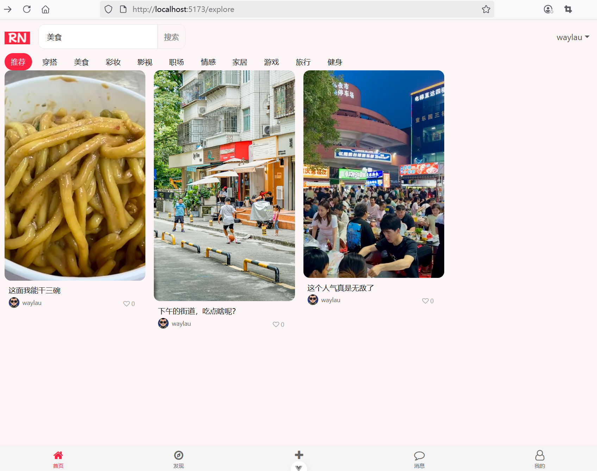


点击分类后进行关键字搜索，界面效果如下图8-5所示。


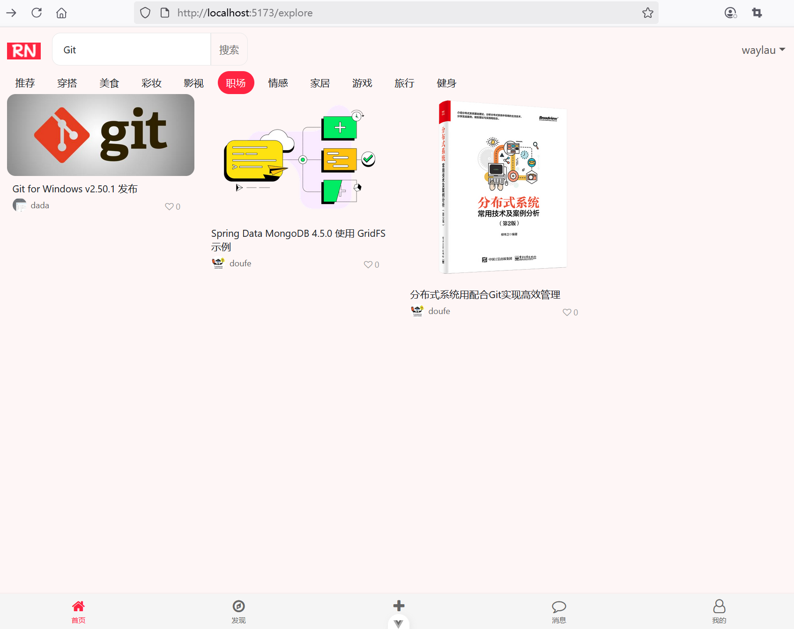

点击底部导航未完成项目的按钮，界面效果如下图8-6所示。


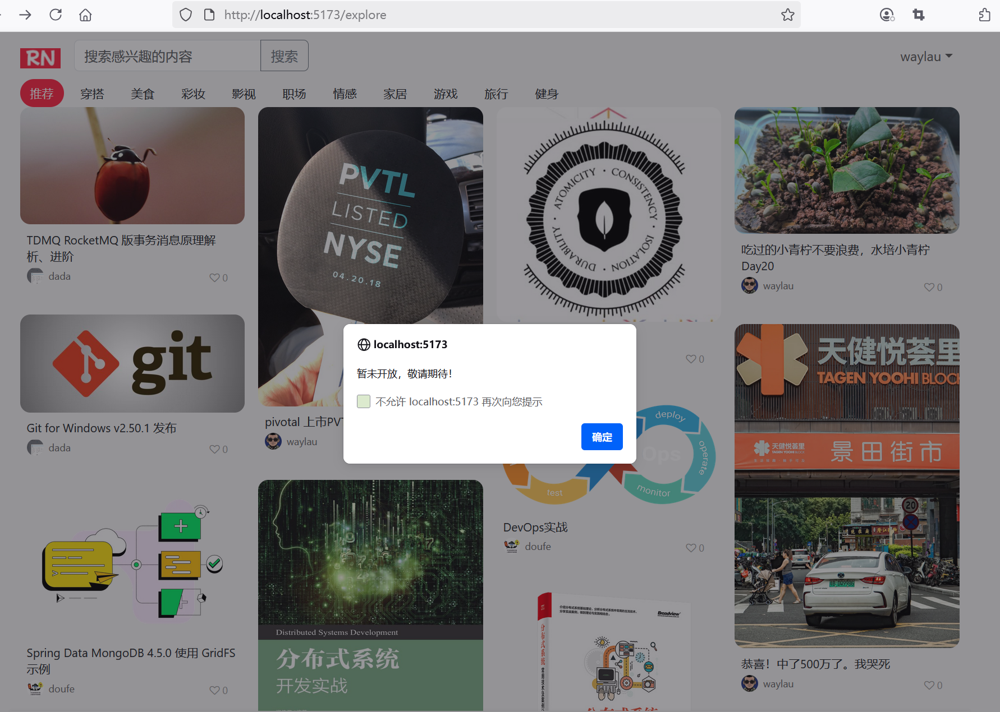


## 9.1 全栈视角下的后台管理模块前后端划分与功能全流程剖析

将后台管理模块从 Thymeleaf 后端渲染模式迁移到 Vue 3 前端渲染模式，需要对数据流转、权限控制、组件设计和状态管理进行全面调整。以下是核心改造点和实施建议：


### 架构与交互模式的核心变化

#### 1. 数据流转方式

- Thymeleaf 模式：
  ```
  浏览器 → 表单提交/链接点击 → 后端控制器 → 数据库操作 → 重定向到管理页面
  ```
- Vue 3 模式：
  ```
  浏览器 → Vue 组件 → API 请求 → 后端服务 → JSON 响应 → 前端更新视图
  ```

#### 2. 权限控制方式

- Thymeleaf：后端基于角色渲染不同页面元素
- Vue 3：前端基于权限动态渲染组件，结合后端接口权限校验


## 9.2 全栈实战基于角色的权限控制及后台管理模块整体框架

### 前端路由与权限控制


1. 增加了requiresRole属性，以校验角色权限。其中，访问后台管理`/admin`页面必须要有ADMIN角色权限；
2. 增加了403-error页面，以响应没有权限的访问；
3. 针对后台管理`/admin`页面，启用了嵌套路由功能。

```ts
const router = createRouter({
  history: createWebHistory(import.meta.env.BASE_URL),
  routes: [
    // ...为节约篇幅，此处省略非核心内容

    {
      path: '/note/publish',
      name: 'note-publish',
      component: () => import('../views/NotePublish.vue'),
      meta: {
        requiresAuth: true,
        requiresRole: 'USER'
      }
    },
    {
      path: '/note/:noteId',
      name: 'note-detail',
      component: () => import('../views/NoteDetail.vue'),
      meta: {
        requiresAuth: true,
        requiresRole: 'USER'
      }
    },
    {
      path: '/note/:noteId/edit',
      name: 'note-edit',
      component: () => import('../views/NoteEdit.vue'),
      meta: {
        requiresAuth: true,
        requiresRole: 'USER'
      }
    },
    {
      path: '/explore',
      name: 'explore',
      component: () => import('../views/Explore.vue'),
      meta: {
        requiresAuth: true,
        requiresRole: 'USER'
      }
    },
    {
      path: '/403-error',
      name: 'forbidden',
      component: () => import('../views/Forbidden.vue')
    },
    {
      path: '/admin',
      name: 'admin',
      component: () => import('../views/AdminView.vue'),
      meta: {
        requiresAuth: true,
        requiresRole: 'ADMIN'
      },
      children: [
        {
          path: '', 
          name: 'admin-redirect-dashboard',
          redirect: '/admin/dashboard'
        },
        {
          path: 'dashboard',
          name: 'admin-dashboard',
          component: () => import('../components/AdminDashboard.vue'),
        },
        {
          path: 'user',
          name: 'admin-user',
          component: () => import('../components/AdminUser.vue'),
        },
        {
          path: 'note',
          name: 'admin-note',
          component: () => import('../components/AdminNote.vue'),
        },
        {
          path: 'comment',
          name: 'admin-comment',
          component: () => import('../components/AdminComment.vue'),
        }
      ]
    },
  ],
})


// 全局前置守卫
router.beforeEach(async (to, from, next) => {
  // ...为节约篇幅，此处省略非核心内容

  // 校验角色
  if(to.meta.requiresRole && !authStore.hasRole(to.meta.requiresRole)) {
    next({ name: 'forbidden' })
  }

  // 获取用户ID
  if (to.name === 'profile-placeholder' && authStore.getUser) {
    next({ name: 'user-profile', params: { userId: (authStore.getUser as any).userId } })
  } else if (to.name === 'home' && authStore.hasRole('USER')) {
    // 跳转从Home到Explore页面
    next({ name: 'explore'})
  } else if (to.name === 'home' && authStore.hasRole('ADMIN')) {
    // 跳转从Home到Admin页面
    next({ name: 'admin'})
  } else {
    next()
  }

})
```


### 修改auth.ts


修改`src\stores\auth.ts`，检查是否具备指定角色：


```ts
export const useAuthStore = defineStore("auth", {
  
  // ...为节约篇幅，此处省略非核心内容

  actions: {
    // ...为节约篇幅，此处省略非核心内容
    
    ,
    // 检查是否具备指定角色
    hasRole(role: any) {
      if (!this.getUser) return false

      return (this.getUser as User).role === (role as string)
    },
  }
})
```

### 新增Forbidden.vue

新增`src\views\Forbidden.vue`


```vue
<script setup lang="ts">
import { useRouter } from 'vue-router';

const router = useRouter();

// 返回
function goBack() {
  router.back();
}
</script>
<template>
  <div class="container align-items-center min-vh-100 py-4">
    <div class="error-container">
      <!-- 错误图标 -->
      <div class="error-image">
        <i class="fa fa-lock fa-5x text-danger"></i>
      </div>

      <!-- 错误标题 -->
      <h2 class="error-title">访问受限</h2>

      <!-- 错误信息 -->
      <p class="error-message">
        你没有权限访问此页面。<br>
        请检查你的权限或联系管理员。
      </p>

      <!-- 返回按钮 -->
      <button class="btn btn-primary" @click="goBack">返回上一页</button>

      <!-- 跳转到首页 -->
      <p class="back-home">
        <a href="/">返回RN首页</a>
      </p>
    </div>
  </div>
</template>
<style setup>
body {
  background-color: #fef6f6;
  font-family: -apple-system, BlinkMacSystemFont, "Segoe UI", Roboto, Helvetica, Arial, sans-serif;
}

.error-container {
  max-width: 400px;
  margin: 0 auto;
  padding: 40px 20px;
  text-align: center;
}

.error-icon {
  font-size: 80px;
  color: #ff2442;
  margin-bottom: 20px;
}

.error-title {
  font-size: 24px;
  font-weight: 700;
  color: #333;
  margin-bottom: 10px;
}

.error-message {
  font-size: 16px;
  color: #666;
  margin-bottom: 30px;
}

.btn-primary {
  background-color: #ff2442;
  border-color: #ff2442;
  border-radius: 12px;
  padding: 12px;
  font-size: 16px;
  font-weight: 600;
  transition: all 0.3s ease;
  width: 100%;
}

.btn-primary:hover,
.btn-primary:focus {
  background-color: #e61e3a;
  border-color: #e61e3a;
  box-shadow: 0 4px 12px rgba(255, 36, 66, 0.2);
}

.back-home {
  margin-top: 20px;
  font-size: 14px;
  color: #999;
}

.back-home a {
  color: #ff2442;
  text-decoration: none;
}

.back-home a:hover {
  text-decoration: underline;
}

.error-image {
  width: 200px;
  height: 200px;
  margin: 0 auto 30px;
  background-color: #fff;
  border-radius: 50%;
  display: flex;
  align-items: center;
  justify-content: center;
  box-shadow: 0 4px 20px rgba(0, 0, 0, 0.05);
}

.error-image img {
  width: 120px;
  height: 120px;
}
</style>
```

### 后台管理模块整体框架


#### 主体框架AdminView.vue


新增`src\views\AdminView.vue`:


```vue
<script setup lang="ts">
import { useAuthStore } from '@/stores/auth'
import { useRouter } from "vue-router"

const authStore = useAuthStore()
const router = useRouter()

// 注销
function logout() {
  authStore.logout()

  // 跳转到登录页面
  router.push({ name: 'login' })
}
</script>
<template>
  <!--导航栏-->
  <header class="navbar navbar-expand-lg">
    <div class="container">
      <a class="navbar-brand" href="/">
        
      </a>

      <button class="navbar-toggler" type="button" data-bs-toggle="collapse" data-bs-target="#sidebarMenu"
        aria-controls="navbarNav" aria-expanded="false" aria-label="Toggle navigation">
        <span class="navbar-toggler-icon"></span>
      </button>
    </div>
  </header>

  <div class="container">
    <div class="row">
      <!--菜单-->
      <div class="sidebar border border-right col-md-3 col-lg-2 p-0 bg-body-tertiary">
        <div class="offcanvas-md offcanvas-end bg-body-tertiary" tabindex="-1" id="sidebarMenu"
          aria-labelledby="sidebarMenuLabel">
          <div class="offcanvas-body d-md-flex flex-column p-0 pt-lg-3 overflow-y-auto">
            <ul class="nav flex-column">
              <li class="nav-item">
                <a class="nav-link d-flex align-items-center gap-2 active" aria-current="page" href="/admin/dashboard">
                  <i class="fa fa-tachometer"></i>
                  数据看板
                </a>
              </li>
              <li class="nav-item">
                <a class="nav-link d-flex align-items-center gap-2" aria-current="page" href="/admin/user">
                  <i class="fa fa-users"></i>
                  用户管理
                </a>
              </li>
              <li class="nav-item">
                <a class="nav-link d-flex align-items-center gap-2" aria-current="page" href="/admin/note">
                  <i class="fa fa-file-text"></i>
                  笔记管理
                </a>
              </li>
              <li class="nav-item">
                <a class="nav-link d-flex align-items-center gap-2" aria-current="page" href="/admin/comment">
                  <i class="fa fa-comments"></i>
                  评论管理
                </a>
              </li>
            </ul>
            <hr class="my-3">
            <ul class="nav flex-column mb-auto">
              <li class="nav-item">
                  <a class="nav-link" href="#" @click="logout">退出登录</a>
              </li>
            </ul>
          </div>
        </div>
      </div>
      <!--内容区域-->
      <main class="col-md-9 ms-sm-auto col-lg-10 px-md-4">
        <!--代码片段-->
        <RouterView />
      </main>
    </div>
  </div>
</template>
<style setup>
/* 全局样式 */
body {
  font-family: -apple-system, BlinkMacSystemFont, "Segoe UI", Roboto, "Helvetica Neue", Arial, sans-serif;
  background-color: #f5f5f5;
}

.bi {
  display: inline-block;
  width: 1rem;
  height: 1rem;
}

/*
        * Sidebar
        */
@media (min-width: 768px) {
  .sidebar .offcanvas-lg {
    position: -webkit-sticky;
    position: sticky;
    top: 48px;
  }

  .navbar-search {
    display: block;
  }

  .sidebar .nav-link {
    font-size: .875rem;
    font-weight: 500;
  }

  .sidebar .nav-link.active {
    color: #2470dc;
  }

  .sidebar-heading {
    font-size: .75rem;
  }
}
</style>
```

其中，`<RouterView />`可以根据子路由的路径，动态替换AdminDashboard.vue、AdminUser.vue、、AdminNote.vue以及AdminComment.vue组件。

#### AdminDashboard.vue

```vue
<script setup lang="ts">
</script>
<template>
  <div class="card shadow mb-4">
    <div class="card-header py-3">
      <h2>数据看板</h2>
    </div>
    <div class="card-body">
      <p>暂未开放，敬请期待！</p>
    </div>
  </div>
</template>
```
#### AdminUser.vue

```vue
<script setup lang="ts">
</script>
<template>
  <div class="card shadow mb-4">
    <div class="card-header py-3">
      <h2>用户管理</h2>
    </div>
    <div class="card-body">
      <p>暂未开放，敬请期待！</p>
    </div>
  </div>
</template>
```

#### AdminNote.vue

```vue
<script setup lang="ts">
</script>
<template>
  <div class="card shadow mb-4">
    <div class="card-header py-3">
      <h2>笔记管理</h2>
    </div>
    <div class="card-body">
      <p>暂未开放，敬请期待！</p>
    </div>
  </div>
</template>
```

#### AdminComment.vue

```vue
<script setup lang="ts">
</script>
<template>
  <div class="card shadow mb-4">
    <div class="card-header py-3">
      <h2>评论管理</h2>
    </div>
    <div class="card-body">
      <p>暂未开放，敬请期待！</p>
    </div>
  </div>
</template>
```


### 运行调测

运行应用，当普通用户访问后台管理`/admin`页面时，可以看到访问受限的提示效果如下图9-1所示。


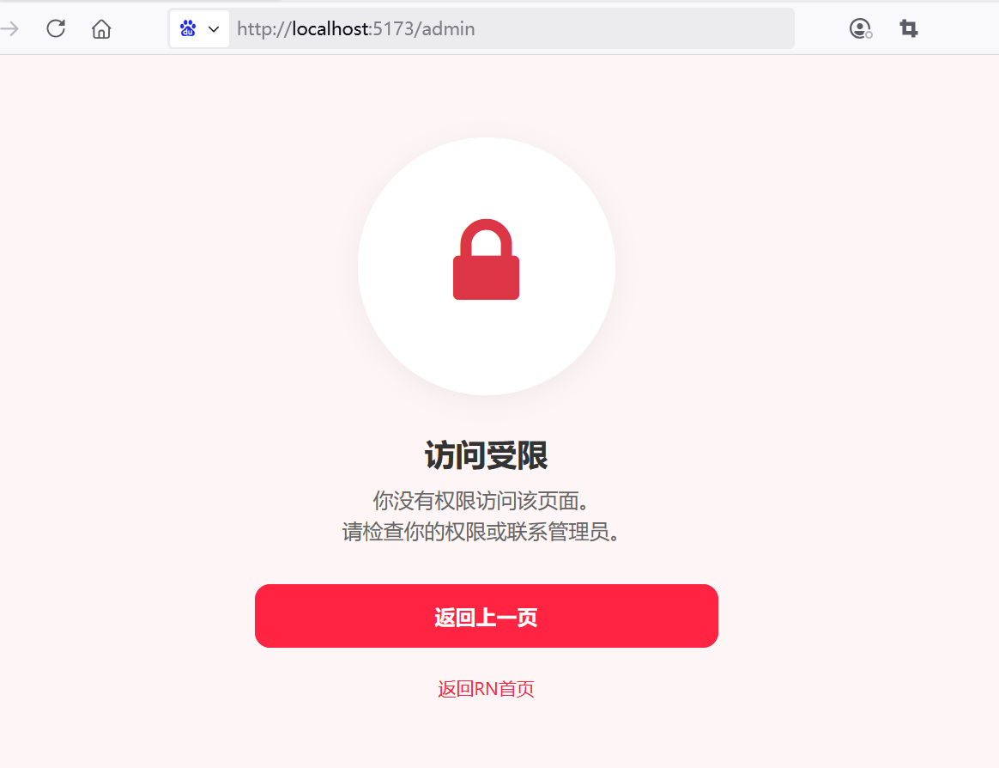


当管理员用户访问后台管理`/admin`页面时，可以看到能够正常访问，界面效果如下图9-2所示。


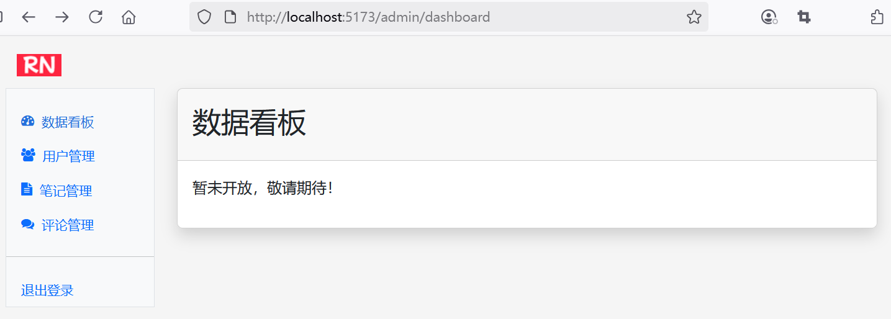


## 9.3 全栈实战数据看板功能及前端埋点

### 后端接口改造

AdminController返回数据看板的数据接口调整如下。

```java
@GetMapping("/dashboard")
/*public String dashboard(Model model) {
    // 统计数据
    long userCount = userService.countUsers();
    long noteCount = noteService.countNotes();
    long commentCount = commentService.countComments();
    List<NoteBrowseCountDto> noteBrowseCountDtoList =  noteService.getNoteByBrowseCount(1, 10);
    List<NoteBrowseTimeDto> noteBrowseTimeDtoList =  noteService.getNoteByBrowseTime(1, 10);

    model.addAttribute("userCount", userCount);
    model.addAttribute("noteCount", noteCount);
    model.addAttribute("commentCount", commentCount);

    model.addAttribute("noteBrowseCountDtoList", noteBrowseCountDtoList);
    model.addAttribute("noteBrowseTimeDtoList", noteBrowseTimeDtoList);

    model.addAttribute("contentFragment", "admin-dashboard");

    return "admin";
}*/
public ResponseEntity<?> dashboard() {
    // 统计数据
    long userCount = userService.countUsers();
    long noteCount = noteService.countNotes();
    long commentCount = commentService.countComments();
    List<NoteBrowseCountDto> noteBrowseCountDtoList =  noteService.getNoteByBrowseCount(1, 10);
    List<NoteBrowseTimeDto> noteBrowseTimeDtoList =  noteService.getNoteByBrowseTime(1, 10);

    Map<String, Object> map = new HashMap<>();
    map.put("userCount", userCount);
    map.put("noteCount", noteCount);
    map.put("commentCount", commentCount);
    map.put("noteBrowseCountDtoList", noteBrowseCountDtoList);
    map.put("noteBrowseTimeDtoList", noteBrowseTimeDtoList);

    return ResponseEntity.ok(map);
}
```


### 前端DTO设计

#### 新增note-browse-count-dto.ts

新增`src\dto\note-browse-count-dto.ts`


```ts
export interface NoteBrowseCountDto {
  noteId: number;
  title: string;
  browseCount: number;
}
```

#### 新增note-browse-time-dto.ts

新增`src\dto\note-browse-time-dto.ts`


```ts
export interface NoteBrowseTimeDto {
  noteId: number;
  title: string;
  browseTime: number;
}
```

#### 新增admin-dashboard-dto.ts

新增`src\dto\admin-dashboard-dto.ts`


```ts
export interface AdminDashboardDto {
  userCount: number;
  noteCount: number;
  commentCount: number;
  noteBrowseCountDtoList: Array<NoteBrowseCountDto>;
  noteBrowseTimeDtoList: Array<NoteBrowseTimeDto>;
}
```


### 前端获取数据


```vue
<script setup lang="ts">
import { ref, onMounted } from 'vue';
import axios from '@/services/axios';
import type { AdminDashboardDto } from '@/dto/admin-dashboard-dto';

const adminDashboardDto = ref<AdminDashboardDto>({
  userCount: 0,
  noteCount: 0,
  commentCount: 0,
  noteBrowseCountDtoList: [],
  noteBrowseTimeDtoList: [],
});

onMounted(() => {
  // 获取数据看板的数据
  fetchDashboard();
});

const fetchDashboard = async () => {
  try {
    // 调用API获取用户数据
    const response = await axios.get(`/api/admin/dashboard`);
    console.log('response.json:', response.data);
    adminDashboardDto.value = await response.data as AdminDashboardDto;
    // 处理用户数据
  } catch (error) {
    console.error('获取用户数据失败:', error);
  }
};
</script>
```


### 编写模板


```vue
<template>
  <main>
    <div class="card shadow mb-4">
      <div class="card-header py-3">
        <h2>数据看板</h2>
      </div>
      <div class="card-body">
        <!-- 统计卡片 -->
        <div class="col-xl-3 col-md-6 mb-4">
          <div class="card border-left-primary shadow h-100 py-2">
            <div class="card-body">
              <div class="row no-gutters align-items-center">
                <div class="col mr-2">
                  <div class="text-xs font-weight-bold text-primary text-uppercase mb-1">用户总数</div>
                  <div class="h5 mb-0 font-weight-bold text-gray-800">{{ adminDashboardDto.userCount }}</div>
                </div>
                <div class="col-auto">
                  <i class="fa fa-users fa-2x text-gray-300"></i>
                </div>
              </div>
            </div>
          </div>
        </div>

        <div class="col-xl-3 col-md-6 mb-4">
          <div class="card border-left-success shadow h-100 py-2">
            <div class="card-body">
              <div class="row no-gutters align-items-center">
                <div class="col mr-2">
                  <div class="text-xs font-weight-bold text-success text-uppercase mb-1">笔记总数</div>
                  <div class="h5 mb-0 font-weight-bold text-gray-800">{{ adminDashboardDto.noteCount }}</div>
                </div>
                <div class="col-auto">
                  <i class="fa fa-file-text fa-2x text-gray-300"></i>
                </div>
              </div>
            </div>
          </div>
        </div>

        <div class="col-xl-3 col-md-6 mb-4">
          <div class="card border-left-info shadow h-100 py-2">
            <div class="card-body">
              <div class="row no-gutters align-items-center">
                <div class="col mr-2">
                  <div class="text-xs font-weight-bold text-info text-uppercase mb-1">评论总数</div>
                  <div class="h5 mb-0 font-weight-bold text-gray-800">{{ adminDashboardDto.commentCount }}
                  </div>
                </div>
                <div class="col-auto">
                  <i class="fa fa-comments fa-2x text-gray-300"></i>
                </div>
              </div>
            </div>
          </div>
        </div>


        <div class="col-xl-3 col-md-6 mb-4">
          <div class="card border-left-info shadow h-100 py-2">
            <div class="card-body">
              <div class="row no-gutters align-items-center">
                <div class="col mr-2">
                  <div class="text-xs font-weight-bold text-success text-uppercase mb-1">访问量排行</div>
                </div>

                <ol class="list-group list-group-numbered">
                  <li class="list-group-item d-flex justify-content-between align-items-start"
                    v-for="note in adminDashboardDto.noteBrowseCountDtoList">
                    <div class="ms-2 me-auto">{{ note.title }}
                    </div>
                    <span class="badge text-bg-primary rounded-pill">{{ note.browseCount }}
                    </span>
                  </li>
                </ol>

              </div>
            </div>
          </div>
        </div>


        <div class="col-xl-3 col-md-6 mb-4">
          <div class="card border-left-info shadow h-100 py-2">
            <div class="card-body">
              <div class="row no-gutters align-items-center">
                <div class="col mr-2">
                  <div class="text-xs font-weight-bold text-success text-uppercase mb-1">访问时间排行</div>
                </div>

                <ol class="list-group list-group-numbered">
                  <li class="list-group-item d-flex justify-content-between align-items-start"
                    v-for="note in adminDashboardDto.noteBrowseTimeDtoList">
                    <div class="ms-2 me-auto">{{ note.title }}
                    </div>
                    <span class="badge text-bg-primary rounded-pill">{{ note.browseTime }}
                    </span>
                  </li>
                </ol>

              </div>
            </div>
          </div>
        </div>
      </div>
    </div>
  </main>
</template>
```


### 前端埋点统计浏览时长

在离开当前页面时，统计访问时长，并发送到后端API。

```ts
import { onBeforeRouteLeave, useRoute } from 'vue-router';

// 埋点
// 记录开始时间
const startTime = ref<number>(Date.now())

// 统计浏览时长
const handleBrowseTime = async() => {
  // 获取浏览时长
  const browseTime = Date.now() - startTime.value
  
  // 发送API请求
  try {
    // 使用axios发送浏览事件到后端
    await axios.post('/api/log/browse', 
    {
      userId: me.value.userId,
      noteId: parseInt(noteId.value.toString()),
      browseTime: browseTime,
      userAgent: navigator.userAgent
    }, {
      headers: {
        'Content-Type': 'application/json'
      }
    }
  )
  } catch (error) {
    console.error('埋点上报失败:', error)
  }
}

// 导航离开该组件的对应路由时调用
onBeforeRouteLeave((to, from, next) => {
  // 统计浏览时长
  handleBrowseTime()

  next()
})
```


onBeforeRouteLeave 是 Vue 3 中的组合式 API，用于在组件即将离开当前路由时执行逻辑。

### 更改跳转到笔记详情页的路由方式

设置通过router来路由页面，而非a href的方式。这样，Vue的路由才能获取到note-detail的相关信息。

```ts
function gotoNoteDetail(noteId: number) {
  router.push({
    name: 'note-detail',
    params: {
      noteId: noteId
    }
  });
}

<!-- ...为节约篇幅，此处省略非核心内容 -->

<!-- 点击跳转到笔记详情页 -->
<!-- <a :href="`/note/${note.noteId}`">-->
<a href="#" @click="gotoNoteDetail(note.noteId)">
  
</a>
```


### 运行调测

当管理员用户访问后台管理`/admin`页面时，可以看到界面效果如下图9-3、图9-4所示。


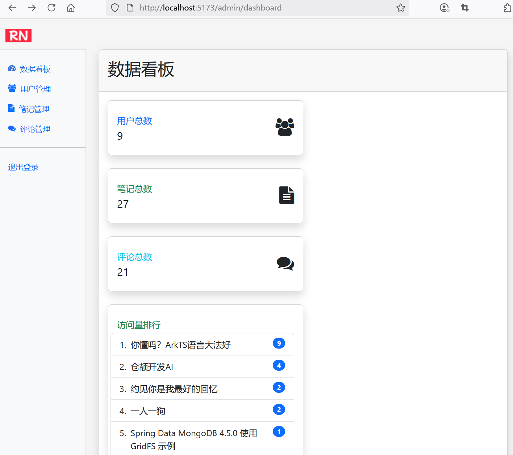


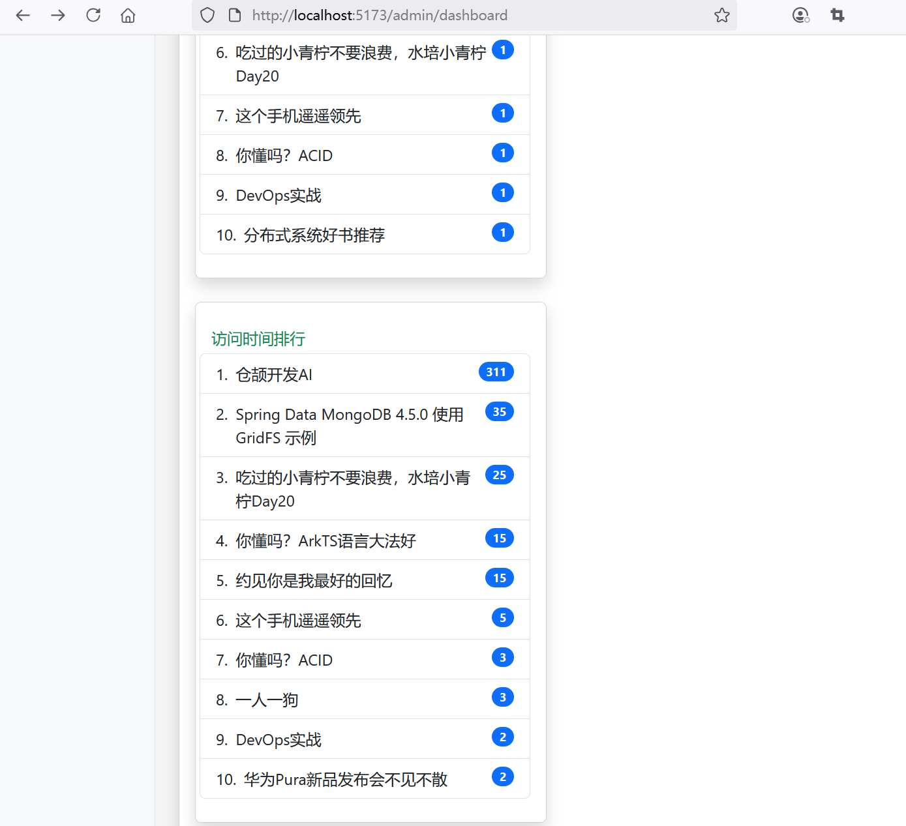


## 9.4 全栈实战用户管理获取用户列表功能

### 后端接口改造

AdminController返回用户分页数据的接口调整如下。

```java
/**
 * 显示用户管理界面
 */
@GetMapping("/user")
/*public String user(Model model, @RequestParam(defaultValue = "1") int page) {
    // 分页查询所有用户数据
    Page<User> userPage = userService.getAllUsers(page, PAGE_SIZE);

    model.addAttribute("userPage", userPage);
    model.addAttribute("contentFragment", "admin-user");
    return "admin";
}*/
public ResponseEntity<?> user(@RequestParam(defaultValue = "1") int page) {
    // 分页查询所有用户数据
    Page<User> userPage = userService.getAllUsers(page, PAGE_SIZE);

    Map<String, Object> map = new HashMap<>();
    map.put("userList", userPage.getContent());
    map.put("currentPage", page);
    map.put("totalPages", userPage.getTotalPages());

    return ResponseEntity.ok(map);
}
```


### 前端组件设计


修改`src\components\AdminUser.vue`：

```vue
<script setup lang="ts">
import type { User } from '@/dto/user';
import axios from '@/services/axios';
import { onMounted, ref } from 'vue';
import { useRoute } from 'vue-router';

const route = useRoute()

// 用户分页
const userList = ref<Array<User>>([])
const totalPages = ref(0)
const currentPage = ref(1)

// 查询参数，默认第1页
const pageIndex = ref(route.query.page || 1)

onMounted(() => {
  // 获取用户列表
  fetchUserList()
})

// 获取用户列表
const fetchUserList = async () => {
  try {
    const response = await axios.get(`/api/admin/user?page=${pageIndex.value}`)
    userList.value = response.data['userList']
    totalPages.value = response.data['totalPages']
    currentPage.value = response.data['currentPage']
  } catch (error) {
    console.error('获取用户列表失败：' + error)
  }
}
</script>
<template>
  <div class="card shadow mb-4">
    <div class="card-header py-3">
      <h2>用户列表</h2>
    </div>
    <div class="card-body">
      <div class="table-responsive small">
        <table class="table table-striped table-sm">
          <thead>
            <tr>
              <th>ID</th>
              <th>用户名</th>
              <th>电话</th>
              <th>角色</th>
              <th>操作</th>
            </tr>
          </thead>
          <tbody>
            <tr v-for="user in userList">
              <td>{{ user.userId }}</td>
              <td>{{ user.username }}</td>
              <td>{{ user.phone }}</td>
              <td>{{ user.role }}</td>
              <td>
                <button class="btn btn-sm btn-light">
                  编辑
                </button>
                <button class="btn btn-sm btn-danger">
                  删除
                </button>
              </td>
            </tr>
          </tbody>
        </table>
      </div>

      <!-- 分页控件 -->
      <div class="d-flex justify-content-center">
        <nav>
          <ul class="pagination" v-if="totalPages > 0">
            <li class="page-item" v-if="currentPage > 1">
              <a class="page-link" :href="`/admin/user?page=${currentPage - 1}`">
                上一页
              </a>
            </li>
            <li class="page-item" v-for="pageNum in Array.from({ length: totalPages }, (_, i) => i + 1)"
              :class="{ active: pageNum === currentPage }">
              <a class="page-link" :href="`/admin/user?page=${pageNum}`">
                {{ pageNum }}
              </a>
            </li>
            <li class="page-item" v-if="currentPage < totalPages">
              <a class="page-link" :href="`/admin/user?page=${currentPage + 1}`">
                下一页
              </a>
            </li>
          </ul>
        </nav>
      </div>
    </div>
  </div>
</template>
```


### 运行调测

当管理员用户访问用户管理`/admin/user`页面时，可以看到界面效果如下图9-5所示。


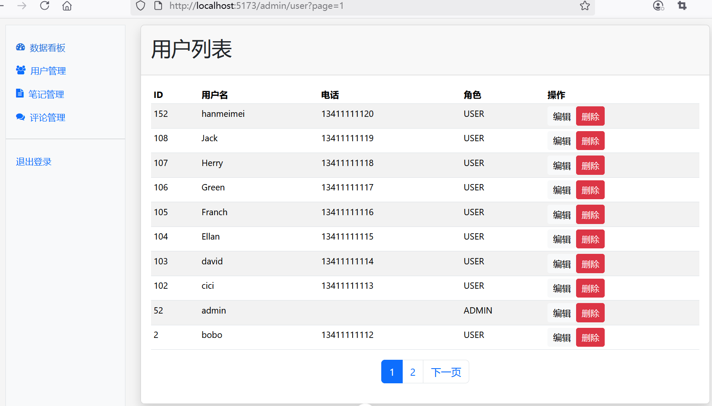


## 9.5 全栈实战用户管理编辑用户

### 后端编辑用户接口改造

AdminController编辑用户相关的接口调整如下。

```java
/**
 * 显示用户编辑界面
 */
@GetMapping("/user/{userId}/edit")
/*public String editUser(@PathVariable Long userId, Model model) {
    // 判定用户是否存在，不存在则抛出异常
    Optional<User> optionalUser = userService.findByUserId(userId);
    if (!optionalUser.isPresent()) {
        throw new UserNotFoundException("");
    }

    model.addAttribute("user", optionalUser.get());
    model.addAttribute("contentFragment", "admin-user-edit");

    return "admin";
}*/
public ResponseEntity<?> editUser(@PathVariable Long userId) {
    // 判定用户是否存在，不存在则抛出异常
    Optional<User> optionalUser = userService.findByUserId(userId);
    if (!optionalUser.isPresent()) {
        throw new UserNotFoundException("");
    }

    return ResponseEntity.ok(optionalUser.get());
}

/**
 * 处理保存用户的请求
 */
@PostMapping("/user")
/*public String updateUser(@ModelAttribute User user) {
    // 判定用户是否存在，不存在则抛出异常
    Optional<User> optionalUser = userService.findByUserId(user.getUserId());
    if (!optionalUser.isPresent()) {
        throw new UserNotFoundException("");
    }

    User oldUser = optionalUser.get();

    // 更新用户
    userService.updateUserByAdmin(oldUser, user);
    return "redirect:/admin/user";
}*/
public ResponseEntity<?> updateUser(@ModelAttribute User user) {
    // 判定用户是否存在，不存在则抛出异常
    Optional<User> optionalUser = userService.findByUserId(user.getUserId());
    if (!optionalUser.isPresent()) {
        throw new UserNotFoundException("");
    }

    User oldUser = optionalUser.get();

    // 更新用户
    userService.updateUserByAdmin(oldUser, user);
    return ResponseEntity.ok("更新成功");
}
```


### 前端编辑用户组件设计


修改`src\components\AdminUser.vue`：

```ts
import { useRouter } from 'vue-router';

const router = useRouter();


// 路由到编辑用户界面
function handleEdit(userId: number) {
  router.push({ path: `/admin/user/${userId}/edit` })
}

// ...为节约篇幅，此处省略非核心内容

<button class="btn btn-sm btn-light" @click="handleEdit(user.userId)">
  编辑
</button>
```


### 设置路由

设置`/admin/user/:userId/edit`路径，以便跳转到用户编辑界面：

```ts
const router = createRouter({
  history: createWebHistory(import.meta.env.BASE_URL),
  routes: [
    // ...为节约篇幅，此处省略非核心内容
    ,
    {
      path: '/admin',
      name: 'admin',
      component: () => import('../views/AdminView.vue'),
      meta: {
        requiresAuth: true,
        requiresRole: 'ADMIN'
      },
      children: [
        // ...为节约篇幅，此处省略非核心内容
        ,
        {
          path: 'user/:userId/edit',
          name: 'admin-user-edit',
          component: () => import('../components/AdminUserEdit.vue'),
        }
      ]
    }
  ],
})
```

### 新增AdminUserEdit.vue


新增`src\components\AdminUserEdit.vue`：


```ts
<script setup lang="ts">
import { User } from '@/dto/user';
import axios from '@/services/axios';
import { onMounted, ref } from 'vue';
import { useRouter, useRoute } from 'vue-router';


const formRef = ref<HTMLFormElement | null>(null);
const user = ref<User>(new User());
const router = useRouter();
const route = useRoute();

// 动态路由参数
const userId = ref(route.params.userId)

onMounted(() => {
  // 获取用户信息
  fetchUser()
});

// 获取用户信息
const fetchUser = async () => { 
  // 发送API请求
  try {
    // 使用axios发送请求到后端
    const response = await axios.get(`/api/admin/user/${userId.value}/edit`)
    user.value = response.data
  } catch (error) {
    console.error('用户更新失败:', error)
  }
};

// 取消编辑
function cancelEdit() {
  // 确认是否要取消
  if (confirm('确定要取消编辑吗？')) {
    router.back()
  }
}

// 保存用户信息
const handleEdit = async () => { 
  if (formRef.value) { 
    const formData = new FormData(formRef.value);

    // 发送API请求
    try {
      // 使用axios发送用户信息到后端
      await axios.post('/api/admin/user', formData)

      // 跳转
      router.push({ path: '/admin/user' })
    } catch (error) {
      console.error('用户更新失败:', error)
    }
  }
};

</script>
<template>
  <div class="card shadow mb-4">
    <div class="card-header py-3">
      <h2>编辑用户</h2>
    </div>
    <div class="card-body">
      <form ref="formRef">
        <!-- 隐藏用户ID -->
        <input type="hidden" name="userId" v-model="user.userId">

        <div class="row">
          <div class="col-lg-6">
            <!-- 用户名不可编辑 -->
            <div class="form-group">
              <label for="username">用户名 <span class="text-danger">*</span></label>
              <input type="text" class="form-control" id="username" name="username" v-model="user.username" disabled>
            </div>

            <!-- 密码 -->
            <div class="form-group">
              <label for="password">密码</label>
              <input type="password" class="form-control" id="password" name="password"
                placeholder="不修改请留空">
              <div class="small text-muted">留空则不修改密码</div>
            </div>

            <!-- 手机号 -->
            <div class="form-group">
              <label for="phone">手机号 <span class="text-danger">*</span></label>
              <input type="text" class="form-control" id="phone" name="phone" v-model="user.phone" placeholder="请输入手机号">
            </div>
          </div>
        </div>

        <!-- 操作按钮 -->
        <div class="mt-4">
          <button type="button" class="btn btn-primary mr-2" @click="handleEdit">保存</button>
          <button type="button" class="btn btn-secondary" @click="cancelEdit">取消
          </button>
        </div>
      </form>
    </div>
  </div>
</template>
```


### 运行调测

当管理员用户访问用户管理编辑页面`/admin/user/:userId/edit`时，可以看到界面效果如下图9-6所示。


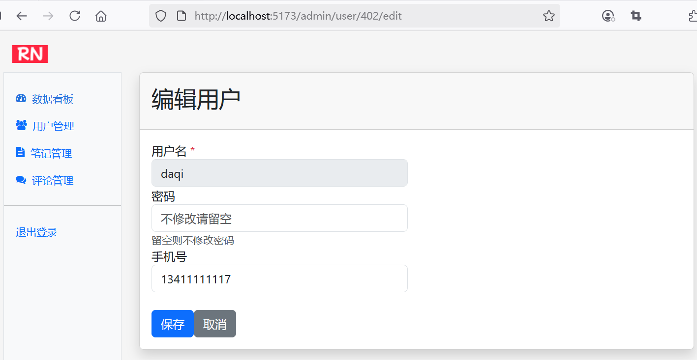


## 9.6 全栈实战用户管理删除用户

### 后端删除用户接口

AdminController删除用户相关的接口，已完全适配无需调整。

```java
/**
 * 处理用户删除的请求
 */
@DeleteMapping("/user/{userId}")
public ResponseEntity<DeleteResponseDto> deleteUser(@PathVariable Long userId) {
    // 判定用户是否存在，不存在则抛出异常
    Optional<User> optionalUser = userService.findByUserId(userId);
    if (!optionalUser.isPresent()) {
        throw new UserNotFoundException("");
    }

    userService.deleteUser(userId);

    DeleteResponseDto deleteResponseDto = new DeleteResponseDto();
    deleteResponseDto.setMessage("用户删除成功");
    deleteResponseDto.setRedirectUrl("/admin/user");

    return ResponseEntity.ok(deleteResponseDto);
}
```


### 前端删除用户组件设计


修改`src\components\AdminUser.vue`：

```ts
// 删除用户
const deleteUser = async (userId: number) => {
  if (!confirm('确定要删除这个用户吗？')) return;

  try {
    // 调用API获取用户数据
    const response = await axios.delete(`/api/admin/user/${userId}`);
    console.log('response.json:', response.data);

    // 从列表中移除用户
    userList.value = userList.value.filter(u => u.userId !== userId);
  } catch (error) {
    console.error('获取用户数据失败:', error);
  }
};

// ...为节约篇幅，此处省略非核心内容

<button class="btn btn-sm btn-danger" @click="deleteUser(user.userId)">删除</button>
```


## 10.1 课程总结

* 基于全栈角度考虑的前后端分离架构设计
* 使用Vue.js初始化前端项目
* AI辅助编程工具成为Vue.js应用开发导师
* 实战用户模块全栈开发
* 实战笔记模块全栈开发
* 实战点赞模块全栈开发
* 实战评论模块全栈开发
* 实战首页模块全栈开发
* 实战后台管理模块全栈开发
