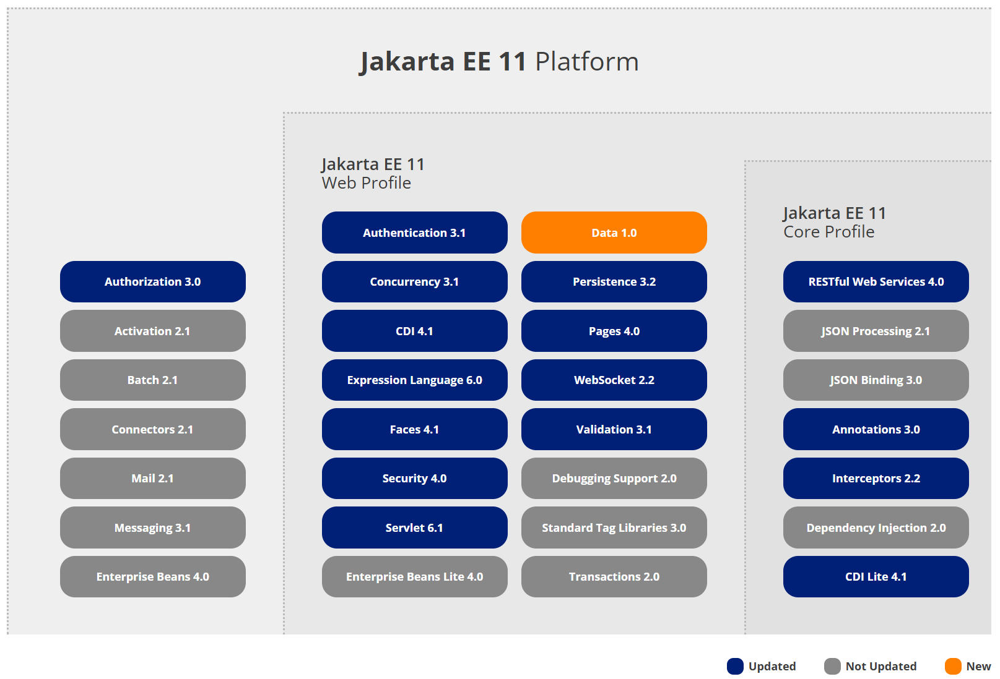
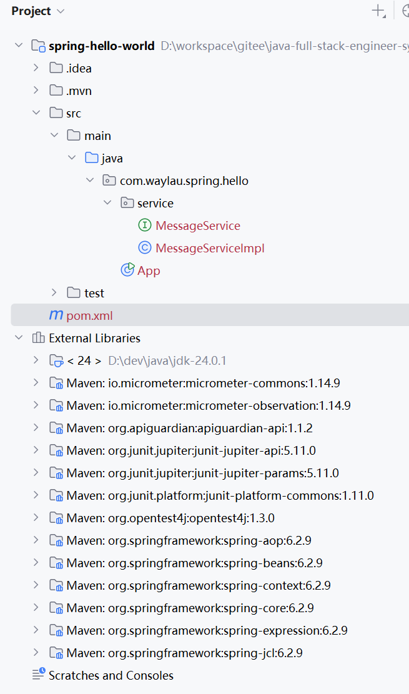
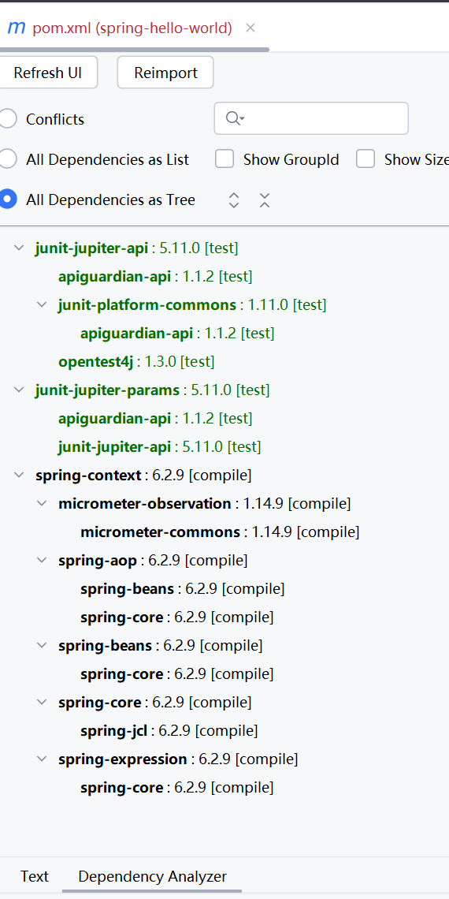
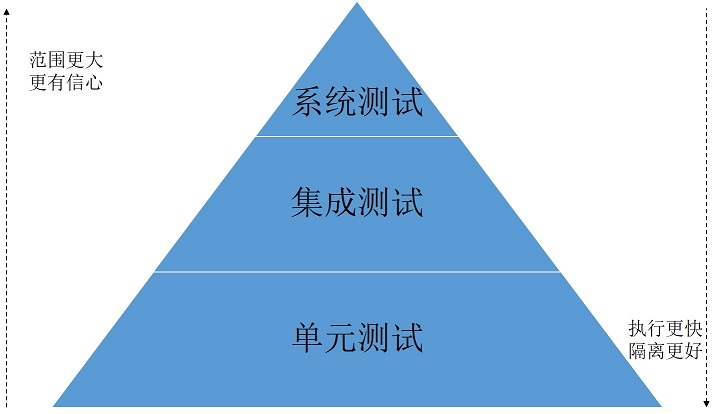
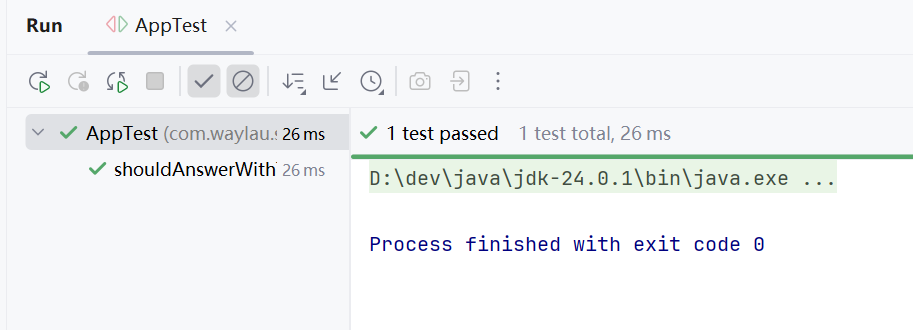
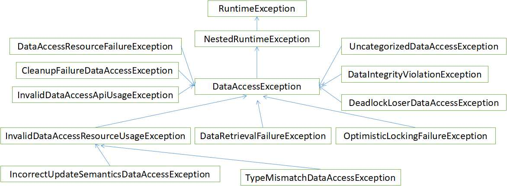
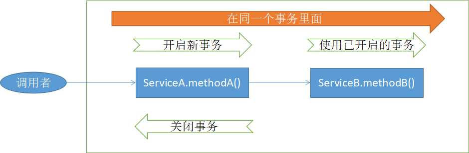
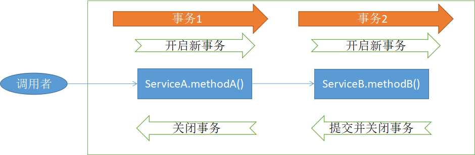
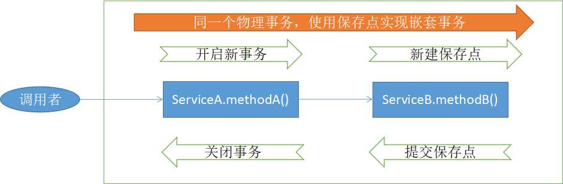

> 本页为原「Java 课程 2」全部 22 个分节的合订本；原分节链接会自动跳转到本页。


## 1.1 全栈工程师必备后端Spring全家桶技能树全解析

全栈工程师必备后端所需的技能树如下：

* Spring
* Spring MVC
* Spring Data
* Spring Security
* Spring Boot


### 1. Spring 核心技能解析

#### 1.1 IoC（控制反转）与 DI（依赖注入）
- 概念理解
    - 解释 IoC 是将对象的创建和管理控制权从代码中转移到 Spring 容器的过程。
    - 说明 DI 是 IoC 的具体实现方式，通过构造器注入、Setter 方法注入等将依赖对象注入到目标对象中。
- 应用场景
    - 在大型项目中，使用 IoC 和 DI 可以降低组件之间的耦合度，提高代码的可维护性和可测试性。
    - 例如，在一个电商系统中，订单服务依赖于用户服务和商品服务，通过 DI 可以方便地将用户服务和商品服务注入到订单服务中。
- 代码实现
    - 使用 XML 配置文件、Java 注解（如 `@Component`、`@Autowired`）来实现 IoC 和 DI。

#### 1.2 AOP（面向切面编程）
- 概念理解
    - AOP 是一种编程范式，它允许开发者在不修改原有业务逻辑的基础上，对程序进行增强。
    - 切面（Aspect）是包含通知（Advice）和切点（Pointcut）的模块，通知定义了在何时执行增强逻辑，切点定义了在哪些连接点（Join Point）执行增强逻辑。
- 应用场景
    - 日志记录、事务管理、权限验证等都可以使用 AOP 来实现。
    - 例如，在一个企业级应用中，可以使用 AOP 来记录所有服务方法的调用日志。
- 代码实现
    - 使用 AspectJ 注解（如 `@Aspect`、`@Before`、`@After` 等）来定义切面和通知。

#### 1.3 事务管理
- 概念理解
    - 事务是一组不可分割的操作序列，要么全部成功，要么全部失败。
    - Spring 提供了声明式事务和编程式事务两种方式来管理事务。
- 应用场景
    - 在涉及数据库操作的业务中，如银行转账、订单处理等，需要使用事务来保证数据的一致性。
- 代码实现
    - 使用 `@Transactional` 注解来实现声明式事务管理。

### 2. Spring MVC 技能解析

#### 2.1 核心组件
- DispatcherServlet
    - 作为 Spring MVC 的核心控制器，负责接收所有的 HTTP 请求，并将请求分发给相应的处理器进行处理。
- HandlerMapping
    - 根据请求的 URL 映射到相应的处理器（Controller）。
- Controller
    - 处理具体的业务逻辑，并返回视图或数据。
- ViewResolver
    - 根据控制器返回的视图名称，解析出具体的视图对象。

#### 2.2 请求处理流程
- 详细解释从客户端发送请求到服务器返回响应的整个流程，包括请求的接收、处理器的查找、业务逻辑的处理、视图的渲染等环节。

#### 2.3 数据绑定与验证
- 数据绑定
    - 将 HTTP 请求参数绑定到控制器方法的参数或命令对象中。
    - 支持基本数据类型、日期类型、自定义对象等的绑定。
- 数据验证
    - 使用 JSR 303 规范（如 `@NotNull`、`@Size` 等注解）对输入数据进行验证。
    - 处理验证错误，并返回相应的错误信息给客户端。

#### 2.4 RESTful 风格开发
- 概念理解
    - RESTful 是一种基于 HTTP 协议的软件架构风格，强调资源的统一接口和无状态性。
- 代码实现
    - 使用 `@RestController`、`@RequestMapping`、`@GetMapping`、`@PostMapping` 等注解来实现 RESTful 接口。

### 3. Spring Data 技能解析

#### 3.1 Spring Data JPA
- 概念理解
    - JPA（Java Persistence API）是 Java 持久化标准，Spring Data JPA 是 Spring 对 JPA 的封装，简化了数据访问层的开发。
- 核心组件
    - `Repository` 接口：是 Spring Data 的核心接口，定义了基本的 CRUD 操作。
    - `JpaRepository`：继承自 `Repository` 接口，提供了更多的 JPA 相关操作方法。
    - `CrudRepository`：提供了基本的 CRUD 操作方法。
- 自定义查询方法
    - 通过方法命名规则或使用 `@Query` 注解来定义自定义查询方法。

#### 3.2 多数据源支持
- 介绍如何在 Spring Data 中配置和使用多个数据源，满足不同业务场景的需求。

#### 3.3 与 NoSQL 数据库集成
- 讲解 Spring Data 与 MongoDB、Redis 等 NoSQL 数据库的集成方法，实现数据的持久化和查询。

### 4. Spring Security 技能解析

#### 4.1 认证与授权
- 认证
    - 验证用户的身份，判断用户是否合法。
    - 支持多种认证方式，如表单登录、HTTP 基本认证、OAuth2 认证等。
- 授权
    - 根据用户的角色和权限，决定用户是否有权限访问某个资源。
    - 使用基于角色的访问控制（RBAC）模型来实现授权管理。

#### 4.2 核心组件
- SecurityFilterChain
    - 定义了 Spring Security 的过滤器链，对请求进行拦截和处理。
- AuthenticationManager
    - 负责用户的认证操作，调用 `UserDetailsService` 加载用户信息。
- UserDetailsService
    - 用于加载用户信息，实现该接口可以自定义用户信息的加载方式。

#### 4.3 密码加密
- 使用 Spring Security 提供的密码编码器（如 `BCryptPasswordEncoder`）对用户密码进行加密，提高密码的安全性。

#### 4.4 防止 CSRF 攻击
- 介绍 CSRF（跨站请求伪造）攻击的原理和防范措施，Spring Security 提供了内置的 CSRF 保护机制。

### 5. Spring Boot 技能解析

#### 5.1 自动配置原理
- 解释 Spring Boot 如何通过自动配置机制，根据项目的依赖和配置文件，自动配置 Spring 应用的各种组件。

#### 5.2 起步依赖
- 介绍 Spring Boot 提供的各种起步依赖，如 `spring-boot-starter-web`、`spring-boot-starter-data-jpa` 等，方便快速搭建项目。

#### 5.3 配置文件管理
- 使用 `application.properties` 或 `application.yml` 配置文件来配置 Spring Boot 应用的各种属性。
- 支持多环境配置，如开发环境、测试环境、生产环境等。

#### 5.4 嵌入式服务器
- Spring Boot 支持嵌入式服务器（如 Tomcat、Jetty 等），可以将应用打包成可执行的 JAR 文件，方便部署和运行。

#### 5.5 Actuator 监控
- 使用 Spring Boot Actuator 对应用的运行状态进行监控，如查看应用的健康状态、内存使用情况、线程信息等。


## 1.2 零基础开发者快速了解Spring与Java EE后端核心框架学习脉络

Spring 诞生之初是以 J2EE 的挑畔者身份而为广大 Java 开发者所熟知的。特别是当时 J2EE 平台中的 EJB（Enterprise Java Beans）标准，由于其设计本身的缺陷，导致在开发过程中使用非常复杂，代码侵入性很强。又由于 EJB 是依赖于容器的实现的，所以进行单元测试也变得极其困难，最终的后果是大多数开发者对 Java 企业级开发望而却步。

为此，Rod Johnson 为 Java 世界带来的 Spring。Spring 的目标就是要简化了 Java 企业级开发。
 

### Spring 与 Java EE 关系

早年，“Spring之父” Rod Johnson 对传统的 Java EE 系统框架臃肿、低效、脱离现实的种种现状提出了质疑，并积极寻求探索革新。在2002年，Rod Johnson 编著的《Expert One-on-One J2EE Design and Development》一书，可以说旗帜鲜明的指出了当时 Java EE 架构在实际开发中的种种弊端。

在该书中，Rod Johnson 表明了如下的观点：

* Java EE 不能包治百病。任何技术都不可能是“银弹”，即便是在当时来说，Java EE 已经是企业级开发的最好的选择了，但仍不能说 Java EE 可以解决任何问题。
* 小心“正统”的开发方式。特别是 Sun 公司所推崇的 Java EE 的开发方式，在实际开发中并不完全适用，甚至是在误导开发者。Rod Johnson 坦言，所谓“正统”的开发方式都是面向规范的，而不是面向实际要解决的问题。这必然就导致了像 EJB 这种复杂规范无法真实落地的情况。

Rod Johnson 正是洞察到了传统 Java EE 开发上的弊端，从而推出了 Spring 框架，致力于解决 Java EE 开发上的问题。

虽然，Spring 喊出了“Without EJB”（不需要 EJB）的口号，但本质上，它并非想要完全挑战整个 Java EE 平台。Spring 力图冲破 Java EE 传统开发的困境，从实际需求出发，着眼于构建轻便、灵巧，易于开发、测试和部署的轻量级开发框架。

Spring 在很大程度是为了置换当时以 EJB 为核心的 Java EE 开发方式。Rod Johnson 对 EJB 的各种笨重臃肿的结构进行了逐一的分析和否定，并分别以简洁实用的方式替换之。EJB 是一种复杂的技术，虽然很好地解决了一些问题，但在许多情况下却增加了比其商业价值更大的复杂性。

传统 Java EE 应用的开发效率是低下的，应用服务器厂商对各种技术的支持并没有真正统一，导致 Java EE 的应用没有真正实现“Write Once, Run Anywhere”（一次编写，各处运行）的承诺。Spring 作为开源的中间件，独立于各种应用服务器，甚至无须应用服务器的支持，也能提供应用服务器的功能，如声明式事务、事务处理等。

Spring 致力于 Java EE 应用的各层的解决方案，而不是仅仅专注于某一层的方案。可以说 Spring 是企业应用开发的“一站式”选择，并贯穿表现层、业务层及持久层。然而，Spring 并不想取代那些已有的框架，而是与它们无缝地整合。

虽然表面上看来，有些人会认为 Spring 和 Java EE 是竞争关系，实际上 Spring 是对 Java EE 改进和补充。Spring 本身也集成非常多的 Java EE 平台规范，诸如 Servlet API（JSR 340）、WebSocket API（JSR 356）、Concurrency Utilities（JSR 236）、JSON Binding API（JSR 367）、Bean Validation（JSR 303）、JPA（JSR 338）、JMS（JSR 914）、Dependency Injection（JSR 330）、Common Annotations（JSR 250）等。

简言之，Spring 的目标就是要简化了 Java EE 开发。现如今，Spring 俨然成为了 Java EE 的代名词，成为了构建 Java EE 应用的事实上标准。大多数 Java 项目会采用 Spring 作为框架的首选。


### Java EE 现状


1998年12月8日，Java 2 企业平台 J2EE 发布，正式进军企业级应用开发领域。

1999年6月，随着 Java 的快速发展，Sun 公司将 Java 分为了三个版本，即标准版（J2SE）、企业版（J2EE）和微型版（J2ME）。从版本的划分可以看出当时 Java 语言的野心，企图统治桌面应用、服务器端应用以及移动端应用。


Java EE 是一套用于开发企业级应用程序的 Java 平台标准，它包括了多种服务和API，例如 JDBC、JNDI、EJB、JPA、Servlet、JSP 等。在过去的几年中，Java EE 的发展受到了 Oracle 的管理和推动，但随着时间的推移，Oracle 开始寻求将 Java EE 转变为一个更开放的生态系统。

2017年10月：Oracle 宣布将 Java EE 移交给 Eclipse 基金会，并更名为 Jakarta EE。这一变更反映了 Java EE 向 Jakarta EE 的过渡，旨在建立一个更加开放和社区驱动的平台。

Jakarta EE：Jakarta EE 是 Java EE 的新名称，代表了其在 Eclipse 基金会下的新生命。Eclipse 基金会将继续负责 Jakarta EE 的开发和维护。


目前，Jakarta EE最新版本是Jakarta EE 11。下图是Jakarta EE 11平台架构图。





## 1.3 前沿解码：Spring 6有哪些革新升级？

Spring 6有以下革新升级：

### 基础架构升级
- Java版本基线提升：最低要求JDK 17，能利用JDK 17的新特性如模式匹配、记录类型等，代码结构更清晰，可优化现代JVM性能。
- 迁移到Jakarta EE 9+：包名从`javax`迁移到`jakarta`，确保与最新的Jakarta EE规范兼容，支持最新Web容器，如Tomcat 10、Jetty 11，以及Hibernate ORM 6.1等持久性框架。

### 性能优化
- AOT编译：引入AOT编译，在构建阶段将源代码提前编译成机器码或字节码，JVM可直接加载预编译的类信息，避免运行时编译性能消耗和内存消耗，显著加快程序启动速度，减少JIT预热时间。

### 并发处理改进
- 虚拟线程支持：支持JDK 19中的虚拟线程，轻量级线程专为高并发场景设计，许多虚拟线程可在同一个操作系统线程上运行Java代码，有效共享资源，在高并发场景下能大幅提高系统性能和资源利用率。
- 并行Bean初始化：Spring 6.2引入并行Bean初始化功能，框架能够同时初始化多个Bean，通过精心设计的并发控制机制，确保Bean之间的依赖关系得到正确维护，显著减少启动时间。
- 异步Bean创建：Spring 6.2通过`@Bean(bootstrap = BACKGROUND)`注解，允许指定某些Bean在后台进行初始化，配合`bootstrapExecutor`类型的Bean实现异步Bean创建的线程池管理，进一步缩短应用程序的启动时间。

### 编程模型优化
- 函数式编程支持：随着Java 8及以后版本的普及，Spring 6.2引入函数式编程支持，通过Java的函数式接口和Lambda表达式，开发者可以更简洁地实现业务逻辑，提高代码可读性和可维护性，同时支持并行编程和异步处理，提升系统并发性能。
- HTTP接口声明式客户端：通过`@HttpExchange`注解，提供了类似Feign的声明式REST调用功能，让微服务间的API调用变得更加简单。

### 框架功能增强
- 异常处理标准化：采用RFC 7807标准，提供了标准化的`ProblemDetail`异常处理格式，使错误响应更加规范和统一。
- 云原生支持加强：集成Docker、Kubernetes等容器技术，应用程序可更容易地部署到云端，实现弹性伸缩和动态管理，降低运维成本。
- RESTful API开发支持增强：Spring 6.2提供了更丰富的扩展点和多种编程模型支持，引入新的注解和配置方式，优化了日志记录和异常处理机制，使得开发RESTful服务更加简单和高效，提高了系统的可调试性和可维护性。
- 支持备选Bean：Spring 6.2引入`@Fallback`注解，用于提供备选Bean，当容器中没有其他符合要求的Bean时，被`@Fallback`标注的Bean将作为默认选择，避免因找不到合适的Bean而抛出异常。


## 1.4 实战：快速开启第一个Spring项目

这篇进入 Spring 实战部分，从代码角度实际看下 Spring 是如何运作的。

### 1.4.1 Hello World

依照编程惯例，我们的第一个 Spirng 应用是一个“Hello World”项目。从过执行该应用，能够输出“Hello World”字样。

Spring 框架包含许多不同的模块。在这个应用中，我们需要 Spring 提供核心功能的`spring-context` 模块。

不管你是否选择使用依赖管理工具，都需要确保`spring-context`模块的 jar 在你的应用的类路径下。

当然，为了方便管理依赖，建议读者选择 Maven 或者 Gradle 来管理项目。

### 1.4.2 使用 Maven

目前，在业界流行的项目管理方式是使用 Maven。执行命令行`mvn -v`确保您在您的电脑上已经安装了 Maven ：

```
>mvn -v

Apache Maven 3.9.9 (8e8579a9e76f7d015ee5ec7bfcdc97d260186937)
Maven home: D:\dev\java\apache-maven-3.9.9
Java version: 24.0.1, vendor: Oracle Corporation, runtime: D:\dev\java\jdk-24.0.1
Default locale: zh_CN, platform encoding: UTF-8
OS name: "windows 11", version: "10.0", arch: "amd64", family: "windows"
```


执行以下命令进行初始化项目原型：

```
mvn archetype:generate -DgroupId=com.example.spring.hello -DartifactId=spring-hello-world -DarchetypeArtifactId=maven-archetype-quickstart -DarchetypeVersion=1.5 -DinteractiveMode=false
```

此时会创建一个名为“spring-hello-world”的项目，目录结构如下。


将项目用IDEA打开，可以看到默认的pom.xml文件如下：


```xml
<?xml version="1.0" encoding="UTF-8"?>
<project xmlns="http://maven.apache.org/POM/4.0.0" xmlns:xsi="http://www.w3.org/2001/XMLSchema-instance"
  xsi:schemaLocation="http://maven.apache.org/POM/4.0.0 http://maven.apache.org/xsd/maven-4.0.0.xsd">
  <modelVersion>4.0.0</modelVersion>

  <groupId>com.example.spring.hello</groupId>
  <artifactId>spring-hello-world</artifactId>
  <version>1.0-SNAPSHOT</version>

  <name>spring-hello-world</name>
  <!-- FIXME change it to the project's website -->
  <url>http://www.example.com</url>

  <properties>
    <project.build.sourceEncoding>UTF-8</project.build.sourceEncoding>
    <maven.compiler.release>17</maven.compiler.release>
  </properties>

  <dependencyManagement>
    <dependencies>
      <dependency>
        <groupId>org.junit</groupId>
        <artifactId>junit-bom</artifactId>
        <version>5.11.0</version>
        <type>pom</type>
        <scope>import</scope>
      </dependency>
    </dependencies>
  </dependencyManagement>

  <dependencies>
    <dependency>
      <groupId>org.junit.jupiter</groupId>
      <artifactId>junit-jupiter-api</artifactId>
      <scope>test</scope>
    </dependency>
    <!-- Optionally: parameterized tests support -->
    <dependency>
      <groupId>org.junit.jupiter</groupId>
      <artifactId>junit-jupiter-params</artifactId>
      <scope>test</scope>
    </dependency>
  </dependencies>

  <build>
    <pluginManagement><!-- lock down plugins versions to avoid using Maven defaults (may be moved to parent pom) -->
      <plugins>
        <!-- clean lifecycle, see https://maven.apache.org/ref/current/maven-core/lifecycles.html#clean_Lifecycle -->
        <plugin>
          <artifactId>maven-clean-plugin</artifactId>
          <version>3.4.0</version>
        </plugin>
        <!-- default lifecycle, jar packaging: see https://maven.apache.org/ref/current/maven-core/default-bindings.html#Plugin_bindings_for_jar_packaging -->
        <plugin>
          <artifactId>maven-resources-plugin</artifactId>
          <version>3.3.1</version>
        </plugin>
        <plugin>
          <artifactId>maven-compiler-plugin</artifactId>
          <version>3.13.0</version>
        </plugin>
        <plugin>
          <artifactId>maven-surefire-plugin</artifactId>
          <version>3.3.0</version>
        </plugin>
        <plugin>
          <artifactId>maven-jar-plugin</artifactId>
          <version>3.4.2</version>
        </plugin>
        <plugin>
          <artifactId>maven-install-plugin</artifactId>
          <version>3.1.2</version>
        </plugin>
        <plugin>
          <artifactId>maven-deploy-plugin</artifactId>
          <version>3.1.2</version>
        </plugin>
        <!-- site lifecycle, see https://maven.apache.org/ref/current/maven-core/lifecycles.html#site_Lifecycle -->
        <plugin>
          <artifactId>maven-site-plugin</artifactId>
          <version>3.12.1</version>
        </plugin>
        <plugin>
          <artifactId>maven-project-info-reports-plugin</artifactId>
          <version>3.6.1</version>
        </plugin>
      </plugins>
    </pluginManagement>
  </build>
</project>
```

可以对pom.xml文件进行按需配置。比如，我们需要将`spring-context`模块引入我们的应用，就在pom.xml文件中添加如下的 Maven 配置片段：

```xml
<dependencies>
    <dependency>
        <groupId>org.springframework</groupId>
        <artifactId>spring-context</artifactId>
        <version>6.2.9</version>
    </dependency>
    <!-- ...为节约篇幅，此处省略非核心内容 -->
</dependencies>
```


添加了`spring-context`模块之后，能够在工程里面看到如下图1-3所示的依赖包：



图1-3 spring-context 的依赖包

也许读者会有这样的疑问，为什么只添加了`spring-context`依赖包，却会多出这么多的其他 jar 包？这就是 jar 包的依赖关系。`spring-context`包本身会依赖其他 jar，比如  
`spring-aop`、`spring-beans`、`spring-core`、`spring-expression`、`spring-jcl`五个依赖。而这五个依赖自身又会有其他的依赖，最终就会产生依赖树。这就是 Maven 的依赖管理机制。


图1-4 展示了在 IDEA 工具下所分析出的`spring-context`包的依赖树。




### 1.4.3 创建服务类

在实际的开发过程中，开发组往往会推崇“面向接口编程”的方式。“Hello World”项目虽然是一个非常小的应用，但仍然可以从一开始就采用规范的编码习惯。

我们首先定义了一个消息服务接口 MessageService。该接口的主要职责是打印消息。

```java
package com.example.spring.hello.service;

/**
 * MessageService 消息服务 
 * 
 * @version 2025/08/07
**/
public interface MessageService {
    String getMessage();
}
```

接着，我们创建消息服务类接口的实现 MessageServiceImpl，来返回我们真实的想要的业务消息。

```java
package com.example.spring.hello.service;

import org.springframework.stereotype.Service;

/**
 * MessageServiceImpl 消息服务 
 * 
 * @version 2025/08/07
**/
@Service
public class MessageServiceImpl implements MessageService {

    @Override
    public String getMessage() {
        return "Hello World!";
    }
}
```

其中，`@Service`注解声明这个 MessageServiceImpl 是一个 Spring bean。

### 1.4.4 创建打印器

消息服务完成之后，我们创建了一个打印器 MessagePrinter，用于打印消息。

```java
package com.example.spring.hello;

import com.example.spring.hello.service.MessageService;
import org.springframework.beans.factory.annotation.Autowired;
import org.springframework.stereotype.Component;

/**
 * MessagePrinter 打印器
 *
 * @version 2025/08/08
 **/
@Component
public class MessagePrinter {
    final private MessageService service;

    @Autowired
    public MessagePrinter(MessageService service) {
        this.service = service;
    }

    public void printMessage() {
        String message = this.service.getMessage();
        System.out.println(message);
    }
}
```

我们期望，在执行 printMessage 方法之后就能将消息内容打印出来。而消息内容，是依赖于 MessageService 来提供的。这里，我们通过`@Autowired`注解，来将 MessageService 自动注入。

其中，`@Component`的作用是和`@Service`注解一样的，都是为了声明这个类是一个 Spring bean。

### 1.4.5 创建应用主类

好了，打印器也已经完成了，那么由谁来执行这个打印器呢？此时，我们需要有一个应用的入口类。

```java
package com.example.spring.hello;

import org.springframework.context.ApplicationContext;
import org.springframework.context.annotation.AnnotationConfigApplicationContext;
import org.springframework.context.annotation.ComponentScan;

/**
 * Hello world!
 */
@ComponentScan
public class App {
    public static void main(String[] args) {
        ApplicationContext context =
                new AnnotationConfigApplicationContext(App.class);
        MessagePrinter printer = context.getBean(MessagePrinter.class);
        printer.printMessage();
    }
}
```

App 是一个典型的 Java 应用类，其中 main 方法就是应用执行的入口。上面的例子显示了依赖注入的基本概念，Spring 管理了所有的 bean 的实例化，MessagePrinter 无需通过 new 来实例化，而是直接从 Spring 容器中取出来的就能用了。AnnotationConfigApplicationContext 类是 Spring 上下文的其中一种实现，实现了基于 Java 配置类的加载，主要用于管理 Spring bean。

App 上的`@ComponentScan`注解非常重要。`@ComponentScan`会自动扫描指定包下的全部标有`@Component`的类，并注册成 bean，当然也包括`@Component`下的子注解`@Service`、`@Repository`、`@Controller` 等。这些 bean 一般是结合`@Autowired`构造函数来注入。

### 1.4.6 运行

运行 App 类，就能在控制台看到“Hello World!”字样的消息了。


## 2.1 全栈后端必备框架之Spring核心进阶

Spring核心进阶涉及到Spring框架中一些较为深入和高级的特性与概念，下面聊聊这些内容：

### 依赖注入的高级特性
- 自动装配的精确控制：Spring通过`@Autowired`注解实现自动装配，但在复杂的应用场景中，可能需要更精确的控制。可以使用`@Qualifier`注解指定要注入的具体Bean实例，解决同一类型多个Bean的注入问题。例如，在有多个数据源Bean的情况下，通过`@Qualifier("primaryDataSource")`明确指定注入主数据源。
- 注入方式的选择：除了构造函数注入和字段注入外，还可以使用Setter方法注入。构造函数注入确保了Bean在创建时依赖关系就被完全满足，有助于保证对象的不可变性和线程安全性；Setter方法注入则更加灵活，允许在Bean创建后动态地设置依赖关系，适用于某些依赖关系在运行时才能确定的情况。

### AOP（面向切面编程）的深入应用
- 自定义切面：可以创建自己的切面来实现横切关注点，如日志记录、性能监控、事务管理等。通过定义切点（Pointcut）来指定在哪些方法上应用切面逻辑，使用通知（Advice）来定义具体的增强逻辑，包括前置通知、后置通知、环绕通知等。例如，创建一个性能监控切面，在方法执行前后记录时间，计算方法执行耗时。
- AOP的原理：Spring AOP是基于动态代理实现的。如果目标对象实现了接口，默认使用JDK动态代理；如果目标对象没有实现接口，则使用CGLIB代理。了解其原理有助于更好地理解AOP的适用场景和局限性，例如，对于被代理的方法如果是`final`修饰的，由于无法被重写，CGLIB也无法对其进行代理。

### 事务管理
- 声明式事务：在Spring中，通常使用声明式事务来管理数据库事务。通过在方法上添加`@Transactional`注解，就可以将该方法纳入事务管理。可以配置事务的传播行为（如`REQUIRED`、`REQUIRES_NEW`等）、隔离级别、超时时间等属性。例如，在一个转账方法上使用`@Transactional`注解，确保转账操作的原子性，要么全部成功，要么全部回滚。
- 编程式事务：在某些特殊情况下，可能需要使用编程式事务，通过`TransactionTemplate`或`PlatformTransactionManager`来手动控制事务的开始、提交和回滚。这种方式更加灵活，但代码侵入性相对较高，适用于对事务控制有更精细需求的场景。

### Spring配置的高级技巧
- 使用Java配置类：除了传统的XML配置方式外，Spring支持使用Java配置类来配置Bean。通过`@Configuration`注解标记配置类，使用`@Bean`注解定义Bean。Java配置类具有类型安全、代码可读性高、易于维护等优点，并且可以利用Java的编程语言特性进行更灵活的配置。例如，根据不同的环境条件动态地创建不同类型的Bean。
- Profile配置：可以根据不同的环境（如开发环境、测试环境、生产环境）配置不同的Bean或属性。通过`@Profile`注解标记Bean或配置类，指定其适用的环境。在启动应用时，通过设置`spring.profiles.active`属性来激活相应的Profile，实现环境特定的配置。

### 对Web开发的支持
- Spring MVC的高级特性：Spring MVC是Spring框架中用于构建Web应用的模块。它提供了灵活的请求处理机制，包括自定义拦截器、视图解析器、数据绑定和验证等功能。可以通过自定义拦截器对请求进行预处理和后处理，如登录验证、请求日志记录等；通过配置不同的视图解析器，支持多种视图技术，如Thymeleaf、JSP等。
- Spring WebFlux：这是Spring 5引入的响应式Web框架，基于Reactor库实现。它提供了非阻塞的I/O和异步处理能力，能够处理大量并发请求，提高系统的性能和响应能力。适用于开发高并发、实时性要求高的Web应用，如金融交易系统、物联网应用等。了解其与传统Spring MVC的区别和适用场景，对于选择合适的Web开发框架很重要。

### Spring与其他框架的集成
- 与数据库框架集成：Spring可以与各种数据库框架如Hibernate、MyBatis等无缝集成。通过配置数据源、事务管理器等组件，实现对象关系映射（ORM）和数据持久化操作。在集成过程中，需要了解不同框架的特点和配置方式，以便优化数据访问性能和事务管理。
- 与消息队列框架集成：Spring提供了对消息队列的支持，如RabbitMQ、Kafka等。通过Spring AMQP或Spring Kafka等模块，可以方便地实现消息的发送和接收，构建异步、解耦的分布式系统。了解消息队列的工作原理和Spring的集成方式，对于实现系统的高可用性和可扩展性具有重要意义。


## 2.2 IoC和DI解耦艺术重塑Java工程实践

IoC 容器是 Spring 框架中非常重要核心组件，可以说，是伴随着 Spring 的诞生和成长的。Spring 通过 IoC 容器来管理所有 Java 对象（也被称为 bean）及其相互间的依赖关系。


### 2.2.1 依赖注入 VS. 控制反转

很多人都会被问及“依赖注入”与“控制反转”之间到底有哪些联系和区别。在 Java 应用程序中，不管是受限的嵌入式应用程序，还是多层架构的服务端企业级应用程序，它们通常由来自应
用适当的对象进行组合合作。也就是说，对象在应用程序中通过彼此依赖来实现功能。

尽管 Java 平台提供了丰富的应用程序开发功能，但它缺乏组织基本构建块成为一个完整系统的方法。那么，组织系统这个任务最后只能留给架构师和开发人员。开发者可以使用各种设计模式（如 Factory、Abstract Factory、Builder、Decorator 和 Service Locator）来组合各种类和对象实例构成应用程序。虽然这些模式给出了什么样的模式，能解决什么问题，但使用模式一个最大的障碍就是，除非开发者也有非常丰富的经验，否则仍然无法在应用程序中正确地使用它，这就给 Java 开发者带来了一定的技术门槛，特别是那些普通的开发人员。

而 Spring 框架的 IoC（Inversion of Control ，控制反转）组件就能够通过提供正规化的方法来组合不同的组件，使之成为一个完整的可用的应用。Spring 框架将规范化的设计模式作为一级的对象，这样方便开发者将之集成到自己的应用程序，这也是很多组织和机构选择使用 Spring 框架来开发健壮的、可维护的应用程序的原因。开发人员无须手动处理对象的依赖关系，而是交给了Spring 容器去管理，这极大地提升了开发体验。

那么“依赖注入”与“控制反转”又是什么关系呢？

“依赖注入”（Dependency Injection） 是 Martin Fowler 在 2004 年提出的关于“控制反转”的解释。Martin Fowler 认为“控制反转”一词让人产生疑惑，无法直白地理解“到底哪方面的控制被反转了”。所以，Martin Fowler 建议采用 “依赖注入”一词来代替“控制反转”。

“依赖注入”和“控制反转”其实就是一个事物的两种不同的说法而已，本质上是一回事。“依赖注入”是一个程序设计模式和架构模型，有些时候也称为“控制反转”，尽管在技术上来讲，“依
赖注入”是一个“控制反转”的特殊实现。“依赖注入”是指一个对象应用另外一个对象来提供一个特殊的能力。例如，把一个数据库连接以参数的形式传到一个对象的结构方法里，而不是在那个对象内部自行创建一个连接。“依赖注入”和“控制反转”的基本思想就是把类的依赖从类内部转化到外部以减少依赖。利用“控制反转”，对象在被创建的时候，会由一个调控系统统一进行对象实例的管理，将该对象所依赖的对象的引用通过调控系统传递给它。也可以说，依赖被注入到对象中。所以，“控制反转”是关于一个对象如何获取它所依赖的对象的引用的过程，而这个过程体现为“谁来传递依赖的引用”的这个职责的反转。

控制反转一般分为两种实现类型，依赖注入（Dependency Injection，简称DI）和依赖查找（Dependency Lookup）。其中依赖注入应用比较广泛。Spring 是采用依赖注入这种方式来实现控制反转。

### 2.2.2 IoC 容器和 bean

Spring 通过 IoC 容器来管理所有 Java 对象及其相互间的依赖关系。在软件开发过程中，系统的各个对象之间，各个模块之间，软件系统与硬件系统之间或多或少都会存在耦合关系，如果一个系统的耦合度过高，就会造成难以维护的问题。但是完全没有耦合的代码是不能工作的，代码需要相互协作、相互依赖来完成功能。而 IoC 的技术恰好就解决了这类问题，各个对象之间不需要直接关联，而是在需要用到对方的时候由 IoC 容器来管理对象之间的依赖关系，对于开发人员来说只需要维护相对独立的各个对象代码即可。

IoC 是一个过程，即对象定义其依赖关系，而其他与之配合的对象只能通过构造函数参数、工厂方法的参数，或者在从工厂方法构造或返回后在对象实例上设置的属性来定义其依赖关系。然后，IoC 容器在创建 bean 时会注入这些依赖项。这个过程在职责上是反转的，就是把原先代码里需要实现的对象创建、依赖的代码，反转给容器来帮忙实现和管理，所以称为“控制反转”。

IoC 的应用了以下设计模式。

* 反射：在运行状态中，根据提供的类的路径或者类名，通过反射来动态地获取该类的所有属性和方法。
* 工厂模式：把 IoC 容器当作一个工厂，在配置文件或者注解中给出定义，然后利用反射技术，根据给出的类名生成相应的对象。对象生成的代码及对象之间的依赖关系在配置文件中定义，这样就实现了解耦。

`org.springframework.beans` 和 `org.springframework.context` 包是 Spring IoC 容器的基础。BeanFactory 接口提供了能够管理任何类型的对象的高级配置机制。ApplicationContext 是 BeanFactory 的子接口，它更容易与 Spring 的 AOP 功能集成，进行消息资源处理（用于国际化）、事件发布，以及作为应用层特定的上下文（例如，用于 Web 应用程序的 WebApplicationContext）。简而言之，BeanFactory 提供了基本的配置功能，而 ApplicationContext 在此基础之前增加了更多的企业特定功能。

在 Spring 应用中， bean 是由 Spring IoC 容器来进行实例化、组装并受其管理的对象。bean 和它们之间的依赖关系反映在容器使用的配置元数据中。

### 2.2.3 配置元数据

配置元数据（Configuration Metadata）描述了 Spring 容器在应用程序中是如何来实例化、配置和组装对象的。

最初，Spring 是用 XML 文件格式来记录配置元数据，从而很好地实现了 IoC 容器本身与实际写入此配置元数据的格式完全分离。

当然，基于 XML 的元数据不是唯一允许的配置元数据形式。目前，比较流行的配置元数据的方式是采用注解或者是基于 Java 的配置。

* 基于注解的配置：Spring 2.5 引入了支持基于注解的配置元数据。
* 基于 Java 的配置：从 Spring 3.0 开始，Spring JavaConfig 项目提供了许多功能，并成为 Spring 框架核心的一部分。因此，可以使用 Java 而不是 XML 文件来定义应用程序类外部的 bean。这类注解，比较常用的有 `@Configuration`、`@Bean`、`@Import`和`@DependsOn` 等。

Spring 配置至少需要一个或者多个由容器管理的 bean。基于 XML 的配置元数据，需要用 `<beans/>` 元素内的 `<bean/>` 元素来配置这些 bean；而在基于 Java 的配置方式中，通常在使用了 `@Configuration` 注解的类中使用 `@Bean` 注解的方法。

以下示例显示了基于 XML 的配置元数据的基本结构。

```xml
<?xml version="1.0" encoding="UTF-8"?>
<beans xmlns="http://www.springframework.org/schema/beans"
    xmlns:xsi="http://www.w3.org/2001/XMLSchema-instance"
    xsi:schemaLocation="http://www.springframework.org/schema/beans
        http://www.springframework.org/schema/beans/spring-beans.xsd">

    <bean id="..." class="...">
        <!-- 放置这个bean的协作者和配置 -->
    </bean>

    <bean id="..." class="...">
        <!-- 放置这个bean的协作者和配置 -->
    </bean>

    <!-- 省略了更多的bean的配置-->
</beans>
```

在上面的 XML 文件中，id 属性是用于标识单个 bean 定义的字符串。class 属性定义 bean 的类型，并使用完全限定的类名。id 属性的值是指协作对象。

以下示例显示了基于注解的配置元数据的基本结构。


```java
@Configuration
public class AppConfig {

    @Bean
    public MyService myService() {
        return new MyServiceImpl();
    }
}
```

### 2.2.4 实例化容器

Spring IoC 容器需要在应用启动时进行实例化。在实例化过程中，IoC 容器会从各种外部资源（如本地文件系统、Java 类路径等）加载配置元数据，提供给 ApplicationContext 构造函数。

下面是一个从类路径中加载基于 XML 的配置元数据的例子。

```java
ApplicationContext context =
    new ClassPathXmlApplicationContext(new String[] {"services.xml", "daos.xml"});
```

当系统规模比较大时，通常会让 bean 定义分到多个 XML 文件。这样，每个单独的 XML 配置文件通常就能够表示系统结构中的逻辑层或模块。就如上面的例子所演示的那样。
当某个构造函数需要多个资源位置时，可以使用一个或多个 `<import/>` 来从另一个文件加载 bean 的定义。例如，

```xml
<beans>
    <import resource="services.xml"/>
    <import resource="resources/messageSource.xml"/>
    <import resource="/resources/themeSource.xml"/>

    <bean id="bean1" class="..."/>
    <bean id="bean2" class="..."/>
</beans>
```

### 2.2.5 使用容器

ApplicationContext 是高级工厂的接口，能够维护不同 bean 及其依赖项的注册表。其提供的方法 `T getBean(String name, Class<T> requiredType)`，可以用于检索 bean 的实例。

ApplicationContext 读取 bean 定义并按如下方式访问它们：

```java
// 创建并配置 bean
ApplicationContext context =
    new ClassPathXmlApplicationContext("services.xml", "daos.xml");

// 检索配置了的 bean 实例
PetStoreService service = context.getBean("petStore", PetStoreService.class);

// 使用 bean 实例
List<String> userList = service.getUsernameList();
```

如果配置方式不是 XML 而是 Groovy 的话，则可以将  ClassPathXmlApplicationContext 改为 GenericGroovyApplicationContext 即可。GenericGroovyApplicationContext 是另外一个 Spring 框架上下文的实现：

```java
ApplicationContext context =
    new GenericGroovyApplicationContext("services.groovy", "daos.groovy");
```

以上是使用 ApplicationContext 的 getBean 来检索 bean 的实例的方式。ApplicationContext 接口还有其他一些检索 bean 的方法，但理想情况下应用程序代码不应该使用它们。 因为程序代码根本不需要调用 getBean 方法的话，就可以完全不依赖于 Spring API。例如，Spring 与 Web 框架的集成为各种 Web 框架组件（如控制器和 JSF 托管的 bean）提供了依赖注入，允许您通过元数据（例如自动装配注入）声明对特定 bean 的依赖关系。


### 2.2.6 bean 的命名

每个 bean 都有一个或多个标识符。这些标识符在托管 bean 的容器中必须是唯一的。一个 bean 通常只有一个标识符，但是如果它需要多个标识符，额外的可以被认为是别名。

在基于 XML 的配置元数据中，使用 id 或者 name 属性来指定 bean 标识符。id 属性允许你指定一个 id。通常，这些标识符的名称是字母，比如“myBean”、“userService”等，但也可能包含特殊字符。如果您想向 bean 引入其他别名，也可以在 name 属性中指定它们，用“,”、“;”或空格分隔。历史原因，在 Spring 3.1 以前的版本中，id 属性被定义为一个 `xsd:ID` 类型，所以限制了可能的字符。从 Spring 3.1 开始，它被定义为一个 `xsd:string` 类型。请注意，虽然类型做了更改，但 bean id 唯一性仍由容器强制执行。

用户也可以不必为 bean 提供名称或标识符。如果没有显式提供名称或标识符，则容器会为该 bean 自动生成一个唯一的名称。但是，如果要通过名称引用该 bean，则必须提供一个名称。

在命名 bean 时尽量遵守使用标准 Java 约定。也就是说，bean 的名字以一个小写字母开头的骆驼法命名规则，比如“accountManager”、“accountService”、“userDao”、“loginController”等等。使用这样命名的 bean 会让应用程序的配置更易于阅读和理解。

Spring 为未命名的组件生成 bean 名称，同样遵循以上规则。本质上，最简单的命名方式，就是直接采用类名称并将其初始字符变为小写。但也有特例，当前两个字符或多个字符是大写时，我们不进行处理。比如，“URL”类的 bean 的名词仍然是“URL”。这些命名规则，定义在 `java.beans.Introspector.decapitalize` 方法中。

### 2.2.7 实例化 bean 的方式

所谓 bean 的实例化，就是根据配置来创建对象的过程。

如果是使用基于 XML 的配置方式，则在 `<bean />` 元素的 class 属性中指定需要实例化的对象的类型（或类）。这个 class 属性在内部实现，通常是一个 BeanDefinition 实例的 Class 属性。但也有关例外情况，比如使用工厂方法或者 bean 定义继承进行实例化。

使用 Class 属性有两种方式：

* 通常，在容器本身是通过反射机制，来调用调用指定类的构造函数，从而创建 bean。这与使用 Java 代码的 new 运算符相同。
* 通过静态工厂方法创建，类中包含静态方法。通过调用静态方法返回对象的类型可能和 Class 一样，也可能完全不一样。

如果你想配置使用静态的内部类，你必须用内部类的二进制名称。例如，在 `com.example` 包下有个 User 类，这里类里面有个静态的内部类 Account，这种情况下 bean 定义的 class 属性应该是“com.example.User$Account”。这里需要注意，使用“$”字符来分割外部类和内部类的名称。

概况起来，bean 的实例化有三种方式。

#### 1. 通过构造函数实例化

Spring IoC 容器可以管理几乎所有你想让它管理的类，它不限于管理 POJO。大多数 Spring 用户更喜欢使用 POJO（一个默认无参的构造方法和 setter、getter方法）。但在容器中使用非 bean 形式的类也是可以的。比如遗留系统中的连接池，很显然它与 JavaBean 规范不符，但 Spring 也能管理它。

当你使用构造方法来创建 bean 的时候，Spring 对类来说并没有什么特殊。也就是说，正在开发的类不需要实现任何特定的接口或者以特定的方式进行编码。但是，根据你所使用的 IoC 类型，你可能需要一个默认（无参）的构造方法。

当使用基于XML的元数据配置文件，可以这样来指定 bean 类：

```xml
<bean id="exampleBean" class="example.ExampleBean"/>

<bean name="anotherExample" class="example.ExampleBeanTwo"/>
```

#### 2. 使用静态工厂方法实例化

当采用静态工厂方法创建 bean 时，除了需要指定 class 属性外，还需要通过 `factory-method` 属性来指定创建 bean 实例的工厂方法，Spring 将调用此方法返回实例对象。就此而言，跟通过普通构造器创建类实例没什么两样。

下面的 bean 定义展示了如何通过工厂方法来创建bean实例。


```xml
<bean id="clientService"
    class="example.ClientService"
    factory-method="createInstance"/>
```

以下是需要创建实例的类的定义：

```java
public class ClientService {
    private static ClientService clientService = new ClientService();
    private ClientService() {}

    public static ClientService createInstance() {
        return clientService;
    }
}
```

注意：在此例中，createInstance() 必须是一个 static 方法。

#### 3. 使用工厂实例方法实例化


通过调用工厂实例的非静态方法进行实例化,与通过静态工厂方法实例化类似。使用这种方式时，class 属性置为空，而`factory-bean`属性必须指定为当前(或其祖先)容器中包含工厂方法的 bean 的名称，而该工厂 bean 的工厂方法本身必须通过`factory-method`属性来设定。


```xml
<!-- 工厂bean，包含createInstance()方法 -->
<bean id="serviceLocator" class="example.DefaultServiceLocator">
    <!-- 其他需要注入的依赖项 -->
</bean>

<!-- 通过工厂bean创建的ben -->
<bean id="clientService"
    factory-bean="serviceLocator"
    factory-method="createClientServiceInstance"/>
```


以下是需要创建实例的类的定义：

```java
public class DefaultServiceLocator {

    private static ClientService clientService = new ClientServiceImpl();
    private DefaultServiceLocator() {}

    public ClientService createClientServiceInstance() {
        return clientService;
    }
}
```


```xml
<bean id="serviceLocator" class="example.DefaultServiceLocator">
    <!-- 其他需要注入的依赖项 -->
</bean>

<bean id="clientService"
    factory-bean="serviceLocator"
    factory-method="createClientServiceInstance"/>

<bean id="accountService"
    factory-bean="serviceLocator"
    factory-method="createAccountServiceInstance"/>
```

以下是需要创建实例的类的定义：

```java
public class DefaultServiceLocator {

    private static ClientService clientService = new ClientServiceImpl();
    private static AccountService accountService = new AccountServiceImpl();

    private DefaultServiceLocator() {}

    public ClientService createClientServiceInstance() {
        return clientService;
    }

    public AccountService createAccountServiceInstance() {
        return accountService;
    }

}
```

### 2.2.8 注入方式


在 Spring 框架中，主要有以下两种注入方式。

#### 1. 基于构造函数

基于构造函数的 DI 是通过调用具有多个参数的构造函数的容器来完成的，每个参数表示依赖关系，这个与调用具有特定参数的静态工厂方法来构造 bean 几乎是等效的。以下示例演示了一个只能使用构造函数注入的依赖注入的类，该类是一个 POJO，并不依赖于容器特定的接口、基类或注解。

```java
public class SimpleMovieLister {

    // SimpleMovieLister依赖于MovieFinder
    private MovieFinder movieFinder;

    // Spring容器可以通过构造器来注入MovieFinder
    public SimpleMovieLister(MovieFinder movieFinder) {
        this.movieFinder = movieFinder;
    }

    // 省略使用注入的MovieFinder的具体业务逻辑...
}
```

基于构造函数的 DI 通常需要处理传参。构造函数的参数解析是通过参数的类型来匹配的。如果 bean 的构造函数参数不存在歧义，那么构造器参数的顺序也就是这些参数实例化以及装载的顺序。参考如下代码：

```java
package x.y;

public class Foo {

    public Foo(Bar bar, Baz baz) {
        // ...
    }

}
```

假设`Bar`和`Baz`在继承层次上不相关，也没有什么歧义的话，下面的配置完全可以工作正常，开发者不需要再去`<constructor-arg>`元素中指定构造函数参数的索引或类型信息。

```xml
<beans>
    <bean id="foo" class="x.y.Foo">
        <constructor-arg ref="bar"/>
        <constructor-arg ref="baz"/>
    </bean>

    <bean id="bar" class="x.y.Bar"/>

    <bean id="baz" class="x.y.Baz"/>
</beans>
```

当引用另一个 bean 的时候，如果类型确定的话，匹配会工作正常（如上面的例子）。

当使用简单的类型的时候，比如说 `<value>true</value>`，Spring IoC 容器是无法判断值的类型的，所以是无法匹配的。考虑代码如下：

```java
package example;

public class ExampleBean {

    private int years;

    private String ultimateAnswer;

    public ExampleBean(int years, String ultimateAnswer) {
        this.years = years;
        this.ultimateAnswer = ultimateAnswer;
    }

}
```

那么，在上面代码这种情况下，容器可以通过使用构造函数参数的 `type` 属性来实现简单类型的匹配。比如：

```xml
<bean id="exampleBean" class="example.ExampleBean">
    <constructor-arg type="int" value="7500000"/>
    <constructor-arg type="java.lang.String" value="42"/>
</bean>
```

或者使用 `index` 属性来指定构造参数的位置，比如：

```xml
<bean id="exampleBean" class="example.ExampleBean">
    <constructor-arg index="0" value="7500000"/>
    <constructor-arg index="1" value="42"/>
</bean>
```

这个索引也同时是为了解决构造函数中有多个相同类型的参数无法精确匹配的问题。注意，索引是从0开始的。

开发者也可以通过参数的名称来去除二义性。

```xml
<bean id="exampleBean" class="example.ExampleBean">
    <constructor-arg name="years" value="7500000"/>
    <constructor-arg name="ultimateAnswer" value="42"/>
</bean>
```

注意，做这项工作的代码必须启用了调试标记编译，这样 Spring 才可以从构造函数查找参数名称。开发者也可以使用 `@ConstructorProperties` 注解来显式声明构造函数的名称，比如如下代码：

```java
package example;

public class ExampleBean {

    // 省略了字段...

    @ConstructorProperties({"years", "ultimateAnswer"})
    public ExampleBean(int years, String ultimateAnswer) {
        this.years = years;
        this.ultimateAnswer = ultimateAnswer;
    }

}
```


### 2. 基于 setter 方法

基于 setter 方法的 DI 是通过在调用无参数构造函数或无参数静态工厂方法来实例化 bean 之后，通过容器调用 bean 的 setter 方法完成的。

以下示例演示了一个只能使用 setter 来将依赖进行注入的类。该类是一个 POJO，并不依赖于容器特定的接口、基类或注解。

```java
public class SimpleMovieLister {

    // SimpleMovieLister依赖于MovieFinder
    private MovieFinder movieFinder;

    // Spring容器可以通过setter方法来注入MovieFinder
    public void setMovieFinder(MovieFinder movieFinder) {
        this.movieFinder = movieFinder;
    }

    // 省略使用注入的MovieFinder的具体业务逻辑...
}
```


## 2.3 实战：依赖注入的例子

“Hello world”应用是基于Java配置方式，而这个例子里，应用是基于XML的配置方式。通过这个例子演示基于构造函数的依赖注入，同时，我们也会演示如何来解析构造函数的参数。

### 初始化项目原型


执行以下命令进行初始化项目原型：

```
mvn archetype:generate -DgroupId=com.example.spring.di -DartifactId=spring-dependency-injection -DarchetypeArtifactId=maven-archetype-quickstart -DarchetypeVersion=1.5 -DinteractiveMode=false
```

此时会创建一个名为“spring-dependency-injection”的项目。

们需要将`spring-context`模块引入我们的应用，就在pom.xml文件中添加如下的 Maven 配置片段：

```xml
<dependencies>
    <dependency>
        <groupId>org.springframework</groupId>
        <artifactId>spring-context</artifactId>
        <version>6.2.9</version>
    </dependency>

    <!-- ...为节约篇幅，此处省略非核心内容 -->
</dependencies>
```


### 定义服务类

定义消息服务接口 MessageService，该接口的主要职责是打印消息。

```java
package com.example.spring.di.service;

/**
 * MessageService 消息服务
 *
 * @version 2025/08/07
 **/
public interface MessageService {
    String getMessage();
}
```

消息服务类接口的实现 MessageServiceImpl代码如下。

```java
package com.example.spring.di.service;

/**
 * MessageServiceImpl 消息服务
 *
 * @version 2025/08/07
 **/
public class MessageServiceImpl implements MessageService {

    private String username;
    private String position;

    public MessageServiceImpl(String username, String position) {
        this.username = username;
        this.position = position;
    }

    @Override
    public String getMessage() {
        return "I am " + username + ", and my position in the company is as a " + position;
    }
}
```

其中，MessageServiceImpl 是具有带参的构造函数 username、age，并将这两个参数在 getMessage 方法中返回。

### 修改打印器

与“Hello world”应用中的打印器 MessagePrinter 的区别，就是将 `@Component`、`@Autowired` 注解去掉，改为基于 XML 的配置方式。

```java
package com.example.spring.di;

import com.example.spring.di.service.MessageService;

/**
 * MessagePrinter 打印器
 *
 * @version 2025/08/09
 **/
public class MessagePrinter {
    final private MessageService service;

    public MessagePrinter(MessageService service) {
        this.service = service;
    }

    public void printMessage() {
        String message = this.service.getMessage();
        System.out.println(message);
    }
}
```

我们期望，在执行 printMessage 方法之后就能将消息内容打印出来。而消息内容，是依赖于 MessageService 来提供的。这里，我们通过 XML 配置，将 MessageService 的实现改注入。

### 修改应用主类

App 是我们应用的入口类了。

```java
package com.example.spring.di;

import org.springframework.context.ApplicationContext;
import org.springframework.context.support.ClassPathXmlApplicationContext;

/**
 * 依赖注入的例子
 */
public class App {
    public static void main(String[] args) {
        ApplicationContext context = new ClassPathXmlApplicationContext("spring.xml");
        MessagePrinter printer = context.getBean(MessagePrinter.class);
        printer.printMessage();
    }
}
```

由于，我们的应用是基于 XML 的配置，所以，这里需要 ClassPathXmlApplicationContext 类。这个类是 Spring 上下文的其中一种实现，可以实现基于 XML 的配置加载。按照约定，Spring 应用的配置文件 spring.xml 放置在应用的 resources 目录下。

### 创建配置文件

在应用的 resources 目录下，我们创建了一个 Spring 应用的配置文件 spring.xml：

```xml
<?xml version="1.0" encoding="UTF-8"?>
<beans xmlns="http://www.springframework.org/schema/beans"
       xmlns:xsi="http://www.w3.org/2001/XMLSchema-instance"
       xsi:schemaLocation="
        http://www.springframework.org/schema/beans
        http://www.springframework.org/schema/beans/spring-beans.xsd">

    <!-- 定义 bean -->
    <bean id="messageServiceImpl"
          class="com.example.spring.di.service.MessageServiceImpl">
        <constructor-arg name="username" value="Way Lau" />
        <constructor-arg name="position" value="Java Full Stack Developer" />
    </bean>

    <bean id="messagePrinter" class="com.example.spring.di.MessagePrinter">
        <constructor-arg name="service" ref="messageServiceImpl" />
    </bean>
</beans>
```

在该 spring.xml 文件中，我们可以清楚的看到 bean 之间的依赖关系。 messageServiceImpl 有两个构造函数的参数 username 和 age，其参数值在实例化的时候就解析了。messagePrinter 引用了 messageServiceImpl 作为其构造函数的参数。

### 运行

运行 App 类，就能在控制台看到“I am Way Lau, and my position in the company is as a Java Full Stack Developer”字样的信息了。


## 2.4 AOP核心概念及用法

AOP（Aspect Oriented Programming，面向切面编程）通过提供另一种思考程序结构的方式来补充 OOP（Object Oriented Programming，面向对象编程）。OOP 模块化的关键单元是类，而在 AOP 中，模块化的单元是切面（Aspect）。切面可以实现诸如跨多个类型和对象之间的事务管理、日志等方面的模块化。

### 2.4.1 AOP 概述

AOP 编程的目标与 OOP 编程的目标并没有什么不同，都是为了减少重复和专注于业务。相比之下，OOP 是婉约派的，用继承和组合的方式，绵绵编织成一套类和对象体系。而 AOP 是豪放派，大手一挥，凡某包某类某命名方法，一并如斯处理。OOP 是绣花针，而 AOP 是砍柴刀。

Spring 框架关键组件之一是 AOP 框架。虽然 Spring IoC 容器不依赖于 AOP，但在 Spring 应用中，经常会使用 AOP 来简化编程。在 Spring 框架中使用 AOP 主要有以下优势。

* 提供声明式企业服务，特别是作为 EJB 声明式服务的替代品。最重要的是这种服务是声明式事务管理。
* 允许用户实现自定义切面，在某些不适合用 OOP 编程的场景中，采用 AOP 来补充。
* 可以对业务逻辑的各个部分进行隔离，从而使业务逻辑各部分之间的耦合度降低，提高程序的可重用性，同时提高了开发的效率。

要使用 Spring AOP 需要添加 `spring-aop` 模块。

### 2.4.2 AOP 核心概念

AOP 概念并非 Spring AOP 特有的，这些概念同样适用于其他 AOP 框架，如 AspectJ。

* Aspect（切面）：将关注点进行模块化。某些关注点可能会横跨多个对象，例如，事务管理就是 Java 企业级应用中一个关于横切关注点的很好的例子。 在 Spring AOP 中，切面可以使用常规类（基于模式的方法）或使用@Aspect 注解的常规类来实现切面。
* Join Point（连接点）：在程序执行过程中某个特定的点，如某方法调用的时候或者处理异常的时候。 在 Spring AOP 中，一个连接点总是代表一个方法的执行。
* Advice（通知）：在切面的某个特定的连接点上执行的动作。通知有各种类型，其中包括“around”、“before”和“after”等通知。许多 AOP 框架，包括 Spring，都是以拦截器来实现通
知模型的，并维护一个以连接点为中心的拦截器链。
* Pointcut（切入点）：匹配连接点的断言。通知和一个切入点表达式关联，并在满足这个切入点的连接点上运行（如当执行某个特定名称的方法时）。切入点表达式如何和连接点匹配是
AOP 的核心。Spring 默认使用 AspectJ 切入点语法。
* Introduction（引入）：声明额外的方法或者某个类型的字段。Spring 允许引入新的接口（以及一个对应的实现）到任何被通知的对象。 例如，可以使用一个引入来使 bean 实现 IsModified 接口，以便简化缓存机制。在 AspectJ 社区 ，Introduction 也称 Inter-type Declaration（内部类型声明）。
* Target Object（目标对象）：被一个或者多个切面所通知的对象。也有人把它称为 Advised（被通知） 对象。既然 Spring AOP 是通过运行时代理实现的，这个对象永远是一个 Proxied（被代理） 对象。
* AOP Proxy（AOP 代理）：AOP 框架创建的对象，用来实现 Aspect Contract（切面契约）包括通知方法执行等功能。在 Spring 中，AOP 代理可以是 JDK 动态代理或者 CGLIB 代理。
* Weaving（织入）： 把切面连接到其他的应用程序类型或者对象上，并创建一个 Advised （被通知）的对象。 这些可以在编译时（如使用 AspectJ 编译器）、类加载时和运行时完成。

Spring 和其他纯 Java AOP 框架一样，在运行时完成织入。其中有关 Advice（通知）的类型主要有几下几种。

* Before Advice（前置通知）： 在某连接点之前执行的通知，但这个通知不能阻止连接点前的执行（除非它抛出一个异常）。
* After Returning Advice（返回后通知）： 在某连接点正常完成后执行的通知，例如，一个方法没有抛出任何异常，正常返回。
* After Throwing Advice（抛出异常后通知）： 在方法抛出异常退出时执行的通知。
* After (finally) Advice（最后通知）： 当某连接点退出的时候执行的通知（不论是正常返回还是异常退出）。
* Around Advice（环绕通知）： 包围一个连接点的通知，如方法调用。这是最强大的一种通知类型。环绕通知可以在方法调用前后完成自定义的行为，它也会选择是否继续执行连接点或者
直接返回它们自己的返回值或抛出异常来结束执行。

Around Advice（环绕通知）是最常用的一种通知类型。与AspectJ 一样，Spring 提供所有类型的通知，推荐使用尽量简单的通知类型来实现需要的功能。例如，如果只是需要用一个方法的返回值来更新缓存，虽然使用环绕通知也能完成同样的事情，但是最好使用 After Returning 通知而不是环绕通知。用最合适的通知类型可以使编程模型变得简单，并且能够避免很多潜在的错误。例如，不需要调用 JoinPoint（用于Around Advice）的 proceed() 方法，就不会有调用的问题。

在 Spring 2.0 中，所有的通知参数都是静态类型，因此可以使用合适的类型（如一个方法执行后的返回值类型）作为通知的参数，而不是使用一个对象数组。

切入点和连接点匹配的概念是 AOP 的关键，这使得 AOP 不同于其他仅仅提供拦截功能的旧技术。 切入点使得通知可独立于 OO（Object Oriented，面向对象）层次。 例如，一个提供声明式事务管理的 Around Advice（环绕通知）可以被应用到一组横跨多个对象中的方法上（如服务层的所有业务操作）。

### 2.4.3 Spring AOP

Spring AOP 用纯 Java 实现，它不需要专门的编译过程。Spring AOP 不需要控制类装载器层次，因此它适用于 Servlet 容器或应用服务器。

Spring 目前仅支持使用方法调用作为连接点。虽然可以在不影响 Spring AOP 核心 API 的情况下加入对成员变量拦截器的支持，但 Spring 并没有实现成员变量拦截器。如果需要通知对成员变量的访问和更新连接点，可以考虑其他语言，如 AspectJ。

Spring 实现 AOP 的方法跟其他的框架不同。Spring 并不是要尝试提供最完整的 AOP 实现（尽管 Spring AOP 有这个能力）， 相反地，它其实侧重于提供一种 AOP 实现和 Spring IoC 容器的整合，用于帮助解决在企业级开发中的常见问题。

因此，Spring AOP 通常都和 Spring IoC 容器一起使用。Aspect 使用普通的 bean 定义语法，与其他 AOP 实现相比这是一个显著的区别。有些事使用 Spring AOP 是无法轻松或者高效完成的，如通知一个细粒度的对象。这种时候，使用 AspectJ 是最好的选择。对于大多数在企业级 Java 应用中遇到的问题，Spring AOP 都能提供一个非常好的解决方案。

Spring AOP 从来没有打算通过提供一种全面的 AOP 解决方案来取代 AspectJ。它们之间的关系应该是互补而不是竞争。Spring 可以无缝地整合 Spring AOP、IoC 和 AspectJ，使所有的 AOP 应用完全融入基于 Spring 的应用体系，这样的集成不会影响 Spring AOP API 或者AOP Alliance API。

Spring AOP 保留了向下兼容性，这体现了 Spring 框架的核心原则——非侵袭性，即 Spring 框架并不强迫在业务或者领域模型中引入框架特定的类和接口。

### 2.4.4 AOP 代理

Spring AOP 默认使用标准的 JDK 动态代理来作为 AOP 的代理，这样任何接口（或者接口的 set 方法）都可以被代理。

Spring AOP 也支持使用 CGLIB 代理，对于需要代理类而不是代理接口的时候，CGLIB 代理是很有必要的。如果一个业务对象并没有实现一个接口，默认就会使用 CGLIB。 还有，面向接口编程也是一个最佳实践，业务对象通常都会实现一个或多个接口。还可以强制地使用 CGLIB，在那些（希望是罕见的）需要通知一个未在接口中声明的方法的情况下，或者需要传递一个代理对象作为一种具体类型的方法的情况下。

### 2.4.5 使用 @AspectJ

`@AspectJ`是用于切面的常规 Java 类注解。AspectJ 项目引入了`@AspectJ`风格，作为 AspectJ 5 版本的一部分。 Spring 使用了与 AspectJ 5 相同的用于切入点解析和匹配的的注解，但 AOP 运行时仍然是纯粹的 Spring AOP，并且不依赖于 AspectJ 编译器或编织器。

#### 1.启用 @AspectJ

可以通过 XML 或者 Java 配置来启用`@AspectJ`支持。在任何情况下，还需要确保 AspectJ 的`org.aspectj:aspectjweaver`库在应用程序的类路径中（1.9或以后版本）。这个库在 AspectJ 发布的 lib 目录中或通过 Maven 的中央存库得到。配置如下：

```xml
<dependency>
    <groupId>org.springframework</groupId>
    <artifactId>spring-aspects</artifactId>
</dependency>
```

下面演示了使用 @Configuration 和 @EnableAspectJAutoProxy 注解来启用 `@AspectJ` 的例子。

```java
@Configuration
@EnableAspectJAutoProxy
public class AppConfig {

}
```

基于 XML 的配置，可以使用 `aop:aspectj-autoproxy` 元素。

```xml
<aop:aspectj-autoproxy/>
```

#### 2.声明 Aspect

在启用 `@AspectJ` 支持的情况下，在应用上下文中定义的任意带有一个 `@AspectJ` 注解的切面的 bean 都将被 Spring 自动识别并用于配置 Spring AOP。以下例子展示了一个切面所需要的最小定义。

```xml
<bean id="myAspect" class="com.example.spring.aop.Fighter">
<!-- 配置aspect的属性 -->
</bean>
```

上面这个 bean 指向一个使用了 `@AspectJ` 注解的 bean 类。下面是 Fighter 类定义，使用了 org.aspectj.lang.annotation.Aspect 注解。

```java
package com.example.spring.aop;

@Aspect
public class Fighter {

}
```

#### 3.声明 Pointcut

Spring AOP 只支持 Spring bean 方法执行连接点，所以可以把切入点看作是匹配 Spring bean 上的方法执行。一个切入点声明有两个部分，一个包含名称和任意参数的签名，另一个是切入点表达式，该表达式决定了哪个方法的执行。 在 @AspectJ 中，一个切入点实际就是一个普通的方法定义提供的一个签名。切入点表达式使用 @Pointcut 注解来表示，注意，这个方法的返回类型必须是 void。

下面的例子定义了一个切入点“anyOldTransfer”，这个切入点匹配了任意名为 transfer 的方法执行。

```java
@Pointcut("execution(* transfer(..))")// Pointcut表达式
private void anyOldTransfer() {}// Pointcut签名
```

切入点表达式也就是`@Pointcut`注解的值，是正规的 AspectJ 5 切入点表达式。

切入点表达式可以使用 “&&”、“||”和“!”。也可以通过名称来引用切入点表达式。以下示例显示了三种切入点表达式：anyPublicOperation（如果是任何公共方法，则匹配）、inTrading（在 trading 模块中的方法，则匹配）和 tradingOperation（在 trading 模块中的任何公共方法，则匹配）。

```java
@Pointcut("execution(public * *(..))")
private void anyPublicOperation() {}

@Pointcut("within(com.xyz.someapp.trading..*)")
private void inTrading() {}

@Pointcut("anyPublicOperation() && inTrading()")
private void tradingOperation() {}
```


## 2.5 实战：使用AOP的例子

下面用一个简单有趣的例子来演示 Spring AOP 的用法。我们的例子是演绎了一段“武松打虎”的故事情节——武松（Fighter）在山里等着老虎（Tiger）出现，只要老虎出来了（Tiger）被武松发现了，武松就打老虎。


### 初始化项目原型


执行以下命令进行初始化项目原型：

```
mvn archetype:generate -DgroupId=com.example.spring.aop -DartifactId=spring-aop-aspect -DarchetypeArtifactId=maven-archetype-quickstart -DarchetypeVersion=1.5 -DinteractiveMode=false
```

此时会创建一个名为“spring-aop-aspect”的项目。

我们需要将`spring-context`、`spring-aspects`模块引入我们的应用，就在pom.xml文件中添加如下的 Maven 配置片段：

```xml
<dependencies>
    <dependency>
        <groupId>org.springframework</groupId>
        <artifactId>spring-context</artifactId>
        <version>6.2.9</version>
    </dependency>
    <dependency>
        <groupId>org.springframework</groupId>
        <artifactId>spring-aspects</artifactId>
        <version>6.2.9</version>
    </dependency>
    <!-- ...为节约篇幅，此处省略非核心内容 -->
</dependencies>
```

但这种配置方式需要在每个依赖上面声明版本，略显繁琐。此时，可以使用`spring-framework-bom`。`spring-framework-bom`是一个 BOM 文件，用于管理 Spring Framework 及其相关模块的所有依赖版本。通过引入这个 BOM 文件，可以在项目中使用 Spring 框架及其各个模块，而无需显式指定每个依赖的版本号。确保项目中所有 Spring 框架相关的依赖都使用相同的版本，避免版本不一致导致的问题。 

`spring-framework-bom`用法如下：

```xml
<dependencyManagement>
  <dependencies>
    <dependency>
      <groupId>org.springframework</groupId>
      <artifactId>spring-framework-bom</artifactId>
      <version>6.2.9</version>
      <type>pom</type>
      <scope>import</scope>
    </dependency>

    <!-- ...为节约篇幅，此处省略非核心内容 -->
  </dependencies>
</dependencyManagement>

<dependencies>
    <dependency>
        <groupId>org.springframework</groupId>
        <artifactId>spring-context</artifactId>
    </dependency>
    <dependency>
        <groupId>org.springframework</groupId>
        <artifactId>spring-aspects</artifactId>
    </dependency>
    <!-- ...为节约篇幅，此处省略非核心内容 -->
</dependencies>
```

### 定义业务模型
 
我们先定义了老虎（Tiger）类。

```java
package com.example.spring.aop;

/**
 * Tiger.
 *
 * @version 2025/08/07
 **/
public class Tiger {

	public void walk() {
		System.out.println("Tiger is walking..."); 
	}
}
```

老虎（Tiger）类只有一个 walk() 方法，只要老虎出来走动了，就会触发这个方法。

### 定义切面和配置

那么我们的打虎英雄武松（Fighter）要做什么呢？他主要关注于老虎的动向，等着老虎出来活动。所以，我们在 Fighter 类中，定义了一个 `@Pointcut("execution(* com.example.spring.aop.Tiger.walk())") `。同时，在该切入点前后，我们都可以执行相关的方法，定义在 foundBefore() 和 foundAfter()。

```java
package com.example.spring.aop;

import org.aspectj.lang.annotation.AfterReturning;
import org.aspectj.lang.annotation.Aspect;
import org.aspectj.lang.annotation.Before;
import org.aspectj.lang.annotation.Pointcut;

/**
 * Fighter.
 *
 * @version 2025/08/07
 **/
@Aspect
public class Fighter {

	@Pointcut("execution(* com.example.spring.aop.Tiger.walk())")
	public void foundTiger() {
	}

	@Before(value = "foundTiger()")
	public void foundBefore() {
		System.out.println("Fighter wait for tiger...");
	}

	@AfterReturning("foundTiger()")
	public void foundAfter() {
		System.out.println("Fighter fight with tiger...");
	}

}
```

相应的 Spring 的配置如下。

```xml
<?xml version="1.0" encoding="UTF-8"?>
<beans xmlns="http://www.springframework.org/schema/beans"
	xmlns:xsi="http://www.w3.org/2001/XMLSchema-instance" 
	xmlns:context="http://www.springframework.org/schema/context"
	xmlns:aop="http://www.springframework.org/schema/aop"
	xsi:schemaLocation="
        http://www.springframework.org/schema/beans 
        http://www.springframework.org/schema/beans/spring-beans.xsd
        http://www.springframework.org/schema/context 
        http://www.springframework.org/schema/context/spring-context.xsd
        http://www.springframework.org/schema/aop  
        http://www.springframework.org/schema/aop/spring-aop.xsd">

    <!-- 启动AspectJ支持 -->  
    <aop:aspectj-autoproxy />

	<!-- 定义 bean -->
    <bean id="fighter" class="com.example.spring.aop.Fighter" />
    <bean id="tiger" class="com.example.spring.aop.Tiger" />
    
</beans>
```

### 定义主应用

我们主应用定义如下：

```java
package com.example.spring.aop;

import org.springframework.context.ApplicationContext;
import org.springframework.context.support.ClassPathXmlApplicationContext;

/**
 * 使用AOP的例子
 */
public class App {
    public static void main(String[] args) {
        ApplicationContext context = new ClassPathXmlApplicationContext("spring.xml");
        Tiger tiger = context.getBean(Tiger.class);
        tiger.walk();
    }
}
```

### 运行

最终输出如下：

```
Fighter wait for tiger...
Tiger is walking...
Fighter fight with tiger...
```


## 3.1 全栈测试战略：单元测试到集成测试筑起后端质量防线

在当今的互联网开发模式中，虽然传统的测试的角色已经发生了巨大的变革，但就其测试工作而言，其本质并未改变，其目的都是为了检验软件系统是否满足需求，以及检测软件中是否存在bug。下面，我们就对常用的测试方案做下下探讨。


###  3.1.1 测试类型

下图展示的是一个通用性的测试金字塔。




在这个测试金字塔中，从底向上，形象地将测试分为了不同的类型。

#### 1. 单元测试

单元测试是在软件开发过程中要进行的最低级别的测试活动，软件的独立单元将在与程序的其他部分相隔离的情况下进行测试。

单元测试的范围局限在服务内部，它是围绕着一组相关联的案例编写的。比如，在C语言中，单元通常是指一个函数；在 Java 等面向对象的编程语言中，单元通常是指一个类。所谓的单元，就是指人为规定的最小的被测功能模块。因为测试范围小，所以执行速度很快。

单元测试用例往往由编写模块的开发人员自己来编写。在 TDD（Test-Driven Development，测试驱动开发）的开发实践中，开发人员在开发功能代码之前，就需要先编写单元测试用例代码，测试代码确定了需要编写什么样的产品代码。TDD 在敏捷开发中被广泛采用。

单元测试往往可以通过xUnit等框架来自动化进行测试。比如，Java 平台中，JUnit 测试框架（<http://junit.org/>）已然是用于单元测试的事实上的标准。

#### 2. 集成测试

集成测试主要用于测试各个模块能否正确交互，并测试其作为子系统的交互性以查看接口是否存在缺陷。

集成测试的目的在于，通过集成模块检查路径畅通与否，来确认模块与外部组件的交互情况。集成测试可以结合 CI（持续集成）的实践，来快速能找到外部组件间的逻辑回归与断裂，从而有助于评估各个单独模块中所含逻辑的正确性。

集成测试按照不同的项目类型，有时也细分为组件测试、契约测试等。比如在微服务架构中，微服务中的组件测试，是使用测试替代与内部API端点，通过替换外部协作的组件，来实现对各个组件的独立测试。组件测试提通过尽量减少可移动部件来降低整体构件的复杂性。组件测试也能确认微服务的网络配置是否正确，以及是否能够对网络请求进行处理。
而契约测试会测试外部服务的边界，以查看服务调用的输入/输出，并测试该服务能否符合契约预期。

#### 3. 系统测试

系统测试是用于测试集成系统运行的完整性，这里面涉及应用系统的前端界面和后台数据存储。该测试可能会涉及到外部依赖资源，比如数据库、文件系统、网络服务等。系统测试在一些面向服务的系统架构中被称为“端到端测试”。因此在微服务测试方案中，端到端测试占据了重要的角色。在微服务架构中有一些执行相同行为的可移动部件，端到端测试时需要找出覆盖缺口，并确保在架构重构时业务功能不会受到影响。

由于系统测试是面向整个完整系统来进行测试，所以测试的涉及面将更广，所需要测试时间也更加长。


###  3.1.2 测试范围

不同的测试类型，其对应的测试范围也是不同的。单元测试所需要的测试范围最小，意味着其隔离性更好，同时也能在最快时间内得到测试的结果。单元测试有助于及早发现程序的缺陷，降低修复的成本。系统测试涉及的测试范围最广，所需要的测试时间也最长。如果在系统测试阶段发现缺陷，则修复该缺陷的成本自然也就越高。

在 Google 公司，对于测试的类型和范围，一般按照规模划分为小型测试、中型测试、大型测试，其实就是我们平常理解的单元测试、集成测试、系统测试。

* 小型测试：小型测试是为了验证一个代码单元的功能，一般与运行环境隔离。小型测试是所有测试类型的范畴最小的。在预设的范畴内，小型测试可以提供更加全面的底层代码覆盖率。小型测试里，外部的服务，比如文件系统、网络、数据库等等，必须通过 mock 或者 fake 来实现。这样可以减少被测试类所需要的依赖。
小型测试的可以拥有更加频繁的执行频率，并且可以很快发现问题并修复问题。
* 中型测试：中型测试主要是用于验证多个模块之间的交互是否正常。一般情况下，在 Google 由 SET 来执行中型测试。对于中型测试，推荐使用 mock 来解决外部服务的依赖问题。有时处于性能考虑，在不能使用mock的场景下，也可以使用轻量级的 fake。
* 大型测试：大型测试是在一个较高的层次上运行，以验证系统作为一个整体是否工作正常。

###  3.1.3 测试比例

每种测试类型都有其优缺点，特别是系统测试，涉及的范围最广，花费的时间成本也最高。所以在实际的测试过程中，要合理安排各种测试类型的测试比例。正如测试金字塔所展示的，越是底层，所需要的测试数量将会越大。那么每种测试类型的需要占用多大的比例呢？实际上，这里并没有一个具体的数字，按照经验来说，顺着金字塔从上往下，下面一层的测试数量要比上面一层的测试数量多出一个数量级。

当然，这种比例也并非固定不变的。如果当前的测试比例存在问题，那么就要及时尝试调整不同类型的测试比例，以符合自己项目的实际情况。


## 3.2 快速掌握测试战略一：单元测试

### Mock 对象

TDD（Test-Driven Development，测试驱动开发）方法要求我们开发功能代码之前，先编写单元测试用例代码。真正的单元测试通常运行得非常快，所以，花费时间用于编写测试用例对整个开发周期来说，是效率上的提升。TDD 是敏捷开发中的一项核心实践和技术，也是一种设计方法论。

遵循 Spring 的体系结构建议，代码库的清晰分层和组件化将有助于更轻松地进行单元测试，可以让代码更少地依赖容器。但是，任何一种测试方法都不能涵盖所有的单元测试场景。所以，Spring 框架提供了 Mock 对象和测试支持类。

Mock 测试就是在测试过程中，对于某些不容易构造或者不容易获取的对象，用一个虚拟的对象来创建以便测试的测试方法。这个虚拟的对象就是 Mock 对象。Mock 对象就是真实对象在调试期间的代替品。

这篇关注 Mock 对象的使用。

#### Environment

`org.springframework.mock.env` 包中包含 Environment 和 PropertySource 抽象的 Mock 实现。MockEnvironment 和 MockPropertySource 对于开发依赖于环境特定属性的代码的容器外测试很有用。


#### JNDI

`org.springframework.mock.jndi` 包中包含了 JNDI SPI 的实现，可以使用该实现为测试套件或独立应用程序设置简单的 JNDI 环境。例如，如果 JDBC DataSources 在测试代码中与Java EE 容器中的 JNDI 名称绑定到相同的 JNDI 名称，则可以在测试场景中同时复用应用程序代码和配置，而无需进行修改。


#### Servlet API

`org.springframework.mock.web` 包中包含了一组全面的 Servlet API Mock 对象，可用于测试 Web 上下文、控制器和过滤器。这些 Mock 对象是针对 Spring Web MVC 框架的使用，通常比动态 Mock 对象技术（如 EasyMock）或替代 Servlet API Mock 对象技术（如 MockObjects）更方便使用。


#### Spring Web Reactive

`org.springframework.mock.http.server.reactive` 包中包含了用于 WebFlux 应用程序的 ServerHttpRequest 和 ServerHttpResponse 的 Mock 实现。包`org.springframework.mock.web.server` 包含一个模拟的 ServerWebExchange，它依赖于那些 Mock 的请求和响应对象。

MockServerHttpRequest 和 MockServerHttpResponse 都从相同的抽象基类扩展到特定于服务器的实现，并与他们共享行为。例如，Mock 请求一旦创建就是不可变的，但是你可以使用ServerHttpRequest 中的 mutate() 方法来创建一个可被修改的实例。

## 测试工具类


### 测试工具


`org.springframework.test.util` 包中包含几个用于单元测试和集成测试的工具类。

`ReflectionTestUtils` 是基于反射的工具类的集合。借助这个工具，开发人员可以在测试中按需更改常量值、设置非 public 的字段，调用非 public 配置方法等。


`AopTestUtils` 是 AOP 相关的工具类的集合。这些方法可以用来获取隐藏在一个或多个 Spring 代理后面的底层目标对象的引用。

###  测试 Spring MVC

`org.springframework.test.web` 包包含了 ModelAndViewAssert，可以将其与 JUnit、TestNG 或任何其他测试框架结合使用，用于处理 Spring MVC ModelAndView 对象的单元测试。


## 3.3 进阶掌握测试战略二：集成测试

集成测试，也叫组装测试或联合测试。在单元测试的基础上，将所有模块按照设计要求组装成为子系统或系统，进行集成测试。虽然，单元测试保障了每个类、每个函数是可以正常工作的，但这也并不能保证连接起来也能正常的工作。

在 Spring 应用中，集成测试经常需要关注以下几方面的内容：

* Spring IoC 容器上下文的是否正常注入了。
* 使用 JDBC 或 ORM 工具访问数据，这些使用这些工具所要完成的业务逻辑（诸如 SQL 语句、Hibernate 查询、JPA 实体映射）是否正确等等。

所以，集成测试是非常有必要的。

Spring 框架的 `spring-test` 模块为集成测试提供了一流的支持。此 Spring 的测试不依赖于应用程序服务器或其他部署环境。这样的测试比单元测试运行速度要慢，但要比等效的Selenium 测试或依赖部署到应用程序服务器的远程测试则要快得多。

在 Spring 2.5 及更高版本中，单元和集成测试支持以注解驱动的 Spring TestContext 框架的形式提供。TestContext 框架不受所使用的实际测试框架的影响，因此允许在各种环境中进行测试，包括 JUnit、TestNG 等等。

Spring 的集成测试支持以下主要功能：

* 在测试执行之间管理 Spring IoC 容器缓存。
* 提供测试夹具实例的依赖注入。
* 提供适合集成测试的事务管理。
* 提供特定于 Spring 的基类，以帮助开发人员编写集成测试。


### 上下文管理与缓存

在 Spring 应用中，初次启动应用往往比较耗时，不是因为 Spring 本身的开销，而是因为 Spring 容器实例化的对象需要时间来实例化。例如，具有 50 到 100 个 Hibernate 映射文件的项目可能需要10到20秒来加载映射文件。

这种耗时，同样体现在集成测试中。因为每个测试夹具中运行每个测试之前产生的成本会导致整体测试运行速度降低，从而降低开发人员的生产力。

所以，缓存上下文变得尤为重要。Spring TestContext 框架提供了 Spring ApplicationContexts 和 WebApplicationContexts 的一致加载以及这些上下文的缓存。

默认情况下，一旦加载，为每个测试重新使用配置的 ApplicationContext。因此，每个测试套件只需要一次设置成本，而后续的测试执行速度寄回变得快得多。在这种情况下，术语“测试套件（test suite）”意味着所有的测试都运行在同一个 JVM 中。使用 TestContext 框架可以查看上下文管理和上下文缓存。


### 测试夹具的依赖注入

当 TestContext 框架加载你的应用程序上下文时，它可以通过依赖注入来选择性地配置你的测试类的实例，这为使用应用程序上下文中预先配置的 bean 设置测试装置提供了一个方便的机制。这里的强大优势是，您可以在各种测试场景（例如，配置 Spring 管理的对象图、事务代理、数据源等）中重复使用应用程序上下文，从而避免为个别测试案例复制复杂的测试夹具设置。


### 事务管理

访问真实数据库的测试中的一个常见问题是它们对持久性存储的状态的影响。即使您正在使用开发数据库，​​对状态的更改也可能影响将来的测试。另外，许多操作（例如插入或修改持久性数据）不能在事务之外执行（或验证）。

TestContext 框架解决了这个问题。默认情况下，框架将为每个测试创建并回滚事务。您只需编写可以假定事务存在的代码即可。如果您在测试中调用事务代理对象，那么它们将根据其配置的事务语义正确行为。另外，如果一个测试方法在测试管理的事务内部运行时删除所选表的内容，事务将默认回滚，数据库将在测试执行之前返回到它的状态。事务支持通过在测试的应用程序上下文中定义的 PlatformTransactionManager bean 提供给测试。

### 集成测试类

Spring TestContext 框架提供了一些支持来简化集成测试的编写。这些基础类为测试框架提供了定义良好的钩子，还有一些便利的实例变量和方法，使你能够访问：

* ApplicationContext：用于从整体上来进行显示的 bean 查找或者测试上下文的状态。
* JdbcTemplate：用于执行 SQL 语句来查询数据库。这些的查询可用于确认执行数据库相关的应用程序代码前后数据库的状态，并且 Spring 保证这些查询与应用程序代码在同一个事务作用域中执行。如果需要与 ORM 工具协同使用，请确保避免误报。

还有，你可能想用特定于你的项目的实例和方法来创建你自己自定义的，应用程序范围的超类。


### JDBC

`org.springframework.test.jdbc`是包含 JdbcTestUtils 的包，它是一个 JDBC 相关的工具方法集，意在简化标准数据库测试场景。特别地，JdbcTestUtils 提供以下静态工具方法：

* countRowsInTable(..)：统计给定表的行数。
* countRowsInTableWhere(..)：使用提供的 where 语句进行筛选统计给定表的行数。
* deleteFromTables(..)：删除特定表的全部数据。
* deleteFromTableWhere(..)：使用提供的 where 语句进行筛选并删除给定表的数据。
* dropTables(..)：删除指定的表。

注意 AbstractTransactionalJUnit4SpringContextTests 和 AbstractTransactionalTestNGSpringContextTests 提供了委托给前面所述的 JdbcTestUtils 中的方法的简便方法。

`spring-jdbc` 模块提供了配置和启动嵌入式数据库的支持，可用于与数据库交互的集成测试中。


## 3.4 实战：快速编写Spring项目的测试类

这篇演示如何快速编写Spring项目的测试类。


### 初始化项目原型


执行以下命令进行初始化项目原型：

```
mvn archetype:generate -DgroupId=com.example.spring.test -DartifactId=spring-integration-test -DarchetypeArtifactId=maven-archetype-quickstart -DarchetypeVersion=1.5 -DinteractiveMode=false
```

此时会创建一个名为“spring-integration-test”的项目。

我们需要将`spring-context`、`spring-test`模块引入我们的应用，就在pom.xml文件中添加如下的 Maven 配置片段：

```xml
<dependencyManagement>
  <dependencies>
    <dependency>
      <groupId>org.springframework</groupId>
      <artifactId>spring-framework-bom</artifactId>
      <version>6.2.9</version>
      <type>pom</type>
      <scope>import</scope>
    </dependency>

    <!-- ...为节约篇幅，此处省略非核心内容 -->
  </dependencies>
</dependencyManagement>

<dependencies>
    <dependency>
        <groupId>org.springframework</groupId>
        <artifactId>spring-context</artifactId>
    </dependency>
    <dependency>
        <groupId>org.springframework</groupId>
        <artifactId>spring-test</artifactId>
            <scope>test</scope>
    </dependency>
    <!-- ...为节约篇幅，此处省略非核心内容 -->
</dependencies>
```


### 创建服务类


我们首先定义了一个消息服务接口 MessageService。该接口的主要职责是打印消息。

```java
package com.example.spring.test.service;

/**
 * MessageService 消息服务 
 * 
 * @version 2025/08/07
 */
public interface MessageService {
    String getMessage();
}
```

接着，我们创建消息服务类接口的实现 MessageServiceImpl，来返回我们真实的想要的业务消息。

```java
package com.example.spring.test.service;

import org.springframework.stereotype.Service;

/**
 * MessageServiceImpl 消息服务 
 * 
 * @version 2025/08/07
**/
@Service
public class MessageServiceImpl implements MessageService {

    @Override
    public String getMessage() {
        return "Hello World!";
    }
}
```

其中，`@Service`注解声明这个 MessageServiceImpl 是一个 Spring bean。


### 1.4.5 创建应用主类

我们需要有一个应用的入口类。

```java
package com.example.spring.test;

import org.springframework.context.annotation.ComponentScan;

/**
 * Hello world 测试例子
 */
@ComponentScan
public class App {
    public static void main(String[] args) {
    }
}
```


App 上的`@ComponentScan`注解非常重要。`@ComponentScan`会自动扫描指定包下的全部标有`@Component`的类及其子注解，并注册成 bean。


### 创建测试类


在test目录下，创建针对MessageService的测试类。

```java
package com.example.spring.test.service;

import com.example.spring.test.App;
import org.junit.jupiter.api.Test;
import org.junit.jupiter.api.extension.ExtendWith;
import org.springframework.beans.factory.annotation.Autowired;
import org.springframework.test.context.ContextConfiguration;
import org.springframework.test.context.junit.jupiter.SpringExtension;

import static org.junit.jupiter.api.Assertions.assertEquals;

/**
 * MessageServiceTest MessageService test
 *
 * @version 2025/08/09
 **/
@ExtendWith(SpringExtension.class)
@ContextConfiguration(classes = App.class)
public class MessageServiceTest {

    @Autowired
    private MessageService service;

    @Test
    void testGetMessage() {
        assertEquals("Hello World!", service.getMessage());
    }

}
```


显示如下面图片所示的绿色标识，则证明测试通过。




## 4.1 全栈后端之数据之道：DAO设计模式

DAO（Data Access Object，数据访问对象）设计模式是一种用于将数据访问逻辑与业务逻辑分离的设计模式，它在全栈后端开发中扮演着重要角色，以下是关于它的详细介绍：

### 基本概念

DAO 设计模式的核心思想是将数据访问操作封装在一个独立的类或接口中，使得业务逻辑层不需要关心数据是如何从数据源（如数据库、文件系统等）中获取和存储的。这样做的好处包括提高代码的可维护性、可测试性和可扩展性，同时也遵循了单一职责原则。

### 主要组成部分

- DAO 接口：定义了对数据进行操作的方法，例如增删改查（CRUD）操作。接口的存在使得业务逻辑层可以依赖于抽象而不是具体的实现，方便后续切换不同的数据源或数据库。
```java
// 示例：用户 DAO 接口
public interface UserDAO {
    User getUserById(int id);
    void saveUser(User user);
    void updateUser(User user);
    void deleteUser(int id);
}
```
- DAO 实现类：实现了 DAO 接口中定义的方法，负责与具体的数据源进行交互。在实现类中，会包含数据库连接、SQL 语句执行等操作。
```java
import java.sql.Connection;
import java.sql.DriverManager;
import java.sql.PreparedStatement;
import java.sql.ResultSet;
import java.sql.SQLException;

// 示例：用户 DAO 实现类
public class UserDAOImpl implements UserDAO {
    private static final String DB_URL = "jdbc:mysql://localhost:3306/mydb";
    private static final String DB_USER = "root";
    private static final String DB_PASSWORD = "password";

    @Override
    public User getUserById(int id) {
        User user = null;
        try (Connection conn = DriverManager.getConnection(DB_URL, DB_USER, DB_PASSWORD);
             PreparedStatement stmt = conn.prepareStatement("SELECT * FROM users WHERE id = ?")) {
            stmt.setInt(1, id);
            ResultSet rs = stmt.executeQuery();
            if (rs.next()) {
                user = new User();
                user.setId(rs.getInt("id"));
                user.setName(rs.getString("name"));
                // 其他属性设置
            }
        } catch (SQLException e) {
            e.printStackTrace();
        }
        return user;
    }

    @Override
    public void saveUser(User user) {
        try (Connection conn = DriverManager.getConnection(DB_URL, DB_USER, DB_PASSWORD);
             PreparedStatement stmt = conn.prepareStatement("INSERT INTO users (name) VALUES (?)")) {
            stmt.setString(1, user.getName());
            stmt.executeUpdate();
        } catch (SQLException e) {
            e.printStackTrace();
        }
    }

    // 其他方法实现
}
```
- 实体类：用于表示数据库中的表记录，通常包含与表字段对应的属性以及相应的 getter 和 setter 方法。
```java
// 示例：用户实体类
public class User {
    private int id;
    private String name;

    public int getId() {
        return id;
    }

    public void setId(int id) {
        this.id = id;
    }

    public String getName() {
        return name;
    }

    public void setName(String name) {
        this.name = name;
    }
}
```

### 优点
- 可维护性：当数据源或数据库发生变化时，只需要修改 DAO 实现类，而不会影响到业务逻辑层的代码。
- 可测试性：可以通过模拟 DAO 接口的实现来对业务逻辑进行单元测试，而不需要依赖实际的数据库。
- 可扩展性：如果需要添加新的数据源或数据库操作，只需要在 DAO 接口和实现类中进行扩展，不会对现有代码造成太大影响。

### 实际应用场景
- Web 应用开发：在 Web 应用中，业务逻辑通常需要与数据库进行交互。使用 DAO 模式可以将数据库操作封装起来，使得业务逻辑代码更加清晰和易于维护。
- 企业级应用开发：在企业级应用中，可能会涉及到多个数据源和复杂的数据库操作。DAO 模式可以帮助管理这些数据访问逻辑，提高系统的可维护性和可扩展性。

### 注意事项
- 资源管理：在 DAO 实现类中，需要注意数据库连接、语句和结果集等资源的正确关闭，避免资源泄漏。可以使用 `try-with-resources` 语句来简化资源管理。
- 异常处理：对于数据库操作中可能出现的异常，需要进行适当的处理，避免将异常直接暴露给业务逻辑层。可以在 DAO 实现类中捕获异常并进行日志记录，或者将异常封装成自定义异常抛出。


## 4.2 快速掌握DAO模式下基于JDBC的数据访问

JDBC（Java Data Base Connectivity）是一种用于执行SQL语句的 Java API，可以为多种关系型数据库提供统一访问，它由一组用 Java 语言编写的类和接口组成。JDBC 提供了一种基准，据此可以构建更高级的工具和接口，使数据库开发人员能够编写数据库应用程序。

但是，在 Java 企业级应用中，使用底层的 JDBC API 来编写程序还是显得过于繁琐，比如，需要写很多的样板代码带来打开和关闭数据库连接，需要处理很多的异常等等。

针对上述问题，Spring JDBC 框架对底层的 JDBC API 进行了封装，负责所有的低层细节，包括如何开始打开连接，准备和执行SQL语句，处理异常，处理事务，到最后关闭连接等等。所以，使用 Spring JDBC 开发人员需要做的仅仅是定义连接参数，指定要执行的 SQL 语句，从而可以从繁琐的 JDBC API 中解放出来，专注于自己的业务。

### DAO 常用异常类

Spring 将特定于技术的异常（如 SQLException），统一转换为其自己的异常类层次结构，并将 DataAccessException 作为根异常以方便转换。这些异常包装了原始异常，因此不会丢失原始异常的出错信息。

除了 JDBC 异常外，Spring 还可以封装 Hibernate 特定的异常，将它们转换为一组专注的运行时异常（对于 JPA 异常也是如此）。这使得开发过程变得简便了，因为无需在 DAO 中编写繁琐的 `catch-and-throw` 代码块和异常声明。同时，JDBC 异常（包括特定于数据库的方言）由于已经转换为相同的层次结构，这意味着可以在一致的编程模型中使用 JDBC 的执行操作。

以上列举的 Spring 的各种模板类支持各种 ORM 框架。如果使用基于拦截器的类，那么我们的程序必须关心并处理 HibernateExceptions 和 PersistenceExceptions 本身，最好是通过分别授权给 SessionFactoryUtils 的 `convertHibernateAccessException(..)` 或 `convertJpaAccessException()` 方法。这些方法将这些异常转化为与 `org.springframework.dao` 中异常层级兼容的异常。由于 PersistenceExceptions 没有被检查，它可以被简单的抛出，这也牺牲了 DAO 在异常上的抽象。

下图4-1展示了 Spring DAO 提供的异常层:





### 不同的 JDBC 访问方式


Spring JDBC 提供了几种方法，以运用不同类与数据库的接口。除了三种风格的 JdbcTemplate 之外，新的 SimpleJdbcInsert 和 SimpleJdbcCall 这两个类通过利用 JDBC 驱动提供的数据库元数据来简化 JDBC 操作，而 RDBMS Object 样式采用了更类似于 JDO Query 设计的面向对象的方法。

#### JdbcTemplate

JdbcTemplate 是最经典的 Spring JDBC 方法。这是一种最底层的方法，其他方法内部都借助于 JdbcTemplate 来完成。

#### NamedParameterJdbcTemplate

NamedParameterJdbcTemplate 封装了 JdbcTemplate 以提供命名参数，而不是传统的 JDBC “?”占位符。当一个 SQL 语句有多个参数时，这种方法提供了更好的可读性和易用性。

#### SimpleJdbcInsert 和 SimpleJdbcCall

SimpleJdbcInsert 和 SimpleJdbcCall 优化数据库元数据，以限制必要配置的数量。这种方法简化了编码，只需要提供表或过程的名称，并提供与列名匹配的参数映射。这仅在数据库提供足够的元数据时有效。如果数据库不提供此元数据，则必须提供参数的显式配置。

#### RDBMS Object

RDBMS Object 包括 MappingSqlQuery、SqlUpdate 和 StoredProcedure，需要你在数据访问层初始化期间建立可重用的并且是线程安全的对象。此方法在 JDO Query 之后建模，你可以在其中定义查询字符串，声明参数并编译查询。一旦这样做了，执行方法可以多次调用传入的各种参数值。


## 4.3 实战：使用JdbcTemplate访问数据库

JdbcTemplate 类是 JDBC 核心包中的核心类。它用于处理资源的创建和释放，可以避免开发人员常见 JDBC 使用错误，例如忘记关闭连接。它执行核心 JDBC 工作流的基本任务，例如语句创建和执行，使应用程序代码提供 SQL 并提取结果。JdbcTemplate 类执行 SQL 查询、更新语句和存储过程调用，对 ResultSets 执行迭代并提取返回的参数值。它还捕获 JDBC 异常并将它们转换为 `org.springframework.dao` 包中定义的通用的、更具信息性的异常层次结构。

使用 JdbcTemplate 时，只需要实现回调接口即可。PreparedStatementCreator 回调接口根据该类提供的 Connection 创建一个准备好的语句，提供 SQL 和任何必需的参数。 CallableStatementCreator 接口也是如此，该接口创建可调用语句。RowCallbackHandler 接口从 ResultSet 的每一行提取值。

JdbcTemplate 可以通过直接实例化 DataSource 引用在 DAO 实现中使用，或者在 Spring IoC 容器中配置并作为 bean 引用提供给 DAO。

DataSource 应始终在 Spring IoC 容器中配置为一个 bean。在上述的第一种情况下，bean 直接提供给服务；在第二种情况下，它被提供给准备好的模板。

以下是 JdbcTemplate 类用法的一些常见的示例。


### 初始化项目原型


执行以下命令进行初始化项目原型：

```
mvn archetype:generate -DgroupId=com.example.spring.jdbc -DartifactId=spring-jdbc-template -DarchetypeArtifactId=maven-archetype-quickstart -DarchetypeVersion=1.5 -DinteractiveMode=false
```

此时会创建一个名为“spring-jdbc-template”的项目。

我们需要将`spring-context`、`spring-jdbc`模块引入我们的应用，就在pom.xml文件中添加如下的 Maven 配置片段：

```xml
<dependencyManagement>
  <dependencies>
    <dependency>
      <groupId>org.springframework</groupId>
      <artifactId>spring-framework-bom</artifactId>
      <version>6.2.9</version>
      <type>pom</type>
      <scope>import</scope>
    </dependency>

    <!-- ...为节约篇幅，此处省略非核心内容 -->
  </dependencies>
</dependencyManagement>

<dependencies>
    <dependency>
        <groupId>org.springframework</groupId>
        <artifactId>spring-context</artifactId>
    </dependency>
    <dependency>
        <groupId>org.springframework</groupId>
        <artifactId>spring-jdbc</artifactId>
	</dependency>
    <dependency>
        <groupId>com.h2database</groupId>
        <artifactId>h2</artifactId>
        <version>2.3.232</version>
        <scope>runtime</scope>
    </dependency>
    <!-- ...为节约篇幅，此处省略非核心内容 -->
</dependencies>
```


其中，我们使用了 JDBC 的方式来链接数据库。数据库，我们采用了 H2 内嵌数据库，方便我们进行测试。


### 定义领域模型

定义一个代码用户信息的 User 类：

```java
package com.example.spring.jdbc.entity;

/**
 * User 用户实体
 *
 * @version 2025/08/09
 **/
public class User {
    private Long id;
    private String name;
    private String email;

    public User() {
    }

    public User(String name, String email) {
        this.name = name;
        this.email = email;
    }

    // Getter和Setter方法
    public Long getId() {
        return id;
    }

    public void setId(Long id) {
        this.id = id;
    }

    public String getName() {
        return name;
    }

    public void setName(String name) {
        this.name = name;
    }

    public String getEmail() {
        return email;
    }

    public void setEmail(String email) {
        this.email = email;
    }

    @Override
    public String toString() {
        return "User{" +
                "id=" + id +
                ", name='" + name + '\'' +
                ", email='" + email + '\'' +
                '}';
    }
}
```


定义了 DAO 的实现类 UserDao:

```java
package com.example.spring.jdbc.dao;

import com.example.spring.jdbc.entity.User;
import org.springframework.jdbc.core.JdbcTemplate;
import org.springframework.jdbc.core.RowMapper;
import org.springframework.jdbc.support.GeneratedKeyHolder;
import org.springframework.jdbc.support.KeyHolder;
import org.springframework.stereotype.Repository;
import org.springframework.transaction.annotation.Transactional;

import java.sql.PreparedStatement;
import java.sql.Statement;
import java.util.List;

/**
 * UserDao User Dao
 *
 * @version 2025/08/09
 **/
@Repository
@Transactional
public class UserDao {
    private final JdbcTemplate jdbcTemplate;

    public UserDao(JdbcTemplate jdbcTemplate) {
        this.jdbcTemplate = jdbcTemplate;
    }

    private static final RowMapper<User> userRowMapper = (rs, rowNum) -> {
        User user = new User();
        user.setId(rs.getLong("id"));
        user.setName(rs.getString("name"));
        user.setEmail(rs.getString("email"));
        return user;
    };

    public User create(User user) {
        String sql = "INSERT INTO users(name, email) VALUES(?, ?)";

        // 获取key
        KeyHolder keyHolder = new GeneratedKeyHolder();

        this.jdbcTemplate.update(connection -> {
            PreparedStatement ps = connection.prepareStatement(sql, Statement.RETURN_GENERATED_KEYS);
            ps.setString(1, user.getName());
            ps.setString(2, user.getEmail());
            return ps;
        }, keyHolder);

        user.setId(keyHolder.getKey().longValue());
        return user;
    }

    public User findById(Long id) {
        String sql = "SELECT * FROM users WHERE id = ?";
        return this.jdbcTemplate.queryForObject(sql, userRowMapper, id);
    }

    public List<User> findAll() {
        String sql = "SELECT * FROM users";
        return this.jdbcTemplate.query(sql, userRowMapper);
    }

    public int update(User user) {
        String sql = "UPDATE users SET name = ?, email = ? WHERE id = ?";
        return this.jdbcTemplate.update(sql, user.getName(), user.getEmail(), user.getId());
    }

    public int delete(Long id) {
        String sql = "DELETE FROM users WHERE id = ?";
        return this.jdbcTemplate.update(sql, id);
    }
}
```


上述UserDao，实现了用户的增删改查。

### 配置文件

定义 Spring 应用的配置文件AppConfig：

```java
package com.example.spring.jdbc.config;

import org.springframework.context.annotation.Bean;
import org.springframework.context.annotation.ComponentScan;
import org.springframework.context.annotation.Configuration;
import org.springframework.jdbc.core.JdbcTemplate;
import org.springframework.jdbc.datasource.DataSourceTransactionManager;
import org.springframework.jdbc.datasource.embedded.EmbeddedDatabaseBuilder;
import org.springframework.jdbc.datasource.embedded.EmbeddedDatabaseType;
import org.springframework.transaction.PlatformTransactionManager;
import org.springframework.transaction.annotation.EnableTransactionManagement;

import javax.sql.DataSource;

/**
 * AppConfig 应用配置
 *
 * @version 2025/08/09
 **/
// 配置类
@Configuration
// 扫描包下组件
@ComponentScan(basePackages = "com.example.spring.jdbc")
// 开启事务管理
@EnableTransactionManagement
public class AppConfig {
    // 定义数据源
    @Bean
    public DataSource dataSource() {
        return new EmbeddedDatabaseBuilder()
                .setType(EmbeddedDatabaseType.H2)
                .setName("testdb")
                // 启动应用时执行脚本
                .addScript("classpath:schema.sql")
                .addScript("classpath:data.sql")
                .build();
    }

    @Bean
    public JdbcTemplate jdbcTemplate(DataSource dataSource) {
        return new JdbcTemplate(dataSource);
    }

    @Bean
    public PlatformTransactionManager transactionManager(DataSource dataSource) {
        return new DataSourceTransactionManager(dataSource);
    }
}
```

在配置文件中，我们定义了事务管理、DataSource、JdbcTemplate、PlatformTransactionManager 等，并启用了 Spring 自动扫描机制来注入 bean。


应用启动的时候，会自动执行schema.sql和data.sql，以便初始化内嵌数据库的表结构及数据。


schema.sql 内容如下：

```sql
CREATE TABLE users (
    id BIGINT AUTO_INCREMENT PRIMARY KEY,
    name VARCHAR(100) NOT NULL,
    email VARCHAR(100) NOT NULL UNIQUE
);
```

data.sql 内容如下：

```sql
INSERT INTO users(name, email) VALUES('Alice', 'alice@example.com');
INSERT INTO users(name, email) VALUES('Bob', 'bob@example.com');
```


### 编写主应用类

主应用类 App 如下：

```java
package com.example.spring.jdbc;

import com.example.spring.jdbc.config.AppConfig;
import com.example.spring.jdbc.dao.UserDao;
import com.example.spring.jdbc.entity.User;
import org.springframework.context.ApplicationContext;
import org.springframework.context.annotation.AnnotationConfigApplicationContext;

import java.util.List;

/**
 * JdbcTemplate访问数据库的示例
 */
public class App {
    public static void main(String[] args) {
        // 创建Spring应用的上下文
        ApplicationContext context = new AnnotationConfigApplicationContext(AppConfig.class);

        // 获取UserDao bean
        UserDao userDao = context.getBean(UserDao.class);

        // 创建新用户
        User newUser = new User("Charlie", "charlie@example.com");
        User saveUser = userDao.create(newUser);
        System.out.println("Created user: " + saveUser);

        // 查询所有用户
        System.out.println("\nAll users: ");
        List<User> users = userDao.findAll();
        users.forEach(System.out::println);
    }
}
```

在 App 类中，我们会执行用户表的初始化，以及用户的新增和查询。

### 运行

右键运行 App 类，能看到控制台打印信息如下：

```
8月 09, 2025 4:18:17 下午 org.springframework.jdbc.datasource.embedded.EmbeddedDatabaseFactory initDatabase
信息: Starting embedded database: url='jdbc:h2:mem:testdb;DB_CLOSE_DELAY=-1;DB_CLOSE_ON_EXIT=false', username='sa'
Created user: User{id=3, name='Charlie', email='charlie@example.com'}

All users: 
User{id=1, name='Alice', email='alice@example.com'}
User{id=2, name='Bob', email='bob@example.com'}
User{id=3, name='Charlie', email='charlie@example.com'}
```

从上述信息中，我们能够完整的看到整个数据库的操作过程。


## 5.1 系统掌握事务管理，从ACID到全局事务的全栈生存法则

在关系型数据库中，一个事务可以是一条 SQL 语句，一组 SQL 语句或整个程序。事务是恢复和并发控制的基本单位。

事务应该具有4个属性，即原子性、一致性、隔离性和持久性。这四个属性通常称为 ACID 特性。

* 原子性（atomicity）。一个事务是一个不可分割的工作单位，事务中包括的所有操作要么都做，要么都不做。
* 一致性（consistency）。事务必须是使数据库从一个一致性状态变到另一个一致性状态。一致性与原子性是密切相关的。
* 隔离性（isolation）。一个事务的执行不能被其他事务干扰。即一个事务内部的操作及使用的数据对并发的其他事务是隔离的，并发执行的各个事务之间不能互相干扰。
* 持久性（durability）。持久性也称永久性（permanence），指一个事务一旦提交，它对数据库中数据的改变就应该是永久性的。接下来的其他操作或故障不应该对其有任何影响。

这篇，我们着重关注 Spring 的事务管理。

### 5.1.1 Spring 事务管理概述

Spring 框架支持全面的事务管理。

Spring 框架为事务管理提供了一致的抽象，具有以下优势：

* 跨越不同事务 API 的一致编程模型。如 Java 事务 API（JTA）、JDBC、Hibernate 和 Java 持久性 API（JPA）。
* 支持声明式事务管理。
* 用于编程式事务管理的简单 API 比复杂事务 API（如JTA）要简单。
* 与 Spring 的数据访问抽象有极佳整合能力。


### 5.1.2 Spring 事务模型


传统上，Java EE 开发人员对事务管理有两种选择：全局事务或本地事务。两者都有很大的局限性。接下来将讨论 Spring 框架的事务管理如何支持如何解决全局事务和本地事务模型的局限性。

#### 全局事务

全局事务使您能够使用多个事务资源，通常是关系型数据库和消息队列。应用程序服务器通过 JTA 管理全局事务，这个 API 的使用是相当的繁琐。还有，JTA 的 UserTransaction 通常需要来自 JNDI，这意味着还需要使用 JNDI 才能使用 JTA。很明显，全局事务的使用将限制应用程序代码的重用，因为 JTA 通常只在应用程序服务器环境中可用。

以前，使用全局事务的首选方式是通过 EJB CMT（容器管理事务）。CMT 是一种声明式事务管理（区别于编程式事务管理）。EJB CMT 消除了与事务相关的 JNDI 查找的需要，当然，使用EJB 本身也需要使用 JNDI。它消除了大部分但不是全部需要编写 Java 代码来控制事务。重要的缺点是 CMT 与 JTA 和应用服务器环境相关联。还有，只有在选择在 EJB 中实现业务逻辑时，或者至少在事务性 EJB Facade 后面才可用。一般来说，EJB 的负面影响非常大，所以这不是一个有吸引力的选择。

#### 本地事务

本地事务是特定于资源的，例如与 JDBC 连接关联的事务。本地事务可能更容易使用，但有明显的缺点：它们不能在多个事务资源上工作。例如，使用 JDBC 连接管理事务的代码无法在全局JTA 事务中运行。由于应用程序服务器不参与事务管理，因此无法确保跨多个资源的正确性。另一个缺点是本地事务对编程模型是侵入式的。

当然，大多数应用程序使用的是单个事务资源，因此本地事务仍然能够满足需求。

#### Spring 框架的一致编程模型

Spring 解决了全局事务和本地事务的缺点。它使应用程序开发人员能够在任何环境中使用一致的编程模型。只需编写一次代码，就能够从不同环境中的不同事务管理策略中受益。Spring 框架提供了声明式和编程式事务管理。

通过编程式事务管理，开发人员可以使用 Spring 框架事务抽象，它可以在任何事务基础设施上运行。使用声明式模型，开发人员通常会很少写或不用写与事务管理相关的代码，因此不依赖于 Spring 框架事务 API 或任何其他事务 API。大多数用户更喜欢声明式事务管理。


Spring 事务抽象的核心概念是事务策略。事务策略由 `org.springframework.transaction.PlatformTransactionManager` 接口定义：

```java
public interface PlatformTransactionManager {

    TransactionStatus getTransaction(TransactionDefinition definition) throws TransactionException;

    void commit(TransactionStatus status) throws TransactionException;

    void rollback(TransactionStatus status) throws TransactionException;
}
```


这主要是一个服务提供者接口（SPI），虽然它可以通过应用程序代码以编程方式使用。由于 PlatformTransactionManager 是一个接口，因此可以根据需要轻松进行 Mock 或 Stub。它不受诸如 JNDI 之类的查找策略的束缚。PlatformTransactionManager 实现像 Spring 框架 IoC 容器中的任何其他对象（或 bean）一样定义。单就此优势而言，即使您使用 JTA，Spring 框架事务也是一种有价值的抽象。Spring 的事务代码可以比直接使用 JTA 更容易测试。

PlatformTransactionManager 接口的任何方法都可以抛出未检查（unchecked ）的 TransactionException（也就是说，它扩展了java.lang.RuntimeException类）。应用程序开发人员可以自行选择捕获和处理 TransactionException。


`getTransaction(..)` 方法根据 TransactionDefinition 参数返回一个 TransactionStatus 对象。返回的 TransactionStatus 可能代表一个新的事务，或者是一个已经存在的事务（如果当前调用栈中存在匹配的事务）。后一种情况的含义是，与 Java EE 事务上下文一样，TransactionStatus 与一个执行线程相关联。

TransactionDefinition 接口指定了：

* 隔离（Isolation）：代表了事务与其他事务的分离程度。例如，这个事务可以看到来自其他事务的未提交的写入等。
* 传播（Propagation）：通常，在事务范围内执行的所有代码都将在该事务中运行。但是，如果在事务上下文已经存在的情况下执行事务方法，则可以选择指定行为。例如，代码可以在现有的事务中继续运行（常见的情况）。或者现有事务可以被暂停并创建新的事务。Spring 提供了 EJB CMT 所熟悉的所有事务传播选项。
* 超时（Timeout）：定义了事务超时之前该事务能够运行多久，并由事务基础设施自动回滚。
* 只读状态（Read-only status）：当您的代码读取但不修改数据时，可以使用只读事务。在某些情况下，只读事务可以是一个有用的优化，例如当您使用 Hibernate 时。

这些设置反映了标准的事务概念。理解这些概念对于使用 Spring 框架或任何事务管理解决方案都很重要。

TransactionStatus 接口为事务代码提供了一种简单的方法来控制事务执行和查询事务状态：

```java
public interface TransactionStatus extends SavepointManager {

    boolean isNewTransaction();

    boolean hasSavepoint();

    void setRollbackOnly();

    boolean isRollbackOnly();

    void flush();

    boolean isCompleted();

}
```

PlatformTransactionManager 实现通常需要知道它们的工作环境，如 JDBC、JTA、Hibernate等等。以下示例显示如何定义本地 PlatformTransactionManager 实现。

首先，定义了一个 JDBC 数据源：

```java
@Bean
public DataSource dataSource() {
    return new EmbeddedDatabaseBuilder()
            .setType(EmbeddedDatabaseType.H2)
            .setName("testdb")
            .addScript("classpath:schema.sql")
            .addScript("classpath:data.sql")
            .build();
}
```

相关的 PlatformTransactionManager bean 定义将会有一个对 DataSource 定义的引用。 它看起来像这样：


```java
@Bean
public PlatformTransactionManager transactionManager(DataSource dataSource) {
    return new DataSourceTransactionManager(dataSource);
}
```

如果您在 Java EE 容器中使用 JTA，那么您将通过 JNDI 获得的容器 DataSource 与 Spring 的 JtaTransactionManager 结合使用。以下是使用 JTA 和 JNDI 查找的例子：

```xml
<?xml version="1.0" encoding="UTF-8"?>
<beans xmlns="http://www.springframework.org/schema/beans"
    xmlns:xsi="http://www.w3.org/2001/XMLSchema-instance"
    xmlns:jee="http://www.springframework.org/schema/jee"
    xsi:schemaLocation="
        http://www.springframework.org/schema/beans
        http://www.springframework.org/schema/beans/spring-beans.xsd
        http://www.springframework.org/schema/jee
        http://www.springframework.org/schema/jee/spring-jee.xsd">

    <jee:jndi-lookup id="dataSource" jndi-name="jdbc/jpetstore"/>

    <bean id="txManager" class="org.springframework.transaction.jta.JtaTransactionManager" />

    <!-- 其他 bean 定义 -->

</beans>
```


JtaTransactionManager 不需要了解 DataSource 或任何其他特定资源，因为它使用容器的全局事务管理基础设施。

dataSource bean 的上述定义使用 jee 命名空间中的`<jee:jndi-lookup />`标签。

可以轻松地使用 Hibernate 本地事务，如以下示例所示。在这种情况下，需要定义一个 Hibernate LocalSessionFactoryBean，应用程序代码将用它来获取 Hibernate Session 实例。


这种情况下的 txManager bean 是 HibernateTransactionManager 类型。与 DataSourceTransactionManager 需要对 DataSource 的引用相同，HibernateTransactionManager 需要对 SessionFactory 的引用。

```xml
<bean id="sessionFactory" class="org.springframework.orm.hibernate5.LocalSessionFactoryBean">
    <property name="dataSource" ref="dataSource"/>
    <property name="mappingResources">
        <list>
            <value>org/springframework/samples/petclinic/hibernate/petclinic.hbm.xml</value>
        </list>
    </property>
    <property name="hibernateProperties">
        <value>
            hibernate.dialect=${hibernate.dialect}
        </value>
    </property>
</bean>

<bean id="txManager" class="org.springframework.orm.hibernate5.HibernateTransactionManager">
    <property name="sessionFactory" ref="sessionFactory"/>
</bean>
```


如果正在使用 Hibernate 和 Java EE 容器管理的 JTA 事务，那么应该简单地使用与之前 JTA JDBC 示例相同的 JtaTransactionManager。

```xml
<bean id="txManager" class="org.springframework.transaction.jta.JtaTransactionManager"/>
```

如果使用 JTA，那么无论使用哪种数据访问技术——无论是 JDBC、Hibernate JPA 还是其他任何支持的技术——事务管理器定义都将保持不变。这是由于 JTA 事务是全局事务，它可以征用任何事务资源。

在所有这些情况下，应用程序代码不需要改变，可以通过更改配置来更改事务的管理方式。这种更改意味着从本地事务转移到全局事务，反之亦然。


#### 是否真的需要应用程序服务器的 JTA

通常情况下，只有当应用程序需要处理跨多个资源的事务时，才需要应用程序服务器的 JTA 功能，这对于许多应用程序来说不是必需的，特别是很多应用程序都是使用单个高度可伸缩的数据库（如 Oracle RAC）。

即便没有应用程序服务器的 JTA 功能，还有很多那独立事务管理器可供选择，如 Atomikos Transactions 和 JOTM。当然，可能还需要其他应用程序服务器功能，例如 Java 消息服务（JMS）和 Java EE 连接器体系结构（JCA）。


## 5.2 事务实现资源同步

通过之前的介绍，我们现在应该清楚如何创建不同的事务管理器，以及它们如何链接到需要与事务同步的相关资源上，例如 DataSourceTransactionManager 到 JDBC 数据源，HibernateTransactionManager 链接到 Hibernate SessionFactory 等等。


### 5.2.1 高级别的同步方法

高级别的同步方法是首选的方法，通常是使用 Spring 基于模板的持久性集成 API，或者是原生的 ORM API 来管理本地的资源工厂。这些事务感知型解决方案在内部处理资源创建和重用、清理、映射等，用户可以无需关注这些细节。这样，用户可以纯粹专注于非模板化的持久性逻辑。通常，我们会使用原生的 ORM API 或使用 JdbcTemplate 采取模板方法进行 JDBC 访问。


### 5.2.2 低级别的同步方法


低级别的同步方法包括 DataSourceUtils（用于JDBC）、EntityManagerFactoryUtils（用于JPA）、SessionFactoryUtils（用于Hibernate）等。当您希望应用程序代码直接处理原生持久性 API 的资源类型时，可以使用这些类来确保获得正确的 Spring 框架管理的实例、事务（可选）同步、正确地映射等。

例如，在 JDBC 的情况下，不是调用 JDBC 传统的 DataSource 的 getConnection() 方法的，而是使用 Spring 的 `org.springframework.jdbc.datasource.DataSourceUtils` 类，如下所示：

```java
Connection conn = DataSourceUtils.getConnection(dataSource);
```

如果现有的事务已经有一个同步（链接）到它的连接，则返回该实例。否则，方法调用会触发创建一个新的连接，该连接（可选）与任何现有事务同步，并可用于同一事务中的后续重用。如前所述，任何 SQLException 都被封装在 Spring 框架 CannotGetJdbcConnectionException 中，这是 Spring 框架未检查的 DataAccessExceptions 的层次结构之一。这种方法为您提供了比从 SQLException 容易获得的信息更多的信息，并确保跨数据库的可移植性。

这种方法也可以在没有 Spring 事务管理的情况下工作（事务同步是可选的），因此无论是否使用 Spring 进行事务管理，都可以使用它。

当然，一旦你使用了 Spring 的 JDBC、JPA 或者 Hibernate 支持，你通常不会使用 DataSourceUtils 或其他帮助类，因为通过 Spring 抽象，比直接使用相关的 API 更简便。例如，如果使用 Spring JdbcTemplate 或 jdbc.object 包来简化 JDBC 的使用，无需编写任何特殊代码，就能在后台执行正确的连接检索。


### 5.2.3 TransactionAwareDataSourceProxy


TransactionAwareDataSourceProxy 类是最低级别的。一般情况下，几乎不需要使用这个类，而是使用上面提到的更高级别的抽象来编写新的代码。

这是目标 DataSource 的代理，它封装了目标 DataSource 以增加对 Spring 管理的事务的感知。在这方面，它类似于由 Java EE 服务器提供的事务性 JNDI 数据源。


## 5.3 实战：快速掌握@Transactional声明式事务

Spring 框架的声明式事务管理是通过 Spring AOP 实现的。Spring 框架的声明式事务管理与 EJB CMT 类似，因为可以将事务行为指定到单个方法级别。如果需要，可以在事务上下文中调用 `setRollbackOnly()` 方法。这两种事务管理的区别在于：

* 与 JTA 绑定的 EJB CMT 不同，Spring 框架的声明式事务管理适用于任何环境。通过简单地调整配置文件，它可以使用 JDBC、JPA 或 Hibernate 与 JTA 事务或本地事务协同工作。
* 可以将 Spring 框架声明式事务管理应用于任何类，而不仅仅是诸如 EJB 的特殊类。
* Spring 框架提供了声明式的回滚规则，这是一个 EJB 所没有的特性。提供了回滚规则的编程式和声明式支持。
* Spring 框架使您能够通过使用 AOP 来自定义事务行为。例如，可以在事务回滚的情况下插入自定义行为。而使用 EJB CMT 则不同，除 setRollbackOnly() 外，您不能影响容器的事务管理。
* Spring 框架不支持跨远程调用传播事务上下文。如果您需要此功能，我们建议您使用 EJB。但是，在使用这种功能之前请仔细考虑，因为通常情况下，使用事务的跨越远程调用的机会非常少。


回滚规则的概念很重要，它们指定了哪些异常会导致自动回滚。可以在配置中以声明方式指定。因此，尽管仍然可以调用 TransactionStatus 对象上的 setRollbackOnly() 来回滚当前事务，但通常可以指定 MyApplicationException 必须总是导致回滚的规则。这个选项的显著优点是业务对象不依赖于事务基础设施。例如，他们通常不需要导入 Spring 事务 API 或其他 Spring API。

虽然 EJB 容器默认行为会自动回滚系统异常事务（通常是运行时异常），但 EJB CMT 不会自动回滚应用程序异常（即除 `java.rmi.RemoteException` 之外的已检查异常）的事务。虽然声明式事务管理的 Spring 默认行为遵循 EJB 约定（回滚仅在未检查的异常时自动回滚），但定制此行为通常很有用。


### 声明式事务管理


关于 Spring 框架的声明式事务支持最重要的概念是通过 AOP 代理来启用此支持，并且事务性的 advice 由元数据（当前基于 XML 或基于注解的）驱动。 AOP 与事务性元数据的结合产生了 AOP 代理，该代理使用 TransactionInterceptor 和适当的 PlatformTransactionManager 实现来驱动方法调用周围的事务。

从概念上讲，调用事务代理的流程如下图5-1所示:


### 声明式事务管理的例子

在“spring-jdbc-template”应用的基础上，复制为一个新的“spring-declarative-transaction”应用，用于演示声明式事务管理。在这个应用中，我们会实现一个简单的“用户管理”功能，在执行保存用户的操作时会开启事务。同时，当遇到操作异常时，也能保证事务回滚。


修改UserDao：

```java
public User create(User user) {
    String sql = "INSERT INTO users(name, email) VALUES(?, ?)";

    // 获取key
    KeyHolder keyHolder = new GeneratedKeyHolder();

    this.jdbcTemplate.update(connection -> {
        PreparedStatement ps = connection.prepareStatement(sql, Statement.RETURN_GENERATED_KEYS);
        ps.setString(1, user.getName());
        ps.setString(2, user.getEmail());
        return ps;
    }, keyHolder);

    user.setId(keyHolder.getKey().longValue());

    // 模拟异常情况
    if (user.getId() == 3) {
        throw new UnsupportedOperationException();
    }

    return user;
}
```


上述代码中，把业务数据给存储到数据库中之后，继而抛出了一个异常，来触发事务的回滚。


主应用类 App 修改如下：

```java
public class App {
    public static void main(String[] args) {
        // 创建Spring应用上下文
        AnnotationConfigApplicationContext context =
                new AnnotationConfigApplicationContext(AppConfig.class);

        // 获取UserRepository bean
        UserDao userDao = context.getBean(UserDao.class);

        // 创建新用户
        User newUser = new User("Charlie", "charlie@example.com");
        User savedUser = null;

        try {
            savedUser = userDao.create(newUser);
        } catch (Exception e) {
            System.out.println("Exception" + e.toString());
        }

        System.out.println("Created user: " + savedUser);

        // 查询所有用户
        System.out.println("\nAll users:");
        List<User> users = userDao.findAll();
        users.forEach(System.out::println);

        // 关闭上下文
        context.close();
    }
}
```

在 App 类中，我们会捕获保存用户操作过程中的异常，从而可以让应用正常往下执行。

### 运行

右键运行 App 类，能看到控制台打印信息如下：

```
8月 07, 2025 10:53:21 下午 org.springframework.jdbc.datasource.embedded.EmbeddedDatabaseFactory initDatabase
信息: Starting embedded database: url='jdbc:h2:mem:testdb;DB_CLOSE_DELAY=-1;DB_CLOSE_ON_EXIT=false', username='sa'
Exceptionjava.lang.UnsupportedOperationException
Created user: null

All users:
User{id=1, name='Alice', email='alice@example.com'}
User{id=2, name='Bob', email='bob@example.com'}
8月 07, 2025 10:53:22 下午 org.springframework.jdbc.datasource.embedded.EmbeddedDatabaseFactory shutdownDatabase
信息: Shutting down embedded database: url='jdbc:h2:mem:testdb;DB_CLOSE_DELAY=-1;DB_CLOSE_ON_EXIT=false'
```

从上述异常信息中，我们能够完整的看到整个事务的管理过程，由此可以证明，事务在遇到特定的异常，是可以进行事务回滚的。

 

### `@Transactional`详解

除了基于 XML 的事务配置的声明式方法之外，还可以使用基于注解的方法。使用注解的好处是，声明事务的语义会使声明更接近受影响的代码，而没有太多的不必要的耦合。

标准的 `javax.transaction.Transactional` 注解也支持作为 Spring 自己注解的一个直接替代。

以下是一个过使用 `@Transactional` 注解的一个例子：

```java
@Transactional
public class DefaultFooService implements FooService {

    Foo getFoo(String fooName);

    Foo getFoo(String fooName, String barName);

    void insertFoo(Foo foo);

    void updateFoo(Foo foo);
}
```

如果相同的效果是使用基于 XML 方式来配置，那么从整体上来说会比较繁琐一点：

```xml
<!-- from the file 'context.xml' -->
<?xml version="1.0" encoding="UTF-8"?>
<beans xmlns="http://www.springframework.org/schema/beans"
    xmlns:xsi="http://www.w3.org/2001/XMLSchema-instance"
    xmlns:aop="http://www.springframework.org/schema/aop"
    xmlns:tx="http://www.springframework.org/schema/tx"
    xsi:schemaLocation="
        http://www.springframework.org/schema/beans
        http://www.springframework.org/schema/beans/spring-beans.xsd
        http://www.springframework.org/schema/tx
        http://www.springframework.org/schema/tx/spring-tx.xsd
        http://www.springframework.org/schema/aop
        http://www.springframework.org/schema/aop/spring-aop.xsd">

    <bean id="fooService" class="com.example.spring.service.DefaultFooService"/>

    <tx:annotation-driven transaction-manager="txManager"/>
    <bean id="txManager" 
        class="org.springframework.jdbc.datasource.DataSourceTransactionManager">
        <property name="dataSource" ref="dataSource"/>
    </bean>

    <!-- ... -->

</beans>
```


注意：在使用代理时，应该将 `@Transactional` 注解仅应用于具有 public 的方法。如果使用 `@Transactional` 注解标注 protected、private 或包可见的方法，虽然不会引发错误，但注解的方法不会使用已配置的事务设置。


`@Transactional` 注解可以用于接口定义、接口上的方法、类定义或类上的 public 方法之前。然而，仅有 `@Transactional` 注解是不足以激活事务行为。`@Transactional` 注解只是一些元数据，可以被一些具有事务感知的运行时基础设施使用，并且可以使用元数据来配置具有事务行为的适当的 bean。在前面的示例中，`<tx:annotation-driven/>` 元素用于切换事务行为。


默认的 `@Transactional` 设置如下：

* 传播设置是 PROPAGATION_REQUIRED。
* 隔离级别是 ISOLATION_DEFAULT。
* 事务是读-写的。
* 事务超时默认为基础事务系统的默认超时.如果超时不受支持，则默认为无。
* 任何 RuntimeException 都会触发回滚，并且任何已检查的异常都不会触发回滚。

这些默认设置可以被更改。下表汇总了 `@Transactional` 注解的各种属性：


属性 | 类型 |描述
--- | --- | ---
value | String | 指定要使用的事务管理器的可选限定符
propagation | Propagation 枚举类型 | 设置事务的传播机制
isolation | Isolation 枚举类型 | 设置事务的隔离级别
readOnly | boolean  | 读-写还是只读事务
timeout | int | 事务超时时间（秒）
rollbackFor | Class对象的数组，必须从 Throwable 派生 | 导致回滚的异常类数组
rollbackForClassName | Class对象的数组，必须从 Throwable 派生 | 导致回滚的异常类名数组
noRollbackFor | Class对象的数组，必须从 Throwable 派生 | 不能导致回滚的异常类数组
noRollbackForClassName | 必须从 Throwable 派生的 String 类名称数组 | 不允许回滚的异常类名称数组


## 5.4 掌握事务传播机制

这篇详细介绍 Spring 事务传播机制。Spring 的事务传播机制类型定义在了 Propagation 枚举类中：

```java
public enum Propagation {

	REQUIRED(TransactionDefinition.PROPAGATION_REQUIRED),

	SUPPORTS(TransactionDefinition.PROPAGATION_SUPPORTS),

	MANDATORY(TransactionDefinition.PROPAGATION_MANDATORY),

	REQUIRES_NEW(TransactionDefinition.PROPAGATION_REQUIRES_NEW),

	NOT_SUPPORTED(TransactionDefinition.PROPAGATION_NOT_SUPPORTED),

	NEVER(TransactionDefinition.PROPAGATION_NEVER),
 
	NESTED(TransactionDefinition.PROPAGATION_NESTED);

    // ...
}
```

下面，主要对常用的 PROPAGATION_REQUIRED、PROPAGATION_REQUIRES_NEW、PROPAGATION_NESTED 做详解的介绍。

#### PROPAGATION_REQUIRED

PROPAGATION_REQUIRED 表示，加入当前正要执行的事务不在另外一个事务里，那么就起一个新的事务。

比如说，ServiceB.methodB 的事务级别定义为 PROPAGATION_REQUIRED, 那么由于执行 ServiceA.methodA 的时候， ServiceA.methodA 已经起了事务，这时调用ServiceB.methodB，ServiceB.methodB 看到自己已经运行在 ServiceA.methodA 的事务内部，就不再起新的事务。而假如 ServiceA.methodA 运行的时候发现自己没有在事务中，他就会为自己分配一个事务。

这样，在 ServiceA.methodA 或者在 ServiceB.methodB 内的任何地方出现异常，事务都会被回滚。即使 ServiceB.methodB 的事务已经被提交，但是 ServiceA.methodA 在接下来异常了要回滚，那么 ServiceB.methodB 也会回滚。

图5-2 展示了 PROPAGATION_REQUIRED 类型的事务处理流程。





#### PROPAGATION_REQUIRES_NEW

比如我们设计 ServiceA.methodA 的事务级别为 PROPAGATION_REQUIRED，ServiceB.methodB 的事务级别为 PROPAGATION_REQUIRES_NEW，那么当执行到 ServiceB.methodB 的时候，ServiceA.methodA 所在的事务就会挂起，ServiceB.methodB 会起一个新的事务。等 ServiceB.methodB 的事务完成以后，ServiceA.methodA 才继续执行。他与PROPAGATION_REQUIRED 的事务区别在于事务的回滚程度了。因为 ServiceB.methodB 是新起一个事务，那么就是存在两个不同的事务。如果 ServiceB.methodB 已经提交，那么ServiceA.methodA 失败回滚，ServiceB.methodB 是不会回滚的。如果 ServiceB.methodB 失败回滚，如果他抛出的异常被 ServiceA.methodA 捕获，ServiceA.methodA 事务仍然可能提交。


图5-3 展示了 PROPAGATION_REQUIRES_NEW 类型的事务处理流程。





#### PROPAGATION_NESTED

PROPAGATION_NESTED 使用具有可回滚到的多个保存点的单个物理事务。PROPAGATION_NESTED 与 PROPAGATION_REQUIRES_NEW 的区别是，PROPAGATION_REQUIRES_NEW 另起一个事务，将会与他的父事务相互独立，而 PROPAGATION_NESTED 的事务和他的父事务是相依的，他的提交是要等和他的父事务一块提交的。也就是说，如果父事务最后回滚，他也要回滚的。如果
子事务回滚或提交不会导致父事务回滚或提交，但父事务回滚将导致子事务回滚。


图5-4 展示了 PROPAGATION_NESTED 类型的事务处理流程。





## 5.5 实战：掌握三种常见的事务传播机制

Spring 事务传播机制（Propagation）核心作用：当多个事务方法互相调用时，Spring 决定事务是共用、新建、还是不开启事务。

这篇演示三种常见的事务传播机制。

1. REQUIRED 是默认，共用事务
2. REQUIRES_NEW 完全独立事务
3. NESTED 嵌套，子回滚不影响父


### 项目初始化


在“spring-declarative-transaction”应用的基础上，复制为一个新的“spring-transaction-propagation”应用，用于演示事务传播机制。在这个应用中，我们会演示三种常见的事务传播机制


其中，我们使用了 JDBC 的方式来链接数据库。数据库，我们采用了 H2 内嵌数据库，方便我们进行测试。


### 修正UserDao

去除模拟异常的代码：


```java
public User create(User user) {
    String sql = "INSERT INTO users(name, email) VALUES(?, ?)";

    KeyHolder keyHolder = new GeneratedKeyHolder();
    jdbcTemplate.update(connection -> {
        PreparedStatement ps = connection.prepareStatement(sql, Statement.RETURN_GENERATED_KEYS);
        ps.setString(1, user.getName());
        ps.setString(2, user.getEmail());
        return ps;
    }, keyHolder);

    user.setId(keyHolder.getKey().longValue());

    // 模拟异常情况
    /*if (user.getId() == 3) {
        throw new UnsupportedOperationException();
    }*/

    return user;
}
```


### 通用 Service

```java
package com.example.spring.jdbc.service;

import com.example.spring.jdbc.entity.User;

import java.util.List;

public interface UserService {
    User create(User user);

    List<User> findAll();
}
```


```java
package com.example.spring.jdbc.service;


import com.example.spring.jdbc.dao.UserDao;
import com.example.spring.jdbc.entity.User;
import org.springframework.beans.factory.annotation.Autowired;
import org.springframework.stereotype.Service;

import java.util.List;

@Service
public class UserServiceImpl implements UserService{
    @Autowired
    private UserDao userDao;

    @Override
    public User create(User user) {
        return userDao.create(user);
    }

    @Override
    public List<User> findAll() {
        return userDao.findAll();
    }
}
```


```java
package com.example.spring.jdbc.service;

/**
 * TxService 事务服务
 *
 * @version 2026/04/05
 **/
public interface TxService {
    // 外部处理
    void outer();

    // 内部处理
    void inner();

    void printAllUsers();
}
```


### 1. REQUIRED（默认）
规则：有事务就加入，没有就新建。最常用。

```java
package com.example.spring.jdbc.service;

import com.example.spring.jdbc.entity.User;
import org.springframework.beans.factory.annotation.Autowired;
import org.springframework.beans.factory.annotation.Qualifier;
import org.springframework.stereotype.Service;
import org.springframework.transaction.annotation.Propagation;
import org.springframework.transaction.annotation.Transactional;

/**
 * TxRequiredServiceImpl REQUIRED（默认）
 *
 * @version 2026/04/05
 **/
@Service
public class TxRequiredServiceImpl implements TxService {
    @Autowired
    private UserService userService;

    // 关键！注入自己的代理对象
    @Autowired
    @Qualifier("txRequiredServiceImpl")
    private TxService txService;

    // 外层：REQUIRED
    @Transactional(propagation = Propagation.REQUIRED)
    public void outer() {
        // 创建新用户
        User newUser = new User("Charlie", "charlie@example.com");
        userService.create(newUser);

        txService.inner(); // 调用内层

        // 抛异常 → 内外一起回滚
        //throw new RuntimeException("outer异常");
    }

    // 内层：REQUIRED
    @Transactional(propagation = Propagation.REQUIRED)
    public void inner() {
        // 创建新用户
        User newUser = new User("Deck", "deck@example.com");
        userService.create(newUser);

        throw new RuntimeException("inner异常");
    }

    @Override
    public void printAllUsers() {
        userService.findAll().stream().forEach(user -> System.out.println(user));
    }

}
```

结果：两条数据都回滚，共用同一个事务。


```java
package com.example.spring.jdbc;

import com.example.spring.jdbc.config.AppConfig;
import com.example.spring.jdbc.dao.UserDao;
import com.example.spring.jdbc.entity.User;
import com.example.spring.jdbc.service.TxRequiredServiceImpl;
import com.example.spring.jdbc.service.TxService;
import org.springframework.context.annotation.AnnotationConfigApplicationContext;

import java.io.IOException;
import java.util.List;

/**
 * 使用JdbcTemplate访问数据库示例
 */
public class App {
    public static void main(String[] args) throws IOException {
        // 创建Spring应用上下文
        AnnotationConfigApplicationContext context =
                new AnnotationConfigApplicationContext(AppConfig.class);

        // bean
        TxService txService = context.getBean("txRequiredServiceImpl", TxService.class);
        //TxService txService = context.getBean("txRequiresNewServiceImpl", TxService.class);
        //TxService txService = context.getBean("txNestedServiceImpl", TxService.class);

        try {
            txService.outer();
        } catch (Exception e) {
            System.out.println("Exception" + e.toString());
        }

        // 查询库中数据
        txService.printAllUsers();

        // 卡住，看控制台SQL&事务日志，不会闪退
        System.out.println("=== 执行完毕，按回车退出 ===");
        System.in.read();
    }
}
```


### 2. REQUIRES_NEW
规则：挂起当前事务，新建独立事务。内外互不影响。

```java
package com.example.spring.jdbc.service;

import com.example.spring.jdbc.entity.User;
import org.springframework.beans.factory.annotation.Autowired;
import org.springframework.beans.factory.annotation.Qualifier;
import org.springframework.stereotype.Service;
import org.springframework.transaction.annotation.Propagation;
import org.springframework.transaction.annotation.Transactional;

/**
 * TxRequiredServiceImpl REQUIRED（默认）
 *
 * @version 2026/04/05
 **/
@Service
public class TxRequiresNewServiceImpl implements TxService {
    @Autowired
    private UserService userService;

    // 关键！注入自己的代理对象
    @Autowired
    @Qualifier("txRequiresNewServiceImpl")
    private TxService txService;

    // 外层：REQUIRED
    @Transactional(propagation = Propagation.REQUIRED)
    public void outer() {
        // 创建新用户
        User newUser = new User("Charlie", "charlie@example.com");
        userService.create(newUser);

        try {
            txService.inner(); // 独立事务
        } catch (Exception e) {

        }

        // **规则**：**挂起当前事务，新建独立事务**。内外互不影响。
        throw new RuntimeException("outer异常");
    }

    // 内层：REQUIRES_NEW
    @Transactional(propagation = Propagation.REQUIRES_NEW)
    public void inner() {
        // 创建新用户
        User newUser = new User("Deck", "deck@example.com");
        userService.create(newUser);

        // 内层抛异常 → 自己回滚
        //throw new RuntimeException("inner异常");
    }

    @Override
    public void printAllUsers() {
        userService.findAll().stream().forEach(user -> System.out.println(user));
    }

}
```

结果：
- inner：回滚
- outer：提交（因为捕获了异常）


### 3. NESTED（嵌套事务）
规则：嵌套在父事务中，有保存点。
- 子异常 → 子回滚，父可继续
- 父异常 → 父子一起回滚

```java
package com.example.spring.jdbc.service;

import com.example.spring.jdbc.entity.User;
import org.springframework.beans.factory.annotation.Autowired;
import org.springframework.beans.factory.annotation.Qualifier;
import org.springframework.stereotype.Service;
import org.springframework.transaction.annotation.Propagation;
import org.springframework.transaction.annotation.Transactional;

/**
 * TxRequiredServiceImpl REQUIRED（默认）
 *
 * @version 2026/04/05
 **/
@Service
public class TxNestedServiceImpl implements TxService {
    @Autowired
    private UserService userService;

    // 关键！注入自己的代理对象
    @Autowired
    @Qualifier("txNestedServiceImpl")
    private TxService txService;

    // 外层：REQUIRED
    @Transactional(propagation = Propagation.REQUIRED)
    public void outer() {
        // 创建新用户
        User newUser = new User("Charlie", "charlie@example.com");
        userService.create(newUser);

        try {
            txService.inner(); // 独立事务
        } catch (Exception e) {

        }

        // **规则**：嵌套在父事务中，**有保存点**。
        // - 子异常 → 子回滚，父可继续
        // - 父异常 → 父子一起回滚
        //throw new RuntimeException("outer异常");
    }

    // 内层：NESTED
    @Transactional(propagation = Propagation.NESTED)
    public void inner() {
        // 创建新用户
        User newUser = new User("Deck", "deck@example.com");
        userService.create(newUser);

        // 内层抛异常 → 自己回滚
        throw new RuntimeException("inner异常");
    }

    @Override
    public void printAllUsers() {
        userService.findAll().stream().forEach(user -> System.out.println(user));
    }

}
```

结果：
- inner 回滚
- outer 提交成功


### Spring 事务传播机制「极简速记图+口诀」

| 传播枚举 | 中文理解 | 有无当前事务 | 行为动作 | 异常回滚特点 | 开发常用场景 |
|:--- |:--- |:--- |:--- |:--- |:--- |
| REQUIRED（默认） | 有就入伙，没就新建 | 有事务 | 加入当前事务 | 全员同生共死 | 90%普通业务、增删改主流程 |
|  |  | 无事务 | 新建独立事务 | 自己失败自己回滚 |  |
| REQUIRES_NEW | 独立门户，永远新开 | 有事务 | 挂起旧事务，开全新事务 | 内外事务互不影响 | 日志记录、异步流水、独立对账 |
|  |  | 无事务 | 新建事务 | 自己管控自己 |  |
| NESTED | 嵌套挂靠，留存档点 | 有事务 | 嵌套父事务，设SavePoint | 子错子回滚，父错全回滚 | 订单子流程、部分业务可回撤 |
|  |  | 无事务 | 新建事务 | 同REQUIRED |  |


## 6.1 课程总结

* Spring与企业级应用开发的关系
* Spring核心组件IoC、DI、AOP
* Spring测试
* Spring数据持久化
* Spring事务管理
