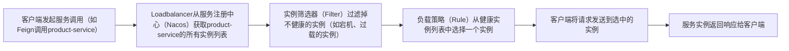
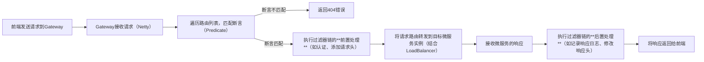
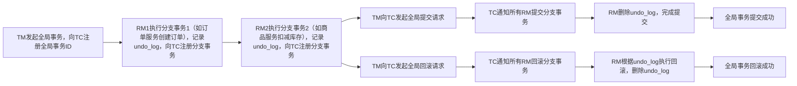

> 本页为原「Java 课程 20」全部 9 个分节的合订本；原分节链接会自动跳转到本页。


## 1.1 如何从全栈角度出发来构建微服务？

你希望从全栈角度出发，了解构建Spring Cloud微服务的完整思路，这需要兼顾后端微服务的架构设计、服务治理，以及前端的交互适配、全栈的协同效率，还要覆盖从开发到运维的全生命周期。以下从架构规划、核心组件落地、全栈协同、运维保障四大维度，系统讲解全栈视角下Spring Cloud微服务的构建方法。

## 一、全栈视角下的架构规划：先定方向再动手
构建前需明确业务边界、技术栈选型、全栈协同规则，避免后续架构混乱。核心是“后端按微服务解耦，前端按体验适配，全栈按流程协同”。

### 1. 业务与技术架构对齐
- 业务架构：基于DDD划分微服务边界
  先通过领域驱动设计（DDD）梳理业务域（如用户域、订单域、商品域），确定每个微服务的单一职责（如订单服务仅处理订单生命周期），并明确服务间的交互方式（同步调用/异步事件）。
  - 全栈要点：前端需参与业务域划分，例如“商品详情页”需调用商品、库存、评价服务，需提前明确这些服务的接口规范，避免后续前端频繁调整请求逻辑。
- 技术架构：Spring Cloud核心组件选型
  结合全栈效率与业务需求，选择Spring Cloud主流组件（以Spring Cloud Alibaba为例，适配国内生态）：
  | 功能场景         | 核心组件                | 全栈价值                                                                 |
  |------------------|-------------------------|--------------------------------------------------------------------------|
  | 服务注册与发现   | Nacos                   | 后端服务自动注册，前端/BFF层可通过服务名动态调用，无需硬编码IP:端口       |
  | 配置中心         | Nacos Config            | 全栈配置统一管理（如前端接口前缀、后端限流阈值），支持动态刷新           |
  | 网关             | Spring Cloud Gateway    | 统一入口，处理路由、限流、跨域、认证，前端只需对接网关地址，无需关注后端服务分布 |
  | 服务调用         | OpenFeign               | 后端服务间声明式调用，简化代码；前端通过网关调用，无需感知底层调用逻辑     |
  | 熔断与限流       | Sentinel                | 后端服务故障时熔断，避免雪崩；前端可获取熔断后的友好提示，提升用户体验     |
  | 分布式事务       | Seata                   | 解决跨服务数据一致性问题，避免前端出现“下单成功但库存未扣减”的异常场景     |
  | 链路追踪         | SkyWalking/Jaeger       | 全栈故障定位，前端请求携带Trace ID，后端可追踪请求经过的所有服务         |

### 2. 全栈技术栈协同规划
- 后端技术栈：Spring Boot + Spring Cloud Alibaba + 数据库（MySQL/Redis） + 消息队列（RocketMQ/Kafka）
- 前端技术栈：Vue/React + TypeScript + Axios（封装请求，处理服务调用的异常/降级）
- 中间层（BFF层）：Node.js（Express/NestJS）或Spring Boot（专为前端定制接口，聚合微服务数据）
  - 作用：减少前端调用多个微服务的复杂度，例如前端调用BFF的`/api/bff/product/detail`接口，BFF内部调用商品、库存、评价服务并组装数据，前端只需一次请求。

## 二、后端核心组件落地：构建高可用的微服务集群
从基础搭建、服务治理、数据一致性三个层面，落地Spring Cloud微服务的后端核心能力，同时为前端适配预留接口与容错机制。

### 1. 基础搭建：快速启动微服务集群
#### （1）环境准备
- 安装Nacos（服务注册/配置中心）、Sentinel Dashboard（熔断限流控制台）、SkyWalking（链路追踪）。
- 初始化多个微服务模块（如user-service、order-service、product-service），每个模块引入Spring Cloud Alibaba依赖：
  ```xml
  <!-- Spring Cloud Alibaba 依赖管理 -->
  <dependencyManagement>
    <dependencies>
      <dependency>
        <groupId>com.alibaba.cloud</groupId>
        <artifactId>spring-cloud-alibaba-dependencies</artifactId>
        <version>2023.0.1.0</version>
        <type>pom</type>
        <scope>import</scope>
      </dependency>
    </dependencies>
  </dependencyManagement>
  ```

#### （2）核心配置（以order-service为例）
```yaml
# application.yml
spring:
  application:
    name: order-service  # 服务名，用于注册与发现
  cloud:
    nacos:
      discovery:
        server-addr: 127.0.0.1:8848  # Nacos注册中心地址
      config:
        server-addr: 127.0.0.1:8848  # Nacos配置中心地址
        file-extension: yaml  # 配置文件格式
    sentinel:
      transport:
        dashboard: 127.0.0.1:8080  # Sentinel控制台地址
server:
  port: 8081  # 服务端口
```

#### （3）服务注册与调用
- 每个微服务添加`@EnableDiscoveryClient`注解，实现服务注册：
  ```java
  @SpringBootApplication
  @EnableDiscoveryClient
  public class OrderServiceApplication {
    public static void main(String[] args) {
      SpringApplication.run(OrderServiceApplication.class, args);
    }
  }
  ```
- 用OpenFeign实现服务间调用（如order-service调用product-service）：
  ```java
  // 声明式Feign客户端
  @FeignClient(name = "product-service")  // 对应product-service的服务名
  public interface ProductFeignClient {
    @GetMapping("/product/{id}")
    ProductVO getProductById(@PathVariable("id") Long id);
  }

  // 业务层调用
  @Service
  public class OrderService {
    @Autowired
    private ProductFeignClient productFeignClient;

    public OrderVO createOrder(Long productId, Integer num) {
      // 调用商品服务获取商品信息
      ProductVO product = productFeignClient.getProductById(productId);
      // 构建订单逻辑...
      return new OrderVO();
    }
  }
  ```

### 2. 服务治理：保障微服务的高可用
#### （1）网关层：统一入口（Spring Cloud Gateway）
网关是全栈交互的“门户”，处理路由、跨域、认证、限流，前端所有请求都通过网关转发：
```yaml
# gateway/application.yml
spring:
  application:
    name: gateway-service
  cloud:
    nacos:
      discovery:
        server-addr: 127.0.0.1:8848
    gateway:
      routes:
        # 订单服务路由
        - id: order-service
          uri: lb://order-service  # 负载均衡调用order-service
          predicates:
            - Path=/order/**  # 前端请求/order/**转发到订单服务
        # 商品服务路由
        - id: product-service
          uri: lb://product-service
          predicates:
            - Path=/product/**
      globalcors:  # 解决前端跨域问题
        cors-configurations:
          '[/**]':
            allowed-origins: "*"  # 生产环境需指定具体域名
            allowed-methods: "*"
            allowed-headers: "*"
server:
  port: 8080  # 网关端口，前端统一请求http://localhost:8080
```
- 全栈要点：前端只需将请求地址配置为网关地址（如`http://localhost:8080`），无需关注后端服务的具体端口，简化前端配置。

#### （2）熔断与限流：Sentinel
为服务添加熔断限流，避免服务故障扩散，同时为前端返回友好的异常信息：
- 后端配置（以order-service调用product-service为例）：
  ```java
  // 给Feign调用添加熔断降级
  @FeignClient(name = "product-service", fallback = ProductFeignFallback.class)
  public interface ProductFeignClient {
    @GetMapping("/product/{id}")
    ProductVO getProductById(@PathVariable("id") Long id);
  }

  // 降级实现类
  @Component
  public class ProductFeignFallback implements ProductFeignClient {
    @Override
    public ProductVO getProductById(Long id) {
      // 降级逻辑：返回默认值或抛出友好异常
      ProductVO product = new ProductVO();
      product.setName("商品服务暂时不可用，请稍后重试");
      return product;
    }
  }
  ```
- 全栈要点：前端通过Axios拦截器捕获后端的降级响应，展示友好提示（如“商品服务繁忙，请稍后重试”），而非直接显示错误码。

#### （3）链路追踪：SkyWalking
集成SkyWalking，实现全栈请求追踪：
- 后端：启动SkyWalking Agent，微服务的请求会自动生成Trace ID；
- 前端：在请求头中添加`SW8`（SkyWalking的Trace ID头），或自定义`X-Request-ID`，后端日志与链路追踪关联；
- 全栈价值：前端反馈“下单接口超时”，可通过Trace ID在SkyWalking中查看请求经过的网关、订单服务、商品服务的耗时，快速定位瓶颈。

### 3. 数据一致性：解决分布式事务问题
微服务中跨服务的操作（如下单时扣减库存）需保证数据一致性，采用Seata实现分布式事务：
```java
// 订单服务的事务入口
@Service
@Transactional
public class OrderService {
  @Autowired
  private OrderMapper orderMapper;
  @Autowired
  private ProductFeignClient productFeignClient;

  @GlobalTransactional  // Seata全局事务注解
  public void createOrder(Long productId, Integer num) {
    // 1. 创建订单
    Order order = new Order();
    order.setProductId(productId);
    order.setNum(num);
    orderMapper.insert(order);

    // 2. 调用商品服务扣减库存（会触发商品服务的本地事务）
    productFeignClient.deductStock(productId, num);
  }
}
```
- 全栈要点：前端需处理事务失败的场景，例如下单后返回“库存不足”，前端需清空购物车并提示用户，避免用户重复下单。

## 三、全栈协同：打通前端与后端的壁垒
全栈视角下的Spring Cloud微服务构建，核心是减少前后端的沟通成本，提升协同效率，重点关注接口设计、BFF层、前端适配三大环节。

### 1. 接口设计：前端友好的API规范
后端接口设计需兼顾业务逻辑与前端体验，遵循以下规则：
- 数据结构扁平：避免嵌套多层的返回值（如`{product: {info: {name: ""}}}`），改为扁平结构（如`{productName: ""}`），减少前端解析成本；
- 统一响应格式：定义全局响应体，前端无需处理不同的返回格式：
  ```java
  // 统一响应类
  @Data
  public class Result<T> {
    private Integer code;  // 状态码：200成功，500失败
    private String message;  // 提示信息
    private T data;  // 业务数据

    // 静态方法：成功响应
    public static <T> Result<T> success(T data) {
      Result<T> result = new Result<>();
      result.setCode(200);
      result.setMessage("success");
      result.setData(data);
      return result;
    }

    // 失败响应
    public static <T> Result<T> fail(String message) {
      Result<T> result = new Result<>();
      result.setCode(500);
      result.setMessage(message);
      result.setData(null);
      return result;
    }
  }
  ```
- 版本控制：接口添加版本号（如`/api/v1/order`），后端迭代时不影响旧版本接口，前端可平滑升级。

### 2. BFF层：为前端定制的中间层
针对复杂业务场景（如商品详情页需调用多个服务），引入BFF层聚合数据，简化前端调用：
- BFF层实现（以Node.js为例）：
  ```javascript
  // 引入axios，调用后端微服务
  const axios = require('axios');
  const express = require('express');
  const app = express();

  // 商品详情接口：聚合商品、库存、评价服务数据
  app.get('/api/bff/product/:id', async (req, res) => {
    const productId = req.params.id;
    try {
      // 并行调用三个微服务
      const [productRes, stockRes, commentRes] = await Promise.all([
        axios.get(`http://localhost:8080/product/${productId}`),
        axios.get(`http://localhost:8080/stock/${productId}`),
        axios.get(`http://localhost:8080/comment/${productId}`)
      ]);
      // 组装数据返回给前端
      const data = {
        product: productRes.data.data,
        stock: stockRes.data.data,
        comments: commentRes.data.data
      };
      res.json({ code: 200, message: 'success', data });
    } catch (error) {
      res.json({ code: 500, message: '服务繁忙，请稍后重试', data: null });
    }
  });

  app.listen(3000, () => {
    console.log('BFF服务启动在3000端口');
  });
  ```
- 全栈要点：前端只需调用BFF的`/api/bff/product/:id`接口，无需关注底层微服务的分布，减少请求次数与错误处理逻辑。

### 3. 前端适配：处理微服务的特性
前端需针对微服务的动态性、容错性做适配，提升用户体验：
- 请求封装：封装Axios，统一处理请求头（如添加Trace ID）、响应拦截（如捕获404/500错误，展示友好提示）：
  ```javascript
  import axios from 'axios';

  const service = axios.create({
    baseURL: 'http://localhost:8080', // 网关地址
    timeout: 5000
  });

  // 请求拦截器：添加Trace ID
  service.interceptors.request.use(
    config => {
      config.headers['X-Request-ID'] = Date.now() + Math.random().toString(36).substr(2);
      return config;
    },
    error => Promise.reject(error)
  );

  // 响应拦截器：处理错误
  service.interceptors.response.use(
    response => response.data,
    error => {
      console.log('请求错误：', error);
      // 提示用户
      ElMessage.error(error.response?.data?.message || '服务繁忙，请稍后重试');
      return Promise.reject(error);
    }
  );

  export default service;
  ```
- 降级与容错：非核心服务故障时，前端局部降级（如评价服务故障，隐藏评价模块，不影响商品信息展示）；
- 动态配置：通过Nacos Config获取前端配置（如接口前缀、功能开关），支持动态更新（无需重启前端项目）。

## 四、运维保障：全栈视角下的微服务运维
微服务的运维需覆盖部署、监控、故障处理，全栈工程师需参与其中，确保系统稳定运行。

### 1. 部署：容器化与自动化
- 采用Docker+K8s部署微服务，实现服务的自动扩缩容、滚动更新；
- 前端项目打包为Docker镜像，部署在Nginx容器中，通过K8s与后端微服务协同部署；
- 全栈要点：使用CI/CD工具（如Jenkins/GitLab CI）实现前后端代码的自动构建、测试、部署，减少手动操作。

### 2. 监控：全链路可观测性
搭建全栈监控体系，覆盖后端指标、前端性能、用户行为：
- 后端监控：使用Prometheus+Grafana监控微服务的CPU、内存、接口QPS/响应时间；
- 前端监控：接入阿里云前端监控/百度统计，监控页面加载时间、JS报错、用户点击行为；
- 日志聚合：使用ELK收集前后端日志，通过Trace ID关联日志，快速定位问题。

### 3. 故障处理：全栈协同排障
建立故障处理流程，全栈工程师协同定位问题：
1. 前端反馈问题（如“下单失败”），提供请求的Trace ID与操作步骤；
2. 后端通过Trace ID在SkyWalking中查看请求链路，定位故障服务；
3. 查看Prometheus监控指标，确认服务是否过载/熔断；
4. 查看ELK日志，定位具体错误原因；
5. 修复问题后，前端验证功能恢复。

## 总结
从全栈角度构建Spring Cloud微服务，核心是“后端做解耦与治理，前端做适配与体验，全栈做协同与保障”：
1. 架构层面：以DDD为指导划分微服务边界，选择Spring Cloud Alibaba核心组件实现服务注册、网关、熔断等能力，同时规划全栈技术栈协同规则；
2. 开发层面：后端注重接口规范与服务治理，前端封装请求处理容错，通过BFF层聚合数据减少前后端复杂度；
3. 运维层面：采用容器化部署与全链路监控，确保微服务的高可用，全栈工程师协同处理故障。

这种方式既发挥了Spring Cloud微服务的解耦优势，又兼顾了前端的用户体验与全栈的协同效率，最终实现业务的快速迭代与系统的稳定运行。


## 2.1 Spring Cloud简介，快速掌握 Spring Cloud 生态全景图

微服务架构已成为企业级应用开发的主流模式，而Spring Cloud是基于Spring Boot构建微服务的一站式解决方案，它将众多成熟的微服务组件进行封装整合，降低了微服务架构的开发与运维成本。而Spring Cloud Alibaba则是Spring Cloud生态的重要分支，适配国内云原生环境与企业需求，成为国内企业构建微服务的首选方案。


### 2.1.1 Spring Cloud核心定义
Spring Cloud是基于Spring Boot的微服务架构开发工具集，它不是单一框架，而是整合了一系列开源组件（如Netflix OSS、Apache Commons等），为微服务架构中的服务注册发现、配置管理、服务调用、熔断限流、网关路由、分布式追踪等核心场景提供了标准化的解决方案。

其核心优势在于：
- 无缝集成Spring Boot：依托Spring Boot的自动配置特性，实现微服务组件的快速接入，开发者无需编写大量配置代码。
- 开箱即用：封装了复杂的微服务底层逻辑，提供简洁的API，降低微服务开发门槛。
- 生态丰富：覆盖微服务全生命周期的所有核心场景，支持灵活扩展。

### 2.1.2 Spring Cloud生态全景图（核心组件分类）
Spring Cloud的生态组件可按微服务架构的核心场景划分为以下几大类，每个类别对应解决特定的微服务问题：

| 核心场景         | 典型组件                  | 核心功能                                                                 |
|------------------|---------------------------|--------------------------------------------------------------------------|
| 服务注册与发现 | Eureka、Consul、Zookeeper | 微服务实例自动注册到注册中心，其他服务可通过服务名获取实例地址，无需硬编码IP:端口 |
| 配置中心     | Spring Cloud Config       | 集中管理所有微服务的配置文件，支持配置动态刷新，避免修改配置后重启服务       |
| 服务调用     | Spring Cloud OpenFeign    | 声明式HTTP客户端，简化服务间的远程调用（底层基于Ribbon实现负载均衡）       |
| 负载均衡     | Spring Cloud LoadBalancer、Ribbon | 对服务调用进行负载均衡，将请求分发到多个服务实例，提升系统可用性           |
| 熔断与限流   | Spring Cloud Circuit Breaker（整合Resilience4j）、Hystrix（已停更） | 服务故障时触发熔断，避免故障扩散；限制服务的请求流量，防止服务过载         |
| API网关      | Spring Cloud Gateway      | 微服务的统一入口，处理路由转发、跨域、认证授权、限流、日志记录等逻辑       |
| 分布式追踪   | Spring Cloud Sleuth + Zipkin | 记录请求在微服务间的调用链路，生成Trace ID，便于定位请求耗时与故障点       |
| 分布式事务   | Spring Cloud Stream + 消息队列、Seata | 解决跨服务的数据一致性问题，支持最终一致性或强一致性事务                   |
| 服务安全     | Spring Cloud Security     | 整合OAuth2、JWT等技术，实现微服务的认证与授权                             |

### 2.1.3 Spring Cloud的版本体系
Spring Cloud没有固定的版本号，而是采用发布列车版本（以伦敦地铁站命名），并与Spring Boot版本强绑定，例如：
- Spring Cloud 2023.0.0（代号Gateway）适配Spring Boot 3.2.x
- Spring Cloud 2022.0.0（代号Kilburn）适配Spring Boot 3.1.x
- 旧版本如Greenwich、Hoxton适配Spring Boot 2.x系列

开发者需根据Spring Boot版本选择对应的Spring Cloud版本，避免版本冲突。


## 2.2 Spring Cloud Alibaba简介，快速掌握符合国情的企业级微服务解决方案

### 2.2.1 Spring Cloud Alibaba核心定义
Spring Cloud Alibaba是阿里巴巴开源的微服务解决方案，它基于Spring Cloud标准，整合了阿里巴巴内部成熟的微服务组件（如Nacos、Sentinel、Seata等），同时适配阿里云的各类云服务（如阿里云ACM、阿里云RocketMQ），是符合国内企业需求的微服务生态。

相较于原生Spring Cloud，Spring Cloud Alibaba的核心优势在于：
- 组件成熟度高：Nacos、Sentinel等组件均经过阿里巴巴双11等海量流量场景的验证，稳定性强。
- 本土化适配：完美支持国内云厂商（阿里云、腾讯云等），提供丰富的本土化功能（如短信服务、支付服务对接）。
- 功能一体化：单个组件可支持多种功能（如Nacos同时支持服务注册发现和配置中心），减少组件依赖数量，降低运维成本。
- 中文文档与社区：完善的中文文档和活跃的国内社区，便于国内开发者学习与问题排查。

### 2.2.2 Spring Cloud Alibaba核心组件与生态
Spring Cloud Alibaba的核心组件覆盖了微服务架构的所有核心场景，且多数组件可直接替代原生Spring Cloud的组件，以下是核心组件的功能与对应场景：

| 核心组件         | 对应微服务场景         | 核心功能                                                                 | 替代原生Spring Cloud组件       |
|------------------|------------------------|--------------------------------------------------------------------------|--------------------------------|
| Nacos        | 服务注册发现+配置中心  | 1. 服务注册与发现（支持AP/CP模式切换）；2. 分布式配置中心（支持动态刷新、配置加密）；3. 服务元数据管理 | Eureka + Spring Cloud Config   |
| Sentinel     | 熔断限流+服务降级      | 1. 流量控制（限流、熔断、降级）；2. 热点参数限流；3. 系统自适应保护；4. 控制台可视化配置 | Hystrix + Resilience4j         |
| Seata        | 分布式事务             | 支持AT、TCC、SAGA、XA四种分布式事务模式，解决跨服务数据一致性问题         | Spring Cloud Stream（消息事务） |
| RocketMQ     | 消息队列+事件驱动      | 高可用的分布式消息队列，支持发布订阅、事务消息、延时消息，实现服务间异步通信 | Spring Cloud Stream + Kafka/RabbitMQ |
| Alibaba Cloud OSS | 对象存储               | 对接阿里云OSS，实现文件的上传、下载与存储管理                             | 第三方存储组件                 |
| Alibaba Cloud SMS | 短信服务               | 对接阿里云短信服务，实现验证码、通知短信的发送                             | 第三方短信组件                 |

### 2.2.3 Spring Cloud Alibaba的企业级优势（符合国情的关键点）
1. 海量流量支撑能力：Nacos、Sentinel、RocketMQ等组件均经过阿里巴巴双11的流量考验，可支撑每秒百万级的请求量，满足国内企业的高并发场景需求（如电商秒杀、直播带货）。
2. 云原生适配：深度整合阿里云容器服务ACK、函数计算FC等云原生产品，支持微服务的容器化部署、自动扩缩容，适配国内企业上云的趋势。
3. 一体化解决方案：相较于原生Spring Cloud需要整合多个组件（如Eureka+Config+Hystrix），Spring Cloud Alibaba通过Nacos一站式解决服务注册与配置问题，减少组件部署与运维的复杂度，降低企业的运维成本。
4. 丰富的本土化功能：提供对接阿里云短信、支付、OSS等本土化服务的组件，无需开发者自行封装，快速实现企业级功能（如用户注册的短信验证码、订单的支付宝/微信支付对接）。

### 2.2.4 Spring Cloud Alibaba的接入方式
Spring Cloud Alibaba的接入非常简单，只需在Spring Boot项目中引入对应的依赖管理和组件依赖即可，以最核心的Nacos为例：
1. 引入Spring Cloud Alibaba依赖管理：
```xml
<dependencyManagement>
    <dependencies>
        <dependency>
            <groupId>com.alibaba.cloud</groupId>
            <artifactId>spring-cloud-alibaba-dependencies</artifactId>
            <version>2023.0.1.0</version>
            <type>pom</type>
            <scope>import</scope>
        </dependency>
    </dependencies>
</dependencyManagement>
```
2. 引入Nacos服务注册与配置中心依赖：
```xml
<dependencies>
    <!-- Nacos服务注册发现 -->
    <dependency>
        <groupId>com.alibaba.cloud</groupId>
        <artifactId>spring-cloud-starter-alibaba-nacos-discovery</artifactId>
    </dependency>
    <!-- Nacos配置中心 -->
    <dependency>
        <groupId>com.alibaba.cloud</groupId>
        <artifactId>spring-cloud-starter-alibaba-nacos-config</artifactId>
    </dependency>
</dependencies>
```
3. 配置Nacos地址（application.yml）：
```yaml
spring:
  cloud:
    nacos:
      discovery:
        server-addr: 127.0.0.1:8848 # Nacos注册中心地址
      config:
        server-addr: 127.0.0.1:8848 # Nacos配置中心地址
        file-extension: yaml # 配置文件格式
  application:
    name: order-service # 服务名，用于注册与配置读取
```


### 总结
1. Spring Cloud是基于Spring Boot的微服务工具集，整合了众多开源组件，覆盖微服务全生命周期的核心场景，其生态全景图可按服务注册发现、配置中心、服务调用等场景分类理解。
2. Spring Cloud Alibaba是适配国内国情的企业级微服务解决方案，以Nacos、Sentinel、Seata等核心组件为核心，具备海量流量支撑、云原生适配、本土化功能丰富等优势，是国内企业构建微服务的首选方案。


## 3.1 服务治理中枢Nacos介绍，解决服务治理认知模糊痛点

服务治理是微服务架构的“生命线”，但很多开发者对其的认知停留在“服务注册发现”的表层，却不清楚配置管理、服务健康检查、动态配置刷新等也是服务治理的核心环节，更不了解如何通过一个统一的工具解决全维度的治理问题。而Nacos（Naming and Configuration Service） 作为阿里开源的服务治理中枢，将服务注册发现与配置中心两大核心能力融为一体，还提供服务健康检查、动态配置、服务元数据管理等全维度治理能力，完美解决了服务治理认知模糊、组件碎片化的痛点。

## 一、先破局：服务治理的核心痛点与认知误区
要理解Nacos的价值，首先要明确服务治理到底解决什么问题，以及开发者常见的认知模糊点：

### 1. 服务治理的核心痛点（微服务架构的“拦路虎”）
微服务架构下，服务数量从几个激增到几十个甚至上百个，会面临以下核心问题：
- 服务地址难管理：服务实例动态扩缩容、IP/端口频繁变化，硬编码地址会导致服务调用失败（如订单服务调用商品服务时，商品服务实例扩容后，订单服务无法感知新实例）。
- 配置管理混乱：不同环境（开发、测试、生产）的配置分散在各服务的配置文件中，修改配置需要重启服务，且无法统一管控（如修改数据库连接池大小，需逐个重启服务）。
- 服务状态不透明：无法实时感知服务实例的健康状态，故障实例仍被调用，导致请求失败（如某个商品服务实例宕机，网关仍将请求转发给它）。
- 治理组件碎片化：原生Spring Cloud中需用Eureka做注册发现、Config做配置中心、Actuator做健康检查，多组件部署运维复杂，且数据无法联动（如服务实例下线后，配置无法自动调整）。

### 2. 服务治理的认知误区（导致认知模糊的关键）
- 误区1：服务治理=服务注册发现。实际上，服务治理是覆盖服务全生命周期的管理体系，包括服务注册发现、配置管理、健康检查、流量管控、元数据管理等。
- 误区2：配置中心是“可有可无的辅助工具”。实际上，动态配置是微服务弹性伸缩、故障恢复的核心（如秒杀场景中，通过动态调整限流阈值，无需重启服务即可应对流量峰值）。
- 误区3：服务治理工具越多样越好。实际上，多组件整合会增加运维成本和数据孤岛问题，一个统一的治理中枢才是企业级解决方案的首选。

## 二、Nacos核心定义：什么是服务治理中枢？
Nacos的核心定位是“一站式动态服务治理平台”，其名字由Naming（服务命名） 和Configuration（配置） 组成，直观体现了两大核心能力。简单来说：
> Nacos = 服务注册发现中心（Eureka/Consul） + 配置中心（Spring Cloud Config/Apollo） + 服务健康检查 + 动态配置管理 + 服务元数据管理

它的核心目标是：让微服务的服务治理变得“简单、高效、统一”，开发者无需整合多个组件，只需通过Nacos即可完成服务全维度的治理操作。

Nacos的核心优势：
- 一体化能力：将服务注册发现与配置中心融合，数据联动（如服务实例下线后，可自动推送新的配置给关联服务）。
- 高可用：支持集群部署，采用RAFT协议保证数据一致性，且支持AP/CP模式切换（应对不同场景的一致性需求）。
- 易用性：提供可视化控制台，操作简单；支持多种开发语言（Java、Go、Python等）和多种服务发现模式（DNS、RPC）。
- 本土化适配：深度整合Spring Cloud Alibaba、阿里云等生态，满足国内企业的云原生需求。

## 三、Nacos核心功能：破解服务治理认知模糊的关键
Nacos的核心功能覆盖了服务治理的全维度，我们可以按服务注册发现和配置中心两大核心模块拆解，同时介绍其延伸的治理能力：

### 3.1 核心功能一：服务注册发现（解决“服务在哪”的问题）
服务注册发现是微服务的“导航系统”，Nacos作为注册中心，实现了服务实例的自动注册、动态发现、健康检查，彻底解决服务地址管理的痛点。

#### （1）核心流程（以Spring Cloud微服务为例）
1. 服务注册：微服务实例启动时，通过Nacos客户端将自己的服务名、IP、端口、健康检查接口等信息注册到Nacos服务端。
   - 示例：订单服务（order-service）启动后，向Nacos注册`192.168.1.100:8081`、`192.168.1.101:8081`两个实例。
2. 服务发现：其他服务（如商品服务）通过Nacos客户端向Nacos服务端查询“order-service”的所有实例地址，获取可用实例列表。
3. 健康检查：Nacos服务端定期向服务实例发送健康检查请求（如调用`/actuator/health`接口），若实例连续失败，则将其从可用列表中剔除，避免请求转发到故障实例。

#### （2）关键特性（超越传统注册中心）
- AP/CP模式切换：
  - AP模式：优先保证可用性（类似Eureka），适合高并发、实例数量多的场景（如电商秒杀），即使部分节点故障，服务注册发现仍能正常工作。
  - CP模式：优先保证一致性（类似Zookeeper），适合数据一致性要求高的场景（如金融交易）。
  - 开发者可通过配置一键切换，无需更换组件。
- 服务元数据管理：支持为服务实例添加自定义元数据（如`env=prod`、`version=v1`），可用于灰度发布、按环境路由等场景（如只将测试流量转发到`version=v2`的实例）。

#### （3）解决的认知模糊点
- 服务注册发现不只是“地址映射”，还包括健康检查、元数据管理、模式适配等治理能力，Nacos将这些能力一体化实现。

### 3.2 核心功能二：配置中心（解决“配置怎么管”的问题）
配置中心是微服务的“控制面板”，Nacos作为配置中心，实现了配置的集中管理、动态刷新、环境隔离，彻底解决配置分散、修改需重启的痛点。

#### （1）核心流程
1. 配置发布：开发者在Nacos控制台或通过API，将不同环境的配置（如生产环境的数据库连接配置、限流阈值）发布到Nacos服务端，按服务名+环境+配置格式分类存储（如`order-service-prod.yaml`）。
2. 配置拉取：微服务实例启动时，通过Nacos客户端从服务端拉取对应环境的配置，加载到应用中。
3. 动态刷新：当配置修改后，Nacos服务端主动推送新配置给微服务实例，实例无需重启即可加载新配置（如修改限流阈值后，秒杀服务立即生效新的限流规则）。

#### （2）关键特性（超越传统配置中心）
- 配置环境隔离：通过命名空间（Namespace） 隔离不同环境的配置（如开发环境ns_dev、生产环境ns_prod），避免配置混淆；通过分组（Group） 隔离不同业务的配置（如订单业务group_order、商品业务group_product）。
- 配置加密：支持对敏感配置（如数据库密码、密钥）进行加密存储，防止配置泄露（如将`password=123456`加密为`password=encrypted:xxx`）。
- 配置版本管理：记录配置的修改历史，支持回滚到任意版本，避免配置修改错误导致的故障。
- 配置监听：微服务可监听指定配置的变化，实现自定义业务逻辑（如配置修改后，自动刷新缓存）。

#### （3）解决的认知模糊点
- 配置管理不只是“集中存储”，还包括动态刷新、环境隔离、加密、版本管理等治理能力，Nacos将这些能力与服务注册发现联动（如服务实例扩缩容后，自动推送新的负载均衡配置）。

### 3.3 延伸功能：服务治理的“增值能力”
Nacos除了核心的注册发现和配置中心能力，还提供了以下服务治理延伸功能，进一步完善治理体系：
- 服务流量管控：与Sentinel整合，可基于Nacos的服务元数据配置限流规则（如对`env=test`的实例设置更低的限流阈值）。
- 服务路由：与Spring Cloud Gateway整合，可基于Nacos的服务元数据实现路由规则（如将`/order/v2/**`的请求转发到`version=v2`的订单服务实例）。
- 集群监控：Nacos控制台提供服务实例数量、配置数量、健康状态的实时监控，直观展示服务治理的整体状态。

## 四、Nacos工作原理：从底层理解服务治理逻辑
要彻底摆脱认知模糊，需了解Nacos的底层工作原理，这里重点讲解服务注册发现和配置中心的核心逻辑：

### 1. 服务注册发现的工作原理
Nacos采用客户端/服务端（CS）架构，服务端负责存储服务实例信息，客户端负责与服务端交互：
- 注册流程：客户端通过`POST`请求将服务实例信息发送到服务端的`/nacos/v1/ns/instance`接口，服务端将信息存储到内存和磁盘（采用RAFT协议保证集群数据一致性）。
- 发现流程：客户端通过`GET`请求从服务端的`/nacos/v1/ns/instance/list`接口获取服务实例列表，同时建立长连接，服务端有实例变化时（如新增、下线），主动推送更新后的列表给客户端。
- 健康检查：服务端通过心跳机制（客户端每隔5秒发送心跳包）或主动检查（服务端调用实例的健康检查接口）判断实例健康状态，超过15秒未收到心跳的实例被标记为不健康，超过30秒则被剔除。

### 2. 配置中心的工作原理
Nacos的配置中心同样采用CS架构，配置数据存储在服务端的嵌入式数据库（Derby）或外置数据库（MySQL）中：
- 配置发布：开发者通过控制台或API将配置发送到服务端，服务端将配置存储到数据库，并更新内存中的配置缓存。
- 配置拉取：客户端启动时，通过`GET`请求从服务端获取配置，同时在服务端注册配置监听。
- 动态刷新：当配置修改后，服务端通过长连接将配置变更通知发送给客户端，客户端拉取新配置并刷新到应用中。

## 五、企业级实践：Nacos的部署与核心应用场景
### 1. Nacos的部署方式（从测试到生产）
- 单机部署：适合开发/测试环境，直接下载Nacos安装包，执行`startup.sh -m standalone`（Linux）或`startup.cmd -m standalone`（Windows）即可启动。
- 集群部署：适合生产环境，需配置集群节点、数据源（推荐MySQL）、负载均衡（如Nginx），保证高可用。

### 2. 核心应用场景（解决实际业务问题）
#### 场景1：微服务服务注册发现
在Spring Cloud Alibaba项目中，只需引入依赖并配置Nacos地址，即可实现服务自动注册发现：
```xml
<!-- Nacos服务注册发现依赖 -->
<dependency>
    <groupId>com.alibaba.cloud</groupId>
    <artifactId>spring-cloud-starter-alibaba-nacos-discovery</artifactId>
</dependency>
```
```yaml
spring:
  application:
    name: order-service # 服务名
  cloud:
    nacos:
      discovery:
        server-addr: 127.0.0.1:8848 # Nacos服务端地址
```

#### 场景2：分布式配置中心
引入配置中心依赖，配置Nacos地址后，即可从Nacos拉取配置：
```xml
<!-- Nacos配置中心依赖 -->
<dependency>
    <groupId>com.alibaba.cloud</groupId>
    <artifactId>spring-cloud-starter-alibaba-nacos-config</artifactId>
</dependency>
```
```yaml
# bootstrap.yml（优先于application.yml加载）
spring:
  application:
    name: order-service
  cloud:
    nacos:
      config:
        server-addr: 127.0.0.1:8848
        file-extension: yaml # 配置文件格式
        namespace: ns_prod # 生产环境命名空间
        group: GROUP_ORDER # 订单业务分组
```

#### 场景3：动态配置刷新
在需要动态刷新的类上添加`@RefreshScope`注解，修改Nacos配置后，无需重启服务即可生效：
```java
@RestController
@RefreshScope // 开启配置刷新
public class OrderController {
    @Value("${order.limit:100}") // 从Nacos读取限流阈值配置
    private Integer orderLimit;

    @GetMapping("/order/limit")
    public Integer getOrderLimit() {
        return orderLimit;
    }
}
```

## 总结
1. 认知层面：服务治理是覆盖服务注册发现、配置管理、健康检查、动态配置的全维度体系，而非单一的“地址管理”，Nacos作为服务治理中枢，将这些能力一体化实现，解决了认知模糊的痛点。
2. 功能层面：Nacos核心提供服务注册发现和配置中心两大能力，支持AP/CP模式切换、配置动态刷新、环境隔离等企业级特性，还能与Spring Cloud Alibaba生态组件（Sentinel、Seata）无缝整合。
3. 实践层面：Nacos部署简单，接入Spring Cloud项目仅需几行配置，即可快速实现微服务的全维度治理，是企业级微服务架构的首选服务治理工具。

看完这些，服务治理的认知模糊应该消得差不多了，Nacos的核心价值和用法也清楚了。


## 4.1 Feign核心原理与快速上手,构建标准化API调用体系

在微服务架构中，服务间的远程调用是高频场景，传统的`RestTemplate`调用需要手动拼接URL、处理参数和响应，代码冗余且易出错，还难以维护标准化的API调用规范。而Feign（声明式HTTP客户端） 基于接口注解的方式，将HTTP请求抽象为Java接口，自动生成调用实现，不仅简化了远程调用代码，还能统一API调用的规范，是构建微服务标准化API调用体系的核心工具。

## 一、Feign核心定位：为什么它是微服务API调用的首选？
Feign是由Netflix开源的声明式、模板化的HTTP客户端，后被整合到Spring Cloud生态中（称为Spring Cloud OpenFeign），其核心定位是：
> 将微服务间的HTTP远程调用，转化为如同调用本地接口一样简单，同时提供可插拔的编码器、解码器、拦截器等扩展能力，支撑标准化的API调用体系。

### Feign的核心优势（对比传统调用方式）
| 调用方式                | 核心问题                          | Feign的解决方案                                                                 |
|-------------------------|-----------------------------------|---------------------------------------------------------------------------------|
| `RestTemplate`          | 手动拼接URL/参数，代码冗余，难以维护 | 基于注解声明接口，自动生成HTTP请求，无需手动处理URL和参数                       |
| 原生HTTP Client         | 缺乏统一的调用规范，扩展能力弱    | 支持统一配置（超时、重试）、拦截器（认证、日志），易构建标准化调用体系           |
| 自定义封装的HTTP工具类  | 耦合业务逻辑，复用性差            | 接口与实现分离，专注于API定义，复用性强                                         |

### Feign的核心特性
1. 声明式编程：通过注解定义接口，无需编写实现类，框架自动生成调用逻辑。
2. 集成负载均衡：与Spring Cloud LoadBalancer（或Ribbon）无缝整合，自动实现服务实例的负载均衡调用。
3. 可插拔的扩展：支持自定义编码器（如JSON/XML解析）、解码器、拦截器、超时配置、日志配置等。
4. 兼容Spring MVC注解：Spring Cloud OpenFeign支持`@GetMapping`、`@PostMapping`等Spring MVC注解，降低学习成本。
5. 支持熔断降级：可与Sentinel、Hystrix整合，实现服务调用的熔断与降级，提升系统稳定性。

## 二、Feign核心原理：从注解到HTTP请求的底层逻辑
要理解Feign为何能实现“接口式调用”，需拆解其核心工作流程，这也是构建标准化API调用体系的基础。

### 1. Feign的核心工作流程（整体逻辑）
Feign的工作流程本质是“注解解析→动态代理→请求构建→发送请求→响应解析”，具体步骤如下：
```mermaid
graph LR
    A[定义Feign接口（添加@FeignClient注解）] --> B[项目启动时，Feign扫描注解接口]
    B --> C[通过JDK动态代理为接口生成代理类（FeignInvocationHandler）]
    C --> D[调用接口方法时，代理类拦截请求]
    D --> E[解析接口注解（如@GetMapping、参数注解），构建HTTP请求模板]
    E --> F[整合负载均衡器（LoadBalancer），获取目标服务的可用实例]
    F --> G[填充请求参数，生成最终的HTTP请求（URL、请求头、参数）]
    G --> H[通过HTTP Client（如OkHttp、HttpClient）发送请求]
    H --> I[接收响应，解析为指定的返回类型（如POJO）]
    I --> J[返回结果给调用方]
```

### 2. 核心原理拆解（关键步骤详解）
#### （1）注解扫描与代理类生成（启动阶段）
- 注解扫描：Spring Cloud OpenFeign通过`@EnableFeignClients`注解开启Feign的自动配置，该注解会触发`FeignClientScanner`扫描项目中所有添加`@FeignClient`的接口。
- 动态代理生成：对于每个Feign接口，Feign会使用JDK动态代理生成一个代理类（核心是`FeignInvocationHandler`），这个代理类是实现接口调用的核心。
  - 为什么用JDK动态代理？因为Feign接口是纯接口，没有实现类，JDK动态代理正好适用于接口代理场景。

#### （2）请求拦截与模板构建（调用阶段）
当调用Feign接口的方法时，代理类会拦截请求，执行以下操作：
1. 解析注解元数据：读取接口上的`@FeignClient`（服务名、降级类等）、方法上的`@GetMapping`/`@PostMapping`（请求方式、URL）、参数上的`@PathVariable`/`@RequestParam`（参数类型、名称）等注解信息。
2. 构建RequestTemplate：根据注解信息生成HTTP请求模板，包含请求方法（GET/POST）、URL模板、请求头、参数模板等。
3. 负载均衡选路：通过Spring Cloud LoadBalancer（或Ribbon）根据`@FeignClient`中的服务名，从注册中心（如Nacos）获取目标服务的所有实例，选择一个实例（默认轮询策略），填充到URL模板中，生成最终的请求地址（如`http://order-service/order/1`）。

#### （3）HTTP请求发送与响应解析（执行阶段）
1. 请求发送：Feign默认使用JDK的`HttpURLConnection`发送HTTP请求，也可配置为OkHttp、Apache HttpClient等高性能客户端。
2. 响应解析：将HTTP响应的结果（JSON/XML）通过编码器/解码器（默认Jackson）解析为接口方法的返回类型（如POJO、List、String），返回给调用方。

#### （4）扩展能力的实现（拦截器、熔断等）
Feign的扩展能力通过拦截器（RequestInterceptor）、编码器（Encoder）、解码器（Decoder）、熔断处理器（Fallback） 等组件实现：
- 拦截器：在请求发送前执行自定义逻辑，如添加统一的请求头（token、Trace ID）、日志记录等。
- 熔断降级：当目标服务故障时，执行预先定义的降级逻辑（如返回默认值），避免故障扩散。

### 3. Spring Cloud OpenFeign与原生Feign的区别
原生Feign是Netflix的开源组件，而Spring Cloud OpenFeign对其进行了增强，主要区别在于：
- 支持Spring MVC注解：原生Feign使用自身的`@RequestLine`等注解，Spring Cloud OpenFeign支持`@GetMapping`、`@PostMapping`等Spring MVC注解，降低开发者学习成本。
- 无缝整合Spring Cloud生态：自动整合Spring Cloud LoadBalancer（负载均衡）、Nacos/Eureka（服务发现）、Sentinel/Hystrix（熔断降级）等组件。
- 支持Spring Boot自动配置：通过`@EnableFeignClients`一键开启Feign功能，无需手动配置。

## 三、Feign快速上手：三步构建基础API调用
以下以Spring Cloud Alibaba + Nacos环境为例，演示Feign的快速上手流程，实现订单服务调用商品服务的API。

### 前置条件
1. 已搭建Nacos服务注册中心（本地地址：`127.0.0.1:8848`）。
2. 已创建两个Spring Boot项目：`product-service`（商品服务，端口8081）、`order-service`（订单服务，端口8082），并接入Nacos服务发现。

### 步骤1：引入OpenFeign依赖
在`order-service`的`pom.xml`中引入Spring Cloud OpenFeign依赖：
```xml
<!-- Spring Cloud OpenFeign 依赖 -->
<dependency>
    <groupId>org.springframework.cloud</groupId>
    <artifactId>spring-cloud-starter-openfeign</artifactId>
</dependency>
<!-- 负载均衡依赖（OpenFeign默认整合，需显式引入） -->
<dependency>
    <groupId>org.springframework.cloud</groupId>
    <artifactId>spring-cloud-starter-loadbalancer</artifactId>
</dependency>
```
> 注意：Spring Cloud 2020版本后，移除了对Ribbon的依赖，默认使用Spring Cloud LoadBalancer作为负载均衡器。

### 步骤2：开启Feign功能并定义调用接口
1. 在`order-service`的启动类上添加`@EnableFeignClients`注解，开启Feign功能：
```java
import org.springframework.boot.SpringApplication;
import org.springframework.boot.autoconfigure.SpringBootApplication;
import org.springframework.cloud.openfeign.EnableFeignClients;

@SpringBootApplication
@EnableFeignClients // 开启Feign客户端
public class OrderServiceApplication {
    public static void main(String[] args) {
        SpringApplication.run(OrderServiceApplication.class, args);
    }
}
```

2. 定义Feign调用接口，调用`product-service`的API：
```java
import org.springframework.cloud.openfeign.FeignClient;
import org.springframework.web.bind.annotation.GetMapping;
import org.springframework.web.bind.annotation.PathVariable;

// 声明Feign客户端，指定目标服务名（与product-service的spring.application.name一致）
@FeignClient(name = "product-service")
public interface ProductFeignClient {

    // 对应product-service的/api/product/{id}接口
    // 使用Spring MVC注解定义请求方式和参数
    @GetMapping("/api/product/{id}")
    ProductVO getProductById(@PathVariable("id") Long id);

    // 可添加更多接口，如查询商品列表
    @GetMapping("/api/product/list")
    List<ProductVO> getProductList();
}

// 商品VO（与product-service的返回数据结构一致）
class ProductVO {
    private Long id;
    private String name;
    private Double price;
    // 省略getter/setter
}
```

### 步骤3：在业务代码中调用Feign接口
在`order-service`的业务类中注入Feign接口，像调用本地接口一样调用远程API：
```java
import org.springframework.beans.factory.annotation.Autowired;
import org.springframework.web.bind.annotation.GetMapping;
import org.springframework.web.bind.annotation.PathVariable;
import org.springframework.web.bind.annotation.RestController;

@RestController
@RequestMapping("/api/order")
public class OrderController {

    // 注入Feign接口
    @Autowired
    private ProductFeignClient productFeignClient;

    @GetMapping("/create/{productId}")
    public String createOrder(@PathVariable Long productId) {
        // 调用商品服务的API，获取商品信息
        ProductVO product = productFeignClient.getProductById(productId);
        // 业务逻辑：创建订单
        return "创建订单成功，商品名称：" + product.getName();
    }
}
```

### 测试验证
1. 启动Nacos、`product-service`、`order-service`。
2. 访问`product-service`的接口：`http://localhost:8081/api/product/1`，确认返回商品数据。
3. 访问`order-service`的接口：`http://localhost:8082/api/order/create/1`，可看到返回“创建订单成功，商品名称：xxx”，说明Feign调用成功。

## 四、构建标准化API调用体系：Feign高级配置与规范
快速上手后，需通过Feign的高级配置和规范定义，构建企业级的标准化API调用体系，以下是核心配置和规范建议。

### 1. 全局配置：统一API调用规则
在`application.yml`中配置Feign的全局参数，统一控制超时、日志、客户端等规则：
```yaml
spring:
  application:
    name: order-service
  cloud:
    nacos:
      discovery:
        server-addr: 127.0.0.1:8848

# Feign全局配置
feign:
  client:
    config:
      default: # default表示全局配置，也可指定服务名（如product-service）进行单独配置
        connect-timeout: 5000 # 连接超时时间（毫秒）
        read-timeout: 5000 # 读取超时时间（毫秒）
        logger-level: full # 日志级别：NONE/BASIC/HEADERS/FULL
        # 配置高性能HTTP客户端（可选，默认是HttpURLConnection）
        client: feign.okhttp.OkHttpClient
  # 开启熔断支持（需整合Sentinel/Hystrix）
  circuitbreaker:
    enabled: true
```
> 日志级别说明：
> - `NONE`：不记录日志（默认）；
> - `BASIC`：记录请求方法、URL、状态码、执行时间；
> - `HEADERS`：记录BASIC信息+请求/响应头；
> - `FULL`：记录所有请求/响应细节（包括正文、元数据）。

### 2. 自定义拦截器：统一请求头与认证
通过`RequestInterceptor`实现全局请求拦截，添加统一的请求头（如Trace ID、token、版本号），实现API调用的标准化认证和链路追踪：
```java
import feign.RequestInterceptor;
import feign.RequestTemplate;
import org.springframework.context.annotation.Bean;
import org.springframework.context.annotation.Configuration;
import org.springframework.web.context.request.RequestContextHolder;
import org.springframework.web.context.request.ServletRequestAttributes;

import javax.servlet.http.HttpServletRequest;
import java.util.UUID;

@Configuration
public class FeignInterceptorConfig {

    @Bean
    public RequestInterceptor feignRequestInterceptor() {
        return new RequestInterceptor() {
            @Override
            public void apply(RequestTemplate template) {
                // 1. 添加统一的Trace ID（链路追踪）
                String traceId = UUID.randomUUID().toString();
                // 若当前是Web请求，可从请求头中获取Trace ID，实现全链路追踪
                ServletRequestAttributes attributes = (ServletRequestAttributes) RequestContextHolder.getRequestAttributes();
                if (attributes != null) {
                    HttpServletRequest request = attributes.getRequest();
                    traceId = request.getHeader("X-Trace-ID");
                }
                template.header("X-Trace-ID", traceId);

                // 2. 添加统一的API版本号
                template.header("X-API-Version", "v1");

                // 3. 添加认证token（可从配置中心或上下文获取）
                template.header("Authorization", "Bearer " + "your-token-here");
            }
        };
    }
}
```

### 3. 熔断降级：提升API调用的稳定性
整合Sentinel实现Feign的熔断降级，当目标服务故障时，执行降级逻辑，避免服务雪崩：
1. 引入Sentinel依赖：
```xml
<dependency>
    <groupId>com.alibaba.cloud</groupId>
    <artifactId>spring-cloud-starter-alibaba-sentinel</artifactId>
</dependency>
```
2. 定义降级实现类：
```java
import org.springframework.stereotype.Component;
import java.util.Collections;
import java.util.List;

// 降级实现类，需实现Feign接口
@Component
public class ProductFeignFallback implements ProductFeignClient {

    @Override
    public ProductVO getProductById(Long id) {
        // 降级逻辑：返回默认商品信息
        ProductVO product = new ProductVO();
        product.setId(id);
        product.setName("商品服务暂时不可用，请稍后重试");
        product.setPrice(0.0);
        return product;
    }

    @Override
    public List<ProductVO> getProductList() {
        // 降级逻辑：返回空列表
        return Collections.emptyList();
    }
}
```
3. 在Feign接口中指定降级类：
```java
import org.springframework.cloud.openfeign.FeignClient;
import org.springframework.web.bind.annotation.GetMapping;
import org.springframework.web.bind.annotation.PathVariable;

// 指定fallback为降级实现类
@FeignClient(name = "product-service", fallback = ProductFeignFallback.class)
public interface ProductFeignClient {
    // 接口方法不变
}
```

### 4. 标准化API调用规范（企业级建议）
#### （1）接口命名规范
- Feign接口命名：`{服务名}FeignClient`（如`ProductFeignClient`）。
- 方法命名：与目标服务的接口方法保持一致，如`getProductById`、`listProduct`。
- URL规范：统一使用`/api/{版本}/{资源}/{操作}`（如`/api/v1/product/{id}`）。

#### （2）数据传输规范
- 统一使用VO（Value Object）作为请求/返回数据结构，避免使用复杂的嵌套对象。
- 统一响应格式：所有API返回统一的响应体（如`Result<T>`），包含状态码、消息、数据：
```java
// 统一响应体
public class Result<T> {
    private Integer code; // 200成功，500失败
    private String message;
    private T data;

    // 静态方法：成功/失败响应
    public static <T> Result<T> success(T data) {
        Result<T> result = new Result<>();
        result.setCode(200);
        result.setMessage("success");
        result.setData(data);
        return result;
    }

    public static <T> Result<T> fail(String message) {
        Result<T> result = new Result<>();
        result.setCode(500);
        result.setMessage(message);
        result.setData(null);
        return result;
    }

    // 省略getter/setter
}
```
此时Feign接口的返回类型应改为`Result<ProductVO>`，保持响应格式统一。

#### （3）版本管理规范
- 通过请求头（如`X-API-Version`）或URL路径（如`/api/v2/product`）实现API版本管理，Feign拦截器统一添加版本号，避免因API迭代导致的调用失败。

## 五、Feign常见问题与解决方案
1. Feign接口注入时出现“No qualifying bean”异常：
   - 原因：`@EnableFeignClients`的扫描范围未覆盖Feign接口。
   - 解决方案：指定`@EnableFeignClients(basePackages = "com.example.order.feign")`，明确扫描路径。

2. Feign不支持GET请求传递POJO参数：
   - 原因：Feign默认将GET请求的POJO参数转为POST请求的表单参数。
   - 解决方案：使用`@SpringQueryMap`注解（Spring Cloud OpenFeign提供），将POJO参数转为URL查询参数：
     ```java
     @GetMapping("/api/product/query")
     List<ProductVO> queryProduct(@SpringQueryMap ProductQueryVO queryVO);
     ```

3. Feign调用时请求头丢失：
   - 原因：Feign默认不会传递当前请求的头信息（如Cookie、Token）。
   - 解决方案：在拦截器中获取当前请求的头信息，添加到Feign请求中（参考上文的拦截器配置）。

## 总结
1. 核心原理：Feign通过注解扫描→动态代理→请求模板构建→负载均衡→HTTP请求发送→响应解析的流程，将HTTP远程调用转化为本地接口调用，其核心是JDK动态代理和可插拔的扩展组件。
2. 快速上手：只需三步（引入依赖→开启Feign功能→定义并调用接口），即可实现微服务间的API调用，整合Nacos后还能自动实现服务发现与负载均衡。
3. 标准化体系：通过全局配置、自定义拦截器、熔断降级和规范定义，可构建企业级的标准化API调用体系，提升代码可维护性和系统稳定性。

Feign的核心原理和标准化用法搞清楚了，微服务间的API调用就能写得简洁、规范，维护起来也省心。


## 5.1 Spring Cloud Loadbalancer解决负载均衡的核心痛点

在微服务架构中，单个服务通常会部署多个实例以应对高并发和故障冗余，而负载均衡是将请求合理分发到多个服务实例的核心机制。Spring Cloud Loadbalancer是Spring Cloud官方推出的新一代负载均衡器，替代了已停更的Ribbon，成为Spring Cloud生态中默认的负载均衡组件，它轻量、可扩展、适配云原生环境，是企业级微服务架构实现负载均衡的首选方案。

## 一、负载均衡的核心痛点与Spring Cloud Loadbalancer的定位
### 1. 微服务中负载均衡的核心痛点
微服务架构下，服务实例的IP/端口会随动态扩缩容、故障重启频繁变化，若没有负载均衡机制，会面临以下问题：
- 请求集中：所有请求都发送到单个服务实例，导致实例过载宕机，其他实例却闲置。
- 故障无法隔离：某个服务实例故障后，请求仍被转发到该实例，导致请求失败。
- 无法适配动态场景：无法感知服务实例的新增、下线，需手动修改配置才能切换实例。
- 负载策略单一：仅支持简单的轮询，无法根据实例的负载情况（如CPU、内存使用率）智能分发请求。

### 2. Spring Cloud Loadbalancer的核心定位
Spring Cloud Loadbalancer是Spring Cloud生态的核心负载均衡组件，它与Spring Cloud服务发现（Nacos/Eureka/Consul）无缝整合，提供客户端负载均衡能力，核心定位是：
> 为微服务间的调用（如OpenFeign、RestTemplate）提供动态的、可扩展的负载均衡能力，自动感知服务实例的变化，将请求分发到健康的实例上，提升系统的可用性和性能。

### 3. Spring Cloud Loadbalancer的核心优势（对比Ribbon）
| 特性                | Ribbon（已停更）| Spring Cloud Loadbalancer                |
|---------------------|---------------------------------------|------------------------------------------|
| 维护状态            | 停止维护，存在安全漏洞                | 持续迭代，适配Spring Cloud新版本（如3.x） |
| 轻量性              | 依赖多，体积大                        | 轻量，核心依赖少，启动速度快              |
| 扩展性              | 扩展需继承复杂的抽象类，成本高        | 基于SPI机制，扩展简单，支持自定义负载策略  |
| 云原生适配          | 对云原生（K8s）支持有限               | 原生支持云原生环境，可整合K8s服务发现     |
| 反应式编程支持      | 不支持Reactor响应式编程               | 支持Reactor响应式编程，适配WebFlux        |
| 负载策略            | 内置策略少（轮询、随机）| 内置多种策略，且支持自定义                |

## 二、负载均衡的两种模式：理解客户端负载均衡的核心
在介绍Spring Cloud Loadbalancer之前，需先明确负载均衡的两种核心模式，这是理解其工作原理的基础：

### 1. 服务端负载均衡（如Nginx）
- 工作方式：负载均衡器部署在服务前端，所有请求先发送到负载均衡器，由负载均衡器根据服务实例列表将请求转发到具体实例。
- 特点：集中式管理，适合网关层的负载均衡，但无法感知服务实例的内部负载情况，且负载均衡器本身可能成为瓶颈。

### 2. 客户端负载均衡（如Spring Cloud Loadbalancer）
- 工作方式：负载均衡逻辑嵌入在调用方（客户端）中，客户端从服务注册中心获取服务实例列表，自行决定将请求发送到哪个实例。
- 特点：分布式部署，无单点瓶颈，客户端可直接感知服务实例的健康状态和负载情况，适配微服务的动态场景。
- Spring Cloud Loadbalancer的核心模式：客户端负载均衡，也是微服务架构中最常用的负载均衡模式。

## 三、Spring Cloud Loadbalancer核心原理：从实例获取到请求分发
Spring Cloud Loadbalancer的工作流程可分为实例获取、实例筛选、负载选择、请求分发四个核心步骤，整体逻辑如下：


### 1. 核心步骤详解
#### （1）实例获取：与服务发现整合
Spring Cloud Loadbalancer会自动与Spring Cloud服务发现组件（如Nacos、Eureka）整合，通过ServiceInstanceListSupplier接口从注册中心获取服务的所有实例列表（包含IP、端口、元数据、健康状态等信息）。
- 例如：调用`product-service`时，Loadbalancer会从Nacos获取该服务的实例列表：`192.168.1.100:8081`、`192.168.1.101:8081`、`192.168.1.102:8081`。
- 关键特性：实时更新，当服务实例新增、下线或状态变化时，实例列表会自动刷新，无需手动干预。

#### （2）实例筛选：过滤不健康实例
Loadbalancer通过LoadBalancerClientFilter等筛选器，过滤掉不符合条件的实例，只保留健康的实例：
- 默认筛选规则：过滤掉处于下线状态、端口不可用的实例。
- 自定义筛选：可扩展筛选器，例如过滤掉CPU使用率超过80%的实例、过滤掉非指定版本的实例（如只保留`version=v2`的实例）。

#### （3）负载选择：选择目标实例
Loadbalancer通过负载策略（Rule） 从健康实例列表中选择一个实例，这是负载均衡的核心环节：
- 内置负载策略：
  1. RoundRobinLoadBalancer（轮询策略）：默认策略，按顺序依次选择实例（如100→101→102→100…），实现请求的均匀分发。
  2. RandomLoadBalancer（随机策略）：随机选择一个实例，适合实例性能相近的场景。
  3. WeightedRandomLoadBalancer（加权随机策略）：根据实例的权重随机选择，权重高的实例被选中的概率大（可通过实例元数据设置权重）。
- 自定义负载策略：可实现`ReactorServiceInstanceLoadBalancer`接口，开发自定义策略（如根据实例的响应时间、CPU使用率选择实例）。

#### （4）请求分发：发送请求到目标实例
客户端（如OpenFeign、RestTemplate）将请求发送到选中的实例，完成负载均衡的最后一步。

## 四、Spring Cloud Loadbalancer快速上手：两种集成方式
Spring Cloud Loadbalancer与Spring Cloud生态无缝整合，主要有两种集成方式：RestTemplate + Loadbalancer、OpenFeign + Loadbalancer，以下以Spring Cloud Alibaba + Nacos为例演示快速上手流程。

### 前置条件
1. 已搭建Nacos服务注册中心（本地地址：`127.0.0.1:8848`）。
2. 已创建Spring Boot项目（如`order-service`），并接入Nacos服务发现。

### 步骤1：引入Spring Cloud Loadbalancer依赖
在`pom.xml`中引入依赖（Spring Cloud 2020+版本后，OpenFeign默认依赖Loadbalancer，但若使用RestTemplate，需显式引入）：
```xml
<!-- Spring Cloud Loadbalancer 核心依赖 -->
<dependency>
    <groupId>org.springframework.cloud</groupId>
    <artifactId>spring-cloud-starter-loadbalancer</artifactId>
</dependency>

<!-- 若使用Nacos服务发现，需引入以下依赖 -->
<dependency>
    <groupId>com.alibaba.cloud</groupId>
    <artifactId>spring-cloud-starter-alibaba-nacos-discovery</artifactId>
</dependency>
```

### 方式1：RestTemplate整合Loadbalancer
通过`@LoadBalanced`注解为RestTemplate添加负载均衡能力：
```java
import org.springframework.cloud.client.loadbalancer.LoadBalanced;
import org.springframework.context.annotation.Bean;
import org.springframework.context.annotation.Configuration;
import org.springframework.web.client.RestTemplate;

@Configuration
public class RestTemplateConfig {

    @Bean
    @LoadBalanced // 开启负载均衡能力
    public RestTemplate restTemplate() {
        return new RestTemplate();
    }
}
```

在业务代码中使用RestTemplate调用服务（直接使用服务名，而非IP:端口）：
```java
import org.springframework.beans.factory.annotation.Autowired;
import org.springframework.web.bind.annotation.GetMapping;
import org.springframework.web.bind.annotation.RestController;
import org.springframework.web.client.RestTemplate;

@RestController
public class OrderController {

    @Autowired
    private RestTemplate restTemplate;

    @GetMapping("/order/callProduct")
    public String callProductService() {
        // 直接使用服务名（product-service），Loadbalancer会自动解析为具体的实例地址
        String url = "http://product-service/api/product/1";
        return restTemplate.getForObject(url, String.class);
    }
}
```

### 方式2：OpenFeign整合Loadbalancer
OpenFeign默认整合Spring Cloud Loadbalancer，无需额外配置，只需定义Feign接口即可自动实现负载均衡：
```java
import org.springframework.cloud.openfeign.FeignClient;
import org.springframework.web.bind.annotation.GetMapping;
import org.springframework.web.bind.annotation.PathVariable;

@FeignClient(name = "product-service") // 服务名
public interface ProductFeignClient {

    @GetMapping("/api/product/{id}")
    String getProductById(@PathVariable("id") Long id);
}
```

在业务代码中注入Feign接口调用，Loadbalancer会自动为其提供负载均衡能力：
```java
import org.springframework.beans.factory.annotation.Autowired;
import org.springframework.web.bind.annotation.GetMapping;
import org.springframework.web.bind.annotation.PathVariable;
import org.springframework.web.bind.annotation.RestController;

@RestController
public class OrderController {

    @Autowired
    private ProductFeignClient productFeignClient;

    @GetMapping("/order/getProduct/{id}")
    public String getProduct(@PathVariable Long id) {
        // Feign调用会自动通过Loadbalancer选择实例
        return productFeignClient.getProductById(id);
    }
}
```

### 测试验证
1. 启动多个`product-service`实例（如端口8081、8082、8083），并注册到Nacos。
2. 访问`order-service`的接口，可看到请求被依次分发到不同的`product-service`实例（轮询策略），实现了负载均衡。

## 五、企业级配置：自定义负载策略与高级特性
快速上手后，需通过自定义配置实现企业级的负载均衡需求，以下是核心配置策略。

### 1. 自定义负载策略（以加权轮询为例）
Spring Cloud Loadbalancer支持自定义负载策略，以下实现加权轮询策略（根据实例权重分发请求，权重高的实例接收更多请求）：

#### 步骤1：定义实例权重（通过Nacos元数据设置）
在`product-service`的`application.yml`中添加元数据，设置实例权重：
```yaml
spring:
  application:
    name: product-service
  cloud:
    nacos:
      discovery:
        server-addr: 127.0.0.1:8848
        # 设置实例元数据，权重为5
        metadata:
          weight: 5
server:
  port: 8081
```
其他实例可设置不同的权重（如8082端口设置`weight: 3`，8083端口设置`weight: 2`）。

#### 步骤2：实现自定义负载均衡器
```java
import org.springframework.cloud.client.ServiceInstance;
import org.springframework.cloud.loadbalancer.core.ReactorLoadBalancer;
import org.springframework.cloud.loadbalancer.core.ServiceInstanceListSupplier;
import org.springframework.cloud.loadbalancer.support.LoadBalancerClientFactory;
import org.springframework.context.annotation.Bean;
import org.springframework.context.annotation.Configuration;
import org.springframework.core.env.Environment;

// 注意：该类不能放在@ComponentScan的扫描范围内，否则会成为全局配置
@Configuration
public class WeightedLoadBalancerConfig {

    @Bean
    public ReactorLoadBalancer<ServiceInstance> reactorServiceInstanceLoadBalancer(
            Environment environment,
            LoadBalancerClientFactory loadBalancerClientFactory) {
        String serviceId = environment.getProperty(LoadBalancerClientFactory.PROPERTY_NAME);
        // 自定义加权轮询负载均衡器（需实现ReactorServiceInstanceLoadBalancer接口）
        return new WeightedRoundRobinLoadBalancer(
                loadBalancerClientFactory.getLazyProvider(serviceId, ServiceInstanceListSupplier.class),
                serviceId);
    }
}
```

#### 步骤3：指定服务使用自定义策略
在Feign接口或启动类中指定服务使用自定义配置：
```java
import org.springframework.cloud.openfeign.FeignClient;
import org.springframework.web.bind.annotation.GetMapping;
import org.springframework.web.bind.annotation.PathVariable;

// configuration指定自定义配置类
@FeignClient(name = "product-service", configuration = WeightedLoadBalancerConfig.class)
public interface ProductFeignClient {

    @GetMapping("/api/product/{id}")
    String getProductById(@PathVariable("id") Long id);
}
```

### 2. 配置负载均衡超时与重试
通过配置实现请求的超时控制和重试机制，提升系统的容错能力：
```yaml
# application.yml
spring:
  cloud:
    loadbalancer:
      # 配置重试机制
      retry:
        enabled: true # 开启重试
      # 配置请求超时（结合RestTemplate/Feign的超时配置）
      client:
        config:
          product-service: # 针对具体服务配置，default为全局配置
            connect-timeout: 5000 # 连接超时
            read-timeout: 5000 # 读取超时
```

### 3. 支持响应式编程（WebFlux）
Spring Cloud Loadbalancer支持Reactor响应式编程，适配Spring WebFlux：
```java
import org.springframework.cloud.client.loadbalancer.reactive.ReactorLoadBalancerExchangeFilterFunction;
import org.springframework.web.reactive.function.client.WebClient;
import org.springframework.context.annotation.Bean;
import org.springframework.context.annotation.Configuration;

@Configuration
public class WebClientConfig {

    @Bean
    public WebClient webClient(ReactorLoadBalancerExchangeFilterFunction lbFunction) {
        return WebClient.builder()
                .filter(lbFunction) // 添加负载均衡过滤器
                .build();
    }
}
```

在业务代码中使用WebClient调用服务：
```java
import org.springframework.beans.factory.annotation.Autowired;
import org.springframework.web.bind.annotation.GetMapping;
import org.springframework.web.bind.annotation.RestController;
import org.springframework.web.reactive.function.client.WebClient;
import reactor.core.publisher.Mono;

@RestController
public class OrderController {

    @Autowired
    private WebClient webClient;

    @GetMapping("/order/getProductReactive/{id}")
    public Mono<String> getProductReactive(@PathVariable Long id) {
        return webClient.get()
                .uri("http://product-service/api/product/{id}", id)
                .retrieve()
                .bodyToMono(String.class);
    }
}
```

## 六、企业级最佳实践：负载均衡的核心建议
1. 分层负载均衡：网关层使用Nginx（服务端负载均衡）处理客户端请求，微服务间使用Spring Cloud Loadbalancer（客户端负载均衡）处理内部调用，兼顾集中式管理和分布式灵活性。
2. 结合服务健康检查：与Sentinel、Nacos的健康检查整合，过滤掉不健康的实例，避免请求转发到故障实例。
3. 根据业务场景选择负载策略：
   - 普通场景：使用默认的轮询策略，实现请求均匀分发。
   - 高并发场景：使用加权轮询策略，将更多请求分发到性能更好的实例。
   - 实时性要求高的场景：使用响应时间优先策略，选择响应时间最短的实例。
4. 配置合理的超时与重试：避免请求长时间阻塞，同时通过重试机制提升请求成功率（注意：重试需保证接口幂等性）。
5. 监控负载均衡状态：通过Spring Boot Actuator暴露Loadbalancer的指标（如实例列表、选择次数），结合Prometheus+Grafana监控负载均衡状态，及时发现异常。

## 总结
1. 核心定位：Spring Cloud Loadbalancer是Spring Cloud生态的默认客户端负载均衡器，替代了Ribbon，提供轻量、可扩展、云原生友好的负载均衡能力。
2. 工作原理：通过实例获取→实例筛选→负载选择→请求分发的流程，将请求分发到健康的服务实例，核心是客户端负载均衡模式。
3. 快速上手：支持与RestTemplate、OpenFeign、WebFlux整合，只需少量配置即可实现负载均衡。
4. 企业级配置：支持自定义负载策略、超时重试、响应式编程，可根据业务需求实现个性化的负载均衡方案。

Loadbalancer的核心用法和企业级配置就是这些，配上监控，微服务的可用性和性能就有保障了。


## 6.1 Spring Cloud Gateway解决API网关的核心痛点

在微服务架构中，前端请求需要路由到不同的微服务，同时还需处理认证、限流、跨域、日志等公共逻辑，若每个微服务都单独实现这些逻辑，会导致代码冗余、维护成本高。Spring Cloud Gateway是Spring Cloud官方推出的新一代API网关，基于Spring Boot和Spring WebFlux构建，采用响应式编程模型，提供路由转发、过滤器链、限流熔断等企业级能力，是微服务架构中统一入口的核心组件。

## 一、API网关的核心痛点与Spring Cloud Gateway的定位
### 1. 微服务中API网关的核心痛点
微服务架构下，没有统一的API网关时，会面临以下问题：
- 请求路由混乱：前端需要记住每个微服务的地址，不同环境（开发、测试、生产）的地址还需手动切换，维护成本高。
- 公共逻辑冗余：认证、授权、限流、日志、跨域等公共逻辑需在每个微服务中重复实现，代码冗余且难以统一更新。
- 服务暴露风险：微服务直接暴露给前端，IP和端口泄露，存在安全隐患；且无法对请求进行统一的安全过滤。
- 性能瓶颈：传统网关（如Zuul 1.x）基于同步阻塞模型，高并发场景下性能不足。

### 2. Spring Cloud Gateway的核心定位
Spring Cloud Gateway是Spring Cloud生态的核心API网关组件，替代了已停更的Zuul 1.x，其核心定位是：
> 作为微服务架构的统一入口，处理所有前端请求的路由转发，并通过过滤器链实现认证、限流、日志、跨域等公共逻辑，同时提供高性能的响应式处理能力，保障系统在高并发场景下的稳定性。

### 3. Spring Cloud Gateway的核心优势（对比传统网关）
| 特性                | Zuul 1.x（已停更）| Spring Cloud Gateway                    |
|---------------------|---------------------------------------|------------------------------------------|
| 编程模型            | 同步阻塞（Servlet）| 异步非阻塞（WebFlux/Netty）|
| 性能                | 高并发下性能较低                      | 高并发下性能优异，支持百万级QPS          |
| 功能丰富度          | 过滤器功能简单，扩展能力弱            | 内置多种路由断言、过滤器，扩展能力强      |
| 整合性              | 与Spring Cloud生态整合度一般          | 与Spring Cloud生态无缝整合（Nacos、LoadBalancer、Sentinel） |
| 动态路由            | 不支持动态路由，修改需重启            | 支持动态路由，配置可实时刷新            |
| 响应式编程支持      | 不支持                                | 原生支持Reactor响应式编程                |

### 4. Spring Cloud Gateway的核心概念
要理解Spring Cloud Gateway，需先掌握三个核心概念：
- 路由（Route）：网关的基本单元，由ID、目标URI、断言集合、过滤器集合组成。当断言为真时，请求会被路由到目标URI。
- 断言（Predicate）：用于匹配请求的条件（如请求路径、请求方法、请求头、请求参数等），支持多种内置断言，也可自定义。
- 过滤器（Filter）：分为GatewayFilter（局部过滤器，针对单个路由） 和GlobalFilter（全局过滤器，针对所有路由），用于在请求路由前后执行自定义逻辑（如修改请求头、记录日志、限流等）。

## 二、Spring Cloud Gateway核心原理：路由与过滤器链的工作逻辑
Spring Cloud Gateway的工作流程本质是“请求接收→断言匹配→过滤器链预处理→路由转发→过滤器链后处理→响应返回”，整体逻辑如下：


### 核心步骤详解
#### （1）请求接收与断言匹配
- Gateway基于Netty接收前端请求，然后遍历配置的所有路由，依次匹配路由的断言条件。
- 例如：路由断言为`Path=/order/**`，则所有路径以`/order/`开头的请求会匹配该路由。
- 特性：支持多个断言组合（逻辑与），只有所有断言都为真时，路由才会被匹配。

#### （2）过滤器链预处理
匹配到路由后，会先执行过滤器链的前置处理逻辑，例如：
- 验证请求头中的token是否有效（认证过滤器）。
- 为请求添加Trace ID（链路追踪过滤器）。
- 限制请求的QPS（限流过滤器）。
- 若前置处理失败（如token无效），会直接返回响应，不再进行路由转发。

#### （3）路由转发与负载均衡
预处理完成后，Gateway会将请求转发到路由的目标URI。若目标URI是服务名（如`lb://order-service`），则会结合Spring Cloud Loadbalancer实现负载均衡，选择具体的微服务实例。
- `lb://`是Gateway的负载均衡协议前缀，代表使用Loadbalancer选择实例。

#### （4）过滤器链后处理与响应返回
微服务返回响应后，Gateway会执行过滤器链的后置处理逻辑（如记录响应时间、修改响应头），然后将响应返回给前端。

## 三、Spring Cloud Gateway快速上手：实现基本路由转发
以下以Spring Cloud Alibaba + Nacos环境为例，演示Spring Cloud Gateway的快速上手流程，实现请求路由到订单服务和商品服务。

### 前置条件
1. 已搭建Nacos服务注册中心（本地地址：`127.0.0.1:8848`）。
2. 已创建两个微服务：`order-service`（端口8081）、`product-service`（端口8082），并注册到Nacos。
3. 已创建Spring Boot项目`gateway-service`（作为网关服务）。

### 步骤1：引入Spring Cloud Gateway依赖
在`gateway-service`的`pom.xml`中引入依赖（注意：不要引入spring-web依赖，否则会冲突，Gateway基于WebFlux）：
```xml
<!-- Spring Cloud Gateway 核心依赖 -->
<dependency>
    <groupId>org.springframework.cloud</groupId>
    <artifactId>spring-cloud-starter-gateway</artifactId>
</dependency>

<!-- Nacos服务发现依赖（用于通过服务名路由） -->
<dependency>
    <groupId>com.alibaba.cloud</groupId>
    <artifactId>spring-cloud-starter-alibaba-nacos-discovery</artifactId>
</dependency>

<!-- Spring Cloud Loadbalancer依赖（用于负载均衡） -->
<dependency>
    <groupId>org.springframework.cloud</groupId>
    <artifactId>spring-cloud-starter-loadbalancer</artifactId>
</dependency>
```

### 步骤2：配置基本路由
在`gateway-service`的`application.yml`中配置路由规则，实现请求路由到对应的微服务：
```yaml
spring:
  application:
    name: gateway-service
  cloud:
    # Nacos服务发现配置
    nacos:
      discovery:
        server-addr: 127.0.0.1:8848
    # Gateway配置
    gateway:
      # 路由列表
      routes:
        # 订单服务路由（ID唯一）
        - id: order-service-route
          # 目标URI：lb://代表使用负载均衡，后面跟服务名
          uri: lb://order-service
          # 断言：匹配路径以/order/开头的请求
          predicates:
            - Path=/order/**
          # 过滤器：前缀过滤（去掉/order前缀，转发到订单服务的根路径）
          filters:
            - StripPrefix=1 # StripPrefix=1表示去掉第一个前缀（/order）

        # 商品服务路由
        - id: product-service-route
          uri: lb://product-service
          predicates:
            - Path=/product/**
          filters:
            - StripPrefix=1

      # 全局跨域配置（解决前端跨域问题）
      globalcors:
        cors-configurations:
          '[/**]':
            allowed-origins: "*" # 生产环境需指定具体域名（如https://www.example.com）
            allowed-methods: "*" # 允许所有HTTP方法（GET、POST、PUT、DELETE等）
            allowed-headers: "*" # 允许所有请求头
            allow-credentials: true # 允许携带Cookie
server:
  port: 8080 # 网关端口，前端统一请求该端口
```

### 步骤3：测试验证
1. 启动Nacos、`order-service`、`product-service`、`gateway-service`。
2. 访问网关的订单服务接口：`http://localhost:8080/order/api/order/1`，请求会被路由到`order-service`的`/api/order/1`接口。
3. 访问网关的商品服务接口：`http://localhost:8080/product/api/product/1`，请求会被路由到`product-service`的`/api/product/1`接口。
4. 启动多个`order-service`实例，网关会通过Loadbalancer实现负载均衡，将请求分发到不同实例。

## 四、企业级核心功能：过滤器与高级配置
快速上手后，需通过过滤器和高级配置实现企业级的网关需求，以下是核心功能的实现方法。

### 1. 全局过滤器：统一认证与链路追踪
全局过滤器会作用于所有路由，适合实现认证、链路追踪、日志记录等公共逻辑。以下实现JWT认证和Trace ID链路追踪的全局过滤器：
```java
import org.springframework.cloud.gateway.filter.GlobalFilter;
import org.springframework.cloud.gateway.filter.GatewayFilterChain;
import org.springframework.core.Ordered;
import org.springframework.http.HttpStatus;
import org.springframework.http.server.reactive.ServerHttpRequest;
import org.springframework.stereotype.Component;
import org.springframework.web.server.ServerWebExchange;
import reactor.core.publisher.Mono;
import java.util.UUID;

@Component
public class GlobalAuthFilter implements GlobalFilter, Ordered {

    @Override
    public Mono<Void> filter(ServerWebExchange exchange, GatewayFilterChain chain) {
        ServerHttpRequest request = exchange.getRequest();

        // 1. 添加Trace ID（链路追踪）
        String traceId = UUID.randomUUID().toString();
        // 若请求头中已有Trace ID，直接使用
        if (request.getHeaders().containsKey("X-Trace-ID")) {
            traceId = request.getHeaders().getFirst("X-Trace-ID");
        }
        // 将Trace ID添加到请求头，传递给微服务
        ServerHttpRequest newRequest = request.mutate()
                .header("X-Trace-ID", traceId)
                .build();
        ServerWebExchange newExchange = exchange.mutate().request(newRequest).build();

        // 2. JWT认证（排除登录接口等白名单）
        String path = request.getPath().toString();
        if (path.contains("/login") || path.contains("/register")) {
            // 白名单接口，直接放行
            return chain.filter(newExchange);
        }

        // 获取请求头中的token
        String token = request.getHeaders().getFirst("Authorization");
        if (token == null || !token.startsWith("Bearer ")) {
            // token不存在，返回401未授权
            exchange.getResponse().setStatusCode(HttpStatus.UNAUTHORIZED);
            return exchange.getResponse().setComplete();
        }

        // 验证token有效性（此处简化，实际需调用认证服务或解析JWT）
        String jwtToken = token.substring(7);
        if (!validateJwtToken(jwtToken)) {
            exchange.getResponse().setStatusCode(HttpStatus.UNAUTHORIZED);
            return exchange.getResponse().setComplete();
        }

        // 认证通过，继续执行过滤器链
        return chain.filter(newExchange);
    }

    // 模拟JWT token验证
    private boolean validateJwtToken(String token) {
        // 实际逻辑：解析JWT，验证签名和过期时间
        return "valid-token".equals(token);
    }

    @Override
    public int getOrder() {
        // 过滤器执行顺序，数值越小，执行越早
        return -100;
    }
}
```

### 2. 限流过滤器：整合Sentinel实现流量控制
高并发场景下，需要对请求进行限流，防止服务过载。Spring Cloud Gateway可与Sentinel整合，实现基于QPS、请求数的限流：
#### 步骤1：引入Sentinel依赖
```xml
<dependency>
    <groupId>com.alibaba.cloud</groupId>
    <artifactId>spring-cloud-starter-alibaba-sentinel</artifactId>
</dependency>
<dependency>
    <groupId>com.alibaba.cloud</groupId>
    <artifactId>spring-cloud-alibaba-sentinel-gateway</artifactId>
</dependency>
```

#### 步骤2：配置Sentinel限流规则
```yaml
spring:
  cloud:
    sentinel:
      transport:
        dashboard: 127.0.0.1:8080 # Sentinel控制台地址
      gateway:
        enabled: true
        routes:
          order-service-route: # 路由ID
            resource-mode: ROUTE_ID # 基于路由ID限流
            grade: QPS # 限流维度：QPS（每秒请求数）
            count: 100 # 限流阈值：每秒最多100个请求
```

### 3. 动态路由：配置实时刷新
Spring Cloud Gateway支持动态路由，可通过Nacos配置中心实现路由配置的实时刷新，无需重启网关：
#### 步骤1：引入Nacos配置中心依赖
```xml
<dependency>
    <groupId>com.alibaba.cloud</groupId>
    <artifactId>spring-cloud-starter-alibaba-nacos-config</artifactId>
</dependency>
```

#### 步骤2：配置Nacos动态路由
在Nacos中创建`gateway-service.yaml`配置文件，添加路由配置；然后在网关项目中配置Nacos地址，开启配置自动刷新，即可实现路由的动态更新。

### 4. 响应处理：统一响应格式
通过过滤器统一处理微服务的响应，返回标准化的响应格式：
```java
import org.springframework.cloud.gateway.filter.GatewayFilter;
import org.springframework.cloud.gateway.filter.factory.AbstractGatewayFilterFactory;
import org.springframework.stereotype.Component;
import org.springframework.web.reactive.function.BodyInserters;
import org.springframework.web.reactive.function.client.WebClient;
import reactor.core.publisher.Mono;

@Component
public class ResponseFilter extends AbstractGatewayFilterFactory<ResponseFilter.Config> {

    private final WebClient webClient;

    public ResponseFilter(WebClient.Builder webClientBuilder) {
        super(Config.class);
        this.webClient = webClientBuilder.build();
    }

    @Override
    public GatewayFilter apply(Config config) {
        return (exchange, chain) -> {
            return chain.filter(exchange).then(Mono.fromRunnable(() -> {
                // 读取微服务的响应，封装为统一格式
                // 此处为简化示例，实际需处理响应体
                String responseBody = "{\"code\":200,\"message\":\"success\",\"data\":" + exchange.getResponse().getBody() + "}";
                exchange.getResponse().getHeaders().setContentType(org.springframework.http.MediaType.APPLICATION_JSON);
                exchange.getResponse().writeWith(BodyInserters.fromValue(responseBody.getBytes()));
            }));
        };
    }

    public static class Config {
        // 可配置过滤器参数
    }
}
```

## 五、企业级最佳实践：Gateway的核心配置建议
1. 分层网关架构：采用“接入层网关（Nginx）+ 业务层网关（Spring Cloud Gateway）”的架构。Nginx处理SSL卸载、静态资源缓存、DNS解析；Spring Cloud Gateway处理路由转发、认证、限流等业务逻辑。
2. 性能优化：
   - 调整Netty的线程池大小，适配高并发场景。
   - 开启响应压缩，减少网络传输数据量。
   - 避免在过滤器中执行耗时操作（如数据库查询），可通过异步方式处理。
3. 安全防护：
   - 配置黑白名单，限制非法IP访问。
   - 整合WAF（Web应用防火墙），过滤SQL注入、XSS攻击等恶意请求。
   - 对敏感接口进行限流，防止暴力攻击。
4. 监控与告警：
   - 通过Spring Boot Actuator暴露网关的指标（如请求数、响应时间、错误数）。
   - 结合Prometheus+Grafana监控网关性能，设置告警规则（如QPS超过阈值、错误率过高时告警）。
5. 容灾处理：
   - 配置网关的熔断机制，当微服务故障时，返回友好的降级响应。
   - 部署多个网关实例，通过Nginx实现网关的负载均衡，避免单点故障。

## 总结
1. 核心定位：Spring Cloud Gateway是Spring Cloud生态的新一代API网关，基于异步非阻塞模型，提供高性能的路由转发和过滤器链能力，是微服务架构的统一入口。
2. 核心原理：通过路由、断言、过滤器三大核心组件，实现请求的匹配、路由转发和公共逻辑处理，工作流程为“请求接收→断言匹配→过滤器预处理→路由转发→过滤器后处理→响应返回”。
3. 快速上手：只需配置路由规则，即可实现请求的路由转发和负载均衡，同时支持全局跨域配置。
4. 企业级配置：通过全局过滤器实现统一认证、链路追踪，整合Sentinel实现限流，支持动态路由和统一响应格式，可满足企业级的网关需求。

Gateway的核心用法和企业级配置到这就齐了，请求路由和公共逻辑处理都能交给它，系统的安全性和可维护性跟着上来。


## 7.1 Seata处理分布式事务原理详解

在微服务架构中，业务逻辑往往跨多个微服务（如下单业务涉及订单服务、商品服务、支付服务），每个微服务都有自己的数据库，传统的单机事务（ACID）无法保证跨服务操作的数据一致性，这就是分布式事务问题。Seata（Simple Extensible Autonomous Transaction Architecture） 是阿里开源的分布式事务解决方案，专为微服务架构设计，支持多种事务模式，能高效解决跨服务、跨数据库的数据一致性问题，是企业级微服务架构处理分布式事务的首选框架。

## 一、分布式事务的核心痛点与Seata的定位
### 1. 微服务中分布式事务的核心痛点
微服务拆分后，跨服务的业务操作会面临以下数据一致性问题：
- 数据不一致：例如下单时，订单服务创建了订单，但商品服务扣减库存失败，导致订单存在但库存未减少，数据出现不一致。
- 硬编码解决复杂：若手动通过“补偿逻辑”（如库存扣减失败则删除订单）解决，代码冗余且容易遗漏边界场景（如网络超时）。
- 性能低下：传统的分布式事务方案（如XA）虽然能保证强一致性，但性能损耗大，无法支撑高并发场景（如电商秒杀）。
- 运维复杂：不同的分布式事务方案适配性差，整合到微服务架构中需要大量的配置和运维工作。

### 2. Seata的核心定位
Seata是专为微服务架构设计的分布式事务框架，其核心定位是：
> 为微服务架构提供高性能、易使用、可扩展的分布式事务解决方案，支持强一致性和最终一致性两种数据一致性模型，适配不同业务场景的需求，让开发者以类似单机事务的方式处理分布式事务。

### 3. Seata的核心优势（对比传统分布式事务方案）
| 特性                | 传统XA事务                | 消息队列最终一致性          | Seata                            |
|---------------------|---------------------------|-----------------------------|----------------------------------|
| 一致性级别          | 强一致性                  | 最终一致性                  | 支持强一致性（XA/AT）、最终一致性（TCC/SAGA） |
| 性能                | 低（全程锁资源）| 高（异步处理）| 高（AT模式无锁阶段提交）|
| 开发成本            | 低（数据库层面支持）| 高（需编写消息发送/消费逻辑）| 低（AT模式几乎无侵入，TCC/SAGA需编写业务逻辑） |
| 运维成本            | 低                        | 高（需维护消息队列）| 中（需部署Seata服务端）|
| 场景适配性          | 适合低并发、强一致场景    | 适合高并发、最终一致场景    | 适配所有场景，可灵活选择事务模式 |

### 4. Seata的核心角色
Seata架构包含三个核心角色，分工协作完成分布式事务管理：
- TC（Transaction Coordinator）：事务协调器，核心角色，负责维护全局事务的状态和分支事务的协调，是独立部署的服务端组件（Seata Server）。
- TM（Transaction Manager）：事务管理器，负责发起全局事务、提交或回滚全局事务，通常部署在业务应用中（微服务）。
- RM（Resource Manager）：资源管理器，负责管理分支事务的资源（数据库、消息队列等），与TC通信完成分支事务的注册、提交和回滚，部署在业务应用中（微服务）。

## 二、Seata的核心事务模式：适配不同业务场景
Seata提供了四种核心事务模式，分别适配不同的业务场景，开发者可根据业务的一致性要求和性能需求选择：

### 1. AT模式（默认推荐）：无侵入的强一致性方案
AT模式是Seata的默认模式，也是最常用的模式，无侵入（几乎不需要修改业务代码），支持强一致性，性能接近单机事务。

#### （1）AT模式的核心流程（两阶段提交）


#### （2）关键步骤详解
- 第一阶段（执行分支事务）：
  1. TM发起全局事务，生成全局事务ID（XID），并传播到所有参与的微服务。
  2. RM执行本地业务SQL（如创建订单、扣减库存），并在数据库中记录undo_log（数据修改前的快照）。
  3. RM向TC注册分支事务，报告分支事务的执行状态（成功/失败）。
- 第二阶段（提交/回滚）：
  - 提交：TC通知所有RM提交分支事务，RM直接删除undo_log，完成提交（无锁，性能高）。
  - 回滚：TC通知所有RM回滚分支事务，RM根据undo_log中的快照数据，将数据恢复到修改前的状态，然后删除undo_log。

#### （3）适用场景
- 大多数微服务业务场景，尤其是需要强一致性且希望开发成本低的场景（如电商下单、支付结算）。
- 支持主流关系型数据库（MySQL、Oracle、PostgreSQL等）。

### 2. TCC模式：手动编码的强一致性方案
TCC（Try-Confirm-Cancel）模式是一种手动编码的分布式事务模式，需要开发者编写三个方法，灵活性高，支持非关系型数据库。

#### （1）TCC模式的核心流程
- Try：尝试执行业务，预留资源（如扣减库存前先冻结库存）。
- Confirm：确认执行业务，真正提交资源操作（如确认冻结的库存并扣减）。
- Cancel：取消执行业务，释放预留资源（如解冻冻结的库存）。

#### （2）关键特点
- 开发成本高：需要开发者为每个业务编写Try、Confirm、Cancel三个方法，需处理各种边界场景（如网络超时）。
- 性能高：无锁设计，全程由业务代码控制，性能优于XA模式。
- 适用场景：需要操作非关系型数据库（如Redis、MongoDB）或自定义业务逻辑的强一致性场景（如金融交易）。

### 3. SAGA模式：长事务的最终一致性方案
SAGA模式专为长事务设计（如订单超时取消、物流状态更新），基于状态机实现，支持最终一致性，性能高。

#### （1）SAGA模式的核心流程
- 正向流程：依次执行多个分支事务，完成业务操作。
- 补偿流程：若某个分支事务失败，反向执行补偿逻辑，恢复之前的操作（如订单创建失败则回滚库存扣减）。

#### （2）关键特点
- 支持长事务：事务可以持续数小时甚至数天（如订单超时未支付则取消）。
- 开发成本中：需要编写正向业务逻辑和补偿逻辑。
- 适用场景：长事务、最终一致性场景（如电商订单流程、物流配送流程）。

### 4. XA模式：数据库层面的强一致性方案
XA模式是基于数据库XA协议的分布式事务模式，由数据库层面保证强一致性，兼容性好但性能低。

#### （1）核心流程
- 第一阶段：TC通知所有RM准备（Prepare），RM执行业务并锁定资源，返回准备状态。
- 第二阶段：若所有RM都准备成功，TC通知提交；若有一个失败，TC通知回滚。

#### （2）关键特点
- 性能低：全程锁定资源，直到事务提交，高并发场景下性能瓶颈明显。
- 开发成本低：几乎无需修改业务代码，数据库层面支持。
- 适用场景：低并发、强一致性要求极高的场景（如金融核心交易）。

## 三、Seata快速上手：AT模式实现分布式事务
以下以Spring Cloud Alibaba + Nacos + Seata + MySQL环境为例，演示Seata AT模式的快速上手流程，实现订单服务和商品服务的分布式事务（下单时创建订单并扣减库存，要么都成功，要么都失败）。

### 前置条件
1. 已搭建Nacos服务注册中心（本地地址：`127.0.0.1:8848`）。
2. 已下载并启动Seata Server（TC）：
   - 下载Seata安装包，修改配置文件（指定注册中心为Nacos）。
   - 执行`seata-server.bat`（Windows）或`seata-server.sh`（Linux）启动Seata Server。
3. 已创建两个微服务：`order-service`（订单服务）、`product-service`（商品服务），并配置好MySQL数据库。
4. 为每个微服务的数据库添加undo_log表（AT模式必需，用于记录数据快照）：
   ```sql
   CREATE TABLE `undo_log` (
     `id` bigint(20) NOT NULL AUTO_INCREMENT,
     `branch_id` bigint(20) NOT NULL,
     `xid` varchar(100) NOT NULL,
     `context` varchar(128) NOT NULL,
     `rollback_info` longblob NOT NULL,
     `log_status` int(11) NOT NULL,
     `log_created` datetime NOT NULL,
     `log_modified` datetime NOT NULL,
     `ext` varchar(100) DEFAULT NULL,
     PRIMARY KEY (`id`),
     UNIQUE KEY `ux_undo_log` (`xid`,`branch_id`)
   ) ENGINE=InnoDB AUTO_INCREMENT=1 DEFAULT CHARSET=utf8;
   ```

### 步骤1：引入Seata依赖
在`order-service`和`product-service`的`pom.xml`中引入Seata依赖：
```xml
<!-- Seata与Spring Cloud Alibaba整合依赖 -->
<dependency>
    <groupId>com.alibaba.cloud</groupId>
    <artifactId>spring-cloud-starter-alibaba-seata</artifactId>
</dependency>
<!-- Seata核心依赖 -->
<dependency>
    <groupId>io.seata</groupId>
    <artifactId>seata-spring-boot-starter</artifactId>
</dependency>
```

### 步骤2：配置Seata
在两个微服务的`application.yml`中配置Seata（指定TC地址、事务组、注册中心）：
```yaml
spring:
  application:
    name: order-service # product-service需改为product-service
  cloud:
    nacos:
      discovery:
        server-addr: 127.0.0.1:8848
    alibaba:
      seata:
        tx-service-group: my_test_tx_group # 事务组名称，需与Seata Server配置一致
seata:
  registry:
    type: nacos # 注册中心类型为Nacos
    nacos:
      server-addr: 127.0.0.1:8848
      namespace: ""
      group: SEATA_GROUP
  config:
    type: nacos
    nacos:
      server-addr: 127.0.0.1:8848
  service:
    vgroup-mapping:
      my_test_tx_group: default # 事务组与Seata Server集群映射
```

### 步骤3：编写业务代码
#### （1）商品服务：扣减库存接口
```java
// ProductService
@Service
public class ProductService {
    @Autowired
    private ProductMapper productMapper;

    // 扣减库存的本地方法
    public void deductStock(Long productId, Integer num) {
        // 1. 查询商品库存
        Product product = productMapper.selectById(productId);
        if (product == null) {
            throw new RuntimeException("商品不存在");
        }
        if (product.getStock() < num) {
            throw new RuntimeException("库存不足");
        }
        // 2. 扣减库存
        product.setStock(product.getStock() - num);
        productMapper.updateById(product);
    }
}

// ProductController
@RestController
@RequestMapping("/product")
public class ProductController {
    @Autowired
    private ProductService productService;

    @PostMapping("/deduct/{productId}/{num}")
    public String deductStock(@PathVariable Long productId, @PathVariable Integer num) {
        productService.deductStock(productId, num);
        return "库存扣减成功";
    }
}
```

#### （2）订单服务：创建订单并调用商品服务（全局事务入口）
```java
// OrderService
@Service
public class OrderService {
    @Autowired
    private OrderMapper orderMapper;
    @Autowired
    private RestTemplate restTemplate;

    // 全局事务入口，添加@GlobalTransactional注解
    @GlobalTransactional(rollbackFor = Exception.class)
    public void createOrder(Long productId, Integer num) {
        // 1. 创建订单（本地事务）
        Order order = new Order();
        order.setProductId(productId);
        order.setNum(num);
        order.setStatus(0); // 未支付
        orderMapper.insert(order);

        // 2. 调用商品服务扣减库存（远程事务）
        String url = "http://product-service/product/deduct/" + productId + "/" + num;
        restTemplate.postForObject(url, null, String.class);

        // 模拟异常，测试回滚（注释后则正常提交）
        // throw new RuntimeException("模拟订单创建失败，触发回滚");
    }
}

// OrderController
@RestController
@RequestMapping("/order")
public class OrderController {
    @Autowired
    private OrderService orderService;

    @PostMapping("/create/{productId}/{num}")
    public String createOrder(@PathVariable Long productId, @PathVariable Integer num) {
        try {
            orderService.createOrder(productId, num);
            return "订单创建成功";
        } catch (Exception e) {
            return "订单创建失败：" + e.getMessage();
        }
    }
}
```

### 步骤4：测试验证
1. 启动Nacos、Seata Server、`order-service`、`product-service`。
2. 正常场景：访问`http://localhost:8081/order/create/1/1`（订单服务端口），订单创建成功，商品库存扣减成功。
3. 异常场景：取消订单服务中异常代码的注释，再次访问接口，订单创建失败，商品库存也会回滚（恢复到扣减前的状态），实现分布式事务的一致性。

## 四、企业级配置：Seata的性能优化与生产实践
### 1. 性能优化（AT模式）
- undo_log表优化：将undo_log表创建在独立的表空间，开启索引缓存，提升读写性能。
- 连接池优化：增大数据库连接池大小，避免因连接不足导致事务阻塞。
- Seata Server集群部署：部署多个Seata Server节点，通过Nacos实现负载均衡，避免单点故障，提升并发处理能力。
- 异步提交：开启Seata的异步提交功能，减少TC与RM的同步通信时间。

### 2. 生产环境配置建议
- 事务组隔离：不同业务线使用不同的事务组，避免相互影响。
- 日志持久化：将Seata Server的日志持久化到MySQL或Elasticsearch，便于故障排查。
- 监控告警：整合Prometheus+Grafana监控Seata的关键指标（如全局事务数、分支事务数、回滚率），设置告警规则（如回滚率超过5%时告警）。
- 数据备份：定期备份undo_log表和Seata Server的元数据，防止数据丢失。

### 3. 常见问题与解决方案
- 分布式事务回滚失败：检查undo_log表是否存在、数据快照是否完整，以及微服务与Seata Server的网络连通性。
- 性能瓶颈：优先使用AT模式，避免使用XA模式；对高并发接口采用最终一致性方案（如SAGA）。
- XID传播失败：确保微服务间的调用（如Feign、RestTemplate）能正确传递XID（Seata已自动整合Feign，RestTemplate需添加拦截器）。

## 五、企业级最佳实践：Seata的场景化选型
1. 电商核心交易：使用AT模式，保证订单、库存、支付的数据强一致性，同时兼顾性能。
2. 金融交易：使用TCC模式或XA模式，满足金融行业的强一致性和合规要求。
3. 订单长流程：使用SAGA模式，处理订单创建、支付、发货、确认收货的长事务，实现最终一致性。
4. 高并发秒杀：结合AT模式和消息队列，先通过消息队列异步处理库存扣减，再通过Seata保证最终一致性。

## 总结
1. 核心定位：Seata是专为微服务架构设计的分布式事务框架，支持AT、TCC、SAGA、XA四种事务模式，能高效解决跨服务的数据一致性问题。
2. 核心角色：由TC（事务协调器）、TM（事务管理器）、RM（资源管理器）组成，分工协作完成分布式事务管理。
3. 快速上手：AT模式是默认推荐的模式，只需添加注解和少量配置，即可实现分布式事务，几乎无业务侵入。
4. 企业级实践：根据业务场景选择合适的事务模式，通过集群部署、性能优化和监控告警，保障生产环境的稳定性和性能。

Seata的核心原理和企业级用法过了一遍，分布式事务这个微服务的老大难问题，就有了一套可落地的解法。


## 8.1 课程总结

这个系列主要介绍构建Spring Cloud微服务的完整思路，这需要兼顾后端微服务的架构设计、服务治理，以及前端的交互适配、全栈的协同效率，还要覆盖从开发到运维的全生命周期。

微服务架构已成为企业级应用开发的主流模式，而Spring Cloud是基于Spring Boot构建微服务的一站式解决方案，它将众多成熟的微服务组件进行封装整合，降低了微服务架构的开发与运维成本。而Spring Cloud Alibaba则是Spring Cloud生态的重要分支，适配国内云原生环境与企业需求，成为国内企业构建微服务的首选方案。

服务治理是微服务架构的“生命线”，但很多开发者对其的认知停留在“服务注册发现”的表层，却不清楚配置管理、服务健康检查、动态配置刷新等也是服务治理的核心环节，更不了解如何通过一个统一的工具解决全维度的治理问题。而Nacos（Naming and Configuration Service） 作为阿里开源的服务治理中枢，将服务注册发现与配置中心两大核心能力融为一体，还提供服务健康检查、动态配置、服务元数据管理等全维度治理能力，完美解决了服务治理认知模糊、组件碎片化的痛点。

在微服务架构中，服务间的远程调用是高频场景，传统的`RestTemplate`调用需要手动拼接URL、处理参数和响应，代码冗余且易出错，还难以维护标准化的API调用规范。而Feign（声明式HTTP客户端） 基于接口注解的方式，将HTTP请求抽象为Java接口，自动生成调用实现，不仅简化了远程调用代码，还能统一API调用的规范，是构建微服务标准化API调用体系的核心工具。


在微服务架构中，单个服务通常会部署多个实例以应对高并发和故障冗余，而负载均衡是将请求合理分发到多个服务实例的核心机制。Spring Cloud Loadbalancer是Spring Cloud官方推出的新一代负载均衡器，替代了已停更的Ribbon，成为Spring Cloud生态中默认的负载均衡组件，它轻量、可扩展、适配云原生环境，是企业级微服务架构实现负载均衡的首选方案。

在微服务架构中，前端请求需要路由到不同的微服务，同时还需处理认证、限流、跨域、日志等公共逻辑，若每个微服务都单独实现这些逻辑，会导致代码冗余、维护成本高。Spring Cloud Gateway是Spring Cloud官方推出的新一代API网关，基于Spring Boot和Spring WebFlux构建，采用响应式编程模型，提供路由转发、过滤器链、限流熔断等企业级能力，是微服务架构中统一入口的核心组件。

在微服务架构中，业务逻辑往往跨多个微服务（如下单业务涉及订单服务、商品服务、支付服务），每个微服务都有自己的数据库，传统的单机事务（ACID）无法保证跨服务操作的数据一致性，这就是分布式事务问题。Seata（Simple Extensible Autonomous Transaction Architecture） 是阿里开源的分布式事务解决方案，专为微服务架构设计，支持多种事务模式，能高效解决跨服务、跨数据库的数据一致性问题，是企业级微服务架构处理分布式事务的首选框架。
